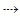
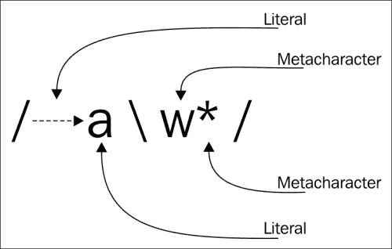
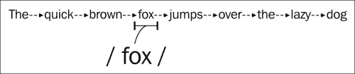
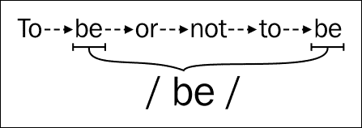
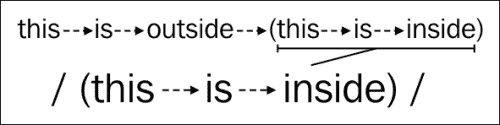
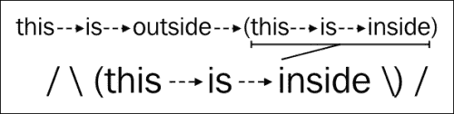
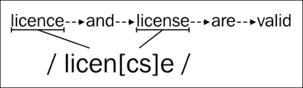
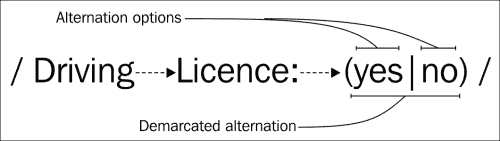
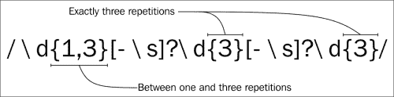
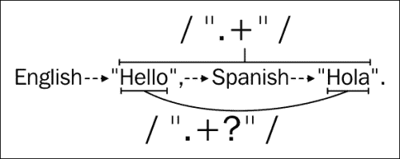

# 第一章：介绍正则表达式

正则表达式是定义文本字符串应具有的形式的文本模式。使用它们，除其他用途外，将能够执行以下活动：

+   检查输入是否符合给定的模式；例如，我们可以检查 HTML 表单中输入的值是否是有效的电子邮件地址

+   在一段文本中查找模式的出现；例如，检查文档中是否只有一个扫描中出现了单词“color”或单词“colour”

+   提取文本的特定部分；例如，提取地址的邮政编码

+   替换文本的部分；例如，将“color”或“colour”的任何出现更改为“red”

+   将较大的文本分割成较小的部分，例如，通过任何出现的句点、逗号或换行字符来分割文本

在本章中，我们将从与语言无关的角度学习正则表达式的基础知识。在本章结束时，我们将了解正则表达式的工作原理，但我们还不能在 Python 中执行正则表达式。这将在下一章中介绍。因此，本章中的示例将从理论角度而不是在 Python 中执行的角度进行讨论。

# 历史、相关性和目的

正则表达式是无处不在的。它们可以在最新的办公套件或 JavaScript 框架中找到，也可以在追溯到 70 年代的 UNIX 工具中找到。没有现代编程语言能够被称为完整，直到它支持正则表达式。

尽管它们在语言和框架中很普遍，但正则表达式在现代程序员的工具包中还不是无处不在的。经常用来解释这一点的原因之一是它们的学习曲线陡峭。如果不小心编写，正则表达式可能很难掌握，而且阅读起来非常复杂。

由于这种复杂性，不难在互联网论坛上找到这个老生常谈的话题：

|   | *"有些人面对问题时，想到的是“我知道，我会使用正则表达式。”现在他们有了两个问题。"* |   |
| --- | --- | --- |
|   | --*杰米·扎温斯基，1997* |

您可以在[`groups.google.com/forum/?hl=en#!msg/alt.religion.emacs/DR057Srw5-c/Co-2L2BKn7UJ`](https://groups.google.com/forum/?hl=en#!msg/alt.religion.emacs/DR057Srw5-c/Co-2L2BKn7UJ)找到它。

通过阅读本书，我们将学习如何在编写正则表达式时利用最佳实践，从而大大简化阅读过程。

尽管正则表达式现在可以在最新和最伟大的编程语言中找到，并且可能会在很多年内都存在，但它们的历史可以追溯到 1943 年，当时神经生理学家沃伦·麦卡洛克和沃尔特·皮茨发表了《神经活动中所固有的思想的逻辑演算》。这篇论文不仅代表了正则表达式的开始，还提出了神经网络的第一个数学模型。

下一步是在 1956 年采取的，这次是由一位数学家。斯蒂芬·克利恩写了一篇名为《神经元和有限自动机中事件的表示》的论文，在其中他创造了术语**regular sets**和**regular expressions**。

十二年后，1968 年，计算机科学的传奇先驱接受了克利恩的工作并加以扩展，将他的研究发表在《正则表达式搜索算法》一文中。这位工程师就是肯·汤普森，他以 Unix、B 编程语言、UTF-8 编码等的设计和实现而闻名。

肯·汤普森的工作不仅仅是写论文。他在他的 QED 版本中包括了对这些正则表达式的支持。要在 QED 中使用正则表达式，需要编写以下内容：

```py
g/<regular expression>/p
```

在上一行代码中，`g`表示全局搜索，`p`表示打印。如果我们不写`regular expression`，而是写短形式`re`，我们得到`g/re/p`，因此，这是古老的 UNIX 命令行工具`grep`的开端。

接下来的重要里程碑是 Henry Spence 发布了第一个非专有的**regex**库，后来是脚本语言**Perl**的创建。Perl 将正则表达式推向了主流。

Perl 中的实现向前迈进，并对原始正则表达式语法进行了许多修改，创建了所谓的**Perl 风格**。其他语言或工具中的许多后续实现都基于 Perl 风格的正则表达式。

IEEE 认为他们的 POSIX 标准试图标准化并为正则表达式语法和行为提供更好的 Unicode 支持。这被称为正则表达式的 POSIX 风格。

今天，用于正则表达式的标准 Python 模块`re`仅支持 Perl 风格的正则表达式。有人正在努力编写一个新的 regex 模块，以更好地支持 POSIX 风格，网址为[`pypi.python.org/pypi/regex`](https://pypi.python.org/pypi/regex)。这个新模块打算最终取代 Python 的`re`模块实现。在本书中，我们将学习如何利用标准的`re`模块。

### 提示

**正则表达式，regex，regexp 或 regexen？**

Henry Spencer 将他著名的库不加区分地称为"regex"或"regexp"。维基百科建议使用*regex*或*regexp*作为缩写。著名的 Jargon File 将它们列为*regexp*、regex 和 reg-ex。 

然而，尽管对于命名正则表达式似乎没有非常严格的方法，它们是基于数学领域中称为**形式语言**的领域，其中精确是一切。大多数现代实现支持无法用形式语言表达的特性，因此它们不是真正的正则表达式。Perl 语言的创建者 Larry Wall 因此使用了术语**regexes**或**regexen**。

在本书中，我们将不加区分地使用所有上述术语，就好像它们是完美的同义词一样。

# 正则表达式语法

任何有经验的开发人员无疑都使用过某种形式的正则表达式。例如，在操作系统控制台中，使用星号（`*`）或问号（`?`）来查找文件并不罕见。

问号将匹配文件名中任何值的单个字符。例如，模式`file?.xml`将匹配`file1.xml`、`file2.xml`和`file3.xml`，但不会匹配`file99.xml`，因为该模式表示以`file`开头，接着是任何值的一个字符，最后以`.xml`结尾的任何内容都将匹配。

星号（`*`）也有类似的含义。当使用星号时，任何数量的任何值的字符都被接受。在`file*.xml`的情况下，任何以`file`开头，接着是任何数量的任何值的字符，最后以`.xml`结尾的内容都将匹配。

在这个表达式中，我们可以找到两种组件：**文字**（`file`和`.xml`）和**元字符**（`?`或`*`）。我们将在本书中学习的正则表达式比我们通常在操作系统命令行中找到的简单模式更强大，但两者都可以共享一个定义：

正则表达式是由普通字符（例如，字母*a*到*z*或数字*0*到*9*）和称为元字符的特殊字符组成的文本模式。这个模式描述了应用于文本时匹配的字符串。

让我们看看我们的第一个正则表达式，它将匹配任何以`a`开头的单词：



正则表达式使用文字和元字符

### 注意

**本书中正则表达式的表示**

在本书的后续图表中，正则表达式将被`/`符号限定。这是大多数教科书中遵循的 QED 标记。然而，代码示例不会使用这种表示法。

另一方面，即使使用等宽字体，正则表达式的空格也很难计算。为了简化阅读，在图表中的每个单个空格都将显示为。

前面的正则表达式再次使用字面量和元字符。这里的字面量是和`a`，元字符是`\`和`w`，它们匹配包括下划线在内的任何字母数字字符，以及`*`，它将允许前一个字符的任意重复，因此，任意数量的任何单词字符的重复，包括下划线。

我们将在本章后面介绍元字符，但让我们先了解字面量。

## 字面量

字面量是正则表达式中最简单的模式匹配形式。只要找到该字面量，它们就会简单地成功。

如果我们将正则表达式`/fox/`应用于搜索短语`The quick brown fox jumps over the lazy dog`，我们将找到一个匹配：



使用正则表达式进行搜索

然而，如果我们将正则表达式`/be/`应用于以下短语`To be, or not to be`，我们也可以获得多个结果而不仅仅是一个：



使用正则表达式进行多个结果搜索

我们刚刚在前一节中学到，元字符可以与字面量共存在同一个表达式中。由于这种共存，我们会发现一些表达式并不是我们想要的。例如，如果我们将表达式`/(this is inside)/`应用于搜索文本`this is outside (this is inside)`，我们会发现括号没有包含在结果中。这是因为括号是元字符，它们有特殊的含义。



错误未转义的元字符

我们可以将元字符用作字面量。有三种机制可以这样做：

+   通过在元字符前加上反斜杠来转义元字符。

+   在 Python 中，使用`re.escape`方法转义可能出现在表达式中的非字母数字字符。我们将在第二章中介绍这个内容，*使用 Python 进行正则表达式*。

+   **使用\Q 和\E 进行引用**：在正则表达式中，还有第三种引用机制，即使用`\Q`和`\E`进行引用。在支持它们的语言中，只需用\Q（开始引用）和\E（结束引用）括起需要引用的部分即可。

然而，目前 Python 不支持这一点。

使用反斜杠方法，我们可以将前面的表达式转换为`/\(this is inside\)/`，并再次应用到相同的文本中，以便将括号包含在结果中：



在正则表达式中转义元字符

在正则表达式中，有十二个元字符，如果要以它们的字面意义使用，就应该转义：

+   反斜杠`\`

+   插入符号`^`

+   美元符号`$`

+   点`.`

+   管道符号`|`

+   问号`?`

+   星号`*`

+   加号`+`

+   左括号`(`

+   右括号`)`

+   左方括号`[`

+   左花括号`{`

在某些情况下，正则表达式引擎会尽力理解它们是否应该具有字面意义，即使它们没有被转义；例如，左花括号`{`只有在后面跟着一个数字表示重复时才会被视为元字符，我们将在本章后面学习到。

## 字符类

我们将首次使用元字符来学习如何利用字符类。字符类（也称为字符集）允许我们定义一个字符，如果集合中定义的任何字符存在，则匹配。

要定义字符类，我们应该使用开方括号元字符`[`，然后是任何接受的字符，最后用闭方括号`]`关闭。例如，让我们定义一个正则表达式，可以匹配英式和美式英语书写形式中的单词"license"：



使用字符类进行搜索

也可以使用字符的范围。这是通过在两个相关字符之间使用连字符（`-`）来完成的；例如，要匹配任何小写字母，我们可以使用`[a-z]`。同样，要匹配任何单个数字，我们可以定义字符集`[0-9]`。

字符类的范围可以组合在一起，以便通过将一个范围放在另一个范围后面来匹配字符对许多范围进行匹配—不需要特殊的分隔。例如，如果我们想匹配任何小写或大写字母数字字符，我们可以使用`[0-9a-zA-Z]`（有关更详细的解释，请参见下表）。这也可以使用并集机制来替代写成`[0-9[a-z[A-Z]]]`。

| 元素 | 描述 |
| --- | --- |
| **[** | 匹配以下字符集 |
| **0-9** | 匹配`0`到`9`之间的任何内容（`0`，`1`，`2`，`3`，`4`，`5`，`6`，`7`，`8`，`9`）。 |
|   | 或 |
| **a-z** | 匹配`a`到`z`之间的任何内容（`a`，`b`，`c`，`d`，...，`z`） |
|   | 或 |
| **A-Z** | 匹配`A`到`Z`之间的任何内容（`A`，`B`，`C`，`D`，...，`Z`） |
| **]** | 字符集结束 |

还有另一种可能性—范围的否定。我们可以通过在开方括号元字符（`[`）后面直接放置一个脱字符（`^`）来颠倒字符集的含义。如果我们有一个字符类，比如`[0-9]`表示任何数字，否定的字符类`[⁰-9]`将匹配任何不是数字的内容。但是，重要的是要注意，必须有一个不是数字的字符；例如，`/hello[⁰-9]/`不会匹配字符串`hello`，因为在之后必须有一个非数字字符。有一种机制可以做到这一点—称为**负向先行断言**—它将在第四章 *环视*中进行介绍。

## 预定义字符类

使用字符类一段时间后，很明显其中一些非常有用，可能值得一个快捷方式。

幸运的是，有许多预定义的字符类可以被重复使用，并且其他开发人员可能已经知道，使得使用它们的表达式更易读。

这些字符不仅作为典型字符集的众所周知的快捷方式非常有用，而且在不同的上下文中具有不同的含义。字符类`\w`，它匹配任何字母数字字符，将根据配置的区域设置和对 Unicode 的支持匹配不同的字符集。

以下表格显示了 Python 目前支持的字符类：

| 元素 | 描述（对于默认标志的正则表达式） |
| --- | --- |

|

```py
.
```

| 此元素匹配除换行符`\n`之外的任何字符 |
| --- |

|

```py
\d

```

| 这匹配任何十进制数字；这相当于类`[0-9]` |
| --- |

|

```py
\D

```

| 这匹配任何非数字字符；这相当于类`[⁰-9]` |
| --- |

|

```py
\s

```

| 这匹配任何空白字符；这相当于类`![预定义字符类\t\n\r\f\v]` |
| --- |

|

```py
\S

```

| 这匹配任何非空白字符；这相当于类`[^ \t\n\r\f\v]` |
| --- |

|

```py
\w

```

| 这匹配任何字母数字字符；这相当于类`[a-zA-Z0-9_]` |
| --- |

|

```py
\W

```

| 这匹配任何非字母数字字符；这相当于类`[^a-zA-Z0-9_]` |
| --- |

### 注意

**Python 中的 POSIX 字符类**

POSIX 标准提供了许多字符类的名称，例如，`[:alnum:]`表示字母数字字符，`[:alpha:]`表示字母字符，或`[:space:]`表示所有空白字符，包括换行符。

所有的 POSIX 字符类都遵循相同的`[:name:]`表示法，使它们易于识别。但是，它们目前在 Python 中不受支持。

如果你遇到其中一个，你可以通过利用我们在本节中学到的字符类的功能来实现相同的功能。例如，在英语环境中，ASCII 等效的`[:alnum:]`可以写成`[a-zA-Z0-9]`。

前一个表中的第一个元素——点——需要特别注意。点可能是最古老的元字符之一，也是最常用的元字符之一。点可以匹配除换行符之外的任何字符。

不匹配换行符的原因可能是 UNIX。在 UNIX 中，命令行工具通常逐行工作，并且当前可用的正则表达式是分别应用于这些行的。因此，没有换行符可匹配。

让我们通过创建一个正则表达式来实践点，该表达式匹配除换行符之外的任何值的三个字符：

```py
/…/

```

| 元素 | 描述 |
| --- | --- |
| . | 匹配任何字符 |
| . | 匹配前一个字符后面的任何字符 |
| . | 匹配前一个字符后面的任何字符 |

点是一个非常强大的元字符，如果不适度使用可能会导致问题。在大多数使用点的情况下，可以考虑使用过度（或者只是在编写正则表达式时的懒惰的表现）。

为了更好地定义预期匹配的内容，并更简洁地表达正则表达式的意图，强烈推荐使用字符类。例如，在处理 Windows 和 UNIX 文件路径时，要匹配除斜杠或反斜杠之外的任何字符，可以使用否定字符集：

```py
[^\/\]
```

| 元素 | 描述 |
| --- | --- |

|

```py
[
```

| 匹配一组字符 |
| --- |

|

```py
^
```

| 不匹配此符号后的字符 |
| --- |

|

```py
\/
```

| 匹配 `/` 字符 |
| --- |

|

```py
\
```

| 匹配 `\` 字符 |
| --- |

|

```py
]
```

| 集合的结束 |
| --- |

这个字符集明确告诉你，我们打算匹配除了 Windows 或 UNIX 文件路径分隔符之外的任何内容。

## 交替

我们刚刚学会了如何匹配一组字符中的单个字符。现在，我们将学习更广泛的方法：如何匹配一组正则表达式。这是使用管道符号`|`来实现的。

让我们从想要匹配的内容开始，如果我们找到单词 "yes" 或单词 "no"。使用交替，就会变得很简单：

```py
/yes|no/

```

| 元素 | 描述 |
| --- | --- |
|   | 匹配以下字符集中的任何一个 |

|

```py
yes
```

| 字符 `y`，`e` 和 `s`。 |
| --- |

|

```py
&#124;
```

| 或 |
| --- |

|

```py
no
```

| 字符 `n` 和 `o`。 |
| --- |

另一方面，如果我们想要接受超过两个值，我们可以继续像这样添加值到交替中：

```py
/yes|no|maybe/
```

| 元素 | 描述 |
| --- | --- |
|   | 匹配以下字符集中的任何一个 |

|

```py
yes
```

| 字面上的 "yes" |
| --- |

|

```py
&#124;
```

| 或 |
| --- |

|

```py
no
```

| 字面上的 "no" |
| --- |

|

```py
&#124;
```

| 或 |
| --- |

|

```py
maybe
```

| 字面上的 "maybe" |
| --- |

在更大的正则表达式中使用时，我们可能需要将我们的交替放在括号中，以表达只有那部分是交替的，而不是整个表达式。例如，如果我们犯了不使用括号的错误，就像下面的表达式一样：

```py
/Licence: yes|no/
```

| 元素 | 描述 |
| --- | --- |
|   | 匹配以下字符集中的任何一个 |

|

```py
Licence: yes
```

| 字符 `L`，`i`，`c`，`e`，`n`，`c`，`e`，`:`，，`y`，`e` 和 `s` |
| --- |

|

```py
&#124;
```

| 或 |
| --- |

|

```py
no
```

| 字符 `n` 和 `o`。 |
| --- |

我们可能认为我们接受`Licence: yes`或`Licence: no`，但实际上我们接受的是`Licence: yes`或`no`，因为交替已经应用于整个正则表达式，而不仅仅是`yes|no`部分。正确的方法是：



使用交替的正则表达式

## 量词

到目前为止，我们已经学会了以各种方式定义单个字符。在这一点上，我们将利用量词——定义字符、元字符或字符集如何重复的机制。 

例如，如果我们定义`\d`可以重复多次，我们可以轻松地为购物车的`商品数量`字段创建一个表单验证器（记住`\d`匹配任何十进制数字）。但让我们从头开始，三种基本的量词：问号`?`，加号`+`和星号`*`。

| 符号 | 名称 | 前一个字符的量化 |
| --- | --- | --- |

|

```py
?
```

| 问号 | 可选的（0 次或 1 次重复） |
| --- | --- |

|

```py
*
```

| 星号 | 零次或多次 |
| --- | --- |

|

```py
+
```

| 加号 | 一次或多次 |
| --- | --- |

|

```py
{n,m}
```

| 大括号 | 重复*n*到*m*次 |
| --- | --- |

在前面的表中，我们可以找到三种基本的量词，每种都有特定的用途。问号可以用来匹配单词`car`及其复数形式`cars`：

```py
/cars?/
```

| 元素 | 描述 |
| --- | --- |

|

```py
car
```

| 匹配字符`c`，`a`，`r`和`s` |
| --- |

|

```py
s?
```

| 可选地匹配字符`s` |
| --- |

### 注意

在前面的例子中，问号只应用于字符`s`，而不是整个单词。量词总是只应用于前一个标记。

使用问号量词的另一个有趣的例子是匹配电话号码，可以是`555-555-555`，`555 555 555`或`555555555`的格式。

我们现在知道如何利用字符集来接受不同的字符，但是是否可以将量词应用于字符集？是的，量词可以应用于字符、字符集，甚至是组（我们将在第三章中介绍*分组*）。我们可以构建一个这样的正则表达式来验证电话号码：

```py
/\d+[-\s]?\d+[-\s]?\d+/
```

在下表中，我们可以找到对前面的正则表达式的详细解释：

| 元素 | 类型 | 描述 |
| --- | --- | --- |

|

```py
\d
```

| 预定义字符集 | 任何十进制字符 |
| --- | --- |

|

```py
+
```

| 量词 | - 重复一次或多次 |
| --- | --- |

|

```py
[-\s]
```

| 字符集 | 连字符或空格字符 |
| --- | --- |

|

```py
?
```

| 量词 | - 可能出现也可能不出现 |
| --- | --- |

|

```py
\d
```

| 预定义字符集 | 任何十进制字符 |
| --- | --- |

|

```py
+
```

| 量词 | - 重复一次或多次 |
| --- | --- |

|

```py
[-\s]
```

| 字符集 | 连字符或空格字符 |
| --- | --- |

|

```py
\d
```

| 预定义字符集 | 任何十进制字符 |
| --- | --- |

|

```py
+
```

| 量词 | - 重复一次或多次 |
| --- | --- |

在本节的开头，提到了使用大括号的一种量词。使用这种语法，我们可以通过在其后附加`{3}`来定义前一个字符必须出现三次，也就是说，表达式`\w{8}`指定了确切的八个字母数字。

我们还可以通过提供重复的最小和最大次数来定义一定范围的重复，即，可以使用语法`{4,7}`来定义三到八次之间的重复。最小值或最大值可以省略，默认为`0`和无限。要指定最多重复三次，我们可以使用`{,3}`，我们也可以使用`{3,}`来至少重复三次。

### 提示

**可读性提示**

不要使用`{,1}`，你可以使用问号。对星号`*`使用`{0,}`，对加号`+`使用`{1,}`也是一样的。

其他开发人员会期望你这样做。如果你不遵循这个做法，任何阅读你的表达式的人都会花费一些时间来弄清楚你试图完成的是什么样的花哨东西。

这四种不同的组合显示在下表中：

| 语法 | 描述 |
| --- | --- |

|

```py
{n}
```

| 前一个字符恰好重复*n*次。 |
| --- |

|

```py
{n,}
```

| 前一个字符至少重复*n*次。 |
| --- |

|

```py
{,n}
```

| 前一个字符最多重复*n*次。 |
| --- |

|

```py
{n,m}
```

| 前一个字符重复*n*到*m*次（包括*n*和*m*）。 |
| --- |

在本章的前面，我们创建了一个正则表达式来验证电话号码，可以是`555-555-555`，`555 555 555`或`555555555`的格式。我们使用元字符加号来定义验证它的正则表达式：`/\d+[-\s]?\d+[-\s]?\d+/`。它将要求数字（`\d`）重复一次或多次。

通过定义左侧数字组最多可以包含三个字符，同时其余的数字组应该包含恰好三个数字，来微调正则表达式：



使用量词

### 贪婪和勉强量词

我们仍然没有定义如果我们将这样的量词`/" .+"/`应用到以下文本中会匹配什么：`English "Hello", Spanish "Hola"`。我们可能期望它匹配`"Hello"和"Hola"`，但实际上它将匹配`"Hello", Spanish "Hola"`。

这种行为被称为贪婪，是 Python 中量词的两种可能行为之一：**贪婪**和**非贪婪**（也称为**勉强**）。

+   量词的贪婪行为是默认应用的。贪婪量词将尝试尽可能多地匹配，以获得最大的匹配结果。

+   非贪婪行为可以通过在量词后添加一个额外的问号来请求；例如，`??`，`*?`或`+?`。标记为勉强的量词将表现得像贪婪量词的完全相反。它们会尝试获得尽可能小的匹配。

### 注意

**占有量词**

量词还有第三种行为，即占有行为。这种行为目前只受 Java 和.NET 正则表达式的支持。

它们用额外的加号符号表示量词；例如，`?+`，`*+`或`++`。这本书不会进一步涵盖占有量词。

通过查看下图，我们可以更好地理解这个量词是如何工作的。我们将几乎相同的正则表达式（除了将量词保持为贪婪或标记为勉强）应用到相同的文本上，得到两个非常不同的结果：



贪婪和勉强量词

## 边界匹配器

到目前为止，我们只是试图在文本中找到正则表达式。有时，当需要匹配整行时，我们可能还需要在行的开头或结尾匹配。这可以通过**边界匹配器**来实现。

边界匹配器是一些标识符，它们对应于输入中的特定位置。下表显示了 Python 中可用的边界匹配器：

| 匹配器 | 描述 |
| --- | --- |

|

```py
^
```

| 匹配行的开头 |
| --- |

|

```py
$
```

| 匹配行的结尾 |
| --- |

|

```py
\b
```

| 匹配单词边界 |
| --- |

|

```py
\B
```

| 匹配`\b`的相反。任何不是单词边界的东西 |
| --- |

|

```py
\A
```

| 匹配输入的开头 |
| --- |

|

```py
\Z
```

| 匹配输入的结尾 |
| --- |

这些边界匹配器在不同的上下文中会有不同的行为。例如，单词边界（`\b`）将直接取决于配置的区域设置，因为不同的语言可能有不同的单词边界，而行的开头和结尾边界将根据我们将在下一章中学习的某些标志而有不同的行为。

让我们通过编写一个正则表达式来开始使用边界匹配器，该正则表达式将匹配以“Name:”开头的行。如果您看一下前面的表格，您可能会注意到存在元字符`^`，表示行的开头。使用它，我们可以编写以下表达式：

```py
/^Name:/
```

| 元素 | 描述 |
| --- | --- |

|

```py
^
```

| 匹配行的开头 |
| --- |

|

```py
N
```

| 匹配后面的字符`N` |
| --- |

|

```py
a
```

| 匹配后面的字符`a` |
| --- |

|

```py
m
```

| 匹配后面的字符`m` |
| --- |

|

```py
e
```

| 匹配后面的字符`e` |
| --- |

|

```py
:
```

| 匹配后面的冒号符号 |
| --- |

如果我们想要更进一步，继续使用插入符和美元符号的组合来匹配行尾，我们应该考虑从现在开始我们将匹配整行，而不仅仅是在行内寻找模式。

在前面的例子中，假设我们想要确保在名字后面，直到行尾只有字母字符或空格。我们将通过匹配整行直到末尾来实现这一点，通过设置一个包含接受字符的字符集，并允许它们重复任意次数直到行尾。

```py
/^Name:[\sa-zA-Z]+$/
```

| 元素 | 描述 |
| --- | --- |

|

```py
^
```

| 匹配行的开头。 |
| --- |

|

```py
N
```

| 匹配后面的字符`N`。 |
| --- |

|

```py
a
```

| 匹配后面的字符`a`。 |
| --- |

|

```py
m
```

| 匹配后面的字符`m`。 |
| --- |

|

```py
e
```

| 匹配后面的字符`e`。 |
| --- |

|

```py
:
```

| 匹配后面的冒号符号。 |
| --- |

|

```py
[\sa-zA-Z]
```

| 然后匹配后面的空格，或任何小写或大写字母字符。 |
| --- |

|

```py
+
```

| 该字符可以重复一次或多次。 |
| --- |

|

```py
$
```

| 直到行尾。 |
| --- |

另一个出色的边界匹配器是词边界`\b`。它将匹配任何不是单词字符（在配置的语言环境中）的字符，因此，任何潜在的词边界。当我们想要处理孤立的单词，而不想用每个可能分隔我们的单词的字符集（空格、逗号、冒号、连字符等）时，这非常有用。例如，我们可以通过使用以下正则表达式来确保文本中出现单词`hello`：

```py
/\bhello\b/
```

| 元素 | 描述 |
| --- | --- |

|

```py
\b
```

| 匹配一个词边界。 |
| --- |

|

```py
h
```

| 匹配后面的字符`h`。 |
| --- |

|

```py
e
```

| 匹配后面的字符`e`。 |
| --- |

|

```py
l
```

| 匹配后面的字符`l`。 |
| --- |

|

```py
l
```

| 匹配后面的字符`l`。 |
| --- |

|

```py
o
```

| 匹配后面的字符`o`。 |
| --- |

|

```py
\b
```

| 然后匹配另一个后面的词边界。 |
| --- |

作为练习，我们可以思考为什么前面的表达式比`/hello/`更好。原因是这个表达式将匹配一个孤立的单词，而不是包含`hello`的单词，也就是说，`/hello/`很容易匹配`hello`，`helloed`或`Othello`；而`/\bhello\b/`只会匹配`hello`。

# 总结

在这第一章中，我们已经学习了正则表达式的重要性，以及它们如何成为程序员如此重要的工具。

我们还从一个非实际的角度学习了基本的正则表达式语法和一些关键特性，比如字符类和量词。

在下一章中，我们将转到 Python 开始使用`re`模块进行练习。
