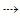

# 第五章：正则表达式的性能

到目前为止，我们担心学习如何利用一个功能或获得一个结果，而不太关心过程的速度。我们的唯一目标是正确性和可读性。

在本章中，我们将转向一个完全不同的关注点——性能。然而，我们会发现，通常性能的提高会导致可读性的降低。当我们修改某些东西以使其更快时，我们可能正在使机器更容易理解，因此，我们可能正在牺牲人类的可读性。

1974 年 12 月 4 日，著名书籍《计算机程序设计艺术》的作者唐纳德·克努斯写了一篇名为“结构化编程”的论文，其中包含了`go-to`语句。这个著名的引用摘自这篇论文：

> “程序员们浪费了大量时间思考或担心程序中非关键部分的速度，而这些对效率的努力实际上在调试和维护时产生了很大的负面影响。我们应该忘记小的效率，大约 97%的时间：过早的优化是万恶之源。然而，我们不应该放弃在关键的 3%中的机会。”

也就是说，我们应该谨慎考虑我们要优化什么。也许，对于用于验证电子邮件地址的正则表达式，我们应该更关注可读性而不是性能。另一方面，如果我们正在编写一个用于批处理大型历史文件的正则表达式，我们应该更关注性能。

最常用的优化方法是先编写，然后测量，然后优化关键的 3%。因此，在本章中，我们首先要学习如何测量和分析正则表达式，然后再进行优化技术。

# 使用 Python 对正则表达式进行基准测试

为了对我们的正则表达式进行基准测试，我们将测量正则表达式执行所需的时间。重要的是要用不同的输入来测试它们，因为对于小输入，几乎每个正则表达式都足够快。然而，对于更长的输入，情况可能完全不同，正如我们将在*回溯*部分中看到的那样。

首先，我们将创建一个小函数来帮助我们完成这个任务：

```py
>>> from time import clock as now
>>> def test(f, *args, **kargs):
        start = now()
        f(*args, **kargs)
        print "The function %s lasted: %f" %(f.__name__, now() - start)
```

因此，我们可以使用以下代码测试正则表达式：

```py
>>> def alternation(text):
       pat = re.compile('spa(in|niard)')
       pat.search(text)
>>> test(alternation, "spain")
The function alternation lasted: 0.000009
```

Python 自带了一个内置的分析器[`docs.python.org/2/library/profile.html`](http://docs.python.org/2/library/profile.html)，我们也可以用它来测量时间和调用次数等：

```py
>>> import cProfile
>>> cProfile.run("alternation('spaniard')")
```

您可以在以下截图中看到输出：


分析输出

让我们看看另一种有用的技术，当你想要查看正则表达式下的情况时，这将会有所帮助。这是我们在第二章中已经见过的东西，*使用 Python 进行正则表达式*，标志 DEBUG。回想一下，它为我们提供了有关模式如何编译的信息。例如：

```py
>>> re.compile('(\w+\d+)+-\d\d', re.DEBUG)
max_repeat 1 4294967295
  subpattern 1
    max_repeat 1 4294967295
      in
        category category_word
    max_repeat 1 4294967295
      in
        category category_digit
literal 45
in
  category category_digit
in
  category category_digit
```

在这里，我们可以看到三个`max_repeat`条件从`1`到`4294967295`，其中两个嵌套在另一个`max_repeat`中。把它们想象成嵌套循环，你可能会觉得这是一种不好的迹象。事实上，这将导致**灾难性的回溯**，这是我们稍后会看到的。

# RegexBuddy 工具

在编写正则表达式时，有许多不同的工具可用于提高生产力，其中**RegexBuddy**([`www.regexbuddy.com/`](http://www.regexbuddy.com/))由 Just Great Software Co. Ltd.开发的工具非常出色。

Just Great Software 的幕后推手是 Jan Goyvaerts，也是**Regular-Expressions.info**([`www.regular-expressions.info/`](http://www.regular-expressions.info/))的幕后人物，这是互联网上最著名的正则表达式参考之一。

使用 RegexBuddy，我们可以使用可视化界面构建、测试和调试正则表达式。调试功能几乎是独一无二的，并提供了一个很好的机制来理解正则表达式引擎在幕后的工作方式。在下面的截图中，我们可以看到 RegexBuddy 调试正则表达式的执行：


RegexBuddy 调试正则表达式

它确实具有其他功能，例如常用正则表达式库和不同编程环境的代码生成器。

尽管它有一些缺点，但它的许可证是专有的，唯一可用的构建是 Windows。然而，可以使用**wine 模拟器**在 Linux 上执行。

# 理解 Python 正则表达式引擎

`re`模块使用回溯正则表达式引擎；尽管在*Jeffrey E. F. Friedl*的著名书籍*《精通正则表达式》*中，它被归类为**非确定性有限自动机**（**NFA**）类型。此外，根据*Tim Peters*（[`mail.python.org/pipermail/tutor/2006-January/044335.html`](https://mail.python.org/pipermail/tutor/2006-January/044335.html)），该模块并非纯粹的 NFA。

这些是算法的最常见特征：

+   它支持“懒惰量词”，如`*?`、`+?`和`??`。

+   它匹配第一个匹配项，即使在字符串中有更长的匹配项。

```py
>>>re.search("engineer|engineering", "engineering").group()'engineer'
```

这也意味着顺序很重要。

+   该算法一次只跟踪一个转换，这意味着引擎一次只检查一个字符。

+   支持反向引用和捕获括号。

+   **回溯**是记住上次成功位置的能力，以便在需要时可以返回并重试

+   在最坏的情况下，复杂度是指数级的 O(*C^n*)。我们稍后会在*回溯*中看到这一点。

## 回溯

正如我们之前提到的，回溯允许返回并重复正则表达式的不同路径。它通过记住上次成功的位置来实现。这适用于交替和量词。让我们看一个例子：


回溯

正如你在上图中看到的，正则表达式引擎尝试一次匹配一个字符，直到失败，然后从下一个可以重试的路径开始重新开始。

在图中使用的正则表达式是如何构建正则表达式的重要性的完美例子。在这种情况下，表达式可以重建为`spa(in|niard)`，这样正则表达式引擎就不必返回到字符串的开头来重试第二个选择。

这导致了一种称为灾难性回溯的东西；这是回溯的一个众所周知的问题，它可能会给你带来从缓慢的正则表达式到堆栈溢出的崩溃等多种问题。

在前面的例子中，你可以看到行为不仅随着输入而增长，而且随着正则表达式中不同的路径而增长，因此算法可能是指数级的 O(*C^n*)。有了这个想法，就很容易理解为什么我们最终可能会遇到堆栈溢出的问题。当正则表达式无法匹配字符串时，问题就出现了。让我们用之前见过的技术来对正则表达式进行基准测试，以便更好地理解问题。

首先，让我们尝试一个简单的正则表达式：

```py
>>> def catastrophic(n):
        print "Testing with %d characters" %n
        pat = re.compile('(a+)+c')
text = "%s" %('a' * n)
        pat.search(text)
```

正如你所看到的，我们试图匹配的文本总是会失败，因为末尾没有`c`。让我们用不同的输入进行测试：

```py
>>> for n in range(20, 30):
        test(catastrophic, n)
Testing with 20 characters
The function catastrophic lasted: 0.130457
Testing with 21 characters
The function catastrophic lasted: 0.245125
……
The function catastrophic lasted: 14.828221
Testing with 28 characters
The function catastrophic lasted: 29.830929
Testing with 29 characters
The function catastrophic lasted: 61.110949
```

这个正则表达式的行为看起来像是二次的。但是为什么？这里发生了什么？问题在于`(a+)`是贪婪的，所以它试图尽可能多地获取`a`字符。之后，它无法匹配`c`，也就是说，它回溯到第二个`a`，并继续消耗`a`字符，直到无法匹配`c`。然后，它再次尝试整个过程（回溯），从第二个`a`字符开始。

让我们看另一个例子，这次是指数级的行为：

```py
>>> def catastrophic(n):
        print "Testing with %d characters" %n
        pat = re.compile('(x+)+(b+)+c')
        **text = 'x' * n
        **text += 'b' * n
        pat.search(text)
>>> for n in range(12, 18):
        test(catastrophic, n)
Testing with 12 characters
The function catastrophic lasted: 1.035162
Testing with 13 characters
The function catastrophic lasted: 4.084714
Testing with 14 characters
The function catastrophic lasted: 16.319145
Testing with 15 characters
The function catastrophic lasted: 65.855182
Testing with 16 characters
The function catastrophic lasted: 276.941307
```

正如你所看到的，这种行为是指数级的，可能导致灾难性的情况。最后，让我们看看当正则表达式有匹配时会发生什么：

```py
>>> def non_catastrophic(n):
        print "Testing with %d characters" %n
        pat = re.compile('(x+)+(b+)+c')
        **text = 'x' * n
        **text += 'b' * n
        **text += 'c'
        pat.search(text)
>>> for n in range(12, 18):
        test(non_catastrophic, n)
Testing with 10 characters
The function catastrophic lasted: 0.000029
……
Testing with 19 characters
The function catastrophic lasted: 0.000012
```

# 优化建议

在接下来的章节中，我们将找到一些可以应用于改进正则表达式的建议。

最好的工具始终是常识，即使在遵循这些建议时，也需要使用常识。必须理解建议何时适用，何时不适用。例如，建议“不要贪婪”并不适用于所有情况。

## 重用编译模式

我们在第二章中学到，要使用正则表达式，我们必须将其从字符串表示形式转换为编译形式，即`RegexObject`。

这种编译需要一些时间。如果我们使用模块操作的其余部分而不是使用编译函数来避免创建`RegexObject`，我们应该明白编译仍然会执行，并且一些编译的`RegexObject`会自动缓存。

然而，当我们进行编译时，缓存不会支持我们。每次编译执行都会消耗一定的时间，对于单次执行来说可能可以忽略不计，但如果执行多次则肯定是相关的。

让我们看看在以下示例中重用和不重用编译模式的区别：

```py
>>> def **dontreuse**():
        pattern = re.compile(r'\bfoo\b')
        pattern.match("foo bar")

>>> def callonethousandtimes():
        for _ in range(1000):
            dontreuse()

>>> test(callonethousandtimes)
The function callonethousandtimes lasted: 0.001965

>>> pattern = re.compile(r'\bfoo\b')
>>> def **reuse**():
        pattern.match("foo bar")

>>> def callonethousandtimes():
        for _ in range(1000):
            reuse()

>>> test(callonethousandtimes)
The function callonethousandtimes lasted: 0.000633
>>>
```

## 在交替中提取公共部分

在正则表达式中，交替总是存在性能风险。在 Python 中使用 NFA 实现时，我们应该将任何公共部分提取到交替之外。

例如，如果我们有`/(Hello``World|Hello``Continent|Hello``Country,)/`，我们可以很容易地用以下表达式提取`Hello`：`/Hello``(World|Continent|Country)/`。这将使我们的引擎只检查一次`Hello`，而不会回头重新检查每种可能性。在下面的示例中，我们可以看到执行上的差异：

```py
>>> pattern = re.compile(r'/(Hello\sWorld|Hello\sContinent|Hello\sCountry)')
>>> def **nonoptimized**():
         pattern.match("Hello\sCountry")

>>> def callonethousandtimes():
         for _ in range(1000):
             nonoptimized()

>>> test(callonethousandtimes)
The function callonethousandtimes lasted: 0.000645

>>> pattern = re.compile(r'/Hello\s(World|Continent|Country)')
>>> def **optimized**():
         pattern.match("Hello\sCountry")

>>> def callonethousandtimes():
         for _ in range(1000):
             optimized()

>>> test(callonethousandtimes)
The function callonethousandtimes lasted: 0.000543
>>>
```

## 交替的快捷方式

在交替中的顺序很重要，交替中的每个不同选项都将逐个检查，从左到右。这可以用来提高性能。

如果我们将更有可能的选项放在交替的开头，更多的检查将更早地标记交替为匹配。

例如，我们知道汽车的常见颜色是白色和黑色。如果我们要编写一个接受一些颜色的正则表达式，我们应该将白色和黑色放在前面，因为这些更有可能出现。我们可以将正则表达式写成这样`/(white|black|red|blue|green)/`。

对于其余的元素，如果它们出现的几率完全相同，将较短的放在较长的前面可能是有利的：

```py
>>> pattern = re.compile(r'(white|black|red|blue|green)')
>>> def **optimized**():
         pattern.match("white")

>>> def callonethousandtimes():
         for _ in range(1000):
             optimized()

>>> test(callonethousandtimes)
The function callonethousandtimes lasted: 0.000667
>>>

>>> pattern = re.compile(r'(green|blue|red|black|white)')
>>> def **nonoptimized**():
         pattern.match("white")

>>> def callonethousandtimes():
         for _ in range(1000):
             nonoptimized()

>>> test(callonethousandtimes)
The function callonethousandtimes lasted: 0.000862
>>>
```

## 在适当的时候使用非捕获组

捕获组将为表达式中定义的每个组消耗一些时间。这个时间并不是很重要，但如果我们多次执行正则表达式，它仍然是相关的。

有时，我们使用组，但可能对结果不感兴趣，例如在使用交替时。如果是这种情况，我们可以通过将该组标记为非捕获来节省引擎的一些执行时间，例如`(?:person|company)`。

## 具体化

当我们定义的模式非常具体时，引擎可以在实际模式匹配之前帮助我们执行快速的完整性检查。

例如，如果我们将表达式`/\w{15}/`传递给引擎，以匹配文本`hello`，引擎可能决定检查输入字符串是否实际上至少有 15 个字符长，而不是匹配表达式。

## 不要贪心

我们在第一章*介绍正则表达式*中学习了量词，并了解了贪婪和勉强量词之间的区别。我们还发现量词默认是贪婪的。

这在性能方面意味着什么？这意味着引擎将始终尝试尽可能多地捕获字符，然后逐步缩小范围，直到匹配完成。如果匹配通常很短，这可能使正则表达式变慢。然而，请记住，这仅适用于匹配通常很短的情况。

# 总结

在这最后一章中，我们开始学习优化的相关性，以及为什么我们应该避免过早的优化。然后，我们深入了解了通过学习不同的机制来测量正则表达式的执行时间。后来，我们了解了 RegexBuddy 工具，它可以帮助我们了解引擎是如何工作的，并帮助我们找出性能问题。

后来，我们了解了如何看到引擎在幕后的工作。我们学习了一些引擎设计的理论，以及如何容易陷入常见的陷阱——灾难性的回溯。

最后，我们回顾了不同的一般建议，以改善我们的正则表达式的性能。
