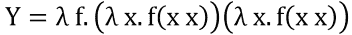
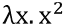
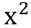
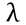
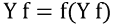
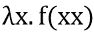
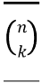

# 第四章：函数式编程-可读性与简洁性

Python 是少数（或至少是最早的）不是函数式语言的语言之一，它包含了函数式特性。虽然 Guido van Rossum 曾试图多次删除其中一些特性，但它们已经深入到 Python 社区中，`list`推导（`dict`和`set`推导很快也会跟进）在各种代码中被广泛使用。代码最重要的事情不应该是您的`reduce`语句有多酷，或者您如何能够用一个难以理解的列表推导将整个函数放入一行。可读性很重要（再次，`PEP20`）！

本章将向您展示 Python 函数式编程提供的一些很酷的技巧，并解释 Python 实现的一些限制。虽然我们会尽量避免使用λ演算（λ-演算），但会简要讨论**Y 组合子**。

最后几段将列出（并解释）`functools`和`itertools`库的用法。如果您熟悉这些库，请随意跳过它们，但请注意，这些库中的一些将在后面关于装饰器（第五章，*装饰器-通过装饰实现代码重用*）、生成器（第六章，*生成器和协程-无限，一步一步*）和性能（第十二章，*性能-跟踪和减少内存和 CPU 使用*）的章节中大量使用。

本章涵盖的主题包括：

+   函数式编程的理论

+   `list`推导

+   `dict`推导

+   `set`推导

+   `lambda`函数

+   `functools`（`partial`和`reduce`）

+   `itertools`（`accumulate`、`chain`、`dropwhile`、`starmap`等）

# 函数式编程

函数式编程是源自λ演算的一种范式。不深入λ演算（λ-演算），这大致意味着计算是通过使用数学函数来执行的，这避免了可变数据和改变周围状态的情况。严格功能语言的想法是所有函数输出仅依赖于输入，而不依赖于任何外部状态。由于 Python 并不严格是一种函数式编程语言，这并不一定成立，但遵循这种范式是一个好主意，因为混合这些可能会导致意想不到的错误，正如第二章中讨论的那样，*Pythonic Syntax, Common Pitfalls, and Style Guide*。

即使在函数式编程之外，这也是一个好主意。保持函数纯粹功能（仅依赖于给定输入）使代码更清晰，更易理解，并且更易于测试，因为依赖性更少。`math`模块中可以找到一些著名的例子。这些函数（`sin`、`cos`、`pow`、`sqrt`等）具有严格依赖于输入的输入和输出。

# 列表推导

Python 的`list`推导是将函数或过滤器应用于一系列项目的非常简单的方法。如果使用正确，`list`推导可以非常有用，但如果不小心使用，可能会非常难以阅读。

让我们立即看几个例子。`list`推导的基本前提看起来是这样的：

```py
>>> squares = [x ** 2 for x in range(10)]
>>> squares
[0, 1, 4, 9, 16, 25, 36, 49, 64, 81]

```

我们可以很容易地扩展这个过滤器：

```py
>>> uneven_squares = [x ** 2 for x in range(10) if x % 2]
>>> uneven_squares
[1, 9, 25, 49, 81]

```

语法与常规 Python for 循环非常接近，但`if`语句和自动存储结果使其在某些情况下非常有用。常规的 Python 等价物并不长，但是：

```py
>>> uneven_squares = []
>>> for x in range(10):
...     if x % 2:
...         uneven_squares.append(x ** 2)

>>> uneven_squares
[1, 9, 25, 49, 81]

```

但必须小心，由于特殊的列表推导结构，某些类型的操作并不像你期望的那样明显。这一次，我们正在寻找大于`0.5`的随机数：

```py
>>> import random
>>> [random.random() for _ in range(10) if random.random() >= 0.5]
[0.5211948104577864, 0.650010512129705, 0.021427316545174158]

```

看到最后一个数字了吗？它实际上小于`0.5`。这是因为第一个和最后一个随机调用实际上是分开的调用，并返回不同的结果。

对抗这种情况的一种方法是通过从过滤器中创建单独的列表：

```py
>>> import random
>>> numbers = [random.random() for _ in range(10)]
>>> [x for x in numbers if x >= 0.5]
[0.715510247827078, 0.8426277505519564, 0.5071133900377911]

```

显然这样可以工作，但并不是很美观。那么还有什么其他选择呢？嗯，还有一些，但可读性有点值得商榷，所以这些不是我推荐的解决方案。至少看到它们一次也是好的。

这是一个列表推导中的列表推导：

```py
>>> import random
>>> [x for x in [random.random() for _ in range(10)] if x >= 0.5]

```

这里有一个很快变成难以理解的列表推导：

```py
>>> import random
>>> [x for _ in range(10) for x in [random.random()] if x >= 0.5]

```

需要注意这些选项，因为双重列表推导实际上像嵌套的`for`循环一样工作，因此会快速生成大量结果。在这方面进行详细说明：

```py
>>> [(x, y) for x in range(3) for y in range(3, 5)]
[(0, 3), (0, 4), (1, 3), (1, 4), (2, 3), (2, 4)]

```

这实际上做了以下事情：

```py
>>> results = []
>>> for x in range(3):
...     for y in range(3, 5):
...         results.append((x, y))
...
>>> results
[(0, 3), (0, 4), (1, 3), (1, 4), (2, 3), (2, 4)]

```

这些在某些情况下可能很有用，但我建议限制它们的使用，因为它们很快就会变得难以阅读。我强烈建议不要在列表推导中使用列表推导来提高可读性。重要的是要理解发生了什么，所以让我们看一个更多的例子。以下列表推导交换了列数和行数，因此 3 x 4 矩阵变成了 4 x 3：

```py
>>> matrix = [
...     [1, 2, 3, 4],
...     [5, 6, 7, 8],
...     [9, 10, 11, 12],
... ]

>>> reshaped_matrix = [
...     [
...         [y for x in matrix for y in x][i * len(matrix) + j]
...         for j in range(len(matrix))
...     ]
...     for i in range(len(matrix[0]))
... ]

>>> import pprint
>>> pprint.pprint(reshaped_matrix, width=40)
[[1, 2, 3],
 **[4, 5, 6],
 **[7, 8, 9],
 **[10, 11, 12]]

```

即使有额外的缩进，列表推导也并不那么易读。当然，有四个嵌套循环，这是可以预料的。有些情况下，嵌套列表推导可能是合理的，但通常我不建议使用它们。

# dict 推导

`dict`推导与列表推导非常相似，但结果是一个`dict`。除此之外，唯一的真正区别是你需要返回一个键和一个值，而列表推导接受任何类型的值。以下是一个基本示例：

```py
>>> {x: x ** 2 for x in range(10)}
{0: 0, 1: 1, 2: 4, 3: 9, 4: 16, 5: 25, 6: 36, 7: 49, 8: 64, 9: 81}

>>> {x: x ** 2 for x in range(10) if x % 2}
{1: 1, 3: 9, 9: 81, 5: 25, 7: 49}

```

### 注意

由于输出是一个字典，键需要是可散列的才能使`dict`推导工作。

有趣的是你可以混合这两个，当然，这样会更加难以阅读：

```py
>>> {x ** 2: [y for y in range(x)] for x in range(5)}
{0: [], 1: [0], 4: [0, 1], 16: [0, 1, 2, 3], 9: [0, 1, 2]}

```

显然，你需要小心处理这些。如果使用正确，它们可能非常有用，但即使有适当的空格，输出也很快变得难以阅读。

# 集合推导

就像你可以使用花括号(`{}`)创建一个`set`一样，你也可以使用`set`推导来创建一个集合。它们的工作方式类似于列表推导，但值是唯一的（并且没有排序顺序）：

```py
>>> [x*y for x in range(3) for y in range(3)]
[0, 0, 0, 0, 1, 2, 0, 2, 4]

>>> {x*y for x in range(3) for y in range(3)}
{0, 1, 2, 4}

```

### 注意

与常规集合一样，`set`推导只支持可散列类型。

# lambda 函数

Python 中的`lambda`语句只是一个匿名函数。由于语法的限制，它比常规函数稍微有限，但可以通过它完成很多事情。但是，可读性很重要，所以通常最好尽可能简单。其中一个更常见的用例是`sorted`函数的`sort`关键字：

```py
>>> class Spam(object):
...     def __init__(self, value):
...         self.value = value
...
...     def __repr__(self):
...         return '<%s: %s>' % (self.__class__.__name__, self.value)
...
>>> spams = [Spam(5), Spam(2), Spam(4), Spam(1)]
>>> sorted_spams = sorted(spams, key=lambda spam: spam.value)
>>> spams
[<Spam: 5>, <Spam: 2>, <Spam: 4>, <Spam: 1>]
>>> sorted_spams
[<Spam: 1>, <Spam: 2>, <Spam: 4>, <Spam: 5>]

```

虽然在这种情况下函数可以单独编写，或者`Spam`的`__cmp__`方法可以被重写，但在许多情况下，这是一个快速获得排序函数的简单方法。

并不是说常规函数会很啰嗦，但是通过使用匿名函数，你有一个小优势；你不会用额外的函数污染你的本地范围：

```py
>>> def key_function(spam):
...     return spam.value

>>> spams = [Spam(5), Spam(2), Spam(4), Spam(1)]
>>> sorted_spams = sorted(spams, key=lambda spam: spam.value)

```

至于风格，请注意`PEP8`规定将 lambda 分配给变量是一个坏主意。逻辑上也是如此。匿名函数的概念就是这样——匿名的。如果你给它一个身份，你应该将它定义为一个普通函数。如果你想保持它简短，实际上并不会长太多。请注意，以下两个语句都被认为是不好的风格，仅用于示例目的：

```py
>>> def key(spam): return spam.value

>>> key = lambda spam: spam.value

```

在我看来，`lambda`函数的唯一有效用例是作为函数参数使用的匿名函数，最好只有在它们足够短以适合单行时。

## Y 组合子

### 注意

请注意，此段落可以轻松跳过。这主要是 lambda 语句的数学价值的一个例子。

Y 组合子可能是λ-演算中最著名的例子：



所有这些看起来非常复杂，但这也是因为它使用了 lambda 演算符号。您应该将此语法读作，，作为一个接受`x`作为输入并返回的匿名（lambda）函数。在 Python 中，这几乎可以与原始 lambda 演算符号完全相同地表达，只是用 lambda 替换，用`:`替换`.`，因此结果是 lambda `x: x²`。

通过一些代数运算，这可以简化为，或者一个接受`f`函数并将其应用于自身的函数。该函数的λ-演算表示如下：



以下是 Python 表示法：

```py
Y = lambda f: lambda *args: f(Y(f))(*args)

```

以下是较长版本：

```py
def Y(f):
    def y(*args):
        y_function = f(Y(f))
        return y_function(*args)
    return y
```

这可能对您来说仍然有点不清楚，所以让我们看一个实际使用它的例子：

```py
>>> Y = lambda f: lambda *args: f(Y(f))(*args)

>>> def factorial(combinator):
...     def _factorial(n):
...         if n:
...             return n * combinator(n - 1)
...         else:
...             return 1
...     return _factorial
>>> Y(factorial)(5)
120

```

以下是短版本，其中 Y 组合子的力量实际上出现了，具有递归但仍然匿名的函数：

```py
>>> Y = lambda f: lambda *args: f(Y(f))(*args)

>>> Y(lambda c: lambda n: n and n * c(n - 1) or 1)(5)
120

```

请注意，`n`和`n * c(n – 1)`或`1`部分是长版本函数中使用的`if`语句的简写。或者，这可以使用 Python 三元运算符来编写：

```py
>>> Y = lambda f: lambda *args: f(Y(f))(*args)

>>> Y(lambda c: lambda n: n * c(n - 1) if n else 1)(5)
120

```

您可能会想知道整个练习的重点是什么。难道你不能更短/更容易地写一个阶乘吗？是的，你可以。Y 组合子的重要性在于它可以应用于任何函数，并且非常接近数学定义。

最后一个 Y 组合子的例子将通过在几行中定义`quicksort`来给出：

```py
>>> quicksort = Y(lambda f:
...     lambda x: (
...         f([item for item in x if item < x[0]])
...         + [y for y in x if x[0] == y]
...         + f([item for item in x if item > x[0]])
...     ) if x else [])

>>> quicksort([1, 3, 5, 4, 1, 3, 2])
[1, 1, 2, 3, 3, 4, 5]

```

虽然 Y 组合子在 Python 中可能没有太多实际用途，但它确实展示了`lambda`语句的强大之处，以及 Python 与数学定义的接近程度。基本上，区别只在于表示法，而不在功能上。

# functools

除了`list/dict/set`推导，Python 还有一些（更高级）函数，在函数编程时可能非常方便。`functools`库是一组返回可调用对象的函数。其中一些函数用作装饰器（我们将在第五章中详细介绍），但我们要讨论的函数是直接用作函数，以使您的生活更轻松。

## partial-无需每次重复所有参数

`partial`函数非常方便，可以为经常使用但无法（或不想）重新定义的函数添加一些默认参数。在面向对象的代码中，通常可以解决类似这样的情况，但在过程式代码中，您经常需要重复参数。让我们以第三章中的`heapq`函数为例：

```py
>>> import heapq
>>> heap = []
>>> heapq.heappush(heap, 1)
>>> heapq.heappush(heap, 3)
>>> heapq.heappush(heap, 5)
>>> heapq.heappush(heap, 2)
>>> heapq.heappush(heap, 4)
>>> heapq.nsmallest(3, heap)
[1, 2, 3]

```

几乎所有的`heapq`函数都需要一个`heap`参数，那么为什么不为它创建一个快捷方式呢？这就是`functools.partial`的用武之地：

```py
>>> import functools
>>> import heapq
>>> heap = []
>>> push = functools.partial(heapq.heappush, heap)
>>> smallest = functools.partial(heapq.nsmallest, iterable=heap)

>>> push(1)
>>> push(3)
>>> push(5)
>>> push(2)
>>> push(4)
>>> smallest(3)
[1, 2, 3]

```

看起来更清晰了，对吧？在这种情况下，两个版本都相当简短和可读，但这是一个方便的函数。

为什么我们应该使用`partial`而不是编写一个`lambda`参数？嗯，这主要是为了方便，但它还有助于解决第二章中讨论的延迟绑定问题。此外，partial 函数可以被 pickled，而`lambda`语句不行。

## reduce-将一对组合成单个结果

`reduce`函数实现了一种称为`fold`的数学技术。它基本上将一个函数应用于第一个和第二个元素，使用该结果将第三个元素一起应用，并继续直到列表耗尽。

`reduce`函数受许多语言支持，但在大多数情况下使用不同的名称，如`curry`，`fold`，`accumulate`或`aggregate`。Python 实际上很长时间以来一直支持`reduce`，但自 Python 3 以来，它已经从全局范围移动到`functools`库。一些代码可以使用`reduce`语句进行简化；它是否可读是值得商榷的。

### 实现阶乘函数

`reduce`最常用的例子之一是计算阶乘，这确实非常简单：

```py
>>> import operator
>>> import functools
>>> functools.reduce(operator.mul, range(1, 6))
120

```

### 注意

上述代码使用`operator.mul`而不是`lambda a, b: a * b`。虽然它们产生相同的结果，但前者可能更快。

在内部，`reduce`函数将执行以下操作：

```py
>>> import operator
>>> f = operator.mul
>>> f(f(f(f(1, 2), 3), 4), 5)
120

```

为了进一步澄清这一点，让我们这样看：

```py
>>> iterable = range(1, 6)
>>> import operator

# The initial values:
>>> a, b, *iterable = iterable
>>> a, b, iterable
(1, 2, [3, 4, 5])

# First run
>>> a = operator.mul(a, b)
>>> b, *iterable = iterable
>>> a, b, iterable
(2, 3, [4, 5])

# Second run
>>> a = operator.mul(a, b)
>>> b, *iterable = iterable
>>> a, b, iterable
(6, 4, [5])

# Third run
>>> a = operator.mul(a, b)
>>> b, *iterable = iterable
>>> a, b, iterable
(24, 5, [])

# Fourth and last run
>>> a = operator.mul (a, b)
>>> a
120

```

或者使用`deque`集合的简单`while`循环：

```py
>>> import operator
>>> import collections
>>> iterable = collections.deque(range(1, 6))

>>> value = iterable.popleft()
>>> while iterable:
...     value = operator.mul(value, iterable.popleft())

>>> value
120

```

### 处理树

树是`reduce`函数真正发挥作用的一个案例。还记得在第三章中使用`defaultdict`定义树的一行代码吗？有什么好的方法可以访问该对象内部的键？给定树项目的路径，我们可以使用`reduce`轻松访问内部项目：

```py
>>> import json
>>> import functools
>>> import collections

>>> def tree():
...     return collections.defaultdict(tree)

# Build the tree:
>>> taxonomy = tree()
>>> reptilia = taxonomy['Chordata']['Vertebrata']['Reptilia']
>>> reptilia['Squamata']['Serpentes']['Pythonidae'] = [
...     'Liasis', 'Morelia', 'Python']

# The actual contents of the tree
>>> print(json.dumps(taxonomy, indent=4))
{
 **"Chordata": {
 **"Vertebrata": {
 **"Reptilia": {
 **"Squamata": {
 **"Serpentes": {
 **"Pythonidae": [
 **"Liasis",
 **"Morelia",
 **"Python"
 **]
 **}
 **}
 **}
 **}
 **}
}

# The path we wish to get
>>> path = 'Chordata.Vertebrata.Reptilia.Squamata.Serpentes'

# Split the path for easier access
>>> path = path.split('.')

# Now fetch the path using reduce to recursively fetch the items
>>> family = functools.reduce(lambda a, b: a[b], path, taxonomy)
>>> family.items()
dict_items([('Pythonidae', ['Liasis', 'Morelia', 'Python'])])

# The path we wish to get
>>> path = 'Chordata.Vertebrata.Reptilia.Squamata'.split('.')

>>> suborder = functools.reduce(lambda a, b: a[b], path, taxonomy)
>>> suborder.keys()
dict_keys(['Serpentes'])

```

最后，有些人可能会想知道为什么 Python 只有`fold_left`而没有`fold_right`。在我看来，你实际上不需要这两者，因为你可以很容易地反转操作。

常规`reduce`-`fold left`操作：

```py
fold_left = functools.reduce(
    lambda x, y: function(x, y),
    iterable,
    initializer,
)
```

反向-`fold right`操作：

```py
fold_right = functools.reduce(
    lambda x, y: function(y, x),
    reversed(iterable),
    initializer,
)
```

尽管这在纯函数式语言中绝对非常有用-这些操作经常被使用-最初计划在引入 Python 3 时从 Python 中删除`reduce`函数。幸运的是，这个计划被修改了，而不是被删除，它已经从`reduce`移动到`functools.reduce`。也许`reduce`没有太多有用的用例，但确实有一些很酷的用例。特别是使用`reduce`更容易地遍历递归数据结构，因为否则将涉及更复杂的循环或递归函数。

# itertools

`itertools`库包含受函数式语言启发的可迭代函数。所有这些都是可迭代的，并且已经以这样一种方式构建，即使是处理最大的数据集也只需要最少量的内存。虽然你可以使用一个简单的函数轻松地编写这些函数中的大多数，但我仍然建议使用`itertools`库中提供的函数。这些都很快，内存效率高，而且更重要的是经过测试。

### 注意

尽管段落的标题是大写的，但函数本身不是。小心不要意外输入`Accumulate`而不是`accumulate`。

## accumulate-带有中间结果的 reduce

`accumulate`函数与`reduce`函数非常相似，这就是为什么一些语言实际上有`accumulate`而不是`reduce`作为折叠运算符。

两者之间的主要区别在于`accumulate`函数返回即时结果。例如，在对公司销售额进行求和时，这可能很有用：

```py
>>> import operator
>>> import itertools

# Sales per month
>>> months = [10, 8, 5, 7, 12, 10, 5, 8, 15, 3, 4, 2]
>>> list(itertools.accumulate(months, operator.add))
[10, 18, 23, 30, 42, 52, 57, 65, 80, 83, 87, 89]

```

应该指出，`operator.add`函数在这种情况下实际上是可选的，因为`accumulate`的默认行为是对结果求和。在其他一些语言和库中，这个函数被称为`cumsum`（累积和）。

## chain-组合多个结果

`chain`函数是一个简单但有用的函数，它可以组合多个迭代器的结果。如果你有多个列表、迭代器等，只需用一个简单的链条组合它们：

```py
>>> import itertools
>>> a = range(3)
>>> b = range(5)
>>> list(itertools.chain(a, b))
[0, 1, 2, 0, 1, 2, 3, 4]

```

应该注意，`chain`有一个小变体，它接受一个包含可迭代对象的可迭代对象，即`chain.from_iterable`。它们的工作方式几乎相同，唯一的区别是您需要传递一个可迭代的项目，而不是传递一个参数列表。您最初的反应可能是，这可以通过简单地展开(`*args`)元组来实现，正如我们将在第六章中看到的那样，*生成器和协程 – 无限，一步一步*。然而，并非总是如此。现在，只需记住，如果您有一个包含可迭代对象的可迭代对象，最简单的方法是使用`itertools.chain.from_iterable`。

## 组合 – Python 中的组合数学

`combinations`迭代器产生的结果与您从数学定义中所期望的完全相同。从给定的项目列表中选择特定长度的所有组合：

```py
>>> import itertools
>>> list(itertools.combinations(range(3), 2))
[(0, 1), (0, 2), (1, 2)]

```

### 注意

`combinations`函数给出了给定长度的给定项目的所有可能组合。可能组合的数量由二项式系数给出，许多计算器上的`nCr`按钮。通常表示如下：



在这种情况下，我们有`n=2`和`k=4`。

这是元素重复的变体：

```py
>>> import itertools
>>> list(itertools.combinations_with_replacement(range(3), 2))
[(0, 0), (0, 1), (0, 2), (1, 1), (1, 2), (2, 2)]

```

### 注意

`combinations_with_repetitions`函数与常规的`combinations`函数非常相似，只是项目也可以与自身组合。要计算结果的数量，可以使用前面描述的二项式系数，参数为`n=n+k-1`和`k=k`。

让我们看一个使用组合和链的小组合，生成一个`powerset`：

```py
>>> import itertools

>>> def powerset(iterable):
...     return itertools.chain.from_iterable(
...         itertools.combinations(iterable, i)
...         for i in range(len(iterable) + 1))
>>> list(powerset(range(3)))
[(), (0,), (1,), (2,), (0, 1), (0, 2), (1, 2), (0, 1, 2)]

```

### 注意

`powerset`本质上是从`0`到`n`的所有组合的组合结果，这意味着它还包括具有零个项目（空集，或`()`）的元素，具有`1`个项目的元素，一直到`n`。`powerset`中的项目数量可以使用幂运算符轻松计算：`2**n`。

## permutations – 顺序很重要的组合

`permutations`函数与`combinations`函数非常相似。唯一的真正区别是`(a, b)`被认为与`(b, a)`不同。换句话说，顺序很重要：

```py
>>> import itertools
>>> list(itertools.permutations(range(3), 2))
[(0, 1), (0, 2), (1, 0), (1, 2), (2, 0), (2, 1)]

```

## compress – 使用布尔列表选择项目

`compress`函数是那种您不经常需要的函数之一，但在您需要时它可能非常有用。它对您的可迭代对象应用布尔过滤器，使其仅返回您实际需要的项目。这里最重要的一点是，它都是懒执行的，如果数据或选择器集合耗尽，`compress`将停止。因此，即使有无限范围，它也可以正常工作：

```py
>>> import itertools
>>> list(itertools.compress(range(1000), [0, 1, 1, 1, 0, 1]))
[1, 2, 3, 5]

```

## dropwhile/takewhile – 使用函数选择项目

`dropwhile`函数将删除所有结果，直到给定的谓词求值为 true。如果您正在等待设备最终返回预期结果，这可能很有用。这在这里有点难以证明，所以我只会展示一个基本用法的例子——等待大于`3`的数字：

```py
>>> import itertools
>>> list(itertools.dropwhile(lambda x: x <= 3, [1, 3, 5, 4, 2]))
[5, 4, 2]

```

正如您可能期望的，`takewhile`函数是其相反。它将简单地返回所有行，直到谓词变为 false：

```py
>>> import itertools
>>> list(itertools.takewhile(lambda x: x <= 3, [1, 3, 5, 4, 2]))
[1, 3]

```

简单地将两者相加将再次给出原始结果。

## count – 无限范围，带有小数步长

`count`函数与`range`函数非常相似，但有两个重大区别。

第一个区别是这个范围是无限的，所以甚至不要尝试`list(itertools.count())`。您肯定会立即耗尽内存，甚至可能会冻结系统。

第二个区别是，与`range`函数不同，您实际上可以在这里使用浮点数，因此不需要整数/整数。

由于列出整个范围将使我们的 Python 解释器崩溃，我们将简单地使用`zip`来限制结果并比较常规`range`函数的结果。在后面的段落中，我们将看到使用`itertools.islice`的更方便的选项。`count`函数有两个可选参数：`start`参数，默认为`0`，`step`参数，默认为`1`：

```py
>>> import itertools

# Except for being infinite, the standard version returns the same
# results as the range function does.
>>> for a, b in zip(range(3), itertools.count()):
...     a, b
(0, 0)
(1, 1)
(2, 2)

# With a different starting point the results are still the same
>>> for a, b in zip(range(5, 8), itertools.count(5)):
...     a, b
(5, 5)
(6, 6)
(7, 7)

# And a different step works the same as well
>>> for a, b in zip(range(5, 10, 2), itertools.count(5, 2)):
...     a, b
(5, 5)
(7, 7)
(9, 9)

# Unless you try to use floating point numbers
>>> range(5, 10, 0.5)
Traceback (most recent call last):
 **...
TypeError: 'float' object cannot be interpreted as an integer

# Which does work for count
>>> for a, b in zip(range(5, 10), itertools.count(5, 0.5)):
...     a, b
(5, 5)
(6, 5.5)
(7, 6.0)
(8, 6.5)
(9, 7.0)

```

`itertools.islice`函数在与`itertools.count`结合使用时也非常有用，我们将在后面的段落中看到。

## groupby - 对排序后的可迭代对象进行分组

`groupby`函数是一个非常方便的用于分组结果的函数。使用方法和用例可能很清楚，但在使用此函数时有一些重要的事项需要牢记：

+   输入需要按`group`参数进行排序。否则，它将被添加为一个单独的组。

+   结果只能使用一次。因此，在处理完一个组之后，它将不再可用。

以下是`groupby`的正确用法示例：

```py
>>> import itertools
>>> items = [('a', 1), ('a', 2), ('b', 2), ('b', 0), ('c', 3)]

>>> for group, items in itertools.groupby(items, lambda x: x[0]):
...     print('%s: %s' % (group, [v for k, v in items]))
a: [1, 2]
b: [2, 0]
c: [3]

```

然后还有一些情况可能会产生意外的结果：

```py
>>> import itertools
>>> items = [('a', 1), ('b', 0), ('b', 2), ('a', 2), ('c', 3)]
>>> groups = dict()

>>> for group, items in itertools.groupby(items, lambda x: x[0]):
...     groups[group] = items
...     print('%s: %s' % (group, [v for k, v in items]))
a: [1]
b: [0, 2]
a: [2]
c: [3]

>>> for group, items in sorted(groups.items()):
...     print('%s: %s' % (group, [v for k, v in items]))
a: []
b: []
c: []

```

现在我们看到两个包含`a`的组。所以，在尝试分组之前，请确保按分组参数进行排序。另外，第二次遍历相同的组不会产生结果。这可以很容易地通过使用`groups[group] = list(items)`来修复，但如果你不知道这一点，它可能会导致一些意外的错误。

## islice - 对任何可迭代对象进行切片

在使用`itertools`函数时，您可能会注意到无法对这些对象进行切片。这是因为它们是生成器，这是我们将在第六章中讨论的一个主题，*生成器和协程-无限，一步一次*。幸运的是，`itertools`库也有一个用于对这些对象进行切片的函数——`islice`。

让我们以之前的`itertools.counter`为例：

```py
>>> import itertools
>>> list(itertools.islice(itertools.count(), 2, 7))
[2, 3, 4, 5, 6]

```

所以，不要使用常规的`slice`：

```py
itertools.count()[:10]

```

我们将`slice`参数输入到函数中：

```py
itertools.islice(itertools.count(), 10)

```

您应该注意的不仅仅是无法对对象进行切片。不仅切片不起作用，而且也无法获取长度—至少不是不逐个计算所有项目的情况下—并且对于无限迭代器，甚至这也是不可能的。您从生成器中实际上只能获得一次理解，即您可以一次获取一个项目。您甚至事先不知道自己是否已经到达生成器的末尾。

# 总结

由于某种原因，函数式编程是一种让许多人感到恐惧的范式，但实际上不应该。在 Python 中，函数式编程和过程式编程的最重要区别是思维方式。一切都是使用简单的（通常是数学等价物的转换）函数执行，没有任何变量的存储。简单来说，函数式程序由许多具有简单输入和输出的函数组成，而不使用（甚至没有）任何外部范围或上下文来访问。Python 不是纯粹的函数式语言，因此很容易作弊并在局部范围之外工作，但这是不推荐的。

本章介绍了 Python 中函数式编程的基础知识以及其中的一些数学知识。除此之外，还介绍了一些可以通过使用函数式编程非常方便地使用的许多有用的库。

最重要的要点应该是以下内容：

+   Lambda 语句本质上并不是坏的，但最好让它们只使用局部范围的变量，并且不应超过一行。

+   函数式编程可能非常强大，但很容易变得难以阅读。必须小心。

+   `list/dict/set`推导式非常有用，但通常不应嵌套，并且为了可读性，它们也应该保持简短。

最终，这是一个偏好的问题。为了可读性，我建议在没有明显好处时限制使用功能范式。话虽如此，当正确执行时，它可以成为一种美丽的事物。

接下来是装饰器——用来包装您的函数和类的方法，以修改它们的行为并扩展它们的功能。
