# 第九章：文档 - 如何使用 Sphinx 和 reStructuredText

记录代码既有趣又有用！我承认许多程序员对记录代码有强烈的厌恶，这是可以理解的。撰写文档可能是一项枯燥的工作，传统上只有其他人才能从这一努力中获益。然而，Python 提供的工具使得生成有用且最新的文档几乎是轻而易举的。生成文档实际上变得如此容易，以至于在使用 Python 包之前，我会先创建和生成文档。假设它之前并不存在的话。

除了简单的文本文档解释函数的作用，还可以添加元数据，例如类型提示。这些类型提示可以用于使函数或类的参数和返回类型在文档中可点击。但更重要的是，许多现代 IDE 和编辑器，如 VIM，都有可用的插件，可以解析类型提示并用于智能自动补全。因此，如果您键入`Spam.eggs`，您的编辑器将自动完成 eggs 对象的特定属性和方法；这在传统上只适用于静态类型语言，如 Java、C 和 C++。

本章将解释 Python 中可用的文档类型以及如何轻松创建一套完整的文档。借助 Python 提供的惊人工具，您可以在几分钟内拥有完全运行的文档。

本章涵盖的主题如下：

+   reStructuredText 语法

+   使用 Sphinx 设置文档

+   Sphinx 风格的文档字符串

+   Google 风格的文档字符串

+   NumPy 风格的文档字符串

# reStructuredText 语法

**reStructuredText**格式（也称为**RST**、**ReST**或**reST**）于 2002 年开发，是一种简单的语言，实现了足够的标记以便使用，但又足够简单以便作为纯文本可读。这两个特点使得它足够可读以用于代码，但又足够灵活以生成漂亮且有用的文档。

reStructuredText 最棒的地方在于它非常直观。即使不了解标准的任何内容，您也可以轻松以这种风格编写文档，而不必知道它会被识别为一种语言。然而，更高级的技术，如图片和链接，确实需要一些解释。

除了 reStructuredText 之外，还有诸如**Markdown**之类的语言，它们在使用上相当相似。在 Python 社区中，reStructuredText 已经成为标准文档语言超过 10 年，因此成为了推荐的解决方案。

### 提示

要轻松在 reStructuredText 和 Markdown 等格式之间转换，请使用 Pandoc 工具，网址为[`pandoc.org/`](http://pandoc.org/)。

基本语法读起来就像文本，接下来的几段将展示一些更高级的功能。然而，让我们从一个简单的例子开始，演示 reStructuredText 文件可以有多简单。

```py
Documentation, how to use Sphinx and reStructuredText
##################################################################

Documenting code can be both fun and useful! ...

Additionally, adding ...

... So that typing `Spam.eggs.` will automatically ...

Topics covered in this chapter are as follows:

 **- The reStructuredText syntax
 **- Setting up documentation using Sphinx
 **- Sphinx style docstrings
 **- Google style docstrings
 **- NumPy style docstrings

The reStructuredText syntax
******************************************************************

The reStructuredText format (also known as ...

```

这就是将本章文本转换为 reStructuredText 的简单方法。接下来的段落将涵盖以下功能：

1.  内联标记（斜体、粗体、代码和链接）

1.  列表

1.  标题

1.  高级链接

1.  图片

1.  替换

1.  包含代码、数学和其他内容的块

## 使用 reStructuredText 快速入门

要快速将 reStructuredText 文件转换为 HTML，我们可以使用`docutils`库。本章后面讨论的`sphinx`库实际上在内部使用了`docutils`库，但具有一些我们最初不需要的额外功能。要开始，我们只需要安装`docutils`：

```py
pip install docutils

```

之后，我们可以轻松地将 reStructuredText 转换为 PDF、LaTeX、HTML 和其他格式。在本段中的示例中，我们将使用 HTML 格式，可以使用以下命令轻松生成：

```py
rst2html.py file.rst file.html

```

reStructuredText 的基本组件是角色，用于对输出进行内联修改，以及指令来生成标记块。在纯 reStructuredText 中，指令是最重要的，但在关于 Sphinx 的部分中，我们将看到角色的许多用途。

## 内联标记

**内联标记**是在正常文本行内使用的标记。这些示例包括强调、内联代码示例、链接、图像和项目列表。

例如，可以通过在一个或两个星号之间封装单词来添加强调。例如，通过在两侧添加一个星号或在两侧添加两个星号，可以为这个句子添加一点`*强调*`或很多`**强调**`。有许多不同的内联标记指令，因此我们只列出最常见的。完整列表始终可以在 reStructuredText 主页`docutils.sourceforge.net`上找到。

以下是一些例子：

+   强调（斜体）文本：`*对这个短语进行强调*`。

+   额外强调（粗体）文本：`**对这个短语进行额外强调**`。

+   对于没有数字的列表，一个简单的破折号后面跟着空格：

```py
- item 1
- item 2
```

### 注意

破折号后面的空格是 reStructuredText 识别列表所必需的。

+   对于带有数字的列表，数字后面跟着一个句点和一个空格：

```py
1\. item 1
2\. item 2
```

+   对于编号列表，数字后面的句点是必需的。

+   解释文本：这些是特定于域的。在 Python 文档中，默认角色是代码，这意味着用反引号括起来的文本将转换为使用代码标记的代码。例如，``if spam and eggs:``。

根据您的喜好，可以通过角色前缀或后缀来设置不同的角色。例如，`` :math:`E=mc²` ``可以显示数学方程式。

+   内联文字：这是用等宽字体格式化的，非常适合内联代码。只需在`` `add some code` ``后面加两个反引号。

+   引用：可以通过下划线创建引用。它们可以指向标题、链接、标签等。下一节将更多地介绍这些内容，但基本语法就是简单的`reference_`或者在引用包含空格时用反引号括起来，``some reference link`_`。

+   要转义前面的字符，可以使用反斜杠。因此，如果您希望使用强调符号，可以使用`*\**`，这与 Python 字符串中的转义非常相似。

还有许多其他可用的，但这些是您在编写 reStructuredText 时最常使用的。

## 标题

标题用于指示文档、章节、章节或段落的开始。因此，它是文档中您需要的第一个结构。虽然不是严格必需的，但强烈建议使用，因为它有几个目的：

1.  标题的格式一致地按照其级别进行格式化。

1.  Sphinx 可以从标题生成目录树。

1.  所有标题都自动作为标签，这意味着您可以创建指向它们的链接。

创建标题时，一致性是为数不多的约束之一；所使用的字符是相当任意的，级别的数量也是任意的。

就我个人而言，我默认使用一个简单的系统，带有固定大小的标题，但我建议至少在部分、章节、节、子节、子子节和段落方面遵循 Python 文档的默认设置。大致如下：

```py
Part
################################################################

Chapter
****************************************************************

Section
================================================================

Subsection
----------------------------------------------------------------

Subsubsection
^^^^^^^^^^^^^^^^^^^^^^^^^^^^^^^^^^^^^^^^^^^^^^^^^^^^^^^^^^^^^^^^

Paragraph
""""""""""""""""""""""""""""""""""""""""""""""""""""""""""""""""

Content

```

输出：

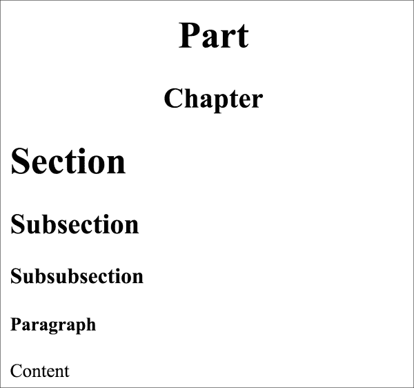

这只是标题的常见用法，但 reStructuredText 的主要思想是您可以使用几乎任何对您来说自然的东西，这意味着您可以使用以下任何字符：`= - ` : ' " ~ ^ _ * + # <>`。它还支持下划线和上划线，因此如果您喜欢，也可以选择它们：

```py
################################################################
Part
################################################################

****************************************************************
Chapter
****************************************************************

================================================================
Section
================================================================

----------------------------------------------------------------
Subsection
----------------------------------------------------------------

^^^^^^^^^^^^^^^^^^^^^^^^^^^^^^^^^^^^^^^^^^^^^^^^^^^^^^^^^^^^^^^^
Subsubsection
^^^^^^^^^^^^^^^^^^^^^^^^^^^^^^^^^^^^^^^^^^^^^^^^^^^^^^^^^^^^^^^^

""""""""""""""""""""""""""""""""""""""""""""""""""""""""""""""""
Paragraph
""""""""""""""""""""""""""""""""""""""""""""""""""""""""""""""""

Content

```

虽然我尽量保持字符数固定为 78 个字符，就像`PEP8`（第二章，*Pythonic Syntax, Common Pitfalls, and Style Guide*）为 Python 推荐的那样，但使用的字符数大多是任意的，但必须至少与标题文本一样长。这使得它可以得到以下结果：

```py
Section
=======

```

但不是这样：

```py
Section
====

```

## 列表

reStructuredText 格式有几种列表样式：

1.  枚举

1.  项目符号

1.  选项

1.  定义

最简单的列表形式已经在介绍部分显示了，但实际上可以使用许多不同的字符，如字母、罗马数字和其他字符进行枚举。在演示了基本列表类型之后，我们将继续讨论列表和结构的嵌套，使它们变得更加强大。必须注意空格的数量，因为太多的空格会导致结构被识别为普通文本而不是结构。

### 枚举列表

枚举列表对各种枚举很方便。枚举列表的基本前提是字母数字字符后跟一个句点、右括号或两侧括号。另外，`#`字符作为自动枚举。例如：

```py
1\. With
2\. Numbers

a. With
#. letters

i. Roman
#. numerals

(1) With
(2) Parenthesis

```

输出可能比你期望的简单一些。原因是它取决于输出格式。这些是使用 HTML 输出格式生成的，该格式不支持括号。例如，如果输出 LaTeX，差异就会变得明显。以下是渲染的 HTML 输出：

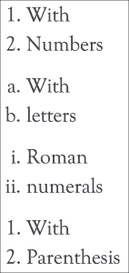

### 项目符号列表

如果列表的顺序不重要，只需要一个项目列表而不需要枚举，那么项目符号列表就是你需要的。要创建一个只使用项目符号的简单列表，项目符号需要以`*`、`+`、`-`、`•`、`‣`或`⁃`开头。这个列表大多是任意的，可以通过扩展 Sphinx 或 Docutils 进行修改。例如：

```py
- dashes
- and more dashes

* asterisk
* stars

+ plus
+ and plus

```

正如你所看到的，使用 HTML 输出时，所有项目符号看起来都是相同的。当生成 LaTeX 文档（以及随后的 PDF 或 Postscript）时，它们可能会有所不同。由于基于 Web 的文档是 Sphinx 最常见的输出格式，因此我们默认使用该输出。渲染的 HTML 输出如下：

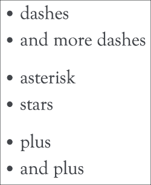

### 选项列表

`option`列表是专门用于记录程序命令行参数的。语法的特殊之处在于逗号空格被识别为选项的分隔符。

```py
-s, --spam  This is the spam option
--eggs      This is the eggs option

```

以下是输出：

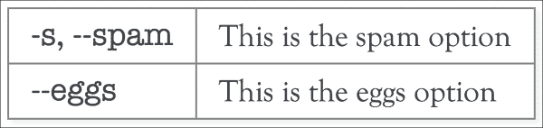

### 定义列表

定义列表比其他类型的列表更加隐晦，因为实际结构只包含空格。因此，使用起来非常简单，但在文件中并不总是容易识别。

```py
spam
 **Spam is a canned pork meat product
eggs
 **Is, similar to spam, also food

```

以下是输出：

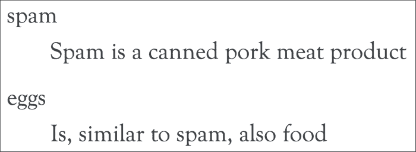

### 嵌套列表

嵌套项目实际上不仅限于列表，还可以使用多种类型的块，但思想是相同的。只需小心保持正确级别的缩进。如果不这样做，它要么不会被识别为单独的级别，要么会出错。

```py
1\. With
2\. Numbers

 **(food) food

 **spam
 **Spam is a canned pork meat product

 **eggs
 **Is, similar to spam, also food

 **(other) non-food stuff

```

以下是输出：

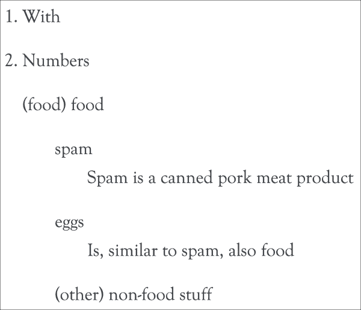

## 链接、引用和标签

reStructuredText 支持许多类型的链接，其中最简单的是带有协议的链接，例如[`python.org`](http://python.org)，大多数解析器会自动识别。但是，也可以使用前面看到的解释文本语法来自定义标签：``Python <http://python.org>`_`。

这两种都适用于不太频繁重复的简单链接，但通常更方便的是给链接附加标签，这样它们可以被重复使用，而不会过多地占据文本。

例如，请参考以下内容：

```py
The switch to reStructuredText and Sphinx was made with the
`Python 2.6 <https://docs.python.org/whatsnew/2.6.html>`_
release.

```

现在与以下内容进行比较：

```py
The switch to reStructuredText and Sphinx was made with the
`python 2.6`_ release.

.. _`Python 2.6`: https://docs.python.org/whatsnew/2.6.html

```

输出如下：


使用标签，您可以在指定位置轻松创建引用列表，而不会使实际文本变得更难阅读。这些标签不仅可以用于外部链接；类似于在旧的编程语言中找到的`GOTO`语句，您可以创建标签并从文档的其他部分引用它们：

```py
.. _label:

```

在 HTML 或 PDF 输出中，可以使用下划线链接从文本的任何位置创建可点击的链接。创建到标签的可点击链接就像在文本中有`label_`那样简单。请注意，reStructuredText 忽略大小写差异，因此大写和小写链接都可以正常工作。即使不太可能犯这个错误，在单个文档中具有相同标签但只有大小写差异的情况会导致错误，以确保不会出现重复。

与标题一起使用引用的方式非常自然；您可以像通常一样引用它们，并添加下划线使其成为链接：

```py
The introduction section
================================================================

This section contains:

- `chapter 1`_
- :ref:`chapter2`

 **1\. my_label_

 **2\. `And a label link with a custom title <my_label>`_

Chapter 1
----------------------------------------------------------------

Jumping back to the beginning of `chapter 1`_ is also possible.
Or jumping to :ref:`Chapter 2 <chapter2>`

.. _chapter2:

Chapter 2 With a longer title
----------------------------------------------------------------

The next chapter.

.. _my_label:

The label points here.

Back to `the introduction section`_

```

输出如下：

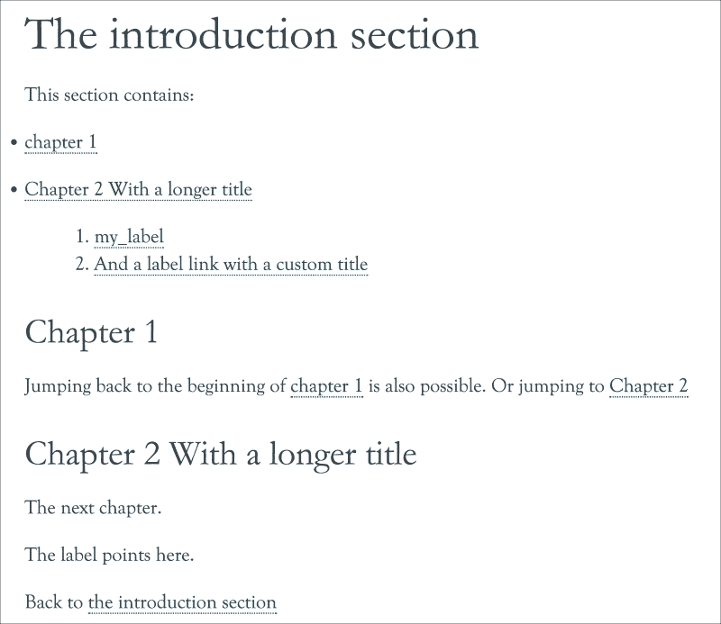

## 图像

图像指令看起来与标签语法非常相似。它们实际上有些不同，但模式非常相似。图像指令只是 reStructuredText 支持的许多指令中的一个。我们将在稍后介绍 Sphinx 和 reStructuredText 扩展时详细了解更多。目前，知道指令以两个句点开头，后跟一个空格，指令的名称和两个冒号就足够了：

```py
 **.. name_of_directive::

```

在图像的情况下，指令当然被称为`image`：

```py
.. image:: python.png

```

由于实际图像要大得多，因此输出为缩放后的图像：

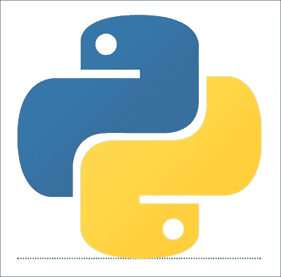

### 注意

请注意指令后面有两个冒号。

但是如何指定大小和其他属性呢？图像指令有许多其他选项（大多数其他指令也是如此）可以使用：[`docutils.sourceforge.net/docs/ref/rst/directives.html#images`](http://docutils.sourceforge.net/docs/ref/rst/directives.html#images)，它们大多数都是相当明显的。要指定图像的宽度和高度或比例（以百分比表示）：

```py
.. image:: python.png
 **:width: 150
 **:height: 100

.. image:: python.png
 **:scale: 10

```

输出如下：

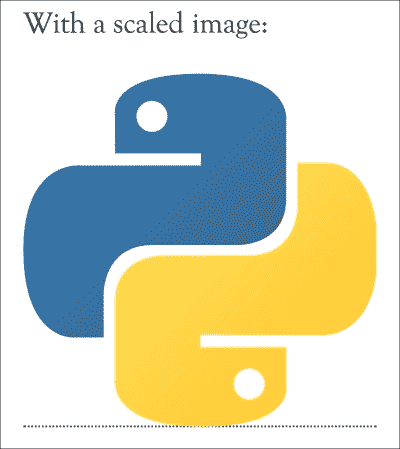

### 注意

`scale`选项如果可用则使用`width`和`height`选项，并回退到 PIL（Python Imaging Library）或 Pillow 库来检测图像。如果宽度/高度和 PIL/Pillow 都不可用，则`scale`选项将被静默忽略。

除了`image`指令之外，还有`figure`指令。不同之处在于`figure`为图像添加了标题。除此之外，使用方式与`image`相同：

```py
.. figure:: python.png
 **:scale: 10

 **The Python logo

```

输出如下：

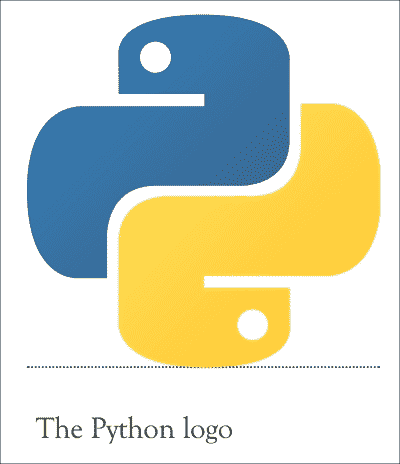

## 替换

在编写文档时，经常会发生重复使用构造的情况，链接有自己的标签系统，但在 reStructuredText 中还有更多的方法。替换定义使得缩短指令成为可能，因此它们可以轻松地被重复使用。

假设我们有一个徽标，在文本中经常使用。与其输入整个`.. image:: <url>`，使用简写会更方便。这就是替换非常有用的地方：

```py
.. |python| image:: python.png
 **:scale: 1

The Python programming language uses the logo: |python|

```

输出如下：


这些替换可以与许多指令一起使用，尽管它们特别适用于在文档的许多地方输出变量。例如：

```py
.. |author| replace:: Rick van Hattem

This book was written by |author|

```

输出如下：


## 块，代码，数学，注释和引用

在编写文档时，常见的情况是需要包含不同类型内容的块，包括数学公式的解释，代码示例等。这些指令的使用方式类似于图像指令。以下是一个代码块的示例：

```py
.. code:: python

 **def spam(*args):
 **print('spam got args', args)

```

输出如下：

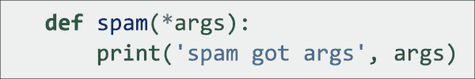

或使用 LaTeX 语法的数学，微积分基本定理：

```py
.. math::

 **\int_a^b f(x)\,dx = F(b) - F(a)

```

以下是输出：

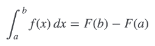

通过使用“空”指令后跟缩进轻松地对一堆文本/命令进行注释：

```py
Before comments

.. Everything here will be commented

 **And this as well
 **.. code:: python
 **def even_this_code_sample():
 **pass  # Will be commented

After comments

```

输出如下：

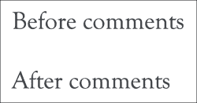

最简单的是块引用。块引用只需要简单的缩进。

```py
Normal text

 **Quoted text

```

输出如下：

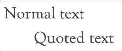

## 结论

reStructuredText 既是一个非常简单又是一个非常广泛的语言；当写纯文本注释时，大部分语法都是自然而然的。然而，所有细节的完整指南可能需要一本单独的书来填满。之前的演示应该已经足够介绍至少 90％的工作，您在记录项目时将需要。此外，Sphinx 将在接下来的部分中帮助很多。

# Sphinx 文档生成器

Sphinx 文档生成器是在 2008 年为 Python 2.6 版本创建的，以取代 Python 的旧 LaTeX 文档。它是一个几乎可以轻松生成编程项目文档的生成器，但即使在编程世界之外，它也可以轻松使用。在编程项目中，有特定支持以下领域（编程语言）：

+   Python

+   C

+   C++

+   Javascript

+   reStructuredText

除了这些语言之外，还有许多其他语言的扩展可用，例如 CoffeeScript、MATLAB、PHP、Ruby Lisp、Go 和 Scala。如果您只是寻找片段代码高亮显示，内部使用的 Pygments 高亮显示器支持超过 120 种语言，并且如果需要，可以轻松扩展为新语言。

Sphinx 的最重要优势是几乎可以从您的源代码自动生成几乎所有内容。因此，文档始终是最新的。

## 开始使用 Sphinx

首先，我们必须确保安装了 Sphinx。尽管 Python 核心文档是使用 Sphinx 编写的，但它仍然是一个单独维护的项目，必须单独安装。幸运的是，使用 pip 很容易：

```py
pip install sphinx

```

安装 Sphinx 后，有两种启动项目的方法，`sphinx-quickstart`脚本和`sphinx-apidoc`脚本。如果要创建和自定义整个 Sphinx 项目，那么`sphinx-quickstart`可能是最好的选择，因为它可以帮助您配置一个功能齐全的 Sphinx 项目。如果您只是想要现有项目的 API 文档，那么`sphinx-apidoc`可能更适合，因为它只需要一个命令和没有进一步的输入来创建项目。

最后，两者都是创建 Sphinx 项目的有效选项，我个人通常最终使用`sphinx-quickstart`生成初始配置，并在每次添加 Python 模块时调用`sphinx-apidoc`命令以添加新模块。由于`sphinx-apidoc`默认不覆盖任何文件，因此这是一个安全的操作。

### 使用 sphinx-quickstart

`sphinx-quickstart`脚本会与您互动地询问有关 Sphinx 项目中最重要的决定。但是，如果您不小心打错了字，也不用担心。大部分配置存储在`conf.py`目录中，因此稍后编辑配置仍然很容易，以防您仍然想要启用某个模块。

使用起来很容易，作为默认值，我建议使用以下设置。输出使用以下约定：

+   内联注释以`#`开头

+   用户输入行以`>`开头

+   裁剪输出用`...`表示，所有问题之间跳过的默认设置

```py
# sphinx-quickstart
Welcome to the Sphinx 1.3.3 quickstart utility.

...

Enter the root path for documentation.
> Root path for the documentation [.]: docs

...

The project name will occur in several places in the built documentation.
> Project name: Mastering Python
> Author name(s): Rick van Hattem

# As version you might want to start below 1.0 or add an extra digit
# but I would recommend leaving the default and modify the
# configuration file instead. Just make it import from the Python
# package instead. An example can be found in the numpy-stl package:
# https://github.com/WoLpH/numpy-stl/blob/develop/docs/conf.py
...
> Project version: 1.0
> Project release [1.0]:

...

# Enabling the epub builder can be useful for people using e-readers to
# read the documentation.
Sphinx can also add configuration for epub output:
> Do you want to use the epub builder (y/n) [n]: y

...
# Autodoc is required to document the code, definitely recommended to
# enable
> autodoc: automatically insert docstrings from
 **modules (y/n) [n]: y

# With the doctest feature we can run tests embedded in the
# documentation. This is meant for doctests in the .rst files.
> doctest: automatically test code snippets in
 **doctest blocks (y/n) [n]: y

# Intersphinx enables linking between Sphinx documentation sets
# allowing for links to external documentation. After enabling this
# you can make str link to the regular Python documentation about str
# for example.
> intersphinx: link between Sphinx documentation
 **of different projects (y/n) [n]: y
...
# Mathjax enables LaTeX style mathematical rendering, not strictly
# needed but very useful for rendering equations.
> mathjax: include math, rendered in the browser
 **by MathJax (y/n) [n]: y
...
> viewcode: include links to the source code of
 **documented Python objects (y/n) [n]: y

...

Creating file docs/conf.py.
Creating file docs/index.rst.
Creating file docs/Makefile.
Creating file docs/make.bat.

Finished: An initial directory structure has been created.

```

现在，您应该填充您的主文件`docs/index.rst`并创建其他文档源文件。使用 Makefile 构建文档，就像这样：

```py
 **make builder
where "builder" is one of the supported builders, e.g. html, latex or linkcheck.

```

运行后，我们应该有一个包含 Sphinx 项目的`docs`目录。让我们看看这个命令实际为我们创建了什么：

```py
# find docs
docs
docs/_build
docs/_static
docs/_templates
docs/conf.py
docs/index.rst
docs/make.bat
docs/Makefile

```

`_build`、`_static`和`_templates`目录最初是空的，现在可以忽略。`_build`目录用于输出生成的文档，而`_static`目录可用于轻松包含自定义 CSS 文件等。`_templates`目录还可以让您根据自己的喜好样式化 HTML 输出。这些示例可以在 Sphinx Git 存储库中找到：[`github.com/sphinx-doc/sphinx/tree/master/sphinx/themes`](https://github.com/sphinx-doc/sphinx/tree/master/sphinx/themes)。

`Makefile`和`make.bat`可用于生成文档输出。`Makefile`可用于支持 make 实用程序的任何操作系统，而`make.bat`则可用于直接支持 Windows 系统。现在让我们看一下`index.rst`源文件：

```py
Welcome to Mastering Python's documentation!
============================================

Contents:

.. toctree::
 **:maxdepth: 2

Indices and tables
==================

* :ref:`genindex`
* :ref:`modindex`
* :ref:`search`

```

我们看到了预期的文档标题，接着是`toctree`（目录树；本章后面会详细介绍），以及索引和搜索的链接。`toctree`会自动生成所有可用文档页面的标题树。索引和表格是自动生成的 Sphinx 页面，非常有用，但在设置方面我们不需要担心。

现在是时候生成`HTML`输出了：

```py
cd docs
make html

```

`make html`命令会为您生成文档，并将结果放在`_build/html/`中。只需在浏览器中打开`index.html`即可查看结果。您现在应该看到类似以下的内容：

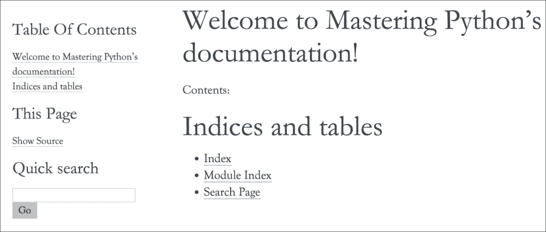

只需这一个命令，回答几个问题，我们现在有了一个包含索引、搜索和所有页面的目录的文档项目。

除了 HTML 输出之外，默认支持许多其他格式，尽管有些需要外部库才能真正工作：

```py
# make
Please use `make <target>' where <target> is one of
 **html       to make standalone HTML files
 **dirhtml    to make HTML files named index.html in directories
 **singlehtml to make a single large HTML file
 **pickle     to make pickle files
 **json       to make JSON files
 **htmlhelp   to make HTML files and a HTML help project
 **qthelp     to make HTML files and a qthelp project
 **applehelp  to make an Apple Help Book
 **devhelp    to make HTML files and a Devhelp project
 **epub       to make an epub
 **latex      to make LaTeX files, you can set PAPER=a4 or ...
 **latexpdf   to make LaTeX files and run them through pdflatex
 **latexpdfja to make LaTeX files and run them through platex/...
 **text       to make text files
 **man        to make manual pages
 **texinfo    to make Texinfo files
 **info       to make Texinfo files and run them through makeinfo
 **gettext    to make PO message catalogs
 **changes    to make an overview of all changed/added/deprecate...
 **xml        to make Docutils-native XML files
 **pseudoxml  to make pseudoxml-XML files for display purposes
 **linkcheck  to check all external links for integrity
 **doctest    to run all doctests embedded in the documentation
 **coverage   to run coverage check of the documentation

```

### 使用 sphinx-apidoc

`sphinx-apidoc`命令通常与`sphinx-quickstart`一起使用。可以使用`--full`参数生成整个项目，但通常最好使用`sphinx-quickstart`生成整个项目，然后使用`sphinx-apidoc`添加 API 文档。为了正确演示`sphinx-apidoc`命令，我们需要一些 Python 文件，因此我们将在名为`h09`的项目中创建两个文件。

第一个是`h09/spam.py`，其中包含一个名为`Spam`的类和一些方法：

```py
class Spam(object):
 **def __init__(self, arg, *args, **kwargs):
 **pass

 **def regular_method(self, arg):
 **pass

 **@classmethod
 **def decorated_method(self, arg):
 **pass

 **def _hidden_method(self):
 **pass

```

接下来是`h09/eggs.py`，其中包含一个继承`Spam`的`Eggs`类：

```py
import spam

class Eggs(spam.Spam):
 **def regular_method(self):
 **'''This regular method overrides
 **:meth:`spam.Spam.regular_method`
 **'''
 **pass

```

现在我们有了源文件，是时候生成实际的 API 文档了：

```py
# sphinx-apidoc h09 -o docs
Creating file docs/eggs.rst.
Creating file docs/spam.rst.
Creating file docs/modules.rst.

```

仅此还不足以将 API 包含在文档中。它需要添加到`toctree`中。幸运的是，只需在`index.rst`文件中的`toctree`中添加模块即可，看起来像这样：

```py
.. toctree::
 **:maxdepth: 2

 **modules

```

`toctree`指令将在本章后面更详细地讨论。

我们还必须确保可以导入模块，否则 Sphinx 将无法读取 Python 文件。为此，我们只需将`h09`目录添加到`sys.path`中；这可以放在`conf.py`文件的任何位置：

```py
import os
sys.path.insert(0, os.path.join(os.path.abspath('..'), 'h09'))

```

现在是时候再次生成文档了：

```py
cd docs
make html

```

再次打开`docs/_build/index.html`文件。为了简洁起见，文档的重复部分将从截图中省略。裁剪后的输出如下：

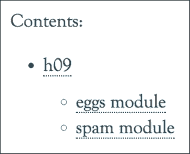

但它实际上生成了更多。运行`sphinx-apidoc`命令时，它会递归查看指定目录中的所有 Python 模块，并为每个生成一个`rst`文件。在生成所有这些单独的文件之后，它将所有这些添加到一个名为`modules.rst`的文件中，这样就可以轻松地将它们添加到您的文档中。

`modules.rst`文件非常简单明了；只是一个以包名称为标题的模块列表：

```py
h09
===

.. toctree::
 **:maxdepth: 4

 **eggs
 **spam

```

输出如下：

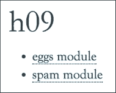

`spam.rst`和`eggs.rst`同样简单，但在定制方面更为重要。在这些文件中，它添加了`automodule`指令，该指令导入 Python 模块并列出方法。列出的方法可以进行配置，默认情况下我们已经得到了非常有用的输出：

```py
eggs module
===========

.. automodule:: eggs
 **:members:
 **:undoc-members:
 **:show-inheritance:

```

以下是输出：

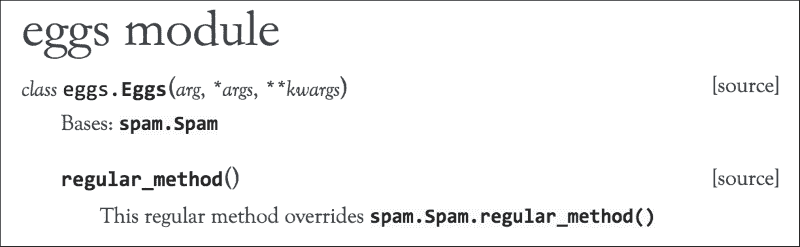

漂亮，不是吗？所有这些几乎可以毫不费力地从大多数 Python 项目中生成。这里的好处是我们添加到`Eggs.regular_method`的文档立即添加到这里，继承的基类（`spam.Spam`）是指向`spam.Spam`文档页面的可点击链接，`：func：`角色也使`spam.Spam.regular_method`立即可点击。

spam 模块的输出类似：

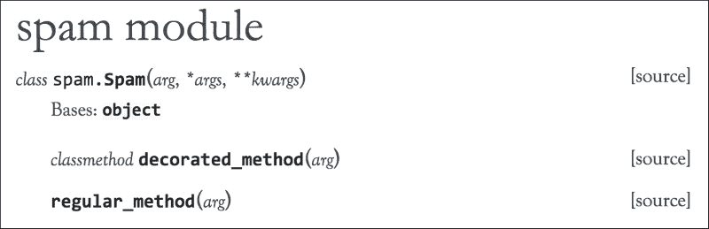

### 注意

新文件不会自动添加到您的文档中。重新运行`sphinx-apidoc`命令以添加新文件是安全的，但它不会更新您现有的文件。即使`--force`选项可以用于强制覆盖文件，我建议手动编辑现有文件。正如我们将在接下来的部分中看到的，有很多理由在生成的文件之后手动修改它们。

## Sphinx 指令

Sphinx 在 reStructuredText 的默认指令之上添加了一些指令，并提供了一个简单的 API 来添加新的指令。其中大多数通常不那么重要，但是正如人们所期望的那样，Sphinx 在需要了解更多信息时有非常好的文档。有一些非常常用的指令，我们将在下面讨论。

### 目录树指令（toctree）

这是 Sphinx 中最重要的指令之一；它生成`toctree`（目录树）。`toctree`指令有一些选项，但最重要的可能是`maxdepth`，它指定树需要多深。`toctree`的顶层必须通过手动指定要读取的文件来指定，但在此之外，文档中的每个级别（部分、章节、段落等）都可以是`toctree`中的另一级，取决于深度。即使`maxdepth`选项是可选的，但如果没有它，将显示所有可用级别，这通常超出了所需范围。在大多数情况下，`maxdepth`为 2 是一个很好的默认值，使基本示例看起来像这样：

```py
.. toctree::
 **:maxdepth: 2

```

`toctree`中的项目是同一目录中的`.rst`文件，不包括扩展名。这可以包括子目录，此时目录用`.`（句号）分隔：

```py
.. toctree::
 **:maxdepth: 2

 **module.a
 **module.b
 **module.c

```

另一个非常有用的选项是`glob`选项。它告诉`toctree`使用 Python 中的`glob`模块自动添加所有匹配模式的文档。通过简单地添加一个带有`glob`模式的目录，您可以添加该目录中的所有文件。这使得我们之前的`toctree`变得非常简单：

```py
.. toctree::
 **:maxdepth: 2
 **:glob:

 **module.*

```

如果由于某种原因文档标题不如您所希望的那样，您可以轻松地将标题更改为自定义内容：

```py
.. toctree::
 **:maxdepth: 2

 **The A module <module.a>

```

### Autodoc，记录 Python 模块、类和函数

Sphinx 最强大的功能是自动记录模块、类和函数的可能性。 `sphinx-apidoc`命令已经为我们生成了一些文件，所以让我们使用这些文件来为`Spam`和`Eggs`类扩展文档。

`sphinx-apidoc`的原始结果是：

```py
eggs module
===========

.. automodule:: eggs
 **:members:
 **:undoc-members:
 **:show-inheritance:

```

这将呈现为：

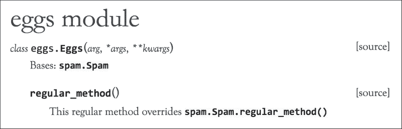

`Eggs`类目前只有一个函数。当然，我们可以轻松地点击到父类，但在许多情况下，查看类中所有可用的函数是很有用的。因此，让我们也添加从`Spam`继承的所有函数：

```py
eggs module
===========

.. automodule:: eggs
 **:members:
 **:undoc-members:
 **:show-inheritance:
 **:inherited-members:

```

输出如下：

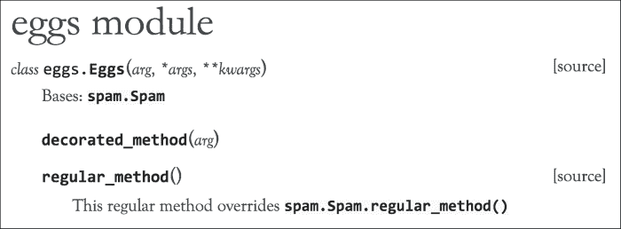

已经更有用了，但我们仍然缺少隐藏的方法。让我们也添加私有成员：

```py
eggs module
===========

.. automodule:: eggs
 **:members:
 **:undoc-members:
 **:show-inheritance:
 **:inherited-members:
 **:private-members:

```

以下是输出：

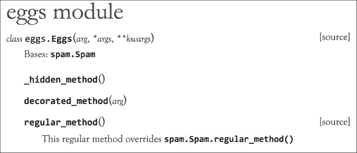

现在所有的方法都显示出来了，但`members`选项呢？如果没有`members`选项或`*-members`选项，将不再显示任何函数。

如果您想要有`Bases: ...`部分，以便可以单击到父类，`show-inheritance`是有用的。

当然，也可以手动创建类。虽然这几乎没有实际用途，但它确实展示了 Sphinx 中 Python 类的内部结构。

然而，有一个实际的情况，如果您正在动态创建类，那么`autodoc`将无法始终正确地记录文档，并且需要一些额外的帮助。然而，还有更多，虽然通常情况下并不那么有用，因为这样做相当于重复工作。在某些情况下，`autodoc`扩展无法正确识别类的成员。例如，在动态类/函数生成的情况下就是如此。对于这种情况，向模块/类/函数添加一些手动文档可能会有用：

```py
eggs module
===========

.. automodule:: eggs
 **:members:
 **:undoc-members:
 **:show-inheritance:

 **.. class:: NonExistingClass
 **This class doesn't actually exist, but it's in the documentation now.

 **.. method:: non_existing_function()

 **And this function does not exist either.

```

以下是输出：

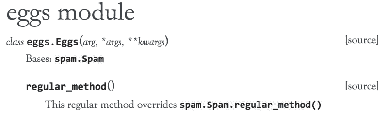

如果可能的话，我会尽量避免这种用法。Sphinx 最大的好处是它可以自动生成大部分文档。通过手动记录，您可能会产生比没有文档更糟糕的东西，即不正确的文档。这些陈述主要用于元文档；记录类可能看起来如何，而不是实际示例。

## Sphinx 角色

我们已经看到了 Sphinx 指令，它们是单独的块。现在我们将讨论 Sphinx 角色，这些角色可以在行内使用。角色允许您告诉 Sphinx 如何解析某些输入。这些角色的示例包括链接、数学、代码和标记。但最重要的是 Sphinx 领域内用于引用其他类的角色，甚至是外部项目。在 Sphinx 中，默认领域是 Python 领域，因此像`:py:meth:`这样的角色也可以使用`:meth:`。这些角色非常有用，可以链接到不同的包、模块、类、方法和其他对象。基本用法非常简单。要链接到一个类，请使用以下内容：

```py
Spam: :class:`spam.Spam`

```

输出是：


同样适用于几乎任何其他对象，函数、异常、属性等。Sphinx 文档提供了支持的对象列表：[`sphinx-doc.org/domains.html#cross-referencing-python-objects`](http://sphinx-doc.org/domains.html#cross-referencing-python-objects)。

Sphinx 的一个更好的功能是，这实际上也可以跨项目实现，通过使用`:obj:`int``可以轻松地在标准 Python 文档中添加对`int`对象的引用。在其他站点上添加对您自己项目的引用也相当简单。也许您还记得`sphinx-quickstart`脚本中的`intersphinx`问题：

```py
> intersphinx: link between Sphinx documentation
 **of different projects (y/n) [n]: y

```

这就是使外部 Sphinx 文档和您的本地文档之间的交叉引用成为可能的原因。使用`intersphinx`，您可以在项目之间添加链接，几乎不需要任何努力。`conf.py`中的标准`intersphinx_mapping`有点有限：

```py
intersphinx_mapping = {'https://docs.python.org/': None}

```

然而，它可以很容易地扩展到其他文档站点：

```py
intersphinx_mapping = {
 **'https://docs.python.org/': None,
 **'sphinx': ('http://sphinx-doc.org/', None),
}

```

现在我们可以轻松地链接到 Sphinx 主页上的文档：

```py
Link to the intersphinx module: :mod:`sphinx.ext.intersphinx`

```

以下是输出：


这将链接到[`www.sphinx-doc.org/en/stable/ext/intersphinx.html`](http://www.sphinx-doc.org/en/stable/ext/intersphinx.html)。

# 记录代码

目前，Sphinx 支持三种不同的文档样式：原始的 Sphinx 样式和较新的 NumPy 和 Google 样式。它们之间的区别主要在于样式，但实际上略有不同。

Sphinx 风格是使用一堆 reStructuredText 角色开发的，这是一种非常有效的方法，但是如果经常使用，可能会对可读性产生不利影响。你可能能够猜出以下内容的含义，但它的语法并不是最好的：

```py
:param amount: The amount of eggs to return
:type amount: int

```

Google 风格（顾名思义）是由 Google 开发的。其目标是具有简单/易读的格式，既可以作为代码内文档，又可以被 Sphinx 解析。在我看来，这更接近于 reStructuredText 的原始理念，这是一种非常接近你本能地记录文档的格式。这个例子与之前展示的 Sphinx 风格例子具有相同的含义：

```py
Args:
 **amount (int): The amount of eggs to return

```

NumPy 风格是专门为 NumPy 项目创建的。NumPy 项目有许多函数，文档量很大，通常每个参数都有很多文档。它比 Google 格式稍微冗长，但同样易于阅读：

```py
Parameters
----------
amount : int
 **The amount of eggs to return

```

### 注意

在将来，随着 Python 3.5 类型提示注释的出现，至少这些语法中的参数类型部分可能会变得无用。目前，Sphinx 还没有针对注释的特定支持，因此必须通过文档进行显式类型提示。但也许我们很快就可以使用以下内容：

```py
def eggs(amount: int):
    pass
```

## 使用 Sphinx 风格记录一个类

首先，让我们看看传统风格，即 Sphinx 风格。虽然很容易理解所有参数的含义，但有点冗长，不太易读。尽管如此，它非常清晰，绝对不是一个糟糕的风格。

```py
class Spam(object):
 **'''
 **The Spam object contains lots of spam

 **:param arg: The arg is used for ...
 **:type arg: str
 **:param `*args`: The variable arguments are used for ...
 **:param `**kwargs`: The keyword arguments are used for ...
 **:ivar arg: This is where we store arg
 **:vartype arg: str
 **'''
 **def __init__(self, arg, *args, **kwargs):
 **self.arg = arg

 **def eggs(self, amount, cooked):
 **'''We can't have spam without eggs, so here's the eggs

 **:param amount: The amount of eggs to return
 **:type amount: int
 **:param bool cooked: Should the eggs be cooked?
 **:raises: :class:`RuntimeError`: Out of eggs

 **:returns: A bunch of eggs
 **:rtype: Eggs
 **'''
 **pass

```

以下是输出：

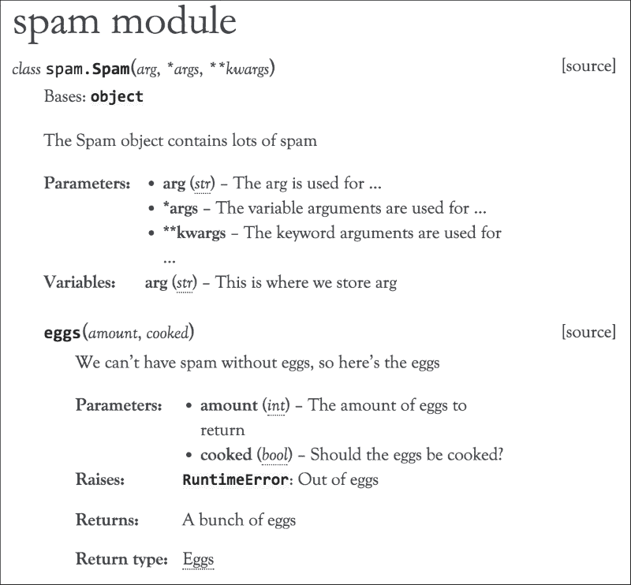

这确实是一个非常有用的输出，其中包括了文档化的函数、类和参数。更重要的是，类型也被记录下来，从而产生了指向实际类型的可点击链接。指定类型的一个额外优势是，许多编辑器都能理解文档，并将根据给定的类型提供自动补全。

为了解释这里实际发生了什么，Sphinx 在文档字符串中有一些角色，提供了我们正在记录的提示。

`param`角色与名称配对，设置了具有该名称的参数的文档。`type`角色与名称配对，告诉 Sphinx 参数的数据类型。这两个角色都是可选的，如果省略它们，参数就不会有任何额外的文档，但`param`角色对于任何文档都是必需的。只是添加`type`角色而不添加`param`角色将导致没有任何输出，因此请注意始终将它们配对使用。

`returns`角色类似于`param`角色，用于文档记录。`param`角色记录参数，`returns`角色记录返回的对象。但它们有一些不同。与`param`角色相反，`returns`角色不依赖于`rtype`角色，反之亦然。它们都可以独立工作，可以使用其中一个或两个角色。

`rtype`告诉 Sphinx（以及一些编辑器）函数返回的对象的类型。

## 使用 Google 风格记录一个类

Google 风格只是 Sphinx 风格文档的更易读版本。它实际上并不支持更多或更少，但使用起来更直观。唯一需要记住的是，这是 Sphinx 的一个相当新的特性。在旧版本中，你需要安装`sphinxcontrib-napoleon`包。如今它已经捆绑在 Sphinx 中，但仍然需要通过`conf.py`文件启用。因此，根据 Sphinx 的版本（Napoleon 是在 Sphinx 1.3 中添加的），你需要在`conf.py`的扩展列表中添加`sphinx.ext.napoleon`或`sphinxcontrib.napoleon`。

一旦你正确配置了所有内容，我们可以同时使用 Google 和 NumPy 风格。这是`Spam`类的 Google 风格版本：

```py
class Spam(object):
 **'''
 **The Spam object contains lots of spam

 **Args:
 **arg (str): The arg is used for ...
 ***args: The variable arguments are used for ...
 ****kwargs: The keyword arguments are used for ...

 **Attributes:
 **arg (str): This is where we store arg,
 **'''
 **def __init__(self, arg, *args, **kwargs):
 **self.arg = arg

 **def eggs(self, amount, cooked):
 **'''We can't have spam without eggs, so here's the eggs

 **Args:
 **amount (int): The amount of eggs to return
 **cooked (bool): Should the eggs be cooked?

 **Raises:
 **RuntimeError: Out of eggs

 **Returns:
 **Eggs: A bunch of eggs
 **'''
 **pass

```

这比 Sphinx 风格更容易阅读，并且具有相同数量的可能性。对于更长的参数文档，这并不方便。想象一下`amount`的多行描述会是什么样子。这就是为什么开发了 NumPy 风格，用于其参数的大量文档。

## 使用 NumPy 风格记录类

NumPy 风格适用于大量文档。老实说，大多数人都太懒了，所以对于大多数项目来说，这并不合适。如果您计划对函数及其所有参数进行广泛的文档记录，那么 NumPy 风格可能是一个不错的选择。它比 Google 风格更冗长，但非常易读，特别是在更详细的文档中。请记住，与 Google 风格类似，这需要 Sphinx 的 Napoleon 扩展，因此请确保您已安装了 Sphinx 1.3 或更高版本。以下是`Spam`类的 NumPy 版本：

```py
class Spam(object):
 **'''
 **The Spam object contains lots of spam

 **Parameters
 **----------
 **arg : str
 **The arg is used for ...
 ***args
 **The variable arguments are used for ...
 ****kwargs
 **The keyword arguments are used for ...

 **Attributes
 **----------
 **arg : str
 **This is where we store arg,
 **'''
 **def __init__(self, arg, *args, **kwargs):
 **self.arg = arg

 **def eggs(self, amount, cooked):
 **'''We can't have spam without eggs, so here's the eggs

 **Parameters
 **----------
 **amount : int
 **The amount of eggs to return
 **cooked : bool
 **Should the eggs be cooked?

 **Raises
 **------
 **RuntimeError
 **Out of eggs

 **Returns
 **-------
 **Eggs
 **A bunch of eggs
 **'''
 **pass

```

虽然 NumPy 风格绝对不错，但它非常冗长。仅这个例子就比其他选择长约 1.5 倍。因此，对于更长和更详细的文档，这是一个非常好的选择，但如果您计划无论如何都有简短的文档，那就使用 Google 风格吧。

## 选择哪种风格

对于大多数项目来说，Google 风格是最佳选择，因为它既易读又不太冗长。如果您计划对每个参数使用大量文档，那么 NumPy 风格也可能是一个不错的选择。

选择 Sphinx 风格的唯一原因是传统。尽管 Google 风格可能更易读，但一致性更重要。

# 总结

文档可以极大地帮助项目的受欢迎程度，而糟糕的文档可能会破坏生产力。我认为在库的几个方面中，没有比文档对第三方使用的影响更大的了。因此，在许多情况下，文档是决定项目使用的更重要因素，而不是实际的代码质量。这就是为什么始终努力提供一些文档非常重要。

使用 Sphinx 实际上很容易生成文档。只需花几分钟时间，您就可以拥有一个完全运行的网站，可用的文档，或者 PDF，ePub 或其他许多输出格式之一。现在真的没有不编写文档的借口了。即使您自己不怎么使用文档，为编辑器提供类型提示也可以大大提高生产力。让您的编辑器更智能应该总是有助于提高生产力。我本人已经在几个项目中添加了类型提示，只是为了提高我的生产力。

下一章将解释如何在 Python 中测试代码，文档的一部分将在那里返回。使用`doctest`，可以将示例代码、文档和测试合而为一。
