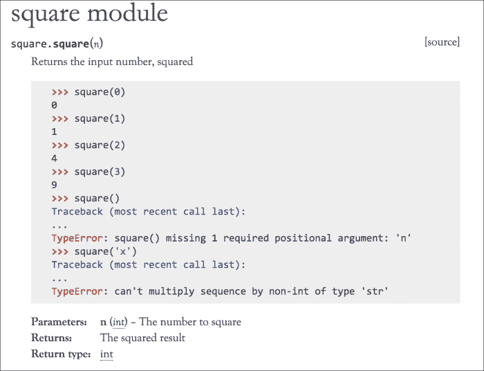
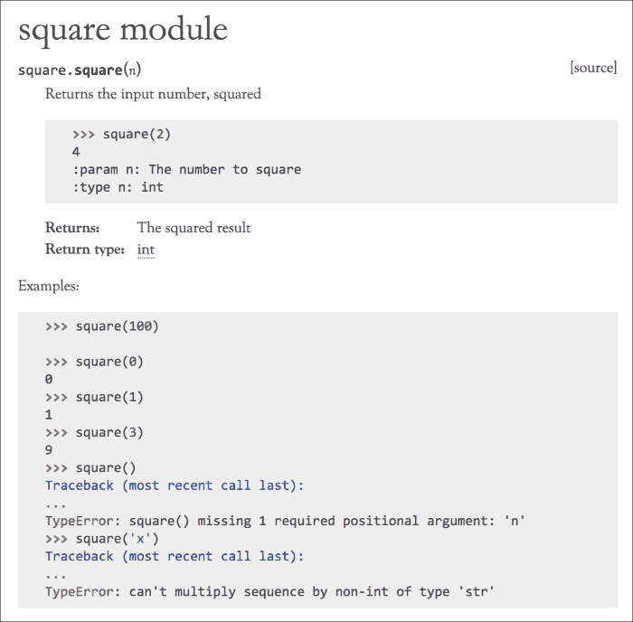
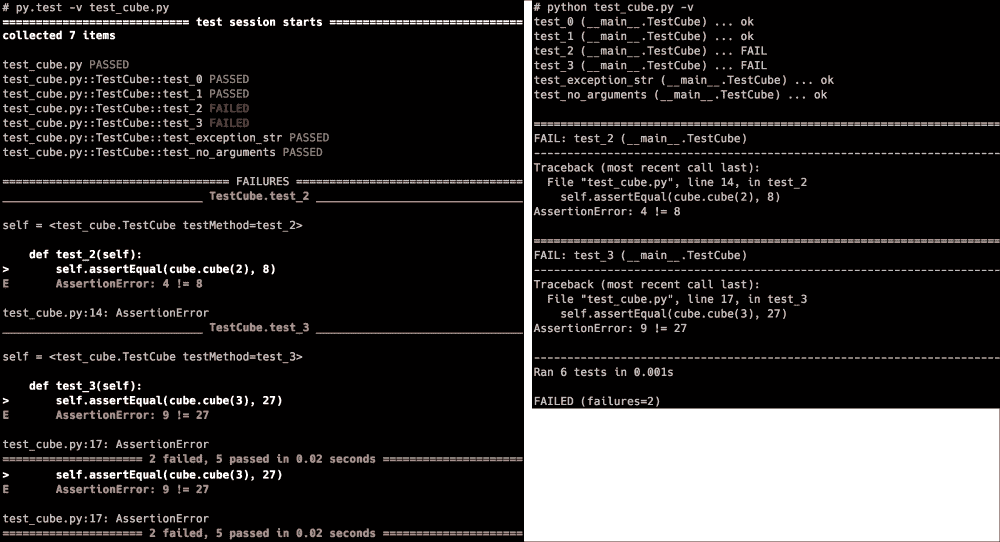
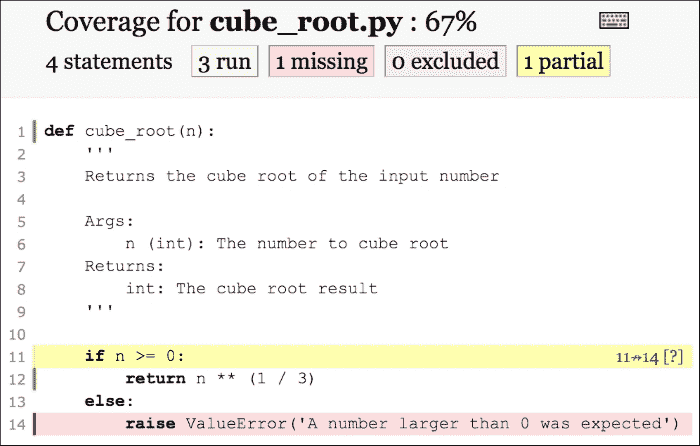
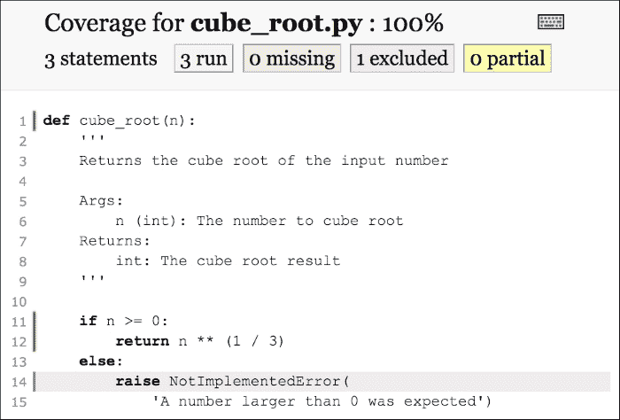

# 第十章：测试和日志 - 为错误做准备

在编程时，大多数开发人员会稍微计划一下，然后立即继续编写代码。毕竟，我们都希望写出没有错误的代码！不幸的是，我们并没有。在某个时候，一个错误的假设、一个误解，或者只是一个愚蠢的错误都是不可避免的。调试（在第十一章中讨论，*调试 - 解决错误*）总是需要的，但有几种方法可以用来预防错误，或者至少在发生错误时更容易解决它们。

为了防止错误发生，测试驱动开发或者至少是功能/回归/单元测试非常有用。标准的 Python 安装本身就提供了几个选项，比如`doctest`、`unittest`和`test`模块。`doctest`模块允许你将测试与示例文档结合起来。`unittest`模块允许你轻松编写回归测试。`test`模块仅用于内部使用，所以除非你打算修改 Python 核心，否则可能不需要这个模块。

我们将在本章讨论以下测试模块：

+   `doctest`

+   `py.test`（以及为什么它比`unittest`更方便）

+   `unittest.mock`

`py.test`模块的目的与`unittest`模块大致相同，但使用起来更加方便，并且有一些额外的选项。

在学习如何避免错误之后，现在是时候看看日志记录，以便我们可以检查程序中发生了什么以及为什么。Python 中的日志记录模块是高度可配置的，可以根据几乎任何用例进行调整。如果你曾经编写过 Java 代码，你应该对`logging`模块感到非常熟悉，因为它的设计在很大程度上基于`log4j`模块，并且在实现和命名上非常相似。后者也使得它在 Python 中有点奇怪，因为它是少数几个不遵循`pep8`命名标准的模块之一。

本章将解释以下主题：

+   使用`doctest`结合文档和测试

+   使用`py.test`和`unittest`进行回归和单元测试

+   使用`unittest.mock`使用虚假对象进行测试

+   有效使用`logging`模块

+   使用`logging`和`py.test`结合

# 使用 doctest 作为测试的示例

`doctest`模块是 Python 中最有用的模块之一。它允许你将代码文档化和测试结合起来，以确保它能够按照预期的方式继续工作。

## 一个简单的 doctest 示例

让我们从一个快速示例开始：一个对输入进行平方的函数。以下示例是一个完全功能的命令行应用程序，包含了代码和运行测试。前几个测试覆盖了函数在正常执行时应该如何行为，然后是一些测试来演示预期的错误：

```py
def square(n):
 **'''
 **Returns the input number, squared

 **>>> square(0)
 **0
 **>>> square(1)
 **1
 **>>> square(2)
 **4
 **>>> square(3)
 **9
 **>>> square()
 **Traceback (most recent call last):
 **...
 **TypeError: square() missing 1 required positional argument: 'n'
 **>>> square('x')
 **Traceback (most recent call last):
 **...
 **TypeError: can't multiply sequence by non-int of type 'str'

 **Args:
 **n (int): The number to square

 **Returns:
 **int: The squared result
 **'''
 **return n * n

if __name__ == '__main__':
 **import doctest
 **doctest.testmod()

```

它可以像任何 Python 脚本一样执行，但是常规命令不会产生任何输出，因为所有测试都成功了。幸运的是，`doctest.testmod`函数接受冗长参数：

```py
# python square.py -v
Trying:
 **square(0)
Expecting:
 **0
ok
Trying:
 **square(1)
Expecting:
 **1
ok
Trying:
 **square(2)
Expecting:
 **4
ok
Trying:
 **square(3)
Expecting:
 **9
ok
Trying:
 **square()
Expecting:
 **Traceback (most recent call last):
 **...
 **TypeError: square() missing 1 required positional argument: 'n'
ok
Trying:
 **square('x')
Expecting:
 **Traceback (most recent call last):
 **...
 **TypeError: can't multiply sequence by non-int of type 'str'
ok
1 items had no tests:
 **__main__
1 items passed all tests:
 **6 tests in __main__.square
6 tests in 2 items.
6 passed and 0 failed.
Test passed.

```

此外，由于它使用了 Google 语法（如第九章中讨论的，*文档 - 如何使用 Sphinx 和 reStructuredText*，文档章节），我们可以使用 Sphinx 生成漂亮的文档：



然而，代码并不总是正确的。如果我们修改代码，使得测试不再通过，会发生什么？

这次，我们使用`n ** 2`而不是`n * n`。两者都是对一个数字求平方，对吧？所以结果必须是相同的。对吧？这些是导致错误的假设类型，也是通过一些基本测试轻松捕捉到的假设类型：

```py
def square(n):
 **'''
 **Returns the input number, squared

 **>>> square(0)
 **0
 **>>> square(1)
 **1
 **>>> square(2)
 **4
 **>>> square(3)
 **9
 **>>> square()
 **Traceback (most recent call last):
 **...
 **TypeError: square() missing 1 required positional argument: 'n'
 **>>> square('x')
 **Traceback (most recent call last):
 **...
 **TypeError: can't multiply sequence by non-int of type 'str'

 **Args:
 **n (int): The number to square

 **Returns:
 **int: The squared result
 **'''
 **return n ** 2

if __name__ == '__main__':
 **import doctest
 **doctest.testmod()

```

让我们再次执行测试，看看这次会发生什么。为简洁起见，这次我们将跳过冗长标志：

```py
# python square.py
**********************************************************************
File "square.py", line 17, in __main__.square
Failed example:
 **square('x')
Expected:
 **Traceback (most recent call last):
 **...
 **TypeError: can't multiply sequence by non-int of type 'str'
Got:
 **Traceback (most recent call last):
 **File "doctest.py", line 1320, in __run
 **compileflags, 1), test.globs)
 **File "<doctest __main__.square[5]>", line 1, in <module>
 **square('x')
 **File "square.py", line 28, in square
 **return n ** 2
 **TypeError: unsupported operand type(s) for ** or pow(): 'str' and 'int'
**********************************************************************
1 items had failures:
 **1 of   6 in __main__.square
***Test Failed*** 1 failures.

```

我们对代码进行的唯一修改是用`n ** 2`替换了`n * n`，这相当于幂函数。由于乘法与取幂的操作不同，结果略有不同，但在实践中足够相似，以至于大多数程序员不会注意到这种差异。

代码更改导致的唯一区别是我们现在有了一个不同的异常——一个无辜的错误，在这种情况下只是破坏了测试。但它显示了这些测试是多么有用。在重写代码时，很容易做出错误的假设，这就是测试最有用的地方——知道您在破坏代码的同时破坏了它，而不是在几个月后发现。

## 编写 doctest

也许你已经注意到前面的示例中，语法与常规 Python 控制台非常相似，这正是重点所在。`doctest`输入只不过是常规 Python shell 会话的输出。这就是使用此模块进行测试如此直观的原因；只需在 Python 控制台中编写代码，然后将输出复制到文档字符串中进行测试。这里有一个例子：

```py
# python
>>> from square import square
>>> square(5)
25
>>> square()
Traceback (most recent call last):
 **File "<stdin>", line 1, in <module>
TypeError: square() missing 1 required positional argument: 'n'

```

这可能是测试代码的最简单方式。几乎不费吹灰之力，您就可以检查代码是否按您的预期工作，添加测试并同时添加文档。只需将解释器的输出复制到函数或类文档中，您就有了可用的 doctest。

## 使用纯文档进行测试

函数、类和模块中的文档字符串通常是向代码添加 doctest 的最明显方式，但并非唯一的方式。正如我们在上一章中讨论的，Sphinx 文档也支持`doctest`模块。您可能还记得，在创建 Sphinx 项目时，我们启用了`doctest`模块：

```py
> doctest: automatically test code snippets in doctest blocks (y/n) [n]:y

```

此标志在 Sphinx 中启用了`sphinx.ext.doctest`扩展，告诉 Sphinx 也要运行这些测试。由于代码中并非所有示例都有用，让我们看看是否可以将它们分为实际有用和仅与文档相关的示例。此外，为了查看结果，我们将在文档中添加一个错误：

**square.py**

```py
def square(n):
 **'''
 **Returns the input number, squared

 **>>> square(2)
 **4

 **Args:
 **n (int): The number to square

 **Returns:
 **int: The squared result
 **'''
 **return n * n

if __name__ == '__main__':
 **import doctest
 **doctest.testmod()

```

**square.rst**

```py
square module
=============

.. automodule:: square
 **:members:
 **:undoc-members:
 **:show-inheritance:

Examples:

.. testsetup::

 **from square import square

.. doctest::

 **>>> square(100)

 **>>> square(0)
 **0
 **>>> square(1)
 **1
 **>>> square(3)
 **9
 **>>> square()
 **Traceback (most recent call last):
 **...
 **TypeError: square() missing 1 required positional argument: 'n'
 **>>> square('x')
 **Traceback (most recent call last):
 **...
 **TypeError: can't multiply sequence by non-int of type 'str'

```

现在，是时候执行测试了。对于 Sphinx，有一个特定的命令：

```py
# make doctest
sphinx-build -b doctest -d _build/doctrees . _build/doctest
Running Sphinx v1.3.3
loading translations [en]... done
loading pickled environment... done
building [mo]: targets for 0 po files that are out of date
building [doctest]: targets for 3 source files that are out of date
updating environment: 0 added, 0 changed, 0 removed
looking for now-outdated files... none found
running tests...

Document: square
----------------
**********************************************************************
File "square.rst", line 16, in default
Failed example:
 **square(100)
Expected nothing
Got:
 **10000
**********************************************************************
1 items had failures:
 **1 of   7 in default
7 tests in 1 items.
6 passed and 1 failed.
***Test Failed*** 1 failures.

Doctest summary
===============
 **7 tests
 **1 failure in tests
 **0 failures in setup code
 **0 failures in cleanup code
build finished with problems.
make: *** [doctest] Error 1

```

正如预期的那样，对于不完整的`doctest`，我们得到了一个错误，但除此之外，所有测试都执行正确。为了确保测试知道`square`是什么，我们必须添加`testsetup`指令，这仍然生成了一个漂亮的输出：



## doctest 标志

`doctest`模块具有几个选项标志。它们影响`doctest`处理测试的方式。这些选项标志可以通过测试套件全局传递，通过运行测试时的命令行参数传递，以及通过内联命令传递。对于本书，我已经通过`pytest.ini`文件全局启用了以下选项标志（我们将在本章后面更多地介绍`py.test`）：

```py
doctest_optionflags = ELLIPSIS NORMALIZE_WHITESPACE

```

如果没有这些选项标志，本书中的一些示例将无法正常运行。这是因为它们必须进行重新格式化以适应。接下来的几段将介绍以下选项标志：

+   `DONT_ACCEPT_TRUE_FOR_1`

+   `NORMALIZE_WHITESPACE`

+   `ELLIPSIS`

还有其他几个选项标志可供选择，具有不同程度的有用性，但最好留给 Python 文档：

[`docs.python.org/3/library/doctest.html#option-flags`](https://docs.python.org/3/library/doctest.html#option-flags)

### True 和 False 与 1 和 0 的区别

将 True 评估为 1，False 评估为 0，在大多数情况下是有用的，但可能会产生意想不到的结果。为了演示差异，我们有以下几行：

```py
'''
>>> False
0
>>> True
1
>>> False  # doctest: +DONT_ACCEPT_TRUE_FOR_1
0
>>> True  # doctest: +DONT_ACCEPT_TRUE_FOR_1
1
'''

if __name__ == '__main__':
 **import doctest
 **doctest.testmod()

```

这是`DONT_ACCEPT_TRUE_FOR_1`标志的结果：

```py
# python test.py
**********************************************************************
File "test.py", line 6, in __main__
Failed example:
 **False  # doctest: +DONT_ACCEPT_TRUE_FOR_1
Expected:
 **0
Got:
 **False
**********************************************************************
File "test.py", line 8, in __main__
Failed example:
 **True  # doctest: +DONT_ACCEPT_TRUE_FOR_1
Expected:
 **1
Got:
 **True
**********************************************************************
1 items had failures:
 **2 of   4 in __main__
***Test Failed*** 2 failures.

```

正如您所看到的，`DONT_ACCEPT_TRUE_FOR_1`标志使`doctest`拒绝`1`作为`True`的有效响应，以及`0`作为`False`的有效响应。

### 标准化空白

由于 doctest 用于文档和测试目的，因此保持可读性几乎是必需的。但是，如果不规范化空格，这可能有些棘手。考虑以下示例：

```py
>>> [list(range(5)) for i in range(5)]
[[0, 1, 2, 3, 4], [0, 1, 2, 3, 4], [0, 1, 2, 3, 4], [0, 1, 2, 3, 4], [0, 1, 2, 3, 4]]

```

虽然并不是很糟糕，但这种输出对于可读性并不是最佳的。通过规范化空格，我们可以做到这一点：

```py
>>> [list(range(5)) for i in range(5)]  # doctest: +NORMALIZE_WHITESPACE
[[0, 1, 2, 3, 4],
 **[0, 1, 2, 3, 4],
 **[0, 1, 2, 3, 4],
 **[0, 1, 2, 3, 4],
 **[0, 1, 2, 3, 4]]

```

以这种方式格式化输出既更易读，又方便保持行长度较短。

### 省略号

`ELLIPSIS`标志非常有用，但也有点危险，因为它很容易导致不正确的匹配。它使`...`匹配任何子字符串，在异常情况下非常有用，但在其他情况下危险：

```py
>>> {10: 'a', 20: 'b'}  # doctest: +ELLIPSIS
{...}
>>> [True, 1, 'a']  # doctest: +ELLIPSIS
[...]
>>> True,  # doctest: +ELLIPSIS
(...)
>>> [1, 2, 3, 4]  # doctest: +ELLIPSIS
[1, ..., 4]
>>> [1, 0, 0, 0, 0, 0, 4]  # doctest: +ELLIPSIS
[1, ..., 4]

```

这些情况在实际场景中并不太有用，但它们演示了`ELLIPSIS`选项标志的功能。它们也指出了危险。`[1, 2, 3, 4]`和`[1, 0, ... , 4]`都匹配`[1, ..., 4]`测试，这可能是无意的，因此在使用`ELLIPSIS`时要非常小心。

在记录类实例时更有用：

```py
>>> class Spam(object):
...     pass
>>> Spam()  # doctest: +ELLIPSIS
<__main__.Spam object at 0x...>

```

如果没有`ELLIPSIS`标志，内存地址（`0x...`部分）永远不会是您期望的。让我们在正常的 CPython 实例中演示一个实际运行：

```py
Failed example:
 **Spam()
Expected:
 **<__main__.Spam object at 0x...>
Got:
 **<__main__.Spam object at 0x10d9ad160>

```

## Doctest 怪癖

前面讨论的三个选项标志解决了 doctest 中发现的许多怪癖，但还有几种情况需要注意。在这些情况下，您只需要稍微小心，并解决`doctest`模块的限制。`doctest`模块有效地使用表示字符串，而这些表示字符串并不总是一致的。

最重要的情况是浮点不准确性、字典和随机值，例如计时器。以下示例大多数情况下会失败，因为 Python 中的某些类型没有一致的排序，并且取决于外部变量：

```py
>>> dict.fromkeys('spam')
{'s': None, 'p': None, 'a': None, 'm': None}
>>> 1./7.
0.14285714285714285

>>> import time
>>> time.time() - time.time()
-9.5367431640625e-07

```

所有问题都有几种可能的解决方案，主要在风格和个人偏好上有所不同。

### 测试字典

字典的问题在于它们在内部实现为哈希表，导致有效的随机表示顺序。由于`doctest`系统要求表示字符串在含义上与`docstring`相同（当然除了某些`doctest`标志之外），这是行不通的。当然，有几种可用的解决方法，都有一些优点和缺点。

第一个是使用`pprint`库以漂亮的方式格式化它：

```py
>>> import pprint
>>> data = dict.fromkeys('spam')
>>> pprint.pprint(data)
{'a': None, 'm': None, 'p': None, 's': None}

```

由于`pprint`库在输出之前总是对项目进行排序，这解决了随机表示顺序的问题。但是，这确实需要额外的导入和函数调用，有些人更喜欢避免。

另一个选项是手动对项目进行排序：

```py
>>> data = dict.fromkeys('spam')
>>> sorted(data.items())
[('a', None), ('m', None), ('p', None), ('s', None)]

```

这里的缺点是从输出中看不出`data`是一个字典，这使得输出不太可读。

最后，将`dict`与由相同元素组成的不同`dict`进行比较也可以：

```py
>>> data = dict.fromkeys('spam')
>>> data == {'a': None, 'm': None, 'p': None, 's': None}
True

```

当然，这是一个完全可以的解决方案！但是`True`并不是最清晰的输出，特别是如果比较不起作用：

```py
Failed example:
 **data == {'a': None, 'm': None, 'p': None}
Expected:
 **True
Got:
 **False

```

另一方面，先前提出的其他选项都正确显示了预期值和返回值：

```py
Failed example:
 **sorted(data.items())
Expected:
 **[('a', None), ('m', None), ('p', None)]
Got:
 **[('a', None), ('m', None), ('p', None), ('s', None)]

Failed example:
 **pprint.pprint(data)
Expected:
 **{'a': None, 'm': None, 'p': None}
Got:
 **{'a': None, 'm': None, 'p': None, 's': None}

```

就我个人而言，在提出的解决方案中，我建议使用`pprint`，因为我认为这是最可读的解决方案，但所有解决方案都有其优点。

### 测试浮点数

由于浮点比较可能存在问题（即`1/3 == 0.333`），表示字符串比较也存在问题。最简单的解决方案是在代码中添加一些四舍五入/裁剪，但在这里也可以使用`ELLIPSIS`标志。以下是几种解决方案的列表：

```py
>>> 1/3  # doctest: +ELLIPSIS
0.333...
>>> '%.3f' % (1/3)
'0.333'
>>> '{:.3f}'.format(1/3)
'0.333'
>>> round(1/3, 3)
0.333
>>> 0.333 < 1/3 < 0.334
True

```

当全局启用`ELLIPSIS`选项标志时，这将是最明显的解决方案。在其他情况下，我建议使用其他解决方案之一。

### 时间和持续时间

对于时间，您将遇到的问题与浮点问题非常相似。当测量代码片段的执行时间时，总会存在一些变化。这就是为测试包括时间的最稳定的解决方案是限制精度，尽管即使如此也不能保证。不过，最简单的解决方案是检查两个时间之间的差值是否小于某个数，如下所示：

```py
>>> import time
>>> a = time.time()
>>> b = time.time()
>>> (b - a) < 0.01
True

```

然而，对于`timedelta`对象，情况稍微复杂一些。然而，这正是`ELLIPSIS`标志再次派上用场的地方：

```py
>>> import datetime
>>> a = datetime.datetime.now()
>>> b = datetime.datetime.now()
>>> str(b - a)  # doctest: +ELLIPSIS
'0:00:00.000...

```

与`ELLIPSIS`选项标志的替代方法是分别比较`timedelta`中的天、小时、分钟和微秒。

在后面的段落中，我们将看到使用模拟对象的完全稳定的解决方案。然而，对于 doctests 来说，这通常是过度的。

# 使用 py.test 进行测试

`py.test`工具使编写测试和运行测试变得非常容易。还有一些其他选项，如`nose`和捆绑的`unittest`模块可用，但`py.test`库提供了非常好的可用性和积极的开发组合。过去，我是一个狂热的`nose`用户，但后来转而使用`py.test`，因为在我看来，它更容易使用并且有更好的社区支持。不过，`nose`仍然是一个不错的选择，如果你已经在使用它，就没有理由切换和重写所有的测试。然而，在为新项目编写测试时，`py.test`可能更加方便。

现在，我们将使用`py.test`运行先前讨论的`square.py`文件中的 doctests。

首先，当然要安装`py.test`：

```py
pip install pytest

```

现在您可以进行一次测试运行，让我们尝试一下`square.py`中的 doctests：

```py
# py.test --doctest-modules -v square.py
======================== test session starts ========================
platform darwin -- Python 3.5.1, pytest-2.8.2, py-1.4.30, pluggy-0.3.1 -- python3.5
cachedir: .cache
rootdir: code, inifile: pytest.ini
collected 1 items

square.py::square.square PASSED

===================== 1 passed in 0.02 seconds ======================

```

## 单元测试和 py.test 输出之间的区别

我们在`square.py`中有 doctests。让我们创建一个名为`cube`的新类，并在代码之外创建一组适当的测试。

首先，我们有`cube.py`的代码，类似于`square.py`，但减去了 doctests，因为我们不再需要它们：

```py
def cube(n):
 **'''
 **Returns the input number, cubed

 **Args:
 **n (int): The number to cube

 **Returns:
 **int: The cubed result
 **'''
 **return n ** 3

```

现在让我们从`unittest`示例`test_cube.py`开始：

```py
import cube
import unittest

class TestCube(unittest.TestCase):
 **def test_0(self):
 **self.assertEqual(cube.cube(0), 0)

 **def test_1(self):
 **self.assertEqual(cube.cube(1), 1)

 **def test_2(self):
 **self.assertEqual(cube.cube(2), 8)

 **def test_3(self):
 **self.assertEqual(cube.cube(3), 27)

 **def test_no_arguments(self):
 **with self.assertRaises(TypeError):
 **cube.cube()

 **def test_exception_str(self):
 **with self.assertRaises(TypeError):
 **cube.cube('x')

if __name__ == '__main__':
 **unittest.main()

```

这可以通过执行文件本身来执行：

```py
# python test_cube.py -v
test_0 (__main__.TestCube) ... ok
test_1 (__main__.TestCube) ... ok
test_2 (__main__.TestCube) ... ok
test_3 (__main__.TestCube) ... ok
test_exception_str (__main__.TestCube) ... ok
test_no_arguments (__main__.TestCube) ... ok

----------------------------------------------------------------------
Ran 6 tests in 0.001s

OK

```

或者，可以通过模块来完成：

```py
# python -m unittest -v test_cube.py
test_0 (test_cube.TestCube) ... ok
test_1 (test_cube.TestCube) ... ok
test_2 (test_cube.TestCube) ... ok
test_3 (test_cube.TestCube) ... ok
test_exception_str (test_cube.TestCube) ... ok
test_no_arguments (test_cube.TestCube) ... ok

----------------------------------------------------------------------
Ran 6 tests in 0.001s

OK

```

这是通过`py.test`执行的：

```py
# py.test -v test_cube.py
====================== test session starts ======================
platform darwin -- Python 3.5.1, pytest-2.8.5, py-1.4.31, pluggy-0.3.1 -- python3.5
cachedir: ../.cache
rootdir: code, inifile: pytest.ini
collected 6 items

test_cube.py::TestCube::test_0 PASSED
test_cube.py::TestCube::test_1 PASSED
test_cube.py::TestCube::test_2 PASSED
test_cube.py::TestCube::test_3 PASSED
test_cube.py::TestCube::test_exception_str PASSED
test_cube.py::TestCube::test_no_arguments PASSED

=================== 6 passed in 0.02 seconds ====================

```

我们甚至有`nose`：

```py
# nosetests -v test_cube.py
test_0 (test_cube.TestCube) ... ok
test_1 (test_cube.TestCube) ... ok
test_2 (test_cube.TestCube) ... ok
test_3 (test_cube.TestCube) ... ok
test_exception_str (test_cube.TestCube) ... ok
test_no_arguments (test_cube.TestCube) ... ok

----------------------------------------------------------------------
Ran 6 tests in 0.001s

OK

```

只要所有的结果都成功，`unittest`和`py.test`之间的差异就很小。在`unittest`和`nose`的情况下，结果是相同的。然而，这一次，我们将打破代码以展示实际重要时的差异。我们将添加`square`代码而不是`cube`代码。所以从`square`返回`n ** 2`而不是`n ** 3`。

首先，我们有常规的`unittest`输出：

```py
# python test_cube.py -v
test_0 (__main__.TestCube) ... ok
test_1 (__main__.TestCube) ... ok
test_2 (__main__.TestCube) ... FAIL
test_3 (__main__.TestCube) ... FAIL
test_exception_str (__main__.TestCube) ... ok
test_no_arguments (__main__.TestCube) ... ok

======================================================================
FAIL: test_2 (__main__.TestCube)
----------------------------------------------------------------------
Traceback (most recent call last):
 **File "test_cube.py", line 13, in test_2
 **self.assertEqual(cube.cube(2), 8)
AssertionError: 4 != 8

======================================================================
FAIL: test_3 (__main__.TestCube)
----------------------------------------------------------------------
Traceback (most recent call last):
 **File "test_cube.py", line 16, in test_3
 **self.assertEqual(cube.cube(3), 27)
AssertionError: 9 != 27

----------------------------------------------------------------------
Ran 6 tests in 0.001s

FAILED (failures=2)

```

每个测试返回一个包含值和其他内容的漂亮的堆栈跟踪，这并不算太糟糕。然而，与`py.test`运行相比，我们可以观察到一个小差异：

```py
# py.test -v test_cube.py
======================= test session starts ========================
platform darwin -- Python 3.5.1, pytest-2.8.5, py-1.4.31, pluggy-0.3.1 -- python3.5
cachedir: ../.cache
rootdir: code, inifile: pytest.ini
collected 6 items

test_cube.py::TestCube::test_0 PASSED
test_cube.py::TestCube::test_1 PASSED
test_cube.py::TestCube::test_2 FAILED
test_cube.py::TestCube::test_3 FAILED
test_cube.py::TestCube::test_exception_str PASSED
test_cube.py::TestCube::test_no_arguments PASSED

============================= FAILURES =============================
_________________________ TestCube.test_2 __________________________

self = <test_cube.TestCube testMethod=test_2>

 **def test_2(self):
>       self.assertEqual(cube.cube(2), 8)
E       AssertionError: 4 != 8

test_cube.py:13: AssertionError
_________________________ TestCube.test_3 __________________________

self = <test_cube.TestCube testMethod=test_3>

 **def test_3(self):
>       self.assertEqual(cube.cube(3), 27)
E       AssertionError: 9 != 27

test_cube.py:16: AssertionError
================= 2 failed, 4 passed in 0.03 seconds ================

```

在这些小案例中，差异并不是很明显，但是在测试具有大堆栈跟踪的复杂代码时，它变得更加有用。然而，对我个人来说，看到周围的测试代码是一个很大的优势。在刚刚讨论的例子中，`self.assertEqual(...)`行显示了整个测试，但在许多其他情况下，您将需要更多的信息。常规`unittest`模块和`py.test`模块之间的区别在于您可以看到包含所有代码和输出的整个函数。在本章的后面，我们将看到在编写更高级的测试时，这是多么强大。

要真正欣赏`py.test`的输出，我们还需要启用颜色。当然，颜色取决于您的本地颜色方案，但至少有一次将它们并排显示是有用的，如下所示：



也许你现在想知道，“就这些吗？”`py.test`和`unittest`之间唯一的区别是一点颜色和略有不同的输出？远非如此，还有许多其他区别，但仅仅这一点就足以让你试一试。

## unittest 和 py.test 测试之间的区别

改进的输出确实有所帮助，但改进的输出和更简单的编写测试的结合才是使`py.test`如此有用的原因。有许多方法可以使测试更简单、更易读，在许多情况下，您可以选择自己喜欢的方法。一如既往，可读性很重要，所以明智地选择，并尽量不要过度设计解决方案。

### 简化断言

unittest 库需要使用`self.assertEqual`来比较变量，而`py.test`使用一些魔法来允许使用常规的`assert`语句进行更简单的测试。

以下测试文件包含了两种测试样式，因此它们可以很容易地进行比较：

```py
import cube
import pytest
import unittest

class TestCube(unittest.TestCase):
    def test_0(self):
        self.assertEqual(cube.cube(0), 0)

    def test_1(self):
        self.assertEqual(cube.cube(1), 1)

    def test_2(self):
        self.assertEqual(cube.cube(2), 8)

    def test_3(self):
        self.assertEqual(cube.cube(3), 27)

    def test_no_arguments(self):
        with self.assertRaises(TypeError):
            cube.cube()

    def test_exception_str(self):
        with self.assertRaises(TypeError):
            cube.cube('x')

class TestPyCube(object):
    def test_0(self):
        assert cube.cube(0) == 0

    def test_1(self):
        assert cube.cube(1) == 1

    def test_2(self):
        assert cube.cube(2) == 8

    def test_3(self):
        assert cube.cube(3) == 27

    def test_no_arguments(self):
        with pytest.raises(TypeError):
            cube.cube()

    def test_exception_str(self):
        with pytest.raises(TypeError):
            cube.cube('x')
```

那么我们做了什么？嗯，我们只是用`assert ... == ...`替换了`self.assertEqual`，用`with pytest.raises`替换了`with self.assertRaises`。确实是一个小改进，但实际的好处在于失败的输出。前两个使用了`unittest`风格，后两个使用了`py.test`风格：

```py
============================= FAILURES =============================
_________________________ TestCube.test_2 __________________________

self = <test_cube.TestCube testMethod=test_2>

 **def test_2(self):
>       self.assertEqual(cube.cube(2), 8)
E       AssertionError: 4 != 8

test_cube.py:14: AssertionError
_________________________ TestCube.test_3 __________________________

self = <test_cube.TestCube testMethod=test_3>

 **def test_3(self):
>       self.assertEqual(cube.cube(3), 27)
E       AssertionError: 9 != 27

test_cube.py:17: AssertionError
________________________ TestPyCube.test_2 _________________________

self = <test_cube.TestPyCube object at 0x107c7bef0>

 **def test_2(self):
>       assert cube.cube(2) == 8
E       assert 4 == 8
E        +  where 4 = <function cube at 0x107bb7c80>(2)
E        +    where <function cube at 0x107bb7c80> = cube.cube

test_cube.py:36: AssertionError
________________________ TestPyCube.test_3 _________________________

self = <test_cube.TestPyCube object at 0x107c56a90>

 **def test_3(self):
>       assert cube.cube(3) == 27
E       assert 9 == 27
E        +  where 9 = <function cube at 0x107bb7c80>(3)
E        +    where <function cube at 0x107bb7c80> = cube.cube

test_cube.py:39: AssertionError
================ 4 failed, 8 passed in 0.05 seconds ================

```

因此，除了看到被比较的值，我们实际上还可以看到调用的函数以及它接收的输入参数。对于我们这里的静态数字，可能并不那么有用，但在使用变量时，它是非常宝贵的，正如我们将在接下来的段落中看到的那样。

### 注意

前面的测试都存储在一个类中。在`py.test`中，这是完全可选的。如果可读性或继承使得将测试封装在一个类中变得有用，那么请随意这样做，但就`py.test`而言，没有任何优势。

标准的`py.test`行为适用于大多数测试用例，但对于一些自定义类型可能不够。例如，假设我们有一个`Spam`对象，它有一个应该与另一个对象上的`count`属性进行比较的`count`属性。通过在`Spam`上实现`__eq__`方法，可以轻松实现这一部分，但这并没有提高清晰度。由于我们比较的是`count`属性，如果测试显示错误时显示`count`将会很有用。首先是一个包含两个测试样式的类，一个工作正常，一个损坏以演示常规输出：

**test_spam.py**

```py
class Spam(object):
    def __init__(self, count):
        self.count = count

    def __eq__(self, other):
        return self.count == other.count

def test_spam_equal_correct():
    a = Spam(5)
    b = Spam(5)

    assert a == b

def test_spam_equal_broken():
    a = Spam(5)
    b = Spam(10)

    assert a == b
```

这是常规的`py.test`输出：

```py
============================= FAILURES =============================
______________________ test_spam_equal_broken ______________________

 **def test_spam_equal_broken():
 **a = Spam(5)
 **b = Spam(10)

>       assert a == b
E       assert <test_spam.Spam object at 0x105b484e0> == <test_spam.Spam object at 0x105b48518>

test_spam.py:20: AssertionError
================ 1 failed, 1 passed in 0.01 seconds ================

```

默认的测试输出仍然可用，因为函数相当简单，而`count`的值也是可见的，因为它在构造函数中可用。然而，如果我们能明确看到`count`的值会更有用。通过在`conftest.py`文件中添加`pytest_assertrepr_compare`函数，我们可以修改`assert`语句的行为。

### 注意

这是一个专门为`py.test`设计的特殊文件，可以用来覆盖或扩展`py.test`。请注意，该文件将自动加载该目录中的每个测试运行，因此我们需要测试操作符的左侧和右侧的类型。在这种情况下，它是`a`和`b`。

**conftest.py**

```py
import test_spam

def pytest_assertrepr_compare(config, op, left, right):
    left_spam = isinstance(left, test_spam.Spam)
    right_spam = isinstance(right, test_spam.Spam)
    if left_spam and right_spam and op == '==':
        return [
            'Comparing Spam instances:',
            '    counts: %s != %s' % (left.count, right.count),
        ]
```

前面的函数将被用作我们的测试输出。所以当它失败时，这次我们会得到我们自己的，稍微更有用的输出：

```py
============================= FAILURES =============================
______________________ test_spam_equal_broken ______________________

 **def test_spam_equal_broken():
 **a = Spam(5)
 **b = Spam(10)

>       assert a == b
E       assert Comparing Spam instances:
E             counts: 5 != 10

test_spam.py:20: AssertionError
================ 1 failed, 1 passed in 0.01 seconds ================

```

在这种情况下，我们也可以轻松地更改`Spam`的`__repr__`函数，但有许多情况下修改`py.test`的输出会很有用。类似于这样，对于许多类型，如集合、字典和文本，都有特定的支持。

### 参数化测试

到目前为止，我们已经单独指定了每个测试，但是我们可以通过为其提供参数来简化测试。平方和立方测试非常相似；特定的输入产生特定的输出。当然，这是可以使用循环轻松验证的，但是在测试中使用循环有一个相当大的缺点。它将被执行为单个测试。这意味着如果循环的单个测试迭代失败，它将完全失败，这是一个问题。而不是为每个版本都有一个输出，你只会得到一次，而它们实际上可能是单独的错误。这就是参数的作用。你可以简单地创建一个参数列表和期望的数据，并使其为每个参数单独运行测试函数：

```py
import cube
import pytest

cubes = (
    (0, 0),
    (1, 1),
    (2, 8),
    (3, 27),
)

@pytest.mark.parametrize('n,expected', cubes)
def test_cube(n, expected):
    assert cube.cube(n) == expected
```

正如你可能已经预料到的那样，这将输出以下内容：

```py
============================= FAILURES =============================
__________________________ test_cube[2-8] __________________________

n = 2, expected = 8

 **@pytest.mark.parametrize('n,expected', cubes)
 **def test_cube(n, expected):
>       assert cube.cube(n) == expected
E       assert 4 == 8
E        +  where 4 = <function cube at 0x106576268>(2)
E        +    where <function cube at 0x106576268> = cube.cube

test_cube.py:15: AssertionError
_________________________ test_cube[3-27] __________________________

n = 3, expected = 27

 **@pytest.mark.parametrize('n,expected', cubes)
 **def test_cube(n, expected):
>       assert cube.cube(n) == expected
E       assert 9 == 27
E        +  where 9 = <function cube at 0x106576268>(3)
E        +    where <function cube at 0x106576268> = cube.cube

test_cube.py:15: AssertionError
================ 2 failed, 2 passed in 0.02 seconds ================

```

通过参数化测试，我们可以清楚地看到参数，这意味着我们可以在没有任何额外努力的情况下看到所有的输入和输出。

在运行时动态生成测试列表也是可能的，可以使用一个全局函数。类似于我们之前添加到`conftest.py`的`pytest_assertrepr_compare`函数，我们可以添加一个`pytest_generate_tests`函数，用于生成测试。

创建`pytest_generate_tests`函数只有在根据配置选项测试子集时才有用。然而，如果可能的话，我建议尝试使用装置来配置选择性测试，因为它们更加明确。像`pytest_generate_tests`这样的函数的问题在于它们是全局的，并且不能区分特定的测试，如果你没有预料到，会导致奇怪的行为。

### 使用装置自动参数

装置系统是`py.test`最神奇的功能之一。它会以与你的参数相同名称的装置函数来执行装置函数。因此，参数的命名变得非常重要，因为它们很容易与其他装置发生冲突。为了防止冲突，默认情况下将作用域设置为`function`。然而，`class`、`module`和`session`也是作用域的有效选项。默认情况下，有几个装置可用，其中一些你经常会使用，而其他一些则很可能永远不会使用。可以使用以下命令生成完整的列表：

```py
# py.test --quiet --fixtures
cache
 **Return a cache object that can persist state between testing sessions.

 **cache.get(key, default)
 **cache.set(key, value)

 **Keys must be a ``/`` separated value, where the first part is usually the
 **name of your plugin or application to avoid clashes with other cache users.

 **Values can be any object handled by the json stdlib module.
capsys
 **enables capturing of writes to sys.stdout/sys.stderr and makes
 **captured output available via ``capsys.readouterr()`` method calls
 **which return a ``(out, err)`` tuple.
capfd
 **enables capturing of writes to file descriptors 1 and 2 and makes
 **captured output available via ``capfd.readouterr()`` method calls
 **which return a ``(out, err)`` tuple.
record_xml_property
 **Fixture that adds extra xml properties to the tag for the calling test.
 **The fixture is callable with (name, value), with value being automatically
 **xml-encoded.
monkeypatch
 **The returned ``monkeypatch`` funcarg provides these
 **helper methods to modify objects, dictionaries or os.environ::

 **monkeypatch.setattr(obj, name, value, raising=True)
 **monkeypatch.delattr(obj, name, raising=True)
 **monkeypatch.setitem(mapping, name, value)
 **monkeypatch.delitem(obj, name, raising=True)
 **monkeypatch.setenv(name, value, prepend=False)
 **monkeypatch.delenv(name, value, raising=True)
 **monkeypatch.syspath_prepend(path)
 **monkeypatch.chdir(path)

 **All modifications will be undone after the requesting
 **test function has finished. The ``raising``
 **parameter determines if a KeyError or AttributeError
 **will be raised if the set/deletion operation has no target.
pytestconfig
 **the pytest config object with access to command line opts.
recwarn
 **Return a WarningsRecorder instance that provides these methods:

 *** ``pop(category=None)``: return last warning matching the category.
 *** ``clear()``: clear list of warnings

 **See http://docs.python.org/library/warnings.html for information
 **on warning categories.
tmpdir_factory
 **Return a TempdirFactory instance for the test session.
tmpdir
 **return a temporary directory path object
 **which is unique to each test function invocation,
 **created as a sub directory of the base temporary
 **directory.  The returned object is a `py.path.local`_
 **path object.

```

标准的装置都有相当详细的文档，但是一些例子从来没有伤害过。下面的段落演示了装置的使用。

#### 缓存

缓存装置就像它一样简单又有用；有一个`get`函数和一个`set`函数，并且在会话之间保持不变。例如，这个测试将允许五次执行，并在此之后每次都会引发错误。虽然这不是最有用和精心设计的例子，但它确实展示了`cache`函数的工作原理：

```py
def test_cache(cache):
    counter = cache.get('counter', 0)
    assert counter < 5
    cache.set('counter', counter + 1)
```

### 注意

`cache.get`函数需要默认值（在这种情况下是`0`）。

可以通过`--cache-clear`命令行参数清除缓存，并且可以通过`--cache-show`显示所有缓存。

#### 自定义装置

捆绑的装置非常有用，但在大多数项目中，你需要创建自己的装置来简化事情。装置使得重复需要的代码变得微不足道。你很可能想知道这与常规函数、上下文包装器或其他东西有何不同，但装置的特殊之处在于它们本身也可以接受装置。因此，如果你的函数需要`pytestconfig`变量，它可以在不需要修改调用函数的情况下请求它。

fixture 的使用情况强烈依赖于项目，因此很难生成一个普遍有用的例子，但理论上是可行的。基本前提是相当简单的：一个带有`pytest.fixture`装饰器的函数，返回一个将作为参数传递的值。此外，该函数可以像任何测试一样接受参数和 fixture。唯一值得注意的变化是`pytest.yield_fixture`。这个 fixture 变体有一个小的不同之处；实际测试将在`yield`时执行（多个`yield`会导致错误），并且在函数之前/之后的代码作为设置/拆卸代码。具有`yield_fixture`的`fixture`的最基本示例看起来像这样：

```py
import pytest

@pytest.yield_fixture
def some_yield_fixture():
    # Before the function
    yield 'some_value_to_pass_as_parameter'
    # After the function

@pytest.fixture
def some_regular_fixture():
    # Do something here
    return 'some_value_to_pass_as_parameter'
```

这些 fixture 不带参数，只是将参数传递给`py.test`函数。一个更有用的例子是在事务中设置数据库连接并执行查询：

```py
import pytest
import sqlite3

@pytest.fixture(params=[':memory:'])
def connection(request):
    return sqlite3.connect(request.param)

@pytest.yield_fixture
def transaction(connection):
    with connection:
        yield connection

def test_insert(transaction):
    transaction.execute('create table test (id integer)')
    transaction.execute('insert into test values (1), (2), (3)')
```

自然地，我们可以使用不同的数据库名称（或多个）来代替在`sqlite3`中使用`:memory:`数据库。

### 打印语句和日志

尽管打印语句通常不是调试代码的最佳方式，但我承认这仍然是我的默认调试方法。这意味着在运行和尝试测试时，我会包含许多打印语句。然而，让我们看看当我们尝试在`py.test`中使用这个时会发生什么。这是测试代码：

```py
import sys
import logging

def test_print():
    print('Printing to stdout')
    print('Printing to stderr', file=sys.stderr)
    logging.debug('Printing to debug')
    logging.info('Printing to info')
    logging.warning('Printing to warning')
    logging.error('Printing to error')
```

以下是实际输出：

```py
# py.test test_print.py -v
======================= test session starts ========================
platform darwin -- Python 3.5.1, pytest-2.8.5, py-1.4.31, pluggy-0.3.1
cachedir: ../.cache
rootdir: code, inifile: pytest.ini
collected 1 items

test_print.py .

===================== 1 passed in 0.01 seconds =====================

```

那么，我们所有的打印语句和日志都被丢弃了？嗯，并不完全是这样。在这种情况下，`py.test`假设这对您来说并不重要，因此忽略了输出。但是同样的测试出现错误会怎么样呢？

```py
import sys
import logging

def test_print():
    print('Printing to stdout')
    print('Printing to stderr', file=sys.stderr)
    logging.debug('Printing to debug')
    logging.info('Printing to info')
    logging.warning('Printing to warning')
    logging.error('Printing to error')
    assert False, 'Dying because we can'
```

那么带有错误的输出呢？

```py
============================= FAILURES =============================
____________________________ test_print ____________________________

 **def test_print():
 **print('Printing to stdout')
 **print('Printing to stderr', file=sys.stderr)
 **logging.debug('Printing to debug')
 **logging.info('Printing to info')
 **logging.warning('Printing to warning')
 **logging.error('Printing to error')
>       assert False, 'Dying because we can'
E       AssertionError: Dying because we can
E       assert False

test_print.py:12: AssertionError
------------------------ Captured stdout call ------------------------
Printing to stdout
------------------------ Captured stderr call ------------------------
Printing to stderr
WARNING:root:Printing to warning
ERROR:root:Printing to error
===================== 1 failed in 0.01 seconds =====================

```

哇！你看到了吗？`stdout`，`stderr`和带有`WARNING`或更高级别的日志现在都有输出了。`DEBUG`和`INFO`仍然不可见，但我们稍后在本章的日志部分将会更多地了解到。

### 插件

`py.test`最强大的功能之一是插件系统。在`py.test`中，几乎可以使用可用的钩子修改几乎所有内容，其结果是编写插件几乎是简单的。实际上，您在之前的段落中已经写了一些插件，而没有意识到。通过将`conftest.py`打包在不同的包或目录中，它就成为了一个`py.test`插件。我们将在第十五章中更多地解释打包，*打包-创建自己的库或应用程序*。通常情况下，不需要编写自己的插件，因为您寻找的插件很可能已经可用。可以在`py.test`网站的[`pytest.org/latest/plugins.html`](https://pytest.org/latest/plugins.html)上找到一小部分插件列表，也可以在 Python 包索引的[`pypi.python.org/pypi?%3Aaction=search&term=pytest-`](https://pypi.python.org/pypi?%3Aaction=search&term=pytest-)上找到更多插件列表。

默认情况下，`py.test`确实涵盖了相当多的理想功能，因此您可以轻松地不使用插件，但在我自己编写的包中，我通常默认使用以下列表：

+   `pytest-cov`

+   `pytest-pep8`

+   `pytest-flakes`

通过使用这些插件，可以更轻松地维护项目的代码质量。为了理解原因，我们将在以下段落中更仔细地看看这些包。

#### pytest-cov

使用`pytest-cov`包，您可以查看代码是否被测试覆盖。在内部，它使用`coverage`包来检测有多少代码被测试。为了演示原理，我们将检查`cube_root`函数的覆盖范围。

### 注意

确保您已安装了`pytest-cov`：

```py
pip install pytest-cov

```

首先，让我们创建一个`.coveragerc`文件，其中包含一些有用的默认值：

```py
[report]
# The test coverage you require, keeping to 100% is not easily
# possible for all projects but it's a good default for new projects.
fail_under = 100

# These functions are generally only needed for debugging and/or
# extra safety so we want to ignore them from the coverage
# requirements
exclude_lines =
    # Make it possible to ignore blocks of code
    pragma: no cover

    # Generally only debug code uses this
    def __repr__

    # If a debug setting is set, skip testing
    if self\.debug:
    if settings.DEBUG

    # Don't worry about safety checks and expected errors
    raise AssertionError
    raise NotImplementedError

    # This code will probably never run so don't complain about that
    if 0:
    if __name__ == .__main__.:
    @abc.abstractmethod

[run]
# Make sure we require that all branches of the code is covered. So
# both the if and the else
branch = True

# No need to test the testing code
omit =
    test_*.py
```

这是`cube_root.py`代码：

```py
def cube_root(n):
    '''
    Returns the cube root of the input number

    Args:
        n (int): The number to cube root

    Returns:
        int: The cube root result
    '''
    if n >= 0:
        return n ** (1/3)
    else:
        raise ValueError('A number larger than 0 was expected')
```

`test_cube_root.py`代码：

```py
import pytest
import cube_root

cubes = (
    (0, 0),
    (1, 1),
    (8, 2),
    (27, 3),
)

@pytest.mark.parametrize('n,expected', cubes)
def test_cube_root(n, expected):
    assert cube_root.cube_root(n) == expected
```

现在让我们看看当我们使用`--cov-report=html`参数运行时会发生什么：

```py
# py.test test_cube_root.py --cov-report=html --cov-report=term-missing --cov=cube_root.py
======================= test session starts ========================
platform darwin -- Python 3.5.1, pytest-2.8.5, py-1.4.31, pluggy-0.3.1
rootdir: code, inifile: pytest.ini
plugins: cov-2.2.0
collected 4 items

test_cube_root.py ....
--------- coverage: platform darwin, python 3.5.1-final-0 ----------
Name           Stmts   Miss Branch BrPart  Cover   Missing
----------------------------------------------------------
cube_root.py       4      1      2      1    67%   14, 11->14
Coverage HTML written to dir htmlcov
Traceback (most recent call last):
...
pytest_cov.plugin.CoverageError: Required test coverage of 100% not reached. Total coverage: 66.67%

```

这里发生了什么？看起来我们忘记测试代码的某些部分：第`14`行和从第`11`行到第`14`行的分支。这个输出并不那么易读，这就是为什么我们还指定了 HTML 输出：



太好了！现在我们知道了。我们忘记测试小于`0`的值。

黄线表示只执行了分支的一部分(`(n >= 0) == True`)，而没有执行另一部分(`(n >= 0) == False`)，这发生在`if`语句、循环和其他至少有一个分支未覆盖的情况下。例如，如果对空数组进行循环是不可能的情况，那么测试可以部分跳过：

```py
#  pragma: no branch

```

但是既然我们知道问题，也就是缺少对`ValueError`的测试，让我们添加测试用例：

```py
import cube
import pytest

cubes = (
    (0, 0),
    (1, 1),
    (2, 8),
    (3, 27),
)

@pytest.mark.parametrize('n,expected', cubes)
def test_cube(n, expected):
    assert cube.cube(n) == expected

def test_cube_root_below_zero():
    with pytest.raises(ValueError):
        cube_root.cube_root(-1)
```

然后我们再次运行测试：

```py
# py.test test_cube_root.py --cov-report=html --cov-report=term-missing --cov=cube_root.py
======================= test session starts ========================
platform darwin -- Python 3.5.1, pytest-2.8.5, py-1.4.31, pluggy-0.3.1
rootdir: code, inifile: pytest.ini
plugins: cov-2.2.0
collected 5 items

test_cube_root.py .....
---------- coverage: platform darwin, python 3.5.1-final-0 -----------
Name           Stmts   Miss Branch BrPart  Cover   Missing
----------------------------------------------------------
cube_root.py       4      0      2      0   100%
Coverage HTML written to dir htmlcov

===================== 5 passed in 0.03 seconds =====================

```

太好了！100%的覆盖率没有问题，HTML 输出也正是我们所期望的：



但是如果代码稍有不同呢？如果不是为小于`0`的值引发`ValueError`，而是引发`NotImplementedError`呢？

```py
def cube_root(n):
    '''
    Returns the cube root of the input number

    Args:
        n (int): The number to cube root

    Returns:
        int: The cube root result
    '''
    if n >= 0:
        return n ** (1 / 3)
    else:
        raise NotImplementedError(
            'A number larger than 0 was expected')
```

并且也删除额外的测试：

```py
import cube_root
import pytest

cubes = (
    (0, 0),
    (1, 1),
    (8, 2),
    (27, 3),
)

@pytest.mark.parametrize('n,expected', cubes)
def test_cube_root(n, expected):
    assert cube_root.cube_root(n) == expected
```

再次运行测试：

```py
# py.test test_cube_root.py --cov-report=html --cov-report=term-missing --cov=cube_root.py
======================= test session starts ========================
platform darwin -- Python 3.5.1, pytest-2.8.5, py-1.4.31, pluggy-0.3.1
rootdir: code, inifile: pytest.ini
plugins: cov-2.2.0
collected 4 items

test_cube_root.py ....
---------- coverage: platform darwin, python 3.5.1-final-0 -----------
Name           Stmts   Miss Branch BrPart  Cover   Missing
----------------------------------------------------------
cube_root.py       3      0      0      0   100%
Coverage HTML written to dir htmlcov

===================== 4 passed in 0.03 seconds =====================

```

您可能会想知道为什么现在我们获得了 100%的测试覆盖率，尽管我们实际上并没有覆盖`NotImplementedError`。这是因为我们在`.coveragerc`文件中将`raise NotImplementedError`添加到了忽略列表中。这也使我们在 HTML 输出中得到了不同的结果：


即使在测试文件中添加了`NotImplementedError`的测试，覆盖报告仍将忽略该行。

#### pytest-pep8 和 pytest-flakes

Pyflakes 和 pep8 是非常有用的代码质量测试工具，可以使您的代码可读且符合 pep8。`pytest-pep8`和`pytest-flakes`模块在运行实际测试之前会自动执行这些检查。要安装它们，只需执行这行：

```py
# pip install pytest-flakes pytest-pep8

```

之后，您可以像这样运行它们：

```py

# py.test --flakes --pep8 cube_root.py
======================= test session starts ========================
platform darwin -- Python 3.5.1, pytest-2.8.5, py-1.4.31, pluggy-0.3.1
rootdir: code, inifile: pytest.ini
plugins: cov-2.2.0, flakes-1.0.1, pep8-1.0.6
collected 2 items

cube_root.py ..

===================== 2 passed in 0.01 seconds =====================

```

#### 配置插件

为了确保所有插件都被执行并进行配置，只需将设置添加到`pytest.ini`文件中。以下示例可以是开发的合理默认值，但对于生产版本，您可能希望处理`UnusedImport`警告。

**pytest.ini:**

```py
[pytest]
python_files =
    your_project_source/*.py
    tests/*.py

addopts =
    --doctest-modules
    --cov your_project_source
    --cov-report term-missing
    --cov-report html
    --pep8
    --flakes

# W391 is the error about blank lines at the end of a file
pep8ignore =
    *.py W391

# Ignore unused imports
flakes-ignore =
    *.py UnusedImport
```

### 提示

在调试中找出测试失败的原因时，简单地查看第一个失败的测试可能很有用。`py.test`模块提供了`-x`标志，在第一个失败后停止，以及`--maxfail=n`在*n*次失败后停止。

# 模拟对象

在编写测试时，经常会发生这种情况：您不仅在测试自己的代码，还在测试与外部资源的交互，如硬件、数据库、网络主机、服务器等。其中一些可以安全运行，但某些测试太慢、太危险，甚至无法运行。在这些情况下，模拟对象是您的朋友；它们可以用来伪造任何东西，因此您可以确信您的代码仍然返回预期的结果，而不会受到外部因素的任何变化的影响。

## 使用 unittest.mock

`unittest.mock`库提供了两个基本对象，`Mock`和`MagicMock`，可以轻松模拟任何外部资源。`Mock`对象只是一个通用的通用模拟对象，`MagicMock`大致相同，但它具有所有魔术方法，如`__contains__`和`__len__`。除此之外，它还可以让你的生活更轻松。这是因为除了手动创建模拟对象之外，还可以使用`patch`装饰器/上下文管理器直接修补对象。

以下函数使用`random`返回`True`或`False`，由某种概率分布控制。由于这样的函数的随机性质，测试起来非常困难，但使用`unittest.mock`就不是了。使用`unittest.mock`，可以获得可重复的结果：

```py
from unittest import mock
import random

def bernoulli(p):
    return random.random() > p

@mock.patch('random.random')
def test_bernoulli(mock_random):
    # Test for random value of 0.1
    mock_random.return_value = 0.1
    assert bernoulli(0.0)
    assert not bernoulli(0.1)
    assert mock_random.call_count == 2
```

很棒，不是吗？在不修改原始代码的情况下，我们可以确保`random.random`现在返回`0.1`而不是随机数。为了完整起见，这里提供了使用上下文管理器的版本：

```py
from unittest import mock
import random

def bernoulli(p):
    return random.random() > p

def test_bernoulli():
    with mock.patch('random.random') as mock_random:
        mock_random.return_value = 0.1
        assert bernoulli(0.0)
        assert not bernoulli(0.1)
        assert mock_random.call_count == 2
```

使用模拟对象的可能性几乎是无穷无尽的。它们从在访问时引发异常到伪造整个 API 并在多次调用时返回不同的结果。例如，让我们伪造删除文件：

```py
import os
from unittest import mock

def delete_file(filename):
    while os.path.exists(filename):
        os.unlink(filename)

@mock.patch('os.path.exists', side_effect=(True, False, False))
@mock.patch('os.unlink')
def test_delete_file(mock_exists, mock_unlink):
    # First try:
    delete_file('some non-existing file')

    # Second try:
    delete_file('some non-existing file')
```

这个例子中有相当多的魔法！`side_effect`参数告诉模拟按照顺序返回这些值，确保对`os.path.exists`的第一次调用返回`True`，而其他两次返回`False`。没有参数的`mock.patch`简单地返回一个什么都不做的可调用对象。

## 使用 py.test monkeypatch

`py.test`中的`monkeypatch`对象是一个允许模拟的 fixture。虽然在看到`unittest.mock`的可能性后，它可能看起来毫无用处，但总的来说，它并不是。一些功能确实重叠，但`unittest.mock`专注于控制和记录对象的操作，而`monkeypatch` fixture 专注于简单和临时的环境更改。以下是一些示例：

+   使用`monkeypatch.setattr`和`monkeypatch.delattr`设置和删除属性

+   使用`monkeypatch.setitem`和`monkeypatch.delitem`设置和删除字典项

+   使用`monkeypatch.setenv`和`monkeypatch.delenv`设置和删除环境变量

+   在所有其他路径之前插入额外的路径到`sys.path`使用`monkeypatch.syspath_prepend`

+   使用`monkeypatch.chdir`更改目录

要撤消所有修改，只需使用`monkeypatch.undo`。

例如，假设对于某个测试，我们需要从不同的目录中工作。使用模拟，你的选项将是模拟几乎所有文件函数，包括`os.path`函数，即使在这种情况下，你可能会忘记一些。因此，在这种情况下，它绝对没有用。另一个选择是将整个测试放入`try…finally`块中，并在测试代码之前和之后执行`os.chdir`。这是一个相当好的安全解决方案，但需要额外的工作，因此让我们比较这两种方法：

```py
import os

def test_chdir_monkeypatch(monkeypatch):
    monkeypatch.chdir('/dev')
    assert os.getcwd() == '/dev'
    monkeypatch.chdir('/')
    assert os.getcwd() == '/'

def test_chdir():
    original_directory = os.getcwd()
    try:
        os.chdir('/dev')
        assert os.getcwd() == '/dev'
        os.chdir('/')
        assert os.getcwd() == '/'
    finally:
        os.chdir(original_directory)
```

它们实际上是一样的，但一个需要四行代码，而另一个需要八行。当然，所有这些都可以很容易地通过几行额外的代码来解决，但代码越简单，你就会犯的错误就越少，可读性就越强。

# 日志

Python 日志模块是那些非常有用但很难正确使用的模块之一。结果通常是人们完全禁用日志记录并使用打印语句代替。这很有见地，但浪费了 Python 中非常庞大的日志系统。如果你以前写过 Java 代码，你可能熟悉 Log4j Java 库。Python 日志模块在很大程度上主要基于该库。

日志模块的最重要对象如下：

+   **Logger**：实际的日志接口

+   **Handler**：处理日志语句并输出它们

+   **Formatter**：将输入数据格式化为字符串

+   **Filter**：允许过滤某些消息

在这些对象中，你可以将日志级别设置为默认级别之一：

+   `CRITICAL: 50`

+   `ERROR: 40`

+   `WARNING: 30`

+   `INFO: 20`

+   `DEBUG: 10`

+   `NOTSET: 0`

这些数字是这些日志级别的数值。虽然你通常可以忽略它们，但在设置最低级别时顺序显然很重要。此外，在定义自定义级别时，如果它们具有相同的数值，你将不得不覆盖现有级别。

## 配置

有几种配置日志系统的方法，从纯代码到 JSON 文件甚至远程配置。后面将在本章中讨论的日志模块的部分将使用这些示例，但这里只关注配置系统的使用。如果您对日志模块的内部工作不感兴趣，那么您应该能够通过日志部分的这一段来完成。

### 基本日志配置

最基本的日志配置当然是没有配置，但这不会给您带来太多有用的输出：

```py
import logging

logging.debug('debug')
logging.info('info')
logging.warning('warning')
logging.error('error')
logging.critical('critical')
```

使用默认日志级别，您只会看到警告和更高级别的日志：

```py
# python log.py
WARNING:root:warning
ERROR:root:error
CRITICAL:root:critical

```

配置的快速简单开始是`basicConfig`。如果您只需要为您编写的脚本进行一些快速记录，而不是用于完整的应用程序，我建议使用这个。虽然您可以配置几乎任何您希望的东西，但一旦您获得更复杂的设置，通常会有更方便的选项。我们将在后面的段落中更多地讨论这一点，但首先，我们有一个`basicConfig`，它配置我们的记录器以显示一些更多的信息，包括记录器名称：

```py
import logging

log_format = (
    '[%(asctime)s] %(levelname)-8s %(name)-12s %(message)s')

logging.basicConfig(
    filename='debug.log',
    format=log_format,
    level=logging.DEBUG,
)

formatter = logging.Formatter(log_format)
handler = logging.StreamHandler()
handler.setLevel(logging.WARNING)
handler.setFormatter(formatter)
logging.getLogger().addHandler(handler)
```

我们测试代码：

```py
logging.debug('debug')
logging.info('info')
some_logger = logging.getLogger('some')
some_logger.warning('warning')
some_logger.error('error')
other_logger = some_logger.getChild('other')
other_logger.critical('critical')
```

这将在我们的屏幕上给出以下输出：

```py
# python log.py
[2015-12-02 15:56:19,449] WARNING  some         warning
[2015-12-02 15:56:19,449] ERROR    some         error
[2015-12-02 15:56:19,449] CRITICAL some.other   critical

```

这是`debug.log`文件中的输出：

```py
[2015-12-02 15:56:19,449] DEBUG    root         debug
[2015-12-02 15:56:19,449] INFO     root         info
[2015-12-02 15:56:19,449] WARNING  some         warning
[2015-12-02 15:56:19,449] ERROR    some         error
[2015-12-02 15:56:19,449] CRITICAL some.other   critical
```

这个配置显示了如何使用单独的配置、日志级别以及（如果您选择）格式化来配置日志输出。但它往往变得难以阅读，这就是为什么通常最好只使用`basicConfig`来进行简单的配置，而不涉及多个处理程序。

### 字典配置

`dictconfig`使得可以命名所有部分，以便它们可以轻松地被重用，例如，多个记录器和处理程序的单个格式化程序。因此，让我们使用`dictconfig`重新编写我们之前的配置：

```py
from logging import config

config.dictConfig({
    'version': 1,
    'formatters': {
        'standard': {
            'format': '[%(asctime)s] %(levelname)-8s '
            '%(name)-12s %(message)s',
        },
    },
    'handlers': {
        'file': {
            'filename': 'debug.log',
            'level': 'DEBUG',
            'class': 'logging.FileHandler',
            'formatter': 'standard',
        },
        'stream': {
            'level': 'WARNING',
            'class': 'logging.StreamHandler',
            'formatter': 'standard',
        },
    },
    'loggers': {
        '': {
            'handlers': ['file', 'stream'],
            'level': 'DEBUG',
        },
    },
})
```

字典配置的好处是非常容易扩展和/或覆盖日志配置。例如，如果您想要更改所有日志的格式化程序，您可以简单地更改`standard`格式化程序，甚至循环使用`handlers`。

### JSON 配置

由于`dictconfig`接受任何类型的字典，因此实际上可以很容易地实现使用 JSON 或 YAML 文件的不同类型的读取器。这是特别有用的，因为它们对非 Python 程序员来说更加友好。与 Python 文件相比，它们易于从 Python 之外进行读取和写入。

假设我们有一个`log_config.json`文件，如下所示：

```py
{
    "version": 1,
    "formatters": {
        "standard": {
            "format": "[%(asctime)s] %(levelname)-8s %(name)-12s %(message)s"
        }
    },
    "handlers": {
        "file": {
            "filename": "debug.log",
            "level": "DEBUG",
            "class": "logging.FileHandler",
            "formatter": "standard"
        },
        "stream": {
            "level": "WARNING",
            "class": "logging.StreamHandler",
            "formatter": "standard"
        }
    },
    "loggers": {
        "": {
            "handlers": ["file", "stream"],
            "level": "DEBUG"
        }
    }
}
```

我们可以简单地使用这段代码来读取配置：

```py
import json
from logging import config

with open('log_config.json') as fh:
    config.dictConfig(json.load(fh))
```

### Ini 文件配置

文件配置可能是非程序员最可读的格式。它使用`ini-style`配置格式，并在内部使用`configparser`模块。缺点是它可能有点冗长，但它足够清晰，并且使得可以轻松地组合几个配置文件，而无需过多担心覆盖其他配置。话虽如此，如果`dictConfig`是一个选项，那么它很可能是一个更好的选项。这是因为`fileConfig`有时稍微有限且笨拙。只需看处理程序作为一个例子：

```py
[formatters]
keys=standard

[handlers]
keys=file,stream

[loggers]
keys=root

[formatter_standard]
format=[%(asctime)s] %(levelname)-8s %(name)-12s %(message)s

[handler_file]
level=DEBUG
class=FileHandler
formatter=standard
args=('debug.log',)

[handler_stream]
level=WARNING
class=StreamHandler
formatter=standard
args=(sys.stderr,)

[logger_root]
handlers=file,stream
level=DEBUG
```

不过，读取文件非常容易：

```py
from logging import config

config.fileConfig('log_config.ini')
```

然而，需要注意的一点是，如果您仔细观察，您会发现这个配置与其他配置略有不同。使用`fileConfig`时，您不能仅仅使用关键字参数。对于`FileHandler`和`StreamHandler`，都需要`args`。

### 网络配置

网络配置既非常方便，又有点危险，因为它允许您在应用程序/脚本仍在运行时即时配置记录器。危险的部分是配置部分地使用了`eval`函数，这允许人们潜在地在您的应用程序中远程执行代码。即使`logging.config.listen`只监听本地连接，如果您在共享/不安全的主机上执行代码，它仍然可能是危险的。

幸运的是，自 Python 3.4 版本以来，可以添加一个`verify`参数，这是一个将被执行以将输入转换为输出的函数。默认值显然是类似于`lambda config: config`的东西，但可以配置为返回几乎任何内容。

为了通过示例证明这一点，我们需要两个脚本。一个脚本将不断向记录器打印一些消息，另一个将更改日志配置。我们将从之前的相同测试代码开始，但保持它在无限循环中运行，并在其中间使用`sleep`：

```py
import time
import logging
from logging import config

listener = config.listen()
listener.start()

try:
    while True:
        logging.debug('debug')
        logging.info('info')
        some_logger = logging.getLogger('some')
        some_logger.warning('warning')
        some_logger.error('error')
        other_logger = some_logger.getChild('other')
        other_logger.critical('critical')

        time.sleep(5)

except KeyboardInterrupt:
    # Stop listening and finish the listening thread
    logging.config.stopListening()
    listener.join()
```

现在来发送配置文件的代码：

```py
import struct
import socket
from logging import config

with open('log_config.ini') as fh:
    data = fh.read()

# Open the socket
sock = socket.socket(socket.AF_INET, socket.SOCK_STREAM)
# Connect to the server
sock.connect(('127.0.0.1', config.DEFAULT_LOGGING_CONFIG_PORT))
# Send the magic logging packet
sock.send(struct.pack('>L', len(data)))
# Send the config
sock.send(data)
# And close the connection again
sock.close()
```

接下来，让我们看看输出。在循环的第一次执行之后，我们将执行第二个脚本来读取日志配置：

```py
# python log_networkconfig.py
WARNING:some:warning
ERROR:some:error
CRITICAL:some.other:critical

```

您可能想知道其余输出在哪里。没有。`debug.log`文件已经填满了这样的消息：

```py
[2015-12-03 12:32:38,894] DEBUG    root         debug
[2015-12-03 12:32:38,894] INFO     root         info
```

那么发生了什么？这就是我们在使用记录器后自定义记录器和配置的陷阱所在。`logging.config.listen`函数将根记录器按要求修改，但由于其他记录器（`some`和`some.other`）没有指定，它们没有被修改。我们修改配置以包括它们，如下所示：

```py
[formatters]
keys=standard

[handlers]
keys=file,stream

[loggers]
keys=root,some

[formatter_standard]
format=[%(asctime)s] %(levelname)-8s %(name)-12s %(message)s

[handler_file]
level=DEBUG
class=FileHandler
formatter=standard
args=('debug.log',)

[handler_stream]
level=WARNING
class=StreamHandler
formatter=standard
args=(sys.stderr,)

[logger_root]
handlers=file,stream
level=DEBUG

[logger_some]
level=DEBUG
qualname=some
handlers=

```

现在它按预期工作：

```py
# python log_networkconfig.py
WARNING:some:warning
ERROR:some:error
CRITICAL:some.other:critical
[2015-12-03 12:42:05,621] WARNING  some         warning
[2015-12-03 12:42:05,622] ERROR    some         error
[2015-12-03 12:42:05,622] CRITICAL some.other   critical

```

您可能会注意到我们没有向`some`记录器添加任何处理程序。那是因为处理程序已经存在-在根级别。但是，如果没有手动告诉日志模块记录器在那里，它就不会再将其发送到处理程序。这通常不是问题，但在运行时修改日志配置时，这是一个危险的陷阱。

另一种配置它的方法是完全禁用传播，但这将创建一个全新的记录器，并且会忘记添加到根记录器的任何配置。因此，如果您在根记录器上有一个处理错误级别的处理程序，将其发送到错误报告系统，那么它将不再到达。然而，在这种情况下，配置略微更清晰：

```py
[logger_some]
handlers=file,stream
level=DEBUG
qualname=some
propagate=0
```

## 记录器

您将一直使用`logging`模块的主要对象是`Logger`对象。此对象包含您需要执行实际记录的所有 API。大多数都很简单，但有些需要注意。

首先，记录器默认继承父设置。正如我们之前在传播设置中看到的那样，默认情况下，所有设置都将从父级传播。当在文件中合并记录器时，这非常有用。假设您的模块使用合理的名称和导入路径，我建议您使用以下样式命名您的记录器：

```py
import logging

logger = logging.getLogger(__name__)

class Spam(object):
    def __init__(self, count):
        self.logger = logger.getChild(self.__class__.__name__)
```

通过使用这种风格，您的记录器将获得诸如`main_module.sub_module.ClassName`之类的名称。这不仅使您的日志更容易阅读，而且很容易通过日志设置的传播来启用或禁用每个模块的日志记录。要创建一个新的日志文件，记录来自`main_module.sub_module`的所有内容，我们只需这样做：

```py
import logging

logger = logging.getLogger('main_module.sub_module')
logger.addHandler(logging.FileHandler('sub_module.log'))
```

当然，您也可以使用您选择的配置选项进行配置。相关的重点是，通过子记录器，您可以对记录器进行非常精细的控制。

这包括增加日志级别：

```py
import logging

logger = logging.getLogger('main_module.sub_module')
logger.setLevel(logging.DEBUG)
```

### 用法

`Logger`对象的使用方式与裸`logging`模块的使用方式基本相同，但`Logger`实际上支持更多。这是因为裸`logging`模块只是调用根记录器上的函数。它有一些非常有用的属性，尽管大多数在库中没有记录：

+   `传播`：是否将事件传递给此记录器或父记录器的处理程序。如果没有这个，`main_module.sub_module`的日志消息将不会被`main_module`记录。

`handle`方法将继续寻找父处理程序，只要这些记录器的`propagate`设置为`true`，这是默认值。

+   `Filters`：这些是附加到记录器的过滤器。它们可以通过`addFilter`和`removeFilter`添加。可以使用`filter`方法查看消息是否将被过滤。

+   `Disabled`：通过设置此属性，可以禁用特定的记录器。常规 API 只允许禁用某个级别以下的所有记录器。这提供了一些精细的控制。

+   `Handlers`：这些是附加到记录器的处理程序。它们可以通过`addHandler`和`removeHandler`添加。可以通过`hasHandlers`函数检查任何（继承的）处理程序的存在。

+   `Level`：这实际上是一个内部属性，因为它只有一个数值，而不是一个名称。但除此之外，它不考虑继承，因此最好避免使用该属性，而是使用`getEffectiveLevel`函数。例如，要检查是否启用了`DEBUG`设置，只需执行`logger.isEnabledFor(logging.DEBUG)`。当然，可以通过`setLevel`函数设置该属性。

+   `Name`：正如此属性的名称所示，它对您自己的参考非常有用。

现在您已经了解了这些属性，是时候讨论日志记录函数本身了。您最常使用的函数是`log`、`debug`、`info`、`warning`、`error`和`critical`日志函数。它们可以很简单地使用，但也支持字符串格式化，这非常有用：

```py
import logging

logger = logging.getLogger()
exception = 'Oops...'
logger.error('Some horrible error: %r', exception)
```

您可能会想为什么我们不简单地使用`%`或`string.format`进行常规字符串格式化。原因是当使用参数而不是预格式化的字符串时，处理程序会将它们作为参数。结果是您可以按原始字符串对日志消息进行分组，这就是诸如 sentry（[`github.com/getsentry/sentry`](https://github.com/getsentry/sentry)）等工具使用的方法。

然而，还有更多内容。在参数方面，`*args`仅用于字符串格式化，但可以使用`extra`关键字参数向日志对象添加额外参数：

```py
import logging

logger = logging.getLogger()
logger.error('simple error', extra=dict(spam='some spam'))
```

这些`extra`参数可以在日志格式化程序中使用，以显示额外信息，就像标准格式化选项一样：

```py
import logging

logging.basicConfig(format='%(spam)s: %(message)s')
logger = logging.getLogger()
logger.error('the message', extra=dict(spam='some spam'))
```

这导致以下结果：

```py
# python test_spam.py
some spam: the message

```

然而，最有用的功能之一是对异常的支持：

```py
import logging

logger = logging.getLogger()

try:
    raise RuntimeError('Not enough spam')
except:
    logger.exception('Got an exception')

logger.error('And an error')
```

这会导致异常的堆栈跟踪，但不会终止代码：

```py
# python test_spam.py
Got an exception
Traceback (most recent call last):
 **File "test_spam.py", line 6, in <module>
 **raise RuntimeError('Not enough spam')
RuntimeError: Not enough spam
And an error

```

# 总结

本章向我们展示了如何编写`doctests`，利用`py.test`提供的快捷方式，并使用`logging`模块。在测试中，从来没有一种适合所有情况的解决方案。虽然`doctest`系统在许多情况下非常有用，可以同时提供文档和测试，但在许多函数中，有一些边缘情况对于文档来说并不重要，但仍然需要进行测试。这就是常规单元测试和`py.test`发挥作用的地方。

由于`py.test`库一直在不断发展，本章无法完全涵盖您所需的一切，但它应该为您提供了足够的基础，能够有效地使用它，并在需要时进行扩展。

日志记录模块非常有用，但如果配置不正确，也会很麻烦。不幸的是，当多个模块同时尝试配置日志记录时，正确的配置可能有点难以理解。日志系统的使用现在应该对大多数常见用例足够清晰了，只要您保持`propagate`参数的检查，实现日志系统时应该没问题。

接下来是调试，测试有助于防止错误。我们将看到如何有效地解决它们。此外，本章中添加的日志记录将在这方面帮助很多。
