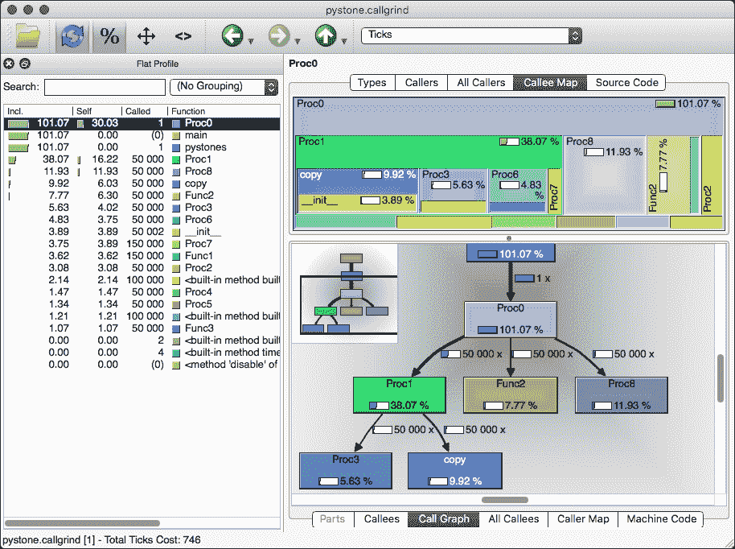

# 第十二章：性能-跟踪和减少内存和 CPU 使用

在我们谈论性能之前，有一句*Donald Knuth*的话您需要首先考虑：

> “真正的问题在于程序员花了太多时间在错误的地方和错误的时间上担心效率；过早的优化是编程中所有邪恶的根源（或至少是大部分）。”

### 注意

Donald Knuth 经常被称为算法分析之父。他的书系*计算机编程艺术*可以被认为是所有基本算法的圣经。

只要您选择了正确的数据结构和正确的算法，性能就不应该成为一个值得担忧的问题。这并不意味着您应该完全忽略性能，而是确保您选择正确的战斗，并且只在实际需要时进行优化。微观/过早的优化肯定很有趣，但很少有用。

我们已经在第二章中看到了许多数据结构的性能特征，*Pythonic Syntax, Common Pitfalls, and Style Guide*，所以我们不会讨论那个，但我们会向您展示如何测量性能以及如何检测问题。有些情况下，微观优化会产生影响，但在测量性能之前，您不会知道。

在本章中，我们将涵盖：

+   分析 CPU 使用情况

+   分析内存使用

+   学习如何正确比较性能指标

+   优化性能

+   查找和修复内存泄漏

# 什么是性能？

性能是一个非常广泛的术语。它有许多不同的含义，在许多情况下被错误地定义。您可能听过类似于“语言 X 比 Python 快”的说法。然而，这种说法本质上是错误的。Python 既不快也不慢；Python 是一种编程语言，语言根本没有性能指标。如果有人说 CPython 解释器对于语言 X 比解释器 Y 快或慢，那是可能的。代码的性能特征在不同的解释器之间可能有很大的差异。只需看看这个小测试：

```py
# python3 -m timeit '"".join(str(i) for i in range(10000))'
100 loops, best of 3: 2.91 msec per loop
# python2 -m timeit '"".join(str(i) for i in range(10000))'
100 loops, best of 3: 2.13 msec per loop
# pypy -m timeit '"".join(str(i) for i in range(10000))'
1000 loops, best of 3: 677 usec per loop

```

三种不同的解释器，性能差异巨大！所有都是 Python，但解释器显然不同。看到这个基准测试，您可能会想要完全放弃 CPython 解释器，只使用 Pypy。这类基准测试的危险在于它们很少提供任何有意义的结果。对于这个有限的例子，Pypy 解释器比 CPython3 解释器快大约四倍，但这与一般情况毫无关系。唯一可以安全得出的结论是，这个特定版本的 Pypy 解释器比这个特定版本的 CPython3 快四倍以上，对于任何其他测试和解释器版本，结果可能大不相同。

# Timeit-比较代码片段的性能

在我们开始改进性能之前，我们需要一种可靠的方法来衡量它。Python 有一个非常好的模块（`timeit`），专门用于测量代码片段的执行时间。它多次执行一小段代码，以确保变化尽可能小，并使测量相对干净。如果您想比较几个代码片段，这非常有用。以下是示例执行：

```py
# python3 -m timeit 'x=[]; [x.insert(0, i) for i in range(10000)]'
10 loops, best of 3: 30.2 msec per loop
# python3 -m timeit 'x=[]; [x.append(i) for i in range(10000)]'
1000 loops, best of 3: 1.01 msec per loop
# python3 -m timeit 'x=[i for i in range(10000)]'
1000 loops, best of 3: 381 usec per loop
# python3 -m timeit 'x=list(range(10000))'
10000 loops, best of 3: 212 usec per loop

```

这些例子展示了`list.insert`、`list.append`、列表推导和`list`函数之间的性能差异。但更重要的是，它演示了如何使用`timeit`命令。当然，该命令也可以用于常规脚本，但`timeit`模块只接受要执行的语句作为字符串，这有点麻烦。幸运的是，您可以通过将代码包装在一个函数中并计时该函数来轻松解决这个问题：

```py
import timeit

def test_list():
    return list(range(10000))

def test_list_comprehension():
    return [i for i in range(10000)]

def test_append():
    x = []
    for i in range(10000):
        x.append(i)

    return x

def test_insert():
    x = []
    for i in range(10000):
        x.insert(0, i)

    return x

def benchmark(function, number=100, repeat=10):
    # Measure the execution times
    times = timeit.repeat(function, number=number, globals=globals())
    # The repeat function gives `repeat` results so we take the min()
    # and divide it by the number of runs
    time = min(times) / number
    print('%d loops, best of %d: %9.6fs :: %s' % (
        number, repeat, time, function))

if __name__ == '__main__':
    benchmark('test_list()')
    benchmark('test_list_comprehension()')
    benchmark('test_append()')
    benchmark('test_insert()')
```

执行此操作时，您将得到以下内容：

```py
# python3 test_timeit.py
100 loops, best of 10:  0.000238s :: test_list()
100 loops, best of 10:  0.000407s :: test_list_comprehension()
100 loops, best of 10:  0.000838s :: test_append()
100 loops, best of 10:  0.031795s :: test_insert()

```

您可能已经注意到，这个脚本仍然有点基础。而常规版本会一直尝试，直到达到 0.2 秒或更多，这个脚本只有固定数量的执行。不幸的是，`timeit`模块并没有完全考虑重用，所以除了从脚本中调用`timeit.main()`之外，你几乎没有办法重用这个逻辑。

个人建议使用 IPython，因为它可以更轻松地进行测量：

```py
# ipython3
In [1]: import test_timeit
In [2]: %timeit test_timeit.test_list()
1000 loops, best of 3: 255 µs per loop
In [3]: %timeit test_timeit.test_list_comprehension()
1000 loops, best of 3: 430 µs per loop
In [4]: %timeit test_timeit.test_append()
1000 loops, best of 3: 934 µs per loop
In [5]: %timeit test_timeit.test_insert()
10 loops, best of 3: 31.6 ms per loop

```

在这种情况下，IPython 会自动处理字符串包装和`globals()`的传递。不过，这一切都非常有限，只适用于比较多种执行相同操作的方法。在完整的 Python 应用程序中，有更多的方法可用。

### 提示

要查看 IPython 函数和常规模块的源代码，可以在 IPython shell 中输入`object??`来返回源代码。在这种情况下，只需输入`timeit??`来查看`timeit` IPython 函数的定义。

您可以自己实现`%timeit`函数的最简单方法就是简单地调用`timeit.main`：

```py
import timeit

timeit.main(args=['[x for x in range(1000000)]'])
```

`timeit`模块的内部并没有什么特别之处。一个基本版本可以只用`eval`和`time.perf_counter`（Python 中可用的最高分辨率计时器）的组合来实现：

```py
import time
import functools

TIMEIT_TEMPLATE = '''
import time

def run(number):
    %(setup)s
    start = time.perf_counter()
    for i in range(number):
        %(statement)s
    return time.perf_counter() - start
'''

def timeit(statement='pass', setup='pass', repeat=1, number=1000000,
           globals_=None):
    # Get or create globals
    globals_ = globals() if globals_ is None else globals_

    # Create the test code so we can separate the namespace
    src = TIMEIT_TEMPLATE % dict(
        statement=statement,
        setup=setup,
        number=number,
    )
    # Compile the source
    code = compile(src, '<source>', 'exec')

    # Define locals for the benchmarked code
    locals_ = {}

    # Execute the code so we can get the benchmark fuction
    exec(code, globals_, locals_)

    # Get the run function
    run = functools.partial(locals_['run'], number=number)
    for i in range(repeat):
        yield run()
```

`timeit`代码实际上在检查输入方面更加先进，但这个例子大致展示了`timeit.repeat`函数如何实现。

要在 IPython 中注册自己的函数，需要使用一些 IPython 魔术。请注意，这个魔术并不是双关语。负责这些命令的 IPython 模块实际上被称为`magic`。为了演示：

```py
from IPython.core import magic

@magic.register_line_magic(line):
    import timeit
    timeit.main(args[line])
```

要了解更多关于 IPython 中自定义魔术的信息，请查看 IPython 文档[`ipython.org/ipython-doc/3/config/custommagics.html`](https://ipython.org/ipython-doc/3/config/custommagics.html)。

# cProfile – 查找最慢的组件

`profile`模块使得分析脚本/应用程序中使用的相对 CPU 周期变得非常容易。但一定要小心，不要将其与`timeit`模块的结果进行比较。虽然`timeit`模块尽可能准确地提供执行代码片段所需的绝对时间的基准，但`profile`模块只对相对结果有用。原因是，分析代码本身会导致减速，因此结果与非分析代码不可比。然而，有一种方法可以使其更加准确，但稍后再详细介绍。

### 注意

在这一部分，我们将讨论`profile`模块，但在示例中我们实际上将使用`cProfile`模块。`cProfile`模块是纯 Python`profile`模块的高性能仿真。

## 首次分析运行

让我们从第五章中的 Fibonacci 函数进行分析，*装饰器-通过装饰实现代码重用*，分别使用缓存函数和不使用缓存函数。首先，代码：

```py
import sys
import functools

@functools.lru_cache()
def fibonacci_cached(n):
    if n < 2:
        return n
    else:
        return fibonacci_cached(n - 1) + fibonacci_cached(n - 2)

def fibonacci(n):
    if n < 2:
        return n
    else:
        return fibonacci(n - 1) + fibonacci(n - 2)

if __name__ == '__main__':
    n = 30
    if sys.argv[-1] == 'cache':
        fibonacci_cached(n)
    else:
        fibonacci(n)
```

### 注意

为了可读性，所有`cProfile`统计数据将在所有`cProfile`输出中剥离`percall`和`cumtime`列。这些列对于这些示例的目的来说是无关紧要的。

首先我们将不使用缓存来执行函数：

```py
# python3 -m cProfile -s calls test_fibonacci.py no_cache
 **2692557 function calls (21 primitive calls) in 0.815
 **seconds

 **Ordered by: call count

 **ncalls tottime percall filename:lineno(function)
2692537/1   0.815   0.815 test_fibonacci.py:13(fibonacci)
 **7   0.000   0.000 {built-in method builtins.getattr}
 **5   0.000   0.000 {built-in method builtins.setattr}
 **1   0.000   0.000 {method 'update' of 'dict' objects}
 **1   0.000   0.000 {built-in method builtins.isinstance}
 **1   0.000   0.000 functools.py:422(decorating_function)
 **1   0.000   0.815 test_fibonacci.py:1(<module>)
 **1   0.000   0.000 {method 'disable' of '_lsprof.Profiler'}
 **1   0.000   0.815 {built-in method builtins.exec}
 **1   0.000   0.000 functools.py:43(update_wrapper)
        1   0.000   0.000 functools.py:391(lru_cache)
```

这是相当多的调用，不是吗？显然，我们调用了`test_fibonacci`函数将近 300 万次。这就是分析模块提供了很多见解的地方。让我们进一步分析一下指标：

+   **Ncalls**：对函数进行的调用次数

+   **Tottime**：在此函数内部花费的总时间（以秒为单位），不包括所有子函数

Percall，`tottime / ncalls`

+   **Cumtime**：在此函数内部花费的总时间，包括子函数

Percall，`cumtime / ncalls`

哪个对你的用例最有用取决于情况。使用默认输出中的`-s`参数可以很容易地改变排序顺序。但现在让我们看看缓存版本的结果。再次，只有简化的输出：

```py
# python3 -m cProfile -s calls test_fibonacci.py cache
 **51 function calls (21 primitive calls) in 0.000 seconds

 **Ordered by: call count

 **ncalls tottime percall filename:lineno(function)
 **31/1   0.000   0.000 test_fibonacci.py:5(fibonacci_cached)
 **7   0.000   0.000 {built-in method builtins.getattr}
 **5   0.000   0.000 {built-in method builtins.setattr}
 **1   0.000   0.000 test_fibonacci.py:1(<module>)
 **1   0.000   0.000 {built-in method builtins.isinstance}
 **1   0.000   0.000 {built-in method builtins.exec}
 **1   0.000   0.000 functools.py:422(decorating_function)
 **1   0.000   0.000 {method 'disable' of '_lsprof.Profiler'}
 **1   0.000   0.000 {method 'update' of 'dict' objects}
 **1   0.000   0.000 functools.py:391(lru_cache)
 **1   0.000   0.000 functools.py:43(update_wrapper)

```

这次我们看到`tottime`是`0.000`，因为它太快了，无法测量。但是，虽然`fibonacci_cached`函数仍然是执行次数最多的函数，但它只执行了 31 次，而不是 300 万次。

## 校准你的性能分析器

为了说明`profile`和`cProfile`之间的差异，让我们再次尝试使用`profile`模块进行未缓存的运行。提醒一下，这会慢得多，所以如果它有点停滞，不要感到惊讶：

```py
# python3 -m profile -s calls test_fibonacci.py no_cache
         2692558 function calls (22 primitive calls) in 7.696 seconds

   Ordered by: call count

   ncalls tottime percall filename:lineno(function)
2692537/1   7.695   7.695 test_fibonacci.py:13(fibonacci)
        7   0.000   0.000 :0(getattr)
        5   0.000   0.000 :0(setattr)
        1   0.000   0.000 :0(isinstance)
        1   0.001   0.001 :0(setprofile)
        1   0.000   0.000 :0(update)
        1   0.000   0.000 functools.py:43(update_wrapper)
        1   0.000   7.696 profile:0(<code object <module> ...>)
        1   0.000   7.695 test_fibonacci.py:1(<module>)
        1   0.000   0.000 functools.py:391(lru_cache)
        1   0.000   7.695 :0(exec)
        1   0.000   0.000 functools.py:422(decorating_function)
        0   0.000         profile:0(profiler)
```

巨大的差异，不是吗？现在代码几乎慢了 10 倍，唯一的区别是使用了纯 Python 的`profile`模块而不是`cProfile`模块。这确实表明了`profile`模块存在很大的问题。模块本身的开销足以扭曲结果，这意味着我们应该考虑这种偏差。这就是`Profile.calibrate()`函数要处理的问题，它计算了 profile 模块所产生的偏差。为了计算偏差，我们可以使用以下脚本：

```py
import profile

if __name__ == '__main__':
    profiler = profile.Profile()
    for i in range(10):
        print(profiler.calibrate(100000))
```

数字会略有不同，但是你应该能够使用这段代码得到一个公平的偏差估计。如果数字仍然有很大的变化，你可以将试验次数从`100000`增加到更大的值。这种校准只适用于 profile 模块，但是如果你想要更准确的结果，而`cProfile`模块由于继承或者不受你的平台支持而无法使用，你可以使用这段代码来全局设置你的偏差并获得更准确的结果：

```py
import profile

# The number here is bias calculated earlier
profile.Profile.bias = 2.0939406059394783e-06
```

对于特定的`Profile`实例：

```py
import profile

profiler = profile.Profile(bias=2.0939406059394783e-06)
```

一般来说，较小的偏差比较大的偏差更好，因为较大的偏差可能会导致非常奇怪的结果。在某些情况下，甚至会得到负的时间。让我们试试我们的斐波那契代码：

```py
import sys
import pstats
import profile
import functools

@functools.lru_cache()
def fibonacci_cached(n):
    if n < 2:
        return n
    else:
        return fibonacci_cached(n - 1) + fibonacci_cached(n - 2)

def fibonacci(n):
    if n < 2:
        return n
    else:
        return fibonacci(n - 1) + fibonacci(n - 2)

if __name__ == '__main__':
    profiler = profile.Profile(bias=2.0939406059394783e-06)
    n = 30

    if sys.argv[-1] == 'cache':
        profiler.runcall(fibonacci_cached, n)
    else:
        profiler.runcall(fibonacci, n)

    stats = pstats.Stats(profiler).sort_stats('calls')
    stats.print_stats()
```

在运行时，确实出现了我使用了一个太大的偏差：

```py
# python3 test_fibonacci.py no_cache
 **2692539 function calls (3 primitive calls) in -0.778
 **seconds

 **Ordered by: call count

 **ncalls tottime percall filename:lineno(function)
2692537/1  -0.778  -0.778 test_fibonacci.py:15(fibonacci)
 **1   0.000   0.000 :0(setprofile)
 **1   0.000  -0.778 profile:0(<function fibonacci at 0x...>)
 **0   0.000         profile:0(profiler)

```

不过，它展示了代码如何正确使用。你甚至可以在脚本中使用类似这样的片段来整合偏差计算：

```py
import profile

if __name__ == '__main__':
    profiler = profile.Profile()
    profiler.bias = profiler.calibrate(100000)
```

## 使用装饰器进行选择性性能分析

使用装饰器计算简单的时间很容易，但是性能分析也很重要。两者都很有用，但是目标不同。让我们看看两种选择：

```py
import cProfile
import datetime
import functools

def timer(function):
    @functools.wraps(function)
    def _timer(*args, **kwargs):
        start = datetime.datetime.now()
        try:
            return function(*args, **kwargs)
        finally:
            end = datetime.datetime.now()
            print('%s: %s' % (function.__name__, end - start))
    return _timer

def profiler(function):
    @functools.wraps(function)
    def _profiler(*args, **kwargs):
        profiler = cProfile.Profile()
        try:
            profiler.enable()
            return function(*args, **kwargs)
        finally:
            profiler.disable()
            profiler.print_stats()
    return _profiler

@profiler
def profiled_fibonacci(n):
    return fibonacci(n)

@timer
def timed_fibonacci(n):
    return fibonacci(n)

def fibonacci(n):
    if n < 2:
        return n
    else:
        return fibonacci(n - 1) + fibonacci(n - 2)

if __name__ == '__main__':
    timed_fibonacci(32)
    profiled_fibonacci(32)
```

代码足够简单，只是一个基本的计时器和性能分析器打印一些默认的统计数据。哪种对你来说更好取决于你的用例，但它们肯定都有用。这种选择性性能分析的额外优势是输出更有限，有助于可读性：

```py
# python3 test_fibonacci.py
 **timed_fibonacci: 0:00:01.050200
 **7049157 function calls (3 primitive calls) in 2.024
 **seconds

 **Ordered by: standard name

 **ncalls tottime percall filename:lineno(function)
 **1   0.000   2.024 test_fibonacci.py:31(profiled_fibonacci)
7049155/1   2.024   2.024 test_fibonacci.py:41(fibonacci)
 **1   0.000   0.000 {method 'disable' of '_lsprof.Profiler'}

```

如你所见，性能分析器仍然使代码变慢了大约两倍，但它确实可用。

## 使用性能分析统计

为了获得更复杂的性能分析结果，我们将对`pystone`脚本进行性能分析。`pystone`脚本是一个内部的 Python 性能测试，它相当彻底地对 Python 解释器进行基准测试。首先，让我们使用这个脚本创建统计数据：

```py
from test import pystone
import cProfile

if __name__ == '__main__':
    profiler = cProfile.Profile()
    profiler.runcall(pystone.main)
    profiler.dump_stats('pystone.profile')
```

在执行脚本时，你应该会得到类似这样的结果：

```py
# python3 test_pystone.py
Pystone(1.2) time for 50000 passes = 0.725432
This machine benchmarks at 68924.4 pystones/second

```

运行脚本后，你应该会得到一个包含性能分析结果的`pystone.profile`文件。这些结果可以通过 Python 捆绑的`pstats`模块查看：

```py
import pstats

stats = pstats.Stats('pystone.profile')
stats.strip_dirs()
stats.sort_stats('calls', 'cumtime')
stats.print_stats(10)
```

在某些情况下，将多次测量的结果结合起来可能是有趣的。可以通过指定多个文件或使用`stats.add(*filenames)`来实现。但首先，让我们看看常规输出：

```py
# python3 parse_statistics.py

 **1050012 function calls in 0.776 seconds

 **Ordered by: call count, cumulative time
 **List reduced from 21 to 10 due to restriction <10>

 **ncalls  tottime  percall  cumtime  percall filename:lineno(function)
 **150000    0.032    0.000    0.032    0.000 pystone.py:214(Proc7)
 **150000    0.027    0.000    0.027    0.000 pystone.py:232(Func1)
 **100000    0.016    0.000    0.016    0.000 {built-in method builtins.chr}
 **100000    0.010    0.000    0.010    0.000 {built-in method builtins.ord}
 **50002    0.029    0.000    0.029    0.000 pystone.py:52(__init__)
 **50000    0.127    0.000    0.294    0.000 pystone.py:144(Proc1)
 **50000    0.094    0.000    0.094    0.000 pystone.py:219(Proc8)
 **50000    0.048    0.000    0.077    0.000 pystone.py:60(copy)
 **50000    0.051    0.000    0.061    0.000 pystone.py:240(Func2)
 **50000    0.031    0.000    0.043    0.000 pystone.py:171(Proc3)

```

显然，参数可以很容易地修改以改变排序顺序和输出行数。但这并不是统计数据的唯一可能性。有很多包可以解析这些结果并可视化它们。其中一个选择是 RunSnakeRun，虽然有用，但目前不支持 Python 3。此外，我们还有 QCacheGrind，一个非常好的性能分析统计可视化工具，但需要一些手动编译才能运行，或者当然也可以搜索到二进制文件。

让我们看看 QCacheGrind 的输出。在 Windows 的情况下，QCacheGrindWin 包提供了一个二进制文件，而在 Linux 中，它很可能通过您的软件包管理器提供，在 OS X 中，您可以尝试`brew install qcachegrind --with-graphviz`。但是还有一个包你需要：`pyprof2calltree`包。它将`profile`输出转换为 QCacheGrind 理解的格式。因此，在简单的`pip install pyprof2calltree`之后，我们现在可以将`profile`文件转换为`callgrind`文件：

```py
# pyprof2calltree -i pystone.profile -o pystone.callgrind
writing converted data to: pystone.callgrind
# qcachegrind pystone.callgrind

```

这将导致运行`QCacheGrind`应用程序。切换到适当的标签后，您应该看到类似以下图像的东西：



对于这样一个简单的脚本，几乎所有的输出都有效。然而，对于完整的应用程序，像 QCacheGrind 这样的工具是非常宝贵的。查看 QCacheGrind 生成的输出，立即就能看出哪个进程花费了最多的时间。右上角的结构显示了更大的矩形，如果花费的时间更长，这是对 CPU 时间块的非常有用的可视化。左边的列表与`cProfile`非常相似，因此没有什么新鲜的。右下角的树可能非常有价值，也可能非常无用，就像在这种情况下一样。它显示了函数中所占 CPU 时间的百分比，更重要的是，该函数与其他函数的关系。

因为这些工具根据输入进行缩放，所以结果对于几乎任何应用程序都是有用的。无论一个函数需要 100 毫秒还是 100 分钟，都没有关系，输出将显示慢的部分的清晰概述，这是我们要尝试修复的问题。

# 行分析器

`line_profiler`实际上不是 Python 捆绑的包，但它太有用了，不能忽视。虽然常规的`profile`模块对某个块内的所有（子）函数进行分析，但`line_profiler`允许在函数内逐行进行分析。斐波那契函数在这里并不是最合适的，但我们可以使用一个素数生成器。但首先，安装`line_profiler`：

```py
 **pip install line_profiler

```

现在我们已经安装了`line_profiler`模块（以及`kernprof`命令），让我们测试`line_profiler`：

```py
import itertools

@profile
def primes():
    n = 2
    primes = set()
    while True:
        for p in primes:
            if n % p == 0:
                break
        else:
            primes.add(n)
            yield n
        n += 1

if __name__ == '__main__':
    total = 0
    n = 2000
    for prime in itertools.islice(primes(), n):
        total += prime

    print('The sum of the first %d primes is %d' % (n, total))
```

你可能想知道`profile`装饰器是从哪里来的。它来自`line_profiler`模块，这就是为什么我们必须用`kernprof`命令运行脚本的原因：

```py
# kernprof -l test_primes.py
The sum of the first 2000 primes is 16274627
Wrote profile results to test_primes.py.lprof

```

正如命令所说，结果已经写入了`test_primes.py.lprof`文件。因此，为了便于阅读，让我们查看该文件的输出，跳过`Time`列：

```py
# python3 -m line_profiler test_primes.py.lprof
Timer unit: 1e-06 s

Total time: 2.33179 s
File: test_primes.py
Function: primes at line 4

Line #      Hits   Per Hit   % Time  Line Contents
==================================================
 **4                               @profile
 **5                               def primes():
 **6         1       3.0      0.0      n = 2
 **7         1       1.0      0.0      primes = set()
 **8         1       0.0      0.0      while True:
 **9   2058163       0.5     43.1          for p in primes:
 **10   2056163       0.6     56.0              if n % p == 0:
 **11     15388       0.5      0.3                  break
 **12                                       else:
 **13      2000       1.2      0.1              primes.add(n)
 **14      2000       0.5      0.0              yield n
 **15     17387       0.6      0.4          n += 1

```

很棒的输出，不是吗？这使得在一小段代码中找到慢的部分变得微不足道。在这段代码中，慢显然是来自循环，但在其他代码中可能不那么清楚。

### 注意

这个模块也可以作为 IPython 扩展添加，这样就可以在 IPython 中使用`%lprun`命令。要加载扩展，可以在 IPython shell 中使用`load_ext`命令`%load_ext line_profiler`。

# 提高性能

关于性能优化可以说很多，但实际上，如果你已经读完整本书，你就会知道大部分编写快速代码的 Python 特定技术。应用程序性能中最重要的因素始终是算法的选择，以及数据结构。在`list`中搜索项目几乎总是比在`dict`或`set`中搜索项目更糟糕的想法。

## 使用正确的算法

在任何应用程序中，正确选择的算法是远远最重要的性能特征，这就是为什么我重复强调它以说明错误选择的结果：

```py
In [1]: a = list(range(1000000))

In [2]: b = dict.fromkeys(range(1000000))

In [3]: %timeit 'x' in a
10 loops, best of 3: 20.5 ms per loop

In [4]: %timeit 'x' in b
10000000 loops, best of 3: 41.6 ns per loop
```

检查一个项目是否在`list`中是一个`O(n)`操作，而检查一个项目是否在`dict`中是一个`O(1)`操作。当`n=1000000`时有很大的差异，显然，在这个简单的测试中，对于 100 万个项目，它快了 500 倍。

所有其他性能提示结合在一起可能使您的代码速度加快一倍，但使用正确的算法可能会带来更大的改进。使用需要`O(n)`时间的算法而不是`O(n²)`时间将使您的代码对于`n=1000`快`1000`倍，对于更大的`n`，差异只会进一步增加。

## 全局解释器锁

CPython 解释器最隐晦的组件之一是全局解释器锁（GIL），这是为了防止内存损坏而需要的互斥锁。Python 内存管理器不是线程安全的，这就是为什么需要 GIL。没有 GIL，多个线程可能同时更改内存，导致各种意外和潜在的危险结果。

那么 GIL 在现实应用中的影响是什么？在单线程应用程序中，它根本没有任何影响，实际上是一种非常快速的内存一致性方法。然而，在多线程应用程序中，它可能会稍微减慢应用程序的速度，因为一次只有一个线程可以访问 GIL。因此，如果您的代码需要频繁访问 GIL，可能会受益于一些重构。

幸运的是，Python 提供了一些其他并行处理选项：我们之前看到的`asyncio`模块和我们将在第十三章中看到的`multiprocessing`库，*多进程-当单个 CPU 核心不够用*。

## 尝试与 if

在许多语言中，`try/except`类型的块会带来相当大的性能损失，但在 Python 中并非如此。并不是说`if`语句很重，但如果您期望您的`try/except`大部分时间都成功，只在罕见情况下失败，那绝对是一个有效的替代方案。不过，始终专注于可读性和传达代码目的。如果使用`if`语句更清晰表达代码的意图，就使用`if`语句。如果`try/except`以更好的方式传达意图，就使用它。

## 列表与生成器

使用生成器懒惰地评估代码几乎总是比计算整个数据集更好的主意。性能优化的最重要规则可能是，不要计算任何您不打算使用的东西。如果您不确定自己是否需要它，请不要计算它。

不要忘记您可以轻松地链接多个生成器，因此只有在实际需要时才计算所有内容。但要小心，这不会导致重新计算；`itertools.tee`通常比完全重新计算结果更好。

## 字符串连接

您可能已经看到过一些基准测试，表明使用`+=`比连接字符串要慢得多。在某个时候，这确实产生了很大的差异。然而，使用 Python 3 后，大部分差异已经消失。

```py
In [1]: %%timeit
 **...: s = ''
 **...: for i in range(1000000):
 **...:     s += str(i)
 **...:
1 loops, best of 3: 362 ms per loop

In [2]: %%timeit
 **...: ss = []
 **...: for i in range(1000000):
 **...:     ss.append(str(i))
 **...: s = ''.join(ss)
 **...:
1 loops, best of 3: 332 ms per loop

In [3]: %timeit ''.join(str(i) for i in range(1000000))
1 loops, best of 3: 324 ms per loop

In [4]: %timeit ''.join([str(i) for i in range(1000000)])
1 loops, best of 3: 294 ms per loop

```

当然仍然存在一些差异，但它们非常小，建议忽略它们，选择最可读的选项。

## 加法与生成器

与字符串连接一样，一度显著差异现在已经微乎其微。

```py
In [1]: %%timeit
   ...: x = 0
   ...: for i in range(1000000):
   ...:     x += i
   ...:
10 loops, best of 3: 73.2 ms per loop

In [2]: %timeit x = sum(i for i in range(1000000))
10 loops, best of 3: 75.3 ms per loop

In [3]: %timeit x = sum([i for i in range(1000000)])
10 loops, best of 3: 71.2 ms per loop

In [4]: %timeit x = sum(range(1000000))
10 loops, best of 3: 25.6 ms per loop
```

然而，有助于让 Python 使用本机函数来处理一切，就像在最后一个示例中所看到的那样。

## 映射与生成器和列表推导

再次强调，可读性比性能更重要。有一些情况下，`map`比列表推导和生成器更快，但只有当`map`函数可以使用预定义函数时才是如此。一旦您需要使用`lambda`，实际上速度就会变慢。不过这并不重要，因为无论如何，可读性应该是关键，使用生成器或列表推导而不是`map`：

```py
In [1]: %timeit list(map(lambda x: x/2, range(1000000)))
10 loops, best of 3: 182 ms per loop

In [2]: %timeit list(x/2 for x in range(1000000))
10 loops, best of 3: 122 ms per loop

In [3]: %timeit [x/2 for x in range(1000000)]
10 loops, best of 3: 84.7 ms per loop
```

正如你所看到的，列表推导式显然比生成器快得多。然而，在许多情况下，我仍然会推荐使用生成器而不是列表推导式，仅仅是因为内存使用和潜在的惰性。如果由于某种原因你只打算使用前 10 个项目，那么通过计算完整的项目列表，你仍然会浪费大量资源。

## 缓存

我们已经在第五章中介绍了`functools.lru_cache`装饰器，*装饰器-通过装饰实现代码重用*，但它的重要性不容小觑。无论你的代码有多快多聪明，不必计算结果总是更好的，这就是缓存的作用。根据你的用例，有许多选项可用。在一个简单的脚本中，`functools.lru_cache`是一个很好的选择，但在多次执行应用程序时，`cPickle`模块也可以拯救生命。

如果涉及多个服务器，我建议看看**Redis**。Redis 服务器是一个单线程的内存服务器，非常快速，并且有许多有用的数据结构可用。如果你看到关于使用 Memcached 提高性能的文章或教程，只需在所有地方用 Redis 替换 Memcached。Redis 在各个方面都优于 Memcached，在其最基本的形式下，API 是兼容的。

## 延迟导入

应用程序加载时间的一个常见问题是，在程序启动时立即加载所有内容，而实际上许多应用程序并不需要这样做，应用程序的某些部分只在实际使用时才需要加载。为了方便起见，可以偶尔将导入移动到函数内部，以便按需加载。

虽然在某些情况下这是一个有效的策略，但我通常不推荐它，原因有两个：

1.  它使你的代码不够清晰；在文件顶部以相同的风格放置所有导入可以提高可读性。

1.  它并没有使代码更快，因为它只是将加载时间移到不同的部分。

## 使用优化库

这实际上是一个非常广泛的提示，但仍然很有用。如果有一个非常优化的库适合你的目的，你很可能无法在没有大量努力的情况下击败它的性能。像`numpy`、`pandas`、`scipy`和`sklearn`这样的库都经过了高度优化，它们的本机操作可能非常快。如果它们适合你的目的，请务必尝试一下。只是为了说明`numpy`相对于纯 Python 有多快，请参考以下内容：

```py
In [1]: import numpy

In [2]: a = list(range(1000000))

In [3]: b = numpy.arange(1000000)

In [4]: %timeit c = [x for x in a if x > 500000]
10 loops, best of 3: 44 ms per loop

In [5]: %timeit d = b[b > 500000]
1000 loops, best of 3: 1.61 ms per loop
```

`numpy`代码与 Python 代码完全相同，只是它使用`numpy`数组而不是 Python 列表。这个小差异使代码快了 25 倍以上。

## 即时编译

**即时**（**JIT**）编译是一种在运行时动态编译（部分）应用程序的方法。因为在运行时有更多的信息可用，这可能会产生巨大的影响，并使你的应用程序运行得更快。

`numba`包为你提供了选择性的 JIT 编译，允许你标记与 JIT 编译器兼容的函数。基本上，如果你的函数遵循基于输入的函数式编程范式，那么它很可能会与 JIT 编译器一起工作。

`numba` JIT 编译器的基本示例：

```py
import numba

@numba.jit
def sum(array):
    total = 0.0
    for value in array:
        total += value
    return value
```

这些用例有限，但如果你使用`numpy`或 pandas，你很可能会从`numba`中受益。

另一个非常有趣的事实是，`numba`不仅支持 CPU 优化执行，还支持 GPU。这意味着对于某些操作，你可以使用视频卡中的快速处理器来处理结果。

## 将代码的部分转换为 C

我们将在第十四章中看到更多关于这个问题的内容，但是如果真的需要高性能，那么本地 C 函数可以帮助很多。这甚至不必那么困难。Cython 模块使得用性能非常接近本地 C 代码编写代码的过程变得非常简单。

以下是 Cython 手册中用于近似π值的示例：

```py
cdef inline double recip_square(int i):
    return 1./(i*i)

def approx_pi(int n=10000000):
    cdef double val = 0.
    cdef int k
    for k in xrange(1,n+1):
        val += recip_square(k)
    return (6 * val)**.5
```

虽然有一些小的差异，比如使用`cdef`代替`def`以及对值和参数进行类型定义，但代码基本上与常规 Python 代码相同，但速度肯定要快得多。

# 内存使用

到目前为止，我们只看了执行时间，忽略了脚本的内存使用。在许多情况下，执行时间是最重要的，但内存使用也不容忽视。在几乎所有情况下，CPU 和内存是相互交换的；代码要么使用大量 CPU，要么使用大量内存，这意味着两者都非常重要。

## Tracemalloc

监视内存使用曾经是只能通过外部 Python 模块（如**Dowser**或**Heapy**）实现的事情。虽然这些模块仍然有效，但由于`tracemalloc`模块的出现，它们现在基本上已经过时了。让我们尝试一下`tracemalloc`模块，看看现在监视内存使用有多容易：

```py
import tracemalloc

if __name__ == '__main__':
    tracemalloc.start()

    # Reserve some memory
    x = list(range(1000000))

    # Import some modules
    import os
    import sys
    import asyncio

    # Take a snapshot to calculate the memory usage
    snapshot = tracemalloc.take_snapshot()
    for statistic in snapshot.statistics('lineno')[:10]:
        print(statistic)
```

结果是：

```py
# python3 test_tracemalloc.py
test_tracemalloc.py:8: size=35.3 MiB, count=999745, average=37 B
<frozen importlib._bootstrap_external>:473: size=1909 KiB, count=20212, average=97 B
<frozen importlib._bootstrap>:222: size=895 KiB, count=3798, average=241 B
collections/__init__.py:412: size=103 KiB, count=1451, average=72 B
<string>:5: size=36.6 KiB, count=133, average=282 B
collections/__init__.py:406: size=29.9 KiB, count=15, average=2039 B
abc.py:133: size=26.1 KiB, count=102, average=262 B
ipaddress.py:608: size=21.3 KiB, count=182, average=120 B
<frozen importlib._bootstrap_external>:53: size=21.2 KiB, count=140, average=155 B
types.py:234: size=15.3 KiB, count=124, average=127 B

```

您可以很容易地看到代码的每个部分分配了内存以及可能浪费了多少。虽然可能仍然不清楚哪一部分实际上导致了内存使用，但我们将在接下来的部分中看到有关此问题的解决方案。

## 内存分析器

`memory_profiler`模块与前面讨论的`line_profiler`非常相似，但用于内存使用。安装它就像`pip install memory_profiler`一样容易，但是强烈建议（在 Windows 的情况下是必需的）安装可选的`pip install psutil`，因为它可以大大提高性能。为了测试`line_profiler`，我们将使用以下脚本：

```py
import memory_profiler

@memory_profiler.profile
def main():
    n = 100000
    a = [i for i in range(n)]
    b = [i for i in range(n)]
    c = list(range(n))
    d = list(range(n))
    e = dict.fromkeys(a, b)
    f = dict.fromkeys(c, d)

if __name__ == '__main__':
    main()
```

请注意，尽管这里实际上导入了`memory_profiler`，但这并不是严格要求的。它也可以通过`python3 -m memory_profiler your_scripts.py`来执行：

```py
# python3 test_memory_profiler.py
Filename: test_memory_profiler.py

Line #    Mem usage    Increment   Line Contents
================================================
 **4     11.0 MiB      0.0 MiB   @memory_profiler.profile
 **5                             def main():
 **6     11.0 MiB      0.0 MiB       n = 100000
 **7     14.6 MiB      3.5 MiB       a = [i for i in range(n)]
 **8     17.8 MiB      3.2 MiB       b = [i for i in range(n)]
 **9     21.7 MiB      3.9 MiB       c = list(range(n))
 **10     25.5 MiB      3.9 MiB       d = list(range(n))
 **11     38.0 MiB     12.5 MiB       e = dict.fromkeys(a, b)
 **12     44.1 MiB      6.1 MiB       f = dict.fromkeys(c, d)

```

尽管一切都按预期运行，但您可能会对这里代码行使用的内存量不同而感到困惑。为什么`a`占用`3.5 MiB`，而`b`只占用`3.2 MiB`？这是由 Python 内存分配代码引起的；它以较大的块保留内存，然后在内部进行细分和重复使用。另一个问题是`memory_profiler`在内部进行快照，这导致在某些情况下将内存归因于错误的变量。这些变化应该足够小，以至于最终不会产生很大的差异，但是应该预期会有一些变化。

### 注意

这个模块也可以作为 IPython 扩展添加，这样就可以在 IPython 中使用`%mprun`命令。要加载扩展，可以从 IPython shell 使用`%load_ext memory_profiler`命令。另一个非常有用的命令是`%memit`，它是`%timeit`命令的内存等价命令。

## 内存泄漏

这些模块的使用通常会受到对内存泄漏的搜索的限制。特别是`tracemalloc`模块具有一些功能，使得这一过程相当容易。Python 内存管理系统相当简单；它只是有一个简单的引用计数器来查看对象是否被使用。虽然在大多数情况下这很有效，但当涉及到循环引用时，它很容易引入内存泄漏。带有泄漏检测代码的内存泄漏的基本前提如下：

```py
 1 import tracemalloc
 2
 3
 4 class Spam(object):
 5     index = 0
 6     cache = {}
 7
 8     def __init__(self):
 9         Spam.index += 1
10         self.cache[Spam.index] = self
11
12
13 class Eggs(object):
14     eggs = []
15
16     def __init__(self):
17         self.eggs.append(self)
18
19
20 if __name__ == '__main__':
21     # Initialize some variables to ignore them from the leak
22     # detection
23     n = 200000
24     spam = Spam()
25
26     tracemalloc.start()
27     # Your application should initialize here
28
29     snapshot_a = tracemalloc.take_snapshot()
30     # This code should be the memory leaking part
31     for i in range(n):
32         Spam()
33
34     Spam.cache = {}
35     snapshot_b = tracemalloc.take_snapshot()
36     # And optionally more leaking code here
37     for i in range(n):
38         a = Eggs()
39         b = Eggs()
40         a.b = b
41         b.a = a
42
43     Eggs.eggs = []
44     snapshot_c = tracemalloc.take_snapshot()
45
46     print('The first leak:')
47     statistics = snapshot_b.compare_to(snapshot_a, 'lineno')
48     for statistic in statistics[:10]:
49         print(statistic)
50
51     print('\nThe second leak:')
52     statistics = snapshot_c.compare_to(snapshot_b, 'lineno')
53     for statistic in statistics[:10]:
54         print(statistic)
```

让我们看看这段代码实际上有多糟糕的内存泄漏：

```py
# python3 test_leak.py
The first leak:
tracemalloc.py:349: size=528 B (+528 B), count=3 (+3), average=176 B
test_leak.py:34: size=288 B (+288 B), count=2 (+2), average=144 B
test_leak.py:32: size=120 B (+120 B), count=2 (+2), average=60 B
tracemalloc.py:485: size=64 B (+64 B), count=1 (+1), average=64 B
tracemalloc.py:487: size=56 B (+56 B), count=1 (+1), average=56 B
tracemalloc.py:277: size=32 B (+32 B), count=1 (+1), average=32 B
test_leak.py:31: size=28 B (+28 B), count=1 (+1), average=28 B
test_leak.py:9: size=28 B (+28 B), count=1 (+1), average=28 B

The second leak:
test_leak.py:41: size=18.3 MiB (+18.3 MiB), count=400000 (+400000), average=48 B
test_leak.py:40: size=18.3 MiB (+18.3 MiB), count=400000 (+400000), average=48 B
test_leak.py:38: size=10.7 MiB (+10.7 MiB), count=200001 (+200001), average=56 B
test_leak.py:39: size=10.7 MiB (+10.7 MiB), count=200002 (+200002), average=56 B
tracemalloc.py:349: size=680 B (+152 B), count=6 (+3), average=113 B
test_leak.py:17: size=72 B (+72 B), count=1 (+1), average=72 B
test_leak.py:43: size=64 B (+64 B), count=1 (+1), average=64 B
test_leak.py:32: size=56 B (-64 B), count=1 (-1), average=56 B
tracemalloc.py:487: size=112 B (+56 B), count=2 (+1), average=56 B
tracemalloc.py:277: size=64 B (+32 B), count=2 (+1), average=32 B

```

在绝对内存使用上，增加并不是很大，但肯定有一点泄漏。第一个泄漏是微不足道的；在最后一次迭代中，我们看到增加了 28 字节，几乎可以忽略不计。然而第二个泄漏泄漏了很多，并在增加了 18.3 兆字节。这些都是内存泄漏，Python 垃圾收集器（`gc`）足够聪明，最终会清除循环引用，但在达到一定限制之前不会清除它们。很快就会了解更多。

每当你想要有一个不会导致内存泄漏的循环引用时，`weakref`模块是可用的。它创建的引用不计入对象引用计数。在我们看`weakref`模块之前，让我们通过 Python 垃圾收集器（`gc`）的眼睛来看一下对象引用本身：

```py
import gc

class Eggs(object):

    def __init__(self, name):
        self.name = name

    def __repr__(self):
        return '<%s: %s>' % (self.__class__.__name__, self.name)

# Create the objects
a = Eggs('a')
b = Eggs('b')

# Add some circular references
a.b = a
b.a = b

# Remove the objects
del a
del b

# See if the objects are still there
print('Before manual collection:')
for object_ in gc.get_objects():
    if isinstance(object_, Eggs):
        print('\t', object_, gc.get_referents(object_))

print('After manual collection:')
gc.collect()
for object_ in gc.get_objects():
    if isinstance(object_, Eggs):
        print('\t', object_, gc.get_referents(object_))

print('Thresholds:', gc.get_threshold())
```

现在让我们看看输出：

```py
# python3 test_refcount.py
Before manual collection:
 **<Eggs: a> [{'b': <Eggs: a>, 'name': 'a'}, <class '__main__.Eggs'>]
 **<Eggs: b> [{'name': 'b', 'a': <Eggs: b>}, <class '__main__.Eggs'>]
After manual collection:
Thresholds: (700, 10, 10)

```

正如我们在这里看到的，直到我们手动调用垃圾收集器之前，`Eggs`对象将一直留在内存中。即使明确删除了对象。那么这是否意味着你总是需要手动调用`gc.collect()`来删除这些引用？幸运的是，不需要，因为 Python 垃圾收集器在达到阈值后会自动进行收集。默认情况下，Python 垃圾收集器的阈值设置为三代被收集对象的`700, 10, 10`。收集器跟踪 Python 中所有的内存分配和释放，一旦分配次数减去释放次数达到 700，如果对象不再被引用，它就会被移除，如果它仍然有引用，它就会被移动到下一代。对于第 2 和第 3 代，重复相同的操作，尽管阈值较低为 10。

这引出了一个问题：在哪里和何时手动调用垃圾收集器是有用的？由于 Python 内存分配器重用内存块并且很少释放它，对于长时间运行的脚本，垃圾收集器可能非常有用。这正是我推荐使用它的地方：在内存紧张的环境中长时间运行的脚本，特别是在分配大量内存之前。

更重要的是，`gc`模块在寻找内存泄漏时也可以帮助你很多。`tracemalloc`模块可以显示占用最多内存的部分，但`gc`模块可以帮助你找到最多定义的对象。只是要小心设置垃圾收集器的调试设置，比如`gc.set_debug(gc.DEBUG_LEAK)`；即使你自己没有保留任何内存，它也会返回大量输出。重新审视我们之前的`Spam`和`Eggs`脚本，让我们看看垃圾收集模块是如何使用内存的：

```py
import gc
import collections

class Spam(object):
    index = 0
    cache = {}

    def __init__(self):
        Spam.index += 1
        self.cache[Spam.index] = self

class Eggs(object):
    eggs = []

    def __init__(self):
        self.eggs.append(self)

if __name__ == '__main__':
    n = 200000
    for i in range(n):
        Spam()

    for i in range(n):
        a = Eggs()
        b = Eggs()
        a.b = b
        b.a = a

    Spam.cache = {}
    Eggs.eggs = []
    objects = collections.Counter()
    for object_ in gc.get_objects():
        objects[type(object_)] += 1

    for object_, count in objects.most_common(5):
        print('%d: %s' % (count, object_))
```

输出可能与你已经预期的非常接近：

```py
# python3 test_leak.py
400617: <class 'dict'>
400000: <class '__main__.Eggs'>
962: <class 'wrapper_descriptor'>
920: <class 'function'>
625: <class 'method_descriptor'>

```

大量的`dict`对象是因为类的内部状态，但除此之外，我们只看到了`Eggs`对象，就像我们所期望的那样。`Spam`对象被垃圾收集器正确地移除了，因为它们和所有引用都被移除了。`Eggs`对象无法被移除，因为存在循环引用。现在我们将使用`weakref`模块重复相同的示例，看看它是否有所不同：

```py
import gc
import weakref
import collections

class Eggs(object):
    eggs = []

    def __init__(self):
        self.eggs.append(self)

if __name__ == '__main__':
    n = 200000
    for i in range(n):
        a = Eggs()
        b = Eggs()
        a.b = weakref.ref(b)
        b.a = weakref.ref(a)

    Eggs.eggs = []
    objects = collections.Counter()
    for object_ in gc.get_objects():
        objects[type(object_)] += 1

    for object_, count in objects.most_common(5):
        print('%d: %s' % (count, object_))
```

现在让我们看看这次剩下了什么：

```py
# python3 test_leak.py
962: <class 'wrapper_descriptor'>
919: <class 'function'>
625: <class 'method_descriptor'>
618: <class 'dict'>
535: <class 'builtin_function_or_method'>

```

除了一些标准内置的 Python 对象，这正是我们所希望的。但要小心弱引用，因为如果被引用的对象消失了，它们很容易爆炸：

```py
import weakref

class Eggs(object):
    pass

if __name__ == '__main__':
    a = Eggs()
    b = Eggs()
    a.b = weakref.ref(b)

    print(a.b())
    del b
    print(a.b())
```

这导致一个有效的引用和一个无效的引用：

```py
# python3 test_weakref.py
<__main__.Eggs object at 0x104891a20>
None

```

## 减少内存使用

总的来说，在 Python 中，内存使用可能不是你最大的问题，但了解如何减少内存使用仍然是有用的。在尝试减少内存使用时，重要的是要了解 Python 如何分配内存。

Python 内存管理器中有四个你需要了解的概念：

+   首先是堆。堆是所有 Python 管理内存的集合。请注意，这与常规堆是分开的，混合两者可能导致内存损坏和崩溃。

+   其次是 arena。这些是 Python 从系统请求的块。这些块每个固定大小为 256 KiB，它们是构成堆的对象。

+   第三，我们有 pools。这些是构成 arena 的内存块。这些块每个大小为 4 KiB。由于 pools 和 arenas 具有固定大小，它们是简单的数组。

+   第四，最后，我们有 blocks。Python 对象存储在这些 blocks 中，每个 block 的格式取决于数据类型。由于整数占用的空间比字符多，为了效率使用了不同的块大小。

现在我们知道了内存是如何分配的，我们也可以理解它如何被返回给操作系统。每当一个 arena 完全为空时，它可以并且将被释放。为了增加这种情况发生的可能性，一些启发式方法被用来最大化更满的 arenas 的使用。

### 注意

重要的是要注意，常规堆和 Python 堆是分开维护的，混合它们可能导致应用程序的损坏和/或崩溃。除非你编写自己的扩展，否则你可能永远不必担心手动内存分配。

### 生成器与列表

最重要的提示是尽可能使用生成器。Python 3 已经在很大程度上用生成器替换了列表，但是牢记这一点确实很值得，因为它不仅节省了内存，而且在不需要一次性保留所有内存时也节省了 CPU。

为了说明区别：

```py
Line #    Mem usage    Increment   Line Contents
================================================
 **4     11.0 MiB      0.0 MiB   @memory_profiler.profile
 **5                             def main():
 **6     11.0 MiB      0.0 MiB    a = range(1000000)
 **7     49.7 MiB     38.6 MiB    b = list(range(1000000))

```

`range()` 生成器所占用的内存非常小，甚至不值一提，而数字列表占用了 `38.6 MiB`。

### 重新创建集合与删除项目

关于 Python 中集合的一个非常重要的细节是，其中许多集合只能增长；它们不会自行收缩。为了说明：

```py
Line #    Mem usage    Increment   Line Contents
================================================
 **4     11.5 MiB      0.0 MiB   @memory_profiler.profile
 **5                             def main():
 **6                             # Generate a huge dict
 **7     26.3 MiB     14.8 MiB   a = dict.fromkeys(range(100000))
 **8
 **9                             # Remove all items
 **10     26.3 MiB      0.0 MiB   for k in list(a.keys()):
 **11     26.3 MiB      0.0 MiB   del a[k]
 **12
 **13                             # Recreate the dict
 **14     23.6 MiB     -2.8 MiB   a = dict((k, v) for k, v in a.items())

```

这是使用列表和字典时最常见的内存使用错误之一。除了重新创建对象，当然还有使用生成器的选项，这样内存根本就不会被分配。

### 使用 slots

如果你长时间使用 Python，你可能已经见过类的 `__slots__` 功能。它允许你指定你想在类中存储哪些字段，并通过不实现 `instance.__dict__` 跳过所有其他字段。虽然这种方法确实在类定义中节省了一点内存，但我不建议使用它，因为使用它有几个缺点。最重要的一个是它使继承变得不明显（给没有 `__slots__` 的子类添加 `__slots__` 没有效果）。它还使得不可能在运行时修改类属性，并且默认情况下破坏了 `weakref`。最后，具有 slots 的类不能在没有定义 `__getstate__` 函数的情况下被 pickle。

然而，为了完整起见，这里演示了 slots 功能和内存使用的差异：

```py
import memory_profiler

class Slots(object):
    __slots__ = 'index', 'name', 'description'

    def __init__(self, index):
        self.index = index
        self.name = 'slot %d' % index
        self.description = 'some slot with index %d' % index

class NoSlots(object):

    def __init__(self, index):
        self.index = index
        self.name = 'slot %d' % index
        self.description = 'some slot with index %d' % index

@memory_profiler.profile
def main():
    slots = [Slots(i) for i in range(25000)]
    no_slots = [NoSlots(i) for i in range(25000)]
    return slots, no_slots

if __name__ == '__main__':
    main()
```

和内存使用情况：

```py
# python3 test_slots.py
Filename: test_slots.py

Line #    Mem usage    Increment   Line Contents
================================================
 **21     11.1 MiB      0.0 MiB   @memory_profiler.profile
 **22                             def main():
 **23     17.0 MiB      5.9 MiB   slots = [Slots(i) for i in range(25000)]
 **24     25.0 MiB      8.0 MiB   no_slots = [NoSlots(i) for i in range(25000)]
 **25     25.0 MiB      0.0 MiB   return slots, no_slots

```

你可能会认为这不是一个公平的比较，因为它们都存储了大量数据，这扭曲了结果。你的确是对的，因为“裸”比较只存储 `index` 而不存储其他内容，结果是 `2 MiB` 对比 `4.5 MiB`。但让我们诚实一点，如果你不打算存储数据，那么创建类实例有什么意义呢？这就是为什么我建议不要使用 `__slots__`，而是建议使用元组或 `collections.namedtuple`，如果内存很重要的话。还有一种更节省内存的结构，那就是 `array` 模块。它几乎是以裸内存数组的方式存储数据。请注意，这通常比列表慢得多，使用起来也不那么方便。

# 性能监控

到目前为止，我们已经看到了如何测量和改进 CPU 和内存性能，但有一个部分我们完全忽略了。由于数据量的增长等外部因素导致的性能变化是非常难以预测的。在现实生活中的应用程序中，瓶颈并不是恒定的。它们一直在变化，曾经非常快的代码一旦增加了更多的负载就可能变慢。

因此，我建议实施一个监控解决方案，随时间跟踪任何事物的性能。性能监控的一个大问题是，您无法知道未来会出现什么减速以及原因是什么。我甚至曾经因为 Memcached 和 Redis 调用而导致网站减速。这些都是仅用于缓存的内存服务器，响应时间在毫秒内，这使得减速变得极不可能，直到您进行了 100 次以上的缓存调用，缓存服务器的延迟从 0.1 毫秒增加到 2 毫秒，突然之间这 100 次调用需要 200 毫秒而不是 10 毫秒。即使 200 毫秒听起来仍然很少，但如果您的总页面加载时间通常低于 100 毫秒，那么这突然间就是一个巨大的增加，而且肯定是显而易见的。

为了监控性能并能够随时间跟踪变化并找到负责的组件，我个人非常喜欢 Statsd 统计收集服务器以及 Graphite 接口。尽管可用性有点欠缺，但结果是一个图形界面，您可以动态查询以分析性能何时、何地以及如何改变。为了能够使用这些，您将需要将应用程序的指标发送到 Statsd 服务器。为了做到这一点，我编写了 Python-Statsd（[`pypi.python.org/pypi/python-statsd`](https://pypi.python.org/pypi/python-statsd)）和 Django-Statsd（[`pypi.python.org/pypi/django-statsd`](https://pypi.python.org/pypi/django-statsd)）包。这些包允许您从头到尾监控您的应用程序，在 Django 的情况下，您将能够监控每个应用程序或视图的性能，并在其中查看所有组件，例如数据库、模板和缓存层。这样，您就可以准确地知道是什么导致了网站（或应用程序）的减速。

# 总结

在性能方面，没有圣杯，也没有一种方法可以确保在所有情况下都实现最佳性能。然而，这不应该让您担心，因为在大多数情况下，您永远不需要调整性能，如果需要，一个小调整可能就能解决您的问题。现在您应该能够找到代码中的性能问题和内存泄漏，这才是最重要的，所以请尽量克制自己，只有在真正需要时才进行调整。

本章最重要的要点是：

+   在投入任何努力之前进行测试。使一些函数更快似乎是一个很大的成就，但实际上很少需要。

+   选择正确的数据结构/算法比任何其他性能优化更有效。

+   循环引用会耗尽内存，直到垃圾收集器开始清理。

+   插槽不值得付出努力。

下一章将讨论多进程，这是一个使您的脚本能够轻松利用多个处理器的库。如果您无法从脚本中挤出更多性能，多进程可能是您的答案，因为每个（远程？）CPU 核心都可以使您的脚本更快。
