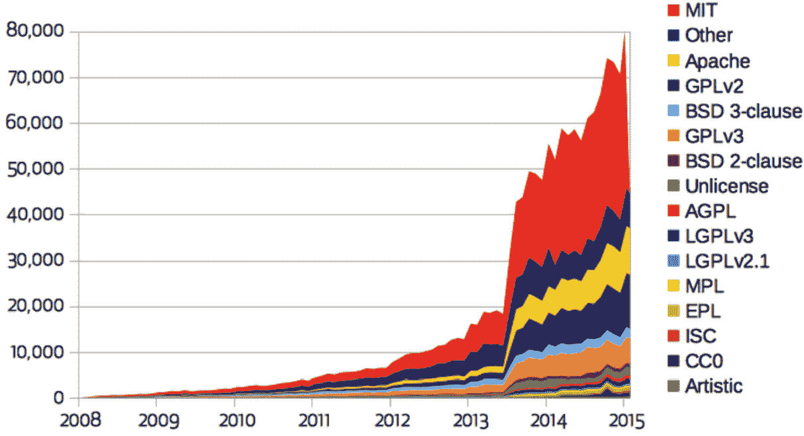
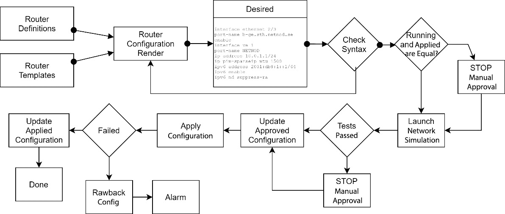
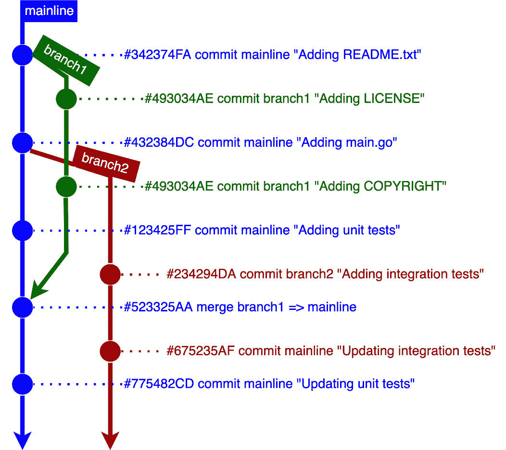

# 第五章：网络编程的禁忌与注意事项

为网络编写代码是令人兴奋的，因为当它失败时，挑战重重，而当它成功时，则令人满意。如果你是一位经验丰富的程序员，那么这个过程会容易一些，但如果你是新手，那么可能会遇到风暴。让我们深入了解一些有助于你更容易度过这些风暴的编码实践。

我们将专注于本章中与网络编程相关的 Python 和 Go 的编码方面。这里涉及的主题也适用于任何类型的编程；然而，我们将专注于网络编程的编程，以下是我们将涵盖的主题：

+   编码主题

+   在编码中应用最佳实践

+   编码格式化

+   版本控制和并发开发

+   测试你的代码

在本章结束时，你应该熟悉社区使用的编码术语以及其中哪些最重要。你将能够理解编码最佳实践以及如何成为一名更好的网络代码开发者。如果你是一位经验丰富的编码者，这将是一个很好的复习。如果你是新手，那么这一章将成为你编写代码时的座右铭。

# 编码主题

编写代码曾经非常简单直接；它只需要理解程序的工作流程、性能和算法。但今天，情况略有不同。编码现在有一个在过去几十年中演变的文化。最重要的是代码的可重用性，因此是它的风格。为了可重用，代码必须易于理解，并且应该有很少或没有错误或安全问题。

如果你刚开始编码，或者对网络编码不熟悉，了解今天编码文化中使用的所有主题是很重要的。让我们简要讨论本节中最重要的几个主题。

## 同行评审

不建议在没有**同行评审**的情况下编写代码并发布。同行评审可以让编码者与团队保持一致，避免不希望出现的错误。然而，对于大多数组织来说，这个过程可能很慢，有时甚至很昂贵。一个替代方案是使用软件机器人，它可以执行以前由另一位软件工程师完成的许多同行评审工作。

同行评审是由另一位具有检查团队标准、语言标准和社区最佳实践、分享知识、验证代码重复和命名约定、以及将设计与实现对齐等目标的开发人员进行的自觉和客观的评审。由于列表很长，同行评审过程并不容易和直接；有时评审代码的时间比编写代码的时间还要长。

## 生命周期

通过测量和存储创建日期、编译（如果有）和分发日期来跟踪你的代码是很重要的。这是通过某种生命周期管理来完成的。有了生命周期，就可以触发操作回到源代码，并验证当前的建议是否仍然适用于源代码，并检查是否存在任何新的安全漏洞。有一些工具可以自动对你的代码库和应用程序进行生命周期管理；在可能的情况下使用它们。

## 重构

在计算机编程中，**重构**（或**代码重构**）是指在不改变其输出和输入的外部行为的情况下改变代码的术语。重构可以用来修复错误、提高性能、移除安全漏洞或遵守新的代码风格。这里重要的是重构不会改变代码的功能。换句话说，外部行为、输入和输出都得到了保留。

重要提示

更多关于代码重构的信息，请访问网站 [`refactoring.guru/`](https://refactoring.guru/)。

## 代码复制和许可

在发布你的代码之前，你应该首先考虑**版权**和**代码许可证**。为什么？因为如果你的代码很好，它肯定会被其他人重用或被复制用于其他目的，除非你在许可证文件中严格指定复制的规则。此外，如果你正在导入或使用外部库，你可能会因为版权问题而受到损害。

因此，创建适当的许可证文件并阅读你使用或复制的代码的许可证文件是很重要的。这里列出了分配给软件的许可证类型：

+   **商业秘密许可证**：不公开信息；私人内部使用；未发表

+   **专有许可证**：拥有版权；没有公开许可证和源代码

+   **非商业许可证**：用于非商业用途且无源代码

+   **版权许可证**：授予使用权利；禁止重新许可和公开源代码

+   **许可许可证**：授予使用权利；允许重新许可和公开源代码

+   **公有领域许可证**：所有可能的授权

我们为什么关心这些类型的许可证？因为你不应该分发或发布你正在工作的软件。如果你违反了你在公司本地创建的代码的许可证协议，你可能会受到法律处罚和罚款。大多数情况下，你可能将重用他人的库或代码到主要软件中。在使用外部库或代码之前，最好的办法是咨询法律部门，检查是否有任何禁止内部使用的许可证。

因此，建议在编写代码时检查提供的许可证免责声明文档。它通常位于源代码的根目录中，用大写字母书写，名称如`LICENSE`或`LICENSE.rst`，但有时也使用`COPYRIGHT`、`COPYING`或类似名称来表达版权许可。

对于开源软件，代码也可以依赖于其他实体创建的定义中的规则；要做到这一点，你只需要阅读`LICENSE`文件并检查哪个被应用。在开源代码中最常用的一个是**MIT 许可证**。

在使用开源库或将其复制到你的代码之前，确保许可证不会对你的组织构成风险。在私有组织中重新使用时，风险最高的开源代码是**GPL 2.0**和**GPL 3.0**（**GNU 通用公共许可证**）。低风险的包括**MIT 许可证**、**Apache 许可证 2.0**和**BSD 许可证 2.0**。

以下表格显示了 GitHub 项目中使用最广泛的五个许可证：

| **排名** | **许可证** | **项目百分比** |
| --- | --- | --- |
| 1 | MIT | 44.69 |
| 2 | 其他 | 15.68 |
| 3 | GLP 2.0 | 12.96 |
| 4 | Apache | 11.19 |
| 5 | GLP 3.0 | 8.88 |

表 5.1 – GitHub 项目中使用最广泛的许可证排名

以下截图显示了 GitHub 项目许可证从 2008 年到 2015 年的演变。注意 MIT 许可证的增长：



图 5.1 – GitHub 项目中的许可证使用情况（来源：github.blog）

现在你已经熟悉了最流行的代码许可证，让我们继续讨论代码质量和认知。

## 代码质量和认知

**代码质量**是软件工程师中常听到的术语，但为了非常清楚，这不是一个容易的主题，质量的定义通常是主观的，并容易受到个人偏好的影响。

为了避免这种含糊的定义，代码质量应侧重于团队或公司的指南和标准。如果你刚刚开始的公司有宽松或没有代码指南，代码的*质量*可能依赖于资深工程师。但这是必须的——并且应该避免。

应该使用标准和代码实践来衡量代码质量，而不是个人。如果你的团队没有标准或代码实践，使用本章来指导你创建一个。

在定义代码质量时，尽量使用可衡量的指标，这样软件工程师可以理解低质量代码，而无需将其个人化。在代码中寻找以下特征：

+   **可靠性**：衡量代码在无故障的情况下运行了多少次

+   **可维护性**：衡量代码如何容易更改，包括大小、复杂性和结构

+   **可测试性**：衡量代码如何被控制、观察和隔离以创建自动化测试，例如单元测试（将在本章后面的*测试你的代码*部分讨论）

+   **可移植性**：代码在不同环境中运行的容易程度

+   **可重用性**：衡量代码可以通过依赖关系或复制进行重用的程度

在可能的情况下，使用能够分类和格式化代码的自动化工具，这样可以避免个人主观分析。

## 架构和建模

软件架构和设计是一个非常广泛且漫长的主题。根据你项目的大小，在与网络自动化代码一起工作时，你可能不需要进行设计或架构。然而，了解它们的存在并且能够有效地使用它们来获得更好的代码结构和更好的组织是很重要的。

我建议软件架构最重要的部分是建模，这在代码的早期阶段验证结构和组织非常有帮助。与客户通过模型进行沟通很容易，即使你不是软件开发者也能理解。

最常用的模型是**统一建模语言**（**UML**），作为通用语言，**系统建模语言**（**SysML**），UML 的一个子集，**面向服务的架构建模语言**（**SoaML**），也是 UML 的一个子集，以及**C4 模型**。选择哪一个不重要；在开始编码之前使用任何模型都将帮助你编写正确的代码。

让我们以*第四章*中描述的部署管道为例，创建一个解决方案的软件模型。*图 5.2*说明了它将是一个非常简单的部署管道模型：



图 5.2 – 第四章中描述的部署管道软件模型示例 Chapter 4

上述图表使用箭头和方框说明了开发者如何处理构建部署管道的问题。输入是路由定义和模板，然后配置渲染创建配置并将其存储在所需状态。检查语法，然后验证运行配置是否等于 `applied`。如果不等于，则停止并等待人工干预；如果一切正常，则启动网络模拟。然后，进行所有测试。如果测试通过，则更新批准的配置。下一步是将配置应用到路由器上，如果正确应用，则更新 `applied` 配置。

在本节中，我们讨论了一些现在在开发社区中使用的代码文化话题。在下一节中，我们将深入探讨编写 Python 和 Go 代码的最佳实践。

# 应用编码最佳实践

这里有一些点可能不是标准，但在我们编写网络代码时很重要。

## 遵循标准

在 20 世纪 90 年代，互联网开始迅速增长，程序员开始在社区中更加活跃。Shell 脚本开始作为一种可行的工具帮助系统工程师处理他们的服务器。然后出现了**Perl**，作为一种强大的脚本语言来提供帮助。其他语言也变得成熟，如 C、C++和 Java。但每个开发者都以自己的风格编写代码，这不利于代码协作，使得代码共享成为一场灾难。当 Python 被创建时，编码风格问题已经存在。必须做些事情来避免在代码共享时产生混淆。

现在我们来看看 Python 和 Go 语言的编码标准是什么。

### Python 标准风格

Python 可以用很多不同的方式编写。如果你是一位老程序员，你会记得 Perl，它就像 Python 一样是一种脚本语言，但没有特定的风格，这造成了一团糟。有一些文档可以帮助程序员在 Python 中编写更好的代码。这些文档是由 Python 社区创建的，它们被称为**PEPs**，代表**Python 增强提案**。

最初，PEP 流程是为了提出和讨论对新特性的共识而创建的，但它也被用来记录信息。PEP 类似于 Python 的互联网**请求评论**（**RFC**），在描述新特性时，它必须包含对该特性的详细描述以及创建它的理由。

当提出 Python 的新特性时，作者负责在社区内建立共识，描述不同的选项，收集社区的反馈，并对其进行记录。

一些 PEP 是信息性的，基本上用于指导 Python 编码风格。如果你打算成为一名 Python 代码开发者，一个 PEP 就像你的日常日记，用来检查和阅读。保持对最新 PEP 的更新很重要，并确保你的代码遵循这些建议。

到目前为止，有一些有用的 PEP（Python Enhancement Proposals）可以帮助社区在如何用 Python 编写代码方面获得指导和最佳实践。让我们来看看其中最重要的几个。

#### 在 PEP-8 的指导下编写代码

*PEP-8*可能是如果你是 Python 新手的话必须阅读的最重要 PEP，因为它详细描述了在 Python 中编写代码时的所有风格和约定。尽管语言在编写代码时并不强迫你选择一种风格，但使用*PEP-8*（或*PEP8*）会使你的代码对 Python 社区中的任何人来说都更容易理解。

当你对 Python 还不太熟悉时，可能很难记住你几周或几天前写的代码的一部分原本是要做什么的。然而，如果你遵循*PEP-8*，你可以确信你已经很好地命名了变量，添加了足够的空白，并且很好地注释了代码。遵循这些指南将使你的代码对他人以及你自己在一段时间后回来阅读时更加易读。初学者在遵循*PEP-8*时也会更快、更轻松地学习 Python。

*PEP-8* 文档非常清晰；它展示了错误代码风格，然后是正确风格，并解释了为什么使用这种风格。

### Go 标准风格

在描述 Go 语言的标准之前，重要的是要注意，Go 语言也被称为 `golang.org`。现在，Go 语言托管在 `go.dev` 上。

在代码格式和风格方面，Go 与 Python 相差甚远。Go 没有类似于 PEP 的文档来指出如何在 Go 中编写更好的代码。因此，风格标准主要依赖于内部格式化工具，称为 `gofmt`，它负责以可预测的方式格式化源代码。

虽然可以跳过 `gofmt` 格式化器，但强烈建议在更改代码后以及发布之前使用它。一些工具在运行或编译你的 Go 程序之前会自动运行格式化器。除了 `gofmt` 之外，还有 Go **linters** 可以指出风格错误或可疑结构；我们将在本章后面的 *编码格式化器* 部分描述这些。

此外，Go 社区已经发布了几个有助于编写更好代码的指南。以下是其中最好的几个：

+   [`github.com/uber-go/guide/blob/master/style.md`](https://github.com/uber-go/guide/blob/master/style.md)

+   [`github.com/dgryski/awesome-go-style`](https://github.com/dgryski/awesome-go-style)

+   [`staticcheck.io/docs/checks/`](https://staticcheck.io/docs/checks/)

## 仔细编写代码

大多数时候，我们将阅读代码而不是编写代码，因为编写代码的过程会驱使我们阅读代码的其他部分。所以，你知道你的代码去哪里了，你的代码是如何遵循现有设计的，以及现有代码的行为，这样它就不会崩溃。这里的重要点是，即使你没有打算与他人分享你的代码，你可能在几个月后就会忘记它，如果你可能需要更新它，你将很难理解它做了什么。所以，编写代码时始终要考虑到有人会阅读它，即使这仅仅是你自己。

因此，编写代码的过程必须比阅读代码的过程更加谨慎。当有人阅读代码的一部分时，它不应该产生任何疑问；它应该是直截了当的，易于理解，并且快速掌握。

## 使其极其易于阅读

编写代码时，不要节省单词或短语。如果你有机会在编写代码时选择错误，请选择一个过度解释你代码的错误。为什么？因为你的代码应该被任何人理解，包括几个月或几年后的你。因此，确保你的代码易于理解和跟踪，对于新手来说也是如此。

## 注释你的代码

代码应该易于理解；然而，有时，对代码进行注释以帮助读者和审阅者理解代码是必要的。当你想要强调代码中的细微差别、描述某些算法的细节或警告读者有关某些异常时，你应该在代码中添加注释。

### 注释标题

注释中的某些文本标题用于帮助读者避免在应该或可能需要更改的代码上浪费时间。当你开始与团队一起编码时，检查用于帮助代码阅读者和代码审阅者的术语。这里列出的注释标题不是固定的，它们在不同的组织和团队之间会有所变化。以下是最受欢迎的注释标题：

+   `TODO`: 可能最常用的注释是`TODO`，它用于指定需要添加或重构的代码部分。这个注释帮助审阅者避免在需要修改的代码块上浪费时间。

+   `FIXME`: 一些开发者在编写代码时也会使用`FIXME`注释标题，它指定了代码中错误、丑陋、性能问题或过于复杂的部分。当你知道某些东西是错误的并且应该尽快修复时，请使用`FIXME`。

+   `HACK`: 这个文本标题用于指定有解决错误或帮助性能的绕过方案的代码部分。`HACK`标题也是另一个重要的注释，向读者展示一个快速修复方案，稍后将其修复，帮助他们理解为什么代码的这一部分存在。

+   `BUG`: 这个标题用于显示代码中的问题，必须尽快修复。作者已经识别了问题，并决定将代码的这一部分作为错误进行注释。代码审阅者可以评估并决定是否需要接受带有错误的代码或要求更正。同样，这些注释节省了审阅者的时间，因为他们不需要深入评估代码的这一部分。当你看到代码中的问题时，请使用此功能。

+   `注意`: 这个标题是为了让作者与读者沟通一些值得注意的陷阱或特定细节，以帮助读者更快地理解代码。要明智地使用它们，以帮助审阅者理解，因为过多的`注意`标题也可能令人烦恼并造成干扰。

### 文档字符串

文档字符串指的是在 Python 中用于描述模块、函数、类或方法的注释字符串。文档字符串是 Python 特有的，在*PEP-257*中有详细说明。

一些**集成开发环境**（**IDEs**）如 PyCharm 和 IntelliJ 在你定义函数时将自动为你创建文档字符串。

这里是一个 Python 函数多行文档字符串的例子：

```py
def router_connection(hostname, timeout):
    """Perform a connection to a router
    :param string hostname:
    :param int timeout:
    :return: True | False
    """
    print("Connecting to host", hostname)
    .
    .
    .
    return True
```

注意，文档字符串始终以三重双引号（`"""`）开始和结束。前面的例子只是一个建议，其他样式也是可能的。要可视化所有可能的样式，请阅读*PEP-257*中的文档字符串约定。

注意

Docstring 文档可以在 [`peps.python.org/pep-0257/`](https://peps.python.org/pep-0257/) 找到。

### Godoc

在 Go 语言中，有 g`odoc`，它比 docstring 简单，因为它不是一个语言构造或机器可读的语法；它只是字符串文本注释。惯例很简单：要注释变量、函数、包或常量，只需在其声明之前直接写注释。以下是在 Go `math` 包中用于 `Asin` 函数的注释示例：

```py
// Asin returns the arcsine, in radians, of x.//
// Special cases are:
//
//    Asin(±0) = ±0
//    Asin(x) = NaN if x < -1 or x > 1
func Asin(x float64) float64 {
    if haveArchAsin {
        return archAsin(x)
    }
    return asin(x)
}
```

注意，在这个例子中，注释放在 `Asin` 函数之前，并详细描述了函数及其特殊情况。注释总是以双斜杠（`//`）开头的文本。

以下示例取自 Go 源代码 [`github.com/golang/go/blob/master/src/math/asin.go#L14-L25`](https://github.com/golang/go/blob/master/src/math/asin.go#L14-L25)。

在 Go 中注释你的代码后，添加与前面示例中类似的功能说明。开发者可以使用 `godoc` 工具，该工具提取文本并生成 HTML 或 TXT 格式的文档。

注意

`godoc` 文档可在 [`pkg.go.dev/golang.org/x/tools/cmd/godoc`](https://pkg.go.dev/golang.org/x/tools/cmd/godoc) 找到。

## 使用 IP 库

对于网络编程的新手来说，可能会认为 IP 地址可以像字符串或字符列表一样处理。但在处理网络时，使用相应的 IP 库从文本文件中加载 IP 或从循环中创建 IP 非常重要。你可能想避免使用字符串作为 IP 的几个原因如下：

+   避免超出 IP 范围的数字，例如数字 256

+   避免格式不正确的文本 IP 地址

+   确保不要与其他空间地址重叠

+   容易找到网络、掩码和广播地址

+   容易从 IP 版本 4 转换到 IP 版本 6

让我们来看看如何在 Python 和 Go 中使用这些 IP 库。

### Python 中的 IP 库

在 Python 3.3 版本之前，Python 中的 IP 地址库不是原生存在的。在 3.3 版本之前，Python 程序员必须使用外部库来处理 IP 地址。Python 在意识到其重要性后，必须将此库内部化。这一过渡在 *PEP-3144* 中进行了记录([`peps.python.org/pep-3144/`](https://peps.python.org/pep-3144/))。

#### 使用 Python 进行 IP 操作的示例

首先，让我们打印出子网中的所有有效 IP 地址：

```py
import ipaddress

network = ipaddress.ip_network("10.8.8.0/30")
print(list(network.hosts()))
```

这里是输出结果：

```py
[IPv4Address('10.8.8.1'), IPv4Address('10.8.8.2')]
```

注意，输出类型是 `IPv4Address` 而不是字符串。`ipaddress.ip_network()` 方法会自动检测它是一个 IPv4 还是 IPv6 地址。

现在，让我们打印出较大子网中存在的子网，排除一个子网：

```py
import ipaddress

network = ipaddress.ip_network("10.8.8.0/24")
subnet_to_exclude = ipaddress.ip_network("10.8.8.64/26")
print(list(network.address_exclude(subnet_to_exclude)))
```

这里是输出结果：

```py
[IPv4Network('10.8.8.128/25'), IPv4Network('10.8.8.0/26')]
```

注意，输出中的类型不再是之前的 IP 地址类型，而是一个名为 `IPv4Network` 的网络类型。

### Go 中的 IP 库

Go 与 Python 不同，因为 IP 地址库是在 Go 语言的第一版之后出现的。Go 中的 IP 操作比 Python 中更快，因为 Go 不是像 Python 那样被解释，而是被编译。

#### 使用 Go 进行 IP 操作的示例

在 Go 语言中，我们首先将检查一个 IP 地址是否属于一个子网：

```py
import (
    "fmt"
    "net"
)

func main() {
    _, subnet, _ := net.ParseCIDR("10.8.8.0/29")
    ip := net.ParseIP("10.8.8.22")
    fmt.Println(subnet.Contains(ip))
}
```

这里是输出：`false`。

IP 地址 `10.8.8.22` 不属于 `10.8.8.0/29` 子网，因为程序输出 `false`。

下一个示例检查一个子网是否属于另一个子网：

```py
import (
    "fmt"
    "net/netip"
)

func main() {
    first_subnet := netip.MustParsePrefix("10.8.8.8/30")
    second_subnet := netip.MustParsePrefix("10.8.8.0/24")

    fmt.Println(second_subnet.Overlaps(first_subnet))
}
```

这里是输出：`true`。

在这个例子中，`first_subnet` 属于 `second_subnet`，因此它们重叠。请注意，在这个例子中，我们使用了 `"net/netip"` 导入而不是 `"net"`，这是 Go 语言中引入的一个较新的 IP 操作包。

在比较方面，Python 的内置库在 IP 操作方面比内置的 Go IP 包具有更多功能。另一方面，Go 操作 IP 地址的速度更快。

如果你正在寻找 `net` 或 `net/netip` 中不存在的特定 IP 操作功能，你可以使用一个新开发的社区包 `inet.af/netaddr`，详情请见 [`pkg.go.dev/inet.af/netaddr`](https://pkg.go.dev/inet.af/netaddr)。

## 遵循命名规范

在开始发布任何代码以供审查之前，与你的团队核实本地开发命名规范是明智的。可能会有一些特定的差异，在你的组织中使用可能会出现问题。在这里，我们将描述最流行的命名规范，但请根据你当地的团队文化进行适当调整。

在开始描述命名规范之前，让我们定义三种书写多词名称的方式，如下所示：

+   `myFirstTestName`

+   `MyFirstTestName`

+   `my_first_test_name`

在定义常量的情况下，大多数编程语言中名称中的所有字符都必须是大写。因此，蛇形命名法始终使用小写，除非名称描述的是常量。以下是一个描述常量的名称示例，它将定义最大存储容量：`MAX_STORAGE_CAPACITY`。

### Python 中的命名

对于 Python，编写变量名时有一些规则需要遵循。以下是一个简短的列表，说明应该做什么：

+   变量名只能以字母或下划线字符（`_`）开头

+   变量名只能包含字母数字字符和下划线

+   变量名决不能以数字开头

+   破折号（`-`）仅用于包和模块名称，决不用于变量

+   变量名开头的双下划线字符在 Python 中是保留的

+   类名使用帕斯卡命名法

+   模块名和函数使用蛇形命名法

+   Python 中的常量使用全部大写字母——例如，`MYCONSTANT`

注意

Google 为 Python 创建了一个出色的命名规范指南，公开可访问于 [`google.github.io/styleguide/pyguide.html#316-naming`](https://google.github.io/styleguide/pyguide.html#316-naming)。

### Go 中的命名

对于 Go 语言，有一些规则需要遵循。以下是一些主要规则的列表：

+   变量名使用驼峰式（camel case）或帕斯卡式（pascal case）。

+   与变量名一样，函数名也使用驼峰式或帕斯卡式。

+   变量或函数名不以数字开头。

+   变量和函数名仅使用字母数字字符。

+   破折号或下划线通常不用于命名。

+   Go 允许使用蛇形命名法（snake case）来命名变量，但请检查您所在组织的命名规范是否允许这样做，因为在 Go 社区中不常用蛇形命名法。

+   Go 中的常量与 Python 中的类似：使用全部大写字母。

此外，Go 与其他语言有一个特别的不同之处，它使用大写字母在 Go 包（或模块）内部的变量中。因此，如果变量名以大写字母开头，通常是一个可以从 Go 包外部访问的变量。当变量以小写字母开头时，它通常是一个局部变量，只能在同一 Go 包内的代码中访问。

注意

可以在 [`go.dev/doc/effective_go`](https://go.dev/doc/effective_go) 获取 Go 中命名的好参考。

## 不要缩短变量名。

在计算机编程的早期，变量名必须小写以在保存未编译代码时节省内存空间。但如今，这已不再是问题，因此在编写变量名时无需考虑内存节省。

如果您需要编写一个变量来表示飞翔的鸟的数量，请使用蛇形命名法写成 `number_of_birds_flying` 或驼峰式命名法写成 `NumberOfBirdsFlying`。

如果您在列表推导式或循环中的变量（如计数器或索引）中使用变量，则对此规则有一个例外；在这种情况下，使用缩写变量是可以接受的。

## 避免复杂的循环。

循环被添加到代码中有几个原因：增加、与列表交互、重复操作和读取流等。可以使用循环处理确定或非确定的大小，这在不知道将要交互的内容时非常有用。

但无论您在代码中使用循环的意图是什么，都要明智地使用它们，以免它们变得难以阅读或过于复杂。一个很好的经验法则是避免循环内部有太多的行。我会说 20 行应该是极限。另一个好的做法是避免嵌套循环或循环中的循环。如果您必须进行嵌套循环，请将层数限制在不超过两层。嵌套循环难以阅读，当它们内部有太多行时，情况会更糟。

那么，创建少于 20 行的循环的最佳方法是什么？建议是将几个操作组合成可以在循环内调用的函数。给函数命名，使其能够完成你想让它做的事情，并将操作添加到其中。当你阅读循环时，函数调用将很容易被发现，函数的名称将表明操作在做什么，这非常容易阅读和理解。此外，使用这种方法编写单元测试也更容易。

如何避免嵌套循环？使用函数来调用循环。相反，你也可以使用生成器、列表推导式或映射来避免循环。使用映射的优势在于，你不需要与之交互，因此可以使你的代码运行得更快。列表推导式在 Python 中使用。生成器可以在 Python 中使用，在 Golang 中通过 goroutines 实现。所以，每当你需要嵌套循环时，尽量不要使它过于复杂，如果可能的话，使用这些机制之一来避免它。

## 不要重复代码

在软件开发中，有一个术语称为 **DRY** 或 **Don’t Repeat Yourself**。开发者最糟糕的事情就是重复代码。是的，这是很糟糕——真的很糟糕。为什么？因为如果你在多个地方重复执行同一个任务的代码，那么每次你想修改这个任务时，你都需要在多个地方执行同样的更改。另一个问题是，你将不得不为同一个任务编写多个单元测试。

DRY 的反面是 **WET**，代表 **Write Everything Twice**。WET 解决方案可能发生在多层架构中，开发者有不同的任务，最终可能会出现重复。DRY 方法应该通过使用帮助开发者避免重复的框架来消除代码冗余。

在本节中，我们看到了一些示例，说明了我们如何在编写代码时使用最佳实践。在下一节中，我们将探讨如何使用工具帮助我们编写更好的代码。

注意

在编写代码的最佳实践方面还有许多建议。更详尽的列表可以在[`github.com/golang/go/wiki/CodeReviewComments`](https://github.com/golang/go/wiki/CodeReviewComments)和 https://go.dev/doc/effective_go 找到。

对于 Python，我推荐斯科特·迈耶斯的《Effective Python》。

# 代码格式化工具

现在我们可以看到，在 Go 或 Python 中编写代码时，有许多规则和约定需要遵循，而且列表很长，这对于初学者来说并不有帮助。但是，多亏了社区，有一些工具可以帮助你修复代码格式。这些工具可以自动修复你的代码或提出修改建议。让我们看看 Python 和 Go 的一些代码格式化工具。

## Python Black

**Black** 是一个非常流行的 Python 代码格式化工具。它是符合 *PEP-8* 的，因此它会检查所有的 *PEP-8* 建议。默认运行会将代码重新格式化为 *PEP-8* 兼容，但你也可以运行它作为预览来识别代码更改建议。

使用 Black，可以自动修复 Python 代码。以下是一个为 Python 编写的错误代码示例：

```py
if long_variable_name is not None and \
 long_variable_name.field > 0 or long_variable_name.is_debug:
 z = 'hello '+'world'
else:
 world = 'world'
 a = 'hello {}'.format(world)
 f = rf'hello {world}'
```

运行 Black 后，代码将看起来像这样：

```py
if (
    long_variable_name is not None
    and long_variable_name.field > 0
    or long_variable_name.is_debug
):
    z = "hello " + "world"
else:
    world = "world"
    a = "hello {}".format(world)
    f = rf"hello {world}"
```

Black 确实应用了所有*PEP-8*的建议，并且也有自己的风格。在先前的例子中，Black 正确地更改了`if`语句并添加了正确的缩进。此外，它将字符串赋值从单引号更改为双引号。没有具体的 PEP 指定你必须用双引号或单引号编写字符串，但 Black 自己的风格使用双引号来表示字符串。

我个人认为，某些字符串使用单引号而其他字符串使用双引号的代码看起来非常丑陋。因此，我建议只使用双引号来表示字符串，就像 Black 一样。

注意

更多关于 Python Black 的信息，请参阅[`github.com/psf/black`](https://github.com/psf/black)。

## Python isort

一个实际上不容易解释的重要部分是 Python 代码中存在的导入行。有时有数十个导入，如果它们没有得到适当的组织，就很难意识到哪些被使用，哪些没有被使用。

感谢`isort`实用程序，可以修复`import`语句，正确分组它们，并自动排序。

这里有一个示例代码，它有一个松散且丑陋的`import`语句：

```py
from central_lib import Path
import os
from central_lib import Path3
from central_lib import Path2
import sys
from my_lib import lib15, lib1, lib2, lib3, lib4, lib5, lib6, lib7, lib8, lib9, lib10, lib11, lib12, lib13, lib14
import sys
```

运行`isort`后，代码看起来像这样：

```py
import os
import sys
from my_lib import (lib1, lib2, lib3, lib4, lib5, lib6,
                    lib7, lib8, lib9, lib10, lib11, lib12,
                    lib13, lib14, lib15)
from central_lib import Path, Path2, Path3
```

注意，`isort`将导入分组并按可预测的方式排序。如果你需要添加额外的导入，你不会重复或遗漏它们。

注意

更多关于`isort`的信息，请参阅[`pypi.org/project/isort/`](https://pypi.org/project/isort/)。

## Python YAPF

虽然*PEP-8*指南可能允许你以其他开发者会欣赏的方式编写代码，但这并不一定意味着你的代码看起来很好。**YAPF**的缩写实际上在工具页面上没有解释，但它可能意味着**另一个 Python 格式化工具**。

在本质上，YAPF 与 Black 类似，除了遵循*PEP-8*建议外，它还有自己的风格，但一个主要区别是它可以配置以微调样式格式。

YAPF 基于由 Daniel Jasper 开发的`clang-format`，它使用 YAPF 风格指南对原始代码进行重新格式化，即使原始代码没有违反任何*PEP-8*指南。如果在整个代码中使用，则整个项目的风格保持一致，并且审查者不需要在代码审查期间讨论或争论风格。

注意

更多关于 YAPF 的信息，请参阅[`github.com/google/yapf`](https://github.com/google/yapf)。

YAPF、`isort`和 Black 是三大 Python 代码格式化工具，但 Python 格式化工具的列表非常广泛。其他格式化工具可以在[`github.com/life4/awesome-python-code-formatters`](https://github.com/life4/awesome-python-code-formatters)找到。

## Go gofmt

Go 语言自带一个格式化工具，它包含在 Go 语言包中，称为`gofmt`。其目标与 Python Black 和 Python YAPF 类似，即格式化源代码到最佳格式，并保持一致性。格式化工具与`go`命令行工具一起使用——例如，`go fmt myprogram.go`。

一些平台在每次你想构建或运行 Go 程序时都会自动运行`gofmt`。

## Go golines

`golines`是一个格式化工具，除了修复`gofmt`所做的修复外，还可以缩短长行。这个格式化工具之所以被创建，是因为`gofmt`不会打断长行，当行太长时很难可视化。

在运行`golines`之前，这是一个示例：

```py
myVariable := map[string]string{"a key": "a value", "b key": "b value", "c key": "c value", "d key": "d value", "e key": "e value"}
```

运行`golines`后，代码看起来像这样：

```py
myVariable := map[string]string{
            "a key": "a value",
            "b key": "b value",
            "c key": "c value",
            "d key": "d value",
            "e key": "e value"
}
```

关于`golines`如何工作的更多详细信息，请参阅[`yolken.net/blog/cleaner-go-code-golines`](https://yolken.net/blog/cleaner-go-code-golines)。

## Go golangci-lint

编程语言代码检查器或 linter 是一种用于指出源代码中的错误、bug、风格错误和可疑结构的软件。它不会自动修复这些问题，而是标记错误和警告以便修复。对于 Go 语言，最好的 linter 包是`golangci-lint`，详细信息请参阅[`golangci-lint.run/`](https://golangci-lint.run/)。最初用于 Go 语言的原始 linter 位于[`github.com/golang/lint`](https://github.com/golang/lint)，但由于缺乏贡献而被弃用并冻结。

`golangci-lint`可以执行几个检查。这里列出了默认最重要的检查：

+   `govet`：检查`Printf`调用中的格式字符串是否有正确对齐的参数

+   `unused`：检查未使用的变量、函数和类型

+   `gosimple`：指出可以简化的代码部分

+   `structcheck`：验证未使用的结构体字段

+   `deadcode`：验证未使用的任何代码

可以在[`golangci-lint.run/usage/linters/`](https://golangci-lint.run/usage/linters/)找到可用的完整 linter 列表。

注意

可以在[`github.com/life4/awesome-go-code-formatters`](https://github.com/life4/awesome-go-code-formatters)获取额外的 Go 代码格式化工具列表。

有许多其他优秀的工具可以格式化你的代码，不仅限于命令行工具，还包括集成 IDE 格式化工具。本节创建的目的是介绍 Python 和 Go 使用的某些工具，并展示如何使用它们来帮助你的代码改进。在下一节中，我们将讨论如何在开发代码时使用工具来帮助并发开发和版本控制。

# 版本控制和并发开发

现在，编写代码不仅关乎你创建的代码行数，还关乎其他人编写的代码，以贡献到你的软件中。此外，有变更的代码需要一些关于变更原因的信息，以及一些版本标签来识别这些变更，以便开发者可以轻松地回滚更改或在不同版本测试或部署时使用。

在编写代码时，我们如何完成这样的任务？最好的答案是使用版本控制系统。如今，最受欢迎的免费工具是 **Git**、**SVN**、**Mercurial** 和 **CVS**。Git 无疑是其中最受欢迎的，这基本上是因为 Linux 和 GitHub 网站的增长。*表 5.2* 展示了这四种版本控制系统的快速比较。

| **版本控制系统** | **创建年份** | **著名于** | **网站** |
| --- | --- | --- | --- |
| Git | 2005 | Linux 和 [github.com](http://github.com) | [www.git-scm.com](http://www.git-scm.com) |
| SVN | 2000 | FreeBSD 和 [sourceforge.com](http://sourceforge.com) | [subversion.apache.org](http://subversion.apache.org) |
| CVS | 1986 | NetBSD 和 OpenBSD | [www.nongnu.org/cvs/](http://www.nongnu.org/cvs/) |
| Mercurial | 2005 | Python 和 Mozilla | [www.mercurial-scm.org](http://www.mercurial-scm.org) |

表 5.2 – 最受欢迎的版本控制系统比较

编写代码时，建议使用源代码版本控制系统，这允许多个开发者以相同的方式编辑软件，从而避免在不同步更改的情况下向系统中添加代码。版本控制系统中使用了几个不同的术语；这些术语在不同的系统如 Git 或 SVN 中几乎相同。

让我们描述一下版本控制系统中最常用的命令。

## clone

`clone` 是一个命令，用于将整个源代码（包括子目录和版本控制系统数据）复制到您的本地目录。

以下是在 Git 中使用该命令的示例：`git clone https://github.com/brnuts/matrix.git`。

## checkout

`checkout` 是一个命令，用于将工作目录中的文件更新为与源树源代码匹配。它还用于切换到另一个代码分支。

以下是在 Git 中用于更新当前分支的命令示例：`git checkout`。

以下是一个在 Git 中用于检出另一个分支的示例：`git checkout mybranch`。

## commit

在更改源代码时，建议更改小块代码，每个小块更改都应该附上描述更改的文本标签。`commit` 命令是一个将文本标签添加到代码和检查点编号的命令。随着代码的变化，您会对每个小块更改添加提交。当整个更改完成后，您将有一个包含多个提交文本说明的更改日志，帮助读者理解更改的原因和方法。

## 主分支

**主分支**通常是代码的主要 **分支** 的名称。代码的其他分支通常从主分支或其他分支分支出来，分支后有一个父分支。在这个意义上，主分支是一个没有父分支的分支。

主分支也被称为源代码树的主干，有时也称为 **master** 或 **基线**。

## 分支

您可以使用版本控制系统在代码中创建分支。一个 **分支** 通常是从另一个分支分叉出来的代码。拥有分支的目的是在不干扰父分支的情况下对代码进行特定的更改。

代码分支可以拥有所需的所有更改，当准备就绪时，可以使用 `merge` 命令将其添加到父分支。

使用分支有几个优点——其中之一是通过在分支上添加几个小的更改 **提交** 来阐明大改动的意图，并对每个更改进行解释。另一个优点是允许其他开发者继续向父分支添加更改。

没有父分支的分支是主分支或主分支。

## 合并

代码 `merge` 命令检查代码是否可以添加而不会干扰主分支代码。如果有干扰，它将创建代码 `merge` 命令也可以在单个分支之间进行，而不需要主分支。

合并技术是用于合并分支而不影响与其他代码不同的任何代码的最安全的技术。但有时，需要解决的冲突太多，这可能不可行。当这种情况发生时，建议开始一个新的分支，并尝试添加更改，最终逐步合并，或者使用 `rebase` 命令，如果需要，允许将提交交互式地应用于另一个分支。

看看下面的图：



图 5.3 – 主分支提交和分支的描述

*图 5.3* 展示了一个示例，其中包含了主分支和分支的版本控制系统的所有详细信息。您还可以看到为每个分支和主分支所做的提交和合并。请注意，分支 1（绿色）是为了添加两个文件而创建的，称为 `LICENSE` 和 `COPYRIGHT`，然后被合并到主分支。分支 2 是从 `432384DC` 提交创建的，尚未合并到主分支。

在本节中，我们探讨了版本控制工具在并发开发代码时如何大有裨益。尽可能使用版本控制系统来组织您的开发。在下一节中，我们将探讨为什么以及如何将测试添加到我们的代码中。

# 测试您的代码

测试代码是另一个在过去几十年中增长的主题。在 70 年代初，测试代码实际上并不是开发过程的一部分，而是在软件出现问题时作为调试过程的一部分。当美国计算机科学家 Glenford Myers 在 1979 年发表了经典书籍 *软件测试的艺术* 时，测试变得重要，他提出了将调试与测试分离。

从那时起，开发过程中的测试得到了很大的改进。如今，重点是防止错误，而使用测试来防止错误的代码开发过程被称为**测试驱动开发**或**TDD**。

在开发代码的过程中，开发者必须识别代码的两大部分：**可测试**和**不可测试**的代码。可测试的代码是指那些可以通过低级测试（如单元测试）轻松验证的代码片段。不可测试的代码（如库的导入）则是在较低级别上不易测试的代码片段，通常需要通过高级测试（如集成测试）进行测试。

因此，在编写代码时，开发者必须注意何时以及如何对该代码部分进行测试。开发者将很容易识别哪些代码部分可以使用低级或高级测试。有多个测试级别。以下小节中，我们将讨论其中的一些。

## 单元测试

**单元测试**是测试的较低级别，因为它们旨在覆盖代码的小部分，这是可以逻辑上隔离的最小代码片段。这些代码片段可以是子程序、函数、方法、循环或属性。单元测试的目标是证明代码的各个部分是正确的，并且当它们在方法或函数中使用时，确保它们按预期工作。

如果在未来，代码的库或模块进行了升级或重构，之前创建的单元测试能够识别代码是否仍然适用于这些变化，使其对升级过程中可能引入的最终错误具有鲁棒性。为此，必须编写单元测试来覆盖所有函数、模块、方法和属性；然后，无论发生什么可能导致故障的变化，都会被单元测试迅速识别。

单元测试可以以多种方式编写：有些人会先写一个函数，然后为这个函数编写单元测试；有些人会先编写单元测试，然后编写函数。当单元测试首先编写时，这通常被称为**测试驱动开发**（**TDD**）或**极限编程**（**XP**）。

由于某些代码无法通过单元测试进行测试，每个团队和组织都有一个用于评估每个软件包的**测试覆盖率**参数。这个数字各不相同，但通常软件包的测试覆盖率高于 50%，所有新引入的功能和方法则高于 80%。

当一个函数或方法有明确的输入参数和一些输出时，单元测试很容易创建，但当函数与外部元素（如数据库）交互时，创建单元测试就不那么容易了。为了处理这些外部环境，一些语言有**模拟能力**（或**模拟**）来模拟外部行为，而不实际执行。

如果代码的一部分不可进行单元测试（没有可用的模拟），它可能会被更高级别的测试覆盖，就像我们接下来要讨论的那样。

## 集成测试

**集成测试**用于填补无法通过单元测试执行的测试的空白。这些通常是涉及或需要外部环境，如数据库、外部文件或服务 API 的测试。

从测试顺序的角度来看，集成测试是在单元测试成功完成后和**端到端测试（E2E**）（如果需要）之前的第二步。集成测试通常在模块和功能方面使用更广泛的代码覆盖率。它将它们组合成一个大的聚合体，并应用测试计划来验证预期的输出。单个函数和模块使用单元测试进行测试。在集成测试期间，它们不一定单独测试，而是在一个更高级别的组中测试。

设置一个可以支持集成测试的测试环境，例如外部测试数据库，这是很重要的。在集成测试期间，单元测试中添加的模拟不再使用，而是使用真实的外部测试环境。外部测试环境通常与生产环境分离，并专门用于集成测试。

在执行集成测试时，测试环境应该以与生产环境相同或至少非常接近的方式表现。在集成测试通过后，具有类似的生产行为，我们可以更有信心地认为软件将在生产环境中运行。

单元测试可以在某人的电脑上运行；另一方面，集成测试不能运行，因为它们依赖于一个验证软件外部通信的测试环境。有人可能会说，*在你的电脑上设置一个集成测试环境*，但那样的话，就无法验证一些需要一致性的测试了。

## 端到端测试

大多数测试可以通过单元测试和集成测试来完成；然而，可能还有一些测试仍然缺失。**端到端测试（E2E tests**）在另一个测试级别中被添加，这将评估整体软件，包括性能，在一个类似生产环境下的表现。

如果可能并且允许的话，理想的方式是在生产环境中运行端到端测试。如果无法在生产环境中运行，可以使用一个隔离的类似生产环境。目标是模拟软件从开始到结束的真实场景，以便通过测试可以验证软件，并且可以在生产环境中无限制地使用。

在测试时间和周期方面，端到端测试应该最后运行，因为这些测试的运行时间比集成测试长得多。测试覆盖率应该覆盖更广泛的行为，不仅触及外部接口，还使用软件所属的整个工作流程过程。

为了总结单元测试、集成测试和端到端测试，让我们用一个例子来说明。想象一下，你的软件创建了一个可以喷漆的机器人。每个测试级别的责任是什么？以下是一个可能的实现：

+   **单元测试**：软件小型模块的底层测试：

    +   移动*x*，*y*，和*z*方向

    +   自我识别不匹配

    +   识别容器具有哪种颜色

    +   在所有方向上均匀喷涂油漆

    +   不要泄漏油漆

    +   识别容器中的剩余油漆

+   **集成测试**：与外部模块的高级测试：

    +   可以涂装满一辆汽车

    +   可以在空油漆容器中补充油漆

    +   可以用不同颜色涂装汽车

    +   汽车中不留空白颜色区域

+   **端到端测试**：这些将是更高层次、终极的测试：

    +   汽车可以在*X*分钟内涂装

    +   涂装当前汽车时，对下一辆或上一辆汽车无干扰

    +   机器人每小时可以涂装*Y*辆汽车，包括油漆补充和颜色更换

如此例所示，测试数量通常在测试级别较低时更高。因此，单元测试会比集成或端到端测试有更多的测试。然而，随着测试级别的提高，运行测试的时间会变慢。端到端测试应该比集成或单元测试花费更长的时间来完成。

## 其他测试

还有其他几种测试分类。对于我们网络自动化，我们将只使用我们刚刚描述的三个级别：单元测试、集成测试和端到端测试。这里我们将解释的其他测试，仅供参考，如果您认为有必要，可以添加到您的自动化工作中。

让我们简要地谈谈它们。

### 系统测试

从技术上来说，所有测试都可以通过单元测试、集成测试和端到端测试来完成。**系统测试**是添加一个额外的测试阶段，可以用来评估系统是否符合指定的要求。因此，系统测试是正式程序中验证所有要求都已满足的另一种说法。

### 验收测试

当处理涉及最终客户的项目时，对软件行为预期的对齐很重要。验收测试是一种协商和与最终客户沟通系统正确行为的机制。**验收测试**是最终客户和开发者之间的一种合同，用于界定软件的最终交付。通常，在选择测试计划和测试时，最终客户会参与其中，以确保测试覆盖系统的行为和预期。

这里常用的术语是**用户验收测试**（或**UAT**）和**操作验收测试**（或**OAT**）。

如果您的网络自动化代码高度依赖于客户的使用，并有明确的要求，我强烈建议与客户一起编写测试用例进行 UAT 和 OAT。但如果您的工作是内部使用且没有最终用户需求，集成和单元测试就足够了。

### 安全测试

如果您的软件部署在受限或易受攻击的区域，或者触及敏感区域的网络设备，您可能需要运行安全测试。与其他测试不同，**安全测试**侧重于您所创建代码的漏洞，以及所有由您的代码导入的模块依赖项。所有模块的版本也会进行检查，某些版本可能因某些内部安全策略而被禁止。

另一个额外的测试称为**渗透测试**或**pentest**，它是在软件创建的系统上执行的。渗透测试的想法是对最终系统进行模拟网络攻击。测试的目标是识别弱点以及未经授权的人对数据或系统的潜在访问。

安全测试还验证了代码中的密码管理和所使用的任何加密技术。在使用密码时有一些最佳实践，例如加密和秘密，这些可以降低未经授权的人访问系统的风险。

对于我们的网络自动化，如果我们将要自动化的设备位于易受攻击的区域，或者软件可能暴露给外部各方或互联网，那么就需要进行安全测试。但一般来说，对于内部使用，不需要进行安全测试。

当然，在安全测试方面还有更多可讨论的内容，但这可能需要一本自己的书来详细说明。

### 破坏性测试

**破坏性软件测试**或**DST**是在软件中执行的，以评估添加代码后最终系统的鲁棒性。测试的目的是对系统施加压力或输入无效输入，使软件开始失败。测试的成功在于在正常和压力条件下暴露可能的设计弱点和性能限制。

在破坏性测试中，如果系统清楚地显示了它所使用的恢复或避免完全崩溃的方法，那么失败被视为良好的结果。在测试期间测量性能，并将系统资源压力最大化，直到出现退化或故障。可以使用在性能压力测试期间采取的测量结果，为当前实现添加输入系统限制，从而避免任何退化。

### 阿尔法和贝塔测试

当在投入生产之前进行测试时，有些人会称之为**alpha**或**beta 测试**。通常，alpha 测试是在 beta 测试之前进行的，仅仅是因为字母顺序。这些测试不一定与集成或端到端测试不同，但通常它们是在类似生产的环境中进行，有时甚至是在生产环境中进行。

一些 beta 测试还涉及了解正在测试的新功能的客户，他们可以在新软件投入生产环境中的其他客户之前帮助评估新软件。因此，beta 测试将是软件被认为足够可靠以全面部署在生产环境之前的最终阶段。beta 和 alpha 测试可以有从数小时到数天的测试窗口。

# 摘要

恭喜！到目前为止，你已经熟悉了当今使用的编码实践。你知道如何使用工具来帮助你的源代码在质量和并发开发方面。你也能够认识到在代码中添加单元测试和集成测试的重要性。

从现在起，作为一名自动化新代码开发者，你将更加熟悉软件开发社区中使用的术语和行话。你不仅能够提高你自己的代码质量，还能提高你团队的代码质量。在整个自动化开发生涯中，使用这里讨论的工具和主题。

在下一章中，我们将提供更多关于如何使用 Go 和 Python 进行网络自动化的实际示例。我们将探讨 Go 和 Python 中的自动化示例，并进行比较。
