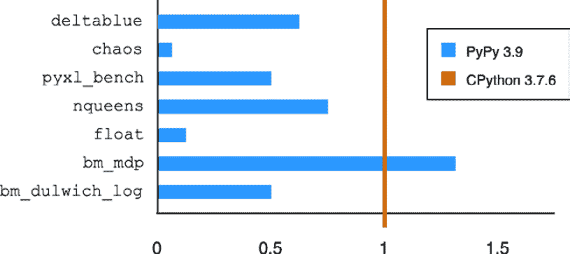

# 第六章：使用 Go 和 Python 进行网络编程

在本章中，我们将探讨 Python 和 Go 在网络编程中的强大功能和用途，但根据您的需求和您的环境，其中一个可能比另一个更适合您。我们将通过检查使用每种语言的优缺点来进行网络编程。

到本章结束时，您将能够确定哪种语言（Python 或 Go）更适合您的网络项目，以及使用哪个库。您将学习每种语言的不同之处和超能力，这些可能会在您的网络自动化工作中产生差异。

本章将要涵盖的主题如下：

+   查看语言运行时

+   使用第三方库

+   使用库访问网络设备

# 技术要求

本章中描述的源代码存储在本书的 GitHub 仓库中，网址为[`github.com/PacktPublishing/Network-Programming-and-Automation-Essentials/tree/main/Chapter06`](https://github.com/PacktPublishing/Network-Programming-and-Automation-Essentials/tree/main/Chapter06)。

本章中的示例是使用一个简单的网络设备模拟器创建和测试的。如何下载和运行此模拟器的说明包含在`Chapter06/Device-Simulator`目录中。

# 查看语言运行时

在编写代码并保存后，您将在您的网络中的某个位置运行它。Go 和 Python 在运行前有不同的方式来组合您的源代码和所有导入的库。哪一个更适合您？是否存在任何重要的相关差异需要了解？我们将在本节中讨论这个问题。

## 什么是编译型和解释型语言？

在编写代码后，一些计算机语言需要编译才能在您的机器上运行，尽管有些不需要，因为它们在运行时逐行解释。

编译型语言必须有一个编译器，将源代码转换成一系列可以在您计算机的 CPU 架构上运行的比特和字节；它还必须链接所有静态和动态系统库。例如，配备苹果 M1 处理器的计算机将使用与配备英特尔 x86 处理器的苹果不同的编译器。编译后的结果是二进制程序，人类无法阅读，当它运行时，它将从磁盘加载到主内存中。

编译完成后，您不需要源代码来运行程序。运行代码的机器不需要编译器或源代码，只需要编译后的程序二进制文件，这增加了自由空间、代码隐私和代码安全性。

另一方面，解释语言（目前）由代码解释器解释，解释器在运行时逐行解释你的代码。这些解释语言也被称为 **脚本语言**。运行解释语言所需的机器需要拥有解释器和源代码，不幸的是，这暴露了源代码并需要额外的空间来存储。

编译语言的例子包括 Go、C、C++、Haskell 和 Rust。解释语言的例子包括 Python、PHP、Unix Shell、JavaScript 和 Ruby。

Java 是一个特殊情况，因为它有一个编译器，但它编译成自己的 **Java 虚拟机** (**JVM**) 架构，这不是程序将运行的 CPU 架构。一旦编译，你可以在任何地方使用它，但需要为特定的 CPU 架构安装 JVM，这会增加额外的存储和运行时复杂性。

## Python 解释器

Python 解释器有时被称为 Python 虚拟机，以参考 JVM，它可以在任何地方运行。但 Python 并不提供像 Java 那样的虚拟机 – 它提供的是一个解释器，这与其非常不同。

在 Java 中，这个虚拟机就像一个虚拟 CPU，为 Java 字节码编译程序提供运行环境。JVM 将 Java 编译的字节码转换为运行所在 CPU 架构的字节码。因此，Java 代码需要首先编译；然后，编译后的程序可以在安装了 JVM 的任何机器上运行。

相反，解释器更加复杂，因为它不像 JVM 那样翻译字节码，而是在其周围的环境中逐行解释。解释器读取整个代码并解析程序上下文中必须解码的语法。正因为这种复杂性，这可以是一个非常慢的过程。

让我们调查一些可用的 Python 解释器。

### 使用 CPython

**CPython** 是最常用的解释器程序之一，需要在 Python 代码将运行的机器上安装。CPython 用 C 语言编写，可能是 Python 解释器的第一个实现。

CPython 是新功能在暴露于 Python 之前被创建的地方。例如，当并发性被添加到 Python 中时，它最初是通过 CPython 解释器进程利用操作系统的多任务属性来实现的。

CPython 实现可以在传递给解释器之前编译成专有字节码。原因是基于堆栈机器指令集创建解释器更容易，尽管解释器不需要这样做。

以下是一个 CPython 堆栈机器指令集的例子：

```py
$ pythonPython 3.9.4  [MSC v.1928 64 bit (AMD64)] on win32
>>> import dis
>>>
>>> def return_the_bigest(a, b):
...     if a > b:
...         return a
...     if b > a:
...         return b
...     return None
...
>>> dis.dis(return_the_bigest)
  2           0 LOAD_FAST                0 (a)
              2 LOAD_FAST                1 (b)
              4 COMPARE_OP               4 (>)
              6 POP_JUMP_IF_FALSE       12

  3           8 LOAD_FAST                0 (a)
             10 RETURN_VALUE

  4     >>   12 LOAD_FAST                1 (b)
             14 LOAD_FAST                0 (a)
             16 COMPARE_OP               4 (>)
             18 POP_JUMP_IF_FALSE       24

  5          20 LOAD_FAST                1 (b)
             22 RETURN_VALUE

  6     >>   24 LOAD_GLOBAL              0 (Null)
             26 RETURN_VALUE
```

如您所见，`return_the_bigest` 函数被翻译成下面的 CPython 字节码，这将由 CPython 解释器在运行时使用。请注意，指令集执行与 `return_the_bigest` 函数相同的功能，这对人类来说更难阅读，但对 Python 解释器来说更容易。

更多关于反汇编 Python 字节码的信息可以在这里找到：[`docs.python.org/3/library/dis.html`](https://docs.python.org/3/library/dis.html)。

更多关于 CPython 的信息可以在这里找到：[`github.com/python/cpython`](https://github.com/python/cpython)。

### 使用 Jython

**Jython** 是另一种 Python 解释器，最初于 1997 年由 Jim Hugunin 创建，最初称为 **JPython**。1999 年，JPython 被更名为 Jython，正如今天所知。

Jython 用于将 Python 代码编译成可以在安装了 JVM 的任何硬件上运行的 Java 字节码虚拟机。有时，它运行得更快，因为它不需要像 CPython 那样进行解释。

尽管该项目一开始期望很高，但如今，它只支持 Python 2.7，对 Python 3.x 的支持仍在开发中。因此，只有当您在只支持 JVM 的机器上运行代码时，您才需要 Jython。由于它只支持 Python 2.7，而 Python 社区不再支持，且已于 2020 年 1 月弃用，因此它将存在许多限制。

更多关于 Jython 的信息可以在这里找到：[`github.com/jython/jython`](https://github.com/jython/jython)。

### 使用 PyPy

**PyPy** 是另一种 Python 解释器实现，声称比 CPython 运行 Python 代码更快。PyPy 还声称使用微线程可以更好地处理并发，并且最终它声称比 CPython 使用更少的内存。

尽管 PyPy 具有巨大的优势，但 CPython 仍然是使用最广泛的 Python 解释器，主要是因为人们不知道 PyPy，并且默认的 Python 安装使用的是 CPython。

PyPy 有一个专门用于比较其与其他解释器速度的网站，例如 CPython。该网站还提供了与其他 PyPy 版本的比较。*图 6.1* 展示了从 PyPy 速度网站获取的信息，CPython 和 PyPy 的比较。平均而言，PyPy 比 CPython 快 4 倍：



图 6.1 – 从 speed.pypy.org 获取的 CPython 和 PyPy 比较

前面的图表包含蓝色条形，这些条形表示特定基准在 PyPy 3.9 中与 CPython 3.7.6 的运行情况。例如，`bm_dulwich_log` 基准比 CPython 快一倍（0.5）。第六个蓝色条形显示 PyPy 在 `bm_mdp` 基准（1.3）上运行较慢，但对于第二个蓝色条形，它代表的是 `chaos` 基准，PyPy 的运行速度可高达 20 倍。有关每个基准的详细信息，可以在 [`speed.pypy.org/`](https://speed.pypy.org/) 获取。

更多关于 PyPy 的信息，请访问其主页 [`www.pypy.org/`](https://www.pypy.org/)。

### 使用 Cython

尽管有些人将 PyPy 与 **Cython** 进行比较，但 Cython 并不是像 PyPy 那样的 Python 解释器。Cython 是一个可以与 Python 和 Cython 语言一起使用的编译器，它基于 **Pyrex**，这是 Python 语言的超集。Cython 可以轻松地将 C 和 C++ 扩展添加到你的代码中。由于它是用 C 实现的，Cython 代码声称在使用 PyPy 时比 Python 快。

因此，如果你正在寻找编写高性能 Python 代码的方法，尝试使用 Cython。更多关于 Cython 的信息可以在 [`cython.org/`](https://cython.org/) 找到。

### 使用 IPython 和 Jupyter

解释型语言的主要优势是它更容易进行交互式运行。Python 有一个名为 **IPython** 的解释器来实现这一点。

IPython 可以逐行运行你的代码，并检查内存中的变化情况。这在测试或尝试新的代码或函数时非常有用。在代码开发过程中，它也便于获取运行结果并调整代码以适应你期望的输出。

与 IPython 结合使用，你可以使用一个 **Jupyter** 笔记本，这是一个易于使用的网络界面，具有图形输出功能。

例如，假设你需要从 100 个网络节点收集关于网络 CPU 使用情况的信息，并为过去一小时制作一个图形报告。你如何快速完成这项工作，而不用担心构建或测试呢？你可以使用的最佳平台是带有 IPython 的 Jupyter 笔记本。

IPython 和 Jupyter 也常用于数据科学和机器学习，因为它们在交互方法和图形界面方面的优势。

对于我们的网络编程，IPython 是一个强大的工具，用于在 Python 中创建 **概念验证**（**PoC**）代码并测试新功能。

更多关于 IPython 的信息可以在 [`ipython.org/`](https://ipython.org/) 找到。更多关于 Jupyter 的信息可以在 [`jupyter.org/`](https://jupyter.org/) 找到。

通过以上内容，我们已经了解了主要的 Python 解释器。现在，让我们看看 Go 是如何工作的。

## Go 编译器

在 Go 语言开发中，没有像 Python 代码那样的代码解释；相反，是编译。这种编译由 Go 编译器完成，它通常包含在 Go 语言包中。编译器读取源代码，然后将其转换为程序将要执行的 CPU 架构的字节码。在执行编译后的代码时，不需要编译器或源代码，只需要编译后的二进制代码。

由于这种编译，Go 程序比基于 Python 的程序运行得更快——在某些情况下，它们可以快 30 到 100 倍，尤其是在处理并发时。例如，用于测试多核并行性的 `fannkuch-redux` 基准测试在 Go 中运行需要 8 秒，而在 Python 中运行则需要 5 分钟（来源：[`benchmarksgame-team.pages.debian.net/benchmarksgame/performance/fannkuchredux.html`](https://benchmarksgame-team.pages.debian.net/benchmarksgame/performance/fannkuchredux.html))。

尽管 Go 语言发行版提供了编译器，但 Go 社区已经开始启动其他项目作为 Go 编译器的替代方案。其中之一是名为 **TinyGo** 的项目，当编译的代码没有太多内存需要存储时使用，例如在小型微控制器或小型计算机中。因此，当运行目标计算机的内存空间有限时，会使用 TinyGo。更多关于 TinyGo 的信息可以在 [`github.com/tinygo-org/tinygo`](https://github.com/tinygo-org/tinygo) 找到。

现在，让我们从计算运行时的角度比较这两种语言。

## 编程运行时的优缺点

让我们探讨使用 Go 和 Python 进行编程的优缺点，同时关注在运行时将在机器上运行的代码。

使用 Python 运行时的优点：

+   通过使用交互式 Python（IPython 和 Jupyter 笔记本）易于创建 PoC 代码

+   在原型设计期间易于创建数据可视化

+   拥有庞大的社区，拥有不同的解释器、库和框架

使用 Python 运行时的缺点：

+   在目标运行机器上消耗更多空间和内存

+   相比 Go，消耗更多 CPU，完成任务速度较慢

+   代码在目标运行机器上可见，可能存在不安全因素

+   与 Go 相比，运行时并行实现较弱

使用 Go 运行时的优点：

+   在目标运行机器上消耗更少的内存和空间

+   消耗更少的 CPU，运行速度比 Python 快

+   代码被编译，这使其不可读，且难以解码

+   运行时并行实现的性能远优于 Python

使用 Go 运行时的缺点：

+   创建原型更困难

+   开发社区较小，运行时库较少

对于网络编程，与 Python 相比，Go 在性能方面具有更多优势。然而，由于 Python 是一种较老的语言，它拥有更广泛的社区，拥有更多的网络库和功能。

因此，选择使用哪种语言将取决于你正在处理的使用案例。如果你想要快速完成，并且希望通过重用他人的库来编写更少的代码，那么 Python 可能是最合适的选择。但如果你想要性能更高、更安全、占用内存更少，并且可以构建为一个二进制程序的东西，Go 就是你的最佳选择。随着 Go 社区的成长，它可能会随着时间的推移拥有更多帮助网络自动化的库，但就目前而言，Python 在网络自动化领域有更多的社区贡献。

在下一节中，我们将学习如何在 Go 和 Python 代码中添加外部库。

# 使用第三方库

在开发网络自动化时，总是值得研究社区中的工具和库，看看你是否可以整合一些外部代码，这将增加功能或加快你的开发过程。

为了解释如何使用第三方库，了解 Python 和 Go 中库的一般使用方式非常重要。在本节中，我们将详细说明 Python 和 Go 中的库添加过程。

## 添加 Python 库

在讨论如何将库添加到 Python 之前，重要的是要解释，在 Python 中，**库**也被称为**包**或**模块**。这三个术语在 Python 文档中广泛使用，这可能会让一些新的 Python 开发者感到困惑。所以，无论何时看到“Python 库”这个术语，它也可以指包或模块。

Python 中的库可以是外部的、内部的或内置的。这些外部库也被称为第三方模块、包或库。

要在 Python 中使用库，你只需在代码开头使用 `import` 语句。如果库未找到，它将引发一个名为 `ModuleNotFoundError` 的错误异常，如下所示：

```py
$ python
Python 3.10.4 (main, Apr  8 2022, 17:35:13) on linux
Type "help", "copyright", "credits" or "license" for more information.
>>> import netmiko
Traceback (most recent call last):
  File "<stdin>", line 1, in <module>
ModuleNotFoundError: No module named 'netmiko'
```

在前面的示例中，Python 解释器抛出了一个名为 `ModuleNotFoundError` 的异常，这意味着包未安装或不在搜索路径中。搜索路径通常包含在 `sys` 包内的 `path` 变量中，如下面的示例所示：

```py
$ python3.10
Python 3.10.4 (main, Apr  8 2022, 17:35:13) on linux
Type "help", "copyright", "credits" or "license" for more information.
>>> import sys
>>> sys.path
['', '/usr/lib/python3.10', '/usr/lib/python3.10/lib-dynload', '/usr/local/lib/python3.10/dist-packages', '/usr/lib/python3/dist-packages']
```

注意，在前面的示例中，`sys.path` 变量已经被预填充了一个系统路径列表，但如果你需要，可以追加更多。

现在，让我们讨论如何在 Python 中使用内置的、标准的和外部模块。

### 使用 Python 内置库

内置模块（或库）是可以导入的模块，但它们包含在 Python 运行时程序中。它们不是需要添加的外部文件，因此不需要在 `sys.path` 变量中找到。还有内置函数，如 `print`，但内置模块是在使用之前需要显式导入的，例如众所周知的 `sys`，或其他如 `array` 和 `time` 的模块。这些内置模块不是像 Python 标准库中的那样是外部程序，而是包含在解释器的二进制代码中，就像 CPython 一样。

### 使用 Python 标准库

这些是与 Python 发行版一起提供的模块，但它们是当你开始在 Python 代码中声明 `import` 时添加的独立 Python 文件；它们需要在 `sys.path` 变量中找到。这些模块是 Python 程序，可以在 Python 库安装目录中找到，例如下面的示例中的 `socket` 库：

```py
$ python3.10
Python 3.10.4 (main, Apr  8 2022, 17:35:13) on linux
Type "help", "copyright", "credits" or "license" for more information.
>>> import inspect
>>> import socket
>>> inspect.getfile(socket)
'/usr/lib/python3.10/socket.py'
```

注意，`/usr/lib/pytho3.10/socket.py` 的位置将取决于操作系统和 Python 版本。在上面的例子中，使用了 Linux Ubuntu 和 Python 3.10。Python 3.10.x 的所有标准库的列表可以在 [`github.com/python/cpython/tree/3.10/Lib`](https://github.com/python/cpython/tree/3.10/Lib) 找到。有关 Python 3.x 中每个内置和标准库的更多信息，可以在 [`docs.python.org/3/library/`](https://docs.python.org/3/library/) 找到。

### 使用第三方 Python 库

外部库或第三方库是 Python 中不包含在 Python 发行版中的模块（或包），在使用之前需要手动安装。这些模块通常不是由 Python 库团队维护，而是由 Python 社区的开发者维护，这些开发者与 Python 主发行版不一定相关。

正如我们在 *第五章* 中讨论的，在将外部模块添加到代码之前，查看 `LICENSE` 文件，并检查是否有任何限制可能会影响该模块在您的代码或组织中的使用。

Python 社区已经组织了一个名为 `pip` 的团队。

PyPA 还负责维护 [pypi.org](http://pypi.org)，其中记录了所有可以与 `pip` 一起使用的包。在这个网站上，有一个用于查找包的搜索引擎，还有为想要贡献或分享他们的包的开发者提供的文档。请注意，包的源代码不在 [pypi.org](http://pypi.org) 网站上，而是在如 **GitHub** 这样的仓库中。

现在，让我们通过一个例子来了解在代码中使用第三方包的过程。我们作为例子添加的包名为 `netmiko`：

1.  根据 PyPA 检查包是否包含在 [pypi.org](http://pypi.org) 上。如果是，我们可以使用 `pip` 将包添加到我们的本地 Python 环境中。

是的，就是这样的：[`pypi.org/project/netmiko/`](https://pypi.org/project/netmiko/).

1.  阅读许可证文件并检查是否允许在您的组织中使用。

本许可证基于 MIT 协议，限制较少，因此我们可以使用它：[`github.com/ktbyers/netmiko/blob/develop/LICENSE`](https://github.com/ktbyers/netmiko/blob/develop/LICENSE).

1.  使用 `pip` 工具将包安装到您的本地 Python 环境中，如下例所示：

    ```py
    $ pip install netmiko
    Installing collected packages: netmiko
    Successfully installed netmiko-4.1.0
    ```

1.  检查您是否可以导入并定位 `netmiko` 库的安装位置：

    ```py
    >>> import netmiko
    >>> import inspect
    >>> inspect.getfile(netmiko)
    '/home/claus/.local/lib/python3.10/site-packages/netmiko/__init__.py'
    ```

在前面的示例中，`netmiko` 包已使用 `pip` 工具安装，并且库位于我的家目录下，`/home/claus`。然而，这取决于 Python 的版本和使用的操作系统。在 Linux 中，它也取决于发行版，如 Debian、Ubuntu 或 Red Hat。

只需记住，第三方 Python 库将在名为 `site-packages` 的目录下正常安装。以下是每个操作系统可能的位置示例：

+   对于 macOS：`/Library/Frameworks/Python.framework/Versions/3.9/lib/python3.9/site-packages`

+   对于 Windows：`C:\Users\username\AppData\Local\Programs\Python\Python39\lib\site-packages`

+   对于 Linux Ubuntu：`/usr/lib/python3.9/site-packages`

要查找您在系统上安装的所有包的完整列表，请输入以下命令：

```py
pip list -v
```

现在，让我们探索如何在 Go 中使用库和第三方库。

## 添加 Go 库

与 Python 相比，Go 只有两种类型的库：标准库和第三方库。对于 Go，没有内置库的概念，因为它没有解释器；相反，它有一个编译器。原因是解释器可以在其二进制文件中包含一些库，这些库被称为内置库。

要将库添加到您的 Go 代码中，您需要使用 `import` 语句，这与 Python 中的用法相同，但语法略有不同。

与 Python 类似，在 Go 中，一个库也被称为 **包**。

让我们看看如何在 Go 中添加标准库和第三方库。

### 在 Go 中使用标准库

Go 的每个版本都包含一组与 Go 发行版一起安装的标准库。这些标准库也是 Go 程序，当导入时，将在编译期间与您的代码结合。

标准库的列表可以在 [`pkg.go.dev/std`](https://pkg.go.dev/std) 找到。该网站非常有用，因为它包括每个库（或包）的解释。

标准库也可以在您的本地开发文件系统中找到。Go 的安装包括所有标准库，例如 `fmt` 和 `math` 包。这些标准库的位置因操作系统而异，但可以通过查看 `GOROOT` 环境变量来找到。

大多数操作系统不会设置`GOROOT`变量，因此它们将使用 Go 语言的默认位置。要找出您的默认位置，您可以运行`go env`命令，如下所示：

```py
$ go env GOROOT
/usr/lib/go-1.19
```

在前面的示例中，`GOROOT`位于`/usr/lib/go-1.19`。

要了解库的定位方式，让我们使用`fmt`标准库将字符串打印到计算机终端：

```py
package main
import "fmt"
func main() {
    fmt.Println("My code is awesome")
}
```

在前面的示例中，`import`语句告诉 Go 编译器需要添加`fmt`包，在这种情况下是一个标准库包。在这个示例中，Go 编译器将从这个包开始搜索，首先查找`/usr/lib/go-1.19`目录。

更具体地说，`fmt`包位于`/usr/lib/go-1.19/src/fmt`。在这个示例中使用的`Println`函数在`/usr/lib/go-1.19/src/fmt/print.go`文件中有描述。同样，`math`目录中的所有文件在其第一行上都有`package math`语句。

在 Go 语言中，所有程序都必须属于一个包，包名在代码的第一行中描述。在`fmt`目录（`/usr/lib/go-1.19/src/fmt`）中，该目录下所有包含的文件的第一行都包含`package fmt`语句。这包括位于`fmt`目录中的`scan.go`、`format.go`和`print.go`文件。

Go 语言中的其他标准库示例可以在您的本地 Go 安装中找到，通常位于`src`目录下。在前面的示例中，它位于`/usr/lib/go-1.19/src`。其他示例包括位于`/usr/lib/go-1.19/src/math/`的`math`包和位于`/usr/lib/go-1.19/src/time/`的`time`包。

这里还有一个示例，它使用了`math`标准库：

```py
package main
import (
    "fmt"
    "math"
)
func main() {
    fmt.Println("Square root of 2 is", math.Sqrt(2))
}
```

在前面的示例中，`math`库使用了`Sqrt`函数，该函数在`/usr/lib/go-1.19/src/math/sqrt.go`文件中有描述。同样，`math`目录中的所有文件在其第一行上都有`package math`语句。

现在，让我们学习如何将第三方库添加到 Go 中。

### 在 Go 中使用第三方库

Go 语言中的第三方库包的添加方式与标准库类似——通过在代码中使用`import`语句。然而，将这些包添加到 Go 开发环境中的底层过程在几个特性上略有不同。

对于第三方包，编译器需要在不同的路径中搜索包含该包的新文件，这个路径由`GOPATH`环境变量设置。与`GOROOT`一样，您不需要设置`GOPATH`，因为 Go 编译器为`GOPATH`变量有一个默认位置。

在我们的 Go 示例中，让我们通过运行以下命令来检查`GOPATH`的默认位置：

```py
$ go env GOPATH
/home/claus/go
```

如我们所见，`GOPATH`的默认位置是我家目录中的`go`目录（`/home/claus`）。

在 Go 中，可以通过在`go`命令行上调用`get`子命令来添加第三方库，如下所示：

```py
$ go get golang.org/x/crypto
go: downloading golang.org/x/crypto v0.0.0-20220622213112-05595931fe9d
go: downloading golang.org/x/sys v0.0.0-20210615035016-665e8c7367d1
go: added golang.org/x/crypto v0.0.0-20220622213112-05595931fe9d
```

在先前的例子中，我们添加了`x/crypto`包。请注意，该包的所有其他依赖项也被添加；在这个例子中，其他依赖项是`x/sys`。`get`子命令还存储了包的版本——在这种情况下，`v0.0.0-20220622213112-05595931fe9d`。

然后，该包被保存在`GOPATH`目录下。在先前的例子中，它被保存在`/home/claus/go/pkg/mod/golang.org/x/crypto@<VERSION>`。

每次你运行`go get`并且有新版本可用时，Go 都会存储新版本，并将旧版本保存在不同的目录中。

在添加第三方库时，不需要运行`go get`。如果包尚未下载或缓存，则在运行`go build`时有时会调用`get`命令，如下所示：

```py
$ go build
go: downloading golang.org/x/crypto v0.0.0-20220622213112-05595931fe9d
```

在先前的例子中，Go 程序有一个`import`语句：

```py
import (
    "golang.org/x/crypto/ssh"
)
```

在添加第三方库后，Go 也会更新`go.mod`文件。此文件用于跟踪添加到你的 Go 程序中的包版本。以下是为先前列举的示例的`go.mod`文件内容：

```py
$ cat go.mod 
module connect

go 1.19
require (
    golang.org/x/crypto v0.0.0-20220622213112-05595931fe9d
)
require golang.org/x/sys v0.0.0-20210615035016-665e8c7367d1 // indirect
```

注意，`go.mod`文件还存储了所有依赖项的包版本。在先前的例子中，`x/sys`包的版本也存储在该文件中。

现在你已经熟悉了将第三方库添加到 Go 和 Python 中，让我们深入下一节，看看一些可以用来访问网络的库。

# 使用库访问网络设备

到目前为止，我们已经讨论了如何在 Python 和 Go 中运行和使用库。现在，让我们专注于如何使用 Python 和 Go 来访问网络设备，这是我们网络自动化工作中最重要的一个点。

在*第三章*中，我们讨论了几种访问网络设备的方法。其中最受欢迎的一种是使用**命令行界面**（CLI）。我们还讨论了 SNMP、NETCONF、gRPC 和 gNMI。在本节中，我们将探讨一些使用库来访问网络设备的示例，主要使用 CLI。稍后，我们将解释并展示使用其他方法访问网络的库。

## 通过 CLI 访问网络的库

互联网上有许多可以访问网络设备的库，其中一些可能已经过时或不再使用。在这里，我们将按时间顺序介绍最受欢迎的库，从旧到新。

以下示例将通过 SSH 连接在 CLI 上发送`uptime`命令来收集网络设备的运行时间。

### 使用 Python Paramiko

Paramiko 可能是通过 CLI 访问网络设备的最早实现之一。它的第一个版本发布于 2003 年。如今，它拥有超过 300 位贡献者，并且有近 2000 个包依赖于 Paramiko([`github.com/paramiko/paramiko/network/dependents`](https://github.com/paramiko/paramiko/network/dependents))。

正如我们在 *第三章* 中讨论的那样，正确使用 CLI 库的方式是通过 **Secure Shell** （**SSH**）。Paramiko 使用名为 PyCrypto 的底层库实现 SSH 的安全加密（[`pycrypto.org/`](http://pycrypto.org/)）。

让我们看看一个简单的示例，以获取网络主机的 uptime：

```py
import paramiko
TARGET = {
    "hostname": "10.0.4.1",
    "username": "netlab",
    "password": "netlab",
}
ssh = paramiko.SSHClient()
ssh.set_missing_host_key_policy(paramiko.AutoAddPolicy())
ssh.connect(**TARGET)
stdin, stdout, stderr = ssh.exec_command("uptime")
stdin.close()
print(stdout.read().decode("ascii"))
```

如果连接成功，前面程序的输出将是网络主机的 uptime。

```py
13:22:57 up 59 min,  0 users,  load average: 0.02, 0.07, 0.08
```

### 使用 Python Netmiko

Netmiko 也是另一个流行的库，用于通过 CLI 访问网络设备。它的第一个版本发布于 2014 年，建立在 Paramiko 之上，以简化对网络设备的连接。总的来说，Netmiko 比 Paramiko 更简单，更专注于网络设备。

让我们看看当使用 Netmiko 时，与 Paramiko 相同的示例会是什么样子：

```py
import netmiko
host = {
    "host": "10.0.4.1",
    "username": "netlab",
    "password": "netlab",
    "device_type": "linux_ssh",
}
with netmiko.ConnectHandler(**host) as netcon:
    output = netcon.send_command(command)
print(output)
```

如您所见，Netmiko 代码的实现只有 2 行，与 Paramiko 相比，代码更小、更简单。Netmiko 库的巨大优势在于它自动处理设备的命令提示符，并在更改特权模式下的配置时轻松工作，因为提示符通常会改变。在上一个示例中，设备类型是 `linux_ssh`，因为我们的目标主机是 Linux 设备。

Netmiko 可以支持数十种网络设备，包括 Cisco、华为、Juniper 和 Alcatel。设备列表的完整列表可以在以下链接找到：[`github.com/ktbyers/netmiko/blob/develop/PLATFORMS.md`](https://github.com/ktbyers/netmiko/blob/develop/PLATFORMS.md)。

### 使用 Python AsyncSSH

AsyncSSH 是 Python **AsyncIO** 的现代实现，用于 SSH。Python AsyncIO 在 Python 3.4 版本中引入，允许 Python 使用 async/await 语法进行并发工作，并为网络访问提供高性能。要使用 AsyncSSH，您需要 Python 3.6 或更高版本。

总结来说，AsyncSSH 为多个主机提供了更好的性能，但它是一个更底层的实现，与 Netmiko 相比，在处理网络设备时需要更多的代码复杂性。

获取 AsyncSSH 的 uptime 的相同示例可以写成这样：

```py
import asyncio, asyncssh, sys
TARGET = {
    "host": "10.0.4.1",
    "username": "netlab",
    "password": "netlab",
    "known_hosts": None,
}
async def run_client() -> None:
    async with asyncssh.connect(**TARGET) as conn:
       result = await conn.run("uptime", check=True)
       print(result.stdout, end="")
try:
    asyncio.get_event_loop().run_until_complete( run_client() )
except (OSError, asyncssh.Error) as execrr:
        sys.exit("Connection failed:" + str(execrr))
```

注意，当使用 AsyncSSH 时，您将不得不按照 Python AsyncIO 和前面示例的指示与例程和事件一起工作。如果您想深入了解，可以在 https://realpython.com/async-io-python/ 找到一些优秀的文档。

### 使用 Python Scrapli

与 Netmiko 相比，Scrapli 是较新的。它的第一个版本发布于 2019 年，也是建立在 Paramiko 之上，但具有使用 AsyncSSH 的能力，声称在访问多个设备时可以提高性能。Scrapli 这个名字的灵感来自 *scrape cli*，类似于某人刮擦屏幕。这是因为 Scrapli 的主要目标是使用 CLI 从网络终端解释文本。

Scrapli 被构建出来，允许其用户以减少的平台集来解释来自多厂商网络设备（如 Netmiko）的提示。2022.7.30 版本支持 Cisco、Juniper 和 Arista。使用 Scrapli 的一个优点是它还支持 NETCONF。

以下是一个使用 Scrapli 获取运行时间的相同示例：

```py
from scrapli.driver import GenericDriver
TARGET = {
    "host": "10.0.4.1",
    "auth_username": "netlab",
    "auth_password": "netlab",
    "auth_strict_key": False,
}
with GenericDriver(**TARGET) as con:
    command_return = con.send_command("uptime")
print(command_return.result)
```

到目前为止，我们已经了解了使用 Python 访问网络终端最流行的库。现在，让我们学习如何使用 Go 语言来做这件事。

### 使用 Go ssh

与 Python 相比，Go 没有处理网络设备的库的大社区。因此，在某些特定情况下，您可能必须编写自己的抓取机制来通过 CLI 解释远程网络终端。自己这样做的问题在于，它将因每个网络供应商而异，并且随着添加不同的网络设备，将需要更多的时间进行编码。

让我们看看从远程网络主机获取运行时间的示例：

```py
package main
import (
    "bytes"
    "fmt"
    "log"
    "golang.org/x/crypto/ssh"
)
func main() {
    host := "10.0.4.1"
    config := &ssh.ClientConfig{
        User:            "netlab",
        HostKeyCallback: ssh.InsecureIgnoreHostKey(),
        Auth: []ssh.AuthMethod{
            ssh.Password("netlab"),
        },
    }
    conn, err := ssh.Dial("tcp", host+":22", config)
    if err != nil {
        log.Fatalf("Dial failed: %s", err)
    }
    session, err := conn.NewSession()
    if err != nil {
        log.Fatalf("NewSession failed: %s", err)
    }
    var buff bytes.Buffer
    session.Stdout = &buff
    if err := session.Run("uptime"); err != nil {
        log.Fatalf("Run failed: %s", err)
    }
    fmt.Println(buff.String())
}
```

如您所见，前一个示例比一些高级库包含更多的代码。

### 使用 Go vSSH

Go 语言中有一个名为 vSSH 的库，它是由雅虎的工程师基于`golang.org/x/crypto`构建的。它为访问网络设备上的远程终端创建了一个抽象层，从而避免了我们在之前的 SSH 示例中看到的代码。

vSSH 的主要主张之一是它能够以高性能处理对多个目标的访问，这是通过使用 Go 协程（可以在[`go.dev/tour/concurrency/1`](https://go.dev/tour/concurrency/1)找到关于 Go 协程的优秀入门指南）实现的。

尽管 vSSH 可以有效地处理多个目标，但让我们先从一个只使用一个目标的示例开始：

```py
package main
import (
    "context"
    "fmt"
    "log"
    "time"
    "github.com/yahoo/vssh"
)
func main() {
    vs := vssh.New().Start()
    config := vssh.GetConfigUserPass("netlab", "netlab")
    vs.AddClient(
        "10.0.4.1:22", config, vssh.SetMaxSessions(1),
    )
    vs.Wait()
    ctx, cancel := context.WithCancel(
        context.Background()
    )
    defer cancel()
    timeout, _ := time.ParseDuration("4s")
    rChannel := vs.Run(ctx, "uptime", timeout)
    for resp := range rChannel {
        if err := resp.Err(); err != nil {
            log.Println(err)
            continue
        }
        outTxt, _, _ := resp.GetText(vs)
        fmt.Println(outTxt)
    }
}
```

在本例中使用了 Go 协程。在调用`vs.Wait()`之前，可以使用`vs.AddClient()`添加更多目标。在我们的示例中，只添加了一个目标来获取远程网络主机的运行时间。末尾的循环对于单个目标来说不是必需的，但我将其留下以演示如何与多个目标一起使用。

当使用多个目标时，我们可能有一个可能存在故障或速度较慢的主机，因此使用了解析超时，在我们的示例中是 4 秒。前面的示例通过`rChannel`变量使用通道来获取每个目标的 Go 协程的结果。

### 使用 Go Scrapligo

Scrapligo 是成功的 Python 库 Scrapli 的 Go 版本。它支持相同的网络平台，也支持 NETCONF。使用 Scrapligo 而不是 Scrapli 的优点是我们在本章前面讨论的与 Go 和 Python 运行时性能相关的优点。

在 Scrapligo 中的前一个示例看起来是这样的：

```py
package main
import (
    "fmt"
    "log"
    "github.com/scrapli/scrapligo/driver/generic"
    "github.com/scrapli/scrapligo/driver/options"
)
func main() {
    target, err := generic.NewDriver(
        "10.0.4.1",
        options.WithAuthNoStrictKey(),
        options.WithAuthUsername("netlab"),
        options.WithAuthPassword("netlab"),
    )
    if err != nil {
        log.Fatalf("Failed to create target: %+v\n", err)
    }
    if err = target.Open(); err != nil {
        log.Fatalf("Failed to open: %+v\n", err)
    }
    output, err := target.Channel.SendInput("uptime")
    if err != nil {
        log.Fatalf("Failed to send command: %+v\n", err)
    }
    fmt.Println(string(output))
}
```

我们刚刚讨论了如何使用 Python 和 Go 库通过 CLI 访问网络设备。现在，让我们学习如何使用其他方法通过库访问网络。

## 使用 SNMP 访问网络的库

除了 CLI 之外，第二种最受欢迎的网络设备访问方法是 SNMP。但正如我们在 *第三章* 中讨论的那样，SNMP 仅用于从网络设备读取信息。SNMP 写入方法不使用，原因如 *第三章* 中所述。

对于 SNMP 示例，我们将从 Python 和 Go 中各选择一个库。这些是目前使用 SNMP 方法最受欢迎的库。

在前一个子节中，我们使用了 CLI 方法来收集网络设备的运行时间。现在我们将演示，我们也可以通过使用 SNMP 方法来获取远程网络设备的运行时间。为此，我们需要收集 `SNMPv2-MIB::sysUpTime` MIB 变量。

### 使用 Python PySNMP

PySNMP 是 Python 中用于 SNMP 方法的最受欢迎的库。它支持从版本 1 到版本 3 的所有 SNMP 版本。以下是一个使用 SNMP 方法获取网络设备运行时间的示例：

```py
from pysnmp.hlapi import *
snmpIt = getCmd(SnmpEngine(),
    CommunityData("public"),
    UdpTransportTarget(("10.0.4.1", 161)),
    ContextData(),
    ObjectType(ObjectIdentity("SNMPv2-MIB", "sysUpTime", 0)))
errEngine, errAgent, errorIndex, vars = next(snmpIt)
if errEngine:
    print("Got engine error:", errEngine)
elif errAgent:
    print("Got agent error:", errAgent.prettyPrint())
else:
    for var in vars:
        print(' = '.join([x.prettyPrint() for x in var]))
```

输出将是 `SNMPv2-MIB::sysUpTime.0 = 72515`。

更多关于 PySNMP 的信息可以在 [`pysnmp.readthedocs.io/en/latest/`](https://pysnmp.readthedocs.io/en/latest/) 找到。

### 使用 gosnmp

对于 Go 语言，用于 SNMP 方法的最受欢迎的库是 `gosnmp`。它也支持 SNMP 协议的 1 到 3 版本。与 PySNMP 相比，`gosnmp` 更新，但拥有更多的开发者和用户，使其在未来的开发中更加可靠。以下是一个使用 Go 语言通过 SNMP 方法从网络设备收集运行时间的示例。在这个例子中，OID 号码 (`1.3.6.1.2.1.1.3.0`) 与 `SNMPv2-MIB::sysUpTime` 相同：

```py
package main
import (
    "fmt"
    "log"
    snmp "github.com/gosnmp/gosnmp"
)
func main() {
    snmp.Default.Target = "10.0.4.1"
    if err := snmp.Default.Connect(); err != nil {
        log.Fatalf("Failed Connect: %v", err)
    }
    defer snmp.Default.Conn.Close()
    //SNMPv2-MIB::sysUpTime
    oid := []string{"1.3.6.1.2.1.1.3.0"}
    result, err := snmp.Default.Get(oid)
    if err != nil {
        log.Fatalf("Failed Get: %v", err)
    }
    for _, variable := range result.Variables {
        fmt.Printf("oid: %s ", variable.Name)
        fmt.Printf(": %d\n", snmp.ToBigInt(variable.Value))
    }
}
```

输出将是 `oid: .1.3.6.1.2.1.1.3.0 : 438678`。

更多关于 `gosnmp` 的信息可以在 [`pkg.go.dev/github.com/gosnmp/gosnmp`](https://pkg.go.dev/github.com/gosnmp/gosnmp) 找到。

## 使用 NETCONF 或 RESTCONF 访问网络的库示例

当向网络设备写入配置时，首选的方法将是 NETCONF 或 RESTCONF。然而，某些设备或设备的某些功能可能尚未实现。在这种情况下，最合适的方法是通过 CLI，因为 SNMP 不会用于在设备上写入数据。

与 CLI 或 SNMP 相比，RESTCONF/NETCONF 方法是较新的网络设备访问方法。因此，可用的库不多。今天，在 Python 中使用 NETCONF 的最佳库是 Scrapli；对于 Go，这将是在 Scrapligo。

使用 Python Scrapli 与 NETCONF 的示例可以在 [`scrapli.github.io/scrapli_netconf/`](https://scrapli.github.io/scrapli_netconf/) 找到。

使用 Go Scrapligo 与 NETCONF 的示例可以在 [`github.com/scrapli/scrapligo/tree/main/examples/netconf_driver/basics`](https://github.com/scrapli/scrapligo/tree/main/examples/netconf_driver/basics) 找到。

您还可以使用纯 HTTP 库通过 RESTCONF 收集信息，如下面的 Python 示例所示：

```py
import requests
from requests.auth import HTTPBasicAuth
import json
requests.packages.urllib3.disable_warnings()
headers = {"Accept": "application/yang-data+json"}
rest_call = "https://10.0.4.1:6060/data/interfaces/state"
result = requests.get(rest_call, auth=HTTPBasicAuth("netlab", "netlab"), headers=headers, verify=False)
print(result.content)
```

现在，让我们学习如何使用 Python 和 Go 通过 gRPC 和 gNMI 访问网络。

## 使用 gRPC 和 gNMI 访问网络的库

与其他方法相比，gRPC 相对较新，网络设备供应商在近年来添加了这项功能。因此，如果您网络中有旧设备，您可能无法使用 gRPC 或 gNMI。

如我们在*第三章*中讨论的，gRPC 是一种更通用的方法，而 gNMI 更适用于网络接口。gNMI 的主要用途是通过调用底层 gRPC 流式订阅功能来进行网络遥测。使用 gNMI 允许您的网络代码轻松扩展，并且与 SNMP 相比，可以收集更多的网络管理数据。gNMI 库是建立在 gRPC 协议之上的。

所有主要网络设备供应商在其较新的网络操作系统上都有某种 gRPC 和/或 gNMI 实现。其中包括 Cisco、Juniper、Arista、Nokia、Broadcom 以及其他公司。

### 在 Python 中使用 gRPC

只有 Python 的新版本支持 gRPC，并且 Python 版本必须为 3.7 或更高。要使用它，您需要安装 `grpcio` ([`pypi.org/project/grpcio/`](https://pypi.org/project/grpcio/))。

在这里可以找到使用 Python 的 gRPC 示例：[`grpc.io/docs/languages/python/quickstart/`](https://grpc.io/docs/languages/python/quickstart/).

### 在 Go 中使用 gRPC

在 Go 中，gRPC 可以运行在任何主要版本上。它有很好的文档，可以在 [`github.com/grpc/grpc-go`](https://github.com/grpc/grpc-go) 找到几个示例。

### 在 Python 中使用 gNMI

Python 对 gNMI 的支持特别罕见。Python 社区中可用的库不多。以下列表描述了主要的一些：

+   `Cisco-gnmi-python` 于 2018 年创建，最初由 Cisco Networks 支持。这个库是由 Cisco 创建的，旨在促进在 Cisco 设备上使用 gNMI，可能不适合多供应商支持。更多详情可以在 [`github.com/cisco-ie/cisco-gnmi-python`](https://github.com/cisco-ie/cisco-gnmi-python) 找到。

+   `gnmi-py` 于 2019 年创建，由 Arista Networks 赞助。这个库不支持多供应商平台，只能用于 Arista 设备。更多详情可以在 [`github.com/arista-northwest/gnmi-py`](https://github.com/arista-northwest/gnmi-py) 找到。

+   `pyygnmi` 于 2020 年创建。这个库可以使用 `pip` 导入，并在 Cisco、Arista、Juniper 和 Nokia 设备上进行了测试。这将是在多供应商平台支持下的首选选择。更多详情可以在 [`github.com/akarneliuk/pygnmi`](https://github.com/akarneliuk/pygnmi) 找到。

### 在 Go 中使用 gNMI

对于 Go，gNMI 比 Python 的 gNMI 实现更为成熟，支持也更好。Go 中只有一个库可以使用 gNMI，称为 `openconfig-gnmi`。

`openconfig-gnmi` 库由 Google 在 2016/2017 年创建，现在在 GitHub `openconfig` 组下得到支持。更多关于这个库的信息可以在 [`pkg.go.dev/github.com/openconfig/gnmi`](https://pkg.go.dev/github.com/openconfig/gnmi) 找到。

除了 `openconfig-gnmi` 库之外，还有其他与 gNMI 相关的 Go 库可能对你有用。以下是主要的一些：

+   `google-gnxi` 是一个可以与 gNMI 和 gNOI 一起使用的工具组合。详细信息可以在 [`github.com/google/gnxi`](https://github.com/google/gnxi) 找到。

+   `openconfig-gnmi-gateway` 是一个库，可用于通过多个客户端进行高可用性流式传输以收集网络数据。详细信息可以在 [`github.com/openconfig/gnmi-gateway`](https://github.com/openconfig/gnmi-gateway) 找到。

+   `openconfig-gnmic` 是一个用 Go 编写的 CLI 工具，你可以用它来测试 gNMI 功能。CLI 实现了所有 gNMI 客户端功能。更多详细信息可以在 https://github.com/openconfig/gnmic 找到。

到目前为止，我们已经涵盖了通过几种不同的方法访问网络设备的主要和最受欢迎的库。关于这个主题的进一步讨论可以在 Slack 等聊天社区中找到。例如，包括 [`devopschat.slack.com/`](https://devopschat.slack.com/) 和 https://alldaydevops.slack.com/。

# 摘要

在本章中，我们深入探讨了 Python 和 Go 的运行时行为，研究了如何将库添加到这两种语言中，并展示了在访问网络设备时可以使用的一些网络库的示例。

本章提供了足够的信息，帮助你区分 Python 和 Go 的运行方式以及它们如何与标准库和第三方库一起使用。现在，你应该能够根据性能、安全性、可维护性和可靠性要求选择合适的语言用于网络自动化。你也应该能够选择合适的方法和库来访问你的网络设备，无论是用于配置还是收集网络数据。

在下一章中，我们将探讨如何在 Go 和 Python 中处理错误，以及我们如何编写代码来正确处理网络自动化中的异常。
