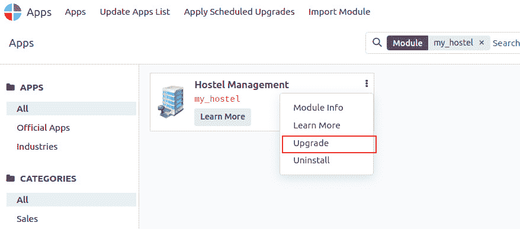
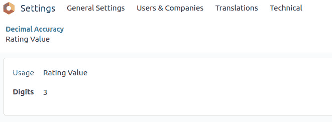
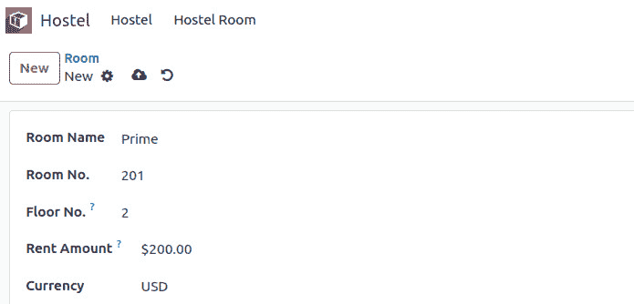

# 第四章：应用模型

本章将指导您对现有扩展模块进行一些小的改进。您已经在 *第三章*，*创建 Odoo 扩展模块* 中注册了您的扩展模块。现在，您将更深入地探索模块的数据库方面。您将学习如何创建新的模型（数据库表），添加新的字段，并应用约束。您还将发现如何使用 Odoo 中的继承来修改现有模型。在本章中，您将使用上一章中创建的相同模块。

本章涵盖了以下主题：

+   定义模型表示和顺序

+   向模型添加数据字段

+   添加可配置精度的浮点字段

+   向模型添加货币字段

+   向模型添加关系字段

+   向模型添加层次结构

+   向模型添加约束验证

+   向模型添加计算字段

+   暴露存储在其他模型中的相关字段

+   使用引用字段添加动态关系

+   使用继承向模型添加功能

+   使用抽象模型实现可重用模型功能

+   使用继承复制模型定义

# 技术要求

在继续本章的示例之前，请确保您已安装并配置了我们在 *第三章*，*创建 Odoo 扩展模块* 中开发的模块。

# 定义模型表示和顺序

模型指的是数据库表的表示。模型定义了数据库表的结构和行为，包括字段、关系和多种方法。模型使用 Odoo 的 **对象关系映射**（**ORM**）系统在 Python 代码中定义。ORM 允许开发人员使用 Python 类和方法与数据库交互，而不是编写原始 SQL 查询。

模型属性是在创建新模型时将要定义的模型特征；否则，我们使用已存在的模型的属性。模型使用带下划线前缀的结构属性来定义其行为。

## 准备工作

`my_hostel` 实例应该已经包含一个名为 `models/hostel.py` 的 Python 文件，该文件定义了一个基本模型。我们将编辑它以添加新的类级别属性。

## 如何操作...

通过有效地利用这些属性，开发人员可以在 Odoo 中创建组织良好、可重用和可维护的代码，从而实现更高效和健壮的应用程序。以下是可以用于模型上的属性：

1.  `_name` : `name` 属性是最重要的一个，因为它决定了内部全局标识符和数据库表名。模型名在模块命名空间内以点表示法表达。例如，`name="hostel.hostel"` 将在数据库中创建 `hostel_hostel` 表：

    ```py
    _name = 'hostel.hostel'
    ```

1.  `_table`：如果启用了‘`_auto`’，我们可以定义模型使用的 SQL 表名：

    ```py
    _name = 'project.task.stage.personal'
    _table = 'project_task_user_rel'
    ```

1.  `_description`：为了给模型分配一个反映其目的和功能的描述性标题，请插入以下代码片段：

    ```py
    _description = 'Information about hostel'
    ```

注意

如果您没有为您的模型使用`_description`，Odoo 将在日志中显示警告。

1.  `_order`：默认的搜索结果排序字段是`'id'`。但是，可以通过提供一个包含逗号分隔的字段名称列表的字符串的`_order`属性来更改它，以便我们可以使用我们选择的字段。字段名称后可以跟`desc`关键字以降序排序。要按`id`降序排序，然后按名称升序排序记录，请使用以下代码语法：

    ```py
    _order = "id desc, name"
    ```

注意

只能使用存储在数据库中的字段。无法使用非存储的计算字段对记录进行排序。`_order`字符串的语法类似于`SQL ORDER BY`子句，尽管它被简化了。例如，不允许使用特殊子句，如`NULLS FIRST`。

1.  `_rec_name`：此属性用于设置用作记录表示或标题的字段。`rec_name`的默认字段是名称字段。`_rec_name`是 Odoo 的`rec_name`使用的记录显示名称，并将`hostel_code`设置为模型的代表，使用以下代码语法：

    ```py
    _rec_name = 'hostel_code'
    hostel_code = fields.Char(string="Code", required=True)
    ```

注意

如果您的模型没有名称字段，并且您也没有指定`_rec_name`，则您的显示名称将是模型名称和记录 ID 的组合，如下所示 - `(``hostel.hostel, 1)`。

1.  `_rec_names_search`：此属性用于通过提到的字段值搜索特定记录。它与使用`name_search`函数类似。您可以直接使用此属性而不是使用`name_search`方法。为此，请使用以下代码语法：

    ```py
    _rec_names_search = ['name', 'code']
    ```

## 更多内容...

所有模型都有一个`display_name`字段，它以人类可读的格式显示记录表示，自 8.0 版本以来已自动添加到所有模型中。默认的`_compute_display_name()`方法使用`_rec_name`属性来确定哪个字段包含显示名称的数据。要自定义显示名称，您可以重写`_compute_display_name()`方法并提供您的逻辑。该方法应返回一个包含记录 ID 和 Unicode 字符串表示的元组的列表。

例如，为了在表示中包含宿舍名称和宿舍代码，例如`Youth Hostel (YHG015)`，我们可以定义以下内容：

看看以下示例。这将向记录的名称添加一个发布日期：

```py
@api.depends('hostel_code')
    def _compute_display_name(self):
        for record in self:
            name = record.name
            if record.hostel_code:
                name = f'{name} ({record.hostel_code})'
            record.display_name = name
```

在添加前面的代码后，您的`display_name`记录将被更新。假设您有一个名为`Bell House Hostel`的记录，其代码为`BHH101`；那么，前面的`_compute_display_name()`方法将生成一个如`Bell House Hostel (BHH101)`的名称。

当我们完成时，我们的`hostel.py`文件应如下所示：

```py
from odoo import fields, models
class Hostel(models.Model):
_name = 'hostel.hostel'
_description = "Information about hostel"
_order = "id desc, name"
_rec_name = 'hostel_code'
name = fields.Char(string="hostel Name", required=True)
hostel_code = fields.Char(string="Code", required=True)
street = fields.Char('Street')
street2 = fields.Char('Street2')
zip = fields.Char('Zip', change_default=True)
city = fields.Char('City')
state_id = fields.Many2one("res.country.state", string='State')
country_id = fields.Many2one('res.country', string='Country')
phone = fields.Char('Phone',required=True)
mobile = fields.Char('Mobile',required=True)
email = fields.Char('Email')
@api.depends('hostel_code')
    def _compute_display_name(self):
        for record in self:
            name = record.name
            if record.hostel_code:
                name = f'{name} ({record.hostel_code})'
            record.display_name = name
```

您的`hostel.xml`文件中的`<form>`视图将如下所示：

```py
<form string="Hostel">
  <sheet>
    <div class="oe_title">
      <h3>
        <table>
          <tr>
            <td style="padding-right:10px;">
            <field name="name" required="1" 
            placeholder="Name" /></td>
            <td style="padding-right:10px;">
            <field name="hostel_code" placeholder="Code" 
            /></td>
          </tr>
        </table>
      </h3>
    </div>
    <group>
      <group>
        <label for="street" string="Address"/>
          <div class="o_address_format">
            <field name="street" placeholder="Street..." 
            class="o_address_street"/>
            <field name="street2" placeholder="Street 2..." 
            class="o_address_street"/>
            <field name="city" placeholder="City" 
            class="o_address_city"/>
            <field name="state_id" class="o_address_state" 
            placeholder="State" options='{"no_open": 
            True}'/>
            <field name="zip" placeholder="ZIP" 
            class="o_address_zip"/>
            <field name="country_id" placeholder="Country"
            class="o_address_country" options='{"no_open": 
            True, "no_create": True}'/>
          </div>
      </group>
      <group>
        <field name="phone" widget="phone"/>
          <field name="mobile" widget="phone"/>
            <field name="email" widget="email" 
            context="{'gravatar_image': True}"/>
      </group>
    </group>
  </sheet>
</form>
```

我们应该升级模块以在 Odoo 中激活这些更改。

要更新模块，执行以下操作：

```py
Activate developer mode ->Apps -> Update App List
```

然后，搜索`my_hostel`模块，并通过下拉菜单升级它，如图下所示：



图 4.1 – 更新模块的选项

或者，您也可以在命令行中使用`-u my_hostel`命令。

# 向模型添加数据字段

字段代表数据库表中的一列，并定义了可以存储在该列中的数据结构。Odoo 模型中的字段用于指定模型将存储的数据的属性和特征。每个字段都有一个数据类型（例如，`Char`、`Integer`、`Float`或`Date`）以及确定字段行为的各种属性。

在本节中，您将探索字段可以支持的各种数据类型以及如何将它们添加到模型中。

## 准备工作

本食谱假设您已经有一个带有`my_hostel`附加模块的实例，如*第三章*，*创建 Odoo 附加模块*中所述。

## 如何操作...

`my_hostel`附加模块应该已经包含`models/hostel.py`，定义了一个基本模型。我们将编辑它以添加新字段：

1.  使用最小语法向`Hostel`模型添加字段：

    ```py
    from odoo import models, fields
    class Hostel(models.Model):
        # …
        email = fields.Char('Email')
        hostel_floors = fields.Integer(string="Total Floors")
        image = fields.Binary('Hostel Image')
        active = fields.Boolean("Active", default=True,
        help="Activate/Deactivate hostel record")
        type = fields.Selection([("male", "Boys"), ("female", "Girls"),
        ("common", "Common")], "Type", help="Type of Hostel",
        required=True, default="common")
        other_info = fields.Text("Other Information",
        help="Enter more information")
        description = fields.Html('Description')
        hostel_rating = fields.Float('Hostel Average Rating', digits=(14, 4))
    ```

    我们已经向模型添加了新字段。我们还需要将这些字段添加到表单视图中，以便在用户界面中反映这些更改。请参考以下代码以向表单视图添加字段：

    ```py
    <field name="image" widget="image" class="oe_avatar"/>
      <group>
        <group>
        <label for="street" string="Address"/>
        <div class="o_address_format">
          <field name="street" placeholder="Street..." class="o_address_street"/>
          <field name="street2" placeholder="Street 2..." class="o_address_street"/>
          <field name="city" placeholder="City" class="o_address_city"/>
          <field name="state_id" class="o_address_state" 
          placeholder="State" options='{"no_open": True}'/>
          <field name="zip" placeholder="ZIP" class="o_address_zip"/>
          <field name="country_id" placeholder="Country"
          class="o_address_country" options='{"no_open": True,
           "no_create": True}'/>
        </div>
        <field name="phone" widget="phone"/>
        <field name="mobile" widget="phone"/>
        <field name="email" widget="email" context="{'gravatar_image': True}"/>
        </group>
        <group>
          <field name="hostel_floors"/>
          <field name="active"/>
          <field name="type"/>
          <field name="hostel_rating"/>
          <field name="other_info"/>
        </group>
      </group>
      <group>
        <field name="description"/>
      </group>
    ```

升级模块将使这些更改在 Odoo 模型中生效。

## 它是如何工作的...

要向模型添加字段，您需要在它们的 Python 类中定义相应类型的属性。非关系字段的可用类型如下：

+   **字符**：存储字符串值。

+   **文本**：存储多行字符串值。

+   **选择**：存储从预定义值和描述的列表中选择的一个值。它包含值和描述对的列表。所选的值将存储在数据库中，可以是字符串或整数。描述是自动可翻译的。

注意

如果整数字段的值为零，Odoo 不会显示描述。`选择`字段也接受函数引用作为其`选择`属性，而不是列表。这允许您动态生成选项列表。您可以在本章的*使用引用字段添加动态关系*食谱中找到一个相关示例，其中也使用了`选择`属性。

+   **HTML**：以 HTML 格式存储富文本。

+   **二进制**：存储二进制文件，如图像或文档。

+   `True`/`False`值。

+   使用`fields.Date.today()`将默认值设置为当前日期。

+   将`datetime`值作为 UTC 时间的 Python datetime 对象。使用`fields.Date.now()`将默认值设置为当前时间。

+   **整数**：存储整数值。

+   **浮点数**：存储具有可选精度的数值（总位数和小数位数）。

+   **货币**：以特定货币存储金额。这将在本章的 *将货币字段添加到模型* 菜谱中进一步解释。

*步骤 1* 显示了添加到每种字段类型的最小语法。字段定义可以扩展以添加其他可选属性，如 *步骤 2* 所示。以下是已使用字段属性的说明：

+   `string` 是字段的标题，并用于 UI 视图标签。它是可选的。如果没有设置，将根据字段名称推导标签，通过添加标题大小写并替换下划线为空格。

+   当设置为 `True` 时，`translate` 使得字段可翻译。它的值可能因用户界面语言而异。

+   `default` 是默认值。它也可以是一个用于计算默认值的函数——例如，`default=_compute_default`，其中 `_compute_default` 是在字段定义之前在模型上定义的方法。

+   `help` 是在 UI 工具提示中显示的解释文本。

+   `groups` 使得字段仅对某些安全组可用。它是一个包含以逗号分隔的安全组 XML ID 列表的字符串。这将在*第十章* *安全访问*中更详细地说明。

+   `copy` 标志表示在记录复制时是否复制字段值。默认情况下，对于非关系和 `Many2one` 字段为 `True`，对于 `One2many` 和计算字段为 `False`。

+   当设置为 `True` 时，`index` 为字段创建数据库索引，这有时可以允许更快的搜索。它替换了已弃用的 `select=1` 属性。

+   `readonly` 标志使得字段在用户界面中默认为只读。

+   `required` 标志使得字段在用户界面中默认为必填项。

+   这里提到的各种白名单在 `odoo/fields.py` 中定义。

+   `company_dependent` 标志使得字段为每个公司存储不同的值。它替换了已弃用的 `Property` 字段类型。

+   值不存储在模型表上。它注册为 ``ir.property``。当需要 `company_dependent` 字段的值时，将搜索 ``ir.property`` 并将其链接到当前公司（如果存在一个属性，则还包括当前记录）。如果记录上的值被更改，它将修改当前记录的现有属性（如果存在）或为当前公司和 `res_id` 创建一个新的属性。如果公司侧的值被更改，它将影响所有尚未更改值的记录。

+   `group_operator` 是一个聚合函数，用于在按组模式显示结果。

    此属性的可能的值包括 `count`、`count_distinct`、`array_agg`、`bool_and`、`bool_or`、`max`、`min`、`avg` 和 `sum`。整数、浮点数和货币字段类型对此属性的默认值为 `sum`。此字段由 `:meth:~odoo.models.Model.read_group` 方法用于根据此字段分组行。

    支持的聚合函数如下：

    +   `array_agg`：将所有值（包括空值）连接到一个数组中

    +   `count`：计算行数

    +   `count_distinct`：计算不同行数

    +   `bool_and`：如果所有值都是 `true`，则返回 `true`，否则返回 `false`

    +   `bool_or`：如果至少有一个值是 `true`，则返回 `true`，否则返回 `false`

    +   `max`：返回所有值的最大值

    +   `min`：返回所有值的最小值

    +   `avg`：返回所有值的平均值

    +   `sum`：返回所有值的总和

+   `Store`：用于确定字段是否存储在数据库中（默认为 `True`，对于计算字段为 `False`）。

+   `group_expand`：此函数用于在按当前字段分组时扩展 `read_group` 结果：

    ```py
       .. code-block:: python
            @api.model
            def _read_group_selection_field(self, values, domain, order):
                return ['choice1', 'choice2', ...] # available selection choices.
             @api.model
            def _read_group_many2one_field(self, records, domain, order):
                return records + self.search([custom_domain])
    ```

+   在 HTML 字段中使用 `sanitize` 标志来系统地从其内容中移除可能不安全的标签。激活此标志会导致对输入进行彻底的清洁。对于寻求对 HTML 清洁有更细致控制的用户，还有其他一些属性可用。重要的是要注意，这些属性仅在启用 `sanitize` 标志时有效。

如果您需要在 HTML 清洁中实现更精细的控制，可以使用一些额外的属性，但这些属性仅在启用 `sanitize` 时有效：

+   `sanitize_tags=True`，用于移除不属于白名单的标签（这是默认设置）

+   `sanitize_attributes=True`，用于移除不属于白名单的标签属性

+   `sanitize_style=True`，用于移除不属于白名单的样式属性

+   `strip_style=True`，用于移除所有样式元素

+   `strip_class=True`，用于移除类属性

最后，我们根据模型中新添加的字段更新了表单视图。我们将所有字段放置在表单视图中，但您可以将它们放置在任何您想要的位置。表单视图在*第九章*，*后端视图*中有更详细的解释。

## 还有更多...

`Date` 和 `Datetime` 字段对象公开了一些实用方法，这些方法对于日期和 datetime 非常方便：

对于 `Date`，我们有以下内容：

+   `fields.Date.to_date(string_value)` 将字符串解析为日期对象。

+   `fields.Date.to_string(date_value)` 将 Python 日期对象转换为字符串。

+   `fields.Date.today()` 以字符串格式返回当前日期。这适用于使用默认值。

+   `fields.Date.context_today(record, timestamp)` 以字符串格式返回时间戳的日期（如果省略时间戳，则为当前日期），根据记录（或记录集）的上下文时区。

对于 `Datetime`，我们有以下内容：

+   `fields.Datetime.to_datetime(string_value)` 将字符串解析为 datetime 对象。

+   `fields.Datetime.to_string(datetime_value)` 将 datetime 对象转换为字符串。

+   `fields.Datetime.now()` 以字符串格式返回当前日期和时间。这适用于使用默认值。

+   `fields.Datetime.context_timestamp(record, timestamp)` 将一个无时区信息的 datetime 对象转换为具有时区信息的 datetime 对象。使用记录上下文中的时区。这不适合作为默认值，但可以在向外部系统发送数据时使用。

除了基本字段外，还有一些关系字段，如 `Many2one`、`One2many` 和 `Many2many`。这些内容在本章的 *向模型添加关系字段* 菜谱中有详细说明。

你也可以通过使用 `compute` 字段属性来定义计算函数，从而创建具有自动计算值的字段。这在本章的 *向模型添加计算字段* 菜谱中有详细说明。

Odoo 模型中默认添加了一些字段，因此你应该避免使用这些名称作为你的字段名称。具体如下：

+   `id`（记录自动生成的标识符）

+   `create_date`（记录创建的时间戳）

+   `create_uid`（创建记录的用户）

+   `write_date`（最后记录的时间戳编辑）

+   `write_uid`（最后编辑记录的用户）

可以通过设置 `_log_access=False` 模型属性来禁用这些日志字段的自动创建。

可以添加到模型中的另一个特殊列是 `active`。它必须是一个 `Boolean` 字段，允许用户将记录标记为非活动状态。它用于在记录上启用 `archive`/`unarchive` 功能。其定义如下：

```py
active = fields.Boolean('Active', default=True)
```

默认情况下，只有将 `active` 设置为 `True` 的记录是可见的。要检索它们，我们需要使用 `[('active', '=', False)]` 域过滤器。或者，如果将 `'active_test': False` 值添加到环境上下文中，ORM 不会过滤掉非活动记录。

在某些情况下，你可能无法修改上下文以获取活动和非活动记录。如果是这样，你可以使用 `['|', ('active', '=', True), ('active', '=', False)]` 域。

小贴士

`[('active', 'in' (True, False))]` 并不会像你预期的那样工作。Odoo 明确在域中寻找 `('active', '=', False)` 条件。它将默认只限制搜索到活动记录。

# 添加具有可配置精度的浮点字段

当使用 `float` 字段时，我们可能希望让最终用户配置将要使用的十进制精度。在本菜谱中，我们将向 `hostel` 模型添加一个 `hostel_rating` 字段，并允许用户配置十进制精度。

## 准备工作

我们将继续使用前一个菜谱中的 `my_hostel` 扩展模块。

## 如何做到这一点...

执行以下步骤以将动态十进制精度应用于模型的 `hostel_rating` 字段：

1.  创建一个数据文件夹并添加一个 `data.xml` 文件。在此文件中，为十进制精度模型添加以下记录。这将添加一个新的配置。

    ```py
    <record forcecreate="True" id="decimal_point" model="decimal.precision">
    <field name="name">Rating Value</field>
    <field name="digits">3</field>
    </record>
    ```

1.  从**设置**菜单中的链接激活**开发者模式**（参考*第一章*，*安装 Odoo 开发环境*中的*激活 Odoo 开发者工具*配方）。这将启用**设置** | **技术**菜单。

1.  访问小数精度配置。为此，打开**设置**顶部菜单并选择**技术** | **数据库结构** | **小数精度**。我们应该能看到当前定义的设置列表。



图 4.2 – 创建新的小数精度

1.  要使用此小数精度设置添加`model`字段，请通过编辑`models/hostel.py`文件并添加以下代码：

    ```py
    class Hostel(models.Model):
        hostel_rating = fields.Float('Hostel Average Rating',
        # digits=(14, 4) # Method 1: Optional precision (total, decimals),
        digits='Rating Value' # Method 2
    )
    ```

## 它是如何工作的...

当您向字段的`digits`属性添加一个字符串值时，Odoo 会在小数精度模型的`Usage`字段中查找该字符串，并返回一个元组，具有 16 位精度和配置中定义的小数位数。使用字段定义，而不是将其硬编码，我们允许最终用户根据其需求进行配置。

# 向模型添加货币字段

要在模型中处理货币值和货币，我们可以使用 Odoo 通过使用特定的字段类型和功能来提供对货币值和货币的特殊支持。Odoo 对货币值和货币的特殊支持简化了财务数据的处理，确保准确性、一致性和符合货币相关要求。

## 准备工作

我们将使用之前配方中的相同`my_hostel`附加模块。

## 如何操作…

我们需要添加一个货币字段以及一个货币字段来存储金额的货币。

我们将添加`models/hostel_room.py`，以添加必要的字段：

1.  创建字段以存储金额的货币：

    ```py
    class HostelRoom(models.Model):
        _name = "hostel.room"
        …#
        currency_id = fields.Many2one('res.currency', string='Currency')
    ```

1.  添加货币字段以存储金额：

    ```py
    class HostelRoom(models.Model):
        _name = "hostel.room"
        …#
        rent_amount = fields.Monetary('Rent Amount', help="Enter rent amount per month") # optional attribute: currency_field='currency_id' incase currency field have another name then 'currency_id'
    ```

    为新模型创建一个安全文件和一个表单视图以在 UI 中显示它。升级附加模块以应用更改。货币字段将显示如下：



图 4.3 – 货币字段中的货币符号

## 它是如何工作的…

Odoo 可以正确地在用户界面中显示`货币`字段，因为它们有一个表示其货币的第二个字段。这个字段类似于一个浮点字段。

货币字段通常命名为`currency_id`，但我们可以使用任何其他名称，只要我们使用可选的`currency_field`参数指定它。

如果您的货币信息存储在名为`currency_id`的字段中，您不需要为货币字段指定`currency_field`属性。

当您需要在同一记录中存储不同货币的金额时，这很有用。例如，如果您想有销售订单和公司的货币，您可以创建两个字段作为`fields.Many2one(res.currency)`，并为每个金额使用一个。

货币定义（`res.currency model` 的 `decimal_precision` 字段）决定了金额的小数精度。

# 向模型添加关系字段

关系字段用于表示 Odoo 模型之间的关系。有三种类型的关系：

+   `多对一`，或简称为 `m2o`

+   `一对一`，或简称为 `o2m`

+   `多对多`，或简称为 `m2m`

为了说明这一点，让我们考虑宿舍房间模型。一个房间属于一个单独的宿舍，因此宿舍和房间之间的关系是 `m2o`。然而，一个宿舍可以有多个房间，所以相反的关系是 `o2m`。

我们还可以有一个 `m2m` 关系。例如，一个房间可以提供各种便利设施，便利设施可以在不同的房间中可用。这是一个双向的 `m2m` 关系。

## 准备工作

我们将继续使用之前菜谱中的 `my_hostel` 附加模块。

## 如何做到这一点...

我们将编辑 `models/hostel_room.py` 文件以添加这些字段：

1.  在 `Hostel Room` 中添加 `m2o` 字段：

    ```py
    class HostelRoom(models.Model):

    # ...
        hostel_id = fields.Many2one("hostel.hostel", "hostel", help="Name of hostel")
    ```

1.  我们想为一名学生创建一个链接到房间的 `o2m` 字段。

1.  首先，我们需要一个新的宿舍学生模型。我们将创建一个 `hostel_student.py` 文件，并向宿舍学生模型添加一些基本字段。然后，我们将添加一个 `room_id` `m2o` 字段来连接学生和房间模型。

1.  最后，我们将向 `hostel.room` 模型添加一个 `o2m` 字段，`student_ids`，来自 `hostel.student` 模型：

    ```py
    class HostelStudent(models.Model):
        _name = "hostel.student"
        name = fields.Char("Student Name")
        gender = fields.Selection([("male", "Male"),
        ("female", "Female"), ("other", "Other")],
        string="Gender", help="Student gender")
        active = fields.Boolean("Active", default=True,
        help="Activate/Deactivate hostel record")
        room_id = fields.Many2one("hostel.room", "Room",
    help="Select hostel room")
    class HostelRoom(models.Model):
        _name = "hostel.room"
        # ...
        student_ids = fields.One2many("hostel.student", "room_id",
        string="Students", help="Enter students")
    ```

1.  我们将创建一个新的文件，`hostel_amenities.py`。将以下代码添加到该文件中：

    ```py
    class HostelAmenities(models.Model):
        _name = "hostel.amenities"
        _description = "Hostel Amenities"
        name = fields.Char("Name", help="Provided Hostel Amenity")
        active = fields.Boolean("Active",
        help="Activate/Deactivate whether the amenity should be given or not")
    ```

    现在，我们将向 `hostel.room` 模型添加一个便利设施的 `m2m` 字段。将以下代码添加到 `hostel_room.py` 文件中：

    ```py
    class HostelRoom(models.Model):
        _name = "hostel.room"
        # ...
        hostel_amenities_ids = fields.Many2many("hostel.amenities",
        "hostel_room_amenities_rel", "room_id", "amenitiy_id",
        string="Amenities", domain="[('active', '=', True)]",
        help="Select hostel room amenities")
    ```

现在，升级附加模块，新字段应该可以在模型中找到。除非将它们添加到视图中，否则它们在视图中是不可见的。我们将向 `hostel_room.xml` 文件中添加新字段。

我们可以通过检查 **设置** | **技术** | **数据库结构** | **模型** 中的 **开发者** 模式下的 `model` 字段来确认它们的添加。

## 它是如何工作的…

`m2o` 字段存储模型表列中另一个记录的数据库 ID。这将在数据库中创建一个外键约束，确保存储的 ID 是对另一个表中记录的有效引用。默认情况下，这些关系字段没有数据库索引，但您可以通过设置 `index=True` 属性来添加一个。

您还可以指定当引用 `m2o` 字段的记录被删除时会发生什么。`ondelete` 属性控制这种行为。例如，当学生的房间记录被删除时，应该发生什么？默认选项是 `'set null'`，这意味着字段将具有空值。另一个选项是 `'restrict'`，这意味着相关的记录不能被删除。第三个选项是 `'cascade'`，这意味着链接的记录也将被删除。

您也可以为其他关系字段使用 `context` 和 `domain`。这些属性主要在客户端有用，并为通过字段访问的相关记录视图提供默认值：

+   `context` 在您点击字段以查看相关记录视图时，在客户端上下文中设置一些变量。例如，您可以使用它为此视图中创建的新记录设置默认值。

+   `domain` 是一个过滤器，限制了您可以从中选择的关联记录列表。

您可以在*第九章* *后端视图*中了解更多关于 `context` 和 `domain` 的信息。

`o2m` 字段是 `m2o` 字段的相反，它允许您从模型访问相关记录列表。与其他字段不同，它不在数据库表中具有列。它只是方便地在视图中显示这些相关记录的一种方式。要使用 `o2m` 字段，您需要在其他模型中有一个相应的 `m2o` 字段。在我们的示例中，我们在房间模型中添加了一个 `o2m` 字段。`student_ids` `o2m` 字段引用了 `hostel.room` 模型的 `room_id` 字段。

`m2m` 字段在模型的表中没有列。相反，它使用数据库中的另一个表来存储两个模型之间的关系。此表有两个列，用于存储相关记录的 ID。当您使用 `m2m` 字段将房间及其设施链接起来时，在此表中创建一个新记录，包含房间的 ID 和设施的 ID。

Odoo 会为您创建关系表。默认情况下，关系表的名称是由两个模型的名称组成，按字母顺序排序，并带有 `_rel` 后缀。您可以使用 `relation` 属性更改此名称。

当两个模型的名称对于默认名称来说太长时，您应该使用 `relation` 属性。PostgreSQL 对数据库标识符的长度限制为 63 个字符。因此，如果两个模型的名称每个都超过 23 个字符，您应该使用 `relation` 属性设置一个较短的名称。我们将在下一节中进一步解释这一点。

## 还有更多...

您还可以为 `m2o` 字段使用 `auto_join` 属性。此属性允许 ORM 在此字段上使用 SQL 连接。这意味着 ORM 不会检查此字段的用户访问控制和记录访问规则。在某些情况下，这可以帮助解决性能问题，但最好避免这样做。

我们已经看到了定义关系字段的最简单方法。现在，让我们看看这些字段特有的属性。

这些是 `o2m` 字段的属性：

+   `comodel_name`：这是字段所关联的模型的名称。您需要此属性用于所有关系字段。您可以不带关键字作为第一个参数来编写它。

+   `inverse_name`：这仅适用于 `o2m` 字段。它是其他模型中链接回此模型的 `m2o` 字段的名称。

+   `limit`：这是针对`o2m`和`m2m`字段的。它设置用户界面中读取和显示的最大记录数。

这些是`m2m`字段的属性：

+   `comodel_name`：这是字段关联的模型的名称。它与`o2m`字段相同。

+   `relation`：这是数据库中存储关系的表的名称。您可以使用此属性来更改默认名称。

+   `column1`：这是关系表中链接到此模型的第 1 列的名称。

+   `column2`：这是关系表中链接到其他模型的第 2 列的名称。

Odoo 通常自动处理这些属性的创建和管理。它可以识别并利用现有关系表来处理逆`m2m`字段。然而，在某些特定场景中需要手动干预。

当处理同一两个模型之间的多个`m2m`字段时，有必要为每个字段分配不同的关系表名称。

在两个模型的名称超过 PostgreSQL 对数据库对象名称的 63 个字符限制的情况下，您必须自己设置这些属性。默认的关系表名称通常是`<model1>_<model2>rel`。然而，此表包含一个较长的名称的索引（`<model1><model2>rel<model1>id<model2>_id_key`），这也需要遵守 63 个字符的限制。因此，如果两个模型的组合名称超过此限制，您必须选择较短的关系表名称。

# 为模型添加层次结构

您可以使用`m2o`字段来表示层次结构，其中每个记录都有一个父记录和同一模型中的多个子记录。然而，Odoo 还通过使用`嵌套集模型`([`en.wikipedia.org/wiki/Nested_set_model`](https://en.wikipedia.org/wiki/Nested_set_model))来提供对此类字段的支持。当激活时，在域过滤器中使用`child_of`运算符的查询将显著加快。

以“宿舍”为例，我们将构建一个可以用于分类宿舍的层次结构分类树。

## 准备工作

我们将继续使用前一个菜谱中的`my_hostel`附加模块。

## 如何操作...

我们将为分类树添加一个新的 Python 文件，`models/hostel_categ.py`，如下所示：

1.  要加载新的 Python 代码文件，请将以下行添加到`models/__init__.py`：

    ```py
    from . import Hostel Category model with the parent and child relationships, create the models/hostel_categ.py file with the following code:

    ```

    from odoo import models, fields, api

    class HostelCategory(models.Model):

    _name = "hostel.category"

    name = fields.Char('类别')

    parent_id = fields.Many2one(

    'hostel.category',

    string='父类别',

    ondelete='restrict',

    index=True)

    parent_path = fields.Char(index=True)

    child_ids = fields.One2many(

    'hostel.category', 'parent_id',

    string='子类别')

    ```py

    ```

1.  为了启用特殊的层次结构支持，还需要添加以下代码：

    ```py
    _parent_store = True
    _parent_name = "parent_id" # optional if field is 'parent_id'
    parent_path = fields.Char(index=True, unaccent=False)
    ```

1.  要添加检查以防止循环关系，请将以下行添加到模型中：

    ```py
    from odoo.exceptions import ValidationError
    ...
    @api.constrains('parent_id')
    def _check_hierarchy(self):
        if not self._check_recursion():
            raise models.ValidationError(
                'Error! You cannot create recursive categories.')
    ```

1.  现在，我们需要为一家旅舍分配一个类别。为此，我们将在`hostel.hostel`模型中添加一个新的`m2o`字段：

    ```py
    category_id = fields.Many2one('hostel.category')
    ```

最后，模块升级将使这些更改生效。

要在用户界面中显示`hostel.category`模型，您需要添加菜单、视图和安全性规则。有关更多详细信息，请参阅*第三章*，*创建 Odoo 附加模块*。或者，您也可以访问所有代码[`github.com/PacktPublishing/Odoo-17-Development-Cookbook-Fifth-Edition/tree/main/Chapter04`](https://github.com/PacktPublishing/Odoo-17-Development-Cookbook-Fifth-Edition/tree/main/Chapter04)。

## 它是如何工作的...

我们想创建一个新的具有层次关系的模型。这意味着每个记录都可以在同一模型中有一个父记录和多个子记录。以下是完成此操作的步骤：

1.  我们创建了一个`m2o`字段来引用父记录。我们使用`index=True`来使此字段在数据库中索引，以便更快地进行查询。我们还使用`ondelete='cascade'`或`ondelete='restrict'`来控制当父记录被删除时会发生什么。

1.  我们创建一个`o2m`字段来访问一个记录的所有子记录。这个字段不会向数据库添加任何内容，但它是一种方便获取子记录的方法。我们通过在模型属性中使用`parent_store=True`来添加对层次结构的特殊支持。这使得使用`child_of`运算符的查询更快，但同时也使得写操作变慢。我们还添加了一个名为`parent_path`的辅助字段来存储用于层次结构搜索的数据。如果我们为父字段使用与`parent_id`不同的名称，我们需要在模型属性中使用`parent_name`来指定它。

1.  我们通过使用`models.Model`中的`_check_recursion`方法来防止层次结构中的循环依赖。这避免了我们有一个既是另一个记录的祖先又是后代的记录，这可能导致无限循环。

1.  我们在`hostel.hostel`模型中添加了一个`category_id`字段，类型为`Many2one`，以便我们可以为每个旅舍分配一个类别。这只是为了完成我们的示例。

## 还有更多...

您应该使用这种技术来处理层次结构变化不大但读取和查询频繁的情况。这是因为数据库中的嵌套集模型需要在添加、删除或移动类别时更新所有记录的`parent_path`列（和相关数据库索引）。这可能会很慢且成本高昂，尤其是在有大量并发事务的情况下。

如果您的层次结构经常变化，您可能会通过使用标准的`parent_id`和`child_ids`关系获得更好的性能。这样，您可以避免表级锁定。

# 向模型添加约束验证

我们想确保我们的模型没有无效或不一致的数据。Odoo 有两种类型的约束来完成这项工作：

+   `数据库级别的约束`：这是 PostgreSQL 支持的约束。最常见的是`UNIQUE`约束，它防止重复值。我们还可以使用`CHECK`和`EXCLUDE`约束来满足其他条件。这些约束快速且可靠，但它们受限于 PostgreSQL 能做什么。

+   `服务器级别的约束`：这是我们编写的 Python 代码中的约束。当数据库级别的约束不足以满足我们的需求时，我们可以使用这些约束。这些约束更灵活且功能强大，但它们较慢且更复杂。

## 准备工作

我们将继续使用之前配方中的`my_hostel`附加模块。我们将使用宿舍房间模型并向其添加一些约束。我们将使用来自*第三章*的宿舍房间模型，*创建 Odoo 附加模块*，并向其添加一些约束。

我们将使用一个`UNIQUE`约束来确保房间号码不会重复。我们还将添加一个 Python 模型约束来检查租金金额是否为正。

## 如何操作...

1.  SQL 约束是通过`_sql_constraints`模型属性定义的。此属性被分配一个包含字符串`(name`, `sql_definition`, `message)`的三元组列表，其中`name`是有效的 SQL 约束名称，`sql_definition`是`table_constraint`表达式，`message`是错误消息。我们可以在`hostel.room`模型中添加以下代码：

    ```py
    _sql_constraints = [
       ("room_no_unique", "unique(room_no)", "Room number must be unique!")]
    ```

1.  一个检查记录集中条件的方法。我们使用`constrains()`装饰器标记方法为约束，并指示哪些字段参与了条件。当这些字段中的任何一个被更改时，将自动检查约束。如果条件不满足，方法应抛出异常：

    ```py
    from odoo.exceptions import ValidationError
    ...
     @api.constrains("rent_amount")
         def _check_rent_amount(self):
            """Constraint on negative rent amount"""
            if self.rent_amount < 0:
            raise ValidationError(_("Rent Amount Per Month should not be a negative value!"))
    ```

    在对代码文件进行这些更改后，您需要升级附加模块并重新启动服务器。

注意

如果你通过模型继承将 SQL 约束添加到现有模型中，请确保没有违反约束的行。如果你有此类行，则不会添加 SQL 约束，并在日志中生成错误。

有关 PostgreSQL 约束的一般信息和特定于表的约束的更多信息，请参阅[`www.postgresql.org/docs/current/static/ddl-constraints.html`](http://www.postgresql.org/docs/current/static/ddl-constraints.html)。

## 它是如何工作的...

我们可以使用 Python 代码来验证我们的模型并防止无效数据。为此，我们使用两个东西：

一个检查记录集中条件的方法。我们使用`constrains()`装饰器标记方法为约束，并指示哪些字段参与了条件。当这些字段中的任何一个被更改时，将自动检查约束。

当条件不满足时，我们抛出的`ValidationError`异常。此异常向用户显示错误消息并停止操作。

# 向模型添加计算字段

我们可能想要创建一个字段，该字段依赖于同一记录或相关记录中其他字段的值。例如，我们可以通过将单价乘以数量来计算总额。在 Odoo 模型中，我们可以使用计算字段来完成这项工作。

为了演示计算字段的工作原理，我们将在宿舍房间模型中添加一个计算字段，该字段根据学生入住情况计算房间可用性。

我们还可以使计算字段可编辑和可搜索。我们将在我们的示例中向您展示如何做到这一点。

## 准备工作

我们将继续使用之前菜谱中的`my_hostel`附加模块。

## 如何做到这一点...

我们将修改`models/hostel_room.py`代码文件，以包含一个新字段及其实现逻辑的方法：

1.  计算字段的值通常依赖于同一记录中其他字段的值。ORM 要求开发者在`compute`方法中使用`depends()`装饰器声明这些依赖关系。ORM 使用给定的依赖关系，在任何一个依赖关系发生变化时重新计算字段。首先，将新字段添加到`Hostel` `Rooms`模型中：

    ```py
    student_per_room = fields.Integer("Student Per Room", required=True,help="Students allocated per room")'
    availability = fields.Float(compute="_compute_check_availability",string="Availability", help="Room availability in hostel")
    @api.depends("student_per_room", "student_ids")
    def _compute_check_availability(self):
        """Method to check room availability"""
        for rec in self:
    rec.availability = rec.student_per_room - len(rec.student_ids.ids)
    ```

1.  默认情况下，计算字段是只读的，因为用户不应输入值。

    然而，在某些情况下，允许用户直接设置值可能是有帮助的。例如，在我们的宿舍学生场景中，我们将添加入学日期、出院日期和持续时间。我们希望用户能够输入持续时间或出院日期，其他值将相应更新：

    ```py
    admission_date = fields.Date("Admission Date",
        help="Date of admission in hostel",
        default=fields.Datetime.today)
    discharge_date = fields.Date("Discharge Date",
        help="Date on which student discharge")
    duration = fields.Integer("Duration",  compute="_compute_check_duration", inverse="_inverse_duration", help="Enter duration of living")
    @api.depends("admission_date", "discharge_date")
    def _compute_check_duration(self):
        """Method to check duration"""
        for rec in self:
            if rec.discharge_date and rec.admission_date:
                rec.duration = (rec.discharge_date - rec.admission_date).days
    def _inverse_duration(self):
        for stu in self:
            if stu.discharge_date and stu.admission_date:
                duration = (stu.discharge_date - stu.admission_date).days
                if duration != stu.duration:
                    stu.discharge_date = (stu.admission_date + timedelta(days=stu.duration)).strftime('%Y-%m-%d')
    ```

    计算方法将值分配给字段，而逆方法将值分配给字段的依赖关系。

    注意，当记录保存时调用逆方法，而计算方法在其依赖关系中的任何一个发生变化时都会被调用。

1.  计算字段默认情况下不存储在数据库中。一种解决方案是将字段存储为具有`store=True`属性：

    ```py
    availability = fields.Float(compute="_compute_check_availability", store=True, string="Availability", help="Room availability in hostel")
    ```

    由于计算字段默认情况下不存储在数据库中，除非我们使用`store=True`属性或添加一个`search`方法，否则无法对计算字段进行搜索。

## 它是如何工作的...

计算字段看起来像一个普通字段，但它有一个`compute`属性，该属性指定了计算其值的方法的名称。

然而，计算字段在内部并不等同于普通字段。计算字段在运行时即时计算，因此它们不存储在数据库中，所以默认情况下无法对它们进行搜索或写入。您需要做一些额外的工作来启用对它们的写入和搜索支持。让我们看看如何做。

计算方法在运行时即时计算，但 ORM 使用缓存来避免每次访问其值时都无必要地重新计算。因此，它需要知道它依赖于哪些其他字段。它使用`@depends`装饰器来确定何时应该使缓存的值无效并重新计算。

确保计算方法始终为计算字段分配一个值。否则，将发生错误。这可能会发生在您的代码中有条件有时未能为计算字段分配值的情况下。这可能很难调试。

通过实现`inverse`方法可以添加写入支持。这使用分配给计算字段的值来更新源字段。当然，这仅适用于简单计算。然而，仍然有一些情况下它可能很有帮助。在我们的例子中，我们通过编辑持续时间天数来使设置排放日期成为可能，因为`Duration`是一个计算字段。

`inverse`属性是可选的；如果您不想使计算字段可编辑，可以跳过它。

还可以通过将`search`属性设置为方法名（类似于`compute`和`inverse`）来使非存储计算字段可搜索。与`inverse`一样，`search`也是可选的；如果您不想使计算字段可搜索，可以跳过它。

然而，这种方法不应该执行实际的搜索。相反，它接收用于在字段上搜索的操作符和值作为参数，并应该返回一个域，其中包含要使用的替代搜索条件。

可选的`store=True`标志将字段存储在数据库中。在这种情况下，计算后，字段值存储在数据库中，并且从那时起，它们以与常规字段相同的方式检索，而不是在运行时重新计算。多亏了`@api.depends`装饰器，ORM 将知道何时需要重新计算和更新这些存储值。您可以将它视为持久缓存。它还有使字段可用于搜索条件的好处，包括排序和按操作分组。如果您在计算字段中使用`store=True`，则不再需要实现`search`方法，因为该字段存储在数据库中，并且可以基于它进行搜索/排序。

`compute_sudo=True`标志用于需要以更高权限执行计算的情况。这可能是在计算需要使用可能对最终用户不可访问的数据时所需的。

注意

在 Odoo v13 中，`compute_sudo`的默认值发生了变化。在 Odoo v13 之前，`compute_sudo`的值是`False`，但在 v13 中，`compute_sudo`的默认值取决于`store`属性。如果`store`属性是`True`，则`compute_sudo`是`True`；否则，它是`False`。但是，您可以通过在字段定义中显式设置`compute_sudo`来始终覆盖它。

## 还有更多...

Odoo v13 为 ORM 引入了一种新的缓存机制。以前，缓存是基于环境的，但现在，在 Odoo v13 中，有一个全局缓存。因此，如果您有一个依赖于上下文值的计算字段，有时您可能会得到错误值。为了解决这个问题，您需要使用`@api.depends_context`装饰器。请参考以下示例：

```py
    @api.depends('price')
    @api.depends_context('company_id')
    def _compute_value(self):
        company_id = self.env.context.get('company_id')
       ...
       # other computation
```

你可以在前面的例子中看到，我们的计算使用了上下文中的`company_id`。通过在`depends_context`装饰器中使用`company_id`，我们确保字段值将根据上下文中`company_id`的值重新计算。

# 暴露存储在其他模型中的相关字段

Odoo 客户端只能读取他们查询的模型所属的字段数据。他们不能像服务器端代码那样使用点符号访问相关表中的数据。

然而，我们可以通过添加相关字段来使相关表中的数据对客户端可用。这就是我们将如何获取学生模型中房间的宿舍。

## 准备工作

我们将继续使用之前菜谱中的`my_hostel`附加模块。

## 如何操作...

编辑`models/hostel_student.py`文件以添加新的`related`字段。

确保我们有一个宿舍房间字段，然后，我们添加一个新的关联字段来将学生与他们的宿舍联系起来：

```py
class HostelStudent(models.Model):
    _name = "hostel.student"
    # ...
    hostel_id = fields.Many2one("hostel.hostel", related='room_id.hostel_id')
```

最后，我们需要升级附加模块，以便新字段可以在模型中使用。

## 它是如何工作的...

相关字段是一种特殊类型的字段，它引用来自不同记录的另一个字段。要创建相关字段，我们需要指定`related`属性，并给出一个显示要跟随的字段路径的字符串。例如，我们可以创建一个显示学生房间宿舍的相关字段，通过遵循`room_id.hostel_id`路径。

## 更多内容...

相关字段实际上是计算字段。它们只是提供了一个方便的快捷语法来从相关模型中读取字段值。由于它们是计算字段，这意味着`store`属性也是可用的。作为快捷方式，它们还具有所需的所有引用字段属性，例如`name`和`translatable`。

此外，它们支持一个`related_sudo`标志，类似于`compute_sudo`；当设置为`True`时，字段链在遍历时不检查用户访问权限。

在`create()`方法中使用相关字段可能会影响性能，因为这些字段的计算被延迟到它们创建的末尾。因此，如果你有一个`o2m`关系，例如在`sale.order`和`sale.order.line`模型中，并且你在行模型上有一个指向订单模型字段的关联字段，你应该在记录创建期间显式地读取订单模型上的字段，而不是使用关联字段快捷方式，尤其是当有很多行时。

# 使用引用字段添加动态关系

使用关系字段，我们需要事先决定关系的目标模型（或共同模型）。然而，有时我们可能需要将此决定留给用户，首先选择我们想要的模型，然后选择我们想要链接的记录。

使用 Odoo，这可以通过引用字段实现。

## 准备工作

我们将继续使用之前菜谱中的`my_hostel`附加模块。

## 如何操作...

编辑`models/hostel.py`文件以添加新的相关字段：

1.  首先，我们需要添加一个辅助方法来动态构建可选择的目标模型列表：

    ```py
    from odoo import models, fields, api
    class Hostel(models.Model):
    _name = 'hostel.hostel'
        # ...
        @api.model
        def _referencable_models(self):
            models = self.env['ir.model'].search([
                ('field_id.name', '=', 'message_ids')])
            return [(x.model, x.name) for x in models]
    ```

1.  然后，我们需要添加引用字段并使用之前的函数提供可选择的模型列表：

    ```py
        ref_doc_id = fields.Reference(
            selection='_referencable_models',
            string='Reference Document')
    ```

由于我们正在更改模型的结构，因此需要模块升级以激活这些更改。

## 它是如何工作的...

引用字段类似于`m2o`字段，但它们允许用户选择要链接到的模型。

目标模型可以从由`selection`属性提供的列表中选择。`selection`属性必须是一个包含两个元素的元组的列表，其中第一个是模型的内部标识符，第二个是对它的文本描述。

这里有一个例子：

```py
[('res.users', 'User'), ('res.partner', 'Partner')]
```

然而，而不是提供一个固定的列表，我们可以使用最常用的模型。为了简单起见，我们使用了具有消息功能的全部模型。使用`_referencable_models`方法，我们动态地提供了一个模型列表。

我们的配方从提供一个函数开始，该函数可以浏览所有可引用的模型记录，以动态构建一个将提供给`selection`属性的列表。尽管两种形式都是允许的，但我们声明了带引号的函数名，而不是直接引用不带引号的函数。这更加灵活，并允许在代码中稍后定义引用的函数，例如，这是在使用直接引用时不可能做到的。

该函数需要`@api.model`装饰器，因为它在模型级别上操作，而不是在记录集级别上。

虽然这个功能看起来不错，但它带来了显著的执行开销。在大量记录（例如，在列表视图中）显示引用字段可能会创建沉重的数据库负载，因为每个值都需要在单独的查询中进行查找。与常规关系字段不同，它也无法利用数据库引用完整性。

# 使用继承向模型添加功能

Odoo 拥有一个强大的功能，可以显著增强其灵活性和功能性，这对于寻求定制解决方案的企业尤其有益。此功能允许集成模块附加组件，使它们能够增强现有模块的功能，而无需修改其底层代码库。这是通过添加或修改字段和方法，以及通过扩展当前方法并添加补充逻辑来实现的。这种模块化方法不仅促进了可定制和可扩展的系统，而且还确保了升级和维护保持流畅，防止了与自定义修改通常相关的复杂性。

官方文档描述了 Odoo 中的三种继承方式：

+   类继承（扩展）

+   原型继承

+   委托继承

我们将在单独的配方中看到这些内容。在这个配方中，我们将看到类继承（扩展）。这是用来向现有模型添加新字段或方法的。

我们将扩展现有的合作伙伴模型 `res.partner`，使其包含一个计算每个用户分配了多少宿舍房间的计算字段。这将有助于确定每个房间分配给哪个部分以及哪个用户占用它。

## 准备工作

我们将继续使用前一个菜谱中的 `my_hostel` 附加模块。

## 如何做...

我们将扩展内置的合作伙伴模型。如果您记得，我们已经在本章的 *向模型添加关系字段* 菜谱中继承了 `res.parnter` 模型。为了使解释尽可能简单，我们将在 `models/hostel_book.py` 代码文件中重用 `res.partner` 模型：

1.  首先，我们将确保 `authored_book_ids` 反向关系在合作伙伴模型中，并添加计算字段：

    ```py
    class ResPartner(models.Model):
       _inherit = "res.partner"
       is_hostel_rector = fields.Boolean("Hostel Rector", help="Activate if the following person is hostel rector")
       assign_room_ids = fields.Many2many('library.book',string='Authored Books')
       count_assign_room = fields.Integer( 'Number of Authored Books', compute="_compute_count_room")
    ```

1.  接下来，添加计算书籍数量的所需方法：

    ```py
    @api.depends('assign_room_ids')
       def _compute_count_room(self):
           for partner in self:
               partner.count_assign_room = len(partner.assign_room_ids)
    ```

1.  最后，我们需要升级附加模块以使修改生效。

## 它是如何工作的...

当使用 `_inherit` 属性定义模型类时，它向继承的模型添加修改，而不是替换它。

这意味着在继承类中定义的字段被添加或更改到父模型中。在数据库层，ORM 将字段添加到同一数据库表中。

字段也逐步修改。这意味着如果字段已经在超类中存在，则仅修改继承类中声明的属性；其他属性保持与父类中相同。

继承类中定义的方法将替换父类中的方法。如果您不使用 `super` 调用父方法，则父方法的版本将不会执行，我们将失去功能。因此，每次您通过继承现有方法添加新逻辑时，都应该包含一个带有 `super` 的语句来调用其父类中的版本。这将在 *第五章* 的 *基本* *服务器端开发* 中更详细地讨论。

此菜谱将为现有模型添加新字段。如果您还希望将这些新字段添加到现有视图中（用户界面），请参阅 *第九章* 的 *更改现有视图 –* *视图继承* 菜谱，*后端视图*。

# 使用继承复制模型定义

我们在前一个菜谱中看到了类继承（扩展）。现在，我们将看到 `hostel.room` 模型。

## 准备工作

我们将继续使用前一个菜谱中的 `my_hostel` 附加模块。

## 如何做...

原型继承是通过同时使用 `_name` 和 `_inherit` 类属性来执行的。执行以下步骤以生成 `hotel.room` 模型的副本：

1.  在 `/my_hostel/models/` 目录下添加一个名为 `hostel_room_copy.py` 的新文件。

1.  将以下内容添加到 `hostel_room_copy.py` 文件中：

    ```py
    from odoo import fields, models, api, _
    class HostelRoomCopy(models.Model):
       _name = "hostel.room.copy"
       _inherit="hostel.room"
       _description = "Hostel Room Information Copy"
    ```

1.  将新文件引用导入 `/my_library/models/__init__.py` 文件。在更改之后，您的 `__init__.py` 文件将看起来像这样：

    ```py
    from . import hostel_room
    from . import hostel_room_copy
    ```

1.  最后，我们需要升级附加模块以使修改生效。

1.  要检查新模型的定义，请转到这里的 `hostel.room.copy` 模型。

小贴士

为了查看新模型的菜单和视图，你需要添加视图和菜单的 XML 定义。要了解更多关于视图和菜单的信息，请参考 *第三章* 中的 *添加菜单项和视图食谱*，*创建 Odoo* *附加模块*。

## 它是如何工作的...

通过同时使用 `_name` 和 `_inherit` 类属性，你可以复制模型的定义。当你在这两个属性中使用模型时，Odoo 将复制 `_inherit` 的模型定义，并创建一个具有 `_name` 属性的新模型。

在我们的例子中，Odoo 将复制 `Hostel.room` 模型的定义并创建一个新的模型，名为 `hostel.room.copy`。新的 `hostel.room.copy` 模型拥有自己的数据库表和独立于 `hostel.room` 父模型的自己的数据。由于它仍然继承自合作伙伴模型，对它的任何后续修改也将影响新的模型。

原型继承复制父类的所有属性。它复制字段、属性和方法。如果你想在子类中修改它们，你只需在子类中添加一个新的定义即可。例如，`hostel.room` 模型有 `_name_get` 方法。如果你想在子类中使用不同的 `_name_get` 版本，你需要重新定义 `hostel.room.copy` 模型中的方法。

注意

如果你在 `_inherit` 和 `_name` 属性中使用相同的模型名称，原型继承将不起作用。如果你确实在 `_inherit` 和 `_name` 属性中使用相同的模型名称，它将表现得像正常的扩展继承。

## 还有更多...

在官方文档中，这被称为原型继承，但在实践中，它很少被使用。原因是委托继承通常以更有效的方式满足这种需求，而不需要**复制数据结构**。有关更多信息，请参考下一道食谱，使用委托继承将功能复制到另一个模型。

# 使用委托继承将功能复制到另一个模型

第三种继承类型是委托继承。它不使用 `_inherit`，而是使用 `_inherits` 类属性。有些情况下，我们不想修改现有的模型，而是想基于现有的模型创建一个新的模型来使用它已有的功能。我们可以使用原型继承复制模型定义，但这将生成重复的数据结构。如果你想在复制模型定义时不重复数据结构，那么答案就在 Odoo 的委托继承中，它使用 `_inherits` 模型属性（注意额外的 `s`）。

传统继承与面向对象编程中同名概念的差异很大。委托继承，反过来，在创建一个新模型以包含父模型的功能方面是相似的。它还支持多态继承，其中我们可以从两个或更多其他模型继承。

我们运营一个既提供房间又容纳学生的宿舍。为了更好地管理我们的住宿，将学生相关信息整合到我们的系统中至关重要。具体来说，对于每个学生，我们需要全面的身份和地址信息，类似于合作伙伴模型中捕获的信息。此外，维护与房间分配相关的记录也非常关键，包括每个学生入住的开始和结束日期以及他们的卡号。

直接将这些字段添加到现有的合作伙伴模型中并不是一个理想的方法，因为这会在模型中无谓地添加与学生特定的数据，这些数据对于非学生合作伙伴来说是不相关的。一个更有效的解决方案是通过创建一个新的模型来增强合作伙伴模型，该模型从它继承并引入了管理学生信息所需的所有额外字段。这种方法确保了一个更干净、更有组织、功能更高效的系统，以满足我们宿舍的独特需求。

## 准备工作

我们将继续使用之前菜谱中的 `my_hostel` 附加模块。

## 如何操作...

新的图书馆会员模型应该有自己的 Python 代码文件，但为了尽可能简化说明，我们将重用 `models/hostel_student.py` 文件：

1.  添加继承自 `res.partner` 的新模型：

    ```py
    class HostelStudent(models.Model):
       _name = "hostel.student"
       _inherits = {'res.partner': 'partner_id'}
       _description = "Hostel Student Information"
       ………
       partner_id = fields.Many2one('res.partner', ondelete='cascade')
    ```

1.  接下来，我们将添加每个学生特有的字段：

    ```py
    gender = fields.Selection([("male", "Male"),
           ("female", "Female"), ("other", "Other")],
           string="Gender", help="Student gender")
       room_id = fields.Many2one("hostel.room", "Room",
           help="Select hostel room")
    ```

现在，我们将升级附加模块以激活更改。

## 它是如何工作的...

`_inherits` 模型属性设置了我们想要继承的父模型。在这种情况下，我们只有一个——`res.partner`。其值是一个键值字典，其中键是继承的模型，值是用于链接它们的字段名称。这些是必须也在模型中定义的 `m2o` 字段。在我们的例子中，`partner_id` 是将用于与 `Partner` 父模型链接的字段。

为了更好地理解它是如何工作的，让我们看看当我们创建一个新会员时在数据库级别上会发生什么：

+   在 `res_partner` 表中创建了一个新记录。

+   在 `hostel_student` 表中创建了一个新记录。

+   `hostel_student` 表的 `partner_id` 字段被设置为为其创建的 `res_partner` 记录的 ID。

会员记录自动链接到一个新的合作伙伴记录。这只是一个 `m2o` 关系，但委托机制添加了一些魔法，使得合作伙伴的字段看起来就像属于会员记录一样，并且也会自动创建一个新的合作伙伴记录。

你可能想知道，这个自动创建的合作伙伴记录并没有什么特别之处。它是一个普通的合作伙伴，如果你浏览合作伙伴模型，你将能够找到那条记录（当然，不包括额外的成员数据）。所有成员都是合作伙伴，但只有一些合作伙伴也是成员。那么，如果你删除了一个也是成员的合作伙伴记录会发生什么呢？你可以通过为关系字段选择`ondelete`值来决定。对于`partner_id`，我们使用了`cascade`。这意味着删除合作伙伴也会删除相应的成员。我们本来可以使用更保守的设置`restrict`来禁止在合作伙伴有链接成员的情况下删除合作伙伴。在这种情况下，只有删除成员才会生效。

重要的是要注意，委托继承仅适用于字段，不适用于方法。所以，如果合作伙伴模型有一个`do_something()`方法，成员模型将不会自动继承它。

## 还有更多...

对于这种继承委托有一个快捷方式。你不需要创建一个`_inherits`字典，你可以在`m2o`字段定义中使用`delegate=True`属性。这将与`_inherits`选项完全一样。主要优势是这更简单。在给定的例子中，我们执行了与上一个例子相同的继承委托，但在这个例子中，我们不是创建一个`_inherits`字典，而是在`partner_id`字段中使用了`delegate=True`选项：

```py
class HostelStudent(models.Model):
   _name = "hostel.student"
   _description = "Hostel Student Information"
   partner_id = fields.Many2one('res.partner', ondelete='cascade', delegate=True)
```

委托继承的一个值得注意的案例是用户模型，`res.users`。它从合作伙伴（`res.partner`）继承。这意味着用户上可以看到的一些字段实际上存储在合作伙伴模型中（特别是`name`字段）。当创建新用户时，我们也会得到一个新的、自动创建的合作伙伴。

我们还应该提到，使用`_inherit`的传统继承也可以将功能复制到新模型中，尽管效率较低。这在*使用继承向模型添加功能*的菜谱中已经讨论过。

# 使用抽象模型实现可重用模型功能

有时，我们希望能够在几个不同的模型中添加特定的功能。在不同的文件中重复相同的代码是一种不良的编程实践；最好是实现一次并重用它。

抽象模型允许我们创建一个通用的模型，该模型实现了一些功能，然后这些功能可以被常规模型继承，以便使该功能可用。

作为例子，我们将实现一个简单的存档功能。这将在模型中添加`active`字段（如果尚未存在）并使存档方法可用以切换`active`标志。这是因为`active`是一个魔法字段。如果它默认存在于模型中，则带有`active=False`的记录将被从查询中过滤出来。然后我们将它添加到`hostel` `room`模型中。

## 准备工作

我们将继续使用上一个菜谱中的`my_hostel`附加模块。

## 如何做到这一点...

存档功能确实值得拥有自己的附加模块，或者至少是自己的 Python 代码文件。然而，为了使解释尽可能简单，我们将它塞入`models/hostel_room.py`文件中：

1.  添加存档功能的抽象模型。它必须在库书籍模型中定义，在那里它将被使用：

    ```py
    class BaseArchive(models.AbstractModel):
       _name = 'base.archive'
       active = fields.Boolean(default=True)
       def do_archive(self):
           for record in self:
               record.active = not record.active
    ```

1.  现在，我们将编辑宿舍房间模型以继承存档模型：

    ```py
    class HostelRoom(models.Model):
       _name = "hostel.room"
       _inherit = ['base.archive']
    ```

为了激活更改，需要升级附加模块。

## 它是如何工作的...

抽象模型是通过基于`models.AbstractModel`的类创建的，而不是通常的`models.Model`。它具有常规模型的所有属性和能力；区别在于 ORM 不会在数据库中为它创建实际表示。这意味着它不能存储任何数据。它仅作为将添加到常规模型的可重复使用功能的模板。

我们的存档抽象模型相当简单。它只是添加了`active`字段和一个用于切换`active`标志值的方法，我们预计将来将通过用户界面上的按钮使用它。当一个模型类使用`_inherit`属性定义时，它将继承这些类的属性方法，而当前类中定义的属性方法将对继承的功能进行修改。

这里所涉及的机制与常规模型扩展（如根据*使用继承向模型添加功能*的配方）相同。你可能已经注意到`_inherit`使用的是模型标识符的列表，而不是单个模型标识符的字符串。实际上，`_inherit`可以同时采用这两种形式。使用列表形式允许我们从多个（通常是`Abstract`）类中继承。在这种情况下，我们只继承了一个，所以使用文本字符串就足够了。这里使用列表是为了说明。

## 还有更多...

值得注意的是，内置的抽象模型之一是`mail.thread`，它由`mail (Discuss)`附加模块提供。在模型上，它启用了许多表单底部看到的消息墙的讨论功能。

除了`AbstractModel`之外，还有一种第三种模型类型可用——`models.TransientModel`。它具有与`models.Model`类似的数据库表示，但创建在该处的记录应该是临时的，并且由服务器计划的任务定期清除。除此之外，临时模型的工作方式与常规模型相同。

`models.TransientModel`对于更复杂的用户交互非常有用，这种交互被称为**向导**。向导用于从用户那里获取输入。在*第八章* *高级服务器端开发技术*中，我们将探讨如何使用这些技术进行高级用户交互。
