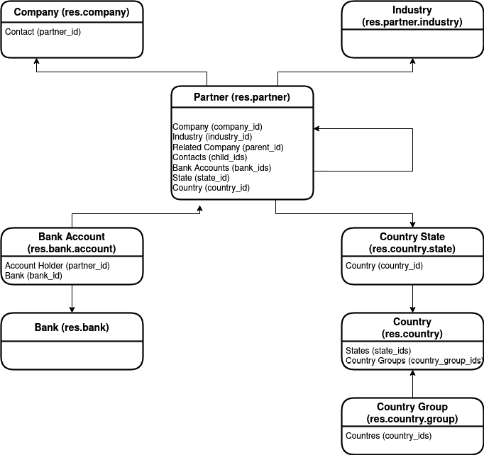
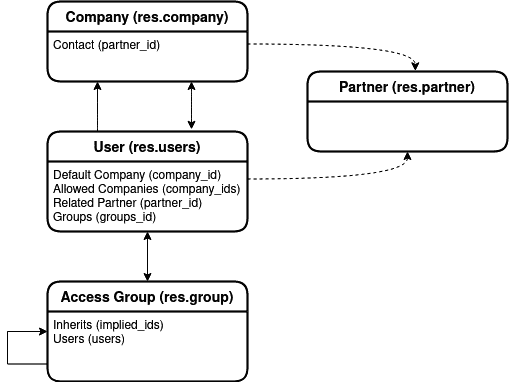
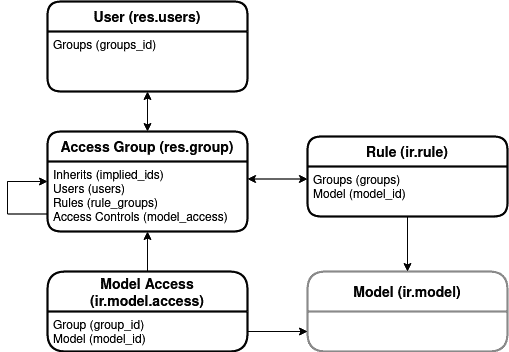
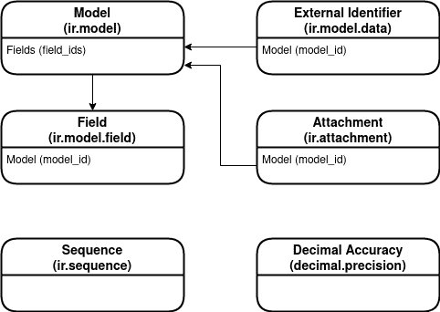
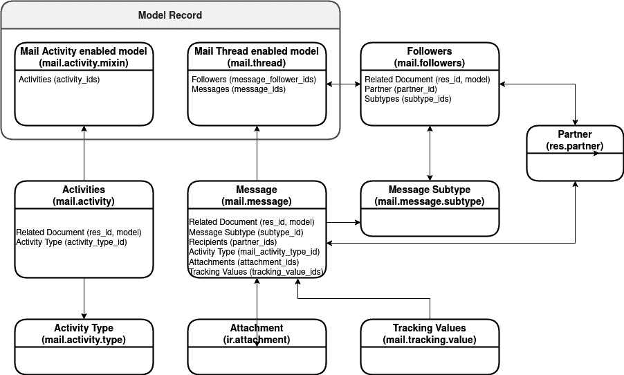

# 第十二章：*第十四章*：理解 Odoo 内置模型

当创建一个新的数据库时，会填充一个初始数据模型，提供可用于**Odoo 应用**的基本实体。本章确定了最相关的基本实体，并解释了如何从**用户界面**（**UI**）检查它们，以及它们的作用。

虽然这种理解对于您能够开发 Odoo 应用不是必需的，但它将为理解 Odoo 框架的核心概念提供一个坚实的基础，并帮助利用技术菜单来解决更复杂的需求或问题。

本章讨论以下主题：

+   理解联系人数据模型

+   理解用户和公司数据模型

+   理解安全相关信息库

+   理解数据库结构模型

+   理解 UI 相关的信息库

+   理解配置属性和公司参数

+   理解消息数据模型

到本章结束时，您将能够使用技术菜单来检查 Odoo 框架中最相关的内部数据记录，帮助您进行问题分析和解决。

在本章中，展示了简化的**实体-关系图**（**ERDs**），让您能够可视化核心模型之间的关系，从而更深入地理解如何在您的业务应用中使用这些模型。

# 技术要求

要跟随本章内容，您只需要对 Odoo 15 实例拥有管理员访问权限，并在**设置** | **技术**菜单中启用开发者模式。要跟随联系人数据模型部分，必须安装**联系人**应用，要跟随消息数据模型部分，必须安装**讨论**应用。

# 理解联系人数据模型

资源模型在其技术**标识符**（**ID**）上携带 `res.` 前缀。它们包含 Odoo 的基本主数据，如用户、公司、货币。

Odoo 的一个中心模型是 `res.partner`。它用于任何需要表示地址、个人或组织的地方。例如，客户、供应商、联系人、开票或发货地址、员工和申请人。它还用于补充用户和配置公司的联系数据。

虽然 `res.partner` 模型由 Odoo 基础模块提供，无需安装特定应用，但要使相应的菜单可用，必须安装**联系人**应用。这些是与**联系人**相关的模型：

+   `res.bank` 存储银行识别数据，因为很明显，没有银行参与很难进行商业活动。银行数据可以从**联系人** | **配置** | **银行账户** | **银行**菜单选项进行浏览。

+   `res.partner.bank`，包含银行账户详情。银行账户与`res.partner`相关联，不出所料，也引用了它们相关的`res.bank`银行。银行账户可以在**联系人** | **配置** | **银行账户** | **银行账户**中浏览。

+   `res.partner.industry`，是一个高级经济活动列表。它用 NACE 代码填充。**NACE**，即**经济活动命名法**，是欧洲经济活动的统计分类。该列表可以在**联系人** | **配置** | **行业**中找到。

+   `res.country`，列出世界国家，并包括有用的数据，如两位数的`res.partner`模型。国家列表可以在**联系人** | **配置** | **本地化** | **国家**中浏览。

+   `res.country.state`，列出国家州和类似的行政区域。该列表默认填充，数据可以在**联系人** | **配置** | **本地化** | **二月州**中查看。

+   `res.country.group`，允许我们定义国家组。Odoo 提供的默认组包括欧洲、**单一欧元支付区**（**SEPA**）国家，和南美洲。根据需要，可以在**联系人** | **配置** | **本地化** | **国家组**中添加其他组。

+   `res.currency`，包含货币列表，当启用多货币时相关。该列表由 Odoo 预填充，相关货币应设置为`active`。访问该列表的菜单选项位于**发票**/**会计**应用中（如果启用了**多货币**），在相应的**配置** | **会计** | **货币**菜单选项中。

下面的图表提供了这些模型及其关系的概述：

图 14.1 – 联系人数据模型

备注

这里提供的数据模型图是简化的实体关系图（ERD）。简化的一部分是用简单的箭头替换了可能对许多人来说不熟悉的**鸟脚**符号。**箭头**代表多对一关系。**双向箭头**代表多对多关系。虚线代表软关系，这些关系不使用数据库 ID 或数据库**外键**（**FK**）。模型名称使用单数形式，这是 ERD 的惯例，即使 Odoo 模型的名称可能使用复数形式。

其他资源模型是用户和公司，将在下一节中描述。

# 理解用户和公司数据模型

用户和公司是 Odoo 数据模型的核心元素。它们可以在**设置** | **用户与公司**菜单中访问。可用的菜单选项在此列出：

+   `res.users`，存储系统用户。这些用户在`partner_id`字段中有一个隐式的合作伙伴记录，其中存储了名称、电子邮件、图像和其他联系详情。

+   `res.group`，存储安全访问组。此菜单仅在启用开发者模式时可用。属于某个组的用户将获得该组的权限。组可以继承其他组，这意味着它们也将提供这些继承组的权限。

+   `res.company`，存储组织的详细信息以及特定公司的配置。它有一个隐式的合作伙伴记录，包含地址和联系详情，存储在`partner_id`字段中。新数据库提供了一个默认公司，其`base.main_company`**可扩展标记语言**（**XML**）ID。

以下图表提供了这些模型之间关系的概览：

图 14.2 – 用户和公司数据模型

用户和访问组模型是 Odoo 访问安全定义的基础。下一节将详细介绍这些模型，可通过**技术**菜单访问。

# 理解安全相关信息存储库

Odoo 用户通过访问组获得对功能的访问权限。这些访问组包含它们提供的权限的定义。最相关的访问模型在此列出：

+   `res.users`，是 Odoo 系统用户。

+   `res.group`，是访问组。用户属于一个或多个组，每个组授予一定的权限。

+   `ir.model.access`，授予一个模型**创建-读取-更新-删除**（**CRUD**）权限。

+   `ir.rule`，授予一个组在模型记录子集上的 CRUD 权限，这些记录由域表达式定义。例如，使用常规访问权限，您可以授予写入权限，然后记录规则可以限制某些记录为只读。

以下图表提供了数据模型这一部分的简化视图：

图 14.3 – 安全相关数据模型

您已经了解了用户、访问组、合作伙伴和访问权限的数据模型，它们之间都有紧密的联系。在下一节中，您将继续进一步了解数据库结构定义，例如模型和字段。

# 理解数据库结构模型

信息存储库（`ir.`）模型描述了 Odoo 内部配置，如模型、字段和 UI。这些定义可以在**设置** | **技术**菜单下访问。

可以通过**设置** | **技术** | **数据库结构**菜单找到与数据模型相关的信息存储库。在该菜单中最相关的选项之后，我们有以下设置：

+   `decimal.precision`，用于配置不同用例的精度数字位数，例如产品价格。

+   `ir.model`，描述了 Odoo 安装的数据模型，这些模型大多数情况下映射到存储数据的数据库表。使用开发者菜单中的**查看元数据**选项查找模型的 XML ID 很有用。**在应用中**字段也有助于找出参与模型数据结构定义的模块。

+   `ir.model.field`，存储在数据库中定义的模型字段。此列表可以通过**设置** | **技术** | **数据库结构** | **字段**菜单访问，或通过开发者菜单中的**查看字段**选项访问。

+   `ir.attachment`，是用于存储附件文件的模型。它是 Odoo 跨应用使用的单一存储位置。

**设置** | **技术** | **序列与标识符**菜单包括与数据记录 ID 相关的模型，并包含以下设置：

+   `ir.model.data`，是存储外部 ID 的地方，也称为 XML ID。它们将数据库实例无关的 ID 名称映射到数据库实例特定的 ID 键。它们可在**设置** | **技术** | **序列与标识符** | **外部标识符**中访问。

+   `ir.sequence`，描述了用于自动编号分配的序列，例如在**销售订单**或**库存转移**上。

以下图表展示了这些模型之间的高层次关系：

图 14.4 – 数据库结构数据模型

您已经了解了用于保持 Odoo 模型定义的关键模型。接下来，我们将讨论下一节中的表示层定义。

# 理解与 UI 相关的信息存储库

UI 元素，如菜单和视图，存储在信息存储库模型中。对应的数据可以通过**设置** | **技术** | **用户界面**菜单访问。其中最相关的选项如下列出：

+   `ir.ui.menu`，定义菜单选项。这些形成一个层次树，叶项可以触发**动作**，然后通常提供显示视图组合的说明。

+   `ir.ui.view`，存储视图定义及其扩展。视图类型包括表单、列表、看板和 QWeb（用于报告和网页模板）。

在**设置** | **技术** | **动作**菜单下，您可以找到这些 UI 元素的定义。其中最相关的选项如下列出：

+   `ir.actions.actions`，是其他动作类型从中派生的基本模型。通常，您不需要直接处理它。

+   `ir.actions.report`，是打印报告的动作。它们将具有相关的 QWeb 视图，提供报告定义，用于生成可以转换为**便携式桌面格式**（**PDF**）格式的**超文本标记语言**（**HTML**）报告。

+   `ir.actions.act_window`，用于展示视图的组成，可能是最常用的动作类型。最简单的视图组合是列表视图和表单视图。

+   `ir.actions.server` 用于运行服务器进程，例如创建或修改记录、发送电子邮件，甚至运行 Python 代码。

以下图表提供了先前模型及其关系的简化视图：

图 14.5 – 操作和 UI 数据模型

通过本节，你应该对定义 Odoo UI 相关的几个元素以及如何使用技术菜单来检查它们有了更好的理解。在下一节中，你将介绍用于全局配置参数和公司相关数据的技術模型。

# 理解配置属性和公司参数

技术选项中的另一个重要菜单是 **设置** | **技术** | **用户参数**。在那里你可以找到两个选项：**系统参数** 和 **公司属性**。

`ir.config_parameter` 存储全局配置选项。其中一些是默认值，可以调整，而其他一些则在 `web.base.url` 选项中选择某些选项时设置。该选项存储 Odoo 服务器的 **统一资源定位符**（**URL**）并可用于在电子邮件模板中创建链接。

`ir.property` 是存储多公司字段数据的地方。某些字段可以根据活动公司具有不同的值。这些也被称为 **属性字段**。

例如，对于客户相关的合作伙伴字段 `property_account_receivable_id`) 和对于供应商相关的 `property_account_payable_id`)，它们都是属性字段。

由于相同的字段名可以持有不同的值，这取决于活动公司，它可以是常规数据库文件。这就是 `ir.property` 模型作为存储这些值的地方出现。

此模型具有以下字段：

+   `property_account_receivable_id`。

+   `ir.model.fields` 记录。

+   `Float` 或 `Many2one`。

+   `res.partner,62` 表示数据库 ID 为 62 的 `res.partner` 记录的引用。

+   **公司**：此值有效的公司。

+   `account.account,813` 表示 ID 为 813 的会计科目表。

    小贴士

    **资源**字段是可选的。如果为空，它将用作该公司的新的记录的默认值。这用于此处作为示例的 **应收账款** 和 **应付账款** 字段。

理解这些公司属性和参数的相关性对于高级配置调整可能很有用，例如调整用于公共 Web URL 的默认值或定义多公司字段的默认值。下一节将继续技术菜单探索之旅，这次将涵盖与消息相关的模型。

# 理解消息数据模型

你可能需要与之合作的相关技术领域是许多表单中发现的 Chatter 小部件所使用的消息相关模型。这些功能由 `mail` 提供，因此需要在以下菜单项可用之前安装。

相关的技术模型可以在**设置** | **技术** | **讨论**菜单中找到。那里找到的最重要选项如下列所示：

+   `mail.message`存储每个消息。它通过**邮件线程**抽象模型与一个**资源**（模型中的一个特定记录）相关联。

+   `mail.message.subtype`用于每个消息。基本子类型包括**笔记**，用于内部讨论，**讨论**，用于外部消息，以及**活动**，用于计划的活动。这些子类型适用于任何模型。其他子类型，通常是模型特定的，可以添加以识别不同的事件。这允许配置默认订阅，决定哪些事件应该触发向哪些订阅者发送通知。

+   `mail.tracking.value`存储跟踪字段的字段值变更日志。要跟踪一个字段，请检查`tracked=True`字段属性。这些变更日志在聊天消息中呈现，因此跟踪值与聊天消息相关联。

+   `mail.activity`存储记录的单独活动。**活动混合**抽象增加了其他模型链接到活动的能力，类似于**邮件线程**对消息所做的那样。

+   `mail.activity.type`是可配置的活动类型，例如**电子邮件**、**电话**、**会议**或**待办事项**。

+   `mail.followers`存储每个消息线程的订阅者列表。每个订阅者记录还有一个它已订阅的子类型列表。每当添加包含这些子类型之一的任何新消息时，订阅者将收到通知。

    小贴士

    在一些具有严格控制策略的环境中，数据访问和变更日志是重要功能。作为开箱即用的跟踪功能的替代方案，可以使用**审计日志**社区模块。您可以在[`odoo-community.org/shop/product/audit-log-533`](https://odoo-community.org/shop/product/audit-log-533)找到它。

以下图表提供了这些模型及其关系的概览：

图 14.6 – 消息和活动数据模型

大多数时候，你会使用一些精选的**应用程序编程接口**（**API**）方法来创建消息和活动，而不需要深入了解相应数据是如何存储的。

对于一些复杂情况，对底层数据模型有良好的理解可能很有价值。特别是，了解消息子类型和它们对订阅者的订阅情况，对于精细控制通知非常有用。这完成了我们对 Odoo 框架最重要的技术模型的概述。

# 摘要

在本章中，你了解了 Odoo 框架的内部结构，这些结构由信息仓库(`ir`)和资源(`res`)模型提供。

**Contacts** 模型对于在 Odoo 中存储所有人员和地址数据至关重要，安装 **Contacts** 应用程序为该模型和相关数据添加了用户界面。了解公司联系人可以有子联系人和地址对于有效地使用 Odoo 至关重要。**Settings** 应用程序中的 **Users & Companies** 菜单也被讨论，以介绍 **Users**、**Access Groups** 和 **Companies**。**Access Groups** 在此处的作用是授予 **Users** 访问权限是一个关键思想。剩余的相关元素在 **Settings** 应用程序的 **Technical** 菜单中公开。现在让我们回顾一下本章中提到的关键思想。

从菜单的顶部开始，**Discuss** 子菜单包含消息和活动数据模型，一个关键思想是使用子类型来控制自动通知。**Actions** 菜单暴露了在菜单项和上下文菜单中使用的操作，并用于展示视图、打印报告或在服务器上执行代码。**User Interface** 菜单介绍了利用 **Actions** 的 **Menu Items**，以及用于存储后端视图和前端 HTML 模板的 **Views** 菜单选项。菜单中的下一个是 **Database Structure** 子菜单。在这里，用于描述所有 Odoo 数据结构的模型都是可用的。这些模型在应用程序开发过程中的多个地方被引用，例如在视图定义或模型扩展中。与模型密切相关的是 **Security** 定义，它授予访问组成员读取或写入模型或模型中特定记录域的访问权限。

虽然没有审查每个技术菜单选项，但最相关的选项已被展示，并应提供对 `base` 和 `mail` 模块下数据结构的坚实基础理解。您在 Odoo 开发领域的旅程即将结束。现在您已经拥有了开发业务应用程序所需的所有工具和技能，所缺少的最后一部分是将它们部署并使其对最终用户可用。

Odoo 项目的最后一英里是将我们的工作部署到实际使用中。与开发安装相比，为生产环境安装 Odoo 有额外的要求。下一章将指导您设置 Odoo 生产安装，避免最常见的陷阱。
