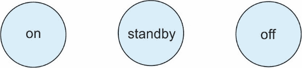
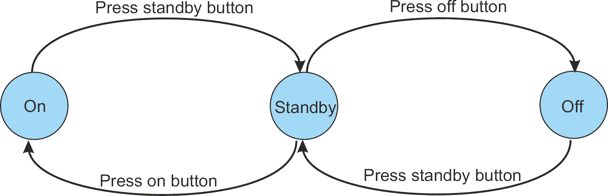

# 第一章：从有限状态机到计算机

在本章中，你将发现计算机的基本本质。我们的目标是解释是什么让计算机成为计算机。这些概念很重要，因为在你理解计算机的工作原理之前，你必须欣赏其顺序性的影响。

一旦我们介绍了数字系统的概念，下一章将演示计算机如何通过从内存中获取指令并执行它们来运行。之后，我们将介绍 Python，并展示如何编写程序来模拟计算机并观察其操作。这本书完全是关于通过实践学习的；通过用软件构建计算机，你将学习它是如何运行的以及如何扩展和修改它。

本书剩余部分将探讨一台真实的计算机，树莓派（Raspberry Pi），并展示如何为其编写程序并观察它们的执行。在这个过程中，我们将从模拟假设的计算机转向学习真实的计算机。

计算机是一个**确定性符号处理**机器。但这究竟意味着什么？**确定性**告诉我们，当计算机在相同条件下操作时（即，程序和输入），它总是以相同的方式行为。如果你用计算机来评估√2，无论你执行操作多少次，你都会得到相同的结果。并非所有系统都是确定性的——如果你抛硬币，正面和反面的序列是不可预测的。

当我们说计算机是一个**符号处理机器**时，我们的意思是它接受符号并对它们进行操作，以提供新的符号作为输出。这些符号可以是任何可以用数字形式表示的东西：字母、单词、数字、图像、声音和视频。考虑一台正在下棋的计算机。程序接收到的输入符号对应于玩家的移动。程序根据一组规则对输入符号进行操作，并产生一个输出符号——计算机的移动。

尽管我们刚刚提供了一个计算机的理论定义，但重要的是要认识到编程涉及将现实世界中的信息转换为计算机可以操作的符号——编写一组规则（即，程序），告诉计算机如何操作这些符号，然后将输出符号转换为对人类有意义的格式。计算机处理的符号对计算机本身没有固有的意义——一定的比特模式（即，符号）可能代表一个数字、一个名字、游戏中的移动等等。计算机处理这些比特以产生一个新的比特模式（即，输出符号），这种模式只对程序员或用户有意义。

我们将提出一个简单的问题，并解决它。我们的解决方案将引导我们了解算法和计算机的概念，并介绍诸如离散数字操作、内存和存储、变量以及条件操作等关键概念。通过这样做，我们可以确定计算机需要执行哪些操作来解决一个问题。在此之后，我们可以问，“我们如何自动化这个过程？也就是说，我们如何构建一台计算机？”

这是一句陈词滥调，但一旦你理解了一个问题，你就已经找到了解决问题的方法。当你第一次遇到需要算法解决的问题时，你必须考虑你想要做什么，而不是你打算如何去做。解决问题的最糟糕的方法是在完全探索问题之前就开始编写算法（甚至实际的计算机代码）。假设有人要求你为汽车设计一个巡航控制系统。从原则上讲，这是一个非常简单的问题，解决方案同样简单：

```py

IF cruise control on THEN keep speed constant
                     ELSE read the position of the gas pedal
```

这难道不是再简单不过了吗？好吧，如果你已经选择了巡航控制，而有人在你面前突然驶出，会发生什么？你可以刹车，但这个算法会试图在刹车的同时通过全油门来保持速度不变。或者，你可能会建议，刹车应该解除巡航控制机制。但是，巡航控制应该永久解除，还是汽车在刹车动作停止后应该加速到之前的速度？你必须考虑问题的所有方面。

即使你设计了一个正确的算法，你也必须考虑错误或虚假数据对你的系统产生的影响。对计算机最普遍的批评之一是，如果你向它们提供错误的数据，它们会产生无意义的结果。这个观点可以用“垃圾输入，垃圾输出”（**GIGO**）这个表达来概括。一个构造良好的算法应该能够检测并过滤掉输入数据流中的任何垃圾。

在本章中，我们将介绍以下主题：

+   有限状态机

+   算法解决问题

# 技术要求

你可以在 GitHub 上找到本章使用的程序，链接为[`github.com/PacktPublishing/Practical-Computer-Architecture-with-Python-and-ARM/tree/main/Chapter01`](https://github.com/PacktPublishing/Practical-Computer-Architecture-with-Python-and-ARM/tree/main/Chapter01)。

# 有限状态机

你需要了解的基本概念寥寥无几，才能理解数字计算机的功能及其工作原理。其中最重要的概念之一是离散，它既是计算机操作的核心，也是计算机程序的核心。

计算机操作的是离散数据元素——也就是说，其值是从一个固定且有限的值范围内选择的元素。我们在日常生活中使用离散值——例如，属于集合{A...Z}的罗马字母表中的字母。一个字母永远不会位于两个可能值之间。星期几也是如此；你可以有七天中的一天，但你不能有一个稍微是星期一或者稍微比星期三大一点的日子。在计算机的情况下，基本数据元素是比特，它只能有 0 或 1 的值，并且所有数据结构都是由 1 和 0 的字符串表示的。

除了离散的数据值，我们还可以有时间上的离散点。想象一下时间沿着一个方向移动，从一个离散点移动到另一个离散点。时间上的两个离散点之间不存在任何东西。这有点像从 12:15:59 到 12:16:00 跳转的数字时钟。中间没有任何东西。

现在，想象一下状态空间，这是一个宏伟的术语，用于描述系统可能处于的所有状态（例如，飞机可能处于爬升、下降或水平飞行状态）。状态有点像时间，不同之处在于你可以在状态空间中的离散点之间向前或向后移动。如果可能的状态数量有限，那么一个模拟状态之间转换的设备被称为**有限状态机**（**FSM**）。电梯就是一个有限状态机：它有状态（楼层位置、门开或关等）和输入（电梯呼叫按钮、楼层选择按钮以及开门和关门按钮）。

在我们认真研究有限状态机之前，让我们从一个简单的例子开始，看看如何使用有限状态机来描述一个真实系统。考虑昨天的电视，这是一个有两个状态的设备：开启和关闭。它总是处于这两种状态之一，并且可以在这些状态之间移动。它永远不会处于既不是开启也不是关闭的状态。现代电视通常有三个状态——开启、*待机*和关闭——其中待机状态提供了一个快速开启机制（也就是说，电子设备的一部分处于活跃的开启状态，但显示和声音系统是关闭的）。待机状态通常被称为睡眠状态或空闲状态。我们可以使用图表来模拟离散状态。每个状态都由一个标记的圆圈表示，如*图 1*.*1*所示：



图 1.1 – 表示电视的三个状态

*图 1*.*1*显示了三个状态，但它没有告诉我们我们需要知道的最重要信息：我们如何在不同状态之间移动。我们可以通过在状态之间画线并标注触发状态变化的触发事件来实现这一点。*图 1*.*2*就是这样做的。请注意，我们将首先构建一个不正确的系统来展示一些关于有限状态机的概念：



图 1.2 – 用转换表示电视的状态

在 *图 1*.*2* 中，我们通过触发事件的名称来标记每个转换；在每种情况下，都是按下遥控器上的按钮。要从关闭状态切换到开启状态，您必须首先按下待机按钮，然后按下开启按钮。要在开启和待机状态之间切换，您必须按下开启按钮或待机按钮。

我们忘记了一些事情——如果您已经处于某个状态并按下相同的按钮怎么办？例如，假设电视处于开启状态，您按下开启按钮。此外，初始状态是什么？*图 1*.*3* 纠正了这些遗漏。

*图 1*.*3* 有两个创新。有一个指向关闭状态的箭头标记为 *开启电源*。这条线表示您第一次将系统接入电源时系统进入的状态。*图 1*.*3* 的第二个创新是每个状态都有一个回到自身的循环；例如，如果您处于开启状态并按下开启按钮，您将保持在那个状态：


图 1.3 – 初始化后的电视控制

*图 1*.*3* 中所示的状态图既有逻辑错误也有人体工程学错误。如果您处于关闭状态并按下开启按钮会发生什么？如果您处于关闭状态，在这个系统中按下开启按钮是不正确的，因为您必须先进入待机状态。*图 1*.*4* 通过处理错误输入来纠正这个错误：


图 1.4 – 具有错误按钮纠正的电视控制

*图 1*.*4* 现在提供了从任何状态的正确操作，并包括按下不会改变状态按钮的效果。但是，我们仍然存在人体工程学错误——也就是说，这是一个正确的设计，但它的行为方式许多人会认为不好。待机状态是一种方便，可以加快操作速度。然而，用户不需要了解这种状态——它应该对用户不可见。

*图 1*.*5* 展示了控制器的最终版本。我们消除了待机按钮，但没有消除待机状态。当用户按下开启按钮时，系统直接进入开启状态。然而，当用户在开启状态下按下关闭按钮时，系统进入待机状态。从待机状态，按下开启按钮会导致开机状态，而按下关闭按钮会导致关机状态。请注意，同一动作（按下关闭按钮）可能根据当前状态产生不同的效果：


图 1.5 – 具有隐藏待机状态的电视控制

我们之所以详细讨论这个例子，是因为 FSM 的概念是所有数字系统的核心。所有数字系统，除了最简单的，都会根据当前输入和过去状态从一种状态转移到另一种状态。在数字计算机中，状态变化的触发器是系统时钟。现代计算机以 4 GHz 的时钟速度运行，每 0.25 x 10^-9 秒或每 0.25 纳秒改变一次状态。以 300,000 km/s（186,000 mph）的速度传播的光在时钟周期内大约移动 7.5 厘米或 3 英寸。

## 交通信号灯示例

让我们来看一个 FSM 的第二个例子。FSM 的一个经典例子是交叉路口的交通信号灯。考虑一个南北或东西方向交通流动的交叉口。交通可能一次只能在一个方向上流动。假设这是一个带有时钟的系统，并且每分钟允许状态变化：

| **当前灯光状态** | **南北方向交通** | **东西方向交通** | **下一个时钟周期要采取的行动** | **灯光的下一个状态** |
| --- | --- | --- | --- | --- |
| 南北方向 | 无 | 无 | 无交通，无变化 | 南北方向 |
| 南北方向 | 无 | 一个或多个 | 东西方向，强制变化 | 东西方向 |
| 南北方向 | 一个或多个 | 无 | 南北方向，无变化 | 南北方向 |
| 南北方向 | 一个或多个 | 一个或多个 | 东西方向，强制变化 | 东西方向 |
| 东西方向 | 无 | 无 | 无交通，无变化 | 东西方向 |
| 东西方向 | 无 | 一个或多个 | 东西方向，无变化 | 东西方向 |
| 东西方向 | 一个或多个 | 无 | 南北方向，强制变化 | 南北方向 |
| 东西方向 | 一个或多个 | 一个或多个 | 南北方向，强制变化 | 南北方向 |

表 1.1 – 交通信号灯序列表

假设交通目前是南北方向流动。在下一个时钟周期，它可能继续保持南北方向流动，或者信号灯可能改变以允许东西方向交通。同样，如果交通是东西方向流动，在下一个时钟周期，它可能继续保持东西方向流动，或者信号灯可能改变以允许南北方向交通。

我们可以使用*表 1.1*来描述这个系统。我们提供了灯光的当前状态（交通流动方向），指示是否在南北或东西方向检测到任何交通，下一个时钟周期要采取的行动，以及下一个状态。交通规则很简单：除非有其他方向的待处理交通，否则信号灯保持当前状态。

我们现在可以将这个表格转换为*图 1.6*中所示的 FSM 图。请注意，我们将东西方向状态设置为开机状态；这是一个任意的选择：


图 1.6 – 表 1.1 的有限状态机

我们学到了什么？最重要的观点是，在任何时刻，系统都处于特定的状态，并且根据定义的一组条件进行状态转换（或转换回当前状态）。有限状态机作为教学工具和设计工具都有几个优点：

+   它使用一个简单直观的图来描述具有离散状态的系统

+   状态转换图（如果正确）提供了一种完整且无歧义的方式来描述一个系统

+   有限状态机也是一个抽象机，因为它模拟了一个真实系统，但我们不必担心有限状态机在真实硬件或软件中的实现

+   任何有限状态机都可以在硬件或软件中实现；也就是说，如果你能在纸上定义一个状态图，你就可以在专用硬件中构建电路，或者编写在通用计算机上运行的程序

我包括了对有限状态机的简要介绍，因为它们可以被认为是数字计算机的先驱。有限状态机被设计用来执行特定任务；这是内置到其硬件中的。计算机具有有限状态机的某些特征，但你可以在状态之间编程转换。

## 以算法方式解决简单问题

现在我们已经介绍了有限状态机（FSM），我们将描述一个问题，解决问题，然后构建我们的计算机。一个袋子包含红色和白色标记的混合物。假设我们一次从袋子中取出一个标记，直到我们取出三个连续的红色标记。我们想要构建一个算法，告诉我们何时停止从袋子中取出标记，当检测到三个连续的红色标记时。

在创建算法之前，我们将为此问题提供一个有限状态机：


图 1.7 – 三标记检测器的有限状态机

如您所见，这里有四种状态。我们从状态 S0 开始。每次接收到一个标记时，如果它是红色的，我们就移动到下一个状态，如果是白色的，就回到初始状态。一旦我们达到状态 S3，过程就结束了。现在，我们将以算法的方式执行相同的操作。

如果白色标记用符号 W 表示，红色标记用 R 表示，一个可能的标记序列可能是 RRWRWWWWRWWRRR（序列由三个 R 终止）。一个告诉我们何时停止取出标记的算法可以写成以下形式：

+   第 1 行：从袋子中获取一个标记

+   第 2 行：如果标记是白色的，则回到第 1 行

+   第 3 行：从袋子中获取一个标记

+   第 4 行：如果标记是白色的，则回到第 1 行

+   第 5 行：从袋子中获取一个标记

+   第 6 行：如果标记是白色的，则回到第 1 行

+   第 7 行：成功 – 已从袋子中取出三个连续的红色标记

如您所见，该算法用普通英语表达。它是从上到下，逐行阅读的，并且每行指定的操作在处理下一行之前执行。在这个算法中，每一行都有一个独特的名称（即行 1、行 2 等）。给行标记使我们能够引用它；例如，当算法声明我们必须返回行 1 时，这意味着下一步要执行的操作由行 1 指定，并且我们从行 1 开始继续执行操作。这个算法并不完全令人满意 – 我们还没有检查袋子中是否只包含红色和白色标记，并且我们还没有处理在找到我们正在寻找的序列之前用完标记的情况。目前，我们并不关心这些细节。

这个问题没有唯一的解决方案 – 更多的时候，可以构建许多算法来解决给定的问题。让我们推导出另一个算法来检测三个连续红色标记的序列：

行 1：将迄今为止找到的连续红色标记的总数设置为 0

行 2：从袋子中取一个标记

行 3：如果标记是白色的，则返回行 1

行 4：将迄今为止找到的连续红色标记的数量加 1

行 5：如果连续红色标记的数量少于 3，则返回行 2

行 6：成功 – 已从袋子中取出 3 个连续的红色标记

这个算法更灵活，因为它可以很容易地通过更改算法中行 5 的 3 的值来检测任意数量的连续红色标记。

*图 1.8* 以流程图的形式直观地表示了这个算法，展示了执行算法时发生的操作序列。带箭头的线条表示操作的执行顺序。方框表示操作本身，菱形代表条件操作。菱形中的表达式评估为“是”或“否”，并且控制流向一个方向或另一个方向。一般来说，流程图非常适合表示简单的算法，但它们被认为不适合复杂的算法。复杂算法的流程图看起来像一碗意大利面 – 但没有意大利面固有的清晰性和组织性。


图 1.8 – 用流程图表示的算法

## 构建算法

下一步是提供一个 *算法*，它清楚地告诉我们如何明确无歧义地解决这个问题。当我们遍历数字序列时，我们需要跟踪正在发生的事情，正如 *表 1.2* 所展示的：

| **序列中的位置** | **0** | **1** | **2** | **3** | **4** | **5** | **6** | **7** | **8** | **9** | **10** | **11** | **12** | **13** |
| --- | --- | --- | --- | --- | --- | --- | --- | --- | --- | --- | --- | --- | --- | --- |
| 新标记 | R | R | W | R | W | W | W | W | R | W | W | R | R | R |
| 是红色吗？ | Y | Y | N | Y | N | N | N | N | Y | N | N | Y | Y | Y |
| 红色数量 | 1 | 2 | 0 | 1 | 0 | 0 | 0 | 0 | 1 | 0 | 0 | 1 | 2 | 3 |

表 1.2 – 随机选择的标记序列

`REPEAT...UNTIL` 是粗体的。当我们介绍 Python 时，我们将详细研究这些操作：

```py

1.    Set numRed to 0
2.    Set maxRed to 3
3.    REPEAT
4.        Get a token
5.        IF its color is red
6.        THEN numRed = numRed + 1
7.        ELSE numRed = 0
8.    UNTIL numRed = maxRed
```

这段伪代码采用了许多高级计算机语言中常见的两种结构：第 3 到 8 行的 `REPEAT...UNTIL` 结构，以及第 5 到 7 行的 `IF...THEN...ELSE` 结构。`REPEAT...UNTIL` 允许你执行一次或多次动作，而 `IF...THEN...ELSE` 允许你在两种可能的行动之间进行选择。

`IF...THEN...ELSE` 结构是数字计算机操作的核心，你将在本书中多次遇到它。

下一步是介绍 Python，这样我们就可以编写一个程序来实现这个算法。然后，我们可以开始研究计算机。以下代码显示了一个 Python 程序及其执行时的输出。我们还没有介绍 Python。这个程序的目的在于展示它与前面的算法多么接近，以及 Python 的简单性：

```py

Sequence =['W','R','R','W','R','W','W','W','W','R','W','W','R','R','R']
numRed = 0
maxRed = 3
count  = 0
while numRed != maxRed:
    token = sequence[count]
    if token == 'R':
        numRed = numRed + 1
    else: numRed = 0
    print('count', count,'token',token,'numRed',numRed)
    count = count + 1
print('Three reds found starting at location', count - 3)
```

`while numRed != maxRed:` 这一行表示 *只要 (*`while`*) `numRed` 的值不等于 `maxRed`，就执行缩进的代码块。Python 的 `!=` 操作符表示 *不等于*。

这是程序执行时的输出。它正确地识别了三个连续的红色，并指出了三个红色序列中第一个红色出现的位置：

```py

count  0 token  W numRed 0
count  1 token  R numRed 1
count  2 token  R numRed 2
count  3 token  W numRed 0
count  4 token  R numRed 1
count  5 token  W numRed 0
count  6 token  W numRed 0
count  7 token  W numRed 0
count  8 token  W numRed 0
count  9 token  R numRed 1
count 10 token  W numRed 0
count 11 token  W numRed 0
count 12 token  R numRed 1
count 13 token  R numRed 2
count 14 token  R numRed 3
Three reds found starting at location 12
```

# 摘要

在本章中，我们通过有限状态机（FSM）的概念介绍了计算机。状态机是任何可以在任何时刻存在于几种状态之一的系统的抽象。状态机是在状态及其状态之间转换的术语中定义的。我们引入状态机作为数字系统的一个先导。状态机引入了离散状态和离散时间的概念。状态机在离散的时间点从一个状态移动到另一个状态。这反映了程序的行为，其中动作（状态改变）仅在执行指令时发生。

状态机可以模拟从交通灯到棋类游戏或计算机程序这样简单的系统。我们还介绍了算法的概念——即，用于解决问题的规则集。在本书的后面部分，我们将解释计算机如何实现算法。

在 *第二章* 中，我们将简要概述 n。我们选择这种语言是因为它有一个非常平缓的学习曲线，功能非常强大（用几行代码就能做很多事情），在许多大学中都有教授，并且可以在 PC、Mac 和 Raspberry Pi 系统上免费运行。
