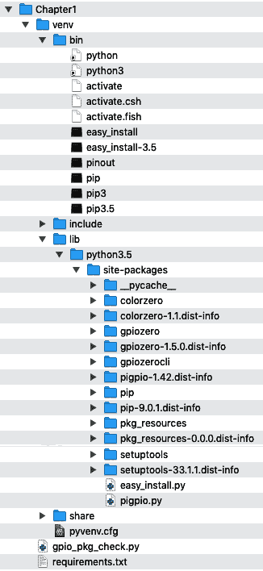
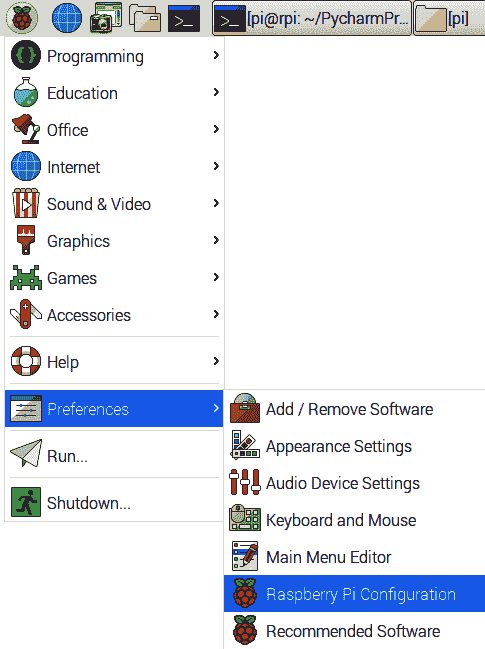
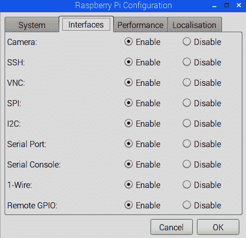

# 第一章：设置您的开发环境

Python 编程的一个重要但经常被忽视的方面是如何正确设置和维护 Python 项目及其运行时环境。它经常被忽视，因为它对于 Python 生态系统来说是一个可选的步骤。虽然这对于学习 Python 语言基础知识可能没问题，但对于需要维护独立的代码库和依赖项以确保项目不会相互干扰的更复杂的项目来说，它可能会很快成为一个问题，或者更糟糕的是，像我们将讨论的那样，破坏操作系统工具和实用程序。

因此，在后面的章节中，当我们跳入**IoT**代码和示例时，非常重要的是我们覆盖设置 Python 项目及其运行时环境所需的步骤。

在本章中，我们将涵盖以下主题：

+   了解您的 Python 安装

+   设置 Python 虚拟环境

+   使用`pip`安装 Python GPIO 包

+   执行 Python 脚本的替代方法

+   树莓派 GPIO 接口配置

# 技术要求

要执行本章的实践练习，您需要以下内容：

+   树莓派 4 型 B

+   Raspbian OS Buster（带桌面和推荐软件）

+   最低 Python 版本 3.5

这些要求是本书中的代码示例所基于的。可以合理地期望代码示例应该在不经修改的情况下在树莓派 3 型 B 或不同版本的 Raspbian OS 上工作，只要您的 Python 版本是 3.5 或更高。

本书的完整源代码可以在 GitHub 上找到，网址如下：[`github.com/PacktPublishing/Practical-Python-Programming-for-IoT`](https://github.com/PacktPublishing/Practical-Python-Programming-for-IoT)。当我们来到*设置 Python 虚拟环境*部分时，我们将很快克隆这个存储库。

# 了解您的 Python 安装

在本节中，我们将找出您的树莓派上安装了哪些 Python 版本。正如我们将发现的那样，在 Raspbian OS 上预装了两个版本的 Python。基于 Unix 的操作系统（如 Raspbian OS）通常预装了 Python 2 和 3，因为有使用 Python 构建的操作系统级实用程序。

要找出您的树莓派上安装了哪些 Python 版本，请按照以下步骤操作：

1.  打开一个新的终端并执行`python --version`命令：

```py
$ python --version
Python 2.7.16
```

在我的例子中，我们看到 Python 版本 2.7.16 已安装。

1.  接下来，运行`python3 --version`命令：

```py
$ python3 --version
Python 3.7.3
```

在我的例子中，我们看到已安装的第二个 Python 版本（即`python3`，带有`3`）是版本 3.7.3。

如果次要版本（2 后面的.7.16 和 3 后面的.7.3）不相同，不要担心；重要的是主要版本 2 和 3。Python 2 是 Python 的旧版本，而 Python 3 是当前支持的版本，是写作时的 Python 版本。当我们开始新的 Python 开发时，我们几乎总是使用 Python 3，除非有我们需要处理的旧问题。

Python 2 在 2020 年 1 月正式终止生命周期。它不再得到维护，也不会再接收任何进一步的增强、错误修复或安全补丁。

如果您是一位经验丰富的 Python 程序员，您可能能够辨别脚本是为 Python 2 还是 3 编写的，但仅仅通过查看一小段代码通常并不明显。许多刚接触 Python 的开发人员在混合使用为不同 Python 版本编写的程序和代码片段时会感到沮丧。请记住，未经修改的 Python 2 代码不能保证与 Python 3 向上兼容。

一个快速提示我可以分享的是，要确定一个代码片段是为哪个 Python 版本编写的（如果程序员在代码注释中没有明确说明），可以查找`print`语句。

如果您看下面的例子，您会发现有两个`print`语句。没有括号的第一个`print`语句表明它只能在 Python 2 中使用：

```py
print "Hello"  # No parentheses - This only works in Python 2, a dead give-away that this script is for Python 2.

print("Hello") # With parentheses - this will work in Python 2 and Python 3
```

当然，您可以始终针对 Python 2 和 3 运行代码，看看会发生什么。

我们现在已经看到 Raspbian OS 默认提供了两个 Python 版本，并提到有一些以 Python 编写的系统级实用程序依赖于这些版本。作为 Python 开发人员，我们必须小心，不要破坏全局 Python 安装，因为这可能会破坏系统级实用程序。

我们现在将把注意力转向一个非常重要的 Python 概念，即 Python 虚拟环境，这是我们将自己的 Python 项目与全局安装隔离或*沙箱*的方式。

# 设置 Python 虚拟环境

在本节中，我们将讨论 Python 如何与您的操作系统安装进行交互，并介绍设置和配置 Python 开发环境所需的步骤。此外，作为设置过程的一部分，我们将克隆包含本书所有代码（按章节组织）的 GitHub 存储库。

默认情况下，Python 及其包管理工具`pip`在系统级全局操作，并且可能会对 Python 初学者造成一些困惑，因为这种全局默认与许多其他语言生态系统形成对比，后者默认在项目文件夹级别本地操作。不经意地在全局 Python 环境中工作和进行更改可能会破坏基于 Python 的系统级工具，并且解决这种情况可能会成为一个主要的头痛。

作为 Python 开发人员，我们使用 Python 虚拟环境来隔离我们的 Python 项目，以便它们不会对系统级 Python 实用程序或其他 Python 项目造成不利影响。

在本书中，我们将使用一个名为`venv`的虚拟环境工具，它作为 Python 3.3 及以上版本的内置模块捆绑提供。还有其他虚拟环境工具可供选择，它们各自具有相对的优势和劣势，但它们都共享一个共同的目标，即将 Python 依赖项隔离到一个项目中。

`virtualenv`和`pipenv`是两种替代的虚拟环境工具选项，它们提供比`venv`更多的功能。这些替代方案非常适合复杂的 Python 项目和部署。您可以在本章末尾的*进一步阅读*部分找到这些链接。

让我们开始克隆 GitHub 存储库并为本章的源代码创建一个新的 Python 虚拟环境。打开一个新的终端窗口，并按照以下步骤操作：

1.  切换到或创建一个您想要存储本书源代码的文件夹，并执行以下命令。使用最后一个命令，我们将克隆的文件夹重命名为`pyiot`。这样做是为了帮助缩短本书中的终端命令示例：

```py
$ cd ~
$ git clone https://github.com/PacktPublishing/Practical-Python-Programming-for-IoT
$ mv Practical-Python-Programming-for-IoT pyiot 
```

1.  接下来，切换到包含与本章相关的代码的`chapter01`文件夹：

```py
$ cd ~/pyiot/chapter01
```

1.  执行以下命令，使用`venv`工具创建一个新的 Python 虚拟环境。重要的是您要输入`python3`（带有 3），并记住`venv`仅适用于 Python 3.3 及以上版本：

```py
$ python3 -m venv venv
```

我们传递给`python3`的选项包括`-m venv`，它告诉 Python 解释器我们要运行名为`venv`的模块。`venv`参数是您的虚拟环境将被创建的*文件夹*的名称。

虽然在前面的命令中乍一看可能会让人困惑，但将虚拟环境的文件夹命名为`venv`是一种常见的约定。本章的*虚拟环境解剖*部分中，我们将探讨刚刚创建的`venv`文件夹下面的内容。

1.  要使用 Python 虚拟环境，我们必须*激活*它，这可以通过`activate`命令完成：

```py
# From with in the folder ~/pyiot/chapter01
$ source venv/bin/activate
(venv) $
```

当您的终端激活了 Python 虚拟环境时，所有与 Python 相关的活动都将被隔离到您的虚拟环境中。

请注意，在激活后，虚拟环境的名称`venv`会显示在终端提示文本中，即`(venv) $`。在本书中，每当您看到终端示例中的提示为`(venv) $`时，这是一个提醒，需要从激活的 Python 虚拟环境中执行命令。

1.  接下来，在您的终端中执行`which python`（不带`3`），请注意 Python 可执行文件的位置位于您的`venv`文件夹下，如果您检查 Python 的版本，它是 Python 版本 3：

```py
(venv) $ which python
/home/pi/pyiot/chapter01/venv/bin/python

(venv) $ python --version
Python 3.7.3
```

1.  要离开激活的虚拟环境，请使用`deactivate`命令，如下所示：

```py
(venv) $ deactivate
$ 
```

还要注意，一旦虚拟环境被停用，终端提示文本中的`(venv) $`将不再存在。

记住要输入`deactivate`来离开虚拟环境，而不是`exit`。如果您在虚拟环境中输入`exit`，它将退出终端。

1.  最后，现在您已经退出了我们的 Python 虚拟环境，如果您执行`which python`（不带`3`）和`python --version`，请注意我们又回到了默认的系统级 Python 解释器，即版本 2：

```py
$ which python
/usr/bin/python

$ python --version
Python 2.7.13
```

正如我们在前面的示例中所演示的，当我们在*激活*的虚拟环境中运行`python --version`时，我们看到它是 Python 版本 3，而在上一章的最后一个示例中，系统级的`python --version`是版本 2，我们需要输入`python3 --version`来获取版本 3。在实践中，`python`（没有数字）与 Python 的默认版本相关联。全局来看，这是版本 2。在您的虚拟环境中，我们只有一个版本的 Python，即版本 3，因此它成为默认版本。

使用`venv`创建的虚拟环境继承（通过符号链接）调用它的全局 Python 解释器版本（在我们的情况下，版本 3，因为命令是`python3 -m venv venv`）。如果您需要针对与全局版本不同的特定 Python 版本，可以使用`virtualenv`和`pipenv`虚拟环境替代方案。

我们已经看到如何创建、激活和停用 Python 虚拟环境，以及为什么使用虚拟环境来隔离 Python 项目是很重要的。这种隔离意味着我们可以将自己的 Python 项目及其库依赖与其他项目隔离开来，这样可以防止我们潜在地破坏系统级安装的 Python 并破坏依赖于它们的系统级工具和实用程序。

接下来，我们将看到如何在虚拟环境中使用`pip`来安装和管理 Python 包。

# 使用 pip 安装 Python GPIO 包

在本节中，我们将学习如何在您在上一节中创建和探索的 Python 虚拟环境中安装和管理 Python *包*。Python *包*（或者如果您更喜欢这个术语，*库*）允许我们通过新功能和功能扩展核心 Python 语言。

在本书中，我们需要安装许多不同的包，但是作为入门，为了探索和学习与包安装和管理相关的基本概念，我们将在本节中安装两个常见的与 GPIO 相关的包，这些包将在本书中使用。这两个包如下：

+   `GPIOZero`库，一个入门级且易于使用的 GPIO 库，用于控制简单的电子设备

+   `PiGPIO`库，一个高级 GPIO 库，具有许多功能，用于更复杂的电子接口

在 Python 生态系统中，包管理是通过`pip`命令进行的（`pip`代表*Python installs packages*）。`pip`查询的官方公共包存储库称为*Python Package Index*，简称`PyPi`，可以在网上浏览[`pypi.org.`](https://pypi.org.)

类似于`python`和`python3`，有`pip`和`pip3`。`pip`（没有数字）将是与给定虚拟环境中的*默认*`python`命令匹配的*默认*`pip`命令。

在本书中会有一些代码示例，我们将与树莓派的 GPIO 引脚进行交互，因此我们需要安装一个或两个 Python 包，以便你的 Python 代码可以与树莓派的 GPIO 引脚一起工作。现在，我们只是要检查并安装两个与 GPIO 相关的包。在第二章和第五章中，我们将更详细地介绍这些 GPIO 包和其他替代方案。

在你的`chapter01`源代码文件夹中，你会找到一个名为`gpio_pkg_check.py`的文件，下面是它的内容。我们将使用这个文件作为学习`pip`和 Python 虚拟环境中包管理的基础。这个脚本根据`import`是否成功或引发异常来报告 Python 包的可用性：

```py
"""
Source File: chapter01/gpio_pkg_check.py
"""
try:
 import gpiozero
 print('GPIOZero Available')
except:
 print('GPIOZero Unavailable. Install with "pip install gpiozero"')

try:
 import pigpio
 print('pigpio Available')
except:
 print('pigpio Unavailable. Install with "pip install pigpio"')
```

使用`gpio_pkg_check.py`和`pip`检查 GPIO 包的可用性。我要打破悬念告诉你，它们还不能在你新建的虚拟环境中使用，但是我们将安装它们！

注意：如果你想在虚拟环境之外运行这个脚本来检查，这些包已经在系统级别安装好了。

接下来的步骤将引导我们升级`pip`，探索工具的选项，并安装包：

1.  作为第一步，我们将升级`pip`工具。在终端窗口中，运行以下命令，记住后续的所有命令都必须在*激活*的虚拟环境中执行——这意味着你应该在终端提示符中看到`(venv)`文本：

```py
(venv) $ pip install --upgrade pip
...output truncated...
```

上面的`upgrade`命令可能需要一两分钟才能完成，并且可能会在终端上输出大量文本。

遇到`pip`的问题了吗？如果在使用`pip`安装包时出现大量红色错误和异常，尝试首先升级`pip`版本，使用`pip install --upgrade pip`。这是在创建新的 Python 虚拟环境后推荐的第一步。

1.  现在`pip`已经升级，我们可以使用`pip list`命令来查看虚拟环境中已经安装的 Python 包：

```py
(venv) $ pip list
pip (9.0.1)
pkg-resources (0.0.0)
setuptools (33.1.1)
```

在上面我们看到的是我们新建虚拟环境中的默认 Python 包。如果确切的包列表或版本号与示例不完全匹配，不要担心。

1.  使用`python gpio_pkg_check.py`命令运行我们的 Python 脚本，并观察到我们的 GPIO 包*没有*安装：

```py
(venv) $ python gpio_pkg_check.py
GPIOZero Unavailable. Install with "pip install gpiozero"
pigpio Unavailable. Install with "pip install pigpio"
```

1.  为了安装我们需要的两个 GPIO 包，我们可以使用`pip install`命令，如下例所示：

```py
(venv) $ pip install gpiozero pigpio
Collecting gpiozero...
... output truncated ...
```

1.  现在，再次运行`pip list`命令；我们将看到这些新包现在已经安装在我们的虚拟环境中：

```py
(venv) $ pip list
colorzero (1.1)
gpiozero (1.5.0)   # GPIOZero
pigpio (1.42)      # PiGPIO
pip (9.0.1)
pkg-resources (0.0.0)
setuptools (33.1.1)
```

你可能已经注意到有一个叫做`colorzero`的包（这是一个颜色处理库）我们没有安装。`gpiozero`（版本 1.5.0）依赖于`colorzero`，所以`pip`已经自动为我们安装了它。

1.  重新运行`python gpio_pkg_check.py`，现在我们看到我们的 Python 模块可以被导入了：

```py
(venv) $ python gpio_pkg_check.py
GPIOZero Available
pigpio Available
```

太好了！我们现在有了一个安装了两个 GPIO 包的虚拟环境。在你进行 Python 项目时，你将不可避免地安装更多的包并希望跟踪它们。

1.  使用`pip freeze`命令对你之前安装的包进行快照：

```py
(venv) $ pip freeze > requirements.txt
```

上面的例子将所有安装的包冻结到一个名为`requirements.txt`的文件中，这是一个常用的文件名。

1.  查看`requirements.txt`文件，你会看到所有的 Python 包及其版本号一起列出：

```py
(venv) $ cat requirements.txt
colorzero==1.1
gpiozero==1.5.0
pigpio==1.42
pkg-resources==0.0.0
```

将来，如果您将 Python 项目移动到另一台机器或新的虚拟环境，您可以使用`requirement.txt`文件使用`pip install -r requirements.txt`命令一次性安装所有捕获的软件包。

我们的`requirements.txt`示例显示我们已安装了 GPIOZero 版本 1.5.0，这是写作时的当前版本。该版本依赖于 ColorZero 版本 1.1。可能不同（过去或将来）版本的 GPIOZero 可能具有与我们示例中所示的不同的依赖关系，因此在执行示例练习时，您自己的`requirements.txt`文件可能会有所不同。

我们现在已经完成了使用`pip`进行 Python 软件包的基本安装生命周期。请注意，每当您使用`pip install`安装新软件包时，您还需要重新运行`pip freeze > requirements.txt`来捕获新软件包及其依赖关系。

为了完成我们对`pip`和软件包管理的探索，这里还有一些其他常见的`pip`命令：

```py
# Remove a package
(venv) $ pip uninstall <package name>

# Search PyPi for a package (or point your web browser at https://pypi.org)
(venv) $ pip search <query text>

# See all pip commands and options (also see Further Reading at the end of the chapter).
(venv) $ pip --help
```

恭喜！我们已经达到了一个里程碑，并介绍了您可以用于任何 Python 项目的基本虚拟环境原则，即使这些项目与树莓派无关！

在您的 Python 之旅中，您还会遇到其他名为`easy_install`和`setuptools`的软件包安装程序和工具。两者都有其用途；但是，大多数情况下您会依赖`pip`。

现在我们已经看到了如何创建虚拟环境和安装软件包，让我们来看一下典型的 Python 项目文件夹结构，比如`~/pyiot/chapter01`，并发现`venv`文件夹下面有什么。

## 虚拟环境的解剖

本节涉及`venv`，这是本章中我们一直在使用的，也适用于`virtualenv`，*但不适用于*我们列出的替代虚拟环境工具`pipenv`。该示例也特定于 Raspbian 操作系统，并且是标准 Unix 操作系统的典型情况。至少要了解虚拟环境部署的基本结构，因为我们将把自己的 Python 编程代码与组成虚拟环境的文件和文件夹混合在一起。

轻量级的`venv`工具随 Python 3.3 及以上版本一起提供，是`virtualenv`的一个子集。

这是我们虚拟环境的文件夹结构。是的，这是 Mac 上的屏幕截图。这样我就可以一次性将所有内容显示在屏幕上：



图 1.1 - 典型`venv`虚拟环境文件夹的内容

以下几点解释了我们在运行`python3 -m venv venv`并使用`pip`安装软件包后，在`~/pyiot/chapter01`文件夹中找到的核心子文件夹：

+   `venv`文件夹包含所有 Python 虚拟环境文件。实际上没有必要手动触摸该文件夹下的任何内容 - 让工具为您完成。请记住，该文件夹之所以被命名为`venv`，只是因为在创建时我们这样称呼它。

+   `venv/bin`文件夹包含 Python 解释器（在`venv`情况下，有符号链接到系统解释器）和其他核心 Python 工具，包括`pip`。

+   在`venv/lib`文件夹下面是虚拟环境的所有隔离的 Python 软件包，包括我们使用`pip install`安装的 GPIOZero 和 PiGPIO 软件包。

+   我们的 Python 源文件`gpio_pkg_check.py`位于顶级文件夹`~/pyiot/chapter01`中，但是您可以在这里创建子文件夹来帮助组织您的代码和非代码文件。

+   最后，`requirements.txt`按照惯例存放在顶级项目文件夹中。

虚拟环境文件夹`venv`实际上不需要放在项目文件夹中；但是，通常将其放在那里以便使用`activate`命令进行激活。

您的`venv`文件夹及其下的任何内容*不应*添加到源版本控制系统中，但您应该添加`requirements.txt`。只要有一个当前的`requirements.txt`文件，您就可以随时重新创建您的虚拟环境并将软件包恢复到已知状态。

重要的是要理解，作为 Python 开发人员，您将在自己的编程代码中混合虚拟环境系统的文件和文件夹，并且在选择添加到您的版本控制系统中的文件和文件夹时应该是务实的，如果您正在使用版本控制系统。

最后一点很重要，因为虚拟环境系统的大小可能会达到几兆字节（通常比您的程序代码大几倍），不需要进行版本控制（因为只要有`requirements.txt`文件，我们就可以随时重新创建虚拟环境），而且它是特定于主机平台的（也就是说，在 Windows、Mac 和 Linux 之间会有差异），不同的虚拟环境工具之间也会有差异（例如`venv`与`pipenv`）。因此，在涉及许多开发人员在不同计算机上工作的项目中，虚拟环境通常不具备可移植性。

现在我们已经简要探讨了文件和文件夹的结构以及理解这种结构的重要性，我们将继续并查看运行沙盒化到虚拟环境的脚本的替代方法。

# 执行 Python 脚本的替代方法

让我们简要关注一下我们可以执行 Python 脚本的替代方法。正如我们将要了解的那样，选择适当的方法完全取决于您打算从何处启动脚本以及您的代码是否需要提升的权限。

运行 Python 脚本的最常见方法是在其虚拟环境中以当前登录用户的权限运行。但是，会有一些情况需要以 root 用户身份运行脚本或者在未激活的虚拟环境之外运行脚本。

以下是我们将要探索的方法：

+   在虚拟环境中使用`sudo`

+   在其虚拟环境之外执行 Python 脚本

+   在启动时运行 Python 脚本

让我们从学习如何以 root 用户权限运行 Python 脚本开始。

## 在虚拟环境中使用 sudo

我相信在树莓派上工作时，您必须在终端中使用`sudo`前缀来执行命令，因为它们需要 root 权限。如果您需要以 root 身份运行虚拟环境中的 Python 脚本，您必须使用虚拟环境的 Python 解释器的完整路径。

在大多数情况下，即使我们在虚拟环境中，也不能简单地在`python`之前加上`sudo`，如下例所示。`sudo`操作将使用根用户可用的默认 Python，如示例的后半部分所示：

```py
# Won't work as you might expect!
(venv) $ sudo python my_script.py

# Here is what the root user uses as 'python' (which is actually Python version 2).
(venv) $ sudo which python
/usr/bin/python
```

以 root 身份运行脚本的正确方法是传递虚拟环境的 Python 解释器的绝对路径。我们可以使用`which python`命令在激活的虚拟环境中找到绝对路径：

```py
(venv) $ which python
/home/pi/pyiot/chapter01/venv/bin/python
```

现在，我们使用`sudo`来运行虚拟环境的 Python 解释器，脚本将作为 root 用户运行，并在我们的虚拟环境中运行：

```py
(venv) $ sudo /home/pi/pyiot/chapter01/venv/bin/python my_script.py
```

接下来，我们将看到如何从虚拟环境之外运行沙盒化到虚拟环境的 Python 脚本。

## 在其虚拟环境之外执行 Python 脚本

在`sudo`的前面讨论的自然延伸是*如何从虚拟环境之外运行 Python 脚本？*答案与前一节相同：只需确保您使用虚拟环境的 Python 解释器的绝对路径。

注意：在以下两个示例中，我们不在虚拟环境中——提示符上没有`$ (venv)`。如果您仍然需要退出 Python 虚拟环境，请键入`deactivate`。

以下命令将以当前*登录*用户的身份运行脚本（默认为`pi`用户）：

```py
# Run script as logged-in user.
$ /home/pi/pyiot/chapter01/venv/bin/python gpio_pkg_check.py
```

或者以 root 身份运行脚本，加上`sudo`前缀：

```py
# Run script as root user by prefixing sudo
$ sudo /home/pi/pyiot/chapter01/venv/bin/python gpio_pkg_check.py
```

由于我们使用虚拟环境的 Python 解释器，我们仍然被限制在我们的虚拟环境中，并且我们安装的任何 Python 包都是可用的。

接下来，我们将学习如何使 Python 脚本在您的树莓派启动时运行。

## 在启动时运行 Python 脚本

总有一天，当您开发出一个令人惊叹的 IoT 项目，并且希望它在每次启动树莓派时自动运行时，您可以使用`cron`的一个功能来实现这一点。如果您不熟悉`cron`的基础知识，请在网上搜索 cron 教程，您会找到很多。我在*进一步阅读*部分提供了精选链接。

以下是配置 cron 并在启动时运行脚本的步骤：

1.  在您的项目文件夹中，创建一个 bash 脚本。我将其命名为`run_on_boot.sh`：

```py
#!/bin/bash

# Absolute path to virtual environment python interpreter
PYTHON=/home/pi/pyiot/chapter01/venv/bin/python

# Absolute path to Python script
SCRIPT=/home/pi/pyiot/chapter01/gpio_pkg_check.py

# Absolute path to output log file
LOG=/home/pi/pyiot/chapter01/gpio_pkg_check.log

echo -e "\n####### STARTUP $(date) ######\n" >> $LOG
$PYTHON $SCRIPT >> $LOG 2>&1
```

这个 bash 脚本将使用脚本和其 Python 解释器的绝对路径运行 Python 脚本。此外，它会捕获任何脚本输出并将其存储在日志文件中。在这个示例中，我们将简单地在启动时运行和记录`gpio_pkg_check.py`的输出。最后一行将所有内容联系在一起并运行和记录我们的 Python 脚本。结尾的`2>&1`部分是必要的，以确保错误和标准输出都被记录。

1.  将`run_on_boot.sh`文件标记为可执行文件：

```py
$ chmod u+x run_on_boot.sh
```

如果您不熟悉`chmod`命令（*chmod*表示更改模式），我们正在给操作系统权限来执行`run_on_boot.sh`文件。`u+x`参数表示*对当前**用户，使文件可执行*。要了解更多关于`chmod`的信息，您可以在终端中输入`chmod --help`或`man chmod`。

1.  编辑您的`crontab`文件，这是存储`cron`调度规则的文件：

```py
$ crontab -e
```

1.  将以下条目添加到您的`crontab`文件中，使用在*步骤 1*中创建的`run_on_boot.sh` bash 脚本的绝对路径：

```py
@reboot /home/pi/pyiot/chapter01/run_on_boot.sh &
```

不要忘记在行尾加上`&`字符。这样可以确保脚本在后台运行。

1.  在终端中手动运行`run_on_boot.sh`文件，以确保它可以正常工作。`gpio_pkg_check.log`文件应该被创建，并包含 Python 脚本的输出：

```py
$ ./run_on_boot.sh
$ cat gpio_pkg_check.log
####### STARTUP Fri 13 Sep 2019 03:59:58 PM AEST ######
GPIOZero Available
PiGPIO Available
```

1.  重新启动您的树莓派：

```py
$ sudo reboot
```

1.  一旦您的树莓派完成重新启动，`gpio_pkg_check.log`文件现在应该包含额外的行，表明脚本确实在启动时运行：

```py
$ cd ~/pyiot/chapter01
$ cat gpio_pkg_check.log

####### STARTUP Fri 13 Sep 2019 03:59:58 PM AEST ######

GPIOZero Available
PiGPIO Available

####### STARTUP Fri 13 Sep 2019 04:06:12 PM AEST ######

GPIOZero Available
PiGPIO Available
```

如果重新启动后在`gpio_pkg_check.log`文件中看不到额外的输出，请仔细检查您在`crontab`中输入的绝对路径是否正确，并且按照*步骤 5*手动运行。还要查看系统日志文件`/var/log/syslog`，并搜索文本`run_on_boot.sh`。

我们基于 cron 的在启动时运行脚本的示例是 Unix 操作系统（如 Raspbian）中的众多选项之一。另一个常见且更高级的选项是使用`systemd`，可以在树莓派网站上找到[`www.raspberrypi.org/documentation/linux/usage/systemd.md`](https://www.raspberrypi.org/documentation/linux/usage/systemd.md)。无论您喜欢哪种选项，要记住的关键点是确保您的 Python 脚本在其虚拟环境中运行。

我们现在已经学会了运行 Python 脚本的替代方法，这将帮助您在将来正确地运行开发完成的基于 Python 的 IoT 项目，或者在需要时在树莓派启动时启动它们。

接下来，我们将确保您的树莓派已正确设置和配置 GPIO 和电子接口，以便在下一章节第二章中进行深入讨论，*使用 Python 和 IoT 入门*，以及后续章节。

# 配置我们的树莓派上的 GPIO 接口

在我们开始使用 Python GPIO 库和控制电子设备之前，我们需要执行的一个任务是在您的 Raspberry Pi 上启用 GPIO 接口。尽管我们已经为 GPIO 控制安装了 Python 包，但我们还没有告诉 Raspbian OS 我们想要在特定情况下使用树莓派的 GPIO 引脚。现在让我们来做这件事。

以下是要遵循的步骤：

1.  从您的 Raspbian 桌面，导航到 Raspberry 菜单|首选项|Raspberry Pi 配置，如*图 1.2*所示：



图 1.2 - Raspberry Pi 配置菜单项的位置或者，可以使用`sudo raspi-config`命令在命令行中管理接口，并导航到“接口选项”菜单。

1.  按照以下截图中显示的方式启用所有接口：



图 1.3 - Raspberry Pi 配置对话框

1.  点击“确定”按钮。

在您点击“确定”按钮后，您可能会被提示重新启动您的 Raspberry Pi；然而，*不要*立即确认重新启动，因为我们还有一个任务需要先执行。我们接下来会看到这个任务。

## 配置 PiGPIO 守护程序

我们还需要启动 PiGPIO 守护程序，这是一个系统服务，需要运行，以便我们可以使用 PiGPIO GPIO 客户端库，我们将在第二章中开始使用它，*使用 Python 和物联网入门*。

从架构上讲，PiGPIO 库包括两部分——一个服务器服务和一个客户端，它们通过本地管道或套接字与服务通信。我们将在第五章中更多地介绍这个基本架构，*将您的 Raspberry Pi 连接到物理世界*。

在终端中执行以下操作。这将启动 PiGPIO 守护程序，并确保当您的 Raspberry Pi 启动时，PiGPIO 守护程序会自动启动：

```py
$ sudo systemctl enable pigpiod
$ sudo systemctl start pigpiod
```

现在，是时候重新启动您的 Raspberry Pi 了！所以，在您的 Raspberry Pi 重新启动时休息一下。您值得拥有这个休息，因为我们已经涵盖了很多内容！

# 总结

在本章中，我们探索了 Python 生态系统，这是典型的基于 Unix 的操作系统（如 Raspbian OS）的一部分，并了解到 Python 是操作系统工具的核心元素。然后，我们介绍了如何创建和导航 Python 虚拟环境，以便我们可以*隔离*我们的 Python 项目，使它们不会相互干扰或与系统级 Python 生态系统相互干扰。

接下来，我们学习了如何使用 Python 包管理工具`pip`在虚拟环境中安装和管理 Python 库依赖项，并通过安装 GPIOZero 和 PiGPIO 库来实现这一点。由于我们将需要在某些时候以根用户身份执行 Python 脚本，从其虚拟环境外部或在启动时，我们也介绍了这些各种技术。

默认情况下，Raspbian 没有启用所有的 GPIO 接口，因此我们进行了必要的配置以启用这些功能，以便它们在后续章节中可以随时使用。我们还启动并学习了如何设置 PiGPIO 守护程序服务，以便它在每次启动 Raspberry Pi 时都会启动。

本章中所获得的核心知识将帮助您正确设置和导航沙盒化的 Python 开发环境，用于您自己的物联网(IoT)（和非 IoT）项目，并安全地安装库依赖项，以便它们不会干扰您的其他 Python 项目或 Python 的系统级安装。您对执行 Python 程序的不同方式的理解也将帮助您以提升的用户权限（即作为根用户）或在启动时运行您的项目，如果您的项目有这些要求的话。

接下来，在第二章 *Python 和物联网入门*中，我们将直接进入 Python 和电子领域，并创建一个端到端的互联网程序，可以通过互联网控制 LED。在将 LED 连接到互联网之前，我们将使用 GPIOZero 和 PiGPIO GPIO 库的两种替代方法来闪烁 LED，然后通过在线服务*dweet.io*将 LED 连接到互联网作为我们的网络层。

# 问题

最后，这里是一些问题列表，供您测试对本章材料的了解。您将在书的*评估*部分找到答案：

1.  为什么您应该始终为 Python 项目使用虚拟环境的主要原因是什么？

1.  您是否需要或应该将虚拟环境文件夹（即`venv`）放入版本控制？

1.  为什么要创建`requirements.txt`文件？

1.  您需要以 root 用户身份运行 Python 脚本。为确保脚本在其预期的虚拟环境上执行，您必须采取哪些步骤？

1.  `source venv/bin/activate`命令是做什么的？

1.  您处于已激活的虚拟环境中。离开虚拟环境并返回主机 shell 的命令是什么？

1.  您在 PyCharm 中创建了一个 Python 项目和虚拟环境。您能在终端上处理和运行项目的 Python 脚本吗？

1.  您想要一个 GUI 工具来编辑和测试树莓派上的 Python 代码，但没有安装 PyCharm。您可以使用 Python 和 Raspbian 预安装的工具。

1.  您在 Python 和电子知识方面有所进步，并尝试使用 I2C 将设备连接到树莓派，但无法使其工作。可能的问题是什么，以及您如何解决它？

# 进一步阅读

我们在本章介绍了`venv`虚拟环境工具。以下是它的官方文档链接：

+   `venv`文档：[`docs.python.org/3/library/venv.html`](https://docs.python.org/3/library/venv.html)

+   `venv`教程：[`docs.python.org/3/tutorial/venv.html`](https://docs.python.org/3/tutorial/venv.html)

如果您想了解`virtualenv`和`pipenv`替代虚拟环境工具，这里是它们的官方文档：

+   `virtualenv`主页：[`virtualenv.pypa.io/en/latest`](https://virtualenv.pypa.io/en/latest/)

+   `pipenv`主页：[`docs.pipenv.org/en/latest`](https://docs.pipenv.org/en/latest/)

以下是*Python 包装指南*的链接。在这里，您将找到有关 Python 包管理的全面指南，包括`pip`和 easy-install/setup 工具的替代方法：

+   Python 包装用户指南：[`packaging.python.org`](https://packaging.python.org)

如果您希望了解更多关于调度和 cron 的知识，这里有两个资源供您开始：

+   cron 语法概述（以及 GUI 工具）：[`www.raspberrypi.org/documentation/linux/usage/cron.md`](https://www.raspberrypi.org/documentation/linux/usage/cron.md)

+   关于 cron 语法的详细教程：[`opensource.com/article/17/11/how-use-cron-linux`](https://opensource.com/article/17/11/how-use-cron-linux)
