# 第二章：开始使用 Python 和 IoT

在第一章中，*设置您的开发环境*，我们介绍了 Python 生态系统、虚拟环境和软件包管理的基本知识，并为您的树莓派进行了开发和 GPIO 接口设置。在本章中，我们将开始我们的 Python 和 IoT 之旅。

本章涵盖的内容将奠定基础，并为我们在后续章节中将要涵盖的更高级内容提供一个工作参考点。我们将学习如何使用按钮、电阻和 LED（或发光二极管）创建一个简单的电路，并探索使用 Python 与按钮和 LED 交互的替代方法。然后，我们将继续创建和讨论一个完整的端到端 IoT 程序，以控制 LED 通过互联网，并通过查看您可以扩展程序的方式来完成本章。

在本章中，我们将涵盖以下主题：

+   创建一个面包板原型电路

+   阅读电子原理图

+   探索两种在 Python 中闪烁 LED 的方法

+   探索两种在 Python 中集成按钮的方法

+   创建您的第一个 IoT 程序

+   扩展您的 IoT 程序

# 技术要求

为了完成本章和整本书的练习，您将需要以下内容：

+   树莓派 4 型 B 型。1 GB RAM 版本足以运行我们的示例。如果您直接在树莓派上工作而不是通过 SSH 会话；例如，更多的 RAM 建议以改善 Raspbian 桌面体验和响应能力。

+   您将需要 Raspbian OS Buster（带桌面和推荐软件）。

+   您将需要至少 Python 版本 3.5。

这些要求是本书中代码示例的基础。可以合理地期望代码示例应该在不修改的情况下在树莓派 3 型 B、树莓派 Zero W 或不同版本的 Raspbian OS 上工作，只要您的 Python 版本是 3.5 或更高。

您将在以下 URL 提供的 GitHub 存储库中的`chapter02`文件夹中找到本章的源代码：[`github.com/PacktPublishing/Practical-Python-Programming-for-IoT`](https://github.com/PacktPublishing/Practical-Python-Programming-for-IoT)。

您需要在终端中执行以下命令来设置虚拟环境并安装本章代码所需的 Python 库：

```py
$ cd chapter02              # Change into this chapter's folder
$ python3 -m venv venv      # Create Python Virtual Environment
$ source venv/bin/activate  # Activate Python Virtual Environment
(venv) $ pip install pip --upgrade        # Upgrade pip
(venv) $ pip install -r requirements.txt  # Install dependent packages
```

以下依赖项已从`requirements.txt`中安装：

+   **GPIOZero**：GPIOZero GPIO 库（[`pypi.org/project/gpiozero`](https://pypi.org/project/gpiozero)）

+   **PiGPIO**：PiGPIO GPIO 库（[`pypi.org/project/pigpio`](https://pypi.org/project/pigpio)）

+   **Requests**：用于发出 HTTP 请求的高级 Python 库（[`pypi.org/project/requests`](https://pypi.org/project/requests)）

我们将需要一些物理电子元件：

+   1 x 5 毫米红色 LED

+   1 x 200Ω电阻：其色带将是红色、黑色、棕色，然后是金色或银色

+   瞬时按钮（单极单刀开关-SPST）

+   一个面包板

+   母对公和公对公跳线（有时称为杜邦线）

您将在*前言*中找到一个完整的零件清单，其中列出了每一章所需的所有电子元件。

当您准备好您的电子元件后，我们可以继续并在您的面包板上安排它们。

# 创建一个面包板原型电路

在本书中，我们将建立许多电路，并将使用电子面包板进行。在最初的章节中，我将使用类似于本节末尾所示的面包板布局以及如图 2.8 所示的原理图来呈现许多电路。

随着我们在本书中的进展，以及您在构建面包板电路方面的经验增加，我将停止对更简单电路的面包板布局；然而，对于更复杂的电路，我仍会呈现它们，这样您就有东西可以与您的构建进行比较。

请注意，以下电路示例和讨论仅为简要介绍。在本书的这个阶段，我们打算构建一个简单的电子电路，这将是本章和第三章《使用 Flask 进行 RESTful API 和 Web 套接字的网络》以及第四章《使用 MQTT，Python 和 Mosquitto MQTT Broker 进行网络》中 Python 示例的基础。我们将在第五章《将您的 Raspberry Pi 连接到物理世界》中详细讨论树莓派及其引脚编号。此外，我们将在第六章《软件工程师的电子学 101》中详细介绍电路和电子基础知识，其中我们将学习按钮如何在电气上与您的树莓派进行交互的*原因*，以及为什么 200Ω电阻器伴随我们的 LED。

让我们开始构建我们的第一个电路。我将逐步为您介绍面包板的构建过程，并在我们使用它们时简要讨论每个组件。我们将从讨论面包板是什么以及它是如何工作的开始。

## 理解面包板

电子*面包板*，如*图 2.1*所示，是一个原型板，可以帮助您快速轻松地进行电气连接组件和电线。在本节中，我们将讨论面包板的一般属性，以便在接下来的部分中连接组件和电线时做好准备：

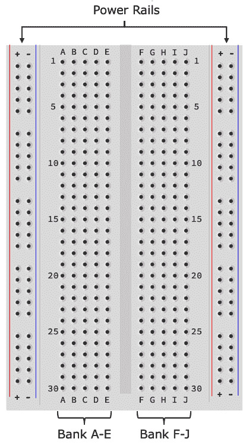

图 2.1 - 面包板

面包板有许多不同的尺寸，我们插图中的面包板是半尺寸面包板。然而，无论它们的尺寸如何，它们的基本布局和电气连接方式是相似的，只有一个小例外，我稍后会提到。

真正的面包板可能有，也可能没有，行和列号码标记。它们已经包括在插图中，以帮助以下讨论和解释。

面包板上的*孔*是您放置电子元件和电线以进行电气连接的地方。孔的电气连接方式如下：

+   面包板的两个外部列孔通常被称为*电源轨*。面包板的两侧分别有一个正（+）列和一个负（-）列。每一列孔都是电气连接的，并且贯穿整个面包板的长度。因此，这个面包板上有四个独立的电源轨：面包板左侧有一个*+*和*-轨，右侧也有一个*+*和*-轨。

电源轨经常用于帮助在面包板上向组件分配电源。请注意，它们本身不提供电源！它们需要连接到电源供应或电池等电源源才能提供电源。

+   面包板的中间有两排孔，我标记为*A-E*和*F-J*。每个银行的每一行孔都是电气连接的。例如，孔 A1 到 E1 是电气连接的，孔 F1 到 J1 也是如此。然而，为了清楚地理解，A1-E1 与 F1-J1 并*不*是电气连接的，因为它们在不同的银行上。

当我们将它们连接到面包板时，我们跨越两个银行之间的间隙放置**集成电路**（**ICs**）—通常称为*芯片*。当我们使用 IC 来控制电机时，我们将在第十章《使用舵机，电机和步进电机进行运动》中看到一个例子。

以下是一些关于孔是如何连接的更多示例，可以帮助你理解：

+   B5 与 C5 电上连接（它们共享同一行）。

+   H25 与 J25 电上连接（它们共享同一行）。

+   A2 与 B2*不*电上连接（它们不共享同一行）。

+   E30 与 F30*不*电上连接（它们位于不同的银行）。

+   左侧电源轨道顶部的第三个+孔（从面包板顶部开始）与左侧电源轨道的最后一个+孔电上连接（它们位于同一垂直列）。

+   左侧电源轨道顶部的第三个+孔（从面包板顶部开始）与右侧电源轨道的第三个+孔*不*电上连接（它们位于不同的电源轨道上）。

我在本节开始时提到，所有的面包板基本上都是一样的，只有一个小小的例外。这个例外与电源轨道有关。一些全尺寸的面包板可能会将它们的电源轨道分成两个独立的垂直银行（因此，电上地，轨道中的垂直孔并不贯穿整个面包板的长度）。电源轨道被分割并不总是在视觉上明显，因此需要根据面包板逐个发现。我提到这一点只是为了防止在使用电源轨道时出现连接问题时，以防你使用的是全尺寸的面包板。

现在我们已经介绍了面包板，并且了解了孔是如何在电上相互关联的，让我们开始将元件和导线插入我们的面包板，以创建我们的第一个电路。我们将从按键开始。

## 定位和连接按键

我们使用的是一个简单的开关按钮，也被称为**单极单刀**（**SPST**）瞬时开关。一个例子如*图 2.2*所示：

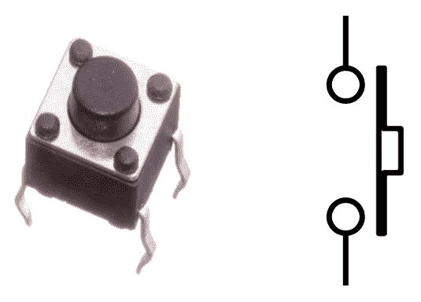

图 2.2 - 一个按键和原理图符号

在*图 2.2*的左侧是一个瞬时按键的照片，右侧显示了瞬时按键的原理图符号。我们将在下一节看到这个符号，并讨论原理图中出现这些类型符号的地方。

按键有各种形状和大小；然而，它们的一般操作是相同的。左侧显示的这个特定按键被称为*触觉*按键。它们小巧，非常适合与面包板一起使用。

*图 2.3*说明了我们需要在面包板上创建的按键连接。请在按照接下来的步骤时参考这个图：

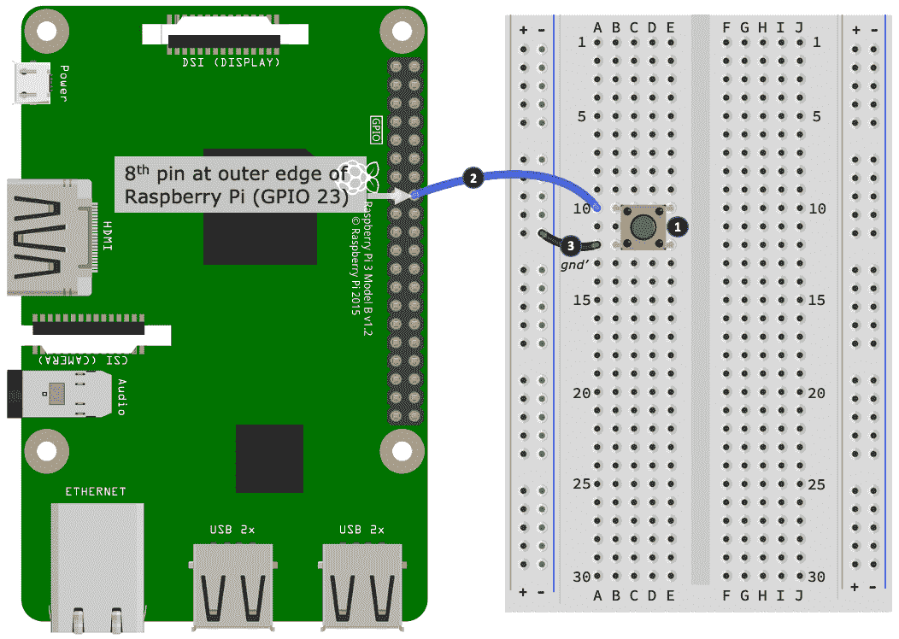

图 2.3 - 连接按键

以下是如何将按键连接到你的面包板并连接到你的树莓派。以下步骤编号与*图 2.3*中编号的黑色圆圈相匹配：

1.  按照所示将按钮放在面包板上。按钮放入哪一行孔并不重要，但是*图 2.3*显示了按钮的位置（左上腿）在孔 B10 处。

1.  接下来，将一根跳线插入与按键最顶端腿部相同的那一行（我们的插图使用孔 A10）。将这根导线的另一端连接到树莓派的 GPIO 引脚头部外缘向下数第八个引脚。这个引脚被称为 GPIO 23。

你可以获得引脚标签和面包板兼容模块，以帮助你进行树莓派引脚连接和识别。这里有一个可打印版本的链接，可以帮助你入门：[`github.com/splitbrain/rpibplusleaf`](https://github.com/splitbrain/rpibplusleaf)。我们将在第五章中介绍 GPIO 引脚及其编号，*将你的树莓派连接到物理世界*。

1.  最后，使用另一根线（标记为*gnd'*），将按钮的另一侧（B2 孔中的腿）连接到面包板上的负电源轨。我们的插图显示了从 A12 孔到左侧负（-）电源轨上的附近孔的*gnd'*线连接。缩写*gnd*表示地线。我们将在接下来的部分*理解地线连接和符号*中更详细地介绍这个术语。

电气上，一个 SPST 开关可以安装在任何方向。如果你的按钮有四条腿（两组将被电连接），并且当我们在*探索两种方法在 Python 中集成一个按钮*部分测试电路时不起作用，请尝试将按钮在面包板上旋转 90 度。

现在我们的按钮已经就位并接线，接下来我们将定位和连接 LED。

## 定位和连接 LED

LED 是由一个微小的晶体制成的小而明亮的灯，当电流连接到它时会发出颜色。

*图 2.4*显示了一个典型的 LED。图表的左侧显示了 LED 的物理表示，而右侧显示了 LED 的原理图符号：

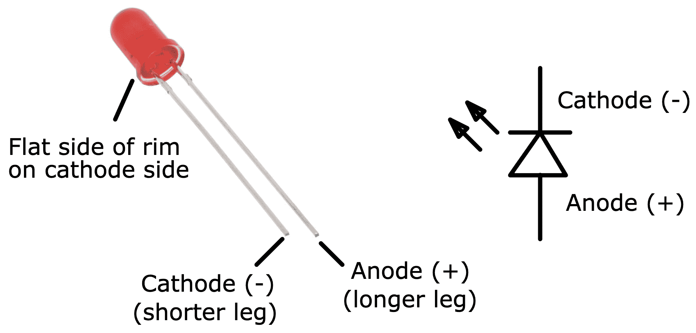

图 2.4 - LED 和原理图符号

LED 需要正确连接到电路中，否则它们将无法工作。如果你仔细观察 LED，你会注意到 LED 外壳上有一面是平的。这一面的腿是*cathode*，连接到电源的负极或地线。cathode 腿也是 LED 腿中较短的一个。另一个腿称为*anode*，连接到电源的正极。如果你仔细观察 LED 符号，你会注意到 LED 的 cathode 一侧有一条线横穿三角形的顶端 - 如果你把这条线看作一个大的负号，它会帮助你记住符号的哪一侧是 cathode 腿。

*图 2.5*我们即将创建的 LED 连接。请在按照接下来的步骤时参考这个图表：

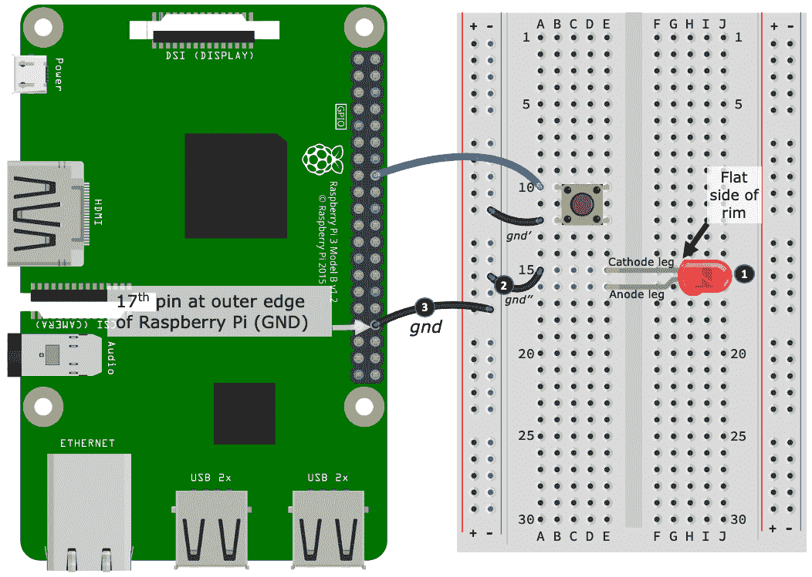

图 2.5 - 连接 LED

以下是如何将 LED 连接到面包板并连接到树莓派的方法。以下步骤编号与*图 2.5*中编号的黑色圆圈相匹配：

1.  按照插图将 LED 连接到面包板上，确保 LED 安装的方向正确。我们的插图显示了 cathode 腿在 E15 孔，anode 腿在 E16 孔。

你可能需要弯曲 LED 的腿来使其就位。在安装 LED 时，请确保两条腿不要相互接触！如果它们接触，这将导致所谓的*电短路*，LED 电路部分将无法工作。

1.  接下来，使用一根跳线（标记为*gnd"*），将 LED 的 cathode 腿连接到与按钮共享的相同电源轨。我们展示了这个连接，一端连接在 A15 孔，另一端连接到左侧负（-）电源轨上的附近孔。

1.  最后，使用另一根跳线（标记为*gnd*），将负（-）电源轨连接到树莓派 GPIO 引脚头的第 17 个外侧引脚。这个引脚是树莓派上的地线（GND）引脚。

干得好！这就是我们的 LED 连接。接下来，我们添加电阻，这将完成我们的电路。

## 定位和连接电阻

电阻是用来限制（即阻止）电流流动和分压的电子元件，它们是非常常见的电子元件。

*图 2.6*中显示了一个物理电阻（左侧）和两个原理图符号（右侧）。这些原理图符号之间没有实际区别。它们代表不同的文档标准，您会发现原理图图表的作者会选择并坚持使用一种类型的符号。我们将在本书中始终使用这种波浪形符号：

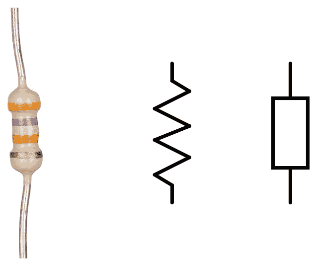

图 2.6 - 电阻和原理图符号

电阻有许多形状、大小和颜色。作为一般指南，它们的物理形状和大小与它们的物理特性和能力有关，而它们外壳的颜色通常是无关紧要的，至少就它们的性能而言。然而，电阻上的彩色条带非常重要，因为它们标识了电阻的值。值得一提的是，小型通用电阻（我们将使用的）使用彩色条带来指定它们的值，而在高功率应用中使用的物理上更大的电阻通常在外壳上印有它们的电阻值。

电阻是一种无偏电子元件，这意味着它们可以以任何方式安装在电路中。然而，它们的值需要正确选择，否则电路可能无法按预期工作，或者更糟的是，电阻和/或其他组件（包括您的树莓派）可能会受到损坏。

在开始学习电路时，强烈建议并且最安全的做法是始终使用电路所列的预期电阻值。避免在没有正确值的情况下替换不同的值，因为这可能会导致元件甚至您的树莓派受损。

我们在本书中对电阻的使用将是实用的。虽然我将解释我们为什么选择特定值以及如何得出这些值的原因，从第六章开始，*软件工程师的电子学 101*。如果您对电阻不熟悉，您会在*进一步阅读*部分找到两个链接，您可以在其中了解更多信息，包括如何读取它们的值。

*图 2.7*展示了我们需要创建的电阻连接。请在按照接下来的步骤时参考这个图：

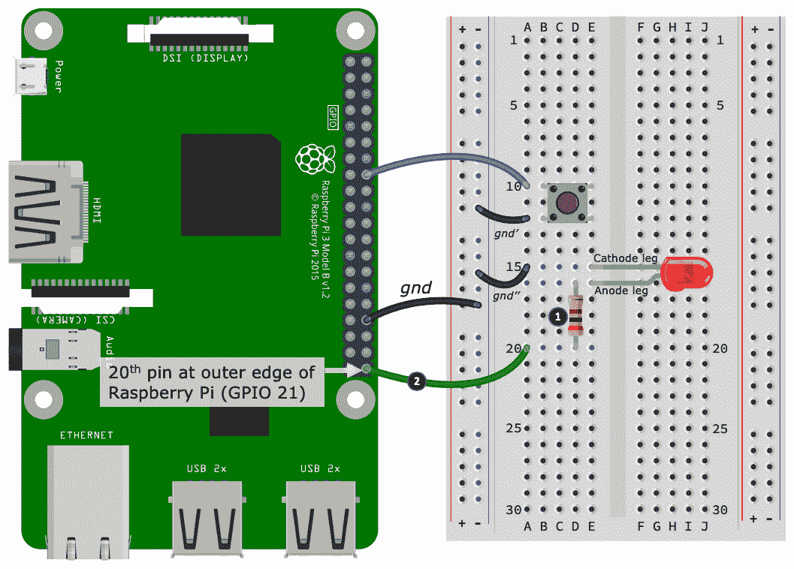

图 2.7 - 面包板上完成的按钮和 LED 电路

这是如何将电阻连接到您的面包板中的。以下步骤编号与*图 2.7*中编号的黑色圆圈相匹配：

1.  将电阻的一条腿（无论哪一条）插入与 LED 的阳极腿相同行的孔中。这个连接显示在 D16 孔。将另一条腿插入一个空行，显示在 D20（在连接下一个导线之前，它将是面包板上的一个空行）。

1.  使用跳线（从 A20 孔开始插入）*，我们将电阻的另一条腿连接到树莓派 GPIO 引脚的外侧边缘上的第 20 个引脚。这个引脚被称为 GPIO 21。

干得好！通过最后一次连接，我们已经创建了我们的第一个电路。我们将在本章的其余部分以及接下来的两章中使用这个基本电路，第三章，*使用 Flask 进行 RESTful API 和 Web 套接字网络*，以及第四章，*使用 MQTT，Python 和 Mosquitto MQTT Broker 进行网络连接*。我们将从第五章开始，开始探索一系列其他电路。

现在我们已经完成了面包板电路，并学会了如何连接面包板上的元件和导线，我们准备探索一种用于描述电路的图表技术。

# 阅读电子原理图

在上一节中，我们通过一系列图示步骤在面包板上建立了我们的第一个电路。在本节中，我们将学习*原理图*，这是一种记录和描述电路的正式方式。这些是你在电子文本和数据表中找到的图表。

我们将学习如何阅读简单的原理图，并了解它如何与我们刚刚创建的面包板布局相关联。理解这两者之间的关系，特别是能够从原理图创建面包板布局，是你在继续学习电子和物联网过程中需要发展的重要技能。

在本书中，我们将看到和使用的电子电路和原理图相对简单。我们将根据具体情况讨论重要概念和组件符号。对于我们的旅程来说，不需要对原理图的细节进行全面解释，这超出了本书的实际范围。然而，我鼓励你阅读*进一步阅读*部分提到的 Spark Fun 教程。它提供了对阅读原理图的简要但全面的概述，并将为你提供对这种图表技术及其语义的良好基础理解。

让我们从看一个代表我们刚刚创建的面包板电路的原理图开始，如*图 2.7*所示。我们的原理图如下所示：

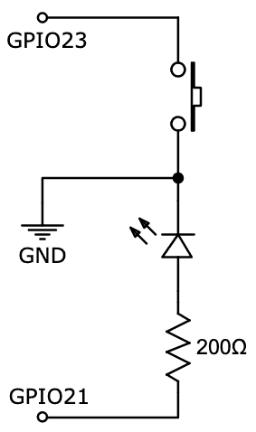

图 2.8 - 图 2.7 中面包板电路的原理图

原理图可以以多种方式正确绘制；然而，我特意绘制了这个图表（并将在本书中适当的地方这样做），以使其与等效的面包板布局紧密相似，以帮助理解和解释。

我们将通过首先解释按钮连接和布线来学习阅读这个原理图。

## 阅读按钮原理图连接

我已经将面包板布局和原理图（带有一些额外的标签）结合如下：

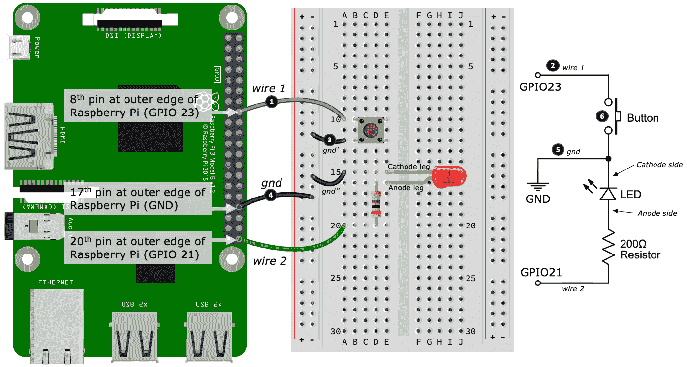

图 2.9 - 组合面包板和原理图，第一部分共 2 部分

以下是如何阅读按钮连接。以下步骤编号与*图 2.9*中编号的黑色圆圈相匹配：

1.  从标有*wire 1*的面包板开始。如果我们看这根导线的两端，我们会发现一端连接到树莓派上的 GPIO 23，而另一端（在孔 A10 处）连接到一个与按钮共享的行。

1.  从原理图来看，这个面包板连接通过标有*wire 1*的线条图示。你会注意到线条的一端标有 GPIO23，而另一端通向按钮符号的一侧。

导线外壳的颜色没有固有的含义。颜色只是一种视觉辅助，用于区分不同的导线和连接。然而，有一些常见的惯例，比如使用红色导线表示正电源连接，黑色导线表示负极或地线。

1.  接下来，从面包板上按钮的另一侧（孔 A12）开始，注意标有*gnd'*的导线。这根导线将按钮连接到面包板上的外部电源轨。

1.  从这个第一个电源轨连接下来的五个孔，我们看到第二根地线（标有*gnd*），从面包板返回到树莓派上的一个 GND 引脚。

1.  在原理图中，面包板上的*gnd*和*gnd'*线连接被表示为标有*gnd*的线，这条线从按钮出来并以一个向下的*箭头*符号注释为*GND*（记住*面包板上的*gnd*和*gnd'*是电连接的，因此在逻辑上是一根线）。这是*地线连接*的符号，你会经常在原理图中看到这个符号。当我们到达标题为*阅读和理解地线符号*的部分时，我会对这个符号有更多的话要说。

1.  检查原理图中的按钮符号，你会注意到*wire 1*和*gnd*线并没有连接，而是终止在按钮符号（小圆圈）。这被称为*常开*连接，或者在我们的特定情况下，是*常开*开关。你可以把*常开*理解为意味着线路断开（记住*线*代表*导线*）。现在，如果你想象按钮被按下，那么按钮会触碰每个圆圈，并连接*蓝色*和*gnd*线，形成一个*闭合*连接，完成了 GPIO 23 和 GND 之间的电路。我们将在第六章中更详细地讨论这个概念，*软件工程师的电子学 101*。

当你确信你理解了面包板上按键的连接如何与原理图上的按键部分匹配时，我们将继续讨论 LED 和电阻的连接。

## 阅读 LED 和电阻的原理图连接

继续上一节，我们学习了如何阅读和理解原理图上按键部分，接下来我们将通过讨论 LED 和电阻的连接来完成我们的解释，如下所示：

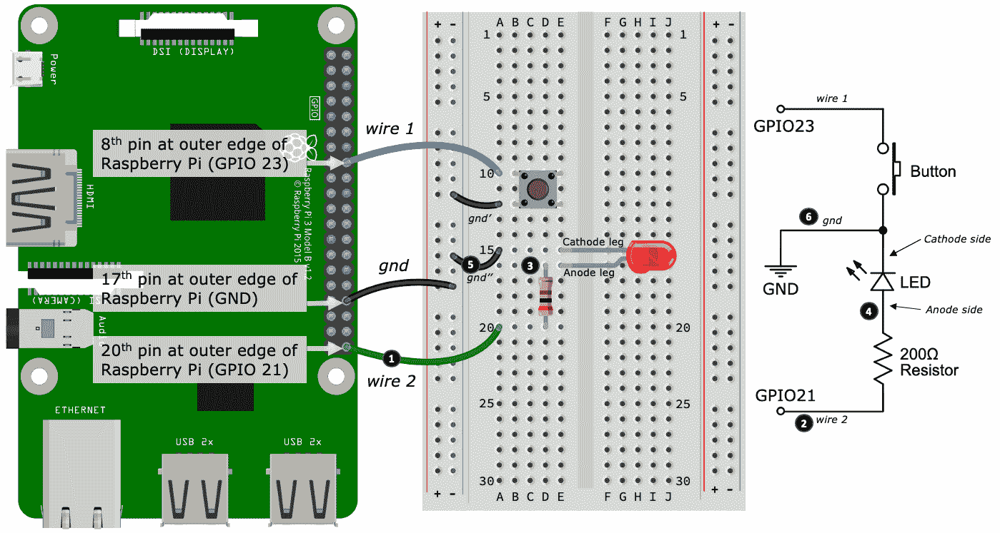

图 2.10 - 组合面包板和原理图，第二部分

以下是如何阅读 LED 和电阻的连接。以下步骤编号与*图 2.10*中编号的黑色圆圈相匹配：

1.  从面包板上标有*wire 2*的线开始。这根线将树莓派上的 GPIO 21 连接到一个端子上，这个端子与一个电阻的一端（孔 A25）共用。

1.  原理图上也标有*wire 2*的线连接。

1.  在面包板上，电阻的另一端连接到 LED 的阳极腿（孔 E15）。记住，电阻和 LED 的阳极腿是电连接的，因为它们在面包板上的同一排孔中的同一组孔中。

1.  我们在原理图中看到了电阻/LED 连接，电阻符号与 LED 符号相遇。我们知道电阻通过 LED 符号的方向连接到了 LED 的阳极一侧。

1.  接下来，在面包板上，LED 的另一端（孔 E15）——阴极腿——连接到*gnd'*线（孔 A15），然后连接回外部电源轨，这也是按键的*gnd'*线所共用的（然后通过*gnd*线连接回树莓派的 GND 引脚）。

1.  最后，在原理图上，LED 阴极腿到 GND 的连接由标有*gnd*的线表示（与按键使用的相同线）。

我们现在完成了我们的原理图解释。你做得怎么样？我希望你能够追踪原理图并看到它如何与我们在面包板上构建的电路相关联。

我们的最后一步展示了电子学中一个重要的概念——*公共地*。我们将在接下来更详细地讨论这个概念。

## 引入地线连接和符号

所有电路都需要一个共同的电参考点，我们称之为*地*。这就是为什么我们看到按键和 LED 在面包板和原理图上共享一个公共连接的原因（作为提醒，请参考*图 2.10*）。

对于本书中提出的简单电路以及使用树莓派的 GPIO 引脚时，将考虑将术语*负*和*地*视为可互换的是实用的。这是因为电源的*负*端将是我们的电气参考点（是的，GPIO 引脚是电源，我们将在第六章，*软件工程师的电子学 101*中更多地探索）。

如前面在*阅读按钮原理图连接*部分提到的，在*步骤 4*中，我们用箭头符号标注了地点。我们的地面符号（由线段组成）是一个常见的地面符号变体。您将在*图 2.11*中看到另一个变体：

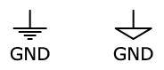

图 2.11 - 常见原理图地面符号

所有地点都是电气连接的，我们可以在原理图中多次重复符号，以帮助简化原理图。通过使用地面符号来指示共同的地面连接，我们消除了绘制许多互连线以连接所有地面连接在一起的需要（对于大型或更复杂的电路来说，这将变得非常混乱）。

我们的简单电路当然不属于*大型*或*复杂*的范畴，但是为了说明共同地面的概念，我已经重新绘制了最初在*图 2.8*中显示的原理图，只是这次使用了多个地面符号：

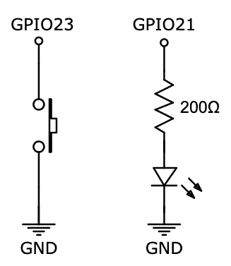

图 2.12 - *图 2.7*中面包板电路的替代原理图

尽管我们的替代原理图看起来像是两个独立的电路，但它们在电气上与我们原始的*图 2.8*中的原理图完全相同。

现在请花一点时间查看*图 2.8*和*图 2.12*，看看你能否弄清楚这两个图是如何在电气上相同的。

我在这里所做的只是打破了线（在*图 2.8*中标记为*gnd*）并重新绘制了按钮子电路和 LED/电阻子电路，使用了不同的方向，并为每个子电路使用了单独的地面符号。

如前所述，在本书的这个阶段，我们不会深入讨论这个电路在电子上是如何工作的，或者它如何与树莓派上的 GPIO 引脚进行电气交互。当我们到达第六章，*软件工程师的电子学 101*时，我们将通过实际和说明性的练习来涵盖这些主题以及更多内容。

现在您已经看到了记录我们面包板电路的原理图，并了解了它们之间的关系，我们终于准备好深入代码，学习在 Python 中让 LED 闪烁的两种方法！

# 在 Python 中探索闪烁 LED 的两种方法

在本节中，我们将研究两种替代的 GPIO 库和在 Python 中让 LED 闪烁的方法，包括以下内容：

+   GPIOZero 库：一个入门级的 GPIO 库

+   PiGPIO 库：一个高级的 GPIO 库

当我们学习使用这两个库时，我们将看到它们如何不同地处理 GPIO 控制，并发现它们的相对优势和劣势。

完成本节（以及接下来的*在 Python 中探索集成按钮的两种方法*部分）后，您将探索并比较了 GPIO 控制的两种非常不同的方法——高级（使用 GPIOZero）和低级（使用 PiGPIO），并且对在构建电子接口程序时何时以及如何选择这两种方法有一个很好的入门理解。

让我们通过使用 GPIOZero 使 LED 闪烁来开始我们的实际练习。

## 使用 GPIOZero 闪烁

现在我们准备使用 GPIOZero 库来研究我们的第一种闪烁方法。您将在`chapter02/led_gpiozero.py`文件中找到我们即将涵盖的代码。请在继续之前查看此文件。

在*进一步阅读*部分，您将找到与我们在本节中使用的库的特定功能相关的 GPIOZero API 文档的相关链接。

我们将从运行我们的示例代码开始。

使用以下命令运行程序，记住您需要在*activated*虚拟环境中（如果您需要关于如何激活 Python 虚拟环境的复习，请参阅第一章，*设置您的开发环境*）：

```py
(venv) $ python led_gpiozero.py
```

如果 LED 连接正确，它应该会闪烁。

如果在运行程序时收到有关 PiGPIO 的错误，请确保您已经按照第一章中概述的方式启用了`pigpio`守护程序。我们将在第五章中更多地讨论 PiGPIO 和 PiGPIO 守护程序，*将您的树莓派连接到物理世界*。

现在我们已经运行了代码并看到 LED 闪烁，是时候浏览使这一切发生的代码了。

### **导入**

我们将从查看我们在 Python 程序中导入的外部库开始我们的代码探索。它们出现在源文件的顶部附近，如下所示：

```py
from gpiozero import Device, LED                # (1)
from gpiozero.pins.pigpio import PiGPIOFactory  # (2)
from time import sleep  
```

感兴趣的导入如下：

+   在第（1）行，我们从 GPIOZero 包中导入`Device`和`LED`类。

+   在第（2）行，我们导入了一个 GPIOZero *Pin Factory*。这与`Device`类一起使用，接下来我们将看到。

接下来，我们将看到如何设置 GPIOZero Pin Factory 实现。

### 引脚工厂配置

在 GPIOZero 中使用*Pin Factory*指定 GPIOZero 将使用哪个具体的 GPIO 库来执行实际的 GPIO 工作。当我们在本章的*比较 GPIOZero 和 PiGPIO 示例*部分比较 GPIOZero 和 PiGPIO 示例时，我们将更详细地讨论 Pin Factory：

```py
Device.pin_factory = PiGPIOFactory()  # (3)  
```

在第（3）行，我们告诉 GPIOZero 使用 PiGPIO 作为其*Pin Factory*，使用`Device`和`PiGPIOFactory`导入。

既然我们已经看到了如何设置 Pin Factory，让我们看看使我们的 LED 闪烁的代码。

### LED 闪烁

在这里，我们在第（4）行看到了`LED`类，它被创建并分配给了`led`变量。`LED`的参数是物理 LED 连接到的 GPIO 引脚，如*图 2.1*中的面包板上所示：

```py
GPIO_PIN = 21 
led = LED(GPIO_PIN)         # (4)
led.blink(background=False) # (5)
```

在第（5）行，我们开始 LED 闪烁。`blink()`的`background=False`参数需要在主线程上运行 LED，以便程序不会退出（`background=True`的另一种选择是使用`signal.pause()`。我们将在下一节中看到一个例子）。

GPIOZero 使得与 LED 等常见电子元件进行接口非常容易。接下来，我们将执行相同的练习，只是这次使用 PiGPIO 库。

## 使用 PiGPIO 闪烁

现在我们已经看到了如何使用 GPIOZero 库闪烁 LED，让我们看看使用 PiGPIO 库的另一种方法。

我们即将要讲解的代码包含在`chapter02/led_pigpio.py`文件中。如果之前的示例仍在运行，请终止它，并运行`led_pigpio.py`。LED 应该会再次闪烁。

在*进一步阅读*部分，您将找到与我们在本节中使用的 PiGPIO 库的特定功能相关的 PiGPIO API 文档的相关链接。

让我们浏览一下我们 LED 闪烁代码的 PiGPIO 版本。

### **导入**

从文件的顶部开始，我们有源文件的`import`部分：

```py
import pigpio           # (1)
from time import sleep
```

这一次，在第（1）行，我们只需要导入 PiGPIO 模块。

接下来，我们将看到如何配置 PiGPIO 并设置连接到我们的 LED 的 GPIO 引脚的 I/O 模式。

### **PiGPIO 和引脚配置**

让我们看看配置 PiGPIO 和 LED 的 GPIO 引脚的代码：

```py
GPIO_PIN = 21
pi = pigpio.pi()                        # (2)
pi.set_mode(GPIO_PIN, pigpio.OUTPUT)    # (3)
```

我们在第（2）行创建了一个 PiGPIO 的实例，并将其分配给了`pi`变量。我们将使用这个变量从代码的这一点开始与 PiGPIO 库进行交互。

在第（3）行，我们配置 GPIO 引脚 21 为*输出*引脚。配置引脚为*输出*意味着我们希望使用该引脚来从我们的 Python 代码控制连接到它的东西。在这个示例中，我们想要控制 LED。在本章的后面，我们将看到一个使用输入引脚来响应按钮按下的示例。

现在我们已经导入了所需的库并配置了 PiGPIO 和输出 GPIO 引脚，让我们看看我们是如何让 LED 闪烁的。

### **闪烁 LED**

最后，我们让 LED 闪烁：

```py
while True:
 pi.write(GPIO_PIN, 1) # 1 = High = On    # (4)
 sleep(1) # 1 second
 pi.write(GPIO_PIN, 0) # 0 = Low = Off    # (5)
 sleep(1) # 1 second
```

我们使用 PiGPIO 通过一个`while`循环来实现闪烁。当循环执行时，我们在 GPIO 引脚 21 上进行切换-我们的*输出*引脚-打开和关闭（第（4）和（5）行），之间有一个短的`sleep()`函数，因此 LED 看起来在闪烁。

接下来，我们将比较我们的两个库及它们对 LED 闪烁的不同方法。

## 比较 GPIOZero 和 PiGPIO 示例

如果您查看 GPIOZero 示例的代码，很明显我们正在让 LED 闪烁-代码中非常明显。但是 PiGPIO 示例呢？没有提到 LED 或闪烁。事实上，它可以做任何事情-只是我们知道 LED 连接到 GPIO 21。

我们的两个闪烁示例揭示了 GPIOZero 和 PiGPIO 的重要方面：

+   **GPIOZero**是一个更高级的包装库。在表面上，它将常见的电子元件（如 LED）抽象成易于使用的类，而在底层，它将实际的接口工作委托给一个具体的 GPIO 库。

+   **PiGPIO**是一个更低级的 GPIO 库，您可以直接使用、控制和访问 GPIO 引脚。

GPIOZero 中的“zero”指的是零样板代码库的命名约定，其中所有复杂的内部部分都被抽象化，以使初学者更容易上手。

GPIOZero 通过*Pin Factory*将其委托给外部 GPIO 库。在我们的示例中，我们使用了一行代码将其委托给了 PiGPIO，`Device.pin_factory = PiGPIOFactory()`。我们将在第五章中再次讨论 GPIOZero 和委托的主题，*将您的树莓派连接到物理世界*。

在本书中，我们将同时使用 GPIOZero 和 PiGPIO。我们将使用 GPIOZero 来简化和压缩代码，同时我们将使用 PiGPIO 来进行更高级的代码示例，并教授通过 GPIOZero 抽象掉的核心 GPIO 概念。

接下来，我们将继续通过集成按钮来构建 LED 闪烁示例。

# 探索在 Python 中集成*按钮的两种方法

在前一节中，我们探讨了两种不同的方法来使我们的 LED 闪烁-一种使用 GPIOZero 库，另一种使用 PiGPIO 库。在本节中，我们将集成*图 2.1*中电路中的按钮，并看看如何使用 GPIOZero 和 PiGPIO 库集成按钮。

我们将首先使用 GPIOZero 库来使我们的 LED 与使用 GPIOZero 库集成的按钮打开和关闭。

## 使用 GPIOZero 响应按钮按下

我们将要讨论的代码包含在`chapter02/button_gpiozero.py`文件中。请查看并运行此文件。按下按钮时，LED 应该会打开和关闭。根据*图 2.1*中的电路，LED 仍连接到 GPIO 21，而我们的按钮连接到 GPIO 23。

如前面的*创建面包板电路*部分所述，如果您的按钮有四条腿（两组将被电气连接），而您的电路不起作用，请尝试将按钮在面包板上旋转 90 度。

让我们走一遍代码的重要部分，注意我们跳过了我们已经涵盖过的代码部分。

### **导入**

从源文件的顶部开始，您将找到导入外部库的代码部分，如下所示：

```py
from gpiozero import Device, LED, Button         # (1)
from gpiozero.pins.pigpio import PiGPIOFactory
import signal                                    # (2)
```

对于这个示例，我们还导入了 GPIOZero 的`Button`类（1）和 Python 的`signal`模块（2）。

现在您已经看到我们正在导入`Button`类，让我们看一下当按下按钮时将调用的处理程序函数。

### **按钮按下处理程序**

我们正在使用回调处理程序来响应按钮按下，定义在`pressed()`函数中：

```py
def pressed():
 led.toggle()                               # (3)
 state = 'on' if led.value == 1 else 'off'  # (4)
 print("Button pressed: LED is " + state)   # (5)
```

在第（3）行，我们的 LED 在每次调用`pressed()`时使用`led`的`toggle()`方法打开和关闭。在第（4）行，我们查询`led`的`value`属性来确定 LED 是开启（`value == 1`）还是关闭（`value == 0`），并将其存储在`state`变量中，然后在第（5）行打印到终端。

您还可以使用`led.on()`、`led.off()`和`led.blink()`方法来控制 LED。您还可以通过设置`led.value`直接设置 LED 的开/关状态，例如，`led.value = 1`将打开 LED。

让我们继续看看如何创建和配置`Button`类实例，并注册`pressed()`函数，以便在按下物理按钮时调用它。

### **按钮配置**

以下是用于配置按钮的行。在第（6）行，我们使用的类是`Button`。在 GPIOZero 中，我们使用`Button`类来表示任何可以处于开启或关闭状态的*输入*设备，例如按钮和开关：

```py
button = Button(BUTTON_GPIO_PIN, 
                pull_up=True, bounce_time=0.1)  # (6)
button.when_pressed = pressed                   # (7)
```

在第（7）行，我们使用`button`实例注册了`pressed()`回调处理程序。

以下是第（6）行中`Button`构造函数的参数含义：

+   第一个参数是按钮的 GPIO 引脚（`BUTTON_GPIO_PIN == 23`）。

+   第二个参数`pull_up=True`为 GPIO 23 启用了内部上拉电阻。上拉和下拉电阻是数字电子学中的重要概念。我们现在将跳过这个概念，因为我们将在第六章“软件工程师的电子学 101”中更详细地介绍上拉和下拉电阻的重要性和用途。

+   第三个参数`bounce_time=0.1`（0.1 秒）用于补偿开关或接触*抖动*。

抖动是一种电气噪声，当物理按钮或开关内的金属触点接触时会发生。这种噪声的结果是在数字输入引脚上看到快速连续的开关（或高低）状态变化。这是不希望的，因为我们希望*一个*按钮的物理按下（或开关的切换）被视为输入引脚上的*一个*状态变化。在代码中通常使用**去抖动阈值**或**超时**来实现这一点，而在我们的情况下，这是我们的树莓派在初始状态变化后忽略连续引脚状态变化的时间量。

尝试设置`bounce_time=0`（不去抖动）。您会发现按钮的行为非常不稳定。然后，使用更高的数字，例如`bounce_time=5`（5 秒），您会发现在第一次按下按钮后，按钮在持续时间到期之前都无响应。

在选择适当的去抖动阈值时，需要权衡用户需要多快按下按钮（这需要较低的阈值）与按钮固有的抖动量（这需要较高的阈值）。大约 0.1 秒是一个很好的建议起始值。

最后，让我们介绍一种常见的技术，用于防止电子接口 Python 程序退出。

### **防止主线程终止**

在 GPIO 示例和程序中经常看到使用`signal.pause()`或等效构造：

```py
signal.pause() # Stops program from exiting.  # (8)
```

第（8）行防止主程序线程达到其自然结束，正常情况下程序会在那里终止。

在开始时，忘记在 GPIO 接口 Python 程序的末尾添加`signal.pause()`是一个常见且常常令人困惑的错误。如果您的程序在启动后立即退出，请尝试将`signal.pause()`添加到程序的末尾作为第一步。

我们在以前的 LED 闪烁示例中不需要`signal.pause()`。原因如下：

+   我们的 GPIOZero 示例（`chapter02/led_gpiozero.py`）在 LED 构造函数中使用了`background=False`。这通过将 LED 的线程保持在前台来防止程序退出。

+   在 PiGPIO 示例（`chapter02/led_pigpio.py`）中，是`while`循环阻止程序退出。

如果这看起来令人困惑，不要担心！知道如何防止程序异常退出归根结底取决于经验、实践和理解 Python 和 GPIO 库的工作原理。

接下来，让我们看看如何使用 PiGPIO 集成按钮。

## 使用 PiGPIO 响应按钮按下

现在，我们将使用 PiGPIO 库复制与之前的 GPIOZero 示例相同的功能，通过按下按钮来打开和关闭 LED，只是这次使用 PiGPIO 库。我们的 PiGPIO 示例的代码可以在`chapter02/button_pigpio.py`文件中找到。请现在查看并运行此文件，并确认 LED 是否响应您的按钮按下。

让我们解开代码的有趣部分，从推按钮的 GPIO 引脚配置开始（再次注意，我们跳过了已经涵盖的代码部分）。

### **按钮引脚配置**

从第 1 行开始，我们将 GPIO 引脚 23（`BUTTON_GPIO_PIN == 23`）配置为*输入*引脚：

```py
pi.set_mode(BUTTON_GPIO_PIN, pigpio.INPUT)           # (1)
pi.set_pull_up_down(BUTTON_GPIO_PIN, pigpio.PUD_UP)  # (2)
pi.set_glitch_filter(BUTTON_GPIO_PIN, 10000)         # (3)
```

接下来，在第 2 行，我们为引脚 23 启用内部上拉电阻。在 PiGPIO 中，我们在第 3 行使用`pi.set_glitch_filter()`方法对推按钮进行去抖动。此方法以毫秒为参数。

请注意，在 PiGPIO 中，我们需要为我们的按钮配置每个属性（引脚输入模式、上拉电阻和去抖动）作为单独的方法调用，而在之前的 GPIOZero 示例中，当我们创建 GPIOZero LED 类的实例时，所有这些都发生在一行上。

### **按钮按下处理程序**

我们的按钮回调处理程序在第 4 行开始定义，比之前的 GPIOZero 处理程序更复杂：

```py
def pressed(gpio_pin, level, tick):                         # (4)
 # Get current pin state for LED.
 led_state = pi.read(LED_GPIO_PIN)                       # (5)

 if led_state == 1:                                      # (6)
 # LED is on, so turn it off.
 pi.write(LED_GPIO_PIN, 0) # 0 = Pin Low = Led Off
 print("Button pressed: Led is off")
 else: # 0
 # LED is off, so turn it on.
 pi.write(LED_GPIO_PIN, 1) # 1 = Pin High = Led On
 print("Button pressed: Led is on")

# Register button handler.
pi.callback(BUTTON_GPIO_PIN, pigpio.FALLING_EDGE, pressed)  # (7)
```

注意`pressed(gpio_pin, level, tick)`的签名。我们之前的 GPIOZero 版本没有参数，而 PiGPIO 有三个强制参数。我们的简单单按钮示例不使用这些参数；然而，为了完整起见，它们如下：

+   `gpio_pin`：这是负责调用回调的引脚。在我们的示例中将是 23。

+   `level`：这是引脚的状态。对我们来说，这将是`pigpio.FALLING_EDGE`（我们马上就会知道为什么）。

+   `tick`：这是自启动以来的微秒数。

在第 5 行，我们使用`led_state = pi.read()`将 GPIO 21（我们的 LED）的当前状态读入变量。然后，从第 6 行开始，根据 LED 当前是否打开（`led_state == 1`）或关闭（`led_state == 0`），我们使用`pi.write()`将 GPIO 21 设置为高电平或低电平，以切换 LED 到其相反的打开或关闭状态。

最后，回调处理程序在第 7 行注册。参数值`pigpio.FALLING_EDGE`意味着每当 GPIO 引脚`BUTTON_GPIO_PIN`（即 23）开始从数字高转换为数字低时，调用处理程序为`pressed()`。这比简单地测试引脚是*高*还是*低*更明确；然而，为了简单起见，考虑以下级别参数选项`pi.callback()`。尝试更改参数，看看当您按下按钮时会发生什么：

+   `pigpio.FALLING_EDGE`：这是低的（想*向低处下降*）。当您*按下*按钮时，将调用`pressed()`。

+   `pigpio.RAISING_EDGE`：这是高的（想*向高处升起*）。当您*释放*按钮时，将调用`pressed()`。

+   `pigpio.EITHER_EDGE`：这可以是高或低。当您*按下*和*释放*按钮时，将调用`pressed()`，实际上意味着只有当您按住按钮时 LED 才会亮起。

在 PiGPIO 示例中，您是否注意到或认为当按下按钮时，即*激活*按钮时，GPIO 引脚 23 变为低电平（即第 7 行上的`pigpio.FALLING_EDGE`参数），这导致`pressed()`被调用？从编程的角度来看，这似乎有点前后颠倒或错误？我们将在第六章中重新讨论这个想法，并讨论背后的原因，即*软件工程师的电子学 101*。

现在关于 GPIO 库和电子学的内容就到此为止。我们已经看到如何使用 GPIOZero 和 PiGPIO 库响应按钮按下。特别是，我们发现与涉及更多代码和更多配置的 PiGPIO 方法相比，GPIOZero 方法更简单直接。这与我们在上一节*探索 Python 中闪烁 LED 的两种方法*中发现的结果相同，即 GPIOZero 方法更简单。

一个方法是否比另一个更好？答案取决于您试图实现的目标以及您对电子接口的低级控制需求。在本书的这个阶段，我只是想给您提供有关 GPIO 库及其与电子设备接口的对比选项。当我们在第五章中重新讨论 Python 的流行 GPIO 库时，我们将更详细地讨论这个话题，*将您的树莓派连接到物理世界*。

让我们继续创建一个 IoT 程序，以通过互联网控制我们的 LED。

# 创建您的第一个 IoT 程序

我们即将创建一个 Python 程序，与名为[dweet.io](http://dweet.io/)的服务集成。这是他们网站对该服务的描述：“*就像社交机器的 Twitter*。”

我们将创建简单的*dweets*，它们是 dweet.io 版的*tweet*，通过将 URL 粘贴到 Web 浏览器中。

我们的程序将通过轮询 dweet.io 的 RESTful API 端点来监视和接收我们的 dweets。当接收到数据时，将对其进行解析，以查找指示是否应打开或关闭 LED 或使其闪烁的指令。根据此指令，将使用 GPIOZero 库更改 LED 状态。在我们讨论程序代码的下一部分*理解服务器代码*中，我们将查看从 dweet.io 接收的数据格式。

我们使用免费的公共[dweet.io](http://dweet.io/)服务，所有信息都是公开可访问的，因此不要发布任何敏感数据。还有一个专业服务可用于[dweetpro.io](http://dweetpro.io/)，提供数据隐私、安全性、dweet 保留和其他高级功能。

该程序的代码包含在`chapter02/dweet_led.py`文件中。在继续之前，阅读此文件中的源代码，以获得关于发生了什么的广泛视角。

## 运行和测试 Python 服务器

在本节中，我们将运行并与一个 Python 服务器程序进行交互，该程序将允许我们通过复制和粘贴链接从 Web 浏览器控制我们的 LED。一旦我们使用程序控制了我们的 LED，我们将在下一节深入探讨代码的机制以及它是如何工作的。

以下是要遵循的步骤：

1.  运行`chapter02/dweet_led.py`程序。您应该会看到类似以下的输出：

```py
(venv) $ python dweet_led.py
INFO:main:Created new thing name a8e38712                  # (1)
LED Control URLs - Try them in your web browser:
 On    : https://dweet.io/dweet/for/a8e38712?state=on      # (2)
 Off   : https://dweet.io/dweet/for/a8e38712?state=off
 Blink : https://dweet.io/dweet/for/a8e38712?state=blink

INFO:main:LED off
Waiting for dweets. Press Control+C to exit.
```

在第（1）行，程序已为我们的*thing*创建了一个唯一的名称，用于与 dweet.io 一起使用。您将在第（2）行开始的 URL 中注意到此名称。为您的*thing*创建的名称将与前面的示例不同。

dweet.io 中的*thing*名称类似于 Twitter 上的@handle。

1.  将 URL 复制并粘贴到 Web 浏览器中（可以是树莓派以外的计算机）。经过短暂延迟后，LED 应根据使用的 URL 更改其状态（打开、关闭或闪烁）。

一旦您确认 LED 可以使用 URL 进行控制，我们将继续查看程序。

## 理解服务器代码

在本节中，我们将逐步介绍`dweet_led.py`程序的主要部分，并了解它的工作原理，从导入开始。

### **导入**

首先，在源代码文件的开头，我们看到 Python 的导入：

```py
...truncated...
import requests     # (1)
```

我想要引起您注意的一个特定的导入是在第 1 行，我们导入了`request`模块（这是在本章早些时候运行`pip install -r requirements.txt`时安装的）。`requests`是一个用于在 Python 中进行 HTTP 请求的高级库。我们的程序使用这个模块与 dweet.io API 进行通信，我们很快就会看到。

现在我们知道我们正在导入并且稍后将使用`requests`库，让我们来了解一下我们程序中使用的全局变量。

### **变量定义**

接下来，我们定义了几个全局变量。现在，请查看下面的注释以了解它们的用途。随着我们在代码中的进展，您将看到它们被使用：

```py
LED_GPIO_PIN = 21                  # LED GPIO Pin
THING_NAME_FILE = 'thing_name.txt' # Thing name file
URL = 'https://dweet.io'           # Dweet.io service API
last_led_state = None              # "on", "off", "blinking"
thing_name = None                  # Thing name
led = None                         # GPIOZero LED instance
```

当您阅读主源文件时，除了这些变量定义，您还会注意到我们使用 Python 日志系统而不是`print()`语句：

```py
logging.basicConfig(level=logging.WARNING)
logger = logging.getLogger('main') # Logger for this module
logger.setLevel(logging.INFO) # Debugging for this file.   # (2)
```

如果您需要为程序打开调试以诊断问题或查看我们的程序与 dweet.io 服务之间交换的原始 JSON 数据，将第 2 行更改为`logger.setLevel(logging.DEBUG)`。

接下来，我们将逐步介绍程序中的重要方法，并了解它们的作用。

### **resolve_thing_name()方法**

`resolve_thing_name()`方法负责加载或创建用于 dweet.io 的*thing*的唯一名称。

我们使用这种方法的意图是始终重复使用一个名称，以便我们的 dweet LED 的 URL 在程序重新启动之间保持不变：

```py
def resolve_thing_name(thing_file):
 """Get existing, or create a new thing name"""
 if os.path.exists(thing_file):                     # (3)
 with open(thing_file, 'r') as file_handle:
 name = file_handle.read()
 logger.info('Thing name ' + name + 
 ' loaded from ' + thing_file)
 return name.strip()
 else:
 name = str(uuid1())[:8]                        # (4)
 logger.info('Created new thing name ' + name)

 with open(thing_file, 'w') as f:               # (5)
 f.write(name)

 return name
```

在第 3 行，如果文件存在，我们加载之前存储在`thing_file`中的名称；否则，我们在第 4 行使用 Python 的`UUID`模块方法`uuid1()`创建一个 8 个字符的唯一标识符，并将其用作物体名称。我们在第 5 行将这个新创建的标识符兼名称存储在`thing_file`中。

接下来，我们将看一下检索发送到我们*thing*的最后一个 dweet 的函数。

### **get_lastest_dweet()方法**

`get_lastest_dweet()`查询 dweet.io 服务以检索我们*thing*的最新 dweet（如果有）。以下是我们期望收到的 JSON 响应的示例。最终我们感兴趣的是第 1 行的`content.state`属性：

```py
{
 this: "succeeded",
 by: "getting",
 the: "dweets",
 with: [
 {
 thing: "a8e38712-9886-11e9-a545-68a3c4974cd4",
 created: "2019-09-16T05:16:59.676Z",
 content: { 
 state: "on"                                       # (1)
 }
 }
 ]
}
```

看下面的代码，我们在第 6 行看到了用于查询 dweet.io 服务的资源 URL 的创建。对这个 URL 的调用将返回一个类似于前面所示的 JSON。您将在*进一步阅读*部分找到一个链接，链接到完整的 dweet.io API 参考。

接下来，在第 7 行，`requests`模块用于发出 HTTP GET 请求以检索最新的 dweet：

```py
def get_lastest_dweet():
 """Get the last dweet made by our thing."""
 resource = URL + '/get/latest/dweet/for/' + thing_name   # (6)
 logger.debug('Getting last dweet from url %s', resource)

 r = requests.get(resource)                               # (7)
```

从以下第 8 行开始，我们检查请求是否在 HTTP 协议级别成功。如果成功，我们将在第 9 行继续解析 JSON 响应并提取并返回从第 10 行开始的`content`属性：

```py
 if r.status_code == 200:                              # (8)
 dweet = r.json() # return a Python dict.
 logger.debug('Last dweet for thing was %s', dweet)

 dweet_content = None

 if dweet['this'] == 'succeeded':                  # (9)
 # Interested in the dweet content property.
 dweet_content = dweet['with'][0]['content']   # (10)

 return dweet_content
 else:
 logger.error('Getting last dweet failed 
 with http status %s', r.status_code)
 return {}
```

我们要讨论的下一个方法是`poll_dweets_forever()`，它将使用`get_lastest_dweet()`。

### **poll_dweets_forever()方法**

`poll_dweets_forever()`是一个长时间运行的函数，它周期性地调用第 11 行的`get_lastest_dweet()`方法，我们刚刚讨论过。当有 dweet 可用时，它将在第 12 行由`process_dweet()`处理，我们将很快讨论：

```py
def poll_dweets_forever(delay_secs=2):
 """Poll dweet.io for dweets about our thing."""
 while True:
 dweet = get_last_dweet()                        # (11)
 if dweet is not None:
 process_dweet(dweet)                        # (12)

 sleep(delay_secs)                                   # (13)
```

我们在第 13 行休眠默认延迟 2 秒，然后继续循环。实际上，这意味着在使用 dweeting URL 之一请求 LED 状态更改和 LED 改变其状态之间可能会有长达约 2 秒的延迟。

在主源文件的这一点上，你会遇到一个名为`stream_dweets_forever()`的函数。这是一种替代的、更高效的基于流的方法，使用 HTTP 流来实时访问 dweets。

这里选择了`poll_dweets_forever()`的基于轮询的方法进行讨论，这样做是为了简单起见。当你继续阅读时，你会清楚地知道在哪里可以切换方法。

我们接下来要讨论的是我们用来控制 LED 的方法。

### **process_dweet()方法**

正如我们之前所看到的，当`poll_dweets_forever()`（类似于`stream_dweets_forever()`）获取一个 dweet 时，它会从 dweet 的 JSON 中解析出`content`属性。然后将其传递给`process_dweet()`进行处理，我们从`content`属性中提取`state`子属性：

```py
def process_dweet(dweet):
 """Inspect the dweet and set LED state accordingly"""
 global last_led_state

 if not 'state' in dweet:
 return

 led_state = dweet['state']                         # (14)

 if led_state == last_led_state:                    # (15)
 return; # LED is already in requested state.
```

在第 15 行（和后续代码块的第 17 行），我们测试并保持 LED 的上一个已知状态，并且如果它已经处于请求的状态，则避免与 LED 进行交互。这将避免 LED 在已经闪烁时重复进入闪烁状态时可能出现的潜在视觉故障。

`process_dweet()`的核心是访问 dweet 的`state`属性并改变 LED 的状态，这从第 16 行开始：

```py
 if led_state == 'on':                 # (16)
 led_state = 'on'
 led.on()
 elif led_state == 'blink':
 led_state = 'blink'
 led.blink()
 else: # Off, including any unhanded state.
 led_state = 'off'
 led.off()

 last_led_state = led_state           # (17)
 logger.info('LED ' + led_state)
```

在第 16 行之后，我们根据 dweet 设置 LED 状态（记住`led`变量是一个 GPIOZero LED 实例），然后在第 17 行跟踪新状态，如前所述，当在第 15 行调用`process_dweet()`进行后续测试时。

由于 GPIOZero 的简单性，我们的 LED 控制代码在代码中只是一闪而过！

我们将通过讨论程序的主入口来结束。

### **主程序入口点**

在源文件的末尾，我们有以下代码：

```py
# Main entry point
if __name__ == '__main__':
 signal.signal(signal.SIGINT, signal_handler) # Capture CTRL + C
 print_instructions()                              # (18)

    # Initialize LED from last dweet.
 latest_dweet = get_latest_dweet()                 # (19)
 if (latest_dweet):
 process_dweet(latest_dweet)

 print('Waiting for dweets. Press Control+C to exit.')

 #Only use one of the following.
 #stream_dweets_forever() # Stream dweets real-time. 
 poll_dweets_forever() # Get dweets by polling.    # (20)
```

在第 8 行，`print_instructions()`负责将 sweet URL 打印到终端上，而在第 19 行，我们看到了对`get_latest_dweet()`的调用。这个调用在程序启动时将我们的 LED 初始化为最后一个 dweet 的状态。最后，在第 20 行，我们开始轮询 dweet.io 服务以访问最新的 dweets。在这里，你可以将 dweet 轮询方法切换到流式方法。

这样，我们完成了对`dweet_led.py`的演示。通过这次讨论，我们已经看到了如何利用 dweet.io 服务来创建一个简单而实用的物联网程序。在完成本章之前，我想给你留下两个额外的源代码文件，你可以用它们来扩展你的物联网程序。

# 扩展你的物联网程序

`chapter02`文件夹中的以下两个文件补充了我们在本章中所涵盖的内容，结合了我们所学到的概念。由于整体代码和方法与我们已经涵盖的内容相似，我们不会详细讨论代码：

+   `dweet_button.py`提供了一个实现，展示了如何使用按钮创建一个 dweet，并通过 dweet.io 服务来改变 LED 的状态。

+   `pigpio_led_class.py`提供了一个代码级别的例子，展示了低级库 PiGPIO 和高级库 GPIOZero 之间的关系。

我们将从`dweet_button.py`开始讨论。

## 实现一个 dweeting 按钮

`dweet_button.py`中的这个程序将 GPIOZero 的按钮示例与 dweet.io 集成。在本章的前面部分，标题为*运行和测试 Python 服务器*的部分中，我们将 URL 复制并粘贴到 Web 浏览器中来控制我们的 LED。

当你运行`dweet_button.py`时，每次按下按钮，这个程序都会循环遍历 dweet.io 的 URL 来改变 LED 的状态。要配置这个程序，找到并更新以下行，使用你在`dweet_led.py`中使用的`thing name`：

```py
thing_name = '**** ADD YOUR THING NAME HERE ****'
```

记住，你还需要在终端中运行`dweet_led.py`程序，否则 LED 将不会对你的按钮按下做出响应。

接下来，我们将看到如何使用 PiGPIO 和 Python 类来模拟 GPIOZero。

## PiGPIO LED 作为一个类

在`pigpio_led_class.py`文件中，我们有一个 Python 类，它是对 PiGPIO LED 示例的重新设计，将其包装为一个模仿 GPIOZero `LED`类的类。它演示了 GPIOZero 如何将低级 GPIO 复杂性抽象化的基本原理。这个重新设计的类可以作为本章中 GPIOZero `LED`示例的一个替代，如此所示。有关更多信息，请参阅`pigpio_led_class.py`中的头部注释。

```py
""" chapter02/dweet_led.py """
...
# from gpiozero import LED                    # Comment out import
from pigpio_led_class import PiGPIOLED as LED # Add new import
```

我希望您会对这两个额外的文件感兴趣，并且通过探索 PiGPIO LED 作为一个类的示例，您可以更好地理解高级 GPIOZero 库和低级 PiGPIO 库之间的关系。

在您的学习过程中，如果您对`pigpio_led_class.py`发生的情况有些不清楚，不要担心。我只是想简单地为您提供一个 GPIO 库交互的简要示例，供您在继续阅读时作为参考。我们将在第五章中更详细地介绍 GPIOPZero 和 PiGPIO 库（以及其他库），另外我们还将在第十二章中涵盖更高级的概念，比如电子接口程序中的线程（类似于`pigpio_led_class.py`中的线程）。

# 总结

通过本章，您刚刚使用树莓派和 Python 创建了一个真正的功能性物联网应用程序。我们看到了使用 GPIOZero 和 PiGPIO GPIO 库在 Python 中闪烁 LED 和读取按钮按下的两种替代方法。我们还比较了这些库的使用，并发现 GPIOZero 比低级 PiGPIO 库更高级和更抽象地处理编码和 GPIO 控制。我们还使用在线的 dweet.io 服务将 LED 连接到了互联网。通过简单的 URL，我们能够通过简单地访问网页浏览器中的 URL 来打开、关闭和闪烁 LED。

当您在本书的后续章节中继续学习时，我们将在本章学到的关于 GPIO 接口、电子电路和通过互联网控制电路的核心知识的基础上进行更深入的建设。我们将学习构建应用程序的替代方法，以及发现与 GPIO 控制和电子接口相关的核心原则。掌握了这些深入的知识，您将能够在完成本书时创建更强大、更宏伟的物联网解决方案！

在第三章中，*使用 Flask 进行 RESTful API 和 Web 套接字网络*，我们将研究流行的 Flask 微服务框架，并创建两个基于 Python 的 Web 服务器和相应的网页，以控制 LED 在本地网络或互联网上的状态。

# 问题

以下是一些问题列表，供您测试对本章材料的了解。您将在本书的*评估*部分找到答案：

1.  你没有正确的电阻值。你能否用周围的另一个电阻值替代？

1.  GPIOZero 包是一个完整的 GPIO 库。这就是你所需要的全部吗？

1.  在可能的情况下，您应该始终使用内置的 Python 网络包吗？

1.  真或假：LED 是无偏的，意味着它可以以任何方式插入电路并仍然工作。

1.  您正在构建一个与其他现有网络设备交互的物联网应用程序，但它超时了。可能出了什么问题？

1.  哪个 Python 模块和函数可以用来阻止程序退出？

# 进一步阅读

我们使用 dweet.io 服务将 LED 连接到互联网，并调用其 RESTful API，这些 API 在以下文档中有所记录：

+   Dweet.io API 文档：[`dweet.io`](https://dweet.io)

您可能希望简要了解一下 GPIOZero 库，以了解它的功能。它有大量的示例和详细的文档。以下是我们目前涵盖的 API 文档的一些有用链接：

+   GPIOZero 首页：[`gpiozero.readthedocs.io`](https://gpiozero.readthedocs.io/en/stable/api_output.html)

+   输出设备（LED）：[`gpiozero.readthedocs.io/en/stable/api_output.html`](https://gpiozero.readthedocs.io/en/stable/api_output.html)

+   输入设备（按钮）：[`gpiozero.readthedocs.io/en/stable/api_input.html`](https://gpiozero.readthedocs.io/en/stable/api_input.html)

关于 PiGPIO，这里是其 API 文档的相关部分。您会注意到 PiGPIO 是一个更高级的 GPIO 库，文档不太冗长。

+   PiGPIO Python 首页：[`abyz.me.uk/rpi/pigpio/python.html`](http://abyz.me.uk/rpi/pigpio/python.html)

+   `read()`方法：[`abyz.me.uk/rpi/pigpio/python.html#read`](http://abyz.me.uk/rpi/pigpio/python.html#read)

+   `write()`方法：[`abyz.me.uk/rpi/pigpio/python.html#write`](http://abyz.me.uk/rpi/pigpio/python.html#write)

+   `callback()`方法：[`abyz.me.uk/rpi/pigpio/python.html#callback`](http://abyz.me.uk/rpi/pigpio/python.html#callback)

+   `set_glitch_filter()`：[`abyz.me.uk/rpi/pigpio/python.html#set_glitch_filter`](https://abyz.me.uk/rpi/pigpio/python.html#set_glitch_filter)

电阻器是一种非常常见的电子元件。以下资源提供了电阻器的概述，以及如何阅读它们的色带以确定它们的电阻值（欧姆）：

+   电阻器概述：[`www.electronics-tutorials.ws/resistor/res_1.html`](https://www.electronics-tutorials.ws/resistor/res_1.html)

+   阅读色带：[`www.electronics-tutorials.ws/resistor/res_2.html`](https://www.electronics-tutorials.ws/resistor/res_2.html)

以下 Spark Fun 教程提供了一个很好的引言来阅读原理图：

+   *如何阅读原理图*：[`learn.sparkfun.com/tutorials/how-to-read-a-schematic/all`](https://learn.sparkfun.com/tutorials/how-to-read-a-schematic/all)
