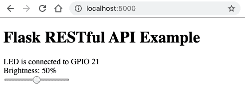
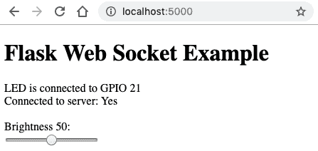

# 第三章：使用 Flask 进行 RESTful API 和 Web Socket 的网络连接

在第二章中，*使用 Python 和物联网入门*，我们创建了一个基于`dweet.io`的网络化物联网应用程序，在这个应用程序中，您可以通过互联网控制连接到树莓派的 LED。我们的第一个物联网应用程序完全是通过 API 请求驱动的。

在本章中，我们将关注 Python 中创建网络服务的替代方法，这些服务可以被 Python 和非 Python 客户端访问。我们将看看如何在 Python 中构建一个 RESTful API 服务器和一个 Web Socket 服务器，并应用我们在上一章学到的电子接口技术，使它们与我们的 LED 进行交互。

完成本章后，您将了解使用 Python 构建服务器的两种不同方法，包括与服务器交互的伴随网页。这两个服务器将为您提供一个端到端的参考实现，您可以将其用作自己网络连接的物联网项目的起点。

由于本章是关于网络技术，我们将继续使用 GPIOZero 为基础的 LED，仅仅是为了简化和抽象，以便我们的示例直截了当、以网络为重点，而不被 GPIO 相关的代码所混淆。

在本章中，我们将涵盖以下主题：

+   介绍 Flask 微服务框架

+   使用 Flask 创建 RESTful API 服务

+   添加 RESTful API 客户端网页

+   使用 Flask-SocketIO 创建 Web Socket 服务

+   添加 Web Socket 客户端网页

+   比较 RESTful API 和 Web Socket 服务器

# 技术要求

要完成本章的练习，您需要以下内容：

+   树莓派 4 型 B 型

+   Raspbian OS Buster（带桌面和推荐软件）

+   至少 Python 版本 3.5

这些要求是本书中代码示例的基础。可以合理地期望，只要您的 Python 版本是 3.5 或更高，代码示例应该可以在树莓派 3 型 B 型或不同版本的 Raspbian OS 上无需修改地运行。

您可以在 GitHub 存储库的`chapter03`文件夹中找到本章的源代码：[`github.com/PacktPublishing/Practical-Python-Programming-for-IoT`](https://github.com/PacktPublishing/Practical-Python-Programming-for-IoT)。

您需要在终端中执行以下命令，以设置虚拟环境并安装本章所需的 Python 库：

```py
$ cd chapter03              # Change into this chapter's folder
$ python3 -m venv venv      # Create Python Virtual Environment
$ source venv/bin/activate  # Activate Python Virtual Environment
(venv) $ pip install pip --upgrade        # Upgrade pip
(venv) $ pip install -r requirements.txt  # Install dependent packages
```

以下依赖项已从`requirements.txt`中安装：

+   **GPIOZero**：GPIOZero GPIO 库（[`pypi.org/project/gpiozero`](https://pypi.org/project/gpiozero)）

+   **PiGPIO**：PiGPIO GPIO 库（[`pypi.org/project/pigpio`](https://pypi.org/project/pigpio)）

+   **Flask**：核心 Flask 微服务框架（[`pypi.org/project/Flask`](https://pypi.org/project/Flask)）

+   **Flask-RESTful**：用于创建 RESTful API 服务的 Flask 扩展（[`pypi.org/project/Flask-RESTful`](https://pypi.org/project/Flask-RESTful)）

+   **Flask-SocketIO**：用于创建 Web Socket 服务的 Flask 扩展（[`pypi.org/project/Flask-SocketIO`](https://pypi.org/project/Flask-SocketIO)）

我们将使用我们在第二章中创建的面包板电路，*使用 Python 和物联网入门*，*图 2.7*。

# 介绍 Flask 微服务框架

Flask 是一个流行且成熟的 Python 微服务框架，您可以使用它来创建 API、网站以及几乎任何其他您能想象到的网络服务。尽管 Flask 并不是 Python 唯一可用的选项，但其成熟性、各种附加组件和扩展，以及优质文档和教程的可用性使其成为一个绝佳的选择。

在本章中，我们可以想象只使用核心 Flask 框架来完成所有以下编码练习；然而，有一些优质的扩展可以让我们的生活变得更加轻松。这些扩展包括用于创建 RESTful API 服务的**Flask-RESTful**和用于构建 Web Socket 服务的**Flask-SocketIO**。

Flask-RESTful 和 Flask-SocketIO（或任何 Flask 扩展）的官方 API 文档通常假定已经掌握了核心 Flask 框架、类和术语的知识。如果在扩展的文档中找不到问题的答案，请记得查看核心 Flask API 文档。您将在*进一步阅读*部分找到指向这些文档的链接。

让我们开始，在 Python 中使用 Flask-RESTful 创建一个 RESTful API 服务。

# 使用 Flask-RESTful 创建 RESTful API 服务

在本节中，我们将探索我们的第一个基于 Python 的服务器，这将是一个使用 Flask-RESTful 框架实现的 RESTful API 服务器。

RESTful API（REST 代表 Representational State Transfer）是一种用于构建 Web 服务 API 的软件设计模式。它是一种灵活的模式，既独立于技术又独立于协议。其技术独立性有助于促进不同技术和系统之间的互操作性，包括不同的编程语言。虽然它确实促进了协议的独立性，但它通常默认情况下是建立在 Web 服务器和 Web 浏览器使用的 HTTP 协议之上的。

RESTful API 是今天构建 Web 服务和 API 最常用的技术。事实上，它是如此常见，以至于许多人在没有理解它们是什么的情况下就学习并使用了这种设计模式！如果您对 RESTful API 还不熟悉，我鼓励您在*进一步阅读*部分找到一个链接，建议您在继续之前先阅读一下。

本节我们将重点关注使用 Python 和 Flask-RESTful 框架控制 LED 的 RESTful API 以及其实现方式。完成本节后，您将能够将这个 RESTful API 服务器作为自己物联网项目的起点，并将其与其他电子设备集成，特别是在本书第三部分*物联网游乐场*中学习更多关于电子执行器和传感器的知识。

在本章的示例中，我们假设您正在树莓派上本地工作和访问基于 Flask 的服务器。如果使用树莓派的 IP 地址或主机名，这些服务器也可以从本地网络上的其他设备访问。要使服务器直接通过互联网访问，需要配置特定防火墙和/或路由器，这在本书中实际上是不可行的。对于原型设计和创建演示，一个简单的替代方法是使用 Local Tunnels ([`localtunnel.github.io/www`](https://localtunnel.github.io/www))或 Ngrok ([`ngrok.com`](https://ngrok.com))等服务，这将帮助您使树莓派上的 Flask 服务器可以通过互联网访问。

我们将首先运行和使用我们的 RESTful API 与 LED 进行交互，然后再审查服务器的源代码。

## 运行和测试 Python 服务器

您将在`chapter03/flask_api_server.py`文件中找到代码。在继续之前，请先查看此文件，以了解其包含的内容。

我们正在使用 Flask 内置的 HTTP 服务器运行我们的 Flask 示例。这对于开发目的已经足够了；但是，不建议在生产中使用。请参阅 Flask 文档中的*部署选项*部分，了解如何使用质量良好的 Web 服务器部署 Flask 应用程序的信息。您将在*进一步阅读*部分找到指向官方 Flask 网站和文档的链接。

要测试 Python 服务器，请执行以下步骤：

1.  使用以下命令运行我们的 RESTful API 服务器：

```py
(venv) $ python flask_api_server.py
... truncated ...
NFO:werkzeug: * Running on http://0.0.0.0:5000/ (Press CTRL+C to quit)
... truncated ...
```

前面代码块中倒数第二行表示我们的服务器已成功启动。我们的服务器默认以调试模式运行，因此其日志输出将是冗长的，如果您对`flask_api_server.py`或其他资源文件进行任何更改，服务器将自动重新启动。

如果以调试模式启动`flask_api_server.py`时出现错误，请清除文件的执行位。这个问题发生在基于 Unix 的系统上，与 Flask 附带的开发 Web 服务器有关。以下是清除执行位的命令：

`$ chmod -x flask_api_server.py`

1.  我们将很快创建一个网页来与 API 进行交互；但是，现在，请在 Web 浏览器中浏览到`http://localhost:5000`，并验证您是否可以使用网页上的滑块来更改 LED 的亮度。

我们的示例 URL 是`http://localhost:5000`，但是，如果您使用树莓派的 IP 地址而不是`localhost`，您将能够从本地网络上的其他设备访问该网页。

以下截图是您将看到的网页的示例：



图 3.1 - RESTful API 客户端网页

1.  我们还可以使用`curl`命令行工具与 API 进行交互。我们现在将这样做，以观察 API 服务器请求的输入和输出 JSON。

以下是我们的第一个`curl`命令，它发出 HTTP GET 请求，我们在终端中以 JSON 格式打印 LED 的亮度级别（在 0 到 100 之间的数字）（第 1 行）。服务器启动时的默认 LED 亮度为 50（即 50%亮度）：

```py
$ curl -X GET http://localhost:5000/led
{
 "level": 50          # (1)
}  
```

`curl`的选项如下：

+   +   `-X GET`：用于发出请求的 HTTP 方法

+   **<url>**：要请求的 URL

1.  下一个命令执行 HTTP POST 请求，并将亮度级别设置为最大值 100（第 2 行），然后将其作为 JSON 返回并打印回终端（第 3 行）：

```py
$ curl -X POST -d '{"level": 100}' \    # (2) 
 -H "Content-Type: application/json" \
 http://localhost:5000/led
{
 "level": 100                            # (3)
}
```

`curl`的选项如下：

+   +   `-X POST`：这是 HTTP 方法；这次我们正在发出 POST 请求。

+   `-d` **<data>**：这是我们要 POST 到服务器的数据。我们正在发布一个 JSON 字符串。

+   `-H` **<HTTP headers>**：这些是要与请求一起发送的 HTTP 标头。在这里，我们让服务器知道我们的数据`(-d)`是 JSON。

+   **<url>**：这是要请求的 URL。

命令行上`curl`的替代方案是 Postman（[getpostman.com](http://getpostman.com)）。如果您不熟悉 Postman，它是一个免费的 API 开发、查询和测试工具，在您开发和测试 RESTful API 服务时非常有价值。

尝试更改前面`curl POST`示例中的级别值为超出 0-100 范围的数字，并观察您收到的错误消息。我们很快将看到如何使用 Flask-RESTful 实现此验证逻辑。

让我们现在继续查看我们的服务器源代码。

## 了解服务器代码

在本节中，我们将浏览我们的 RESTful API 服务器的源代码，并讨论核心部分，以帮助您了解服务器的编码和操作方式。请记住，我们将要涵盖许多特定于 Flask 和 Flask-RESTful 框架的代码级工件，所以如果一开始有些概念不太明确，不要担心。

一旦您了解了基础知识，并对我们的服务器如何工作有了整体的概念，您将能够通过查阅它们各自的网站（您将在*进一步阅读*部分找到链接）深入了解 Flask 和 Flask-RESTful。此外，您将拥有一个可靠的参考 RESTful API 服务器，可以重新设计并用作将来项目的起点。

请注意，当我们讨论代码时，我们将跳过我们在早期章节中涵盖的任何代码和概念，比如**GPIOZero**。

我们将从导入开始。

### **导入**

在源代码文件的顶部，我们看到以下导入：

```py
import logging
from flask import Flask, request, render_template           # (1)
from flask_restful import Resource, Api, reqparse, inputs   # (2)
from gpiozero import PWMLED, Device                         # (3)
from gpiozero.pins.pigpio import PiGPIOFactory
```

我们在第（1）和（2）行看到的与 Flask 和 Flask-RESTful 相关的导入都是我们在服务器中需要的 Flask 和 Flask-RESTful 的所有类和函数。您会注意到在第（3）行，我们导入的是`PWMLED`而不是我们在之前章节中所做的`LED`。在这个例子中，我们将改变 LED 的亮度而不仅仅是打开和关闭它。随着我们继续本章，我们将更多地涵盖 PWM 和`PWMLED`。

接下来，在我们的源代码中，我们开始使用 Flask 和 Flask-RESTful 扩展。

### Flask 和 Flask-RESTful API 实例变量

在接下来的第 4 行，我们创建了核心 Flask 应用的一个实例，并将其分配给`app`变量。参数是我们的 Flask 应用的名称，使用`__name__`作为*root* Flask 应用的常见约定（在我们的示例中只有一个 root Flask 应用）。每当我们需要使用核心 Flask 框架时，我们将使用`app`变量：

```py
app = Flask(__name__) # Core Flask app.            # (4)
api = Api(app) # Flask-RESTful extension wrapper   # (5)
```

在第（5）行，我们用 Flask-RESTful 扩展包装核心 Flask 应用，并将其分配给`api`变量，正如我们很快将看到的，我们在使用 Flask-RESTful 扩展时会使用这个变量。在我们的`app`和`api`变量之后，我们定义了额外的全局变量。

### 全局变量

以下全局变量在整个服务器中使用。首先，我们有 GPIO 引脚和一个`led`变量，稍后将为其分配一个 GPIOZero `PWMLED`实例以控制我们的 LED：

```py
# Global variables
LED_GPIO_PIN = 21
led = None # PWMLED Instance. See init_led()
state = {                                     # (6)
    'level': 50 # % brightness of LED.
}
```

在第（6）行，我们有一个`state`字典结构，我们将使用它来跟踪 LED 的亮度级别。我们本可以使用一个简单的变量，但选择了字典结构，因为它是一个更多功能的选项，因为它将被编组成 JSON 发送回客户端，我们稍后会看到。

接下来，我们创建并初始化了我们的`led`实例。

### init_led()方法

`init_led()`方法只是创建一个 GPIOZero `PWMLED`实例并将其分配给我们之前看到的全局`led`变量：

```py
def init_led():
    """Create and initialize an PWMLED Object"""
 global led
 led = PWMLED(LED_GPIO_PIN)
 led.value = state['level'] / 100        # (7)
```

在第（7）行，我们明确将 LED 的亮度设置为与服务器亮度状态的值匹配，以确保服务器的管理状态和 LED 在服务器启动时同步。我们除以 100 是因为`led.value`期望在 0-1 范围内的浮点值，而我们的 API 将使用 0-100 范围内的整数。

接下来，我们开始看到定义我们的服务器及其服务端点的代码，从提供我们之前访问的网页的代码开始。

### 提供网页

从第（8）行开始，我们使用 Flask `@app.route()`装饰器来定义一个回调方法，当服务器从客户端接收到对根 URL `/`的 HTTP GET 请求时，即对`http://localhost:5000`的请求时，将调用该方法：

```py
# @app.route applies to the core Flask instance (app).
# Here we are serving a simple web page.
@app.route('/', methods=['GET'])                           # (8)
def index():
 """Make sure index_api_client.html is in the templates folder
 relative to this Python file."""
 return render_template('index_api_client.html',
                          pin=LED_GPIO_PIN)                # (9)
```

在第（9）行，`render_template('index_api_client.html', pin=LED_GPIO_PIN)`是一个 Flask 方法，用于向请求的客户端返回一个模板化的页面。`pin=LED_GPIO_PIN`参数是如何将一个变量从 Python 传递到 HTML 页面模板以进行渲染的示例。我们将在本章后面介绍这个 HTML 文件的内容。

请注意，在第（8）行的前面代码块中，我们有`@app.route(...)`。`app`变量的存在意味着我们在这里使用和配置*核心*Flask 框架。

向客户端返回 HTML 页面是我们将在本书中涵盖的唯一核心 Flask 功能，但是在*进一步阅读*部分中将列出其他资源，供您进一步探索 Flask 的核心概念。

我们代码中的下一个停靠点是`LEDController`类。在这里，我们正在与 LED 和 GPIOZero 进行交互。

### LEDControl 类

在 Flask-RESTful 中，API 资源被建模为扩展`Resource`类的 Python 类，如下片段的第（10）行中所示，我们看到了定义的`LEDControl(Resource)`类，其中包含了用于控制我们的 LED 的逻辑。稍后，我们将看到如何注册这个类到 Flask-RESTful，以便它响应客户端请求：

```py
class LEDControl(Resource):                                    # (10)
 def __init__(self):
 self.args_parser = reqparse.RequestParser()            # (11)
 self.args_parser.add_argument(
 name='level',                  # Name of arguement
 required=True,                 # Mandatory arguement
 type=inputs.int_range(0, 100), # Allowed 0..100    # (12) 
 help='Set LED brightness level {error_msg}',
 default=None)
```

在第（11）行，我们创建了`RequestParser()`的一个实例，并将其分配给`args_parser`变量，然后使用`add_argument()`配置解析器。我们在 Flask-RESTful 中使用`RequestParser()`的实例来定义我们期望`LEDControl`资源处理的参数的验证规则。

在这里，我们定义了一个名为`level`的必需参数，它必须是 0 到 100 范围内的整数，如第（12）行所示。当`level`参数缺失或超出范围时，我们还提供了一个自定义的帮助消息。

我们将在稍后讨论`post()`方法时看到`args_parser`的使用，但首先让我们讨论`get()`方法。

### **get()类方法**

`get()`类方法处理我们的`LEDControl`资源的 HTTP GET 请求。这是我们之前使用以下命令测试 API 时处理我们的 URL 请求的方法：

```py
$ curl -X GET http://localhost:5000/led
```

`get()`只是简单地在第（13）行返回全局`state`变量：

```py
 def get(self):
 """ Handles HTTP GET requests to return current LED state."""
 return state         # (13)
```

Flask-RESTful 将 JSON 响应返回给客户端，这就是为什么我们返回`state`变量。在 Python 中，`state`是一个可以直接映射到 JSON 格式的字典结构。我们之前在使用`curl`进行 GET 请求时看到了以下 JSON 示例：

```py
{ "level": 50 }
```

这种类作为资源（例如`LEDControl`）和方法到 HTTP 方法的映射（例如`LEDControl.get()`）是 Flask-RESTful 扩展如何使 RESTful API 开发变得简单的一个例子。

还有其他 HTTP 请求方法保留的方法名称，包括我们接下来要讨论的 POST。

### **post()类方法**

`post()`类方法处理发送到`LEDControl`资源的 HTTP POST 请求。正是这个`post()`方法接收并处理了我们之前使用`curl POST`请求时所做的请求：

```py
curl -X POST -d '{"level": 100}' \
 -H "Content-Type: application/json" \
 http://localhost:5000/led
```

`post()`比我们的`get()`方法更复杂。这是我们根据请求客户端的输入更改 LED 亮度的地方：

```py
 def post(self):
 """Handles HTTP POST requests to set LED brightness level."""
 global state                                            # (14)

 args = self.args_parser.parse_args()                    # (15)

 # Set PWM duty cycle to adjust brightness level.
 state['level'] = args.level                             # (16)
 led.value = state['level'] / 100                        # (17)
 logger.info("LED brightness level is " + str(state['level']))

 return state                                            # (18)
```

在第（14）行，我们使用 Python 的`global`关键字表示我们将修改`state`全局变量。

在第（15）行，我们看到了我们之前讨论过的`args_parser`的使用。这是对`args_parser.parse_args()`的调用，它将解析和验证调用者的输入（记住`level`是一个必需参数，必须在 0-100 的范围内）。如果我们预定义的验证规则失败，用户将收到一个错误消息，并且`post()`将在此终止。

如果参数有效，它们的值将存储在`args`变量中，并且代码将继续到第（16）行，我们在那里使用新请求的亮度级别更新全局`state`变量。在第（17）行，我们使用 GPIOZero PWMLED 实例`led`来改变物理 LED 的亮度，该实例期望一个值在 0.0（关闭）和 1.0（全亮）之间，因此我们将 0-100 的`level`输入范围映射回 0-1。`state`的值在第（18）行返回给客户端。

我们的最后任务是将`LEDController`注册到 Flask-RESTful 并启动服务器。

### **LEDController 注册和启动服务器**

在调用`init_led()`方法来初始化和默认输出 GPIOZero `led`实例之后，我们看到了如何在第（19）行使用`api.add_resource()`注册我们的`LEDControl`资源。在这里，我们将 URL 端点`/led`与我们的控制器进行了映射。

请注意，在第（19）行的代码块中，我们有`api.add_resource(...)`。`api`变量的存在意味着我们在这里使用和配置*Flask-RESTful 扩展*。

最后，在第 20 行，我们的服务器已经启动（调试模式），准备接收客户端请求。请注意，我们使用`app`变量中的*core* Flask 实例来启动服务器：

```py
# Initialize Module.
init_led()
api.add_resource(LEDControl, '/led')          # (19)

if __name__ == '__main__':
 app.run(host="0.0.0.0", debug=True)       # (20)
```

干得好！我们刚刚在 Python 中完成了一个简单但功能齐全的 RESTful API 服务器的构建。您将在*进一步阅读*部分找到官方 Flask-RESTful 文档的链接，以便进一步扩展您的知识。

如前所述，我们在服务器中使用了`PWMLED`。在继续之前，让我们简要介绍一下*PWM*这个术语，并回顾一下伴随我们的 RESTful API 服务器的网页。

## **PWM 简介**

在前面的示例中，我们使用了 GPIOZero 中的`PWMLED`，而不是`LED`。`PWMLED`允许我们使用一种称为**脉冲宽度调制**的技术来控制 LED 的亮度，通常缩写为**PWM**。

PWM 是一种用于从源信号（可以是 3.3 伏特的 GPIO 引脚）中创建平均电压的技术。我们将在第六章中详细介绍 PWM 和 GPIO 引脚电压，*软件工程师的电子学 101*。

对于我们当前的示例，简而言之（有些过于简化），PWM 以非常快的速度打开和关闭 LED，我们的眼睛观察到不同的脉冲持续时间（产生不同的电压），表现为 LED 的不同亮度级别。我们使用`PWMLED`实例的`value`属性来改变这个脉冲持续时间（称为*duty-cycle*），即在`LEDControl.post()`中的`led.value = state["level"]`。在第五章中，*将您的树莓派连接到物理世界*，我们将更详细地探讨 PWM。

我们现在已经完成了基于 Python 的 Flask-RESTful API 服务器，并学会了如何实现一个简单而功能齐全的 RESTful API 服务器，能够处理 GET 和 POST 请求，这是与 RESTful API 服务器交互的两种最流行的方式。此外，我们还看到了如何使用 Flask-RESTful 实现数据验证，这是一种简单有效的方式，可以保护我们的服务器免受无效输入数据的影响。

我们还学会了使用`curl`命令行工具与测试我们的服务器进行交互。在构建、测试和调试 RESTful API 服务器时，您会发现`curl`是开发工具包中的一个有用补充。

接下来，我们将看一下与我们的 API 交互的网页背后的代码。

# 添加 RESTful API 客户端网页

我们将讨论的网页是您之前与之交互以改变 LED 亮度的网页，当您在 Web 浏览器中访问`http://localhost:5000`时。网页的截图显示在*图 3.1*中。

在本节中，我们将学习如何使用 HTML 和 JavaScript 构建这个基本网页。我们将发现如何使 HTML 范围组件与我们在上一节中创建的 Flask-RESTful API 服务器进行交互，以便当我们改变范围控件（即滑动滑块）时，我们 LED 的亮度也会改变。

您将在`chapter03/templates/index_api_client.html`文件中找到网页的代码。在继续之前，请先查看此文件，以了解其包含的内容。

`templates`文件夹是 Flask 中的一个特殊文件夹，用于存放模板文件。在 Flask 生态系统中，HTML 页面被视为模板。您还会发现一个名为`static`的文件夹。这个文件夹是用来存放静态文件的地方。对于我们的示例，这是 jQuery JavaScript 库文件的副本所在的地方。

从 Flask 提供的网页中引用的所有文件和资源都是相对于服务器的根文件夹的。对于我们来说，这是`chapter03`文件夹。

让我们走一遍网页代码。

## 理解客户端代码

本节的代码是 JavaScript，并且我们将使用 jQuery JavaScript 库。了解基本的 JavaScript 和 jQuery 对于理解接下来的代码示例至关重要。如果您不熟悉 jQuery，可以在 jQuery.com 找到学习资源。

### **JavaScript 导入**

我们在下面看到，第 1 行导入了包含在`static`文件夹中的 jQuery 库：

```py
<!-- chapter03/templates/index_api_client.html -->
<!DOCTYPE html>
<html>
<head>
 <title>Flask Restful API Example</title>
 <script src="/static/jquery.min.js"></script>    <!--(1)-->
 <script type="text/javascript">
```

接下来，我们将开始介绍文件中的 JavaScript 函数。

### **getState()函数**

`getState()`的主要目的是从服务器检索 LED 的当前状态。它使用 JQuery 的`get()`方法向我们的 API 服务器的`/led`资源发出 HTTP GET 请求。我们在上一节中看到，URL 路径`/led`映射到`LEDControl`Python 类，因为我们正在进行 GET 请求，所以`LEDControl.get()`将接收和处理我们的请求：

```py
// GET request to server to retrieve LED state.
function getState() { 
 $.get("/led", function(serverResponse, status) { // (2)
 console.log(serverResponse) 
 updateControls(serverResponse)                // (3)
 }); }
```

服务器的响应包含在第 2 行的`serverResponse`参数中，它传递给第 3 行的`updateControls()`函数以更新网页控件。我们将很快介绍这个方法。

虽然`getState()`从我们的 Python 服务器获取数据，但我们的下一个方法`postUpdate()`发送（即*发布）数据到服务器。

### **postUpdate()函数**

`postUpdate()`通过执行 HTTP POST 到服务器来改变 LED 的亮度。这次，在我们的 API 服务器中处理请求的是`LEDControl.post()`方法：

```py
// POST Request to server to set LED state.
function postUpdate(payload) {                          // (4)
 $.post("/led", payload, function(serverResponse, status) {
 console.log(serverResponse)
 updateControls(serverResponse);                 // (5)
 });
}
```

在第 4 行，它接收并解析（记住`arg_parser`来自`LEDControl`）`payload`参数中的数据。`payload`是一个具有`state`子属性的 JavaScript 对象。我们将在稍后看到这个对象是如何在网页滑块的 change 事件处理程序中构造的。

为了保持一致，即使在我们的情况下，`serverResponse`变量将包含与`payload`参数相同的级别值，我们也会更新第 5 行的控件。

接下来，我们将看到第 5 行对`updateControls()`的调用做了什么。

### **updateControls()函数**

`updateControls()`改变了网页控件的视觉外观。这个函数接收 JSON 输入作为`data`参数，格式为`{"level":50}`。从第 6 行开始，使用 jQuery 选择器，我们更新了网页上的滑块控件和文本，以反映新的级别值：

```py
function updateControls(data) {
 $("input[type=range].brightnessLevel").val(data.level);  // (6)
 $("#brightnessLevel").html(data.level);
}
```

接下来，我们将看到如何使用 JQuery 创建一个事件处理程序，当我们或另一个用户更改网页的滑块组件时，它会做出响应。

### **使用 jQuery 注册事件处理程序**

我们遵循 jQuery 最佳实践，并使用 jQuery 的*文档就绪函数*（即`$(document).ready(...)`）来注册我们网页的滑块控件的事件处理程序并初始化我们的网页元素：

```py
 $(document).ready(function() {
 // Event listener for Slider value changes.
 $("input[type=range].brightnessLevel")
 .on('input', function() {                    // (7)
 brightness_level = $(this).val();         // (8)
 payload = { "level": brightness_level }   // (9)
 postUpdate(payload);
 });

        // Initialize slider value form state on server.
 getState()                                       // (10)
 });
 </script>
</head>
```

在第 7 行，我们为滑块控件注册了一个*input*事件的事件处理程序。当用户与网页上的滑块交互时，将调用此处理程序函数。

从第 8 行开始，用户移动滑块后，我们使用`val()`提取滑块的新值（在 0 到 100 之间，我们稍后会在查看页面的 HTML 时看到原因）。

在第 9 行，我们创建一个包含我们新亮度级别的 JSON 对象，然后将其传递给`postUpdate()`，该函数调用我们的 RESTful API 来改变物理 LED 的亮度。

最后，在第 10 行，我们调用我们的`getState()`函数，它向服务器发出 HTTP 请求，以获取 LED 的当前亮度级别。正如我们之前看到的，`getState()`然后委托给`updateControls()`，然后更新滑块和页面文本以反映 LED 的亮度值。

我们将通过查看组成网页的 HTML 来结束本节。

### **网页 HTML**

在我们的 Python 服务器中，我们之前有一行`render_template('index_rest_api.html', pin=LED_GPIO_PIN)`。在这个方法调用中，`pin`参数在第 11 行呈现在我们的网页上，由模板变量`{{pin}}`表示：

```py
<body>
 <h1>Flask RESTful API Example</h1>
 LED is connected to GPIO {{pin}}<br>               <!--(11)-->
 Brightness: <span id="brightnessLevel"></span>%<br>
 <input type="range" min="0" max="100"              <!--(12)-->
 value="0" class="brightnessLevel">
</body>
</html>
```

最后，我们看到，在第 12 行，我们的 HTML 滑块组件被限制在 0-100 的范围内。正如我们之前看到的，是在文档准备好的处理程序中对`getState()`的调用更新了滑块的值属性，以匹配网页加载完成后服务器上存储的亮度级别。

恭喜！我们现在已经达到了一个里程碑，完成了一个基于 RESTful API 的完整端到端服务器和客户端示例。我们对 Flask 和 Flask-RESTful 的学习意味着我们已经学会了使用最受欢迎和功能丰富的 Python 库之一来构建 Web 服务。此外，学习构建 RESTful API 服务器和匹配的客户端意味着我们已经实际实现了当今用于客户端-服务器通信的最常见方法。

我们只是触及了 Flask、Flask-RESTful 和 RESTful API 的一小部分，还有很多可以探索的内容。如果你希望进一步了解这些主题，你会在*进一步阅读*部分找到链接。

接下来，我们将创建与本节中构建的相同的客户端和服务器场景，只是这一次使用 Web 套接字作为我们的传输层。

# 使用 Flask-SocketIO 创建 Web 套接字服务

我们现在将实现我们的第二个基于 Python 的服务器。在本节中，我们的总体目标与上一节中创建的 RESTful API 服务器和客户端类似，也就是说，我们将能够从 Web 浏览器控制我们的 LED。然而，这一次我们的目标是使用不同的技术方法，使用 Web 套接字作为我们的传输层。

Web 套接字是一种全双工通信协议，是实时客户端/服务器交互所需的常见技术选择。在我看来和经验中，Web 套接字最好通过实践而不是阅读来学习，特别是如果你是新手服务器开发者。对 Web 套接字的深入讨论超出了本章的范围；但是，在*进一步阅读*部分，你会找到两个链接，涵盖了基础知识。

如果你是 Web 套接字的新手，我强烈建议在继续之前阅读这两个资源作为入门。如果内容一开始没有理解，不要担心，因为我相信一旦你使用并理解了我们的 Python Web 套接字服务器和配套的 Web 套接字启用的网页是如何实现的，更大的 Web 套接字拼图的各个部分将开始串联起来。

对于我们的 Web 套接字服务器构建，我们将使用 Flask-SocketIO 库，该库是基于并兼容流行的 JavaScript 库 Socket.IO ([`socket.io`](https://socket.io))。

我们将首先运行和使用我们的 Web 套接字服务器与 LED 进行交互，然后再审查服务器的源代码。

## 运行和测试 Python 服务器

让我们首先快速查看一下我们的 Python Web 套接字服务器代码，并运行服务器以查看其运行情况。在我们详细讨论之前，这将给我们一个对代码的大致了解和对代码工作原理的第一手演示。

你会在`chapter03/flask_ws_server.py`文件中找到 Web 套接字服务器的代码。请在继续之前查看这个文件。

当你查看了代码后，我们将运行我们的服务器。以下是要遵循的步骤：

1.  使用以下命令运行 Web 套接字服务器：

```py
(venv) $ python flask_ws_server.py
... truncated ...
NFO:werkzeug: * Running on http://0.0.0.0:5000/ (Press CTRL+C to quit)
... truncated ...
```

前面的输出与我们运行 RESTful API 服务器时看到的类似；但是，对于这个服务器，你可以在终端上期望看到更多的输出消息。你将看到的额外输出已经从前面的示例中截断。

如果在调试模式下启动`flask_ws_server.py`时出现错误，请清除文件的执行位。这个问题发生在基于 Unix 的系统上，与 Flask 附带的开发 Web 服务器有关。这里是清除执行位的命令：

`$ chmod -x flask_ws_server.py`

1.  在网页浏览器中访问`http://localhost:5000` URL。你会得到一个带有滑块的网页，如*图 3.2*所示。虽然网页的视觉外观与 RESTful API 服务器的网页相似，但底层的 JavaScript 是不同的：



图 3.2 - Web Socket 客户端网页

验证你是否可以使用网页上的滑块来改变 LED 的亮度。

打开第二个网页浏览器并访问`http://localhost:5000`（现在你有两个页面打开）。改变滑块，你会看到两个页面保持同步并实时更新！神奇的是，你已经发现了 Web Sockets 相对于 RESTful API 所提供的独特优势。

1.  在网页上找到连接到服务器的行：Yes，然后执行以下操作：

+   在终端中按下*Ctrl* + *C*来终止服务器，你会注意到行变成了连接到服务器：否。

+   再次重新启动服务器，它会变成连接到服务器：Yes。

这说明了 Web Sockets 的双向性质。当我们审查它的 JavaScript 时，我们将看到它是如何实现的，但首先，我们将审查构成我们的 Web Socket 服务器的 Python 代码。

## 服务器代码演示

在本节中，我们将浏览我们的 Python 服务器源代码并讨论核心部分。同样，我们将跳过我们在早期章节中涵盖的任何代码和概念。首先，让我们看看我们正在导入什么。

### **导入**

在源文件的顶部附近，我们有以下的导入：

```py
from flask import Flask, request, render_template
from flask_socketio import SocketIO, send, emit            # (1)
```

与 RESTful API 导入相比，关于我们之前的导入的主要区别在于第（1）行，我们现在从 Flask-SocketIO 导入类和函数。

接下来，在我们的源代码中，我们开始使用 Flask 和 Flask-SocketIO 扩展。

### **Flask 和 Flask-RESTful API 实例变量**

在第（2）行，我们创建了一个`SocketIO`的实例和 Flask-SocketIO 扩展，并将其赋值给`socketio`变量。这个变量将在整个服务器中使用，以访问和配置我们的 Web Socket 服务。

```py
# Flask & Flask Restful Global Variables.
app = Flask(__name__) # Core Flask app.
socketio = SocketIO(app) # Flask-SocketIO extension wrapper  # (2)
```

在创建了 SocketIO 实例之后，我们再次从默认的 URL 端点`/`提供一个网页。

### **提供一个网页**

与 RESTful API 示例类似，我们配置核心 Flask 框架，使用`@app.route()`装饰器从根 URL 提供一个网页：

```py
@app.route('/', methods=['GET'])
def index():
 """Make sure index_web_sockets.html is in the templates folder
 relative to this Python file."""
 return render_template('index_web_sockets.html',         # (3)
 pin=LED_GPIO_PIN) 
```

对于我们的 Web Socket 服务器，这一次，我们提供的是 HTML 文件`index_web_sockets.html`，我们将在下一节中介绍，*添加 Web Socket 客户端网页*。

接下来，我们开始看到设置和处理 Web Socket 事件消息的代码。

### **连接和断开处理程序**

从代码的这一点开始，我们开始看到 RESTful API 服务器和这个 Web Socket 服务器之间的主要区别：

```py
# Flask-SocketIO Callback Handlers
@socketio.on('connect')                                     # (4)
def handle_connect():
 logger.info("Client {} connected.".format(request.sid)) # (5)

    # Send initializating data to newly connected client.
 emit("led", state)                                     # (6)
```

我们看到，在第（4）行，如何使用 Python 装饰器符号注册*message*或*event*处理程序。每个`@socketio.on(<event_name>)`的参数是我们的服务器将监听的事件的名称。`connect`和`disconnect`事件（在下面）是两个保留事件。每当客户端*连接*到服务器或*断开*连接时，这些处理程序都会被调用。

你会注意到，在第（5）行，我们在客户端连接时进行了日志记录，以及通过`request.sid`访问的客户端的唯一标识符。服务器与客户端的每个会话都会收到一个唯一的 SID。当你访问`http://localhost:5000`时，你会看到服务器记录这个连接消息。如果你在这个 URL 上打开两个或更多的网页浏览器（或标签），你会注意到每个会话都会收到一个唯一的 SID。

在第（6）行，我们*emit*当前 LED 状态回到连接的客户端，以便它可以根据需要初始化自己：

```py
@socketio.on('disconnect')                               # (7) 
def handle_disconnect():
 """Called with a client disconnects from this server"""
 logger.info("Client {} disconnected.".format(request.sid))
```

我们在第（7）行的断开处理程序只是记录了客户端断开的事实。当你离开`http://localhost:5000`时，你会注意到服务器记录这条消息，以及断开连接的客户端的`sid`。

接下来，我们遇到了控制我们的 LED 的事件处理程序。

### **LED 处理程序**

在以下的第 8 行，我们有另一个消息处理程序——这次使用了一个名为`led`的自定义事件。还请注意在第 9 行，这个事件处理程序有一个`data`参数，而在前面的部分中连接和断开连接处理程序没有参数。`data`参数包含从客户端发送的数据，我们在第 10 行看到了`data`的`level`子属性。所有来自客户端的数据都是字符串，所以在这里我们验证数据并在下一行将其转换为整数。在 Flask-SocketIO 中没有等效的内置参数验证和解析实用程序，因此我们必须手动执行验证检查，就像从第 11 行开始所示的那样：

```py
@socketio.on('led')                                 # (8)
def handle_state(data):                             # (9)
 """Handle 'led' messages to control the LED."""
 global state
 logger.info("Update LED from client {}: {} "
 .format(request.sid, data)) 

 if 'level' in data and data['level'].isdigit(): # (10)
 new_level = int(data['level'])

 # Range validation and bounding.            # (11)
 if new_level < 0:
 new_level = 0
 elif new_level > 100:
 new_level = 100
```

在以下代码块中，第 12 行，我们设置 LED 的亮度。在第 13 行，我们看到了`emit()`方法的服务器端使用。这个方法调用*发出*一条消息给一个或多个客户端。`"led"`参数是将被客户端消耗的事件的名称。我们将 LED 控制相关的客户端和服务器端事件都称为相同的名称，`led`。`state`参数是要传递给客户端的数据。与 RESTful API 服务器类似，它是一个 Python 字典对象。

`broadcast=True`参数意味着这个*led*消息将被发送到*所有*连接的客户端，而不仅仅是在服务器上发起*led*消息的客户端。这个事件的广播是为什么当您打开多个网页并在其中一个上更改滑块时，其他网页也会保持同步的原因：

```py
 led.value = new_level / 100               # (12)
 logger.info("LED brightness level is " + str(new_level))

 state['level'] = new_level

 # Broadcast new state to *every* 
 # connected connected (so they remain in sync)
 emit("led", state, broadcast=True)            # (13)
```

我们的最后任务是讨论如何启动我们的 Web Socket 服务器。

### **启动服务器**

最后，我们在第 14 行启动服务器。这一次，我们使用的是 Flask-SocketIO 实例`socketio`，而不是核心 Flask`app`实例，就像我们为 RESTful API 服务器所做的那样：

```py
if __name__ == '__main__':
 socketio.run(app, host="0.0.0.0", debug=True)  # (14)
```

干得好！这就是我们的 Web Socket 服务器完成了。

我们现在已经看到了如何使用 Python 和 Flask-SocketIO 构建 Web Socket 服务器。虽然我们的 Web Socket 服务器实现的整体结果类似于我们的 RESTful API 服务器控制 LED，但我们学到的是实现相同结果的不同方法。此外，除此之外，我们展示了 Web Socket 方法提供的一个特性，即我们如何保持多个网页同步！

您将在*进一步阅读*部分找到到 Flask-SocketIO 文档的链接，这样您就可以进一步加深您的知识。

现在我们已经看到了 Web Socket 服务器的 Python 服务器实现，接下来我们将把注意力转向网页的 Web Socket 版本。

# 添加 Web Socket 客户端网页

在这一部分，我们将审查我们用于从 Web Socket 服务器控制 LED 的 HTML 网页。这个页面的示例如*图 3.2*所示。

我们将学习如何在网页中使用 Socket.IO JavaScript 库，以便我们可以与我们的 Python Flask-SocketIO Web Socket 服务器发送和接收*消息*（当我们在 Web Socket 环境中工作时，我们倾向于将数据称为*消息*）并从中接收。此外，当我们探索 JavaScript 和 Socket.IO 相关的代码时，我们将发现我们的客户端 JavaScript 代码如何与我们的 Python 服务器端代码相关联。

您将在`chapter03/templates/index_ws_client.html`文件中找到以下网页的代码。请审查此文件的内容，以获得对其包含的内容的广泛概述。

当您已经审查了我们的 HTML 文件，我们将继续讨论这个文件的重要部分。

## 理解客户端代码

现在您已经浏览了`chapter03/templates/index_ws_client.html`文件，是时候讨论这个文件是如何构建的以及它的作用了。我们将从我们需要用于 Web Socket 支持的额外 JavaScript 导入开始我们的代码漫游。

### **导入**

我们的 Web Socket 客户端需要 Socket.IO JavaScript 库，在第 1 行看到了这个导入。如果您想了解更多关于这个库以及它的工作原理，您可以在*进一步阅读*部分找到 Socket.IO JavaScript 库的链接：

```py
<!-- chapter03/templates/index_ws_client.html -->
<!DOCTYPE html>
<html>
<head>
 <title>Flask Web Socket Example</title>
 <script src="/static/jquery.min.js"></script>
 <script src="/static/socket.io.js"></script>   <!-- (1) -->
 <script type="text/javascript">
```

在导入之后，我们将看到与我们的 Python Web Socket 服务器集成的 JavaScript。

### **Socket.IO 连接和断开处理程序**

在文件的`<script>`部分，第 2 行，我们创建了一个`socket.io` JavaScript 库的`io()`类的实例，并将其赋值给`socket`变量：

```py
 var socket = io();                         // (2)

 socket.on('connect', function() {          // (3)
 console.log("Connected to Server");
 $("#connected").html("Yes");
 });

 socket.on('disconnect', function() {       // (4)
 console.log("Disconnected from the Server");
 $("#connected").html("No");
 });
```

在第 3 行，通过`socket.on('connect', ...)`，我们注册了一个*connect*事件监听器。每当我们的网页客户端成功连接到我们的 Python 服务器时，这个处理程序都会被调用。这是客户端等价于我们用`@socketio.on('connect')`定义的 Python 服务器端的 on connect 处理程序。

在第 4 行，我们看到了`disconnect`处理程序，每当客户端网页失去与服务器的连接时都会被调用。这是客户端等价于 Python 服务器端`@socketio.on('disconnect')`处理程序。

请注意，在这两个处理程序中，我们更新我们的网页以指示它是否与服务器建立了连接。我们之前在终止并重新启动服务器时看到了这一操作。

接下来，我们有一个与我们的 LED 相关的处理程序。

### **关于 LED 处理程序**

在第 5 行，我们有我们的`led`消息处理程序，负责更新 HTML 控件与我们 LED 的当前亮度级别：

```py
socket.on('led', function(dataFromServer) {         // (5)
 console.log(dataFromServer)
 if (dataFromServer.level !== undefined) {
 $("input[type=range].brightnessLevel").val(dataFromServer.level);
 $("#brightnessLevel").html(dataFromServer.level);
 }
});
```

如果您回顾 Python 服务器的`@socketio.on('connect')`处理程序，您会注意到它包含了`emit("led", state)`这一行。当新客户端连接到服务器时，它会*发送*一个消息给连接的客户端，其中包含我们 LED 的当前状态。JavaScript 的`socket.on('led', ...)`部分在第 5 行消耗了这个消息。

接下来，我们有 jQuery 文档准备好回调。

### **文档准备好函数**

jQuery 文档准备好回调是我们为 HTML 滑块设置事件处理程序的地方：

```py
 $(document).ready(function(){
 // Event listener for Slider value changes.
 $("input[type=range].brightnessLevel")
              .on('input', function(){
 level = $(this).val();
 payload = {"level": level};
 socket.emit('led', payload);         // (6)
 });
 });
 </script>
</head>
```

在第 6 行，我们看到了如何在 JavaScript 中发送一个消息。调用`socket.emit('led', payload)`向 Python 服务器发送了一个我们想要应用到 LED 的亮度级别的消息。

这是 Python 的`@socketio.on('led')`处理程序，它接收这个消息并改变 LED 的亮度。

如果您回顾这个 Python 处理程序，您会注意到这一行：`emit("led", state, broadcast=True)`。这一行向所有连接的客户端广播了一个包含新 LED 状态的消息。每个客户端的`socket.on('led', ...)`处理程序都会消耗这个消息，并相应地同步他们的滑块。

最后，我们有构成我们网页的 HTML。

### **网页 HTML**

与 RESTful API 网页唯一的区别是在第 7 行包含了一个消息，指示我们是否与 Python 服务器建立了连接：

```py
<body>
 <h1>Flask Web Socket Example</h1>
 LED is connected to GPIO {{pin}}<br>
 Connected to server: <span id="connected">No</span> <!-- (7) -->
 <br><br>
 Brightness <span id="brightnessLevel"></span>:<br>
 <input type="range" min="0" max="100" 
 value="0" class="brightnessLevel">
</body>
</html>
```

恭喜！这是两个使用两种不同传输层的 Python 服务器和网页客户端。

我们已经看到了如何使用基于 RESTful API 的方法和基于 Web Sockets 的方法来实现相同的项目，以控制 LED 的亮度。这两种方法是实现 Web 服务和将网页（或任何客户端）集成到后端服务器的两种常见选项，因此了解和欣赏这两种技术是有用的，这样您就可以选择最适合自己应用的技术，或者在尝试理解现有应用的实现方式时使用。

让我们通过比较方法并了解更多关于每种方法最适合哪些问题领域来回顾我们所涵盖的内容。

# 比较 RESTful API 和 Web Socket 服务器

基于 RESTful 的 API 在概念上类似于设计、开发和测试，并且更常见于互联网上，需要一种单向请求/响应数据交换。

以下是这种方法的一些定义特征：

+   通信协议是围绕 HTTP 方法构建的，GET、POST、PUT 和 DELETE 是最常见的。

+   协议是半双工的请求-响应形式。客户端发出请求，服务器响应。服务器不能向客户端发起请求。

+   我们有多种选择，包括命令行上的`curl`和诸如 Postman 之类的 GUI 工具来测试和开发 RESTful API。

+   我们可以使用通用的网络浏览器来测试 HTTP GET API 端点

+   在 Python 中，我们可以使用 Flask-RESTful 扩展来帮助我们构建 RESTful API 服务器。我们将端点建模为具有类方法（例如`.get()`和`.post()`）的 Python 类，这些方法与 HTTP 请求方法匹配。

+   对于网页客户端，我们可以使用 jQuery 等库向我们的 Python 服务器发出 HTTP 请求。

另一方面，Web Sockets 通常出现在聊天应用和游戏中，需要实时的双向数据交换，通常有许多同时在线的客户端。

以下是这种方法的一些定义特征：

+   通信协议基于发布和订阅消息。

+   协议是全双工的。客户端和服务器都可以相互发起请求。

+   在 Python 中，我们可以使用 Flask-SocketIO 扩展来帮助我们创建 Web Socket 服务。我们创建方法并将它们指定为消息事件的回调处理程序。

+   对于网页客户端，我们使用`socket.io` JavaScript 库。与 Python 类似，我们创建常见的 JavaScript 函数，并将它们注册到`socket.io`作为消息事件的回调处理程序。

有一个方法比另一个更好吗？没有单一的最佳或一刀切的方法，因此选择物联网应用的网络方法在很大程度上取决于您正在创建什么以及客户端将如何连接和使用您的应用。如果您是新手构建网络应用和 Web 服务，那么在学习概念和实验的同时，使用 Flask-RESTful 的 RESTful API 是一个很好的起点。这是一个非常常见和广泛使用的方法，而且如果您在开发时使用像 Postman（[getpostman.com](http://getpostman.com)）这样的工具作为您的 API 客户端，那么您将有一个强大而快速的方式来玩耍和测试您创建的 API。

# 摘要

在本章中，我们介绍了使用 Python 构建网络服务的两种常见方法——RESTful API 和 Web Socket 服务。我们使用 Flask 微服务框架以及 Flask-RESTful 和 Flask-SocketIO 扩展在 Python 中构建了这些服务。在创建每个服务器之后，我们还创建了网页客户端。我们学会了如何使用 JavaScript jQuery 库发出 RESTful API 请求，以及使用 Socket.IO JavaScript 库执行 Web Socket 消息和订阅。

有了这些新知识，您现在已经掌握了使用 Python、HTML、JavaScript 和 jQuery 构建的基础和简单的端到端客户端-服务器框架，您可以扩展和实验，以创建更宏伟的物联网应用。例如，当您通过本书的第三部分《物联网游乐场》学习不同的电子传感器和执行器时，您将能够使用不同的电子元件扩展和构建本章的示例。当我们到达《第十四章》《将一切联系在一起-物联网圣诞树》时，我们将看到另一个 Flask-RESTful 和 RESTful API 的示例，介绍一个与 LED 灯带和伺服互动的网页。

在《第四章》《使用 MQTT、Python 和 Mosquitto MQTT Broker 进行网络》，我们将看到一种更高级和非常多才多艺的方法来构建物联网应用的网络层，这次是使用 MQTT，即消息队列遥测传输协议。

# 问题

最后，这里是一些问题列表，供您测试对本章材料的了解。您将在书的*评估*部分找到答案：

1.  Flask-RESTful 扩展的哪个特性可以帮助我们验证客户端的输入数据？

1.  什么通信协议可以用于提供客户端和服务器之间的实时全双工通信？

1.  我们如何使用 Flask-SocketIO 进行请求数据验证？

1.  Flask 的`templates`文件夹是什么？

1.  在使用 jQuery 时，我们应该在哪里创建组件事件监听器并初始化我们的网页内容？

1.  什么命令行工具可以用来向 RESTful API 服务发出请求？

1.  当我们改变`PWMLED`实例的`value`属性时，物理 LED 会发生什么？

# 进一步阅读

在本章中我们经常提到“RESTful”这个词，但没有深入讨论它的确切含义。如果您想了解所有细节，可以在 SitePoint.com 上找到一篇很好的入门教程。

+   SitePoint.com 上的 REST：[`www.sitepoint.com/developers-rest-api`](https://www.sitepoint.com/developers-rest-api)

我们的 RESTful API 示例几乎没有涉及 Flask 和 Flask-RESTful 的基础知识，但提供了一个可以构建的工作示例。我鼓励您至少阅读 Flask 快速入门指南，然后再阅读 Flask RESTful 快速入门指南，以获得对这两个框架的良好基础和理解：

+   Flask 快速入门：[`flask.palletsprojects.com/en/1.1.x/quickstart`](https://flask.palletsprojects.com/en/1.1.x/quickstart/)

+   Flask-RESTful 快速入门：[`flask-restful.readthedocs.io/en/latest/quickstart.html`](https://flask-restful.readthedocs.io/en/latest/quickstart.html)

正如在本章中所述，在标题为*介绍 Flask 微服务框架*的部分中，如果您在 Flask-RESTful 中遇到困难并且在其文档中找不到答案，您还应该参考官方的核心 Flask 文档：

+   Flask 文档：[`flask.palletsprojects.com`](https://flask.palletsprojects.com)

我们还只是初步了解了使用 Flask-SocketIO 和 Socket.IO 的 Web 套接字。以下链接指向官方的 Flask-SocketIO 和 Socket.IO 库。我还包括了两个额外的链接，提供了关于 Web 套接字的通用和简单介绍。作为提醒，Web 套接字是一种最好通过实践而不是阅读来学习的技术，特别是对于新手服务器开发者来说。因此，当您阅读关于 Web 套接字的入门材料时，期望核心潜在概念将通过各种不同的代码示例和库来进行说明，除了我们在本章中使用的 Flask-SocketIO 和 Socket.IO 库：

+   Flask-SocketIO：[`flask-socketio.readthedocs.io`](https://flask-socketio.readthedocs.io/)

+   Socket.IO（JavaScript 库）：[`socket.io`](https://socket.io/)

+   Web 套接字基础知识：[`www.html5rocks.com/en/tutorials/websockets/basics`](https://www.html5rocks.com/en/tutorials/websockets/basics)

+   Web 套接字基础知识：[`medium.com/@dominik.t/what-are-web-sockets-what-about-rest-apis-b9c15fd72aac`](https://medium.com/@dominik.t/what-are-web-sockets-what-about-rest-apis-b9c15fd72aac)
