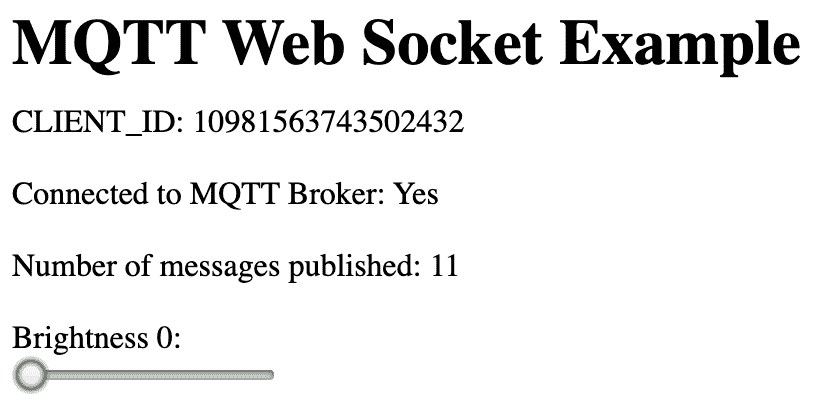
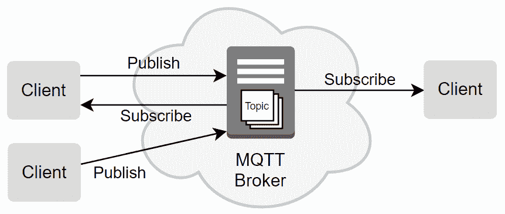

# 第四章：使用 MQTT，Python 和 Mosquitto MQTT 代理进行网络连接

在上一章中，我们使用 RESTful API 和 Web Socket 方法创建了两个 Python 服务器和相应的网页。在本章中，我们将涵盖另一种在物联网世界中常见的网络拓扑，称为**MQTT**或**消息队列遥测传输**。

我们将首先设置您的开发环境，并在树莓派上安装 Mosquitto MQTT 代理服务。然后，我们将使用 Mosquitto 附带的命令行工具学习 MQTT 的特性，以帮助您单独理解核心概念。之后，我们将进行一个使用 MQTT 作为其消息传输层的 Python 物联网应用程序，是的，它将完全关于 LED 的控制！

我们将在本章中涵盖以下主题：

+   安装 Mosquitto MQTT 代理

+   通过示例学习 MQTT

+   介绍 Python Paho-MQTT 客户端库

+   使用 Python 和 MQTT 控制 LED

+   构建基于 Web 的 MQTT 客户端

# 技术要求

要执行本章的练习，您需要以下内容：

+   树莓派 4 型 B 型号

+   Raspbian OS Buster（带桌面和推荐软件）

+   至少 Python 版本 3.5

这些要求是本书中代码示例的基础。可以合理地期望代码示例应该可以在树莓派 3 型 B 型或不同版本的 Raspbian OS 上无需修改地运行，只要您的 Python 版本是 3.5 或更高。

您可以在以下 URL 的 GitHub 存储库的`chapter04`文件夹中找到本章的源代码：[`github.com/PacktPublishing/Practical-Python-Programming-for-IoT`](https://github.com/PacktPublishing/Practical-Python-Programming-for-IoT)

您需要在终端中执行以下命令，以设置虚拟环境并安装本章代码所需的 Python 库：

```py
$ cd chapter04              # Change into this chapter's folder
$ python3 -m venv venv      # Create Python Virtual Environment
$ source venv/bin/activate  # Activate Python Virtual Environment
(venv) $ pip install pip --upgrade        # Upgrade pip
(venv) $ pip install -r requirements.txt  # Install dependent packages
```

从`requirements.txt`中安装以下依赖项：

+   **GPIOZero**：GPIOZero GPIO 库（[`pypi.org/project/gpiozero`](https://pypi.org/project/gpiozero)）

+   **PiGPIO**：PiGPIO GPIO 库（[`pypi.org/project/pigpio`](https://pypi.org/project/pigpio)）

+   **Paho-MQTT** **客户端**：Paho-MQTT 客户端库（[`pypi.org/project/paho-mqtt`](https://pypi.org/project/paho-mqtt)）

我们将使用我们在第二章中创建的面包板电路进行工作，*使用 Python 和物联网入门*，*图 2.7*。

# 安装 Mosquitto MQTT 代理

**MQTT**，或**消息队列遥测传输**，是一种专门针对物联网应用的轻量级和简单的消息传输协议。虽然树莓派足够强大，可以利用更复杂的消息传输协议，但如果您将其用作分布式物联网解决方案的一部分，很可能会遇到 MQTT；因此，学习它非常重要。此外，它的简单性和开放性使其易于学习和使用。

我们将使用一个名为*Mosquitto*的流行开源 MQTT 代理来进行 MQTT 的介绍，并将其安装在您的树莓派上。

本章涵盖的示例是使用 Mosquitto 代理和客户端版本 1.5.7 执行的，这是 MQTT 协议版本 3.1.1 兼容的。只要它们是 MQTT 协议版本 3.1.x 兼容的，代理或客户端工具的不同版本都将适用。

要安装 Mosquitto MQTT 代理服务和客户端工具，请按照以下步骤进行：

1.  打开一个新的终端窗口并执行以下`apt-get`命令。这必须使用`sudo`执行：

```py
$ sudo apt-get --yes install mosquitto mosquitto-clients
... truncated ...
```

1.  要确保 Mosquitto MQTT 代理服务已启动，请在终端中运行以下命令：

```py
$ sudo systemctl start mosquitto
```

1.  使用以下`service`命令检查 Mosquitto 服务是否已启动。我们期望在终端上看到`active (running)`文本打印出来：

```py
$ systemctl status mosquitto
... truncated ...
 Active: active (running)
... truncated ...
```

1.  我们可以使用`mosquitto -h`命令检查 Mosquitto 和 MQTT 协议版本。 在这里，我们看到 Mosquitto 代理使用的是 MQTT 版本 3.1.1：

```py
$ mosquitto -h
mosquitto version 1.5.7
mosquitto is an MQTT v3.1.1 broker.
... truncated ...
```

1.  接下来，我们将配置 Mosquitto，以便它可以提供网页并处理 Web 套接字请求。 当我们在本章后面构建网页客户端时，我们将使用这些功能。

在`chapter4`文件夹中，有一个名为`mosquitto_pyiot.conf`的文件，这里部分复制了该文件。 此文件中有一行我们需要检查的内容：

```py
# File: chapter04/mosquitto_pyiot.conf
... truncated...
http_dir /home/pi/pyiot/chapter04/mosquitto_www
```

对于本章的练习，您需要更新最后一行的`http_dir`设置，使其成为树莓派上`chapter04/mosquitto_www`文件夹的绝对路径。 如果您在第一章*，设置您的开发环境*中克隆 GitHub 存储库时使用了建议的文件夹`/home/pi/pyiot`，那么先前列出的路径是正确的。

1.  接下来，我们使用以下`cp`命令将`mosquitto_pyiot.conf`中的配置复制到适当的文件夹中，以便 Mosquitto 可以加载它：

```py
$ sudo cp mosquitto_pyiot.conf /etc/mosquitto/conf.d/
```

1.  现在我们重新启动 Mosquitto 服务以加载我们的配置：

```py
$ sudo systemctl restart mosquitto 
```

1.  要检查配置是否有效，请在树莓派上的 Web 浏览器中访问`http://localhost:8083` URL，您应该看到类似以下截图的页面：



图 4.1 - Mosquitto MQTT 代理提供的网页

这是本章后面我们将要做的事情的线索！ 目前，虽然您可以移动滑块，但它*不会*改变 LED 的亮度，因为我们没有运行 Python 端的代码。 我们将在本章后面逐步介绍。

如果您在启动 Mosquitto MQTT 代理时遇到问题，请尝试以下操作：

+   在终端中执行`sudo mosquitto -v -c /etc/mosquitto/mosquitto.conf`。 这将在前台启动 Mosquitto，并且任何启动或配置错误都将显示在您的终端上。

+   阅读`mosquitto_pyiot.conf`文件中的故障排除注释以获取其他建议。

Mosquitto 安装后的默认配置创建了一个*未加密*和*未经身份验证*的 MQTT 代理服务。 Mosquitto 文档包含有关其配置以及如何启用身份验证和加密的详细信息。 您将在本章末尾的*进一步阅读*部分找到链接。

现在我们已经安装并运行了 Mosquitto，我们可以探索 MQTT 概念并执行示例以看到它们在实践中的应用。

# 通过示例学习 MQTT

MQTT 是基于代理的*发布*和*订阅*消息协议（经常被简化为*pub/sub*），而 MQTT *代理*（就像我们在上一节中安装的 Mosquitto MQTT 代理）是实现 MQTT 协议的服务器。 通过使用基于 MQTT 的架构，您的应用程序可以基本上将所有复杂的消息处理和路由逻辑交给代理，以便它们可以保持专注于解决方案。

MQTT 客户端（例如，您的 Python 程序和我们即将使用的命令行工具）与代理创建订阅并*订阅*它们感兴趣的消息主题。 客户端*发布*消息到主题，然后代理负责所有消息路由和传递保证。 任何客户端都可以扮演订阅者、发布者或两者的角色。

*图 4.2*展示了涉及泵、水箱和控制器应用程序的简单概念 MQTT 系统：



图 4.2 - MQTT 示例

以下是系统组件的高级描述：

+   将*水位传感器 MQTT 客户端*视为连接到水箱中的水位传感器的软件。 在我们的 MQTT 示例中，此客户端扮演*发布者*的角色。 它定期发送（即*发布*）关于水箱装满了多少水的消息到 MQTT 代理。

+   将* Pump MQTT 客户端*视为能够打开或关闭水泵的软件驱动程序。在我们的示例中，此客户端扮演*发布者*和*订阅者*的角色：

+   作为*订阅者*，它可以接收一条消息（通过*订阅*）指示它打开或关闭水泵。

+   作为*发布者*，它可以发送一条消息，指示水泵是打开并抽水还是关闭。

+   将*Controller MQTT 客户端*视为所有控制逻辑所在的应用程序。此客户端还扮演*发布者*和*订阅者*的角色：

+   作为*发布者*，此客户端可以发送一条消息，告诉水泵打开或关闭。

+   作为*订阅者*，此客户端可以从水箱水位传感器和水泵接收消息。

举例来说，*Controller MQTT 客户端*应用程序可以配置为在水箱水位低于 50％时打开水泵，并在水位达到 100％时关闭水泵。此控制器应用程序还可以包括一个仪表板用户界面，显示水箱的当前水位以及指示水泵是否打开或关闭的状态灯。

关于我们的 MQTT 系统需要注意的一点是，每个客户端都不知道其他客户端，客户端只连接到 MQTT 代理并与之交互，然后代理将消息适当地路由到客户端。这通过使用消息*主题*来实现，我们将在标题为*探索 MQTT 主题和通配符*的部分中进行介绍。

可以理解为什么水泵需要接收消息来告诉它打开或关闭，但是水泵还需要发送消息来说明它是打开还是关闭吗？如果您对此感到困惑，这就是原因。MQTT 消息是发送并忘记的，这意味着客户端不会收到它发布的消息的应用级响应。因此，在我们的示例中，虽然控制器客户端可以发布一条消息要求水泵打开，但如果水泵不发布其状态，控制器就无法知道水泵是否真的打开了。

在实践中，每次水泵打开或关闭时，水泵都会发布其开/关状态。这将允许控制器的仪表板及时更新水泵的状态指示器。此外，水泵还会定期发布其状态（就像水位传感器一样），而不依赖于其接收到的任何请求来打开或关闭。这样，控制器应用程序可以监视水泵的连接和可用性，并检测水泵是否脱机。

目前，如果您能理解前面示例中提出的基本思想，那么您就已经在更深入地理解本章其余部分将关注的核心 MQTT 概念的道路上了。到我们完成时，您将对如何使用和设计基于 MQTT 的应用程序有一个基本的端到端理解。

我们将从学习如何发布和订阅消息开始。

## 发布和订阅 MQTT 消息

让我们通过以下步骤来发送（即发布）和接收（即订阅）使用 MQTT 的消息：

1.  在终端中运行以下命令。`mosquitto_sub`（Mosquitto 订阅）是一个命令行工具，用于*订阅*消息：

```py
# Terminal #1 (Subscriber)
$ mosquitto_sub -v -h localhost -t 'pyiot'
```

选项如下：

+   +   `-v`（-详细信息）：详细信息是为了在终端上打印消息*主题*和*消息*负载。

+   `-h`（-主机）：localhost 是我们要连接的代理的主机；这里是我们刚刚安装的代理。使用的默认端口是 1883。

+   `-t`（-主题）：`pyiot`是我们要订阅和监听的主题。

在本章中，我们将需要两个或三个终端会话来进行示例。代码块的第一行将指示您需要在哪个终端中运行命令；例如，在前面的代码块中是**终端＃1**，在下面的代码块中是**终端＃2**。

1.  打开第二个终端并运行以下命令。`mosquitto_pub`（Mosquitto 发布）是一个命令行工具，用于*发布*消息：

```py
# Terminal #2 (Publisher)
$ mosquitto_pub -h localhost -t 'pyiot' -m 'hello!' 
```

让我们看看选项：

+   +   `-h`和`-t`的含义与前面的订阅命令相同。

+   `-m 'hello!'`（-message）是我们想要发布的消息。在 MQTT 中，消息是简单的字符串——如果你想知道 JSON，它只需要被序列化/反序列化为字符串。

1.  在**终端#1**上，我们看到主题和消息`hello!`被打印出来：

```py
# Terminal #1 (Subscriber)
$ mosquitto_sub -v -h localhost -t 'pyiot'
pyiot hello!
```

最后一行的格式是<*topic>* <*message payload>*。

因为我们使用了`-v`选项来订阅`mosquitto_sub`，所以`hello!`消息之前有主题名`pyiot`。如果没有`-v`选项，如果我们订阅多个主题，我们无法确定消息属于哪个主题。

现在，我们已经学会了如何使用简单主题发布和订阅消息。但是有没有办法更好地组织这些消息呢？继续阅读。

## 探索 MQTT 主题和通配符

MQTT *主题* 用于以分层格式对消息进行分类或分组。我们已经在我们之前的命令行示例中使用主题，但是以非分层的方式。另一方面，通配符是订阅者用来创建灵活的主题匹配模式的特殊字符。

以下是来自具有传感器的假设建筑的一些分层主题示例。层次结构由`/`字符分隔：

+   `level1/lounge/temperature/sensor1`

+   `level1/lounge/temperature/sensor2`

+   `level1/lounge/lighting/sensor1`

+   `level2/bedroom1/temperature/sensor1`

+   `level2/bedroom1/lighting/sensor1`

在 MQTT 代理上没有必要预先创建主题。使用*默认*代理配置（我们正在使用），您只需随意发布和订阅主题。

当 Mosquitto 代理配置为使用身份验证时，有可能根据客户端 ID 和/或用户名和密码限制对主题的访问。

消息*必须*发布到*特定*主题，如`pyiot`，而订阅可以通过使用通配符字符`+`和`#`订阅到特定主题或一系列主题：

+   `+`用于匹配层次结构的单个元素。

+   `#` 用于匹配层次结构中的*所有*剩余元素（它只能在主题查询的末尾）。

对主题和通配符的订阅最好通过示例来解释。使用上述假设的建筑和传感器，考虑以下表中的示例：

| 我们想要订阅... | 通配符主题 | 主题匹配 |
| --- | --- | --- |
| 到处的**温度**传感器 | `+/+/**temperature**/+` |

+   `level1/lounge/**temperature**/sensor1`

+   `level1/lounge/**temperature**/sensor2`

+   `level2/bedroom1/**temperature**/sensor1`

|

| 所有地方的**灯**传感器 | `+/+/**lighting**/+` |
| --- | --- |

+   `level1/lounge/**lighting**/sensor1`

+   `level2/bedroom1/**lighting**/sensor1`

|

| **level 2** 上的每个传感器 | `**level2**/+/+/+` |
| --- | --- |

+   `**level2**/bedroom1/temperature/sensor1`

+   `**level2**/bedroom1/lighting/sensor1`

|

| **level 2** 上的每个传感器（一个更简单的方法，其中`#`匹配每个剩余的子级） | `**level2**/#` |
| --- | --- |

+   **level2**/bedroom1/temperature/sensor1

+   `**level2**/bedroom1/lighting/sensor1`

|

| 到处只有**sensor1** | `+/+/+/**sensor1**` |
| --- | --- |

+   `level1/lounge/temperature/**sensor1**`

+   `level1/lounge/lighting/**sensor1**`

+   `**level2**/bedroom1/temperature/**sensor1**`

+   `level2/bedroom1/lighting/**sensor1**`

|

| 到处只有**sensor1**（一个更简单的方法，其中`#`匹配每个剩余的子级） | `#/**sensor1**` | 无效，因为#只能在主题查询的末尾 |
| --- | --- | --- |
| 每个主题 | `#` | 匹配所有内容 |
| 代理信息 | `$SYS/#` | 这是一个特殊的保留主题，代理在其中发布信息和运行时统计信息。 |

表 1 - MQTT 通配符主题示例

从前面的示例中可以明显看出，您需要在设计应用程序的主题层次结构时小心，以便使用通配符订阅多个主题是一致的、逻辑的和简单的。

如果您使用`mosquitto_sub`订阅使用`+`或`#`通配符，请记住使用`-v`（--verbose）选项，以便主题名称打印在输出中，例如`mosquitto_sub -h localhost -v -t '#'`。

在命令行上尝试一些示例，通过混合和匹配前面的主题和通配符来感受主题和通配符的工作原理。以下是一个示例的步骤，其中`mosquitto_sub`订阅了所有从根主题下两级的父主题为*temperature*的子主题：

1.  在一个终端中，启动一个订阅通配符主题的订阅者：

```py
# Terminal #1 (Subscriber)
mosquitto_sub -h localhost -v -t '+/+/temperature/+'
```

1.  使用*表 1 - MQTT 通配符主题示例*中的主题，以下是两个`mosquitto_pub`命令，将发布的消息将被**终端#1**中的`mosquitto_sub`命令接收：

```py
# Terminal #2 (Publisher)
$ mosquitto_pub -h localhost -t 'level1/lounge/temperature/sensor1' -m '20'
$ mosquitto_pub -h localhost -t 'level2/bedroom1/temperature/sensor1' -m '22'
```

我们刚刚看到如何使用通配符字符`+`和`*`订阅主题层次结构。使用主题和通配符一起是一个设计决策，您需要根据数据流动的需求以及您设想客户端应用程序发布和订阅的方式在每个项目级别上做出的。在设计一致而灵活的基于通配符的主题层次结构方面投入的时间将有助于帮助您构建更简单和可重用的客户端代码和应用程序。

接下来，我们将学习有关消息服务质量的所有内容，以及这如何影响您通过 MQTT Broker 发送的消息。

## 将服务质量应用于消息

MQTT 为*单个消息传递*提供了三个**服务质量**（**QoS**）级别 - 我强调*单个消息传递*，因为 QoS 级别适用于单个消息的传递，而不适用于主题。随着您逐步学习示例，这一点将变得更加清晰。

作为开发人员，您规定消息的 QoS，而代理负责确保消息传递符合 QoS。以下是您可以应用于消息的 QoS 以及它们对传递的含义：

| **QoS 级别** | **含义** | **传递的消息数量** |
| --- | --- | --- |
| 级别 0 | 该消息将被传递最多一次，但也可能根本不传递。 | 0 或 1 |
| 级别 1 | 该消息将至少传递一次，但可能更多。 | 1 或更多 |
| 级别 2 | 该消息将被传递一次。 | 1 |

表 2 - 消息 QoS 级别

您可能会问：级别 0 和 1 似乎有点随机，那么为什么不总是使用级别 2 呢？答案是*资源*。让我们看看为什么...

与较低级别的 QoS 消息相比，代理和客户端将消耗更多的资源来处理较高级别的 QoS 消息 - 例如，代理将需要更多的时间和内存来存储和处理消息，而代理和客户端在确认确认和连接握手时消耗更多的时间和网络带宽。

对于许多用例，包括本章后续的示例，我们将注意不到 QoS 级别 1 和 2 之间的区别，我们也无法实际演示它们（级别 0 由于一个很好的原因被省略，我们稍后将在消息保留和持久连接时看到）。然而，设想一个分布式物联网系统，其中成千上万的传感器每分钟发布成千上万条消息，现在围绕 QoS 设计开始变得更有意义。

QoS 级别适用于消息订阅和消息发布，当你第一次思考时，这可能看起来有点奇怪。例如，一个客户端可以以 QoS 1 发布消息到一个主题，而另一个客户端可以以 QoS 2 订阅该主题（我知道我说 QoS 与消息有关，而不是与主题有关，但在这里，它与通过主题流动的消息有关）。这条消息的 QoS 是 1 还是 2？对于订阅者来说，是 1——让我们找出原因。

订阅客户端选择它想要接收的消息的最高 QoS，但可能会得到更低的 QoS。因此，实际上，这意味着客户端接收的交付 QoS 被降级为发布或订阅的最低 QoS。

以下是一些供您思考的示例：

| 发布者发送消息 | 订阅者订阅 | 订阅者获取的内容 |
| --- | --- | --- |
| QoS 2 | QoS 0 | 传递符合 QoS 0 的消息（订阅者获取消息 0 次或 1 次） |
| QoS 2 | QoS 2 | 传递符合 QoS 2 的消息（订阅者获取消息一次） |
| QoS 0 | QoS 1 | 传递符合 QoS 0 的消息（订阅者获取消息 0 次或 1 次） |
| QoS 1 | QoS 2 | 传递符合 QoS 1 的消息（订阅者获取消息 1 次或多次） |
| QoS 2 | QoS 1 | 传递符合 QoS 1 的消息（订阅者获取消息 1 次或多次） |

表 3 - 发布者和订阅者 QoS 示例

从这些示例中可以得出的结论是，在实践中，设计或集成物联网解决方案时，您需要了解主题两侧的发布者和订阅者使用的 QoS——QoS 不能在任一侧单独解释。

以下是播放 QoS 场景并实时查看客户端-代理交互的步骤：

1.  在终端中，运行以下命令启动订阅者：

```py
# Terminal 1 (Subscriber)
$ mosquitto_sub -d -v -q 2 -h localhost -t 'pyiot'
```

1.  在第二个终端中，运行以下命令发布消息：

```py
# Terminal 2 (Publisher)
$ mosquitto_pub -d -q 1 -h localhost -t 'pyiot' -m 'hello!'
```

在这里，我们再次在**终端＃1**上订阅，并在**终端＃2**上发布。以下是与`mosquitto_sub`和`mosquitto_pub`一起使用的新选项：

+   +   `-d`：打开调试消息

+   `-q <level>`：QoS 级别

启用调试（`-d`）后，尝试在任一侧更改`-q`参数（为 0、1 或 2）并发布新消息。

1.  观察**终端＃1**和**终端＃2**中记录的消息。

在**终端＃1**和**终端＃2**中将出现一些调试消息，您将观察到订阅端发生的 QoS 降级（寻找`q0`，`q1`或`q2`），而在双方，您还将注意到不同的调试消息，具体取决于客户端和代理执行握手和交换确认时指定的 QoS：

```py
# Terminal 1 (Subscriber)
$ mosquitto_sub -d -v -q 2 -h localhost -t 'pyiot' # (1)
Client mosqsub|25112-rpi4 sending CONNECT
Client mosqsub|25112-rpi4 received CONNACK (0)
Client mosqsub|25112-rpi4 sending SUBSCRIBE (Mid: 1, Topic: pyiot, QoS: 2) # (2)
Client mosqsub|25112-rpi4 received SUBACK
Subscribed (mid: 1): 2
Client mosqsub|25112-rpi4 received PUBLISH (d0, q1, r0, m1, 'pyiot', ... (6 bytes)) # (3)
Client mosqsub|25112-rpi4 sending PUBACK (Mid: 1)
pyiot hello!
```

以下是**终端＃1**上订阅者的调试输出。请注意以下内容：

+   +   在第 1 行，我们使用 QoS 2（`-q 2`）进行订阅。这在调试输出中反映为`QoS：2`，在第 2 行。

+   在第 3 行，我们看到了 QoS 的降级。接收到的消息是 QoS 1（`q1`），这是消息在**终端＃1**中发布的 QoS。

QoS 是较复杂的 MQTT 概念之一。如果您想更深入地了解 QoS 级别以及发布者、订阅者和代理之间进行的低级通信，您将在*进一步阅读*部分找到链接。

现在我们已经介绍了消息 QoS 级别，接下来我们将了解两个 MQTT 功能，确保离线客户端可以在重新上线时接收以前的消息。我们还将看到 QoS 级别如何影响这些功能。

## 保留消息以供以后传递

MQTT 代理可以被指示保留发布到主题的消息。消息保留有两种类型，称为保留消息和持久连接：

+   保留消息是指代理保留在主题上发布的最后一条消息。这也通常被称为最后已知的好消息，任何订阅主题的客户端都会自动获取此消息。

+   **持久连接**也涉及保留消息，但在不同的上下文中。如果客户端告诉代理它想要一个*持久连接*，那么代理将在客户端离线时保留 QoS 1 和 2 的消息。

除非特别配置，Mosquitto *不会*在服务器重新启动时保留消息或连接。要在重新启动时保留此信息，Mosquitto 配置文件必须包含条目`persistence true`。树莓派上 Mosquitto 的默认安装应该包括此条目，但是，为了确保它也包含在我们之前安装的`mosquitto_pyiot.conf`中。请参阅官方 Mosquitto 文档以获取有关持久性的更多信息和配置参数。您将在本章末尾的*进一步阅读*部分找到链接。

接下来，我们将学习保留消息并在随后的部分中涵盖持久连接。

### 发布保留消息

发布者可以要求代理保留一个消息作为主题的*最后已知的良好*消息。任何新连接的订阅者将立即收到这个最后保留的消息。

让我们通过一个示例来演示保留消息：

1.  运行以下命令，注意我们从**终端#2**开始，这个示例中是发布者：

```py
# Terminal 2 (Publisher)
$ mosquitto_pub -r -q 2 -h localhost -t 'pyiot' -m 'hello, I have been retained!'
```

已添加了一个新选项，`-r`（--retain），告诉代理应该为该主题保留此消息。

一个主题只能存在一个保留的消息。如果使用`-r`选项发布另一条消息，则先前保留的消息将被替换。

1.  在另一个终端中启动一个订阅者，然后立即您将收到保留的消息：

```py
# Terminal 1 (Subscriber)
$ mosquitto_sub -v -q 2 -h localhost -t 'pyiot'
pyiot hello, I have been retained!
```

1.  在**终端#1**中按下*Ctrl* + *C*来终止`mosquitto_sub`。

1.  再次使用与*步骤 2*相同的命令启动`mosquitto_sub`，然后您将在**终端#1**中再次收到保留的消息。

您仍然可以发布普通消息（即*不*使用`-r`选项），但是，新连接的订阅者将接收到使用`-r`选项指示的最后保留的消息。

1.  我们的最后一个命令显示了如何清除先前保留的消息：

```py
# Terminal 2 (Publisher)
$ mosquitto_pub -r -q 2 -h localhost -t 'pyiot' -m ''
```

在这里，我们正在发布（使用`-r`）一个带有`-m ''`的空消息。请注意，我们可以使用`-n`作为`-m ''`的替代方法来指示空消息。保留空消息的效果实际上是清除保留的消息。

当您向主题发送空消息以删除保留的消息时，当前订阅该主题的任何客户端（包括具有持久连接的离线客户端-请参阅下一节）都将收到空消息，因此您的应用代码必须适当地测试和处理空消息。

现在您了解并知道如何使用保留消息，我们现在可以探索 MQTT 中可用的另一种消息保留类型，称为*持久连接*。

### 创建持久连接

订阅主题的客户端可以要求代理在其离线时保留或排队消息。在 MQTT 术语中，这被称为*持久连接*。为了使持久连接和传递工作，订阅客户端需要以特定的方式进行配置和订阅，如下所示：

+   当客户端连接时，*必须*向代理提供唯一的客户端 ID。

+   客户端*必须*使用 QoS 1 或 2（级别 1 和 2 保证传递，但级别 0 不保证）进行订阅。

+   客户端只有在使用 QoS 1 或 2 进行发布的消息时才能得到保证。

最后两点涉及了一个示例，其中了解主题的发布和订阅双方的 QoS 对于物联网应用程序设计非常重要。

MQTT 代理可以在代理重新启动时保留消息，树莓派上 Mosquitto 的默认配置也可以这样做。

让我们通过一个示例来演示：

1.  启动订阅者，然后立即使用*Ctrl* + *C*终止它，使其处于离线状态：

```py
# Terminal #1 (Subscriber)
$ mosquitto_sub -q 1 -h localhost -t 'pyiot' -c -i myClientId123
$ # MAKE SURE YOU PRESS CONTROL+C TO TERMINATE mosquitto_sub
```

使用的新选项如下：

+   +   `-i <client id>`（-id <client id>）是一个唯一的客户端 ID（这是代理识别客户端的方式）。

+   `-c`（--disable-clean-session）指示代理保留订阅主题上到达的任何 QoS 1 和 2 消息，即使客户端断开连接（即*保留*消息）。

措辞有点反向，但通过使用`-c`选项启动订阅者，我们已要求代理通过在连接时不清除任何存储的消息来为我们的客户端创建一个*持久连接*。

如果您使用通配符订阅一系列主题（例如，`pyiot/#`），并请求持久连接，那么通配符层次结构中所有主题的所有消息都将保留给您的客户端。

1.  发布一些消息（当**终端#1**中的订阅者仍然离线时）：

```py
# Terminal #2 (Publisher)
$ mosquitto_pub -q 2 -h localhost -t 'pyiot' -m 'hello 1'
$ mosquitto_pub -q 2 -h localhost -t 'pyiot' -m 'hello 2'
$ mosquitto_pub -q 2 -h localhost -t 'pyiot' -m 'hello 3
```

1.  将**终端#1**中的订阅者重新连接，我们将看到在*步骤 2*中发布的消息被传送：

```py
# Terminal 1 (Subscriber)
$ mosquitto_sub -v -q 1 -h localhost -t 'pyiot' -c -i myClientId123
pyiot hello 1
pyiot hello 2
pyiot hello 3
```

再次尝试*步骤 1*至*3*，只是这次在*步骤 1*和*3*中的订阅者中省略`-c`选项，您会注意到没有消息被保留。此外，当您在有保留消息等待传送时*不使用*`-c`标志连接时，那么所有保留消息都将被清除（这是您想要清除客户端的保留消息的方法）。

如果您在单个主题上同时使用*保留消息*（即最后已知的良好消息）和*持久连接*，并重新连接离线订阅者，您将*收到保留消息两次*—一次是*保留消息*，而第二次是来自*持久连接*的消息。

在围绕 MQTT 构建解决方案时，您对保留消息和持久连接的了解将对设计具有弹性和可靠性的系统至关重要，特别是在需要处理离线客户端的情况下。保留（最后已知的良好）消息非常适合在客户端重新上线时初始化客户端，而持久连接将帮助您为任何必须能够消费其订阅的每条消息的离线客户端保留和传送消息。

干得好！我们已经涵盖了很多内容，实际上您现在已经了解了构建基于 MQTT 的物联网解决方案时将使用的大多数核心 MQTT 功能。我们要了解的最后一个功能是称为*Will*。

## 用 Will 说再见

我们探索的最后一个 MQTT 功能是称为 Will。客户端（发布者或订阅者）可以向代理注册一个特殊的*Will*消息，以便如果客户端死机并突然断开与代理的连接（例如，它失去了网络连接或其电池耗尽），代理将代表客户端发送*Will*消息，通知订阅者设备的消亡。

Will 只是一个消息和主题组合，类似于我们之前使用的。

让我们看看 Will 的作用，为此，我们将需要三个终端：

1.  打开一个终端，并使用以下命令启动一个订阅者：

```py
# Terminal #1 (Subscriber with Will)
$ mosquitto_sub -h localhost -t 'pyiot' --will-topic 'pyiot' --will-payload 'Good Bye' --will-qos 2 --will-retain
```

新的选项如下：

+   +   `--will-payload`：这是 Will 消息。

+   `--will-topic`：这是 Will 消息将要发布的主题。在这里，我们使用与我们订阅的相同主题，但也可以是不同的主题。

+   `--will-qos`：这是 Will 消息的 QoS。

+   `--will-retain`：如果存在此选项，那么如果客户端突然断开连接，Will 消息将被代理保留为 Will 主题的*保留（最后已知的良好）消息*。

1.  使用以下命令在第二个终端中启动一个订阅者：

```py
# Terminal #2 (Subscriber listening to Will topic).
$ mosquitto_sub -h localhost -t 'pyiot'
```

1.  在第三个终端中，使用以下命令发布一条消息：

```py
# Terminal #3 (Publisher)
$ mosquitto_pub -h localhost -t 'pyiot' -m 'hello'
```

1.  一旦在**终端#3**上执行*步骤 3*中的`mosquitto_pub`命令，您应该会在**终端#1**和**#2**上都看到`hello`被打印出来。

1.  在**终端#1**中，按下*Ctrl* + *C*来终止向代理注册 Will 的订阅者。*Ctrl* + *C*被视为与代理的非优雅或突然断开连接。

1.  在**终端#2**中，我们将看到遗嘱的“再见”消息：

```py
# Terminal #2 (Subscriber listening to Will topic).
$ mosquitto_sub -h localhost -t 'pyiot'
'Good Bye'
```

好的，那么优雅地断开连接呢，订阅者如何正确地关闭与代理的连接？我们可以使用`mosquitto_sub`的`-C`选项来演示这一点。

1.  使用以下命令重新启动**终端#1**中的订阅者：

```py
# Terminal #1 (Subscriber with Will)
$ mosquitto_sub -h localhost -t 'pyiot' --will-topic 'pyiot' --will-payload 'Good Bye, Again' --will-qos 2 --will-retain -C 2
```

新的`-C <count>`选项告诉`mosquitto_sub`在接收到指定数量的消息后断开（优雅地）并退出。

您会立即注意到打印的“再见”消息。这是因为我们之前在**终端#1**中指定了`--retain-will`选项。此选项使遗嘱消息成为主题的保留或最后已知的好消息，因此新连接的客户端将接收此消息。

1.  在**终端#3**中，发布一条新消息，**终端#1**中的订阅者将退出。请注意，在**终端#3**中，不会收到遗嘱消息“再见，再见”。这是因为我们的**终端#1**订阅者因为`-C`选项而优雅地与代理断开连接，并且如果您想知道`-C 2`中的`2`，则保留的遗嘱消息被计为第一条消息。

干得好！如果您已经完成了前面的每个 MQTT 示例，那么您已经涵盖了 MQTT 和 Mosquitto 代理的核心概念和用法。请记住，所有这些原则都适用于任何 MQTT 代理或客户端，因为 MQTT 是一个开放标准。

到目前为止，我们已经了解了消息订阅和发布，以及如何使用主题对消息进行分离，以及如何利用 QoS、消息保留、持久连接和遗嘱来控制消息的管理和传递。单单这些知识就为您提供了构建复杂和有弹性的分布式物联网系统的基础，使用 MQTT。

我将给您留下一个最后的提示（当我开始使用 MQTT 时，这个提示几次让我困惑）。

如果您的实时、保留或排队的持久连接消息似乎消失在黑洞中，请检查订阅和发布客户端的 QoS 级别。要监视所有消息，请启动一个命令行订阅者，使用 QoS 2，监听`#`主题，并启用详细和调试选项，例如`mosquitto_sub -q 2 -v -d -h localhost -t '#'`。

我们现在已经完成了 MQTT 示例部分的所有示例，并学会了如何从命令行与 MQTT 代理进行交互。接下来，我想简要提一下公共代理服务。之后，我们将进入代码，看看如何利用 Python 与 MQTT。

## 使用 MQTT 代理服务

互联网上有几家 MQTT 代理服务提供商，您可以使用它们创建基于 MQTT 的消息传递应用程序，如果您不想托管自己的 MQTT 代理。许多还提供免费的公共 MQTT 代理，供您用于测试和快速概念验证，但请记住它们是免费和公共的，因此不要发布任何敏感信息！

如果您在使用免费公共代理服务时遇到挫折、断开连接或意外行为，请使用本地代理测试和验证您的应用程序。您无法可靠地了解或验证开放公共代理的流量拥塞、主题使用或配置细节以及这可能如何影响您的应用程序。

以下是一些免费的公共代理，您可以尝试。只需将前面示例中的`-h`*localhost*选项替换为代理的地址。访问以下页面以获取更多信息和说明：

+   [`test.mosquitto.org`](https://test.mosquitto.org/)

+   [`broker.mqtt-dashboard.com`](http://broker.mqtt-dashboard.com/)

+   [`ot.eclipse.org/getting-started`](https://iot.eclipse.org/getting-started/#sandboxes)

在接下来的部分，我们将提升一个级别。最后，我们将进入 MQTT 的 Python 部分！请放心，我们刚刚讨论的一切在您开发使用 MQTT 的物联网应用程序时将非常宝贵，因为我们讨论的命令行工具和示例将成为您的 MQTT 开发和调试工具包的重要组成部分。我们将应用我们已经学到的核心 MQTT 概念，只是这次使用 Python 和 Paho-MQTT 客户端库。

# 介绍 Python Paho-MQTT 客户端库

在我们进入 Python 代码之前，我们首先需要一个 Python 的 MQTT 客户端库。在本章的*技术要求*部分开始时，我们安装了 Paho-MQTT 客户端库，它是`requirements.txt`的一部分。

如果您是 MQTT 的新手，并且还没有阅读前面的*通过示例学习 MQTT*部分，我建议现在停下来先阅读它，以便您对接下来的 Python 示例中将使用的 MQTT 概念和术语有所了解。

Paho-MQTT 客户端库来自 Eclipse 基金会，该基金会还维护 Mosquitto MQTT 代理。在*进一步阅读*部分，您将找到指向官方*Paho-MQTT 客户端库 API*文档的链接。在完成本章后，如果您希望加深对该库及其功能的理解，我建议阅读官方文档和其中的示例。

Python Paho-MQTT 库有三个核心模块：

+   **客户端**：这为您在 Python 应用程序中完全管理 MQTT 的生命周期。

+   **发布者**：这是一个用于消息发布的辅助模块。

+   **订阅者**：这是一个用于消息订阅的辅助模块。

客户端模块非常适合创建更复杂和长时间运行的物联网应用程序，而发布者和订阅者辅助模块适用于短暂的应用程序和不需要完全生命周期管理的情况。

以下 Python 示例将连接到我们之前在*安装 Mosquitto MQTT 代理*部分安装的本地 Mosquitto MQTT 代理。

我们将使用 Paho 客户端模块，以便我们可以创建一个更完整的 MQTT 示例。然而，一旦您能够理解并跟随客户端模块，使用辅助模块创建替代方案将变得轻而易举。

作为提醒，我们将使用我们在第二章*Python 和物联网入门*，*图 2.7*中创建的面包板电路。

现在我们对 Paho-MQTT 库有了基本的了解，接下来我们将简要回顾 Python 程序和配套的网页客户端的功能，并看到 Paho-MQTT 的实际应用。

# 使用 Python 和 MQTT 控制 LED

在*安装 Mosquitto MQTT 代理*部分中，我们通过访问`http://localhost:8083` URL 来测试安装，这给了我们一个带有滑块的网页。然而，当时我们无法改变 LED 的亮度。当您移动滑块时，网页会向 Mosquitto 代理发布 MQTT 消息，但没有程序接收消息来改变 LED 的亮度。

在本节中，我们将看到 Python 代码订阅名为`led`的主题并处理滑块生成的消息。我们将首先运行 Python 代码，并确保我们可以改变 LED 的亮度。

## 运行 LED MQTT 示例

您将在`chapter04/mqtt_led.py`文件中找到代码。在继续之前，请先查看此文件，以便对其内容有一个整体的了解，然后按照以下步骤操作：

1.  使用以下命令在终端中运行程序：

```py
# Terminal #1
(venv) $ python mqtt_led.py
INFO:main:Listening for messages on topic 'led'. Press Control + C to exit.
INFO:main:Connected to MQTT Broker
```

1.  现在，打开第二个终端窗口并尝试以下操作，LED 应该会亮起（请确保 JSON 字符串格式正确）：

```py
# Terminal #2
$ mosquitto_pub -q 2 -h localhost -t 'led' -r -m '{"level": "100"}'
```

1.  您是否注意到在*步骤 2*中使用了`-r`(`--retain`)选项？终止并重新启动`mqtt_led.py`，并观察**终端#1**中的日志输出和 LED。您应该注意到在启动时，`mqtt_led.py`从主题的*保留消息*接收 LED 的亮度值，并相应地初始化 LED 的亮度。

1.  接下来，访问`http://localhost:8083`的 URL，并确保 LED 在您移动滑块时改变亮度。

保持网页打开，并再次尝试*步骤 2*中的命令。观察滑块的变化——它将与您指定的新级别值保持同步。

1.  接下来，让我们看看持久连接是如何工作的。再次终止`mqtt_led.py`并执行以下操作：

+   在网页上，随机移动滑块大约 5 秒钟。当您移动滑块时，消息将被发布到`led`主题的代理中。当`mqtt_led.py`重新连接时，它们将被排队等待传递。

+   重新启动`mqtt_led.py`并观察终端和 LED。您会注意到终端上有大量的消息，并且 LED 会闪烁，因为排队的消息被`mqtt_led.py`接收和处理。

默认情况下，Mosquitto 配置为每个使用持久连接的客户端排队 100 条消息。客户端由其客户端 ID 标识，您在连接到代理时提供该 ID。

现在我们已经与`mqtt_led.py`进行了交互并看到它的运行情况，让我们来看看它的代码。

## 理解代码

当我们讨论在`chapter04/mqtt_led.py`中找到的代码时，特别注意代码如何连接到 MQTT 代理并管理连接生命周期。此外，当我们讨论代码如何接收和处理消息时，试着将代码工作流程与我们在上一小节中用于发布消息的命令行示例联系起来。

一旦您了解了我们的 Python 代码以及它如何与我们的 MQTT 代理集成，您将拥有一个端到端的工作参考解决方案，围绕 MQTT 消息构建，您可以根据自己的需求和项目进行调整。

我们将从导入开始。通常情况下，我们将跳过我们在之前章节中已经涵盖过的任何常见代码，包括日志设置和**GPIOZero**相关的代码。

### 导入

我们在这个例子中唯一新的导入是 Paho-MQTT 客户端：

```py
import paho.mqtt.client as mqtt  # (1)
```

在第 1 行，我们导入 Paho-MQTT `client`类，并给它起了别名`mqtt`。如前所述，这是一个客户端类，它将允许我们在 Python 中创建一个完整的生命周期 MQTT 客户端。

接下来，我们将考虑全局变量。

### 全局变量

在第 2 行的`BROKER_HOST`和`BROKER_POST`变量是指我们本地安装的 Mosquitto MQTT 代理。端口`1883`是标准默认的 MQTT 端口：

```py
# Global Variables ...  BROKER_HOST = "localhost"   # (2) BROKER_PORT = 1883 CLIENT_ID = "LEDClient" # (3) TOPIC = "led" # (4) client = None # MQTT client instance. See init_mqtt()   # (5) ...
```

在第 3 行，我们定义了`CLIENT_ID`，这将是我们用来标识我们的程序与 Mosquitto MQTT 代理连接的唯一客户端标识符。我们*必须*向代理提供一个唯一的 ID，以便我们可以使用*持久连接*。

在第 4 行，我们定义了我们的程序将订阅的 MQTT 主题，而在第 5 行，`client`变量是一个占位符，将被分配 Paho-MQTT 客户端实例，我们很快就会看到。

### set_led_level(data)方法

`set_led_level(data)`在第 6 行是我们与 GPIOZero 集成以改变 LED 亮度的地方，方法类似于我们在第三章中涵盖的相应方法，*使用 Flask 进行 RESTful API 和 Web 套接字的网络*，因此我们不会再次在这里涵盖内部情况：

```py
def set_led_level(data):  # (6)
   ...
```

数据参数预期是一个 Python 字典，格式为`{ "level": 50 }`，其中整数介于 0 和 100 之间，表示亮度百分比。

接下来，我们有 MQTT 的回调函数。我们将从审查`on_connect()`和`on_disconnect()`开始。

### on_connect()和 on_disconnect() MQTT 回调方法

`on_connect()`和`on_disconnect()`回调处理程序是使用 Paho `client`类提供的完整生命周期的示例。我们将在覆盖`init_mqtt()`方法时看到如何实例化 Paho `client`实例并注册这些回调。

在以下代码块的第 7 行，`on_connect()`感兴趣的参数是`client`，它是对 Paho `client`类的引用，以及`result_code`，它是描述连接结果的整数。我们在第 8 行看到`result_code`用于测试连接的成功。注意`connack_string()`方法，它用于连接失败时将`result_code`转换为可读的字符串。

当我们谈论 MQTT *client*并在以下代码块的第 7 行看到`client`参数时，请记住这是我们 Python 代码的客户端连接*到代理*，而不是指客户端程序，比如网页。这个客户端参数在意义上与我们在*第三章中为 Flask-SocketIO Web Socket 服务器使用回调处理程序时看到的客户端参数非常不同。

供参考，`user_data`参数可用于在 Paho 客户端的回调方法之间传递私有数据，而`flags`是一个包含 MQTT 代理的响应和配置提示的 Python 字典：

```py
def on_connect(client, user_data, flags, result_code): # (7)     if connection_result_code == 0:                    # (8)
  logger.info("Connected to MQTT Broker")
    else:
  logger.error("Failed to connect to MQTT Broker: " + 
                     mqtt.connack_string(result_code))

    client.subscribe(TOPIC, qos=2)                     # (9)
```

在第 9 行，我们看到 Paho `client`实例方法`subscribe()`，用于使用我们之前定义的全局变量`TOPIC`订阅`led`主题。我们还告诉代理我们的订阅是 QoS 级别 2。

总是在`on_connect()`处理程序中订阅主题。这样，如果客户端失去与代理的连接，它可以在重新连接时重新建立订阅。

接下来，在以下的第 10 行，我们有`on_disconnect()`处理程序，我们只是记录任何断开连接。方法参数的含义与`on_connect()`处理程序相同：

```py
def on_disconnect(client, user_data, result_code):  # (10)
    logger.error("Disconnected from MQTT Broker")
```

我们现在将转到处理我们在`on_connect()`中订阅的`led`主题的回调方法，位于第 9 行。

### on_message() MQTT 回调方法

在第 11 行的`on_message()`处理程序在我们的程序接收到订阅主题的新消息时被调用。消息通过`msg`参数可用，它是`MQTTMessage`的一个实例。

在第 12 行，我们访问`msg`的`payload`属性并将其解码为字符串。我们期望我们的数据是一个 JSON 字符串（例如，`{ "level": 100 }`），所以我们使用`json.loads()`将字符串解析为 Python 字典，并将结果赋给`data`。如果消息负载不是有效的 JSON，我们捕获异常并记录错误：

```py
def on_message(client, userdata, msg):                    # (11)   data = None  try:                                                  
  data = json.loads(msg.payload.decode("UTF-8"))    # (12)
    except json.JSONDecodeError as e:
        logger.error("JSON Decode Error: " 
                   + msg.payload.decode("UTF-8"))

    if msg.topic == TOPIC:                                # (13)   set_led_level(data)                               # (14)
    else:
        logger.error("Unhandled message topic {} 
                 with payload " + str(msg.topic, msg.payload)))
```

在第 13 行使用`msg`的`topic`属性，我们检查它是否与我们预期的`led`主题匹配，在我们的情况下，它会匹配，因为我们的程序只订阅这个特定的主题。然而，这提供了一个参考点，关于在订阅多个主题的程序中执行条件逻辑和路由的位置和方式。

最后，在第 14 行，我们将解析的消息传递给`set_led_level()`方法，正如讨论的那样，这会改变 LED 的亮度。

接下来，我们将学习如何创建和配置 Paho 客户端。

### init_mqtt()方法

我们在第 15 行看到 Paho-MQTT `client`实例被创建并分配给全局`client`变量。这个对象的引用是`client`参数，我们之前在`on_connect()`、`on_disconnect()`和`on_message()`方法中看到过。

`client_id`参数设置为我们之前在`CLIENT_ID`中定义的客户端名称，而`clean_session=False`告诉代理在连接时*不要清除*我们的客户端的任何存储消息。正如我们在命令行示例中讨论的那样，这是说我们希望建立持久连接，因此当我们的客户端离线时，发布到`led`主题的任何消息都会为我们的客户端存储。

```py
def init_mqtt():
    global client   client = mqtt.Client(                                       # (15)
  client_id=CLIENT_ID,
        clean_session=False)

    # Route Paho logging to Python logging.   client.enable_logger()                                      # (16)   # Setup callbacks  client.on_connect = on_connect                              # (17)
  client.on_disconnect = on_disconnect
    client.on_message = on_message

    # Connect to Broker.
  client.connect(BROKER_HOST, BROKER_PORT)                    # (18)
```

需要注意的一个重要点是在第 16 行。我们的程序使用标准的 Python 日志包，因此我们需要调用`client.enable_logger()`来确保我们获得任何 Paho-MQTT 客户端日志消息。如果缺少这个调用，可能会导致有用的诊断信息未被记录。

最后，在第 18 行，我们连接到 Mosquitto MQTT 代理。一旦连接建立，就会调用我们的`on_connect()`处理程序。

接下来，我们将看到我们的程序是如何启动的。

### 主入口点

在初始化 LED 和客户端实例之后，我们进入了程序的主入口点。

我们在第 19 行注册了一个信号处理程序，以捕获*Ctrl* + *C*组合键。`signal_handler`方法（未显示）简单地关闭我们的 LED 并从代理中优雅地断开连接：

```py
# Initialise Module init_led()
init_mqtt()

if __name__ == "__main__":
    signal.signal(signal.SIGINT, signal_handler)    # (19)   logger.info("Listening for messages on topic '" 
       + TOPIC + "'. Press Control + C to exit.")

    client.loop_start()                             # (20)
  signal.pause()
```

在第 20 行，调用`client.loop_start()`是允许我们的客户端启动、连接到代理并接收消息的方法。

您是否注意到 LED 程序是无状态的？我们没有在代码或磁盘中存储或持久化任何 LED 级别。我们的程序所做的就是订阅代理上的一个主题，并使用 GPIOZero 改变 LED 的亮度。我们通过依赖 MQTT 的保留消息（也称为*最后已知的好消息*）功能，将所有状态管理交给了 MQTT 代理。

我们现在已经完成了与 LED 和 MQTT 代理互动的 Python 代码的探索。我们学会了如何使用 Python Paho-MQTT 库连接到 MQTT 代理并订阅 MQTT 主题。当我们收到订阅主题上的消息时，我们看到了如何处理它们，并根据消息负载改变 LED 的亮度级别。

我们介绍的 Python 和 Paho-MQTT 框架和示例将为您自己的基于 MQTT 的物联网项目提供一个坚实的起点。

接下来，我们将查看一个使用 MQTT 和 Web 套接字的 Web 客户端。这个 Web 客户端将连接到我们的 Mosquitto MQTT 代理并发布消息以控制我们的 LED。

# 构建基于 Web 的 MQTT 客户端

在第三章中，*使用 Flask 进行 RESTful API 和 Web 套接字网络*，我们介绍了一个使用 Web 套接字的代码示例，其中包括一个 HTML 文件和 JavaScript Web 客户端。在本节中，我们还将查看使用 HTML 和 JavaScript 构建的基于 Web 套接字的 Web 客户端。然而，这一次，我们将利用 Mosquitto MQTT 代理提供的内置 Web 套接字功能以及兼容的 JavaScript Paho-JavaScript Web 套接字库（您将在*进一步阅读*部分找到此库的链接）。

作为对比，在第三章中，*使用 Flask 进行 RESTful API 和 Web 套接字网络*，我们使用 Flask-SocketIO 在 Python 中自己创建了 Web 套接字服务器，而我们的 Web 客户端使用了 Socket.io JavaScript Web 套接字库。

我们之前与即将探索的 Web 客户端进行了互动，以控制我们的 LED，位于*安装 Mosquitto MQTT 代理*的第 7 步。您可能希望快速查看*第 7 步*，以重新熟悉 Web 客户端以及如何在 Web 浏览器中访问它。

您将在`chapter04/mosquitto_www/index.html`文件中找到 Web 页面客户端的代码。请在继续之前查看此文件。

## 理解代码

虽然我们在此示例中使用的 JavaScript 库不同，但您会发现 JavsScript 代码的一般结构和用法与我们在第三章中看到的基于`socket.io`的 Web 客户端的代码类似，*使用 Flask 进行 RESTful API 和 Web 套接字的网络*。像往常一样，我们将从导入开始。

### 导入

我们的 Web 客户端在第 1 行导入了 Paho-MQTT JavaScript 客户端库：

```py
<title>MQTT Web Socket Example</title>
<script src="./jquery.min.js"></script>
<script src="./paho-mqtt.js"></script> <!-- (1) --> 
```

`paho-mqtt.js`也可以在`chapter04/mosquitto_www`文件夹中找到。

Paho-MQTT JavaScript 库的官方文档页面位于[`www.eclipse.org/paho/clients/js`](https://www.eclipse.org/paho/clients/js)，而其官方 GitHub 页面位于[`github.com/eclipse/paho.mqtt.javascript`](https://github.com/eclipse/paho.mqtt.javascript)。

当您进一步探索 Paho-MQTT JavaScript API 时，请从其 GitHub 网站开始，并注意其中提到的任何重大更改。已知文档页面包含不反映最新 GitHub 代码库的代码片段。

接下来，我们遇到了全局变量。

### 全局变量

在第 2 行，我们初始化了一个`Client_ID`常量，用于标识我们的 JavaScript 客户端与代理的连接。

每个 Paho JavaScript MQTT 客户端*必须*在连接到代理时具有唯一的*主机名、端口*和*客户端 ID*组合。为了确保我们可以在单台计算机上运行多个网页进行测试和演示，我们使用随机数为每个网页创建一个准唯一的客户端 ID：

```py
<script type="text/javascript" charset="utf-8">
    messagePubCount = 0;
    const CLIENT_ID = String(Math.floor(Math.random() * 10e16)) // (2)
    const TOPIC   = "led";                                      // (3)
```

在第 3 行，我们使用`led`定义了`TOPIC`常量，这是我们将要订阅和发布的 MQTT 主题的名称。接下来，我们创建我们的客户端实例。

### Paho JavaScript MQTT 客户端

在第 4 行，我们创建了我们的 Paho-MQTT 客户端实例并将其分配给`client`变量。

`Paho.MQTT.Client()`的参数是代理的主机名和端口。我们通过 Mosquitto 提供此网页，因此代理的主机和端口将与网页相同：

```py
const client = new Paho.Client(location.hostname,        // (4)
                               Number(location.port),
                               CLIENT_ID); 
```

您可能已经注意到在`http://localhost:8083`的 URL 中，端口是`8083`，而在 Python 中我们使用的是端口`1883`：

+   端口`1883`是代理上的 MQTT 协议端口。我们的 Python 程序直接连接到代理的这个端口。

+   我们之前将端口`8083`配置为 Mosquitto 代理上的 Web 套接字端口。Web 页面可以使用 HTTP 和 Web 套接字协议，而不是 MQTT。

这提出了一个重要的观点。虽然我们在 JavaScript 代码的上下文中使用 MQTT 这个术语，但我们实际上是使用 Web 套接字来代理 MQTT 的想法与代理来回传递。

当我们谈到 MQTT *client*并在第 4 行创建了`client`实例时，请记住这是我们 JavaScript 代码的客户端连接*到代理*。

接下来，我们将看到如何连接到代理并注册`onConnect`处理程序函数。

### 连接到代理

我们在第 5 行定义了`onConnectionSuccess()`处理程序，这将在我们的`client`成功连接到代理后调用。当我们成功连接时，我们将更新网页以反映成功的连接并启用滑块控件：

```py
onConnectionSuccess = function(data) {         // (5)
    console.log("Connected to MQTT Broker");
    $("#connected").html("Yes");
    $("input[type=range].brightnessLevel")
          .attr("disabled", null);

    client.subscribe(TOPIC);                   // (6)
};

client.connect({                               // (7)
   onSuccess: onConnectionSuccess,
   reconnect: true
 });       
```

接下来，在第 6 行，我们订阅了`led`主题。在第 7 行，我们连接到了代理。请注意，我们将`onConnectionSuccess`函数注册为`onSuccess`选项。

请记住，与 Python 示例类似，总是订阅主题

`onSuccess`处理程序。这样，如果客户端失去与代理的连接，它可以在重新连接时重新建立订阅。

我们还指定了`reconnect: true`选项，这样我们的客户端在失去连接时将自动重新连接到代理。

已经观察到，JavaScript Paho-MQTT 客户端在失去连接后可能需要一分钟才能重新连接，所以请耐心等待。这与 Python Paho-MQTT 客户端形成对比，后者几乎可以立即重新连接。

接下来，我们有另外两个处理程序需要审查。

### onConnectionLost 和 onMessageArrived 处理程序方法

在以下代码中，第（8）行和（9）行，我们看到如何使用 Paho-MQTT 的`client`实例注册`onConnectionLost`和`onMessageArrived`处理程序：

```py
client.onConnectionLost = function onConnectionLost(data) {    // (8)
  ...
}

client.onMessageArrived = function onMessageArrived(message) { // (9)
   ...
}
```

这两个函数在原则上类似于之前第三章中 socket.io 示例中的相应函数，即它们基于它们各自的`data`和`message`参数中的数据更新滑块和网页文本。

接下来，我们有我们的文档准备函数。

### JQuery 文档准备函数

最后，在第（10）行，我们遇到了文档准备函数，其中我们初始化了我们的网页内容并注册了滑块的事件监听器：

```py
$(document).ready(function() {                                   // (10)
    $("#clientId").html(CLIENT_ID);

    // Event listener for Slider value changes.
    $("input[type=range].brightnessLevel").on('input', function() {
        level = $(this).val();

        payload = {
            "level": level
         };

        // Publish LED brightness.
        var message = new Paho.Message(                         // (11)
           JSON.stringify(payload)
        );

        message.destinationName = TOPIC;                        // (12)
        message.qos = 2;
        message.retained = true;                                // (13)
        client.send(message);
    });
});
```

在第（11）行的滑块事件处理程序中，我们看到了如何创建一个 MQTT 消息。请注意`JSON.stringify(payload)`的使用。`Paho.Message`构造函数期望一个`String`参数，而不是一个`Object`，因此我们必须将 payload 变量（它是一个`Object`）转换为字符串。

从第（12）行开始，我们将消息发布主题设置为`led`，并在标记其 QoS 级别为 2 之前，使用`message.destinationName = TOPIC`。

接下来，在第（13）行，通过`message.retained = true`，我们指示希望保留此消息，以便它会自动传递给订阅`led`主题的新客户端。保留此消息是使`mqtt_led.py`能够在重新启动时重新初始化 LED 的先前亮度。

干得好！我们现在已经涵盖了简单基于 MQTT 的应用程序的 Python 和 JavaScript 两方面。

# 总结

在这一章中，我们探讨并实践了 MQTT 的核心概念。在您的树莓派上安装和配置 Mosquitto MQTT 代理之后，我们直接开始学习了一系列命令行示例。我们学习了如何发布和订阅 MQTT 消息，如何理解主题构建和名称层次结构，以及如何将 QoS 级别附加到消息上。

我们还涵盖了 MQTT 代理提供的两种机制，即持久连接和保留消息，用于存储消息以供以后传递。我们通过探索一种称为*Will*的特殊消息和主题类型来结束了我们对 MQTT 概念的讲解，其中客户端可以向代理注册一条消息，在客户端突然失去连接时自动发布到主题。

接下来，我们回顾并讲解了一个使用 Paho Python MQTT 库订阅 MQTT 主题并根据接收到的消息控制 LED 亮度的 Python 程序。然后我们讲解了一个使用 Paho JavaScript MQTT 库构建的网页，该网页发布了 Python 程序消费的消息。

您现在已经掌握了 MQTT 的工作知识，并且有一个可以用于自己的物联网应用的实用代码框架。这是我们在之前章节中探讨过的其他网络方法和代码框架的补充，例如 dweet.io 服务、Flask-RESTful 和 Flask-SocketIO。您用于项目的方法取决于您要创建什么，当然还取决于您个人的偏好。对于较大的项目和需要与外部系统集成的项目，您可能需要同时利用多种方法，甚至需要研究和探索其他技术。我毫不怀疑，到目前为止我们所涵盖的其他网络方法的学习和理解将对您理解遇到的其他方法有所帮助。

在下一章《将 Python 连接到物理世界》中，我们将探讨一系列与将树莓派连接到世界的主题相关的话题。我们将介绍流行的 Python GPIO 库选项，以及 GPIOZero 和 PiGPIO，并研究与树莓派一起使用的不同类型的电子接口选项和配置。我们还有一个全面的练习，我们将向您的树莓派添加一个模数转换器，并使用它创建一个程序来探索 PWM 技术和概念。

# 问题

最后，这里有一些问题供您测试对本章材料的了解。您将在书的*评估*部分找到答案：

1.  什么是 MQTT？

1.  您保留的 MQTT 消息从未被传递。您应该检查什么？

1.  在什么条件下，MQTT 代理会发布*遗嘱*消息？

1.  您选择使用 MQTT 作为物联网应用程序的消息传递层，并且必须确保消息被发送和接收。所需的最低 QoS 级别是多少？

1.  您使用 MQTT 开发了一个应用程序，并使用 Mosquitto 代理，但现在您需要使用不同的代理。这对您的代码库和部署配置意味着什么？

1.  在代码中的哪个位置（提示：哪个处理程序方法）应该订阅 MQTT 主题，以及为什么？

# 进一步阅读

在本章中，我们从操作层面介绍了 MQTT 的基础知识。如果您想从协议和数据层面了解更多关于 MQTT 的知识，HiveMQ（一个 MQTT 代理和服务提供商）在[`www.hivemq.com/blog/mqtt-essentials-part-1-introducing-mqtt`](https://www.hivemq.com/blog/mqtt-essentials-part-1-introducing-mqtt/)上提供了一系列关于 MQTT 协议的精彩 11 部分系列文章。

Mosquitto MQTT 代理和客户端工具的主页位于以下 URL：

+   Mosquitto MQTT 代理：[`mosquitto.org`](https://mosquitto.org)

我们在本章中使用的 Paho-MQTT 库的文档和 API 参考资料可在以下 URL 找到：

+   Paho-MQTT Python 库：[`www.eclipse.org/paho/clients/python`](https://www.eclipse.org/paho/clients/python/)

+   Paho-MQTT JavaScript 库：[`www.eclipse.org/paho/clients/js`](https://www.eclipse.org/paho/clients/js)

除了 MQTT，HTTP RESTful API 和 Web Sockets 之外，还有一些专为受限设备设计的补充通信协议，称为 CoRA 和 MQTT-NS。 Eclipse Foundation 在[`www.eclipse.org/community/eclipse_newsletter/2014/february/article2.php`](https://www.eclipse.org/community/eclipse_newsletter/2014/february/article2.php)上提供了这些协议的摘要。
