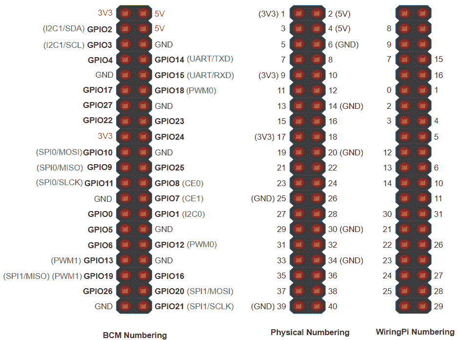
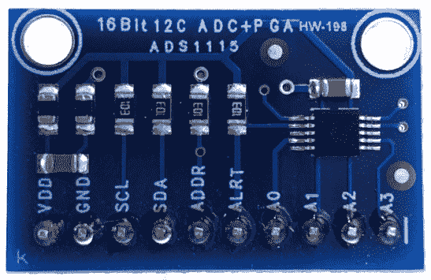
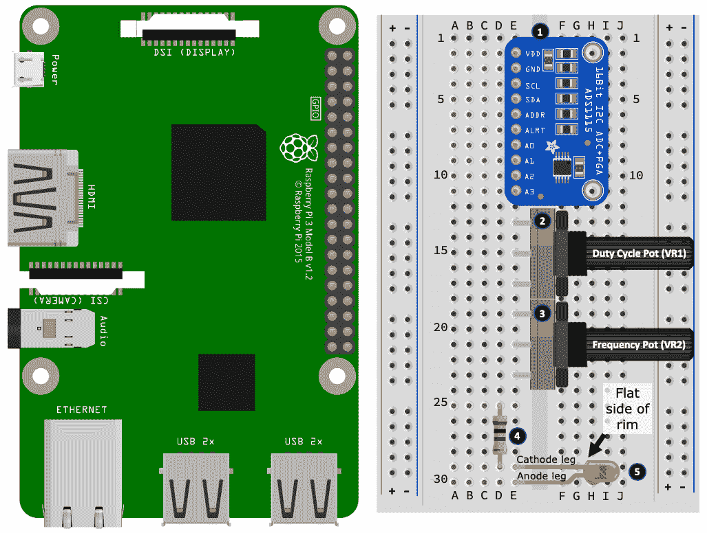
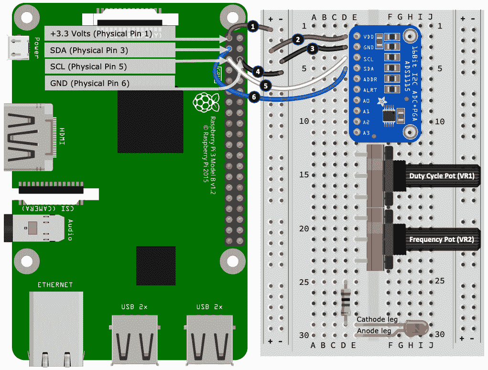
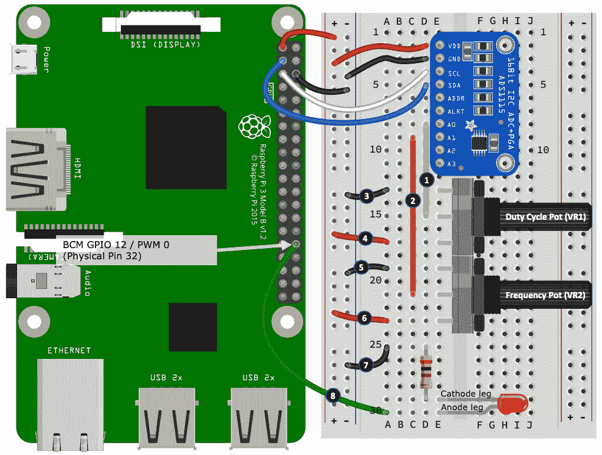
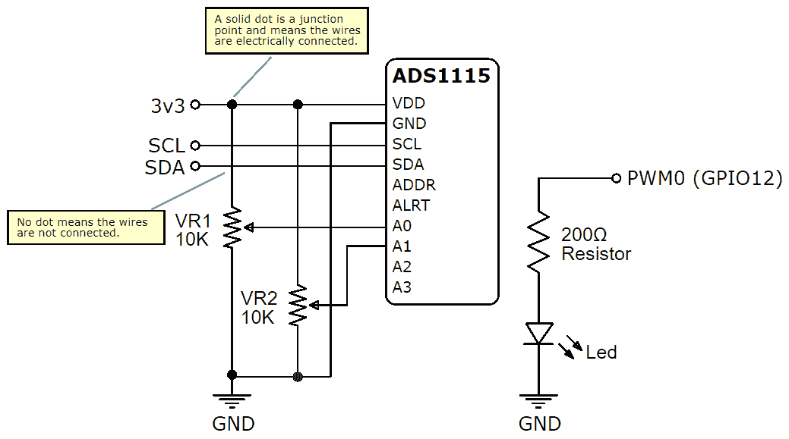
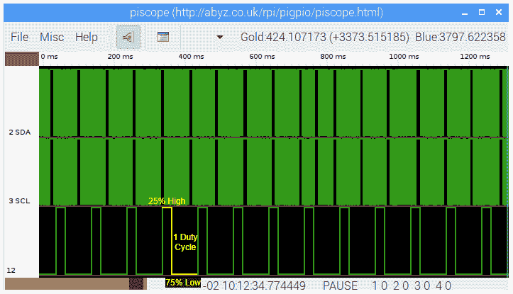
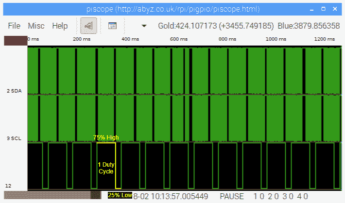

# 第五章：将您的 Raspberry Pi 连接到物理世界

在本章中，我们将探讨与将您的 Raspberry Pi 连接到物理世界相关的硬件和软件概念。我们将介绍由 GPIO 库使用的流行编号方案，以引用您的 Raspberry Pi 上的 GPIO 引脚，并概述流行的 GPIO 库，除了我们在之前章节中使用的 GPIOZero 和 PiGPIO 库。正如我们将会了解的那样，理解 GPIO 编号方案对于确保您理解 GPIO 库如何与 GPIO 引脚一起工作至关重要。

在我们完成对 Raspberry Pi 的许多不同方式进行电子接口的概念概述和讨论之前，我们的旅程还将包括对两个重要的电子概念-**脉宽调制**（**PWM**）和模数转换的详细练习和实际演示。

我们将在本章中涵盖以下主题：

+   理解 Raspberry Pi 引脚编号

+   探索流行的 Python GPIO 库

+   探索 Raspberry Pi 的电子接口选项

+   与模数转换器进行接口

# 技术要求

要执行本章的练习，您需要以下物品：

+   Raspberry Pi 4 Model B

+   Raspbian OS Buster（带桌面和推荐软件）

+   至少 Python 版本 3.5

这些要求是本书中代码示例的基础。可以合理地期望，只要您的 Python 版本是 3.5 或更高，代码示例应该可以在 Raspberry Pi 3 Model B 或 Raspbian OS 的不同版本上无需修改即可运行。

您可以在 GitHub 存储库的以下 URL 中的`chapter05`文件夹中找到本章的源代码：[`github.com/PacktPublishing/Practical-Python-Programming-for-IoT`](https://github.com/PacktPublishing/Practical-Python-Programming-for-IoT)

您需要在终端中执行以下命令来设置虚拟环境并安装本章代码所需的 Python 库：

```py
$ cd chapter05              # Change into this chapter's folder
$ python3 -m venv venv      # Create Python Virtual Environment
$ source venv/bin/activate  # Activate Python Virtual Environment
(venv) $ pip install pip --upgrade        # Upgrade pip
(venv) $ pip install -r requirements.txt  # Install dependent packages
```

以下依赖项是从`requirements.txt`中安装的：

+   **GPIOZero**：GPIOZero GPIO 库（[`pypi.org/project/gpiozero`](https://pypi.org/project/gpiozero)）

+   **PiGPIO**：PiGPIO GPIO 库（[`pypi.org/project/pigpio`](https://pypi.org/project/pigpio)）

+   **RPi.GPIO**：RPi.GPIO 库（[`sourceforge.net/p/raspberry-gpio-python/wiki/Home`](https://sourceforge.net/p/raspberry-gpio-python/wiki/Home)）

+   **ADS1X15**：ADS11x5 ADC 库（[`pypi.org/project/adafruit-circuitpython-ads1x15`](https://pypi.org/project/adafruit-circuitpython-ads1x15)）

除了前述的安装，我们在本章的练习中还需要一些物理电子组件：

+   1 x 5 mm 红色 LED

+   1 x 200 Ω电阻器-其色带将是红色，黑色，棕色，然后是金色或银色

+   1 x ADS1115 ADC 拆分模块（例如，[`www.adafruit.com/product/1085`](https://www.adafruit.com/product/1085)）

+   2 x 10 kΩ电位器（范围在 10K 到 100K 之间的任何值都适用）

+   一个面包板

+   母对母和母对公跳线（也称为杜邦线）

# 理解 Raspberry Pi 引脚编号

到目前为止，您可能已经注意到您的 Raspberry Pi 上有很多引脚突出！自第二章 *使用 Python 和物联网入门*以及所有后续章节中，我们已经通过引用它们来引用这些引脚，例如*GPIO 引脚 23*，但这是什么意思？是时候我们更详细地了解这一点了。

有三种常见的方式可以引用 Raspberry Pi 的 GPIO 引脚，如*图 5.1*所示：



图 5.1 - GPIO 引脚编号方案

在之前的所有章节中，我们一直从 PiGPIO 的角度讨论 GPIO 引脚，它使用**Broadcom**或**BCM**编号方案。BCM 是 Python GPIO 库中最常用的方案，我们将很快讨论的 GPIO 库都专门或默认使用 BCM。然而，了解其他方案的存在是有用的，因为它将有助于阅读或调试您在互联网和其他资源上遇到的代码片段。

GPIO 和引脚这两个术语在识别引脚时可能会被宽泛使用。您需要解释诸如*GPIO 23*或*引脚 23*之类的用语，考虑到它所使用的上下文和方案。

让我们探索这些替代方案，如*图 5.1*所示：

+   **Broadcom/BCM 编号**：这指的是树莓派中 Broadcom 芯片的 GPIO 编号。使用 BCM 编号时，当我们说*GPIO 23*时，我们指的是在 BCM 引脚图中标记为*GPIO 23*。这是我们在本书中使用的方案，用于 GPIOZero 和 PiGPIO 示例。

+   **物理/板/P1 标头**：在这种编号方案中，使用 P1 标头的物理引脚编号，例如，BCM GPIO 23 = 物理引脚 16。

+   **WiringPi**：这是一个名为 WiringPi 的流行的 C GPIO 库，引入了自己的引脚映射方案。由于 WiringPi 的成熟度（有一个 Python 端口），您会不时遇到这个方案——继续我们的例子，BCM GPIO 23 = 物理引脚 16 = WiringPi 引脚 4。

还有其他用于引用引脚和接口的方法和命名，需要注意的包括以下内容：

+   **虚拟文件系统**：在`/sys`上挂载了一个虚拟文件系统，用于一般 GPIO 访问，`/dev/*i2c`用于 I2C，`/dev/*spi*`用于 SPI，`/sys/bus/w1/devices/*`用于 1-wire 设备。

+   **替代引脚功能**：*图 5.1*中的前面的 BCM 图表列出了 GPIO 引脚编号，以及括号中的 PWM0、I2C0 和 SPI0 等替代引脚功能。这些代表了引脚可以执行的基本数字 I/O 之外的替代角色。

+   **总线/通道编号**：对于 SPI 和 I2C 接口以及硬件 PWM，库通常会使用总线或通道编号。例如，我们可以使用 BCM GPIO 18 作为通用数字输入和输出，或者我们可以在其备用功能模式下将其用作 PWM 通道 0 的硬件 PWM 输出。

[pinout.xyz](https://pinout.xyz)网站是一个探索引脚命名、替代功能和方案映射的好资源。

现在您已经了解了在树莓派上引用 GPIO 引脚可以使用的不同方案。虽然 BCM 方案往往是基于 Python 的 GPIO 库中最常见和通用的方案，但绝对不能假设一个 GPIO 库、代码示例，甚至是您正在使用的面包板布局或原理图图使用 BCM 方案来引用 GPIO 引脚。代码中使用的方案与用于将电子设备连接到树莓派的 GPIO 引脚的方案之间的不匹配是导致电路无法工作的常见错误。

我经常看到人们（我自己也这样做过！）在他们的电路与他们在网上找到的代码示例不匹配时，责怪他们的接线或认为电子元件必须是有故障的。作为诊断的第一步，请检查代码使用的引脚编号方案是否与您用来连接树莓派的 GPIO 引脚的方案相匹配。

现在我们了解了不同 GPIO 编号方案的使用和重要性，让我们继续并审查流行的 Python GPIO 库。

# 探索流行的 Python GPIO 库

如果你和我一样，当你第一次开始使用树莓派时，你可能只是想控制*东西*。如今，对于许多开发人员来说，使用树莓派进行物理计算的第一步将是通过官方树莓派网站和 GPIOZero 库。然而，当你玩弄按钮、LED 和电机等简单电子设备一段时间后，你可能会想要进行更复杂的接口。如果你已经迈出了这一步，或者即将迈出这一步，你可能会发现自己处于 GPIO 库和选项的令人困惑的世界。本节旨在通过介绍更受欢迎的选项来帮助你在这条道路上导航。

我在[`10xiot.com/gpio-comp-table`](https://10xiot.com/gpio-comp-table)上维护了一个 Python GPIO 库的摘要和比较表（包括以下部分未列出的其他库）。

我们将从 GPIOZero 开始对 GPIO 库进行概述。

## 审查 GPIOZero-初学者的简单接口

GPIOZero 库的重点是简单性，使其成为初学者进入物理计算和接口电子设备的无忧库。它通过抽象化底层技术复杂性来实现易用性，并允许您编写处理*设备*和*外围设备*（如 LED、按钮和常见传感器）的代码，而不是编写直接管理引脚的低级别代码。

从技术上讲，GPIOZero 实际上并不是一个完整的 GPIO 库，它是围绕其他用于执行实际 GPIO grunt 工作的 GPIO 库的简化包装器。在第二章中，*使用 Python 和 IoT 入门*，我们看到了在 GPIOZero 和 PiGPIO 中的一个按钮和 LED 示例，说明了这一点。

以下是 GPIOZero 的主要亮点：

+   **描述**：为初学者设计的高级 GPIO 库

+   **优点**：易于学习和使用，具有出色的文档和许多示例

+   **缺点**：在简单的电子接口之外的用途上有限

+   **网站**：[`gpiozero.readthedocs.io`](https://gpiozero.readthedocs.io/)

接下来，我们将审查 RPi.GPIO，一个流行的低级 GPIO 库。

## 审查 RPi.GPIO-初学者的低级 GPIO

我们之前提到，GPIOZero 的本质是编写处理设备和组件的代码。而 RPi.GPIO 采用了一种不同且更经典的方法，我们编写的代码直接与 GPIO 引脚进行交互和管理。RPi.GPIO 是树莓派和电子学的流行低级介绍，因此您会发现许多使用它的示例在互联网上。

GPIOZero 文档中有一个关于 RPi.GPIO 的很好的部分，其中它解释了在 GPIOZero 和 RPi.GPIO 中等效的代码示例。这是一个很好的资源，可以开始学习更低级别的引脚级编程概念。

还有一个名为 RPIO 的库，它被创建为 RPi.GPIO 的性能替代品。RPIO 目前没有维护，并且不适用于树莓派 3 或 4 型号。

以下是 RPI.GPIO 的主要亮点：

+   **描述**：轻量级低级 GPIO

+   **优点**：成熟的库，在互联网上可以找到许多代码示例

+   **缺点**：轻量级意味着它不是面向性能的库，没有硬件辅助的 PWM

+   **网站**：[`pypi.python.org/pypi/RPi.GPIO`](https://pypi.python.org/pypi/RPi.GPIO)

接下来，我们将看一看另一个用于控制复杂设备的高级库。

## 审查 Circuit Python 和 Blinka-用于复杂设备的接口

Blinka 是 Circuit Python（[circuitpython.org](http://circuitpython.org/)）的 Python 兼容层，这是专为微控制器设计的 Python 版本。它由电子公司 Adafruit 创建和支持，该公司分发许多电子扩展板和小工具。Adafruit 为其许多产品系列提供高质量的 Circuit Python 驱动程序，基本上延续了 GPIOZero 易用性的理念，适用于更复杂的设备。

在本章的后面，我们将使用 Blinka 和 Circuit Python 驱动程序库来为我们的 Raspberry Pi 添加模拟到数字功能，以使用 ADS1115 ADC 扩展模块。

以下是 Blinka 的主要亮点：

+   **摘要**：用于控制复杂设备的高级库

+   **优点**：无论您的经验水平如何，都可以轻松使用支持的设备

+   **缺点**：对于基本 IO，它使用 RPi.GPIO，因此具有相同的基本限制

+   **网站**：[`pypi.org/project/Adafruit-Blinka`](https://pypi.org/project/Adafruit-Blinka/)

接下来，我们将介绍 Pi.GPIO，一个功能强大的低级 GPIO 库。

## 回顾 PiGPIO - 低级 GPIO 库

在功能和性能方面，PiGPIO 被认为是树莓派最完整的 GPIO 库选项之一。其核心是用 C 实现的，并且有一个官方的 Python 端口可用。

从架构上讲，PiGPIO 由两部分组成：

+   **pigpiod 守护程序服务**提供对底层 PiGPIO C 库的套接字和管道访问。

+   **PiGPIO 客户端库**使用套接字或管道与 pigpiod 服务进行交互。正是这种设计使得 PiGPIO 可以通过网络实现远程 GPIO 功能。

以下是 PiGPIO 的主要亮点：

+   **描述**：高级低级 GPIO 库

+   **优点**：提供了许多功能

+   **缺点**：需要额外的设置；简单的文档假设了对底层概念的了解

+   **网站（Python 端口）**：[`abyz.me.uk/rpi/pigpio/python.html`](http://abyz.me.uk/rpi/pigpio/python.html)

在我们继续下一个库之前，我想提醒您一个这个库独有且非常有用的功能 - 远程 GPIO。

### 使用 PiGPIO（和 GPIOZero）探索远程 GPIO

一旦您在树莓派上启动了 pigpiod 服务（在*第一章 设置您的开发环境*中介绍），有两种方法可以使您的代码远程运行，通过远程，我的意思是您的程序代码可以在任何计算机上运行（不仅仅是树莓派），并控制远程树莓派的 GPIO。

**方法 1**：此方法涉及将远程树莓派的 IP 或主机地址传递给 PiGPIO 构造函数。使用这种方法，您还可以通过创建额外的`pigpio.pi()`实例来与多个树莓派 GPIO 进行接口。例如，在以下示例中，对`pi`实例调用的任何方法将在运行 pigpiod 服务的`192.168.0.4`主机上执行：

```py
# Python Code.
pi = pigpio.pi('192.168.0.4', 8888) # Remote host and port (8888 is default if omitted)
```

**方法 2**：第二种方法涉及在计算机上设置环境变量并运行您的 Python 代码（您的 Python 代码只需要使用默认的 PiGPIO 构造函数，`pi = pigpio.pi()`）：

```py
# In Terminal
(venv) $ PIGPIO_ADDR="192.168.0.4" PIGPIO_PORT=8888 python my_script.py
```

远程 GPIO 可以成为一个很好的开发辅助工具，但会增加代码与 GPIO 引脚交互的延迟，因为数据通过网络传输。这意味着它可能不适用于非开发版本。例如，按钮按下可能感觉不够灵敏，对于需要快速定时的用例，远程 GPIO 可能不切实际。

您可能还记得第二章 *使用 Python 和物联网入门*中提到，GPIOZero 可以使用 PiGPIO *引脚工厂*，当这样做时，GPIOZero 自动获得免费的远程 GPIO 功能！

最后，因为这是 PiGPIO 库的一个独特特性，如果我们想要远程 GPIO 功能，所有的代码都必须使用这个库。如果你安装第三方 Python 库来驱动一个电子设备，并且它使用（例如）RPi.GPIO，这个设备就不支持远程 GPIO。

接下来，我们将看一下两个常见的用于 I2C 和 SPI 通信的低级库。

## 审查 SPIDev 和 SMBus - 专用的 SPI 和 I2C 库

当使用 I2C 和 SPI 设备时，你将会遇到 SPIDev 和 SMBus 库（或类似的替代品）。SPIDev 是一个用于 SPI 通信的流行的低级 Python 库，而 SMBus2 是一个用于 I2C 和 SMBus 通信的流行的低级 Python 库。这两个库不是通用库，不能用于基本的数字 IO 引脚控制。

当开始时，你不太可能直接使用这些 I2C 或 SPI 库。相反，你将使用更高级的 Python 库来处理 SPI 或 I2C 设备，而这些库在底层会使用这些低级库来与物理设备进行通信。

以下是 SPIDev 和 SMBus2 的主要亮点：

+   **描述**：这些是用于 SPI 和 I2C 接口的低级库。

+   **优点**：使用低级库可以完全控制 SPI 或 I2C 设备。许多高级便利包只暴露最常用的功能。

+   **缺点**：利用这些低级库需要你解释和理解如何使用低级数据协议和位操作技术与电子设备进行接口。

+   **SPIDev 网站**：[`pypi.org/project/spidev`](https://pypi.org/project/spidev/)

+   **SMBus2 网站**：[`pypi.org/project/smbus2`](https://pypi.org/project/smbus2/)

为了完成关于 GPIO 库的部分，让我简要讨论一下为什么这本书主要基于 PiGPIO 库。

## 为什么 PiGPIO？

你可能会想知道，为什么在所有的选择中，我选择在这本书中主要使用 PiGPIO。作为这本书的读者，我假设你在编程和技术概念方面有很好的基础，并且使用和学习 PiGPIO 这样的库不会超出你的能力范围。如果你打算在 Python 中构建更复杂的物联网项目，并超越 GPIOZero 和 RPi.GPIO 提供的基础知识，PiGPIO 是一个全面的库。

你会发现 PiGPIO 的 API 和文档被分为初学者、中级和高级部分，因此在实践和学习过程中，你可以根据自己的经验水平和需求混合使用库的 API。

我们已经完成了对几种流行的 GPIO 库的探索，并审查了它们的基本架构和设计。接下来，我们将把注意力转向通过其他方法连接和控制树莓派上的电子设备。

# 探索树莓派的电子接口选项

我们刚刚涵盖了 GPIO 的软件部分，现在我们将把注意力转向电子方面。树莓派提供了许多标准的接口方式，可以连接简单和复杂的电子设备。通常，你的电子元件和模块的选择将决定你需要使用哪种接口技术，有时你可能会有选择的余地。

无论你是否有选择，你对不同选项的了解将帮助你理解电路及其相应代码背后的原因，并帮助你诊断和解决可能遇到的任何问题。

在接下来的部分中，我们将探索概念，然后进行实际练习。我们将从数字 IO 开始。

## 理解数字 IO

树莓派的每个 GPIO 引脚都可以执行数字输入和输出。数字简单地意味着某物要么完全开启，要么完全关闭——没有中间状态。在之前的章节中，我们一直在处理简单的数字 IO：

+   我们的 LED 要么是开启的，要么是关闭的。

+   我们的按钮要么被按下（开启），要么未被按下（关闭）。

您将遇到几个可互换使用的术语来描述数字状态，包括以下内容：

+   开 = 高 = 真 = 1

+   关闭 = 低 = 假 = 0

数字 IO 是一种基本 IO 形式。模拟 IO 是另一种，因此我们将在下面探讨它。

## 理解模拟 IO

而数字处理完全开启和关闭状态，模拟处理程度——开启、关闭或介于两者之间。想象一下你家里的窗户。在数字世界中，它可以完全打开（数字高）或完全关闭（数字低）；然而，在现实中，它是模拟的，我们可以将其打开到完全关闭和完全打开之间的某个位置，例如，打开四分之一。

模拟电子元件的简单和常见示例包括以下内容：

+   **电位器（也称为旋钮）**：这是一个产生一系列电阻值的旋钮或滑块。现实世界的例子包括音量控制和加热器恒温控制。

+   **光敏电阻（LDR）**：这些是用于测量光照水平的电子元件，您会在自动夜灯中找到它们。

+   **热敏电阻**：这些是用于测量温度的电子元件，您可能会在加热器、冰箱或任何需要测量温度的地方找到它们。

树莓派没有模拟 IO 功能，因此我们需要使用外部电子设备，称为**模数转换器**（**ADC**）来读取模拟输入，这将是本章后面一个实际示例的核心重点，标题为*与模数转换器进行接口*。

要输出模拟信号，我们有两个选择——要么使用**数模转换器**（**DAC**），要么使用称为 PWM 的数字技术从数字输出产生类似模拟的信号。我们不会在本书中涵盖 DAC，但是我们将深入探讨 PWM，接下来我们将进行。

## 理解**脉宽调制**

**脉宽调制**或**PWM**是一种通过快速脉冲引脚的开和关来产生介于完全开启（高电平）和完全关闭（低电平）之间的平均电压的技术。通过这种方式，它有点像从数字引脚提供伪模拟输出，并且用于各种控制应用，例如改变 LED 的亮度、电机速度控制和舵机角度控制。

PWM 由两个主要特征定义：

+   **占空比**：引脚高电平的时间百分比

+   **频率**：占空比重复的时间周期

如*图 5.2*所示（对于固定频率），50%的占空比意味着引脚高电平占一半时间，低电平占一半时间，而 25%的占空比意味着引脚只有 25%的时间是高电平。虽然没有画出来，0%的占空比意味着引脚高电平占 0%的时间（始终低电平），因此实际上是关闭的，而 100%的占空比则始终是高电平：


图 5.2 - PWM 占空比上述图表摘自[`en.wikipedia.org/wiki/File:Duty_Cycle_Examples.png`](https://en.wikipedia.org/wiki/File:Duty_Cycle_Examples.png)，作者为 Thewrightstuff。它属于 CC BY-SA 4.0：[`creativecommons.org/licenses/by-sa/4.0/deed.en`](https://creativecommons.org/licenses/by-sa/4.0/deed.en)。

在树莓派上使用 PWM 很容易，尽管有其他方法可以创建 PWM 信号，我们将在下面看到。

### 创建 PWM 信号

不同的 GPIO 库以不同的方式生成 PWM 信号。三种常见的技术如下：

+   **软件 PWM**：PWM 信号的频率和占空比定时由代码生成，并且可以在任何 GPIO 引脚上使用。这是创建 PWM 信号的最不准确的方法，因为定时可能会受到繁忙的树莓派 CPU 的不利影响。

+   **硬件定时 PWM**：使用 DMA 和 PWM/PCM 硬件外设进行 PWM 定时。它非常精确，并且适用于任何 GPIO 引脚。

+   **硬件 PWM**：硬件 PWM 完全通过硬件提供，并且是创建 PWM 信号的最准确的方法。树莓派有两个专用的硬件 PWM 通道，通过 GPIO 引脚 18 和 12 标记为 PWM0，通过 GPIO 引脚 13 和 19 标记为 PWM1（参见*图 5.1*）。

仅仅连接到 GPIO 12、13、18 或 19 并不能获得硬件 PWM。这些 GPIO 是 BCM GPIO，其*替代*功能列出了 PWM。如果要使用硬件 PWM，必须满足两个基本要求。首先，您使用的 GPIO 库必须支持硬件 PWM。其次，您必须正确使用库及其硬件 PWM 功能，这将在库的 API 文档中详细说明。共享相同硬件 PWM 通道的引脚将获得相同的占空比和频率，因此虽然有四个硬件 PWM 引脚，但只有两个唯一的 PWM 信号。

要使用哪种 PWM 技术将始终取决于您要构建的内容以及 PWM 信号需要多精确。有时，您将直接控制您的项目使用的 GPIO 库（因此 PWM 技术），而其他时候——特别是在使用第三方更高级的 Python 库时——您将被迫使用库开发人员使用的任何 PWM 技术。

一般规则是，当我控制 GPIO 库选择时，尽可能避免使用软件 PWM。如果我使用 PiGPIO 进行开发，那么我更倾向于使用硬件定时 PWM，因为我可以在任何 GPIO 引脚上使用它。

关于我们之前介绍的 GPIO 库，它们对 PWM 的支持如下：

+   **GPIOZero**：继承自其引脚工厂实现的 PWM 方法

+   **RPi.GPIO**：仅支持软件 PWM

+   **PiGPIO**：硬件定时 PWM 和硬件 PWM

+   **Blinka**：仅支持硬件 PWM

您可以连接外部硬件 PWM 模块到您的树莓派（通常通过 I2C），这将给您更多的硬件 PWM 输出。

现在我们已经看到了 PWM 信号可以被创建的三种方式，接下来我们将看 SPI、I2C 和 1-wire 接口。

## 理解 SPI、I2C 和 1-wire 接口

**串行外围接口电路**（**SPI**）、**I2C**和 1-wire 是标准化的通信接口和协议，允许非平凡的电子设备进行通信。这些协议可以直接通过一些操作和数学运算来使用，也可以通过使用更高级的 Python 驱动程序模块间接地与电子外围设备一起工作，后者对于一般用途更为常见。

通过这些协议工作的设备的示例包括以下内容：

+   模数转换器（SPI 或 I2C）

+   LED 灯带和 LCD 显示器（SPI 或 I2C）

+   环境传感器，如温度传感器（1-wire）

本章稍后我们将更详细地探讨 I2C，当我们连接模数转换器到树莓派时。

最后，我们有串行通信和 UART。

## 理解串行/UART 协议

**通用异步收发器**（**UART**）是一种已经存在很长时间并且在 USB 普及之前广泛使用的串行通信协议。UART 实际上是指用于实现串行协议的电子硬件，尽管它也可以在纯软件中实现。

今天，SPI 或 I2C 往往优先于 UART。GPS 接收器是串行通信仍然普遍存在的一个常见例子。如果您曾经将 Arduino 连接到 PC 进行烧录或调试，那么设备使用的是串行通信协议，Arduino 中存在 UART 硬件。

我们现在已经学会了许多标准的方法，可以用来将电子设备与树莓派进行接口连接，包括模拟和数字电子、PWM、I2C 和 SPI 等线路协议以及串行通信。随着我们在本书中的继续，我们将开始看到许多这些接口选项的实际应用，并了解哪种类型的接口适用于哪种类型的电子设备。

接下来，我们将通过向树莓派添加模数转换器来看一下本章我们已经涵盖的一些概念。

# 与模数转换器进行接口连接

恭喜您走到了这一步。我猜想您在阅读了这么多之后迫不及待地想要开始编写一些代码了！

现在我们将改变步调，并应用我们刚刚学到的知识，向您的树莓派添加一个 ADS1115 模数转换器。一个典型的 ADS1115 分立模块的示例如下图所示：



图 5.3 - ADS1115 分立模块

ADC 是一个非常方便的附加功能，因为这样就可以让您接触到模拟元件和设备的世界，否则这些设备是无法与树莓派一起使用的。

作为这个实际练习的一部分，我们将连接两个电位器（也称为电位器）到 ADS1115，并在 Python 中读取它们的值。我们将使用这些值来通过改变其占空比和频率来创建 PWM 信号。我们将通过观察它如何影响 LED 以及波形在一个名为 PiScope 的程序中如何变化来看到改变这些参数的效果，这是 PiGPIO 系列实用程序的一部分。

我们将在第六章 *软件工程师的电子学 101*中更详细地讨论电位器。

为了进行以下练习，请记住我们需要本章开头列出的电子元件，包括 ADS1115 分立模块。ADS1115 是一种常见且功能强大的模数转换器，它使用 I2C 连接到其主设备（在我们的案例中是树莓派）。

以下是我们从其数据表中提取的 ADS1115 的核心规格，这些规格是我们练习所需的：

+   **工作电压**：2 至 5 伏特（所以我们知道它将与树莓派的 3.3 伏逻辑兼容）

+   **接口**：I2C

+   **默认 I2C 地址**：0x48

ADS1115 上的端子如下：

+   **Vcc & GND**：设备的电源。

+   **SCL**：时钟信号，用于同步主从之间的通信。

+   **SDA**：数据信号，用于在树莓派和 ADS1115 之间发送数据。

+   **ADDR**：如果需要，此端子可用于更改默认地址。

+   **ALTR**：高级用途的警报信号（我们不需要这个）。

+   **A0** - **A3**：模拟输入通道（我们将把电位器连接到 A0 和 A1）。

在继续之前，请确保您的树莓派上已启用 I2C 接口。我们在第一章 *设置您的开发环境*中介绍了启用接口（包括 I2C）的步骤。

首先，让我们从在面包板上构建我们需要的电路开始。

## 构建 ADS1115 ADC 电路

让我们为本章的练习建立我们的面包板电路。我们将分步构建我们的电路，首先放置核心元件，如下图所示：



图 5.4 - 面包板 ADC 电路（3 部分之一）面包板上离散元件和导线的整体布置和放置并不是特别重要。然而，元件和导线之间创建的连接非常重要！如果您需要关于面包板、它们的工作原理以及最重要的是孔如何电气连接的复习，请参阅第二章 *Python 和物联网入门*。

以下是如何在面包板上布置组件的方法。以下步骤编号与*图 5.4*中编号的黑色圆圈相匹配：

1.  将 ADS1115 放在面包板上。

1.  将电位器 VR1 放在面包板上。所示的电位器是全尺寸电位器。如果您有不同尺寸的电位器，它们的引脚配置可能跨越较少的面包板孔。

1.  将电位器 VR2 放在面包板上。

1.  将电阻放在面包板上。

1.  将 LED 放在面包板上，注意确保其阴极腿与电阻共享同一行（在 D29 和 E29 孔上说明）。

接下来，我们将按照以下方式连接 ADS1115：

图 5.5 - 面包板 ADC 电路（第二部分）

以下是要遵循的步骤。这次，以下步骤编号与*图 5.5*中编号的黑色圆圈相匹配：

1.  将树莓派的+3.3 伏引脚连接到面包板的正电源轨。

1.  将 ADS1115 上的 VDD 端子连接到面包板的正电源轨。

1.  将 ADS1115 上的 GND 端子连接到面包板的负电源轨。

1.  将树莓派的 GND 引脚连接到面包板的负电源轨。

1.  将树莓派上的 SCL 引脚连接到 ADS1115 上的 SCL 端子。

1.  将树莓派上的 SDA 引脚连接到 ADS1115 上的 SDA 端子。

最后，我们将 LED、电阻和电位器连接起来，如下图所示：

图 5.6 - 面包板 ADC 电路（第三部分） 

以下是要遵循的步骤。这次，以下步骤编号与*图 5.6*中编号的黑色圆圈相匹配：

1.  将 ADS1115 上的 A0 端子连接到电位器 VR1 的中间腿。

1.  将 ADS1115 上的 A1 端子连接到电位器 VR2 的中间腿。

1.  将电位器 VR1 的上腿连接到面包板的负电源轨。

1.  将电位器 VR1 的下腿连接到面包板的正电源轨。

1.  将电位器 VR2 的上腿连接到面包板的负电源轨。

1.  将电位器 VR2 的下腿连接到面包板的正电源轨。

1.  将电阻的上腿连接到面包板的负电源轨。

1.  将 LED 的阳极腿连接到树莓派的 BCM GPIO 12 / PWM 0 上。

干得好！您现在已经完成了这个电路。供您参考，*图 5.7*显示了描述面包板电路的语义图。

作为提醒，我们在第二章中介绍了如何阅读语义图的示例，*Python 和物联网入门*。

我鼓励您在参考面包板布局时围绕这个语义图进行追踪，以了解图表上的线条和标签如何与面包板上的组件和导线相关联。投资时间来理解成对的原理图和面包板电路如何相互关联将有助于增强您直接从原理图创建面包板布局的能力：



图 5.7 - ADC 电路语义图

电路完成后，让我们检查一下树莓派是否能够看到 ADS1115。

## 确保 ADS1115 已连接到您的树莓派

I2C 设备通过唯一地址（即我们的树莓派）标识其主设备，并且 ADS1115 的默认地址为 0x48。由于 I2C 设备是有地址的，多个设备可以共享树莓派上的相同 I2C 通道（引脚）。

如果有多个设备共享相同地址，您可以更改大多数 IC2 设备上的 I2C 设备。这是 ADS1115 上的 ADDR 端子的目的，您可以在 ADS1115 数据表中找到其使用说明。

Raspbian OS 包含`i2cdetect`实用程序，用于查询树莓派的 I2C 接口以查找连接的设备。在终端中运行以下命令：

```py
$ i2cdetect -y 1
```

`-y`选项假设我们对任何提示都回答是。`1`是 I2C 总线号。在树莓派 3 或 4 上始终是`1`。我们期望看到这样的输出：

```py
     0  1  2  3  4  5  6  7  8  9  a  b  c  d  e  f
 00:          -- -- -- -- -- -- -- -- -- -- -- -- --
 10: -- -- -- -- -- -- -- -- -- -- -- -- -- -- -- --
 20: -- -- -- -- -- -- -- -- -- -- -- -- -- -- -- --
 30: -- -- -- -- -- -- -- -- -- -- -- -- -- -- -- --
 40: -- -- -- -- -- -- -- -- 48 -- -- -- -- -- -- --
 50: -- -- -- -- -- -- -- -- -- -- -- -- -- -- -- --
 60: -- -- -- -- -- -- -- -- -- -- -- -- -- -- -- --
 70: -- -- -- -- -- -- -- --
```

我们看到`48`（十六进制地址）表明我们的树莓派已经检测到了 ADS1115。如果您没有得到这个结果，请检查您的接线，并确保 I2C 已经按照第一章中描述的方式启用。

现在我们已经验证了我们的 ADS1115 对我们的树莓派是可见的，让我们继续读取两个电位器作为模拟输入。

## 使用 ADS1115 读取模拟输入

现在我们已经将我们的 ADS1115 连接到我们的树莓派，是时候学习如何使用它来读取模拟值，特别是我们两个电位器产生的模拟值。我们很快将使用这些模拟值来产生 PWM 信号，进而控制 LED 的亮度。

我们即将涵盖的代码可以在文件`chapter05/analog_input_ads1115.py`中找到。请在继续之前查看此文件。

1.  在终端中运行程序：

```py
(venv) $ python analog_input_ads1115.py
```

1.  您应该收到类似以下内容的输出流（您的值和伏特数将不同）：

```py
 Frequency Pot (A0) value=3 volts=0.000 Duty Cycle Pot (A1) value= 9286 volts=1.193
 Frequency Pot (A0) value=3 volts=0.000 Duty Cycle Pot (A1) value= 9286 volts=1.193
 ...truncated...
```

1.  转动两个电位器并观察输出的变化-具体来说，您会注意到报告的值和伏特数会发生变化。值和电压将在以下范围内：

+   +   值范围在 0 到 26294 之间（或附近）

+   电压范围在 0 到 3.3 伏特（或附近）

输出将如下所示：

```py
 Frequency Pot (A0) value=3 volts=0.000 Duty Cycle Pot (A1) value= 9286 volts=1.193
 Frequency Pot (A0) value=4 volts=0.001 Duty Cycle Pot (A1) value=26299 volts=3.288
 ...truncated...
```

正如我们将在第六章中讨论的那样，*软件工程师的电子学 101*，模拟输入是关于读取电压的，就我们这里而言，电压在 0 伏特/GND（我们的参考电压）和+3.3 伏特之间。整数值是 ADS1115 的原始输出，它的最大值取决于 ADS1115 IC 的配置方式（我们使用默认配置）。电压值是根据 ADS1115 配置的数学计算得出的。如果您感兴趣，所有细节都在 ADS1115 数据表和库源代码中。

在高级 ADC 库的表面下，许多低级设置会影响 ADC 芯片的工作方式（只需查看其数据表）。不同的库作者可能以不同的方式实现这些设置，或者使用不同的默认设置。实际上，这意味着相同 ADC 的两个库可能输出不同的原始值（有些库甚至可能不会向程序员提供这个值）。因此，永远不要假设预期的原始输出值是什么，而是依靠电压测量，这总是真相的来源。

当您调整两个电位器时，如果确切的范围末端与 0 和 3.3 伏特不完全匹配，或者值随机地微微抖动，不要担心。当我们处理模拟电子时，这种模糊的结果是预期的。

接下来，我们将检查代码。

### 理解代码

现在我们已经看到了 ADS1115 ADC 的基本操作，是时候看一下相应的代码，了解我们如何在 Python 中查询 ADS1115 以获取模拟读数。我们下面学到的内容将为本书的*第三部分*中我们将看到的模拟接口程序奠定基础。

我们将从导入开始我们的代码漫步。

#### 导入

我们可以用两种方法在树莓派上使用 ADS1115 与 Python：

+   阅读 ADS1115 数据表，并使用较低级别的 I2C，如 SMBus 来实现设备使用的数据协议。

+   找到一个现成的 Python 库，通过 PyPi 可以使用`pip`安装。

有几个现成的 Python 模块可用于与 ADS1115 一起使用。我们使用了通过`requirement.txt`在本章开始时安装的 Adafruit Binka ADS11x5 ADC 库：

```py
import board                                      # (1)
import busio
import adafruit_ads1x15.ads1115 as ADS
from adafruit_ads1x15.analog_in import AnalogIn
```

从第 1 行开始，我们看到了来自 Circuit Python（Blinka）的`board`和`busio`导入，而以`adafruit`开头的最后两个导入来自 Adafruit ADS11x5 ADC 库，并用于配置 ADS1115 模块并读取其模拟输入，我们将在下面看到。

#### ADS1115 设置和配置

在以下代码块的第 2 行，我们使用`busio`导入来创建一个与 Circuit Python/Blika 的 I2C 接口。`board.SLC`和`board.SDA`参数表示我们正在使用树莓派上的专用 I2C 通道（GPIO 2 和 3 的替代功能）：

```py
# Create the I2C bus & ADS object.
i2c = busio.I2C(board.SCL, board.SDA)      # (2)
ads = ADS.ADS1115(i2c)
```

接下来，我们使用预配置的 I2C 接口创建`ADS.ADS1115`的实例，并将其分配给`ads`变量。从此刻起，在代码中，当我们与 ADS1115 模块交互时，我们将使用这个实例。

接下来，让我们考虑全局变量。

#### 全局变量

在以下代码片段的第 3 行，我们从几个准常量开始，定义了我们希望通过模拟输入接收的最大和最小电压。当您之前运行代码时，您的端电压范围可能并不完全是 0 和 3.3 伏特。这种情况是可以预期的，并且可能会使程序感觉像电位器无法达到其旋转的端点。`A_IN_EDGE_ADJ`的值用于在代码中进行补偿。我们将在下一节重新访问这个变量：

```py
A_IN_EDGE_ADJ = 0.002                     # (3)
MIN_A_IN_VOLTS = 0 + A_IN_EDGE_ADJ
MAX_A_IN_VOLTS = 3.3 - A_IN_EDGE_ADJ
```

接下来，从第 4 行开始，我们创建了两个与连接到我们的电位器的 ADS1115 的`A0`和`A1`输入相关的`AnalogIn`实例。通过这些变量，我们确定用户旋转了我们的频率和占空比电位器的程度：

```py
frequency_ch = AnalogIn(ads, ADS.P0)  #ADS.P0 --> A0    # (4)
duty_cycle_ch = AnalogIn(ads, ADS.P1) #ADS.P1 --> A1
```

接下来，我们来到程序的入口点，我们将在这里读取我们的模拟输入。

#### 程序入口点

我们的程序不断循环，读取每个电位器的模拟输入值，并将格式化输出打印到终端。

在第 5 行，我们看到如何使用`frequency_ch.value`访问频率电位器的整数值，并使用`frequency_ch.voltage`访问电压值：

```py
if __name__ == '__main__':
   try:
       while True: 
           output = ("Frequency Pot (A0) value={:>5} volts={:>5.3f} "
                     "Duty Cycle Pot (A1) value={:>5} volts={:>5.3f}")
           output = output.format(frequency_ch.value,          # (5)
                                  frequency_ch.voltage,
                                  duty_cycle_ch.value,
                                  duty_cycle_ch.voltage)
           print(output)
           sleep(0.05)
   except KeyboardInterrupt:
       i2c.deinit()                                            # (6)
```

最后，请注意程序被包裹在一个 try/except 块中，以捕获*Ctrl* + *C*，以便我们可以使用`i2c.deinit()`进行清理。

现在我们已经看到如何使用 ADS1115 读取模拟输入，接下来，我们将集成 LED。

## 使用 PWM 控制 LED

现在我们将 LED 添加到代码中，只是我们将以与之前章节不同的方式进行。此练习中 LED 的目的是为了直观地看到改变 PWM 的占空比和频率特性的效果。我们将使用两个电位器的模拟输入来定义 PWM 的占空比和频率。

本节讨论的代码扩展了我们刚刚在`chapter05/analog_input_ads1115.py`中涵盖的模拟代码示例，以使用 PiGPIO 创建硬件 PWM 信号。

本书提供了另外两个源代码文件，分别使用 PiGPIO 实现硬件定时 PWM 和使用 RPi.GPIO 实现软件 PWM：

+   `chapter05/pwm_hardware_timed.py`

+   `chapter05/pwm_software.py`

他们的整体代码类似，不同之处在于用于调用 PWM 的方法和输入参数。我们将在接下来的部分再次访问这些文件，*可视化软件和硬件定时 PWM*。

我们即将讨论的代码可以在`chapter05/pwm_hardware.py`文件中找到。请在继续之前查看此文件：

1.  在终端中运行程序并观察输出：

```py
(venv) $ python pwm_hardware.py
Frequency 0Hz Duty Cycle 0%
... truncated ...
Frequency 58Hz Duty Cycle 0%
Frequency 59Hz Duty Cycle 0%
... truncated ...
```

1.  调整电位器，直到频率读取为 60 赫兹，占空比读取为 0%。LED 不应点亮。LED 未点亮是因为占空比为 0%，因此 GPIO 12（PWM0）始终为低电平。非常缓慢地转动占空比电位器以增加占空比，并观察 LED 缓慢增加亮度。在 100%的占空比下，GPIO 12（PWM0）始终为高电平 100%的时间，LED 处于全亮状态。

如果您发现终端上打印的占空比在 Pot 移动范围的任一端都没有达到 0%或 100%，请尝试增加代码中`A_IN_EDGE_ADJ`的值（首先尝试+0.02）。如果您在频率范围和刻度上遇到类似问题，也可以调整此参数。

1.  旋转占空比刻度，直到它显示小于 100%（例如 98%），然后调整频率刻度。LED 以这个频率闪烁。当你将频率降低到零时，LED 会闪烁得更慢。对于大多数人来说，在大约 50-60 赫兹时，LED 会闪烁得如此之快，以至于它看起来就像是一直开着。请记住，如果占空比为 0%或 100%，频率刻度不起作用！这是因为在占空比的任一端，PWM 信号完全关闭或打开——它不是脉冲，因此频率没有意义。

让我们来检查一下让这个工作的代码。

### 理解代码

这个示例使用了 PiGPIO 提供的硬件 PWM 功能。与我们之前的示例相同，ADS1115 相关的代码也是一样的，所以我们不会在这里再次介绍它。我们将首先看看额外的全局变量。

#### 全局变量

在以下代码块的第 1 行和第 2 行，我们定义了两个变量，用于最小和最大占空比和频率值。这些值来自 PiGPIO `hardware_PWM()`方法的 API 文档，我们很快就会看到它们的使用：

```py
MIN_DUTY_CYCLE = 0            # (1)
MAX_DUTY_CYCLE = 1000000
MIN_FREQ = 0                  # (2)
MAX_FREQ = 60 *# max 125000000*
```

我们已经将`MAX_FREQ`限制为 60 赫兹，以便我们的肉眼可以观察 LED 的效果。

接下来，我们有一个自定义函数来映射值范围。

#### 范围映射函数

在第 3 行，我们有一个名为`map_value()`的函数：

```py
def map_value(in_v, in_min, in_max, out_min, out_max):           # (3)
    *"""Helper method to map an input value (v_in)
       between alternative max/min ranges."""* v = (in_v - in_min) * (out_max - out_min) / (in_max - in_min) + out_min
    if v < out_min: v = out_min elifv > out_max: v = out_max
    return v
```

这种方法的目的是将一个输入值范围映射到另一个值范围。例如，我们使用这个函数将模拟输入电压范围 0-3.3 伏特映射到 0-60 的频率范围。在处理模拟输入时，您经常会使用这样的值映射函数，将原始模拟输入值映射为代码中更有意义的值。

接下来，我们准备创建 PWM 信号。

#### 生成 PWM 信号

下一个代码片段位于主`while`循环中。

在第 4 行和第 5 行，我们从频率和占空比 Pots 中读取电压值，然后使用`map_value()`函数将 0-3.3 伏特的电压范围转换为我们在全局变量中定义的所需频率和占空比范围。请注意，我们还将占空比格式化为百分比值以供显示：

```py
frequency = int(map_value(frequency_ch.voltage,                # (4)
                          MIN_A_IN_VOLTS, MAX_A_IN_VOLTS,
                          MIN_FREQ, MAX_FREQ))
 duty_cycle = int(map_value(duty_cycle_ch.voltage,              # (5)
                           MIN_A_IN_VOLTS, MAX_A_IN_VOLTS,
                           MIN_DUTY_CYCLE, MAX_DUTY_CYCLE))

duty_cycle_percent = int((duty_cycle/MAX_DUTY_CYCLE) * 100)
 pi.hardware_PWM(LED_GPIO_PIN, frequency, duty_cycle)           # (6)
```

在第 6 行，我们使用`pi.hardware_PWM()`来使用树莓派的 PWM 硬件在 LED 引脚上生成 PWM 信号。

现在我们已经看到了改变 LED 频率和占空比的效果，我们将进行一个练习，使用逻辑分析仪来可视化 PWM 信号。

## 使用 PiScope 进行 PWM 的可视化探索

让我们进行一个练习，看看逻辑分析仪中的 PWM 波形，逻辑分析仪是一种用于可视化电子信号的设备。尽管 PWM 背后的一般原理在技术上很简单，但在刚开始学习时，通过可视化 PWM 信号的外观和观察其随着占空比和频率的变化而发生的变化，可以帮助学习。

PiGPIO 包含一个我们可以用于此目的的软件逻辑分析仪。现在，我需要指出的是，这是一个基本的软件逻辑分析仪，绝对不能与专业设备相比，但是对于我们的示例和教育来说，它将非常有效，并且不会花费我们任何费用。

让我们下载、安装并运行 PiScope。以下是要遵循的步骤：

1.  首先，我们必须安装 PiScope。运行以下命令来下载、编译和安装 PiScope：

```py
# Download and install piscope
$ cd ~
$ wget abyz.me.uk/rpi/pigpio/piscope.tar
$ tar xvf piscope.tar
$ cd PISCOPE
$ make hf
$ make install
```

1.  使用以下命令运行 PiScope：

```py
$ piscope
```

我建议在启动 PiScope 并进行此练习之前关闭任何资源密集型应用程序。由于我通过菜单关闭了一些 GPIO，所以下面的屏幕截图并不像您的默认情况下那样显示所有 GPIO。**如果您也关闭了显示器上的 GPIO，请记住保留 SDA（GPIO 2）和/或 SCL（GPIO 3）以进行此练习，因为这会为 PiScope 创建一个连续的输入信号，使显示器保持时间运动。如果没有这个连续的输入，PiScope 会在没有信号输入时暂停显示，因此我们的示例将在占空比或频率为 0 时暂停显示，这将使演示感觉笨拙。

1.  确保`chapter05/pwm_hardware.py`程序在终端中运行。

1.  慢慢地转动占空比和频率旋钮，并观察第 12 行上 PWM 信号的变化。保持我们的频率范围非常低（例如 0 到 60 赫兹）意味着我们可以在 PiScope 逻辑分析仪中轻松观察 PWM 信号：



图 5.8 - 10 赫兹下的 25%占空比

上面的屏幕截图显示了 10 赫兹下的 25%占空比。如果您检查屏幕截图中的最后一行，您会注意到 GPIO 12 在单个周期中高电平占 25%，低电平占 75%。

下面的屏幕截图显示了 10 赫兹下的 75%占空比。如果您检查屏幕截图中的最后一行，您会注意到 GPIO 12 在单个周期中高电平占 75%，低电平占 25%：



图 5.9 - 10 赫兹下的 75%占空比

我们现在已经通过 PiScope 看到了 PWM 信号波形的可视化，PiScope 是 PiGPIO 开发者提供的免费基本软件逻辑分析仪。我们将 PWM 信号可视化的主要目的是为了提供一个视觉辅助工具，帮助您理解 PWM 及其占空比和频率特性。

实际上，当您刚开始并与基本电子集成时，您可能不需要逻辑分析仪，甚至不需要可视化信号。然而，随着您的知识的提升以及在电子集成问题的调试上的需求，我希望这个对逻辑分析仪的基本介绍能够帮助您，并指引您进一步探索的方向。

接下来，我们将指向演示替代 PWM 技术的 Python 源文件。

## 可视化软件和硬件定时 PWM

我们之前章节的代码示例，*使用 PWM 控制 LED*和*使用 PiScope 进行 PWM 可视化*，都是使用树莓派的 PWM 硬件创建 PWM 信号。本章的代码以及下表中列出的替代实现演示了硬件定时和软件生成的 PWM 信号的使用。您可能还记得我们在*创建 PWM 信号*部分讨论过这些替代方案：

| 文件 | 详情 |
| --- | --- |
| `pwm_hardware.py` | 这是使用 PiGPIO 的硬件 PWM（这是本章中看到的代码）。您必须使用 PWM 硬件 GPIO 引脚 12、13、18 或 19。 |
| `pwm_hardware_timed.py` | 这是使用 PiGPIO 的硬件定时 PWM。这将适用于任何 GPIO 引脚。 |
| `pwm_software.py` | 这是使用 RPi.GPIO 的软件 PWM（PiGPIO 不提供软件 PWM）。这将适用于任何 GPIO 引脚。 |

从功能上讲，这些示例是相同的，它们将改变 LED 的亮度，我预测您会发现硬件和软件 PWM 的表现相似。当您转动频率旋钮时，LED 和 PiScope 的变化会感觉平滑，而硬件定时 PWM 会感觉有些生硬。这是因为硬件定时频率（在 PiGPIO 中）必须是 18 个预定值中的一个，因此当您调整旋钮时，频率的变化不是逐渐的和线性的，而是跳到/从下一个预定义的频率。您将在`pwm_hardware-timed.py`中的数组中看到这些预定义的频率。

正如之前提到的，软件 PWM 是产生 PWM 信号的最不可靠的方法，因为如果您的树莓派 CPU 变得繁忙，它容易失真。

您可以尝试使用以下步骤创建和可视化 PWM 失真：

1.  运行`pwm_software.py`并将占空比设置为高（例如 98%），频率为 60 赫兹。不要使用 100%的占空比，因为这是一个完全开启的状态，你会看到一个水平线，而不是重复的方波形。

1.  在您的树莓派上启动一个资源密集型程序，比如尝试关闭并重新启动 Chrome 浏览器。

1.  如果您仔细观察 LED，您可能会注意到 PWM 信号在某些时候会闪烁。或者，您可以在 PiScope 中观察到波形失真，如下截图中的箭头所示。当信号失真时，您会注意到条的宽度不均匀：


图 5.10 - PWM 信号中的失真，50%占空比，50 赫兹

干得好。您刚刚完成了一个详细的实际练习，使用 ADS1115 扩展了您的树莓派，以便您还可以将其与模拟电子设备进行接口。在此过程中，您还学会了如何使用 Python 产生 PWM 信号，看到了这个信号对 LED 的影响，并用 PiScope 进行了可视化观察。

# 摘要

做得好，因为肯定有很多东西需要我们理解！回顾一下，我们探讨了用于引用 GPIO 引脚的常见编号方案，并回顾了 Python 的流行 GPIO 库。我们还研究了用于将电子设备连接到树莓派的各种接口方法，并进行了一个实际练习，向您的树莓派添加 ADC，并使用它来通过 LED 和 PiScope 逻辑分析仪进行可视化探索 PWM 概念。

您对我们在本章中探讨和实验的基本概念的理解将有助于您理解树莓派如何与电子元件和设备进行接口，并让您第一手地了解我们如何与模拟元件（例如我们的电位计）和复杂设备（即我们的 ADS1115）进行交互。在本书的其余部分，我们将使用和建立许多这些基本原理。

本章主要关注软件库和代码。然而，在下一章《软件工程师的电子学 101》中，我们将把注意力转向电子概念和用于将电子设备与树莓派进行接口的常见电路。

# 问题

在我们结束时，这里有一系列问题供您测试对本章材料的了解。您将在书的*评估*部分找到答案：

1.  哪种串行通信接口允许设备进行级联连接？

1.  您有一个 I2C 设备，但不知道它的地址。您该如何找到它？

1.  您第一次开始使用一个新的 GPIO Python 库，但似乎无法使任何 GPIO 引脚工作。您需要检查什么？

1.  您正在 Windows 上使用 PiGPIO 和远程 GPIO 驱动远程树莓派。现在，您尝试安装一个第三方设备驱动程序库，但在 Windows 下安装失败，但您发现它在树莓派上成功安装了。可能的问题是什么？

1.  真或假：树莓派上有 3.3 伏和 5 伏的引脚，因此在使用 GPIO 引脚时可以使用任一电压？

1.  您创建了一个使用舵机的机器人。在简单测试期间，一切都很正常。然而，现在您完成了，您注意到舵机会随机抽搐。为什么？

1.  当机器人的舵机移动时，您会注意到显示器上出现了一个闪电图标，或者显示器变黑了。这可能是为什么？

# 进一步阅读

GPIOZero 网站提供了一系列示例，展示了使用 GPIOZero 和 RPi.GPIO 的功能等效示例。这是一个很好的入门资源，可以帮助理解更低级别的 GPIO 编程概念和技术：

+   [`gpiozero.readthedocs.io/en/stable/migrating_from_rpigpio.html`](https://gpiozero.readthedocs.io/en/stable/migrating_from_rpigpio.html)

以下链接包含了有关本章讨论的接口和概念的额外材料：

+   SPI 接口：[`en.wikipedia.org/wiki/Serial_Peripheral_Interface`](https://en.wikipedia.org/wiki/Serial_Peripheral_Interface)

+   I2C 接口：[`en.wikipedia.org/wiki/I%C2%B2C`](https://en.wikipedia.org/wiki/I%C2%B2C)

+   1-wire 接口：[`en.wikipedia.org/wiki/1-Wire`](https://en.wikipedia.org/wiki/1-Wire)

+   PWM：[`en.wikipedia.org/wiki/Pulse-width_modulation`](https://en.wikipedia.org/wiki/Pulse-width_modulation)

+   电位器：[`en.wikipedia.org/wiki/Potentiometer`](https://en.wikipedia.org/wiki/Potentiometer)

+   ADS1115 数据表：[`www.ti.com/lit/gpn/ads1115`](http://www.ti.com/lit/gpn/ads1115)
