# 第六章：软件工程师的电子学 101

到目前为止，本书大部分内容都集中在软件上。在本章中，我们将转而关注电子学。我们将通过学习基本的电子概念来学习如何将基本的电子传感器和执行器与您的 Raspberry Pi 进行接口。本章中学到的内容将为我们在第三部分“物联网游乐场”中讨论的许多电路奠定基础。

我们将首先介绍您在处理电子学时所需的基本车间工具，并提供实用的建议，以帮助您购买电子元件。接下来，我们将为您提供指南，以帮助您在使用物理 GPIO 引脚时保护您的 Raspberry Pi 不受损害。我们还将讨论电子元件常见的故障方式，以帮助您诊断不工作的电路。

然后我们将进入电子学！在这里，我们将研究两个重要的电子定律——欧姆定律和基尔霍夫定律，并通过一个实际示例来解释为什么我们在早期章节中使用 200Ω电阻器来配合我们的 LED 电路（如果您需要关于此 LED 电路的复习，请参见第二章，*使用 Python 和物联网入门*）。

接下来，我们将探讨数字和模拟电子学，并讨论用于将它们与您的 Raspberry Pi 集成的核心电路和思想。我们将通过学习逻辑电平转换来结束本章，这是一种实用的技术，用于接口操作不同电压的电子设备。

本章将涵盖以下主题：

+   装备您的车间

+   保护您的 Raspberry Pi

+   电子元件故障的三种方式

+   用于 GPIO 控制的电子接口原理

+   探索数字电子学

+   探索模拟电子学

+   理解逻辑电平转换

# 技术要求

要执行本章的练习，您将需要以下内容：

+   Raspberry Pi 4 Model B

+   Raspbian OS Buster（带桌面和推荐软件）

+   最低 Python 版本 3.5

这些要求是本书中代码示例的基础。只要您的 Python 版本为 3.5 或更高，代码示例应该可以在不需要修改 Raspberry Pi 3 Model B 或使用不同版本的 Raspbian OS 的情况下工作。

您可以在本书的 GitHub 存储库的`chapter06`文件夹中找到本章的源代码：[`github.com/PacktPublishing/Practical-Python-Programming-for-IoT`](https://github.com/PacktPublishing/Practical-Python-Programming-for-IoT)。

您需要在终端中执行以下命令来设置虚拟环境并安装本章所需的 Python 库：

```py
$ cd chapter06              # Change into this chapter's folder
$ python3 -m venv venv      # Create Python Virtual Environment
$ source venv/bin/activate  # Activate Python Virtual Environment
(venv) $ pip install pip --upgrade        # Upgrade pip
(venv) $ pip install -r requirements.txt  # Install dependent packages
```

以下依赖项从`requirements.txt`中安装：

+   **PiGPIO**：PiGPIO GPIO 库（[`pypi.org/project/pigpio`](https://pypi.org/project/pigpio)）

本章所需的硬件组件如下：

+   数字万用表。

+   红色 LED（供参考的数据表-[`www.alldatasheet.com/datasheet-pdf/pdf/41462/SANYO/SLP-9131C-81.html`](https://www.alldatasheet.com/datasheet-pdf/pdf/41462/SANYO/SLP-9131C-81.html); 点击 PDF 选项）。

+   瞬时**按钮开关**（**SPST**）。

+   200Ω、1kΩ、2kΩ和 51kΩ电阻器。

+   10kΩ电位器

+   4 通道基于 MOSFET 的逻辑电平转换器模块。示例请参见*图 6.12*（左侧模块）。

# 装备您的车间

拥有正确的工具和设备对于帮助您组装、构建、测试和诊断电子电路非常重要。以下是您在深入电子学并创建本书中所示电路的过程中需要的基本设备（除了电子元件）：

+   **焊接铁**：您将需要一个焊接铁（和焊料）来进行一些零散的工作，比如将排针连接到扩展板上或将导线焊接到元件上，以便它们可以插入您的面包板。

+   **焊料**：寻找一种通用的 60/40（60%锡和 40%铅）树脂芯焊料，直径约为 0.5 毫米至 0.7 毫米。

+   **吸锡器/真空吸**：我们都会犯错误，所以这个设备可以帮助您从接头中去除焊料并撤消您的焊接工作。

+   **湿海绵或抹布**：始终保持焊接铁头的清洁，去除积聚的焊料 - 干净的铁头有助于清洁焊接。

+   **剥线器和剪刀**：为您的电子工作保留一套剪线器和剥线器。来自其他用途的切割刀刃中的芯片和毛刺会降低其性能。

+   **数字万用表（DMM）**：入门级的 DMM 适用于一般工作，并将包括一系列标准功能，如电压、电流和电阻测量。

+   **面包板**：我强烈建议购买两个全尺寸的面包板并将它们连接在一起，以获得更多的面包板空间。这将使得与面包板和元件一起工作更容易。

+   **杜邦（跳线）电缆**：这些是与面包板一起使用的电缆。它们有各种类型：公-公、公-母和母-母。您将需要它们的混合。

+   **松散的排针**：这些对于连接杜邦线并使不适合面包板的元件适合面包板非常有用。

+   **外部电源供应**：这样您就可以从树莓派外部为电路供电。对于本书的目的，至少您将需要一个可以提供 3.3 和 5 伏的面包板电源。

+   **树莓派外壳**：确保您的树莓派有一个外壳。一个没有外壳的树莓派下面的所有裸露的电子元件都是一场等待发生的事故。

+   **GPIO 引脚扩展头**：这使得与树莓派和面包板一起工作更容易。

如果您还没有上述设备，请在 eBay 和 Banggood 等网站上寻找*焊接铁套件*和*面包板入门套件*。这些套件通常捆绑了许多列出的项目。

这个清单显示了我们需要的基本工具，但是实际的电子设备和小工具呢？我们接下来会看到。

## 购买电子模块和元件

本书中使用的所有组件和模块的目录都包含在*附录*中。在本节中，我想提供一些一般的提示和指导，以帮助您在购买电子元件时提供帮助，以防您之前没有做过太多这方面的工作。我们将从一些购买松散元件时的提示开始。

### 购买松散的元件

当购买电阻器、LED、按钮、晶体管、二极管和其他元件（我们将在本书的*第三部分*，*物联网游乐场 - 与物理世界互动的实际示例*中探讨）等松散的元件时，有一些指导原则将帮助您，如下所示：

+   从*附录*中获取列出的特定组件值和零件号。购买许多备件，因为在学习使用它们时可能会损坏组件。

+   如果您从 eBay 或 Banggood 等网站购买，请仔细查看物品的详细信息，并最好放大零件的图像并检查所示的零件号。永远不要仅仅依靠列表的标题。许多卖家在标题中添加各种术语以进行搜索优化，这些术语不一定与实际出售的物品相关。

+   在 eBay 和 Banggood 等网站上搜索诸如*电子入门套件*之类的术语。您可能可以一次性购买一组松散的元件。

这些观点在购买传感器和模块时也适用，我们将在下一节中讨论。

### 购买开源硬件模块

我相信你们都知道开源软件，但也有开源硬件。这是一些电子硬件制造商公开发布设计和原理图，以便任何人都可以制造（和销售）这些硬件。您会发现许多来自不同供应商的分立模块（例如我们在第五章中使用的 ADS1115 模块，“将您的树莓派连接到物理世界”），它们具有不同的（或没有）品牌。不同的供应商也可能以不同的颜色制造他们的模块，虽然较少见，但物理布局也可能不同。

模块的*核心*或*心脏* - 尤其是更简单的模块 - 通常是一个单一的**集成电路**（**IC**或芯片）。只要核心 IC 和 I/O 引脚相似，通常可以安全地假设板子将以相同的方式运行。

SparkFun（[`www.sparkfun.com/`](https://www.sparkfun.com/)）和 Adafruit（[`adafruit.com/`](http://adafruit.com/)）是两家生产开源硬件的公司，许多其他公司都在克隆他们的产品。当您从这些公司购买产品时，您将获得一个很大的优势，通常他们的产品包括代码示例、教程和使用产品的技巧，并且产品质量很好。是的，您可能需要支付更多的钱，但在刚开始和尤其是对于更复杂的电子产品来说，这样的投资可以节省您大量的时间。便宜的克隆品常常出现故障 - 因此您需要购买两个或更多来规避风险。

我们现在已经介绍了一些建议和技巧，以帮助您装备您的车间并购买电子元件。拥有合适的工具并学会使用它们（特别是焊接，如果这是一项新技能，需要练习）对于使您的电子之旅顺利和高效至关重要。有时，购买散装元件可能会令人困惑，有时也容易出错，特别是在规格或标签上的细微差异可能会产生重大的实际影响的地方，因此如果您不确定，请勤勉地仔细检查并核对您购买的东西。最后，如*附录*中建议的，购买备用元件。如果一个元件损坏，您需要寻找或等待替换品到货，突然中断您的学习过程是不好玩的！

接下来，我们将讨论一些指南，以帮助您在将电子设备与树莓派连接时保持安全。

# 保护您的树莓派

在本节中，我们将介绍一些指南和建议，以帮助您在将电子设备与树莓派连接时保持安全。通过谨慎和勤勉的方法，这些指南将帮助您最大程度地减少对树莓派或电子元件造成损坏的潜在风险。

如果一些与电子相关的点，如电压和电流，目前还不清楚，不要担心。我们将在本章和本书的*第三部分*“物联网游乐场 - 与物理世界互动的实际示例”中涉及这些概念，因此会有更多的上下文：

+   *永远*不要向任何输入 GPIO 引脚施加超过 3.3 伏特的电压。更高的电压可能会造成损坏。

+   *永远*不要从任何单个输出 GPIO 引脚使用超过 8 毫安（它们可以处理高达〜16 毫安，但默认情况下，保持在 8 毫安以确保可靠的 GPIO 操作）。作为一个经验法则，除非您知道自己在做什么，否则不要为除 LED 和分立模块以外的任何东西供电。在第七章中，“打开和关闭东西”，我们将看看可以用来开关更高电流和电压负载的电路。

+   *永远不要*在多个 GPIO 引脚上使用超过合计 50 毫安的电流。

+   *永远*不要在配置为输入的 GPIO 引脚上使用超过 0.5 毫安。

+   在连接或断开连接到树莓派或进行任何更改之前，*始终*断开电路的电源。

+   在连接、断开或处理电路之前，*一定要*停止与 GPIO 引脚交互的所有运行程序。

+   在给电路供电之前，*一定要*仔细检查你的布线。

+   *永远不要*在电路中替换随机的元件值-它们不具有原理图中显示的正确和预期值。

+   如果你在树莓派的显示器上看到闪电图标，或者当运行程序时显示器变黑，那就是树莓派告诉你你的电路从树莓派吸取了太多的电力。

+   *永远不要*直接连接和使用感应负载和机械设备，比如使用 GPIO 引脚的电机、继电器或磁铁的螺线管。它们可能会吸取太多电流，并引起所谓的*EMF* *flyback*现象，这可能会损坏周围的电子设备，包括你的树莓派。

你为树莓派准备的电源最好是 3 安培（15 瓦）。许多手机充电器的额定功率低于这个值，它们的使用是看到闪电图标（或空白显示）的常见原因。

在处理电子设备时，有时候元件会受损或失效。让我们简要地看一下这种情况可能发生的方式。

# 电子元件失效的三种方式

在处理电子设备时，与软件不同。在软件世界中，我们可以更改代码、破坏代码、调试代码和修复代码，而且可以多次进行这些操作而没有真正的伤害。我们还可以自由备份和恢复状态和数据。在处理电子设备时，我们没有这种奢侈。我们处在物理世界，如果某样东西受损了，那就是最终的！

包括树莓派在内的元件和电路可能因连接不正确、过度供电、供电或输出过多电压、过热，甚至对组件进行错误处理而受损或失效，甚至物理上断裂或被你的身体静电损坏。

当元件失效时，可能会以几种不同的方式失效：

+   它会在一股烟雾中失败，熔化，或以其他方式显示出受损的物理迹象。

+   它悄然失败，没有任何视觉指示失败。

+   它虽然受损，但基本上还是按预期的方式工作，但在将来的某个时候，它会在没有警告的情况下悄然失效。

以物理标志失败是我们想要的结果，因为很明显是什么失败了，需要被替换。这也给了我们一个起点，我们可以开始诊断我们的电路。无声失败和延迟失败是痛苦和耗时的，特别是在开始时。

以下是一些帮助你在开始时构建和调试故障电路的提示：

+   在连接电源之前，始终要仔细检查电路。

+   备有备用零件。如果你有已知的好零件可以替换到电路中，那么诊断和测试电路就会更容易。

+   如果你认为某样东西受损了，那么立即丢弃它。你不需要有故障的零件和好的零件混在一起，特别是当没有明显的损坏迹象时。

接下来，我们将讨论核心电子原理，这些原理决定了电路中为什么以及如何选择元件，并通过我们的 LED 电路来说明这些概念。

# GPIO 控制的电子接口原则

虽然这本书不是一本电子理论的书，但有一些核心原则是重要的，因为它们影响电路设计以及它们与你的树莓派的接口。本节的目标是向你介绍为什么电路以某种方式设计以及这与 GPIO 接口有关的基本理解。掌握了这些基本知识，我希望它能激励你更深入地探索核心思想和原则。你会在本章末尾的*进一步阅读*部分找到建议的资源。

我们将从电子原理开始，这可能是所有电气原理中最基本的两个原理 - *欧姆定律*和*功率*。

## 欧姆定律和功率

欧姆定律是一个基本的电子原理，解释了*电压*、*电阻*和*电流*之间的关系。连同*功率*原理，这些是解释为什么在电路中选择某些值的核心基本原理。

欧姆定律表示为以下方程：


在这里，*V*是以伏特为单位的电压，*I*（大写 i）是以安培为单位的电流，*R*是以欧姯为单位的电阻，通常用希腊字母Ω表示。

另一方面，功率表示为以下方程：


在这里，*P*是以瓦特为单位的功率，*I*（大写 i）是以安培为单位的电流（与欧姆定律中相同），*R*是以欧姯为单位的电阻（与欧姆定律中相同）。

这些方程的重要原则是，您不能改变电子电路中的单个参数而不影响另一个参数。这意味着组件被选择和排列在电路中，以确保电压、电流和功率适当地比例分配给各个组件和电路的整体运行。

如果您是电子世界的新手，这些内容不会立即理解，不要灰心！这需要时间和实践。除了欧姆定律，我们还有基尔霍夫定律，下面我们将讨论它。

## 基尔霍夫电路定律

基尔霍夫的电压和电流定律是电路遵循的两个定律。它们是电气工程中的两个基本定律，陈述如下：

+   环路中所有电压的代数和必须等于零。

+   进入和退出节点的所有电流的代数和必须等于零。

这就是我们将要讨论的这些定律的深度。我在这里提到这些定律，因为电压定律是我们将在下一节中看到的定律，当我们计算为什么在本书的早期章节中为 LED 电路使用了 200 欧姆电阻时。

到目前为止，我们已经简要介绍了三个重要的电气原理或定律 - 欧姆定律、功率和基尔霍夫电路定律。现在是时候将这些原理付诸实践了。我们将通过一项练习来解释为什么我们在 LED 电路中一直使用 200Ω串联电阻。

## 为什么我们在 LED 电路中使用 200 欧姆电阻？

到目前为止，在本书中，我们的电子学大部分都围绕 LED 发展。我这样做是有充分理由的。LED（和电阻）是易于使用的组件，并为学习欧姆定律、功率和基尔霍夫电压定律等概念提供了基本的构建模块。掌握 LED 电路的基础知识和背后的计算，您将很快掌握更复杂的组件和电路。

让我们更深入地了解 LED，并探索其数据属性，并看看欧姆定律、功率和基尔霍夫电压定律的应用。通过一系列示例，我们将通过一个过程解释为什么在本书中之前看到的 LED 电路中使用了 200 欧姆电阻。

以下是一个基本的 LED 电路，类似于我们在本书中迄今为止使用的电路。如果您需要恢复这个电路，请回顾第二章，*开始使用 Python 和物联网*：

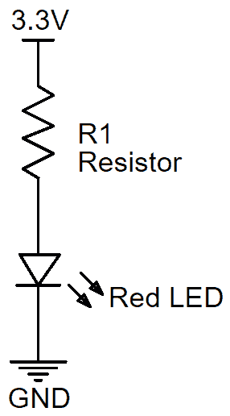

图 6.1 - LED 和电阻电路

我们一直在使用*典型*的 5 毫米*红色*LED。我在这里提取了它的*典型*技术规格的一部分。强调*典型*和*红色*的区别是因为 LED 的规格会有所不同，取决于它们的颜色、最大亮度、物理尺寸和制造商。即使是同一批次的 LED 也会有所不同。

以下是与我们参考的红色 LED 数据表相关的一些核心规格：

+   **正向电压降（VF）在 1.7 到 2.8 伏特之间**，典型降为 2.1 伏特。这是 LED 需要照亮的电压。如果电路中的电压不足以点亮 LED，LED 将不会点亮。如果超过所需电压，那没关系-LED 将只取所需的电压。

+   **最大连续正向电流（IF）为 25 毫安**。这是 LED 达到最大亮度所需的安全电流，当 LED 一直开启时，对于一些 LED 来说，这可能太亮了。提供更少的电流意味着 LED 会更暗，而提供更多的电流可能会损坏 LED。对于我们的 LED 和数据表，当脉冲 LED（例如使用 PWM）时，最大电流可以达到（IFP）100 毫安。

功率呢？LED 是根据电压和电流工作的组件。如果你看一下功率方程（），你会发现功率是电压（V）和电流（I）的函数。只要你在 LED 的电流额定范围内工作，你就在其功率容限范围内。

如果你没有 LED 的匹配数据表（在小批量推入时很常见），可以使用 2 伏特的电压降和 20 毫安的参考电流进行计算。你也可以使用数字万用表设置为二极管设置来测量 LED 的正向电压。

让我们继续看看我们如何得出 R1 电阻的值。

### 计算电阻值

在前面的电路图中，我们有以下参数：

+   供电电压为 3.3 伏特

+   LED 典型正向电压为 2.1 伏特

+   LED 电流为 20 毫安（数据表中提到了电压降的毫安测试条件）

以下是计算电阻值的过程：

1.  我们的电阻（标记为 R1）需要降低 1.2 伏特，这是我们之前简要提到的柯希霍夫电压定律的一个简单应用；即*回路中所有电压的代数和必须等于零*。因此，如果我们的源电压是+3.3 伏特，LED 降低 2.1 伏特，那么电阻必须降低 1.2 伏特。这意味着我们得到以下方程：

+3.3V + -2.1V + -1.2V = 0V

1.  我们可以代数地排列欧姆定律，得到以下结果：

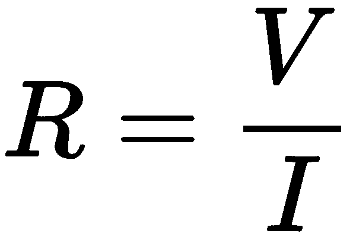

1.  使用这个公式，我们计算出了我们电阻的值：

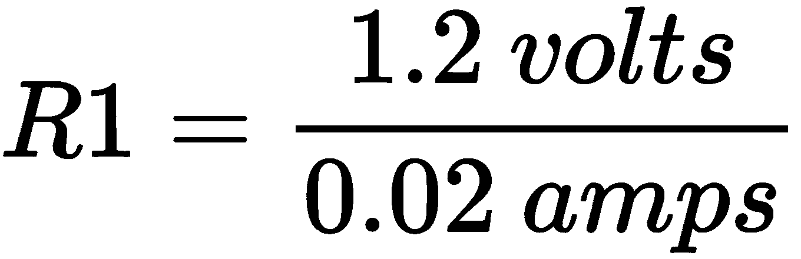

= 60Ω（因此，前面电路中的电阻 R1 为 60Ω）

但这不是 200Ω。到目前为止，我们的例子是一个简单的 LED 和电阻电路，连接到 3.3 伏特的电源，而不是树莓派。还有更多要考虑的，因为我们需要尊重树莓派 GPIO 引脚的电流限制，接下来我们将做到这一点。

### **考虑树莓派的电流限制**

我们可以安全使用的与配置为输出的 GPIO 引脚的最大电流为 16 毫安。然而，GPIO 引脚有一个可配置的方面，这意味着，默认情况下，我们不应该使用超过每个 GPIO 8 毫安。这个限制可以配置，使其达到 16 毫安，但这超出了我们的范围。理想情况下，我们希望在需要更多电流时向外部电路移动，而不是不断提高引脚的电流。我们将在第七章中学习如何做到这一点，*打开和关闭*。

虽然我们希望将单个 GPIO 输出引脚限制在 8 毫安，但我们不应该超过多个 GPIO 引脚的总和约 50 毫安。当涉及到 GPIO 输入引脚时，我们应该将电流限制在 0.5 毫安，以确保在连接外部输入设备或组件时安全操作。将输入 GPIO 引脚直接连接到树莓派的+3.3V 或 GND 引脚是可以的，因为测得的电流约为 70 微安（我们将在第七章中学习如何使用万用表测量电流，*打开和关闭*）。

让我们修改我们的计算并继续这个过程：

1.  如果我们将电流限制在 8 毫安，我们可以使用之前的方程得出 R1 的值：

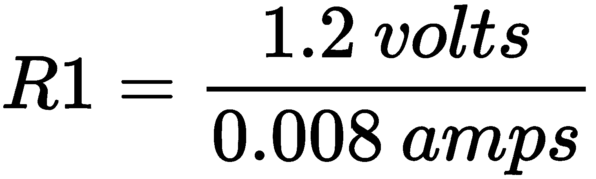

R1 = 150Ω

1.  电阻器的额定值从来不会是精确的。它们有一个值的公差，如果我们的物理电阻器小于 150Ω，根据欧姆定律，我们会增加电路中的电流并超过 8 毫安的限制。

因此，我们将选择一个稍高一点的值。这可能就是使用经验法则，比如选择一个比 150Ω高两个标准电阻值，或者将 150Ω乘以我们电阻器的公差，然后选择下一个最高的标准值。让我们使用后一种方法，假设我们电阻器的公差是±20%（顺便说一句，这将是一个非常低质量的电阻器。5%和 10%更常见）：

150Ω x 1.2 = 180Ω

180Ω恰好是一个标准的电阻值，所以我们可以使用它，但是我没有（经常会发现在计算后你也没有你想要的确切电阻值！）。然而，我有一些 200Ω的电阻器，所以我会使用其中一个。

对于原型设计和修补，从 180Ω到约 1kΩ的任何电阻器都足以满足我们电路的需求。只要记住，随着电阻器值的增加，电流会受到限制，所以 LED 会变得更暗。

但是电阻器上的功率和功率额定值呢？我们将在下面计算。

### 计算电阻器的功率耗散

我们面包板中使用的通用电阻器通常额定为 1/8 瓦特、1/4 瓦特或 1/2 瓦特。如果向电阻器提供过多的功率，它将烧毁并冒出一股难闻的气味。

当我们有一个 3.3 伏的电源时，这是我们计算 200Ω电阻器的功耗的方法：

1.  电阻器的功率可以用以下公式计算。注意，电压*V*是电阻器两端的电压降，单位是伏特，而*R*是欧姆的电阻：

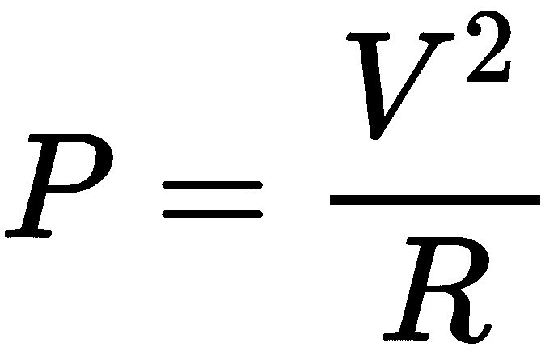

1.  因此，当我们在公式中替换我们电阻器的电压降和电阻值时，我们得到以下结果：

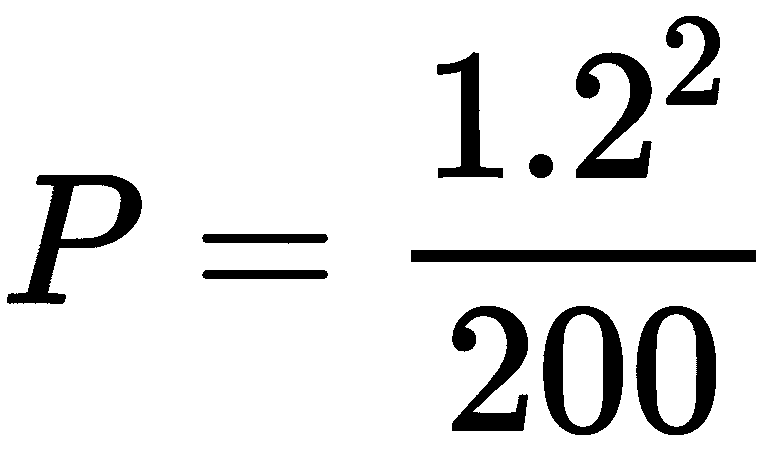

= 0.0072 瓦特，或 7.2 毫瓦（或 mW）

1.  我们的功率值为 7.2 毫瓦，甚至低于 0.25 瓦特的电阻器，因此 1/8 瓦特或更高的电阻器在我们的电路中是安全的，不会烧毁。

如果你觉得功率方程看起来与你之前看到的不同，你是对的。这是重新编写的功率方程，使用电压和电阻。这是一个方便的图表，我相信你在电子学学习过程中会看到的，它以不同的方式表达了欧姆定律和功率：

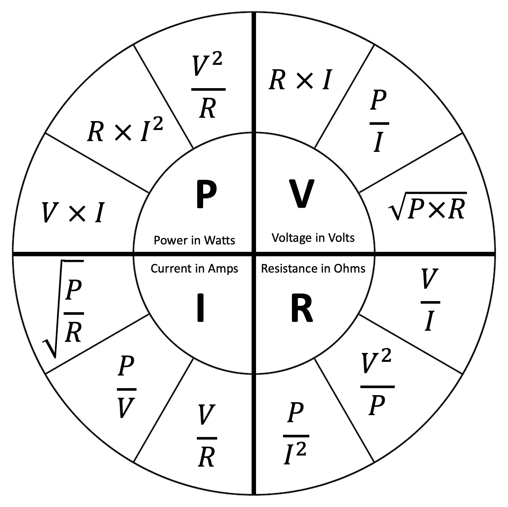

图 6.2 - 欧姆定律功率轮

我给你留下一个关于 LED 的最后提示，以及一些思考。

改变 LED 的亮度是由电流决定的。数据表中的 25 毫安值是驱动 LED 到最大亮度的最大连续安全电流。更少的电流也可以，只是意味着 LED 会变得更暗。

等一下 - 在第五章中，*将您的树莓派连接到物理世界*，我们使用了 PWM，这是一种伪模拟*电压*，用于改变 LED 的亮度。暂停一下，思考一下……发生了什么？这只是欧姆定律的一个应用。在我们的电路中，我们的电阻器固定在 200Ω。因此，通过改变电压，我们也改变了电流，从而改变了 LED 的亮度。

您认为呢？请放心，这是本书中数学的复杂程度。但我鼓励您重复这些练习，直到您对这个过程感到舒适。理解电子基础知识（以及相关的计算）是一个爱好者只是通过试错猜测组件直到电路工作的区别，和一个真正可以构建所需内容的工程师之间的区别。

接下来，我们将探讨与数字电子相关的核心概念。

# 探索数字电子

数字 I/O 基本上意味着检测或使 GPIO 引脚为高电平或低电平。在本节中，我们将探讨核心概念，并看一些数字 I/O 操作的示例。然后，我们将讨论这与您的树莓派以及您将与之接口的任何数字电子元件的关系。我们将通过查看和操作数字输出来开始或数字 I/O 之旅。

## 数字输出

简单来说，对于我们的树莓派来说，当我们将 GPIO 引脚设为高电平时，其电压测量值为~3.3 伏特，当我们将其设为低电平时，测量值为~0 伏特。

让我们用万用表观察一下：

不同的万用表可能有不同的连接和标记，与这里所示的万用表不同。如果您不确定如何设置测量电压，请参阅您的万用表手册。

1.  将您的万用表设置为电压设置，并将其连接到 GPIO 21 和 GND，如下图所示：

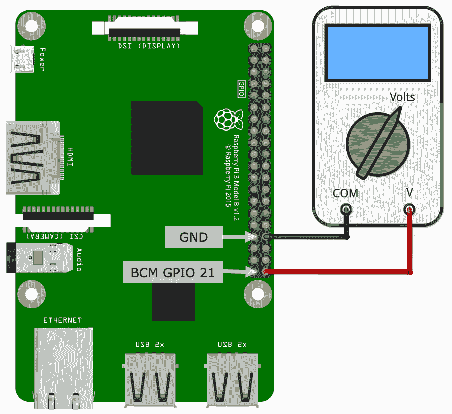

图 6.3 - 将万用表连接到 GPIO 引脚

1.  运行以下代码，您可以在`chapter06/digital_output_test.py`文件中找到。您会注意到仪表在大约 0 伏和大约 3.3 伏之间切换。我说“大约”，因为在电子设备中没有什么是完美或精确的；总是有公差。以下是代码的概要：

```py
# ... truncated ...
GPIO_PIN = 21
pi = pigpio.pi()
pi.set_mode(GPIO_PIN, pigpio.OUTPUT)           # (1)

try:
    while True:                                # (2)
        # Alternate between HIGH and LOW
        state = pi.read(GPIO_PIN); # 1 or 0
        new_state = (int)(not state) # 1 or 0
        pi.write(GPIO_PIN, new_state);
        print("GPIO {} is {}".format(GPIO_PIN, new_state))
        sleep(3)
# ... truncated ...
```

在第 1 行，我们将 GPIO 21 配置为输出引脚，而在第 2 行，我们启动了一个`while`循环，该循环在每个状态转换之间有 3 秒的延迟，将 GPIO 21 的状态在高和低之间交替变换（即 0 和 1）。

您可能已经注意到，我们树莓派上的数字输出就是这么简单 - 高电平或低电平。现在，让我们考虑数字输入。

## 数字输入

通常，当我们考虑数字输入和 3.3 伏特设备的电压时，比如树莓派，我们认为将引脚连接到地（0 伏特）以使其低电平，或者连接到 3.3 伏特以使其高电平。在大多数应用中，这确实是我们努力做的事情。但实际上，这个故事还有更多内容，因为 GPIO 引脚不仅仅在两个离散的电压水平上工作。相反，它们在定义输入引脚为高和低的一系列电压范围内工作。这适用于树莓派和具有 GPIO 的类似计算机、微控制器、集成电路和分线板。

考虑以下图表，显示了 0 到 3.3 伏特之间的电压连续体，以及标有“低、悬空”和“高”的三个突出区域：

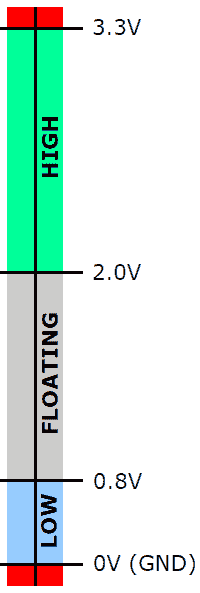

图 6.4 - 数字输入触发电压

这幅插图告诉我们，如果我们在 2.0 伏特和 3.3 伏特之间施加电压，那么输入引脚将被读取为数字高电平。或者，如果我们在 0.8 伏特和 0 伏特之间施加电压，引脚将被读取为数字低电平。超出这些范围的任何电压都是危险区域，您很可能会损坏您的树莓派。虽然您可能不会意外地向引脚施加负电压，但很可能会意外地向引脚施加超过 3.3 伏特的电压，因为通常会使用 5 伏特的数字电路。

那么，中间的灰色区域呢？我们是数字高电平还是数字低电平？答案是我们不知道，也永远无法可靠地知道。在这个范围内，引脚被称为“悬空”。

让我们看看悬空引脚的影响。我们将在面包板上创建以下电路：

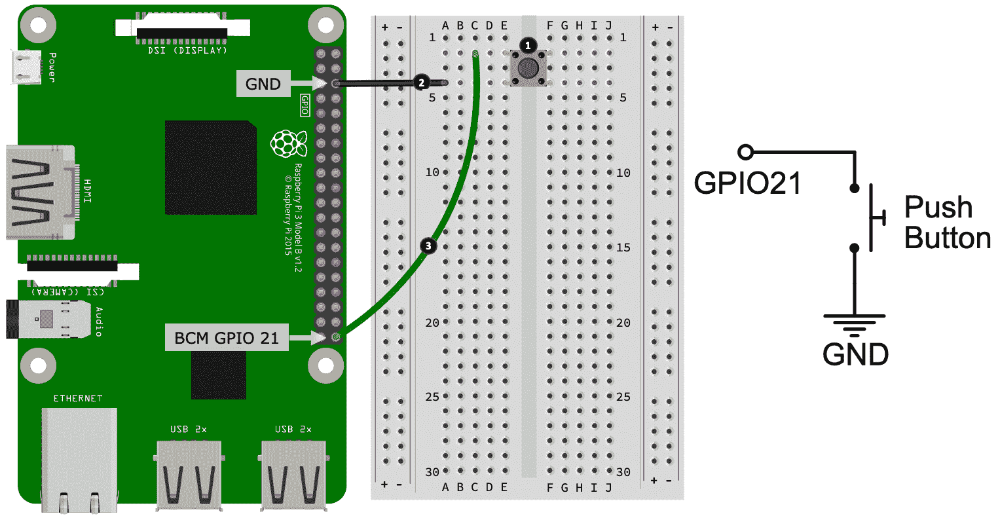

图 6.5 - 按钮电路

以下是此步骤。这里的步骤编号与前面图中显示的带有编号的黑色圆圈相匹配：

1.  将按钮放在面包板上。

1.  将按钮的一端连接到树莓派上的 GND 引脚。在图中，我们将按钮的下部腿（显示在 E4 孔处）连接到 GND 引脚。

1.  最后，将按钮的另一端（在图中，这是最上面的腿，显示在 E2 孔处）连接到树莓派上的 GPIO 21。

现在您的电路已经建立完成，让我们测试电路并看看会发生什么：

1.  运行以下代码，可以在`chapter06/digital_input_test.py`文件中找到：

```py
# ... truncated...
GPIO_PIN = 21
pi = pigpio.pi()
pi.set_mode(GPIO_PIN, pigpio.INPUT)   # (1)
# ... truncated...

try:
   while True:                        # (2)
   state = pi.read(GPIO_PIN)
   print("GPIO {} is {}".format(GPIO_PIN, state))
   sleep(0.02)

except KeyboardInterrupt:
   print("Bye")
   pi.stop() # PiGPIO cleanup.
```

此代码在第 1 行上将 GPIO21 配置为输入。在第 2 行上，使用`while`循环，我们快速读取 GPIO 引脚的值（1 或 0）并将其打印到终端。

1.  用手指触摸面包板上的导线，以及开关周围的任何裸露的金属触点。导线和触点就像天线一样捕捉电气噪音，您应该看到终端输出在高（1）和低（0）之间波动 - 这是一个*浮动*引脚。这也说明了一个常见的误解，即配置为输入并且未连接任何东西的 GPIO 引脚默认总是低电平。

如果您最初的想法是“哇！我可以创建一个触摸开关”，那么抱歉；您会感到失望 - 这并不可靠，至少没有额外的电子设备。

接下来，我们将看两种常见的避免浮动引脚的方法。

## 使用上拉和下拉电阻

当引脚未连接到任何东西时，它被称为浮动。如前面的示例所示，它在周围*漂移*，从其他附近的组件、连接到它的导线和来自您自己的电荷中捕捉电气噪音。

再次参考前面的图表，当按钮*按下*时，电路完成，GPIO 21 连接到地，因此我们可以确定引脚为低电平。正如我们刚才看到的，当按钮*未*按下时，GPIO 21 是浮动的 - 由于外部噪音，它可以在高电平和低电平之间波动。

这需要纠正，我们可以用电阻或代码来解决这个问题。

### 电阻解决方案

如果我们在电路中添加一个外部电阻，如下图所示，那么我们将引入所谓的*上拉电阻*，它的作用是*拉*（意思是连接）GPIO 引脚 21 *上拉*（意思是连接到正电压）到 3.3 伏：

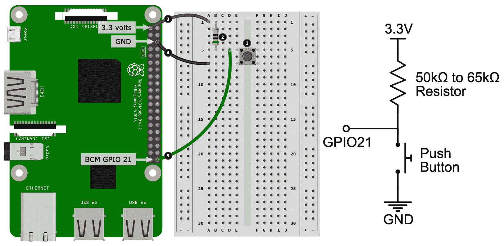

图 6.6 - 带上拉电阻的按钮电路

以下是在面包板上创建此电路的步骤。这里的步骤编号与前面图中显示的带有编号的黑色圆圈相匹配：

1.  将按钮放在面包板上。

1.  在面包板上放置一个电阻（值在 50kΩ到 65kΩ之间）。电阻的一端与按钮的上部位置的腿共用同一行（显示在孔 B5 处）。电阻的另一端放在一个空行上。

1.  将电阻的另一端连接到树莓派上的 3.3 伏引脚。

1.  将按钮的下部腿连接到树莓派上的 GND 引脚。

1.  最后，将按钮的上部腿和电阻的下部腿共用的行（显示在 D5 孔处）连接到树莓派上的 GPIO 21。

现在您已经创建了电路，这里是它的简要描述：

+   当按钮*未* *按下*时，电阻将 GPIO 21 *上拉*到 3.3 伏引脚。电流沿着这条路径流动，引脚将被读取为保证的数字高电平。

+   当按钮*按下*时，连接 GPIO 21 到地的电路段被创建。由于在这条路径中流动的电流更多，因为它的电阻更小（接近零），所以 GPIO 引脚连接到地，因此会读取为低电平。

在`chapter06/digital_input_test.py`中运行相同的代码，只是这一次，当你触摸电线时，输出*不应该*波动。

如果你的电路不工作，而且你的接线是正确的，尝试将你的按钮在面包板上旋转 90 度。

为什么在前面的图中使用 50kΩ到 65kΩ的电阻？继续阅读-当我们看一个基于代码的替代方案时，我们将会找出原因。

### 代码解决方案

我们可以通过告诉我们的树莓派激活并连接一个嵌入式上拉电阻到 GPIO 21 来在代码中解决我们的浮动引脚问题，根据树莓派的文档，这个电阻将在 50kΩ-65kΩ的范围内，这就是为什么我们在前面的图中规定了这个范围。

下图显示了一个类似于前图所示的电路，但在外部电路中没有物理电阻。我在树莓派图中添加了一个电阻，以说明树莓派的电路中确实有一个物理电阻，尽管我们看不到它：

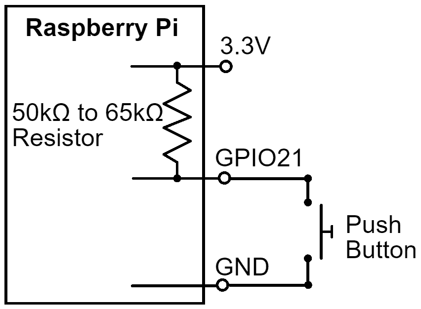

图 6.7 - 使用嵌入式上拉电阻的按钮电路

让我们在代码中启用一个上拉电阻并测试这个电路。以下是你需要遵循的步骤：

1.  这个例子使用了之前在*图 6.5*中显示的按钮电路。在继续之前，请在面包板上重新创建这个电路。

1.  接下来，编辑`chapter06/digital_input_test.py`文件，启用内部上拉电阻，如下所示：

```py
#pi.set_pull_up_down(GPIO_PIN, pigpio.PUD_OFF) <<< COMMENT OUT THIS LINE
pi.set_pull_up_down(GPIO_PIN, pigpio.PUD_UP)   <<< ENABLE THIS LINE
```

1.  再次运行`chapter06/digital_input_test.py`文件。当你按下按钮时，你应该看到终端上的高/低（0/1）值在改变；然而，触摸按钮的电线或终端不应该引起任何干扰。

当阅读前面的代码并观察终端输出时，如果终端在按钮*未* *按下*时打印`1`，在按钮*按下*时打印`0`（即按钮按下=引脚低）在编程意义上似乎有点前后颠倒，那么你是对的...也是错的。这是因为你是以程序员的身份看待电路。我故意这样做是因为这是你经常会看到的配置。这被称为*主动低*，这意味着当引脚低时按钮是活动的（按下）。

相反的电阻设置也是可能的，同样有效。也就是说，你可以设计一个将 GPIO 21 默认接地的电路，这样我们就使用了一个*下拉*电阻，无论是物理电阻还是在代码中激活的嵌入式电阻。在这种情况下，当按钮被按下时，引脚读取 1（高），在代码中可能会更舒服！

作为练习，尝试更改电路和代码，使其默认为下拉。

在阅读数字输入电路时，你需要结合伴随的代码来阅读电路，或者考虑你将要编写的代码。忽视上拉或下拉电阻的使用可能是看似简单的数字输入电路不工作的基础。

现在我们明白了我们可以有物理和代码激活的上拉和下拉电阻，我们可以说一个方法比另一个更好吗？简短的答案是，有时候...外部电阻确实有优势。

外部上拉或下拉电阻的优势在于它们始终存在。代码激活的上拉和下拉只有在满足两个条件时才存在：

+   你的树莓派已经开机。

+   你已经运行了激活上拉或下拉的代码。在此之前，引脚是浮动的！我们将在第七章中看到一个应用，*打开和关闭设备*。

这并不是说代码激活的上拉和下拉电阻是次优的，只是意味着当您的树莓派关闭或您没有运行代码时，您需要考虑漂移引脚对电路的影响。

我们现在已经介绍了数字输入和输出的基础知识，这在许多方面是电子接口的支柱。我们还了解到，数字输入并不仅仅是高电平或低电平状态，实际上阈值电压水平确定了树莓派的数字高电平或数字低电平的电压水平。除此之外，我们还了解到在处理数字输入时，有必要适当地使用上拉或下拉电阻，以使输入电路可靠和可预测 - 也就是说，它不会*漂移*。

当设计可预测的数字输入电路时，您对数字 I/O 的理解将对您有所帮助（漂移引脚和缺失或错误使用的上拉或下拉电阻在刚开始时是常见的错误来源！）。此外，当您与非树莓派设备和电子设备集成时，您对数字高/低电压水平的理解将是有价值的。我们将在本章后面再次提到这个数字电压主题，在*逻辑电平转换*部分。

现在，让我们从数字电子学转向模拟电子学。

# 探索模拟电子学

正如我们在前一节中看到的，数字 I/O 完全取决于电压确定的离散高电平或低电平。另一方面，模拟 I/O 完全取决于电压的程度。在本节中，我们将探讨一些核心概念，并查看模拟 I/O 的操作示例。

## 模拟输出

在第五章中，*将您的树莓派连接到物理世界*，我们讨论了通过在数字输出引脚上使用 PWM，我们可以创建伪模拟输出或可变输出电压的外观。此外，我们还在第三章中看到了 PWM 的使用，*使用 Flask 进行 RESTful API 和 Web 套接字网络*，当时我们使用了这个概念来控制 LED 的亮度。

在这一部分，我们将通过一个简短的练习进一步探讨 PWM 的基本概念。我们的示例与之前进行数字输出的示例类似，只是这一次，我们使用 PWM 在 GPIO 引脚上产生可变电压。以下是我们需要遵循的步骤：

1.  将您的万用表连接到您的树莓派上，就像我们在*图 6.3*中为数字输出所做的那样。

1.  运行以下代码，您可以在`chapter06/analog_pwm_output_test.py`文件中找到。

1.  当代码运行时，您的万用表将步进到一系列不同的电压。虽然不会像终端屏幕输出所示的那样精确，但应该足够接近以说明意图：

```py
(venv) $ analog_pwm_output_test.py
Duty Cycle 0%, estimated voltage 0.0 volts
Duty Cycle 25%, estimated voltage 0.825 volts
Duty Cycle 50%, estimated voltage 1.65 volts
Duty Cycle 75%, estimated voltage 2.475 volts
Duty Cycle 100%, estimated voltage 3.3 volts
```

让我们来看一下代码，部分代码如下。

它使用了 PiGPIO 的硬件定时 PWM，在第 1 行进行配置，同时在第 2 行定义了一组占空比百分比。这些是我们的代码将在第 3 行中步进的占空比值。在第 4 行，我们设置了 GPIO 21 的占空比，然后休眠 5 秒，这样您就可以在终端和您的万用表上读取值：

```py
# ... truncated ...
pi.set_PWM_frequency(GPIO_PIN, 8000)                       # (1)

duty_cycle_percentages = [0, 25, 50, 75, 100]              # (2)
max_voltage = 3.3

try:
    while True:                                  
       for duty_cycle_pc in duty_cycle_percentages:        # (3)
           duty_cycle = int(255 * duty_cycle_pc / 100)
           estimated_voltage = max_voltage * duty_cycle_pc / 100
           print("Duty Cycle {}%, estimated voltage {} volts"
                 .format(duty_cycle_pc, estimated_voltage))
           pi.set_PWM_dutycycle(GPIO_PIN, duty_cycle)      # (4)
           sleep(5)

# ... truncated ...
```

如果您需要从您的树莓派提供更真实的模拟输出，那么您可能会喜欢探索如何使用**数字模拟转换器**（**DAC**）。它们通常通过 I2C 或 SPI 进行接口，您将通过类似于 ADS1115 ADC 的驱动程序库来控制它们，只是您将输出可变电压而不是读取电压。

现在我们已经讨论了模拟输出，并看到了如何使用 PWM 创建一个简单的示例，接下来，我们将看看模拟电子学的输入端。

## 模拟输入

在第五章中，*将您的树莓派连接到物理世界*，我们学习了如何使用 ADS1115 ADC 扩展模块，模拟输入就是测量预定义范围内的电压，对于我们的目的来说，范围在 0 伏特到 3.3 伏特之间。在数字 I/O 中，我们会说在引脚上测量到 0 伏特意味着低，3.3 伏特意味着高，但在模拟 I/O 中，这方面没有高低的概念。

许多简单的模拟元件和传感器都是根据它们测量的内容来改变它们的电阻。例如，光敏电阻器（LDR）的电阻会随着它检测到的光的变化而变化。然而，模拟输入是关于测量电压的。为了将变化的电阻转换为变化的电压，我们使用电压分压器电路。

### 电压分压器

以下图显示了一个简单的两电阻器电压分压器电路。本例中，我们的电阻值是固定的，以说明基本原理。请注意，我们在本例中使用了 5 伏特。我们之所以这样做的原因很快就会揭晓，当我们讨论逻辑电平转换时：

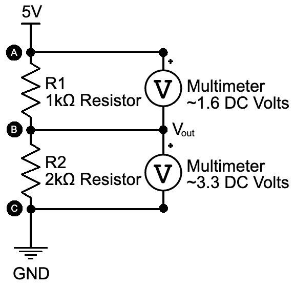

图 6.8 - 测量电压跨电压分压器

电子学和电阻器的原理是，电压会按照它们的电阻值成比例地*降低*在串联电阻器上。在前述电路中，R1 的值是 R2 的两倍，所以它降低的电压是 R2 的两倍。以下是基本公式，应用于前述电路（实际上是再次应用了基尔霍夫定律和欧姆定律）：

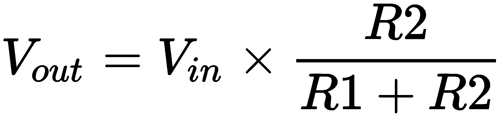

V[out] = 5 伏特 x 2000Ω / (1000Ω + 2000Ω)

V[out] = 3.33333 伏特

我们将在*第三部分*中看到电压分压器的应用，*物联网游乐场-与物理世界互动的实际示例*，但现在，为了看到这个原理在实践中的应用并帮助巩固概念，将数字万用表放在前图中标记的点之间，以验证测量的电压是否接近所示的值；即在 R1（前图中的 A 和 B 点）之间测量约 1.6 伏特，在 R2（前图中的 B 和 C 点）之间测量约 3.3 伏特。在前述方程中，R2（B 和 C 点）之间的测量是*V[out]*。

那么电阻值的选择呢？对于电压分压器，电阻值选择最重要的部分是它们相对比例的选择，以便按照我们想要的方式分压电压。除此之外，还涉及到电流流动和电阻器功率额定值 - 再次，这些是欧姆定律和功率的应用。

还记得第五章中的电位器吗？它们实际上是电压分压器！我们将中间的拨片连接到 ADS1115 的 AIN1 和 AIN2 上，当您转动电位器上的拨片时，您所做的就是改变 A 和 B 端子之间相对于中心拨片的电阻，从而产生由 ADS1115 读取的可变电压。

以下图显示了电位器与语义图的关系。A、B 和 C 点与前述电路中指示的点是可比较的：

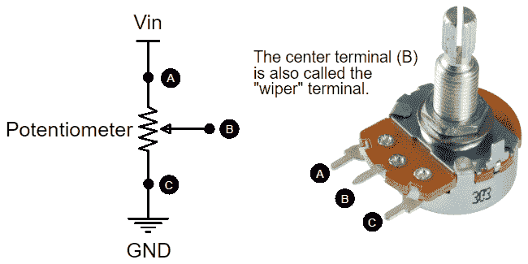

图 6.9 - 电位器是电压分压器

让我们进行一个实验，看看电位器如何作为电压分压器，创建如下电路：

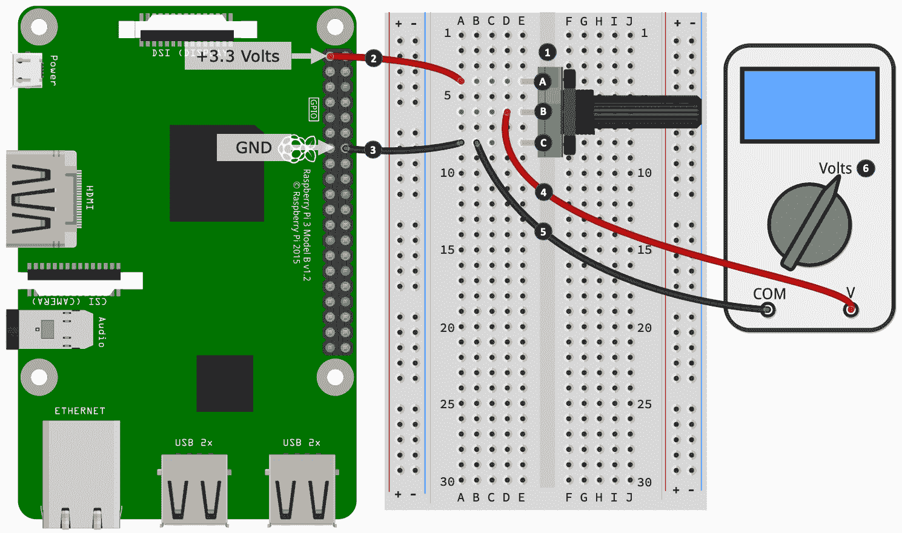

图 6.10 - 电位器电路

以下是要遵循的第一组步骤。这里的步骤编号与前图中显示的带编号的黑色圆圈相匹配：

1.  将 10kΩ电位器放在面包板上。您会注意到我已经标记了 A、B 和 C 三个端子，以便它们与*图 6.9*中显示的标签相匹配。

1.  将外部电位器（标有 A）的端子连接到树莓派上的 3.3 伏针脚。在这个电路中，我们只使用树莓派作为电源。如果需要，您也可以使用外部电源或电池。

1.  将电位器的另一个外部端子（标有 C）连接到树莓派的 GND 针脚。

1.  将万用表的电压测量引线连接到电位器的中间端子（标有 B）。

1.  将万用表的*com*端子连接到 GND（在我们的示例中，与标有 C 的电位器端子共用）。

1.  打开您的万用表并选择电压模式。

现在，打开万用表，转动电位器的旋钮，观察万用表上的电压读数在 0 伏特和 3.3 伏特之间的变化。

这就结束了我们对*模拟电子学*的介绍。我们进行了一个简单的练习，用万用表演示和可视化了 PWM 如何产生可变的输出电压。我们还学习了*电压分压器*，它们的工作原理，以及它们为何是任何模拟输入电路的关键部分。最后，我们再次回顾了*电位器*，并看看它们如何作为可变的*电压分压器*。

这些模拟概念虽然相对简短和简单，但是是每个电子工程师（无论您是专业人士还是业余爱好者）都需要理解的两个核心原则。这些概念，特别是*电压分压器*，将在接下来的章节中出现在许多电路中（我们将与 ADS1115 模数转换器一起使用它们），因此，请尝试使用前面的示例和原则来确保您掌握了基础知识！

接下来，我们将讨论逻辑电平转换，并看看电压分压器的另一个实际应用，这次是在*数字输入*空间中。

# 理解逻辑电平转换

有时候您需要从树莓派的 3.3 伏特 GPIO 引脚与 5 伏特设备进行接口。这种接口可能是为了 GPIO 输入、输出或双向 I/O。用于在逻辑电平电压之间转换的技术称为*逻辑电平转换*或*逻辑电平转移*。

有各种技术可以用来转移电压，我们将在本节中介绍其中两种比较常见的技术。一种是使用电压分压电路，我们在上一节中讨论过，而另一种是使用专用的逻辑电平转移模块。我们逻辑电平转换的第一个示例将是查看一种基于电阻的解决方案，称为*电压分压器*。

## 电压分压器作为逻辑电平转换器

由适当选择的电阻构成的电压分压电路可以用于*从 5 伏特降低*到 3.3 伏特，使您可以将来自设备的 5 伏特输出用作输入到您的 3.3 伏特树莓派针脚。

为了让您清楚地理解和学习，在本节中，我们处理的是*数字*电子学，特别是数字输入和数字输入电路中*电压分压器*的应用。请确保在完成本章后，您对*电压分压器*在模拟和数字电路中的基本实际差异和应用感到满意。

以下图表是我们之前在*图 6.8*中看到的相同示例，只是这次是在不同的上下文中绘制的；也就是说，显示了如何将 5 伏特输入*降低*到 3.3 伏特：

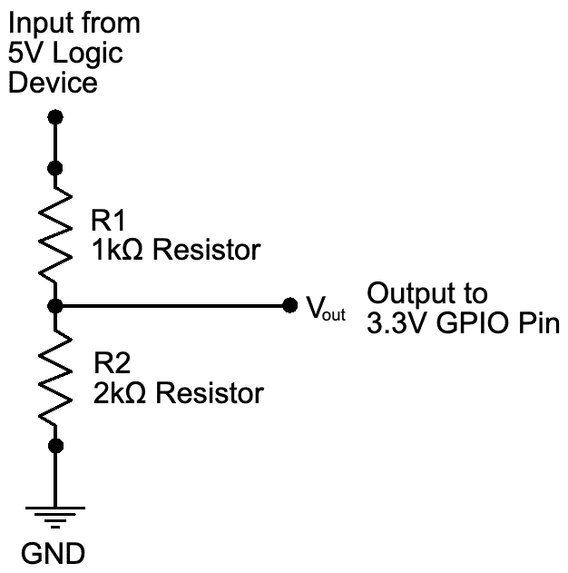

图 6.11 - 使用电压分压器作为逻辑电平转移

电压分压器不能将电压从 3.3 伏特升高到 5 伏特。然而，回想一下我们在数字输入和*图 6.4*中的讨论，我们解释了输入引脚只要电压>= ~2.0 伏特就会读取数字高。同样的规则通常也适用于 5 伏特电路-只要输入电压>= ~2.0 伏特（3.3 伏特就是），5 伏特逻辑将会注册为逻辑高。数字低也是同样的道理，当电压<= ~0.8 伏特时。

通常情况下是这样，尽管您需要检查所涉及的 5 伏特设备的详细信息和数据表。它可能明确提到最低电压，或者可能只是提到它将使用 3.3 伏特逻辑。如果没有明显的迹象表明设备支持 3.3 伏特逻辑，您可以使用 3.3 伏特自行测试。这样做是安全的，因为 3.3 伏特小于 5 伏特，这意味着没有损坏的风险。最坏的情况下，它只是不起作用或者工作不可靠，这种情况下，您可以使用专用的逻辑电平转换器。我们将在下面讨论这个问题。

## 逻辑电平转换器 IC 和模块

电压分压电路的替代方案是专用的逻辑电平转换器。它们以 IC（芯片）形式和面包板友好的断路模块形式出现。因为它们基本上是即插即用的，所以不需要进行数学计算，并且它们包括多个通道，可以同时转换多个 I/O 流。

以下图片显示了典型的 4 通道（左侧）和 8 通道（右侧）逻辑电平转换断路模块。左侧的 4 通道是使用 MOSFET 构建的，而右侧的 8 通道使用了 TXB0108 IC。请注意，虽然我们将在第七章中介绍 MOSFET，*打开和关闭物品*，但我们的重点将是使用 MOSFET 作为开关，而不是逻辑电平转换应用。

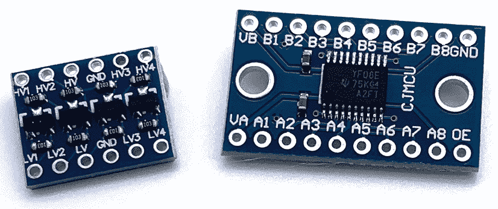

图 6.12 - 逻辑电平转换器断路模块

逻辑电平转换器模块也有两个部分-低电压端和高电压端。关于树莓派，我们将其 3.3 伏特引脚和 GPIO 连接到低电压端，然后将另一个更高电压的电路（例如 5 伏特电路）连接到高电压端。

接下来的示例将基于类似于之前图片中的 4 通道 MOSFET 模块，它有 LV 和 HV 端子，以及两个 GND 端子。如果您使用不同的模块，您可能需要查阅其数据表，并根据示例调整接线。

让我们看看电平转换的实际操作。我们将通过构建一个电路并测量电压来实现这一点。在*数字输出*部分中，我们直接将万用表连接到树莓派的 GPIO 引脚上，并观察到当 GPIO 为高时，万用表读取~3.3 伏特。这一次，我们将把我们的万用表连接到逻辑电平转换器的 HV 端，并观察到当 GPIO 引脚为高时，万用表读取~5 伏特。

我们将从构建我们的电路开始，这将分为两部分：

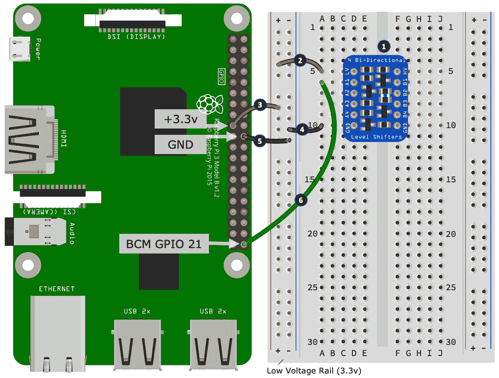

图 6.13 - 可视化 3.3 伏特到 5 伏特电平转换（1/2）

以下是要遵循的第一组步骤，其中我们放置了连接逻辑电平转换器低电压端的组件。这里的步骤编号与前图中显示的编号黑色圆圈相匹配：

1.  将您的逻辑电平转换器放在面包板上。

1.  将逻辑电平转换器的 LV（低电压）端连接到左侧电源轨道的正极。我们将这个轨道称为*低电压轨道*，因为它将连接到我们供电电压中较低的那一侧（即 3.3 伏特）。LV 端是逻辑电平转换器的低电压端电源输入端子。

1.  将*低电压轨道*的正极连接到树莓派上的 3.3 伏特电源引脚。

1.  将逻辑电平转换器低电压侧的 GND 端子连接到*低电压轨道*的负电源。

1.  将*低电压轨道*的负电源连接到树莓派上的 GND 引脚。

1.  最后，将逻辑电平转换器的 A1 端口连接到树莓派上的 GPIO 21。

接下来，我们将连接逻辑电平转换器的高电压侧并连接我们的万用表：

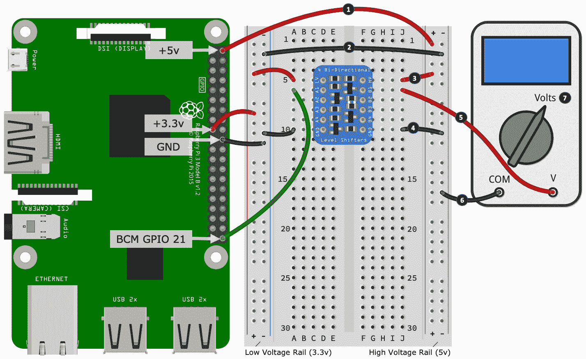

图 6.14 - 可视化 3.3 伏特到 5 伏特电平转换（第二部分）

以下是要遵循的第二组步骤。这里的步骤编号与前图中显示的编号黑色圆圈相匹配：

1.  将右侧电源轨道上的正电源连接到树莓派的 5 伏特引脚。我们将称这条轨道为*高电压轨道*，因为它将连接到我们供电电压中较高的那个（即 5 伏特）。HV 端子是逻辑电平转换器的高电压侧电源输入端子。

1.  将*高电压轨道*的负电源连接到*低电压轨道*的负电源。你可能还记得所有 GND 连接在电路中是共用的。如果你需要关于这个概念的复习，请回顾第二章中的*引入地面连接和符号*部分。

1.  将逻辑电平转换器的 HV 端子连接到*高电压轨道*的正电源。

1.  将逻辑电平转换器高电压侧的 GND 端子连接到*高电压轨道*的负电源。

1.  将你的万用表的*电压*测量端子连接到逻辑电平转换器的 B1 端口。

1.  将你的万用表的*com*端子连接到*高电压轨道*的负电源。

1.  最后，将你的万用表设置为电压模式。

现在我们已经搭建好了电路，让我们运行一个 Python 程序，并确认当 GPIO 21 为高电平时，我们的万用表读取到了~5 伏特。以下是我们需要做的：

1.  运行`chapter06/digital_output_test.py`文件中的代码 - 这是我们之前在*数字输出*部分使用的相同代码。

1.  在低电压侧，我们的树莓派在通道 1 端口 A1 上的 GPIO 21 之间脉冲低（0 伏特）和高（3.3 伏特），而在高电压侧，我们的万用表连接到通道 1 端口 B1，将在 0 伏特和~5 伏特之间交替，说明了 3.3 伏特逻辑电平高到 5 伏特逻辑电平高的转变。

反向场景也是可能的；也就是说，如果你在高电压侧应用了 5 伏特输入，它将被转换成 3.3 伏特在低电压侧，这可以安全地被 3.3 伏特的树莓派 GPIO 引脚读取。

构建这个反向场景是一个你可能想要自己尝试的练习 - 你已经有了核心知识、代码和电路来实现这一点；你只需要把它全部连接起来！我鼓励你尝试一下，并为了帮助你开始，这里有一些提示：

+   在你的面包板上放置一个按钮和上拉电阻，并将其连接到逻辑电平转换器高电压侧的 B1 端口。这个电路（在原理上）与你之前在*图 6.6*中看到的是相同的，只是现在的电源是 5 伏特，GPIO 引脚现在是 B1 端口。

+   要测试你的电路，你可以使用我们之前使用的相同的数字输入代码，可以在`chapter06/digital_input_test.py`文件中找到。

+   如果你遇到困难，需要参考面包板布局，或者希望检查你的电路搭建，你可以在`chapter06/logic_level_input_breadboard.png`文件中找到一个面包板布局。

当使用逻辑电平转换器 IC、分立模块或电压分压器作为电平转换器时，始终在连接到外部电路或树莓派之前用万用表测试输入/输出电压。这个检查将确保你已经正确连接了转换器，并且电压已经按照你的意图进行了转换。

让我们通过比较我们所看到的两种方法来结束我们对电平转换的讨论。

## 比较电压分压器和逻辑电平转换器

一个方法比另一个更好吗？这取决于情况，尽管我会说一个专用的转换器总是比基本的电压分压器更出色，而且它们在面包板上使用起来更方便。电压分压器更便宜，但只能在一个方向上工作（你需要两个电压分压器电路来执行双向 I/O）。它们还具有相对较高的电阻，这意味着在可变电阻改变和可测电压改变之间会发生实际的延迟。这种延迟足以使简单的电压分压器在高低状态之间快速切换的电路中变得不切实际。一个专用的逻辑电平转换器克服了这些限制，而且它们是多通道、双向、更快和更高效的。

# 总结

本章以对你在进一步学习电子学和我们将在*第三部分*中涵盖的电路中所需的基本工具和设备的快速概述开始（我们将在下一章开始）。然后，我们提出了一些建议，以帮助您在连接电子设备到树莓派的 GPIO 引脚时保持安全，以及在购买元件时的一些建议。

然后，我们探讨了欧姆定律（和非常简要地基尔霍夫定律），然后通过原因和计算来解释为什么我们的 LED 电路使用了 200 欧姆的电阻。我们通过查看数字电路的电子特性来跟进这个例子，其中我们探讨了逻辑电压电平、悬空引脚和上拉和下拉电阻。然后，我们查看了模拟电路，并通过一个电压分压器电路的例子来进行了工作。我们通过查看逻辑电平转换来结束了本章，并介绍了如何将 5 伏逻辑设备与 3.3 伏逻辑设备（如您的树莓派）进行接口。

本章的目标是向您介绍支撑基本电子学和特别是与树莓派等设备的电子接口的基本电子原理。我还努力解释了这些原理背后的基本*为什么*，以及它们如何影响为电路选择哪些元件。有了这些信息，您现在应该能够更好地理解如何构建与您的树莓派配合工作的简单电路。

此外，您可以利用这一理解作为进一步发展和提高您的电子技能的起点。在*进一步阅读*部分，您会找到一些有用的电子网站的链接，而且在我们继续*第三部分* *物联网游乐场*时，我们会看到这些原则的许多应用。

当你准备好开始时，我会在下一章见到你——这也是*第三部分* *物联网游乐场*的开始——在那里我们将探索不同的开关方法。

# 问题

随着我们的结束，这里有一些问题供你测试对本章材料的了解。你会在书的*评估*部分找到答案：

1.  你有一个需要 200Ω电阻的电路，但你只有一个 330Ω的电阻可用。使用这个值安全吗？

1.  你在电路中用一个更高阻值的电阻代替，但电路却无法工作。根据欧姆定律，可能出了什么问题？

1.  您使用欧姆定律计算了电路的合适电阻值，但当您给电路加电时，电阻开始变色并冒烟。为什么？

1.  假设 GPIO 21 通过 Python 配置为输入引脚，并且通过一根导线直接连接到+3.3 伏引脚，`pi.read(21)`会返回什么值？

1.  你设置了一个按钮，当按下时，它将 GPIO 21 连接到 GND 引脚。当按钮*没有*被按下时，你会注意到你的程序表现不稳定，并且似乎接收到了一个幻象按钮按下。问题可能是什么？

1.  你想将一个输出引脚在 5 伏特操作的设备安全地连接到树莓派的 GPIO 输入引脚。你可以如何安全地做到这一点？

1.  真或假 - 电阻器电压分压电路可以用于将 3.3 伏特输入转换为 5 伏特，以用于 5 伏特逻辑输入设备。

# 进一步阅读

以下两个网站是电子制造商，它们都提供了广泛的入门到中级教程。它们侧重于电子学的实际方面，不会向你灌输太多理论。在它们的网站上搜索*Raspberry Pi*试试：

+   [`learn.adafruit.com`](https://learn.adafruit.com/)

+   [`learn.sparkfun.com`](https://learn.sparkfun.com/)

关于本章涵盖的概念，以下是上述网站上的一些具体链接：

+   关于 LED 的一切：[`learn.sparkfun.com/tutorials/light-emitting-diodes-leds`](https://learn.sparkfun.com/tutorials/light-emitting-diodes-leds)

+   欧姆定律、功率和基尔霍夫定律入门：[`learn.sparkfun.com/tutorials/voltage-current-resistance-and-ohms-law`](https://learn.sparkfun.com/tutorials/voltage-current-resistance-and-ohms-law)

+   电压分压器：[`learn.sparkfun.com/tutorials/voltage-dividers`](https://learn.sparkfun.com/tutorials/voltage-dividers)

+   上拉/下拉电阻：[`learn.sparkfun.com/tutorials/pull-up-resistors/all`](https://learn.sparkfun.com/tutorials/pull-up-resistors/all)

+   电阻和色码：[`learn.sparkfun.com/tutorials/resistors`](https://learn.sparkfun.com/tutorials/resistors)

如果你想深入了解，以下两个网站是优秀的（并且免费）资源，涵盖了电子基础和理论的各种主题：

+   [`www.allaboutcircuits.com`](https://www.allaboutcircuits.com/textbook/)

+   [`www.electronics-tutorials.ws`](https://www.electronics-tutorials.ws/)

我建议花一些时间在这些网站上浏览一下，了解它们包含的内容。这样，如果你在这本书中遇到想进一步探索的电子术语、元件或概念，你就会知道从哪里开始调查。以下是两个开始探索的链接：

+   [`www.electronics-tutorials.ws/category/dccircuits`](https://www.electronics-tutorials.ws/category/dccircuits)（直流电路理论）

+   [`www.allaboutcircuits.com/textbook/direct-current`](https://www.allaboutcircuits.com/textbook/direct-current/)（直流电路理论）

如果你浏览这些网站的索引，你会发现包括欧姆定律、功率、基尔霍夫定律、电压分压器以及数字和模拟电子学在内的部分。
