# 第七章：打开和关闭东西

在上一章中，我们讨论了当您将数字和模拟电路与树莓派的 GPIO 引脚进行接口时将会使用的核心电子电路和概念。

在本章中，我们将介绍如何打开和关闭*需要比树莓派安全使用的更高电压和电流*的*东西*。在电子领域，可以使用数百种不同的元件来进行控制和开关。它们可以以成千上万种不同的方式进行配置。我们将重点关注三种常见的补充—光耦、晶体管和继电器。

当与树莓派进行接口时，了解如何控制和开关电路是一个非常重要的话题。正如我们在第五章中讨论的那样，树莓派的 GPIO 引脚只能安全地提供少量毫安的输出电流和固定的 3.3 伏特。完成本章后，您对光耦、晶体管和继电器的了解将意味着您可以开始控制具有不同电流和电压要求的设备。

以下是本章的内容：

+   探索继电器驱动电路

+   确定负载的电压和电流

+   使用光耦作为开关

+   使用晶体管作为开关

+   使用继电器作为开关

# 技术要求

要完成本章的练习，您将需要以下设备：

+   树莓派 4 型 B

+   树莓派操作系统 Buster（带桌面和推荐软件）

+   至少 Python 版本 3.5

这些要求是本书中代码示例的基础。可以合理地期望，只要您的 Python 版本是 3.5 或更高，本书中的代码示例应该可以在树莓派 3 型 B 或不同版本的 Raspbian OS 上无需修改即可运行。

您将在 GitHub 存储库的`chapter07`文件夹中找到本章的源代码，链接在这里：[`github.com/PacktPublishing/Practical-Python-Programming-for-IoT`](https://github.com/PacktPublishing/Practical-Python-Programming-for-IoT)。

您需要在终端中执行以下命令来设置虚拟环境并安装本章代码所需的 Python 库：

```py
$ cd chapter07              # Change into this chapter's folder
$ python3 -m venv venv      # Create Python Virtual Environment
$ source venv/bin/activate  # Activate Python Virtual Environment
(venv) $ pip install pip --upgrade        # Upgrade pip
(venv) $ pip install -r requirements.txt  # Install dependent packages
```

以下依赖项已从`requirements.txt`中安装：

+   **PiGPIO**：PiGPIO GPIO 库（[`pypi.org/project/pigpio`](https://pypi.org/project/pigpio)）

本章练习所需的电子元件如下：

+   1 x 2N7000 MOSFET（样本数据表：[`www.alldatasheet.com/datasheet-pdf/pdf/171823/ONSEMI/2N7000.html`](https://www.alldatasheet.com/datasheet-pdf/pdf/171823/ONSEMI/2N7000.html)）

+   1 x FQP30N06L MOSFET（可选—样本数据表：[`www.alldatasheet.com/datasheet-pdf/pdf/52370/FAIRCHILD/FQP30N06L.html`](https://www.alldatasheet.com/datasheet-pdf/pdf/52370/FAIRCHILD/FQP30N06L.html)）

+   1 x PC817 光耦（样本数据表[`www.alldatasheet.com/datasheet-pdf/pdf/547581/SHARP/PC817X.html`](https://www.alldatasheet.com/datasheet-pdf/pdf/547581/SHARP/PC817X.html)）

+   1 x SDR-5VDC-SL-C 继电器（样本数据表：[`www.alldatasheet.com/datasheet-pdf/pdf/1131858/SONGLERELAY/SRD-5VDC-SL-C.html`](https://www.alldatasheet.com/datasheet-pdf/pdf/1131858/SONGLERELAY/SRD-5VDC-SL-C.html)）

+   1 x 1N4001 二极管

+   2 x 1kΩ和 1 x 100kΩ电阻

+   1 x 5mm 红色 LED

+   1 x 130 号（R130）直流电机额定电压 3-6 伏特（最好具有失速电流<800mA）或具有兼容电压和电流额定值的替代直流电机

+   能够测量电流的数字万用表（它将有 A 或 mA 设置）

+   2 x 外部电源—至少是 3.3V/5V 面包板可安装电源

# 探索继电器驱动电路

电子开关的常见介绍是机械继电器 - 一种像普通开关一样工作的设备，只是通过给它供电来打开和关闭。不幸的是，直接连接继电器到树莓派是危险的！继电器通常需要太多的电流和电压，并且（如果它们确实切换）可能会损坏您的树莓派。因此，我们需要一个驱动电路，位于树莓派和继电器之间。这个电路的示例如图 7.1 所示：

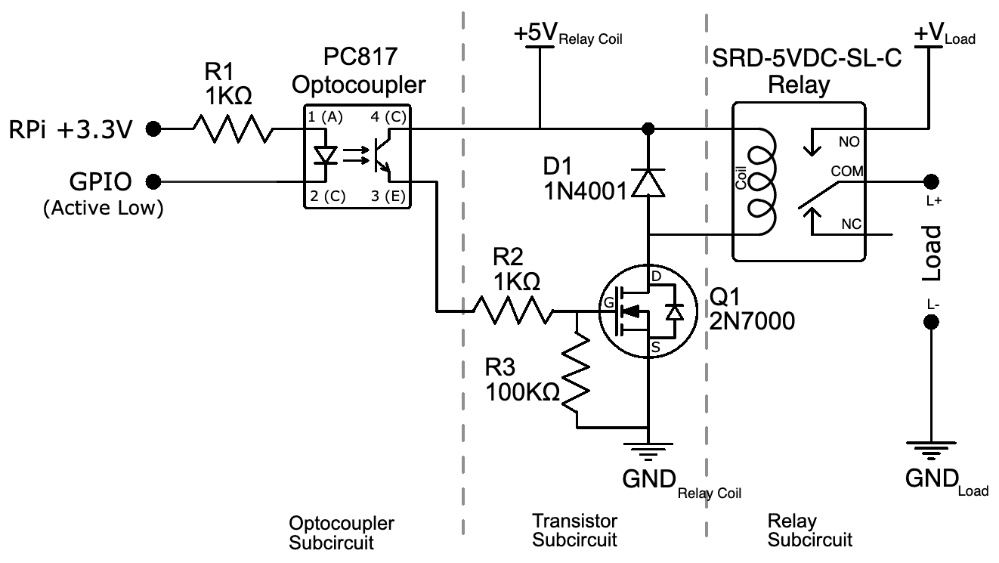

图 7.1 - 继电器驱动电路

这是我们将在本章逐步构建的电路。这个电路代表了您在 eBay、Banggood 和类似网站上找到的许多继电器控制模块。这些板确实很方便使用 - 当您让它们工作时。不幸的是，缺乏清晰的文档往往会使得让它们工作起来棘手和困难，特别是如果您是电子新手。

我们将要构建并探索图 7.1 中所示的三个子电路。这将帮助您了解光耦、晶体管和继电器作为开关的工作原理，以及它们为什么经常被串联在一起来控制继电器。这些知识还将帮助您在无法使其工作时逆向工程预制继电器控制模块。

在我们讨论光耦子电路之前，我们需要首先讨论负载电压和电流。

# 确定负载的电压和电流

*负载*是您想要控制的东西，或者在本章中，打开和关闭。LED、晶体管、光耦、继电器、灯、电动机、加热器、泵、自动车库门和电视都是负载的例子。如果您回到图 7.1，您会注意到图表右侧的“负载”一词。这是您连接想要打开或关闭的东西的地方。

*晶体管、光耦*和*继电器*组件出现在上述*负载列表*中。回到图 7.1，继电器出现为晶体管子电路的负载，而晶体管子电路出现为光耦子电路的负载。

了解您想要控制的负载的两个属性是很重要的：

+   负载需要多少电压？

+   负载需要多少电流？

有时，这些属性可以在设备本身或其手册或数据表中找到。其他时候，它们需要被计算或者负载需要被手动测量。

知道这些属性很重要，因为它们影响了电路中选择哪些组件，包括适合的电源规格。在本章的整个电路构建过程中，我们将提到负载电流，因此稍后会有更多的上下文。现在，让我们看看如何测量直流电机的电流负载。

## 测量直流电机的电流需求

电机是人们想要控制的常见物品，它们是电流测量的一个很好的例子。让我们进行一个练习来测量我们的直流电机所使用的电流：

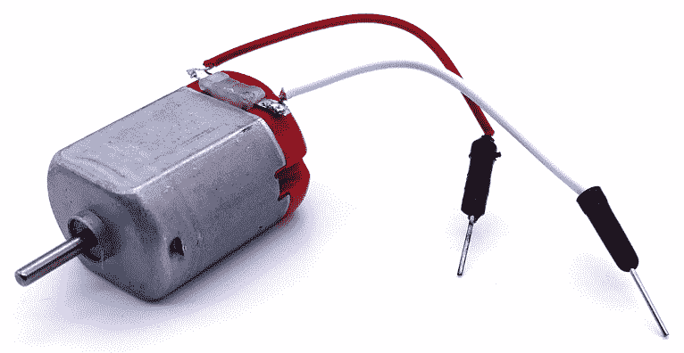

图 7.2 - R130 直流电机

上面的照片显示了一个典型的 130（R130）直流电机，以及一组跳线引线焊接到电机的端子上，以便可以轻松地将其插入面包板。这个电机有一个红色的背面，但其他颜色也很常见 - 尤其是透明/白色。颜色对电机规格没有影响。

在进行以下步骤时，如果您不确定如何将万用表置于电流测量模式，请参考您的万用表手册。

以下是要遵循的步骤：

1.  按照图 7.3 中所示的连接电路：

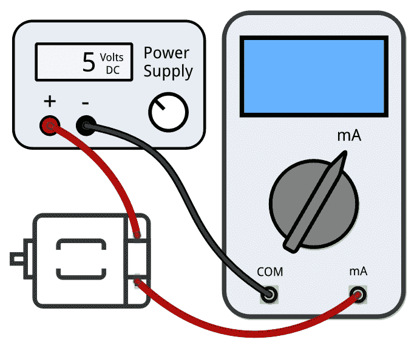

图 7.3 - 使用万用表测量电流

我们假设这里的电机是章节开头的*技术要求*部分提到的电机。这个电机足够小，可以从面包板电源供电，通常可以提供 500mA 到 800mA。对于更大的电机（以及其他你不知道其额定值并想要测量的物品），你将需要一个更强大的电源。

如果你正在用 USB 手机充电器给面包板电源供电，请用万用表检查你的电源输出的 5 伏特电压，确保它提供的是大约 5 伏特。低功率充电器和质量差的 USB 电缆可能无法提供足够的电源使电源正常工作。理想情况下，阅读数据表并使用建议的电源适配器，通常是 7 到 12 伏特和 1 安培。

1.  确保你的万用表设置为测量**毫安**（**mA**），并且红色表笔连接到正确的引脚输入（通常标有 A 或 mA）。如果你的数字万用表有一个µA 输入，*不要使用*，否则可能会烧坏你的数字万用表的保护保险丝（保险丝可以更换）。

1.  给电路供电，电机会旋转。

1.  你的万用表将显示电机的电流消耗。记下这个值。这被称为**连续**或**自由电流**，是电机在轴上自由旋转时使用的电流。

1.  断开电机的电源。

1.  用一把钳子，抓住电机的轴，使其无法旋转。

1.  重新给电机供电，并迅速观察（并记下）数字万用表的读数。这个读数被称为**堵转电流**。电机在其轴被强行停止移动时会使用最大电流。

1.  断开电机的电源。

我们现在已经测量了两种电流。我的 R130 电机的读数如下（你的可能会有所不同）：

+   **连续或自由电流**：~110mA 到~200mA——随着电机使用而发热，它将使用更少；~200mA 的测量是在电机冷却时进行的。一分钟后，它下降到了~110mA。

+   **堵转电流**：这是~500mA 到~600mA。

这意味着我们的电机在正常运行时需要 200mA 到 600mA 的电流，任何我们希望用于电机的电路必须能够真实地处理 600mA，以免在电机停转时受到损坏（或者我们需要设计合适的保护，然而，这超出了我们的范围）。

有趣的是，还有一个**启动电流**，这是电机启动时发生的瞬时峰值电流，但我们无法用通用数字万用表来测量。

现在我们已经得到了 R130 电机的电流消耗，让我们收集继电器和 LED 的更多电流数据。

## 测量继电器和 LED 的电流需求

当我们到达标题为*使用继电器作为开关*的部分时，我们还将测量 LED 和继电器的电流消耗。你可以使用前一部分的*步骤 1 到 4*来测量 LED 和电阻对的电流消耗。执行这个测量的设置如下图所示：

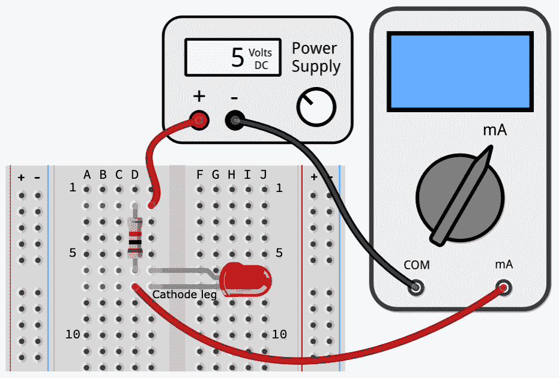

图 7.4 - 测量通过电阻/LED 电路的电流

这是我们遵循的基本流程：

1.  我们在*图 7.3*中所示的电机位置上连接了一个 LED 和一个 1kΩ电阻（或继电器）。

1.  将你的万用表设置为毫安模式。

1.  给电路供电。

1.  用你的万用表测量电流。

一旦你完成了（并记下）你得到的测量值，从面包板上移除 LED 和电阻，接入继电器并进行相同的测量。

下图显示了 SRD-05VDC-SL-C 继电器以及你需要连接的继电器端子。请注意，你需要焊接排针（如图所示）或导线（一个很好的选择是将杜邦线剪成一半）到继电器的端子上，因为它不能直接插入面包板：

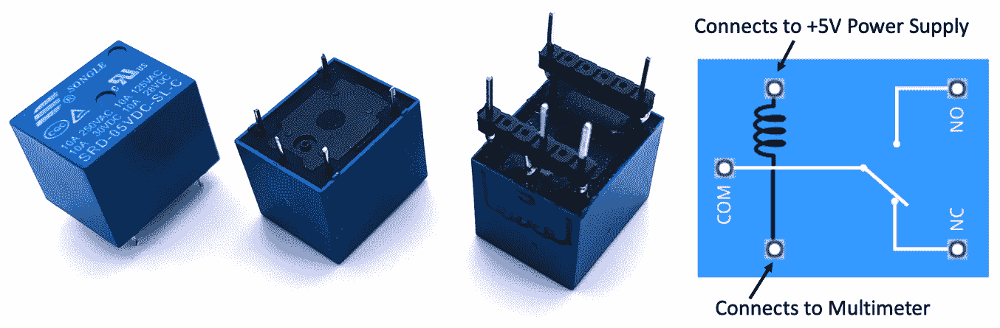

图 7.5 - SRD-05VDC-SL-C 继电器

使用 5V 电源，您应该在万用表上获得类似以下数值：

+   串联有 5mm 红色 LED 和 1000Ω电阻：3mA（来自欧姆计算的数值并向上取整*I = (5V - 2.1V) / 1000Ω = 2.9mA*)

+   继电器：70mA 至 90mA（来自数据表并经过我的测量确认）

有关如何计算 LED 的电流的过程在第六章中已经讨论过，*软件工程师的电子学 101*。唯一的区别是，这里我们使用的是 5 伏电源和 1kΩ电阻，而不是在那一章中使用的 3.3 伏和 200Ω电阻。

请注意，我们将使用的光耦合器和 MOSFET 元件确实具有影响通过连接负载的电流的电压降方面。出于简洁起见，这些电压降的影响对我们的目的来说是不重要的，因此在本章的计算中不予考虑。

您现在已经学会了如何使用万用表测量直流电机、LED/电阻对和继电器的电流。了解您想要控制的设备以及您要连接的子电路的电流限制和期望，甚至是一个至关重要的信息，这样您在设计电路和选择合适的电源时可以选择合适额定的元件。

在本章中，我们将参考您在本节中进行的测量，探索光耦合器、MOSFET 和继电器。具体来说，我们将比较这些元件的电流额定值（在各自的数据表中找到）与我们的直流电机、LED/电阻和继电器的测量，并考虑可以用于直接控制哪个负载的元件。

我们将首先学习光耦合器及其用作开关的方法。

# 使用光耦合器作为开关

光耦合器（或光隔离器）是一种用于电气隔离两个电路的光控组件。这里显示了光耦合器的示意图和原理图符号：

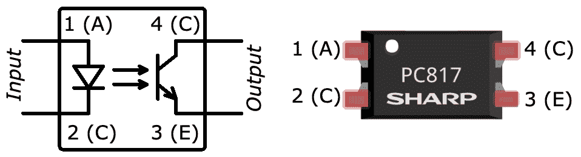

图 7.6 - 光耦合器符号和带有标记引脚的元件

光耦合器的两侧可以描述如下：

+   *输入*端：我们将连接到树莓派 GPIO 引脚的一侧

+   *输出*端：我们将连接到另一个电路的一侧

在*输入*端的光耦合器内部有一个内部 LED（您将在*图 7.6*中的光耦合器符号中注意到 LED 符号），而在*输出*端有一个对 LED 光线做出响应的光电晶体管。这意味着控制（即开关）从*输入*端到*外部*端的传递是通过光线完成的，因此两侧之间没有物理电气连接。对我们来说，这意味着输出端的任何故障或意外不应对我们的树莓派造成损害。PC817 的隔离额定为 5000 伏，远远超出我们预期在物联网电子设备中使用的任何电压。

当*输入*端 LED 关闭时，*输出*端光电晶体管关闭。然而，当 LED 被照亮（它在光耦合器元件内部，所以您看不到它）通过向引脚 1（阳极）和 2（阴极）施加电流时，光电晶体管被激活（打开），并允许电流在引脚 4（集电极）和 3（发射极）之间流动。

让我们创建一个简单的电路来演示 PC817 光耦合器，其规格如下：

+   输入端（LED）：具有以下数值：

+   典型的**正向电压（V[F])**为 1.2 伏直流

+   最大**正向电流（I[F])**为 50mA 直流

+   输出端（光电晶体管）：具有以下数值：

+   最大**集电极-发射极电压（V[CEO])**：80 伏直流

+   最大**集电流（I[C])**：50 毫安直流

+   **集电极-发射极饱和电压 V[CE(sat)]**在 0.1 至 0.2 伏范围内（基本上是电压降）

牢记这些规格，让我们开始搭建电路。

## 搭建光耦合器电路

我们将要构建以下图示的电路。这个电路使用 PC817 光耦器来电气隔离我们的树莓派和 LED 子电路：

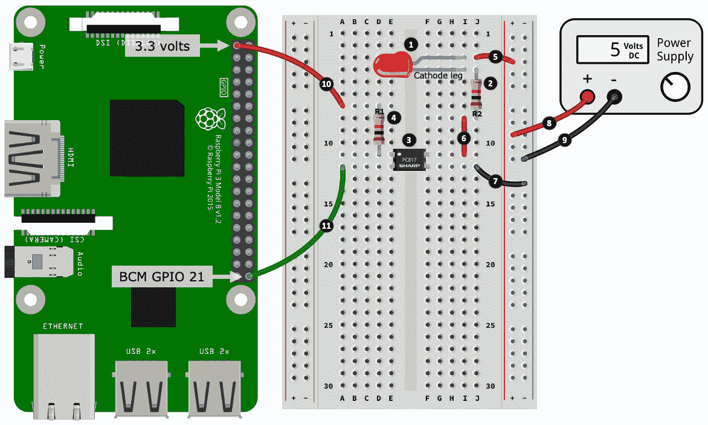

图 7.7 - 光耦器电路

这里的步骤编号与*图 7.7*中编号的黑色圆圈相匹配：

1.  将 LED 放入你的面包板中，注意根据图示放置 LED 的阴极腿。

1.  将一个 1kΩ电阻放入面包板中。这个电阻的一端与 LED 的阴极腿联通。

1.  将 PC817 光耦 IC 放入面包板中。IC 上的白点表示 IC 的引脚 1。你的 IC 可能有也可能没有白点，但是 IC 上应该有一个明显的标记告诉你第一个引脚。请参考*图 7.6*以获取所有引脚编号信息。

1.  将一个 1kΩ电阻放入你的面包板中。这个电阻的一端连接到 PC817 的引脚 1。

1.  将 LED 的阳极腿连接到右侧电源轨的正电源。

1.  将 PC817 的引脚 4 连接到你在*步骤 2*中放置的电阻的另一端。

1.  将 PC817 的引脚 3 连接到右侧电源轨的负电源。

1.  将 5 伏电源的正输出连接到右侧正电源轨。

1.  将电源的负输出连接到右侧负电源轨。

1.  将你在*步骤 4*中放置的电阻的另一端连接到树莓派上的 3.3 伏引脚。

1.  最后，将 PC817 的引脚 2 连接到树莓派上的 GPIO 21。

在*图 7.7*中，你可以直接将*步骤 8*和*9*（连接到外部电源）的导线连接到树莓派的+5 伏引脚和一个 GND 引脚。我们只是为红色 LED 使用了少量电流，但是对于更大的电流负载，你必须使用外部电源。树莓派上的+5 伏引脚直接连接到你用来给树莓派供电的电源。使用这个电源来为你的电路供电会有效地消耗树莓派可用的电流。如果消耗过多，你的树莓派将会重启！**请注意（这很重要）这个行为的警告是****你将失去光耦器提供的电气隔离**，因为你将会将*输入*和*输出*端连接在一起（记住，*输入*和*输出*端并不在光耦器内部电气连接，因为控制是通过光实现的）。

现在你已经完成了电路的搭建，我们将测试电路并探索使其工作的代码。

## 用 Python 控制光耦

首先运行`chapter07/optocoupler_test.py`文件中的代码，并观察 LED 的闪烁。以下是负责闪烁的代码部分：

```py
# ... truncated ...
  pi.write(GPIO_PIN, pigpio.LOW) # On.     # (1)
  print("On")
  sleep(2)
  pi.write(GPIO_PIN, pigpio.HIGH) # Off.   # (2)
  print("Off")
  sleep(2)
# ... truncated ...
```

以下是发生的事情：

+   在第（1）行，GPIO 21 是低电平，*输入*端的内部 LED 是开启的。*输出*端的光电晶体检测到这种光并被激活，允许电流在输出端的集电极（引脚 4）和发射极（引脚 3）之间流动，因此我们的红色 LED 亮起。

+   PC817 电路的输入端被布线为*主动低电平*，这就是为什么在第（1）行，GPIO 21 被设为低电平以打开电路，在第（2）行，GPIO 21 被设为高电平以关闭电路。另一种布线方式是*主动高电平*。如果你想要尝试并将电路改为主动高电平，你需要将*图 7.7*中的*步骤 10*的导线连接到 GND 引脚（而不是 3.3 伏引脚），并且在代码中颠倒`pigpio.LOW`和`pigpio.HIGH`语句。

我们本可以使用更低阻值的电阻 R1 来驱动输入端 LED，但是 1kΩ的电阻提供了超过光耦合器电路内部 LED 所需的电流（*(3.3V - 1.2V)/1000Ω = 2.1mA*）。您会看到 1kΩ、10kΩ和 100kΩ的电阻在许多电路中使用，因为这些都是比较常见的数值。我们还使用了 1kΩ的电阻 R2 来方便地驱动红色 LED。

您还记得上一章第六章中我们讨论过的内容吗？即我们不应该期望从树莓派 GPIO 引脚获得超过 8mA 的电流？是的，通过使用 PC817 光耦合器，我们现在可以通过在 GPIO 引脚和电路之间放置光耦合器来控制高达 50mA 的电流。此外，我们也不再受限于 GPIO 引脚的 3.3 伏电压，因为 PC817 可以处理高达 80 伏的电压。

记住，GPIO 引脚的主要作用是*控制*某物，而不是*为其供电*，因此始终要独立考虑*控制*和*电源*需求。

在前一节中，我们计算（或测量）了我们的电机、继电器和 LED 的电流消耗。以下是在输出端使用 5 伏电源的 PC817 光耦合器的数据：

+   LED 和 1kΩ的电阻需要 3mA 的电流。

+   继电器需要 70mA 至 90mA 之间的电流。

+   电机需要约 500mA 至 600mA（堵转电流）。

LED 的 3mA 小于光耦合器输出端的最大额定 50mA，因此可以直接在输出端驱动 LED。然而，继电器和电机需要超出 PC817 限制的电流，因此在输出端使用它们可能会损坏光耦合器。

虽然我们可以使用光隔离器作为数字开关，但它们通常被用作隔离屏障来驱动其他组件，这些组件反过来可以驱动需要更高电流的负载。当我们从*图 7.1*构建完整的继电器驱动电路时，我们将在后面看到这一点，但现在，让我们学习如何将晶体管用作数字开关。

# 使用晶体管作为开关

晶体管是当今使用最广泛的电子元件，也是数字革命的支柱。它们可以以两种基本方式使用——作为放大器或数字开关。我们的重点将放在数字开关上，我们将使用一种名为**金属氧化物半导体场效应晶体管**（**MOSFET**）的晶体管类型，具体来说是一种 N-沟道增强型 MOSFET——是的，这个名字有点拗口！

不要过分关注晶体管的冗长技术名称或存在的多种形式。这里的简单要点是，N-沟道增强型 MOSFET 作为数字开关效果很好，我们可以使用树莓派来控制它，或者后面将看到，也可以来自光耦合器等其他源。

场效应晶体管（FET）是*电压*控制的晶体管。另一种称为**双极晶体管**（**BJT**）的晶体管是*电流*控制的晶体管。BJT 在树莓派上使用完全没问题，但需要额外考虑。在*进一步阅读*部分中，您会找到有关晶体管的更多学习资料的链接。

以下练习将使用 2N7000，一种 N-沟道增强型 MOSFET，如*图 7.8*所示。引脚名称为***S***ource、***G***ate 和***D***rain。还有两种不同的封装样式，TO92 和 TO220。请注意，两种样式的 Source、Gate 和 Drain 引脚的排列方式是不同的：

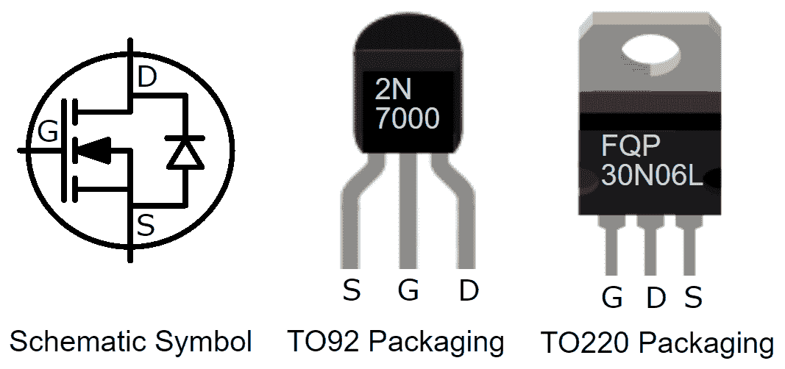

图 7.8 - N-沟道增强型 MOSFET 符号和常见封装样式

2N7000 在其数据表中具有以下规格：

+   最大**漏源电压（V[DSS])**为 60 伏直流

+   最大**连续漏极电流（I[D])**为 200 毫安直流

+   最大**脉冲漏极电流（I[DM])**为 500 毫安直流

+   **栅阈电压（V[GS(th)])**在 0.8 至 3 伏直流范围内

+   **漏极-源极开启电压（V[DS(on)]）**在 0.45 至 2.5 伏特直流范围内（电压降）

以下是如何解释关于 2N7000 的这些参数：

+   它可以安全地控制不超过 60 伏特（V[DSS]）和持续 200 毫安（I[D]）的负载，但脉冲 500 毫安（I[DM]）是可以的。

+   它理想情况下需要大于 3 伏特的电压才能打开（V[GS(th)]）。

+   它将在负载端电路上消耗 0.45 至 2.5 伏特（V[DS(on)]）的电压。

2N7000（以及我们将很快讨论的 FQP30N06L）是逻辑电平可比较的 MOSFET。它们适用于树莓派，因为它们的最大门电压 V[GS(th)]小于 GPIO 引脚的 3.3 伏特。

让我们开始建立一个使用 2N7000 的电路与我们的树莓派。

## 构建 MOSFET 电路

我们将分两部分建立我们的电路，首先是在面包板上放置组件：

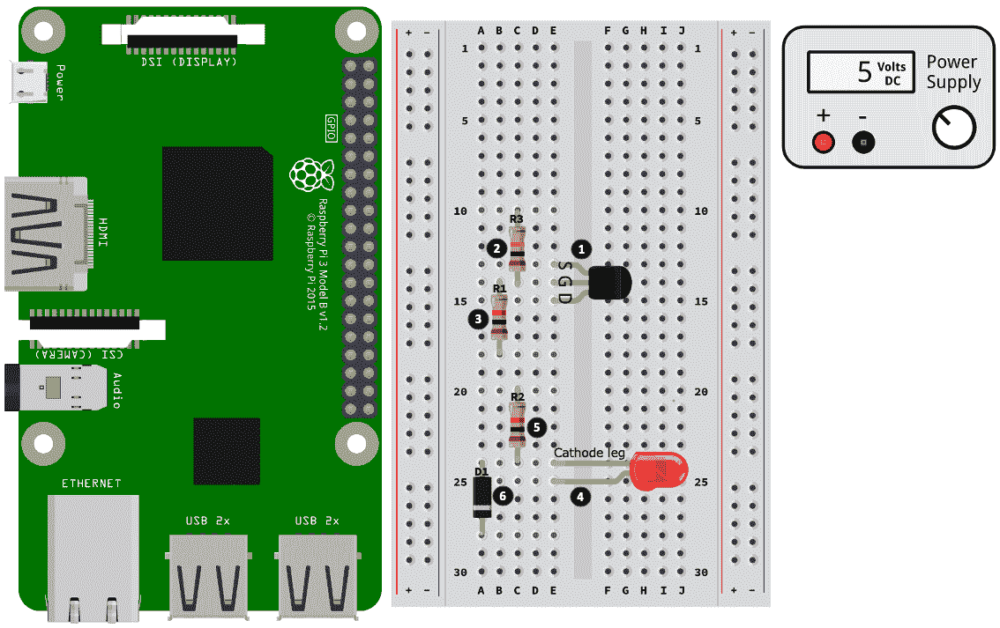

图 7.9 - MOSFET 晶体管电路（第一部分）

以下是我们建设的第一部分的步骤。步骤编号与*图 7.9*中编号的黑色圆圈相匹配：

1.  将 MOSFET 放入面包板中，注意根据源极、栅极和漏极的正确方向放置组件。我们的示例布局假定了一个 2N7000 MOSFET。如果您需要帮助识别腿，请参阅*图 7.8*。

1.  将 100kΩ电阻放入面包板中。这个电阻的一端连接到 MOSFET 的栅极。

1.  将 1kΩ电阻放入面包板中。这个电阻的一端也连接到 MOSFET 的栅极。

1.  将 LED 放入面包板中，注意根据其阴极腿的显示方向放置组件。

1.  将 1kΩ电阻放入面包板中。这个电阻的一端连接到 LED 的阴极腿。

1.  将二极管放入面包板中，使组件朝向底部的阴极腿（二极管外壳上带有条纹的一端）。

现在我们已经将组件放入面包板中，让我们把它们全部连接起来：

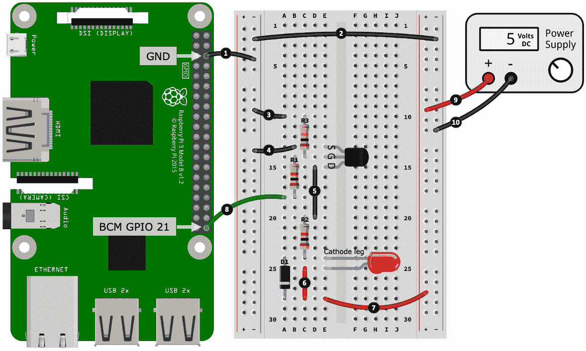

图 7.10 - MOSFET 晶体管电路（第二部分）

以下是第二部分建设的步骤。步骤编号与*图 7.10*中编号的黑色圆圈相匹配：

1.  将树莓派的 GND 引脚连接到右侧电源轨的负极。

1.  连接右侧和左侧电源轨的负极。

1.  将 100kΩ电阻连接到负电源轨。

1.  将 MOSFET 的源腿连接到负电源轨。

1.  将 MOSFET 的漏极连接到 1kΩ电阻。

1.  将 LED 的阳极腿连接到二极管的阴极腿。

1.  将 LED 的阳极腿（和二极管的阴极腿）连接到右侧电源轨的正极。

1.  将 1kΩ电阻连接到树莓派的 GPIO 21。

1.  将电源供应的正输出端连接到右侧电源轨的正极。

1.  将电源供应的负输出端连接到右侧电源轨的负极。

干得好。我们的电路建设完成了。在我们测试之前，让我们简要讨论一下这个电路。

请注意*图 7.10*（和*图 7.1*）中的 100kΩ电阻 R3。这是一个外部下拉电阻，确保当 GPIO 21 为高电平时，MOSFET 的 Gate 腿被拉到+3.3 伏特，而当它没有被拉到高电平时，它被连接到 GND（0 伏特）。MOSFET 具有电容电荷，因此如果没有下拉电阻，MOSFET 在从通（GPIO 21 为高电平）到断（GPIO 21 为低电平）的转换时可能会显得粘滞和缓慢，因为它在放电（请注意，此电路为主动高电平）。下拉电阻确保快速放电到断开状态。我们使用外部下拉电阻而不是在代码中激活的下拉电阻，以确保即使树莓派关闭电源或代码未运行时，MOSFET Gate 也被拉低。

您还会注意到 R1 和 R3 构成了一个电压分压器。1kΩ和 100kΩ的比例适合确保>3 伏特到达 MOSFET 的 Gate 腿以打开它。如果您需要关于下拉电阻和电压分压器的复习，我们在第六章中讨论过它们，*软件工程师的电子学 101*。

在电路中添加电阻时，例如添加下拉电阻，始终要考虑更改的更广泛影响。例如，如果添加电阻由于现有电阻的存在而创建了电压分压器，那么您需要评估更改对周围电路的影响。对于我们的情况，这是为了确保足够的电压到达 MOSFET 的 Gate 腿以打开它。

在运行下一节中的代码后，尝试移除 R3 并再次运行代码。我不能保证您会在您的端看到任何东西，但您可能会观察到，当 GPIO 21 变为低电平时，红色 LED 不是立即熄灭而是缓慢消失，并且它的行为不是平稳地淡入淡出而是表现得不稳定。

与光耦示例一样，由于 LED 示例的电流要求较低，您可以将电线的外部电源连接到树莓派的+5 引脚和一个 GND 引脚。

在对 MOSFET 电路有了基本理解之后，让我们运行并探索一个与我们的电路交互的简单 Python 程序。

## 用 Python 控制 MOSFET

运行`chapter07/transistor_test.py`文件中的代码，红色 LED 将先点亮然后熄灭，然后再淡入淡出。一旦确认电路工作正常，让我们继续看代码：

```py
# ...truncated ...
pi.set_PWM_range(GPIO_PIN, 100)             # (1)

try:
  pi.write(GPIO_PIN, pigpio.HIGH) # On.     # (2)
  print("On")
  sleep(2)
  pi.write(GPIO_PIN, pigpio.LOW) # Off.
  print("Off")
  sleep(2)
```

在这个例子中，我们使用 PWM。在第（1）行中，我们告诉 PiGPIO，对于 GPIO 21（`GPIO_PIN = 21`），我们希望其占空比受限于值范围 0 到 100（而不是默认的 0 到 255）。这是一个示例，说明了我们如何改变 PiGPIO 中占空比值的粒度。我们使用 0 到 100 只是为了使报告更容易，因为它映射到终端输出的 0%到 100%。

接下来，在第（2）行中，我们简单地打开和关闭 GPIO 一段时间，以测试晶体管电路，然后我们将看到 LED 在 2 秒延迟后点亮然后熄灭。

在以下代码的第（3）行中，我们使用 PWM 来淡入 LED，然后在前面代码块中的第（1）行设置的占空比范围内再次淡出它（第（4）行）：

```py
  # Fade In.
  for duty_cycle in range(0, 100):                  # (3)
      pi.set_PWM_dutycycle(GPIO_PIN, duty_cycle) 
      print("Duty Cycle {}%".format(duty_cycle))
      sleep(0.01)

  # Fade Out.
  for duty_cycle in range(100, 0, -1):              # (4)
      pi.set_PWM_dutycycle(GPIO_PIN, duty_cycle) 
      print("Dyty Cycle {}%".format(duty_cycle))
      sleep(0.01)
# ...truncated ...
```

让我们检查一下我们的继电器和电机是否可以安全地与这个晶体管电路一起使用，考虑到我们的 2N7000 额定电流为 200 毫安：

+   继电器可以用来替代 LED，因为它只需要 70mA 到 90mA 之间的电流。

+   电机需要~200mA 来自由旋转（连续电流），所以可能是安全的...或者不是？让我们看看。

在本章早些时候测试电机时，我们预计它在冷态时需要约 200mA（冷态时的*连续*电流）和约 500mA 至 600mA（*堵转*电流）之间的电流- *请记住这些是我的测量值，所以请用您的测量值替换*。因此，原则上，我们的 2N7000 只要电机不承受负载就可以。实际上，一旦我们在电机轴上施加负载，它将需要超过 200mA 的连续电流。在这方面，2N7000 可能不是驱动这个电机的理想晶体管。我们需要寻找一个可以轻松处理 600mA 或更多连续电流的 MOSFET。我们很快就会看到 FQP30N06L MOSFET，它可以处理这个电流以及更多。

当 LED 在 PWM 相关代码中逐渐变暗时，如果您将电机连接到电路中以替代 LED/电阻对，您会注意到它会加速然后减速。您刚刚发现了如何使用 PWM 的占空比属性来控制电机的速度！我们将在[第十章](https://cdp.packtpub.com/hands_on_python_programming_for_iot/wp-admin/post.php?post=37&action=edit#post_34)中更详细地介绍电机，*使用舵机、电机和步进电机进行运动*。

要使用电机或继电器，必须使用外部电源，而不是树莓派上的+5 伏引脚。如果您尝试使用+5 伏引脚，可能会发现在运行代码时树莓派会重置。

我们不使用 PWM 控制继电器，因为它们切换速度太慢，而且如果它们工作（在非常低的 PWM 频率下），只会使它们耗损-但无论如何尝试一下，看看会发生什么；短暂的测试不会有害（尝试将代码中的频率从 8000 调整到 10，即`pi.set_PWM_frequency(GPIO_PIN, 10)`）。

在我们的电路中，还有 1N4001 二极管 D1。这被称为反冲或抑制二极管。它的作用是保护电路免受在关闭电源时可能发生的继电器或电机等电磁元件的反向电压脉冲。诚然，我们的 LED 不是磁性的，但是有它在场也不会有任何害处。

每当您控制一个工作在电磁学上的组件（也称为感性负载）时，都要正确安装反冲抑制二极管。

在*图 7.8*中，我们还有 FQP30N06L 的插图。这是一种能够驱动高电流负载的功率 N-通道增强模式 MOSFET。它在数据表中具有以下规格：

+   最大**漏源电压（V[DSS])**为 60 伏特直流

+   最大**连续漏极电流（I[D])**为 32A DC（安培而不是毫安！）

+   最大**脉冲**漏极电流（I[DM]）为 128A DC

+   **栅极阈值电压（V[GS(th)])**在 1 至 2.5 伏特直流范围内（<5 伏特，因此它是逻辑电平兼容的）

+   **漏-源导通电压（V[SD])**最大为 1.5 伏特直流

您可以在前面的电路中替换 FQP30N06L（或另一个 N-通道增强模式逻辑电平 MOSFET），它会起作用，但请记住以下几点：

+   FQP30N06L 的 G、D 和 S 引脚的顺序与 2N7000 不同，因此您需要调整接线。

+   在处理更高电压和电流时，最好使用光耦隔离器将 MOSFET 与树莓派隔离开（我们将在讨论继电器时看到这种配置）。

+   在高电流下，功率 MOSFET 可能会变得非常热-周围的元件和导线甚至是面包板都可能会熔化，因此在使用时要小心谨慎。

当控制高功率负载时，高功率 MOSFET 可能会变热，并且可以安装散热器，例如，FQP30N06L 的金属顶部上有一个散热器连接的孔。关于何时需要散热器的决定因素和计算超出了我们的范围，但是如果您的 MOSFET 变得太热（并且您在其数据表参数范围内使用它），那么请添加散热器。

如果您喜欢使用 MOSFET 控制更高电流负载的想法，您可能会喜欢在 eBay 等网站上研究现成的 MOSFET 模块。在学习了光耦合器和 MOSFET 之后，您现在可以理解这些模块是如何构建的 - 有些直接使用 MOSFET 直接连接到控制设备（即 GPIO 引脚），就像我们刚刚做的那样，而其他一些则在控制设备和 MOSFET 之间放置光耦合器。

您已经学会了如何使用 MOSFET 晶体管作为数字开关的基础知识。接下来，我们将把这些知识与光耦合器的学习结合起来，在面包板上构建我们的继电器驱动电路。

# 使用继电器作为开关

经典继电器是一种电机械元件，允许较小电流的设备开关更高电流的设备或负载的开关。原则上，它们就像我们之前使用的 MOSFET 或光耦合器一样。那么为什么要使用继电器？以下是一些原因：

+   对于高电压和电流负载，它们往往比等效的 MOSFET 便宜得多。

+   在高电流下，它们不会像 MOSFET 那样变得不可触摸的热。

+   与光耦合器类似，继电器还提供输入和输出电路之间的电气隔离。

+   它们只是电控开关，因此非电气工程师很容易理解和使用。

+   它们经受住了时间的考验，被证明是控制高负载的简单而健壮的方式（尽管它们最终会磨损 - SRD-05VDC-SL-C 的数据表列出了其额定寿命为 100,000 次操作）。

还有一种被称为**固态继电器**（**SSR**）的继电器类型，它没有移动部件，但通常比可比较的机械继电器更昂贵。

我们的第一个任务是创建我们的电路，接下来我们将完成这一步。

## 构建继电器驱动电路

让我们构建我们的继电器驱动电路。我们将分三部分进行，首先是放置组件：

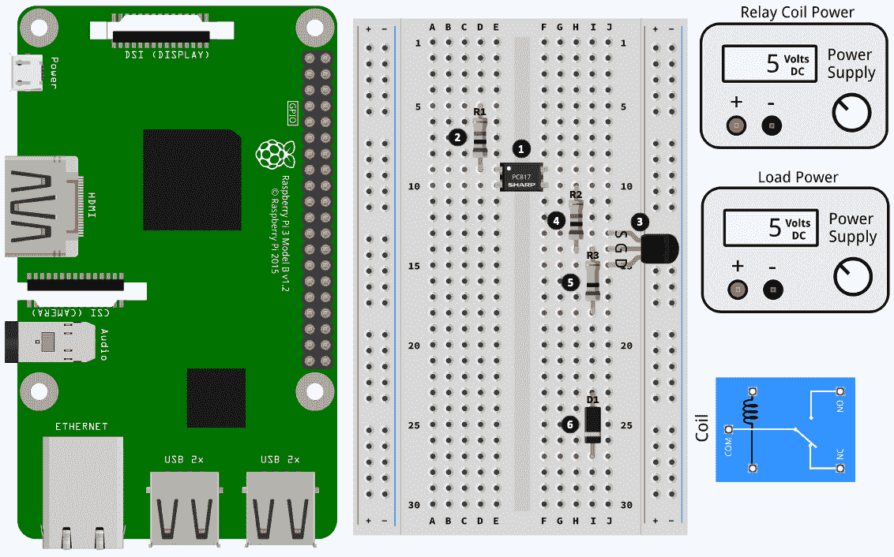

图 7.11 - 继电器驱动电路（第一部分）

以下是建设的第一部分的步骤。步骤编号与*图 7.11*中的编号黑色圆圈相匹配：

1.  将 PC817 放入面包板中，注意 IC 的引脚 1 连接到左侧面包板银行，如图所示。

1.  将 1kΩ电阻器放入面包板中。电阻器的一端连接到 PC817 的引脚 1。

1.  将 MOSFET 放入面包板中，注意正确放置源腿、栅极和漏极。我们的示例布局假定使用 2N7000 MOSFET。如果需要帮助识别腿部，请参阅*图 7.8*。

1.  将 1kΩ电阻器放入面包板中。这个电阻器的一端连接到 MOSFET 的栅极。

1.  将 100kΩ电阻器放入面包板中。这个电阻器的一端也连接到 MOSFET 的栅极。

1.  将二极管放入面包板中，注意正确放置组件，使带有标记的阴极腿（组件末端）指向面包板底部。

现在您已经放置了各个组件，接下来我们将连接这些组件：

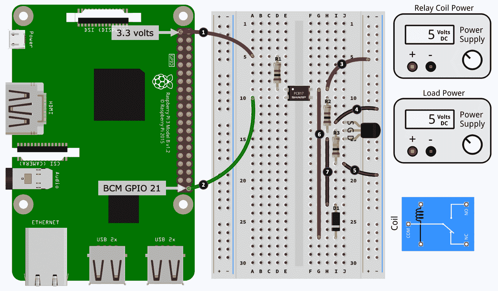

图 7.12 - 继电器驱动电路（第二部分）

以下是第二部分建设的步骤。步骤编号与*图 7.12*中的编号黑色圆圈相匹配：

1.  将您在上一个*步骤 2*中放置的电阻器连接到树莓派上的 3.3 伏引脚。

1.  将 PC817 的引脚 2 连接到树莓派上的 GPIO 21。

1.  将 PC817 的引脚 4 连接到右侧电源轨的正轨。

1.  将 MOSFET 的源腿连接到右侧电源轨的负轨。

1.  将连接到 MOSFET 的漏极的 100kΩ电阻器连接到右侧电源轨的负轨。

1.  将 PC817 的引脚 4 连接到二极管的阴极腿。

1.  将 MOSFET 的漏极引脚连接到二极管的阳极引脚。

最后，我们将连接电源和继电器：

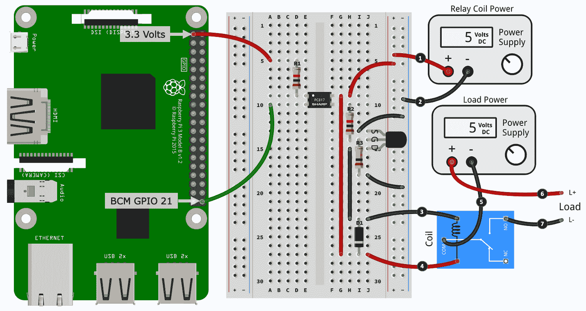

图 7.13 - 继电器驱动电路（3/3）

以下是构建的第三部分和最后一部分的步骤。步骤编号与*图 7.13*中的编号黑色圆圈相匹配：

1.  将右侧电源轨道的正轨连接到 5 伏特电源的正输出端。

1.  将右侧电源轨道的负轨连接到 5 伏特电源的负输出端。

1.  将二极管的阳极引脚连接到继电器的一个线圈端子。

1.  将二极管的阴极引脚连接到继电器的另一个线圈端子。

1.  将*另一个*5 伏特电源的负输出端连接到继电器的 com 端子。

在*步骤 5*中，您必须为这个电路使用两个不同的外部电源，因为继电器线圈的电流要求和潜在的继电器负载很可能太大，无法从树莓派的电源中借用。

1.  将*另一个*5 伏特电源的正输出端连接到负载的正输入端（例如，电机上的一个端子）。

1.  最后，将继电器的**NO**（**常开**）端子连接到负载的正输入端。

在继电器上使用 NO 端子意味着负载默认处于关闭状态，只有在继电器吸合时才通电，这发生在 GPIO 21 为低电平时（记住这个电路是*低电平有效*）。如果将负载连接到继电器中的**NC**（**常闭**）端子，负载将默认通电，即使树莓派关闭也是如此。

干得好！您完成了面包板电路，如*图 7.13*所示。这是与本章开头的*图 7.1*中显示的原理图相匹配的面包板电路。该面包板电路显示了一个 5 伏特的*继电器线圈电源*和一个 5 伏特的*负载电源*。然而，该电路可以使用不同的电源，但需要遵循以下几点：

+   在这个电路中使用的电阻和 2N7000 MOSFET 能够驱动一个 12 伏特的继电器，比如 SRD-12VDC-SL-C。您只需要确保*继电器线圈电源*是 12 伏特而不是 5 伏特。

+   负载电源被说明为 5 伏特，但是，如果您的负载需要更高的电压（在继电器规格内），可以增加。

现在我们有了一个完成的电路，让我们运行一个 Python 程序来控制继电器。

## 使用 Python 控制继电器驱动电路

运行以下代码，该代码位于`chapter07/optocoupler_test.py`文件中。继电器应该会发出点击声并在 2 秒后停止。这是我们创建和测试光耦电路时使用的相同代码，因为我们的树莓派连接到了光耦。

我们之前学习 MOSFET 时看到，我们可以直接将 MOSFET 连接到 GPIO 引脚并控制继电器，而无需光耦。那么，为什么前面的电路有一个光耦呢？

答案是我们的电路在技术上并不需要，而且有现成的继电器模块（尽管较少）不带有光耦。然而，有一个光耦存在并没有坏处，因为它提供了一定程度的电气隔离保护，以防继电器控制电路失效或在接线电源时发生意外。

最后，关于在 eBay 等网站上可以找到的具有多个继电器的继电器模块呢？通常只有一个继电器电路被复制多次——通常您可以为每个继电器计数一个晶体管和光耦对（尽管光耦和晶体管可以以芯片形式出现，即多个光耦或多个光耦在一个封装中，因此在某些模块上您可能只会看到芯片）。另外，请注意，有些模块将使用 BJT 而不是 MOSFET。如果您可以读取元件的零件号，您可以随时进行网络搜索以确定它们是什么。

最后，为了总结我们对打开和关闭的探索，这里是一个比较本章中使用的开关元件的表格：

| - 光耦 | MOSFET | 继电器 |
| --- | --- | --- |
| - 结构 | 固态 | 固态 | 机械 |
| - 电流 | 交流或直流（取决于光耦） | 仅直流（从 TRIACS 开始研究交流） | 交流和直流 |
| - 成本 | $ - $$ | $（低容量）至$$$（高容量） | $ |
| - 很热（不能触摸） | 否 | 对于高电流功率 MOSFET 是 | 否 |
| - 控制电压/电流 | 低（需要打开和关闭内部 LED） | 低（需要对栅极施加电压） | 高（需要通电继电器线圈） |
| - 负载电压/电流 | 低（例如，PC817 最大 50mA） | 低（例如，2N27000 为 200mA）；高（例如，FQP30N06L 为 32A） | 高（例如，SRD-05VDC-SL-C 10A） |
| - 电气隔离 | 是 | 否 | 是 |
| - 示例应用 | 在控制电路和被控电路之间提供电气隔离 | 允许低电流/电压电路控制更高电压/电流电路 | 允许低电流/电压电路控制更高电压/电流电路 |
| - 寿命 | 长寿命 | 长寿命 | 短寿命（活动部件最终会磨损） |
| - 使用 PWM | 是 | 是 | 不是——继电器无法切换得足够快，而且只会更快地磨损继电器！ |

恭喜您完成了本章！您现在了解了多种控制具有电压和电流要求的负载的方法，这些要求超出了树莓派 GPIO 引脚的 3.3 伏特/8 毫安的限制。

# 总结

在本章中，我们学习了如何打开和关闭开关。我们首先简要回顾了典型的继电器驱动电路，然后学习了如何使用万用表测量直流电机、LED 和继电器的电流需求。接下来，我们讨论了光耦的特性，并学会了如何将其用作数字开关。然后，我们讨论了 MOSFET，并发现了如何将其用作开关和使用 PWM 进行电机速度控制。

本章中学到的信息、电路和练习将帮助您做出明智的决策，并进行必要的计算和测量，以选择合适的元件并创建可以安全地从树莓派引脚中获取更多电流和更高电压的电路，用于打开和关闭设备和其他负载。

我们对本章的方法是逐步探索和构建继电器驱动电路，这为您提供了一个实际示例，说明了为什么和如何将开关元件串联起来控制更高功率的元件和/或负载。此外，我们了解到光耦可以用于电气隔离电路，这可以是一种有用和实用的技术，可以帮助我们隔离和保护树莓派，以防电路故障或接线错误造成意外损坏。

在下一章中，我们将关注不同类型的 LED、蜂鸣器和可视元件，这些元件可以用来向用户发出信号或显示信息。

# 问题

最后，这里是一系列问题，供您测试对本章材料的了解。您将在本书的“评估”部分找到答案：

1.  在控制晶体管时，MOSFET 和 BJT 有何不同？

1.  您正在使用 MOSFET 控制电机，但是当您关闭 MOSFET（例如，使 GPIO 引脚低电平）时，电机并没有立即关闭，而是减速旋转。为什么？

1.  您选择了一个随机的 MOSFET，想要从树莓派 3.3 伏特的 GPIO 控制它，但它不起作用。可能的问题原因是什么？

1.  除了开关功能，光耦和继电器与晶体管不同的常见特征是什么？

1.  主动低电平和主动高电平的 GPIO 有什么区别？

1.  为什么我们更喜欢在 MOSFET 的栅极上使用物理下拉电阻，而不是在代码中激活的下拉电阻？

1.  对于直流电机，失速电流代表什么？

1.  直流电机的连续电流和自由电流有什么区别？

# 进一步阅读

以下教程是关于晶体管、它们的各种类型和应用的全面介绍：

+   [https://www.electronics-tutorials.ws/category/transistor]（从 MOSFET 部分开始）
