# 第八章：灯光、指示灯和显示信息

在上一章中，我们探讨并学习了如何使用光耦、晶体管和继电器电路，以及这三个组件如何共同工作以创建一个常见的继电器控制模块。我们还介绍了如何使用万用表测量负载的电流使用量，以便您可以就应该使用什么方法或组件来开关或控制外部负载做出明智的决定。

在本章中，我们将介绍使用 RGB LED 制作颜色的两种替代方法，并创建一个简单的应用程序来监视树莓派的 CPU 温度，并在 OLED 显示屏上显示结果。最后，我们将看到如何结合 PWM 和蜂鸣器来发出声音。

完成本章后，您将拥有知识、经验和代码示例，可以根据自己的项目需求来调整，以便在需要向用户显示信息、发出声音或简单地用灯光吸引他们的情况下使用。此外，您所学到的内容也可以适用于其他类型的兼容显示屏和照明设备，如果您希望进一步探索这些主题的话。

本章将涵盖以下主题：

+   使用 RGB LED 制作颜色

+   使用 SPI 控制多色 APA102 LED 灯带

+   使用 OLED 显示屏

+   使用蜂鸣器和 PWM 发出声音

# 技术要求

要完成本章的练习，您需要以下内容：

+   树莓派 4 型 B

+   Raspbian OS Buster（带桌面和推荐软件）

+   至少需要 Python 版本 3.5

这些要求是本书中代码示例的基础。可以合理地期望，只要您的 Python 版本是 3.5 或更高，代码示例应该可以在树莓派 3 型 B 或不同版本的 Raspbian OS 上无需修改即可运行。

您可以在此处的 GitHub 存储库的`chapter08`文件夹中找到本章的源代码：[`github.com/PacktPublishing/Practical-Python-Programming-for-IoT`](https://github.com/PacktPublishing/Practical-Python-Programming-for-IoT)。

您需要在终端中执行以下命令来设置虚拟环境并安装本章代码所需的 Python 库：

```py
$ cd chapter08               # Change into this chapter's folder
$ python3 -m venv venv       # Create Python Virtual Environment
$ source venv/bin/activate   # Activate Python Virtual Environment
(venv) $ pip install pip --upgrade        # Upgrade pip
(venv) $ pip install -r requirements.txt  # Install dependent packages
```

以下依赖项已从`requirements.txt`中安装：

+   **PiGPIO**：PiGPIO GPIO 库（[`pypi.org/project/pigpio`](https://pypi.org/project/pigpio)）

+   **Pillow**：Python Imaging Library（PIL）（[`pypi.org/project/Pillow`](https://pypi.org/project/Pillow)）

+   **Luma LED Matrix Library**（[`pypi.org/project/luma.led_matrix`](https://pypi.org/project/luma.led_matrix)）

+   **Luma OLED Library**（[`pypi.org/project/luma.oled`](https://pypi.org/project/luma.oled)）

本章练习所需的电子元件包括以下内容：

+   1 x 无源蜂鸣器（额定电压 5 伏）

+   1 x 1N4001 二极管

+   1 x 2N7000 MOSFET

+   2 x 15Ω、200Ω、1kΩ和 100kΩ电阻

+   1 x 带有共阳的 RGB LED（数据表：[`pdf1.alldatasheet.com/datasheet-pdf/view/292386/P-TEC/PL16N-WDRGB190503.html`](https://pdf1.alldatasheet.com/datasheet-pdf/view/292386/P-TEC/PL16N-WDRGB190503.html)）

+   1 x SSD1306 OLED 显示屏（带有 I2C 接口）或另一款与 Luma OLED Python 库兼容的型号（数据表（驱动 IC）：[`www.alldatasheet.com/datasheet-pdf/pdf/1179026/ETC2/SSD1306.html`](https://www.alldatasheet.com/datasheet-pdf/pdf/1179026/ETC2/SSD1306.html)）

+   1 x APA102 RGB LED 灯带（数据表（单个 APA102 模块）：[`www.alldatasheet.com/datasheet-pdf/pdf/1150589/ETC2/APA102.html`](https://www.alldatasheet.com/datasheet-pdf/pdf/1150589/ETC2/APA102.html)）

+   1 x 逻辑电平转换模块

+   1 x 外部电源（例如 3.3V/5V 面包板电源）

让我们首先看看如何使用 PWM 来设置 RGB LED 的颜色。

# 使用 RGB LED 和 PWM 制作颜色

在本节中，我们将学习如何使用**脉宽调制**（**PWM**）与 RGB LED 一起创建不同的颜色。作为提醒，PWM 是一种创建可变电压的技术，当应用于 LED 和电阻对时，可以用来改变 LED 的亮度。我们首先在第二章中讨论了 PWM 并用它来改变 LED 的亮度，*使用 Python 和物联网入门*。然后我们在第五章中更深入地讨论了 PWM，*将树莓派连接到物理世界*。

RGB LED 是一个单一包装中的三个单色 LED（红色、绿色和蓝色），如*图 8.1*所示：

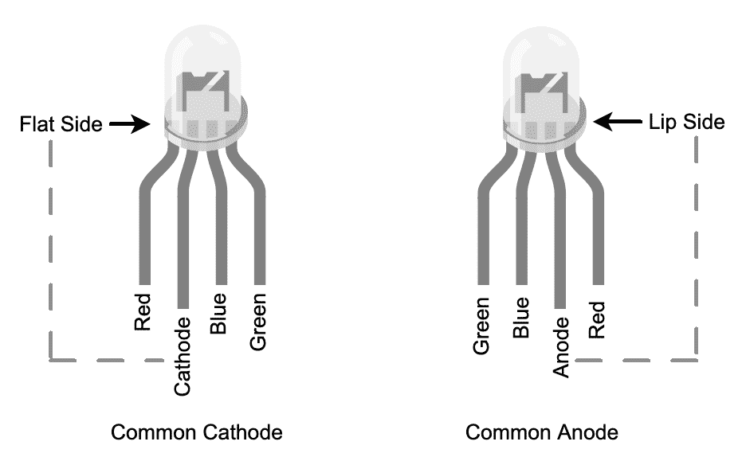

图 8.1 - RGB LED 品种

您会注意到显示了两种类型：

+   **共阴极**：红色、绿色和蓝色 LED 共享一个公共的*阴极*腿，这意味着共腿连接到负电压或地面电压源 - 阴极 = 负极。

+   **共阳极**：红色、绿色和蓝色 LED 共享一个公共的*阳极*腿，这意味着共腿连接到正电压源 - 阳极 = 正极。

共腿将是四条腿中最长的。如果最长的腿最靠近 LED 外壳的平面一侧，那么它是共阴极类型。另一方面，如果最长的腿靠近唇部（因此离平面一侧最远），那么它是共阳极类型。

我们之前在第五章*，将树莓派连接到物理世界*中学习了如何使用 PWM 来设置单个 LED 的亮度，但是如果我们改变 RGB LED 中三种单独颜色的亮度会发生什么？我们混合单独的颜色来创建新的颜色！让我们创建一个电路并开始混合。

## 创建 RGB LED 电路

在本节中，我们将创建一个简单的电路来控制 RGB LED，并且我们将使用*共阴极*RGB LED（即，三个单独的 LED 共享一个公共的 GND 连接）。

我们将首先按照面包板上显示的*图 8.2*构建电路：

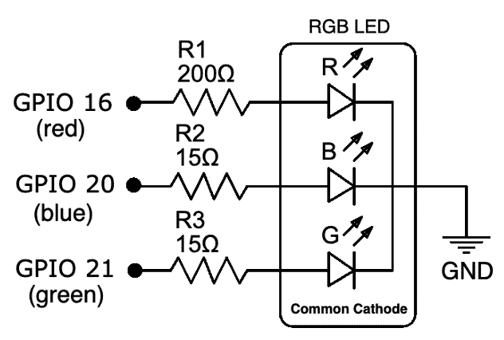

图 8.2 - 共阴极 RGB LED 原理图

以下是我们即将构建的原理图的伴随面包板布局：

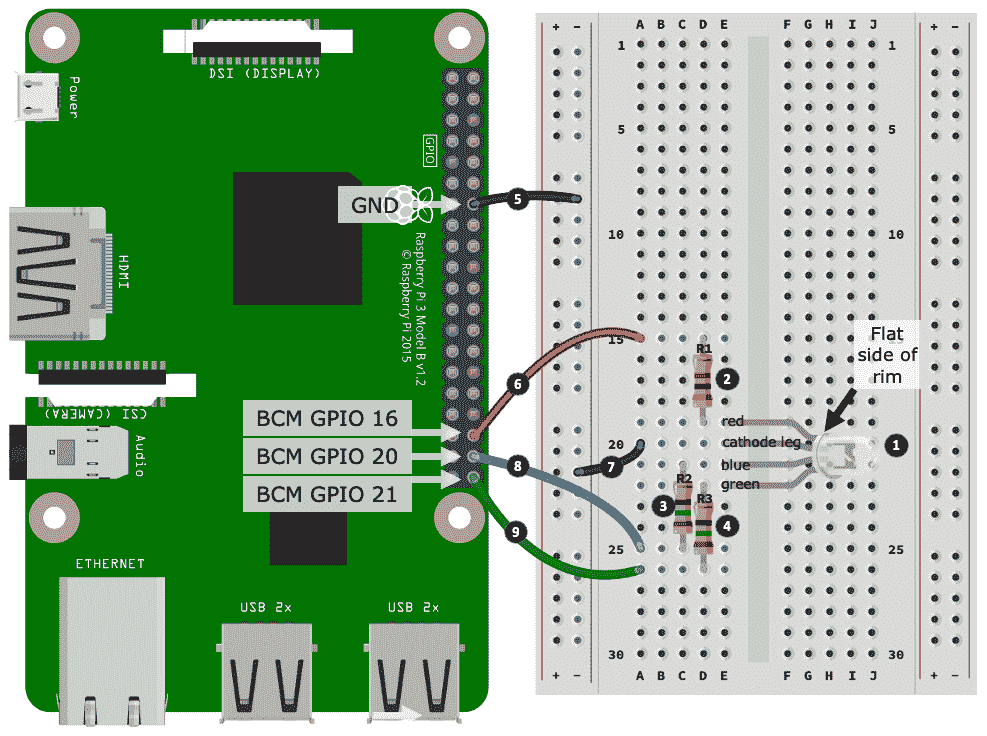

图 8.3 - 共阴极 RGB LED 电路

以下是要遵循的步骤，这些步骤与*图 8.3*中编号的黑色圆圈相匹配：

1.  首先将 RGB LED 放入面包板中，注意 LED 的阴极腿的定位。

1.  放置 200Ω电阻（R1）。这个电阻的一端连接到 LED 的*红色*腿。

1.  放置第一个 15Ω电阻（R2）。这个电阻的一端连接到 LED 的*蓝色*腿。

1.  放置第二个 15Ω电阻（R3）。这个电阻的一端连接到 LED 的*绿色*腿。

1.  将树莓派上的一个地引脚连接到负电源轨道。

1.  将树莓派上的 GPIO 16 连接到您在*步骤 2*中放置的 200Ω电阻（R1）的另一端。

1.  将 RGB LED 的阴极腿连接到负电源轨道。

1.  将树莓派上的 GPIO 20 连接到您在*步骤 3*中放置的 15Ω电阻（R2）的另一端。

1.  将树莓派上的 GPIO 21 连接到您在*步骤 4*中放置的 15Ω电阻（R3）的另一端。

在我们测试 RGB LED 电路之前，让我们简要回顾一下我们是如何得到这个电路中的 200Ω和 15Ω电阻的。200Ω电阻（R1）是使用我们在第六章中介绍的相同过程得出的，*软件工程师的电子学 101*。R2 和 R3 的 15Ω电阻是使用相同的过程得出的，不同之处在于用于蓝色和绿色 LED 计算的*典型正向电压*为 3.2 伏特。如果你研究样本数据表，你会注意到蓝色和绿色 LED 的正向电压列出了最大正向电压为 4.0 伏特。即使在典型值 3.2 伏特下，我们也非常接近树莓派 GPIO 引脚的 3.3 伏特。如果你不幸需要超过 3.3 伏特的蓝色或绿色 LED 的 RGB LED，它将无法工作——尽管我从未遇到过这种情况...至少目前还没有。

现在我们准备测试我们的 RGB LED。

## 运行和探索 RGB LED 代码

现在你的电路已经准备好了，让我们运行我们的示例代码。我们的示例将点亮 LED 并使其交替显示不同的颜色。以下是要遵循的步骤：

1.  运行`chapter08/rgbled_common_cathode.py`文件，你应该会看到 RGB LED 循环显示颜色。请注意前三种颜色，应该是红色、绿色，然后是蓝色。

要使用**共阳**RGB LED，它需要与*图 8.2*中显示的方式不同地接线——共阳腿必须连接到树莓派的+3.3V 引脚，而 GPIO 连接保持不变。另一个变化是在代码中我们需要反转 PWM 信号——你会在`chapter08`文件夹中找到一个名为`rgbled_common_anode.py`的文件，其中包含了已注释的差异。

1.  如果你的前三种颜色不是红色、绿色，然后是蓝色，你的 RGB LED 可能与*图 8.1*中显示的 RGB LED 的引脚顺序不同，以及*图 8.2*中的电路。你需要做的是更改代码中的 GPIO 引脚编号（参见以下代码片段）并重新运行代码，直到颜色顺序正确为止。

1.  在红色、绿色和蓝色循环之后，RGB LED 将以彩虹色动画显示，然后程序完成。

让我们讨论代码的有趣部分并看看它是如何工作的：

在第 1 行，我们从`PIL.ImageColor`模块导入`getrgb`。`getrgb`为我们提供了一种方便的方法，将常见的颜色名称（如红色）或 HEX 值（如`#FF0000`）转换为它们的 RGB 分量值（如(255, 0, 0)）：

```py
from time import sleep
import pigpio
from PIL.ImageColor import getrgb    # (1)

GPIO_RED = 16
GPIO_GREEN = 20
GPIO_BLUE = 21

pi.set_PWM_range(GPIO_RED, 255)      # (2)
pi.set_PWM_frequency(GPIO_RED, 8000)
# ... truncated ... 
```

从第 2 行开始，我们明确为每个 GPIO 引脚配置 PWM（占空比范围为 255，频率为 8000 是 PiGPIO 的默认值）。PWM 占空比范围从 0 到 255 完美地映射到 RGB 分量颜色值范围 0...255，我们很快就会看到这是我们如何设置每个颜色 LED 的亮度的方法。

在下面的代码中，在第 3 行，我们有`set_color()`的定义，它负责设置我们的 RGB LED 的颜色。`color`参数可以是一个常见的颜色名称，比如`yellow`，也可以是一个 HEX 值，比如`#FFFF00`，或者`getrgb()`可以解析的许多格式之一（请参阅`rgbled_common_cathode.py`源文件，了解常见格式的列表）：

```py
def set_color(color):                                 # (3)   rgb = getrgb(color)                               
  print("LED is {} ({})".format(color, rgb))
    pi.set_PWM_dutycycle(GPIO_RED,   rgb[0])          # (4)
  pi.set_PWM_dutycycle(GPIO_GREEN, rgb[1])
    pi.set_PWM_dutycycle(GPIO_BLUE,  rgb[2])
```

在第 4 行，我们看到如何使用 PWM 与单独的 GPIO 引脚来设置 RBG LED 的颜色。继续以黄色为例，我们看到以下内容：

+   `GPIO_RED`被设置为 0 的占空比。

+   `GPIO_GREEN`被设置为 255 的占空比。

+   `GPIO_BLUE`被设置为 255 的占空比。

绿色和蓝色的占空比值为 255 意味着这些 LED 完全开启，正如我们所知，混合绿色和蓝色会得到黄色。

当你浏览源文件时，你会在第 6 行和第 7 行遇到另外两个函数：

```py
def color_cycle(colors=("red", "green", "blue"), delay_secs=1):   # (6)
    # ...truncated...

def rainbow_example(loops=1, delay_secs=0.01):                    # (7)
    # ...truncated...
```

这两种方法都委托给`set_color()`。`color_cycle()`循环遍历其`color`参数提供的颜色列表，而`rainbow_example()`生成并循环遍历一系列颜色以产生彩虹序列。这些函数是我们在*步骤 1*中运行代码时生成光序列的原因。

我们的 RGB LED 电路有一些限制和缺点：

+   首先，每个 RGB LED 需要三个 GPIO 引脚。

+   其次，我们通过电阻将电流限制在 8mA，因此无法实现单个 LED 的最大亮度（我们需要约 20mA 才能实现全亮度）。

虽然我们可以引入晶体管（或适当的多通道 LED 驱动 IC）来增加电流，但我们的电路很快就会变得笨重！幸运的是，我们还有另一种方法可以用 LED 创建颜色，那就是可寻址 LED，我们将在下一节中讨论。

# 使用 SPI 控制多色 APA102 LED 灯带

APA102 是一种可寻址的多色（RGB）LED，使用**串行外围接口**（SPI）进行控制。简单来说，我们向 LED 发送指令询问它要显示什么颜色，而不是像在上一个例子中那样使用 PWM 单独控制 LED 的三个红绿蓝引脚。

如果您需要快速回顾 SPI，我们在第五章中已经涵盖了它，*将您的树莓派连接到物理世界*。我们还将在探索 APA102 特定代码后讨论 SPI，树莓派和 Python 的更多内容。

APA102 LED 也可以连接或串联在一起，以创建 LED 灯带或 LED 矩阵，从而创建动态和多 LED 的照明和显示解决方案。无论 LED 如何排列，我们都使用一种常见的技术来控制它们，即向一系列 APA102 LED 发送多组指令。每个单独的 LED 消耗一个指令，并将其余的传递给上游 LED 消耗。我们将在不久的将来使用 APA102 LED 灯带时看到这个想法。

APA102 LED 也被称为超级 LED、DotStar LED，有时也被称为下一代 NeoPixels。还有另一种可寻址 LED，WS2812，也被称为 NeoPixel。虽然原理和操作类似，但 WS2812 RGB LED 与 APA102 不兼容。

让我们创建一个电路并运行代码来控制我们的 APA102 LED 灯带。

## 创建 APA102 电路

在本节中，我们将创建我们的 APA102 电路，如下图所示。我们将在面包板上分两部分完成这个过程：

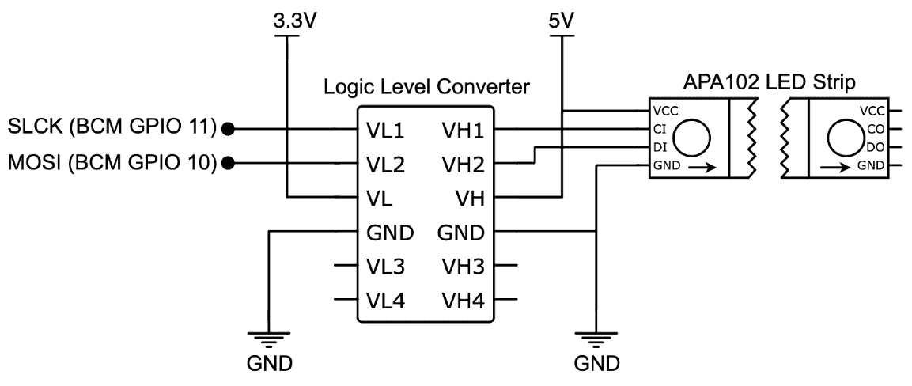

图 8.4 - APA102 LED 灯带电路原理图

让我们开始第一部分，即放置元件并连接逻辑电平转换器的*低电压*端：

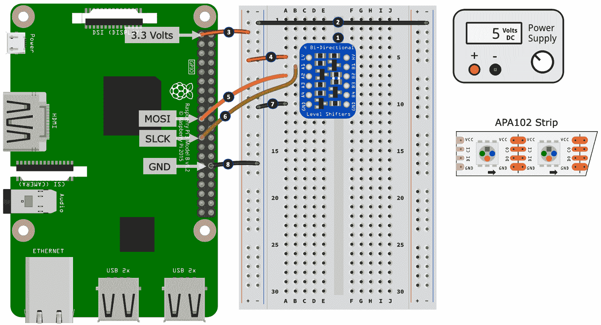

图 8.5 - APA102 LED 电路（1/2）

以下是要遵循的步骤。步骤编号与*图 8.5*中编号的黑色圆圈相匹配：

1.  将逻辑电平转换器（逻辑电平转换器）放入面包板中，将*低电压*端朝向树莓派。不同的逻辑电平转换器可能有不同的标记，但是低电压端应该是清楚的。在我们的示例中，一侧有一个**LV**（低电压）端子，另一侧有一个**HV**（高电压）端子，用于区分两侧。

1.  连接左侧和右侧电源轨道上的负轨。

1.  将树莓派上的 3.3 伏特引脚连接到左侧电源轨道的正轨。

1.  将逻辑电平转换器上的 LV 端子连接到左侧电源轨道的正轨。

1.  将树莓派上的**MOSI**（主输出从输入）引脚连接到逻辑电平转换器上的 A2 端子。

1.  将树莓派上的**SLCK**（串行时钟）引脚连接到逻辑电平转换器上的 A1 端子。

1.  将逻辑电平转换器上的 GND 端子连接到左侧电源轨的负轨。

1.  将左侧电源轨上的负轨连接到树莓派的 GND 引脚。

现在我们已经将逻辑电平转换器的*低电压*端连接到了树莓派，接下来我们将把*高电压*端连接到 APA102 LED 灯带。作为提醒，树莓派的 GPIO 引脚工作在 3.3 伏（因此是*低*电压），而 APA102 工作在 5 伏（因此是*高*电压）：

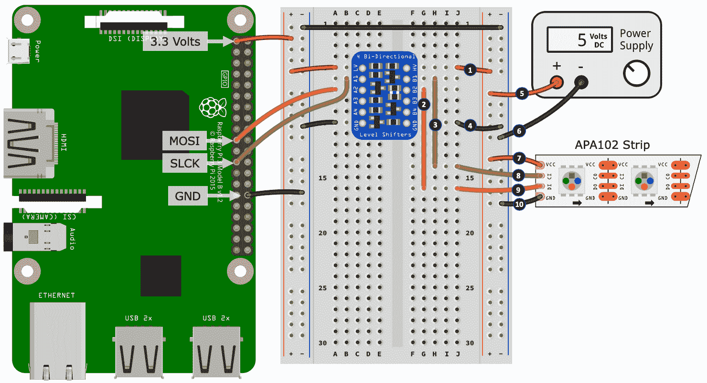

图 8.6 – APA102 LED 电路（2/2）

以下是我们搭建的第二部分的步骤。步骤编号与*图 8.6*中编号的黑色圆圈相匹配：

1.  将逻辑电平转换器的 HV 端子连接到右侧电源轨的正轨。

1.  从 B2 端子到面包板上未使用的一行放置一根跳线（在插图中，这显示在孔 G16 处）。

1.  从 B1 端子到面包板上未使用的一行放置另一根跳线（在插图中，这显示在孔 H14 处）。

1.  将逻辑电平转换器高电压端的 GND 端子连接到右侧电源轨的负轨。

1.  将电源的正输出连接到右侧电源轨的正轨。

1.  将电源的负输出连接到右侧电源轨的负轨。

1.  将 APA102 LED 灯带的 VCC 端子或导线连接到右侧电源轨的正轨。

您的 APA102 必须正确连接。您会注意到 APA102 LED 灯带上的箭头，如*图 8.4*所示。这些箭头表示数据流的方向。确保您的 APA102 LED 灯带箭头与插图相匹配（即箭头指向面包板的反方向）。

如果您的 APA102 没有箭头，请查看端子的命名。LED 灯带的一侧可能有 CI/DI（I = 输入），而另一侧有 DO/CO（O = 输出）。我们需要连接的是*输入*端。

1.  将 APA102 LED 灯带的**CI**（时钟输入）端子或导线连接到您在*步骤 3*中放置的连接回逻辑电平转换器的 B1 端子的导线。

1.  将 APA102 LED 灯带的**DI**（数据输入）端子或导线连接到您在*步骤 2*中放置的连接回逻辑电平转换器的 B2 端子的导线。

1.  最后，将 APA102 LED 灯带的 GND 端子或导线连接到右侧电源轨的负轨。

干得好！您现在已经完成了 APA102 LED 灯带电路。在完成这个电路搭建时，您会注意到我们使用了逻辑电平转换器。这是因为 APA102 需要 5 伏逻辑电才能*正常*运行。APA102 的数据表明明确提到最小逻辑电压为 0.7 VDD，即 0.7 x 5 伏=3.5 伏，这高于树莓派的 3.3 伏逻辑电平。

如果您需要关于逻辑电平和逻辑电平转换的复习，请参考第六章，*软件工程师的电子学 101*。

让我们考虑一下（如果您在想）3.3 伏只比 3.5 伏略低一点——这肯定够接近了吧？您可以尝试用 3.3 伏来控制 APA102，它*可能*会带来一定程度的成功。然而，您*可能*也会遇到一些随机效果和混乱，例如，随机 LED 未按预期开启或关闭，LED 闪烁，或 LED 显示错误的颜色。不幸的是，APA102 是不兼容 3.3 伏的 5 伏逻辑设备之一，因此我们必须采取额外的步骤，使用逻辑电平转换器来满足其 3.5 伏最小逻辑电平要求。

现在您已经建立了 APA102 电路，接下来我们将讨论我们需要考虑的问题，以便为这个电路供电。

### 为 APA102 电路供电

在第七章*，打开和关闭东西*中，我们讨论了了解您正在使用的“负载”的电流要求的重要性。让我们将这个知识应用到我们的 APA102 LED 灯带上，以便我们可以正确地为其供电。我们的示例假设 LED 灯带包含 60 个 LED，但是您需要根据灯带上 LED 的数量调整计算。

举例来说，我们有以下内容：

+   一个包含 60 个 LED 的 APA102 LED 灯带。

+   每个 LED 使用（平均）最大 25mA（来自数据表并经过测量确认）。

+   LED 灯带在空闲时消耗大约 15mA（没有 LED 亮起）。

单个 RGB LED 在设置为白色时使用其最大电流，这是当每个 LED（红色、绿色和蓝色）都处于最大亮度时。

使用前面的值，我们可以计算出 60 个 LED 的预期最大电流需求，这超过了 1.5 安培：

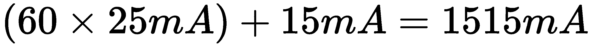

如果我们假设我们使用的是面包板电源供应，那么如果我们保守地假设我们的面包板电源供应最多只能提供大约 700mA，我们实际上不能将 60 个 LED 灯带上的所有 LED 都设置为全白。如果这样做，那么（取决于电源供应）它可能会在其内部过载保护启动时关闭，它可能会冒烟，或者它可能会限制其输出电流，这可能会导致 LED 看起来呈红色而不是白色。

让我们逆向工作，计算出我们可以从 700mA 电源供应中供电的 LED 的安全数量：

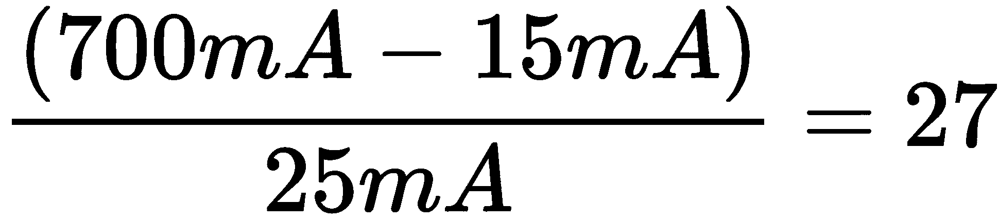

如果我们然后减去 2 个 LED（50mA）作为一个小的安全缓冲区，我们得到 25 个 LED。记住这个数字（或者您计算的数字），因为我们在运行示例代码时将需要它。

计算出您可以使用的安全 LED 数量后，我们现在准备配置和运行我们的 Python 示例。

### 配置和运行 APA102 LED 灯带代码

现在您的电路已经准备好，我们知道 LED 灯带的预期电流使用情况，让我们配置并点亮 LED 灯带：

1.  编辑`chapter08/apa102_led_strip.py`文件，并在文件顶部附近查找以下行。将数字调整为您之前计算的安全 LED 数量，或者如果您的灯带有足够能力的电源供应，则调整为灯带上的 LED 数量：

```py
NUM_LEDS = 60     # (2)
```

1.  保存您的编辑并运行代码。如果一切连接正确，您应该观察到 LED 灯带循环显示红色、绿色和蓝色，然后执行一些不同的光序列。

如果您的 LED 灯带没有工作，请查看本节后面的*APA102 LED 灯带故障排除提示*。

如果您的灯带没有按照红、绿和蓝的顺序显示，那么您需要调整代码以设置正确的顺序——我将向您展示在代码的哪个部分可以调整 LED 的顺序。

现在我们在代码中配置了安全数量的 LED，让我们走一遍代码，看看它是如何工作的。

### APA102 LED 灯带代码演示

从以下代码的第一行开始，我们有导入。我们将使用 Python 的`deque`集合实例（我只是简单地称之为数组）来在内存中模拟 APA102 LED 灯带——在将其应用于 LED 灯带之前，我们将在这个数组中构建和操作我们希望每个 LED 显示的颜色顺序。然后我们从 PIL 库中导入`getrgb`函数，用于处理颜色格式（就像我们在前面的 RGB LED 示例中所做的那样）：

```py
# ...truncated...
from collections import deque                                   # (1) from PIL.ImageColor import getrgb
from luma.core.render import canvas
from luma.led_matrix.device import apa102
from luma.core.interface.serial import spi, bitbang
```

最后，三个`luma`导入是用于 APA102 LED 灯带控制。Luma 是一个成熟的高级库，用于使用 Python 处理各种常见的显示设备。它支持 LCD、LED 灯带和矩阵等，还包括我们将在本章后面介绍的 OLED 显示器。

在本章中，我们只能浅尝 Luma 库的功能，所以我鼓励您探索其文档和各种示例——您将在本章末尾的*进一步阅读*部分找到链接。

接下来，我们来到下面代码的第 3 行，我们将`color_buffer`分配给`deque`的一个实例，该实例初始化为与我们条带中的 LED 数量相同的元素数。每个元素默认为黑色（即 LED 关闭）：

```py
# ...truncated...
color_buffer = deque(['black']*NUM_LEDS, maxlen=NUM_LEDS)      # (3) 
```

在下面代码的第 4 行中，我们开始创建我们的 APA102 的软件接口。在这里，我们创建了一个代表树莓派上默认硬件 SPI0 接口的`spi()`实例。要使用此接口，您的 APA102 必须连接到树莓派上的 SPI 引脚，如下所示：

+   DI 连接到 MOSI

+   CI 连接到 SCLK

在下面的代码片段中，`port=0`和`device=0`与 SPI0 接口相关：

```py
# ...truncated... serial = spi(port=0, device=0, bus_speed_hz=2000000)           # (4)  
```

`bus_speed_hz`参数设置了 SPI 接口的速度，对于我们的示例，我们将其从默认值 8,000,000 降低到 2,000,000，只是为了确保您的逻辑电平转换器能够工作。并非所有逻辑电平转换器都相同，它们将具有可以转换逻辑电平的最大速度。如果 SPI 接口的操作速度快于逻辑电平转换器可以转换的速度，我们的电路将无法工作。

在下面的代码中的第 5 行（已注释掉）中，我们有一个软件替代硬件 SPI 的选择，称为大砰，它可以在任何 GPIO 引脚上工作，但速度会受到影响。这类似于我们在第五章中讨论过的软件与硬件 PWM 的权衡，*将您的树莓派连接到物理世界*：

```py
# ...truncated... # serial = bitbang(SCLK=13, SDA=6)                             # (5)  # ...truncated... device = apa102(serial_interface=serial, cascaded=NUM_LEDS)    # (6)
```

在上述代码的第 6 行中，我们创建了一个`apa102`类的实例，指定了我们刚刚创建的`serial`实例和我们条带中 LED 的数量。从此刻开始，在代码中与 APA102 LED 条带进行交互，我们将使用`device`实例。

要初始化我们的 LED 条带，在下面代码的第 7 行中，我们调用`device.clear()`并将默认全局对比度设置为 128（即半亮度）。您可以调整此级别以找到您满意的亮度，记住更多的对比度/亮度意味着更多的电流使用。请注意，先前在计算安全 LED 数量时，计算中使用的每个 LED 的 25mA 假定最大亮度（即 255）：

```py
device.clear()                                                   # (7) contrast_level = 128 # 0 (off) to 255 (maximum brightness) device.contrast(contrast_level)
```

在下面代码的第 8 行中，我们有`set_color()`函数。我们使用此函数在`color_buffer`数组中将单个或所有元素设置为指定的颜色。这是我们在内存中构建 APA102 LED 条带要显示的颜色排列的方法：

```py
def set_color(color='black', index=-1):                          # (8)
  if index == -1:
        global color_buffer
        color_buffer = deque([color]*NUM_LEDS, maxlen=NUM_LEDS)
    else:
        color_buffer[index] = color
```

现在，我们将跳转到下面代码块的第 12 行，到`update()`函数。这个函数循环遍历`color_buffer`，并使用代表我们 APA102 的 Luma `device`实例，使用`draw.point((led_pos, 0), fill=color)`来向设备提供要显示的颜色。这就是 Luma 库的魔力——它通过给我们一个非常简单的软件接口，使我们免受较低级别 APA102 和 SPI 数据和硬件协议的影响。

如果您想了解更多关于较低级别 SPI 使用和协议的知识，那么 APA102 是一个很好的起点。首先阅读 APA102 的数据协议的数据表，然后在[pypi.org](http://pypi.org)或 GitHub 上找到一个简单的 APA102 模块并查看其代码。在 PiGPIO 网站上也可以找到一个 APA102 的示例，*进一步阅读*部分中包含了链接。

重要的是要记住，在对`color_buffer`进行更改后需要调用`update()`：

```py
def update():                                                   # (12)
  with canvas(device) as draw:
        for led_pos in range(0, len(color_buffer)):
            color = color_buffer[led_pos]

            ## If your LED strip's colors are are not in the expected
 ## order, uncomment the following lines and adjust the indexes ## in the line color = (rgb[0], rgb[1], rgb[2]) # rgb = getrgb(color) # color = (rgb[0], rgb[1], rgb[2]) # if len(rgb) == 4: #     color += (rgb[3],)  # Add in Alpha    draw.point((led_pos, 0), fill=color)
```

如果出现 LED 灯带颜色不是标准的红、绿和蓝顺序，那么上面注释掉的代码部分可以用来改变颜色顺序。我从未遇到过非标准 APA102，但我读到过可寻址的 RGB LED 具有非标准顺序，所以我想我还是把那部分代码放进来，以防万一。

接下来是第（9）、（10）和（11）行，我们有三个简单操作`color_buffer`的函数：

```py
def push_color(color):                                       # (9)   color_buffer.appendleft(color)

def set_pattern(colors=('green', 'blue', 'red')):           # (10)     range(0, int(ceil(float(NUM_LEDS)/float(len(colors))))):
        for color in colors:
            push_color(color)

def rotate_colors(count=1):                                 # (11)
    color_buffer.rotate(count)
```

`push_color(color)` 在第（9）行将一个新颜色推入`color_buffer`的索引 0，而第（10）行的`set_pattern()`用重复的颜色模式序列填充`color_buffer`。第（11）行的`rotate_colors()`旋转`color_buffer`中的颜色（并将它们包装起来——最后一个变成第一个）。你可以通过使用小于 0 的计数值向后旋转。

最后，在源代码的末尾，我们有以下函数，提供了你运行文件时看到的示例。这些函数使用之前讨论过的函数的组合来控制 LED 灯带：

+   `cycle_colors(colors=("red", "green", "blue"), delay_secs=1)`

+   `pattern_example()`

+   `rotate_example(colors=("red", "green", "blue"), rounds=2, delay_secs=0.02)`

+   `rainbow_example(rounds=1, delay_secs=0.01)`

我们将用一些结论性的笔记来完成对 APA102 使用 SPI 接口的覆盖。

### APA102 和 SPI 接口的讨论

如果回想一下第五章，*将树莓派连接到物理世界*，我们讨论了**串行外围接口** (**SPI**)，你可能记得我们提到它使用四根导线进行数据传输。然而，如果你考虑我们在*图 8.6*中的电路，我们只使用了两根导线（DI 和 CI），而不是四根。怎么回事？

以下是 APA102 的 SPI 映射：

+   树莓派上的**Master-Out-Slave-In** (**MOSI**) 连接到 APA102 上的**Data In** (**DI**)。在这里，你的树莓派是*主*，向*从*APA102 灯带发送数据。

+   **Master-In-Slave-Out** (**MISO**) 没有连接，因为 APA102 不需要将数据发送回树莓派。

+   树莓派上的 SCLK 连接到 APA102 上的**Clock In** (**CI**)。

+   **Client Enable/Slave Select** (**CE/SS**) 没有连接。

最后一行重要的 CE/SS 值得进一步讨论。CE/SS 通道由主设备用于告诉特定的从设备它即将接收数据。正是这种机制允许单个 SPI 主控制多个 SPI 从。

但是，我们不会（也不能）使用 CE/SS 与 APA102，因为我们没有地方连接 CE/SS 引脚。这意味着 APA102 总是在等待来自主设备的指令，实际上占用了 SPI 通道。

如果我们使用 APA102（或任何没有 CE/SS 的设备），那么除非我们采取额外的步骤，否则我们不能将多个 SPI 设备连接到主硬件 SPI。以下是一些选项：

+   如果性能降低没有不良影响，可以在通用 GPIO 引脚上使用大爆破。

+   在树莓派上启用硬件 SPI1。它默认情况下是未启用的，需要编辑`/boot/config.txt`。如果搜索*Raspberry Pi enable SPI1*，你会在网上找到指南和提示。

+   找到一个包括使能引脚的逻辑电平转换器，并编写代码手动控制这个引脚作为代理 CE/SS。

我们将用一些故障排除提示来结束关于 APA102 的部分。

### APA102 LED 灯带故障排除提示

如果你无法点亮 APA102，或者发现随机 LED 未开启或关闭，或者显示意外颜色或随机闪烁，请尝试以下操作：

+   APA102 需要 5 伏逻辑电平：确保你使用的是逻辑电平转换器，并且连接正确——HV 连接到 5 伏，LV 连接到 3.3 伏。

+   确保 APA102 的 DI/CI 端连接到逻辑电平转换器。

+   确保您的电源可以提供足够的电流。例如，电流或电压的不足可能会使白色看起来更像红色。

+   确保您的电源的地线连接到树莓派上的地线引脚。

+   如果您正在使用大幅振荡，请转移到硬件 SPI。

+   如果使用硬件 SPI（也就是创建`spi()`类的实例），请尝试以下操作：

+   如果您收到错误消息*SPI 设备未找到*，请确保在 Raspbian OS 中已启用 SPI。我们在第一章中介绍了这一点，**设置您的开发环境**。

+   如果您之前已经使用 GPIO 8、9、10 或 11 进行常规 I/O 操作，那么要么按照前面的方法禁用并重新启用 SPI 接口，要么重新启动树莓派以重置硬件 SPI 接口。

+   如果您的逻辑电平转换器无法跟上 SPI 总线速度，请尝试降低 SPI 总线速度——也就是说，它无法将 3.3 伏转换为 5 伏的信号，就像 SPI 接口产生它们一样（提示：将`serial = spi(port=0, device=0, bus_speed_hz=2000000)`中的`bus_speed_hz`参数降低到 1,000,000 或 500,000）。

+   将 APA102 的 DI 和 CI 直接连接到树莓派上的 SDA 和 SCLK。这里的目标是绕过逻辑电平转换器，以排除它作为问题的可能性。

干得好！这是关于 APA102 的一个冗长而详细的部分。除了 APA102 本身之外，我们还涵盖了许多概念，包括如何计算 LED 灯带的功率需求以及 Luma 库的介绍，该库可以用于控制 APA102 之外的许多不同的照明和显示设备。然后，我们总结了在您的 APA102 电路、设置或代码第一次运行时的实际故障排除提示。

所有这些知识和经验都将适用于您进行的类似照明项目和 SPI-based 项目。特别是，它将是一个有用的参考，用于计算照明项目的功率需求，并在它们不起作用时排除电路和代码的故障。它还提供了我们将在下一节中构建的基本基础，我们将在其中研究如何将 OLED 显示器与我们的树莓派接口。

# 使用 OLED 显示器

**OLED**或**有机发光二极管**显示器是一种用于制作屏幕的技术。我们的示例将使用 SSD1306，这是一种单色 128x64 像素显示器，但是这些信息也适用于其他 OLED 显示器。

我们的示例程序将读取您的树莓派的 CPU 温度，并将其与温度计图标一起显示在 OLED 显示器上。我们将假设 OLED 将使用 I2C 接口连接，但是，如果您使用`spi()`实例（就像在 APA102 示例中）用于`serial`对象，那么 SPI 接口设备也应该是兼容的。Luma 库更改交互方法的能力意味着您可以在最小更改代码的情况下重用现有代码与兼容的显示设备。

我们将首先连接 OLED 显示器到树莓派并验证它是否连接。

## 连接 OLED 显示器

让我们将您的 OLED 显示器连接到您的树莓派，如*图 8.7*所示：

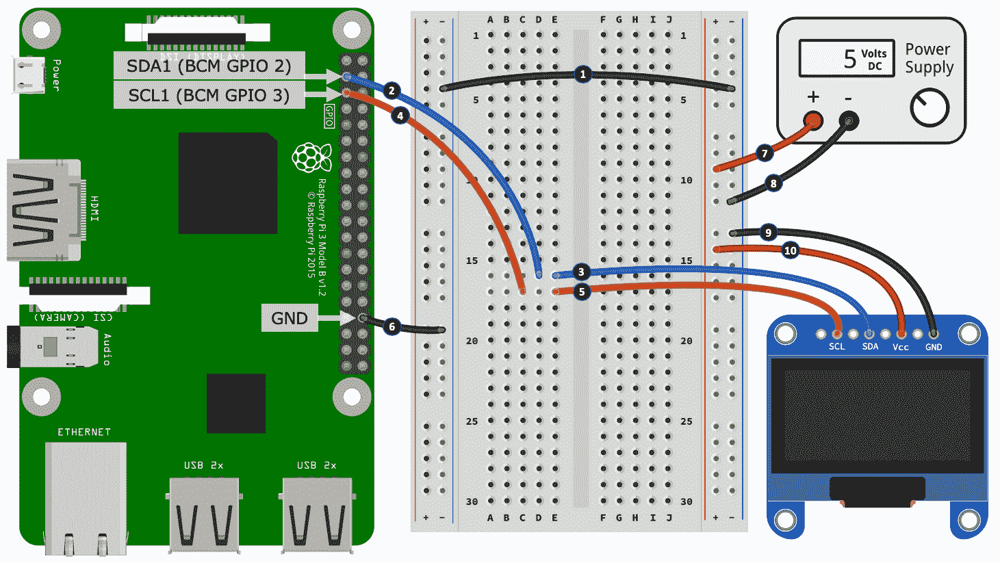

*图 8.7* - I2C OLED 显示电路**关于为您的 OLED 供电的重要说明**：我们的电路，如*图 8.6*所示，并且相关讨论使用了 5 伏的电源。如果您查阅本章开头提到的 SSD1306 OLED 数据表，您将发现它提到了最低供电电压为 7 伏。此外，您将找到其他来源和 SSD1306 OLED 模块，它们指出了不同的电压要求。**请查阅文档或购买地点，以获取您的 OLED 的正确工作电压，并根据需要调整供电电压（*步骤 7*和*8*）。**

您可以按照以下步骤连接 OLED，这些步骤对应于*图 8.7*中编号的黑色圆圈：

1.  连接左侧和右侧电源轨道上的负极。

1.  将你的树莓派的 SDA1（数据）引脚连接到面包板上的一个空行。

1.  将你的 OLED 显示屏的 SDA（数据）端子或线连接到用于*步骤 2*的同一行。

1.  将你的树莓派的 SCL1（时钟）引脚连接到面包板上的一个空行。

1.  将你的 OLED 显示屏的 SCL（时钟）端子或线连接到用于*步骤 4*的同一行。

1.  将你的树莓派的 GND 引脚连接到左侧电源轨道的负极。

1.  将 5 伏电源的正输出连接到右侧电源轨道的正极。

1.  将 5 伏电源的负输出连接到右侧电源轨道的负极。

1.  将你的 OLED 显示屏的 GND 端子或线连接到右侧电源轨道的负极。

1.  将你的 OLED 显示屏的 VCC 端子或线（也可能被命名为 VDD、Vin、V+或类似表示电压输入的名称）连接到右侧电源轨道的正极。

干得好！这完成了我们的 OLED 电路。正如你所看到的，我们正在用 5 伏电源为 OLED 供电，然而，SDA（数据）/SLC（时钟）通道直接连接到你的树莓派上。与我们在上一节中使用的 APA102 LED 灯带不同，SSD1306 OLED 兼容 3.3 伏逻辑，因此，在时钟和数据通道上我们不需要逻辑电平转换器来转换逻辑电平电压。

让我们简要考虑一下 SSD1306 OLED 的电流要求。我的测试结果如下：

+   黑屏：~3mA

+   白屏（每个像素都亮）：~27mA

在最大电流使用量为~27mA 的情况下，你可以尝试将+5V 连接到树莓派的 5 伏引脚，但请记住这将从你的树莓派中取走保留电流（如果你的树莓派的电源供应不足，可能会在运行代码时重置）。

如果你需要回顾使用数字万用表进行电流测量，请参考第七章*，打开和关闭*。

接下来，将你的 OLED 连接到树莓派的 SDA 和 SCL 引脚，然后我们将使用`i2cdetect`实用程序验证树莓派是否检测到了它。

## 验证 OLED 显示屏是否连接

在第五章*，将你的树莓派连接到物理世界*中，我们使用了`i2cdetect`命令行工具来检查 I2C 设备是否连接，并验证其 I2C 地址。通过在终端中运行以下命令来检查你的树莓派是否能看到你的 OLED 显示屏：

```py
$ i2cdetect -y 1
```

如果你的 OLED 已连接，你将看到以下输出，告诉我们 OLED 已被检测到，并具有十六进制地址`0x3C`：

```py
# ...truncated...
30: -- -- -- -- -- -- -- -- -- -- -- -- 3c -- -- -- 
# ...truncated...
```

如果你的地址不同，没关系，我们只需要在代码中调整地址，接下来我们将这样做。

## 配置和运行 OLED 示例

我们即将探讨的代码包含在`chapter08/oled_cpu_temp.py`文件中。在继续之前，请先查看这个文件，以获得它包含的内容的整体视图：

1.  如果你在前面得到的 OLED I2C 地址与`0x3C`不同，请在源代码中找到以下行，并更新地址参数以匹配你的 OLED I2C 地址：

```py
serial = i2c(port=1, address=0x3C)
```

1.  运行程序，你应该看到 OLED 显示屏上绘制的 CPU 温度和温度计图标。

一旦你在代码中配置了你的 OLED 显示屏地址并确认了示例在你的 OLED 上运行正常，我们就准备好审查代码并学习它是如何工作的。

### OLED 代码演示

从导入开始，在第（1）行，我们从**PIL**（**Pillow**）模块中导入类，用于创建我们想要在 OLED 显示屏上呈现的图像。我们还从 Luma 模块中导入与我们的 SSD1306 OLED 及其 I2C 接口相关的几个其他类（SPI 也被导入以供参考）。

我们看到如何在第（2）行创建一个代表我们 OLED 连接的接口的 I2C 实例。被注释掉的是 SPI 替代方案。在第（3）行，我们创建了一个代表我们 OLED 显示器的`ssd1306`实例，并将其分配给`device`变量。如果您使用的 OLED 显示器与 SSD1306 不同，您需要识别和调整`ssd1306`导入行以及第（3）行创建的设备实例：

```py
from PIL import Image, ImageDraw, ImageFont         # (1)
from luma.core.interface.serial import i2c, spi
from luma.core.render import canvas
from luma.oled.device import ssd1306  #...truncated...

# OLED display is using I2C at address 0x3C serial = i2c(port=1, address=0x3C)                  # (2)
#serial = spi(port=0, device=0)
  device = ssd1306(serial)                            # (3)
device.clear()
print("Screen Dimensions (WxH):", device.size)

```

在第（4）行，我们遇到了`get_cpu_temp()`函数，该函数调用一个命令行实用程序来检索树莓派的 CPU 温度，然后解析并返回结果，我们将很快用来构建我们的显示图像：

```py
def get_cpu_temp():     # (4)   temp = os.popen("vcgencmd measure_temp").readline() # Eg 62.5'C
  data = temp.strip().upper().replace("TEMP=", "").split("'")
    data[0] = float(data[0])

    if data[1] == 'F':  # To Celsius just in case it ever returns Fahrenheit
  data[0] = (data[0] - 32) * 5/9
  data[1] = 'C'    return (data[0], data[1])  # Eg (62.5, 'C') 
```

在第（5）行的以下代码中，我们定义了影响我们 OLED 显示器上显示图标的温度阈值。我们还将使用高阈值使 OLED 显示屏闪烁，以帮助创建视觉吸引力。

在第（6）行，我们加载了三个温度计图像，并从第（7）行开始将它们缩小到与我们的 SSD1306 OLED 的 128x64 像素尺寸相适应的大小：

```py
# Temperature thresholds used to switch thermometer icons  temp_low_threshold = 60 # degrees Celsius                     # (5) temp_high_threshold = 85 # degrees Celsius   # Thermometer icons image_high = Image.open("temp_high.png")                        # (6)
image_med  = Image.open("temp_med.png")
image_low  = Image.open("temp_low.png")

# Scale thermometer icons (WxH) aspect_ratio = image_low.size[0] / image_low.size[1]            # (7)
height = 50 width = int(height * aspect_ratio)
image_high = image_high.resize((width, height))
image_med  = image_med.resize((width, height))
image_low  = image_low.resize((width, height))
```

接下来，我们从以下第（8）行开始定义了两个变量。`refresh_secs`是我们检查 CPU 温度并更新 OLED 显示屏的速率，而`high_alert`用于标记最高温度阈值的违反并开始屏幕闪烁：

```py
refresh_secs = 0.5  # Display refresh rate                           #(8) high_alert = False # Used for screen blinking when high temperature   try:
    while True:
        current_temp = get_cpu_temp()
        temp_image = None    canvas = Image.new("RGB", device.size, "black")              # (9)
        draw = ImageDraw.Draw(canvas)                                # (10)
        draw.rectangle(((0,0), 
                   (device.size[0]-1, device.size[1]-1)), 
                   outline="white")
```

在`while`循环中，在第（9）行，我们看到了 PIL 模块的使用。在这里，我们使用与 OLED 设备相同尺寸（即 SSD1306 的 128x64）创建了一个空白图像，并将其存储在`canvas`变量中。在随后的代码中，我们会在内存中操作这个画布图像，然后将其发送到 SSD1306 进行渲染。

在第（10）行创建的 draw 实例是我们用于在画布上绘制的 PIL 辅助类。我们使用这个实例来在画布上放置一个边界矩形，并稍后用它来向画布添加文本。`draw`实例还可以用于绘制许多其他形状，包括线条、弧线和圆形。PIL API 文档的链接可以在*进一步阅读*部分找到。

以下代码从第（11）行开始的代码块将使我们的 OLED 显示在`high_alert`为`True`时闪烁：

```py
  if high_alert:                                     # (11)
            device.display(canvas.convert(device.mode))
            high_alert = False   sleep(refresh_secs)
            continue 
```

从第（12）行开始，我们将从`get_cpu_temp()`获得的温度读数与之前定义的阈值进行比较。根据结果，我们更改将显示的温度计图像，并且对于高阈值违规，我们将`high_alert = True`。将`high_alert`设置为`True`将导致 OLED 显示在下一个循环迭代中闪烁：

```py
 if current_temp[0] < temp_low_threshold:           # (12)
            temp_image = image_low
            high_alert = False     elif current_temp[0] > temp_high_threshold:
            temp_image = image_high
            high_alert = True     else:
            temp_image = image_med
            high_alert = False  
```

我们从以下第（13）行开始构建我们的显示。我们计算`image_xy`是我们的温度计图像在显示器上居中的点，然后使用`image_x_offset`和`image_x_offset`变量来偏移该点，以将图像移动到我们希望它呈现的位置。

在第（14）行，我们将温度计图像粘贴到画布上：

```py
# Temperature Icon image_x_offset = -40                    # (13) image_y_offset = +7 image_xy = (((device.width - temp_image.size[0]) // 2) + 
        image_x_offset, ((device.height - temp_image.size[1]) // 2) 
        + image_y_offset)
canvas.paste(temp_image, image_xy)      # (14)
```

在以下代码块的第（15）行，我们创建了要显示在 OLED 屏幕上的文本，并使用与图像相同的技术在第（17）行将文本定位在画布上。请注意使用`draw.textsize()`来获取文本的像素尺寸。

在第（16）行，我们设置`font = None`，以便在示例中使用默认系统字体，因为我无法完全确定您的树莓派上有哪些字体可用。在第（16）行之后被注释掉的行显示了使用自定义字体的示例。

在终端中运行`fc-list`命令，可以查看树莓派上安装的字体列表。

最后，在第（18）行，我们在画布上绘制文本：

```py
# Temperature Text (\u00b0 is a 'degree' symbol)                 # (15) text = "{}\u00b0{}".format(current_temp[0], current_temp[1]) # Eg 43'C   font = None # Use a default font.                                # (16)
# font = ImageFont.truetype(font="Lato-Semibold.ttf", size=20) 

text_size = draw.textsize(text, font=font)                       # (17)
text_x_offset = +15 text_y_offset = 0 text_xy = (((device.width - text_size[0]) // 2) + text_x_offset, 
((device.height -  text_size[1]) // 2) + text_y_offset)
draw.text(text_xy, text, fill="white", font=font)                # (18)
```

我们现在已经到达了 while 循环的尾端。在以下代码的第（19）行，我们使用代表 SSD1306 OLED 显示器的`device`实例来显示`canvas`。`canvas.convert(device.mode)`调用将我们创建的画布图像转换为 SSD1306 可用的格式：

```py
# Render display with canvas device.display(canvas.convert(device.mode))        # (19)
sleep(refresh_secs)
```

在我们完成对 OLED 的探索之前，我想向您指出更多示例。Luma 库包含许多示例，涵盖了使用 OLED 显示器的许多方面。可以在*进一步阅读*中找到示例的链接。

OLED 显示器成本低廉，体积小，耗电量低，因此经常用于电池操作设备。如果您想探索树莓派的其他显示选项，您可能想调查一下可用的树莓派 TFT 显示器范围（只需在 eBay.com 或 Banggood.com 等网站上搜索该术语）。这些是树莓派的全彩迷你监视器，甚至还有触摸屏选项可用。

这样我们就结束了关于使用树莓派和 Python 进行照明和显示的覆盖范围。到目前为止，您所学到的知识将使您能够使用和正确供电自己的简单 LED 照明项目，并利用各种 OLED 显示器，用于那些您希望向用户显示文本和图形信息的项目。

为了完成本章的练习，接下来，我们将简要回顾**脉宽调制（PWM）**，并看看我们如何使用它来产生声音。

# 使用蜂鸣器和 PWM 发出声音

在本章的最后一节中，我们将演示如何使用 PWM 制作简单的声音和音乐。我们的示例程序将在蜂鸣器上演奏一个音阶，并且我们将使用一种名为**Ring Tone Text Transfer Language (RTTTL)**的音乐记谱格式，这是由诺基亚在智能手机时代之前开发用于创建手机铃声的。随着我们的学习，我们可以使用一个简单的 Python 库来解析 RTTTL 音乐记谱，并将其音符转换为 PWM 频率和持续时间，然后可以用来关联蜂鸣器以创建可听的旋律。

要使用 PWM 发出声音，我们需要一种形式的扬声器，我们将使用所谓的*被动*蜂鸣器。蜂鸣器有两种基本形式：

+   **主动蜂鸣器**：这些蜂鸣器包含一个内部振荡器，可以产生单一的音调。您只需要给主动蜂鸣器施加直流电压，它就会发出声音。

+   **被动蜂鸣器**：这些蜂鸣器不包含任何内部智能来使它们工作，因此振荡必须由控制设备完成。这样做的好处是我们可以根据需要设置和更改音调，并且我们可以使用 PWM 来实现这一点。

现在我们了解了如何使用蜂鸣器发出声音，让我们继续创建我们的发声电路。

## 建立 RTTTL 电路

在本节中，我们将建立一个驱动被动蜂鸣器的电路。这个电路如*图 8.8*所示，与我们在第七章中介绍的 MOSFET 电路非常相似，只是这次连接了一个蜂鸣器作为负载：

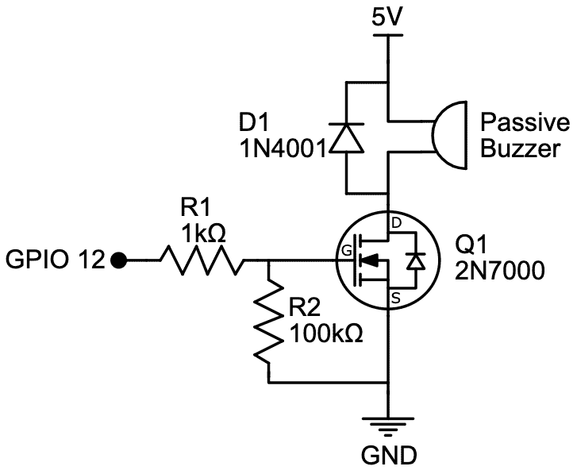

图 8.8 - 蜂鸣器驱动电路原理图

我们将通过将组件放入面包板来开始我们的电路构建：

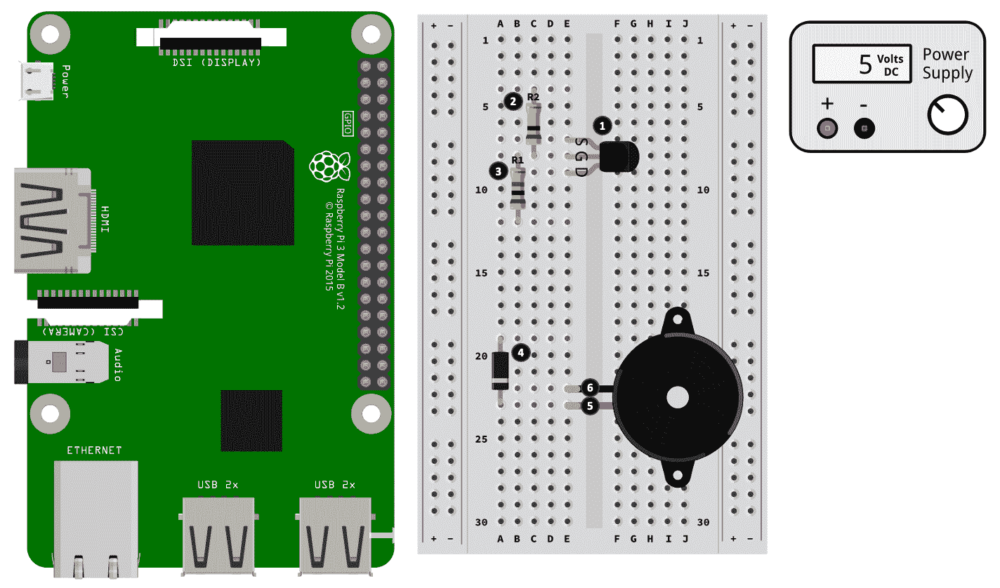

图 8.9 - 蜂鸣器驱动电路（1/2）的一部分

以下步骤编号与*图 8.9*中编号的黑色圆圈相匹配：

1.  将 MOSFET 放在面包板上，注意组件与引脚的方向。如果您需要帮助识别 MOSFET 的引脚，请参阅第七章中的*图 7.7*，*打开和关闭设备*。

1.  将 100kΩ电阻（R2）放入面包板中。这个电阻的一端与 MOSFET 的栅极（G）腿共享同一排。

1.  将 1kΩ电阻（R1）放入面包板中。这个电阻的一端也与 MOSFET 的栅极（G）腿共享同一排。

1.  将二极管放入面包板中，带有阴极腿（带子朝向的一端）指向面包板的一端。

1.  将蜂鸣器的正极线连接到与二极管阴极腿共享的同一排中。

1.  将蜂鸣器的负极线连接到一个空闲的面包板行。

现在我们已经放置了组件，让我们将它们连接起来：

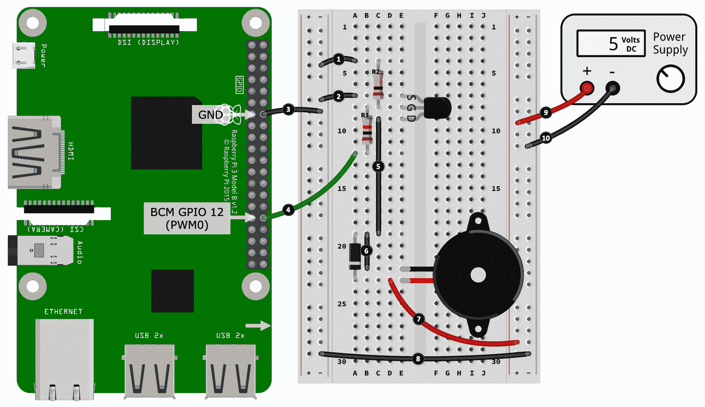

图 8.10 – 蜂鸣器驱动电路（第二部分）

以下步骤编号与*图 8.10*中编号的黑色圆圈相匹配：

1.  将左侧电源轨的负极连接到 1kΩ电阻（R2）。

1.  将 MOSFET 的源腿（S）连接到左侧电源轨的负极。

1.  将左侧电源轨的负极连接到树莓派上的 GND 引脚。

1.  将 100kΩ电阻（R1）的末端连接到树莓派的 GPIO 12/PWM0 上。提醒一下，GPIO 12 在其替代功能中是通道 PWM0，是一个硬件 PWM 引脚。

1.  将 MOSFET 的漏极（D）连接到二极管的阳极腿。

1.  将二极管的阳极腿连接到蜂鸣器的负极线。

1.  将蜂鸣器的正极线/二极管的阴极腿连接到右侧电源轨的正极。

1.  连接左侧和右侧电源轨的负极。

1.  将电源供应的正极输出连接到右侧电源轨的正极。

1.  将电源供应的负极输出连接到右侧电源轨的负极。

现在您已经完成了这个电路搭建，我们将继续运行我们的 Python 示例，这将制作一些音乐！

## 运行 RTTTL 音乐示例

运行`chapter08/passive_buzzer_rtttl.py`文件中的代码，您的蜂鸣器将播放一个简单的音阶。

执行此操作的代码非常简单。在以下代码的第（1）行中，我们使用`rtttl`模块将 RTTTL 音乐乐谱解析为由频率和持续时间定义的一系列音符。我们的乐谱存储在`rtttl_score`变量中：

```py
from rtttl import parse_rtttl
rtttl_score = parse_rtttl("Scale:d=4,o=4,b=125:8a,8b,        # (1)
    8c#,8d,8e,8f#,8g#,8f#,8e,8d,8c#,8b,8a")
```

接下来，在第（2）行，我们循环遍历`rtttl_score`中解析的音符，并提取频率和持续时间：

```py
    for note in rtttl_score['notes']:                        # (2)
        frequency = int(note['frequency'])   duration = note['duration'] # Milliseconds
        pi.hardware_PWM(BUZZER_GPIO, frequency, duty_cycle)  # (3)
        sleep(duration/1000)                                 # (4)
```

在第（3）行，我们使用 PWM 在蜂鸣器的 GPIO 引脚上设置频率，并在第（4）行保持音符的持续时间，然后继续到下一个音符。

在第（3）行，请注意我们正在使用 PiGPIO 的`hardware_PWM()`，并且`BUZZER_GPIO` *必须* 是一个硬件兼容的 PWM 引脚。 PiGPIO 的硬件定时 PWM（可用于任何 GPIO 引脚）不适用于音乐创作，因为它受限于一系列离散的频率。如果您需要 PWM 技术的复习，请重新阅读第五章，*将您的树莓派连接到物理世界*。

使用 RTTTL 制作音乐听起来非常电子化，并且是资源有限的微控制器中的一种流行技术。但是，请记住，对于我们的树莓派来说，我们有足够的资源和内置硬件来播放丰富的媒体，如 MP3。

尝试在网络上搜索*RTTTL 歌曲*，您会找到许多歌曲、复古电脑游戏和电视电影主题的乐谱。

如果您想通过 Python 探索播放和控制 MP3，您会发现网络上有许多资源、教程和示例。不幸的是，有许多方法可以实现这个任务（包括 Raspbian OS 的不同版本之间的更改），因此有时在可靠地设置和配置您的 Raspberry Pi 和 Raspbian OS 时可能会有点棘手。如果您选择这条路线，我的建议是首先在命令行上探索播放 MP3 和控制音频（即更改音量）。一旦您有了稳定可靠的设置，然后再探索基于 Python 的方法。

# 摘要

在本章中，我们学习了如何使用 PWM 来设置 RGB LED 的颜色，以及独立的单个 RGB LED 需要三个专用的 GPIO 引脚来工作——分别用于红色、绿色和蓝色。然后，我们探索了另一种类型的 RGB LED，即 APA102，它是一种 2 线 SPI 可控设备，可以串联在一起创建 LED 灯带。接下来，我们学习了如何使用 OLED 显示器，创建了一个示例应用程序，显示了树莓派的 CPU 温度。最后，我们通过解析 RTTTL 音乐乐谱，使用 PWM 和被动蜂鸣器制作声音。

在本章中学到的知识将使您能够为自己的项目添加可视和可审计的反馈。您还将能够相对容易地将您的学习扩展到其他类型的显示器，因为我们在本章中使用的 Luma 库能够与 APA102 LED 灯带和 SSD1306 OLED 设备以外的其他显示器类型和型号一起工作。

在下一章中，我们将研究用于测量环境条件（包括温度、湿度和光照）的组件和技术。

# 问题

随着我们的结束，这里有一些问题供您测试对本章材料的了解。您将在书的*评估*部分找到答案：

1.  你的 APA102 LED 灯带设置为显示所有 LED 为白色，但实际上所有 LED 看起来都是红色的。可能是什么问题？

1.  APA102 对 SPI 有什么限制？

1.  当您使用逻辑电平转换器时，您的 APA102 无法工作，但当您直接连接到树莓派的 MOSI 和 SCK 引脚时（因此绕过逻辑电平转换器），它似乎可以工作。问题的一些可能原因是什么？

1.  使用 Luma OLED 库在 OLED 显示器上创建和显示图像的基本过程是什么？

1.  什么是 RTTTL？

# 进一步阅读

APA102 是一个很好的选择，可以开始学习较低级别的数据协议和通信。在查看 APA102 数据协议的数据表后（请参见本章开头的*技术要求*下的链接），下一个逻辑步骤是查看一些较低级别的代码。 PiGPIO 的 APA102 示例是一个起点，但您会在 PyPi.org 上找到其他示例：

+   [`abyz.me.uk/rpi/pigpio/examples.html#Python_test-APA102_py`](http://abyz.me.uk/rpi/pigpio/examples.html#Python_test-APA102_py)

Luma 系列库提供了许多高级模块，用于将常见显示器与树莓派集成，超出了本章中涵盖的 APA102 和 SSD1306 OLED。此外，Luma 还包含大量的示例：

+   Luma: [`pypi.org/project/luma.core`](https://pypi.org/project/luma.core)（按照不同显示类型的链接）

+   GitHub 上的 Luma 示例：[`github.com/rm-hull/luma.examples`](https://github.com/rm-hull/luma.examples)

Luma 使用 PIL（Python Imaging Library）/Pillow 兼容的 API 来绘制和操作显示器。我们在我们的 OLED 示例中特别使用了`ImageDraw`。您可以在以下链接找到 PIL API 文档：

+   [`pillow.readthedocs.io`](https://pillow.readthedocs.io)

如果您想进一步探索 RTTTL 格式，可以从其维基百科网站开始：

+   RTTTL [`en.wikipedia.org/wiki/Ring_Tone_Transfer_Language`](https://en.wikipedia.org/wiki/Ring_Tone_Transfer_Language)
