# 第九章：测量温度、湿度和光照水平

在上一章中，我们探讨了使用 RGB LED 制作颜色的两种方法 - 使用普通的 RGB LED 和可寻址的 APA102 RGB LED 条。我们还学习了如何使用简单的 OLED 显示屏，以及如何使用 PWM 来使用无源蜂鸣器播放音乐。

在本章中，我们将研究一些常见的组件和电路，用于收集环境数据，包括温度、湿度、光线暗或亮以及如何检测湿度。

学习的电路和代码示例将对构建和实验自己的环境监测项目非常有用。这些电路可以被视为测量环境条件的输入或传感器电路。例如，您可以结合第七章中的电路思想和示例，*打开和关闭东西*，当土壤干燥时打开水泵浇水，或者在天黑时打开低电压 LED 灯。事实上，在第十三章中，我们有一个可视化平台的示例，*IoT 可视化和自动化平台*，我们将使用本章中的一个电路来捕获、记录和可视化历史温度和湿度数据！

此外，在本章中，我们将看到模拟电子学和相关概念的实际示例，例如电压分压器，在第六章中学到的。

以下是本章的内容：

+   测量温度和湿度

+   检测光线

+   检测湿度

# 技术要求

要执行本章的练习，您需要以下内容：

+   树莓派 4 型 B

+   Raspbian OS Buster（带桌面和推荐软件）

+   最低 Python 版本 3.5

这些要求是本书中代码示例的基础。可以合理地期望代码示例在树莓派 3 型 B 或不同版本的 Raspbian OS 上无需修改即可工作，只要您的 Python 版本是 3.5 或更高。

您将在[`github.com/PacktPublishing/Practical-Python-Programming-for-IoT`](https://github.com/PacktPublishing/Practical-Python-Programming-for-IoT)的 GitHub 存储库的`chapter09`文件夹中找到本章的源代码。

您需要在终端中执行以下命令来设置虚拟环境并安装本章代码所需的 Python 库：

```py
$ cd chapter09              # Change into this chapter's folder
$ python3 -m venv venv      # Create Python Virtual Environment
$ source venv/bin/activate  # Activate Python Virtual Environment
(venv) $ pip install pip --upgrade        # Upgrade pip
(venv) $ pip install -r requirements.txt  # Install dependent packages
```

以下依赖项从`requirements.txt`中安装：

+   **PiGPIO**：PiGPIO GPIO 库（[`pypi.org/project/pigpio`](https://pypi.org/project/pigpio)）

+   **PiGPIO DHT**：DHT11 和 DHT22 传感器库（[`pypi.org/project/pigpio-dht`](https://pypi.org/project/pigpio-dht)）

+   **Adafruit ADS1115**：ADS1115 ADC 库（[`pypi.org/project/Adafruit-ADS1x15`](https://pypi.org/project/Adafruit-ADS1x15)）

本章练习所需的电子元件如下：

+   1 x DHT11（较低精度）或 DHT22（较高精度）温度和湿度传感器

+   1 x **LDR**（光敏电阻，也称为光电池或光敏电阻）

+   电阻：

+   1 x 200Ω 电阻

+   1 x 10kΩ 电阻

+   1 x 1kΩ 电阻

+   1 x 100kΩ 电阻

+   1 x 红色 LED

+   1 x ADS1115 模数转换器模块

+   外部电源 - 至少需要一个 3.3V/5V 面包板可安装电源供应器。

# 测量温度和湿度

测量温度和相关环境属性是一个常见的任务，有许多不同类型的传感器可用于测量这些属性，包括热敏电阻（温度相关电阻）、通过 SPI 和 I2C 连接的复杂分支模块，以及 DHT11 或 DHT22 传感器等传感器种类，我们将在示例中使用。

当涉及准确性、响应时间（从中我们可以快速获取数据的速度）和成本时，所有传感器都有其相对的优势和劣势。

正如*图 9.1*所示，DHT 传感器价格便宜，耐用且易于使用：

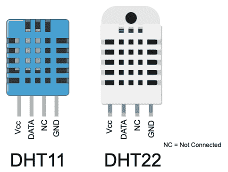

图 9.1 – DHT11 和 DHT22 温度和湿度传感器

DHT11 是一种非常常见的低成本传感器。DHT22 是它的高精度表亲。两者都是引脚兼容的，并且适用于我们的示例。如前图所示，这些传感器的引脚分配如下：

+   **Vcc**：3 到 5 伏电源来源

+   **Data**：连接到 GPIO 引脚的数据引脚

+   **NC**：未连接，表示未使用此引脚

+   **GND**：连接到地面

以下是 DHT11 和 DHT22 之间的核心相似之处和不同之处：

|  | **DHT 11** | **DHT 22** |
| --- | --- | --- |
| **工作电压** | 3 到 5 伏 | 3 到 5 伏 |
| **工作电流** | µA（微安） | µA（微安） |
| **温度范围** | 0 到 50 摄氏度 |  - 40 到 125 摄氏度 |
| **温度精度** | ±2% | ±0.5% |
| **湿度范围** | 20 - 80% | 0 - 100% |
| **湿度精度** | ±5% | ±2%到 5% |
| **最大采样率** | 更快 – 每秒一次（1Hz） | 更慢 – 每 2 秒一次（0.5Hz） |

如前所述，DHT11 和 DHT22 传感器的引脚兼容。它们只在测量精度和范围上有所不同。任一传感器都适用于我们即将创建的用于测量温度和湿度的电路。

## 创建 DHT11/DHT22 电路

我们将从在我们的面包板上创建的*图 9.2*中的电路开始：

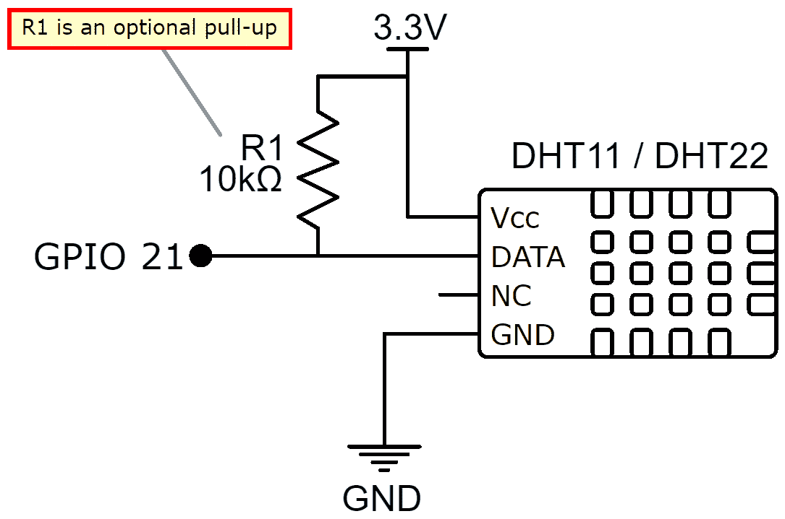

图 9.2 – DHT 传感器原理图

以下是我们即将构建的电路的面包板布局：

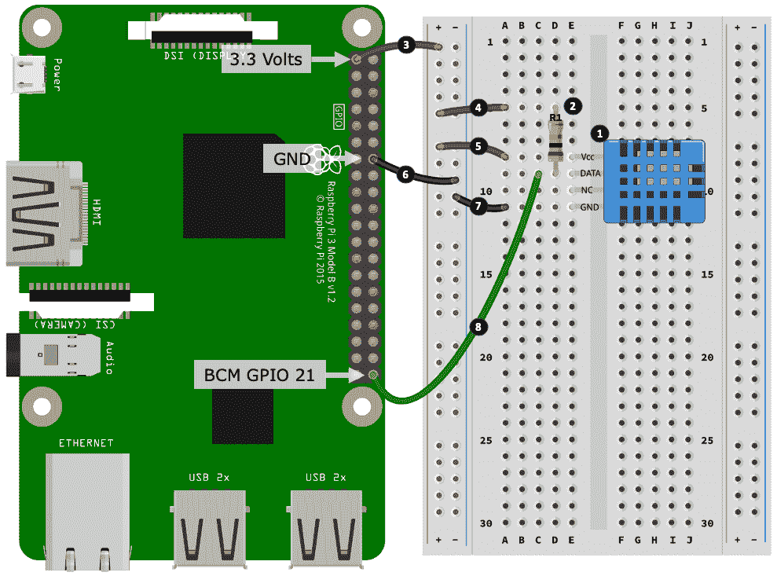

图 9.3 – DHT 传感器电路

以下是要遵循的步骤，与*图 9.3*中编号的黑色圆圈相匹配：

1.  将您的 DHT11 或 DHT22 传感器放入面包板中。

1.  将 10kΩ电阻（R1）放入面包板中。电阻的一端与 DHT 传感器的 DATA 引脚共用一行。我们将在完成电路构建后讨论这个电阻以及为什么它被标记为可选的*图 9.2*。

1.  将树莓派上的 3.3 伏引脚连接到电源轨的正极。

1.  将 10kΩ电阻（R1）连接到正电源轨。

1.  将 DHT Vcc 引脚连接到正电源轨。

1.  将树莓派上的 GND 引脚连接到负电源轨。

1.  将 DHT 传感器的 GND 引脚连接到负电源轨。

1.  最后，将 DHT 传感器的 DATA 引脚连接到树莓派上的 GPIO 21。

现在我们的 DHT 传感器电路已经完成。

在我们的电路中，Vcc 连接到 3.3 伏，这使得 DHT 数据引脚以这个电压工作。DHT11 和 DHT22 额定为 5 伏；但是，如果您将 Vcc 连接到 5 伏，数据引脚就会成为一个 5 伏逻辑引脚，这对于树莓派的 3.3 伏 GPIO 引脚来说是不安全的。

10kΩ上拉电阻是可选的，因为我们使用的 DHT 软件库已经默认启用了树莓派的内部上拉电阻。我在电路原理图中包括了上拉电阻，因为它包含在许多 DHT11/DHT22 数据表的电路示例中。如果您需要关于上拉电阻的复习，请重新阅读第六章，*软件工程师的电子学 101*。

在我们的电路和 DHT11/DHT22 中，标有**NC**的引脚表示**未连接**。 NC 是一个常用的缩写，用于表示传感器、IC 或元件的引脚或端子没有内部连接到任何东西。但是，当我们处理开关（包括继电器）时，标有 NC 的元件引脚或端子表示**通常关闭**连接路径...因此，始终根据您正在查看的元件的上下文来解释 NC。

一旦您创建了电路，我们就准备好运行和探索代码来测量温度和湿度。

## 运行和探索 DHT11/DHT22 代码

运行`chapter09/dht_measure.py`文件中的代码，测量的温度和湿度将被打印到您的终端，类似于以下内容：

```py
(venv) python DHT_Measure.py
{'temp_c': 21, 'temp_f': 69.8, 'humidity': 31, 'valid': True}
```

在这里，我们有以下内容：

+   `temp_c`是摄氏度温度。

+   `temp_f`是华氏度温度。

+   `humidity`是相对湿度百分比。

+   `valid`表示通过内部传感器校验和检查是否认为读数有效。读数中`value == False`的必须被放弃。

源文件中的代码简洁，并在此处完全复制。

在第 1 行，我们导入 DHT 传感器库，并在第 2 行实例化它。更新该行以匹配您使用的 DHT11 或 DHT22 传感器：

```py
from pigpio_dht import DHT11, DHT22   # (1)

SENSOR_GPIO = 21 
sensor = DHT11(SENSOR_GPIO)           # (2)
#sensor = DHT22(SENSOR_GPIO)

result = sensor.read(retries=2)       # (3)
print(result)

result = sensor.sample(samples=5)     # (4)
print(result)
```

在第 3 和第 4 行，我们使用`pigpio-dht`库从传感器请求温度和湿度测量。对`read()`的调用将查询传感器的测量，并在测量结果为`valid == False`时重试`retries`次。另一种测量方法是`sample()`方法，它将获取温度和湿度的多个单独样本并返回归一化的测量值。

`sample()`的优势，特别是对于精度较低的 DHT11 传感器，是温度和湿度读数更一致，因为异常值读数（随机尖峰）被移除；然而，它显著增加了读取测量所需的时间-请参考本节开头表格中的*最大采样率*行。

例如，对于最大采样率为 1 秒的 DHT11，对于 5 个样本，`sample(samples=5)`调用将花费大约*1 秒 x 5 个样本 = 5 秒*才能返回，而具有 2 秒采样率的 DHT22 将花费约 10 秒。

DHT11 和 DHT22 是引脚兼容的；然而，由于每个传感器编码其数据的方式不同，它们在软件上不兼容。例如，使用 DHT11 库的 DHT22 传感器将生成不准确的结果（这将是非常明显的-例如，说您的房间温度为 650+摄氏度！）

多么简单！DHT 系列是流行的低成本传感器，可以测量温度和湿度。对于那些需要进行更快速读数的情况，或者需要将传感器安装在恶劣环境中，例如水中或户外，直接暴露在外部环境中，您肯定能找到适合您需求的传感器。

以下是其他温度（和类似环境）传感器连接到树莓派的快速概述：

+   **热敏电阻**是温度敏感电阻，非常小，非常适合狭小空间，并且您可以获得密封包装以供室外和液体使用。您可以将它们与电压分压电路一起使用（类似于我们将在下一节中介绍的**光敏电阻**（**LDR**））。

+   有许多种类的 I2C 和 SPI 传感器可用于快速查询，可能还具有其他额外的传感器，例如气压传感器。这些模块通常较大，可能最好不要直接暴露在外部环境中。

+   **1-wire**温度传感器也是紧凑且易于密封的，其优势在于可以有长电线（100 米以上）。

通过这一部分，我们结束了关于测量温度和湿度的介绍。许多环境监测项目需要您测量温度和湿度，使用树莓派和 DHT11 或 DHT22 是一种简单且具有成本效益的方法。我们将在第十三章中再次讨论我们的 DHT11/22 电路，*IoT 可视化和自动化平台*，在那里我们将集成该传感器到 IoT 平台以收集和监测温度和湿度。

现在我们已经探讨了温度传感器，让我们学习如何检测光线。

# 检测光线

轻松实现检测光线的存在或不存在，使用一种特殊类型的电阻器，称为**LDR**。 LDR 是一种低成本的光传感器，我们可以在许多应用中找到它们，从光控开关和灯到在黑暗时调暗闹钟显示屏的电路的一部分，再到现金箱和保险柜上的警报电路。

您可能也会发现 LDR 被称为光敏电阻或光电池。

以下图显示了典型的 LDR 组件，以及几种 LDR 原理图符号。如果您仔细观察这些符号，您会注意到它们是带有向内箭头的电阻符号。您可以将这些箭头看作代表光照在电阻上：

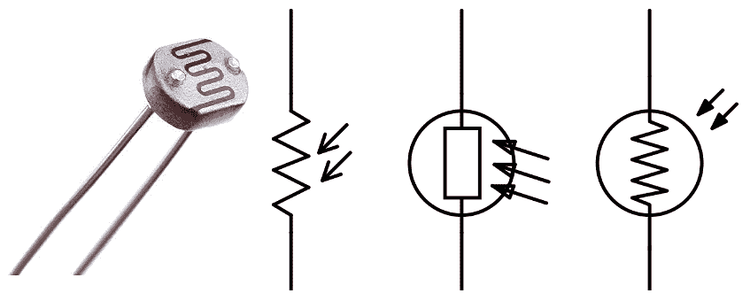

图 9.4 - 一个物理 LDR 组件和各种原理图符号

LDR 随其检测到的相对光照变化其电阻。如果您将万用表的端子置于 LDR 上的欧姆模式下，您会发现（大约几秒钟后）以下情况：

+   当 LDR 处于黑暗中（例如，如果您把它遮住），其电阻通常会测量许多兆欧姆。

+   在一个正常照明的房间（例如，桌子上的吊灯亮着），LDR 的电阻将以千欧姆计。

+   当 LDR 处于强光（直射阳光或照射手电筒），其电阻将测量几百欧姆或更低。

这为我们提供了明显的区域，使得我们可以确定光的存在或不存在。通过校准和微调，我们可以轻松地确定在黑暗和光之间的一个点，我们可以用它来触发一个事件。例如，您可以使用我们将在下一步创建的 LDR 电路来以编程方式控制我们在第七章中创建的开关电路。

LDR 只能很好地测量相对光照水平 - 光的存在或不存在。如果您想要绝对的测量，比如光照水平，甚至是检测颜色，那么有一系列的 I2C 或 SPI 断开模块形式的 IC 可以实现这一点。

利用这种基本理解，我们将构建我们的 LDR 电路来检测光线。

## 创建 LDR 光检测电路

正如讨论的那样，LDR 随其检测到的相对光照变化其电阻。为了在我们的树莓派上检测变化的电阻，我们需要采取一些在以前章节中讨论过的步骤：

+   我们需要将变化的电阻转换为变化的电压，因为我们的树莓派 GPIO 引脚工作在电压上，而不是电阻。这是欧姆定律和电压分压电路的应用，我们在第六章中学习过，*软件工程师的电子学 101*。

+   我们的树莓派 GPIO 引脚只能读取数字信号 - 例如高（~3.3 伏）或低（~0 伏）信号。为了测量变化的电压，我们可以连接一个**模数转换器**（**ADC**），例如 ADS1115。我们在第五章中介绍了 ADS1115 和相应的 Python 代码，*将您的树莓派连接到物理世界*。

我们将在您的面包板上创建*图 9.5*中所示的电路。当检测到一定程度的黑暗时，这个电路和附带的代码将点亮 LED：

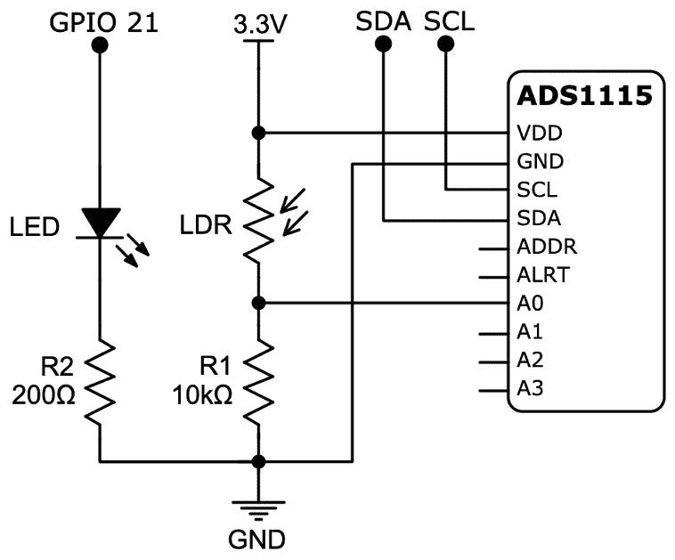

图 9.5 - 带有 ADS1115 ADC 原理图的 LDR 电路

我们将分两部分构建电路。对于第一部分，我们将把组件放在面包板上，如图所示：

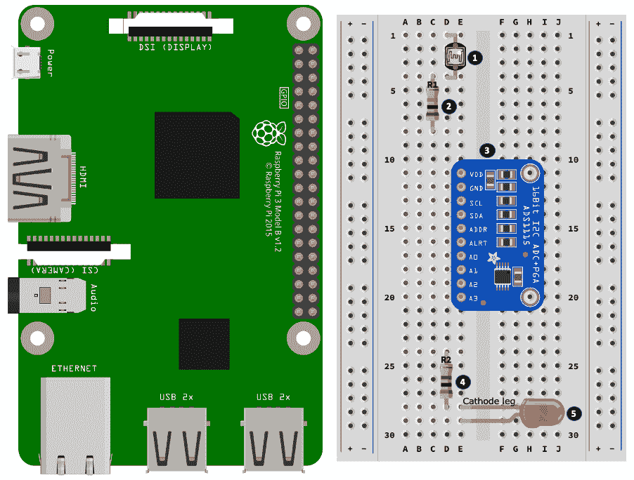

图 9.6 - 带有 ADS1115 ADC 电路的 LDR 电路（第一部分，共 2 部分）

以下是要遵循的步骤，这些步骤与*图 9.6*中编号的黑色圆圈相匹配：

1.  将 LDR 放在面包板上。

1.  将 10kΩ电阻（R1）放在面包板上。这个电阻的一端与 LDR 的一端共用同一行。

1.  将 ADS1115 ADC 放在面包板上。

1.  将一个 200kΩ电阻（R2）放在面包板上。

1.  将 LED 放在面包板上，特别注意将 LED 的阴极引脚连接到与 200kΩ电阻的一根引脚共享的同一行。

现在我们已经放置了我们的组件，我们将把它们连接起来：

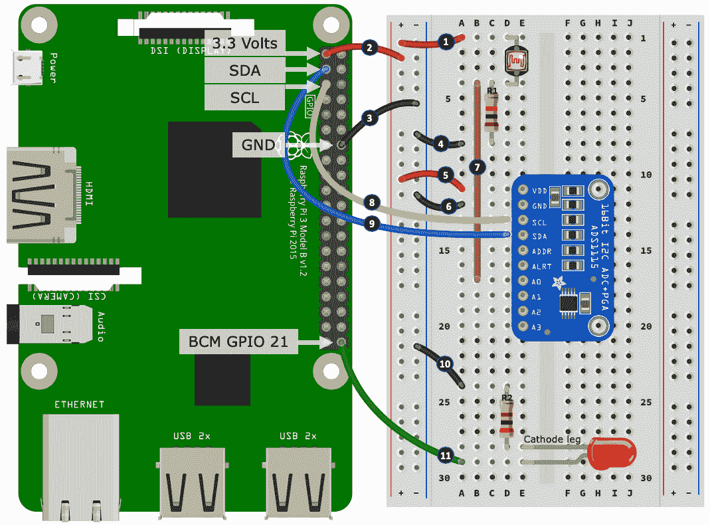

图 9.7 - 带 ADS1115 ADC 电路的 LDR 电路（第二部分）

以下是要遵循的步骤；这次它们与*图 9.7*中编号的黑色圆圈相匹配：

1.  将正电源轨道连接到 LDR。

1.  将树莓派的 3.3 伏引脚连接到电源轨道的正电源轨道。

1.  将树莓派的 GND 引脚连接到负电源轨道的负端。

1.  将负电源轨道连接到 10kΩ电阻（R1）。

1.  将 ADS1115 的 Vdd 端连接到正电源轨道。

1.  将 ADS1115 的 GND 端连接到负电源轨道。

1.  将 LDR 和 10kΩ电阻（R1）的交接处连接到 ADS1115 的 A0 端口（你能看到 LDR 和电阻如何创建电压分压器，变化的电压输出现在连接到 A0 吗？）。

1.  将树莓派的 SDA 引脚连接到 ADS1115 的 SDA 端子。

1.  将树莓派的 SCL 引脚连接到 ADS1115 的 SCL 端子。

1.  将负电源轨道连接到 200kΩ电阻。

1.  将 LED 的阳极引脚连接到树莓派的 GPIO 21 引脚。

希望你能看到由 LDR 和 10kΩ电阻 R1 形成的电压分压器。我们将在本章后面的*LDR 配置摘要*部分介绍 10kΩ电阻背后的原因。

由于 LDR 检测到的光的变化，它的电阻也会变化。这样做的效果是改变 R1（固定电阻）和 LDR 的电阻（变化电阻）的相对比例，从而改变在 LDR 和 R1 交叉处测量到的电压（这就是我们的 ADS1115 的 A（模拟输入）连接的地方，用于测量这个变化的电压）。

不要将 LED 放得太靠近 LDR。当 LED 发光时，LDR 可以检测到 LED 发出的光，这可能会干扰代码中的 LDR 读数。

现在您已经创建了 LDR 电路，我们将校准并运行我们的示例代码。

## 运行 LDR 示例代码

我们将要运行两个程序：

+   `chapter09/ldr_ads1115_calibrate.py`，这将帮助我们校准 LDR 读数

+   `chapter09/ldr_ads1115.py`，它监测光照水平，并在光线低于可配置水平时打开 LED

首先，我们应该检查 ADS1115 是否连接正确，并且树莓派能够识别它。在终端中运行`i2cdetect`命令。如果您的输出不包括一个数字（例如`48`），请验证您的接线是否正确。

```py
$ i2cdetect -y 1
# ... truncated ...
30: -- -- -- -- -- -- -- -- -- -- -- -- -- -- -- -- 
40: -- -- -- -- -- -- -- -- 48 -- -- -- -- -- -- -- 
50: -- -- -- -- -- -- -- -- -- -- -- -- -- -- -- -- 
# ... truncated ...
```

我们首先介绍了 ADS1115 模数转换器和第五章中的`i2cdetect`实用程序，*将树莓派连接到物理世界*。

让我们从校准程序开始运行示例：

1.  运行`chapter09/ldr_ads1115_calibrate.py`文件中的代码，并按照出现在终端上的说明进行操作，如下所示：

1.  “将 LDR 放在光线下并按 Enter 键”：在这个练习中使用环境光，并注意不要在 LDR 上投下阴影。在构建应用程序时，您将希望使用对您的目的有意义的光源，例如直射阳光、室内光或者用强光照射 LDR。

1.  “将 LDR 放在黑暗中并按 Enter 键”：我建议完全用黑布或杯子覆盖 LDR。用手指并不总是理想的，因为敏感的 LDR 可能仍然能够通过手指检测到一定程度的光：

```py
(venv) python ldr_ads1115_calibrate.py Place LDR in the light and press Enter
Please wait...

Place LDR in dark and press Enter
Please wait...

File ldr_calibration_config.py created with:
# This file was automatically created by ldr_ads1115_calibrate.py
# Number of samples: 100
MIN_VOLTS = 0.6313
MAX_VOLTS = 3.2356 
```

校准程序从 ADS1115 在黑暗和光线条件下获取一定数量的样本（默认为`100`），并计算平均读数。接下来，程序将结果（也显示在终端中）写入`ldr_calibration_config.py`文件。这是我们示例的 Python 源文件，导入到我们实际的 LDR 和 LED 示例中，我们将在下一步中看到。

1.  运行`chapter09/ldr_ads1115.py`文件中的程序，并观察终端上显示的输出，其中显示了 ADS1115 读取的电压：

```py
LDR Reading volts=0.502, trigger at 0.9061 +/- 0.25, triggered=False
```

希望输出应该是`triggered = False`，LED 应该是关闭的。如果不是这种情况，请尝试重复*步骤 1*中的校准过程，或者继续阅读，您将发现如何在代码中调整触发点。

1.  逐渐将手靠近 LDR，限制到达它的光线量。当您移动手时，您会注意到终端上的`voltage`读数发生变化，并且在某个电压水平时，将达到触发点，LED 将点亮：

```py
LDR Reading volts=1.116, trigger at 0.9061 +/- 0.25, triggered=False
LDR Reading volts=1.569, trigger at 0.9061 +/- 0.25, triggered=True
```

您所见到的是电压分压器的功能，随着 LDR 的电阻随光线变化而变化。然后，ADS1115 读取这个电压。

您可能已经注意到，所产生的电压不是我们在第五章中使用 ADS1115 和电位计时产生的 0 伏特到 3.3 伏特的完整范围。我们受限范围是我们固定电阻（R1）和变阻（LDR）电路的副作用和限制，它无法变化到达~0 或~3.3 伏特所需的极端电阻。您将在电压分压器电路中遇到这种限制，因为它们将按设计包括固定电阻值。相比之下，我们的电位计是*两个*可变电阻器，创建电压分压器，我们可以有效地将分压器的一侧归零（接近 0Ω），这取决于我们将电位计的拨盘转向哪个方向，从而使我们能够接近 0 伏特和 3.3 伏特。

既然我们已经看到这段代码运行，让我们看看它是如何工作的。

## LDR 代码演练

`chapter09/ldr_ads1115_calibrate.py`和`chapter09/ldr_ads1115_calibrate.py`中的大部分代码是设置和配置 ADS1115 以及使用 PiGPIO 设置 LED 的样板代码。我们不会在这里重复常见的代码。如果您需要复习与 ADS1115 相关的代码，请查看第五章中的练习，“将您的树莓派连接到物理世界”。

让我们看看使我们的 LDR 工作的 Python 代码。

在第 1 行，我们看到我们正在导入之前使用校准程序创建的`ldr_calibration_config.py`文件。

接下来，在第 2 行，我们将校准值分配给`LIGHT_VOLTS`（LDR 在光线下被 ADS1115 检测到的电压）和`DARK_VOLTS`（您遮住 LDR 时检测到的电压）变量：

```py
import ldr_calibration_config as calibration                   # (1)

# ... truncated ...

LIGHT_VOLTS = calibration.MAX_VOLTS                            # (2)
DARK_VOLTS = calibration.MIN_VOLTS

TRIGGER_VOLTS = LIGHT_VOLTS - ((LIGHT_VOLTS - DARK_VOLTS) / 2) # (3)
TRIGGER_BUFFER = 0.25                                          # (4)

```

在第 3 行，我们创建一个触发点。这是我们以后将在代码中使用的电压点来开启和关闭 LED。

您可以调整和实验`TRIGGER_VOLTS`的公式或值，以改变导致代码触发的照明条件。

第 4 行的`TRIGGER_BUFFER`变量用于在我们的触发器中创建缓冲区或滞后，电子术语中更为人所知的是*滞后*。这个值创建了一个小的窗口范围，检测到的电压可以在不引起触发或取消触发事件的情况下变化。如果没有这种*滞后*，触发器（和 LED）将在检测到的电压围绕`TRIGGER_VOLTS`触发电压振荡时快速打开和关闭。

要亲身体验这种效果，请将`TRIGGER_BUFFER = 0`，您会发现当您将手移动到 LDR 上方时，LED 对开和关非常敏感，并且在某一点甚至可能出现闪烁。当您增加`TRIGGER_BUFFER`的值时，您会注意到需要移动手才能使 LED 开关变得更加明显。

接下来，在第 5 行，我们来到了确定触发点是否已达到的代码。`update_trigger()`函数将 ADS1115 检测到的电压与调整为`TRIGGER_BUFFER`的`TRIGGER_VOLTS`值进行比较，并在触发点被触发时更新`triggered`全局变量：

```py
   triggered = False # (5)

   def update_trigger(volts):
       global triggered

       if triggered and volts > TRIGGER_VOLTS + TRIGGER_BUFFER:
           triggered = False
       elif not triggered and volts < TRIGGER_VOLTS - TRIGGER_BUFFER:
           triggered = True
```

在源文件的末尾附近，我们在第 6 行有一个`while`循环。我们正在读取 ADS1115 检测到的电压，更新全局`triggered`变量，然后将结果打印到终端：

```py

trigger_text = "{:0.4f} +/- {}".format(TRIGGER_VOLTS, TRIGGER_BUFFER) 

  try:
      while True:                                                  # (6)
          volts = analog_channel.voltage

          update_trigger(volts)

          output = "LDR Reading volts={:>5.3f}, trigger at {}, triggered={}"
                   .format(volts, trigger_text, triggered)
          print(output)

          pi.write(LED_GPIO, triggered)                           # (7)
          sleep(0.05)

```

最后，在第 7 行，根据`triggered`的值切换 LED 的开关状态。

现在我们已经看到了如何使用我们的 LDR 电路和 Python 代码检测光线，我想简要介绍一下选择 LDR 电路的串联电阻的方法。

## LDR 配置摘要

在使用 LDR 电路和代码时，您可能已经意识到有一些可调参数会影响电路和代码的工作方式，您是否想知道为什么我们使用了 10kΩ电阻？

没有两个 LDR 会给出相同的电阻-光线测量值，它们的电阻-光线范围也不是线性的。这意味着您的 LDR 以及您计划在其中使用它的照明条件可能会影响适当的固定电阻值。

以下是选择适当固定电阻的大致指南：

+   如果您希望 LDR 在**较暗的条件**下更敏感，请使用**更高值**的电阻（例如，尝试 100kΩ）。

+   如果您希望您的 LDR 在**更明亮的条件**下更敏感，请使用**更低值**的电阻（例如，尝试 1kΩ）。

请记住，这些只是建议，所以请随时根据自己的需求尝试不同的电阻。此外，每当更改固定电阻的值时，请重新运行校准代码。

还有一个名为 Axel Benz 的公式，可用于计算诸如 LDR 之类的模拟元件的参考电阻值。该公式表达如下：

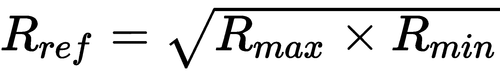

公式中的参数如下：

+   R[ref]是固定电阻 R1 的值。

+   R[max]是 LDR 的最大电阻（在黑暗中）。典型值可能为 10Ω。

+   R[min]是 LDR 的最小电阻（在强光下）。典型值可能为 10MΩ。

因此，如果我们使用典型值，我们得到了用于 R1 的 10kΩ值：

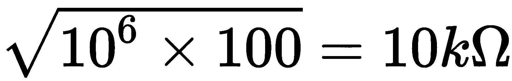

使用万用表测量 LDR 的极端值，并查看您计算出的值。如果您的测量结果与典型的 10kΩ相差甚远，不要感到惊讶。考虑到我们使用的 LDR 欧姆范围约为~10Ω至~10,000,000Ω，差异可能仍然只是百分之一的一小部分！

我们之前在代码中看到两个变量影响我们的代码触发：

+   更改`TRIGGER_VOLTS`的值以更改代码触发的点 - 例如，打开或关闭 LED。

+   更改`TRIGGER_BUFFER`的值以改变触发器对光线变化的敏感度。

最后，请记住，LDR 以对数方式检测光线，而不是线性方式 - 例如，当您逐渐将手或物体放在 LDR 上以限制光线时，LDR 报告的电压不一定会与您限制的光线量成比例地变化。这就是为什么我们需要更改固定电阻值，如果我们希望 LDR 在更暗或更亮的条件下更敏感。

您可以尝试用可变电阻替换固定电阻 R1（例如，用 20kΩ可变电阻替换固定的 10kΩ，设置为 10kΩ。我们选择 20kΩ是因为我们可以将其调整到 10kΩ以上和以下。10kΩ可变电阻只能让我们降低电阻）。在代码校准为 10kΩ并定义了代码中的触发点后，您可以通过调整可变电阻来微调触发点。

这结束了我们对 LDR 的讨论。我们已经看到了如何与 ADS1115 ADC 一起构建简单的 LDR 电路，以及如何使用 Python 检测光线。您可以将这个简单的电路和配套的代码用于任何需要检测光线或黑暗的项目，例如光敏开关。

接下来，我们将学习如何检测湿度。

# 检测湿度

猜猜看……我们已经完成了检测湿度的繁重工作！这只是 LDR 电路和代码的另一个应用，只是我们用探针替换了 LDR。

对于这个练习，您可以使用两根带两端剥离的导线制作一组探针，并将它们安装在 LDR 的位置，如*图 9.8*所示。这与我们在上一节中构建的电路相同，并在*图 9.7*中显示，只是这一次，我们用两根导线替换了 LDR。现在让我们做出这个小改变：

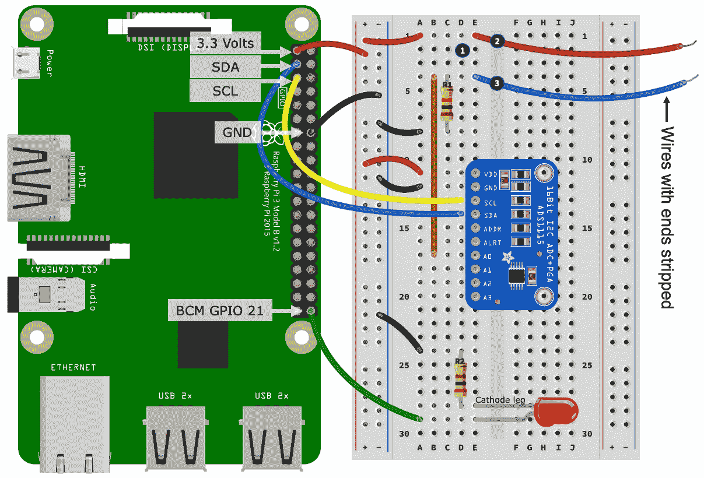

图 9.8 - 湿度检测电路

以下是要遵循的步骤，这些步骤与*图 9.8*中编号的黑色圆圈相匹配：

1.  从面包板上取下 LDR。

1.  将一根带两端剥离的导线放入面包板的一行，该行先前连接到 LDR 的一条腿（在插图中，这根新导线连接回树莓派上的 3.3 伏特）。

1.  将另一根带两端剥离的导线放入面包板的一行，该行先前连接了 LDR 的另一条腿（在插图中，这根新导线连接到与 10kΩ电阻（R1）共享的行）。

这个小改变 - 用裸导线替换 LDR - 将我们的电路变成了一个基本的湿度检测电路。让我们试试这个电路！

在`chapter09`文件夹中，您会找到两个文件，名为`moisture_calibrate.py`和`moisture_ads1115.py`。这些文件与我们在上一节中使用的 LDR 文件集几乎相同，只是我已经将`Light`/`Dark`的措辞和变量名称更改为`Wet`/`Dry`。各个文件中的核心区别由注释标出。

鉴于相似性，我们不会详细介绍这些源文件和湿度电路；但是，供参考，以下是要遵循的步骤：

1.  确保探针是干燥的。

1.  运行`moisture_calibrate.py`并按照说明执行电压校准。

1.  运行`moisture_ads1115.py`。

1.  检查终端输出是否指示`trigger=False`（代码在湿润条件下触发）。

1.  将探针放入一杯水中（是的，这样做是安全的），观察终端上的电压读数的变化（如果探针意外短路也没关系，不会造成任何损坏）。

1.  将探针浸入水中，检查终端输出是否显示`trigger=True`（探针湿润状态）。

1.  如果触发器仍然为`True`，则需要在代码中调整`TRIGGER_VOLTS`的值。

您还可以将探针放入干燥的土壤中，并观察电压读数。慢慢地浇湿土壤，电压读数应该会改变。现在我们有了一个程序的基础，可以告诉您何时需要给植物浇水！

那么，为什么会起作用呢？很简单 - 水是电的导体，在我们的两个探针之间的行为就像一个电阻。

世界各地和不同来源的水 - 例如自来水与瓶装水 - 可能导电性不同。这意味着如果您的电路对 10kΩ电阻的反应不佳，您可能需要调整 R1 电阻的值。此外，您还可以尝试调整探针导线之间的距离和它们的大小。

我们将通过比较我们刚刚创建的内容与您可以购买的现成湿度检测器来结束我们对湿度检测的讨论。

## 比较检测选项

我们简单的电路和电线探针与您可以在 eBay 等零售网站上找到的*水/湿度检测模块*相比如何？这些产品通常包含某种探针，以及一个小型电子模块。这里显示了其中一个模块的图片，以及一些探针：

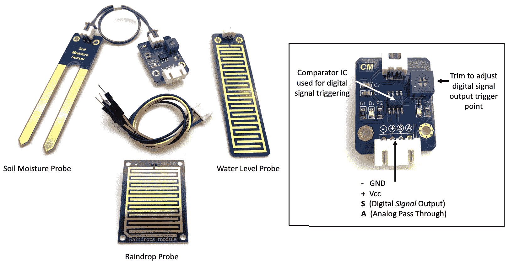

图 9.9 - 湿度检测模块和探针

这三个探针每个都有两个端子，只是电路板上的裸露铜线，类似于我们在图 9.8 中看到的裸露电线。一个关键的区别是这些探针暴露了更大的表面积，因此更敏感。此外，它们也可能比两根剥离的电线更不容易腐蚀（至少在短期到中期内）。

您可以直接将这些探针连接到我们在图 9.8 中显示的电路中的裸露电线，以扩展和增强电路的检测能力！

让我们讨论一下电子模块（在右侧的图 9.9 中放大并标记）。

除了 Vcc/Vin 和 GND 端子外，这些模块通常（不总是，但通常）还有两个输出端子或引脚，如下所示：

+   *模拟*输出（在我们的示例中，这被标记为**A**）

+   一个*数字*输出（标记为**S**）

请注意，我不会提供如何将先前显示的模块连接到您的树莓派的说明，而是会保持讨论的一般性。这些模块有许多变种，虽然它们的操作类似，但它们的接线方式可能有所不同。在本书的这个阶段，如果您对模拟与数字的基本原理、电压分压器和 ADC 感到满意，您就有了理解并对如何将这些模块接口到树莓派等设备做出明智决定的所有必要知识。一个很好的起点将是您模块的数据表或购买地点提供的任何信息。

*模拟输出*是一个通过到探针的通路。您可以直接将其连接到电压分压电路中，并使用诸如 ADS1115 之类的 ADC 测量可变电压 - 这正是我们在图 9.8 中创建的确切情景。如果您使用模拟通过，您将绕过模块上的所有其他电路（这就是为什么您可以直接将探针连接到我们的示例电路中）。

*数字输出*是使用模块电路的部分。典型的模块电路至少包括一个称为电压比较器的集成电路，一个固定电阻和一个可变电阻，这是一个触发点调节。固定电阻与探针一起创建一个电压分压器。电压比较器负责监视电压分压器上的电压，并在由调节触发的点上触发数字输出（例如，从“低”到“高”的转换）。图 9.9 中可以看到一个调节可变电阻的示例。

如果这种电压比较和触发听起来有点熟悉，那么您是正确的。这个模块及其电压比较器和可配置触发点原则上是我们创建的 LDR 和湿度电路以及 Python 代码的纯电子版本。是的，您可以在这些模块中使用 LDR 而不是探针！

因此，总之，什么更好 - 使用 ADS1115 和电压分压器类型的电路，如图 9.8 中所示，还是使用图 9.9 中所示的模块？没有一个最佳答案；然而，以下几点将帮助您做出自己的决定：

+   使用类似*图 9.8*中的电路是一种模拟方法。传感器检测到的原始电压直接传递给您的 Raspberry Pi。这种方法的一个简单优点是您可以完全控制代码中的*触发*点。例如，您可以远程调整触发点从网页。这种方法的缺点是您需要一个涉及 ADS1115 和电压分压器的更复杂的电路。

+   使用类似*图 9.9*中所示的模块作为数字方法，可以促进更简单的接口电路连接到您的 Raspberry Pi，只要模块的数字输出为 3.3 伏特。但缺点是您必须可以物理访问模块和调整电位器来更改触发点。

# 总结

在本章中，我们学习了如何使用常见的 DHT11 和/或 DHT22 传感器测量温度和湿度。我们还研究了如何使用 LDR 来检测光线，这使我们能够更详细地探索电压分压电路和 ADC。最后，我们改装了我们的 LDR 电路，以便我们可以检测湿度。

本章涵盖的示例电路和代码提供了使用现成传感器和简单电路测量环境条件的实际示例。您对这些传感器和电路的理解现在意味着您可以为自己的环境监测项目调整这些示例，包括将它们作为输入触发器与 Python 一起用于控制其他电路。

我们还看到了电压分压电路的新实际应用，以及它们在模拟电路中如何将可变电阻转换为可变电压，用于 ADC。这些示例和您对它们的理解代表了您可以适应并用于其他基于模拟的传感器的重要技能。

在下一章中，我们将学习如何更深入地控制直流电机，并学习如何控制舵机。

# 问题

在我们结束时，这里有一些问题供您测试本章材料的知识。您将在书的*评估*部分找到答案：

1.  您能列举 DHT11 和 DHT22 温湿度传感器之间的两个区别吗？

1.  为什么在我们的 DHT11/22 电路中外部 10kΩ上拉电阻是可选的？

1.  描述 LDR 用于测量光线的基本电子原理。

1.  您如何使 LDR 对特定光照条件更或者更不敏感？

1.  您已经创建了一个 LDR 电路并校准了 Python 代码。现在，您更改了 LDR，并发现电压读数和代码中的触发点行为略有不同。为什么？

1.  为什么将两根导线放入水中，配合电压分压器和 ADS1115 电路，可以作为基本的湿度检测器？
