# 第十一章：测量距离和检测运动

欢迎来到我们的最后一个基于核心电子学的章节。在上一章中，我们学习了如何以复杂的方式控制三种不同形式的电机。在本章中，我们将把注意力集中在使用树莓派和电子设备检测运动和测量距离。

检测运动对于自动化项目非常有用，例如当您走进房间或建筑物时点亮灯光，警报系统，建筑物计数器或检测轴的旋转。我们将研究两种运动检测技术，包括使用**被动红外**（**PIR**）传感器来检测人（或动物）的存在的热检测，以及数字霍尔效应传感器，它可以检测磁场的存在（或者更宽泛地说，我们可以说霍尔效应传感器可以检测到磁铁移过它的时候）。

距离测量对于许多项目也很有用，从碰撞检测电路到测量水箱水位。我们将研究两种距离测量形式，包括使用超声波声音传感器，可以测量大约 2 厘米到 4 米的距离，以及可以测量磁场接近度的模拟霍尔效应传感器，可以测量到毫米级的磁场接近度。

以下是本章的内容：

+   使用 PIR 传感器检测运动

+   使用超声波传感器测量距离

+   使用霍尔效应传感器检测运动和距离

# 技术要求

要执行本章的练习，您需要以下内容：

+   树莓派 4 型 B

+   Raspbian OS Buster（带桌面和推荐软件）

+   最低 Python 版本 3.5

这些要求是本书中代码示例的基础。可以合理地期望代码示例应该可以在树莓派 3 型 B 或不同版本的 Raspbian OS 上无需修改即可工作，只要您的 Python 版本是 3.5 或更高。

您可以在 GitHub 存储库的`chapter11`文件夹中找到本章的源代码，网址为[`github.com/PacktPublishing/Practical-Python-Programming-for-IoT`](https://github.com/PacktPublishing/Practical-Python-Programming-for-IoT)。

您需要在终端中执行以下命令来设置虚拟环境并安装本章代码所需的 Python 库：

```py
$ cd chapter11              # Change into this chapter's folder
$ python3 -m venv venv      # Create Python Virtual Environment
$ source venv/bin/activate  # Activate Python Virtual Environment
(venv) $ pip install pip --upgrade        # Upgrade pip
(venv) $ pip install -r requirements.txt  # Install dependent packages
```

从`requirements.txt`安装以下依赖项：

+   **PiGPIO**：PiGPIO GPIO 库（[`pypi.org/project/pigpio`](https://pypi.org/project/pigpio)）

+   **ADS1X15**：ADS11x5 ADC 库（[`pypi.org/project/adafruit-circuitpython-ads1x15`](https://pypi.org/project/adafruit-circuitpython-ads1x15)）

本章练习所需的电子元件如下：

+   1 x 1kΩ电阻

+   1 x 2kΩ电阻

+   1 x HC-SR501 PIR 传感器（数据表：[`www.alldatasheet.com/datasheet-pdf/pdf/1131987/ETC2/HC-SR501.html`](https://www.alldatasheet.com/datasheet-pdf/pdf/1131987/ETC2/HC-SR501.html)）

+   1 x A3144 霍尔效应传感器（非锁存）（数据表：[`www.alldatasheet.com/datasheet-pdf/pdf/55092/ALLEGRO/A3144.html`](https://www.alldatasheet.com/datasheet-pdf/pdf/55092/ALLEGRO/A3144.html)）

+   1 x AH3503 霍尔效应传感器（比率式）（数据表：[`www.alldatasheet.com/datasheet-pdf/pdf/1132644/AHNJ/AH3503.html`](https://www.alldatasheet.com/datasheet-pdf/pdf/1132644/AHNJ/AH3503.html)）

+   1 x HC-SR04 或 HC-SR04P 超声波距离传感器（数据表：[`tinyurl.com/HCSR04DS`](https://tinyurl.com/HCSR04DS)）

+   用于霍尔效应传感器的小磁铁

HC-SR04 有两种变体可用。更常见的 HC-SR04，输出 5 伏逻辑和 HC-SR04**P**，可以在 3 伏至 5.5 伏之间工作。这两种模块都适用于本章的练习。

# 使用 PIR 传感器检测运动

PIR 传感器是一种可以检测到物体（例如人）发出的红外光（热量）的设备。我们在周围的应用中看到这些类型的传感器，如安全系统和对我们的存在做出反应的自动门和灯。PIR 中的“被动”意味着传感器只是检测运动。要检测*什么*移动和*如何*移动，你需要一个主动红外设备，比如热成像摄像头。

PIR 传感器有几种不同的形式和品种；然而，它们的基本用法是相同的——它们作为一个简单的数字开关。当它们没有检测到运动时，它们输出数字`LOW`，当检测到运动时，它们输出数字`HIGH`。

下图显示了我们将在示例中使用的 HC-SR501 PIR 传感器模块。图片中显示了模块的顶部、底部和 PIR 传感器的常见原理图符号：

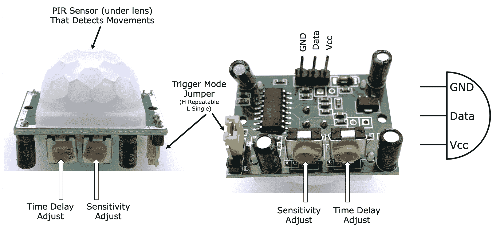

图 11.1 - HC-SR501 PIR 传感器模块

一些 PIR 传感器，包括我们的 HC-SR501，上面有设置和校准调整。这些调整用于改变传感器的灵敏度范围和触发模式。在没有板载校准的情况下使用 PIR 设备意味着我们需要在代码中自行处理灵敏度调整。

关于 HC-SR501，它的端子如下：

+   **GND**：接地。

+   **Vcc**：连接到 5 伏至 20 伏的电源。

+   **数据**：我们连接到 GPIO 引脚的数字输出。当 PIR 检测到运动时，此引脚变为`HIGH`；否则，在没有运动的情况下保持`LOW`。HC-SR501 输出 3.3 伏信号，尽管它需要 5 至 20 伏的电源。接下来我们将看到，板载的*灵敏度调整*、*定时调整*、*触发模式*跳线会影响数据引脚在检测到运动时保持`HIGH`的方式、时间和持续时间。

HC-SR501 的板载设置如下：

+   **灵敏度调整**：改变有效的移动感应范围，从大约 3 米到大约 7 米。使用小螺丝刀旋转此设置的拨号。

+   **时间延迟调整**：在检测到运动后数据端口保持`HIGH`的时间。调整范围约为 5 秒至 300 秒。使用小螺丝刀旋转此设置的拨号。

+   **触发模式跳线**：在持续检测到运动的情况下，此跳线设置意味着在时间延迟到期后（由**时间延迟调整**设置），数据端口将执行以下操作：

+   保持`HIGH`。这是*可重复*触发设置，通过将跳线放置在**H**位置来设置。

+   恢复为`LOW`。这是*单次触发*设置，通过将跳线放置在**L**位置来设置。

你的 PIR 的最佳设置将取决于你打算如何使用它以及你部署传感器的环境。我的建议是，在完成电路搭建并运行后续部分的示例代码后，尝试调整设置，以了解如何改变设置会影响传感器的操作。记得查阅 HC-SR501 的数据表，以获取有关传感器及其板载设置的更多信息。

让我们把我们的 PIR 传感器接线并连接到我们的树莓派。

## 创建 PIR 传感器电路

在这一部分，我们将把我们的 PIR 传感器连接到我们的树莓派。以下是我们即将构建的电路的原理图。正如你所看到的，从 PIR 传感器的角度来看，它的布线相对简单：

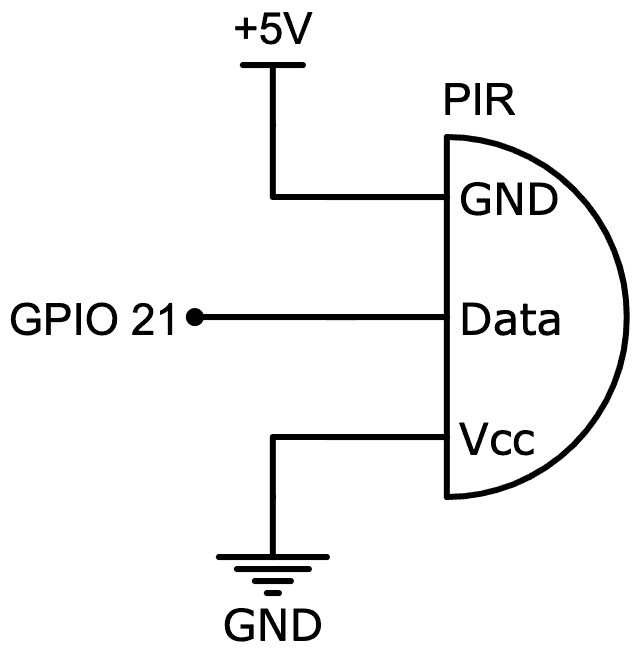

图 11.2 - PIR 传感器模块电路

让我们按照下图所示将其连接到我们的树莓派：

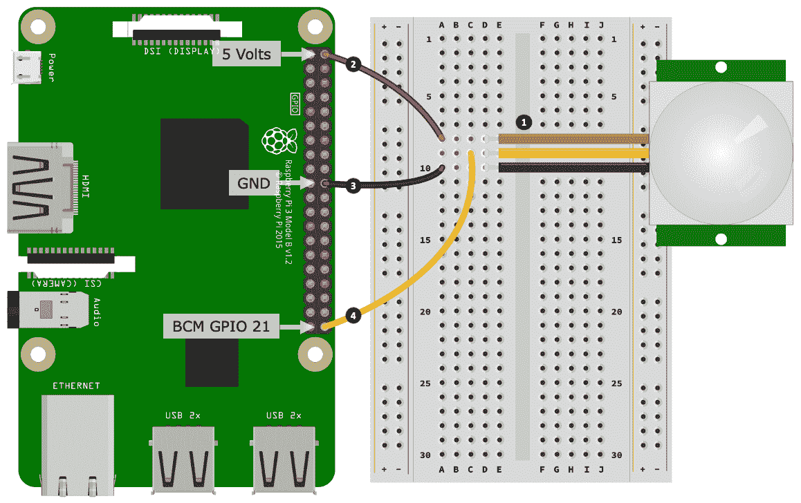

图 11.3 - PIR 传感器电路面包板布局

以下是创建面包板搭建的步骤。步骤编号与*图 11.3*中的黑色圆圈中的编号相匹配：

1.  将您的 PIR 传感器的每个端子连接到面包板上。您将需要三根公对公跳线。

1.  将树莓派上的 5 伏特引脚连接到 PIR 的 Vcc 端使用的面包板行。PIR 传感器只使用少量电流，因此将 5 伏特 Vcc 引脚直接连接到树莓派上是可以的。

1.  将树莓派上的 GND 引脚连接到 PIR 的 GND 端使用的面包板行。

1.  将树莓派上的 GPIO 21 引脚连接到 PIR 的数据端使用的面包板行。

**重要提示**：我们参考的 HC-SR501 PIR 传感器需要>4.5 伏特的电源（Vcc），并在其 Sig 输出引脚上输出 3.3 伏特。如果您使用的是不同的 PIR 传感器，请查阅其数据表并检查输出引脚电压。如果它大于 3.3 伏特，您将需要使用电压分压器或逻辑电平转换器。在下一节中，我们将涵盖这种确切的情况，当我们将电压分压器与 HC-SR04 传感器配对，将其 5 伏特输出转换为树莓派友好的 3.3 伏特。

创建电路后，我们将继续并运行我们的 PIR 示例代码，这将让我们检测运动。

## 运行和探索 PIR 传感器代码

我们的 PIR 电路代码可以在`chapter11/hc-sr501.py`文件中找到。在继续之前，请查看源代码，以对该文件的内容有一个广泛的了解。

HC-SR501 数据表规定，传感器在上电后需要大约 1 分钟的时间来初始化和稳定自身。如果在传感器变得稳定之前尝试使用传感器，可能会在启动程序时收到一些错误的触发。

在终端中运行`hc-sr501.py`文件。当 HC-SR501 检测到运动时，程序将在终端上打印`Triggered`，或者在未检测到运动时打印`Not Triggered`，如下所示：

```py
(venv) $ python hc-sr501.py 

PLEASE NOTE - The HC-SR501 Needs 1 minute after power on to initialize itself.

Monitoring environment...
Press Control + C to Exit
Triggered.
Not Triggered.
... truncated ...
```

如果您的程序没有按预期响应，请尝试调整我们之前在*使用 PIR 传感器检测运动*部分中讨论的**灵敏度调整**、**时间延迟调整**或**触发模式跳线**设置中的一个或多个。

您可以将 HC-SR501 视为基本开关。它要么是打开的（`HIGH`），要么是关闭的（`LOW`），就像普通的按钮开关一样。实际上，我们的代码类似于第二章中*使用 Python 和物联网入门*部分中介绍的 PiGPIO 按钮示例。我们只会在这里简要介绍核心代码部分；但是，如果您需要更深入的解释或复习，请重新查看第二章中的 PiGPIO 部分，*使用 Python 和物联网入门*。

让我们讨论示例代码。首先，我们在第 1 行开始设置我们的 GPIO 引脚为带有下拉使能的输入引脚，而在第 2 行，我们启用了去抖动。我们的 HC-SR501 模块实际上不需要在代码中激活下拉，也不需要去抖动；但是，我为了完整性而添加了它：

```py
# ... truncated ...
GPIO = 21

# Initialize GPIO
pi.set_mode(GPIO, pigpio.INPUT)                               # (1)
pi.set_pull_up_down(GPIO, pigpio.PUD_DOWN)
pi.set_glitch_filter(GPIO, 10000) # microseconds debounce     # (2)
```

接下来，在第 3 行，我们定义了`callback_handler()`函数，每当 GPIO 引脚改变其`HIGH`/`LOW`状态时都会被调用：

```py
def callback_handler(gpio, level, tick):                       # (3)
    """ Called whenever a level change occurs on GPIO Pin.
      Parameters defined by PiGPIO pi.callback() """
    global triggered

    if level == pigpio.HIGH:
        triggered = True
        print("Triggered")
    elif level == pigpio.LOW:
        triggered = False
        print("Not Triggered")
```

最后，在第 4 行，我们注册了回调函数。正是第二个参数`pigpio.EITHER_EDGE`导致`callback_handler()`在 GPIO 变为`HIGH`或`LOW`时被调用：

```py
# Register Callback
callback = pi.callback(GPIO, pigpio.EITHER_EDGE, callback_handler) # (4)
```

作为对比，在第二章中，*使用 Python 和物联网入门*，对于我们的按钮示例，此参数为`pigpio.FALLING_EDGE`，意味着只有在按下按钮时才会调用回调，而松开按钮时不会调用。

正如我们所见，PIR 传感器只能检测物体的接近 - 例如，有人靠近我们的传感器吗？ - 但它无法告诉我们物体的距离有多远或多近。

我们现在已经学会了如何创建和连接一个简单的 PIR 传感器电路到我们的树莓派，并且学会了如何在 Python 中使用它来检测运动。有了这些知识，你现在可以开始构建自己的运动检测项目，比如结合第七章中的示例，*打开和关闭东西*，或者作为你自己的警报和监控系统的重要部分。

接下来，我们将看一下能够估算距离的传感器。

# 用超声波传感器测量距离

在上一节中，我们学会了如何使用 PIR 传感器检测运动。正如我们发现的那样，我们的 PIR 传感器是一个数字设备，通过使其输出为数字`HIGH`来表示检测到运动。

现在是时候学习如何用树莓派测量距离了。有各种各样的传感器可以执行这项任务，它们通常要么使用声音，要么使用光。我们的示例将基于流行的 HC-SR04 超声波距离传感器（它使用声音），如下图所示：

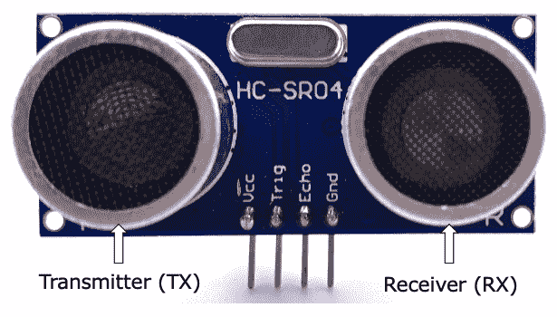

图 11.4 - HC-SR04 超声波距离传感器模块

你通常会在现代汽车保险杠上找到超声波距离传感器（它们通常是小圆圈，这是与前面图中的 HC-SR04 不同的形状）。这些传感器计算你的车和附近物体之间的距离，例如，当你越来越接近物体时，会让车内的蜂鸣器越来越快地响起。

另一个常见的应用是用于测量液体水平，比如水箱中的水位。在这种情况下，（防水）超声波传感器测量从水箱顶部到水位的距离（声音脉冲反射在水上）。然后可以将测得的距离转换为水箱的大致容量。

让我们更仔细地看一下我们的 HC-SR04 传感器。参考 HC-SR04 数据表中的核心规格如下：

+   电源电压 5 伏（HC-SR04）或 3 伏至 5.5 伏（HC-SR04P）

+   逻辑电压 5 伏（HC-SR04）或 3 伏至 5.5 伏（HC-SR04P）

+   工作电流 15 毫安，静态电流 2 毫安

+   有效测量范围为 2 厘米至 4 米，精度为+/- 0.3 厘米

+   10 微秒的触发脉冲宽度。我们将在标题为*HC-SR04 距离测量过程*的部分重新讨论这个脉冲宽度并进行更多讨论。

SC-SR04 有两个圆柱体。它们如下：

+   **T**或**TX**：产生超声波脉冲的发射器

+   **R**或**RX**：检测超声波脉冲的接收器

我们将在下一节讨论发射器和接收器如何一起工作来测量距离。

HC-SR04 有四个端子，它们如下：

+   **Vcc**：电源（树莓派 5 伏引脚将是可以的，考虑到最大电流为 15 毫安）。

+   **GND**：接地连接。

+   **TRIG**：触发*输入*端子 - 当`HIGH`时，传感器发送超声波脉冲。

+   **ECHO**：回声*输出*端子 - 当`TRIG`变为`HIGH`时，此引脚变为`HIGH`，然后在检测到超声脉冲时变为`LOW`。

我们将在标题为*HC-SR04 距离测量过程*的部分讨论`TRIG`和`ECHO`端子的使用。

现在我们了解了超声波距离传感器的基本用法和 HC-SR04 的基本特性和布局，让我们讨论一下它是如何工作的。

## 超声波距离传感器的工作原理

让我们看看发射器（TX）和接收器（RX）如何一起工作来测量距离。超声波传感器的基本工作原理如下图所示：

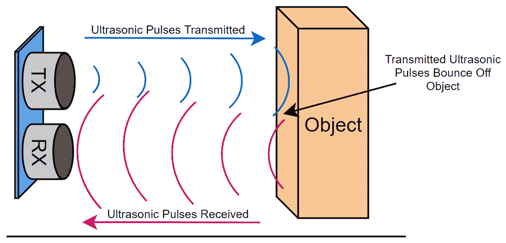

图 11.5 - 超声波距离传感器操作

以下是发生的事情：

1.  首先，传感器从发射器（TX）发送超声波脉冲。

1.  如果传感器前面有物体，这个脉冲会反弹到物体上并返回到传感器，并被接收器（RX）检测到。

1.  通过测量发送脉冲和接收脉冲之间的时间，我们可以计算传感器和物体之间的距离。

了解了传感器工作原理的高层次理解后，接下来，我们将深入讨论如何使用 HC-SR04 上的 TRIG 和 ECHO 端子一起估算距离的过程。

## HC-SR04 距离测量过程

在本节中，我们将介绍使用 HC-SR04 测量距离的过程。 如果这一点不立即明白，不要担心。 我在这里提供了详细信息作为背景材料，因为这是我们示例程序实现的逻辑过程，以使传感器工作。 您还会在传感器的数据表中找到这个过程的记录。

我们通过正确使用和监控 TRIG 和 ECHO 引脚来测量 HC-SR04 的距离。 过程如下：

1.  将 TRIG 引脚拉高 10 微秒。 拉高 TRIG 也会使 ECHO 引脚变高。

1.  启动计时器。

1.  等待以下任一情况发生：

+   ECHO 变为`LOW`

+   经过 38 毫秒（从数据表中，这是>4 米的时间）

1.  停止计时器。

如果经过了 38 毫秒，我们得出结论认为传感器前面没有物体（至少在有效范围内的 2 厘米到 4 米之间）。 否则，我们将经过的时间除以 2（因为我们想要传感器和物体之间的时间间隔，而不是传感器到物体再返回到传感器），然后使用基本物理学，使用以下公式计算传感器和物体之间的距离：

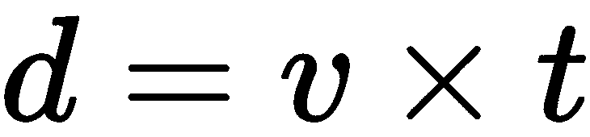

在这里，我们有以下内容：

+   *d*是以米为单位的距离。

+   *v*是以米/秒为单位的速度，我们使用声速，大约为 20°C（68°F）时的 343 米/秒。

+   *t*是以秒为单位的时间。

HC-SR04 只会估算距离。 有几个参数会影响其准确性。 首先，正如之前暗示的，声速随温度变化而变化。 其次，传感器的分辨率为±0.3 厘米。 此外，被测物体的大小，物体相对于传感器的角度，甚至物体的材质都会影响 ECHO 的定时结果，从而影响计算出的距离。

通过对如何使用 HC-SR04 估算距离的基本理解，让我们构建我们的电路，将 HC-SR04 连接到我们的树莓派。

## 构建 HC-SR04 电路

是时候构建我们的 HC-SR04 电路了。 我们电路的原理图如下图所示。 这种布线适用于 HC-SR04 或 HC-SR04P 模块： 

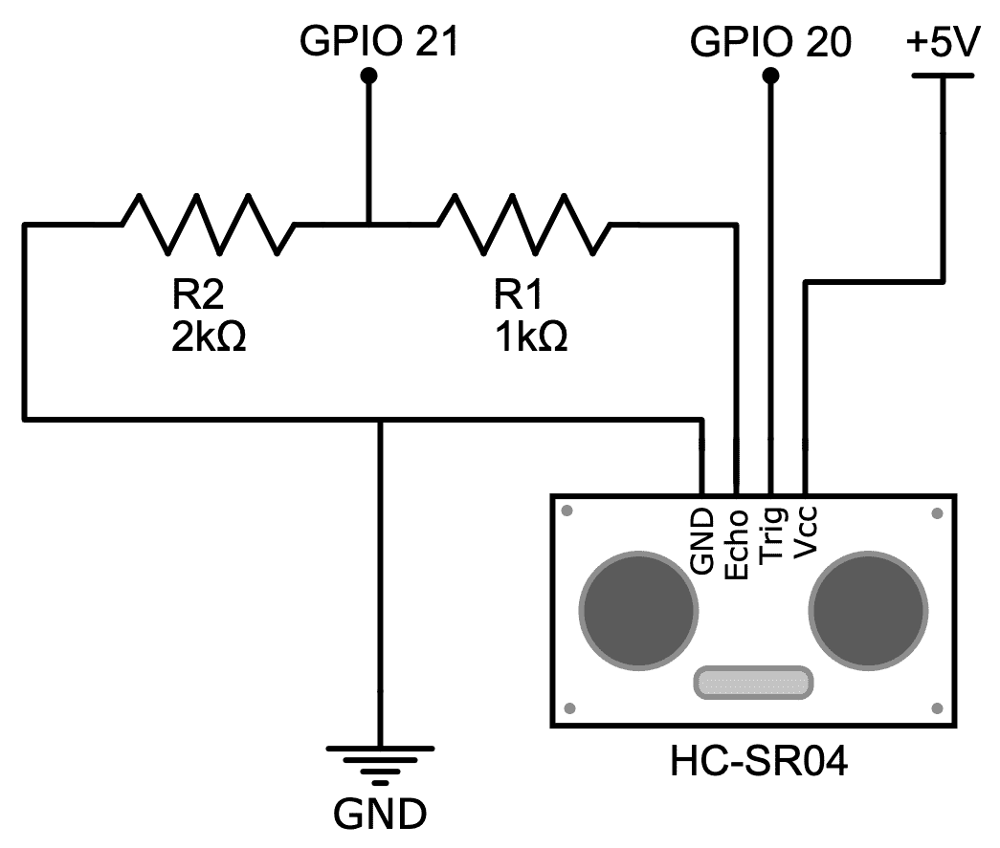

图 11.6 - HC-SR04（5 伏逻辑 ECHO 引脚）电路

作为提醒，HC-SR04 模块（或像这样连接到 5 伏电源的 HC-SR04P）是一个 5 伏逻辑模块，因此您会注意到电路中由两个电阻器创建的电压分压器将 5 伏转换为 3.3 伏。 如果您需要关于电压分压器的复习，我们在第六章中详细介绍了它们，*软件工程师的电子学 101*。

让我们在面包板上构建这个电路：

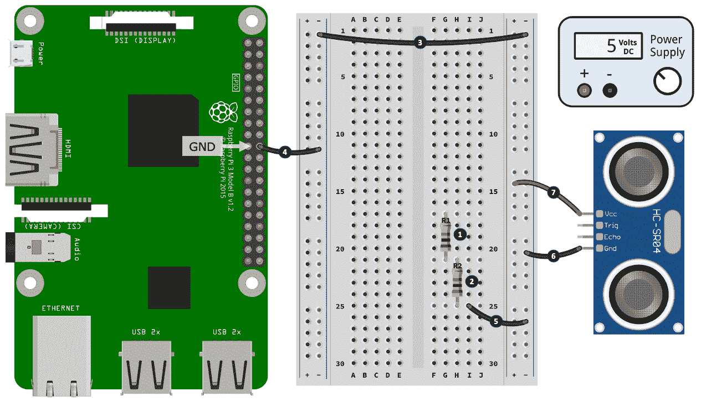

图 11.7 - HC-SR04 电路面包板布局（第一部分）

以下是创建面包板构建的第一部分的步骤。 步骤编号与*图 11.7*中的黑色圆圈中的数字相匹配：

1.  将 1kΩ电阻（R1）放入面包板中。

1.  将 2kΩ电阻（R2）放入面包板中。 第二个电阻的一个腿与第一个电阻的一个腿共用一行。 在插图中，这可以在右侧银行的第 21 行中看到。

1.  将左侧和右侧的负电源导轨连接在一起。

1.  将树莓派上的 GND 引脚连接到左侧电源轨的负电源。

1.  将第二条 2kΩ电阻（R2）连接到右侧电源轨的负电源。

1.  将 HC-SR04 传感器上的 GND 端子连接到右侧电源轨的负电源。

1.  将 HC-SR04 传感器上的 Vcc 端子连接到右侧电源轨的正电源。

确保 R1 和 R2 电阻的连接方式如前图所示 - 即 R1（1kΩ）连接到 HC-SR04 的 ECHO 引脚。由 R1 和 R2 创建的电压分压器将 ECHO 引脚的 5 伏特转换为~3.3 伏特。如果您将电阻安装反了，5 伏特将转换为~1.67 伏特，这不足以在树莓派上注册逻辑`HIGH`。

既然我们已经布置好了基本组件并进行了一些初步的接线连接，让我们完成我们的构建：

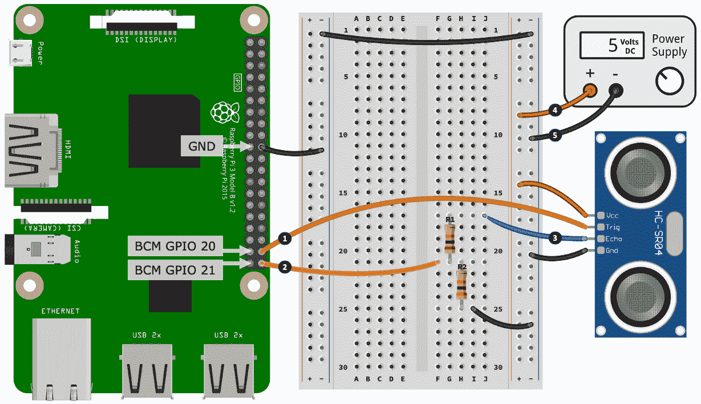

图 11.8 - HC-SR04 电路面包板布局（第二部分）

以下是要遵循的步骤。步骤编号与*图 11.8*中黑色圆圈中的数字相匹配：

1.  将树莓派上的 GPIO 20 连接到 HC-SR04 传感器上的 Trig 端子。

1.  将树莓派上的 GPIO 21 连接到 1kΩ（R1）和 2kΩ（R2）电阻的交汇处。这个连接在 F21 孔上的插图中有显示。

1.  将 HC-SR04 传感器的 Echo 端子连接到 1kΩ电阻（R1）。这个连接在 J17 孔上有显示。

1.  将 5 伏特电源的正端连接到右侧电源轨的正电源。

1.  将 5 伏特电源的负端连接到右侧电源轨的负电源。

如前所述，我们的电路构建将适用于 HC-SR04 和 HC-SR04P 模块。如果您有 HC-SR04P 模块，可以选择更简单的接线选项。由于 HC-SR04P 将在 3.3 伏特下工作，因此您可以这样做：

+   将 Vcc 连接到 3.3 伏特电源或树莓派上的 3.3 伏特引脚。

+   将 ECHO 端子直接连接到 GPIO 21。

+   GND 仍然连接到 GND，TRIG 仍然直接连接到 GPIO 20。

由于此配置以 3.3 伏特供电，因此 ECHO 端子上的逻辑输出也是 3.3 伏特，因此可以安全地直接连接到树莓派的 GPIO 引脚。

太好了！现在我们的电路已经完成，接下来我们将运行我们的示例程序，并使用 HC-SR04 来测量距离，并了解使其发生的代码。

## 运行和探索 HC-SR04 示例代码

HC-SR04 的示例代码可以在`chapter11/hc-sr04.py`文件中找到。在继续之前，请查看源代码，以对该文件的内容有一个广泛的了解。

在 HC-SR04 前面放一个实物体（大约 10 厘米），并在终端中运行代码。当您将物体靠近或远离传感器时，终端中打印的距离将会改变，如下所示：

```py
(venv) python hc-sr04.py
Press Control + C to Exit
9.6898cm, 3.8149"
9.7755cm, 3.8486"
10.3342cm, 4.0686"
11.5532cm, 4.5485"
12.3422cm, 4.8591"
...
```

让我们来审查代码。

首先，在第 1 行定义了`TRIG_GPIO`和`ECHO_GPIO`引脚，在第 2 行定义了声速的`VELOCITY`常数。我们使用 343 米每秒。

我们的代码使用 343 米/秒作为声速，而数据表建议的值为 340 米/秒。您还会发现其他使用略有不同数值的 HC-SR04 示例和库。这些差异是不同代码示例和库可能会对相同的传感器到物体距离产生略有不同读数的原因之一。

在第 3 行，我们定义了`TIMEOUT_SECS = 0.1`。`0.1`的值大于 38 毫秒（来自数据表）。任何大于这个值的时间，我们都会得出结论，我们的 HC-SR04 传感器前面没有物体，并返回`SENSOR_TIMEOUT`值，而不是`get_distance_cms()`函数中的距离，我们马上就会讲到：

```py
TRIG_GPIO = 20                                       # (1)
ECHO_GPIO = 21

# Speed of Sound in meters per second
# at 20 degrees C (68 degrees F)
VELOCITY = 343                                       # (2)

# Sensor timeout and return value
TIMEOUT_SECS = 0.1 # based on max distance of 4m     # (3)
SENSOR_TIMEOUT  = -1
```

接下来，从第 4 行开始，我们找到了几个变量，用于帮助测量传感器超声脉冲的时间以及我们是否有一个成功的读数：

```py
# For timing our ultrasonic pulse
echo_callback = None                             # (4)
tick_start = -1
tick_end = -1
reading_success = False
```

`echo_callback`将包含一个 GPIO 回调引用，以供稍后进行清理，而`tick_start`和`tick_end`保存了用于计算超声脉冲回波的经过时间的开始和结束时间。术语`tick`用于与 PiGPIO 定时函数保持一致，我们将很快讨论这一点。只有在`TIMEOUT_SECS`过去之前我们有一个距离读数时，`reading_success`才为`True`。

我们使用第 5 行显示的`trigger()`函数来启动我们的距离测量。我们在第 6 行简单地应用了数据表中的流程 - 也就是说，我们使 TRIG 引脚在 10 微秒内变为`HIGH`：

```py
def trigger():                                   # (5)
    global reading_success
    reading_success = False

    # Start ultrasonic pulses
    pi.write(TRIG_GPIO, pigpio.HIGH)             # (6)
    sleep(1 / 1000000) # Pause 10 microseconds
    pi.write(TRIG_GPIO, pigpio.LOW)
```

在第 7 行显示的`get_distance_cms()`函数是我们的主要函数，它通过调用`trigger()`来启动距离测量过程，然后在第 8 行等待，直到我们有一个成功的读数（也就是`reading_success = True`），或者`TIMEOUT_SECS`过去，此时我们返回`SENSOR_TIMEOUT`。在等待期间，一个名为`echo_handler()`的回调处理程序在后台监视`ECHO_GPIO`引脚以获取成功的读数。我们将在本节后面讨论`echo_handler()`。

```py
def get_distance_cms()                           # (7)
    trigger()

    timeout = time() + TIMEOUT_SECS              # (8)
    while not reading_success:
      if time() > timeout:
          return SENSOR_TIMEOUT
      sleep(0.01)
```

当我们有一个成功的读数时，我们的函数继续。在第 9 行，我们取`tick_start`和`tick_end`变量（现在已经由回声回调处理程序设置了值）并计算经过的时间。记住，我们在第 9 行将经过的时间除以 2，因为我们想要从传感器到物体的时间，*而不是*从传感器到物体再返回传感器的完整超声脉冲往返时间：

```py
# ... get_distance_cms() continued

    # Elapsed time in microseconds.
    #Divide by 2 to get time from sensor to object.
    elapsed_microseconds = 
                pigpio.tickDiff(tick_start, tick_end) / 2   # (9)

    # Convert to seconds
    elapsed_seconds = elapsed_microseconds / 1000000

    # Calculate distance in meters (d = v * t)
    distance_in_meters = elapsed_seconds * VELOCITY         # (10)

    distance_in_centimeters = distance_in_meters * 100
    return distance_in_centimeters
```

在第 10 行，我们应用了我们之前讨论过的公式，*d* = *v* × *t*，来计算传感器和物体之间的距离。

接下来，在第 11 行，我们遇到了`echo_handler()`函数，它监视`ECHO_GPIO`引脚的状态变化：

```py
def echo_handler(gpio, level, tick):            # (11)
    global tick_start, tick_end, reading_success

    if level == pigpio.HIGH:
        tick_start = tick                       # (12)
    elif level == pigpio.LOW:
        tick_end = tick                         # (13)
        reading_success = True
```

根据数据表中的流程，我们捕获了在第 12 行发送脉冲时的时间，当`ECHO_GPIO`变为`HIGH`，并在第 13 行接收到脉冲回来时的时间，当`ECHO_GPIO`变为`LOW`。如果我们在超时之前（在第 8 行）检测到`ECHO_GPIO`为`LOW`，我们将`reading_success = True`，这样`get_distance_cms()`就知道我们有一个有效的读数。

最后，我们在第 14 行使用 PiGPIO 注册了`echo_handler()`回调函数。`pigpio.EITHER_EDGE`参数表示我们希望在`ECHO_GPIO`转换为`HIGH`或`LOW`状态时调用此回调函数：

```py
echo_callback = 
    pi.callback(ECHO_GPIO, pigpio.EITHER_EDGE, echo_handler) # (14)
```

干得好！你刚刚连接、测试和学习了如何使用 HC-SR04 传感器以及 PiGPIO 来估算距离。你刚刚学到的电路和代码示例可以被改编并用于测量水箱水位，甚至作为机器人的碰撞检测（这是 HC-SR04 在业余机器人中非常常见的应用），或者在任何其他需要距离的项目中。

接下来，我们将简要探讨霍尔效应传感器，并学习它们如何用于检测运动和相对距离。

# 使用霍尔效应传感器检测运动和距离

本章的最后一个实际示例将说明霍尔效应传感器的使用。霍尔效应传感器是简单的组件，用于检测磁场的存在（或不存在）。与 PIR 或距离传感器相比，您可以使用霍尔效应传感器与磁铁一起监测小范围甚至非常快速的运动。例如，您可以将一个小磁铁固定在直流电机的轴上，并使用霍尔效应传感器来确定电机的每分钟转数。

霍尔效应传感器的另一个常见应用是在手机和平板电脑中。一些手机和平板电脑的外壳和套子中有一个小磁铁。当您打开或关闭外壳时，您的设备会通过霍尔效应传感器检测到这个磁铁的存在或不存在，并自动为您打开或关闭显示屏。

霍尔效应传感器有三种类型，如下所述：

+   **非锁定开关类型（数字）**：它们在磁场存在时输出数字状态（即`高`或`低`），在磁场不存在时输出相反的数字状态。信号在磁场存在时是`高`还是`低`取决于传感器是主动`低`还是主动`高`（如果需要关于主动`低`和主动`高`概念的复习，请参考第六章，*软件工程师的电子学 101*）。

+   **锁定开关类型（数字）**：当检测到磁铁的一个极性（例如南极）时，它们输出（并锁定到）`低`（或`高`），当检测到另一个极性（例如北极）时返回到`高`（或`低）（解锁）。

+   **比率类型（模拟）**：它们根据它们离磁场有多近而输出不同的电压。

一些读者可能熟悉一种叫做*磁簧开关*的组件，它是一种磁控开关。乍一看，它们在基本原理和操作上似乎与非锁定霍尔效应传感器相似。以下是重要的区别 - 与经典的磁簧开关不同，霍尔效应传感器是固态设备（没有活动部件），它们可以非常非常快地切换/触发（每秒数千次），并且它们需要一个适当的电路来使它们工作。

我们的示例将使用 A3144（非锁定数字开关）和 AH3503（模拟比率）霍尔效应传感器。由于这些特定部件的可用性和低成本，我们选择了这些特定部件；但是，我们将讨论的一般原则也适用于其他霍尔效应传感器。

图中显示了 A3144 霍尔效应传感器和常见的原理图符号：

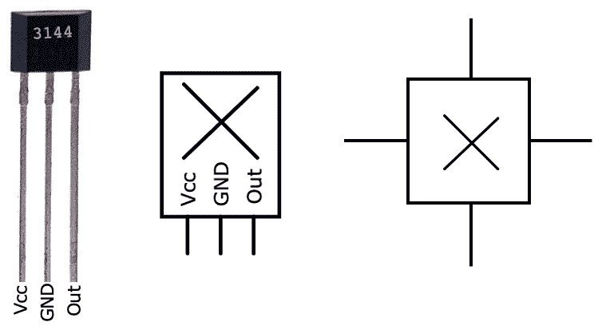

图 11.9 - 霍尔效应传感器和符号

您会注意到最右边的符号有四个突出的输出，因为一些霍尔效应传感器确实有四条腿。您可以期望该符号的输出在适用于所指的传感器的原理图中被注释。我们将坚持使用三条腿的传感器和相应的三个输出符号。

我们组件的腿如下：

+   **Vcc**：5 伏电源。

+   **GND**：接地连接。

+   **输出**：5 伏信号输出。请注意，A3144 是主动`低`的，这意味着在磁场存在时，**输出**腿变为`低`。

**输出**腿的行为将取决于霍尔效应传感器的类型：

+   **锁定和非锁定开关类型**：**输出**腿将输出数字`低`或数字`高`。

+   **比率类型**：输出将是变化的电压（即模拟输出）。请注意，变化电压的范围不会是 0 到 5 伏之间的全部范围，而更可能是几百分之几伏的范围。

现在我们了解了霍尔效应传感器的腿配置，让我们构建我们的电路。

## 创建霍尔效应传感器电路

我们将在面包板上构建以下电路。与我们的 HC-SR04 示例和*图 11.5*中的电路类似，由于我们的霍尔效应传感器输出 5 伏逻辑，我们需要使用电压分压器将其降至 3.3 伏：

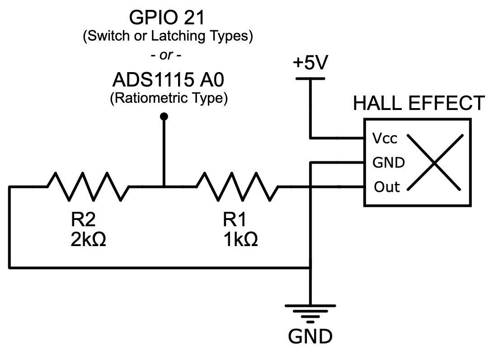

图 11.10 - 霍尔效应传感器电路

您会注意到该电路的输出是二元的，并且取决于您使用的传感器：

+   对于*非锁定开关*或*锁定开关*类型的霍尔效应传感器，您将直接将电路连接到 GPIO 21，因为传感器将输出数字`高`/`低`信号。

+   对于*比率*类型的霍尔效应传感器，您需要通过 ADS1115 模数转换器将传感器连接到您的树莓派，因为传感器输出变化的模拟电压。

我没有在*图 11.9*或以下的步进面包板布局中包括 ADS1115 的接线。我们已经在之前的章节中看到了如何使用 ADS1115 将模拟输出连接到树莓派 - 例如电路和代码，请参考第五章，*将您的树莓派连接到物理世界*，和/或第九章，*测量温度、湿度和光照水平*。

让我们在面包板上构建这个电路。这个布局是用于*开关型*霍尔效应传感器的：

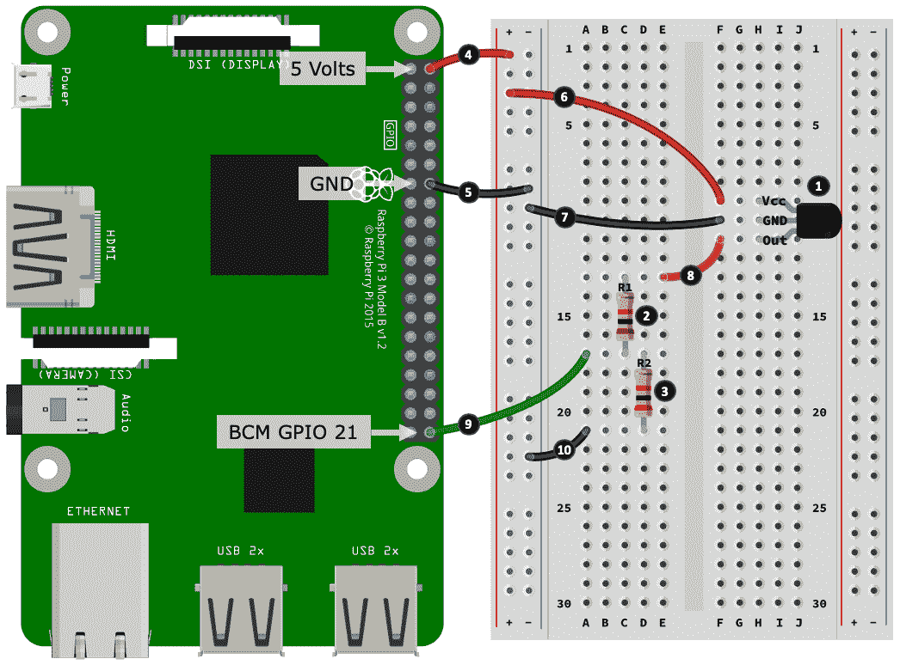

图 11.11 - 霍尔效应传感器电路面包板布局

以下是完成面包板构建的步骤。步骤编号与*图 11.10*中的黑色圆圈中的数字相匹配：

1.  将您的 A3144 霍尔效应传感器放入面包板中，注意其腿部的方向。如果需要帮助识别元件的腿部，请参考*图 11.8*。

1.  将 1kΩ电阻（R1）放入面包板中。

1.  将 2kΩ电阻（R2）放入面包板中。这第二个电阻的一个腿与第一个电阻的一个腿共用一行。在插图中，这可以在左侧银行的第 17 行看到。

1.  将树莓派的 5V 引脚连接到左侧电源轨道的正极。

1.  将树莓派的 GND 引脚连接到左侧电源轨道的负极。

1.  将霍尔效应传感器的 Vcc 腿连接到正电源轨道。

1.  将霍尔效应传感器的 GND 腿连接到负电源轨道。

1.  将霍尔效应传感器的 Out 腿连接到 1kΩ电阻（R1）。在插图中，这显示在 E13 孔。

1.  将 1kΩ（R1）和 2kΩ（R2）电阻的交汇处连接到树莓派的 GPIO 21。

1.  将 2kΩ电阻（R2）的左侧连接到负电源轨道。

要在这个电路中使用 AH3503 比率型霍尔效应传感器，在*步骤 1*，*步骤 9*的电线将需要连接到 ADS1115 模块的输入端口（例如 A0）。

现在我们已经建立了霍尔效应传感器电路，准备好一个磁铁，因为我们准备运行示例代码，看看磁铁如何触发传感器。

## 运行和探索霍尔效应传感器代码

您可以在`chapter11/hall_effect_digital.py`文件中找到开关和锁定开关类型霍尔效应传感器的代码，以及`chapter11/hall_effect_analog.py`文件中找到比率型霍尔效应传感器的代码。

当您查看这两个文件时，您会发现以下内容：

+   `chapter11/hall_effect_digital.py`在功能上与我们在本章前面介绍的 PIR 代码示例相同，标题为*运行和探索 PIR 传感器代码*。PIR 和非锁定/锁定霍尔效应传感器都是数字开关。唯一的区别是我们的参考霍尔效应传感器是*活动*`LOW`。

+   `chapter11/hall_effect_analog.py`类似于我们在使用 ADS1115 ACD 的其他模拟到数字示例中看到的，包括来自第五章，*将您的树莓派连接到物理世界*的电路布线和代码。

AH3503 比率型霍尔效应传感器输出的变化电压范围，并通过电压分压器由您的 ADC 测量，可能在几百毫伏的范围内。

当您运行示例代码时，将磁铁移过霍尔效应传感器。磁铁需要靠近传感器的外壳；然而，它不需要实际接触传感器。有多*近*取决于您的磁铁的强度。

如果您无法使电路和代码正常工作，请尝试旋转磁铁以改变通过传感器的南/北极。还要注意，对于*闸锁*型霍尔效应传感器，一个磁铁极常常会*锁定*（触发）传感器，而另一个磁铁极则会*解锁*（取消触发）传感器。

由于代码相似性，我们不会在这里再次介绍代码。但是，我想说的是，现在在本书中，您已经可以连接并使用任何简单的模拟或数字元件的数字和模拟基础电路和代码。正如本章已经指出的那样，只需注意所需的电压和电流来为元件供电，特别是输出电压是多少，因为如果超过 3.3 伏，您将需要使用电压分压器或电平转换器。

# 总结

在本章中，我们探讨了如何使用树莓派检测运动并估计距离。我们学会了如何使用 PIR 传感器检测广泛的运动，以及如何使用开关型霍尔效应传感器来检测磁场的运动。我们还发现了如何使用超声波测距传感器在较大范围上估计绝对距离，以及如何使用比例型霍尔效应传感器在小范围上测量相对距离。

本章中所有的电路和示例都是*输入*为主 - 告诉我们的树莓派发生了某些事件，比如检测到有人移动或正在测量距离。

现在你已经处于一个很好的位置，可以将本章中涵盖的输入电路（还有第九章中的内容，*测量温度、湿度和光照*），与第七章中的输出电路和示例，*打开和关闭设备*，第八章，*灯光、指示灯和信息显示*，以及第十章，*使用舵机、电机和步进电机进行运动*，结合起来，创建可以控制和测量环境的端到端项目！

不要忘记我们在第二章中学到的内容，*使用 Python 和物联网入门*，第三章，*使用 Flask 进行 RESTful API 和 Web Sockets 网络*，以及第四章，*使用 MQTT、Python 和 Mosquitto MQTT Broker 进行网络*。这三章为您提供了创建网页界面和集成到外部系统的基础，可以控制和监测环境。

到目前为止，在本书中呈现的许多电子和代码示例都围绕着单个传感器或执行器发展。在下一章中，我们将探索几种基于 Python 的设计模式，这些模式在构建涉及多个需要相互通信的传感器和/或执行器的更复杂的自动化和物联网项目时非常有用。

# 问题

最后，这里有一些问题供您测试对本章材料的了解。您将在本书的*评估*部分找到答案：

1.  PIR 传感器能否检测物体移动的方向？

1.  有哪些因素会影响超声波距离传感器的测量精度？

1.  闸锁型或非闸锁型霍尔效应传感器的输出与比例霍尔效应传感器的输出有何不同？

1.  关于这个 PiGPIO 函数调用，`callback = pi.callback(GPIO, pigpio.EITHER_EDGE, callback_handler)`，`pigpio.EITHER_EDGE`参数是什么意思？

1.  在由 1kΩ和 2kΩ电阻组成的 5 伏到 3.3 伏基于电阻的电压分压器中，为什么在电路中连接两个电阻值的方式很重要？

1.  HC-SR04 超声波距离传感器和 HC-SR501 PIR 传感器都使用 5 伏电压连接到它们各自的 Vcc 引脚。为什么我们要使用电压分压器将 HC-SR04 的输出从 5 伏降到 3.3 伏，而不是 HC-SR501？
