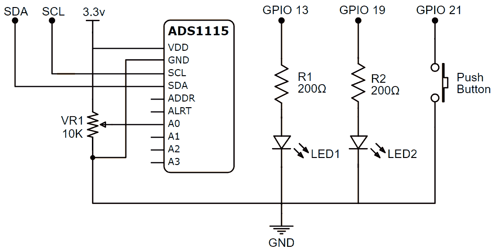
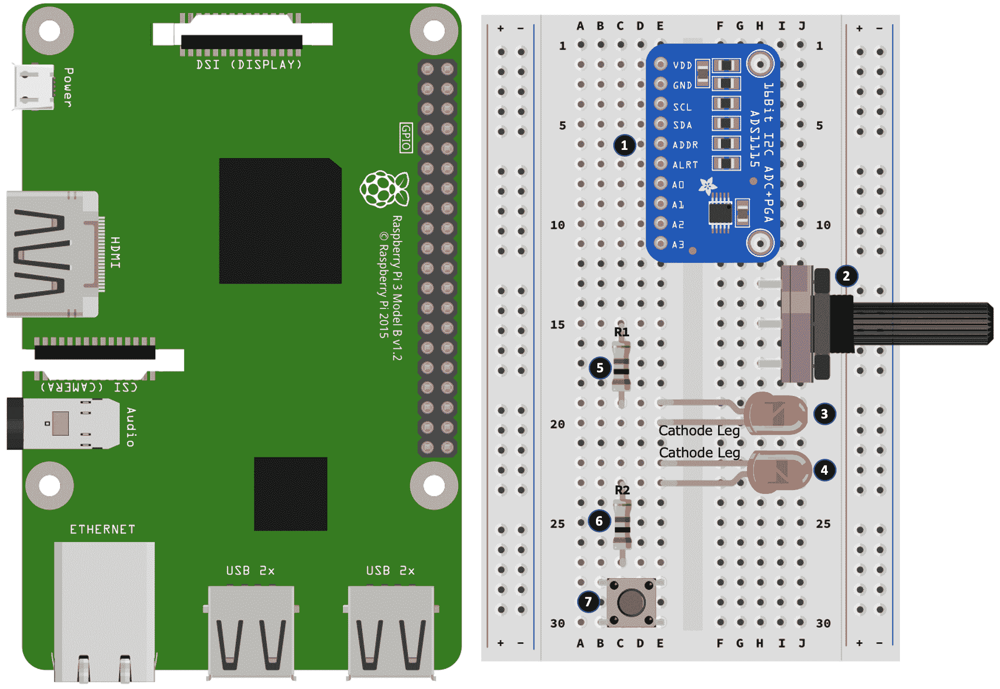
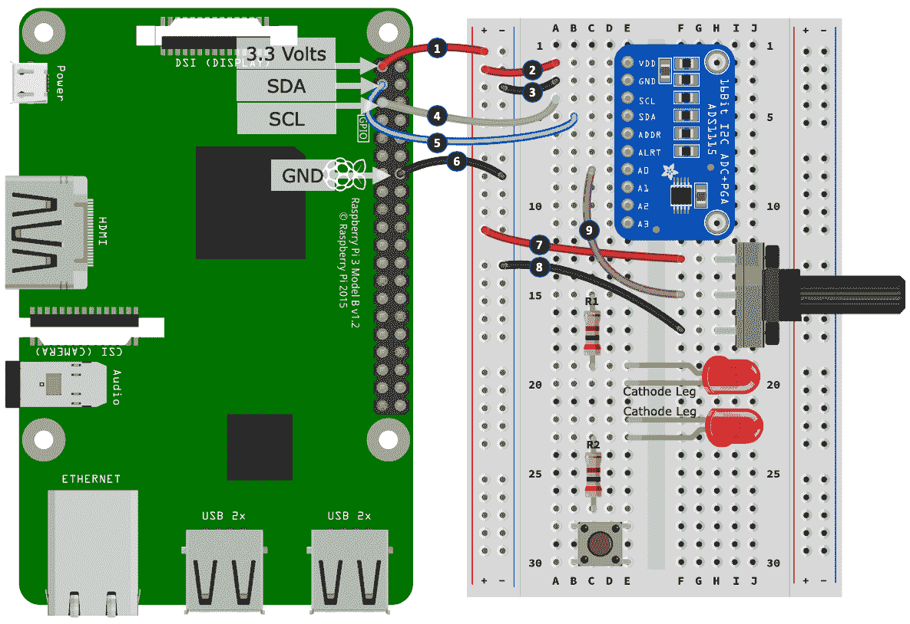
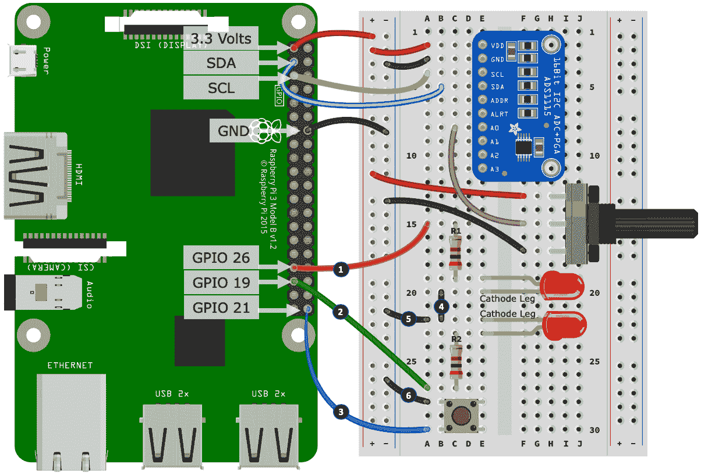

# 第十二章：高级 IoT 编程概念-线程、异步 IO 和事件循环

在上一章中，我们学习了如何使用 PIR 传感器检测运动，以及如何使用超声波传感器和霍尔效应传感器测量距离和检测运动。

在本章中，我们将讨论在处理电子传感器（输入设备）和执行器（输出设备）时，*构建*Python 程序的替代方式。我们将首先介绍经典的事件循环编程方法，然后转向更高级的方法，包括在 Python 中使用线程、发布者/订阅者模型，最后是使用 Python 进行异步 IO 编程。

我向您保证，互联网上有很多博客文章和教程涵盖了这些主题；然而，本章将专注于实际的电子接口。本章的方法将涉及创建一个简单的电路，其中包括一个按钮、一个电位计和两个 LED，我们将使它们以不同的速率闪烁，并提供四种不同的编码方法来使电路工作。

以下是本章将涵盖的内容：

+   构建和测试我们的电路

+   探索事件循环的方法

+   探索线程化方法

+   探索发布者-订阅者的替代方案

+   探索异步 IO 的方法

# 技术要求

为了完成本章的练习，您需要以下内容：

+   树莓派 4 型 B

+   Raspbian OS Buster（带桌面和推荐软件）

+   最低 Python 版本 3.5

这些要求是本书中代码示例的基础。可以合理地期望，只要您的 Python 版本是 3.5 或更高，本书中的代码示例应该可以在树莓派 3 型 B 或不同版本的 Raspbian OS 上无需修改即可运行。

您可以在 GitHub 存储库的`chapter12`文件夹中找到本章的源代码，该存储库位于[`github.com/PacktPublishing/Practical-Python-Programming-for-IoT`](https://github.com/PacktPublishing/Practical-Python-Programming-for-IoT)。

需要在终端中执行以下命令来设置虚拟环境并安装本章所需的 Python 库：

```py
$ cd chapter12              # Change into this chapter's folder
$ python3 -m venv venv      # Create Python Virtual Environment
$ source venv/bin/activate  # Activate Python Virtual Environment
(venv) $ pip install pip --upgrade        # Upgrade pip
(venv) $ pip install -r requirements.txt  # Install dependent packages
```

以下依赖项已从`requirements.txt`中安装：

+   **PiGPIO**：PiGPIO GPIO 库（[`pypi.org/project/pigpio`](https://pypi.org/project/pigpio)）

+   **ADS1X15**：ADS1x15 ADC 库（[`pypi.org/project/adafruit-circuitpython-ads1x15`](https://pypi.org/project/adafruit-circuitpython-ads1x15)）

+   **PyPubSub**：进程内消息和事件（[`pypi.org/project/PyPubSub`](https://pypi.org/project/PyPubSub)）

本章练习所需的电子元件如下：

+   2 x 红色 LED

+   2 x 200 Ω 电阻

+   1 x 按钮开关

+   1 x ADS1115 模块

+   1 x 10k Ω 电位计

为了最大限度地提高您在本章中的学习效果，对于预先存在的知识和经验做出了一些假设：

+   从电子接口的角度来看，我假设您已经阅读了本书前面的 11 章，并且对本书中始终出现的 PiGPIO 和 ADS1115 Python 库的工作感到满意。

+   从编程的角度来看，我假设您已经掌握了**面向对象编程**（**OOP**）技术以及它们在 Python 中的实现。

+   熟悉*事件循环*、*线程*、*发布者-订阅者*和*同步与异步*范式的概念也将是有利的。

如果前述任何主题对您来说是陌生的，您会发现有很多在线教程详细介绍了这些主题。请参阅本章末尾的*进一步阅读*部分以获取建议。

# 构建和测试我们的电路

我将以实际练习的形式呈现本章的电路和程序。让我们假设我们被要求设计和构建一个具有以下要求的*小玩意*：

+   它有两个 LED 灯在闪烁。

+   电位计用于调整 LED 的闪烁速率。

+   程序启动时，两个 LED 将以由电位计位置确定的相同速率闪烁。

+   0 秒的闪烁速率意味着 LED 关闭，而 5 秒的最大闪烁速率意味着 LED 打开 5 秒，然后关闭 5 秒，然后重复循环。

+   按下按钮用于选择调整闪烁速率的 LED，当调整电位计时。

+   当按下并保持按下按钮 0.5 秒时，所有 LED 将同步到相同的速率，由电位计的位置确定。

+   理想情况下，程序代码应该很容易扩展，以支持更多 LED，而编码工作量很小。

以下是一个说明使用这个小玩意的场景：

1.  应用电源后（程序启动），所有 LED 以 2.5 秒的速率开始闪烁，因为电位计的刻度在旋转的中点（50%）。

1.  用户调整电位计，使*第一个*LED 以 4 秒的速率闪烁。

1.  接下来，用户简短地按下并释放按钮，以便电位计改变*第二个*LED 的闪烁速率。

1.  现在，用户调整电位计，使*第二个*LED 以 0.5 秒的速率闪烁。

1.  最后，用户按下并保持按钮 0.5 秒，使*第一个*和*第二个*LED 以 0.5 秒的速率同步闪烁（由*步骤 4*中电位计设置的速率）。

现在是我提到的挑战 - 在我们进入本章的电路和代码之前，我挑战您停止阅读，尝试创建一个实现上述要求的电路并编写程序。

您可以在[`youtu.be/seKkF61OE8U`](https://youtu.be/seKkF61OE8U)上找到演示这些要求的短视频。

我预计您会遇到挑战，并对采取的最佳方法有疑问。没有最佳方法；然而，通过拥有自己的实现 - 无论是否有效 - 您将有东西可以与我在本章中将提出的四种解决方案进行比较和对比。我相信，如果您首先自己尝试一下，那么您将获得更深入的理解和更多的见解。也许您会创造出更好的解决方案！

如果您需要建议来帮助您入门，这里有一些建议：

+   我们在《使用 Python 和物联网入门》的[第二章]中首次介绍了 LED 和按钮。

+   我们首先在《将树莓派连接到物理世界》的[第五章]中介绍了电位计和模拟输入，使用了 ADS1115 模块。

当您准备好时，我们将看一个满足上述要求的电路。

## 构建参考电路

在*图 12.1*中是一个符合我们刚列出的要求的电路。它有一个按钮，一个电位计，以电压分压器的形式连接到 ADS1115 模数转换器，和两个通过限流电阻连接的 LED。添加额外的 LED 将像在 GND 和一个空闲的 GPIO 引脚之间布线更多的 LED 和电阻对一样简单：



图 12.1 - 参考电路原理图

如果您还没有在面包板上创建类似的电路，我们现在将在您的面包板上创建这个电路。我们将分三部分构建这个电路。让我们开始吧：



图 12.2 - 参考电路（3 部分之一）

以下是创建我们的面包板构建的第一部分的步骤。步骤编号与*图 12.2*中黑色圆圈中的数字相匹配：

1.  将 ADS1115 模块放入面包板中。

1.  将电位计放入面包板中。

1.  将 LED 放入面包板中，注意 LED 的引脚方向如图所示。

1.  将第二个 LED 放入面包板中，注意 LED 的引脚方向如图所示。

1.  将一个 200Ω电阻（R1）放入您的面包板中。这个电阻的一端与*步骤 3*中放置的 LED 的阳极腿共用一行。

1.  将另一个 200Ω电阻（R2）放入您的面包板中。这个电阻的一端与*步骤 5*中放置的第二个 LED 的阳极腿共用一行。

1.  将按键放入您的面包板中。

现在我们已经将组件放入面包板中，让我们开始将它们连接起来：



图 12.3 - 参考电路（2/3 部分）

以下是继续进行面包板组装的步骤。步骤编号与*图 12.3*中的黑色圆圈中的编号相匹配：

1.  将树莓派的 3.3 伏特引脚连接到左侧电源轨的正电源轨。

1.  将 ADS1115 的 Vdd 端连接到左侧电源轨的正电源轨。

1.  将 ADS1115 的 GND 端连接到左侧电源轨的负电源轨。

1.  将 ADS1115 的 SCL 端连接到树莓派的 SCL 引脚。

1.  将 ADS1115 的 SDA 端连接到树莓派的 SDA 引脚。

1.  将树莓派上的 GND 引脚连接到左侧电源轨的负电源轨。

1.  将电位器的外端连接到左侧电源轨的正电源轨。

1.  将电位器的另一个外端连接到左侧电源轨的负电源轨。

1.  将电位器的中间端口连接到 ADS1115 的 A0 端口。

您是否记得，这种配置中的电位器正在创建一个可变电压分压器？如果没有，您可能需要重新阅读第六章，*软件工程师的电子学 101*。此外，如果您想对 ADS1115 模块进行详细复习，请参阅第五章，*将树莓派连接到物理世界*。

让我们继续组装：



图 12.4 - 参考电路（3/3 部分）

以下是继续进行面包板组装的最后部分的步骤。步骤编号与*图 12.4*中的黑色圆圈中的编号相匹配：

1.  将树莓派的 GPIO 26 连接到 200Ω电阻（R1）。

1.  将树莓派的 GPIO 19 连接到第二个 200Ω电阻（R2）。

1.  将树莓派的 GPIO 21 连接到按键的一腿。

1.  将两个 LED 的阴极腿连接在一起。

1.  将 LED 的阴极腿连接到左侧电源轨的负电源轨。

1.  将按键的第二腿连接到左侧电源轨的负电源轨。

现在我们已经完成了电路组装，我们准备运行示例代码使电路工作。

## 运行示例

本章提供了四个不同版本的代码，可以与*图 12.1*中先前显示的电路配合使用。您将在`chapter12`文件夹中按版本组织的代码：

+   `chapter12/version1_eventloop`是一个基于*事件循环*的示例。

+   `chapter12/version2_thread`是一个基于*线程和回调*的示例。

+   `chapter12/version3_pubsub`是一个基于*发布者-订阅者*的示例。

+   `chapter12/version4_asyncio`是一个**异步 IO**（***AsyncIO***)*-based 示例。

所有版本在功能上是等效的；但是它们在代码结构和设计上有所不同。在测试电路后，我们将更详细地讨论每个版本。

以下是运行每个版本（从版本 1 开始）并测试电路的步骤：

1.  切换到`version1_eventloop`文件夹。

1.  简要查看`main.py`源文件，以及文件夹中的任何其他 Python 文件，了解它们包含的内容以及程序的结构。

1.  在终端中运行`main.py`（记得先切换到本章的虚拟环境）。

此时，如果您收到关于 I2C 或 ADS11x5 的错误，请记住有一个`i2cdetect`工具，可以用来确认 I2C 设备（如 ADS1115）是否正确连接并对您的树莓派可见。有关更多信息，请参阅第五章，*将您的树莓派连接到物理世界*。

1.  转动电位器拨号并观察*第一个*LED 的闪烁速率变化。

1.  短按按钮。

1.  转动电位器拨号并观察*第二个*LED 的闪烁速率变化。

1.  按住按钮 0.5 秒，观察两个 LED 现在以相同速率同步闪烁。

以下是您将收到的终端输出示例：

```py
(venv) $ cd version1_eventloop
(venv) $ python main.py
INFO:Main:Version 1 - Event Loop Example. Press Control + C To Exit.
INFO:Main:Setting rate for all LEDs to 2.5
INFO:Main:Turning the Potentiometer dial will change the rate for LED #0
INFO:Main:Changing LED #0 rate to 2.6
INFO:Main:Changing LED #0 rate to 2.7 
INFO:Main:Turning the Potentiometer dial will change the rate for LED #1
INFO:Main:Changing LED #1 rate to 2.6
INFO:Main:Changing LED #1 rate to 2.5
# Truncated
INFO:Main:Changing LED #1 rate to 0.5
INFO:Main:Changing rate for all LEDs to 0.5
```

1.  在终端中按*Ctrl *+ *C*退出程序。

1.  对`version2_threads`、`version3_pubsub`和`version4_asyncio`重复*步骤 1*至*8*。

您刚刚测试并浏览了四种不同程序的源代码（也许五种，如果您挑战自己创建了自己的程序），它们都以不同的方式实现了完全相同的最终结果。

现在是时候了解这些程序是如何构建的了。让我们从程序的*事件循环*版本开始。

# 探索事件循环方法

我们将通过讨论基于事件循环的方法来开始我们的代码探索，以构建我们在上一节中测试过的示例小玩意。

基于事件循环的方法的代码可以在`chapter12/version1_eventloop`文件夹中找到。您会找到一个名为`main.py`的文件。现在请花时间停下来阅读`main.py`中的代码，以基本了解程序的结构和工作原理。或者，您可以在代码中添加断点或插入`print()`语句，然后再次运行它以了解其工作原理。

您的体验如何，您注意到了什么？如果您认为*呸*或者在循环、`if`语句和状态变量的网络中迷失了，那么干得好！这意味着您已经投入了时间来考虑这种方法以及代码的构造方式。

我所说的事件循环方法在代码中通过第 1 行的`while True:`循环进行了演示：

```py
# chapter12/version1_eventloop
#
# Setup and initialization code goes before while loop.
#

if __name__ == "__main__":
    # Start of "Event Loop"
    while True:                                # (1)
      #
      # ... Main body of logic and code is within the while loop...
      #
      sleep(SLEEP_DELAY)
```

当然，我可以使用函数甚至外部类来减少`while`循环中的代码数量（可能还可以增强可读性），但是，总体设计范式仍然是相同的-程序控制的主体部分处于永久循环中。

如果您熟悉 Arduino 编程，您将对这种编程方法非常熟悉。这就是为什么我将本节标题为*事件循环*，因为这种方法和术语的流行度相似。尽管如此，请注意*事件循环*这个术语在 Python 中有更广泛的上下文，当我们查看程序的 AsyncIO（版本 4）时会看到。

您可能已经意识到，本书中许多示例都使用了这种事件循环编程方法。以下是三个示例：

+   当我们需要定时事件，比如闪烁 LED 时（第二章，*使用 Python 和物联网入门*）

+   DHT 11 或 DHT 22 温度/湿度传感器的轮询（第九章，*测量温度、湿度和光照水平*）

+   轮询连接到**光敏电阻**（**LDR**）的 ADS1115 模拟数字转换器（也第九章，*测量温度、湿度和光照水平*）

在这种情况下，对于一个单一的专注示例，事件循环是有意义的。甚至在你进行试验和学习新的执行器或传感器时，它们也是纯粹为了方便而有意义的。然而，正如我们的`version1_eventloop/main.py`程序所示，一旦你添加了多个组件（比如电位计、两个 LED 和一个按钮）并且想要让它们为一个明确的目的一起工作，代码就会迅速变得复杂。

例如，考虑一下第 3 行的以下代码，它负责让所有 LED 闪烁，并记住这个代码块在每次循环迭代中被评估一次，负责让每个 LED 闪烁：

```py
    #
    # Blink the LEDs.
    #
    now = time()                                               # (3)
    for i in range(len(LED_GPIOS)):
        if led_rates[i] <= 0:
            pi.write(LED_GPIOS[i], pigpio.LOW) # LED Off.
        elif now >= led_toggle_at_time[i]:
            pi.write(LED_GPIOS[i], not pi.read(LED_GPIOS[i])) # Toggle LED
            led_toggle_at_time[i] = now + led_rates[i]
```

与纯粹的替代方案相比（类似于我们将在其他方法中看到的），一眼看去，它们显然更容易理解：

```py
   while True:
      pi.write(led_gpio, not pi.read(led_gpio)) # Toggle LED GPIO High/Low
      sleep(delay)
```

如果你再考虑一下从第 2 行开始的以下代码块，它负责检测按钮按下，那么你会发现在实际的`main.py`文件中有将近 40 行代码，只是为了检测按钮的操作：

```py
while True:
    button_pressed = pi.read(BUTTON_GPIO) == pigpio.LOW        # (2)

    if button_pressed and not button_held:
        # Button has been pressed.
        # ... Truncated ...
    elif not button_pressed:
        if was_pressed and not button_held:
            # Button has been released
            # ... Truncated ...
    if button_hold_timer >= BUTTON_HOLD_SECS and not button_held:
        # Button has been held down
        # ... Truncated ...

    # ... Truncated ...
```

你会发现有多个变量在起作用 - `button_pressed`、`button_held`、`was_pressed`和`button_hold_timer` - 它们在每次`while`循环迭代中都被评估，并且主要用于检测*按钮按住*事件。我相信你会理解，像这样编写和调试这样的代码可能会很乏味和容易出错。

我们本可以使用`PiGPIO` *回调*来处理`while`循环之外的按钮按下，或者使用 GPIO Zero 的`Button`类。这两种方法都有助于减少按钮处理逻辑的复杂性。同样，也许我们本可以混合使用 GPIO Zero 的`LED`类来处理 LED 的闪烁。然而，如果这样做，我们的示例就不会是一个纯粹基于事件循环的示例。

现在，我并不是说事件循环是一种不好或错误的方法。它们有它们的用途，是必需的，实际上，每当我们使用`while`循环或其他循环结构时，我们都会创建一个 - 所以基本理念无处不在，但这并不是构建复杂程序的理想方法，因为这种方法使它们更难理解、维护和调试。

每当你发现你的程序正在走这条事件循环的道路时，停下来反思一下，因为也许是时候考虑重构你的代码，采用不同的 - 更易维护的 - 方法，比如线程/回调方法，我们将在下面看到。

# 探索线程方法

现在我们已经探索了一个基于事件循环的方法来创建我们的程序，让我们考虑一种使用线程、回调和面向对象编程的替代方法，并看看这种方法如何改进了代码的可读性和可维护性，并促进了代码的重用。

基于*线程*的方法的代码可以在`chapter12/version2_threads`文件夹中找到。你会找到四个文件 - 主程序`main.py`和三个类定义：`LED.py`、`BUTTON.py`和`POT.py`。

现在请花点时间停下来阅读`main.py`中包含的代码，以基本了解程序的结构和工作原理。然后，继续查看`LED.py`、`BUTTON.py`和`POT.py`。

它是如何进行的，你注意到了什么？我猜想你会发现这个程序的版本（在阅读`main.py`时）更快更容易理解，并且注意到没有繁琐复杂的`while`循环，而是一个`pause()`调用，这是必要的，用于阻止我们的程序退出，如第 3 行总结的那样：

```py
# chapter12/version2_threads/main.py
if __name__ == "__main__":                                       # (3)
        # Initialize all LEDs
        # ... Truncated ...

        # No While loop!
        # It's our BUTTON, LED and POT classes and the 
        # registered callbacks doing all the work.
        pause()
```

在这个程序示例中，我们使用了面向对象的技术，并使用了三个类来组件化我们的程序：

+   一个按钮类（`BUTTON.py`），负责所有按钮逻辑

+   一个电位计类（`POT.py`），负责所有电位计和模拟数字转换逻辑

+   一个 LED 类（`LED.py`），负责让*单个*LED 闪烁

通过使用面向对象的方法，我们的`main.py`代码大大简化了。它的作用现在是创建和初始化类实例，并包含使我们的程序工作的回调处理程序和逻辑。

考虑一下我们的按钮的面向对象的方法：

```py
# chapter12/version2_threads/main.py
# Callback Handler when button is pressed, released or held down.
def button_handler(the_button, state):
    global led_index
    if state == BUTTON.PRESSED:                                 # (1)
        #... Truncated ...
    elif state == BUTTON.HOLD:                                  # (2)
        #... Truncated 

# Creating button Instance
button = BUTTON(gpio=BUTTON_GPIO,
               pi=pi,
               callback=button_handler)
```

与事件循环示例中的按钮处理代码相比，这大大简化了并且更易读——很明显这段代码在第 1 行响应按钮按下，第 2 行响应按钮保持。

让我们考虑一下`BUTTON`类，它在`BUTTON.py`文件中定义。这个类是一个增强的包装器，可以将按钮的 GPIO 引脚的`HIGH`/`LOW`状态转换为`PRESSED`、`RELEASED`和`HOLD`事件，如在`BUTTON.py`的第 1 行中总结的代码所示：

```py
# chapter12/version2_threads/BUTTON.py
def _callback_handler(self, gpio, level, tick): # PiGPIO Callback  # (1)

     if level == pigpio.LOW: # level is LOW -> Button is pressed
         if self.callback: self.callback(self, BUTTON.PRESSED)

         # While button is pressed start a timer to detect
         # if it remains pressed for self.hold_secs
         timer = 0                                                 # (2)
         while (timer < self.hold_secs) and not self.pi.read(self.gpio):
             sleep(0.01)
             timer += 0.01

         # Button is still pressed after self.hold_secs
         if not self.pi.read(self.gpio):                
             if self.callback: self.callback(self, BUTTON.HOLD)

     else: # level is HIGH -> Button released            
         if self.callback: self.callback(self, BUTTON.RELEASED)
```

与事件循环示例中的按钮处理代码相比，我们没有引入和审问多个状态变量来检测按钮保持事件，而是将这个逻辑简化为在第 2 行的简单线性方法。

接下来，当我们考虑`POT`类（在`POT.py`中定义）和`LED`类（在`LED.py`中定义）时，我们将看到线程进入我们的程序。

您知道即使在多线程的 Python 程序中，也只有一个线程在活动吗？虽然这似乎违反直觉，但这是 Python 语言最初创建时做出的一个称为**全局解释器锁**（**GIL**）的设计决定。如果您想了解更多关于 GIL 和使用 Python 实现并发的其他形式的信息，您可以在本章的*进一步阅读*部分找到相关资源。

以下是`POT`类的线程运行方法，可以在`POT.py`源文件中找到，从第 1 行开始说明了中间轮询 ADS1115 ADC 以确定电位器位置的方法。我们已经在本书中多次看到这个轮询示例，最早是在第五章中，*将您的树莓派连接到物理世界*，我们首次讨论模数转换、ADS1115 模块和电位器：

```py
    # chapter12/version2_threads/POT.py
    def run(self):   
        while self.is_polling:                              # (1)
            current_value = self.get_value()  
            if self.last_value != current_value:            # (2)
                if self.callback:
                    self.callback(self, current_value)      # (3)
                self.last_value = current_value

            timer = 0  
            while timer < self.poll_secs:  # Sleep for a while
                sleep(0.01)
                timer += 0.01

        # self.is_polling has become False and the Thread ends.
        self.__thread = None
```

我们这里的代码不同之处在于我们正在监视 ADC 上的电压变化（例如，当用户转动电位器时），并将其转换为回调（在第 3 行），您在审查该文件中的源代码`main.py`时会看到。

现在让我们讨论一下我们如何实现`version2` LED 相关的代码。正如您所知，闪烁 LED 的基本代码模式涉及`while`循环和`sleep`语句。这就是 LED 类中采用的方法，如`LED.py`中第 3 行的`run()`方法中所示：

```py
# chapter12/version2_threads/LED.py
 def run(self):                                                    # (3)
     """ Do the blinking (this is the run() method for our Thread) """
     while self.is_blinking:
         # Toggle LED On/Off
         self.pi.write(self.gpio, not self.pi.read(self.gpio))

         # Works, but LED responsiveness to rate chances can be sluggish.
         # sleep(self.blink_rate_secs)

         # Better approach - LED responds to changes in near real-time.
         timer = 0
         while timer < self.blink_rate_secs:
             sleep(0.01)
             timer += 0.01

     # self.is_blinking has become False and the Thread ends.
     self._thread = None
```

我相信您会同意这比我们在前一节讨论的事件循环方法更容易理解。然而，重要的是要记住，事件循环方法是在*单个*代码块中使用和改变*所有*LED 的闪烁速率，并在*单个*线程——程序的主线程中进行的。

请注意前面代码中显示的两种睡眠方法。虽然使用 `sleep(self.blink_rate_secs)` 的第一种方法很常见且诱人，但需要注意的是它会阻塞线程，使其在整个睡眠期间无法立即响应速率变化，当用户转动电位器时会感觉迟钝。第二种方法，称为 `#Better approach`，缓解了这个问题，使 LED 能够（近乎）实时地响应速率变化。

我们的`version2`程序示例使用 LED 类及其自己的内部线程，这意味着我们现在有多个线程——每个 LED 一个——都独立地使 LED 独立地闪烁。

你能想到这可能引入的任何潜在问题吗？好吧，如果你已经阅读了`version2`源文件，这可能是显而易见的——当按钮按下 0.5 秒时，同步所有 LED 以同样的速率同时闪烁！

通过引入多个线程，我们引入了多个定时器（即`sleep()`语句），因此每个线程都在自己独立的时间表上闪烁，而不是从一个共同的参考点开始闪烁。

这意味着，如果我们简单地在多个 LED 上调用`led.set_rate(n)`，虽然它们都会以速率*n*闪烁，但它们不一定会同步闪烁。

解决这个问题的一个简单方法是在开始以相同速率闪烁之前同步关闭所有 LED。也就是说，我们从一个共同的状态（即关闭）开始让它们一起闪烁。

这种方法在`LED.py`的第 1 行开始的以下代码片段中显示。同步的核心是在第 2 行的`led._thread.join()`语句中实现的：

```py
    # chapter12/version2_threads/LED.py
    @classmethod                                           # (1)
    def set_rate_all(cls, rate):
        for led in cls.instances: # Turn off all LEDs.
            led.set_rate(0)

        for led in cls.instances:                        
            if led._thread:
                led._thread.join()                         # (2)

        # We do not get to this point in code until all 
        # LED Threads are complete (and LEDS are all off)

        for led in cls.instances:  # Start LED's blinking
            led.set_rate(rate)
```

这是同步的一个很好的第一步，对于我们的情况来说，实际上效果很好。正如前面提到的，我们所做的就是确保我们的 LED 从关闭状态同时开始闪烁（嗯，非常非常接近同时，取决于 Python 迭代`for`循环所花费的时间）。

尝试将前面代码中第 2 行的`led._thread.join()`和包含的`for`循环注释掉，然后运行程序。让 LED 以不同的速率闪烁，然后尝试通过按住按钮来同步它们。它总是有效吗？

但必须指出的是，我们仍然在处理多个线程和独立的定时器来让我们的 LED 闪烁，因此存在时间漂移的可能性。如果这曾经成为一个实际问题，那么我们将需要探索替代技术来同步每个线程中的时间，或者我们可以创建并使用一个单一的类来管理多个 LED（基本上使用事件循环示例中的方法，只是将其重构为一个类和一个线程）。

关于线程的要点是，当您将线程引入应用程序时，您可能会引入*可能*可以设计或同步的时间问题。

如果你的原型或新程序的第一次尝试涉及基于事件循环的方法（就像我经常做的那样），那么当你将代码重构为类和线程时，始终要考虑可能出现的任何时间和同步问题。在测试期间意外发现与同步相关的错误（或更糟糕的是，在生产中）是令人沮丧的，因为它们很难可靠地复制，并且可能导致需要进行大量的重做。

我们刚刚看到了如何使用面向对象编程技术、线程和回调创建样本小工具程序。我们已经看到了这种方法导致了更容易阅读和维护的代码，同时也发现了需要同步线程代码的额外要求和工作。接下来，我们将看一下我们的程序的第三种变体，它是基于发布-订阅模型的。

# 探索发布-订阅的替代方法

现在我们已经看到了使用线程、回调和面向对象编程技术创建程序的方法，让我们考虑第三种方法，使用*发布-订阅*模型。

发布-订阅方法的代码可以在`chapter12/version3_pubsub`文件夹中找到。你会找到四个文件——主程序`main.py`和三个类定义：`LED.py`、`BUTTON.py`和`POT.py`。

现在请花时间停下来阅读`main.py`中包含的代码，以基本了解程序的结构和工作原理。然后，继续查看`LED.py`、`BUTTON.py`和`POT.py`。

你可能已经注意到，整体程序结构（特别是类文件）与我们在上一个标题中介绍的`version2`线程/回调示例非常相似。

你可能也意识到，这种方法在概念上与 MQTT 采用的发布者/订阅者方法非常相似，我们在第四章中详细讨论了 MQTT、Python 和 Mosquitto MQTT Broker 的网络。主要区别在于，在我们当前的`version3`示例中，我们的发布者-订阅者上下文仅限于我们的程序运行时环境，而不是网络分布式程序集，这是我们 MQTT 示例的情况。

我已经使用`PyPubSub` Python 库在`version3`中实现了发布-订阅层，该库可以从[pypi.org](https://pypi.org)获取，并使用`pip`安装。我们不会详细讨论这个库，因为这种类型的库的整体概念和使用应该已经很熟悉了，如果没有，我相信一旦你审查了`version3`源代码文件（如果你还没有这样做），你会立刻明白发生了什么。

Python 通过 PyPi.org 提供了其他可选的 PubSub 库。选择在这个例子中使用`PyPubSub`是因为它的文档质量和提供的示例。你会在本章开头的*技术要求*部分找到这个库的链接。

由于`version2`（线程方法）和`version3`（发布者-订阅者方法）示例的相似性，我们不会详细讨论每个代码文件，只是指出核心差异：

+   在`version2`（线程）中，这是我们的`led`、`button`和`pot`类实例之间的通信方式：

+   我们在`main.py`上注册了`button`和`pot`类实例的回调处理程序。

+   `button`和`pot`通过这种回调机制发送事件（例如按钮按下或电位器调整）。

+   我们直接使用`set_rate()`实例方法和`set_rate_all()`类方法与 LED 类实例进行交互。

+   在“version3”（发布者-订阅者）中，这是类内通信结构和设计：

+   每个类实例都是非常松散耦合的。

+   没有回调。

+   在类实例创建并注册到`PyPubSub`之后，我们不再直接与任何类实例进行交互。

+   所有类和线程之间的通信都是使用`PyPubSub`提供的消息层进行的。

现在，说实话，我们的小玩意程序并不从发布者-订阅者方法中受益。我个人偏好采用回调版本来处理这样一个小程序。然而，我提供了发布者-订阅者的替代实现作为参考，这样你就有这个选择来考虑你自己的需求。

发布者-订阅者方法在更复杂的程序中表现出色，其中有许多组件（这里指的是软件组件，不一定是电子组件）需要共享数据，并且可以以异步的发布者-订阅者方式进行。

我们在本章中以四个非常离散和专注的例子来展示编码和设计方法。然而，在实践中，当创建程序时，通常会将这些方法（以及其他设计模式）以混合的方式结合起来。记住，使用的方法或方法组合应该是对你所要实现的目标最有意义的。

正如我们刚刚讨论过的，你在审查`version3`代码时会看到，我们的小玩意程序的发布者-订阅者方法是线程和回调方法的一个简单变体，我们不再直接使用回调与类实例交互，而是将所有代码通信标准化到一个消息层。接下来，我们将看看我们编写小玩意程序的最终方法，这次采用 AsyncIO 方法。

# 探索 AsyncIO 方法

到目前为止，在本章中，我们已经看到了三种不同的编程方法来实现相同的最终目标。我们的第四种和最终方法将使用 Python 3 提供的 AsyncIO 库构建。正如我们将看到的，这种方法与我们以前的方法有相似之处和不同之处，并且还为我们的代码及其操作方式增加了一个额外的维度。

根据我的经验，第一次体验 Python 中的异步编程可能会感到复杂、繁琐和令人困惑。是的，异步编程有一个陡峭的学习曲线（在本节中我们只能勉强触及表面）。然而，当您学会掌握这些概念并获得实际经验时，您可能会开始发现这是一种优雅而优美的创建程序的方式！

如果您是 Python 中异步编程的新手，您将在*进一步阅读*部分找到精心策划的教程链接，以加深您的学习。在本节中，我打算为您提供一个专注于电子接口的简单工作的 AsyncIO 程序，您可以在学习更多关于这种编程风格时作为参考。

基于异步的方法的代码可以在`chapter12/version4_asyncio`文件夹中找到。您会找到四个文件 - 主程序`main.py`和三个类定义：`LED.py`，`BUTTON.py`和`POT.py`。

现在请花时间停下来阅读`main.py`中包含的代码，以基本了解程序的结构和工作原理。然后继续查看`LED.py`，`BUTTON.py`和`POT.py`。

如果您也是 JavaScript 开发人员 - 特别是 Node.js - 您可能已经知道 JavaScript 是一种异步编程语言；但是，它看起来和感觉起来与您在 Python 中看到的非常不同！我可以向您保证，原则是相同的。以下是它们感觉非常不同的一个关键原因 - JavaScript 是*默认异步*的。正如任何有经验的 Node.js 开发人员所知道的，我们经常不得不在代码中采取（通常是极端的）措施来使我们的代码部分表现出同步行为。对于 Python 来说，情况正好相反 - 它是*默认同步*的，我们需要额外的编程工作来使我们的代码部分表现出异步行为。

当您阅读源代码文件时，我希望您将我们的`version4` AsyncIO 程序视为同时具有`version1`基于事件循环的程序和`version2`线程/回调程序的元素。以下是关键差异和相似之处的摘要：

+   整体程序结构与`version2`线程/回调示例非常相似。

+   在`main.py`的末尾，我们有几行新的代码，在这本书中我们以前没有见过 - 例如，`loop = asyncio.get_event_loop()`。

+   像`version2`程序一样，我们使用了面向对象编程技术将组件分解为类，这些类也有一个`run()`方法 - 但请注意这些类中没有线程实例，也没有与启动线程相关的代码。

+   在类定义文件`LED.py`，`BUTTON.py`和`POT.py`中，我们在`run()`函数中使用了`async`和`await`关键字，并在`while`循环中延迟了 0 秒 - 也就是说，`asyncio.sleep(0)` - 因此我们实际上并没有睡觉！

+   在`BUTTON.py`中，我们不再使用 PiGPIO 回调来监视按钮被按下，而是在`while`循环中轮询按钮的 GPIO。

Python 3 的 AsyncIO 库随着时间的推移发生了显著的演变（并且仍在演变），具有新的 API 约定，更高级功能的添加和废弃的函数。由于这种演变，代码可能会很快地与最新的 API 约定过时，两个代码示例展示了相同的基本概念，但可能使用看似不同的 API。我强烈建议您浏览最新的 Python AsyncIO 库 API 文档，因为它将为您提供有关新旧 API 实践的提示和示例，这可能有助于您更好地解释代码示例。

我将通过以简化的方式引导您了解程序的高级程序流程来解释这个程序是如何工作的。当您能够掌握正在发生的一般情况时，您就已经在理解 Python 中的异步编程方面迈出了重要的一步。

您还会发现一个名为`chapter12/version4_asyncio/main_py37.py`的文件。这是我们程序的 Python 3.7+版本。它使用自 Python 3.7 以来可用的 API。如果您浏览这个文件，差异是清楚地被注释了。

在`main.py`文件的末尾，我们看到以下代码：

```py
if __name__ == "__main__":
       # .... truncated ....

        # Get (create) an event loop.
        loop = asyncio.get_event_loop()      # (1)

        # Register the LEDs.
        for led in LEDS:
            loop.create_task(led.run())      # (2)

        # Register Button and Pot
        loop.create_task(pot.run())          # (3)
        loop.create_task(button.run())       # (4)

        # Start the event loop.
        loop.run_forever()                   # (5)
```

Python 中的异步程序围绕着事件循环发展。我们在第 1 行创建了这个事件循环，并在第 5 行启动了它。我们将在稍后回到在第 2、3 和 4 行之间发生的注册。

这个异步事件循环的整体原则与我们的 version1 事件循环示例类似；但是，语义是不同的。两个版本都是单线程的，两组代码都会*在循环中运行*。在`version1`中，这是非常明确的，因为我们的主要代码体包含在外部的`while`循环中。在我们的异步`version4`中，这更加隐含，并且有一个核心的区别——如果编写正确，它是非阻塞的，并且很快我们会看到，这是类`run()`方法中`await asyncio.sleep()`调用的目的。

正如前面提到的，我们已经在第 2、3 和 4 行将我们的类`run()`方法注册到循环中。在第 5 行启动事件循环后，简化来看发生了以下情况：

1.  *第一个*LED 的`run()`函数（在下面的代码中显示）被调用：

```py
# version4_asyncio/LED.py
async def run(self):
    """ Do the blinking """
    while True:                                           # (1)
        if self.toggle_at > 0 and 
              (time() >= self.toggle_at):                 # (2)
            self.pi.write(self.gpio, not self.pi.read(self.gpio))
            self.toggle_at += self.blink_rate_secs

        await asyncio.sleep(0)                            # (3)
```

1.  它进入第 1 行的`while`循环，并根据闪烁速率从第 2 行切换 LED 的开关状态。

1.  接下来，它到达第 3 行，`await asyncio.sleep(0)`，并*让出*控制。在这一点上，`run()`方法实际上被暂停了，另一个`while`循环迭代不会开始。

1.  控制权转移到*第二个*LED 的`run()`函数，并且它通过它的`while`循环运行一次，直到达到`await asyncio.sleep(0)`。然后它让出控制。

1.  现在，pot 实例的`run()`方法（在下面的代码中显示）获得了运行的机会：

```py
async def run(self):
    """ Poll ADC for Voltage Changes """
    while True:
        # Check if the Potentiometer has been adjusted.
        current_value = self.get_value()
        if self.last_value != current_value:

            if self.callback:
                self.callback(self, current_value)

            self.last_value = current_value

        await asyncio.sleep(0)
```

1.  `run()`方法执行`while`循环的一个迭代，直到达到`await asyncio.sleep(0)`。然后它让出控制。

1.  控制权转移到`button`实例的`run()`方法（部分显示在下面的代码中），它有多个`await asyncio.sleep(0)`语句：

```py
async def run(self):
    while True:
        level = self.pi.read(self.gpio) # LOW(0) or HIGH(1)

        # Waiting for a GPIO level change.
        while level == self.__last_level:
            await asyncio.sleep(0)

            # ... truncated ...

            while (time() < hold_timeout_at) and \
                   not self.pi.read(self.gpio):
                await asyncio.sleep(0)

        # ... truncated ...
        await asyncio.sleep(0)
```

1.  一旦按钮的`run()`方法达到任何`await asyncio.sleep(0)`的实例，它就会让出控制。

1.  现在，我们所有注册的`run()`方法都有机会运行，所以*第一个*LED 的`run()`方法将再次控制并执行一个`while`循环迭代，直到达到`await asyncio.sleep(0)`。同样，在这一点上它*让出*控制，*第二个*LED 的`run()`方法再次获得运行的机会...这个过程一遍又一遍地继续进行，每个`run()`方法以轮流的方式获得运行的机会。

让我们解决一些可能会有问题的问题：

+   那么按钮的`run()`函数和它的许多`await asyncio.sleep(0)`语句呢？

当在任何`await asyncio.sleep(0)`语句处*让出*控制时，函数就在这一点上让出。下一次`run()`按钮获得控制时，代码将从`await asyncio.sleep(0)`语句下面的下一个语句继续执行。

+   为什么睡眠延迟为 0 秒？

等待零延迟睡眠是放弃控制的最简单方法（请注意，这是`asyncio`库的`sleep()`函数，而不是`time`库的`sleep()`函数）。然而，你可以`await`任何异步方法，但这超出了我们简单示例的范围。

我在这个例子中使用了零秒延迟，以简化解释程序的工作原理，但你也可以使用非零延迟。这只是意味着放弃控制的`run()`函数会在这段时间内休眠 - 直到这段时间过去，事件循环才会让它运行。

+   那么`async`和`await`关键字呢？我怎么知道在哪里使用它们？

这当然需要练习；然而，这里有一些基本的设计规则：

+   +   如果你要向事件循环注册一个函数（例如`run()`），那么这个函数必须以`async`关键字开头。

+   任何`async`函数必须包含至少一个`await`语句。

编写和学习异步程序需要练习和实验。你将面临的一个最初的设计挑战是知道在哪里放置`await`语句（以及有多少个），以及你应该放弃控制多长时间。我鼓励你玩一下`version4`代码库，添加你自己的调试`print()`或日志语句，然后进行实验和调试，直到你对它如何组合在一起有了感觉。在某个时候，你会有那个“啊哈”时刻，那时，你刚刚打开了进一步探索 Python AsyncIO 库提供的许多高级功能的大门。

现在我们已经看到了异步程序在运行时的结构和行为，我想给你一些可以进行实验和思考的东西。

## 异步实验

让我们试一试。也许你想知道为什么`version4`（AsyncIO）有点像我们的`version1`（事件循环）代码，只是它已经重构成类，就像`version2`（线程）代码一样。那么，我们是否可以将`version1 while`循环中的代码重构成类，创建并调用一个函数（例如`run()`）在`while`循环中，而不必理会所有的异步内容及其额外的库和语法？

让我们试试。你会在`chapter12/version5_eventloop2`文件夹中找到一个与此类似的版本。尝试运行这个版本，看看会发生什么。你会发现第一个 LED 会闪烁，第二个 LED 会一直亮着，按钮和电位器不起作用。

你能想出原因吗？

简单的答案是：在`main.py`中，一旦第一个 LED 的`run()`函数被调用，我们就会永远停留在它的`while`循环中！

调用`sleep()`（来自`time`库）不会放弃控制；它只是在下一个`while`循环迭代发生之前暂停 LED 的`run()`方法。

因此，这就是为什么我们说同步程序是阻塞的（不会放弃控制），而异步程序是非阻塞的（它们放弃控制并让其他代码有机会运行）的一个例子。

希望你喜欢我们探索了四种不同的构建电子接口程序的方法，以及我们不应该使用的方法。让我们通过回顾本章学到的内容来结束。

# 总结

在本章中，我们看了四种不同的 Python 程序与电子设备接口的结构方式。我们了解了一种基于事件循环的编程方法，两种基于线程的变体 - 回调和发布-订阅模型 - 最后看了一下异步编程的工作方式。

我们讨论的四个例子都在方法上非常具体和离散。虽然我们在讨论过程中简要讨论了每种方法的相对优势和缺点，但值得记住的是，在实践中，你的项目可能会使用这些方法的混合（可能还有其他方法），这取决于你试图实现的编程和接口目标。

在下一章中，我们将把注意力转向物联网平台，并讨论可用于构建物联网程序的各种选项和替代方案。

# 问题

最后，这里有一些问题供您测试本章内容的知识。您可以在书的“评估”部分找到答案：

1.  发布者-订阅者模型何时是一个好的设计方法？

1.  Python GIL 是什么，对于经典线程有什么影响？

1.  为什么纯事件循环通常不适合复杂的应用程序？

1.  事件循环方法是一个坏主意吗？为什么？

1.  `thread.join()`函数调用的目的是什么？

1.  您已经使用线程通过模拟数字转换器来轮询您的新模拟组件。然而，您发现您的代码对组件的变化反应迟缓。可能的问题是什么？

1.  在 Python 中设计物联网或电子接口应用的优越方法是什么——使用事件循环、线程/回调、发布者-订阅者模型还是基于 AsyncIO 的方法？

# 进一步阅读

[realpython.com](https://realpython.com)网站提供了一系列优秀的教程，涵盖了 Python 中的并发编程，包括以下内容：

+   Python GIL 是什么？[`realpython.com/python-gil`](https://realpython.com/python-gil)

+   通过并发加速您的 Python 程序：[`realpython.com/python-concurrency`](https://realpython.com/python-concurrency)

+   Python 中线程的介绍：[`realpython.com/intro-to-python-threading`](https://realpython.com/intro-to-python-threading)

+   Python 中的异步 IO：完整演练：[`realpython.com/async-io-python`](https://realpython.com/async-io-python)

以下是来自官方 Python（3.7）API 文档的相关链接：

+   线程：[`docs.python.org/3.7/library/threading.html`](https://docs.python.org/3.7/library/threading.html)

+   AsyncIO 库：[`docs.python.org/3.7/library/asyncio.htm`](https://docs.python.org/3.7/library/asyncio.htm)

+   使用 AsyncIO 进行开发：[`docs.python.org/3.7/library/asyncio-dev.html`](https://docs.python.org/3.7/library/asyncio-dev.html)

+   Python 中的并发编程：[`docs.python.org/3.7/library/concurrency.html`](https://docs.python.org/3.7/library/concurrency.html)
