# 第十三章：物联网可视化和自动化平台

在上一章中，我们探讨了与电子设备接口的 Python 程序结构的替代方法。这包括事件循环方法，两种基于线程的方法，显示回调和发布-订阅模型的使用，以及异步 I/O 方法。

在本章中，我们将讨论您可以与树莓派一起使用的物联网和自动化平台。术语*物联网平台*和*自动化平台*是非常广泛的概念，因此在本章中，我所指的是任何软件服务-基于云或本地安装-为您提供一个现成的生态系统，以创建强大，灵活和有趣的物联网项目。

我们的主要重点将放在**If-This-Then-That**（**IFTTT**）自动化平台上，我怀疑你们中的许多人对此都有一些了解，并且 ThingSpeak 平台用于数据可视化。我选择了这两个服务，因为它们都提供免费的定价层，并且允许我们创建和探索简单的演示和示例，您可以在此基础上构建。但是，除此之外，我还将讨论一些我有经验的其他物联网和自动化平台，这些平台将使您能够构建更强大的物联网解决方案。

本章将涵盖以下主题：

+   从树莓派触发 IFTTT Applet

+   从 IFTTT Applet 操作您的树莓派

+   使用 ThingSpeak 平台可视化数据

+   其他物联网和自动化平台供进一步探索

让我们开始吧！

# 技术要求

要执行本章的练习，您将需要以下物品：

+   树莓派 4 型 B

+   Raspbian OS Buster（带桌面和推荐软件）

+   Python 版本至少为 3.5

这些要求是本书中代码示例的基础。可以合理地期望代码示例应该可以在树莓派 3 型 B 或不同版本的 Raspbian OS 上无需修改即可工作，只要您的 Python 版本是 3.5 或更高。

您将在本书的 GitHub 存储库的`chapter13`文件夹中找到本章的源代码，该存储库位于此处：[`github.com/PacktPublishing/Practical-Python-Programming-for-IoT`](https://github.com/PacktPublishing/Practical-Python-Programming-for-IoT)。

您需要在终端中执行以下命令来设置虚拟环境并安装本章代码所需的 Python 库：

```py
$ cd chapter13              # Change into this chapter's folder
$ python3 -m venv venv      # Create Python Virtual Environment
$ source venv/bin/activate  # Activate Python Virtual Environment
(venv) $ pip install pip --upgrade        # Upgrade pip
(venv) $ pip install -r requirements.txt  # Install dependent packages
```

以下依赖项将从`requirements.txt`中安装：

+   **PiGPIO**：PiGPIO GPIO 库（[`pypi.org/project/pigpio`](https://pypi.org/project/pigpio)）

+   **Paho MQTT 库**：[`pypi.org/project/paho-mqtt`](https://pypi.org/project/paho-mqtt)

+   **Requests HTTP 库**：[`pypi.org/project/requests`](https://pypi.org/project/requests)

+   **基于 PiGPIO 的 DHT 库**：[`pypi.org/project/pigpio-dht`](https://pypi.org/project/pigpio-dht)

本章练习所需的电子元件如下：

+   1 x DHT11（较低精度）或 DHT22（较高精度）温湿度传感器

+   1 x 红色 LED

+   电阻：

+   1 x 200Ω 电阻

+   1 x 10kΩ 电阻（可选）

# 从树莓派触发 IFTTT Applet

你们中的许多人可能已经熟悉**If-This-Than-That**（**IFTTT**）网络服务（[ifttt.com](https://ifttt.com)），在那里您可以创建称为*Applets*的简单工作流自动化链。Applet 响应一个网络服务的更改（*This*），然后触发另一个网络服务的操作（*That*）。

以下是一些 Applet 配置（称为*Recipes）的常见示例：

+   每当特定的 Twitter 标签发布时，向自己发送电子邮件。

+   在一天的特定时间打开或关闭智能灯泡。

+   当您接近您的房子时，使用手机的 GPS 打开您的联网车库门。

+   在电子表格中记录您在办公室的时间。

+   ...以及成千上万的其他示例！

正如我们将在本节和下一节中学到的那样，我们的 Raspberry Pi 可以承担*This*或*That*的角色，以触发 Applet 或响应触发的 Applet 执行操作。

以下是我们将在本节中涵盖的内容的可视化表示；即，使我们的 Raspberry Pi 承担 IFTTT 工作流程中*This*角色：

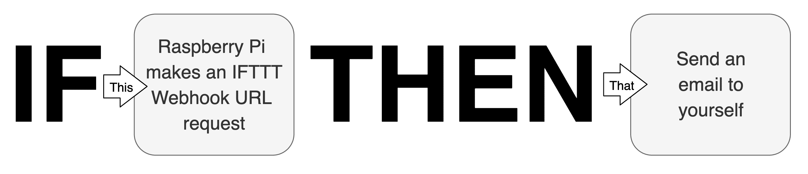

图 13.1 - Raspberry Pi 在 IFTTT Applet 工作流程中承担*This*角色

我们即将介绍的 Python 示例将监视当前温度（*This*），并在特定温度时请求特殊的 IFTTT Webhook URL。此 URL 请求将触发我们的 Applet，然后发送电子邮件（*That*）。在构建我们的第一个 IFTTT Applet 时，我们将很快更详细地讨论 Webhooks。

首先，我们需要创建和测试我们的示例电路，接下来我们将这样做。

## 创建温度监测电路

在本示例中，我们将重用我们在第九章中创建的 DHT11/DHT22 温度电路，*测量温度、湿度和光照水平*。

我们需要做的是：

1.  构建*图 9.2*中所示的电路。

1.  将数据引脚连接到 GPIO 24（在第九章中，*测量温度、湿度和光照水平*，我们使用了 GPIO 21，但我们将在本章后面使用 GPIO 21 来控制 LED）。

一旦您建立了电路，我们就可以继续并构建我们的第一个 IFTTT Applet。

## 创建和配置 IFTTT Applet

要创建我们的 IFTTT Applet，我们需要遵循许多步骤。这些步骤中的许多步骤都很简单和通用，无论您创建的 Applet 类型如何。虽然我们将逐步介绍这些通用步骤，但我们不会详细介绍它们，因为我相信您完全能够理解在过程中发生了什么。相反，我们将专注于与集成我们的 Raspberry Pi 相关的 IFTTT 的独特步骤和部分。

请注意，[`ifttt.com/`](https://ifttt.com/)免费定价层限制了您可以同时拥有的 Applet 数量。在撰写本文时，最大值为三个活动 Applet。在本章和下一章中，我们将创建四个 Applet，因此您需要在进行下一章时至少将一个 Applet 存档到 IFTTT 上，以保持在 IFTTT 免费定价层上。

以下是我们需要遵循的步骤：

1.  登录或创建您的 IFTTT 帐户。如果您还没有 IFTTT 帐户，请访问[ifttt.com/join](https://ifttt.com/join)并按照屏幕上的说明操作。

我们在 IFTTT 网站[ifttt.com](https://ifttt.com)上执行这些步骤。IFTTT 手机和平板应用程序的操作流程将不同。

1.  登录到 IFTTT 后，点击您的个人资料头像图标（在下图中用方框标出）以显示菜单：


图 13.2 - 个人资料头像图标

1.  接下来，点击个人资料菜单中的创建选项，如下所示：

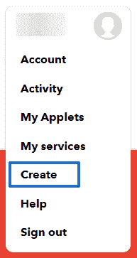

图 13.3 - 个人资料菜单

1.  接下来您将看到的页面是创建您自己的页面。在这里，点击*If*和*This*之间的+图标：

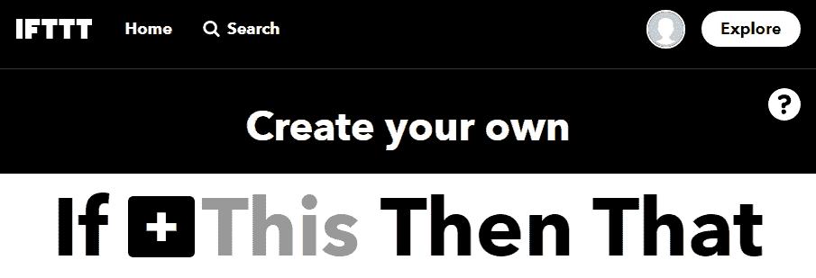

图 13.4 - 创建您自己的页面 - 第一部分

1.  现在，您将被要求选择一个服务。我们需要选择的服务与我们的 Raspberry Pi 集成的服务称为 WebHook 服务，如下所示：

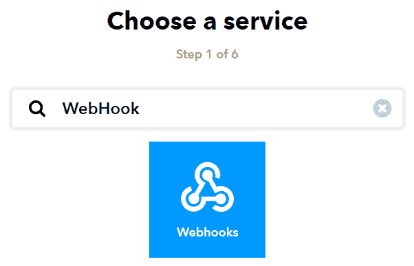

图 13.5 - 选择服务页面

1.  找到并识别 Webhook 服务后，点击 Webhooks 图标继续。

1.  接下来您将看到的页面是选择触发器页面，如下截图所示。在这里，点击接收 Web 请求选项：

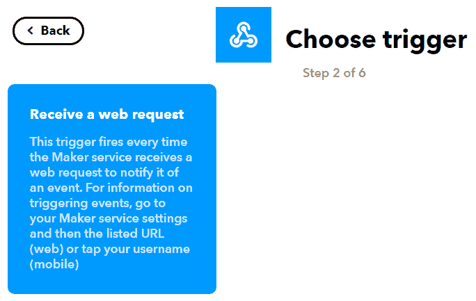

图 13.6 - 选择触发器页面

1.  接下来，您将看到完成触发字段页面，如下所示：

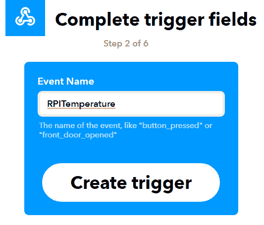

图 13.7 - 完成触发字段页面

事件名称对于我们的树莓派集成非常重要。在我们即将介绍的 Python 代码中，我们必须确保代码中使用的事件名称与我们在此页面中输入的名称匹配。在我们的示例中，我们将事件命名为 RPITemperature。

1.  在“事件名称”框中输入 RPITemperature，然后点击“创建触发器”按钮继续。

Webhook 的事件名称是其唯一标识符（用于您的 IFTTT 帐户）。如果您创建了许多 Webhooks，则需要使用不同的事件名称来区分它们。

1.  接下来，您将再次看到“创建您自己”的页面。这一次，您会发现*This*现在是 Webhook 图标：


图 13.8 - 创建您自己的页面 - 第二部分

我们现在已经完成了配置 IFTTT Applet 的一半。现在我们已经配置了 Webhook 触发器，我们需要配置我们的动作，即发送电子邮件。创建电子邮件动作后，我们将重新访问 Webhook 触发器，并发现用于触发此 Webhook 事件的 URL 和参数。

1.  接下来，在“然后”和“那个”之间点击“+”图标。您将看到选择动作服务页面。在此页面上，搜索电子邮件并点击电子邮件图标：

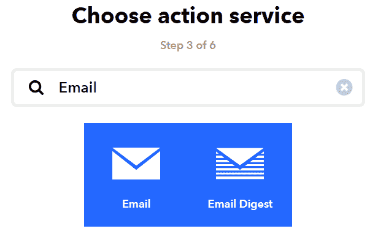

图 13.9 - 选择动作服务页面

1.  当您看到下图所示的选择动作页面时，请选择“发送电子邮件”选项：

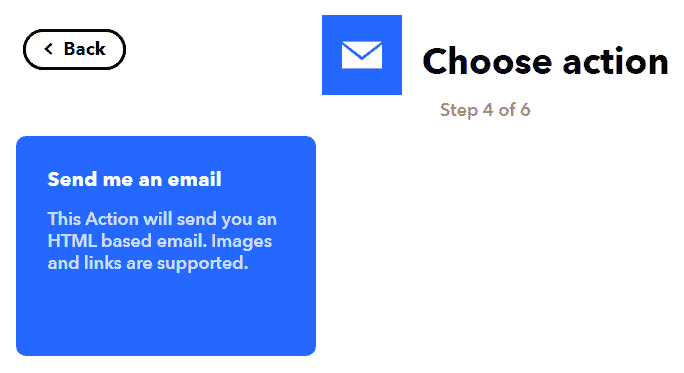

图 13.10 - 选择动作页面

1.  接下来，您将看到完成动作字段页面。请填写主题和正文文本字段，如下截图所示。您将在本章后面找到此动作生成的示例电子邮件：

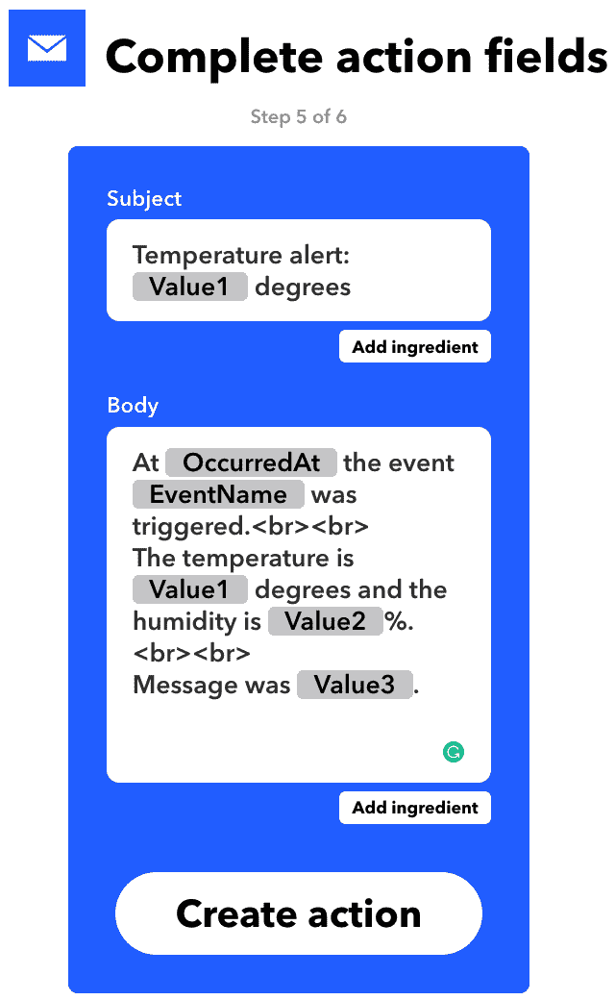

图 13.11 - 完成动作字段页面

在前面的屏幕截图中，您会注意到一些文本被灰色框包围；例如，“Value1”和“OccuredAt”。这些被称为*ingredients*，在触发 Applet 时会动态替换。正如我们很快将在代码中看到的那样，我们将用当前温度、湿度和消息分别替换 Value1、Value2 和 Value3。

1.  填写主题和正文文本字段后，点击“创建动作”按钮。

1.  最后，在审查和完成页面上点击“完成”按钮，如下所示：

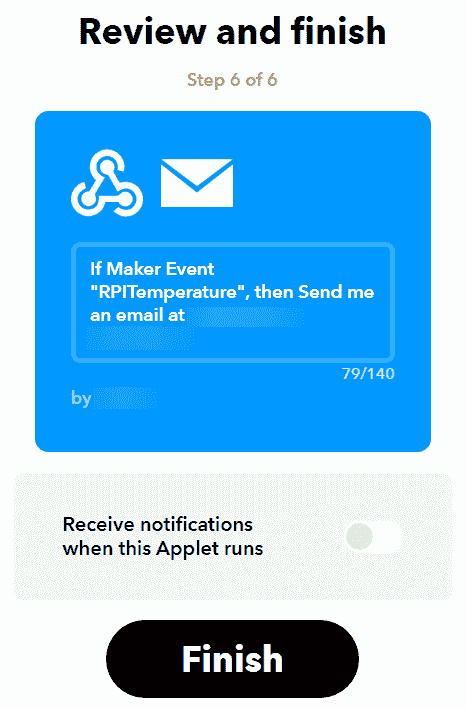

图 13.12 - 审查和完成页面

恭喜！您刚刚创建了一个 IFTTT Applet，当我们使用树莓派触发它时，它会发送一封电子邮件。但是我们如何做到的呢？这就是我们将在下一节中了解的内容。

## 触发 IFTTT Webhook

现在我们已经创建了我们的 IFTTT Applet，我们需要采取一些步骤来学习如何触发我们的 Webhook。这些步骤归结为知道在 IFTTT 中导航到哪里以发现您的唯一 Webhook URL。

以下是我们需要遵循的步骤：

1.  首先，我们需要导航到 Webhooks 页面。我们可以通过几种方式来做到这一点，我会让您自行决定采取哪种方式：

+   +   将您的网络浏览器导航到 Webhook 服务 URL；即[ifttt.com/maker_webhook](https://ifttt.com/maker_webhooks)。

+   或者，导航到此网页的步骤如下：

1.  点击个人资料头像图标（如*图 13.2*中所示）。

1.  在出现的菜单中，选择“My Services”项目（参见*图 13.3*）。

1.  在出现的页面上，找到并点击“Webhooks”项目。

无论您选择哪条路径，您将看到下图所示的页面：

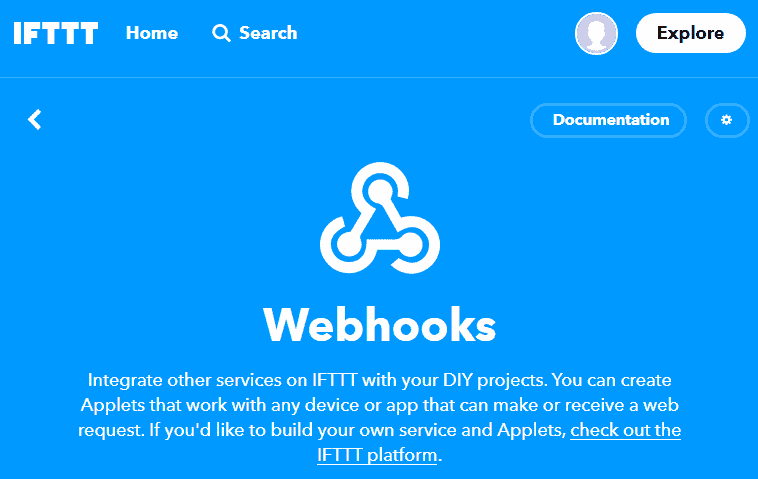

图 13.13 - Webhooks 页面

1.  单击页面右上角的 Documentation 按钮。您将看到这里显示的 Webhook 文档页面：

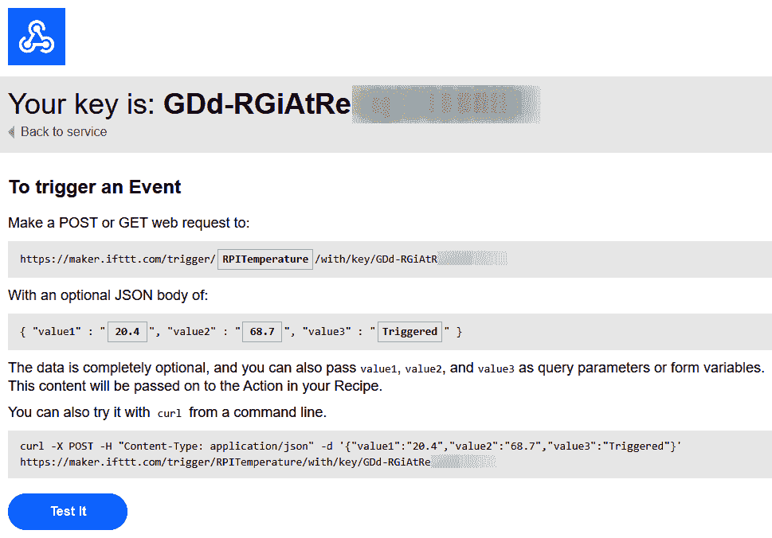

图 13.14 - Webhook 文档页面请注意，在前面的示例页面中，我已经填写了{Event}和 JSON Body 字段，以便在我们的讨论中引用它们。您的字段将最初为空。

这个页面包含了我们需要的关键信息，以便将这个 Webhook 触发与我们的 Raspberry Pi 集成。这个页面的关键部分如下：

+   **您的密钥**：这是您的帐户的 Webhook API 密钥，并且是您独特的 Webhook URL 的一部分。

+   **GET 或 POST 请求 URL**：您独特的 Webhook URL。您的 API 密钥和事件名称的独特组合是将 URL 与可触发的 IFTTT 事件关联起来的。要与我们的 Raspberry Pi 集成，这是我们需要构建和请求的 URL。我们将很快在代码中介绍这一点。

+   **事件名称**：您想触发的事件的名称。

+   **JSON 主体**：每个可触发的 Webhook 可以包含最多三个以 JSON 格式呈现的数据参数，它们必须命名为 value1、value2 和 value3。

+   **cURL 命令行示例**：在终端中运行此示例以触发 RPITemperature 事件（您将收到一封电子邮件）。

+   **测试按钮**：单击此按钮将触发 RPITemperature 事件（您将收到一封电子邮件）。

现在我们已经创建了 IFTTT Applet，并发现了在哪里找到 Webhook URL 以及它是如何构建的，我们现在可以深入研究将触发我们的 IFTTT Applet 的 Python 代码。

## 在 Python 中触发 IFTTT Applet

我们将要探索一个简单的应用程序，基于我们在第九章中首次看到的 DHT 11/DHT 22 电路和代码，*测量温度、湿度和光照水平*。您可以在`chapter13/ifttt_dht_trigger_email.py`文件中找到这段代码。

这段代码将使用 DHT 11 或 DHT 22 传感器监视温度，如果违反了预先配置的高温或低温阈值，代码将调用您的 IFTTT Webhook URL，然后会像下面的截图中显示的那样给您发送一封电子邮件。这对应于您在*步骤 13*中配置的电子邮件主题和正文文本：

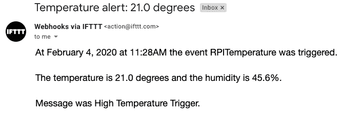

图 13.15 - 示例 IFTTT 电子邮件

在我们运行示例应用程序代码之前，我们需要执行一些配置步骤。让我们来看一下：

1.  打开`chapter13/ifttt_dht_trigger_email.py`文件进行编辑。

1.  找到由第（1）和（2）行表示的以下代码段。确认您的 DHT 传感器连接到适当的 GPIO 引脚，并且根据您拥有的传感器使用正确的 DHT11 或 DHT22 实例：

```py
# DHT Temperature/Humidity Sensor GPIO. GPIO = 24                                                     # (1)   # Configure DHT sensor - Uncomment appropriate line 
# based on the sensor you have. dht = DHT11(GPIO, use_internal_pullup=True, timeout_secs=0.5) # (2) 
#dht = DHT22(GPIO, use_internal_pullup=True, timeout_secs=0.5)
```

1.  现在，找到以下代码段，由行（3）、（4）和（5）表示，并将`USE_DEGREES_CELSIUS`，`HIGH_TEMP_TRIGGER`和`LOW_TEMP_TRIGGER`变量更新为在您的位置有意义的值：

```py
USE_DEGREES_CELSIUS = True # False to use Fahrenheit   # (3)
HIGH_TEMP_TRIGGER   = 20 # Degrees                     # (4)
LOW_TEMP_TRIGGER    = 19 # Degrees                     # (5)
```

当温度达到`HIGH_TEMP_TRIGGER`度或降至`LOW_TEMP_TRIGGER`度时，您的 IFTTT Applet 将被触发并发送电子邮件。设置高温和低温触发的原因是为了创建一个小的温度缓冲区，以防止代码在温度在单个值以上下波动时触发多封电子邮件。

1.  接下来，找到从第 6 行开始的以下代码部分，并更新显示的详细信息 - 特别是您在上一节中识别的 IFTTT API 密钥，在*步骤 2*中：

```py
EVENT = "RPITemperature"                    # (6)
API_KEY = "<ADD YOUR IFTTT API KEY HERE>"
```

这就是我们所有的配置。您会注意到第 7 行，这是我们使用我们的 API 密钥和事件名称构建 IFTTT Webhook URL 的地方：

```py
URL = "https://maker.ifttt.com/trigger/{}/with/key/{}".format(EVENT, API_KEY) # (7)
```

文件中的其余代码轮询 DHT11 或 DHT22 传感器，将读数与`HIGH_TEMP_TRIGGER`和`HIGH_TEMP_TRIGGER`值进行比较，如果温度已超过，构造一个`requests`对象并调用 IFTTT Webhook URL 来触发您的 Applet。我们不会在这里涵盖该代码，因为根据您之前使用 DHT11/DHT22 传感器和 Python `requests`库的经验，这应该是不言自明的。

配置好我们的代码后，是时候在终端中运行程序了。您将收到类似以下的输出：

```py
(venv) $ python ifttt_dht_trigger_email.py
INFO:root:Press Control + C To Exit.
INFO:root:Sensor result {'temp_c': 19.6, 'temp_f': 67.3, 'humidity': 43.7, 'valid': True}
INFO:root:Sensor result {'temp_c': 20.7, 'temp_f': 69.3, 'humidity': 42.9, 'valid': True}
INFO:root:Temperature 20.7 is >= 20, triggering event RPITemperature
INFO:root:Response Congratulations! You've fired the RPITemperature event
INFO:root:Successful Request.
```

我们的示例还显示了当温度超过 20 度时触发 IFTTT Applet。

现在，我们使用我们的树莓派在*This*角色中触发 IFTTT Applet 完成了我们的 IFTTT 示例。我们所涵盖的基本流程说明了实现这一点有多容易！我们发送了一封电子邮件，但您可以按照相同的整体流程创建其他触发其他操作的 IFTTT 配方，例如打开智能灯和电器，向 Google 电子表格添加行，以及创建 Facebook 帖子。您可能想要查看[`ifttt.com/discover`](https://ifttt.com/discover)以获取各种想法和可能性。请记住，从我们的角度和我们的学习来看，这是一个*Webhook*触发器，我们可以从我们的树莓派中使用它来实现这些想法。玩得开心！

接下来，我们将看看相反的情况，看看我们如何操作我们的树莓派。

# 从 IFTTT Applet 中操作您的树莓派

上一节教会了我们如何从我们的树莓派触发 IFTTT Applet。在本节中，我们将学习如何从 IFTTT Applet 中操作我们的树莓派。

对于我们的示例，我们将创建一个 IFTTT Applet，当收到电子邮件时将触发该 Applet。我们将使用此电子邮件的主题来控制连接到 GPIO 引脚的 LED。

我们将使用 IFTTT Webhook 服务，就像以前一样，只是这次 Webhook 服务将安装在我们 Applet 的*That*一侧，并且将请求我们指定的 URL。这个基本想法在下图中有所说明：

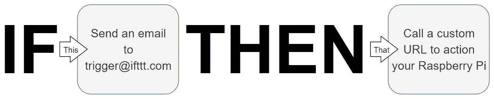

图 13.16 - 树莓派在 IFTTT Applet 中扮演*That*角色

让我们看看我们可以使用的两种可能的方法，通过 IFTTT Webhook 服务请求一个 URL，然后可以被我们的树莓派的 Python 代码看到。

## **方法 1 - 使用 dweet.io 服务作为中介**

将 IFTTT 与我们的树莓派集成的一种方法是使用 dweet.io 服务。我们在第二章中介绍了 dweet.io 以及 Python 示例，*使用 Python 和物联网入门*。

简而言之，我们将如何在 IFTTT Webhook 中使用 dweet.io 以及我们的 Python 代码：

1.  在我们的 IFTTT Webhook 中，我们将使用 dweet.io URL 发布一个 dweet（包含打开、关闭或使 LED 闪烁的指令）。

1.  我们的树莓派将运行 Python 代码来检索 IFTTT Webhook 发布的 dweet。

1.  然后，我们的代码将根据 dweet 中指定的命令控制 LED。

这是我们示例中将要使用的方法。这种方法的优势在于我们无需担心在路由器上配置防火墙和端口转发规则。此外，这意味着我们可以在工作环境等环境中运行示例，而在这些环境中，路由器配置可能不切实际甚至不可能。

我们将在`chapter13/dweet_led.py`文件中使用此基于 dweet.io 的集成的代码，该文件是第二章中`chapter02/dweet_led.py`文件的精确副本，*使用 Python 和物联网入门*。

## **方法 2 - 创建 Flask-RESTful 服务**

要使用这种方法，我们需要创建一个类似于我们在第三章中所做的 RESTful 服务，*使用 Flask 进行 RESTful API 和 Web 套接字服务*（`chapter02/flask_api_server.py`中的代码，它改变 LED 的亮度（而不是设置为开/关/闪烁），将是一个很好的起点）。

我们还需要将我们的树莓派暴露到公共互联网，这将需要我们在本地防火墙或路由器中打开一个端口并创建一个端口转发规则。然后，连同我们的公共 IP（或域名），我们可以构建一个 URL，并直接将其与 IFTTT Webhook 服务一起使用。

对于原型设计和创建演示，一个简单的替代方法是使用本地隧道（[localtunnel.github.io/www](https://localtunnel.github.io/www/)）或 ngrok（[ngrok.com](https://ngrok.com/)）这样的服务，而不是打开防火墙和创建端口转发规则，这些服务可以帮助您将设备暴露到互联网上。

由于这种方法需要您进行配置和设置，这超出了我们作为本章的一部分可以实际完成的范围，因此我们将坚持使用前一节中显示的 dweet.io 方法。

接下来，我们将创建一个电路，我们可以在第二个 IFTTT Applet 中使用，我们将很快构建它。

## 创建 LED 电路

我们即将介绍的示例将需要一个 LED，以及连接到 GPIO 引脚（对于我们的示例是 GPIO 21）的一系列电阻。我相信，考虑到我们在本书中已经多次构建了 LED 电路，你可以毫无问题地自己完成这个连接！（如果你需要提醒，请参见第二章中的*图 2.7*，*使用 Python 和物联网入门*）

保留您为我们第一个 IFTTT Applet 示例创建的 DHT 11/DHT 22 电路，因为我们将在本章后面再次重用此电路。

当您的电路准备好后，我们将继续并运行我们的示例程序。

## 运行 IFTTT 和 LED Python 程序

在本节中，我们将运行我们的程序，并获取用于 dweet.io 服务的唯一物名称和 URL。

以下是要遵循的步骤：

1.  在终端中运行`chapter13/dweet_led.py`文件中的代码。您将收到类似以下内容的输出（您的*物名称*和因此您的 URL 将不同）：

```py
(venv) $ python dweet_led.py
INFO:main:Created new thing name 749b5e60
LED Control URLs - Try them in your web browser:
  On : https://dweet.io/dweet/for/749b5e60?state=on
  Off : https://dweet.io/dweet/for/749b5e60?state=off
  Blink : https://dweet.io/dweet/for/749b5e60?state=blink
```

正如我们之前提到的，`chapter13/dweet_led.py`是我们在第二章中讨论的相同程序的精确副本，*使用 Python 和物联网入门*。如果您需要更多关于这个程序如何工作的上下文，请重新阅读那一章和其中包含的代码讨论。

1.  保持终端打开并运行程序，因为我们将需要在下一节中复制其中一个 URL。我们还需要运行程序来测试我们即将进行的集成。

接下来，我们将创建另一个 IFTTT Applet，通过 dweet.io 与该程序集成。

## 创建 IFTTT Applet

我们即将创建另一个 IFTTT Applet。整个过程与我们之前创建的 Applet 非常相似，只是我们的树莓派（通过 Webhook 集成）将位于 Applet 的*That*端，如*图 13.16*所示。

以下是我们需要遵循的步骤来创建我们的下一个 Applet。由于它们与我们之前创建的 IFTTT Applet 过程非常相似，这次我省略了许多常见的屏幕截图：

1.  登录到 IFTTT 后，点击个人资料头像图标，然后从下拉菜单中选择创建。

1.  在 If + This Then Than 页面上，点击+图标。

1.  在“选择服务”页面上，搜索并选择“电子邮件”服务。

1.  在选择触发器页面上，选择发送带标签的 IFTTT 电子邮件（确保选项中包含这个词*tagged)。

1.  在下一页中，输入 LED 作为标签输入，然后点击创建触发器按钮：

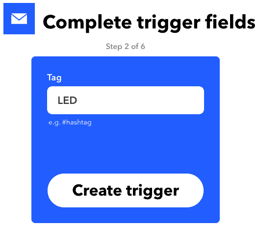

图 13.17 - 完成触发字段页面

1.  在 If <email icon> This Then + Than 页面上，点击+图标。

1.  在选择操作服务页面上，搜索并选择 Webhooks 服务。

1.  接下来，在选择操作页面上，选择进行网络请求。

1.  接下来你会遇到的页面叫做“完成操作字段”。这是我们将使用上一节中程序打印到终端的 dweet URL 的地方：

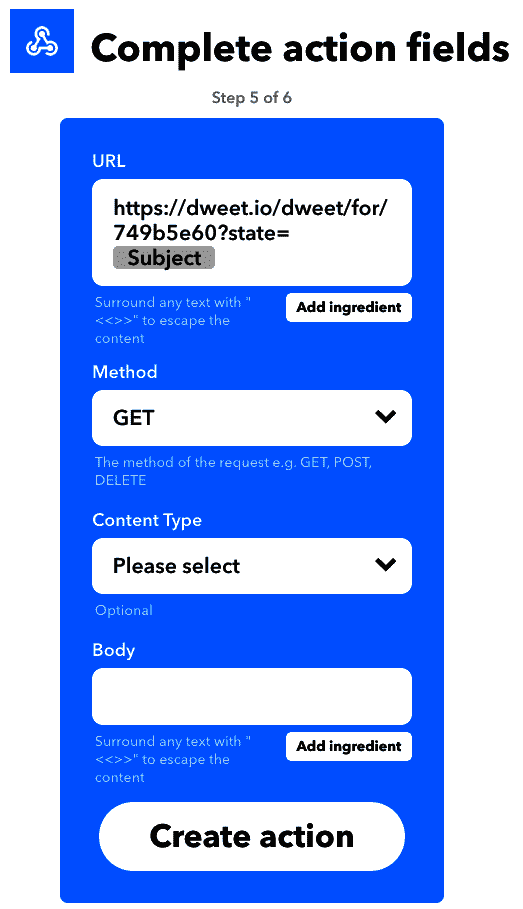

图 13.18 - 完成操作字段页面

以下是您需要遵循的子步骤，以完成此页面上的字段：

1.  1.  从终端复制 On URL（例如，`https://dweet.io/dweet/for/749b5e60?state=on` - 注意您的*thing name*将不同）。

1.  将此 URL 粘贴到 IFTTT URL 字段中。

1.  在 URL 字段中，删除单词 on（所以 URL 现在是 https://dweet.io/dweet/for/749b5e60?state=）。

1.  点击添加成分按钮（在 URL 字段下），选择主题（使 URL 现在为 https://dweet.io/dweet/for/749b5e60?state={{Subject}}）。

1.  其他字段可以保留为默认值。

1.  点击创建操作按钮：

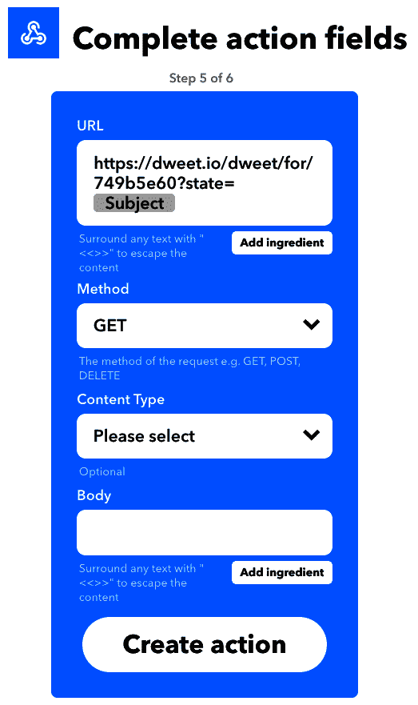

图 13.19 - 完成操作字段页面

1.  最后，在“审查和完成”页面上，点击“完成”按钮。

干得好！我们现在创建了第二个 Applet。接下来，我们将使用这个 Applet 通过发送电子邮件来控制我们的 LED，指示 LED 打开、关闭或闪烁。

## 从电子邮件控制 LED

现在我们已经创建了一个 Applet 来通过电子邮件控制 LED，是时候测试集成了。

以下是创建电子邮件的步骤：

1.  确保`chapter13/dweet_led.py`文件中的程序仍在终端中运行。

1.  打开您喜欢的电子邮件程序并创建新邮件。

1.  使用`trigger@applet.ifttt.com`作为电子邮件的收件人地址。

当向 IFTTT 发送触发电子邮件时，它必须来自您在 IFTTT 中使用的相同电子邮件地址（您可以访问[`ifttt.com/settings`](https://ifttt.com/settings)来检查您的电子邮件地址）。

1.  作为主题，使用以下内容之一来控制 LED：

+   `#LED On`

+   `#LED Off`

+   `#LED Blink`

IFTTT 会去掉#LED 标签，因此我们的`dweet_led.py`程序只会收到打开、关闭或闪烁的文本。在我们的 Python 代码中，前导空格被去掉。

以下截图显示了一个使 LED 闪烁的示例电子邮件：

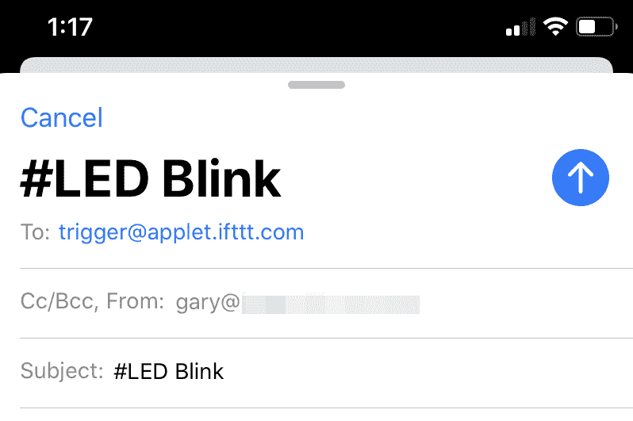

13.20 - 触发电子邮件示例

1.  发送电子邮件。

1.  等一会儿，LED 将改变状态。

现在我们已经学会了如何通过电子邮件使用 IFTTT 来控制我们的 LED，让我们快速介绍一些故障排除技巧。

## IFTTT 故障排除

如果您的 IFTTT Applets 似乎没有触发和执行操作，这里有一些故障排除途径供您探索和尝试：

+   在`dweet_led.py`中，尝试以下操作：

+   打开调试日志记录；例如，`logger.setLevel(logging.DEBUG)`。

+   更改源文件末尾附近的 dweet 检索方法。如果您正在使用`stream_dweets_forever()`，请尝试改用`poll_dweets_forever()`，因为它对瞬时连接问题更具弹性。

+   在 IFTTT 网站上，您可以通过以下方式检查任何 Applet 的活动日志：

1.  导航到个人资料菜单下的我的服务选项

1.  选择一个服务（例如，Webhooks）

1.  选择要检查的 Applet

1.  点击设置按钮

1.  点击查看活动按钮和/或尝试立即检查按钮

+   您还可以查看以下 IFTTT 资源：

+   *常见错误和故障排除提示*，请访问[`help.ifttt.com/hc/en-us/articles/115010194547-Common-errors-and-troubleshooting-tips`](https://help.ifttt.com/hc/en-us/articles/115010194547-Common-errors-and-troubleshooting-tips)

+   *故障排除 Applets & Services*，请访问[`help.ifttt.com/hc/en-us/categories/115001569887-Troubleshooting-Applets-Services`](https://help.ifttt.com/hc/en-us/categories/115001569887-Troubleshooting-Applets-Services)。

IFTTT 还有一个*最佳实践*页面，您可以在[`help.ifttt.com/hc/en-us/categories/115001569787-Best-Practices`](https://help.ifttt.com/hc/en-us/categories/115001569787-Best-Practices)上了解更多关于该平台的信息。

在我们讨论了*从树莓派触发 IFTTT Applet*部分之后，对于 IFTTT *触发器*，您可以采用我们刚刚介绍的相同的整体流程来执行您的树莓派，以便从任何 IFTTT 配方中采取行动。再次查看[`ifttt.com/discover`](https://ifttt.com/discover)以获取一些想法，这一次，请记住，从我们的角度来看，我们在 IFTTT 配方中使用*Webhook*操作来控制我们的树莓派。这里有一个例子-使用 Google 助手语音控制您的树莓派！哦，等一下-我们将在下一章第十四章中做到这一点-将所有内容联系在一起-物联网圣诞树！

我们已经探讨了如何以两种方式将我们的树莓派与 IFTTT 集成-作为*This*角色来触发 Applet，以及在*That*角色中，我们可以从触发的 Applet 中执行我们的树莓派。接下来，我们将看一种方法来创建一个物联网仪表板，我们可以用来可视化数据。

# 使用 ThingSpeak 平台可视化数据

我们刚刚学习了如何使用 IFTTT 平台创建简单的自动化。在本节中，我们将与 ThingSpeak 平台集成，以可视化显示我们将使用 DHT 11 或 DHT 22 传感器收集的温度和湿度数据。我们将使用我们在本章前面创建的 DHT 11/DHT 22 电路。

ThingSpeak([thingspeak.com](https://thingspeak.com))是一个数据可视化、聚合和分析平台。我们将专注于数据可视化方面，特别是如何将我们的树莓派集成到该平台中。

我选择在本节中以 ThingSpeak 为例的原因有几个-它简单易用，并且对于我们将要做的简单数据可视化来说，它是免费的。还有许多其他可用的可视化平台，它们都有自己独特的功能、定价结构和复杂性。我在*其他物联网和自动化平台供进一步探索*部分中包含了一些建议供您探索。

如果您希望更深入地探索聚合和分析功能，您可以通过搜索 ThingSpeak 找到许多优质的示例、教程和文档。作为建议，从[`au.mathworks.com/help/thingspeak`](https://au.mathworks.com/help/thingspeak)开始您的调查。

我们将在下面的屏幕截图中看到我们将要创建的仪表板的一个示例。请注意标签栏中显示的通道设置和 API 密钥项目-我们将很快提到这些标签：

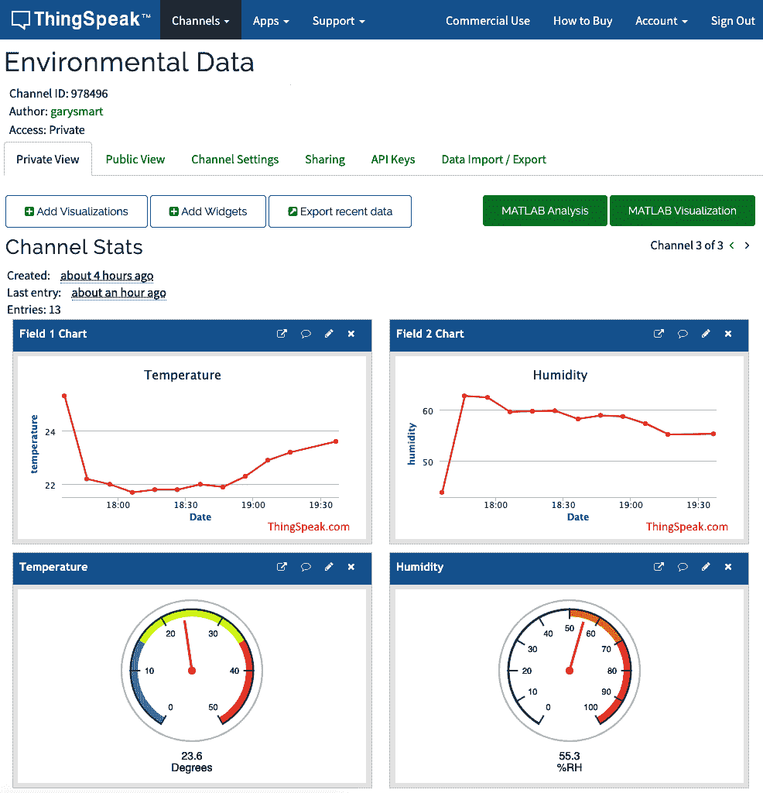

图 13.21-ThingSpeak 通道仪表板

在我们可以集成我们的树莓派并将数据发送到 ThingSpeak 之前，我们的第一站是为我们的集成配置平台。

## 配置 ThinkSpeak 平台

配置 ThinkSpeak 相对简单-事实上，这是我遇到的同类平台中最简单的之一。以下是我们需要遵循的步骤：

1.  首先，您需要为自己创建一个 ThingSpeak 账户。访问他们的网站[thingspeak.com](https://thingspeak.com)，然后点击“注册”按钮。

1.  一旦您创建了 ThinkSpeak 账户并登录到平台，您应该会登陆到“我的通道”页面；也就是[`thingspeak.com/channels`](https://thingspeak.com/channels)。

在 ThingSpeak 生态系统中，*通道*是我们存储数据、仪表板和可视化的虚拟位置。这类似于一个工作区。

1.  接下来，我们需要点击“新通道”按钮创建一个新通道：

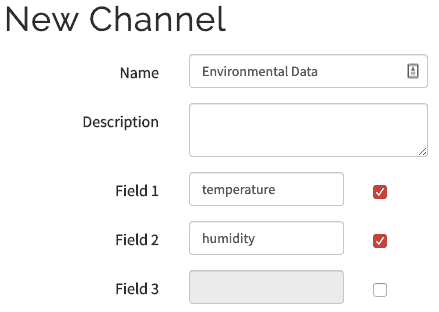

图 13.22-ThingSpeak 通道配置

在新通道页面上，输入以下详细信息：

+   +   名称：`环境数据`（或您选择的任何名称）

+   字段 1：`温度`

+   字段 2：`湿度`

您可以将所有其他字段保留为默认值。

如果以后需要查看或更改通道设置，可以在通道设置选项卡中找到，如*图 13.19.*中所示。

1.  填写完字段后，滚动到页面底部，然后单击“保存通道”按钮。您将看到一个类似于*图 13.19*的页面，只是没有数据，是空白的。

要在*图 13.19*中看到的两个表中添加两个表，请执行以下操作：

1.  1.  按“添加小部件”按钮。

1.  选择“仪表”图标，然后按“下一步”。

1.  在“配置小部件参数”对话框中，输入仪表的名称（例如`温度`），并选择适当的字段编号（温度为 Field1，湿度为 Field2）。

1.  您可以根据需要调整和实验其他参数，以设置仪表的最大/最小范围、颜色和其他显示属性。

1.  为第二个表重复该过程。

如果仪表（或图表）显示“字段值不可用”，不要担心。这是正确的，因为我们还没有向 ThingSpeak 发送任何温度或湿度数据。

1.  现在，是时候获取 API 密钥和通道 ID 了，我们需要这些信息来配置即将到来的 Python 代码。点击 API 密钥选项卡：

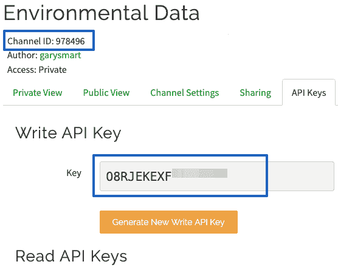

图 13.21 - API 密钥选项卡

这是我们的 Python 程序需要收集的信息：

+   +   写 API 密钥（因为我们将向平台*写入*数据）

+   通道 ID（这在所有 ThinkSpeak 页面上都有，靠近顶部）

现在我们已经创建并配置了一个简单的 ThinkSpeak 通道，并收集了我们的 API 密钥和通道 ID，我们可以继续进行 Python 代码。

## 配置和运行 ThinkSpeak Python 程序

我们提供了两个样本程序，可以与 ThinkSpeak 集成。它们如下：

+   `chapter13/thingspeak_dht_mqtt.py`：一个使用 MQTT 将数据发送到 ThinkSpeak 通道的示例。

+   `chapter13/thingspeak_dht_http.py`：一个使用 Python 请求库进行 RESTful API 调用，将数据发送到 ThinkSpeak 通道的示例。

这两个程序的核心概念在早期章节中已经讨论过。供您参考，它们如下：

+   **MQTT**：我们在第四章中讨论了 Paho-MQTT 库，*使用 MQTT、Python 和 Mosquitto MQTT 代理进行网络通信*。本章的一个关键区别是，我们使用 Paho-MQTT *简化客户端包装器*来发布 MQTT 消息，而不是完整的生命周期示例。

+   我们在第二章中介绍了 RESTful API 和请求库，*Python 和物联网入门*。

+   有关 DHT 11/DHT 22 温湿度传感器的代码在第九章中已经涵盖了，*测量温度、湿度和光照水平*。

让我们配置这些程序，运行它们，并在 ThingSpeak 中看到数据。我们将演示`chapter13/thingspeak_dht_mqtt.py`中提供的示例代码；但是，对于`chapter13/thingspeak_dht_http.py`，整个过程都是相同的：

1.  打开`chapter13/thingspeak_dht_mqtt.py`文件进行编辑。

1.  在文件顶部附近，找到以下代码，从第（1）行开始，并确认您的 DHT 传感器连接到正确的 GPIO 引脚，并且正确的传感器实例在代码中启用：

```py
# DHT Temperature/Humidity Sensor
GPIO = 24                                                   # (1)
#dht = DHT11(GPIO, use_internal_pullup=True, timeout_secs=0.5)
dht = DHT22(GPIO, use_internal_pullup=True, timeout_secs=0.5)
```

1.  接下来，找到以下代码段，从第（2）行开始，并使用您的 ThingSpeak 写 API 密钥、通道 ID 和时区进行更新。请注意，`CHANNEL_ID`仅在 MQTT 集成中使用（因此它不会出现在`thingspeak_dht_http.py`文件中）：

```py
# ThingSpeak Configuration
WRITE_API_KEY = "" # <<<< ADD YOUR WRITE API KEY HERE   # (2)
CHANNEL_ID = ""    # <<<< ADD YOUR CHANNEL ID HERE

# See for values https://au.mathworks.com/help/thingspeak/time-zones-reference.html
TIME_ZONE = "Australia/Melbourne"
```

1.  保存文件并运行程序。您应该会收到类似以下内容的输出：

```py
(venv) $ python thing_speak_dht_mqtt.py
INFO:root:Collecting Data and Sending to ThingSpeak every 600 seconds. Press Control + C to Exit
INFO:root:Sensor result {'temp_c': 25.3, 'temp_f': 77.5, 'humidity': 43.9, 'valid': True}
INFO:root:Published to mqtt.thingspeak.com
```

1.  几秒钟后，您应该会在 ThingSpeak 仪表板上看到您的数据出现！

恭喜！通过这样，你已经创建了一个 ThingSpeak 仪表板来可视化树莓派收集的数据。对于许多监控物联网项目来说，可视化数据是一个经常的需求，无论是简单的指示器显示，比如表盘，还是生成历史图表来可视化趋势。你如何处理数据的可视化完全取决于你的需求；然而，所有这些需求共同的一点是，有许多现成的服务，如 ThingSpeak，可以帮助你实现这一点，而不是自己定制编码仪表板和可视化应用。

现在，我将用一个简短的讨论来结束这一章，讨论一些其他流行的物联网平台，你可能会喜欢在未来的项目中探索和使用。

# 其他物联网和自动化平台供进一步探索

到目前为止，在本章中，我们已经看到了 IFTTT 和 ThingSpeak 的运作方式，以及如何将它们与我们的树莓派集成。我们看到了如何使用 IFTTT 创建简单的工作流程，以及如何使用 ThingSpeak 可视化数据——两个非常不同的想法，但它们都是物联网平台。

这两个平台都非常强大，并提供了广泛的功能和可能性，超出了我们在一个章节中所能涵盖的范围，所以我鼓励你查阅它们的文档和示例，以提升你的学习。

还有许多其他可用的物联网平台、应用程序和框架。本节将根据我的经验提供一个简短的策划清单。它们都与本书的 Python 和树莓派主题很好地契合。

## **Zapier**

我们已经看到了 IFTTT 的运作方式。在支持的服务方面，IFTTT 更加面向消费者，而且正如我们所见，我们受限于单个 *This* 触发器和单个 *That* 动作。

Zappier 在原则上与 IFTTT 非常相似，但更加注重商业，包括一系列服务和集成，这些在 IFTTT 中不可用（IFTTT 也有独特的服务和集成）。此外，Zapier 还能够触发事件和动作的更复杂工作流程。

你会发现重新实现本章中我们的两个 IFTTT 示例在 Zappier 中相对简单。

网站：[`zapier.com`](https://zapier.com)。

## **IFTTT 平台**

在本章中，我们使用 IFTTT 作为最终用户，并使用 Webhooks 进行集成。如果你是一家希望创建作为一流 IFTTT 服务公开的小工具的企业，那么你应该了解一下 IFTTT 平台。

网站：[`platform.ifttt.com`](https://platform.ifttt.com)。

## **ThingsBoard 物联网平台**

ThingsBoard 是一个开源的物联网平台，你可以在树莓派上下载和托管。从表面上看，它将允许你构建仪表板和数据可视化，就像我们在 ThingSpeak 中所做的那样。与 ThingSpeak 相比，你会发现 ThingsBoard 在创建你的第一个仪表板时有一个更陡的学习曲线；然而，你也会发现它提供了更广泛的小部件和自定义选项。此外，与只能消耗数据的 ThingSpeak 不同，ThingsBoard 允许你将控件嵌入到仪表板中，让你使用 MQTT 与你的树莓派进行交互。

根据经验，如果你想学习如何使用这个平台，那么你必须仔细阅读 ThingsBoard 的文档和教程（许多都是视频），因为在你第一次访问其用户界面时，不会立即明显你需要做什么。

以下是他们网站上的一些具体资源：

+   树莓派安装说明：[`thingsboard.io/docs/user-guide/install/rpi`](https://thingsboard.io/docs/user-guide/install/rpi)（不用担心它说的是树莓派 3；它在 4 上也能运行）

+   入门指南：[`thingsboard.io/docs/getting-started-guides/helloworld`](https://thingsboard.io/docs/getting-started-guides/helloworld)

在入门指南中没有 Python 特定的示例，但有 Mosquito MQTT 示例和 cURL 示例，演示了 RESTful API。建议使用本章中提供的两个 ThingSpeak 代码示例作为起点，并采用它们来使用 ThingBoard 特定的 MQTT 和/或 RESTful API。

网站：[`thingsboard.io`](https://thingsboard.io)。

## **Home Assistant**

Home Assistant 是一个纯 Python 家庭自动化套件。Home Assistant 可以与各种互联网设备连接，如灯、门、冰箱和咖啡机 - 仅举几例。

Home Assistant 在这里得到提及，不仅因为它是用 Python 构建的，而且因为它允许我们直接与主机树莓派的 GPIO 引脚集成，以及使用 PiGPIO 的远程 GPIO 功能与远程树莓派的 GPIO 引脚集成。此外，还有 MQTT 和 RESTful API 集成选项。

虽然在概念和最终用户操作上很简单，但是在配置 Home Assistant 时存在较高的学习曲线（需要相当多的实验），因为大多数集成是通过直接编辑**YAML Ain't Markup Language**（**YAML**）文件来完成的。

关于 GPIO 集成，我从他们的网站上选择了一些资源来帮助您入门。我建议先阅读术语表，因为这将帮助您更好地理解 Home Assistant 的术语，从而帮助您更好地理解文档的其他部分：

+   安装：Home Assistant 可以以多种方式安装。为了测试平台并构建 GPIO 集成，我建议选择“虚拟环境”选项，文档位于[`www.home-assistant.io/docs/installation/virtualenv`](https://www.home-assistant.io/docs/installation/virtualenv)。

+   术语表：[`www.home-assistant.io/docs/glossary`](https://www.home-assistant.io/docs/glossary)。

+   可用的树莓派集成：[`www.home-assistant.io/integrations/#search/Raspberry%20Pi`](https://www.home-assistant.io/integrations/#search/Raspberry%20Pi)。

网站：[`www.home-assistant.io`](https://www.home-assistant.io)。

## **亚马逊网络服务（AWS）**

另一个建议是亚马逊网络服务，具体来说是两项服务 - IoT Core 和 Elastic Beanstalk。这些选项将为您提供巨大的灵活性和几乎无穷无尽的选择，当涉及到创建物联网应用程序时。IoT Core 是亚马逊的物联网平台，您可以在其中创建仪表板、工作流和集成，而 Elastic Beanstalk 是他们的云平台，您可以在其中托管自己的程序 - 包括 Python - 在云中。

亚马逊网络服务是一个先进的开发平台，因此您需要投入几周的时间来学习它的工作原理，以及如何使用它构建和部署应用程序，但我可以向您保证，在这个过程中您会学到很多！此外，他们的文档和教程质量非常高。

亚马逊物联网核心：[`aws.amazon.com/iot-core`](https://aws.amazon.com/iot-core)。

亚马逊弹性 Beanstalk：[`aws.amazon.com/elasticbeanstalk`](https://aws.amazon.com/elasticbeanstalk)。

## **Microsoft Azure、IBM Watson 和 Google Cloud**

最后，我想提一下其他 IT 巨头，他们都提供自己的云和物联网平台。我之所以建议 AWS，纯粹是因为我对这个平台有更深入的经验。微软、IBM 和谷歌提供的比较平台也是高质量的，并且有着优秀的文档和教程支持，因此如果您个人偏好于这些提供商中的一个，您仍然是安全的。

# 摘要

在本章中，我们探讨并学习了如何将我们的 Raspberry Pi 与 IFTTT 和 ThinkSpeak IoT 平台一起使用。我们创建了两个 IFTTT 示例，其中我们的 Raspberry Pi 在 IFTTT Applet 中执行了*This*角色，以启动 IFTTT 工作流程。我们还看到了如何将我们的 Raspberry Pi 用作*That*角色，以便它可以被 IFTTT Applet 执行。接下来，我们介绍了如何与 ThinkSpeak IoT 平台集成，以可视化由我们的 Raspberry Pi 收集的温度和湿度数据的示例。最后，我们讨论了您可能希望调查和实验的其他 IoT 平台选项。

在本章中，我们确实只涵盖了可视化和自动化平台可能性的基础知识。我鼓励你寻找更多的 IFTTT 示例和你可以尝试的想法，并探索我们提到的其他平台。请记住，虽然每个平台都会有所不同并且有自己的集成考虑，但通常接受的实现集成的标准是 RESTful API 和 MQTT，这两者你现在都有经验了！

在下一章中，我们将涵盖一个全面的端到端示例，汇集了本书中涵盖的许多概念和示例。

# 问题

随着我们结束本章，这里有一些问题供你测试对本章材料的了解。你将在*附录*的*评估*部分找到答案：

1.  在我们的第一个 IFTTT Applet 中，我们监测温度时为什么使用了不同的高温和低温值来触发我们的 Applet 并发送电子邮件？

1.  使用像 dweet.io 这样的中介服务与我们的 IFTTT Webhook 服务有什么优势？

1.  IFTTT 和 Zapier 之间的一些核心区别是什么？

1.  你能从 ThingSpeak 仪表板控制你的 Raspberry Pi 吗？

1.  关于数据，当 IFTTT Webhook 服务用作动作（即 applet 的*That*一侧）时有什么限制？

1.  你想要原型化基于 Raspberry Pi 的 GPIO 引脚状态来开关柜台智能灯泡。你可以使用哪些平台？
