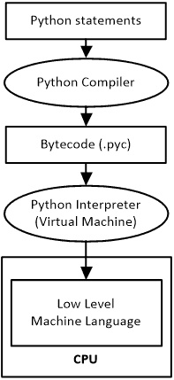
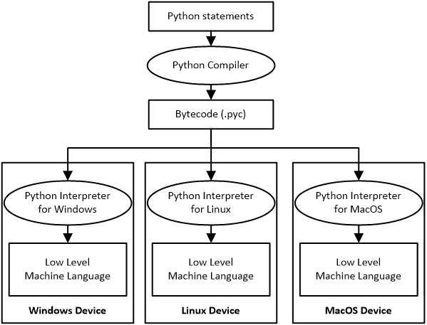

## 第二章

Python 和集成开发环境

### 2.1 什么是 Python？

Python 是一种广泛使用的通用、高级计算机编程语言，允许程序员创建应用程序、网页以及许多其他类型的软件。

尽管官方网站称 Python 是一种编程语言，但 Python 通常被称为脚本语言。当然，事实真相介于两者之间。Python 可以用作脚本语言，也可以用作编程语言！

### 2.2 脚本和程序之间的区别是什么？

从技术角度讲，脚本被解释执行，而程序被编译执行，但这并不是它们的主要区别。它们之间还有一个更重要的大区别！

使用 JavaScript 或 VBA（应用程序可视化基本）等脚本语言编写的脚本的主要目的是控制另一个应用程序。因此，可以说在某些方面 JavaScript 控制着网络浏览器，而 VBA 控制着 Microsoft^® Office 应用程序，如 MS Word 或 MS Excel。

另一方面，用 Python、C++ 或 Java（仅举几个例子）等编程语言编写的程序独立于任何其他应用程序执行。程序可以在用户希望时独立执行，无需托管应用程序。

Microsoft Office 的宏是用 VBA 编写的脚本。它们的目的在于自动化 Microsoft Office 中的某些功能。

很多人认为 JavaScript 是 Java 的简化版本，但实际上名字的相似性只是巧合。

脚本不能独立执行。它需要托管应用程序才能执行。

### 2.3 为什么你应该学习 Python

Python 是一种所谓的“高级”计算机语言。Python 的编码风格非常易于理解。它是一种灵活且功能强大的语言，非常适合开发中等规模的应用程序或动态网页。它是教授编程的完美语言，尤其是在入门级别，并且在科学和数值计算中得到广泛应用。

Python 的一个能力是能够与计算机的文件系统交互。Python 可以创建文件、写入文件或从文件中读取内容。它还可以创建目录、复制文件、删除文件、重命名文件，甚至更改文件属性。Python 几乎可以执行与文件系统相关的任何任务，使其甚至适用于系统管理任务。例如，你可以编写一个 Python 程序来备份你的文件，或者一个通过重新格式化内容来处理文本文件的程序。

此外，Python 可以执行系统命令或您系统上安装的任何其他程序。因此，用 C、C++、Java 或任何其他计算机语言编写的和编译的程序都可以从 Python 中执行，并且 Python 可以利用它们的输出。这使得您可以在不花费时间重写旧程序的情况下，为您的 Python 程序添加功能。

已经用 Python 编写了数百万——可能甚至数十亿——行代码，您代码重用的可能性巨大！这就是为什么许多人更喜欢使用 Python 而不是其他任何编程语言的原因。这也是您实际上应该学习 Python 的一个非常好的理由！

### 2.4 Python 的工作原理

计算机不理解自然语言，如英语或希腊语，因此您需要一种计算机语言，如 Python，才能与它们通信。Python 是一种非常强大的高级计算机语言。Python 解释器（或者实际上是一个编译器和解释器的组合）将 Python 语言转换为计算机实际上能理解的语言，这被称为“机器语言”。

在过去，计算机语言要么使用解释器，要么使用编译器。然而，如今，包括 Python 在内的许多计算机语言都同时使用编译器和解释器。Python 编译器将 Python 语句翻译成字节码语句，并将它们保存到 .pyc 文件中。稍后，当用户想要执行该文件时，解释器（通常称为 Python 虚拟机或 Python VM）将字节码转换为低级机器语言代码，以便在硬件上直接执行。

Python 字节码是由 Python 虚拟机执行的一种机器语言。

一些语言使用两个编译器而不是编译器和解释器。例如，在 C# 中，第一个编译器将 C# 语句翻译成一种称为公共中间语言（CIL）的中间语言。CIL 代码存储在磁盘上的一个可执行文件中，通常具有 .exe 扩展名。稍后，当用户想要执行该文件时，.NET 框架执行即时（JIT）编译，将 CIL 代码转换为低级机器语言代码，以便在硬件上直接执行。

在图 2–1 中，您可以看到用 Python 编写的语句是如何编译成字节码的，以及字节码是如何通过解释来执行的。

图 2–1 使用 Python 虚拟机执行 Python 语句

现在有一些合理的问题：为什么会有这么多麻烦？为什么 Python 和其他语言（如 C#）需要翻译两次？为什么 Python 语句不能直接翻译成低级机器语言代码？答案在于 Python 被设计成一种平台无关的编程语言。这意味着程序只需编写一次，但可以在任何设备上执行，无论其操作系统或架构如何，只要安装了适当的 Python 版本。在过去，程序必须为每个计算机平台重新编译，甚至重写。Python 最大的优点之一就是您只需编写和编译一次程序！在图 2-2 中，您可以看到 Python 编写的语句是如何编译成字节码的，以及字节码是如何在安装了适当 Python 版本的任何平台上执行的。

图 2–2 在不同平台上执行 Python 语句

效率是 Python 语句不直接翻译成低级机器语言代码的另一个原因，因为：

1)可以在中间代码（字节码）上执行小的优化。

2)如果存在与您调用的.py 文件同名的.pyc 文件，Python 将自动执行它。这意味着如果存在.pyc 文件且您没有对源代码进行任何更改，Python 可以通过不重新编译源代码来节省一些时间。

如今，很少有解释器真正逐行直接解释代码。现在几乎所有解释器都使用某种中间表示形式。

要编写和执行 Python 程序，您需要安装两个软件应用：一个 Python 解释器和集成开发环境（IDE）。IDE 是编写 Python 程序所必需的，而 Python 解释器则是执行程序所必需的。

### 2.5 集成开发环境

集成开发环境，或 IDE，是一种包含程序员编写和测试程序所需的所有基本工具的软件。IDE 通常包含源代码编辑器，并集成了编译器或解释器等工具，以及调试器。IDLE 和 Visual Studio Code 是允许程序员编写、执行和调试源代码的 IDE 示例。

“调试器”是一种帮助程序员找到和纠正许多错误的工具。

### 2.6 IDLE

IDLE 是一个集成开发环境（IDE），它提供了一个非常适合初学者的简单环境，尤其是在教育环境中。使用 IDLE，新手程序员可以轻松地编写和执行他们的 Python 程序。

在 Windows 中，IDLE 模块默认包含在 Python 安装程序中，并在你遵循下一章（第三章）中概述的步骤时安装。此外，在第九章（第九章）中，你将指导如何使用 IDLE 编写、执行和调试 Python 程序。你还将学习许多有用的技巧和窍门，这些技巧和窍门对于你作为初学者程序员的第一步将非常有价值！

Python 和 IDLE 在许多 Linux 发行版中默认包含，但并非所有发行版都包含。例如，在 Ubuntu Linux 中，Python 默认安装，但你可能需要单独安装 IDLE 模块。

### 2.7 Microsoft Visual Studio

Microsoft Visual Studio 是一个集成开发环境（IDE），它为许多编程语言提供了一套强大的工具（通过单独安装的扩展），并允许你轻松地为 Android、iOS、macOS、Windows 和云端创建应用程序，以及网站、Web 应用程序和 Web 服务。

Visual Studio 远不止是一个文本编辑器。它可以缩进行、匹配单词和括号，并突出显示编写错误的源代码。它还提供自动代码（IntelliSense^®），这意味着当你键入时，它会显示可能的完成列表。IDE 还提供提示，帮助你分析代码并找到任何潜在的问题。它甚至建议一些简单的解决方案来修复这些问题。你可以使用 Visual Studio 不仅来编写，还可以直接从 IDE 中执行你的程序。

Visual Studio 在全球拥有庞大的用户群，这也是为什么它有这么多不同版本的原因。具体来说，在 Microsoft 的下载页面上，你可以下载：

►在 Windows 上运行的 Visual Studio（社区版、专业版或企业版）

►在 macOS 上运行的 Visual Studio for Mac

►在 Windows、macOS 和 Linux 上运行的 Visual Studio Code

在下一章（第三章）中，你将找到链接，指导你如何在你的计算机上安装和配置所需的一切，例如 Python 解释器、IDLE 或 Visual Studio Code，无论是在 Windows 还是 Linux 上。然后，在第九章（第九章）中，你将发现有关如何使用 IDLE 或 Visual Studio Code 编写、执行和调试 Python 程序的指导。这些说明可在我的网站上找到。此外，你还可以在那里找到许多有用的技巧和窍门，这些技巧和窍门对于你作为初学者程序员的第一步将非常有价值！
