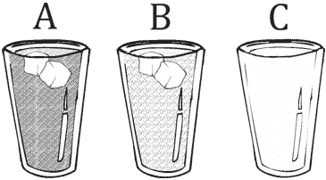
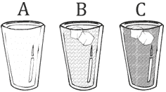
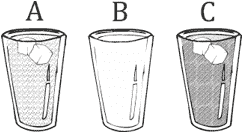
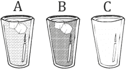

## 第八章

跟踪表

### 8.1 什么是跟踪表？

跟踪表是一种用于测试算法或计算机程序在执行过程中出现的逻辑错误的技巧。

跟踪表模拟执行流程。语句按步骤执行，变量的值在执行赋值语句时发生变化。

跟踪表在教育方面很有用。它们通常由新手程序员使用，以帮助他们可视化特定算法或程序的工作方式，并帮助他们检测逻辑错误。

一个典型的跟踪表如下所示。

| 步骤 | 语句 | 备注 | 变量 1 | 变量 2 | 变量 3 |
| --- | --- | --- | --- | --- | --- |
| 1 |   |   |   |   |   |
| 2 |   |   |   |   |   |
| … |   |   |   |   |   |

让我们看看跟踪表的实际应用！对于以下 Python 程序，创建了一个跟踪表来确定每一步的变量值。

x = 10

y = 15

z = x * y

z += 1

打印 z

下面显示了此程序的跟踪表。备注是可选的，但它们有助于读者更好地理解实际发生的情况。

| 步骤 | 语句 | 备注 | x | y | z |
| --- | --- | --- | --- | --- | --- |
| 1 | x = 10 | 将值 10 赋值给变量 x。 | 10 | ? | ? |
| 2 | y = 15 | 将值 15 赋值给变量 y。 | 10 | 15 | ? |
| 3 | z = x * y | 乘积 x * y 的结果赋值给 z。 | 10 | 15 | 150 |
| 4 | z += 1 | 变量 z 增加了 1。 | 10 | 15 | 151 |
| 5 | print(z) | 它显示：151 |

#### 练习 8.1-1 创建跟踪表

创建一个跟踪表，以确定 Python 程序两次执行中每一步的变量值。

两次执行的输入值分别为：(i) 0.3，和 (ii) 4.5。

b = float(input())

c = 3

c = c * b

a = 10 * c

a = a % 10

打印 a

解答

i)对于输入值 0.3，跟踪表如下所示。

| 步骤 | 语句 | 备注 | a | b | c |
| --- | --- | --- | --- | --- | --- |
| 1 | b = float(input()) | 用户输入值 0.3 | ? | 0.3 | ? |
| 2 | c = 3 |   | ? | 0.3 | 3 |
| 3 | c = c * b |   | ? | 0.3 | 0.9 |
| 4 | a = 10 * c |   | 9.0 | 0.3 | 0.9 |
| 5 | a = a % 10 |   | 9.0 | 0.3 | 0.9 |
| 6 | print(a) | 它显示：9.0 |

ii)对于输入值 4.5，跟踪表如下所示。

| 步骤 | 语句 | 备注 | a | b | c |
| --- | --- | --- | --- | --- | --- |
| 1 | b = float(input()) | 用户输入值 4.5 | ? | 4.5 | ? |
| 2 | c = 3 |   | ? | 4.5 | 3 |
| 3 | c = c * b |   | ? | 4.5 | 13.5 |
| 4 | a = 10 * c |   | 135.0 | 4.5 | 13.5 |
| 5 | a = a % 10 |   | 5.0 | 4.5 | 13.5 |
| 6 | print(a) | 它显示：5.0 |

#### 练习 8.1-2 创建跟踪表

当执行以下程序时，显示什么结果？

Ugly = "Beautiful"

Beautiful = "Ugly"

Handsome = Ugly

打印("Beautiful")

打印 Ugly

打印 Handsome

解答

让我们创建一个跟踪表来找到输出结果。

| 步骤 | 语句 | 备注 | Ugly | Beautiful | Handsome |
| --- | --- | --- | --- | --- | --- |
| 1 | Ugly = "Beautiful" | 将字符串 "Beautiful" 赋值给变量 Ugly。 | Beautiful | ? | ? |
| 2 | Beautiful = "Ugly" | The string “Ugly” is assigned to the variable Beautiful. | Beautiful | Ugly | ? |
| 3 | Handsome = Ugly | The value of variable Ugly is assigned to the variable Handsome. | Beautiful | Ugly | Beautiful |
| 4 | print("Beautiful") | It displays: Beautiful |
| 5 | print(Ugly) | It displays: Beautiful |
| 6 | print(Handsome) | It displays: Beautiful |

#### 练习 8.1-3 变量值交换

编写一个 Python 程序，让用户输入两个值，分别存储在变量 a 和 b 中。程序结束时，两个变量必须交换它们的值。例如，如果变量 a 和 b 分别包含值 5 和 7，在交换它们的值后，变量 a 必须包含值 7，变量 b 必须包含值 5！

解决方案

以下程序，尽管看起来正确，但实际上并没有交换变量 a 和 b 的值！

a = int(input())

b = int(input())

a = b

b = a

print(a)

print(b)

让我们看看为什么！假设用户输入两个值，5 和 7。跟踪表如下所示。

| Step | Statement | Notes | a | b |
| --- | --- | --- | --- | --- |
| 1 | a = int(input()) | User enters the value 5 | 5 | ? |
| 2 | b = int(input()) | User enters the value 7 | 5 | 7 |
| 3 | a = b | The value of variable b is assigned to variable a. Value 5 is lost! | 7 | 7 |
| 4 | b = a | The value of variable a is assigned to variable b | 7 | 7 |
| 5 | print(a) | It displays: 7 |
| 6 | print(b) | It displays: 7 |

哎呀！5 这个值去哪了？

解决方案并不像最初想象的那么明显！那么，你到底是如何交换值的呢？

考虑两个杯子：一杯橙汁（称为杯子 A），一杯柠檬汁（称为杯子 B）。如果你想交换它们的内容，你只需找到并使用一个额外的空杯子（称为杯子 C）。

必须遵循以下步骤：

1) 将杯子 A（橙汁）的内容倒入杯子 C。

.

2) 将杯子 B（柠檬汁）的内容倒入杯子 A。

.

3) 将杯子 C（橙汁）的内容倒入杯子 B。

.

交换完成成功！

你可以遵循相同的步骤在 Python 中交换两个变量的内容。

a = int(input())

b = int(input())

c = a      # 将杯子 A（橙汁）的内容倒入杯子 C

a = b      # 将杯子 B（柠檬汁）的内容倒入杯子 A

b = c      # 将杯子 C（橙汁）的内容倒入杯子 B

print(a)

print(b)

The text after a hash character is considered a comment and is never executed.

最后但同样重要的是，在 Python 中，你也可以像这样交换两个变量的内容：

a = int(input())

b = int(input())

a, b = b, a

print(a)

print(b)

#### 练习 8.1-4 变量值交换 – 另一种方法

编写一个 Python 程序，让用户输入两个整数值，存储在变量 a 和 b 中。最后，两个变量必须交换它们的值。然后，使用输入值 5 和 7 的跟踪表来确认代码的正确性。

解答

Since the variables contain numeric values, you can use the following Python program (as an alternative approach).

a = int(input())

b = int(input())

a = a + b

b = a - b

a = a - b

print(a, b)

让我们现在使用输入值 5 和 7 的跟踪表来确认变量 a 和 b 正确地交换了它们的内容。

| 步骤 | 语句 | 备注 | a | b |
| --- | --- | --- | --- | --- |
| 1 | a = int(input()) | 用户输入值 5 | 5 | ? |
| 2 | b = int(input()) | 用户输入值 7 | 5 | 7 |
| 3 | a = a + b |   | 12 | 7 |
| 4 | b = a - b |   | 12 | 5 |
| 5 | a = a - b |   | 7 | 5 |
| 6 | print(a, b) | 显示：7 5 |

这种方法的不利之处在于它不能交换字母数字变量的内容（字符串）。

### 8.2 复习问题：对/错

Choose true or false for each of the following statements.

1)跟踪表是测试计算机的一种技术。

2)跟踪表有助于程序员找到计算机程序中的错误。

3)您不能在没有首先创建相应的跟踪表的情况下执行计算机程序。

4)为了交换两个整型变量的值，您始终需要一个额外的变量。

### 8.3 复习练习

完成以下练习。

1)创建一个跟踪表以确定当输入值为 3 时 Python 程序每一步的变量值。

a = float(input())

b = a + 10

a = b * (a - 3)

c = 3 * b / 6

d = c * c

d -= 1

print(d)

2)创建一个跟踪表以确定 Python 程序在三次不同执行中每一步的变量值。

三次执行的输入值分别为：(i) 3，(ii) 4，和(iii) 1。

a = int(input())

a = (a + 1) * (a + 1) + 6 / 3 * 2 + 20

b = a % 13

c = b % 7

d = a * b * c

print(a, ",", b, ",", c, ",", d)

3)创建一个跟踪表以确定 Python 程序在两次不同执行中每一步的变量值。

两次执行的输入值分别为：(i) 8，4；和(ii) 4，4

a = int(input())

b = int(input())

c = a + b

d = 1 + a / b * c + 2

e = c + d

c += d + e

e -= 1

d -= c + d % c

print(c, ",", d, ",", e)
