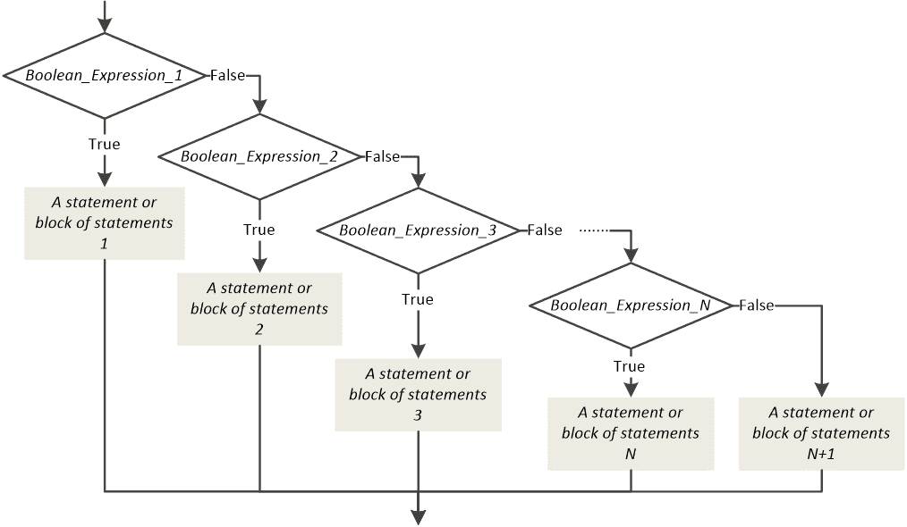
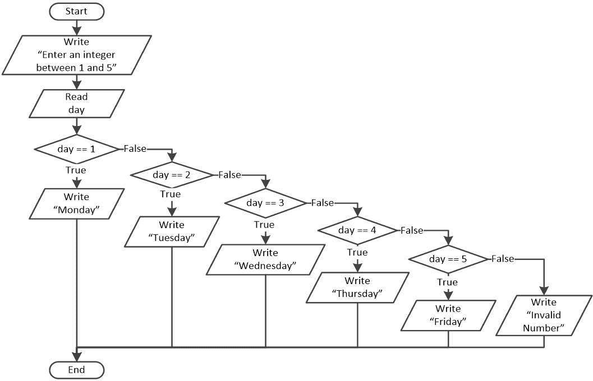

## 第十八章

多重条件决策结构

### 18.1 多重条件决策结构

多重条件决策结构用于扩展选择数量，如下面的流程图片段所示。

当执行多重条件决策结构时，会评估 Boolean_Expression_1。如果评估为真，则执行紧随其后的相应语句或语句块；然后跳过结构的其余部分，继续执行多重条件决策结构之后可能存在的任何剩余语句。然而，如果 Boolean_Expression_1 评估为假，则执行流程会评估 Boolean_Expression_2。如果它评估为真，则执行紧随其后的相应语句或语句块，并跳过结构的其余部分。这个过程会一直继续，直到有一个布尔表达式评估为真，或者直到没有更多的布尔表达式为止。

当之前的布尔表达式都没有评估为真时，执行最后一个语句或最后一个语句块 N + 1。此外，这个最后一个语句或语句块 N + 1 是可选的，并且可以省略。这取决于你试图解决的问题的算法。

Python 语句的一般形式是

if Boolean_Expression_1:

一个或多个语句 1

elif Boolean_Expression_2:

一个或多个语句 2

elif Boolean_Expression_3:

一个或多个语句 3

.

.

.

elif Boolean_Expression_N:

一个或多个语句 N

else:

一个或多个语句 N + 1

 elif 关键字是“else if”的缩写。

 最后一个语句或最后一个语句块 N + 1 是可选的，并且可以省略（也需要省略 else 关键字）。

这里展示了一个简单的例子。

 file_18.1

name = input("你叫什么名字？ ")

if name == "John":

print("你是我的堂兄/堂姐！")

elif name == "Aphrodite":

print("你是我的姐姐！")

elif name == "Loukia":

print("你是我的妈妈！")

else:

print("对不起，我不认识你。")

#### 练习 18.1-1 跟踪表和多重条件决策结构

创建一个跟踪表，以确定在 Python 程序的下述三次执行中，每个步骤中变量的值。

三次执行的输入值分别为：(i) 5, 8；(ii) −13, 0；(iii) 1, −1。

 file_18.1-1

a = int(input())

b = int(input())

if a > 3:

print("消息 #1")

elif a > 4 and b <= 10:

print("消息 #2")

print("消息 #3")

elif a * 2 == -26:

print("消息 #4")

print("消息 #5")

b += 1

elif b == 1:

print("消息 #6")

else:

print("消息 #7")

print("消息 #8")

print("结束！")

解答

i)对于输入值 5 和 8，跟踪表如下所示。

| 步骤 | 语句 | 备注 | a | b |
| --- | --- | --- | --- | --- |
| 1 | a = int(input()) | 用户输入值 5 | 5 | ? |
| 2 | b = int(input()) | 用户输入值 8 | 5 | 8 |
| 3 | if a > 3: | 这将评估为 True |
| 4 | print("消息 #1") | 它显示：消息 #1 |
| 5 | print("结束！") | 它显示：结束！ |

注意，尽管第二个布尔表达式（a > 4 and b <= 10）也可能评估为 True，但它从未被检查过。

ii)对于输入值 -13 和 0，跟踪表如下所示。

| 步骤 | 语句 | 备注 | a | b |
| --- | --- | --- | --- | --- |
| 1 | a = int(input()) | 用户输入值 -13 | -13 | ? |
| 2 | b = int(input()) | 用户输入值 0 | -13 | 0 |
| 3 | if a > 3: | 这将评估为 False |
| 4 | elif a > 4 and b <= 10: | 这将评估为 False |
| 5 | elif a * 2 == -26: | 这将评估为 True |
| 6 | print("消息 #4") | 它显示：消息 #4 |
| 7 | print("消息 #5") | 它显示：消息 #5 |
| 8 | b += 1 |   | -13 | 1 |
| 9 | print("结束！") | 它显示：结束！ |

注意，在第 8 步之后，第四个布尔表达式（b == 1）也可能评估为 True，但它从未被检查过。

iii)对于输入值 1 和 -1，跟踪表如下所示。

| 步骤 | 语句 | 备注 | a | b |
| --- | --- | --- | --- | --- |
| 1 | a = int(input()) | 用户输入值 1 | 1 | ? |
| 2 | b = int(input()) | 用户输入值 -1 | 1 | -1 |
| 3 | if a > 3: | 这将评估为 False |
| 4 | elif a > 4 and b <= 10: | 这将评估为 False |
| 5 | elif a * 2 == -26: | 这将评估为 False |
| 6 | elif b == 1: | 这将评估为 False |
| 7 | print("消息 #7") | 它显示：消息 #7 |
| 8 | print("消息 #8") | 它显示：消息 #8 |
| 9 | print("结束！") | 它显示：结束！ |

#### 练习 18.1-2 星期几

设计一个流程图并编写相应的 Python 程序，提示用户输入一个介于 1 和 5 之间的整数，然后显示相应的工作日（星期一、星期二、星期三、星期四或星期五）。如果输入的值无效，必须显示错误消息。

解答

流程图和解决此练习的相应 Python 程序如下所示。

 file_18.1-2

day = int(input("输入一个介于 1 和 5 之间的整数："))

if day == 1:

print("星期一")

elif day == 2:

print("星期二")

elif day == 3:

print("星期三")

elif day == 4:

print("星期四")

elif day == 5:

print("星期五")

else:

print("无效数字")

#### 练习 18.1-3 计数数字

编写一个 Python 程序，提示用户输入一个介于 0 和 999 之间的整数，然后计算它的总位数。最后，显示一条消息“你输入了一个 N 位数”，其中 N 是总位数。假设用户输入了一个介于 0 和 999 之间的有效整数。

解答

你可能正在试图找出如何使用除法操作来解决这个练习。你可能正在考虑将用户提供的整数除以 10，并检查整数商是否为 0。如果是，这意味着用户提供的整数是一位数。然后，你可以除以 100 或 1000 来检查两位数和三位数。你的想法部分是正确的，你的想法在下面的代码片段中得到了体现。

if x // 10 == 0:

digits = 1

elif x // 100 == 0:

digits = 2

elif x // 1000 == 0:

digits = 3

如果用户提供的整数（变量 x）是一位数，第一个布尔表达式计算结果为 True，其余的布尔表达式永远不会被检查！如果用户提供的整数是两位数，第一个布尔表达式计算结果为 False，第二个计算结果为 True，最后一个永远不会被检查！最后，如果用户提供的整数是三位数，第一个和第二个布尔表达式都计算结果为 False，最后一个计算结果为 True！

这似乎很准确，不是吗？那么，问题出在哪里？

考虑如果练习的措辞是“编写一个 Python 程序，提示用户输入一个整数，当用户提供的整数由两位数字组成时显示一条消息”。很可能会按照以下步骤进行：

x = int(input("输入一个整数："))

if x // 100 == 0:

print("输入了一个 2 位整数")

然而，这段代码是有缺陷的！虽然布尔表达式 x // 100 == 0 对于所有两位数或更多位的用户提供的整数都工作得很好，但不幸的是，它对于一位数（因为它对于它们不计算为 False）不起作用。因此，使用整数除法不是正确的方法。正确的解决方案比你想象的要简单得多！

你能想到的最小的两位整数是什么？是 10，对吧？你能想到的最大的是多少？是 99，对吧？所以，正确的解决方案如下。

x = int(input("输入一个整数："))

if 10 <= x <= 99:

print("输入了一个 2 位整数")

根据所有这些，练习的完整解决方案如下！

 file_18.1-3a

x = int(input("输入一个整数（0 - 999）："))

if 0 <= x <= 9:

digits = 1

elif 10 <= x <= 99:

digits = 2

else:

digits = 3

print("输入了一个{}位整数".format(digits), sep = "")

如果你想让你的程序更好，并在用户输入不在 0 到 999 之间的值时向用户显示错误消息，你可以这样做：

 file_18.1-3b

x = int(input("输入一个整数（0 - 999）："))

if 0 <= x <= 9:

print("输入了一个 1 位整数")

elif 10 <= x <= 99:

print("输入了一个 2 位整数")

elif 100 <= x <= 999:

print("输入了一个 3 位整数")

else:

print("输入错误！")

### 18.2 复习问题：正确/错误

对以下每个陈述选择正确或错误。

1)多重选择决策结构用于扩展选择数量。

2)多重选择决策结构最多可以有三种选择。

3)在多重选择决策结构中，一旦布尔表达式评估为真，下一个布尔表达式也会被评估。

4)在多重选择决策结构中，位于 else 关键字下面的最后一个语句或语句块 N+1 总是会被执行。

5)在多重选择决策结构中，当至少一个之前的布尔表达式评估为真时，会执行最后一个语句或语句块 N+1（位于 else 关键字下面）。

6)在多重选择决策结构中，最后一个语句或语句块 N+1，以及扩展的 else 关键字，可以被省略。

7)在以下代码片段中，只有当变量 a 包含的值不是 1、2 或 3 时，才会执行语句 y += 1。

if a == 1:

x += 5

elif a == 2:

x -= 2

elif a == 3:

x -= 9

else:

x += 3

y += 1

8)在上一个练习的代码片段中，只有当变量 a 包含的值不是 1、2 或 3 时，才会执行语句 x += 3。

### 18.3 复习练习

Complete the following exercises.

1)创建一个跟踪表，以确定在下一个 Python 程序的四个不同执行中每一步的变量值。

The input values for the four executions are: (i) 5, (ii) 150, (iii) 250, and (iv) −1.

q = int(input())

if 0 < q <= 50:

b = 1

elif 50 < q <= 100:

b = 2

elif 100 < q <= 200:

b = 3

else:

b = 4

print(b)

2)创建一个跟踪表，以确定在下一个 Python 程序的三个不同执行中每一步的变量值。

The input values for the three executions are: (i) 5, (ii) 150, and (iii) −1.

amount = float(input())

discount = 0

if amount < 20:

discount = 0

elif 20 <= amount < 60:

discount = 5

elif 60 <= amount < 100:

discount = 10

elif amount >= 100:

discount = 15

payment = amount - amount * discount / 100

print(discount, ",", payment)

3)创建一个跟踪表，以确定在下一个 Python 程序的三个不同执行中每一步的变量值。然后，设计相应的流程图。

The input values for the three executions are: (i) 1, (ii) 3, and (iii) 250.

a = int(input())

x = 0

y = 0

if a == 1:

x = x + 5

y = y + 5

elif a == 2:

x = x - 2

y -= 1

elif a == 3:

x = x - 9

y = y + 3

else:

x = x + 3

y += 1

print(x, ",", y)

4)创建一个跟踪表，以确定在下一个 Python 程序的三个不同执行中每一步的变量值。然后，设计相应的流程图。

The input values for the three executions are: (i) 10, 2, 5; (ii) 5, 2, 3; and (iii) 4, 6, 2.

a = int(input())

x = int(input())

y = float(input())

if a == 10:

x = x % 2

y = y ** 2

elif a == 3:

x = x * 2

y -= 1

elif a == 5:

x = x + 4

y += 7

else:

x -= 3

y += 1

print(x, ",", y)

5)使用正确的缩进来编写以下 Python 程序。

a = float(input())

if a < 1:

y = 5 + a

print(y)

elif a < 5:

y = 23 / a

print(y)

elif a < 10:

y = 5 * a

print(y)

else:

print("Error!")

6)编写一个 Python 程序，提示用户输入两个整数，然后显示一条消息，指出两个数是否都是奇数或都是偶数；否则显示消息“没有特殊之处”。

7)两支足球队在欧洲冠军联赛中对战。编写一个 Python 程序，提示用户输入两队的名称以及每队得分，然后当两队得分相等时显示获胜队的名称或消息“平局！”假设用户输入了有效的值。

8)设计一个流程图并编写相应的 Python 程序，允许用户输入一个介于-9999 和 9999 之间的整数，然后计算其总位数。最后，显示消息“您输入了一个 N 位数”，其中 N 是总位数。假设用户输入了-9999 和 9999 之间的有效整数。

9)重写上一个练习的 Python 程序以验证数据输入。当用户输入无效值时，必须显示错误消息。

10)编写一个 Python 程序，显示以下菜单：

1)将美元转换为欧元 (EUR)

2)将美元转换为英镑 (GBP)

3)将美元转换为日元 (JPY)

4)将美元转换为加拿大元 (CAD)

然后提示用户输入一个选择（1、2、3 或 4）和美元金额，计算并显示所需的价值。假设用户输入了有效的值。已知

►$1 = 0.94 欧元 (EUR)

►$1 = 0.81 英镑 (£)

►$1 = ¥ 149.11 日元 (JPY)

►$1 = 1.36 加拿大元 (CAD)

11)编写一个 Python 程序，提示用户输入 1 到 12 月份的数字，然后显示相应的季节。假设用户输入了有效的值。已知

►冬季包括 12 月、1 月和 2 月

►春季包括 3 月、4 月和 5 月

►夏季包括 6 月、7 月和 8 月

►秋季包括 9 月、10 月和 11 月

12)重写上一个练习的 Python 程序以验证数据输入。当用户输入无效值时，必须显示错误消息。

13)编写一个 Python 程序，提示用户输入月份的名称，然后显示相应的数字（1 代表一月，2 代表二月，依此类推）。如果输入的值无效，必须显示错误消息。

14)美国最流行和常用的评分系统使用字母等级的离散评估。设计一个流程图并编写相应的 Python 程序，提示用户输入一个介于 A 和 F 之间的字母，然后根据以下表格显示相应的百分比。

| 等级 | 百分比 |
| --- | --- |
| A | 90 ‐ 100 |
| B | 80 ‐ 89 |
| C | 70 ‐ 79 |
| D | 60 ‐ 69 |
| E / F | 0 ‐ 59 |

假设用户输入了有效的值。

15)设计一个流程图并编写相应的 Python 程序，显示以下菜单：

1)将英里转换为码

2)将英里转换为英尺

3)将英里转换为英寸

然后提示用户输入选择（1、2 或 3）和距离（英里）。然后，它计算并显示所需值。假设用户输入了有效的距离值。然而，如果输入的选择无效，必须显示错误信息。已知

►1 英里 = 1760 码

►1 英里 = 5280 英尺

►1 英里 = 63360 英寸

16)罗马数字如下表所示。

| 数字 | 罗马数字 |
| --- | --- |
| 1 | I |
| 2 | II |
| 3 | III |
| 4 | IV |
| 5 | V |
| 6 | VI |
| 7 | VII |
| 8 | VIII |
| 9 | IX |
| 10 | X |

编写一个 Python 程序，提示用户输入一个介于 I 和 X 之间的罗马数字，然后显示相应的数字。然而，如果输入的选择无效，必须显示错误信息。

17)在线超市根据客户每月购买的酒瓶总数来奖励积分。积分的分配如下：

►如果客户购买 1 瓶酒，他们将获得 3 分。

►如果客户购买 2 瓶酒，他们将获得 10 分。

►如果客户购买 3 瓶酒，他们将获得 20 分。

►如果客户购买 4 瓶或更多的酒，他们将获得 45 分。

使用情况决策结构，编写一个 Python 程序，提示用户输入他们在一个月内购买的酒瓶总数，然后显示获得的积分数。假设用户输入了有效的值。

18)编写一个 Python 程序，提示用户输入他们的名字，然后随机显示“Hello NN!”、“Hi NN!”或“What's up NN!”，其中 NN 是用户的名字。要显示的消息必须随机选择。

19)编写一个 Python 程序，允许用户输入一个如“zero”、“one”或“two”之类的单词，然后将其转换为相应的数字，如 0、1 或 2。这必须对 0 到 9 的数字都这样做。当用户输入未知数字时，显示“I don't know this number!”。

20)蒲福风级（^([[15]](footnotes.html#Endnote_15)))是一种经验测量方法，它将风速与陆地或海洋上的观察条件联系起来。编写一个 Python 程序，提示用户输入蒲福风级，然后显示以下表格中的相应描述。然而，如果输入的数字无效，必须显示错误信息。

| 蒲福风级 | 描述 |
| --- | --- |
| 0 | 平静 |
| 1 | 微风 |
| 2 | 微风 |
| 3 | 微风 |
| 4 | 中等风 |
| 5 | 新风 |
| 6 | 强风 |
| 7 | 中等风暴 |
| 8 | 风暴 |
| 9 | 强风暴 |
| 10 | 风暴 |
| 11 | 狂风暴雨 |
| 12 | 飓风力量 |

21)编写一个 Python 程序，提示用户输入一个介于 0.0 和 9.9 之间的一位小数的数字，然后以英文文本的形式显示该数字。例如，如果用户输入 2.3，程序必须显示“Two point three”。假设用户输入了有效的值。

提示：避免逐个检查每个实数，因为这需要具有 100 个案例的多重选择决策结构！尝试找到更高效和巧妙的方法吧！
