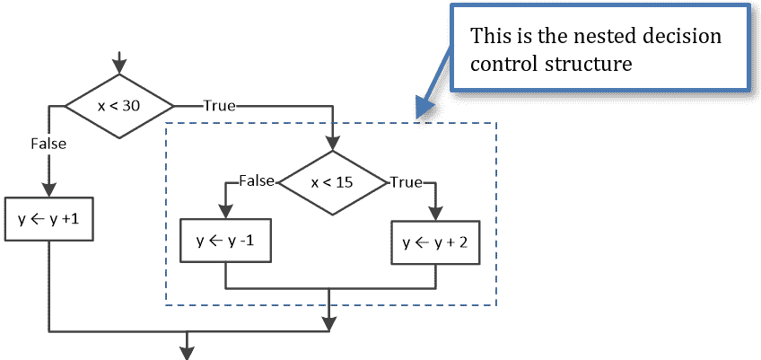
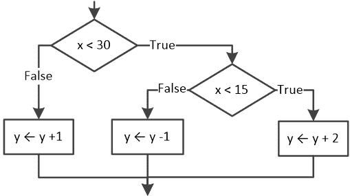
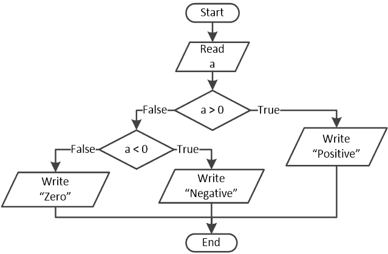

## 第十九章

嵌套决策控制结构

### 19.1 嵌套决策控制结构是什么？

嵌套决策控制结构是“嵌套”（包含）在另一个决策控制结构中的决策控制结构。这意味着一个决策控制结构可以嵌套（包含）另一个决策控制结构（然后成为“嵌套”决策控制结构）。反过来，那个嵌套的决策控制结构可以包含另一个决策结构，依此类推。

嵌套决策控制结构的示例如下。

这可以被重新排列为

并且 Python 代码如下所示。

if x < 30:

if x < 15:     [[更多…]](more.html#more_19_1_1)

> y = y + 2

else:

> y -= 1

else:

y += 1

嵌套的深度没有实际限制。只要不违反语法规则，你可以嵌套任意数量的决策控制结构。然而，出于实际考虑，当你移动到三或四个嵌套级别时，整个结构会变得非常复杂且难以理解。

复杂的代码可能导致无效的结果！尽量保持代码尽可能简单，通过将大型嵌套决策控制结构分解成多个较小的结构，或者使用其他类型的决策控制结构。

显然，只要保持它们在语法和逻辑上的正确性，你可以在任何决策控制结构内部嵌套任何其他决策控制结构。在下一个示例中，一个多分支决策结构嵌套在一个双分支决策结构中。

 file_19.1

x = int(input("输入一个选择："))

if x < 1 or x > 4:

print("无效的选择")

else:

print("有效的选择")

if x == 1:             [[更多…]](more.html#more_19_1_2)

> print("第一个选项被选中")

elif x == 2:

> print("第二个选项被选中")

elif x == 3:

> print("第三个选项被选中")

elif x == 4:

> print("第四个选项被选中")

注意，在多分支决策结构中缺少关键字 else。如果你希望包含它，考虑到只有 1、2、3 或 4 这几个选择被检查，你可以将 elif x == 4 替换为 else。

#### 练习 19.1-1 跟踪表和嵌套决策控制结构

创建一个跟踪表，以确定在下一个 Python 程序的三个不同执行中每个步骤中变量的值。

三次执行的输入值分别为：(i) 13，(ii) 18，和 (iii) 30。

 file_19.1-1

x = int(input())

y = 10

if x < 30:

if x < 15:

> y = y + 2

else:

> y -= 1

else:

y += 1

print(y)

解答

i)对于输入值 13，跟踪表如下所示。

| 步骤 | 语句 | 备注 | x | y |
| --- | --- | --- | --- | --- |
| 1 | x = int(input()) | 用户输入值 13 | 13 | ? |
| 2 | y = 10 |   | 13 | 10 |
| 3 | if x < 30: | 这评估为 True |
| 4 | if x < 15: | 这评估为 True |
| 5 | y = y + 2 |   | 13 | 12 |
| 6 | print(y) | 显示：12 |

ii)对于输入值 18，跟踪表如下所示。

| 步骤 | 语句 | 备注 | x | y |
| --- | --- | --- | --- | --- |
| 1 | x = int(input()) | 用户输入值 18 | 18 | ? |
| 2 | y = 10 |   | 18 | 10 |
| 3 | if x < 30: | 这评估为 True |
| 4 | if x < 15: | 这评估为 False |
| 5 | y -= 1 |   | 18 | 9 |
| 6 | print(y) | 它显示：9 |

iii)对于输入值 30，跟踪表如下所示。

| 步骤 | 语句 | 备注 | x | y |
| --- | --- | --- | --- | --- |
| 1 | x = int(input()) | 用户输入值 30 | 30 | ? |
| 2 | y = 10 |   | 30 | 10 |
| 3 | if x < 30: | 这评估为 False |
| 4 | y += 1 |   | 30 | 11 |
| 5 | print(y) | 它显示：11 |

#### 练习 19.1-2 正数、负数或零？

设计一个流程图并编写相应的 Python 程序，允许用户输入一个数字，然后根据用户提供的值是大于、小于还是等于零来显示消息“正数”、“负数”或“零”。

解答

流程图如下所示。

这个流程图可以用嵌套决策控制结构或多重选择决策结构来编写 Python 程序。让我们都试试！

第一种方法 – 使用嵌套决策控制结构

 file_19.1-2a

a = float(input())

if a > 0:

print("Positive")

else:

if a < 0:

> print("Negative")

else:

> print("Zero")

第二种方法 – 使用多重选择决策结构

 file_19.1-2b

a = float(input())

if a > 0:

print("Positive")

elif a < 0:

print("Negative")

else:

print("Zero")

### 19.2 复习问题：对/错

对以下每个陈述选择正确或错误。

1)决策控制结构的嵌套描述了一种情况，其中一个或多个决策控制结构的路径包围了其他决策控制结构。

2)嵌套级别可以深到程序员想要的程度。

3)当一个问题可以使用多重选择决策结构或嵌套决策控制结构来解决时，第二种选择更好，因为程序的可读性更高。

4)可以在简单选择决策结构内嵌套多重选择决策结构，但不能反过来。

### 19.3 复习练习

完成以下练习。

1)创建一个跟踪表以确定下一次 Python 程序在四次不同执行中每一步的变量值。

四次执行的输入值分别为：(i) 20, 1; (ii) 20, 3; (iii) 12, 8; 和 (iv) 50, 0。

x = int(input())

y = int(input())

if x < 30:

if y == 1:

> x = x % 3
> 
> y = 5

elif y == 2:

> x = x * 2
> 
> y = 2

elif y == 3:

> x = x + 5
> 
> y += 3

else:

> x -= 2
> 
> y += 1

else:

y += 1

print(x, ",", y)

2)创建一个跟踪表以确定下一次 Python 程序在四次不同执行中每一步的变量值。

四次执行的输入值分别为：(i) 60, 25; (ii) 50, 8; (iii) 20, 15; 和 (iv) 10, 30。

x = int(input())

y = int(input())

if (x + y) / 2 <= 20:

if y < 10:

> x = x % 3
> 
> y += 2

elif y < 20:

> x = x * 5
> 
> y += 2

else:

> x = x - 2
> 
> y += 3

else:

if y < 15:

> x = x % 4
> 
> y = 2

elif y < 23:

> x = x % 2
> 
> y -= 2

else:

> x = 2 * x + 5
> 
> y += 1

print(x, ",", y)

3)使用正确的缩进编写以下 Python 程序。

a = int(input())

if a > 1000:

print("Big Positive")

else:

if a > 0:

print("Positive")

else:

if a < -1000:

print("Big Negative")

else:

if a < 0:

print("Negative")

else:

print("Zero")

4)在希腊，您至少 16 岁时可以驾驶小型滑板车，而您至少 18 岁时可以驾驶汽车。编写一个 Python 程序，提示用户输入他们的年龄，然后根据用户的年龄显示以下消息之一：

►“您不能驾驶小型滑板车或汽车”，当用户年龄小于 16 岁时

►“您可以在 16 至 18 岁之间驾驶小型滑板车”，当用户年龄在 16 至 18 岁之间时

►“您可以驾驶汽车和一辆小型滑板车”，当用户年龄为 18 岁或以上时

当用户输入无效值时，必须显示错误消息。

5)hoverboard 工厂经理需要一个程序来计算工厂在一个月期间所获得的利润或亏损。以下是一些信息：

►制造每台 hoverboard 的成本为 150 美元。

►hoverboard 售价为每台 250 美元。

►该工厂每月为每位员工支付 1000 美元的保险费。

编写一个 Python 程序，提示用户输入销售的 hoverboard 数量和公司中的员工数量。根据公司的财务表现，程序必须然后显示以下消息之一：

►盈利

►亏损

►盈亏平衡

当用户输入销售的 hoverboard 数量为负数或员工数量非正数（^[[16]](footnotes.html#Endnote_16)）时，必须显示错误消息。

6)编写一个 Python 程序，提示用户输入他们的名字。程序必须然后选择一个介于 1 到 24 之间的随机整数来代表一个小时，然后，它必须显示消息“现在是 HH:00”以及，根据该数字，显示“早上好 NN!”、“晚上好 NN!”、“下午好 NN!”或“晚上好 NN!”，其中 HH 是随机选择的数字，NN 是用户的名字。解决这个练习两次，一次使用嵌套决策结构，一次使用多选决策结构。

7)编写一个 Python 程序，提示用户输入三角形的三个边的长度，然后确定用户提供的数字是否可以是三角形三边的长度。如果长度无效，必须显示相应的消息；否则，程序必须进一步确定三角形是

a)等边

提示：在等边三角形中，所有边都相等。

b)直角（或直角三角形）

提示：使用勾股定理。

c)非特殊

提示：在任何三角形中，每边的长度都小于其他两边长度之和。

8) 在自动取款机（ATM）中，有 10 美元、5 美元和 1 美元的纸币。编写一个 Python 程序来模拟这种 ATM 的工作方式。一开始，机器提示用户输入四位数密码，然后检查密码的有效性（假设“1234”是有效的密码）。如果用户提供的密码正确，程序必须提示用户输入他们想要取出的金额（一个整数值），最后显示 ATM 必须发放的最少纸币数量。例如，如果用户输入金额为 36 美元，程序必须显示“3 张 10 美元纸币，1 张 5 美元纸币和 1 张 1 美元纸币”。此外，如果用户输入错误的密码，机器将允许他们重试两次。如果用户三次都输入了错误的密码，必须显示消息“密码锁定”，并且程序必须结束。假设用户输入了有效的金额值。

9) 编写一个 Python 程序，提示用户输入两个值，一个用于温度，另一个用于风速。如果温度高于 75 华氏度，则认为这一天很热，否则是冷天。如果风速高于每小时 12 英里，则认为这一天有风，否则是无风。程序必须根据用户提供的值显示一条单一的消息。例如，如果用户输入温度为 60 华氏度，风速为 10 英里每小时，程序必须显示“这一天很冷且无风”。假设用户输入了有效的值。
