## 第二十一章

决策控制结构的技巧和窍门

### 21.1 简介

本章致力于教你一些有用的技巧和窍门，这些技巧和窍门可以帮助你编写“更好”的代码。在设计你自己的算法或甚至你自己的 Python 程序时，你应该始终牢记这些技巧。

这些技巧和窍门可以帮助你提高代码的可读性，并帮助使代码更短甚至更快。当然，没有单一完美的方法，因为有时使用特定的技巧或窍门可能会有帮助，但在另一种情况下，同样的技巧或窍门可能会有完全相反的结果。大多数时候，代码优化是编程经验的问题。

较小的算法并不总是解决特定问题的最佳方案。为了解决特定的问题，你可能编写一个非常短的算法，不幸的是，这个算法证明消耗了大量的 CPU 时间。另一方面，你可能用另一个算法解决相同的问题，尽管它看起来更长，但计算结果要快得多。

### 21.2 选择决策控制结构

下图可以帮助你根据检查的变量数量决定哪种决策控制结构更适合给定的问题。

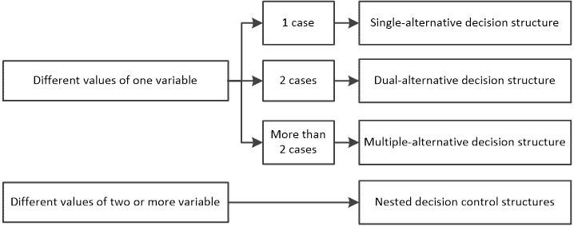

此图推荐最佳选项，而非唯一选项。例如，当有一个变量有超过两个情况时，使用嵌套决策控制结构并非错误。然而，所提出的多重选择决策结构更为方便。

### 21.3 简化决策控制结构

仔细查看以下给出的通用形式的流程图片段。

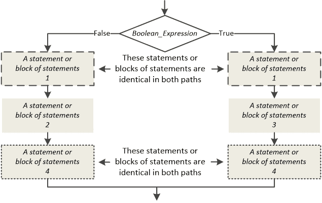

如你所见，在双分支决策控制结构的两条路径的开始和结束处都存在两个相同的语句或语句块。这意味着，无论布尔表达式的结果如何，这些语句都会被执行。因此，你可以简单地将它们移到外面，以及（分别）在双分支决策控制结构之前和之后，如图所示的这个等效结构。

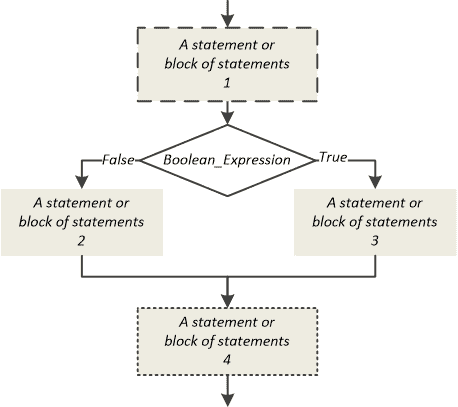

同样的技巧可以应用于任何决策控制结构，只要所有路径中存在相同的语句或语句块。

有些情况下，这个技巧不能应用。例如，如果你不能移动一个语句（或语句块）在决策控制结构之前，如果这个语句影响了结构的布尔表达式。

你还是感到困惑吗？接下来，你将找到一些练习，可以帮助你更好地理解。

#### 练习 21.3-1 “缩小”算法

使用更少的语句重新设计以下流程图。

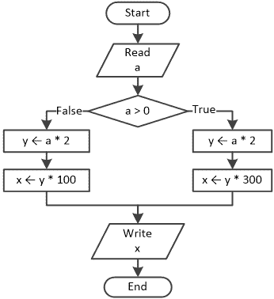

解决方案

正如你所见，语句 y ← a * 2 存在于双分支决策结构的两条路径中。这意味着，无论布尔表达式的结果如何，这个语句都会被执行。因此，你可以简单地将这个语句移动到双分支决策结构的外面，并在其前面，如下所示。

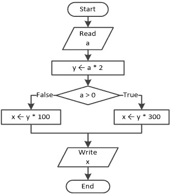

#### 练习 21.3-2 “缩小” Python 程序

使用更少的语句重写以下 Python 程序。

a = int(input())

if a > 0:

y = a * 4

print(y)

else:

y = a * 3

print(y)

解答

正如你所见，语句 print(y) 存在于双分支决策结构的两条路径中。这意味着，无论布尔表达式的结果如何，这个语句都会被执行。因此，你可以简单地将这个语句移动到双分支决策结构的外面，并紧随其后，如下所示。

a = int(input())

if a > 0:

y = a * 4

else:

y = a * 3

print(y)

#### 练习 21.3-3 “缩小” 算法

使用更少的语句重新设计以下流程图，然后编写相应的 Python 程序。

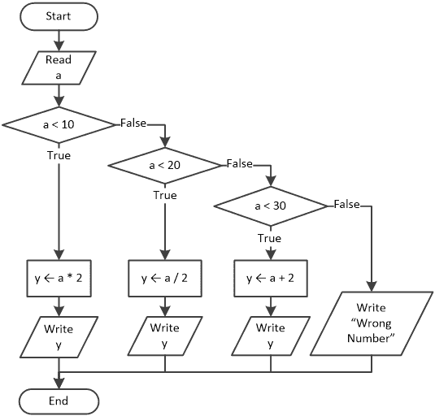

解答

如果你尝试将写入 y 语句移出多分支决策结构，得到的流程图肯定与初始的流程图不等价。

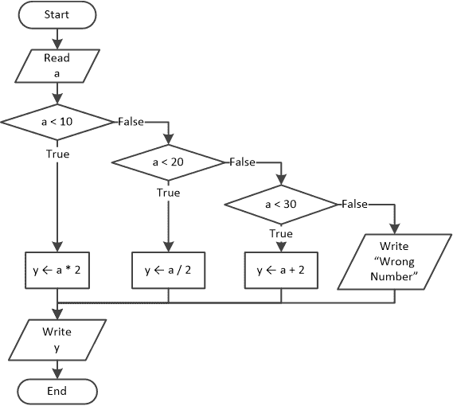

这是因为右侧的最后一条路径，在初始流程图中没有包含写入 y 语句。

检查两个流程图是否产生相同的结果。例如，假设用户输入了一个错误的数字。在两个流程图中，执行流程都会转到写入 "Wrong Number" 语句。之后，初始流程图不再执行其他语句，而第二个流程图则执行了一个额外的写入 y 语句。

你不能将一个语句或语句块移出决策控制结构之外，如果它在所有路径中都不存在。

你现在可能想知道是否还有其他方法可以将写入 y 语句移出多分支决策结构。答案是“是的”，但你需要稍微调整流程图。你需要完全移除右侧的最后一条路径，并在开始时使用一个新的决策控制结构来检查用户提供的数字是否错误。一个可能的解决方案如下。

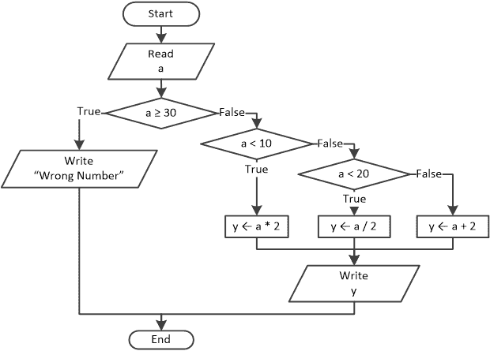

Python 程序如下

a = float(input())

if a >= 30:

print("Wrong Number")

else:

if a < 10:

> y = a * 2

elif a < 20:

> y = a / 2

else:

> y = a + 2

print(y)

### 21.4 逻辑运算符 – 使用与否：这是一个问题！

在某些情况下，你可以使用逻辑运算符而不是嵌套的决策控制结构，这可以提高可读性。看看以下给出的通用形式的流程图片段。

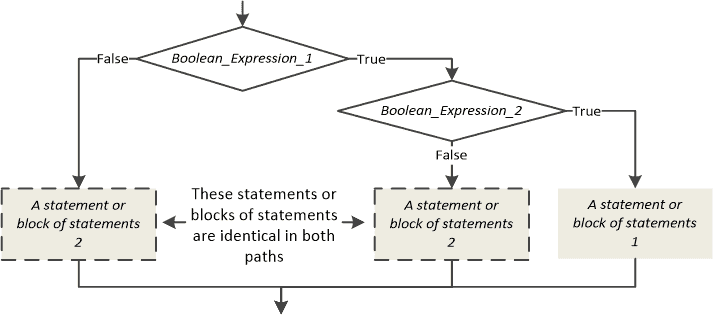

如你所见，语句或语句块 1 仅在两个布尔表达式都评估为真时执行。语句或语句块 2 在所有其他情况下执行。因此，可以使用 AND 逻辑运算符重新设计此流程图片段。

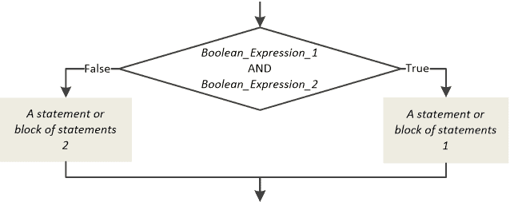

现在，让我们看看另一个以一般形式给出的流程图片段。

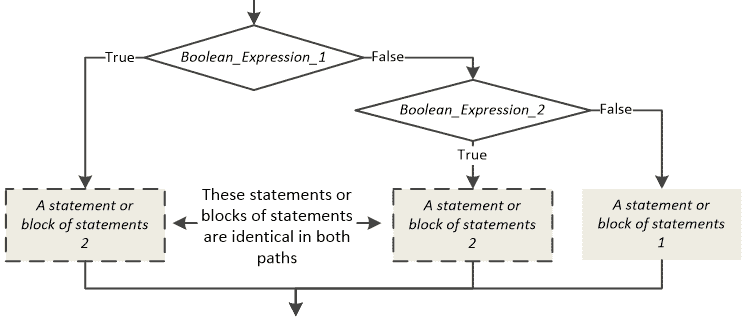

在此流程图片段中，当布尔表达式 _1 或布尔表达式 _2 评估为真时，执行语句或语句块 2。因此，可以使用 OR 逻辑运算符重新设计此流程图片段，如下所示。

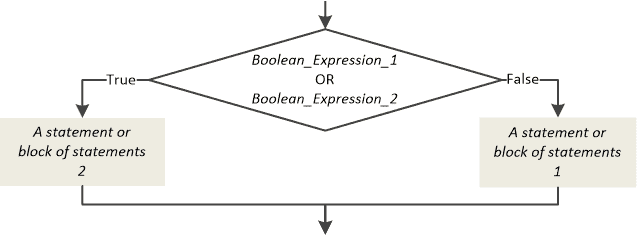

显然，这些方法也可以适应用于嵌套决策控制结构。

#### 练习 21.4-1 代码重写

使用逻辑运算符重写以下 Python 程序。

today = input()

name = input()

如果今天是"February 16"：

如果 name == "Loukia"：

> 打印("Happy Birthday!!!")

否则：

> 打印("No match!")

否则：

打印("No match!")

解答

当两个布尔表达式都评估为真时，执行打印("Happy Birthday!!!")语句。当所有其他情况下，执行打印("No match!")语句。因此，可以使用 and 逻辑运算符重写 Python 程序。

today = input()

name = input()

如果今天是"February 16"并且名字是"Loukia"：

打印("Happy Birthday!!!")

否则：

打印("No match!")

#### 练习 21.4-2 代码重写

使用逻辑运算符重写以下 Python 程序。

a = int(input())

b = int(input())

y = 0

如果 a > 10：

y += 1

elif b > 20:

y += 1

否则：

y -= 1

打印(y)

解答

当变量 a 大于 10 或变量 b 大于 20 时，执行 y += 1 语句。因此，你可以使用 or 逻辑运算符重写 Python 程序。

a = int(input())

b = int(input())

y = 0

如果 a > 10 或 b > 20：

y += 1

否则：

y -= 1

打印(y)

### 21.5 合并两个或更多单分支决策结构

有时，你可能设计一个包含两个或更多连续单分支决策结构的算法，每个都评估相同的布尔表达式。以下是一个示例。

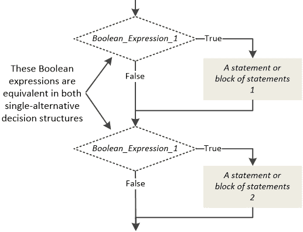

当出现这种情况时，你可以将所有单分支决策结构合并为一个，如下所示。

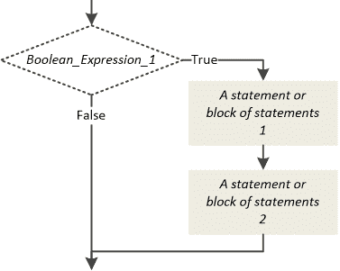

单分支决策结构需要彼此相邻。如果它们之间有任何语句，除非你能将这个语句移动到代码的另一个地方，否则你不能合并它们。

#### 练习 21.5-1 合并决策控制结构

在以下 Python 程序中，合并单分支决策结构。

a = int(input())

如果 a > 0：

打印("Hello")

如果 a > 0：

打印("Hermes")

解答

第一个和第二个决策控制结构正在评估完全相同的布尔表达式，因此它们可以简单地合并成一个。

Python 程序变为

a = int(input())

if a > 0:

print("Hello")

print("Hermes")

#### 练习 21.5-2 合并决策控制结构

在下面的 Python 程序中，尽可能多地合并单分支决策结构。

a = int(input())

y = 0

if a > 0:

y += a + 1

b = int(input())     [[更多…]](more.html#more_21_5_2_1)

如果不是(a <= 0):

print("Hello Hera")

a += 1     [[更多…]](more.html#more_21_5_2_2)

if a > 0:

print("Hallo Welt")

print(y)

解决方案

仔细观察后，很明显第一个和第二个决策控制结构正在评估完全相同的布尔表达式。具体来说，否定 a > 0 得到 a <= 0，a <= 0 的第二次否定（这次使用 not 操作符）得到 not(a <= 0)。因此，a > 0 实际上等同于 not(a <= 0)。

两次否定产生肯定。

然而，在第一个和第二个决策控制结构之间有语句 b = int(input())，这阻止了你将它们合并成一个。幸运的是，这个语句可以被移动到程序的开头，因为它实际上不影响执行流程的其余部分。

另一方面，在第二个和第三个决策控制结构之间有语句 a += 1，这也阻止了你合并；不幸的是，这个语句不能移动到其他地方，因为它确实影响了执行流程的其余部分（第二个和第三个决策控制结构依赖于这个语句）。因此，第三个决策控制结构不能与第一个和第二个合并！

最终的 Python 程序看起来是这样的。

a = int(input())

b = int(input())

y = 0

if a > 0:

y += a + 1

print("Hello Hera")

a += 1

if a > 0:

print("Hallo Welt")

print(y)

### 21.6 将两个单分支决策结构替换为双分支结构

看看下一个例子。

if x > 40:

#做某事

if x <= 40:

#做其他事情

第一个决策控制结构评估变量 x 以测试它是否大于 40，紧接着，第二个决策控制结构再次评估同一个变量以测试它是否小于或等于 40！

这是一种新手程序员非常常见的“错误”。他们使用两个单分支决策结构，尽管一个双分支决策结构就能完成相同的事情。

之前的例子可以用一个双分支决策结构重写，如下所示。

if x > 40:

#做某事

else:

#做其他事情

尽管这两个例子都是绝对正确的并且工作得很好，但第二个方案更好。CPU 只需要评估一个布尔表达式，这会导致更快的执行时间。

两个单分支决策结构必须相邻。如果它们之间有任何语句存在，你不能“合并”它们（即用双分支决策结构替换它们），除非你可以将这个语句移动到代码的其他地方。

#### 练习 21.6-1 “合并”决策控制结构

在下面的 Python 程序中，尽可能多地“合并”单分支决策结构。

a = int(input())

y = 0

if a > 0:

y += a

b = int(input())

if not(a > 0):

print("Hello Zeus")

if y > 0:

print(y + 5)

y += a

if y <= 0:

print(y + 12)

解决方案

第一个决策控制结构评估变量 a 以测试它是否大于零，紧接着第二个决策控制结构再次评估变量 a 以测试它是否不大于零。尽管它们之间有 b = int(input())这个语句，但这个语句可以被移动到其他地方，因为它实际上不影响执行流程的其余部分。因此，第一个和第二个决策控制结构可以被合并！

另一方面，在第三个和第四个决策控制结构之间有 y += a 这个语句，这阻止了你合并。这个语句不能移动到其他地方，因为它确实影响了执行流程的其余部分（第三个和第四个决策控制结构依赖于这个语句）。因此，第三个和第四个决策控制结构不能合并！

最终的 Python 程序变为

a = int(input())

b = int(input())

y = 0

if a > 0:

y += a

else:

print("Hello Zeus")

if y > 0:

print(y + 5)

y += a

if y <= 0:

print(y + 12)

### 21.7 将最可能为真的布尔表达式放在最前面

多分支决策结构通常需要在决定执行哪个语句或语句块之前检查几个布尔表达式。在下一个决策控制结构中，

if Boolean_Expression_1:

第 1 个语句或语句块

elif Boolean_Expression_2:

第 2 个语句或语句块

elif Boolean_Expression_3:

第 3 个语句或语句块

程序首先测试布尔表达式 Boolean_Expression_1 是否为真。如果不是，它测试布尔表达式 Boolean_Expression_2 是否为真，如果不是，它测试布尔表达式 Boolean_Expression_3。然而，如果布尔表达式 Boolean_Expression_1 大部分时间都是假的，而布尔表达式 Boolean_Expression_3 大部分时间都是真的，这意味着在测试通常为真的布尔表达式 Boolean_Expression_3 之前，浪费了测试通常为假的布尔表达式 Boolean_Expression_1 的时间。

为了使你的程序更高效，你可以将最可能为真的布尔表达式放在前面，最可能为假的布尔表达式放在后面，如下所示。

if Boolean_Expression_3:

第 3 个语句或语句块

elif Boolean_Expression_2:

第 2 个语句或语句块

elif Boolean_Expression_1:

第 1 个语句或语句块

尽管这种改变可能看起来并不重要，但节省的每一丁点时间都可以让你的程序运行得更快、更高效。

#### 练习 21.7-1 重新排列布尔表达式

根据研究，美国最受欢迎的宠物是狗，其次是猫，接下来是豚鼠，鹦鹉排在最后。在下面的 Python 程序中，重新排列布尔表达式，使程序在大多数情况下运行更快、更高效。

kind = input("你最喜欢的宠物是什么？ ")

if kind == "Parrots":

print("它尖叫！")

elif kind == "Guinea pig":

print("它吱吱叫")

elif kind == "Dog":

print("它汪汪叫")

elif kind == "Cat":

print("它喵喵叫")

解答

对于这项研究，你可以重新排列 Python 程序，使其在大多数情况下运行得更快。

kind = input("你最喜欢的宠物是什么？ ")

if kind == "Dog":

print("它汪汪叫")

elif kind == "Cat":

print("它喵喵叫")

elif kind == "Guinea pig":

print("它吱吱叫")

elif kind == "Parrots":

print("它尖叫！")

### 21.8 复习问题：判断题

选择以下每个陈述的真假。

1)较小的算法总是给定问题的最佳解决方案。

2)只要它在决策结构的两条路径的开始处存在，你就可以始终将一个语句移到双选择决策结构之前。

3)你可以始终使用逻辑运算符而不是嵌套决策控制结构来提高可读性。

4)只有当两个单选择决策结构连续排列并且评估等价的布尔表达式时，它们才能合并为一个单选择决策结构。

5)将双选择决策结构转换为两个单选择决策结构总是可能的。

6)只有当两个单选择决策结构连续排列并且评估相同的布尔表达式时，它们才能被一个双选择决策结构所替代。

### 21.9 复习问题：多项选择题

选择以下每个陈述的正确答案。

1)以下两个程序

a = int(input())

if a > 40:

print(a * 2)

a += 1

else:

print(a * 2)

a += 5

a = int(input())

print(a * 2)

if a > 40:

a += 1

else:

a += 5

a)产生相同的结果。

b)不会产生相同的结果。

c)以上都不是

2)以下两个程序

a = int(input())

if a > 40:

print(a * 2)

if a > 40:

print(a * 3)

a = int(input())

if a > 40:

print(a * 2)

print(a * 3)

a)产生相同的结果，但左边的程序更快。

b)产生相同的结果，但正确的程序更快。

c)不会产生相同的结果。

d)以上都不是

3)以下两个程序

a = int(input())

if a > 40:

print(a * 2)

else:

print(a * 3)

a = int(input())

if a > 40:

print(a * 2)

if a <= 40:

print(a * 3)

a)产生相同的结果，但左边的程序更快。

b)产生相同的结果，但正确的程序更快。

c)不会产生相同的结果。

d)以上都不是

### 21.10 复习练习

完成以下练习。

1)使用更少的语句重写以下 Python 程序。

y = int(input())

if y > 0:

x = int(input())

a = x * 4 * y

print(y)

a += 1

else:

x = int(input())

a = x * 2 * y + 7

print(y)

a -= 1

print(a)

2)使用更少的语句重新设计以下流程图。

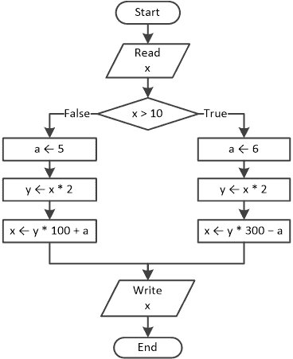

3)使用更少的语句重写以下 Python 程序。

a = float(input())

if a < 1:

y = 5 + a

print(y)

elif a < 5:

y = 23 / a

print(y)

elif a < 10:

y = 5 * a

print(y)

else:

print("错误！")

4)使用逻辑运算符重写以下 Python 程序。

day = int(input())

month = int(input())

name = input()

if day == 16:

if month == 2:

> if name == "Loukia":
> 
> > print("生日快乐！！！")
> > 
> else:
> 
> > print("没有匹配！")

else:

> print("没有匹配！")

else:

print("没有匹配！")

5)一位老师要求她的学生重写以下 Python 程序，不使用逻辑运算符。

a = float(input())

b = float(input())

c = float(input())

if a > 10 and c < 2000:

d = (a + b + c) / 12

print("结果是：", d)

else:

print("错误！")

一名学生编写了以下 Python 程序：

a = float(input())

b = float(input())

c = float(input())

if a > 10:

if c < 2000:

> d = (a + b + c) / 12
> 
> print("结果是：", d)

else:

> print("错误！")

确定程序对于所有可能的路径是否与老师提供的程序操作方式相同。如果不相同，尝试修改它并使其以相同的方式工作。

6)使用单分支决策结构重写以下 Python 程序。

a = float(input())

b = float(input())

c = float(input())

if a > 10:

if b < 2000:

> if c != 10:
> 
> > d = (a + b + c) / 12
> > 
> > print("结果是：", d)

else:

print("错误！")

7)在以下 Python 程序中，将两个单分支决策结构替换为一个双分支决策结构。

a = int(input())

y = 3

if a > 0:

y = y * a

b = int(input())

if not(a <= 0):

print("你好，宙斯")

print(y, b)

8)使用一个双分支决策结构重写以下 Python 程序。

a = float(input())

y = 0

if a > 0:

y = y + 7

b = float(input())

if not(a > 0):

print("你好，宙斯")

if a <= 0:

print(abs(a))

print(y)

9)根据 2013 年的研究，平板电脑上最受欢迎的操作系统是 iOS，其次是 Android，最后是微软 Windows。在以下 Python 程序中，重新排列布尔表达式，使程序在大多数情况下运行更高效。

os = input("你的平板电脑的操作系统是什么？")

if os == "Windows":

print("微软")

elif os == "iOS":

print("苹果")

elif os == "Android":

print("谷歌")
