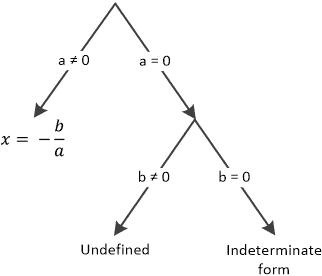
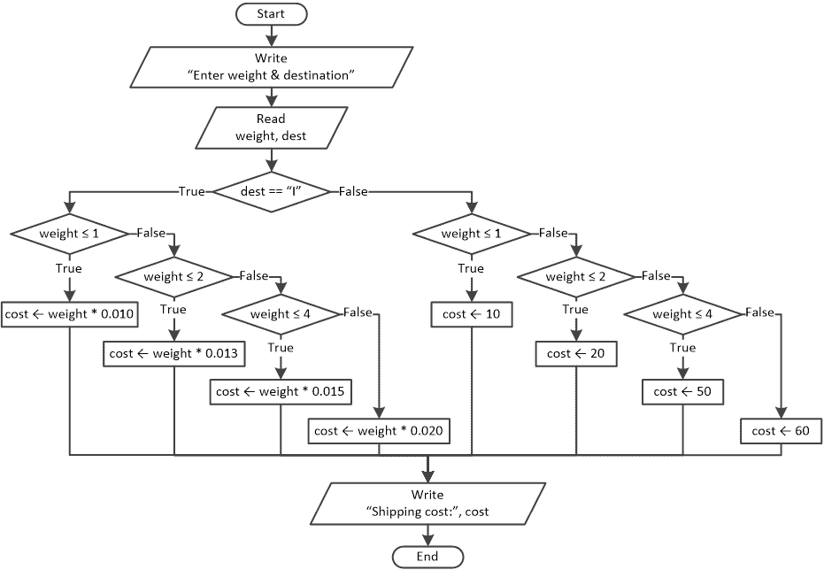

## 第二十二章

更多关于决策控制结构的内容

### 22.1 使用决策控制结构的简单练习

#### 练习 22.1-1 它是一个整数吗？

编写一个 Python 程序，提示用户输入一个数字，然后显示一条消息，指出这个数字的数据类型是整数还是实数。

解答

人们都知道，一个数如果没有小数部分，那么它就是一个整数。在 Python 中，你可以使用 int()函数来获取任何实数的整数部分。如果用户提供的数字等于它的整数部分，那么这个数就被认为是整数。

例如，如果用户输入数字 7，这个数字和它的整数部分 int(7)是相等的。

另一方面，如果用户输入数字 7.3，这个数字和它的整数部分 int(7.3)是不相等的。

Python 程序如下所示。

 file_22.1-1

x = float(input("请输入一个数字："))

if x == int(x):

print(x, "是整数")

else:

print(x, "是实数")

请注意，在数据输入阶段使用了 float()函数。这是必要的，以便允许用户输入整数或浮点数。

#### 练习 22.1-2 验证数据输入并找出奇数和偶数

设计一个流程图并编写相应的 Python 程序，提示用户输入一个非负整数，然后显示一条消息，指出这个数是偶数；如果不是，则显示“Odd”。此外，如果用户输入负值或浮点数，必须显示错误信息。

（这个练习让你在数据验证方面有所练习）。

解答

数据验证是限制数据输入的过程，迫使用户只能输入有效的值。

在这个练习中，你需要提示用户输入一个非负整数，如果他们输入负值或浮点数，则显示错误信息。解决这个练习的一般形式的流程图如下。

以下决策控制结构来自练习 17.1-4。它测试变量 x 是偶数还是奇数。

将两个流程图合并后，最终的流程图如下所示。

Python 程序如下所示。

 file_22.1-2a

x = float(input("请输入一个整数："))

if x < 0 or x != int(x):

print("Invalid Number")

else:

if x % 2 == 0:

> print("Even")

else:

> print("Odd")

除了使用嵌套决策结构外，你还可以使用多选决策结构，如下所示。

 file_22.1-2b

x = float(input("请输入一个整数："))

if x < 0 or x != int(x):

print("Invalid Number")

elif x % 2 == 0:

print("Even")

else:

print("Odd")

#### 练习 22.1-3 收费员在哪里？

在收费站，有一个自动系统可以识别通过的车辆是摩托车、汽车还是卡车。编写一个 Python 程序，让用户输入车辆的类型（M 表示摩托车，C 表示汽车，T 表示卡车），然后根据以下表格显示司机必须支付的费用。

| Vehicle Type | Amount to Pay |
| --- | --- |
| Motorcycle | $1 |
| Car | $2 |
| Track | $4 |

程序必须能够在输入小写字母时正常工作。例如，程序必须对“M”或“m”都正常工作。然而，如果用户输入的字符不是 M、C 或 T（无论是大写还是小写），必须显示错误信息。

(Some more practice with data validation!)

Solution

这个问题的解决方案相当简单。唯一需要注意的事情是用户可能会输入大写字母 M、C 或 T，或者小写字母 m、c 或 t。程序需要接受这两种情况。为了处理这种情况，你可以使用 upper()方法将用户的输入转换为大写。然后你需要检查大写的 M、C 或 T 字符。

这里展示了 Python 程序。

 file_22.1-3a

v = input().upper()

if v not in ["M", "C", "T"]:    #只需检查大写 M、C 和 T

print("Invalid vehicle")

elif v == "M":

print("You need to pay $1")

elif v == "C":

print("You need to pay $2")

elif v == "T":

print("You need to pay $4")

注意 Python 如何将用户的输入转换为大写。

然而，如果你将多分支决策结构中的第一个情况移动到最后，就像这里所示，这个练习可以稍微高效地解决。

 file_22.1-3b

v = input().upper()

if v == "M":

print("You need to pay $1")

elif v == "C":

print("You need to pay $2")

elif v == "T":

print("You need to pay $4")

else:

print("Invalid vehicle")

#### Exercise 22.1-4 The Most Scientific Calculator Ever!

编写一个 Python 程序来模拟电子计算器的功能。程序必须首先提示用户输入一个数字，然后输入操作类型（+、−、*、/），最后输入第二个数字。随后，程序必须执行所选操作并显示结果。然而，如果用户输入的操作数不是+、−、*或/，必须显示错误信息。

Solution

在这个练习中，你需要注意的唯一事情是用户可能会输入除数（第二个数字）为零的可能性。正如你所知，从数学的角度来看，除以零是不可能的。

以下 Python 程序使用多分支决策结构来检查操作类型。

 file_22.1-4

a = float(input("Enter 1st number: "))

op = input("Enter type of operation: ")    #变量 op 是字符串类型

b = float(input("Enter 2nd number: "))

if op == "+":

print(a + b)

elif op == "-":

print(a - b)

elif op == "*":

print(a * b)

elif op == "/":

if b == 0:

> print("Error: Division by zero")

else:

> print(a / b)

else:

print("Error: Invalid operand")

#### 练习 22.1-5 将加仑转换为升，反之亦然

编写一个 Python 程序，显示以下菜单：

1)将加仑转换为升

2)将升转换为加仑

程序必须提示用户输入一个选择（1 或 2）和数量，然后计算并显示所需值。已知

1 加仑 = 3.785 升

解答

Python 程序如下所示。

 file_22.1-5

COEFFICIENT = 3.785

print("1: Gallons to liters")

print("2: Liters to gallons")

choice = int(input("Enter choice: "))

quantity = float(input("Enter quantity: "))

if choice == 1:

result = quantity * COEFFICIENT

print(quantity, "gallons =", result, "liters")

else:

result = quantity / COEFFICIENT

print(quantity, "liters =", result, "gallons")

#### 练习 22.1-6 将加仑转换为升，反之亦然（带有数据验证）

将上一个练习的 Python 程序重写为验证数据输入。当用户输入的选择不是 1 或 2，或输入的汽油数量为负数时，必须显示不同类型的输入错误消息。

解答

以下 Python 程序以通用形式给出，用于解决此练习。它提示用户输入一个选择。如果选择无效，则显示错误消息；否则，它提示用户输入数量。然而，如果输入的数量也无效，则显示另一个错误消息；否则，它根据用户的选择进行数据转换。

 主代码

COEFFICIENT = 3.785

print("1: Gallons to liters")

print("2: Liters to gallons")

choice = int(input("Enter choice: "))

if choice not in [1, 2]:

print("Wrong choice!")

else:

quantity = float(input("Enter quantity: "))

if quantity < 0:

> print("Invalid quantity!")

else:

> 代码片段 1：根据用户选择将加仑转换为升或升转换为加仑。

以下代码片段 1 是从上一个练习（练习 22.1-5）中提取的。它根据用户的选择将加仑转换为升，或将升转换为加仑。

 代码片段 1

if choice == 1:

result = quantity * COEFFICIENT

print(quantity, "gallons =", result, "liters")

else:

result = quantity / COEFFICIENT

print(quantity, "liters =", result, "gallons")

在将代码片段 1 嵌入主代码后，最终的 Python 程序变为

 file_22.1-6

COEFFICIENT = 3.785

print("1: Gallons to liters")

print("2: Liters to gallons")

choice = int(input("Enter choice: "))

if choice not in [1, 2]:

print("Wrong choice!")

else:

quantity = float(input("Enter quantity: "))

if quantity < 0:

> print("Invalid quantity!")

else:

> if choice == 1:                           [[更多…]](more.html#more_22_1_6_1)
> 
> > result = quantity * COEFFICIENT
> > 
> > print(quantity, "gallons =", result, "liters")
> > 
> else:
> 
> > result = quantity / COEFFICIENT
> > 
> > print(quantity, "升 =", result, "加仑")

### 22.2 使用决策控制结构查找最小值和最大值

假设有一些人，你想找到最轻的那个人。假设他们一个接一个地来告诉你他们的体重。你必须做的是，记住第一个来的人的体重，对于每个新来的人，你必须将他/她的体重与你记住的体重进行比较。如果他/她更重，你忽略他的体重。然而，如果他/她更轻，你需要忘记之前的体重并记住新的体重。同样的程序会继续进行，直到所有的人都来过。

让我们随机让四个人来。假设他们的体重，按出现的顺序，是 165 磅、170 磅、160 磅和 180 磅。

| 程序 | 你心中变量 minimum 的值！ |
| --- | --- |
| 第一个人来了。他重 165 磅。记住他的体重（想象一个名为 minimum 的变量）。 | minimum = 165 |
| 第二个人来了。他重 170 磅。他的体重不比你保存在变量 minimum 中的重量轻，所以你必须忽略他的体重。你心中的变量 minimum 仍然包含值 165。 | minimum = 165 |
| 第三个人来了。他重 160 磅，这个重量小于你保存在变量 minimum 中的重量，所以你必须忘记之前的值，并将变量 minimum 中的值保持为 160。 | minimum = 160 |
| 第四个人来了。他重 180 磅。他的体重不比你保存在变量 minimum 中的重量轻，所以你必须忽略他的体重。你心中的变量 minimum 仍然包含值 160。 | minimum = 160 |

当程序完成时，你心中的变量 minimum 包含了最轻人的体重！

以下是流程图和相应的 Python 程序，该程序提示用户输入四个人的体重，然后找到并显示最轻的体重。

.

 file_22.2

print("请输入四个人的体重：")

w1 = int(input())

w2 = int(input())

w3 = int(input())

w4 = int(input())

#记住第一个人的体重

minimum = w1

#如果第二个人更轻，忘记之前的值

#记住第一个人的体重

if w2 < minimum:

minimum = w2

#如果第三个人更轻，忘记之前的值

#记住第一个人的体重

if w3 < minimum:

minimum = w3

#如果第四个人更轻，忘记之前的值

#记住第一个人的体重

if w4 < minimum:

minimum = w4

print(minimum)

请注意，这个程序试图找出最低值，而不是这个值实际分配给了哪个变量。

你可以通过将所有布尔表达式中的“小于”运算符替换为“大于”运算符来找到最大值而不是最小值。

#### 练习 22.2-1 找到最重的人的名字

编写一个 Python 程序，提示用户输入三个人的体重和姓名，然后显示最重的人的姓名和体重。

解决方案

在这个练习中，除了最大体重外，还需要将实际拥有该体重的人的名字存储在另一个变量中。Python 程序如下所示。

 file_22.2-1

w1 = int(input("输入第一个人的体重："))

n1 = input("输入第一个人的名字：")

w2 = int(input("输入第二个人的体重："))

n2 = input("输入第二个人的名字：")

w3 = int(input("输入第三个人的体重："))

n3 = input("输入第三个人的名字：")

maximum = w1    #记住体重

mName = n1      #以及第一个人的名字。

if w2 > maximum:    #如果第二个人更重，则忽略之前的值，并

maximum = w2    #记住体重

mName = n2      #以及第二个人的名字。

if w3 > maximum:    #如果第三个人更重，则忽略之前的值，并

maximum = w3    #记住体重

mName = n3      #以及第三个人的名字。

print("体重最重的人是", mName)

print("他们的体重是", maximum)

如果两个体重最重的人恰好体重相同，则找到并显示第一个人的名字。

### 22.3 决策控制结构在解决数学问题中的应用

#### 练习 22.3-1 求 y 的值

设计一个流程图并编写相应的 Python 程序，以找到并显示以下公式的 y 值（如果可能）。

.

解答

在这个练习中，防止用户输入 0 或 4 的值至关重要，因为这些值会导致分母为零。因此，程序需要考虑这些限制。流程图如下所示。

以及 Python 程序如下所示。

 file_22.3-1

x = float(input())

if x == 0 or x == 4:

print("错误：除以零！")

else:

y = (5 + x) / x + (x + 9) / (x - 4)

print(y)

#### 练习 22.3-2 求 y 的值

设计一个流程图并编写相应的 Python 程序，以找到并显示以下公式的 y 值（如果可能）。

.

解答

该公式有两个不同的结果。

►当 x 大于或等于零时，中 y 的值可以按照前一个练习中所示的方法找到。

►然而，对于小于零的 x，一个小的细节可以节省你一些代码行。仔细观察后，很明显，分数没有限制，因为 x 永远不会是+5；因此，分母永远不会为零。这是因为给定的公式中 x 小于零！

流程图如下所示。

该 Python 程序如下所示。

 file_22.3-2

x = float(input())

if x >= 0:

if x == 0 or x == 3:

> print("错误：除以零！")

else:

> y = (7 + x) / (x - 3) + (3 - x) / x
> 
> print(y)

else:

y = 40 * x / (x - 5) + 3

print(y)

#### 练习 22.3-3 解线性方程 ax + b = 0

设计一个流程图并编写相应的 Python 程序，以找到并显示线性方程的根

ax + b = 0

解答

在方程 ax + b = 0 中，系数 a 和 b 是已知的实数，x 代表要找到的未知量。因为 x 是一次幂，所以这个方程被归类为一次方程，也称为线性方程。

方程的根是满足这个方程的 x 的值；也就是说，等式 ax + b 的左边等于零。

在这个练习中，用户必须输入系数 a 和 b 的值，程序必须找到使得 ax + b 等于零的 x 的值。

当解方程 ax + b = 0 时，对于 x 的解变为 x = −b / a。根据用户输入的数据，可能出现三种可能的情况：

i)用户可能输入系数 a 的值为 0，而系数 b 的值为非零值。在这种情况下，x = −b / a 的结果是未定义的。正如您从数学中已经知道的，除以零是无法进行的。

ii)用户可能输入系数 a 和 b 的值都为 0。在这种情况下，x = −b / a 的结果没有定义的值，这被称为不定形式。

iii)用户可能输入任何其他一对值。

下面使用多重选择决策结构表示这三种情况和相应的路径。

这里展示了 Python 程序。

 file_22.3-3

print("输入系数 a 和 b 的值")

a, b = float(input()), float(input())

if a != 0:

x = -b / a

print(x)

elif b != 0:

print("未定义")

else:

print("不定形式")

#### 练习 22.3-4 解二次方程 ax² + bx + c = 0

设计一个流程图并编写相应的 Python 程序，以找到并显示二次方程的根

ax² + bx + c = 0

解答

在方程 ax² + bx + c = 0 中，系数 a、b 和 c 是已知的实数，x 代表要找到的未知量。因为 x 是平方的，所以这个方程被归类为二次方程，也称为二次方程。

方程的根是满足这个方程的 x 的值；也就是说，等式 ax² + bx + c 的左边等于零。

在这个练习中，用户必须输入系数 a、b 和 c 的值，程序必须找到使得 ax² + bx + c 等于零的 x 的值。

根据系数 a 的值，这个问题可以分为两个独立的子问题。

i)如果系数 a 不等于零，可以使用判别式 D 找到方程的根。请注意，下面这个练习的解决方案在 D < 0 时找不到复数根；这超出了本书的范围。

ii)如果系数 a 等于零，方程变为线性方程 bx + c = 0，其解已在之前的练习中提供（练习 22.3-3）。

所有必要的路径都显示在此处。

右侧路径（a = 0）是线性方程 bx + c = 0 的解。

使用此图可以设计以下流程图。

The Python program is shown here.

 file_22.3-4

from math import sqrt

print("输入系数 a，b 和 c 的值")

a, b, c = float(input()), float(input()), float(input())

if a != 0:

D = b ** 2 - 4 * a * c

if D >= 0:

> if D > 0:
> 
> > x1 = (-b + sqrt(D)) / (2 * a)
> > 
> > x2 = (-b - sqrt(D)) / (2 * a)
> > 
> > print("Roots:", x1, ",", x2)
> > 
> else:
> 
> > x = -b / (2 * a)
> > 
> > print("One double root:", x)

else:

> print("Complex Roots")

else:

if b != 0:

> x = -c / b
> 
> print("Root:", x)

elif c != 0:

> print("Undefined")

else:

> print("Indeterminate form")

### 22.4 使用连续值范围的练习

正如您已经看到的，在许多问题中，变量的值或表达式的结果可以定义必须执行哪个语句或语句块。在接下来的练习中，您将学习如何测试一个值或表达式的结果是否属于特定的值范围（一系列连续的值范围）。

假设您想显示一条消息，指示女性在不同温度下可能穿的衣服类型。

| 室外温度（华氏度） | 女性可能穿的衣服类型 |
| --- | --- |
| 温度 < 45 | 毛衣，大衣，牛仔裤，衬衫，鞋子 |
| 45 ≤ 温度 < 65 | 毛衣，牛仔裤，夹克，鞋子 |
| 65 ≤ 温度 < 75 | 七分裤，短裤，T 恤，无袖衫，人字拖，运动鞋 |
| 75 ≤ 温度 | 短裤，T 恤，无袖衫，半身裙，裙子，人字拖 |

初看起来，单分支决策结构可能似乎是逻辑选择。虽然并不错误，但更深入的分析揭示，每个条件都是相互依赖的，这意味着当其中一个评估为 True 时，其他都不应该被评估。您需要从一组可能性中选择一个替代方案。

解决此类练习，您可以使用多分支决策结构或嵌套决策控制结构。然而，前者是最佳选择，因为它更方便，并且可以提高可读性，正如您在下面的代码片段中可以看到。

if 温度 < 45:

print("毛衣，大衣，牛仔裤，衬衫，鞋子")

elif 温度 >= 45 且 温度 < 65:

print("毛衣，牛仔裤，夹克，鞋子")

elif 温度 >= 65 且 温度 < 75:

print("七分裤，短裤，T 恤，无袖衫，人字拖，运动鞋")

elif 温度 >= 75:

print("短裤，T 恤，无袖衫，半身裙，裙子，人字拖")

然而，仔细检查后，很明显所有下划线的布尔表达式实际上并不需要。例如，如果第一个布尔表达式（temperature < 45）评估为 False，则执行流程将继续评估第二个布尔表达式。然而，由于第一个布尔表达式已经评估为 False，变量 temperature 肯定大于或等于 45。因此，当评估布尔表达式 temperature >= 45 时，肯定为 True，因此可以省略。相同的逻辑适用于所有情况；可以省略所有下划线的布尔表达式。最终的代码片段如下，已移除所有不必要的评估。

if temperature < 45:

print("毛衣，外套，牛仔裤，衬衫，鞋子")

elif temperature < 65:

print("毛衣，牛仔裤，夹克，鞋子")

elif temperature < 75:

print("七分裤，短裤，T 恤，无袖衫，人字拖，运动鞋")

else:

print("短裤，T 恤，无袖衫，半身裙，裙子，人字拖")

#### 练习 22.4-1 计算折扣

根据客户订单的总金额，客户将获得相应的折扣。如果订单总金额少于 30 美元，则不提供折扣。如果订单总金额等于或大于 30 美元且小于 70 美元，则应用 5%的折扣。如果订单总金额等于或大于 70 美元且小于 150 美元，则应用 10%的折扣。如果订单总金额为 150 美元或更多，则客户将获得 20%的折扣。编写一个 Python 程序，提示用户输入订单总金额，然后计算并显示应用的折扣率、折扣金额（美元）和折扣后的最终金额。假设用户输入的金额为非负值。

解答

以下表格总结了提供的各种折扣。

| 范围 | 折扣 |
| --- | --- |
| amount < $30 | 0% |
| $30 ≤ amount < $70 | 5% |
| $70 ≤ amount < $150 | 10% |
| $150 ≤ amount | 20% |

Python 程序如下。

 file_22.4-1a

amount = float(input("输入总金额: "))

if amount < 30:

discount = 0

elif amount >= 30 and amount < 70:

discount = 5

elif amount >= 70 and amount < 150:

discount = 10

elif amount >= 150:

discount = 20

discountAmount = amount * discount / 100

finalAmount = amount - discountAmount

print("您获得了", discount, "%的折扣", sep = "")

print("您节省了 $", discountAmount, sep = "")

print("您必须支付 $", finalAmount, sep = "")

然而，由于已知用户输入的是有效值而非负值，因此所有下划线的布尔表达式实际上并不需要。最终的 Python 程序如下，已移除所有不必要的评估。

 file_22.4-1b

amount = float(input("输入总金额: "))

if amount < 30:

discount = 0

elif amount < 70:

discount = 5

elif amount < 150:

discount = 10

else:

discount = 20

discountAmount = amount * discount / 100

finalAmount = amount - discountAmount

print("您获得了", discount, "%的折扣", sep = "")

print("您节省了$", discountAmount, sep = "")

print("您必须支付$", finalAmount, sep = "")

#### 练习 22.4-2 验证数据输入和计算折扣

将之前练习的 Python 程序重写为验证数据输入。当用户输入负值时，必须显示错误信息。

解决方案

解决这个练习的 Python 程序以一般形式给出如下。

 主代码

amount = float(input("输入总金额: "))

if amount < 0:

print("输入的值是负数")

else:

代码片段 1：计算并显示应用的折扣率、折扣金额和折扣后的最终金额。

以下代码片段 1 来自之前的练习(练习 22.4-1)。它计算并显示应用的折扣率、折扣金额（美元）以及折扣后的最终金额。

 代码片段 1

if amount < 30:

discount = 0

elif amount < 70:

discount = 5

elif amount < 150:

discount = 10

else:

discount = 20

discountAmount = amount * discount / 100

finalAmount = amount - discountAmount

print("您获得了", discount, "%的折扣", sep = "")

print("您节省了$", discountAmount, sep = "")

print("您必须支付$", finalAmount, sep = "")

在将代码片段 1 嵌入主代码后，最终的 Python 程序变为

 file_22.4-2

amount = float(input("输入总金额: "))

if amount < 0:

print("输入的值是负数")

else:

if amount < 30:                                 [[更多…]](more.html#more_22_4_2_1)

> discount = 0

elif amount < 70:

> discount = 5

elif amount < 150:

> discount = 10

else:

> discount = 20

discountAmount = amount * discount / 100

finalAmount = amount - discountAmount

print("您获得了", discount, "%的折扣", sep = "")

print("您节省了$", discountAmount, sep = "")

print("您必须支付$", finalAmount, sep = "")

#### 练习 22.4-3 发送包裹

在邮局，发送中等包裹的运费取决于其重量以及目的地是否在国内。运费根据以下表格计算。

| 包裹重量（磅） | 国内目的地（每磅美元） | 国外目的地（美元） |
| --- | --- | --- |
| weight ≤ 1 | $0.010 | $10 |
| 1 < weight ≤ 2 | $0.013 | $20 |
| 2 < weight ≤ 4 | $0.015 | $50 |
| 4 < weight | $0.020 | $60 |

设计一个流程图并编写相应的 Python 程序，提示用户输入包裹的重量及其目的地（I：国内，O：国外）然后计算并显示运费。

解决方案

以下流程图以一般形式给出，解决了这个练习。

现在你需要两个多分支决策结构来计算国内和国内外的包裹的运费。这些分别显示在下方的左侧和右侧流程图片段中。

将这两个流程图与之前的流程图合并后，最终的流程图变为

相应的 Python 程序如下所示。

 file_22.4-3

print("请输入重量和目的地：")

weight = float(input())

dest = input()

if dest.upper() == "I":

if weight <= 1:    [[更多…]](more.html#more_22_4_3_1)

> cost = weight * 0.010

elif weight <= 2:

> cost = weight * 0.013

elif weight <= 4:

> cost = weight * 0.015

else:

> cost = weight * 0.020

else:

if weight <= 1:    [[更多…]](more.html#more_22_4_3_2)

> cost = 10

elif weight <= 2:

> cost = 20

elif weight <= 4:

> cost = 50

else:

> cost = 60

print("运费：", cost)

用户可以以小写或大写形式输入字母 I（表示目的地）。upper() 方法确保程序在两种情况下都能正确执行。

#### 练习 22.4-4 求解 y 的值

设计一个流程图并编写相应的 Python 程序，以找到并显示以下公式的 y 值（如果可能）。

解答

在这个练习中，对分数有两个限制：

►在分数  中，x 的值不能为 −1。

►在分数  中，x 的值不能为 +9。

对于所有其他分数，由于 x 所属的范围，分母不可能设置为 0。

Python 程序如下所示。

 file_22.4-4a

x = float(input("请输入 x 的值："))

if x > -5 and x <= 0:

if x != -1:                   [[更多…]](more.html#more_22_4_4_a1)

> y = x / (x - 3) + (8 + x) / (x + 1)
> 
> print(y)

else:

> print("无效值")

elif x > 0 and x <= 6:

y = 40 * x / (x - 8)        [[更多…]](more.html#more_22_4_4_a2)

print(y)

elif x > 6 and x <= 20:

if x != 9:             [[更多…]](more.html#more_22_4_4_a3)

> y = 3 * x / (x - 9)
> 
> print(y)

else:

> print("无效值")

else:

y = abs(x)      [[更多…]](more.html#more_22_4_4_a4)

print(y)

如果你想知道是否可以移除所有的 print(y) 语句，并在程序末尾只保留一个 print(y) 语句，答案是“不可以”。由于存在不包含该语句的路径，你必须在每个必要的路径中都包含它。然而，通过稍微修改代码并在开始时检查无效值，你可以有机会将 print(y) 语句移动到所有路径的末尾。修改后的 Python 程序如下所示。

 file_22.4-4b

x = float(input("请输入 x 的值："))

if x == -1 or x == 9:

print("无效值")

else:

if x > -5 and x <= 0:

> y = x / (x - 3) + (8 + x) / (x + 1)

elif x > 0 and x <= 6:

> y = 40 * x / (x - 8)

elif x > 6 and x <= 20:

> y = 3 * x / (x - 9)

else:

> y = abs(x)

print(y)

现在，你可能想知道下划线的布尔表达式是否是多余的，对吧？假设你移除了它们，并且用户输入了 x 的值为-20。执行流程随后会到达布尔表达式 x <= 0，这将评估为 True。这意味着将计算的分数而不是 x 的绝对值。

为了能够移除下划线的布尔表达式，你需要对代码进行轻微的修改。关键在于首先检查 x 的绝对值的情况。在此之后，你可以找到一个提出的解决方案。

 file_22.4-4c

x = float(input("Enter a value for x: "))

if x == -1 or x == 9:

print("Invalid value")

else:

if x <= -5 or x > 20:

> y = abs(x)

elif x <= 0:

> y = x / (x - 3) + (8 + x) / (x + 1)

elif x <= 6:

> y = 40 * x / (x - 8)

else:

> y = 3 * x / (x - 9)

print(y)

显然，一个问题可以有多个解决方案。取决于你找到最优解！

#### 练习 22.4-5 递增费率和电力消耗

LAV 电力公司根据以下表格（家庭账户的月度费率）向用户收取电费。假设所有额外费用，如传输服务费和分配费都已包括在内。

| 千瓦时（kWh） | 美元/千瓦时 |
| --- | --- |
| 千瓦时（kWh）≤ 500 | 美元/千瓦时 $0.10 |
| 501 ≤ kWh ≤ 2000 | 美元/千瓦时 $0.25 |
| 2001 ≤ kWh ≤ 4500 | 美元/千瓦时 $0.40 |
| 4501 ≤ kWh | 美元/千瓦时 $0.60 |

编写一个 Python 程序，提示用户输入消耗的总千瓦时数，然后计算并显示应付的总金额。

请注意，费率是递增的。

Solution

递增费率这个术语意味着当客户消耗，例如，2200 千瓦时时，并不是所有的千瓦时都按$0.40 收费。前 500 千瓦时按$0.10 收费，接下来的 1500 千瓦时按$0.25 收费，只有最后的 200 千瓦时按$0.40 收费。因此，客户必须支付

500 × $0.10 + 1500 × $0.25 + 200 × $0.40 = $505

应用相同的逻辑，当客户消耗，比如说，4800 千瓦时时，应付的总金额可以按以下方式计算。前 500 千瓦时按$0.10 收费，接下来的 1500 千瓦时按$0.25 收费，接下来的 2500 千瓦时按 0.40 收费，只有最后 300 千瓦时按$0.60 收费。因此，客户必须支付

500 × $0.10 + 1500 × $0.25 + 2500 × $0.40 + 300 × $0.60 = $1605

下面的图表可以帮助你完全理解如何在费率递增时计算应付的总金额。

这里展示了 Python 程序。

 file_22.4-5

kwh = int(input("Enter number of Kilowatt-hours consumed: "))

if kwh <= 500:

t = kwh * 0.10

elif kwh <= 2000:

t = 500 * 0.10 + (kwh - 500) * 0.25

elif kwh <= 4500:

t = 500 * 0.10 + 1500 * 0.25 + (kwh - 2000) * 0.40

else:

t = 500 * 0.10 + 1500 * 0.25 + 2500 * 0.4 + (kwh - 4500) * 0.60

print("Total amount to pay:", t)

#### 练习 22.4-6 累进费率和短信服务

LAV 手机公司每月向客户收取$8 的基本费率以发送短信。根据发送的短信总数，将收取额外费用，如下表所示。

| 发送短信数量 | 每条短信费用 |
| --- | --- |
| 50 以内 | 免费服务 |
| 51-150 | $0.05 |
| 151 及以上 | $0.10 |

联邦、州和地方税将使每张账单增加 10%。

编写一个 Python 程序，提示用户输入发送的短信数量，然后计算并显示总支付金额。

请注意，费率是累进的。

解决方案

Python 程序如下所示。

 file_22.4-6

count = int(input("输入发送的短信数量："))

if count <= 50:

extra = 0

elif count <= 150:

extra = (count - 50) * 0.05

else:

extra = 100 * 0.05 + (count - 150) * 0.10

totalWithoutTaxes = 8 + extra         #添加基本费率$8

taxes = totalWithoutTaxes * 10 / 100  #计算总税费

total = totalWithoutTaxes + taxes     #计算总支付金额

print("总支付金额：", total)

### 22.5 节 练习：带有决策控制结构的通用练习

#### 练习 22.5-1 寻找闰年

编写一个 Python 程序，提示用户输入年份，然后显示消息指示它是否是闰年；如果不是，则显示消息“不是闰年”。此外，如果用户输入的年份小于 1582，必须显示错误消息。

(注意，这涉及到数据验证！)

解决方案

根据公历，公历首次于 1582 年引入，一个年份是闰年当且仅当以下条件之一满足：

第一个条件：年份能被 4 整除，但不能被 100 整除。

第二个条件：年份能被 400 整除。

在以下表中，一些年份不是闰年，因为两个条件都没有评估为真。

| 年份 | 闰年 | 条件 |
| --- | --- | --- |
| 1600 | 是 | 第二个条件为真。它能被 400 整除 |
| 1900 | 否 | 两个条件均为假。 |
| 1904 | 是 | 第一个条件为真。它能被 4 整除，但不能被 100 整除 |
| 1905 | 否 | 两个条件均为假。 |
| 2000 | 是 | 第二个条件为真。它能被 400 整除 |
| 2002 | 否 | 两个条件均为假。 |
| 2004 | 是 | 第一个条件为真。它能被 4 整除，但不能被 100 整除 |
| 2024 | 是 | 第一个条件为真。它能被 4 整除，但不能被 100 整除 |

Python 程序如下所示。

 file_22.5-1

y = int(input("输入年份："))

if y < 1582:

print("错误！年份不能小于 1582")

else:

if y % 4 == 0 and y % 100 != 0 or y % 400 == 0:

> print("闰年！")

else:

> print("不是闰年")

与或运算符的优先级高于或运算符。

#### 练习 22.5-2 显示月份中的天数

编写一个 Python 程序，提示用户输入一个年份和一个月份，然后显示该月有多少天。程序需要考虑闰年。如果是闰年，二月有 29 天而不是 28 天。此外，如果用户输入的年份小于 1582，必须显示错误消息。

解决方案

给定的以下 Python 程序以一般形式解决了这个练习。

 主代码

y = int(input("Enter a year: "))

if y < 1582:

print("Error! The year cannot be less than 1582")

else:

m = int(input("Enter a month (1 - 12): "))

if m == 2:

> 代码片段 1：检查变量 y 表示的年份是否为闰年，并显示二月有多少天。

elif m in [4, 6, 9, 11]:

> print("This month has 30 days")

else:

> print("This month has 31 days")

代码片段 1，在此处显示，检查变量 y 表示的年份是否为闰年，并显示二月有多少天。

 代码片段 1

if y % 4 == 0 and y % 100 != 0 or y % 400 == 0:

print("This month has 29 days")

else:

print("This month has 28 days ")

在将代码片段 1 嵌入主代码后，最终的 Python 程序变为

sentence = input("Enter a sentence: ")

y = int(input("Enter a year: "))

if y < 1582:

print("Error! The year cannot be less than 1582")

else:

m = int(input("Enter a month (1 - 12): "))

if m == 2:

> if y % 4 == 0 and y % 100 != 0 or y % 400 == 0:   [[更多…]](more.html#more_22_5_2_1)
> 
> > print("This month has 29 days")
> > 
> else:
> 
> > print("This month has 28 days ")

elif m in [4, 6, 9, 11]:

> print("This month has 30 days")

else:

> print("This month has 31 days")

#### 练习 22.5-3 检查正确的首字母大写和标点符号

编写一个 Python 程序，提示用户输入一个句子，然后检查其正确的首字母大写和标点符号。程序必须确定字符串是否以大写字母开头并以标点符号结尾（仅检查句号、问号和感叹号）。

解决方案

在这个练习中，你需要隔离字符串的第一个和最后一个字符。正如你所知，你可以使用子串表示法访问字符串中的任何单个字符。你可以使用索引 0 来访问第一个字符，索引 1 来访问第二个字符，依此类推。另一方面，你可以使用索引-1 来访问最后一个字符，索引-2 来访问倒数第二个字符，依此类推。

因此，你可以使用以下 Python 语句隔离字符串 sentence 的第一个字符

firstChar = sentence[0]

并且使用以下 Python 语句获取最后一个字符

lastChar = sentence[−1]

此处显示了 Python 程序。

 file_22.5-3a

 file_22.5-2

firstChar = sentence[0]  #Get first character

lastChar = sentence[-1]  #Get last character

sentenceIsOkay = True

if firstChar != firstChar.upper():

sentenceIsOkay = False

elif lastChar not in [".", "?", "!"]:

sentenceIsOkay = False

if sentenceIsOkay == True:

print("句子正确！")

在开始时，程序假设句子是正确的（sentenceIsOkay = True）。然后，它检查正确的首字母大写和正确的标点符号，如果发现有问题，它将 False 赋值给变量 sentenceIsOkay。

然而，另一种更 Pythonic 的方法如下所示。

 file_22.5-3b

sentence = input("输入一个句子：")

if sentence[0] == sentence[0].upper() and sentence[-1] in [".", "?", "!"]:

print("句子正确！")

#### 练习 22.5-4 判断数字是否为回文？

回文是一个在反转其位数后仍然相同的数字。例如，数字 13631 是一个回文。编写一个 Python 程序，让用户输入一个五位数整数，并测试这个数字是否是回文。此外，当用户输入浮点数或任何少于或超过五位数的整数时，必须显示不同类型的输入错误的不同错误消息。

（注意，这涉及到数据验证！）

解决方案

实际上存在三种不同的方法！第一种方法将数字的位数分成五个不同的变量，而第二种和第三种方法将数字作为字符串处理。让我们分析一下它们所有！

第一种方法

要测试用户是否输入了回文数，你需要将其位数分成五个不同的变量，就像你在第十三章中学到的那样。然后，你可以检查第一个数字是否等于第五个数字，第二个数字是否等于第四个数字。如果这个条件评估为 True，则该数字是回文。

为了验证数据输入，你需要检查用户是否输入了一个五位数。请记住，所有五位数都在 10000 到 99999 的范围内。因此，你只需将数据输入限制在这个范围内即可。

为了显示许多不同的错误消息，最佳实践是使用多重选择决策结构，首先检查所有情况下的数据输入有效性，然后尝试解决所需的问题。例如，如果你需要检查各种错误，你可以做如下操作。

以下是将 x 的位数分成 5 个不同变量的 Python 程序。

 file_22.5-4a

x = float(input())

if x != int(x):

print("您输入了浮点数")

elif x < 10000:

print("您输入了少于五位数的数字")

elif x > 99999:

print("您输入了超过五位数的数字")

else:

# 将 x 的位数分成 5 个不同的变量

digit1, r = divmod(x, 10000)

digit2, r = divmod(r, 1000)

digit3, r = divmod(r, 100)

digit4, digit5 = divmod(r, 10)

if digit1 == digit5 and digit2 == digit4:

> print("是回文")

else:

> print("不是回文")

第二种方法

这种方法将数字视为字符串。它将第一个字符与最后一个字符进行比较，将第二个字符与倒数第二个字符进行比较。如果它们相等，则意味着该数字是回文。Python 程序如下所示。

 file_22.5-4b

x = float(input())

if x != int(x):

print("你输入了一个浮点数")

elif x < 10000:

print("你输入的数字少于五位")

elif x > 99999:

print("你输入的数字超过五位")

else:

xStr = str(int(x))

if xStr[0] == xStr[-1] and xStr[1] == xStr[-2]:

> print("回文")

else:

> print("不是回文")

第三种方法

这种方法也将数字视为字符串。它使用切片将其反转，并将初始字符串与反转后的字符串进行比较。如果它们相等，则意味着该数字是回文。Python 程序如下所示。

 file_22.5-4c

x = float(input())

if x != int(x):

print("你输入了一个浮点数")

elif x < 10000:

print("你输入的数字少于五位")

elif x > 99999:

print("你输入的数字超过五位")

else:

xStr = str(int(x))

xReversed = xStr[::-1]

if str(int(x)) == xReversed:

> print("回文")

else:

> print("不是回文")

### 22.6 布尔表达式参考和实用技巧

本节总结了你在使用 Python 的过程中遇到的所有布尔表达式，以及额外的表达式和有用的提示。无论你是初学者还是有经验的程序员，这些表达式和提示都将作为你编程工具箱中的宝贵工具。请保留它们，因为你不清楚何时会派上用场。对于其中的一些，提供了两种或多种实现所需结果的方法。

1)如何检查 x 中的数字是否在 A 和 B 之间

►x >= A and x <= B

►A <= x <= B

2)如何检查 x 中的数字是否不在 A 和 B 之间

►not(x >= A and x <= B)

►not(A <= x <= B)

►x < A or x > B

3)如何检查 x 是否等于 A、B 或 C

►x == A or x == B or x == C

►x in [A, B, C]

4)如何检查 x 是否既不等于 A，也不等于 B，也不等于 C

►x != A and x != B and x != C

►not(x == A or x == B or x == C)

►x not in [A, B, C]

5)如何检查 x 是否包含整数。请注意，变量 x 必须是浮点类型。

►x == int(x)

6)如何检查 x 是否包含浮点数。

►x != int(x)

7)如何检查 x 是否包含偶数。

►x % 2 == 0

►x % 2 != 1

►not(x % 2 == 1)

►not(x % 2 != 0)

8)如何检查 x 是否包含奇数。

►x % 2 == 1

►x % 2 != 0

►not(x % 2 == 0)

►not(x % 2 != 1)

9)如何检查 x 是否是 y 的整数倍

►x % y == 0

10)如何提取实数的整数部分

►x - int(x)

11)如何提取实数的第一个小数位

►int(x * 10) % 10

12)如何提取实数的第二个小数位

►int(x * 100) % 10

13)如何提取实数的第 N 位小数

►int(x * 10 ** N) % 10

14)如何提取整数的最后一位

►x % 10

15)如何提取一个整数的倒数第二位

►x // 10 % 10

16)如何提取一个整数的第 N 个到最后一个数字

►x // 10 ** N % 10

17)如何检查一个单词/句子是否以字母“B”开头

►x[0] == "B"

18)如何检查一个单词/句子是否以句号“.”结尾

►x[len(x) - 1] == "."

►x[-1] == "."

19)如何找出三个数字 x、y 和 z 中的中间数

►x + y + z - 最小值 - 最大值

20)如何找出三个数字 x、y 和 z 中最小的两个数的和

►x + y + z - 最大值

21)如何找出三个数字 x、y 和 z 中最大的两个数的和

►x + y + z - 最小值

22)如何找出五个数字 x、y、z、w 和 u 中三个中间数的和

►x + y + z + w + u – 最小值 - 最大值

23)如何检查两个数字之间的距离是否大于数字

►|x - y| > 数字

24)如何检查一个正整数是否有三位数

►x >= 100 且 x <= 999

►100 <= x <= 999

►len(str(x)) == 3

25)如何检查一个整数是否有三位数

►|x| >= 100 且 |x| <= 999

►100 <= |x| <= 999

►len(str(abs(x))) == 3

26)如何检查一个正整数有四位数字且以 5 开头

►x >= 5000 且 x <= 5999

27)如何检查两个数是否有相同的符号

►x > 0 且 y > 0 或 x < 0 且 y < 0

►x * y > 0

28)如何检查两个数要么都是偶数，要么都是奇数

►x % 2 == 0 且 y % 2 == 0 或 x % 2 == 1 且 y % 2 == 1

►x % 2 == y % 2

29)如何检查两个条件 BE1 或 BE2 中恰好有一个为真，但不是两个都为真（异或操作）

►BE1 and not(BE2) 或 BE2 and not(BE1)

30)如何检查 y 年是否为闰年

►y % 4 == 0 且 y % 100 != 0 或 y % 400 == 0

### 22.7 复习练习

完成以下练习。

1)编写一个 Python 程序，提示用户输入一个数值，然后计算并显示其平方根。此外，当用户输入负值时，必须显示错误消息。

2)设计一个流程图，允许用户输入一个整数，如果其最后一位数字等于 5，则显示消息“最后一位数字等于 5”；否则，显示消息“无特殊”。此外，如果用户输入负值，必须显示错误消息。

提示：您可以使用取模 10 操作来提取任何整数的最后一位数字。

3)设计一个流程图并编写相应的 Python 程序，允许用户输入两个整数，然后显示一个消息，指出至少有一个整数是奇数；否则，显示消息“无特殊”。此外，如果用户输入负值，必须显示错误消息。

4)设计一个流程图并编写相应的 Python 程序，提示用户输入一个整数，然后显示一个消息，指出该数是否为偶数；否则，显示“奇数”。此外，当用户输入负值或浮点数时，必须显示不同类型的输入错误消息。

5)设计一个流程图，并编写相应的 Python 程序，提示用户输入一个整数，然后显示一条消息，指出这个数是否可以被 3 和 4 整除；否则必须显示消息“NN 不是你要找的！”（其中 NN 是用户提供的数字）。例如，12 可以被 3 和 4 整除。此外，当用户输入负值或浮点数时，必须显示错误消息。

6)设计一个流程图，并编写相应的 Python 程序，允许用户输入两个整数，然后显示一条消息，指出这两个数是否都能被 3 和 4 整除；否则必须显示消息“X 和 Y 不是你要找的！”（其中 X 和 Y 是用户提供的数字）。此外，当用户输入负值或浮点数时，必须为每个整数显示不同类型的输入错误消息。

7)编写一个 Python 程序，显示以下菜单：

1)将开尔文温度转换为华氏温度

2)将华氏温度转换为开尔文

3)将华氏温度转换为摄氏温度

4)将摄氏温度转换为华氏温度

程序必须然后提示用户输入一个选择（1，2，3 或 4）和一个温度值，然后计算并显示所需值。此外，当用户输入的选择不是 1，2，3 或 4，或温度值低于绝对零时，必须显示不同类型的输入错误消息（绝对零的脚注^([[17]](footnotes.html#Endnote_17))）。

已知

1.8 × 开尔文 = 华氏温度 + 459.67

and

.

8)编写一个 Python 程序，模拟电子计算器的功能。程序必须首先提示用户输入一个整数，然后输入操作类型（+，−，*，/，DIV，MOD，POWER），最后输入第二个整数。随后，程序必须执行所选操作并显示结果。例如，如果用户输入的值是 13，+，和 2，程序必须显示以下消息：

13 + 2 的结果等于 15

程序应接受所有可能的操作类型，如“Div”，“DIV”，“div”，甚至“DiV”。在除以零的情况下，必须显示“无穷大”的消息。

9)将之前练习中的 Python 程序重写为验证数据输入。如果用户输入的不是+，−，*，/，DIV，MOD，POWER，必须显示错误消息。

10)编写一个 Python 程序，提示用户输入三个人的姓名和年龄，然后显示最年轻的人和最年长的人的姓名。

11)在一场歌唱比赛中，每位艺术家都会由五位评委根据他们的表演进行评分。然而，根据这场比赛的规则，总分是在排除最高分和最低分之后计算的。编写一个 Python 程序，提示用户输入艺术家的名字和每位评委给出的分数。然后程序必须显示艺术家的名字以及他们的总分。

12)编写一个 Python 程序，提示用户输入三个人的年龄，然后找出并显示中间年龄。

13)编写一个 Python 程序，提示用户输入三个人的名字和年龄，然后显示最年轻的人或最年长的人的名字，这取决于哪个人更接近中间的第三个年龄。

14)一个在线书店应用以下销售政策：购买 3 本书，支付最贵的两本书的费用。编写一个 Python 程序，允许用户输入三本书的价格和标题。然后必须显示客户需要支付的费用，以及免费提供的书的标题和价格。

15)设计一个流程图，并编写相应的 Python 程序，找出并显示以下公式中 y 的值（如果可能的话）。

16)设计一个流程图，并编写相应的 Python 程序，找出并显示以下公式中 y 的值（如果可能的话）。

17)重写练习 22.3-2 的 Python 程序，使用多分支决策结构。

提示：在外部双重分支决策结构中否定布尔表达式 x >= 0，并切换其两条路径。

18)编写一个 Python 程序，找出并显示以下公式中 y 的值（如果可能的话）。

19)一个正整数被称为阿姆斯特朗数，当其各位数字的立方和等于该数本身时。数字 371 就是这样，因为 3³ + 7³ + 1³ = 371。编写一个 Python 程序，允许用户输入一个三位整数，然后显示一个消息，指出用户提供的数字是否是阿姆斯特朗数。此外，当用户输入浮点数或不是三位数的任何数字时，必须显示不同类型的错误消息。

20)编写一个 Python 程序，提示用户输入一个日期（1 - 31），一个月份（1 - 12）和一个年份，然后找出并显示到该月结束还有多少天。程序必须考虑闰年。在闰年的情况下，二月有 29 天而不是 28 天。

21)编写一个 Python 程序，允许用户输入一个六个字母的单词，然后显示一个消息，指出是否每个第二个字母都是大写的。单词“AtHeNa”是这样的单词，但它也可以提供为“aThEnA”。

22)一个在线书店以每本 10 美元的价格出售电子书。根据以下表格提供数量折扣。

| 数量 | 折扣 |
| --- | --- |
| 3 ‐ 5 | 10% |
| 6 ‐ 9 | 15% |
| 10 ‐ 13 | 20% |
| 14 ‐ 19 | 27% |
| 20 或以上 | 30% |

编写一个 Python 程序，提示用户输入购买电子书的总数，然后显示折扣金额以及折扣后的总购买金额。假设用户输入的是有效值。

23)在超市，客户根据订单的税前金额获得的折扣如下表所示。

| 范围 | 折扣 |
| --- | --- |
| 金额 < $50 | 0% |
| $50 ≤ 金额 < $100 | 1% |
| $100 ≤ 金额 < $250 | 2% |
| $250 ≤ 金额 | 3% |

编写一个 Python 程序，提示用户输入订单的税前金额，然后计算并显示客户收到的折扣金额（如果有）。最后必须加上 19%的增值税（增值税）。此外，当用户输入负值时，必须显示错误信息。

24)身体质量指数（BMI）常用于确定成年人是否因身高而超重或体重不足。计算成年人 BMI 的公式是

.

编写一个 Python 程序，提示用户输入他们的年龄、体重（磅）和身高（英寸），然后根据以下表格显示描述。

| 身体质量指数 | 描述 |
| --- | --- |
| BMI < 15 | 非常严重体重不足 |
| 15.0 ≤ BMI < 16.0 | 严重体重不足 |
| 16.0 ≤ BMI < 18.5 | 体重不足 |
| 18.5 ≤ BMI < 25 | 正常 |
| 25.0 ≤ BMI < 30.0 | 超重 |
| 30.0 ≤ BMI < 35.0 | 严重超重 |
| 35.0 ≤ BMI | 非常严重超重 |

当用户输入的年龄小于 18 岁时，必须显示“无效年龄”的消息。

25)LAV 水公司根据以下表格（家庭账户的月度费率）向用户收取水费消耗费用。

| 水消耗（立方英尺） | 每立方英尺美元 |
| --- | --- |
| 消耗 ≤ 10 | $3 |
| 11 ≤ 消耗 ≤ 20 | $5 |
| 21 ≤ 消耗 ≤ 35 | $7 |
| 36 ≤ 消耗 | $9 |

编写一个 Python 程序，提示用户输入消耗的水量（立方英尺），然后计算并显示总付款金额。请注意，费率是累进制的。联邦、州和地方税将总计 10%的税加到每张账单上。此外，当用户输入负值时，必须显示错误信息。

26)编写一个 Python 程序，提示用户输入他们的应税收入和孩子的数量，然后根据以下表格计算应缴纳的总税额。但是，当用户至少有一个孩子时，总税额减少 2%。请注意，税率是累进制的。

| 应税收入（美元） | 税率 |
| --- | --- |
| 收入 ≤ 8000 | 10% |
| 8000 < 收入 ≤ 30000 | 15% |
| 30000 < 收入 ≤ 70000 | 25% |
| 70000 < 收入 | 30% |

27)蒲福风级是一种经验性的测量方法，它将风速与陆地或海洋上的观测条件联系起来。编写一个 Python 程序，提示用户输入风速，然后根据以下表格显示相应的蒲福风级和描述。当风速为 3 蒲福或更低时，必须显示附加信息“今天是垂钓日！！！”。此外，当用户输入负值时，必须显示错误信息。

| 风速（每小时英里） | 蒲福风级 | 描述 |
| --- | --- | --- |
| 风速 < 1 | 0 | 无风 |
| 1 ≤ 风速 < 4 | 1 | 微风 |
| 4 ≤ 风速 < 8 | 2 | 微风 |
| 8 ≤ 风速 < 13 | 3 | 微风 |
| 13 ≤ 风速 < 18 | 4 | 中等风 |
| 18 ≤ 风速 < 25 | 5 | 清新风 |
| 25 ≤ 风速 < 31 | 6 | 强风 |
| 31 ≤ 风速 < 39 | 7 | 中等大风 |
| 39 ≤ 风速 < 47 | 8 | 大风 |
| 47 ≤ 风速 < 55 | 9 | 强风 |
| 55 ≤ 风速 < 64 | 10 | 暴风 |
| 64 ≤ 风速 < 74 | 11 | 狂风暴雨 |
| 74 ≤ 风速 | 12 | 飓风力量 |
