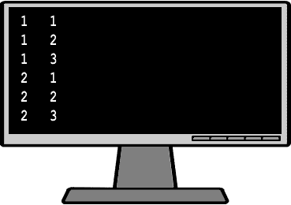
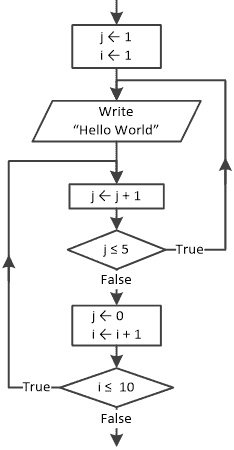
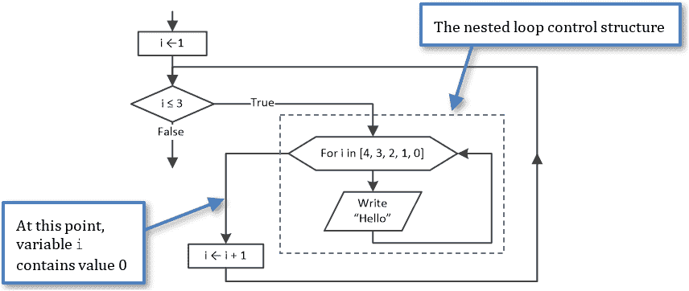

## 第二十六章

嵌套循环控制结构

### 26.1 什么是嵌套循环？

嵌套循环是指在另一个循环内部的循环，换句话说，是外部循环内部的内部循环。

外部循环控制内部循环的完整迭代次数。这意味着外部循环的第一个迭代触发内部循环开始迭代直到完成。然后，外部循环的第二个迭代再次触发内部循环开始迭代直到完成。这个过程重复，直到外部循环完成所有迭代。

以以下 Python 程序为例。

 file_26.1

for i in range(1, 3):

for j in range(1, 4):     [[更多…]](more.html#more_26_1_1)

> print(i, j)

在这个程序中，由变量 i 控制的循环是外部循环，它决定了内部循环完成的完整迭代次数。具体来说，当变量 i 为 1 时，内部循环执行三次迭代（对于 j = 1, j = 2 和 j = 3）。完成内部循环后，外部循环需要再执行一次迭代（对于 i = 2）。因此，内部循环重新开始，再次执行三次新的迭代（对于 j = 1, j = 2 和 j = 3）。

之前的例子类似于以下例子。

i = 1                    #外部循环将值 1 赋予变量 i

for j in range(1, 4):    #并且内部循环重新开始并执行三次新的迭代

print(i, j)

i = 2                    #外部循环将值 2 赋予变量 i

for j in range(1, 4):    #并且内部循环重新开始并执行三次新的迭代

print(i, j)

输出结果如下。

只要不违反语法规则，你可以嵌套任意多的循环控制结构。然而，出于实际考虑，当你达到四或五层嵌套时，整个结构会变得非常复杂且难以理解。然而，经验表明，你作为程序员一生中可能最多会做到三到四层嵌套。

内部和外部循环不必是同一类型。例如，一个 for 语句可以嵌套（包含）一个 while 语句，反之亦然。

#### 练习 26.1-1 说“Hello Zeus”。计算总迭代次数。

找出消息“Hello Zeus”显示的次数。

 file_26.1-1

for i in range(3):

for j in range(4):

> print("Hello Zeus")

Solution

变量 i 和 j 的值（按出现顺序）如下：

►对于 i = 0，内部循环执行 4 次迭代（对于 j = 0, j = 1, j = 2 和 j = 3），并且消息“Hello Zeus”显示 4 次。

►对于 i = 1，内部循环执行 4 次迭代（对于 j = 0, j = 1, j = 2 和 j = 3），并且消息“Hello Zeus”显示 4 次。

►对于 i = 2，内部循环执行 4 次迭代（对于 j = 0, j = 1, j = 2 和 j = 3），并且消息“Hello Zeus”显示 4 次。

因此，消息“Hello Zeus”总共显示 3 × 4 = 12 次。

外循环控制内循环的完整迭代次数！

#### 练习 26.1-2 创建跟踪表

对于下一个代码片段，确定变量 a 在程序结束时的值。

a = 1

i = 5

while i < 7:

for j in range(1, 5, 2):

> a = a * j + i

i += 1

print(a)

解答

这里显示了跟踪表。

| 步骤 | 语句 | 备注 | a | i | j |
| --- | --- | --- | --- | --- | --- |
| 1 | a = 1 |   | 1 | ? | ? |
| 2 | i = 5 |   | 1 | 5 | ? |
| 3 | while i < 7 | 这评估为 True |
| 4 | j = 1 |   | 1 | 5 | 1 |
| 5 | a = a * j + i |   | 6 | 5 | 1 |
| 6 | j = 3 |   | 6 | 5 | 3 |
| 7 | a = a * j + i |   | 23 | 5 | 3 |
| 8 | i += 1 |   | 23 | 6 | 3 |
| 9 | while i < 7 | 这评估为 True |
| 10 | j = 1 |   | 23 | 6 | 1 |
| 11 | a = a * j + i |   | 29 | 6 | 1 |
| 12 | j = 3 |   | 29 | 6 | 3 |
| 13 | a = a * j + i |   | 93 | 6 | 3 |
| 14 | i += 1 |   | 93 | 7 | 3 |
| 15 | while i < 7 | 这评估为 False |
| 16 | print(a) | 它显示：93 |

程序结束时，变量 a 包含的值是 93。

### 26.2 适用于嵌套循环的规则

除了适用于 for 循环的四个规则（在第 25.2 节中介绍）之外，在编写嵌套循环程序时，你还应该始终遵循两个额外的规则，因为它们可以让你避免不希望的结果。

►规则 1：内循环必须完全开始和结束在外循环内，这意味着循环不得重叠。

►规则 2：外循环和内（嵌套）循环不得使用相同的变量。

#### 练习 26.2-1 违反第一规则

设计一个违反嵌套循环第一规则的流程图片段，该规则指出，“内循环必须完全开始和结束在外循环内”。

解答

以下流程图片段违反了嵌套循环的第一规则。

.

如果你尝试跟随执行流程，你会注意到它平稳地执行了 5 × 10 = 50 次迭代。没有人能看出这个流程图是错误的。实际上，它在技术上是对的。然而，问题在于它的可读性。要辨别这个流程图旨在完成什么非常困难。此外，这种结构与你已经学过的任何已知的循环控制结构都不匹配，因此不能直接转换为 Python 程序。尽量避免这种嵌套循环！

#### 练习 26.2-2 违反第二规则

找出消息“Hello”显示的次数。

i = 1

while i <= 3:

for i in range(4, -1, -1):

> print("Hello")

i += 1

解答

初看之下，人们可能会认为单词“Hello”显示 3 × 5 = 15 次。然而，仔细观察后会发现事情并不总是像看起来那样。这个程序违反了嵌套循环的第二规则，即“外循环和内（嵌套）循环不得使用相同的变量”。让我们设计相应的流程图。

如果你尝试跟随此流程图片段的执行流程，你可以看到当内层循环完成所有五次迭代后，变量 i 包含的值为 0。然后，变量 i 增加 1，外层循环再次重复。这个过程可以无限进行，因为变量 i 永远不会超过外层循环布尔表达式所需的值 3。因此，“Hello”消息无限次显示。

### 26.3 复习问题：判断对错

对以下每个陈述选择正确或错误。

1)嵌套循环是外层循环中的一个内层循环。

2)可以在预测试循环结构中嵌套中间测试循环结构。

3)循环控制结构中嵌套的最大层数是四层。

4)当两个循环控制结构嵌套在一起时，最后开始的循环必须先完成。

5)当两个循环控制结构嵌套在一起时，它们必须不使用相同的计数器变量。

6)在以下代码片段中，单词“Hello”显示六次。

for i in range(1, 4):

for j in range(1, 4):

> print("Hello")

7)在以下代码片段中，单词“Hello”显示 12 次。

for i in range(2):

for j in range(1, 4):

> for k in range(1, 5, 2):
> 
> > print("Hello")

8)在以下代码片段中，单词“Hello”无限次显示。

i = 1

while i <= 4:

for i in range(3, 0, -1):

> print("Hello")

i += 1

9)在以下代码片段中，单词“Hello”显示九次。

for i in range(3):

j = 1

while True:

> print("Hello")
> 
> j += 1
> 
> if j >= 4: break

10)在以下程序中至少有一个中间测试循环结构。

s = 0

while not False:

while not False:

> a = int(input())
> 
> if a >= -1: break

if a == -1: break

s += a

print(s)

### 26.4 复习问题：多项选择题

对以下每个陈述选择正确答案。

1)在以下代码片段中

for i in range(1, 3):

for j in range(1, 3):

> print("Hello")

变量 i 和 j 的值（按出现顺序）是

a)j = 1, i = 1, j = 1, i = 2, j = 2, i = 1, j = 2, i = 2

b)i = 1, j = 1, i = 1, j = 2, i = 2, j = 1, i = 2, j = 2

c)i = 1, j = 1, i = 2, j = 2

d)j = 1, i = 1, j = 2, i = 2

2)在以下代码片段中

x = 2

while x > -2:

while True:

> x -= 1
> 
> print("Hello Hestia")
> 
> if x >= -2: break

显示消息“Hello Hestia”

a)4 次。

b)无限次数。

c)0 次。

d)以上皆非

3)在以下代码片段中

x = 1

while x != 500:

for i in range(x, 4):

> print("Hello Artemis")

x += 1

显示消息“Hello Artemis”

a)无限次数。

b)1500 次。

c)6 次。

d)以上皆非

4)以下代码片段

for i in range(1, 4):

for j in range(1, i + 1):

> print(i * j, ", ", sep = "", end = "")

print("The End!")

显示

a)1, 2, 4, 3, 6, 9, The End!

b)1, 2, 3, 4, 6, 9, The End!

c)1, 2, The End!, 4, 3, The End!, 6, 9, The End!

d)以上皆非

5)以下代码片段

i = 1

while i <= 10:

for i in range(10, 0, -1):

> print("Hello Dionysus")

i += 1

不满足该属性。

a)definiteness.

b)finiteness.

c)effectiveness.

### 26.5 复习练习

完成以下练习。

1)填写以下代码片段中的空白，以便所有代码片段都显示“Hello Hephaestus”消息 100 次。

i)

for a in range(6, ……):

for b in range(25):

> print("Hello Hephaestus")

ii)

for a in range(0, …… + 1, 5):

for b in range(10, 20):

> print("Hello Hephaestus")

iii)

for a in range(……, -17, -2):

for b in range(150, 50, -5):

> print("Hello Hephaestus")

iv)

for a in range(-11, -16, -1):

for b in range(100, …… + 1, 2):

> print("Hello Hephaestus")

2)设计相应的流程图，并创建一个跟踪表以确定在下一个代码片段的每个步骤中变量的值。

a = 1

j = 1

while j <= 2:

i = 10

while i < 30:

> a = a + j + i
> 
> i += 10

j += 0.5

print(a)

3)创建一个跟踪表，以确定在下一个代码片段的每个步骤中变量的值。s = s + i * j 语句执行了多少次？

s = 0

for i in range(1, 5):

for j in range(3, i - 1, -1):

> s = s + i * j

print(s)

4)创建一个跟踪表，以确定在下一个 Python 程序的每个步骤中变量的值。这个 Python 程序执行了多少次迭代？

三次执行中的输入值分别为：(i) NO, (ii) YES, NO; 和 (iii) YES, YES, NO.

s = 1

y = 25

while True:

for i in range(1, 4):

> s = s + y
> 
> y -= 5

ans = input()

if ans != "YES": break

print(s)

5)编写一个 Python 程序以显示以下形式的时和分表。

0     0

0     1

0     2

0     3

...

0     59

1     0

1     1

1     2

...

23   59

请注意，输出是对齐的。

6)使用嵌套循环控制结构，编写一个 Python 程序以显示以下输出。

5 5 5 5 5

4 4 4 4

3 3 3

2 2

1

7)使用嵌套循环控制结构，编写一个 Python 程序以显示以下输出。

0

0 1

0 1 2

0 1 2 3

0 1 2 3 4

0 1 2 3 4 5

8)使用嵌套循环控制结构，编写一个 Python 程序以显示以下矩形。

*  *  *  *  *  *  *  *  *  *

*  *  *  *  *  *  *  *  *  *

*  *  *  *  *  *  *  *  *  *

*  *  *  *  *  *  *  *  *  *

然后尝试在不使用任何循环控制结构的情况下完成同样的任务！

9)编写一个 Python 程序，提示用户输入一个介于 3 和 20 之间的整数 N，然后显示每边大小为 N 的正方形。例如，如果用户输入 4 作为 N，程序必须显示以下正方形。

*  *  *  *

*  *  *  *

*  *  *  *

*  *  *  *

然后尝试在不使用任何循环控制结构的情况下完成同样的任务！

10)编写一个 Python 程序，提示用户输入一个介于 3 和 20 之间的整数 N，然后显示每边大小为 N 的空心正方形。例如，如果用户输入 4 作为 N，程序必须显示以下空心正方形。

*  *  *  *

*        *

*        *

*  *  *  *

然后尝试在不使用任何循环控制结构的情况下完成同样的任务！

11)使用嵌套循环控制结构，编写一个 Python 程序，显示以下三角形。

*

*  *

*  *  *

*  *  *  *

*  *  *  *  *

*  *  *  *

*  *  *

*  *

*

然后，尝试只用一个 for 循环（不允许使用嵌套循环控制结构！）
