## 第三十二章

数据结构技巧与窍门

### 32.1 简介

由于列表是使用与之前章节中学习的相同序列、决策和循环控制结构处理的，因此在这里不需要重复所有这些信息。然而，在本章中，你将发现如何单独处理二维列表的每一行或每一列，如何解决需要使用多个列表的问题，如何从一个一维列表创建二维列表（反之亦然），以及 Python 支持的一些有用的内置列表函数和方法。

### 32.2 单独处理每一行

单独处理每一行意味着每一行都是单独处理的，每一行的结果（可以是总和、平均值等）可以单独用于进一步处理。

假设你有一个 4×5 的列表。

.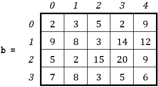

让我们尝试找到每一行的总和。以下两种方法都会遍历行。

第一种方法 – 创建辅助列表

在这种方法中，程序单独处理每一行并创建一个辅助列表，其中每个元素存储一行之和。这种方法提供了很大的灵活性，因为您可以在程序中稍后使用这个新列表进行进一步处理。辅助列表 total 显示在右侧。

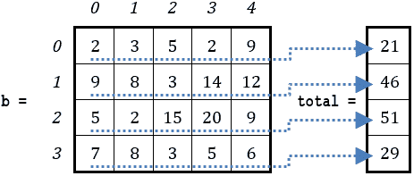

现在，让我们编写相应的代码片段。为了更易于理解这个过程，我们使用“从内到外”的方法。以下代码片段计算第一行的总和（行索引为 0），并将结果存储在辅助列表 total 的位置 0 处。假设变量 i 包含值 0。

s = 0

for j in range(COLUMNS):

s += b[i][j]

total[i] = s

这个代码片段可以等价地写成

total[i] = 0

for j in range(COLUMNS):

total[i] += b[i][j]

现在，将此代码片段嵌套在一个遍历所有行的 for 循环中，结果如下。

total = [None] * ROWS

for i in range(ROWS):

total[i] = 0

for j in range(COLUMNS):

> total[i] += b[i][j]

然而，同样可以使用 Python 的神奇力量来实现相同的结果！代码片段如下。

total = []

for row in b:

total.append(fsum(row))

第二种方法 – 只找到它并处理它。

这种方法不使用任何辅助列表；它只是计算并直接处理总和。代码片段如下。

for i in range(ROWS):

total = 0

for j in range(COLUMNS):

> total += b[i][j]

过程总和

过程总和是什么意思？这取决于给定的问题。它可能只是显示总和，也可能计算每一行的平均值并显示，或者它可能使用总和来计算更复杂的数学表达式。

例如，以下示例计算并显示列表 b 每一行的平均值。

for i in range(ROWS):

total = 0

for j in range(COLUMNS):

> total += b[i][j]

average = total / COLUMNS

print(average)

同样的结果，可以使用 Python 的魔法力实现！以下是一个代码片段

for row in b:

total = fsum(row)

print(total / COLUMNS)

#### 练习 32.2-1 查找平均值

有 20 名学生，每个学生都完成了 10 节课的评分。编写一个 Python 程序，提示用户输入每个学生的所有课程成绩，然后计算并显示每个学生的所有大于 89 的平均值。

解决方案

由于你已经学会了两种逐行处理的方法，让我们同时使用它们。

第一种方法 – 创建辅助列表

在这种方法中，程序逐行处理，并在辅助列表中创建每个元素，存储一行平均值。以下显示两个所需的列表。

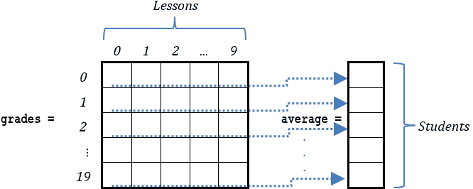

在创建列表 average 之后，程序可以找到并显示所有大于 89 的平均值。以下是一个 Python 程序。

 file_32.2-1a

STUDENTS = 20

LESSONS = 10

grades = [[None] * LESSONS for i in range(STUDENTS)]

for i in range(STUDENTS):

print("对于学生编号", i + 1, "...")

for j in range(LESSONS):

> grades[i][j] = int(input("输入第 " + str(j + 1) + " 节课的成绩: "))

# 创建列表 average。遍历行

average = [None] * STUDENTS

for i in range(STUDENTS):

average[i] = 0

for j in range(LESSONS):

> average[i] += grades[i][j]

average[i] /= LESSONS

# 显示所有大于 89 的平均值

for i in range(STUDENTS):

if average[i] > 89:

> print(average[i])

使用 Python 的魔法力，辅助列表 average 也可以像下面这样创建。

 file_32.2-1b

from math import fsum

STUDENTS = 20

LESSONS = 10

grades = [[None] * LESSONS for i in range(STUDENTS)]

for i in range(STUDENTS):

print("对于学生编号", i + 1, "...")

for j in range(LESSONS):

> grades[i][j] = int(input("输入第 " + str(j + 1) + " 节课的成绩: "))

# 创建列表 average。遍历行

average = []

for row in grades:

average.append(fsum(row) / LESSONS)

# 显示所有大于 89 的平均值

for i in range(STUDENTS):

if average[i] > 89:

> print(average[i])

第二种方法 – 只找到并显示它！

这种方法不使用任何辅助列表；它只是计算并直接显示所有大于 89 的平均值。以下是一个 Python 程序。

 file_32.2-1c

STUDENTS = 20

LESSONS = 10

grades = [[None] * LESSONS for i in range(STUDENTS)]

for i in range(STUDENTS):

print("对于学生编号", i + 1, "...")

for j in range(LESSONS):

> grades[i][j] = int(input("输入第 " + str(j + 1) + " 节课的成绩: "))

# 计算每行的平均值并直接显示大于 89 的那些

for i in range(STUDENTS):

average = 0

for j in range(LESSONS):

> average += grades[i][j]

average /= LESSONS

if average > 89:

> print(average)

再次，使用 Python 的魔法力量和不使用任何辅助列表，Python 程序如下。

 file_32.2-1d

from math import fsum

STUDENTS = 20

LESSONS = 10

grades = []

for i in range(STUDENTS):

grades.append([])

print("对于学生编号", i + 1, "...")

for j in range(LESSONS):

> grades[i].append(int(input("输入第" + str(j + 1) + "节课的成绩: ")))

# 使用 Python 的魔法力量计算每行的平均值！

for row in grades:

average = fsum(row) / LESSONS

if average > 89:

> print(average)

### 32.3 逐列处理

逐列处理意味着每列都是单独处理的，每列的结果（可以是总和、平均值等）可以单独用于进一步处理。假设你有一个以下 4 × 5 的列表。

如前所述，让我们尝试逐列求和。再次，你可以使用两种方法。这两种方法都是遍历列。

第一种方法 - 创建辅助列表

在这种方法中，程序逐列处理并创建一个辅助列表，其中每个元素存储一列的总和。这种方法提供了很大的灵活性，因为你可以稍后在程序中使用这个新列表进行进一步处理。辅助列表 total 显示在底部。

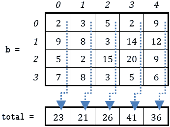

现在，让我们编写相应的代码片段。为了更易于理解过程，再次使用“从内到外”的方法。以下代码片段计算第一列（列索引 0）的总和，并将结果存储在辅助列表 total 的位置 0。假设变量 j 包含值 0。

s = 0

for i in range(ROWS):

s += b[i][j]

total[j] = s

这个程序可以等价地写成

total[j] = 0

for i in range(ROWS):

total[j] += b[i][j]

现在，将此代码片段嵌套在一个遍历所有列的 for 循环中，结果如下。

total = [None] * COLUMNS

for j in range(COLUMNS):

total[j] = 0

for i in range(ROWS):

> total[j] += b[i][j]

第二种方法 - 只找到它并处理它。

这种方法不使用任何辅助列表；它只是计算并直接处理总和。代码片段如下。

for j in range(COLUMNS):

total = 0

for i in range(ROWS):

> total += b[i][j]

处理总和

因此，以下代码片段计算并显示每列的平均值。

for j in range(COLUMNS):

total = 0

for i in range(ROWS):

> total += b[i][j]

print(total / ROWS)

#### 练习 32.3-1 查找平均值

有 10 名学生，他们每人已经完成了 5 节课的成绩。编写一个 Python 程序，提示用户输入每个学生的所有课程成绩，然后计算并显示每节课的平均值，其中平均值大于 89。

解答

既然你已经学会了两种逐列处理的方法，让我们都使用它们。

第一种方法 – 创建辅助列表

在这种方法中，程序逐列处理每个列，并创建一个辅助列表，其中每个元素存储一个列的平均值。接下来将展示两个所需的列表。

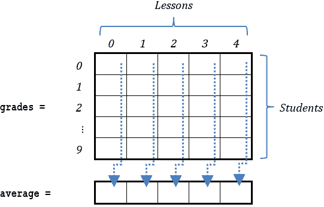

在创建列表 average 之后，程序可以找到并显示所有大于 89 的平均值。Python 程序如下。

 file_32.3-1a

STUDENTS = 10

LESSONS = 5

grades = [[None] * LESSONS for i in range(STUDENTS)]

for i in range(STUDENTS):

print("学生编号", i + 1, "...")

for j in range(LESSONS):

> grades[i][j] = int(input("输入第" + str(j + 1) + "课的分数: "))

#创建列表 average。遍历列

average = [None] * LESSONS

for j in range(LESSONS):

average[j] = 0

for i in range(STUDENTS):

> average[j] += grades[i][j]

average[j] /= STUDENTS

#显示所有大于 89 的平均值

for j in range(LESSONS):

if average[j] > 89:

> print(average[j])

第二种方法 – 只找到它并显示它！

这种方法不使用辅助列表；它只是计算并直接显示所有大于 89 的平均值。Python 程序如下。

 file_32.3-1b

STUDENTS = 10

LESSONS = 5

grades = [[None] * LESSONS for i in range(STUDENTS)]

for i in range(STUDENTS):

print("学生编号", i + 1, "...")

for j in range(LESSONS):

> grades[i][j] = int(input("输入第" + str(j + 1) + "课的分数: "))

#计算每列的平均值

#直接显示分数大于 89 的学生

for j in range(LESSONS):

average = 0

for i in range(STUDENTS):

> average += grades[i][j]

average /= STUDENTS

if average > 89:

> print(average)

### 32.4 在程序中使用多个数据结构

到目前为止，每个示例或练习都只使用了一个列表或一个字典。但如果一个问题需要你使用两个列表，或者一个列表和一个字典，或者一个列表和两个字典呢？接下来你将找到一些练习，展示如何将各种数据结构组合起来以应对各种独特的挑战。

#### 练习 32.4-1 使用三个一维列表

有 20 名学生，每个学生都为两节课获得了分数。编写一个 Python 程序，提示用户输入每个学生的姓名和两节课的分数。然后程序必须找到并显示所有两节课分数都大于 89 的学生姓名。

解决方案

下面是包含一些典型值的所需列表。

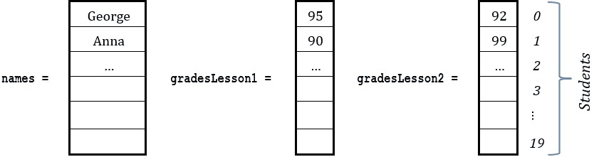

如您所见，列表 names 中的元素与列表 gradesLesson1 和 gradesLesson2 中的元素之间存在一一对应关系。前二十名学生是乔治，他在两门课程中分别获得了 95 和 92 分。姓名“乔治”存储在列表 names 的索引 0 处，在列表 gradesLesson1 和 gradesLesson2 中，他的两门课程的分数存储在完全相同的索引位置。下一个学生（安娜）及其分数存储在列表 names、gradesLesson1 和 gradesLesson2 的索引 1 处，依此类推。

以下是一个 Python 程序。

 file_32.4-1

STUDENTS = 20

names = [None] * STUDENTS

gradesLesson1 = [None] * STUDENTS

gradesLesson2 = [None] * STUDENTS

for i in range(STUDENTS):

names[i] = input("输入学生姓名 No" + str(i + 1) + ": ")

gradesLesson1[i] = int(input("输入课程 1 的分数: "))

gradesLesson2[i] = int(input("输入课程 2 的分数: "))

# 显示那些两门课程分数都超过 89 的学生的姓名

for i in range(STUDENTS):

if gradesLesson1[i] > 89 and gradesLesson2[i] > 89:

> print(names[i])

#### 练习 32.4-2 使用一维列表和二维列表

有 10 名学生，他们每人已经完成了五门课程的考试。编写一个 Python 程序，提示用户输入每个学生的姓名和所有课程的分数，然后计算并显示那些有两门以上课程分数超过 89 的学生的姓名。

解答

在这个练习中，您可以像上一个练习那样做。例如，您可以使用一个一维列表来存储学生的姓名，以及五个一维列表来存储每个学生在每门课程的分数。这不太方便，但可以工作。显然，当分数超过两个时，这不是最合适的方法。

这里最好的方法是使用一个一维列表来存储学生的姓名，以及一个二维列表来存储每个学生在每门课程的分数。

实际上存在两种方法。使用哪一种取决于您！如果您决定在二维列表中，行应指学生，列应指课程，那么您可以使用下面讨论的第一种方法。如果您决定行应指课程，列应指学生，那么您可以使用下面的第二种方法。

第一种方法 – 行为学生，列为课程

在这种方法中，二维列表必须有 10 行，每行代表一个学生，5 列，每列代表一门课程。所有其他列表都可以根据这个二维列表如下排列。

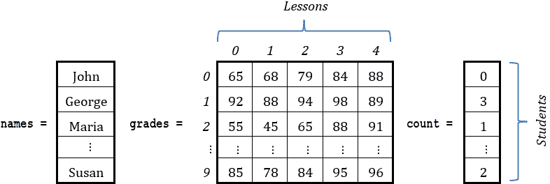

程序将创建辅助列表 count，并存储每个学生分数超过 89 的分数数量。

现在，让我们看看如何读取值并将它们存储在 names 和 grades 列表中。一个简单的解决方案是使用一个 for 循环读取姓名，然后使用嵌套的 for 循环读取成绩。然而，对于用户来说，首先输入所有姓名然后所有成绩可能不太实用。一个更用户友好的方法是提示用户输入一个学生姓名然后所有他们的成绩，然后继续下一个学生姓名及其对应的成绩，依此类推。解决方案如下。

 file_32.4-2a

STUDENTS = 10

LESSONS = 5

# 一次性读取姓名和成绩。遍历 grades 列表中的行

names = [None] * STUDENTS

grades = [[None] * LESSONS for i in range(STUDENTS)]

for i in range(STUDENTS):

names[i] = input("Enter name for student No." + str(i + 1) + ": ")

for j in range(LESSONS):

> grades[i][j] = int(input("Enter grade No." + str(j + 1) + " for " + names[i] + ": "))

# 创建 count 列表。遍历行

count = [None] * STUDENTS

for i in range(STUDENTS):

count[i] = 0

for j in range(LESSONS):

> if grades[i][j] > 89:
> 
> > count[i] += 1

# 显示成绩超过 89 分的学生姓名

for i in range(STUDENTS):

if count[i] > 1:

> print(names[i])

第二种方法 - 行对应课程，列对应学生

在这种方法中，二维列表必须包含 5 行，每行对应一个课程，10 列，每列对应一个学生。所有其他列表都可以相对于这个二维列表放置，如下所示。

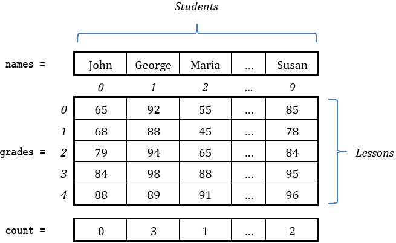

![img/notice.jpg]辅助列表 count 将由程序创建，并将存储每个学生成绩超过 89 分的数量。

显然，为了创建 count 列表，程序将遍历列。解决方案如下。

 file_32.4-2b

STUDENTS = 10

LESSONS = 5

# 一次性读取姓名和成绩。遍历 grades 列表中的列

names = [None] * STUDENTS

grades = [[None] * STUDENTS for i in range(LESSONS)]

for j in range(STUDENTS):

names[j] = input("Enter name for student No." + str(j + 1) + ": ")

for i in range(LESSONS):

> grades[i][j] = int(input("Enter grade No." + str(i + 1) + " for " + names[j] + ": "))

# 创建 count 列表。遍历列

count = [None] * STUDENTS

for j in range(STUDENTS):

count[j] = 0

for i in range(LESSONS):

> if grades[i][j] > 89:
> 
> > count[j] += 1

# 显示成绩超过 89 分的学生姓名

for j in range(STUDENTS):

if count[j] > 1:

> print(names[j])

#### 练习 32.4-3 使用列表和字典

有 30 名学生，他们每个人都已经收到了他们的测试成绩。编写一个 Python 程序，提示用户输入每个学生的成绩（作为字母）。然后根据以下表格显示每个学生的成绩百分比。

| Grade | Percentage |
| --- | --- |
| A | 90 – 100 |
| B | 80 – 89 |
| C | 70 – 79 |
| D | 60 – 69 |
| E / F | 0 – 59 |

解决方案

字典可以用来存储给定的表格。解决方案简单明了，无需进一步解释。

 file_32.4-3

STUDENTS = 30

gradesTable = {"A": "90-100", "B": "80-89", "C": "70-79",

> > "D": "60-69", "E": "0-59", "F": "0-59"}

names = [None] * STUDENTS

grades = [None] * STUDENTS

for i in range(STUDENTS):

names[i] = input("Enter student name No" + str(i + 1) + ": ")

grades[i] = input("Enter their grade: ")

for i in range(STUDENTS):

grade = grades[i]

gradeAsPercentage = gradesTable[grade]

print(names[i], gradeAsPercentage)

现在，如果您完全理解了最后一个 for 循环的工作原理，那么请查看下面的代码片段。它与最后一个 for 循环等效，但效率更高，因为它使用了更少的变量！

for i in range(STUDENTS):

print(names[i], gradesTable[grades[i]])

### 32.5 从二维列表创建一维列表

为了更轻松地理解如何从二维列表创建一维列表，让我们用一个例子来说明。

编写一个 Python 程序，从现有的 3 × 4 二维列表（如下所示）创建一个包含 12 个元素的一维列表，如下所示：二维列表的第一列的元素必须放置在一维列表的前三个位置，第二列的元素必须放置在接下来的三个位置，依此类推。

以下是二维 3 × 4 列表和新的一个维列表的展示。

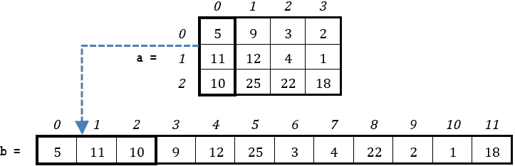

下面的 Python 程序创建了一个新的一个维列表，通过遍历列来实现，这更为方便。它使用示例中给出的现有列表。

 file_32.5a

ROWS = 3

COLUMNS = 4

ELEMENTS = ROWS * COLUMNS

a = [

[5, 9, 3, 2],

[11, 12, 4, 1],

[10, 25, 22, 18]

]

k = 0  #这是新列表 b 的索引。

b = [None] * ELEMENTS

for j in range(COLUMNS):        #遍历列

for i in range(ROWS):

> b[k] = a[i][j]
> 
> k += 1

for k in range(ELEMENTS):

print(b[k], end = "\t")

除了使用新列表的索引 k，您还可以使用 append()方法，如下所示。

 file_32.5b

ROWS = 3

COLUMNS = 4

ELEMENTS = ROWS * COLUMNS

a = [

[5, 9, 3, 2],

[11, 12, 4, 1],

[10, 25, 22, 18]

]

b = []  #创建一个完全空的列表

for j in range(COLUMNS):        #遍历列

for i in range(ROWS):

> b.append(a[i][j])

for k in range(ELEMENTS):

print(b[k], end = "\t")

### 32.6 从一维列表创建二维列表

为了更轻松地理解如何从一维列表创建二维列表，让我们用一个例子来说明。

编写一个 Python 程序，将一个包含 12 个元素的现有单维列表（如下所示）转换为一个 3 × 4 的二维列表，具体如下：单维列表的前三个元素必须放置在二维列表的第一列中，单维列表的下一个三个元素必须放置在二维列表的下一列中，依此类推。

下面是 12 个元素的单一列表和新的二维列表。

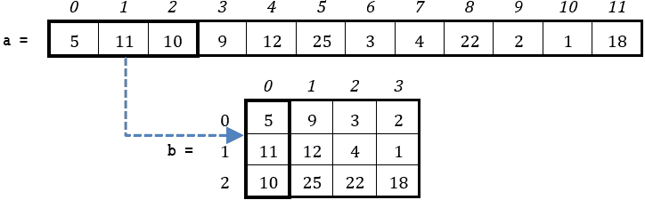

下面的 Python 程序创建新的二维列表，通过遍历列来实现，这更为方便。它使用示例中给出的现有列表。

 file_32.6

ROWS = 3

COLUMNS = 4

a = [5, 11, 10, 9, 12, 25, 3, 4, 22, 2, 1, 18]

k = 0   #这是列表 a 的索引。

b = [[None] * COLUMNS for i in range(ROWS)]

for j in range(COLUMNS):            #遍历列

for i in range(ROWS):

> b[i][j] = a[k]
> 
> k += 1

for i in range(ROWS):               #遍历行

for j in range(COLUMNS):

> print(b[i][j], end = "\t")

print()

### 32.7 有用的数据结构函数/方法（子程序）

计算元素数量

len(structure_name)

您已经从之前章节中了解过这个函数！在第 14.3 节中，您了解到 len()函数返回字符串中的字符数。现在您需要了解的是，len()函数返回任何结构（如列表或字典）的元素数量！

示例

 file_32.7a

a = [3, 6, 10, 12, 4, 2, 1]

print(len(a))                   #它显示：7

length = len(a[2:4])

print(length)                   #它显示：2

for i in range(len(a)):

print (a[i], end = "  ")    #它显示：3  6  10  12  4  2  1

b = [

[5, 9, 3, 2],

[11, 12, 7, 1],

[10, 25, 22, 18]

]

print(len(b))     #它显示：3

print(len(b[0]))  #它显示：4

在二维列表 b 中，len(b)函数返回 3（三行），而 len(b[0])返回 4（四列）。如果您想获取列表所有维度的元素总数，可以使用 product len(b) * len(b[0])，这将等于 12。

查找最大值

max(structure_name)

此函数返回列表或元组中的最大值。在字典的情况下，它返回最大的键。

示例

 file_32.7b

a = [3, 6, 10, 2, 1, 12, 4]

print(max(a))                   #它显示：12

maximum = max(a[1:4])

print(maximum)                  #它显示：10

b = [

[4, 6, 8],

[3, 11, 9],

[2, 9, 1]

]

print(max(b[1]))                #它显示：11

c = ("Apollo", "Hermes", "Athena", "Aphrodite", "Dionysus")

print(max(c))                   #它显示：Hermes

查找最小值

min(structure_name)

此函数返回列表或元组中的最小值。在字典的情况下，它返回最小的键。

示例

 file_32.7c

a = [3, 6, 10, 2, 1, 12, 4]

print(min(a))   #它显示：1

minimum = min(a[1:4])

print(minimum)   #它显示：2

b = [

[4, 6, 8],

[3, 11, 9],

[2, 9, 1]

]

print(min(b[0]))   #它显示：4

c = ("Apollo", "Hermes", "Athena", "Aphrodite", "Dionysus")

print(min(c))   #它显示：Aphrodite

排序列表

排序是将列表中的元素按照一定顺序排列的过程。这里你有两个选择：你可以使用 sort() 方法对列表进行排序，或者你可以使用 sorted() 函数从一个初始列表中获取一个新的排序后的列表，同时保持初始列表不变。

使用 sort() 方法

list_name.sort([reverse = True])

此方法可以按升序或降序对列表进行排序。

示例

 file_32.7d

a = [3, 6, 10, 2, 1, 12, 4]

a.sort()

print(a)   #它显示：[1   2   3   4   6   10   12]

#以降序排序

a.sort(reverse = True)

print(a)   #它显示：[12   10   6   4   3   2   1]

b = [

[4, 6, 8],

[3, 11, 9],

[2, 9, 1]

]

#对最后一行进行排序

b[2].sort()

for row in b:

for element in row:

> print(element, end = "\t")   #它显示：4   6   8
> 
> > > > > # 3   11   9

print()   #   1   2   9

c = ["Hermes", "Apollo", "Dionysus"]

c.sort()

print(c)   #它显示：['Apollo', 'Dionysus', 'Hermes']

sort() 方法不能与不可变数据类型一起使用，例如元组。

使用 sorted() 函数

sorted(structure_name [, reverse = True])

此函数返回一个新的排序后的列表或元组，可以是升序或降序，同时保持初始列表/元组不变。

示例

 file_32.7e

a = [3, 6, 10, 2, 1, 12, 4]

b = sorted(a)

print(a)   #它显示：[3, 6, 10, 2, 1, 12, 4]

print(b)   #它显示：[1   2   3   4   6   10   12]

c = ["Hermes", "Apollo", "Dionysus"]

for element in sorted(c, reverse = True):

print(element, end = "   ")   #它显示：Hermes   Dionysus   Apollo

### 32.8 复习问题：对错

对以下每个陈述选择对或错。

1)逐行处理意味着每一行都是单独处理的，然后每一行的结果可以单独用于进一步处理。

2)以下代码片段在每列元素的总和小于 100 时显示单词“Okay”。

for i in range(ROWS):

total = 0

for j in range(COLUMNS):

> total += a[i][j]

if total < 100: print("Okay")

3)逐列处理意味着每一列都是单独处理的，然后每一行的结果可以单独用于进一步处理。

4)以下代码片段显示了每列元素的总和。

total = 0

for j in range(COLUMNS):

for i in range(ROWS):

> total += a[i][j]

print(total)

5)假设有 10 名学生，他们每人已经收到了五门课程的分数。根据这个信息，可以设计一个列表，其中行代表学生，列代表课程，但不能反过来，即行代表课程，列代表学生。

6)可以从二维列表创建一维列表，但不能反过来。

7)可以从三维列表创建一维列表。

8)以下两个代码片段显示相同的值。

a = [1, 6, 12, 2, 1]

print(len(a))

a = "Hello"

print(len(a))

9)以下代码片段显示三个值。

a = [10, 20, 30, 40, 50]

for i in range(3, len(a)):

print(a[i])

10)以下代码片段显示列表 b 中所有元素的值。

b = [10, 20, 30, 40, 50]

for i in range(len(b)):

print(i)

11)以下代码片段将列表 b 中所有元素的值加倍。

for i in range(len(b)):

b[i] *= 2

12)以下代码片段在屏幕上显示 30 的值。

a = [20, 50, 10, 30, 15]

print(max(a[2:len(a)]))

13)以下代码片段在屏幕上显示 50 的值。

a = [20, 50, 10, 30, 15]

b = [-1, -3, -2, -4, -1]

print(a[min(b)])

14)以下代码片段显示列表 b 的最小值。

b = [3, 6, 10, 2, 1, 12, 4]

b.sort()

print(b[0])

15)以下代码片段显示列表 b 的最小值。

b = [3, 1, 2, 10, 4, 12, 6]

print(sorted(a, reverse = True)[-1])

16)以下代码片段会抛出错误。

b = [3, 1, 2]

a = sort(b)

### 32.9 复习问题：多项选择题

选择以下每个陈述的正确答案。

1)以下代码片段

for i in range(ROWS):

total[i] = 0

for j in range(COLUMNS):

> total[i] += a[i][j]

print(total[i])

a)显示每行的元素总和。

b)显示每列的元素总和。

c)显示列表中所有元素的总和。

d)以上都不是

2)以下代码片段

for j in range(COLUMNS):

total = 0

for i in range(ROWS):

> total += a[i][j]

print(total)

a)显示每行的元素总和。

b)显示每列的元素总和。

c)显示列表中所有元素的总和。

d)以上都不是

3)以下代码片段

total = 0

for j in range(COLUMNS):

for i in range(ROWS):

> total += a[i][j]

print(total)

a)显示每行的元素总和。

b)显示每列的元素总和。

c)显示列表中所有元素的总和。

d)以上都不是

4)以下代码片段

b = [None] * (ROWS * COLUMNS)

k = 0

for i in range(ROWS - 1, -1, -1):

for j in range(0, COLUMNS, -1):

> b[k] = a[i][j]
> 
> k += 1

a)从二维列表创建一维列表。

b)从一维列表创建二维列表。

c)不满足确定性的性质

d)以上都不是

5)以下代码片段

b = [[None] * COLUMNS for i in range(ROWS)]

k = 0

for i in range(ROWS):

for j in range(COLUMNS - 1, -1, -1):

> b[i][j] = a[k]
> 
> k += 1

a)从二维列表创建一维列表。

b)从一维列表创建二维列表。

c)以上皆非

6)以下两个代码片段

a = [3, 6, 10, 2, 4, 12, 1]

for i in range(7):

打印 a[i]

a = [3, 6, 10, 2, 4, 12, 1]

for i in range(len(a)):

打印 a[i]

a)产生相同的结果。

b)不会产生相同的结果。

c)以上皆非

7)以下两个代码片段

for i in range(len(a)):

打印 a[i]

for element in a:

打印 element

a)产生相同的结果。

b)不会产生相同的结果。

c)以上皆非

8)以下语句 min(b[1:len(b)])

a)返回列表 b 一部分的最低值。

b)返回列表 b 的最低值。

c)以上皆非

9)以下代码片段

a = [3, 6, 10, 1, 4, 12, 2]

打印 a[-min(a)]

a)在屏幕上显示 1 的值。

b)在屏幕上显示 3 的值。

c)在屏幕上显示 2 的值。

d)以上皆非

10)以下两个代码片段

for i in range(len(a)):

打印 sorted(a)[i]

for element in sorted(a):

打印 element

a)产生相同的结果，但左边的程序更快。

b)产生相同的结果，但右边的程序更快。

c)不会产生相同的结果。

d)以上皆非

11)以下三个代码片段

b.sort(reverse = True)

打印 b[0]

打印 sorted(b)[-1]

打印 max(b)

a)在屏幕上显示列表 b 的最大值。

b)在屏幕上显示列表 b 的最小值。

c)以上皆非

### 32.10 复习练习

完成以下练习。

1)有 15 名学生，他们每个人都已经收到了五次测试的成绩。编写一个 Python 程序，让用户输入每个学生在所有测试中的成绩（作为百分比）。然后，为每个学生计算平均成绩，并根据以下表格显示为字母等级。

| Grade | Percentage |
| --- | --- |
| A | 90 - 100 |
| B | 80 - 89 |
| C | 70 - 79 |
| D | 60 - 69 |
| E / F | 0 - 59 |

2)在地球上，自由落体的加速度为 9.81 m/s²向下。这个值用 g 表示。一名学生想通过实验计算这个值。她允许五个不同的物体从已知高度落下，并测量它们到达地板所需的时间。她为每个物体做了 10 次。然后，使用公式，她为每个物体、每次落下计算 g 值。但由于她的计时器不够准确，她需要一个 Python 程序，让她输入所有计算出的 g 值在一个 5 × 10 的列表中，然后计算并显示

a)对于每个物体，g 的平均值

b)对于每个秋季，g 的平均值

c)g 的整体平均值

3)一个有 15 名球员的篮球队打了 12 场比赛。编写一个 Python 程序，让用户输入每个球员在每场比赛中得分的数量。然后程序必须显示

a)对于每个球员，总得分

b)对于每场比赛，得分的总数

4)编写一个 Python 程序，让用户输入 20 个城市在一天内每小时测量的温度，然后显示所有城市的平均温度低于 10 华氏度的时段。

5)在一个足球锦标赛中，一支有 24 名球员的足球队进行了 10 场比赛。编写一个 Python 程序，让用户为每位球员输入姓名以及他们在每场比赛中进球的数量。然后程序必须显示

a)对于每位球员，他的姓名和他平均进球数

b)对于每场比赛，比赛的索引编号（1、2、3 等等）和总进球数

6)有 12 名学生，他们每人已经完成了六节课的评分。编写一个 Python 程序，让用户输入学生的姓名以及他们在所有课程中的成绩，然后显示

a)对于每位学生，他们的姓名和平均成绩

b)对于每节课，平均成绩

c)平均成绩低于 60 分的学生的姓名

d)平均成绩高于 89 分的学生的姓名，旁边还有“Bravo！”的消息

假设用户输入的值在 0 到 100 之间有效。

7)在一场歌唱比赛中，每位艺术家唱一首自己选择的歌曲。有五位评委和 15 位艺术家，每位艺术家的表演都会得到评分。编写一个 Python 程序，提示用户输入评委的姓名、艺术家的姓名、每位艺术家唱的歌曲标题以及每位评委给出的分数。然后程序必须显示

a)对于每位艺术家，他们的姓名、歌曲标题和他们的总分

b)对于每位评委，他们的姓名和他们给出的平均分数

8)身体质量指数（BMI）常用于确定一个人是否因身高而超重或体重不足。计算 BMI 使用的公式是

.

编写一个 Python 程序，让用户输入 30 个人的体重（以磅为单位）和身高（以英寸为单位），这些数据是按月度测量的，为期一年（从一月到十二月）。然后程序必须计算并显示

a)对于每个人，他们的平均体重、平均身高和平均 BMI

b)对于每个人，他们在五月份和八月份的 BMI

请注意，所有人都是成年人，但其中一些人的年龄在 18 到 25 岁之间。这意味着他们可能还会长高，因此他们的身高可能会每个月都不同！

9)编写一个 Python 程序，让用户输入 1000 个消费者在一个月开始和结束时的电表读数（千瓦时，kWh）。然后程序必须计算并显示

a)对于每位消费者，消耗的千瓦时数和根据每千瓦时 0.07 美元的价格以及 19%的增值税（VAT）率必须支付的费用

b)总消耗量和必须支付的总金额。

10) 编写一个 Python 程序，提示用户输入美元金额，并计算并显示相应的欧元、英镑、澳大利亚元和加拿大元的货币价值。下表包含每种货币在五个工作日内的汇率。程序必须计算每种货币的平均价值，并基于该平均价值进行转换。

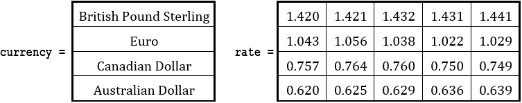

11) 毛收入取决于工资率和每周工作的小时总数。然而，如果有人工作超过 40 小时，他们将获得加班费，即超过 40 小时的所有工作时间的 1.5 倍。编写一个 Python 程序，让用户输入工资率以及 10 名员工的姓名和每天（周一至周五）工作的小时数。然后程序必须计算并显示

a) 加班员工的姓名

b) 对于每位员工，显示他们的名字和平均每日毛收入

c) 所有员工的总毛收入

d) 对于每位员工，显示他们的名字、加班工作（超过 8 小时）的日期，以及信息“加班！”

e) 对于每一天，显示日期和总毛收入

12) 编写一个 Python 程序，从以下二维列表创建一个包含 12 个元素的列表，如下所示：二维列表的第一行必须放置在一维列表的前四个位置，二维列表的第二行必须放置在一维列表的下一个四个位置，二维列表的最后一行必须放置在一维列表的最后四个位置。

.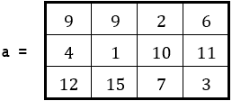

13) 编写一个 Python 程序，从以下一维列表创建一个 3 × 3 的列表，如下所示：一维列表的前三个元素必须放置在二维列表的最后一行，一维列表的下一个三个元素必须放置在二维列表的第二行，一维列表的最后三个元素必须放置在二维列表的第一行。

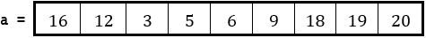
