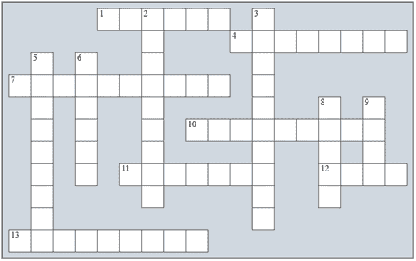

## 第四十七章：在“子程序”中复习

### 复习填字游戏

1) 解决以下填字游戏。

Across

1) 函数可能包含一个名为 _______ 的参数列表。

4) 通常情况下，此子程序返回一个结果。

7) 在这种编程中，问题被细分为更小的子问题。

10) 一个数列，前两个数是 0 和 1，每个后续数是前两个数的和。

11) 在这种编程中，具有共同功能的子程序被分组到单独的模块中。

12) 向函数发送一个值。

13) Python 中的列表是通过 _________ 传递的。

Down

2) 一种编程技术，其中子程序调用自身。

3) 将一组语句打包成一个单元，执行特定任务。

5) 通常情况下，此子程序不返回任何结果。

6) 当子程序被调用时，传递的参数列表被称为 _______ 参数列表。

8) 它指的是变量的作用范围。

9) 原则上讲，这个子程序返回一个结果。

### 复习问题

回答以下问题。

1) 什么是子程序？列举一些 Python 的内置子程序。

2) 什么是过程式编程？

3) 过程式编程的优点是什么？

4) 什么是模块化编程？列举一个你了解的 Python 模块。

5) Python 函数的一般形式是什么？

6) 如何调用函数？

7) 描述主代码调用函数时执行的步骤。

8) 什么是空函数？

9) Python 空函数的一般形式是什么？

10) 如何调用空函数？

11) 描述主代码调用空函数时执行的步骤。

12) 函数和空函数之间有什么区别？

13) 什么是形式参数列表？

14) 实际参数列表是什么？

15) 两个子程序可以使用相同名称的变量吗？

16) 子程序的变量在主内存中“存活”多长时间？

17) 主代码的变量在主内存中“存活”多长时间？

18) 子程序可以调用另一个子程序吗？如果是，请给出一些例子。

19) “通过值传递参数”是什么意思？

20) “通过引用传递参数”是什么意思？

21) 什么是可选参数？

22) “作用域”这个术语指的是什么？

23) 当变量具有局部作用域时会发生什么？

24) 当变量具有全局作用域时会发生什么？

25) 局部变量和全局变量之间有什么区别？

26) 递归是什么？

27) 所有递归算法都必须遵循哪三条规则？
