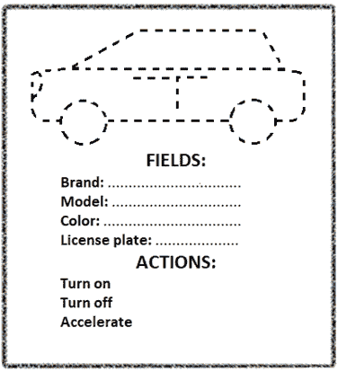
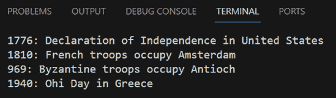

## 第三十八章

面向对象编程简介

### 38.1 什么是面向对象编程？

在第七部分中，你阅读或甚至编写的所有程序都在使用子程序（函数和空函数）。这种编程风格被称为过程式编程，大多数情况下都很不错！但是，当涉及到编写大型程序，或者在像微软、Facebook 或 Google 这样的大公司工作时，面向对象编程是必须使用的编程风格！

面向对象编程，通常简称为 OOP，是一种关注对象的编程风格。在 OOP 中，数据和功能被组合并封装在称为对象的东西中。应用面向对象编程原则可以使你更容易地维护代码，并编写其他人可以轻松理解和使用的代码。

“面向对象编程关注对象”的声明真正意味着什么？让我们考虑一个现实世界的例子。想象一辆车。你会如何描述一辆特定的车？它有特定的属性，如品牌、型号、颜色和车牌。此外，这辆车可以执行特定的动作，或者有人对它执行了这些动作。例如，有人可以打开或关闭它，加速或刹车，或者停车。

在 OOP 中，这辆车可以表示为一个具有特定属性（通常称为字段）的对象，它可以执行特定的动作（称为方法）。

显然，你现在可能正在问自己，“我如何首先创建对象？”答案是简单的！你需要的只是一个类。一个类就像一个“橡皮印泥章”！在图 38-1 中有一个章（这是类）和四个空字段以及三个动作（方法）。

图 38-1 一节课就像一个“橡皮印泥章”

使用这个章的人可以印出很多汽车（这些都是对象）。例如，在图 38-2 中，一个小男孩印出了那两辆汽车，然后他为它们上色，并为每辆汽车的各个字段填充了特定的属性。

图 38-2 你可以使用相同的橡皮章作为模板来印出许多汽车

创建一个新对象（类的新的实例）的过程被称为“实例化”。

类是一个模板，每个对象都是从一个类创建的。每个类都应该被设计来执行一个，并且只有一个任务！这就是为什么，大多数情况下，需要使用多个类来构建整个应用程序！

在面向对象编程（OOP）中，橡皮章就是类。你可以使用相同的类作为模板来创建（实例化）许多对象！

### 38.2 Python 中的类和对象

现在你已经掌握了类和对象背后的理论概念，让我们深入编写一个真正的 Python 类！下面的代码片段创建了 Car 类。类中有四个字段和三个方法。

class Car:

# 定义四个字段

brand = ""

model = ""

color = ""

licensePlate = ""

#Define method turnOn()

def turnOn(self):

> print("汽车开启")

#Define method turnOff()

def turnOff(self):

> print("汽车关闭")

#Define method accelerate()

def accelerate(self):

> print("汽车加速")

这里有一个有趣的细节：类内的字段和方法本质上只是普通的变量和子程序！

在面向对象编程（OOP）中，使用的术语是“方法”（而不是“函数”）和“void 方法”（而不是“void 函数”）。

Car 类只是一个模板。目前还没有创建任何对象！

无需现在就好奇这个 self 关键字是什么，它将在下一节（第 38.3 节）中详细解释。

类的名称应遵循大驼峰命名法，以及第 5.4 节中提到的所有变量命名规则。

要创建两个对象（换句话说，创建 Car 类的两个实例），你需要以下两行代码。

car1 = Car()

car2 = Car()

对象不过是一个类的实例，这就是为什么它很多时候可能被称为“类实例”或“类对象”。

当你创建一个新的对象（类的新的实例）时，这个过程被称为“实例化”。

现在你已经创建了（实例化）两个对象，你可以为它们的字段赋值。为此，使用点表示法。这意味着你需要写出对象的名称，然后是一个点，然后是你想要访问的字段或方法的名称。以下代码片段创建了两个对象，car1 和 car2，并将值赋给它们的字段。

car1 = Car()

car2 = Car()

car1.brand = "Mazda"

car1.model = "6"

car1.color = "Gray"

car1.licensePlate = "AB1234"

car2.brand = "Ford"

car2.model = "Focus"

car2.color = "Blue"

car2.licensePlate = "XY9876"

print(car1.brand)    #它显示：马自达

print(car2.brand)    #它显示：福特

在上面的例子中，car1 和 car2 是同一类的两个实例。使用 car1 和 car2 的点表示法可以让你一次只引用一个实例。如果你对其中一个实例进行任何更改，它将不会影响另一个实例！

The next code fragment calls the methods turnOff() and accelerate() of the objects car1 and car2 respectively.

car1.turnOff()

car2.accelerate()

类是一个不能执行的模板，而对象是类的实例，它可以被执行！

一个类可以被用来创建（实例化）你想要的任意数量的对象！

### 38.3 构造函数和关键字 self

在 Python 中，有一个具有特殊作用的方法，称为构造函数。构造函数在创建类的实例（对象）时自动执行。您想要在对象中进行的任何初始化都可以在这个方法中完成。在 Python 中，构造函数是一个名为 __init__() 的方法。

请注意，在名称的开头和结尾都有一个双下划线 __init__()。

看一下下面的例子。构造函数方法 __init__() 会自动调用两次，一次是在创建对象 p1 时，一次是在创建对象 p2 时，这意味着会显示两次消息“创建了一个对象”。

 file_38.3a

class Person:

# 定义构造函数

def __init__(self):

> print("创建了一个对象")

# 主代码从这里开始

p1 = Person()    # 创建对象 p1

p2 = Person()    # 创建对象 p2

正如您可能已经注意到的，在 __init__() 方法的形式参数列表中，有一个名为 self 的参数。在 Python 的面向对象编程（OOP）中，这个参数作为一个引用变量，指向当前对象。看一下下面的例子。

 file_38.3b

class Person:

name = None

age = None

# 定义构造函数

def __init__(self):

> print("创建了一个对象")

def sayInfo(self):

> print("我是", self.name)
> 
> print("我今年", self.age, "岁")

# 主代码从这里开始

person1 = Person()    # 创建对象 person1

# 为其字段分配值

person1.name = "John"

person1.age = 14

person1.sayInfo()    # 调用对象 person1 的 sayInfo() 方法

尽管在调用方法的语句 person1.sayInfo() 中没有实际的参数，但在定义方法的语句 def sayInfo(self) 中确实存在一个形式参数（关键字 self）。显然，如果调用方式是 person1.sayInfo(person1)，那就更正确了！这样写，会更有意义！实际的参数 person1 将被传递（分配）给形式参数 self！是的，这可能是更正确的做法，但请始终记住，Python 是一种“写得更少，做得更多”的语言！所以您不需要传递对象本身。Python 会为您做这件事！

如果您不记得形式参数或实际参数是什么，请重新阅读第 35.5 节。

请注意，在方法外部（但在类内部）声明字段时，您需要写出字段名称，而不使用点表示法。然而，从方法内部访问字段时，您必须使用点表示法（例如，self.name 和 self.age）。

你现在可能心中有一个问题：“为什么在方法 sayInfo()中需要将字段 name 和 age 引用为 self.name 和 self.age？在它们前面使用关键字 self 真的有必要吗？”一个简单的答案是，始终存在一种可能性，您在方法内部可能有两个额外的同名的局部变量（name 和 age）。因此，您需要一种方法来区分这些局部变量和对象的字段。如果您感到困惑，请尝试理解以下示例。在 MyClass 类中有一个字段 b，在 MyClass 类的 myMethod()方法中有一个局部变量 b。self 关键字用于区分局部变量和字段。

 file_38.3c

class FooClass:

b = None   #这是一个字段

def myMethod(self):

> b = "***"    #这是一个局部变量
> 
> print(b, self.b, b)

#主代码从这里开始

x = FooClass()    #创建对象 x

x.b = "Hello!"   #为其字段赋值

x.myMethod()     #它显示：*** Hello! ***

关键字 self 可以用于在类的方法中引用类的任何成员（字段或方法）。

### 38.4 向构造函数传递初始值

任何方法，即使是构造函数方法 __init__()，都可以在其形式参数列表中有形式参数。例如，在构造函数方法中，您可以使用参数在创建对象时传递一些初始值。以下示例创建了四个对象，每个对象代表希腊神话中的泰坦^([[24]](footnotes.html#Endnote_24))。

 file_38.4a

class Titan:

name = None

gender  = None

#定义构造函数

def __init__(self, n, g):

> self.name = n
> 
> self.gender = g

#主代码从这里开始

titan1 = Titan("Cronus", "male")   #创建对象 titan1

titan2 = Titan("Oceanus", "male")  #创建对象 titan2

titan3 = Titan("Rhea", "female")   #创建对象 titan3

titan4 = Titan("Phoebe", "female") #创建对象 titan4

请注意，尽管构造函数中有三个形式参数，但在调用构造函数的语句中只有两个实际参数。由于 Python 是一种“多做少写”的计算机语言，因此不需要传递对象本身。Python 会为您完成这项工作！

在 Python 中，一个字段和一个局部变量（甚至是一个形式参数）可以具有相同的名称是合法的。因此，Titan 类也可以写成如下形式

class Titan:

name = None

gender = None

#定义构造函数

def __init__(self, name, gender ):

> self.name = name  #字段和参数可以具有相同的名称
> 
> self.gender = gender

变量 name 和 gender 是用于将值传递给构造函数的参数，而 self.name 和 self.gender 是用于在对象内部存储值的字段。

最后但同样重要的是，在 Python 中，您可以进一步简化 Titan 类。以下示例使用 Titan 类的简化版本。

 file_38.4b

class Titan:

#定义构造函数

def __init__(self, name, gender):

> self.name = name
> 
> self.gender = gender

#主代码从这里开始

titan1 = Titan("克洛诺斯", "male")   #创建对象 titan1

titan2 = Titan("欧申纳斯", "male")  #创建对象 titan2

titan3 = Titan("瑞亚", "female")   #创建对象 titan3

titan4 = Titan("波雅", "female") #创建对象 titan4

print(titan1.name, "-", titan1.gender)

print(titan2.name, "-", titan2.gender)

print(titan3.name, "-", titan3.gender)

print(titan4.name, "-", titan4.gender)

### 38.5 类字段与实例字段

到目前为止，你所学的知识是，将字段声明在构造函数外部并不太糟糕，就像下面的程序所示。

class HistoryEvents:

day = None  #此字段在内部声明

> > > #构造函数。它被称为“类字段”

#定义构造函数

def __init__(self):

> print("对象实例化")

#主代码从这里开始

h1 = HistoryEvents()        #创建对象 h1

h1.day = "4th of July"

h2 = HistoryEvents()        #创建对象 h2

h2.day = "28th of October"

print(h1.day)

print(h2.day)

你还学会了可以重写此代码，并将字段 day 声明在构造函数内部，就像这里所示。

class HistoryEvents:

#定义构造函数

def __init__(self, day):

> print("对象实例化")
> 
> self.day = day  #此字段在内部声明
> 
> > > > > #构造函数。它被称为“实例字段”

#主代码从这里开始

h1 = HistoryEvents("4th of July")     #创建对象 h1

h2 = HistoryEvents("28th of October") #创建对象 h2

print(h1.day)

print(h2.day)

当字段在构造函数外部声明时，它被称为“类字段”，但当它在构造函数内部声明时，它被称为“实例字段”。

类字段由类的所有实例共享，而实例字段对每个实例都是唯一的。

所以，哪种编程风格更好？它们似乎都还不错！嗯，第二个不仅更好——你可以说这是编写类的正确方式！为什么？因为，在某些情况下，当可变数据结构（如列表和字典）用作类字段时，可能会产生不希望的结果。看看下面的例子。

class HistoryEvents:

events = []         #由所有实例共享的类字段

#定义构造函数

def __init__(self, day):

> self.day = day  #每个实例唯一的实例字段

#主代码从这里开始

h1 = HistoryEvents("4th of July")  #创建对象 h1

#为 h1 的字段赋值

h1.events.append("1776: 美国独立宣言")

h1.events.append("1810: 法国军队占领阿姆斯特丹")

h2 = HistoryEvents("28th of October")  #创建对象 h2

#为 h2 的字段赋值

h2.events.append("969: 拜占庭军队占领安条克")

h2.events.append("1940: 希腊的国庆日")

for event in h1.events:

print(event)

你可能预期最后一个 for 循环只会显示 7 月 4 日的两个事件。你的想法是正确的，但输出结果证明你是错的！最后一个 for 循环显示了四个事件，如图 38-3 所示。

图 38-3 当可变数据类型用作类字段时，可能会产生不希望的结果

列表事件是一个可变的数据结构。在 Python 中，可变数据结构不应用作类字段，因为这会产生不希望的结果。

建议尽可能少地使用类字段！使用实例字段！类字段越少，越好。

下一个示例是上一个正确版本的。

 file_38.5

class HistoryEvents:

#定义构造函数

def __init__(self, day):

> self.day = day   #每个实例独有的实例字段
> 
> self.events = [] #每个实例独有的实例字段

#主代码从这里开始

h1 = HistoryEvents("7 月 4 日")     #创建对象 h1

#将值分配给 h1 的字段

h1.events.append("1776: 美利坚合众国独立宣言")

h1.events.append("1810: 法国军队占领阿姆斯特丹")

h2 = HistoryEvents("10 月 28 日") #创建对象 h2

#将值分配给 h2 的字段

h2.events.append("969: 东罗马军队占领安条克")

h2.events.append("1940: 希腊的国庆日")

for event in h1.events:

print(event)

### 38.6 获取器和设置器方法与属性

字段是在类中直接声明的变量。然而，面向对象编程的原则表明，类中的数据应该是隐藏的，并且免受意外更改。想象一下，有一天你可能会编写其他程序员将在他们的程序中使用的类。所以，你不想让他们知道你的类里面是什么！你的类的内部操作应该对外界保密。通过不暴露字段，你成功地隐藏了类的内部实现。字段应保持为类的私有，并通过获取和设置方法（或通过属性）访问。

一般来说，程序员应该只使用具有私有或受保护访问权限的数据字段。在 Java 或 C# 中，您可以使用特殊关键字将字段设置为私有或受保护。

让我们通过一个示例来尝试理解所有这些新内容。假设你编写了以下将华氏温度转换为摄氏温度等价的类的代码。

 file_38.6a

class FahrenheitToCelsius:

def __init__(self, value):

> self.temperature = value

#此方法获取温度

def getTemperature(self):

> return 5.0 / 9.0 * (self.temperature - 32.0)

#主代码从这里开始

x = FahrenheitToCelsius(-68)   #创建对象 x

print(x.getTemperature())

这个类几乎完美，但有一个主要缺点。它没有考虑到温度不能低于-459.67 华氏度（-273.15 摄氏度）。这个温度被称为绝对零度。因此，一个对物理一无所知的初学者程序员可能会像下面的代码片段所示，将-500 华氏度的值传递给构造函数。

x = FahrenheitToCelsius(-500)   #创建对象 x

打印(x.getTemperature())

尽管程序可以完美运行并显示-295.55 摄氏度的值，但遗憾的是，这个温度在整个宇宙中根本不存在！所以这个类的略微不同的版本可能部分解决了这个问题。

 file_38.6b

class FahrenheitToCelsius:

def __init__(self, value):

> self.setTemperature(value)  #使用方法设置字段 temperature 的值

#此方法获取温度

def getTemperature(self):

> return 5.0 / 9.0 * (self.temperature - 32.0)

#此方法设置温度

def setTemperature(self, value):

> if value >= -459.67:
> 
> > self.temperature = value
> > 
> else:
> 
> > raise ValueError("没有低于-459.67 的温度")

#主代码从这里开始

x = FahrenheitToCelsius(-50) #创建对象 x。这会调用构造函数，它，

> > > > > #依次调用 setter。

打印(x.getTemperature())

 raise 语句强制程序抛出异常（运行时错误），导致执行流程停止。

这次，使用了一个名为 setTemperature()的方法来设置字段 temperature 的值。这比之前好，但并不完全完美，因为程序员必须小心，并且每次想要更改字段 temperature 的值时都必须记住使用这个方法。问题是字段 temperature 的值仍然可以直接通过其名称直接更改，如下面的代码片段所示。

x = FahrenheitToCelsius(-50) #创建对象 x

打印(x.getTemperature())

x.setTemperature(-65)        #这是可以的！

打印(x.getTemperature())

x.temperature = -500         #遗憾的是，这仍然被允许！

打印(x.getTemperature())

这正是应该使用属性的地方！属性是一个类成员，它提供了一个灵活的机制来读取、写入或计算你想要保持私有的字段的值。属性暴露字段，但隐藏实现！

 file_38.6c

class FahrenheitToCelsius:

def __init__(self, value):

> self.temperature = value  #属性被初始化。这会调用 setter

def getTemperature(self):

> return 5.0 / 9 * (self._temperature - 32)

def setTemperature(self, value):

> if value >= -459.67:
> 
> > self._temperature = value
> > 
> else:
> 
> > raise ValueError("没有低于-459.67 的温度")

#定义一个属性

temperature = property(getTemperature, setTemperature)

#主代码从这里开始

x = FahrenheitToCelsius(-50)   #创建对象 x。这会调用构造函数，它，

> > > > > #依次调用 setter。

print(x.temperature)     #This calls the getter

x.temperature = -65      #This calls the setter.

print(x.temperature)     #This calls the getter.

x.temperature = -500     #This calls the setter and throws an error

print(x.temperature)

Note the underscore ( _ ) at the beginning of the field temperature. In Python, an underscore at the beginning of a variable name can be used to denote a “private field”.

So, what does the statement temperature = property(getTemperature, setTemperature) do anyway?

When a statement tries to access the value of the field temperature, the getTemperature() method is called automatically and similarly, when a statement tries to assign a value to the field temperature the setTemperature() method is called automatically! So, everything seems to be okay now! But is it, really?

One last thing can be done to make things even better! You can completely get rid of the methods getTemperature() and setTemperature() because you don't want to have two ways to access the value of the field temperature, as shown in the code fragment that follows

x = FahrenheitToCelsius(0)  #Create object x

#There are still two ways to access the value of the field _temperature

x.setTemperature(-100)  #Use the method

x.temperature = -100    #Use the property

In order to completely get rid of the methods getTemperature() and setTemperature() you can use some of the decorators that Python supports.

 file_38.6d

class FahrenheitToCelsius:

def __init__(self, value):

> self.temperature = value    #Property is initialized. This calls the setter

#Use the decorator @property to define the getter

@property

def temperature(self):

> return 5.0 / 9 * (self._temperature - 32)

#Use the decorator @field_name.setter to define the setter

@temperature.setter

def temperature(self, value):

> if value >= -459.67:
> 
> > self._temperature = value
> > 
> else:
> 
> > raise ValueError("There is no temperature below -459.67")

#Main code starts here

x = FahrenheitToCelsius(-50)  #Create object x. This calls the constructor which,

> > > > > #in turn, calls the setter.

print(x.temperature)          #This calls the getter.

x.temperature = -65           #This calls the setter.

print(x.temperature)          #This calls the getter.

x.temperature = -500          #This calls the setter and throws an error

print(x.temperature)

Please note that the two methods and the field share the same name, temperature.

A decorator is a function that takes another function as an argument and returns a new, prettier version of that function. Decorators allow you to change the behavior or extend the functionality of a function without changing the function's body.

#### 练习 38.6-1 罗马数字

罗马数字如下表所示。

| 数字 | 罗马数字 |
| --- | --- |
| 1 | I |
| 2 | II |
| 3 | III |
| 4 | IV |
| 5 | V |

Do the following:

i)Write a class named Romans which includes

a)定义一个名为 number 的属性。它将用于获取和设置名为 _number 的私有字段的整数值。设置器在数字未识别时必须抛出错误。

b)定义一个名为 roman 的属性。它将用于获取和设置名为 _number 的私有字段的罗马数字格式的值。设置器在罗马数字未识别时必须抛出错误。

ii)使用上述类，编写一个 Python 程序，显示与值 3 对应的罗马数字以及与罗马数字值“V”对应的数字。

解决方案

属性 number 的获取器和设置器非常简单，因此没有特别之处要解释。然而，属性 roman 的获取器和设置器需要一些解释。

属性 roman 的获取器可以编写如下

#定义获取器

@property

def roman(self):

if self._number == 1

> return "I"

elif self._number == 2

> return "II"

elif self._number == 3

> return "III"

elif self._number == 4

> return "IV"

elif self._number == 5

> return "V"

然而，由于你现在对字典了解很多，你可以使用更好的方法，如下面的代码片段所示。

#定义获取器

@property

def roman(self):

number2roman = {1: "I", 2: "II", 3: "III", 4: "IV", 5: "V"}

return number2roman[self._number]

因此，设置器可以如下所示

#定义设置器

@roman.setter

def roman(self, key):

> roman2number = {"I": 1, "II": 2, "III": 3, "IV": 4, "V": 5}
> 
> if key in roman2number:
> 
> > self._number = roman2number[key]
> > 
> else:
> 
> > raise ValueError("罗马数字未识别")

最终的 Python 程序如下

 file_38.6-1

class Romans:

#定义获取器

@property

def number(self):

> return self._number

#定义设置器

@number.setter

def number(self, value):

> if value >= 1 and value <= 5:
> 
> > self._number = value
> > 
> else:
> 
> > raise ValueError("数字未识别")

#定义获取器

@property

def roman(self):

> number2roman = {1: "I", 2: "II", 3: "III", 4: "IV", 5: "V"}
> 
> return number2roman[self._number]

#定义设置器

@roman.setter

def roman(self, key):

> roman2number = {"I": 1, "II": 2, "III": 3, "IV": 4, "V": 5}
> 
> if key in roman2number:
> 
> > self._number = roman2number[key]
> > 
> else:
> 
> > raise ValueError("罗马数字未识别")

#主代码从这里开始

x = Romans()        #创建对象 x

x.number = 3

print(x.number)     #显示：3

print(x.roman)      #显示：III

x.roman = "V"

print(x.number)     #显示：5

print(x.roman)      #显示：V

### 38.7 一个方法能否调用同一类中的另一个方法？

在第 36.2 节中，你学习了子程序可以调用另一个子程序。显然，当涉及到方法时，情况也是一样的——一个方法可以调用同一类中的另一个方法！毕竟，方法不过是子程序而已！所以，如果你想让一个方法调用同一类中的另一个方法，你应该在你想调用的方法前使用关键字 self（使用点符号）如以下示例所示。

 file_38.7

class JustAClass:

def foo1(self):

> print("foo1 was called")
> 
> self.foo2()     #Using dot notation to call foo2()

def foo2(self):

> print("foo2 was called")

#Main code starts here

x = JustAClass()

x.foo1()    #Call foo1() which, in turn, will call foo2()

#### 练习 38.7-1 做数学题

Do the following:

i)Write a class named DoingMath which includes

a)a void method named square that accepts a number through its formal argument list and then calculates its square and displays the message “The square of XX is YY”, where XX and YY must be replaced by actual values.

b)a void method named squareRoot that accepts a number through its formal argument list and then calculates its square root and displays the message “The square root of XX is YY” where XX and YY must be replaced by actual values. However, if the number is less than zero, the method must display an error message.

c)a void method named displayResults that accepts a number through its formal argument list and then calls the methods square() and squareRoot() to display the results.

ii)使用上述类，编写一个 Python 程序，提示用户输入一个数字。然后程序必须显示该数字的根和平方根。

Solution

这个练习相当简单。方法 square()、squareRoot()和 displayResults()必须在它们的正式参数列表中有一个形式参数，以便接受传递的值。解决方案如下。

 file_38.7-1

from math import sqrt

class DoingMath:

def square(self, x):          #Argument x accepts passed value

> print("The square of", x, "is", x ** 2)

def squareRoot(self, x):     #Argument x accepts passed value

> if x < 0:
> 
> > print("Cannot calculate square root")
> > 
> else:
> 
> > print("Square root of", x, "is", sqrt(x))

def displayResults(self, x): #Argument x accepts passed value

> self.square(x)
> 
> self.squareRoot(x)

#Main code starts here

dm = DoingMath()

b = float(input("Enter a number: "))

dm.displayResults(b)

### 38.8 类继承

类继承是面向对象编程的主要概念之一。它允许你使用另一个类作为基础来编写一个类。当一个类基于另一个类时，程序员会说“它继承了另一个类”。被继承的类称为父类、基类或超类。执行继承的类称为子类、派生类或子类。

子类会自动继承父类的所有方法和字段。然而，最好的部分是，你可以在子类中添加额外的特征（方法或字段）。因此，当你需要编写多个具有许多共同特征但又不完全相同类的代码时，你会使用继承。为此，你需要这样做。首先，编写一个包含所有共同特征的父类。接下来，编写继承自父类所有这些共同特征的子类。最后，添加任何额外的和独特的特征，这些特征是针对每个子类的。就像人类一样，正是这些额外的和独特的特征将子类与其父类区分开来，对吧？

假设你想编写一个程序来跟踪学校中的教师和学生。他们有一些共同的特征，例如姓名和年龄，但他们也有一些特定的特征，如教师的薪水和学生最后的成绩，这些特征不是共同的。你可以在这里做的是编写一个名为 SchoolMember 的父类，它包含教师和学生共有的所有特征。然后你可以编写两个子类，分别命名为 Teacher 和 Student，一个用于教师，一个用于学生。这两个子类都可以继承自 SchoolMember 类，但需要在子类 Teacher 和 Student 中相应地添加额外的字段，名为 salary 和 finalGrade。

父类 SchoolMember 如此展示

class SchoolMember:

def __init__(self, name, age):

> self.name = name
> 
> self.age = age
> 
> print("A school member was initialized")

如果你想让一个类继承自类 SchoolMember，它必须按照以下方式定义

class Name(SchoolMember):

def __init__(self, name, age [, …]):

> #Call the constructor of the class SchoolMember
> 
> super().__init__(name, age)
> 
> 为此类定义额外的字段
> 
> Additional statement or block of statements

为此类定义额外的方法和/或属性

其中 Name 是子类的名称。

因此，类 Teacher 可以如下定义

class Teacher(SchoolMember):

def __init__(self, name, age, salary):

> #Call the constructor of the class SchoolMember
> 
> super().__init__(name, age)
> 
> self.salary = salary   #This is an additional field for this class
> 
> print("A teacher was initialized") #This is an additional statement for this constructor

#This is an additional method for this class

def displayValues(self):

> print("Name:", self.name)
> 
> print("Age:", self.age)
> 
> print("Salary:", self.salary)

The statement super().__init__(name, age) 调用了 SchoolMember 类的构造函数，并初始化了 Teacher 类的字段 name 和 age。

同样，类 Student 可以如下定义

class Student(SchoolMember):

def __init__(self, name, age, finalGrade):

> #Call the constructor of the class SchoolMember
> 
> super().__init__(name, age)
> 
> self.finalGrade = finalGrade  #This is an additional field for this class
> 
> print("一个学生被初始化") #这是构造函数的附加语句

#这是类的附加方法

def displayValues(self):

> print("姓名:", self.name)
> 
> print("年龄:", self.age)
> 
> print("最终成绩:", self.finalGrade)

语句 super().__init__(name, age)调用了 SchoolMember 类的构造函数，并初始化了 Student 类的 name 和 age 字段。

完整的 Python 程序如下。

 file_38.8

#定义 SchoolMember 类。

class SchoolMember:

def __init__(self, name, age):

> self.name = name
> 
> self.age = age
> 
> print("一个学校成员被初始化")

#定义类 Teacher。它继承自类 SchoolMember。

class Teacher(SchoolMember):

def __init__(self, name, age, salary):

> #调用 SchoolMember 类的构造函数
> 
> super().__init__(name, age)
> 
> self.salary = salary   #这是类的附加字段
> 
> print("一个教师被初始化") #这是构造函数的附加语句

#这是类的附加方法

def displayValues(self):

> print("姓名:", self.name)
> 
> print("年龄:", self.age)
> 
> print("薪水:", self.salary)

#定义类 Student。它继承自类 SchoolMember。

class Student(SchoolMember):

def __init__(self, name, age, finalGrade):

> #调用 SchoolMember 类的构造函数
> 
> super().__init__(name, age)
> 
> self.finalGrade = finalGrade  #这是类的附加字段
> 
> print("一个学生被初始化") #这是构造函数的附加语句

#这是类的附加方法

def displayValues(self):

> print("姓名:", self.name)
> 
> print("年龄:", self.age)
> 
> print("最终成绩:", self.finalGrade)

#主代码从这里开始

teacher1 = Teacher("Mr. John Scott", 43, 35000)

teacher2 = Teacher("Mrs. Ann Carter", 5, 32000)

student1 = Student("Peter Nelson", 14, "A")

student2 = Student("Helen Morgan", 13, "B")

teacher1.displayValues()

teacher2.displayValues()

student1.displayValues()

student2.displayValues()

### 38.9 复习问题：对/错

对以下每个陈述选择对或错。

1)在编写大型程序时，过程式编程比面向对象编程更好。

2)面向对象编程侧重于对象。

3)一个对象结合了数据和功能。

4)面向对象编程使你更容易维护代码，但你的代码不容易被他人使用。

5)你可以不使用类来创建一个对象。

6)创建类的新实例的过程被称为“安装”。

7)在 OOP 中，你总是必须创建至少两个同一类的实例。

8)当创建一个对象时，会执行 __init__()方法。

9)当你创建同一类的两个实例时，类的 __init__()方法将执行两次。

10)当字段在构造函数外部声明时，它被称为“实例字段”。

11)类字段被类的所有实例共享。

12)面向对象编程的原则规定，类的数据应该被隐藏并且防止意外修改。

13)属性是一个类成员，它提供了一个灵活的机制来读取、写入或计算字段的值。

14)属性暴露了类的内部实现。

15)类继承是面向对象编程的主要概念之一。

16)当一个类被继承时，它被称为“派生类”。

17)父类会自动继承子类的所有方法和字段。

### 38.10 复习练习

完成以下练习。

1)执行以下操作

i)编写一个名为 Geometry 的类，它包括

a)一个名为 rectangleArea 的方法，它通过其形式参数列表接受矩形的底边和高度，然后计算并返回其面积。

b)一个名为 triangleArea 的方法，它通过其形式参数列表接受三角形的底边和高度，然后计算并返回其面积。已知

.

ii)使用上述类，编写一个 Python 程序，提示用户输入正方形的边长、矩形的底边和高度以及三角形的底边和高度，然后显示每个形状的面积。

2)执行以下操作

i)编写一个名为 Pet 的类，它包括

a)一个构造函数

b)一个名为 kind 的实例字段

c)一个名为 legsNumber 的实例字段

d)一个名为 startRunning 的无返回值方法，它显示消息“Pet is running”。

e)一个名为 stopRunning 的无返回值方法，它显示消息“Pet stopped”。

ii)编写一个 Python 程序，创建两个名为 Pet 的类的实例（例如，一只狗和一只猴子），然后调用它们的一些方法。

3)执行以下操作

i)在上一个练习的 Pet 类中

a)将字段 kind 和 legsNumber 更改为私有字段 _kind 和 _legsNumber。

b)添加一个名为 kind 的属性。它将用于获取和设置字段 _kind 的值。当字段设置为空值时，setter 必须抛出错误。

c)添加一个名为 legsNumber 的属性。它将用于获取和设置字段 _legsNumber 的值。当字段设置为负值时，setter 必须抛出错误。

d)将构造函数更改为通过其形式参数列表接受属性 kind 和 legsNumber 的初始值。

ii)编写一个 Python 程序，创建一个名为 Pets（例如，一只狗）的类的实例，然后调用它的两个方法。然后尝试为属性 kind 和 legsNumber 设置错误值，看看会发生什么。

4)执行以下操作

i)编写一个名为 Box 的类，它包括

a)一个构造函数，它通过其形式参数列表接受三个名为 _width, _length 和 _height 的私有字段的初始值。

b)一个名为 displayVolume 的无返回值方法，它计算并显示一个长方体的体积，其尺寸为 _width, _length 和 _height。已知

体积 = 宽度 × 长度 × 高度

c)一个名为 displayDimensions 的无返回值方法，它显示长方体的尺寸。

ii)使用上述类，编写一个 Python 程序，提示用户输入 30 个盒子的尺寸，然后显示它们的尺寸和体积。

提示：创建一个包含 30 个 Box 类对象的列表。

5)在上一练习的 Box 类中添加三个属性：width、length 和 height。它们将用于获取和设置字段 _width、_length 和 _height 的值。当相应的字段设置为负值或零时，setter 必须抛出错误。

6)执行以下操作

i)编写一个名为 Cube 的类，包括

a)a 构造函数，通过形式参数列表接受一个名为 _edge 的私有字段的初始值。

b)一个无返回值的方法名为 displayVolume，用于计算并显示边长为 _edge 的立方体的体积。已知

体积 = 边长³

c)一个名为 displayOneSurface 的无返回值方法，用于计算并显示边长为 _edge 的立方体一个面的表面积。

d)一个名为 displayTotalSurface 的无返回值方法，用于计算并显示边长为 _edge 的立方体的总表面积。已知

总表面积 = 6 × 边长²

ii)使用上述类，编写一个 Python 程序，提示用户输入立方体的边长，然后显示其体积、其中一个面的表面积和总表面积。

7)在上一练习的 Cube 类中添加一个名为 edge 的属性。它将用于获取和设置私有字段 _edge 的值。当字段设置为负值或零时，setter 必须抛出错误。

8)执行以下操作

i)编写一个名为 Circle 的类，包括

a)a 构造函数和一个名为 _radius 的私有字段，初始值为-1。

b)一个名为 radius 的属性。它将用于获取和设置字段 _radius 的值。当字段尚未设置时，getter 必须抛出错误，而当字段设置为负值或零时，setter 必须抛出错误。

c)一个名为 getDiameter 的方法，用于计算并返回半径为 _radius 的圆的直径。已知

直径 = 2 × 半径

d)一个名为 getArea 的方法，用于计算并返回半径为 _radius 的圆的面积。已知

面积 = 3.14 × 半径²

e)一个名为 getPerimeter 的方法，用于计算并返回半径为 _radius 的圆的周长。已知

周长 = 2 × 3.14 × 半径

ii)编写一个名为 displayMenu 的子程序，显示以下菜单。

1)输入半径

2)显示半径

3)显示直径

4)显示面积

5)显示周长

6)退出

iii)使用上述子程序和类，编写一个 Python 程序，显示之前提到的菜单并提示用户输入一个选择（1 到 6）。如果选择 1，程序必须提示用户输入一个半径。如果选择 2，程序必须显示在选择 1 中输入的半径。如果选择 3、4 或 5，程序必须相应地显示半径等于选择 1 中输入的半径的圆的直径、面积或周长。该过程必须重复用户希望进行的次数。

9) 假设你在一个即将创建文字处理应用程序的计算机软件公司工作。你被分配编写一个类，该类将用于向用户提供信息。

i)编写一个名为 Info 的类，包括

a)一个名为 userText 的属性。它将用于获取和设置名为 _userText 的私有字段的值。当字段设置为空值时，setter 必须抛出一个错误。

b)一个名为 getSpacesCount 的方法，它返回 userText 属性包含的总空格数。

c)一个名为 getWordsCount 的方法，它返回 userText 属性包含的总单词数。

d)一个名为 getVowelsCount 的方法，它返回 userText 属性包含的元音字母总数。

e)一个名为 getLettersCount 的方法，它返回 userText 属性包含的总字符数（不包括空格）。

ii)使用上述类，编写一个测试程序，提示用户输入文本，然后显示所有可用信息。假设用户只输入空格字符或字母（大写或小写），单词由单个空格字符分隔。

提示：在一个三个单词的文本中，有两个空格，这意味着单词总数比空格总数多一个。计算空格总数，然后你可以轻松地找到单词总数！

10) 在二战后的冷战期间，消息被加密，以便如果敌人截获它们，没有解密密钥就无法解密。一个非常简单的加密算法是字母旋转。该算法将所有字母向上移动 N 步，其中 N 是加密密钥。例如，如果加密密钥是 2，你可以通过将字母 A 替换为字母 C，将字母 B 替换为字母 D，将字母 C 替换为字母 E，以此类推来加密一条消息。 执行以下操作：

i)编写一个名为 EncryptDecrypt 的类，包括

a)一个构造函数和一个名为 _encrDecrKey 的私有字段，其初始值为-1。

b)一个名为 encrDecrKey 的属性。它将用于获取和设置名为 _encrDecrKey 的字段的值。当字段尚未设置时，getter 必须抛出一个错误，当字段未设置为 1 到 26 之间的值时，setter 必须抛出一个错误。

c)一个名为 encrypt 的方法，它通过其形式参数列表接受一条消息，然后返回加密后的消息。

d)一个名为 decrypt 的方法，它通过形式参数列表接受一个加密消息，然后返回解密后的消息。

ii)编写一个名为 displayMenu 的子程序，显示以下菜单：

1)输入加密/解密密钥

2)加密消息

3)解密消息

4)退出

iii)使用上述子程序和类，编写一个 Python 程序，显示之前提到的菜单，然后提示用户输入一个选择（1 到 4）。如果选择 1，程序必须提示用户输入加密/解密密钥。如果选择 2，程序必须提示用户输入一个消息，然后显示加密后的消息。如果选择 3，程序必须提示用户输入一个加密消息，然后显示解密后的消息。此过程必须根据用户的意愿重复进行。假设用户只输入小写字母或空格作为消息。

11)执行以下操作：

i)编写一个名为 Vehicle 的父类，它包含

a)一个构造函数，它通过形式参数列表接受三个实例字段名为 numberOfWheels、color、length、width 和 height 的初始值。

b)两个名为 startEngine 和 stopEngine 的 void 方法，分别显示消息“引擎已启动”和“引擎已停止”。

ii)编写一个名为 Car 的子类，它继承自 Vehicle 类。此外，它还包含

a)一个带有额外实例字段 bootCapacity 和初始值零的构造函数。

b)一个名为 turnWindshieldWipersOn 的 void 方法，显示消息“雨刷已被打开！”。

iii)编写一个名为 Motorcycle 的子类，它继承自 Vehicle 类。此外，它还必须包含

a)一个带有额外实例字段 hasLuggage 和初始值 False 的构造函数。

b)一个名为 doAWheelie 的 void 方法，显示消息“我在做轮滑！！！”

iv)使用上述类，编写一个 Python 程序，创建两个 Car 类的实例和一个 Motorcycle 类的实例，为它们的字段分配一些值，然后调用它们的所有方法。

12)按照以下方式修改第 38.8 节 - 类继承（文件 _38.8）的 Python 程序：

i)在 SchoolMember 类中，将字段 name 和 age 更改为私有字段 _name 和 _age，并为它们添加 getter 和 setter 方法。当 _name 字段的 setter 方法设置为空值时必须抛出错误，而 _age 字段的 setter 方法在设置为负值或零时必须抛出错误。

ii)在 Teacher 类中，将字段 salary 更改为私有字段 _salary，并为它添加 getter 和 setter 方法。当字段设置为负值时，setter 方法必须抛出错误。

iii)在 Student 类中，将字段 finalGrade 改为私有字段 _finalGrade，并为它添加 getter 和 setter 方法。setter 方法必须在字段被设置为 A、B、C、D、E 或 F 之外的值时抛出错误。

13)修改前一个练习中的 Python 程序，使其使用属性而不是 getter 和 setter 方法。
