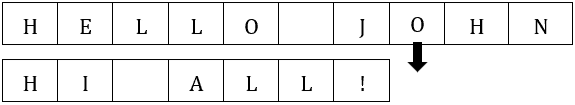
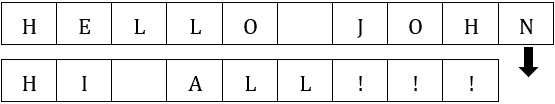

## 第三十九章

文件介绍

### 39.1 简介

你迄今为止看到的所有程序都可以描述为“临时”的。尽管它们读取一些输入数据并显示一些输出结果，但所有这些值都存储在计算机主内存（RAM）中的变量、列表和其他数据结构中；因此，当程序执行完毕时，这些值都会丢失。即使这种情况没有发生，当你关闭计算机时，它们肯定也会丢失。然而，有许多情况下，你需要将这些值保存在更持久的存储设备中，例如硬盘驱动器（HDD）或固态硬盘（SSD）。

Python 可以读取存储在计算机文件中的输入数据或将输出结果写入同一文件或不同文件。这种读取/写入过程称为文件 I/O（文件输入/输出），可以使用 Python 的一些现成函数和方法实现。

通常，所使用的文件类型是文本文件。文本文件包含一系列字符，并存储在永久存储设备（硬盘驱动器（HDD）、固态硬盘（SSD）等）中。

在计算机编程中使用的另一种类型的文件是“二进制文件”；然而，这种类型超出了本书的范围，将不再进一步分析。

在以下章节中，你将学习如何打开和关闭文本文件，如何从文本文件中读取值或写入值，甚至如何在其中搜索值。

### 39.2 打开文件

要使用文件（用于读取、写入或追加），你需要做的第一件事是打开文件。Python 语句的一般形式是

descriptor = open(filename [, mode])

where

►描述符是文件对象的名称，可以用来从文件中读取、写入或追加内容。

►文件名是一个字符串，包含存储在硬盘（或任何其他存储设备，如 SSD、闪存 U 盘等）中的文件夹（目录）和文件名。

►模式是一个字符串，它定义了你想访问文件文件名的方式。此参数是可选的。如果省略，其默认值是“r”。此参数的三个基本值如下表所示。

| 模式 | 描述 |
| --- | --- |
| r | 它以读取模式打开文本文件。文件指针位于文件开头（位置 0）。如果文件文件名不存在，Python 将抛出运行时错误。 |
| w | 它以写入模式打开文本文件。如果文件文件名已存在，Python 将覆盖它；否则，Python 将创建一个新文件。 |
| a | 它以追加模式打开文本文件，保留文件中的任何先前内容。文件指针位于文件末尾。如果文件文件名不存在，Python 将创建一个新文件。 |

在某种程度上，文件指针可以比作列表的索引。你将在第 39.5 节中了解更多关于文件指针的内容。

让我们看看一些示例。

示例 1

以下语句

f = open("names.txt", "r") # 等价于：f = open("names.txt")

打开文本文件“names.txt”进行读取。文件“names.txt”必须位于源代码保存的同一文件夹（目录）中。如果文件不存在，Python 会抛出运行时错误。

open()函数是 Python 的内置函数。您不需要从任何库中导入它。

示例 2

以下语句

fgrades = open("c:/temp/grades.txt", "w")

在文件夹（目录）“c:/temp”中创建文本文件“grades.txt”并打开它进行写入。如果文件已存在，Python 将覆盖它。

注意，文件路径的定义使用斜杠（/）而不是反斜杠（\）字符。

示例 3

以下语句

fgrades = open("c:/temp/students/grades.txt", "a")

打开文本文件“grades.txt”进行追加。该文件必须位于文件夹（目录）“c:/temp”的子文件夹（子目录）“students”中。如果文件不存在，Python 将创建一个新文件。

### 39.3 关闭文件

在完成对文件的读取、写入或追加操作后，使用 close()方法关闭文件至关重要。此方法表示文件的使用已完成，这将导致操作系统（OS）保存主内存（RAM）中可能存在的任何未保存数据。close()方法的通用形式如下：

descriptor.close()

其中，描述符是用于打开文件的文件对象的名称。

让我们看看一些示例。

示例 1

以下代码片段打开文本文件“c:/temp/data.txt”进行读取，并在最后关闭它。

fst = open("c:/temp/data.txt")

一个语句或语句块

fst.close()

注意，当省略模式参数时，默认值是 "r"。

示例 2

以下代码片段打开文本文件“temperatures.txt”进行追加，并在最后关闭它。

f = open("temperatures.txt", "a")

一个语句或语句块

f.close()

### 39.4 在文件中写入（或追加）字符串

要在文件中写入字符串（甚至追加字符串），可以使用 write()方法。此方法的通用形式如下：

descriptor.write(str)

其中

►描述符是用于打开文件的文件对象的名称。

►str 是要写入（或追加到）文件中的字符串值。

以下示例在文件夹（目录）“c:/temp”中创建文件“f_data39.4-i.txt”。如果文件“f_data39.4-i.txt”已存在，Python 将覆盖它；否则，Python 将创建一个新文件。然后，程序使用 write()方法在文件中写入三个字符串。

 file_39.4a

PATH = "c:/temp/"

fout = open(PATH + "f_data39.4-i.txt", "w")

fout.write("Good Morning")

fout.write("Good Evening")

fout.write("Good Night")

fout.close()

尝试执行上述程序，然后找到并打开（使用记事本应用程序）最近创建的“c:/temp/f_data39.4-i.txt”文件。你在文件中看到的是以下内容：

Good MorningGood EveningGood Night

所有三行字符串都写在了同一行。这是因为，与您熟悉的 print 语句不同，write() 方法不会在字符串末尾自动添加“换行符”。

要打开一个文本文件并查看其中的内容，您可以使用简单的记事本应用程序，例如 Windows 的记事本。或者，您可以从以下地址免费下载并使用 Notepad++ 应用程序：

[`notepad-plus-plus.org`](https://notepad-plus-plus.org)

要强制 Python 写入“换行符”，可以使用特殊的字符序列 \n（在第 6.2 节中介绍）。下一个示例将打开之前创建的文件“c:/temp/f_data39.4-i.txt”进行追加。随后，将写入一个“换行符”和三行文本。

 file_39.4b

PATH = "c:/temp/"

fout = open(PATH + "f_data39.4-i.txt", "a")

fout.write("\n")

fout.write("Hello!\n")

fout.write("Hi!\n")

fout.write("Bye!\n")

fout.close()

如果您执行此程序，然后使用记事本应用程序定位并打开“c:/temp/f_data39-i.txt”文件，您现在将看到以下内容：

Good MorningGood EveningGood Night

Hello!

Hi!

Bye!

在打开文件进行追加之前，第一行“Good MorningGood EveningGood Night”已经存在于文件中。

下一个示例在“c:/temp”文件夹中创建文件“f_data39.4-ii.txt”。如果文件“f_data39.4-ii.txt”已存在，Python 将覆盖它，否则，Python 将创建一个新文件。然后，程序使用 write() 方法在文件中写入 10 个字符串，每个字符串占一行。

 file_39.4c

PATH = "c:/temp/"

fout = open(PATH + "f_data39.4-ii.txt", "w")

for i in range(1, 11):

fout.write("Line " + str(i) + "\n")

fout.close()

write() 方法的参数必须是字符串类型。如果您想在文件中写入一个数字（整数或浮点数），您必须首先使用 str() 函数将其转换为字符串。

### 39.5 文件指针

如前所述，文件指针与列表索引非常相似。两者都用于指定读取信息或写入新信息的起点。然而，文件指针与列表索引的主要区别在于，每次执行读取或写入操作时，前者会自动移动。

假设一个文件已经包含消息“HELLO JOHN\nHI ALL!”。如果您为此特定文件打开读取，文件指针将自动放置在文件的开头，如下所示。

如果你现在执行读取操作（如下一节所述），读取将从文件指针指示的位置开始，指针将自动向前移动，移动的位数与读取的字符数相同。以下是从文件中读取 6 个字符时文件指针将处于的位置。

随后的读取操作将从单词“JOHN”开始的位置开始。

相反，如果你为追加而打开一个文件，文件指针将自动定位在文件末尾，如下所示：

如果你随后执行写操作，写入将从文件指针指示的位置开始，指针将自动向前移动，移动的位数与你在文件中写入的字符数相同。

### 39.6 从文件中读取

假设文件“f_data39.6.txt”包含以下文本。

15.3 15 向下取整

22.6 23 向上取整

55.5 56 再次向上取整

读取到当前行的末尾

要从文件当前位置读取所有字符直到当前行的末尾并将它们赋值给变量 var_name_str，你可以使用以下一般形式的语句

var_name_str = descriptor.readline()

其中

►descriptor 是用于打开文件的文件对象名称。

►var_name_str 可以是任何类型的字符串变量。

下面的程序将文件“f_data39.6.txt”的三个行赋值给变量 s1, s2 和 s3。

 file_39.6a

PATH = "c:/temp/"

fin = open(PATH + "f_data39.6.txt", "r")

s1 = fin.readline()

s2 = fin.readline()

s3 = fin.readline()

fin.close()

print(s1, end = "")  #它显示：15.3 15 向下取整

print(s2, end = "")  #它显示：22.6 23 向上取整

print(s3, end = "")  #它显示：55.5 56 再次向上取整

正如你所知，参数 end = "" 取消了打印语句末尾的“换行符”。然而，如果你执行前面的示例，你会注意到文件的三行是依次显示的。这是因为文件中（每行的末尾）已经存在换行符（特殊字符序列 \n），并且它们被分配给了变量 s1, s2 和 s3。如果你想去除这些换行符，可以使用 strip() 方法（在第 14.3 节中介绍）。

读取一些字符或直到文件末尾

要从当前位置读取指定数量的字符并将它们赋值给变量 var_name_str，你可以使用以下一般形式的语句。请注意，length 参数是可选的。如果省略，则从当前位置读取直到文件末尾的所有字符。

var_name_str = descriptor.read([length])

其中

►描述符是用于打开文件的文件对象的名称。

►var_name_str 可以是任何字符串类型的变量。

►长度可以是任何大于 0 的整数类型的值。

以下程序将文件“f_data39.6.txt”的前两个值分配给变量 d1、i1，并将第一行的文本分配给变量 s1，同时移除换行符。然后，对文件的第二行执行相同的操作，将值分配给变量 d2、i2 和 s2。

 file_39.6b

PATH = "c:/temp/"

fin = open(PATH + "f_data39.6.txt", "r")

d1 = fin.read(4)              #将'15.3'作为字符串读取

i1 = fin.read(3)              #将' 15'作为字符串读取（包括前导空格）

s1 = fin.readline().strip()   #读取第一行文本并移除换行符

d2 = float(fin.read(4))       #将 22.6 作为浮点数读取

i2 = int(fin.read(3))         #将 23 作为整数读取

s2 = fin.readline().strip()   #读取第二行文本并移除换行符

fin.close()

print(d1)  #它显示：15.3

print(i1)  #它显示： 15

print(s1)  #它显示：向下取整

print(d2)  #d2 是一个浮点数。它显示：22.6

print(i2)  #i2 是一个整数。它显示：23

print(s2)  #它显示：向上取整

readline()方法从文件当前位置读取所有字符，直到当前行的末尾。

在下一个示例中，read()方法将文件“f_data39.6.txt”的全部内容分配给变量 s。

 file_39.6c

PATH = "c:/temp/"

fin = open(PATH + "f_data39.6.txt", "r")

s = fin.read()

fin.close()

print(s)

### 39.7 遍历文件内容

遍历文件内容有三种方法。

假设文件“f_to_be_or_not_to_be.txt”包含以下文本：

要是，还是不是：这是个问题：

是否在心灵中忍受

生活的箭矢和命运的狂傲，

或者拿起武器对抗海上的麻烦，

通过对抗结束它们？去死：去睡；

现在，让我们看看所有三种方法。

第一种方法

这种方法将文件的全部内容分配给一个变量，然后使用 for 结构遍历变量的字符，如下面的示例所示。

 file_39.7a

PATH = "c:/temp/"

fin = open(PATH + "f_to_be_or_not_to_be.txt", "r")

s = fin.read()  #将文件内容分配给变量 s

fin.close()     #关闭文件。不再需要保持打开状态！

#遍历变量 s 的内容

for i in range(len(s)):

print(s[i])

下一个示例几乎做了同样的事情，但没有使用变量 s。

 file_39.7b

PATH = "c:/temp/"

fin = open(PATH + "f_to_be_or_not_to_be.txt", "r")

for letter in fin.read():

print(letter)

fin.close()

这种方法在处理大文件时并不适用。

第二种方法

一种更好的方法是使用 for 结构直接访问文件的内容的每一行来迭代文件。以下示例显示文件的所有行，每次迭代一行。

 file_39.7c

PATH = "c:/temp/"

fin = open(PATH + "f_to_be_or_not_to_be.txt", "r")

for line in fin:

print(line, end = "")

fin.close()

第三种方法

另一种方法是使用 while 循环直接访问文件的内容的每一行来迭代文件。以下示例显示文件的所有行，每次迭代一行。

 file_39.7d

PATH = "c:/temp/"

fin = open(PATH + "f_to_be_or_not_to_be.txt", "r")

line = fin.readline()

while line != "":

print(line, end = "")

line = fin.readline()

fin.close()

read()和 readline()方法在当前位置处于文件末尾时返回空字符串。

### 39.8 复习问题：正确/错误

对于以下每个陈述，选择正确或错误。

1)当你关闭计算机时，文件的内容会丢失。

2)如果你使用“r”参数打开文件，这意味着如果文件不存在，Python 会创建一个新的文件。

3)如果你使用“a”参数打开文件，这意味着如果文件不存在，Python 会创建一个新的文件。

4)如果你使用“w”参数打开文件，这意味着如果文件不存在，Python 会抛出一个运行时错误。

5)f = open("filename", "a")语句会覆盖文件 filename（当文件已存在时）。

6)以下程序（不是代码片段）是正确的

ff = open("grades.txt", "r")

print(ff.readline())

fff.close()

7)以下代码片段是正确的

f = open("grades.txt", "w")

print(f.read())

8)以下代码片段是正确的

f = open("grades.txt")

f.write("OK")

9)以下代码片段是正确的

f = open("grades.txt", "w")

f.write("OK")

10)如果文件“test.txt”中有 10 个字符，执行以下程序后，文件的大小会变大。

f = open("test.txt", "w")

f.write("你好")

f.close()

11)执行以下程序后，文件“test.txt”的大小会变大。

f = open("test.txt", "a")

f.write("你好")

f.close()

12)以下代码片段是正确的。

f = open("c:/data/test.txt", "w")

f.write(10)

f.close()

13)重复执行以下程序三次后，文件“test.txt”中只有两行文本。

f = open("test.txt", "a")

f.write("早上好\n")

f.write("晚上好\n")

f.close()

14)重复执行以下程序三次后，文件“test.txt”中只有两行文本。

f = open("test.txt", "w")

f.write("早上好")

f.write("晚上好")

f.close()

15)重复执行以下程序三次后，文件“test.txt”中只有两行文本。

f = open("test.txt", "w")

f.write("早上好\n")

f.write("晚上好\n")

f.close()

16) readline() 方法从文件中读取一行。

17) read() 方法总是读取文件中的所有字符。

18) 你不能使用 while 循环遍历文件的内容。

19) 你不能使用 for 循环遍历文件的内容。

20) 假设文件“test.txt”中有两行文本。在执行以下代码片段后，用户屏幕上只显示一行文本。

fin = open("data.txt")

for line in fin:

print(line.strip(), end = "")

fin.close()

21) 如果当前位置在文件的末尾，并且执行了 read() 方法，Python 返回一个空字符串。

22) 如果文件“test.txt”包含以下文本

Hello

World!

然后，以下代码片段在屏幕上显示“LOL!”，不带双引号。

x = []

f = open("test.txt")

x.append(f.readline())

x.append(f.readline())

f.close()

a = ""

a += x[0][2]

a += x[0][4]

a += x[1][3]

a += x[1][5]

print(a.upper())

### 39.9 复习练习

完成以下练习。

1) 编写一个 Python 程序，创建一个文本文件并将一周中的日子（星期日、星期一等），每个一行写入。

2) 编写一个 Python 程序，从上一个练习中创建的文件中读取一周中的日子（星期日、星期一等）并将它们存储到一个列表中。然后，程序必须以与它们在列表中存储的顺序相反的顺序显示一周中的日子。

3) 编写一个 Python 程序，将“*** 文件结束 ***”文本追加到上一个练习中的文件中，不带双引号。

4) 编写一个 Python 程序，将 50 个随机整数（介于 1 和 100 之间）写入名为“randoms.txt”的文件中，每个一行。

5) 编写一个 Python 程序，创建 10 个文件，分别命名为“file1.txt”、“file2.txt”等，“file10.txt”，并在每个文件中写入一个随机的 3 位整数。

6) 编写一个 Python 程序，将以下乘法表写入文件。

1 x 1 = 1

1 x 2 = 2

1 x 3 = 3

1 x 4 = 4

2 x 1 = 2

2 x 2 = 4

2 x 3 = 6

2 x 4 = 8

…

…

10 x 1 = 10

10 x 2 = 20

10 x 3 = 30

10 x 4 = 40

7) 编写一个 Python 程序，显示文件中每行的字符数。

8) 编写一个 Python 程序，显示文件中存在的字符数和行数。

9) 编写一个 Python 程序，对于文件的每一行，如果该行中有标点符号（仅检查逗号、句号和感叹号），则显示消息“第 XX 行有标点符号”。请注意，XX 必须替换为实际值。
