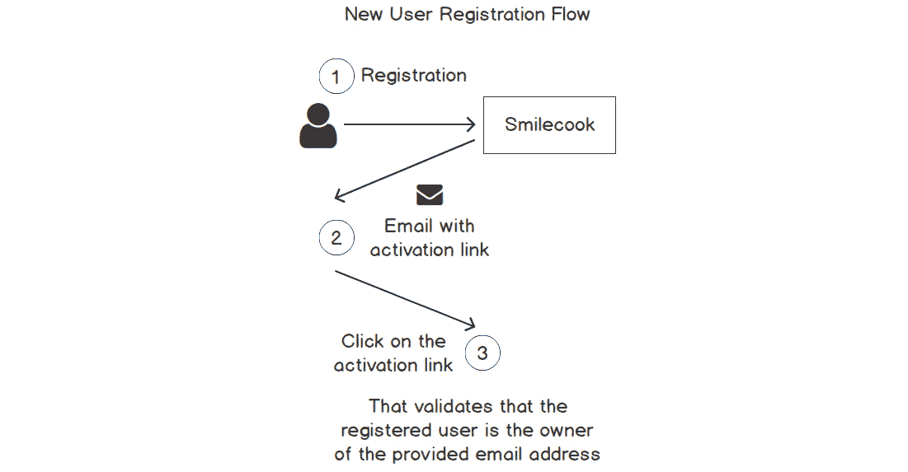
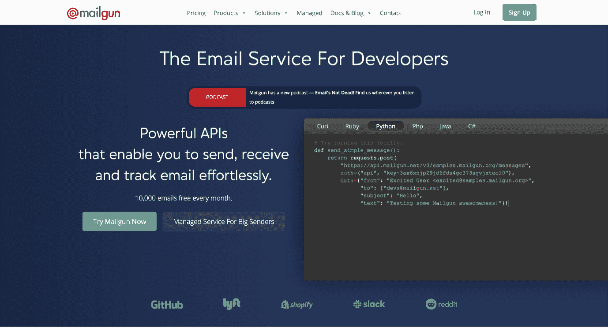
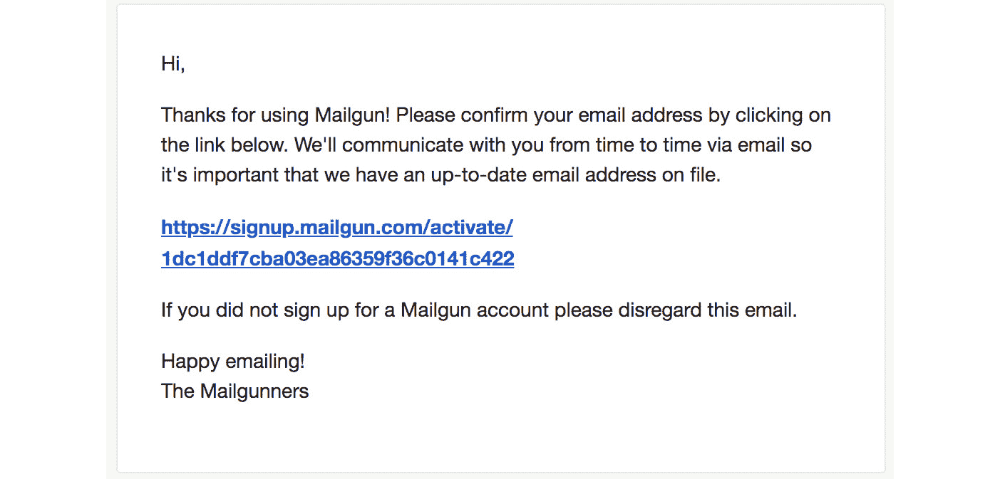
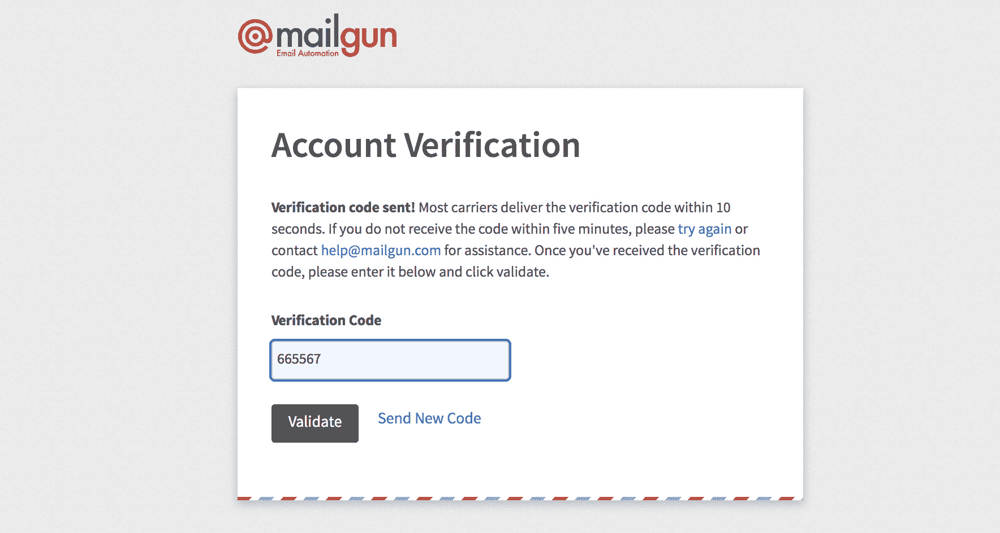
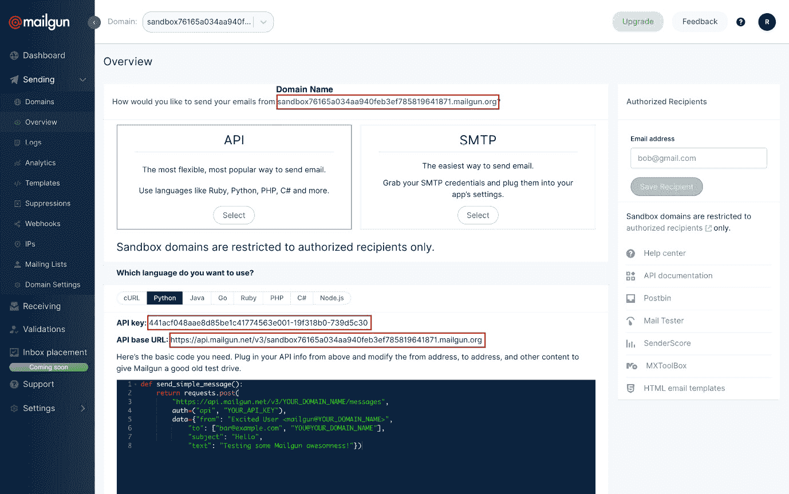
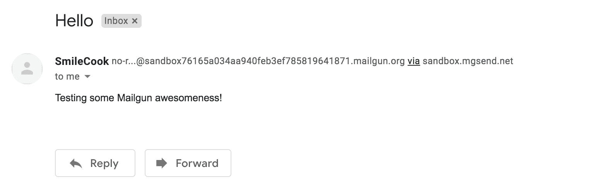
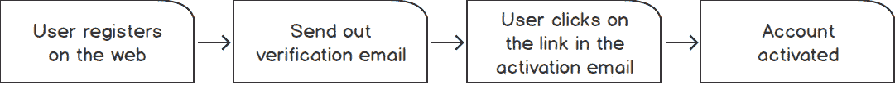
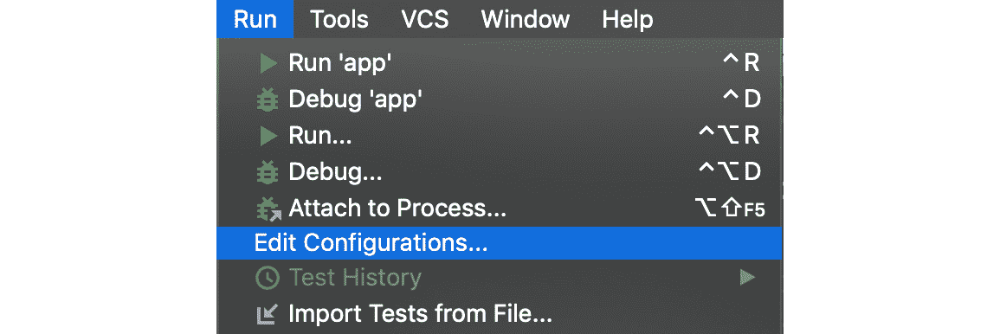
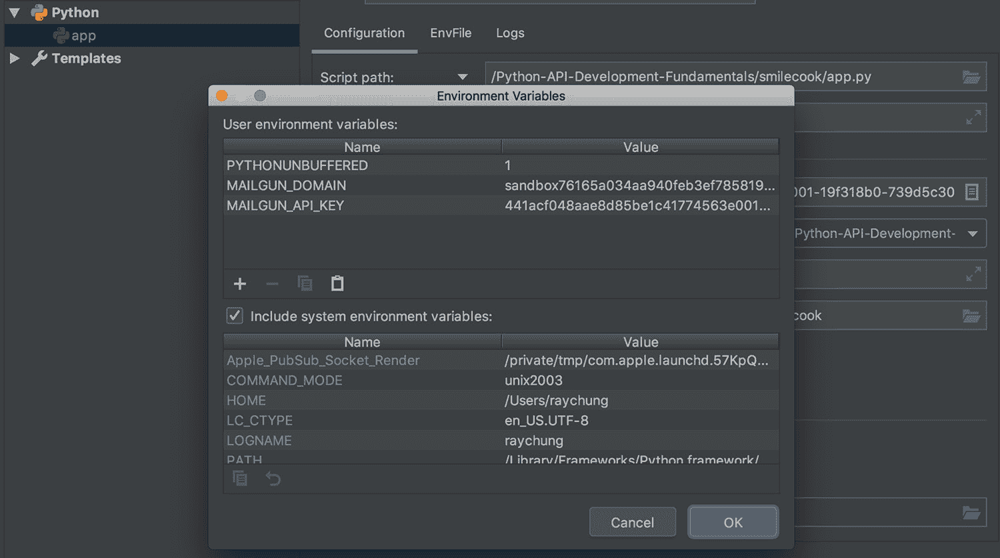

# 第六章：6. 电子邮件确认

## 学习目标

到本章结束时，您将能够：

+   使用 Mailgun API 发送纯文本和 HTML 格式的电子邮件

+   使用 itsdangerous 包创建用于账户激活的令牌

+   利用整个用户注册工作流程

+   利用环境变量的优势开发应用程序

本章介绍了如何使用电子邮件包在食品食谱分享平台上开发电子邮件激活功能，以及用户注册和电子邮件验证。

## 简介

在上一章中，我们使用 marshmallow 验证了 API。在本章中，我们将向我们的应用程序添加功能，使我们能够向用户发送电子邮件。

每个人都有自己的电子邮件地址。有些人甚至可能为了不同的需求拥有多个邮箱。为了确保用户在创建我们应用程序的账户时输入的电子邮件地址的正确性，我们需要在注册时验证他们的电子邮件地址。获取他们的电子邮件地址是重要的，因为我们可能需要将来向用户发送电子邮件。

在本章中，我们将实现一个验证邮箱的功能，学习如何通过第三方 Mailgun API 发送消息，并创建一个唯一的令牌以确保它被用户验证。这可以通过 `itsdangerous` 包实现。在本章结束时，我们将通过将其分类到环境变量中，使我们的机密信息（例如，Mailgun API 密钥）更加安全。这样，当我们将来将项目上传到 GitHub 或其他平台时，这些机密信息将不会在项目中共享。以下是新用户注册流程的步骤：




###### 图 6.1：新用户注册流程

在我们的第一部分，我们将向您介绍 `Mailgun` 平台。无需多言，让我们开始吧。

## Mailgun

Mailgun 是一家第三方 **SMTP** （**简单邮件传输协议**）和 API 发送电子邮件的服务提供商。通过 Mailgun，不仅可以发送大量电子邮件，还可以追踪每封邮件的日志。您每月有 10,000 个免费配额。这意味着，在免费计划中，我们最多只能发送 10,000 封电子邮件。这对于我们的学习目的来说已经足够了。

Mailgun 还提供了一个易于理解和使用的开放 RESTful API。在接下来的练习中，我们将注册一个 Mailgun 账户，并通过 API 发送电子邮件。

### 练习 40：开始使用 Mailgun

首先，我们需要在 Mailgun 中注册一个账户。正如我们之前所解释的，Mailgun 是一个第三方平台。在这个练习中，我们将注册一个 Mailgun 账户，然后获取使用他们电子邮件发送服务 API 所需的必要设置信息：

1.  访问 Mailgun 网站 [`www.mailgun.com/`](https://www.mailgun.com/)。点击 **注册** 来注册一个账户。主页将看起来像以下截图：

    

    ###### 图 6.2：Mailgun 主页

    一旦完成注册，Mailgun 将发送包含账户激活链接的验证邮件。

1.  点击验证邮件中的链接以激活账户，如下截图所示：

    ###### 图 6.3：Mailgun 账户激活邮件

1.  然后，我们将遵循 Mailgun 的验证流程。输入您的电话号码以获取验证码。使用该代码激活您的账户。屏幕将看起来像这样：

    ###### 图 6.4：验证账户

1.  账户激活后，登录您的账户，然后转到**发送**下的**概览**屏幕。在那里，您可以找到域名、API 密钥和基本 URL。这些信息是我们后续编程工作所需的信息。Mailgun 还提供了快速入门的示例代码：

###### 图 6.5：Mailgun 仪表板

现在我们已经在 Mailgun 中开设了一个账户，这将允许我们使用他们的服务向我们的用户发送邮件。API URL 和密钥是用于我们的 Smilecook 应用程序连接到 Mailgun API 的。我们很快就会向您展示如何做到这一点。

#### 注意

目前，我们正在使用沙盒域进行测试。您只能向自己的电子邮件地址发送邮件（即与 Mailgun 注册的电子邮件地址）。如果您想向其他电子邮件地址发送邮件，您可以在右侧添加授权收件人，并将邮件发送给该收件人。收件人需要接受您发送的邮件。

我们将在下一个练习中讲解如何发送第一封邮件。

### 练习 41：使用 Mailgun API 发送邮件

因此，我们已经在 Mailgun 上注册了一个账户。有了这个 Mailgun 账户，我们将能够使用 Mailgun API 向我们的用户发送邮件。在这个练习中，我们将使用 Mailgun 在我们的 Smilecook 项目中以编程方式发送第一封测试邮件：

1.  在`mailgun.py`文件下，`Smilecook`项目中导入 requests 并创建`MailgunApi`类：

    ```py
    import requests
    class MailgunApi:
    ```

1.  在相同的`MailgunApi`类中，将`API_URL`设置为`https://api.mailgun.net/v3/{}/messages`；这是 Mailgun 提供的`API_URL`：

    ```py
        API_URL = 'https://api.mailgun.net/v3/{}/messages'
    ```

1.  在相同的`MailgunApi`类中，定义用于实例化对象的`__init__`构造方法：

    ```py
        def __init__(self, domain, api_key):
            self.domain = domain
            self.key = api_key
            self.base_url = self.API_URL.format(self.domain)
    ```

1.  在相同的`MailgunApi`类中，定义用于通过 Mailgun API 发送邮件的`send_email`方法。此方法接受`to`、`subject`、`text`和`html`作为输入参数并组成邮件：

    ```py
       def send_email(self, to, subject, text, html=None):
            if not isinstance(to, (list, tuple)):
                to = [to, ]
            data = {
                'from': 'SmileCook <no-reply@{}>'.format(self.domain),
                'to': to,
                'subject': subject,
                'text': text,
                'html': html
            }
            response = requests.post(url=self.base_url,
                                                      auth=('api', self.key),
                                                      data=data)
            return response
    ```

1.  使用`MailgunApi`发送第一封邮件。从`mailgun`中打开`MailgunApi`，然后通过传递之前练习中提供的域名和 API 密钥创建一个`mailgun`对象：

    ```py
    >>>from mailgun import MailgunApi
    >>>mailgun = MailgunApi(domain='sandbox76165a034aa940feb3ef785819641871.mailgun.org',
    api_key='441acf048aae8d85be1c41774563e001-19f318b0-739d5c30')
    ```

1.  然后，使用`MailgunApi`中的`send_mail()`方法发送我们的第一封电子邮件。我们可以将`email`、`subject`和`body`作为参数传递。我们将得到 HTTP 状态码`smilecook.api@gmail.com`。

1.  检查注册电子邮件地址的邮箱。你应该会收到一封电子邮件。如果你找不到它，它可能在你垃圾邮件文件夹中：

###### 图 6.6：通过 Mailgun 发送电子邮件

因此，我们刚刚使用第三方`Mailgun` API 发送了第一封电子邮件。现在我们知道了如何在不设置自己的邮件服务器的情况下，将电子邮件功能添加到我们的应用程序中。稍后，我们将把这个电子邮件功能整合到我们的 Smilecook 应用程序中。我们打算在用户账户激活工作流程中使用它。

## 用户账户激活工作流程

我们希望在我们的食谱分享平台上添加一个账户激活步骤，这样当用户在我们的系统中注册账户时，账户将不会默认激活。此时，用户无法登录到他们的账户仪表板。只有当他们通过点击我们的激活电子邮件中的链接激活账户后，他们才能登录到他们的账户仪表板：



###### 图 6.7：用户账户激活工作流程

为了构建这个工作流程，我们将使用用户模型中的`is_active`属性来指示账户是否已激活（激活电子邮件的链接是否已被点击），然后创建一个在用户注册时发送验证电子邮件的方法，以及一个端点可以用来激活账户。为了创建一个唯一的链接，我们将使用`itsdangerous`包，这将帮助我们创建一个用于账户激活链接的唯一令牌。这个包确保我们生成的电子邮件不会被任何人修改，这样我们就可以在激活用户的账户之前验证用户的身份。

#### 注意

如果你想了解更多关于`itsdangerous`包的信息，请访问[`pythonhosted.org/itsdangerous/`](https://pythonhosted.org/itsdangerous/)。

在下一个练习中，我们将生成账户激活令牌。

### 练习 42：生成账户激活令牌

如前所述，我们希望在 Smilecook 应用程序中实现一个用户账户激活流程。这是为了确保在注册过程中提供的电子邮件地址是有效的，并且属于用户本人。在这个练习中，我们将创建一个生成激活令牌的函数，以及另一个验证令牌的函数。然后，它们将在账户激活流程中稍后使用：

1.  将以下代码行添加到`requirements.txt`文件中：

    ```py
    itsdangerous==1.1.0
    ```

1.  使用以下命令安装`itsdangerous`包：

    ```py
    pip install -r requirements.txt
    ```

    在成功安装包之后，你应该会看到以下结果返回：

    ```py
    Installing collected packages: itsdangerous
    Successfully installed itsdangerous-1.1.0
    ```

1.  确保在`config.py`中添加了密钥；当我们稍后使用`itsdangerous`包时，它会很有用：

    ```py
    class Config:
        SECRET_KEY = 'super-secret-key'
    ```

1.  在`utils.py`中，从`itsdangerous`导入`URLSafeTimedSerializer`模块：

    ```py
    from itsdangerous import URLSafeTimedSerializer
    from flask import current_app
    ```

1.  再次在`utils.py`中定义`generate_token`函数：

    ```py
    def generate_token(email, salt=None):
        serializer = URLSafeTimedSerializer(current_app.config.get('SECRET_KEY'))
        return serializer.dumps(email, salt=salt)
    ```

    在`generate_token`方法中，我们使用`URLSafeTimedSerializer`类通过电子邮件和`current_app.config.get('SECRET_KEY')`密钥创建令牌，这是我们在`config.py`设置中设置的密钥。这个相同的密钥将在未来验证这个令牌时使用。此外，请注意，时间戳将包含在这个令牌中，之后我们可以验证消息创建的时间。

1.  再次在`utils.py`中定义`verify_token`函数：

    ```py
    def verify_token(token, max_age=(30 * 60), salt=None):
        serializer = URLSafeTimedSerializer(current_app.config.get('SECRET_KEY'))
        try:
            email = serializer.loads(token, max_age=max_age, salt=salt)
        except:
            return False
        return email
    ```

    `verify_token`函数将尝试从令牌中提取电子邮件地址，这将确认令牌中的有效期限是否在 30 分钟内（*30 * 60* 秒）通过`max_age`属性。

    #### 注意

    你可以在*步骤 5*和*步骤 6*中看到，这里使用`salt`来区分不同的令牌。例如，当通过电子邮件创建令牌时，在开户、重置密码和升级账户的场景中，会发送一封验证邮件。你可以使用`salt='activate-salt'`、`salt='reset-salt'`和`salt='upgrade-salt'`来区分这些场景。

现在我们有了这两个方便的函数来生成和验证激活令牌，在下一个练习中，我们将它们用于用户账户激活流程中。

### 练习 43：发送用户账户激活电子邮件

现在，我们已经从上一个练习中准备好了激活令牌，并且我们也学习了如何使用 Mailgun API 发送电子邮件。在这个练习中，我们将结合这两者，将激活令牌放入激活电子邮件中，以完成整个账户激活工作流程：

1.  将`url_for`、`MailgunAPI`类以及`generate_token`和`verify_token`函数导入到`resources/user.py`中：

    ```py
    from flask import request, url_for
    from mailgun import MailgunApi
    from utils import generate_token, verify_token
    ```

1.  通过传递我们在上一个练习中获得的`Mailgun`域名和 API 密钥来创建一个`MailgunApi`对象：

    ```py
    mailgun = MailgunApi(domain='sandbox76165a034aa940feb3ef785819641871.mailgun.org',
               api_key='441acf048aae8d85be1c41774563e001-19f318b0-739d5c30')
    ```

1.  在`UserListResource`类中，在`user.save()`之后添加以下代码：

    ```py
            token = generate_token(user.email, salt='activate')
            subject = 'Please confirm your registration.'
    ```

    我们首先使用`generate_token(user.email, salt='activate')`生成一个令牌。这里，`salt='activate'`表示令牌主要用于激活账户。电子邮件的主题设置为`请确认您的注册`。

1.  在同一个`UserListResource`类中创建一个激活链接并定义电子邮件文本：

    ```py
            link = url_for('useractivateresource',
                                 token=token,
                                 _external=True)
            text = 'Hi, Thanks for using SmileCook! Please confirm your registration by clicking on the link: {}'.format(link)
    ```

    我们使用`url_for`函数创建激活链接。它将需要`UserActivateResource`（我们将在下一步创建）。这个端点也需要一个令牌。`_external=True`参数用于将默认的相对 URL `/users/activate/<string:token>` 转换为绝对 URL `http://localhost:5000/users/activate/<string:token>`：

1.  最后，我们使用`mailgun.send_email`方法在同一个`UserListResource`类中发送电子邮件：

    ```py
            mailgun.send_email(to=user.email,
                                             subject=subject,
                                             text=text)
    ```

1.  在`resources/user.py`下创建一个新的`UserActivateResource`类，并在其中定义`get`方法：

    ```py
    class UserActivateResource(Resource):
        def get(self, token):
            email = verify_token(token, salt='activate')
            if email is False:
                return {'message': 'Invalid token or token expired'}, HTTPStatus.BAD_REQUEST
    ```

    首先，此方法使用`verify_token(token, salt='activate')`验证令牌。令牌有默认的 30 分钟过期时间。如果令牌有效且未过期，我们将获取用户电子邮件并可以继续账户激活。否则，电子邮件将被设置为`False`，我们可以返回错误消息`Invalid token or token expired`，并带有**HTTP 状态码 400 Bad Request**。

1.  继续在`UserActivateResource.get`方法上工作：

    ```py
            user = User.get_by_email(email=email)
            if not user:
                return {'message': 'User not found'}, HTTPStatus.NOT_FOUND
            if user.is_active is True:
                return {'message': 'The user account is already activated'}, HTTPStatus.BAD_REQUEST
            user.is_active = True
            user.save()
    ```

    如果我们有用户的电子邮件，我们可以查找`user`对象并修改其`is_active`属性。如果用户账户已经激活，我们将简单地返回`用户已激活`。否则，我们将激活账户并保存。

1.  最后，我们将返回 HTTP 状态码`204 No Content`以指示请求已成功处理：

    ```py
            return {}, HTTPStatus.NO_CONTENT
    ```

    #### 注意

    通常，在现实世界的场景中，电子邮件中的激活链接将指向系统的前端层。前端层会通过 API 与后端通信。因此，当前端接收到 HTTP 状态码**204 No Content**时，意味着账户已激活。然后它可以转发用户到账户仪表板。

1.  然后，通过以下代码将新的`UserActivateResource`类添加到`app.py`中。首先从`resources.user`导入`UserActivateResource`类，然后添加路由：

    ```py
    from resources.user import UserListResource, UserResource, MeResource, UserRecipeListResource, UserActivateResource
        api.add_resource(UserActivateResource, '/users/activate/<string:token>')
    ```

1.  最后，我们想确保用户在账户激活之前不能登录到应用程序。我们将更改`resources/token.py`中的`POST`方法。在检查密码后立即返回 HTTP 状态码**403 Forbidden**，如果用户账户未激活：

    ```py
            if user.is_active is False:
                return {'message': 'The user account is not activated yet'}, HTTPStatus.FORBIDDEN
    ```

1.  右键点击以运行应用程序。然后我们准备测试整个用户注册工作流程。

恭喜！您已完成了整个用户注册工作流程的开发。我们的 Smilecook 应用程序将能够发送带有激活链接的电子邮件。用户可以点击激活链接来激活他们的用户账户。

在下一个活动中，我们希望您走完整个流程并测试它是否工作。

### 活动九：测试完整的用户注册和激活工作流程

在此活动中，我们将测试完整的用户注册和激活工作流程：

1.  通过 Postman 注册新用户。

1.  通过 API 登录。

1.  使用发送到邮箱的链接来激活账户。

1.  账户激活后重新登录。

    #### 注意

    此活动的解决方案可以在第 314 页找到。

### 设置环境变量

我们将使用环境变量来确保我们的敏感信息，例如密钥，是安全的。这确保了当我们与他人共享代码时不会泄露这些敏感和机密信息。环境变量仅保存在本地环境中，它们不会出现在代码中。这是将代码与机密信息分离的常用最佳实践。

### 练习 44：在 PyCharm 中设置环境变量

环境变量是在本地系统中存储的键值对，可以被我们的应用程序访问。在这个练习中，我们将通过 `PyCharm` 设置环境变量：

1.  在 `PyCharm` 界面的顶部，选择 **运行** 然后点击 **编辑配置**：

    ###### 图 6.8：选择运行并点击编辑配置

1.  点击 `MAILGUN_DOMAIN` 和 `MAILGUN_API_KEY` 环境变量。

    你的屏幕将如下所示：

    

    ###### 图 6.9：添加 MAILGUN_DOMAIN 和 MAILGUN_API_KEY 环境变量

    #### 注意

    对于 Python 控制台，要读取环境变量，我们可以在 *Pycharm >> 首选项 >> 构建、执行、部署 >> 控制台 >> Python 控制台* 下设置。

1.  然后，我们在 `resources/user.py` 中导入 `os` 包，并使用 `os.environ['MAILGUN_DOMAIN']` 和 `os.environ['MAILGUN_API_KEY']` 获取环境变量中的值：

    ```py
    import os
    mailgun = MailgunApi(domain=os.environ.get('MAILGUN_DOMAIN'),
                                api_key=os.environ.get('MAILGUN_API_KEY'))
    ```

    因此，这就是如何将秘密的 `API_KEY` 和其他相关信息从代码中移除。这些秘密数据现在存储在环境变量中，并且与代码隔离。

    #### 注意

    如果我们使用 `os.environ['KEY']` 获取环境变量，如果环境变量未定义，则会引发 `'KeyError'`。我们可以使用 `os.environ.get('KEY')` 或 `os.getenv('Key')` 获取值。如果变量未定义，这将返回 None。如果我们想在环境变量未定义时设置一个默认值，我们可以使用这个语法：`os.getenv('KEY', default_value)`。

## HTML 格式电子邮件

我们可以通过使用 HTML 格式的电子邮件而不是纯文本电子邮件来给我们的电子邮件添加一些颜色。HTML 格式的电子邮件无处不在。我相信你一定在电子邮件中看到过图片，或者有复杂布局的电子邮件。这些都是 HTML 格式的电子邮件。理论上，要使用 `Mailgun` API 发送 HTML 格式的电子邮件，可能只需将 HTML 代码作为参数传递给 `mailgun.send_email` 方法即可。

请参考以下示例代码，了解如何使用 Mailgun 发送 HTML 格式的电子邮件。我们可以看到，我们只是在这里添加了新的 `html` 参数：

```py
mailgun.send_email(to=user.email,
                         subject=subject,
                         text=text, 
                         html='<html><body><h1>Test email</h1></body></html>')
```

然而，将 HTML 代码与 Python 代码耦合的这种方式比较繁琐。如果我们有一个复杂的布局，HTML 代码可能会相当长，这会使得将其包含在实际的 Python 代码中变得过于复杂。为了解决这个问题，我们可以利用 Flask 中的 `render_template()` 函数。这是一个利用 Jinja2 模板引擎的函数。通过它，我们只需将 HTML 代码放置在应用程序项目下的 `/templates` 文件夹中的单独的 HTML 文件中。然后，我们可以将这个 HTML 文件（也称为模板文件）传递给这个 `render_template` 函数以生成 HTML 文本。

从以下示例代码中，我们可以看到，使用 `render_template` 函数，我们可以大大简化代码：

```py
template/sample.html
<html><body><h1>Test email</h1></body></html>
```

然后，我们可以使用以下代码将主题设置为`Test email`来渲染 HTML：

```py
mailgun.send_email(to=user.email,
                         subject=subject,
                         text=text, 
                         html=render_template('sample.html'))
```

这里提供的示例代码将在应用程序项目文件夹下查找`templates/sample.html`文件，并为我们渲染 HTML 代码。

这个函数被命名为`render_template`而不是`render_html`是有原因的。`render_template`函数不仅仅是从文件中直接输出 HTML 代码。实际上，我们可以在 HTML 模板文件中插入变量，并由`render_template`函数渲染它。

例如，我们可以这样修改`sample.html`（这里的`{{content}}`是一个占位符）：

```py
template/sample.html
<html><body><h1>{{content}}</h1></body></html>
```

然后，我们可以使用以下代码将主题设置为`test email`来渲染 HTML：

```py
mailgun.send_email(to=user.email,
                         subject=subject,
                         text=text, 
                         html=render_template('sample.html', content='Test email'))
```

在下一个活动中，我们希望你能发送 HTML 格式的激活邮件。

### 活动十：创建 HTML 格式的用户账户激活邮件

我们之前已经发送过纯文本格式的邮件。在这个活动中，我们将创建一个 HTML 格式的邮件，使其对我们的用户更具吸引力：

1.  将用户的电子邮件地址放入`Mailgun`授权收件人列表中。

1.  从`Mailgun`网站上复制一个 HTML 模板。

1.  在 HTML 模板中添加激活令牌。

1.  使用`render_template`函数渲染 HTML 代码，并通过`Mailgun` API 发送激活邮件。

1.  在 Postman 中注册一个新账户，并获取 HTML 格式的账户激活邮件。

    #### 注意

    这个活动的解决方案可以在第 317 页找到。

现在，你已经学会了如何以 HTML 格式发送电子邮件。从现在起，你可以设计自己的 HTML 模板。

## 摘要

在本章中，我们学习了如何使用第三方`Mailgun` API 发送用户账户激活邮件。稍后，我们可以使用`MailgunAPI`类发送不同的邮件，例如通知邮件。Mailgun 不仅提供了发送邮件的 API，还为我们提供了一个后端仪表板，以便我们跟踪已发送邮件的状态。这是一个非常方便的服务。用户账户激活是确保我们正在欢迎经过验证的用户的重要步骤。尽管不是每个平台都执行这种验证，但它减少了垃圾邮件和机器人对我们平台的负面影响。在本章中，我们使用了`itsdangerous`包来创建一个唯一的令牌，以确认用户电子邮件地址的所有权。这个包包含时间戳，这样我们就可以验证令牌是否已过期。

在下一章中，我们将继续为我们的 Smilecook 应用程序添加更多功能。我们将在下一章中处理图片。我相信你将在那里学到很多实用的技能。让我们继续我们的旅程。
