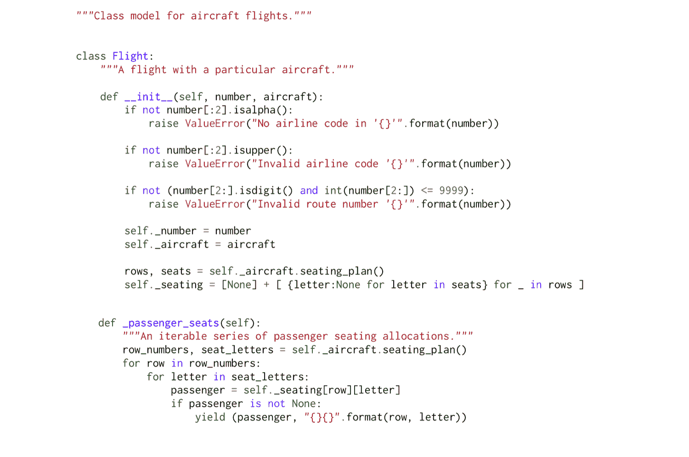
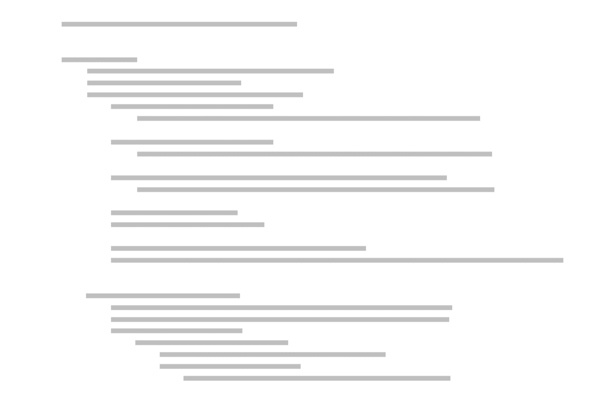
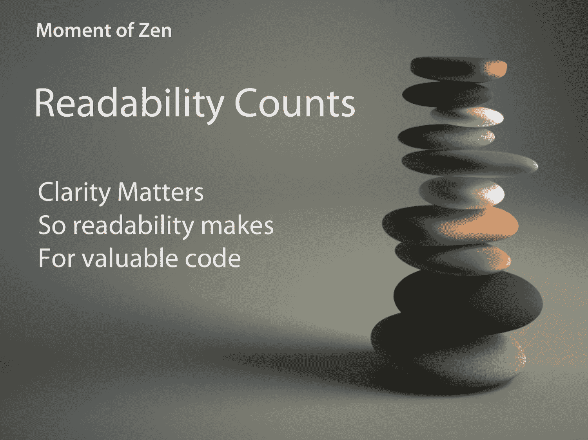

## 第二章：入门

在本章中，我们将介绍如何在 Windows、Ubuntu Linux 和 macOS 上获取和安装 Python。我们还将编写我们的第一个基本 Python 代码，并熟悉 Python 编程文化的基本知识，比如 Python 之禅，同时永远不要忘记语言名称的滑稽起源。

### 获取和安装 Python 3

Python 语言有两个主要版本，*Python 2*是广泛部署的传统语言，*Python 3*是语言的现在和未来。许多 Python 代码在 Python 2 的最后一个版本（即[Python 2.7](https://www.python.org/download/releases/2.7/)）和 Python 3 的最新版本之间可以无需修改地工作，比如[Python 3.5](https://www.python.org/download/releases/3.5.1/)。然而，主要版本之间存在一些关键差异，严格意义上来说，这两种语言是不兼容的。我们将在本书中使用 Python 3.5，但在介绍过程中我们将指出与 Python 2 的主要差异。此外，很可能，作为一本关于 Python 基础知识的书，我们所介绍的一切都适用于未来版本的 Python 3，因此不要害怕在这些版本推出时尝试它们。

在我们开始使用 Python 进行编程之前，我们需要获得一个 Python 环境。Python 是一种高度可移植的语言，可在所有主要操作系统上使用。您将能够在 Windows、Mac 或 Linux 上阅读本书，并且我们只有在安装 Python 3 时才会涉及到平台特定的主要部分。当我们涵盖这三个平台时，可以随意跳过对您不相关的部分。

#### Windows

1.  对于 Windows，您需要访问[官方 Python 网站](http://python.org)，然后通过单击左侧的链接转到下载页面。对于 Windows，您应该根据您的计算机是 32 位还是 64 位选择其中一个 MSI 安装程序。

1.  下载并运行安装程序。

1.  在安装程序中，决定您是只为自己安装 Python，还是为计算机上的所有用户安装 Python。

1.  选择 Python 分发的位置。默认位置将在`C:\Python35`中，位于`C:`驱动器的根目录下。我们不建议将 Python 安装到`Program Files`中，因为 Windows Vista 及更高版本中用于隔离应用程序的虚拟化文件存储可能会干扰轻松安装第三方 Python 包。

1.  在向导的*自定义 Python*页面上，我们建议保持默认设置，这将使用不到 40MB 的空间。

1.  除了安装 Python 运行时和标准库外，安装程序还将使用 Python 解释器注册各种文件类型，例如`*.py`文件。

1.  Python 安装完成后，您需要将 Python 添加到系统的`PATH`环境变量中。要做到这一点，从控制面板中选择*系统和安全*，然后选择*系统*。另一种更简单的方法是按住 Windows 键，然后按键盘上的 Break 键。在左侧的任务窗格中选择*高级系统设置*以打开*系统属性*对话框的*高级*选项卡。单击*环境变量*以打开子对话框。

1.  如果您拥有管理员权限，您应该能够将路径`C:\Python35`和`C:\Python35\Scripts`添加到与`PATH`系统变量关联的分号分隔的条目列表中。如果没有，您应该能够创建或附加到特定于您的用户的`PATH`变量，其中包含相同的值。

1.  现在打开一个*新*的控制台窗口——Powershell 或 cmd 都可以——并验证您是否可以从命令行运行 python：

```py
 > python
Python 3.5.0 (v3.5.0:374f501f4567, Sep 13 2015, 02:27:37) [MSC v.1900 64 bit (AMD64)]\
 on win32
Type "help", "copyright", "credits" or "license" for more information.
>>>

```

**欢迎使用 Python！**

三角箭头提示您 Python 正在等待您的输入。

在这一点上，您可能想要跳过，同时我们展示如何在 Mac 和 Linux 上安装 Python。

#### macOS

1.  对于 macOS，您需要访问官方 Python 网站[`python.org`](http://python.org)。点击左侧的链接进入下载页面。在下载页面上，找到与您的 macOS 版本匹配的 macOS 安装程序，并单击链接下载它。

1.  一个 DMG 磁盘映像文件将被下载，您可以从下载堆栈或 Finder 中打开它。

1.  在打开的 Finder 窗口中，您将看到文件`Python.mpkg`多包安装程序文件。使用“次要”点击操作打开该文件的上下文菜单。从该菜单中，选择“打开”。

1.  在某些版本的 macOS 上，您现在可能会收到文件来自未知开发者的通知。按下此对话框上的“打开”按钮以继续安装。

1.  您现在在 Python 安装程序中。按照说明，通过向导进行点击。

1.  无需定制安装，并且应保持标准设置。当可用时，单击“安装”按钮安装 Python。您可能会被要求输入密码以授权安装。安装完成后，单击“关闭”以关闭安装程序。

1.  现在 Python 3 已安装，请打开一个终端窗口并验证您是否可以从命令行运行 Python 3：

```py
 > python
Python 3.5.0 (default, Nov  3 2015, 13:17:02) 
[GCC 4.2.1 Compatible Apple LLVM 6.1.0 (clang-602.0.53)] on darwin
Type "help", "copyright", "credits" or "license" for more information.
>>> 

```

**欢迎使用 Python！**

三重箭头提示显示 Python 正在等待您的输入。

#### Linux

1.  要在 Linux 上安装 Python，您需要使用系统的软件包管理器。我们将展示如何在最新版本的 Ubuntu 上安装 Python，但在大多数其他现代 Linux 发行版上，该过程非常相似。

1.  在 Ubuntu 上，首先启动“Ubuntu 软件中心”。通常可以通过单击启动器中的图标来运行。或者，您可以在仪表板上搜索“Ubuntu 软件中心”并单击选择来运行它。

1.  一旦进入软件中心，在右上角的搜索栏中输入搜索词“python 3.5”并按回车键。

1.  您将获得一个结果，上面写着“Python（v3.5）”，下面以较小的字体写着“Python 解释器（v3.5）”。选择此条目并单击出现的“安装”按钮。

1.  此时可能需要输入密码来安装软件。

1.  现在您应该看到一个进度指示器出现，安装完成后将消失。

1.  打开终端（使用`Ctrl-Alt-T`）并验证您是否可以从命令行运行 Python 3.5：

```py
$ python3.5
Python 3.5.0+ (default, Oct 11 2015, 09:05:38)
[GCC 5.2.1 20151010] on linux
Type "help", "copyright", "credits" or "license" for more information.
>>>

```

**欢迎使用 Python！**

三重箭头提示显示 Python 正在等待您的输入。

### 启动 Python 命令行 REPL

现在 Python 已安装并运行，您可以立即开始使用它。这是了解语言的好方法，也是正常开发过程中进行实验和快速测试的有用工具。

这个 Python 命令行环境是一个*读取-求值-打印-循环*。Python 将**读取**我们输入的任何内容，**求值**它，**打印**结果，然后**循环**回到开始。您经常会听到它被缩写为“REPL”。

启动时，REPL 将打印有关您正在运行的 Python 版本的一些信息，然后会给出一个三重箭头提示。此提示告诉您 Python 正在等待您输入。

在交互式 Python 会话中，您可以输入 Python 程序的片段并立即看到结果。让我们从一些简单的算术开始：

```py
>>> 2 + 2
4
>>> 6 * 7
42

```

正如您所看到的，Python 读取我们的输入，对其进行求值，打印结果，并循环执行相同的操作。

我们可以在 REPL 中为变量赋值：

```py
>>> x = 5

```

通过输入它们的名称打印它们的内容：

```py
>>> x
5

```

并在表达式中引用它们：

```py
>>> 3 * x
15

```

在 REPL 中，您可以使用特殊的下划线变量来引用最近打印的值，这是 Python 中非常少数的晦涩快捷方式之一：

```py
>>> _
15

```

或者您可以在表达式中使用特殊的下划线变量：

```py
>>> _ * 2
30

```

请注意，并非所有语句都有返回值。当我们将 5 赋给`x`时，没有返回值，只有将变量`x`带入的副作用。其他语句具有更明显的副作用。

尝试：

```py
>>> print('Hello, Python')
Hello, Python

```

您会发现 Python 立即评估并执行此命令，打印字符串“Hello, Python”，然后返回到另一个提示符。重要的是要理解，这里的响应不是由 REPL 评估和显示的表达式结果，而是`print()`函数的副作用。

### 离开 REPL

在这一点上，我们应该向您展示如何退出 REPL 并返回到系统 shell 提示符。我们通过向 Python 发送*文件结束*控制字符来实现这一点，尽管不幸的是，发送此字符的方式在不同平台上有所不同。

#### Windows

如果您在 Windows 上，按`Ctrl-Z`退出。

#### Unix

如果您在 Mac 或 Linux 上，按`Ctrl-D`退出。

如果您经常在不同平台之间切换，而在类 Unix 系统上意外按下`Ctrl-Z`，您将意外地挂起 Python 解释器并返回到操作系统 shell。要通过再次使 Python 成为前台进程来重新激活 Python，请运行`fg`命令：

```py
$ fg

```

然后按`Enter`键几次，以获取三角形箭头 Python 提示符：

```py
>>>

```

### 代码结构和重要缩进

启动 Python 3 解释器：

```py
> python

```

在 Windows 上或：

```py
$ python3

```

在 Mac 或 Linux 上。

Python 的控制流结构，如 for 循环、while 循环和 if 语句，都是由以冒号结尾的语句引入的，表示后面要跟着构造的主体。例如，for 循环需要一个主体，所以如果您输入：

```py
>>> for i in range(5):
...

```

Python 会向您显示三个点的提示，要求您提供主体。

Python 一个与众不同的（有时是有争议的）方面是，前导空格在语法上是有意义的。这意味着 Python 使用缩进级别来标示代码块，而不是其他语言使用的大括号。按照惯例，当代 Python 代码每个级别缩进四个空格。

因此，当 Python 向我们显示三个点的提示时，我们提供这四个空格和一个语句来形成循环的主体：

```py
...     x = i * 10

```

我们的循环主体将包含第二个语句，因此在下一个三点提示符处按`Return`后，我们将输入另外四个空格，然后调用内置的`print()`函数：

```py
...     print(x)

```

要终止我们的块，我们必须在 REPL 中输入一个空行：

```py
...

```

块完成后，Python 执行挂起的代码，打印出小于 50 的 10 的倍数：

```py
0
10
20
30
40

```

* * *

看着屏幕上的 Python 代码，我们可以看到缩进清晰地匹配 - 实际上*必须*匹配 - 程序的结构。



Python 源代码

即使我们用灰色线代替代码，程序的结构也是清晰的。



灰色的代码

每个以冒号结尾的语句都会开始一个新行，并引入一个额外的缩进级别，直到取消缩进将缩进恢复到先前的级别。每个缩进级别通常是四个空格，尽管我们稍后会更详细地介绍规则。

Python 对重要空白的处理方式有三个很大的优势：

1.  它强制开发人员在代码块中使用单一级别的缩进。这通常被认为是任何语言中的良好实践，因为它使代码更易读。

1.  具有重要空白的代码不需要被不必要的大括号混乱，您也不需要就大括号应该放在哪里进行代码标准的辩论。Python 代码中的所有代码块都很容易识别，每个人都以相同的方式编写它们。

1.  重要的空白要求作者、Python 运行时系统和未来需要阅读代码的维护者对代码的结构给出一致的解释。因此，你永远不会有从 Python 的角度来看包含一个代码块，但从肤浅的人类角度来看却不像包含代码块的代码。

* * *

Python 缩进的规则可能看起来复杂，但在实践中它们是非常简单的。

+   你使用的空白可以是空格或制表符。一般的共识是*空格优于制表符*，*四个空格已经成为 Python 社区的标准*。

+   一个基本的规则是**绝对不要**混合使用空格和制表符。Python 解释器会抱怨，你的同事会追捕你。

+   如果你愿意，你可以在不同的时间使用不同数量的缩进。基本规则是*相同缩进级别的连续代码行被认为是同一个代码块的一部分*。

+   这些规则有一些例外，但它们几乎总是与以其他方式改善代码可读性有关，例如通过将必要的长语句分成多行。

这种严格的代码格式化方法是“Guido 所期望的编程”或者更恰当地说是“Guido 所*打算的编程”！重视代码质量，如可读性的哲学贯穿于 Python 文化的核心，现在我们将暂停一下来探讨一下。

### Python 文化

许多编程语言都处于文化运动的中心。它们有自己的社区、价值观、实践和哲学，Python 也不例外。Python 语言本身的发展是通过一系列称为*Python 增强提案*或*PEPs*的文件来管理的。其中一份 PEP，称为 PEP 8，解释了你应该如何格式化你的代码，我们在本书中遵循它的指导方针。例如，PEP 8 建议我们在新的 Python 代码中使用四个空格进行缩进。

另一个 PEP，称为 PEP 20，被称为“Python 的禅宗”。它涉及到 20 条格言，描述了 Python 的指导原则，其中只有 19 条被写下来。方便的是，Python 的禅宗从来都不会比最近的 Python 解释器更远，因为它总是可以通过在 REPL 中输入来访问：

```py
>>> import this
The Zen of Python, by Tim Peters

Beautiful is better than ugly.
Explicit is better than implicit.
Simple is better than complex.
Complex is better than complicated.
Flat is better than nested.
Sparse is better than dense.
Readability counts.
Special cases aren't special enough to break the rules.
Although practicality beats purity.
Errors should never pass silently.
Unless explicitly silenced.
In the face of ambiguity, refuse the temptation to guess.
There should be one-- and preferably only one --obvious way to do it.
Although that way may not be obvious at first unless you're Dutch.
Now is better than never.
Although never is often better than *right* now.
If the implementation is hard to explain, it's a bad idea.
If the implementation is easy to explain, it may be a good idea.
Namespaces are one honking great idea -- let's do more of those!

```

在本书中，我们将突出显示 Python 禅宗中的特定智慧之处，以了解它们如何适用于我们所学到的知识。由于我们刚刚介绍了 Python 的重要缩进，现在是我们第一个禅宗时刻的好时机。

* * *



随着时间的推移，你会开始欣赏 Python 的重要空白，因为它为*你的*代码带来了优雅，以及你可以轻松阅读*他人的*代码。

* * *

### 导入标准库模块

如前所述，Python 附带了一个庞大的标准库，这是 Python 的一个重要方面，通常被称为“电池包括在内”。标准库被组织为*模块*，这是我们将在后面深入讨论的一个主题。在这个阶段重要的是要知道，你可以通过使用`import`关键字来访问标准库模块。

导入模块的基本形式是`import`关键字后跟一个空格和模块的名称。例如，让我们看看如何使用标准库的`math`模块来计算平方根。在三角箭头提示下，我们输入：

```py
>>> import math

```

由于`import`是一个不返回值的语句，如果导入成功，Python 不会打印任何内容，我们会立即返回到提示符。我们可以通过使用模块的名称，后跟一个点，后跟您需要的模块中的属性的名称，来访问导入模块的内容。与许多面向对象的语言一样，点运算符用于深入到对象结构中。作为 Python 专家，我们知道`math`模块包含一个名为`sqrt()`的函数。让我们尝试使用它：

```py
>>> math.sqrt(81)
9.0

```

### 获取`help()`

但是我们如何找出`math`模块中还有哪些其他函数可用？

REPL 有一个特殊的函数`help()`，它可以检索已提供文档的对象的任何嵌入式文档，例如标准库模块。

要获取帮助，请在提示符处输入“help”：

```py
>>> help
Type help() for interactive help, or help(object) for help about object.

```

我们将让您在自己的时间里探索第一种形式——交互式帮助。在这里，我们将选择第二个选项，并将`math`模块作为我们想要帮助的对象传递：

```py
>>> help(math)
Help on module math:

NAME
    math

MODULE REFERENCE
        http://docs.python.org/3.3/library/math

    The following documentation is automatically generated from the Python
    source files.  It may be incomplete, incorrect or include features that
    are considered implementation detail and may vary between Python
    implementations.  When in doubt, consult the module reference at the
    location listed above.

DESCRIPTION
    This module is always available.  It provides access to the
    mathematical functions defined by the C standard.

FUNCTIONS
    acos(...)
    acos(x)

        Return the arc cosine (measured in radians) of x.

```

您可以使用空格键翻页帮助，如果您使用的是 Mac 或 Linux，则可以使用箭头键上下滚动。

浏览函数时，您会发现有一个名为`factorial`的数学函数，用于计算阶乘。按“q”退出帮助浏览器，返回到 Python REPL。

现在练习使用`help()`来请求`factorial`函数的特定帮助：

```py
>>> help(math.factorial)
Help on built-in function factorial in module math:

factorial(...)
    factorial(x) -> Integral

    Find x!. Raise a ValueError if x is negative or non-integral.

```

按“q”返回到 REPL。

让我们稍微使用一下`factorial()`。该函数接受一个整数参数并返回一个整数值：

```py
>>> math.factorial(5)
120
>>> math.factorial(6)
720

```

请注意，我们需要使用模块命名空间来限定函数名。这通常是一个很好的做法，因为它清楚地表明了函数的来源。尽管如此，它可能导致代码过于冗长。

#### 使用`math.factorial()`计算水果的数量

让我们使用阶乘来计算从五种水果中抽取三种水果的方式，使用我们在学校学到的一些数学：

```py
>>> n = 5
>>> k = 3
>>> math.factorial(n) / (math.factorial(k) * math.factorial(n - k))
10.0

```

这个简单的表达式对于所有这些对 math 模块的引用来说相当冗长。Python 的`import`语句有一种替代形式，允许我们使用`from`关键字将模块中的特定函数引入当前命名空间：

```py
>>> from math import factorial
>>> factorial(n) / (factorial(k) * factorial(n - k))
10.0

```

这是一个很好的改进，但对于这样一个简单的表达式来说仍然有点冗长。

导入语句的第三种形式允许我们重命名导入的函数。这对于可读性或避免命名空间冲突是有用的。尽管它很有用，但我们建议尽量少地和审慎地使用这个功能：

```py
>>> from math import factorial as fac
>>> fac(n) / (fac(k) * fac(n - k))
10.0

```

#### 不同类型的数字

请记住，当我们单独使用`factorial()`时，它返回一个整数。但是我们上面用于计算组合的更复杂的表达式产生了一个浮点数。这是因为我们使用了`/`，Python 的浮点除法运算符。由于我们知道我们的操作只会返回整数结果，我们可以通过使用`//`，Python 的整数除法运算符来改进我们的表达式：

```py
>>> from math import factorial as fac
>>> fac(n) // (fac(k) * fac(n - k))
10

```

值得注意的是，许多其他编程语言在上面的表达式中会在`n`的中等值上失败。在大多数编程语言中，常规的有符号整数只能存储小于的值：

```py
>>> 2**31 - 1
2147483647

```

然而，阶乘增长得如此之快，以至于您可以将最大的阶乘放入 32 位有符号整数中为 12！因为 13！太大了：

```py
>>> fac(13)
6227020800

```

在大多数广泛使用的编程语言中，您要么需要更复杂的代码，要么需要更复杂的数学来计算从 13 个水果中抽取三个水果的方式。

Python 遇到这样的问题，并且可以计算任意大的整数，仅受计算机内存的限制。为了进一步证明这一点，让我们尝试计算从 100 种不同的水果中挑选多少种不同的水果对（假设我们可以拿到这么多水果！）：

```py
>>> n = 100
>>> k = 2
>>> fac(n) // (fac(k) * fac(n - k))
4950

```

只是为了强调一下表达式的第一项的大小有多大，计算 100!：

```py
>>> fac(n)
9332621544394415268169923885626670049071596826438162146859296389521759999322991560894\
1463976156518286253697920827223758251185210916864000000000000000000000000

```

这个数字甚至比已知宇宙中的原子数量还要大得多，有很多数字。如果像我们一样，你很好奇到底有多少位数字，我们可以将整数转换为文本字符串，并像这样计算其中的字符数：

```py
>>> len(str(fac(n)))
158

```

这绝对是很多数字。还有很多水果。它也开始展示了 Python 的不同数据类型——在这种情况下，整数、浮点数和文本字符串——如何以自然的方式协同工作。在下一节中，我们将在此基础上继续深入研究整数、字符串和其他内置类型。

### 标量数据类型：整数、浮点数、None 和布尔值

Python 带有许多内置数据类型。这些包括像整数这样的原始标量类型，以及像字典这样的集合类型。这些内置类型足够强大，可以单独用于许多编程需求，并且它们可以用作创建更复杂数据类型的构建块。

我们将要看的基本内置标量类型是：

+   `int`——有符号、无限精度整数

+   `float`——IEEE 754 浮点数

+   `None`——特殊的、唯一的空值

+   `bool`——true/false 布尔值

现在我们只会看一下它们的基本细节，展示它们的文字形式以及如何创建它们。

#### `int`

我们已经看到 Python 整数的很多用法。Python 整数是有符号的，对于所有实际目的来说，具有无限精度。这意味着它们可以容纳的值的大小没有预定义的限制。

Python 中的整数字面量通常以十进制指定：

```py
>>> 10
10

```

它们也可以用`0b`前缀指定为二进制：

```py
>>> 0b10
2

```

八进制，使用`0o`前缀：

```py
>>> 0o10
8

```

或十六进制，使用`0x`前缀：

```py
>>> 0x10
16

```

我们还可以通过调用`int`构造函数来构造整数，该构造函数可以将其他数字类型（如浮点数）转换为整数：

```py
>>> int(3.5)
3

```

请注意，当使用`int`构造函数时，四舍五入总是朝着零的方向进行：

```py
>>> int(-3.5)
-3
>>> int(3.5)
3

```

我们还可以将字符串转换为整数：

```py
>>> int("496")
496

```

但要注意，如果字符串不表示整数，Python 会抛出异常（稍后会更多地讨论这些！）。

在从字符串转换时，甚至可以提供一个可选的数字基数。例如，要从基数 3 转换，只需将 3 作为构造函数的第二个参数传递：

```py
>>> int("10000", 3)
81

```

#### 浮点数

Python 通过`float`类型支持浮点数。Python 浮点数实现为[IEEE-754 双精度浮点数](https://en.wikipedia.org/wiki/IEEE_floating_point)，具有 53 位二进制精度。这相当于十进制中 15 到 16 个有效数字。

任何包含小数点的文字数字都会被 Python 解释为`float`：

```py
>>> 3.125
3.125

```

科学计数法可以使用，因此对于大数字——例如，即每秒米数的光速的近似值——我们可以写成：

```py
>>> 3e8
300000000.0

```

对于像普朗克常数这样的小数字，我们可以输入：

```py
>>> 1.616e-35
1.616e-35

```

请注意，Python 会自动切换显示表示形式为最可读的形式。

至于整数，我们可以使用`float`构造函数从其他数字或字符串类型转换为浮点数。例如，构造函数可以接受一个`int`：

```py
>>> float(7)
7.0

```

或一个字符串：

```py
>>> float("1.618")
1.618

```

##### 特殊浮点值

通过将某些字符串传递给`float`构造函数，我们可以创建特殊的浮点值`NaN`（缩写为**N**ot **a** **N**umber），以及正无穷大和负无穷大：

```py
>>> float("nan")
nan
>>> float("inf")
inf
>>> float("-inf")
-inf

```

##### 提升为浮点数

任何涉及`int`和`float`的计算结果都会提升为`float`：

```py
>>> 3.0 + 1
4.0

```

您可以在 Python 文档中了解更多关于 Python 数字类型的信息（http://docs.python.org/3/library/stdtypes.html#numeric-types-int-float-complex）。

#### `None`

Python 有一个特殊的空值叫做`None`，拼写为大写的“N”。`None`经常用来表示值的缺失。Python REPL 从不打印`None`结果，因此在 REPL 中键入`None`没有任何效果：

```py
>>> None
>>>

```

`None`可以绑定到变量名，就像任何其他对象一样：

```py
>>> a = None

```

我们可以使用 Python 的`is`运算符测试对象是否为`None`：

```py
>>> a is None
True

```

我们可以看到这里的响应是`True`，这方便我们进入`bool`类型。

#### bool

`bool`类型表示逻辑状态，并在 Python 的几个控制流结构中扮演重要角色，我们很快就会看到。

正如您所期望的那样，有两个 bool 值，`True`和`False`，都以大写字母开头：

```py
>>> True
True
>>> False
False

```

还有一个`bool`构造函数，可以用于将其他类型转换为`bool`。让我们看看它是如何工作的。对于`int`，零被认为是“falsey”，所有其他值都被认为是“truthy”：

```py
>>> bool(0)
False
>>> bool(42)
True
>>> bool(-1)
True

```

我们在`float`中看到相同的行为，只有零被认为是“falsey”：

```py
>>> bool(0.0)
False
>>> bool(0.207)
True
>>> bool(-1.117)
True
>>> bool(float("NaN"))
True

```

在从集合（例如字符串或列表）转换时，只有空集合被视为“falsey”。在从列表转换时，我们看到只有空列表（在这里以`[]`的文字形式显示）被评估为`False`：

```py
>>> bool([])
False
>>> bool([1, 5, 9])
True

```

类似地，对于字符串，只有空字符串`""`在传递给`bool`时才会被评估为`False`：

```py
>>> bool("")
False
>>> bool("Spam")
True

```

特别地，您不能使用`bool`构造函数来从`True`和`False`的字符串表示中进行转换：

```py
>>> bool("False")
True

```

由于字符串“False”不为空，它将被评估为`True`！

这些转换为`bool`非常重要，因为它们在 Python 的 if 语句和 while 循环中被广泛使用，这些结构接受它们的条件中的`bool`值。

### 关系运算符

布尔值通常由 Python 的关系运算符产生，这些运算符可用于比较对象。

两个最常用的关系运算符是 Python 的相等和不相等测试，实际上是测试值的等价或不等价。也就是说，如果一个对象可以用于替代另一个对象，则两个对象是*等价的。我们将在本书的后面学习更多关于对象等价的概念。现在，我们将比较简单的整数。

让我们首先给变量`g`赋值或绑定一个值：

```py
>>> g = 20

```

我们使用`==`来测试相等：

```py
>>> g == 20
True
>>> g == 13
False

```

或者使用`!=`进行不等式比较：

```py
>>> g != 20
False
>>> g != 13
True

```

#### 丰富的比较运算符

我们还可以使用丰富的比较运算符来比较数量的顺序。使用`<`来确定第一个参数是否小于第二个参数：

```py
>>> g < 30
True

```

同样，使用`>`来确定第一个是否大于第二个：

```py
>>> g > 30
False

```

您可以使用`<=`来测试小于或等于：

```py
>>> g <= 20
True

```

大于或等于使用`>=`：

```py
>>> g >= 20
True

```

如果您对来自其他语言的关系运算符有经验，那么 Python 的运算符可能一点也不令人惊讶。只需记住这些运算符正在比较等价性，而不是身份，这是我们将在接下来的章节中详细介绍的区别。

### 控制流：if 语句和 while 循环

现在我们已经检查了一些基本的内置类型，让我们看看两个依赖于`bool`类型转换的重要控制流结构：if 语句和 while 循环。

#### 条件控制流：if 语句

条件语句允许我们根据表达式的值来分支执行。语句的形式是`if`关键字，后跟一个表达式，以冒号结束以引入一个新的块。让我们在 REPL 中尝试一下：

```py
>>> if True:

```

记住在块内缩进四个空格，我们添加一些代码，如果条件为`True`，则执行该代码，然后跟一个空行来终止该块：

```py
...     print("It's true!")
...
It's true!

```

在这一点上，该块将被执行，因为显然条件是`True`。相反，如果条件是`False`，则块中的代码不会执行：

```py
>>> if False:
...     print("It's true!")
...
>>>

```

与`bool()`构造函数一样，与 if 语句一起使用的表达式将被转换为`bool`，因此：

```py
>>> if bool("eggs"):
...     print("Yes please!")
...
Yes please!

```

与以下内容完全等价：

```py
>>> if "eggs":
...     print("Yes please!")
...
Yes please!

```

由于这种有用的简写，使用`bool`构造函数进行显式转换为`bool`在 Python 中很少使用。

#### `if...else`

if 语句支持一个可选的`else`子句，该子句放在由`else`关键字引入的块中（后跟一个冒号），并且缩进到与`if`关键字相同的级别。让我们首先创建（但不完成）一个 if 块：

```py
>>> h = 42
>>> if h > 50:
...     print("Greater than 50")

```

在这种情况下开始`else`块，我们只需在三个点之后省略缩进：

```py
... else:
...     print("50 or smaller")
...
50 or smaller

```

#### `if...elif...else`

对于多个条件，您可能会尝试做这样的事情：

```py
>>> if h > 50:
...     print("Greater than 50")
... else:
...     if h < 20:
...         print("Less than 20")
...     else:
...         print("Between 20 and 50")
...
Between 20 and 50

```

每当您发现自己有一个包含嵌套 if 语句的 else 块时，就像这样，您应该考虑使用 Python 的`elif`关键字，它是一个组合的`else-if`。

在 Python 的禅宗中提醒我们，“平面比嵌套更好”：

```py
>>> if h > 50:
...     print("Greater than 50")
... elif h < 20:
...     print("Less than 20")
... else:
...      print("Between 20 and 50")
...
Between 20 and 50

```

这个版本读起来更容易。

#### 条件重复：while 循环

Python 有两种类型的循环：for 循环和 while 循环。我们已经在介绍重要的空格时简要遇到了 for 循环，并且很快会回到它们，但现在我们将介绍 while 循环。

在 Python 中，while 循环由`while`关键字引入，后面跟着一个布尔表达式。与 if 语句的条件一样，表达式被隐式转换为布尔值，就好像它已经传递给了`bool()`构造函数。`while`语句以冒号结束，因为它引入了一个新的块。

让我们在 REPL 中编写一个循环，从五倒数到一。我们将初始化一个名为`c`的计数器变量，循环直到达到零为止。这里的另一个新语言特性是使用增强赋值运算符`-=`，在每次迭代中从计数器的值中减去一。类似的增强赋值运算符也适用于其他基本数学运算，如加法和乘法：

```py
>>> c = 5
>>> while c != 0:
...     print(c)
...     c -= 1
...
5
4
3
2
1

```

因为条件 - 或谓词 - 将被隐式转换为`bool`，就像存在对`bool()`构造函数的调用一样，我们可以用以下版本替换上面的代码：

```py
>>> c = 5
>>> while c:
...     print(c)
...     c -= 1
...
5
4
3
2
1

```

这是因为将`c`的整数值转换为`bool`的结果为`True`，直到我们达到零，转换为`False`。也就是说，在这种情况下使用这种简短形式可能被描述为非 Pythonic，因为根据 Python 的禅宗，显式优于隐式。我们更看重第一种形式的可读性，而不是第二种形式的简洁性。

在 Python 中，while 循环经常用于需要无限循环的情况。我们通过将`True`作为谓词表达式传递给 while 结构来实现这一点：

```py
>>> while True:
...     print("Looping!")
...
Looping!
Looping!
Looping!
Looping!
Looping!
Looping!
Looping!
Looping!

```

现在您可能想知道我们如何走出这个循环并重新控制我们的 REPL！只需按`Ctrl-C`：

```py
Looping!
Looping!
Looping!
Looping!
Looping!
Looping!^C
Traceback (most recent call last):
File "<stdin>", line 2, in <module>
KeyboardInterrupt
>>>

```

Python 拦截按键并引发一个特殊的异常，该异常终止循环。我们将在第六章后面更详细地讨论异常是什么，以及如何使用它们。

##### 使用`break`退出循环

许多编程语言支持一个循环结构，该结构将谓词测试放在循环的末尾而不是开头。例如，C、C++、C#和 Java 支持 do-while 结构。其他语言也有重复-直到循环。在 Python 中不是这种情况，Python 的习惯用法是使用`while True`以及通过`break`语句实现早期退出。

`break`语句跳出循环 - 如果有多个循环被嵌套，只跳出最内层的循环 - 并在循环体之后立即继续执行。

让我们看一个`break`的例子，一路上介绍一些其他 Python 特性，并逐行检查它：

```py
>>> while True:
...     response = input()
...     if int(response) % 7 == 0:
...         break
...

```

我们从`while True:`开始一个无限循环。在 while 块的第一条语句中，我们使用内置的`input()`函数从用户那里请求一个字符串。我们将该字符串赋给一个名为`response`的变量。

现在我们使用 if 语句来测试提供的值是否能被七整除。我们使用`int()`构造函数将响应字符串转换为整数，然后使用取模运算符`%`来除以七并给出余数。如果余数等于零，则响应可以被七整除，我们进入 if 块的主体。

在 if 块内，现在有两个缩进级别，我们从八个空格开始并使用`break`关键字。`break`终止最内层的循环 - 在本例中是 while 循环 - 并导致执行跳转到循环后的第一条语句。

在这里，“语句”是程序的结尾。我们在三个点的提示符下输入一个空行，以关闭 if 块和 while 块。

我们的循环将开始执行，并将在调用`input()`时暂停，等待我们输入一个数字。让我们试试几个：

```py
12
67
34
28
>>>

```

一旦我们输入一个可以被七整除的数字，谓词就变为`True`，我们进入 if 块，然后我们真正地跳出循环到程序的末尾，返回到 REPL 提示符。

### 总结

+   从 Python 开始

+   获取和安装 Python 3

+   开始读取-求值-打印循环或 REPL

+   简单的算术

+   通过将对象绑定到名称创建变量

+   使用内置的`print()`函数打印

+   使用`Ctrl-Z`（Windows）或`Ctrl-D`（Unix）退出 REPL

+   成为 Pythonic

+   重要的缩进

+   PEP 8 - Python 代码风格指南

+   PEP 20 - Python 之禅

+   以各种形式使用 import 语句导入模块

+   查找和浏览`help()`

+   基本类型和控制流

+   `int`，`float`，`None`和`bool`，以及它们之间的转换

+   用于相等性和排序测试的关系运算符

+   带有`else`和`elif`块的 if 语句

+   带有隐式转换为`bool`的 while 循环

+   使用`Ctrl-C`中断无限循环

+   使用`break`跳出循环

+   使用`input()`从用户那里请求文本

+   增强赋值运算符
