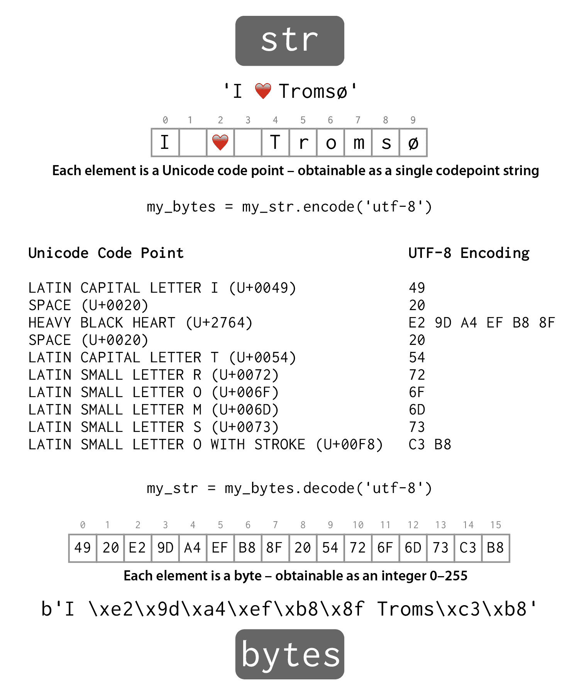

## 第三章：字符串和集合

Python 包括丰富的内置集合类型，这些类型通常足以满足复杂程序的需求，而无需定义自己的数据结构。我们将概述一些基本的集合类型，足以让我们编写一些有趣的代码，尽管我们将在后面的章节中重新讨论这些集合类型，以及一些额外的类型。

让我们从这些类型开始：

+   `str` - 不可变的 Unicode 代码点字符串

+   `bytes` - 不可变的字节字符串

+   `list` - 可变的对象序列

+   `dict` - 可变的键值对映射

在这个过程中，我们还将介绍 Python 的 for 循环。

### `str` - 一个不可变的 Unicode 代码点序列

Python 中的字符串具有数据类型`str`，我们已经广泛地使用了它们。字符串是 Unicode 代码点的序列，大部分情况下你可以将代码点看作字符，尽管它们并不严格等价。Python 字符串中的代码点序列是不可变的，所以一旦你构造了一个字符串，就不能修改它的内容。

#### 字符串引用样式

Python 中的字面字符串由引号括起来：

```py
>>> 'This is a string'

```

你可以使用单引号，就像我们上面所做的那样。或者你可以使用双引号，就像下面所示的那样：

```py
>>> "This is also a string"

```

但是，你必须保持一致。例如，你不能使用双引号和单引号配对：

```py
>>> "inconsistent'
  File "<stdin>", line 1
    "inconsistent'
                  ^
SyntaxError: EOL while scanning string literal

```

支持两种引用样式使你可以轻松地将另一种引号字符合并到字面字符串中，而不必使用丑陋的转义字符技巧：

```py
>>> "It's a good thing."
"It's a good thing."
>>> '"Yes!", he said, "I agree!"'
'"Yes!", he said, "I agree!"'

```

请注意，REPL 在将字符串回显给我们时利用了相同的引用灵活性。

* * *

### 禅境时刻


乍一看，支持两种引用样式似乎违反了 Python 风格的一个重要原则。来自 Python 之禅：

> “应该有一种 - 最好只有一种 - 显而易见的方法来做到这一点。”

然而，在这种情况下，同一来源的另一句格言占据了主导地位：

> “……实用性胜过纯粹性，”

支持两种引用样式的实用性比另一种选择更受重视：单一引用样式与更频繁使用丑陋的转义序列的结合，我们很快就会遇到。

* * *

#### 相邻字符串的连接

Python 编译器将相邻的字面字符串连接成一个字符串：

```py
>>> "first" "second"
'firstsecond'

```

虽然乍一看这似乎毫无意义，但正如我们将在后面看到的那样，它可以用于很好地格式化代码。

#### 多行字符串和换行符

如果要创建包含换行符的字面字符串，有两种选择：使用多行字符串或使用转义序列。首先，让我们看看多行字符串。

多行字符串由三个引号字符而不是一个来界定。下面是一个使用三个双引号的例子：

```py
>>> """This is
... a multiline
... string"""
'This is\na multiline\nstring'

```

请注意，当字符串被回显时，换行符由`\n`转义序列表示。

我们也可以使用三个单引号：

```py
>>> '''So
... is
... this.'''
'So\nis\nthis.'

```

作为使用多行引用的替代方案，我们可以自己嵌入控制字符：

```py
>>> m = 'This string\nspans mutiple\nlines'
>>> m
'This string\nspans mutiple\nlines'

```

为了更好地理解我们在这种情况下所表示的内容，我们可以使用内置的`print()`函数来查看字符串：

```py
>>> print(m)
This string
spans mutiple
lines

```

如果你在 Windows 上工作，你可能会认为换行应该由回车换行对`\r\n`表示，而不仅仅是换行字符`\n`。在 Python 中不需要这样做，因为 Python 3 具有一个称为*通用换行符支持*的功能，它可以将简单的`\n`转换为你的平台上的本机换行序列。你可以在[PEP 278](http://www.python.org/dev/peps/pep-0278/)中了解更多关于通用换行符支持的信息。

我们也可以使用转义序列进行其他用途，比如用`\t`来插入制表符，或者在字符串中使用`\"`来使用引号字符：

```py
>>> "This is a \" in a string"
'This is a " in a string'

```

或者反过来：

```py
>>> 'This is a \' in a string'
"This is a ' in a string"

```

正如您所看到的，Python 比我们更聪明地使用了最方便的引号分隔符，尽管当我们在字符串中使用两种类型的引号时，Python 也会使用转义序列：

```py
>>> 'This is a \" and a \' in a string'
'This is a " and a \' in a string'

```

因为反斜杠具有特殊含义，所以要在字符串中放置一个反斜杠，我们必须用反斜杠本身来转义反斜杠：

```py
>>> k = 'A \\ in a string'
'A \\ in a string'

```

为了让自己确信该字符串中确实只有一个反斜杠，我们可以使用`print()`来打印它：

```py
>>> print(k)
A \ in a string

```

您可以在[Python 文档](http://docs.python.org/3/reference/lexical_analysis.html#strings)中阅读更多关于转义序列的信息。

#### 原始字符串

有时，特别是在处理诸如 Windows 文件系统路径或大量使用反斜杠的正则表达式模式^(2)时，要求双重反斜杠可能会很丑陋和容易出错。Python 通过原始字符串来解决这个问题。原始字符串不支持任何转义序列，非常直观。要创建原始字符串，请在开头引号前加上小写的`r`：

```py
>>> path = r'C:\Users\Merlin\Documents\Spells'
>>>
>>> path
'C:\\Users\\Merlin\\Documents\\Spells'
>>> print(path)
C:\Users\Merlin\Documents\Spells

```

#### `str`构造函数

我们可以使用`str`构造函数来创建其他类型的字符串表示，比如整数：

```py
>>> str(496)
>>> '496'

```

或浮点数：

```py
>>> str(6.02e23)
'6.02e+23'

```

#### 字符串作为序列

Python 中的字符串是所谓的*序列*类型，这意味着它们支持查询有序元素序列的某些常见操作。例如，我们可以使用方括号和基于零的整数索引来访问单个字符：

```py
>>> s = 'parrot'
>>> s[4]
'o'

```

与许多其他编程语言相比，Python 没有与字符串类型不同的单独的字符类型。索引操作返回一个包含单个代码点元素的完整字符串，这一点我们可以使用 Python 的内置`type()`函数来证明：

```py
>>> type(s[4])
<class 'str'>

```

我们将在本书的后面更详细地讨论类型和类。

#### 字符串方法

字符串对象还支持作为方法实现的各种操作。我们可以使用`help()`来列出字符串类型的方法：

```py
>>> help(str)

```

当您按下回车时，您应该看到这样的显示：

```py
Help on class str in module builtins:

class str(object)
 |  str(object='') -> str
 |  str(bytes_or_buffer[, encoding[, errors]]) -> str
 |
 |  Create a new string object from the given object. If encoding or
 |  errors is specified, then the object must expose a data buffer
 |  that will be decoded using the given encoding and error handler.
 |  Otherwise, returns the result of object.__str__() (if defined)
 |  or repr(object).
 |  encoding defaults to sys.getdefaultencoding().
 |  errors defaults to 'strict'.
 |
 |  Methods defined here:
 |
 |  __add__(self, value, /)
 |      Return self+value.
 |
 |  __contains__(self, key, /)
 |      Return key in self.
 |
 |  __eq__(self, value, /)
:

```

在任何平台上，您可以通过按空格键以每次前进一页的方式浏览帮助页面，直到看到`capitalize()`方法的文档，跳过所有以双下划线开头和结尾的方法：

```py
 |      Create and return a new object.  See help(type) for accurate signature.
 |
 |  __repr__(self, /)
 |      Return repr(self).
 |
 |  __rmod__(self, value, /)
 |      Return value%self.
 |
 |  __rmul__(self, value, /)
 |      Return self*value.
 |
 |  __sizeof__(...)
 |      S.__sizeof__() -> size of S in memory, in bytes
 |
 |  __str__(self, /)
 |      Return str(self).
 |
 |  capitalize(...)
 |      S.capitalize() -> str
 |
 |      Return a capitalized version of S, i.e. make the first character
 |      have upper case and the rest lower case.
 |
:

```

按下'q'退出帮助浏览器，然后我们将尝试使用`capitalize()`。让我们创建一个值得大写的字符串 - 一个首都的名字！

```py
>>> c = "oslo"

```

在 Python 中调用对象的方法时，我们在对象名称之后和方法名称之前使用点。方法是函数，所以我们必须使用括号来指示应该调用方法。

```py
>>> c.capitalize()
'Oslo'

```

请记住，字符串是不可变的，所以`capitalize()`方法没有直接修改`c`。相反，它返回了一个新的字符串。我们可以通过显示`c`来验证这一点，它保持不变：

```py
>>> c
'oslo'

```

您可能想花点时间熟悉一下字符串类型提供的各种有用方法，可以通过浏览帮助来了解。

#### 带 Unicode 的字符串

字符串完全支持 Unicode，因此您可以轻松地在国际字符中使用它们，甚至在文字中，因为 Python 3 的默认源代码编码是 UTF-8。例如，如果您可以访问挪威字符，您可以简单地输入这个：

```py
>>> "Vi er så glad for å høre og lære om Python!"
'Vi er så glad for å høre og lære om Python!'

```

或浮点数：

```py
>>> "Vi er s\u00e5 glad for \u00e5 h\xf8re og l\u00e6re om Python!"
'Vi er så glad for å høre og lære om Python!'

```

不过，我们相信这有点不太方便。

同样，您可以使用`\x`转义序列，后跟一个 2 字符的十六进制字符串，以在字符串文字中包含一个字节的 Unicode 代码点：

```py
>>> '\xe5'
'å'

```

您甚至可以使用一个转义的八进制字符串，使用一个反斜杠后跟三个零到七之间的数字，尽管我们承认我们从未见过这种用法，除非无意中作为错误：

```py
>>> '\345'
'å'

```

在否则类似的`bytes`类型中没有这样的 Unicode 功能，我们将在下一节中介绍。

### `bytes` - 一个不可变的字节序列

`bytes`类型类似于`str`类型，不同之处在于每个实例不是 Unicode 代码点的序列，而是字节的序列。因此，`bytes`对象用于原始二进制数据和固定宽度的单字节字符编码，如 ASCII。

#### 文字`bytes`

与字符串一样，它们有一个简单的文字形式，由单引号或双引号分隔，尽管对于文字`bytes`，开头引号必须由小写`b`前缀：

```py
>>> b'data'
b'data'
>>> b"data"
b'data'

```

还有一个`bytes`构造函数，但它有相当复杂的行为，我们将在本系列的第二本书*The Python Journeyman*中进行介绍。在我们的旅程中的这一点上，我们只需要认识到`bytes`文字并理解它们支持与`str`相同的许多操作，如索引和分割：

```py
>>> d = b'some bytes'
>>> d.split()
[b'some', b'bytes']

```

您会看到`split()`方法返回一个`bytes`对象的`list`。

#### 在`bytes`和`str`之间转换

要在`bytes`和`str`之间转换，我们必须知道用于表示字符串的 Unicode 代码点的字节序列的编码。Python 支持各种所谓的*codecs*，如 UTF-8、UTF-16、ASCII、Latin-1、Windows-1251 等等-请参阅 Python 文档以获取[当前 codecs 列表](http://docs.python.org/3/library/codecs.html#standard-encodings)

在 Python 中，我们可以将 Unicode`str`*编码*为`bytes`对象，反之亦然，我们可以将`bytes`对象*解码*为 Unicode`str`。在任何方向上，我们都必须指定编码。Python 不会-通常也不能-阻止您使用 CP037 编解码`bytes`对象中存储的 UTF-16 数据，例如处理旧 IBM 主机上的字符串。如果你幸运的话，解码将在运行时失败并显示`UnicodeError`；如果你不幸的话，你将得到一个充满垃圾的`str`，这将不会被你的程序检测到。



编码和解码字符串。

让我们开始一个交互式会话，查看字符串，其中包含 29 个字母的挪威字母表-一个全字母句：

```py
>>> norsk = "Jeg begynte å fortære en sandwich mens jeg kjørte taxi på vei til quiz"

```

我们现在将使用 UTF-8 编解码器将其编码为`bytes`对象，使用`str`对象的`encode()`方法：

```py
>>> data = norsk.encode('utf-8')
>>> data
b'Jeg begynte \xc3\xa5 fort\xc3\xa6re en sandwich mens jeg kj\xc3\xb8rte taxi p\xc3\x\
a5 vei til quiz'

```

看看每个挪威字母是如何被渲染为一对字节的。

我们可以使用`bytes`对象的`decode()`方法来反转这个过程。同样，我们必须提供正确的编码：

```py
>>> norwegian = data.decode('utf-8')

```

我们可以检查编码/解码往返是否给我们带来了与我们开始时相等的结果：

```py
>>> norwegian == norsk
True

```

并显示它以好的方式：

```py
>>> norwegian
'Jeg begynte å fortære en sandwich mens jeg kjørte taxi på vei til quiz'

```

在这个时刻，所有这些与编码有关的操作可能看起来像是不必要的细节-特别是如果您在一个英语环境中操作-但这是至关重要的，因为文件和网络资源（如 HTTP 响应）是作为字节流传输的，而我们更喜欢使用 Unicode 字符串的便利。

### `list`-对象的序列

Python `list`，例如字符串`split()`方法返回的那些，是对象的序列。与字符串不同，`list`是可变的，因为其中的元素可以被替换或移除，并且可以插入或追加新元素。`list`是 Python 数据结构的工作马。

文字列表由方括号分隔，并且`list`中的项目由逗号分隔。这是一个包含三个数字的`list`：

```py
>>> [1, 9, 8]
[1, 9, 8]

```

这是一个包含三个字符串的`list`：

```py
>>> a = ["apple", "orange", "pear"]

```

我们可以使用零为基础的索引用方括号检索元素：

```py
>>> a[1]
"orange"

```

我们可以通过分配给特定元素来替换元素：

```py
>>> a[1] = 7
>>> a
['apple', 7, 'pear']

```

看看`list`在包含的对象的类型方面可以是异构的。我们现在有一个包含`str`、`int`和另一个`str`的`list`。

创建一个空列表通常是有用的，我们可以使用空方括号来做到这一点：

```py
>>> b = []

```

我们可以以其他方式修改`list`。让我们使用`append()`方法在`list`的末尾添加一些`float`：

```py
>>> b.append(1.618)
>>> b
[1.618]
>>> b.append(1.414)
[1.618, 1.414]

```

有许多其他有用的方法可以操作`list`，我们将在后面的章节中介绍。现在，我们只需要能够执行基本的`list`操作。

还有一个`list`构造函数，可以用来从其他集合（如字符串）创建列表：

```py
>>> list("characters")
['c', 'h', 'a', 'r', 'a', 'c', 't', 'e', 'r', 's']

```

尽管 Python 中的显著空格规则起初似乎非常严格，但实际上有很大的灵活性。例如，如果一行末尾有未关闭的括号、大括号或括号，可以继续到下一行。这对于表示长的字面集合或甚至改善短集合的可读性非常有用：

```py
>>> c = ['bear',
...      'giraffe',
...      'elephant',
...      'caterpillar',]
>>> c
['bear', 'giraffe', 'elephant', 'caterpillar']

```

还要注意，我们可以在最后一个元素后使用额外的逗号，这是一个方便的功能，可以提高代码的可维护性。

### `dict` - 将键与值关联起来

字典 - 体现在`dict`类型中 - 对 Python 语言的工作方式非常基本，并且被广泛使用。字典将键映射到值，在某些语言中被称为映射或关联数组。让我们看看如何在 Python 中创建和使用字典。

使用花括号创建字面上的字典，其中包含键值对。每对由逗号分隔，每个键与其对应的值由冒号分隔。在这里，我们使用字典创建一个简单的电话目录：

```py
>>> d = {'alice': '878-8728-922', 'bob': '256-5262-124', 'eve': '198-2321-787'}

```

我们可以使用方括号运算符按键检索项目：

```py
>>> d['alice']
'878-8728-922'

```

我们可以通过方括号进行赋值来更新与特定键关联的值：

```py
>>> d['alice'] = '966-4532-6272'
>>> d
{'bob': '256-5262-124', 'eve': '198-2321-787', 'alice': '966-4532-6272'}

```

如果我们为尚未添加的键赋值，将创建一个新条目：

```py
>>> d['charles'] = '334-5551-913'
>>> d
{'bob': '256-5262-124', 'eve': '198-2321-787',
'charles': '334-5551-913', 'alice': '966-4532-6272'}

```

请注意，字典中的条目不能依赖于以任何特定顺序存储，并且实际上 Python 选择的顺序甚至可能在同一程序的多次运行之间发生变化。

与列表类似，可以使用空的花括号创建空字典：

```py
>>> e = {}

```

这只是对字典的一个非常粗略的介绍，但我们将在第五章中更详细地重新讨论它们。

### for 循环 - 迭代一系列项目

现在我们有了制作一些有趣的数据结构的工具，我们将看看 Python 的另一种循环结构，即 for 循环。在 Python 中，for 循环对应于许多其他编程语言中称为 for-each 循环的东西。它们从集合中逐个请求项目 - 或更严格地说是从可迭代系列中（但稍后会详细介绍） - 并将它们依次分配给我们指定的变量。让我们创建一个`list`集合，并使用 for 循环对其进行迭代，记得将 for 循环内的代码缩进四个空格：

```py
>>> cities = ["London", "New York", "Paris", "Oslo", "Helsinki"]
>>> for city in cities:
...     print(city)
...
London
New York
Paris
Oslo
Helsinki

```

因此，对`list`进行迭代会逐个返回项目。如果对字典进行迭代，你会得到看似随机顺序的键，然后可以在 for 循环体内使用这些键来检索相应的值。让我们定义一个字典，将颜色名称字符串映射到存储为整数的十六进制整数颜色代码：

```py
>>> colors = {'crimson': 0xdc143c, 'coral': 0xff7f50, 'teal': 0x008080}
>>> for color in colors:
...    print(color, colors[color])
...
coral 16744272
crimson 14423100
teal 32896

```

在这里，我们使用内置的`print()`函数接受多个参数的能力，分别传递每种颜色的键和值。还要注意返回给我们的颜色代码是十进制的。

现在，在我们将学到的一些东西整合到一个有用的程序中之前，练习使用`Ctrl-Z`（Windows）或`Ctrl-D`（Mac 或 Linux）退出 Python REPL。

### 把所有东西放在一起

让我们稍微偏离一下，尝试一下我们在稍大的示例中介绍的一些工具。教科书通常避免这种实用主义，特别是在早期章节，但我们认为将新的想法应用到实际情况中是有趣的。为了避免走样，我们需要引入一些“黑匣子”组件来完成工作，但你以后会详细了解它们，所以不用担心。

我们将在 REPL 中编写一个更长的片段，并简要介绍`with`语句。我们的代码将使用 Python 标准库函数`urlopen()`从网络中获取一些经典文学的文本数据。以下是在 REPL 中输入的完整代码。我们已经用行号注释了这段代码片段，以便参考解释中的行：

```py
1 >>> from urllib.request import urlopen
2 >>> with urlopen('http://sixty-north.com/c/t.txt') as story:
3 ...     story_words = []
4 ...     for line in story:
5 ...         line_words = line.split()
6 ...         for word in line_words:
7 ...             story_words.append(word)
8 ...

```

我们将逐行解释这段代码，依次解释每一行。

1.  要访问`urlopen()`，我们需要从`request`模块中导入该函数，该模块本身位于标准库`urllib`包中。

1.  我们将使用 URL 调用`urlopen()`来获取故事文本。我们使用一个称为 with 块的 Python 构造来管理从 URL 获取的资源，因为从网络获取资源需要操作系统套接字等。我们将在后面的章节中更多地讨论`with`语句，但现在知道，对于使用外部资源的对象使用`with`语句是良好的做法，以避免所谓的*资源泄漏*。`with`语句调用`urlopen()`函数，并将响应对象绑定到名为`story`的变量。

1.  请注意，`with`语句以冒号结尾，引入了一个新的代码块，因此在代码块内部我们必须缩进四个空格。我们创建一个空的`list`，最终将保存从检索到的文本中提取出的所有单词。

1.  我们打开一个 for 循环，它将遍历整个故事。请记住，for 循环会从`in`关键字右侧的表达式（在本例中是`story`）逐个请求项目，并依次将它们分配给左侧的名称（在本例中是`line`）。碰巧，由`story`引用的 HTTP 响应对象类型以这种方式迭代时会从响应主体中产生连续的文本行，因此 for 循环会逐行从故事中检索文本。`for`语句也以冒号结尾，因为它引入了 for 循环的主体，这是一个新的代码块，因此需要进一步缩进。

1.  对于每一行文本，我们使用`split()`方法将其按空白边界分割成单词，得到一个我们称为`line_words`的单词列表。

1.  现在我们使用嵌套在第一个循环内部的第二个 for 循环来遍历这个单词列表。

1.  我们依次将每个单词`append()`到累积的`story_words`列表中。

1.  最后，在三个点的提示下输入一个空行，以关闭所有打开的代码块——在本例中，内部 for 循环、外部 for 循环和 with 块都将被终止。代码块将被执行，稍后，Python 现在将我们返回到常规的三角形提示符。此时，如果 Python 给出错误，比如`SyntaxError`或`IndentationError`，您应该回去，检查您输入的内容，并仔细重新输入代码，直到 Python 接受整个代码块而不抱怨。如果出现`HTTPError`，则表示无法通过互联网获取资源，您应该检查您的网络连接或稍后重试，尽管值得检查您是否正确输入了 URL。

我们可以通过要求 Python 评估`story_words`的值来查看我们收集到的单词：

```py
>>> story_words
[b'It', b'was', b'the', b'best', b'of', b'times', b'it', b'was', b'the',
b'worst', b'of', b'times',b'it', b'was', b'the', b'age', b'of', b'wisdom',
b'it', b'was', b'the', b'age', b'of', b'foolishness', b'it', b'was',
b'the', b'epoch', b'of', b'belief', b'it', b'was', b'the', b'epoch', b'of',
b'incredulity', b'it', b'was', b'the', b'season', b'of', b'Light', b'it',
b'was', b'the', b'season', b'of', b'Darkness', b'it', b'was', b'the',
b'spring', b'of', b'hope', b'it', b'was', b'the', b'winter', b'of',
b'despair', b'we', b'had', b'everything', b'before', b'us', b'we', b'had',
b'nothing', b'before', b'us', b'we', b'were', b'all', b'going', b'direct',
b'to', b'Heaven', b'we', b'were', b'all', b'going', b'direct', b'the',
b'other', b'way', b'in', b'short', b'the', b'period', b'was', b'so', b'far',
b'like', b'the', b'present', b'period', b'that', b'some', b'of', b'its',
b'noisiest', b'authorities', b'insisted', b'on', b'its', b'being',
b'received', b'for', b'good', b'or', b'for', b'evil', b'in', b'the',
b'superlative', b'degree', b'of', b'comparison', b'only']

```

在 REPL 中进行这种探索性编程对于 Python 来说非常常见，因为它允许我们在决定使用它们之前弄清楚代码的各个部分。在这种情况下，请注意每个用单引号引起来的单词前面都有一个小写字母`b`，这意味着我们有一个`bytes`对象的列表，而我们更希望有一个`str`对象的列表。这是因为 HTTP 请求通过网络向我们传输了原始字节。要获得一个字符串列表，我们应该将每行中的字节流从 UTF-8 解码为 Unicode 字符串。我们可以通过插入`decode()`方法的调用来做到这一点，然后对生成的 Unicode 字符串进行操作。Python REPL 支持一个简单的命令历史记录，通过仔细使用上下箭头键，我们可以重新输入我们的片段，尽管没有必要重新导入`urlopen`，所以我们可以跳过第一行：

```py
1 >>> with urlopen('http://sixty-north.com/c/t.txt') as story:
2 ...     story_words = []
3 ...     for line in story:
4 ...         line_words = line.decode('utf-8').split()
5 ...         for word in line_words:
6 ...             story_words.append(word)
7 ...

```

这里我们改变了第四行 - 当你到达命令历史的那部分时，你可以使用左右箭头键编辑它，插入对`decode()`的必要调用。当我们重新运行这个块并重新查看`story_words`时，我们应该看到我们有一个字符串列表：

```py
>>> story_words
['It', 'was', 'the', 'best', 'of', 'times', 'it',
'was', 'the', 'worst', 'of', 'times', 'it', 'was', 'the', 'age', 'of',
'wisdom', 'it', 'was', 'the', 'age', 'of', 'foolishness', 'it', 'was',
'the', 'epoch', 'of', 'belief', 'it', 'was', 'the', 'epoch', 'of',
'incredulity', 'it', 'was', 'the', 'season', 'of', 'Light', 'it',
'was', 'the', 'season', 'of', 'Darkness', 'it', 'was', 'the',
'spring', 'of', 'hope', 'it', 'was', 'the', 'winter', 'of', 'despair',
'we', 'had', 'everything', 'before', 'us', 'we', 'had', 'nothing',
'before', 'us', 'we', 'were', 'all', 'going', 'direct', 'to',
'Heaven', 'we', 'were', 'all', 'going', 'direct', 'the', 'other',
'way', 'in', 'short', 'the', 'period', 'was', 'so', 'far', 'like',
'the', 'present', 'period', 'that', 'some', 'of', 'its', 'noisiest',
'authorities', 'insisted', 'on', 'its', 'being', 'received', 'for',
'good', 'or', 'for', 'evil', 'in', 'the', 'superlative', 'degree',
'of', 'comparison', 'only']

```

我们几乎达到了在 Python REPL 中舒适输入和修改的极限，所以在下一章中，我们将看看如何将这段代码移到一个文件中，在那里可以更容易地在文本编辑器中处理。

### 总结

+   `str` Unicode 字符串和`bytes`字符串：

+   我们看了看引号的各种形式（单引号或双引号）来引用字符串，这对于将引号本身合并到字符串中非常有用。Python 在你使用哪种引号风格上很灵活，但在界定特定字符串时必须保持一致。

+   我们演示了所谓的三重引号，由三个连续的引号字符组成，可以用来界定多行字符串。传统上，每个引号字符本身都是双引号，尽管也可以使用单引号。

+   我们看到相邻的字符串文字会被隐式连接。

+   Python 支持通用换行符，所以无论你使用什么平台，只需使用一个`\n`字符，就可以放心地知道它将在 I/O 期间被适当地从本机换行符转换和转换。

+   转义序列提供了将换行符和其他控制字符合并到文字字符串中的另一种方法。

+   用于转义的反斜杠可能会对 Windows 文件系统路径或正则表达式造成阻碍，因此可以使用带有`r`前缀的原始字符串来抑制转义机制。

+   其他类型，比如整数，可以使用`str()`构造函数转换为字符串。

+   可以使用带有整数从零开始的索引的方括号检索单个字符，返回一个字符字符串。

+   字符串支持丰富多样的操作，比如通过它们的方法进行分割。

+   在 Python 3 中，文字字符串可以直接包含任何 Unicode 字符，这在源代码中默认解释为 UTF-8。

+   `bytes`类型具有许多字符串的功能，但它是字节序列而不是 Unicode 代码点序列。

+   `bytes`文字以小写的`b`为前缀。

+   要在字符串和字节实例之间转换，我们使用`str`的`encode()`方法或`bytes`的`decode()`方法，在这两种情况下都要传递编解码器的名称，这是我们必须事先知道的。

+   列表

+   列表是可变的、异构的对象序列。

+   列表文字由方括号界定，项目之间用逗号分隔。

+   可以通过使用包含从零开始的整数索引的方括号从列表中检索单个元素。

+   与字符串相反，可以通过对索引项赋值来替换单个列表元素。

+   列表可以通过`append()`来扩展，也可以使用`list()`构造函数从其他序列构造。

+   `dict`

+   字典将键与值关联起来。

+   字面上的字典由花括号括起来。键值对之间用逗号分隔，每个键与其相应的值用冒号关联。

+   `for` 循环

+   For 循环逐个从可迭代对象（如 `list`）中取出项目，并将相同的名称绑定到当前项目。

+   它们对应于其他语言中称为 for-each 循环的内容。
