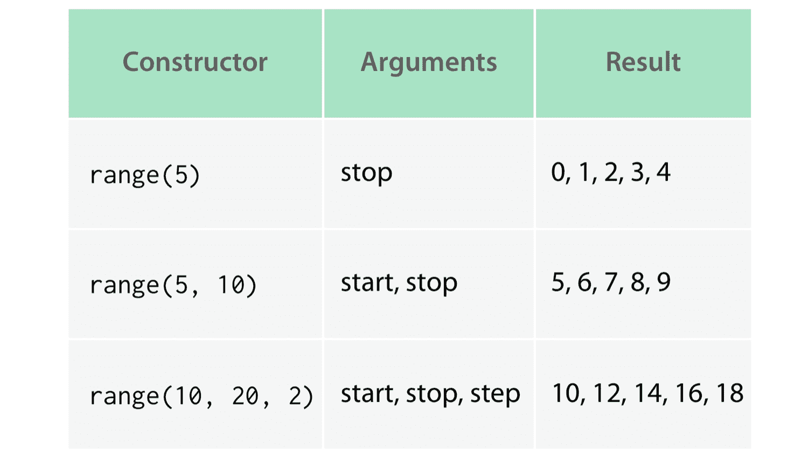
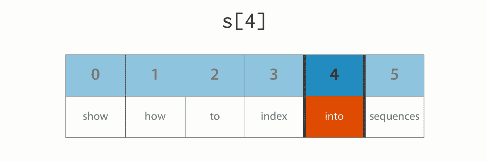
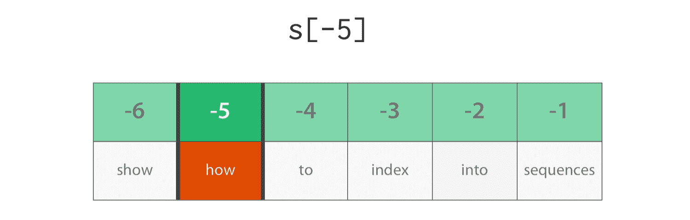
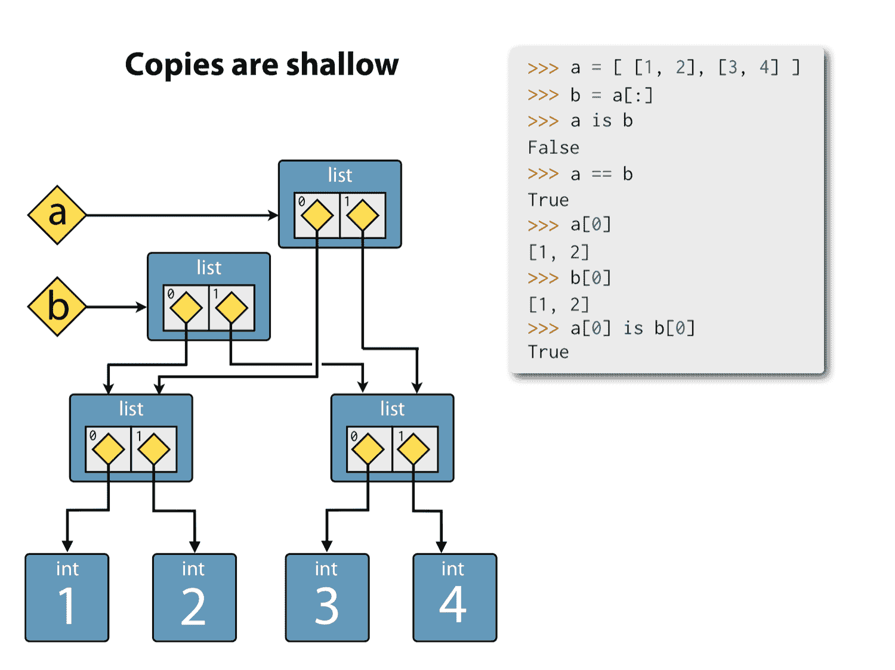
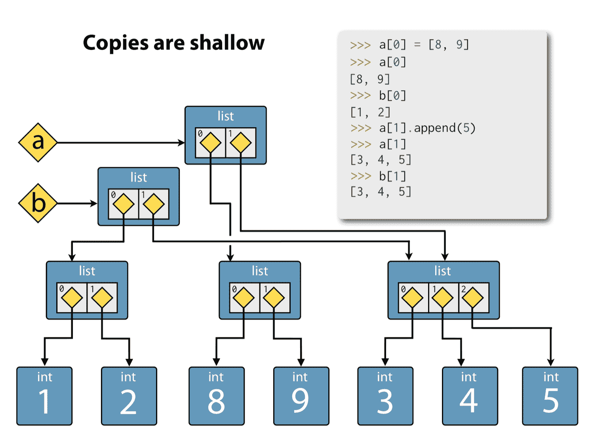
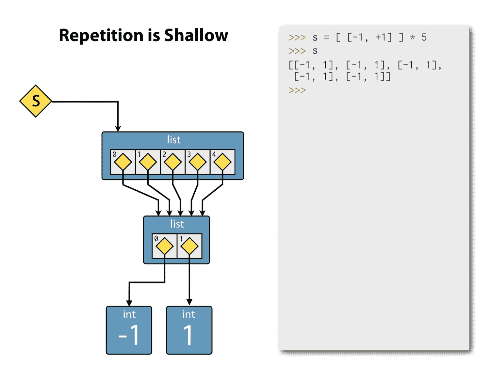
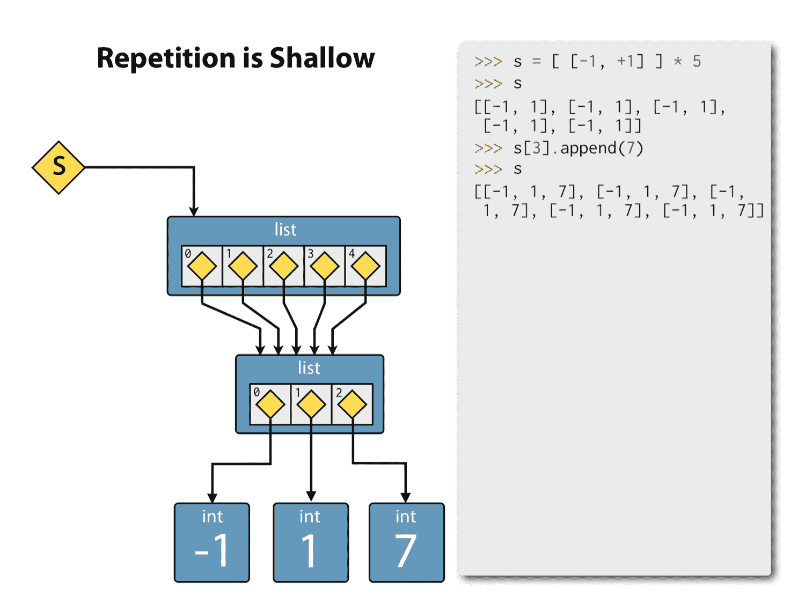
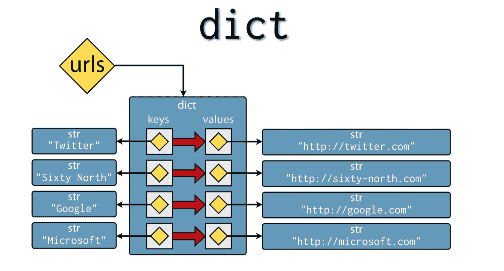

## 第六章：探索内置的集合类型

我们已经遇到了一些内置集合

+   `str` - 不可变的 Unicode 代码点序列

+   `list` - 可变的对象序列

+   `dict` - 从不可变键到可变对象的可变字典映射

我们只是浅尝辄止地了解了这些集合的工作原理，所以我们将在本章更深入地探索它们的功能。我们还将介绍三种新的内置集合类型：

+   `tuple` - 不可变的对象序列

+   `range` - 用于整数的算术级数

+   `set` - 一个包含唯一不可变对象的可变集合

我们不会在这里进一步讨论`bytes`类型。我们已经讨论了它与`str`的基本区别，大部分关于`str`的内容也适用于`bytes`。

这不是 Python 集合类型的详尽列表，但对于你在野外遇到或可能自己编写的绝大多数 Python 3 程序来说，这完全足够了。

在本章中，我们将按照上述顺序介绍这些集合，最后概述*协议*，这些协议将这些集合联系在一起，并允许它们以一致和可预测的方式使用。

### `tuple` - 一个不可变的对象序列

Python 中的元组是任意对象的不可变序列。一旦创建，其中的对象就不能被替换或移除，也不能添加新元素。

#### 文字元组

元组具有与列表类似的文字语法，只是它们用括号而不是方括号括起来。这是一个包含字符串、浮点数和整数的文字元组：

```py
>>> t = ("Norway", 4.953, 3)
>>> t
('Norway', 4.953, 3)

```

#### 元组元素访问

我们可以使用方括号通过零基索引访问元组的元素：

```py
>>> t[0]
'Norway'
>>> t[2]
3

```

#### 元组的长度

我们可以使用内置的`len()`函数来确定元组中的元素数量：

```py
>>> len(t)
3

```

#### 对元组进行迭代

我们可以使用 for 循环对其进行迭代：

```py
>>> for item in t:
>>>    print(item)
Norway
4.953
3

```

#### 元组的连接和重复

我们可以使用加号运算符连接元组：

```py
>>> t + (338186.0, 265E9)
('Norway', 4.953, 3, 338186.0, 265000000000.0)

```

同样，我们可以使用乘法运算符重复它们：

```py
>>> t * 3
('Norway', 4.953, 3, 'Norway', 4.953, 3, 'Norway', 4.953, 3)

```

#### 嵌套元组

由于元组可以包含任何对象，因此完全可以有嵌套元组：

```py
>>> a = ((220, 284), (1184, 1210), (2620, 2924), (5020, 5564), (6232, 6368))

```

我们使用索引运算符的重复应用来访问内部元素：

```py
>>> a[2][1]
2924

```

#### 单元素元组

有时需要一个单元素元组。要写这个，我们不能只使用括号中的简单对象。这是因为 Python 将其解析为数学表达式的优先控制括号中的对象：

```py
>>> h = (391)
>>> h
391
>>> type(h)
<class 'int'>

```

要创建一个单元素元组，我们使用尾随逗号分隔符，你会记得，我们允许在指定文字元组、列表和字典时使用尾随逗号。带有尾随逗号的单个元素被解析为单个元素元组：

```py
>>> k = (391,)
>>> k
(391,)
>>> type(k)
<class 'tuple'>

```

#### 空元组

这让我们面临一个问题，如何指定一个空元组。实际上答案很简单，我们只需使用空括号：

```py
>>> e = ()
>>> e
>>> type(e)
<class 'tuple'>

```

#### 可选的括号

在许多情况下，可以省略文字元组的括号：

```py
>>> p = 1, 1, 1, 4, 6, 19
>>> p
(1, 1, 1, 4, 6, 19)
>>> type(p)
<class 'tuple'>

```

#### 返回和解包元组

这个特性经常在从函数返回多个值时使用。在这里，我们创建一个函数来返回序列的最小值和最大值，这是由两个内置函数`min()`和`max()`完成的：

```py
>>> def minmax(items):
...     return min(items), max(items)
...
>>> minmax([83, 33, 84, 32, 85, 31, 86])
(31, 86)

```

将多个值作为元组返回经常与 Python 的一个称为*元组解包*的精彩特性一起使用。元组解包是一种所谓的*解构操作*，它允许我们将数据结构解包为命名引用。例如，我们可以将`minmax()`函数的结果分配给两个新引用，如下所示：

```py
>>> lower, upper = minmax([83, 33, 84, 32, 85, 31, 86])
>>> lower
31
>>> upper
86

```

这也适用于嵌套元组：

```py
>>> (a, (b, (c, d))) = (4, (3, (2, 1)))
>>> a
4
>>> b
3
>>> c
2
>>> d
1

```

#### 使用元组解包交换变量

元组解包导致了 Python 中交换两个（或更多）变量的美丽习惯用法：

```py
>>> a = 'jelly'
>>> b = 'bean'
>>> a, b = b, a
>>> a
bean
>>> b
jelly

```

### 元组构造函数

如果需要从现有集合对象（如列表）创建元组，可以使用`tuple()`构造函数。在这里，我们从一个`list`创建一个`tuple`：

```py
>>> tuple([561, 1105, 1729, 2465])
(561, 1105, 1729, 2465)

```

在这里，我们创建一个包含字符串字符的元组：

```py
>>> tuple("Carmichael")
('C', 'a', 'r', 'm', 'i', 'c', 'h', 'a', 'e', 'l')

```

#### 成员资格测试

最后，与 Python 中大多数集合类型一样，我们可以使用`in`运算符测试成员资格：

```py
>>>  5 in (3, 5, 17, 257, 65537)
True

```

或使用`not in`运算符进行非成员资格测试：

```py
>>> 5 not in (3, 5, 17, 257, 65537)
False

```

### 字符串的应用

我们在第二章已经详细介绍了`str`类型，但现在我们将花时间更深入地探索它的功能。

#### 字符串的长度

与任何其他 Python 序列一样，我们可以使用内置的`len()`函数确定字符串的长度。

```py
>>> len("llanfairpwllgwyngyllgogerychwyrndrobwllllantysiliogogogoch")
58

```


威尔士安格尔西岛上的兰韦尔普尔古因吉尔戈盖里希温德罗布尔兰蒂斯利奥戈戈戈乔火车站的标志 - 欧洲最长的地名。

#### 连接字符串

使用加号运算符支持字符串的连接：

```py
>>> "New" + "found" + "land"
Newfoundland

```

或相关的增强赋值运算符：

```py
>>> s = "New"
>>> s += "found"
>>> s += "land"
>>> s
'Newfoundland'

```


纽芬兰岛是世界第十六大岛，是英语中相对较少的封闭的三重复合词之一。

请记住，字符串是不可变的，因此在这里，增强赋值运算符在每次使用时将一个新的字符串对象绑定到`s`上。修改`s`的假象是可行的，因为`s`是对对象的引用，而不是对象本身。也就是说，虽然字符串本身是不可变的，但对它的引用是可变的。

#### 连接字符串

对于连接大量字符串，避免使用`+`或`+=`运算符。相反，应优先使用`join()`方法，因为它效率更高。这是因为使用加法运算符或其增强赋值版本进行连接可能会导致生成大量临时变量，从而导致内存分配和复制的成本。让我们看看`join()`是如何使用的。

`join()`是`str`上的一个方法，它接受一个字符串集合作为参数，并通过在它们之间插入分隔符来生成一个新的字符串。`join()`的一个有趣之处在于分隔符的指定方式：它是在调用`join()`的字符串。

与 Python 的许多部分一样，示例是最好的解释。将 HTML 颜色代码字符串列表连接成分号分隔的字符串：

```py
>>> colors = ';'.join(['#45ff23', '#2321fa', '#1298a3', '#a32312'])
>>> colors
'#45ff23;#2321fa;#1298a3;#a32312'

```

在这里，我们在我们希望使用的分隔符上调用`join()` - 分号 - 并传入要连接的字符串列表。

将一组字符串连接在一起的广泛且快速的 Python 习惯用法是使用空字符串作为分隔符进行`join()`：

```py
>>> ''.join(['high', 'way', 'man'])
highwayman

```

#### 分割字符串

然后我们可以再次使用`split()`方法来分割字符串（我们已经遇到过，但这次我们将提供它的可选参数）：

```py
>>> colors.split(';')
['#45ff23', '#2321FA', '#1298A3', '#A32912']

```

可选参数允许您指定要在其上分割字符串的字符串 - 不仅仅是字符。因此，例如，您可以通过在单词“and”上分割来解析匆忙的早餐订单：

```py
>>> 'eggsandbaconandspam'.split('and')
['eggs', 'bacon', 'spam']

```

* * *

### 禅之时刻


这种使用`join()`的方法常常让初学者感到困惑，但随着使用，Python 采取的方法将被认为是自然和优雅的。

* * *

#### 字符串分区

另一个非常有用的字符串方法是`partition()`，它将字符串分成三个部分；分隔符之前的部分，分隔符本身，以及分隔符之后的部分：

```py
>>> "unforgettable".partition('forget')
('un', 'forget', 'table')

```

`partition()`方法返回一个元组，因此这通常与元组解包一起使用：

```py
>>> departure, separator, arrival = "London:Edinburgh".partition(':')
>>> departure
London
>>> arrival
Edinburgh

```

通常，我们对捕获分隔符值不感兴趣，所以您可能会看到下划线变量名被使用。这在 Python 语言中并没有特殊对待，但有一个不成文的惯例，即下划线变量用于未使用或虚拟值：

```py
>>> origin, _, destination = "Seattle-Boston".partition('-')

```

这个约定得到了许多 Python 感知开发工具的支持，这些工具将抑制对下划线未使用变量的警告。

#### 字符串格式化

最有趣和经常使用的字符串方法之一是`format()`。这取代了旧版本 Python 中使用的字符串插值技术，虽然没有取代它，并且我们在本书中没有涵盖。`format()`方法可以有用地调用任何包含所谓的*替换字段*的字符串，这些字段用花括号括起来。作为`format()`参数提供的对象被转换为字符串，并用于填充这些字段。这里是一个例子：

```py
>>> "The age of {0} is {1}".format('Jim', 32)
'The age of Jim is 32'

```

在这种情况下，字段名称（`0`和`1`）与`format()`的位置参数匹配，并且每个参数在幕后被转换为字符串。

一个字段名称可能被多次使用：

```py
>>> "The age of {0} is {1}. {0}'s birthday is on {2}".format('Fred', 24, 'October 31')

```

然而，如果字段名恰好只使用一次，并且按照相同的顺序作为参数，它们可以被省略：

```py
>>> "Reticulating spline {} of {}.".format(4, 23)
'Reticulating spline 4 of 23.'

```

如果向`format()`提供了关键字参数，则可以使用命名字段而不是序数：

```py
>>> "Current position {latitude} {longitude}".format(latitude="60N", longitude="5E")
'Current position 60N 5E'

```

可以使用方括号索引到序列，并放在替换字段中：

```py
>>> "Galactic position x={pos[0]}, y={pos[1]}, z={pos[2]}".format(pos=(65.2, 23.1, 82\
.2))
'Galactic position x=65.2, y=23.1, z=82.2'

```

我们甚至可以访问对象属性。在这里，我们使用关键字参数将整个`math`模块传递给`format()`（记住 - 模块也是对象！），然后从替换字段中访问它的两个属性：

```py
>>> import math
>>> "Math constants: pi={m.pi}, e={m.e}".format(m=math)
'Math constants: pi=3.141592653589793 e=2.718281828459045'

```

格式化字符串还可以让我们对字段对齐和浮点格式化有很多控制。这里是相同的常量，只显示到小数点后三位：

```py
>>> "Math constants: pi={m.pi:.3f}, e={m.e:.3f}".format(m=math)
'Math constants: pi=3.142, e=2.718'

```

#### 其他字符串方法

我们建议您花一些时间熟悉其他字符串方法。记住，您可以使用以下方法找出它们是什么：

```py
>>> help(str)

```

### `range` - 一组均匀间隔的整数

让我们继续看看`range`，许多开发人员不认为它是一个集合^(12)，尽管我们会看到在 Python 3 中它绝对是。

`range`是一种用于表示整数的算术级数的序列类型。范围是通过调用`range()`构造函数创建的，没有文字形式。通常我们只提供停止值，因为 Python 默认为零起始值：

```py
>>> range(5)
range(0, 5)

```

范围有时用于创建连续的整数，用作循环计数器：

```py
>>> for i in range(5):
...     print(i)
...
0
1
2
3
4

```

请注意，提供给`range()`的停止值比序列的末尾多一个，这就是为什么之前的循环没有打印 5 的原因。

#### 起始值

如果需要，我们还可以提供一个起始值：

```py
>>> range(5, 10)
range(5, 10)

```

将这个放在`list()`构造函数中是一种强制生成每个项目的方便方式：

```py
>>> list(range(5, 10))
[5, 6, 7, 8, 9]

```

这种所谓的半开放范围约定 - 停止值不包括在序列中 - 乍看起来很奇怪，但如果你处理连续范围，它实际上是有道理的，因为一个范围指定的结束是下一个范围的开始：

```py
>>> list(range(10, 15))
[10, 11, 12, 13, 14]
>>> list(range(5, 10)) + list(range(10, 15))
[5, 6, 7, 8, 9, 10, 11, 12, 13, 14]

```

#### 步长参数

Range 还支持步长参数：

```py
>>> list(range(0, 10, 2))
[0, 2, 4, 6, 8]

```

请注意，为了使用步长参数，我们必须提供所有三个参数。范围很奇怪，因为它通过计算其参数来确定它们的含义。只提供一个参数意味着该参数是`stop`值。两个参数是`start`和`stop`，三个参数是`start`，`stop`和`step`。Python `range()`以这种方式工作，因此第一个参数`start`可以是可选的，这在通常情况下是不可能的。此外，`range`构造函数不支持关键字参数。你几乎可以说它是不符合 Python 风格的！



对于范围的构造函数，这可能是不符合 Python 风格的，因为参数的解释取决于提供了一个、两个还是三个参数。

#### 不使用`range`：`enumerate()`

在这一点上，我们将向您展示另一个样式不佳的代码示例，但这次是您可以，也应该避免的。这是一个打印列表中元素的不好的方法：

```py
>>> s = [0, 1, 4, 6, 13]
>>> for i in range(len(s)):
...     print(s[i])
...
0
1
4
6
13

```

尽管这样做是有效的，但绝对不是 Pythonic 的。始终更喜欢使用对象本身的迭代：

```py
>>> s = [0, 1, 4, 6, 13]
>>> for v in s:
...     print(v)
0
1
4
6
13

```

如果您需要一个计数器，您应该使用内置的`enumerate()`函数，它返回一个可迭代的成对序列，每对都是一个`tuple`。每对的第一个元素是当前项目的索引，每对的第二个元素是项目本身：

```py
>>> t = [6, 372, 8862, 148800, 2096886]
>>> for p in enumerate(t):
>>>     print(p)
(0, 6)
(1, 372)
(2, 8862)
(3, 148800)
(4, 2096886)

```

更好的是，我们可以使用元组解包，避免直接处理元组：

```py
>>> for i, v in enumerate(t):
...     print("i = {}, v = {}".format(i, v))
...
i = 0, v = 6
i = 1, v = 372
i = 2, v = 8862
i = 3, v = 148800
i = 4, v = 2096886

```

### `list`的操作

我们已经稍微介绍了列表，并且已经充分利用了它们。我们知道如何使用文字语法创建列表，使用`append()`方法添加到列表中，并使用带有正数、从零开始的索引的方括号索引来获取和修改它们的内容。



零和正整数从列表的前面索引，因此索引四是列表中的第五个元素。

现在我们将深入研究一下。

#### 列表（和其他序列）的负索引

列表（以及其他 Python 序列，对于元组也适用）的一个非常方便的特性是能够从末尾而不是从开头进行索引。这是通过提供*负*索引来实现的。例如：

```py
>>> r = [1, -4, 10, -16, 15]
>>> r[-1]
15
>>> r[-2]
-16

```



负整数是从末尾向后的-1，因此索引-5 是最后但第四个元素。

这比计算正索引的笨拙等效方法要优雅得多，否则您将需要使用它来检索最后一个元素：

```py
>>> r[len(r) - 1]

```

请注意，使用-0 进行索引与使用 0 进行索引相同，并返回列表中的第一个元素。由于 0 和负零之间没有区别，负索引基本上是基于 1 而不是基于 0 的。如果您正在计算具有相当复杂逻辑的索引，这一点很重要：负索引很容易出现一次性错误。^(13)

#### 切片列表

切片是一种扩展索引的形式，允许我们引用列表的部分。为了使用它，我们传递一个半开放范围的开始和停止索引，用冒号分隔，作为方括号索引参数。这是如何做的：

```py
>>> s = [3, 186, 4431, 74400, 1048443]
>>> s[1:3]
[186, 4431]

```

请注意，第二个索引超出了返回范围的末尾。

![切片`[1:4]`。切片提取列表的一部分。切片范围是半开放的，因此停止索引处的值不包括在内。](images/m05----slice-forward-indexes.png)

切片`[1:4]`。切片提取列表的一部分。切片范围是半开放的，因此停止索引处的值不包括在内。

此功能可以与负索引结合使用。例如，除了第一个和最后一个元素之外，可以获取所有元素：

```py
>>> s[1:-1]
[186, 4431, 74400]

```

![切片`[1：-1]`对于排除列表的第一个和最后一个元素非常有用。](images/m05----slice-backward-indexes.png)

切片`[1：-1]`对于排除列表的第一个和最后一个元素非常有用。

开始和停止索引都是可选的。要从第三个元素开始切片到列表的末尾：

```py
>>> s[3:]
[74400, 1048443]

```

![切片`[3：]`保留了从第四个元素到最后一个元素的所有元素。](images/m05----slice-to-end.png)

切片`[3：]`保留了从第四个元素到最后一个元素的所有元素。

要从开头切片到第三个元素，但不包括第三个元素：

```py
>>> s[:3]
[3, 186, 4431]

```

![切片`[:3]`保留了列表开头的所有元素，直到，

但*不*包括第四个元素。](images/m05----slice-from-beginning.png)

切片`[:3]`保留了列表开头的所有元素，但*不*包括第四个元素。

请注意，这两个列表是互补的，并且一起形成整个列表，展示了半开范围约定的便利性。

![切片`[:3]`和`[3:]`是互补的。](images/m05----complementary-slices.png)

切片`[:3]`和`[3:]`是互补的。

由于开始和停止切片索引都是可选的，完全可以省略两者并检索所有元素：

```py
>>> s[:]
[3, 186, 4431, 74400, 1048443]

```

这被称为*完整切片*，在 Python 中是一种重要的技术。

![切片`[:]`是完整切片，包含列表中的所有元素。这是一个重要的习语，用于复制列表。](images/m05----full-slice.png)

切片`[:]`是完整切片，包含列表中的所有元素。这是一个重要的习语，用于复制列表。

#### 复制列表

事实上，完整切片是*复制*列表的重要习语。请记住，分配引用永远不会复制对象，而只是复制对对象的引用：

```py
>>> t = s
>>> t is s
True

```

我们使用完整切片将其复制到一个新列表中：

```py
>>> r = s[:]

```

并确认使用完整切片获得的列表具有独特的身份：

```py
>>> r is s
False

```

尽管它具有等效的值：

```py
>>> r == s
True

```

重要的是要理解，虽然我们有一个可以独立修改的新列表对象，但其中的元素是对原始列表引用的相同对象的引用。如果这些对象都是可变的并且被修改（而不是替换），则更改将在两个列表中都可见。

我们展示这种完整切片列表复制习语，因为您可能会在实际应用中看到它，而且它的作用并不是立即明显的。您应该知道还有其他更可读的复制列表的方法，比如`copy()`方法：

```py
>>> u = s.copy()
>>> u is s
False

```

或者简单调用列表构造函数，传递要复制的列表：

```py
>>> v = list(s)

```

在这些技术之间的选择在很大程度上是品味的问题。我们更偏好使用列表构造函数的第三种形式，因为它具有使用任何可迭代系列作为源的优势，而不仅仅是列表。

#### 浅复制

然而，您必须意识到，所有这些技术都执行*浅*复制。也就是说，它们创建一个新的列表，其中包含对源列表中相同对象的引用，但它们不复制被引用的对象。为了证明这一点，我们将使用嵌套列表，其中内部列表充当可变对象。这是一个包含两个元素的列表，每个元素本身都是一个列表：

```py
>>> a = [ [1, 2], [3, 4] ]

```

我们使用完整切片复制这个列表：

```py
>>> b = a[:]

```

并且让我们确信我们实际上有不同的列表：

```py
>>> a is b
False

```

具有等效值：

```py
>>> a == b
True

```

然而，请注意，这些不同列表中的引用不仅指向*等效*对象：

```py
>>> a[0]
[1, 2]
>>> b[0]
[1, 2]

```

但实际上是指向*相同*的对象：

```py
>>> a[0] is b[0]
True

```



复制是浅层的。当复制列表时，对包含对象的引用（黄色菱形）进行复制，但被引用的对象（蓝色矩形）不会被复制。

这种情况持续到我们将`a`的第一个元素重新绑定到一个新构造的列表为止：

```py
>>> a[0] = [8, 9]

```

现在，`a`和`b`的第一个元素指向不同的列表：

```py
>>> a[0]
[8, 9]
>>> b[0]
[1, 2]

```


列表`a`和`b`的第一个元素现在是唯一拥有的，而第二个元素是共享的。

`a`和`b`的第二个元素仍然指向相同的对象。我们将通过`a`列表对该对象进行变异来证明这一点：

```py
>>> a[1].append(5)
>>> a[1]
[3, 4, 5]

```

我们看到改变通过`b`列表反映出来：

```py
>>> b[1]
[3, 4, 5]

```



修改两个列表所引用的对象。

为了完整起见，这是`a`和`b`列表的最终状态：

```py
>>> a
[[8, 9], [3, 4, 5]]
>>> b
[[1, 2], [3, 4, 5]]

```


列表`a`的最终状态。


列表`b`的最终状态。

如果需要对这样的层次数据结构执行真正的深层复制-根据我们的经验，这种情况很少见-我们建议查看 Python 标准库中的`copy`模块。

#### 重复列表

与字符串和元组一样，列表支持使用乘法运算符进行重复。很容易使用：

```py
>>> c = [21, 37]
>>> d = c * 4
>>> d
[21, 37, 21, 37, 21, 37, 21, 37]

```

尽管在这种形式中很少见。它最常用于将已知大小的列表初始化为常量值，例如零：

```py
>>> [0] * 9
[0, 0, 0, 0, 0, 0, 0, 0, 0]

```

但要注意，在可变元素的情况下，这里也存在同样的陷阱，因为重复将重复*对每个元素的引用*，而不是复制值。让我们再次使用嵌套列表作为我们的可变元素来演示：

```py
>>> s = [ [-1, +1] ] * 5
>>> s
[[-1, 1], [-1, 1], [-1, 1], [-1, 1], [-1, 1]]

```



重复是浅层的。

如果我们现在修改外部列表的第三个元素：

```py
>>> s[2].append(7)

```

我们通过外部列表元素的所有五个引用看到了变化：

```py
>>> s
[[-1, 1, 7], [-1, 1, 7], [-1, 1, 7], [-1, 1, 7], [-1, 1, 7]]

```



改变列表中重复内容的变异。对对象的任何更改都会反映在外部列表的每个索引中。

#### 使用`index()`查找列表元素

要在列表中找到一个元素，使用`index()`方法并传递你要搜索的对象。元素将被比较直到找到你要找的那个：

```py
>>> w = "the quick brown fox jumps over the lazy dog".split()
>>> w
['the', 'quick', 'brown', 'fox', 'jumps', 'over', 'the', 'lazy', 'dog']
>>> i = w.index('fox')
>>> i
3
>>> w[i]
'fox'

```

如果搜索一个不存在的值，你会收到一个`ValueError`：

```py
>>> w.index('unicorn')
Traceback (most recent call last):
  File "<stdin>", line 1, in <module>
ValueError: 'unicorn' is not in list

```

我们将在第六章学习如何优雅地处理这些错误。

#### 使用`count()`和`in`进行成员测试。

另一种搜索的方法是使用`count()`来计算匹配的元素：

```py
>>> w.count("the")
2

```

如果只想测试成员资格，可以使用`in`运算符：

```py
>>> 37 in [1, 78, 9, 37, 34, 53]
True

```

或者使用`not in`进行非成员测试：

```py
>>> 78 not in [1, 78, 9, 37, 34, 53]
False

```

#### 使用`del`按索引删除列表元素

使用一个我们尚未熟悉的关键字来删除元素：`del`。`del`关键字接受一个参数，即对列表元素的引用，并将其从列表中删除，从而缩短列表：

```py
>>> u = "jackdaws love my big sphinx of quartz".split()
>>> u
['jackdaws', 'love', 'my', 'big', 'sphinx', 'of', 'quartz']
>>> del u[3]
>>> u
['jackdaws', 'love', 'my', 'sphinx', 'of', 'quartz']

```

#### 使用`remove()`按值删除列表元素

也可以使用`remove()`方法按值而不是按位置删除元素：

```py
>>> u.remove('jackdaws')
>>> u
['love', 'my', 'sphinx', 'of', 'quartz']

```

这相当于更冗长的形式：

```py
>>> del u[u.index('jackdaws')]

```

尝试`remove()`一个不存在的项目也会引发`ValueError`：

```py
>>> u.remove('pyramid')
Traceback (most recent call last):
  File "<stdin>", line 1, in <module>
ValueError: list.remove(x): x not in list

```

#### 插入到列表

可以使用`insert()`方法将项目插入列表，该方法接受新项目的索引和新项目本身：

```py
>>> a = 'I accidentally the whole universe'.split()
>>> a
['I', 'accidentally', 'the', 'whole', 'universe']
>>> a.insert(2, "destroyed")
>>> a
['I', 'accidentally', 'destroyed', 'the', 'whole', 'universe']
>>> ' '.join(a)
'I accidentally destroyed the whole universe'

```

#### 连接列表

使用加法运算符连接列表会产生一个新的列表，而不会修改任何操作数：

```py
>>> m = [2, 1, 3]
>>> n = [4, 7, 11]
>>> k = m + n
>>> k
[2, 1, 3, 4, 7, 11]

```

增强赋值运算符`+=`会就地修改被赋值的对象：

```py
>>> k += [18, 29, 47]
>>> k
[2, 1, 3, 4, 7, 11, 18, 29, 47]

```

也可以使用`extend()`方法来实现类似的效果：

```py
>>> k.extend([76, 129, 199])
>>> k
[2, 1, 3, 4, 7, 11, 18, 29, 47, 76, 123, 199]

```

增强赋值和`extend()`方法将与右侧的任何可迭代系列一起工作。

#### 重新排列`list`元素

在我们离开列表之前，让我们看看两个可以就地重新排列元素的操作：反转和排序。

可以通过调用`reverse()`方法来就地反转列表：

```py
>>> g = [1, 11, 21, 1211, 112111]
>>> g.reverse()
>>> g
[112111, 1211, 21, 11, 1]

```

可以使用`sort()`方法就地对列表进行排序：

```py
>>> d = [5, 17, 41, 29, 71, 149, 3299, 7, 13, 67]
>>> d.sort()
>>> d
[5, 7, 13, 17, 29, 41, 67, 71, 149, 3299]

```

`sort()`方法接受两个可选参数，`key`和`reverse`。后者不言自明，当设置为`True`时，会进行降序排序：

```py
>>> d.sort(reverse=True)
>>> d
[3299, 149, 71, 67, 41, 29, 17, 13, 7, 5]

```

`key`参数更有趣。它接受任何*可调用*对象，然后用于从每个项目中提取*键*。然后根据这些键的相对顺序对项目进行排序。在 Python 中有几种类型的可调用对象，尽管到目前为止我们遇到的唯一一种是谦卑的函数。例如，`len()`函数是一个可调用对象，用于确定集合的长度，例如字符串。

考虑以下单词列表：

```py
>>> h = 'not perplexing do handwriting family where I illegibly know doctors'.split()
>>> h
['not', 'perplexing', 'do', 'handwriting', 'family', 'where', 'I', 'illegibly', 'know\
', 'doctors']
>>> h.sort(key=len)
>>> h
['I', 'do', 'not', 'know', 'where', 'family', 'doctors', 'illegibly', 'perplexing', '\
handwriting']
>>> ' '.join(h)
'I do not know where family doctors illegibly perplexing handwriting'

```

#### 不在原地重新排列

有时候，*in situ*排序或反转并不是所需的。例如，它可能会导致函数参数被修改，给函数带来混乱的副作用。对于`reverse()`和`sort()`列表方法的 out-of-place 等价物，可以使用`reversed()`和`sorted()`内置函数，它们分别返回一个反向迭代器和一个新的排序列表。例如：

```py
>>> x = [4, 9, 2, 1]
>>> y = sorted(x)
>>> y
[1, 2, 4, 9]
>>> x
[4, 9, 2, 1]

```

和：

```py
>>> p = [9, 3, 1, 0]
>>> q = reversed(p)
>>> q
<list_reverseiterator object at 0x1007bf290>
>>> list(q)
[0, 1, 3, 9]

```

注意我们如何使用列表构造函数来评估`reversed()`的结果。这是因为`reversed()`返回一个迭代器，这是我们以后会更详细地讨论的一个主题。

这些函数的优点是它们可以用于任何有限的可迭代源对象。

### 字典

现在我们将回到字典，它是许多 Python 程序的核心，包括 Python 解释器本身。我们之前简要地看过字面上的字典，看到它们用花括号界定，并包含逗号分隔的键值对，每对由冒号绑定在一起：

```py
>>> urls = {'Google': 'http://google.com',
...         'Twitter': 'http://twitter.com',
...         'Sixty North': 'http://sixty-north.com',
...         'Microsoft': 'http://microsoft.com' }
>>>

```



一个 URL 字典。字典键的顺序不被保留。

值可以通过键访问：

```py
>>> urls['Twitter']
http://twitter.com

```

由于每个键只与一个值相关联，并且查找是通过键进行的，因此在任何单个字典中，键必须是唯一的。但是，拥有重复的值是可以的。

在内部，字典维护了对键对象和值对象的引用对。键对象*必须*是不可变的，所以字符串、数字和元组都可以，但列表不行。值对象可以是可变的，在实践中通常是可变的。我们的示例 URL 映射使用字符串作为键和值，这是可以的。

与其他集合一样，还有一个名为`dict()`的命名构造函数，它可以将其他类型转换为字典。我们可以使用构造函数从存储在元组中的可迭代的键值对系列中复制，就像这样：

```py
>>> names_and_ages = [ ('Alice', 32), ('Bob', 48), ('Charlie', 28), ('Daniel', 33) ]
>>> d = dict(names_and_ages)
>>> d
{'Charlie': 28, 'Bob': 48, 'Alice': 32, 'Daniel': 33}

```

请记住，字典中的项目不以任何特定顺序存储，因此列表中的项目顺序不被保留。

只要键是合法的 Python 标识符，甚至可以直接从传递给`dict()`的关键字参数创建字典：

```py
>>> phonetic = dict(a='alfa', b='bravo', c='charlie', d='delta', e='echo', f='foxtrot\
')
>>> phonetic
{'a': 'alfa', 'c': 'charlie', 'b': 'bravo', 'e': 'echo', 'd': 'delta', 'f': 'foxtrot'}

```

同样，关键字参数的顺序不被保留。

#### 复制字典

与列表一样，默认情况下字典复制是浅复制，只复制对键和值对象的引用，而不是对象本身。有两种复制字典的方法，我们最常见的是第二种。第一种技术是使用`copy()`方法：

```py
>>> d = dict(goldenrod=0xDAA520, indigo=0x4B0082, seashell=0xFFF5EE)
>>> e = d.copy()
>>> e
{'indigo': 4915330, 'goldenrod': 14329120, 'seashell': 16774638}

```

第二种方法是将现有的字典传递给`dict()`构造函数：

```py
>>> f = dict(e)
>>> f
{'indigo': 4915330, 'seashell': 16774638, 'goldenrod': 14329120}

```

#### 更新字典

如果需要使用另一个字典的定义来扩展字典，可以使用`update()`方法。这个方法被调用在要更新的字典上，并传递要合并的字典的内容：

```py
>>> g = dict(wheat=0xF5DEB3, khaki=0xF0E68C, crimson=0xDC143C)
>>> f.update(g)
>>> f
>>> {'crimson': 14423100, 'indigo': 4915330, 'goldenrod': 14329120,
      'wheat': 16113331, 'khaki': 15787660, 'seashell': 16774638}

```

如果`update()`的参数包括已经存在于目标字典中的键，则这些键关联的值将被源字典中对应的值替换掉：

```py
>>> stocks = {'GOOG': 891, 'AAPL': 416, 'IBM': 194}
>>> stocks.update({'GOOG': 894, 'YHOO': 25})
>>> stocks
{'YHOO': 25, 'AAPL': 416, 'IBM': 194, 'GOOG': 894}

```

#### 遍历字典键

正如我们在前面的章节中看到的，字典是可迭代的，因此可以与 for 循环一起使用。字典在每次迭代中只产生一个*键*，我们需要使用方括号运算符进行查找来检索相应的值：

```py
>>> colors = dict(aquamarine='#7FFFD4', burlywood='#DEB887',
...               chartreuse='#7FFF00', cornflower='#6495ED',
...               firebrick='#B22222', honeydew='#F0FFF0',
...               maroon='#B03060', sienna='#A0522D')
>>> for key in colors:
...     print("{key} => {value}".format(key=key, value=colors[key]))
...
firebrick => #B22222
maroon => #B03060
aquamarine => #7FFFD4
burlywood => #DEB887
honeydew => #F0FFF0
sienna => #A0522D
chartreuse => #7FFF00
cornflower => #6495ED

```

注意，键以任意顺序返回，既不是它们被指定的顺序，也不是任何其他有意义的排序顺序。

#### 遍历字典值

如果我们只想遍历值，可以使用`values()`字典方法。这将返回一个对象，它提供了一个可迭代的*视图*，而不会导致值被复制：

```py
>>> for value in colors.values():
...     print(value)
...
#B22222
#B03060
#7FFFD4
#DEB887
#F0FFF0
#A0522D
#DEB887
#6495ED

```

没有有效或方便的方法来从值中检索相应的*键*，所以我们只打印值

为了对称起见，还有一个`keys()`方法，尽管由于直接对字典对象进行迭代会产生键，因此这种方法不太常用：

```py
>>> for key in colors.keys():
...     print(key)
...
firebrick
maroon
aquamarine
burlywood
honeydew
sienna
chartreuse
cornflower

```

#### 遍历键值对

通常，我们想要同时遍历键和值。字典中的每个键值对称为*项*，我们可以使用`items()`字典方法获得项的可迭代视图。当迭代`items()`视图时，会将每个键值对作为一个元组产生。通过在 for 语句中使用元组解包，我们可以在一次操作中获取键和值，而无需额外查找：

```py
>>> for key, value in colors.items():
...     print("{key} => {value}".format(key=key, value=value))
...
firebrick => #B22222
maroon => #B03060
aquamarine => #7FFFD4
burlywood => #DEB887
honeydew => #F0FFF0
sienna => #A0522D
chartreuse => #DEB887
cornflower => #6495ED

```

#### 用于字典键的成员测试

使用`in`和`not in`运算符对字典的成员测试适用于键：

```py
>>> symbols = dict(
...     usd='\u0024', gbp='\u00a3', nzd='\u0024', krw='\u20a9',
...     eur='\u20ac', jpy='\u00a5',  nok='kr', hhg='Pu', ils='\u20aa')
>>> symbols
{'jpy': '¥', 'krw': '₩', 'eur': '€', 'ils': '₪', 'nzd': '$', 'nok': 'kr',
  'gbp': '£', 'usd': '$', 'hhg': 'Pu'}
>>> 'nzd' in symbols
True
>>> 'mkd' not in symbols
True

```

#### 移除字典条目

至于列表，要从字典中删除条目，我们使用`del`关键字：

```py
>>> z = {'H': 1, 'Tc': 43, 'Xe': 54, 'Un': 137, 'Rf': 104, 'Fm': 100}
>>> del z['Un']
>>> z
{'H': 1, 'Fm': 100, 'Rf': 104, 'Xe': 54, 'Tc': 43}

```

#### 字典的可变性

字典中的键应该是不可变的，尽管值可以被修改。这是一个将元素符号映射到该元素不同同位素的质量数列表的字典：

```py
>>> m = {'H': [1, 2, 3],
...      'He': [3, 4],
...      'Li': [6, 7],
...      'Be': [7, 9, 10],
...      'B': [10, 11],
...      'C': [11, 12, 13, 14]}

```

看看我们如何将字典文字分成多行。这是允许的，因为字典文字的花括号是开放的。

我们的字符串键是不可变的，这对于字典的正确功能是件好事。但是，如果我们发现一些新的同位素，修改字典的值也没有问题：

```py
>>> m['H'] += [4, 5, 6, 7]
>>> m
{'H': [1, 2, 3, 4, 5, 6, 7], 'Li': [6, 7], 'C': [11, 12, 13, 14], 'B':
[10, 11], 'He': [3, 4], 'Be': [7, 9, 10]}

```

在这里，增强赋值运算符应用于通过‘H’（表示氢）键访问的*列表*对象；字典没有被修改。

当然，字典本身是可变的；我们知道可以添加新的条目：

```py
>>> m['N'] = [13, 14, 15]

```

#### 漂亮的打印

对于复合数据结构，比如我们的同位素表，将它们以更可读的形式打印出来会很有帮助。我们可以使用 Python 标准库中的漂亮打印模块`pprint`来做到这一点，其中包含一个名为`pprint`的函数：

```py
>>> from pprint import pprint as pp

```

请注意，如果我们没有将`pprint`函数绑定到另一个名称`pp`，函数引用将覆盖模块引用，阻止进一步访问模块的内容^(14)：

```py
>>> pp(m)
{'B': [10, 11],
  'Be': [7, 9, 10],
  'C': [11, 12, 13, 14],
  'H': [1, 2, 3, 4, 5, 6, 7],
  'He': [3, 4],
  'Li': [6, 7],
  'N': [13, 14, 15]}

```

给我们提供了一个更易理解的显示。

让我们离开字典，看看一个新的内置数据结构，`set`。

### `set` - 一个无序的唯一元素的集合

`set`数据类型是一个无序的唯一元素的集合。集合是可变的，因为可以向集合添加和移除元素，但每个元素本身必须是不可变的，就像字典的键一样。


集合是无序的不同元素的组合。

集合的文字形式与字典非常相似，同样由花括号括起来，但每个项目都是单个对象，而不是由冒号连接的一对对象：

```py
>>> p = {6, 28, 496, 8128, 33550336}

```

请注意，与字典一样，`set`是无序的。

```py
>>> p
{33550336, 8128, 28, 496, 6}

```

当然，集合的类型是`set`：

```py
>>> type(p)
<class 'set'>

```

#### 集合构造函数

请记住，有点令人困惑的是，空花括号创建的是一个空的*字典*，而不是一个空的集合：

```py
>>> d = {}
>>> type(d)
<class 'dict'>

```

要创建一个空集合，我们必须使用`set()`构造函数：

```py
>>> e = set()
>>> e
set()

```

这也是 Python 对我们空集合的回显形式。

`set()`构造函数可以从任何可迭代序列（如列表）创建集合：

```py
>>> s = set([2, 4, 16, 64, 4096, 65536, 262144])
>>> s
{64, 4096, 2, 4, 65536, 16, 262144}

```

输入序列中的重复项将被丢弃。事实上，集合的常见用途是从对象序列中高效地移除重复项：

```py
>>> t = [1, 4, 2, 1, 7, 9, 9]
>>> set(t)
{1, 2, 4, 9, 7}

```

#### 遍历集合

当然，集合是可迭代的，尽管顺序是任意的：

```py
>>> for x in {1, 2, 4, 8, 16, 32}:
>>>     print(x)
32
1
2
4
8
16

```

#### 集合的成员测试

成员测试是集合的基本操作，与其他集合类型一样，使用`in`和`not in`运算符执行：

```py
>>> q = { 2, 9, 6, 4 }
>>> 3 in q
False
>>> 3 not in q
True

```

#### 向集合添加元素

要向集合添加单个元素，请使用`add()`方法：

```py
>>> k = {81, 108}
>>> k
{81, 108}
>>> k.add(54)
>>> k
{81, 108, 54}
>>> k.add(12)
>>> k
{81, 108, 54, 12}

```

添加已经存在的元素不会产生任何效果：

```py
>>> k.add(108)

```

尽管也不会产生错误。

可以一次性从任何可迭代序列中添加多个元素，包括另一个集合，使用`update()`方法：

```py
>>> k.update([37, 128, 97])
>>> k
{128, 81, 37, 54, 97, 12, 108}

```

#### 从集合中移除元素

提供了两种方法来从集合中删除元素。第一种`remove()`要求要删除的元素必须存在于集合中，否则会给出`KeyError`：

```py
>>> k.remove(97)
>>> k
{128, 81, 37, 54, 12, 108}
>>> k.remove(98)
Traceback (most recent call last):
  File "<stdin>", line 1, in <module>
KeyError: 98

```

第二种方法`discard()`不那么挑剔，如果元素不是集合的成员，则没有影响：

```py
>>> k.discard(98)
>>> k
{128, 81, 37, 54, 12, 108}

```

#### 复制集合

与其他内置集合一样，`set`具有`copy()`方法，执行集合的浅复制（复制引用而不是对象）：

```py
>>> j = k.copy()
>>> j
{128, 81, 37, 54, 108, 12}

```

正如我们已经展示的，可以使用`set()`构造函数：

```py
>>> m = set(j)
>>> m
{128, 81, 37, 54, 108, 12}

```

#### 集合代数操作

也许集合类型最有用的方面是提供的一组强大的集合代数操作。这些操作使我们能够轻松计算集合的并集、差集和交集，并评估两个集合是否具有子集、超集或不相交的关系。

为了演示这些方法，我们将根据不同的表型构建一些人的集合：

```py
>>> blue_eyes = {'Olivia', 'Harry', 'Lily', 'Jack', 'Amelia'}
>>> blond_hair = {'Harry', 'Jack', 'Amelia', 'Mia', 'Joshua'}
>>> smell_hcn = {'Harry', 'Amelia'}
>>> taste_ptc = {'Harry', 'Lily', 'Amelia', 'Lola'}
>>> o_blood = {'Mia', 'Joshua', 'Lily', 'Olivia'}
>>> b_blood = {'Amelia', 'Jack'}
>>> a_blood = {'Harry'}
>>> ab_blood = {'Joshua', 'Lola'}

```


集合代数操作。

##### 联合

要查找所有金发、蓝眼睛或两者都有的人，我们可以使用`union()`方法：

```py
>>> blue_eyes.union(blond_hair)
{'Olivia', 'Jack', 'Joshua', 'Harry', 'Mia', 'Amelia', 'Lily'}

```

集合并集将所有在两个集合中的元素收集在一起。

我们可以演示`union()`是可交换操作（即，我们可以交换操作数的顺序），使用值相等运算符来检查结果集的等价性：

```py
>>> blue_eyes.union(blond_hair) == blond_hair.union(blue_eyes)
True

```

##### 交集

要找到所有金发*和*蓝眼睛的人，我们可以使用`intersection()`方法：

```py
>>> blue_eyes.intersection(blond_hair)
{'Amelia', 'Jack', 'Harry'}

```

它只收集两个集合中都存在的元素。

这也是可交换的：

```py
>>> blue_eyes.intersection(blond_hair) == blond_hair.intersection(blue_eyes)
True

```

#### 差异

要识别金发但*没有*蓝眼睛的人，我们可以使用`difference()`方法：

```py
>>> blond_hair.difference(blue_eyes)
{'Joshua', 'Mia'}

```

这找到了第一个集合中存在但不在第二个集合中的所有元素。

这是非交换的，因为金发但没有蓝眼睛的人与有蓝眼睛但没有金发的人不同：

```py
>>> blond_hair.difference(blue_eyes) == blue_eyes.difference(blond_hair)
False

```

##### 对称差

然而，如果我们想确定哪些人只有金发*或*蓝眼睛，但不是两者都有，我们可以使用`symmetric_difference()`方法：

```py
>>> blond_hair.symmetric_difference(blue_eyes)
{'Olivia', 'Joshua', 'Mia', 'Lily'}

```

这收集了第一个集合*或*第二个集合中存在的所有元素，但不是两者都有。

从名称上可以看出，`symmetric_difference()`确实是可交换的：

```py
>>> blond_hair.symmetric_difference(blue_eyes) == blue_eyes.symmetric_difference(blon\
d_hair)
True

```

##### 子集关系


设置关系。

此外，还提供了三种谓词方法，告诉我们集合之间的关系。我们可以使用`issubset()`方法检查一个集合是否是另一个集合的子集。例如，要检查所有能闻到氰化氢的人是否也有金发：

```py
>>> smell_hcn.issubset(blond_hair)
True

```

这检查第一个集合中的所有元素是否也存在于第二个集合中。

要测试所有能品尝苯硫脲（PTC）的人是否也能闻到氰化氢，使用`issuperset()`方法：

```py
>>> taste_ptc.issuperset(smell_hcn)
True

```

这检查第二个集合中的所有元素是否都存在于第一个集合中。


苯硫脲（PTC）的表示。它具有不寻常的特性，即根据品尝者的遗传学，它可能非常苦或几乎没有味道。

要测试两个集合是否没有共同成员，使用`isdisjoint()`方法。例如，你的血型要么是 A 型，要么是 O 型，永远不会同时有：

```py
>>> a_blood.isdisjoint(o_blood)
True

```

### 集合协议

在 Python 中，协议是类型必须支持的一组操作或方法。协议不需要在源代码中定义为单独的接口或基类，就像在 C#或 Java 等名义类型的语言中那样。只要对象提供这些操作的功能实现即可。

我们可以根据它们支持的协议来组织我们在 Python 中遇到的不同集合：

| 协议 | 实现集合 |
| --- | --- |
| 容器 | `str`, `list`, `dict`, `range`, `tuple`, `set`, `bytes` |
| 大小 | `str`, `list`, `dict`, `range`, `tuple`, `set`, `bytes` |
| 可迭代 | `str`, `list`, `dict`, `range`, `tuple`, `set`, `bytes` |
| 序列 | `str`, `list`, `tuple`, `range`, `bytes` |
| 可变序列 | `list` |
| 可变集 | `set` |
| 可变映射 | `dict` |

对协议的支持要求类型具有特定的行为。

#### 容器协议

*容器*协议要求支持使用`in`和`not in`运算符进行成员测试：

```py
item in container
item not in container

```

#### 大小协议

*大小*协议要求可以通过调用`len(sized_collection)`来确定集合中的元素数量。

#### 可迭代协议

迭代是一个如此重要的概念，我们在本书的后面专门为它开辟了一个章节。简而言之，*可迭代*提供了一种逐个产生元素的方法，只要它们被请求。

*可迭代*的一个重要特性是它们可以与 for 循环一起使用：

```py
for item in iterable:
    print(item)

```

#### 序列协议

*序列*协议要求可以使用整数索引和方括号检索项目：

```py
item = sequence[index]

```

可以使用`index()`搜索项目：

```py
i = sequence.index(item)

```

可以使用`count()`对项目进行计数：

```py
num = sequence.count(item)

```

并且可以使用`reversed()`生成序列的反向副本：

```py
r = reversed(sequence)

```

此外，*序列*协议要求对象支持*可迭代*、*大小*和*容器*。

#### 其他协议

我们不会在这里涵盖*可变序列*、*可变映射*和*可变集*。由于我们只涵盖了每个协议的一个代表类型，协议概念所提供的一般性在这一时刻并没有给我们带来太多好处。

### 总结

+   元组是不可变的序列类型

+   文字语法是可选的，可以在逗号分隔的列表周围加上括号。

+   单个元组的值使用尾随逗号的特殊语法。

+   元组解包 - 用于多个返回值和交换

+   字符串

+   字符串连接最有效的方法是使用`join()`方法，而不是使用加法或增强赋值运算符。

+   `partition()`方法是一个有用且优雅的字符串解析工具。

+   `format()`方法提供了一个强大的方法，用字符串化的值替换占位符。

+   范围

+   `range`对象表示算术级数。

+   `enumerate()`内置函数通常是生成循环计数器的一个更好的选择，而不是`range()`。

+   列表

+   列表支持使用负索引从列表末尾进行索引

+   切片语法允许我们复制列表的全部或部分。

+   完整切片是 Python 中常见的习语，尽管`copy()`方法和`list()`构造函数不那么晦涩。

+   Python 中的列表（和其他集合）副本是浅层副本。引用被复制，但被引用的对象没有被复制。

+   字典从键映射到值

+   对字典进行迭代和成员测试是针对键进行的。

+   `keys()`、`values()`和`items()`方法提供了对字典不同方面的视图，允许方便的迭代。

+   集合存储无序的唯一元素集合。

+   集合支持强大的集合代数操作和谓词。

+   内置的集合可以根据它们支持的协议进行组织，比如*可迭代*、*序列*和*映射*。

顺便说一句，我们还发现：

+   下划线通常用于虚拟或多余的变量

+   `pprint`模块支持复杂数据结构的漂亮打印。
