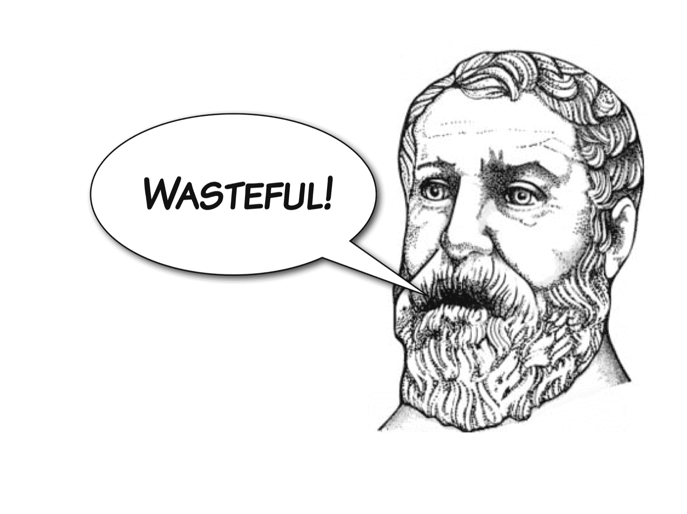

## 第七章：异常

异常处理是一种停止“正常”程序流程并在某个周围上下文或代码块中继续的机制。

中断正常流程的行为称为“引发”异常。在某个封闭的上下文中，引发的异常必须被*处理*，这意味着控制流被转移到异常处理程序。如果异常传播到程序的起始点，那么未处理的异常将导致程序终止。异常对象包含有关异常事件发生的位置和原因的信息，被从引发异常的点传输到异常处理程序，以便处理程序可以询问异常对象并采取适当的行动。

如果您已经在其他流行的命令式语言（如 C++或 Java）中使用过异常，那么您已经对 Python 中异常的工作原理有了一个很好的了解。

关于什么构成“异常事件”的长期而令人厌倦的辩论一直存在，核心问题是异常性实际上是一个程度的问题（有些事情比其他事情更异常）。这是有问题的，因为编程语言通过坚持事件要么完全异常要么根本不异常的假二分法来强加了一个错误的二分法。

Python 的哲学在使用异常方面处于自由的一端。异常在 Python 中无处不在，了解如何处理异常至关重要。

### 异常和控制流

由于异常是一种控制流的手段，在 REPL 中演示可能会很笨拙，因此在本章中，我们将使用 Python 模块来包含我们的代码。让我们从一个非常简单的模块开始，以便探索这些重要的概念和行为。将以下代码放入名为`exceptional.py`的模块中：

```py
"""A module for demonstrating exceptions."""

def convert(s):
    """Convert to an integer."""
    x = int(s)
    return x

```

将此模块中的`convert()`函数导入 Python REPL 中：

```py
$ python3
Python 3.5.1 (v3.5.1:37a07cee5969, Dec  5 2015, 21:12:44)
[GCC 4.2.1 (Apple Inc. build 5666) (dot 3)] on darwin
Type "help", "copyright", "credits" or "license" for more information.
>>> from exceptional import convert

```

并使用一个字符串调用我们的函数，以查看它是否产生了预期的效果：

```py
>>> convert("33")
33

```

如果我们使用无法转换为整数的对象调用我们的函数，我们将从`int()`调用中获得一个回溯：

```py
>>> convert("hedgehog")
Traceback (most recent call last):
  File "<stdin>", line 1, in <module>
  File "./exceptional.py", line 7, in convert
    x = int(s)
ValueError: invalid literal for int() with base 10: 'hedgehog'

```

这里发生的是`int()`引发了一个异常，因为它无法合理地执行转换。我们没有设置处理程序，所以它被 REPL 捕获并显示了堆栈跟踪。换句话说，异常未被处理。

堆栈跟踪中提到的`ValueError`是异常对象的*类型*，错误消息`"invalid literal for int() with base 10: 'hedgehog'"`是异常对象的有效负载的一部分，已被 REPL 检索并打印。

请注意，异常在调用堆栈中传播了几个级别：

| 调用堆栈 | 效果 |
| --- | --- |
| `int()` | 异常在此引发 |
| `convert()` | 异常在这里概念上通过 |
| REPL | 异常在这里被捕获 |

### 处理异常

让我们通过使用`try`..`except`结构来使我们的`convert()`函数更加健壮，处理`ValueError`。`try`和`except`关键字都引入了新的代码块。`try`块包含可能引发异常的代码，`except`块包含在引发异常时执行错误处理的代码。修改`convert()`函数如下：

```py
def convert(s):
    """Convert a string to an integer."""
    try:
        x = int(s)
    except ValueError:
        x = -1
    return x

```

我们已经决定，如果提供了一个非整数字符串，我们将返回负一。为了加强您对控制流的理解，我们还将添加一些打印语句：

```py
def convert(s):
    """Convert a string to an integer."""
    try:
        x = int(s)
        print("Conversion succeeded! x =", x)
    except ValueError:
        print("Conversion failed!")
        x = -1
    return x

```

让我们在重新启动 REPL 后进行交互式测试：

```py
>>> from exceptional import convert
>>> convert("34")
Conversion succeeded! x = 34
34
>>> convert("giraffe")
Conversion failed!
-1

```

请注意，当我们将'giraffe'作为函数参数传递时，`try`块中在引发异常后的`print()`*没有*被执行。相反，执行直接转移到了`except`块的第一条语句。

`int()`构造函数只接受数字或字符串，所以让我们看看如果我们将另一种类型的对象，比如列表，传递给它会发生什么：

```py
>>> convert([4, 6, 5])
Traceback (most recent call last):
  File "<stdin>", line 1, in <module>
  File "./exceptional.py", line 8, in convert
    x = int(s)
TypeError: int() argument must be a string or a number, not 'list'

```

这次我们的处理程序没有拦截异常。如果我们仔细看跟踪，我们会发现这次我们收到了一个`TypeError` - 一种不同类型的异常。

### 处理多个异常

每个`try`块可以有多个对应的`except`块，拦截不同类型的异常。让我们也为`TypeError`添加一个处理程序：

```py
def convert(s):
    """Convert a string to an integer."""
    try:
        x = int(s)
        print("Conversion succeeded! x =", x)
    except ValueError:
        print("Conversion failed!")
        x = -1
    except TypeError:
        print("Conversion failed!")
        x = -1
    return x

```

现在，如果我们在一个新的 REPL 中重新运行相同的测试，我们会发现`TypeError`也被处理了：

```py
>>> from exceptional import convert
>>> convert([1, 3, 19])
Conversion failed!
-1

```

我们的两个异常处理程序之间存在一些代码重复，有重复的`print`语句和赋值。我们将赋值移到`try`块的前面，这不会改变程序的行为：

```py
def convert(s):
    """Convert a string to an integer."""
    x = -1
    try:
        x = int(s)
        print("Conversion succeeded! x =", x)
    except ValueError:
        print("Conversion failed!")
    except TypeError:
        print("Conversion failed!")
    return x

```

然后我们将利用`except`语句接受异常类型元组的能力，将两个处理程序合并为一个：

```py
def convert(s):
    """Convert a string to an integer."""
    x = -1
    try:
        x = int(s)
        print("Conversion succeeded! x =", x)
    except (ValueError, TypeError):
        print("Conversion failed!")
    return x

```

现在我们看到一切仍然按设计工作：

```py
>>> from exceptional import convert
>>> convert(29)
Conversion succeeded! x = 29
29
>>> convert("elephant")
Conversion failed!
-1
>>> convert([4, 5, 1])
Conversion failed!
-1

```

### 程序员错误

既然我们对异常行为的控制流感到自信，我们可以删除打印语句了：

```py
def convert(s):
    """Convert a string to an integer."""
    x = -1
    try:
        x = int(s)
    except (ValueError, TypeError):
    return x

```

但是现在当我们尝试导入我们的程序时：

```py
>>> from exceptional import convert
Traceback (most recent call last):
  File "<stdin>", line 1, in <module>
  File "./exceptional.py", line 11
    return x
          ^
IndentationError: expected an indented block

```

我们得到了另一种类型的异常，一个`IndentationError`，因为我们的`except`块现在是空的，Python 程序中不允许空块。

这不是一个*有用*的异常类型，可以用`except`块捕获！Python 程序出现的几乎所有问题都会导致异常，但某些异常类型，比如`IndentationError`、`SyntaxError`和`NameError`，是程序员错误的结果，应该在开发过程中被识别和纠正，而不是在运行时处理。这些异常的存在大多数情况下是有用的，如果你正在创建一个 Python 开发工具，比如 Python IDE，将 Python 本身嵌入到一个更大的系统中以支持应用程序脚本，或者设计一个动态加载代码的插件系统。

### 空块 - `pass`语句

话虽如此，我们仍然有一个问题，那就是如何处理我们的空`except`块。解决方案以`pass`关键字的形式出现，这是一个什么都不做的特殊语句！它是一个空操作，它的唯一目的是允许我们构造在语法上允许但在语义上为空的块：

```py
def convert(s):
    """Convert a string to an integer."""
    x = -1
    try:
        x = int(s)
    except (ValueError, TypeError):
        pass
    return x

```

不过，在这种情况下，通过使用多个`return`语句进一步简化会更好，完全摆脱`x`变量：

```py
def convert(s):
    """Convert a string to an integer."""
    try:
        return int(s)
    except (ValueError, TypeError):
        return -1

```

### 异常对象

有时，我们想要获取异常对象 - 在这种情况下是`ValueError`或`TypeError`类型的对象，并对其进行详细的询问出了什么问题。我们可以通过在`except`语句的末尾添加一个`as`子句并使用一个变量名来获得对异常对象的命名引用：

```py
def convert(s):
    """Convert a string to an integer."""
    try:
        return int(s)
    except (ValueError, TypeError) as e:
        return -1

```

我们将修改我们的函数，在返回之前向`stderr`流打印异常详细信息的消息。要打印到`stderr`，我们需要从`sys`模块中获取对流的引用，所以在我们的模块顶部，我们需要`import sys`。然后我们可以将`sys.stderr`作为一个名为`file`的关键字参数传递给`print()`：

```py
import sys

def convert(s):
    """Convert a string to an integer."""
    try:
        return int(s)
    except (ValueError, TypeError) as e:
        print("Conversion error: {}".format(str(e)), file=sys.stderr)
        return -1

```

我们利用异常对象可以使用`str()`构造函数转换为字符串的事实。

让我们在 REPL 中看看：

```py
>>> from exceptional import convert
>>> convert("fail")
Conversion error: invalid literal for int() with base 10: 'fail'
-1

```

### 轻率的返回代码

让我们在我们的模块中添加第二个函数`string_log()`，它调用我们的`convert()`函数并计算结果的自然对数：

```py
from math import log

def string_log(s):
    v = convert(s)
    return log(v)

```

在这一点上，我们必须承认，我们在这里通过将完全正常的`int()`转换（在失败时引发异常）包装在我们的`convert()`函数中，返回一个老式的负错误代码，这是非常不符合 Python 风格的。请放心，这种不可饶恕的 Python 异端行为仅仅是为了展示错误返回代码的最大愚蠢：它们可以被调用者忽略，在程序的后期对毫无戒心的代码造成严重破坏。稍微好一点的程序可能会在继续进行日志调用之前测试`v`的值。

如果没有这样的检查，当传递负错误代码值时，`log()`当然会失败：

```py
>>> from exceptional import string_log
>>> string_log("ouch!")
Conversion error: invalid literal for int() with base 10: 'ouch!'
Traceback (most recent call last):
  File "<stdin>", line 1, in <module>
  File "./exceptional.py", line 15, in string_log
    return log(v)
ValueError: math domain error

```

当然，`log()`失败的后果是引发另一个异常，也是`ValueError`。

更好，而且更符合 Python 风格的是，完全忘记错误返回代码，并恢复到从`convert()`引发异常。

### 重新引发异常

我们可以发出我们的错误消息并重新引发我们当前正在处理的异常对象，而不是返回一个非 Python 风格的错误代码。这可以通过在我们的异常处理块的末尾用`raise`语句替换`return -1`来完成：

```py
def convert(s):
    """Convert a string to an integer."""
    try:
        return int(s)
    except (ValueError, TypeError) as e:
        print("Conversion error: {}".format(str(e)), file=sys.stderr)
        raise

```

没有参数`raise`重新引发当前正在处理的异常。

在 REPL 中进行测试，我们可以看到原始异常类型被重新引发，无论是`ValueError`还是`TypeError`，我们的“Conversion error”消息都会打印到`stderr`：

```py
>>> from exceptional import string_log
>>> string_log("25")
3.2188758248682006
>>> string_log("cat")
Conversion error: invalid literal for int() with base 10: 'cat'
Traceback (most recent call last):
  File "<stdin>", line 1, in <module>
  File "./exceptional.py", line 14, in string_log
    v = convert(s)
  File "./exceptional.py", line 6, in convert
    return int(s)
ValueError: invalid literal for int() with base 10: 'cat'
>>> string_log([5, 3, 1])
Conversion error: int() argument must be a string or a number, not 'list'
Traceback (most recent call last):
  File "<stdin>", line 1, in <module>
  File "./exceptional.py", line 14, in string_log
    v = convert(s)
  File "./exceptional.py", line 6, in convert
    return int(s)
TypeError: int() argument must be a string or a number, not 'list'

```

### 异常是函数 API 的一部分

异常是函数 API 的重要组成部分。函数的调用者需要知道在各种条件下期望哪些异常，以便他们可以确保适当的异常处理程序已经就位。我们将使用寻找平方根作为示例，使用一个自制的平方根函数，由亚历山大的赫罗（尽管他可能没有使用 Python）提供。


函数的调用者需要知道期望哪些异常。

将以下代码放入一个名为`roots.py`的文件中：

```py
def sqrt(x):
    """Compute square roots using the method of Heron of Alexandria.

 Args:
 x: The number for which the square root is to be computed.

 Returns:
 The square root of x.
 """
    guess = x
    i = 0
    while guess * guess != x and i < 20:
        guess = (guess + x / guess) / 2.0
        i += 1
    return guess

def main():
    print(sqrt(9))
    print(sqrt(2))

if __name__ == '__main__':
    main()

```

在这个程序中，我们之前没有遇到过的只有一个语言特性：逻辑`and`运算符，我们在这种情况下使用它来测试循环的每次迭代上两个条件是否为`True`。Python 还包括一个逻辑`or`运算符，它可以用来测试它的操作数是否一个或两个都为`True`。

运行我们的程序，我们可以看到赫罗是真的有所发现：

```py
$ python3 roots.py
3.0
1.41421356237

```

#### Python 引发的异常

让我们在`main()`函数中添加一行新代码，它对-1 进行平方根运算：

```py
def main():
    print(sqrt(9))
    print(sqrt(2))
    print(sqrt(-1))

```

如果我们运行它，我们会得到一个新的异常：

```py
$ python3 sqrt.py
3.0
1.41421356237
Traceback (most recent call last):
  File "sqrt.py", line 14, in <module>
    print(sqrt(-1))
  File "sqrt.py", line 7, in sqrt
    guess = (guess + x / guess) / 2.0
ZeroDivisionError: float division

```

发生的情况是 Python 拦截了除零，这发生在循环的第二次迭代中，并引发了一个异常-`ZeroDivisionError`。

#### 捕获异常

让我们修改我们的代码，在异常传播到调用堆栈的顶部之前捕获异常（从而导致我们的程序停止），使用`try`..`except`结构：

```py
def main():
    print(sqrt(9))
    print(sqrt(2))
    try:
        print(sqrt(-1))
    except ZeroDivisionError:
        print("Cannot compute square root of a negative number.")

    print("Program execution continues normally here.")

```

现在当我们运行脚本时，我们看到我们干净地处理了异常：

```py
$ python sqrt.py
3.0
1.41421356237
Cannot compute square root of a negative number.
Program execution continues normally here.

```

我们应该小心避免初学者在异常处理块中使用过于严格的范围的错误；我们可以很容易地对我们所有对`sqrt()`的调用使用一个`try`..`except`块。我们还添加了第三个打印语句，以显示封闭块的执行是如何终止的：

```py
def main():
    try:
        print(sqrt(9))
        print(sqrt(2))
        print(sqrt(-1))
        print("This is never printed.")
    except ZeroDivisionError:
        print("Cannot compute square root of a negative number.")

    print("Program execution continues normally here.")

```

#### 显式引发异常

这是对我们开始的改进，但最有可能`sqrt()`函数的用户不希望它抛出`ZeroDivisionError`。

Python 为我们提供了几种标准的异常类型来表示常见的错误。如果函数参数提供了非法值，习惯上会引发`ValueError`。我们可以通过使用`raise`关键字和通过调用`ValueError`构造函数创建的新异常对象来实现这一点。

我们可以处理除零的两种方法。第一种方法是将寻找平方根的 while 循环包装在`try`..`except ZeroDivisionError`结构中，然后在异常处理程序内部引发一个新的`ValueError`异常。

```py
def sqrt(x):
    """Compute square roots using the method of Heron of Alexandria.

 Args:
 x: The number for which the square root is to be computed.

 Returns:
 The square root of x.
 """
    guess = x
    i = 0
    try:
        while guess * guess != x and i < 20:
            guess = (guess + x / guess) / 2.0
            i += 1
    except ZeroDivisionError:
        raise ValueError()
    return guess

```

虽然它可以工作，但这将是浪费的；我们会明知道继续进行一个最终毫无意义的非平凡计算。



### 守卫子句

我们知道这个例程总是会失败，所以我们可以在早期检测到这个前提条件，并在那一点上引发异常，这种技术称为*守卫子句*：

```py
def sqrt(x):
    """Compute square roots using the method of Heron of Alexandria.

 Args:
 x: The number for which the square root is to be computed.

 Returns:
 The square root of x.

 Raises:
 ValueError: If x is negative.
 """

    if x < 0:
        raise ValueError("Cannot compute square root of negative number {}".format(x))

    guess = x
    i = 0
    while guess * guess != x and i < 20:
        guess = (guess + x / guess) / 2.0
        i += 1
    return guess

```

测试是一个简单的 if 语句和一个调用`raise`传递一个新铸造的异常对象。`ValueError()`构造函数接受一个错误消息。看看我们如何修改文档字符串，以明确`sqrt()`将引发哪种异常类型以及在什么情况下。

但是看看如果我们运行程序会发生什么-我们仍然会得到一个回溯和一个不优雅的程序退出：

```py
$ python roots.py
3.0
1.41421356237
Traceback (most recent call last):
  File "sqrt.py", line 25, in <module>
    print(sqrt(-1))
  File "sqrt.py", line 12, in sqrt
    raise ValueError("Cannot compute square root of negative number {0}".format(x))
ValueError: Cannot compute square root of negative number -1

```

这是因为我们忘记修改我们的异常处理程序来捕获`ValueError`而不是`ZeroDivisionError`。让我们修改我们的调用代码来捕获正确的异常类，并将捕获的异常对象分配给一个命名变量，这样我们就可以在捕获后对其进行询问。在这种情况下，我们的询问是`print`异常对象，它知道如何将自己显示为 stderr 的消息：

```py
import sys

def main():
    try:
        print(sqrt(9))
        print(sqrt(2))
        print(sqrt(-1))
        print("This is never printed.")
    except ValueError as e:
        print(e, file=sys.stderr)

    print("Program execution continues normally here.")

```

再次运行程序，我们可以看到我们的异常被优雅地处理了：

```py
$ python3 sqrt.py
3.0
1.41421356237
Cannot compute square root of negative number -1
Program execution continues normally here.

```

### 异常、API 和协议

异常是函数的 API 的一部分，更广泛地说，是某些*协议*的一部分。例如，实现序列协议的对象应该为超出范围的索引引发`IndexError`异常。

引发的异常与函数的参数一样，是函数规范的一部分，必须适当地记录。

Python 中有几种常见的异常类型，通常当您需要在自己的代码中引发异常时，内置类型之一是一个不错的选择。更少见的是，您需要定义新的异常类型，但我们在本书中没有涵盖这一点。（请参阅本系列的下一本书*Python Journeyman*，了解如何做到这一点。）

如果您决定您的代码应该引发哪些异常，您应该在现有代码中寻找类似的情况。您的代码遵循现有模式的越多，人们集成和理解起来就越容易。例如，假设您正在编写一个键值数据库：使用`KeyError`来指示对不存在的键的请求是很自然的，因为这是`dict`的工作方式。也就是说，Python 中的“映射”集合遵循某些协议，异常是这些协议的一部分。

让我们看一些常见的异常类型。

#### IndexError

当整数索引超出范围时，会引发`IndexError`。

当我们在列表末尾索引时，您可以看到这一点：

```py
>>> z = [1, 4, 2]
>>> z[4]
Traceback (most recent call last):
  File "<stdin>", line 1, in <module>
IndexError: list index out of range

```

#### ValueError

当对象的类型正确，但包含不适当的值时，会引发`ValueError`。

当尝试从非数字字符串构造`int`时，我们已经看到了这一点：

```py
>>> int("jim")
Traceback (most recent call last):
  File "<stdin>", line 1, in <module>
ValueError: invalid literal for int() with base 10: 'jim'

```

#### KeyError

当查找映射失败时，会引发`KeyError`。

您可以在这里看到，当我们在字典中查找一个不存在的键时：

```py
>>> codes = dict(gb=44, us=1, no=47, fr=33, es=34)
>>> codes['de']
  Traceback (most recent call last):
  File "<stdin>", line 1, in <module>
KeyError: 'de'

```

### 选择不防范`TypeError`

我们不倾向于保护 Python 中的`TypeErrors`。这样做违反了 Python 中的动态类型的规则，并限制了我们编写的代码的重用潜力。

例如，我们可以使用内置的`isinstance()`函数测试参数是否为`str`，如果不是，则引发`TypeError`异常：

```py
def convert(s):
    """Convert a string to an integer."""
    if not isinstance(s, str):
        raise TypeError("Argument must be a string")

    try:
        return int(s)
    except (ValueError, TypeError) as e:
        print("Conversion error: {}".format(str(e)), file=sys.stderr)
        raise

```

但是我们还希望允许作为`float`实例的参数。如果我们想要检查我们的函数是否能够处理诸如有理数、复数或任何其他类型的数字的类型，情况很快就会变得复杂，而且无论如何，谁能说它会呢？！

或者我们可以在函数内部拦截`TypeError`并重新引发它，但是有什么意义呢？


通常不必处理 TypeErrors。

通常在 Python 中，向函数添加类型检查是不值得的。如果函数使用特定类型-即使是您在设计函数时可能不知道的类型-那就太好了。如果不是，执行可能最终会导致`TypeError`。同样，我们往往不会非常频繁地*捕获*`TypeErrors`。

### Pythonic 风格- EAFP 与 LBYL

现在让我们看看 Python 哲学和文化的另一个原则，即“宁求原谅，不要问权限”。

处理可能失败的程序操作只有两种方法。第一种方法是在尝试操作之前检查所有易于失败的操作的前提条件是否满足。第二种方法是盲目地希望一切顺利，但准备好处理后果如果事情不顺利。

在 Python 文化中，这两种哲学被称为“先入为主”（LBYL）和“宁求原谅，不要问权限”（EAFP）-顺便说一句，这是由编译器发明者 Grace Hopper 女将军创造的。

Python 强烈支持 EAFP，因为它将“快乐路径”的主要逻辑以最可读的形式呈现，而与主要流程交织在一起的异常情况则单独处理。

让我们考虑一个例子-处理一个文件。处理的细节并不重要。我们只需要知道`process_file()`函数将打开一个文件并从中读取一些数据。

首先是 LBYL 版本：

```py
import os

p = '/path/to/datafile.dat'

if os.path.exists(p):
    process_file(p)
else:
    print('No such file as {}'.format(p))

```

在尝试调用`process_file()`之前，我们检查文件是否存在，如果不存在，我们避免调用并打印一条有用的消息。这种方法存在一些明显的问题，有些是显而易见的，有些是隐匿的。一个明显的问题是我们只执行了存在性检查。如果文件存在但包含垃圾怎么办？如果路径指的是一个目录而不是一个文件怎么办？根据 LBYL，我们应该为这些情况添加预防性测试。

一个更微妙的问题是这里存在竞争条件。例如，文件可能在存在性检查和`process_file()`调用之间被另一个进程删除……这是一个经典的竞争条件。实际上没有好的方法来处理这个问题-无论如何都需要处理`process_file()`的错误！

现在考虑另一种选择，使用更符合 Python 风格的 EAFP 方法：

```py
p = '/path/to/datafile.dat'

try:
    process_file(f)
except OSError as e:
  print('Could not process file because {}'.format(str(e)))

```

在这个版本中，我们尝试在事先不进行检查的情况下进行操作，但我们已经准备好了异常处理程序来处理任何问题。我们甚至不需要详细了解可能出现的问题。在这里，我们捕获了`OSError`，它涵盖了各种条件，比如文件未找到以及在期望文件的位置使用目录。

EAFP 在 Python 中是标准的，遵循这种哲学主要是通过异常来实现的。没有异常，并且被迫使用错误代码，你需要直接在逻辑的主流程中包含错误处理。由于异常中断了主流程，它们允许你非局部地处理异常情况。

异常与 EAFP 结合也更优越，因为与错误代码不同，*异常不能轻易被忽略*。默认情况下，异常会产生很大影响，而错误代码默认情况下是静默的。因此，基于异常/EAFP 的风格使问题很难被悄悄忽略。

### 清理操作

有时，你需要执行一个清理操作，无论操作是否成功。在后面的模块中，我们将介绍上下文管理器，这是这种常见情况的现代解决方案，但在这里我们将介绍`try`..`finally`结构，因为在简单情况下创建上下文管理器可能有些过头。无论如何，了解`try`..`finally`对于制作自己的上下文管理器是有用的。

考虑这个函数，它使用标准库`os`模块的各种功能来更改当前工作目录，创建一个新目录，并恢复原始工作目录：

```py
import os

def make_at(path, dir_name):
    original_path = os.getcwd()
    os.chdir(path)
    os.mkdir(dir_name)
    os.chdir(original_path)

```

乍一看，这似乎是合理的，但是如果`os.mkdir()`的调用因某种原因失败，Python 进程的当前工作目录将不会恢复到其原始值，并且`make_at()`函数将产生意外的副作用。

为了解决这个问题，我们希望函数在任何情况下都能恢复原始的当前工作目录。我们可以通过`try`..`finally`块来实现这一点。`finally`块中的代码将被执行，无论执行是通过到达块的末尾而正常离开`try`块，还是通过引发异常而异常地离开。

这种结构可以与`except`块结合在一起，如下所示，用于添加一个简单的失败日志记录设施：

```py
import os
import sys

def make_at(path, dir_name):
  original_path = os.getcwd()
  try:
      os.chdir(path)
      os.mkdir(dir_name)
  except OSError as e:
      print(e, file=sys.stderr)
      raise
  finally:
      os.chdir(original_path)

```

现在，如果`os.mkdir()`引发`OSError`，则将运行`OSError`处理程序并重新引发异常。但由于`finally`块始终运行，无论 try 块如何结束，我们可以确保最终的目录更改将在所有情况下发生。

* * *

### 禅意时刻


* * *

### 特定于平台的代码

从 Python 中检测单个按键 - 例如在控制台上的“按任意键继续。”功能 - 需要使用特定于操作系统的模块。我们不能使用内置的`input()`函数，因为它等待用户按*Enter*键然后给我们一个字符串。要在 Windows 上实现这一点，我们需要使用仅限于 Windows 的`msvcrt`模块的功能，在 Linux 和 macOS 上，我们需要使用仅限于 Unix 的`tty`和`termios`模块的功能，以及`sys`模块。

这个例子非常有教育意义，因为它演示了许多 Python 语言特性，包括`import`和`def`作为*语句*，而不仅仅是声明：

```py
"""keypress - A module for detecting a single keypress."""

try:
    import msvcrt

    def getkey():
        """Wait for a keypress and return a single character string."""
        return msvcrt.getch()

except ImportError:

    import sys
    import tty
    import termios

    def getkey():
        """Wait for a keypress and return a single character string."""
        fd = sys.stdin.fileno()
        original_attributes = termios.tcgetattr(fd)
        try:
            tty.setraw(sys.stdin.fileno())
            ch = sys.stdin.read(1)
        finally:
            termios.tcsetattr(fd, termios.TCSADRAIN, original_attributes)
        return ch

    # If either of the Unix-specific tty or termios modules are
    # not found, we allow the ImportError to propagate from here

```

请记住，顶层模块代码在首次导入时执行。在第一个 try 块中，我们尝试`import msvcrt`，即 Microsoft Visual C Runtime。如果成功，然后我们继续定义一个名为`getkey()`的函数，该函数委托给`msvcrt.getch()`函数。即使在这一点上我们在 try 块内部，该函数也将在当前范围内声明，即模块范围。

然而，如果`msvcrt`的导入失败，因为我们不在 Windows 上运行，将引发`ImportError`，并且执行将转移到 except 块。这是一个明确消除错误的情况，因为我们将尝试在异常处理程序中采取替代行动。

在 except 块内，我们导入了三个在类 Unix 系统上实现`getkey()`所需的模块，然后继续使用替代定义`getkey()`，再次将函数实现绑定到模块范围内的名称。

这个 Unix 实现的`getkey()`使用`try`..`finally`结构，在将终端置于原始模式以读取单个字符的目的后，恢复各种终端属性。

如果我们的程序在既不是 Windows 也不是类 Unix 的系统上运行，`import tty`语句将引发第二个`ImportError`。这次我们不尝试拦截此异常；我们允许它传播到我们的调用者 - 无论尝试导入此`keypress`模块的是什么。我们知道如何发出此错误，但不知道如何处理它，因此我们将这个决定推迟给我们的调用者。错误不会悄悄地传递。

如果调用者具有更多的知识或可用的替代策略，它可以依次拦截此异常并采取适当的操作，也许降级到使用 Python 的`input()`内置函数并向用户提供不同的消息。

### 总结

+   引发异常会中断正常的程序流程，并将控制转移到异常处理程序。

+   异常处理程序使用`try`..`except`结构定义。

+   `try`块定义了可以检测异常的上下文。

+   相应的`except`块为特定类型的异常定义处理程序。

+   Python 广泛使用异常，并且许多内置语言功能依赖于它们。

+   `except`块可以捕获异常对象，通常是标准类型，如`ValueError`，`KeyError`或`IndexError`。

+   程序员错误，如`IndentationError`和`SyntaxError`通常不应该被处理。

+   可以使用`raise`关键字发出异常条件，它接受异常对象的单个参数。

+   在`except`块中没有参数的`raise`重新引发当前正在处理的异常。

+   我们倾向于不经常检查`TypeErrors`。这样做会否定 Python 动态类型系统所提供的灵活性。

+   异常对象可以使用`str()`构造函数转换为字符串，以便打印消息载荷。

+   函数抛出的异常是其 API 的一部分，应该得到适当的文档支持。

+   在引发异常时，最好使用最合适的内置异常类型。

+   可以使用`try`..`finally`结构执行清理和恢复操作，这可能可以与`except`块一起使用。

在这个过程中，我们看到：

+   `print()`函数的输出可以使用可选的`file`参数重定向到`stderr`。

+   Python 支持逻辑运算符`and`和`or`来组合布尔表达式。

+   返回代码很容易被忽略。

+   可以使用“宁可请求原谅，也不要问权限”的方法来实现特定于平台的操作，通过拦截`ImportErrors`并提供替代实现。
