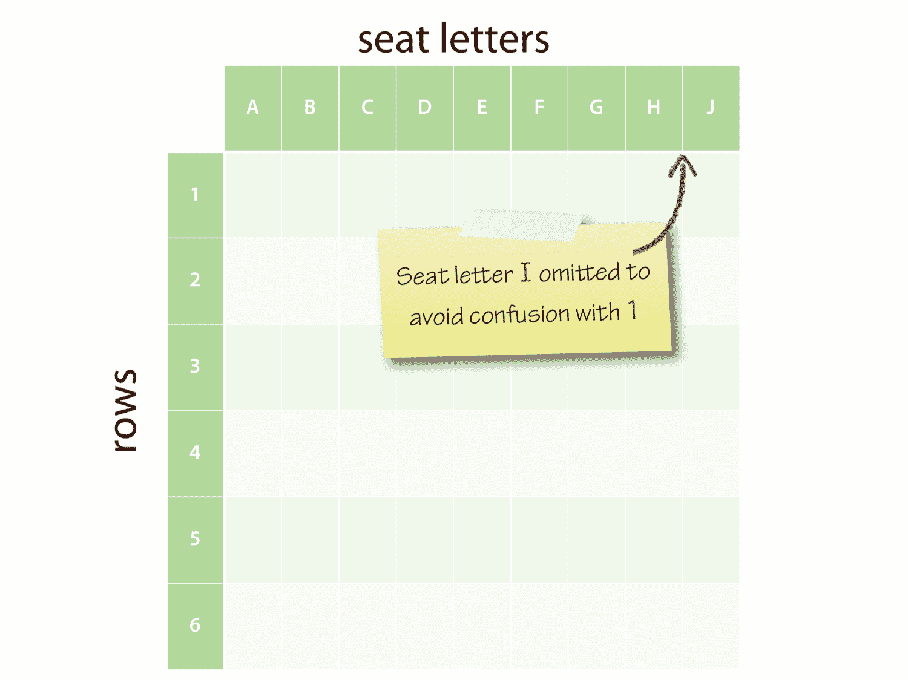
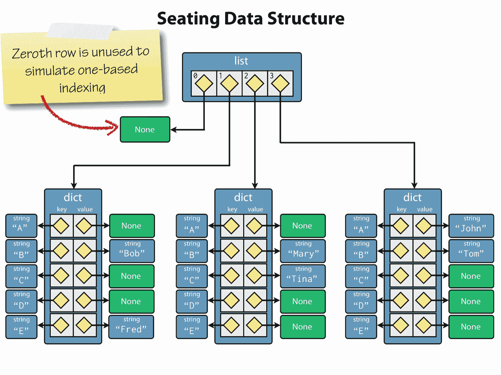

## 第九章：使用类定义新类型

使用内置的标量和集合类型可以在 Python 中走得很远。对于许多问题，内置类型以及 Python 标准库中提供的类型完全足够。但有时候，它们并不完全符合要求，创建自定义类型的能力就是*类*的用武之地。

正如我们所见，Python 中的所有对象都有一个类型，当我们使用内置的`type()`函数报告该类型时，结果是以该类型的*类*为基础的：

```py
>>> type(5)
<class 'int'>
>>> type("python")
<class 'str'>
>>> type([1, 2, 3])
<class 'list'>
>>> type(x*x for x in [2, 4, 6])
<class 'generator'>

```

类用于定义一个或多个对象的结构和行为，我们称之为类的*实例*。总的来说，Python 中的对象在创建时具有固定的类型^(20) - 或者在被销毁之前^(21)。将类视为一种模板或模具，用于构建新对象可能有所帮助。对象的类控制其初始化以及通过该对象可用的属性和方法。例如，在字符串对象上，我们可以使用的方法，如`split()`，是在`str`类中定义的。

类是 Python 中面向对象编程（OOP）的重要机制，尽管 OOP 可以用于使复杂问题更易处理，但它往往会使简单问题的解决方案变得不必要复杂。Python 的一个很棒的地方是它高度面向对象，而不会强迫你处理类，直到你真正需要它们。这使得该语言与 Java 和 C#截然不同。

### 定义类

类定义由`class`关键字引入，后面跟着类名。按照惯例，在 Python 中，新的类名使用驼峰命名法 - 有时被称为帕斯卡命名法 - 每个组件单词的首字母都大写，不使用下划线分隔。由于在 REPL 中定义类有点麻烦，我们将使用 Python 模块文件来保存我们在本章中使用的类定义。

让我们从非常简单的类开始，逐步添加功能。在我们的示例中，我们将通过将此代码放入`airtravel.py`来模拟两个机场之间的客机航班：

```py
"""Model for aircraft flights."""

class Flight:
    pass

```

`class`语句引入了一个新的块，所以我们在下一行缩进。空块是不允许的，所以最简单的类至少需要一个无用的`pass`语句才能在语法上被接受。

就像使用`def`来定义函数一样，`class`是一个*语句*，可以出现在程序的任何地方，并将类定义绑定到类名。当执行`airtravel`模块中的顶层代码时，类将被定义。

现在我们可以将我们的新类导入 REPL 并尝试它。

```py
>>> from airtravel import Flight

```

我们刚刚导入的东西是类对象。在 Python 中，一切都是对象，类也不例外。

```py
>>> Flight
<class 'airtravel.Flight'>

```

要使用这个类来创建一个新对象，我们必须调用它的构造函数，这是通过*调用*类来完成的，就像调用函数一样。构造函数返回一个新对象，这里我们将其赋给一个名为`f`的变量：

```py
>>> f = Flight()

```

如果我们使用`type()`函数来请求`f`的类型，我们会得到`airtravel.Flight`：

```py
>>> type(f)
<class 'airtravel.Flight'>

```

`f`的类型就是类。

### 实例方法

让我们通过添加所谓的*实例方法*来使我们的类更有趣，该方法返回航班号。方法只是在类块内定义的函数，实例方法是可以在我们的类的实例对象上调用的函数，比如`f`。实例方法必须接受对其调用方法的实例的引用作为第一个形式参数^(22)，按照惯例，这个参数**总是**被称为`self`。

我们还没有办法配置航班号的值，所以我们将返回一个常量字符串：

```py
class Flight:

    def number(self):
        return "SN060"

```

并从一个新的 REPL 开始：

```py
>>> from airtravel import Flight
>>> f = Flight()
>>> f.number()
SN060

```

请注意，当我们调用该方法时，我们不会为实际参数`self`在参数列表中提供实例`f`。这是因为标准的方法调用形式与点一起，就像这样：

```py
>>> f.number()
SN060

```

是语法糖：

```py
>>> Flight.number(f)
SN060

```

如果你尝试后者，你会发现它按预期工作，尽管你几乎永远不会看到这种形式被真正使用。

### 实例初始化程序

这个类并不是很有用，因为它只能表示一个特定的航班。我们需要在创建`Flight`时使航班号可配置。为此，我们需要编写一个初始化程序方法。

如果提供，初始化程序方法将作为创建新对象的过程的一部分被调用，当我们调用构造函数时。初始化程序方法必须被称为`__init__()`，用于 Python 运行时机制的双下划线限定。与所有其他实例方法一样，`__init__()`的第一个参数必须是`self`。

在这种情况下，我们还向`__init__()`传递了第二个形式参数，即航班号：

```py
class Flight:

    def __init__(self, number):
        self._number = number

    def number(self):
        return self._number

```

初始化程序不应返回任何东西-它修改了由`self`引用的对象。

如果你来自 Java、C#或 C++背景，很容易认为`__init__()`是构造函数。这并不完全准确；在 Python 中，`__init__()`的目的是在调用`__init__()`时配置已经存在的对象。然而，`self`参数在 Python 中类似于 Java、C#或 C++中的`this`。在 Python 中，实际的构造函数是由 Python 运行时系统提供的，它的其中一个功能是检查实例初始化程序的存在并在存在时调用它。

在初始化程序中，我们分配给新创建实例的*属性*称为`_number`。分配给尚不存在的对象属性足以使其存在。

就像我们不需要在创建变量之前声明它们一样，我们也不需要在创建对象属性之前声明它们。我们选择了带有前导下划线的`_number`有两个原因。首先，因为它避免了与同名方法的名称冲突。方法是函数，函数是对象，这些函数绑定到对象的属性，所以我们已经有一个名为`number`的属性，我们不想替换它。其次，有一个广泛遵循的约定，即对象的实现细节不应该由对象的客户端消费或操作，应该以下划线开头。

我们还修改了我们的`number()`方法来访问`_number`属性并返回它。

传递给飞行构造函数的任何实际参数都将转发到初始化程序，因此要创建和配置我们的`Flight`对象，我们现在可以这样做：

```py
>>> from airtravel import Flight
>>> f = Flight("SN060")
>>> f.number()
SN060

```

我们还可以直接访问实现细节：

```py
>>> f._number
SN060

```

尽管这不建议用于生产代码，但对于调试和早期测试非常方便。

#### 缺乏访问修饰符

如果你来自像 Java 或 C#这样的束缚和纪律语言，具有`public`、`private`和`protected`访问修饰符，Python 的“一切都是公开的”方法可能看起来过于开放。

Pythonista 之间普遍的文化是“我们都是自愿成年人”。实际上，前导下划线约定已经被证明足以保护我们所使用的大型和复杂的 Python 系统。人们知道不直接使用这些属性，事实上他们也不倾向于这样做。就像许多教条一样，缺乏访问修饰符在理论上比在实践中更成问题。

### 验证和不变量

对于对象的初始化程序来说，建立所谓的*类不变量*是一个好的做法。不变量是关于该类的对象应该在对象的生命周期内持续存在的真理。对于航班来说，这样的不变量是，航班号始终以大写的两个字母航空公司代码开头，后面跟着三位或四位数字路线号。

在 Python 中，我们在`__init__()`方法中建立类不变量，并在无法实现时引发异常：

```py
class Flight:

    def __init__(self, number):
        if not number[:2].isalpha():
            raise ValueError("No airline code in '{}'".format(number))

        if not number[:2].isupper():
            raise ValueError("Invalid airline code '{}'".format(number))

        if not (number[2:].isdigit() and int(number[2:]) <= 9999):
            raise ValueError("Invalid route number '{}'".format(number))

        self._number = number

    def number(self):
        return self._number

```

我们使用字符串切片和字符串类的各种方法进行验证。在本书中，我们还首次看到逻辑否定运算符`not`。

在 REPL 中的*Ad hoc*测试是开发过程中非常有效的技术：

```py
>>> from airtravel import Flight
>>> f = Flight("SN060")
>>> f = Flight("060")
Traceback (most recent call last):
  File "<stdin>", line 1, in <module>
  File "./airtravel.py", line 8, in __init__
    raise ValueError("No airline code in '{};".format(number))
ValueError: No airline code in '060'
>>> f = Flight("sn060")
Traceback (most recent call last):
  File "<stdin>", line 1, in <module>
  File "./airtravel.py", line 11, in __init__
    raise ValueError("Invalid airline code '{}'".format(number))
ValueError: Invalid airline code 'sn060'
>>> f = Flight("snabcd")
Traceback (most recent call last):
  File "<stdin>", line 1, in <module>
  File "./airtravel.py", line 11, in __init__
    raise ValueError("Invalid airline code '{}'".format(number))
ValueError: Invalid airline code 'snabcd'
>>> f = Flight("SN12345")
Traceback (most recent call last):
  File "<stdin>", line 1, in <module>
  File "./airtravel.py", line 11, in __init__
    raise ValueError("Invalid airline code '{}'".format(number))
ValueError: Invalid airline code 'sn12345'

```

现在我们确信有一个有效的航班号，我们将添加第二个方法，只返回航空公司代码。一旦类不变量被建立，大多数查询方法都可以非常简单：

```py
def airline(self):
    return self._number[:2]

```

### 添加第二个类

我们想要做的事情之一是接受座位预订。为此，我们需要知道座位布局，为此我们需要知道飞机的类型。让我们制作第二个类来模拟不同类型的飞机：

```py
class Aircraft:

    def __init__(self, registration, model, num_rows, num_seats_per_row):
        self._registration = registration
        self._model = model
        self._num_rows = num_rows
        self._num_seats_per_row = num_seats_per_row

    def registration(self):
        return self._registration

    def model(self):
        return self._model

```

初始化程序为飞机创建了四个属性：注册号、型号名称、座位行数和每行座位数。在生产代码场景中，我们可以验证这些参数，以确保例如行数不是负数。

这足够简单了，但对于座位计划，我们希望有一些更符合我们预订系统的东西。飞机的行数从一开始编号，每行的座位用字母表示，字母表中省略了‘I’，以避免与‘1’混淆。



飞机座位计划。

我们将添加一个`seating_plan()`方法，它返回允许的行和座位，包含一个`range`对象和一个座位字母的字符串的 2 元组：

```py
def seating_plan(self):
  return (range(1, self._num_rows + 1),
          "ABCDEFGHJK"[:self._num_seats_per_row])

```

值得停顿一下，确保你理解这个函数是如何工作的。对`range()`构造函数的调用产生一个范围对象，它可以用作飞机行数的可迭代系列。字符串及其切片方法返回一个每个座位一个字符的字符串。这两个对象-范围和字符串-被捆绑成一个元组。

让我们构造一个有座位计划的飞机：

```py
  >>> from airtravel import *
  >>> a = Aircraft("G-EUPT", "Airbus A319", num_rows=22, num_seats_per_row=6)
  >>> a.registration()
  'G-EUPT'
  >>> a.model()
  'Airbus A319'
  >>> a.seating_plan()
  (range(1, 23), 'ABCDEF')

```

看看我们如何为行和座位使用关键字参数进行文档目的。回想一下，范围是半开放的，所以 23 正确地超出了范围的末端。

### 合作类

德米特尔法则是一个面向对象的设计原则，它说你不应该调用从其他调用中接收到的对象的方法。换句话说：只与你直接的朋友交谈。


德米特尔法则-只与你直接的朋友交谈。这个法则实际上只是一个指导方针，是以一个面向方面的编程项目命名的，而这个项目又是以象征着自下而上哲学的希腊农业女神的名字命名的

我们现在将修改我们的`Flight`类，以在构造时接受一个飞机对象，并且我们将遵循德米特尔法则，通过添加一个方法来报告飞机型号。这个方法将代表客户委托`Aircraft`，而不是允许客户“通过”`Flight`并询问`Aircraft`对象：

```py
class Flight:
    """A flight with a particular passenger aircraft."""

    def __init__(self, number, aircraft):
        if not number[:2].isalpha():
            raise ValueError("No airline code in '{}'".format(number))

        if not number[:2].isupper():
            raise ValueError("Invalid airline code '{}'".format(number))

        if not (number[2:].isdigit() and int(number[2:]) <= 9999):
            raise ValueError("Invalid route number '{}'".format(number))

        self._number = number
        self._aircraft = aircraft

    def number(self):
        return self._number

    def airline(self):
        return self._number[:2]

    def aircraft_model(self):
        return self._aircraft.model()

```

我们还为类添加了一个文档字符串。这些工作方式就像函数和模块的文档字符串一样，并且必须是类主体内的第一个非注释行。

现在我们可以用特定的飞机构造一个航班：

```py
>>> from airtravel import *
>>> f = Flight("BA758", Aircraft("G-EUPT", "Airbus A319", num_rows=22,
...                              num_seats_per_row=6))
>>> f.aircraft_model()
'Airbus A319'

```

注意，我们构造了`Aircraft`对象，并直接将其传递给`Flight`构造函数，而无需为其命名中间引用。

* * *

### 禅宗时刻


`aircraft_model()`方法是“复杂比复杂好”的一个例子：

```py
def aircraft_model(self):
    return self._aircraft.model()

```

Flight 类更加*复杂*——它包含额外的代码来深入到飞机引用中找到模型。然而，所有的`Flight`客户端现在可以更少*复杂*；它们都不需要知道`Aircraft`类，从而大大简化了系统。

* * *

### 预订座位

现在我们可以继续实现一个简单的预订系统。对于每个航班，我们需要跟踪谁坐在每个座位上。我们将使用一个字典列表来表示座位分配。列表将包含每个座位行的一个条目，每个条目将是一个从座位字母到乘客姓名的映射的字典。如果一个座位没有被占用，相应的字典值将包含`None`。

我们在`Flight.__init__()`中使用这个片段初始化座位计划：

```py
rows, seats = self._aircraft.seating_plan()
self._seating = [None] + [{letter: None for letter in seats} for _ in rows]

```

在第一行中，我们检索飞机的座位计划，并使用元组解包将行和座位标识符放入本地变量`rows`和`seats`中。在第二行中，我们为座位分配创建一个列表。我们选择浪费列表开头的一个条目，而不是不断处理行索引是基于一的事实，而 Python 列表使用基于零的索引。这个第一个浪费的条目是包含`None`的单元素列表。对于飞机中的每一行，我们将这个列表连接到另一个列表中。这个列表是通过列表推导构建的，它遍历了从前一行的`_aircraft`中检索到的行号的`range`对象。



座位计划数据结构的对象图，这是一个字典列表。

我们实际上对行号不感兴趣，因为我们知道它将与最终列表中的列表索引匹配，所以我们通过使用虚拟下划线变量将其丢弃。

列表推导的项目表达式本身就是一个推导；具体来说是一个字典推导！这遍历每个行字母，并创建从单个字符字符串到`None`的映射，以指示空座位。

我们使用列表推导，而不是使用乘法运算符进行列表复制，因为我们希望为每一行创建一个不同的字典对象；记住，重复是浅层的。

在我们将代码放入初始化程序后，代码如下：

```py
def __init__(self, number, aircraft):
    if not number[:2].isalpha():
        raise ValueError("No airline code in '{}'".format(number))

    if not number[:2].isupper():
        raise ValueError("Invalid airline code '{}'".format(number))

    if not (number[2:].isdigit() and int(number[2:]) <= 9999):
        raise ValueError("Invalid route number '{}'".format(number))

    self._number = number
    self._aircraft = aircraft

    rows, seats = self._aircraft.seating_plan()
    self._seating = [None] + [{letter: None for letter in seats} for _ in rows]

```

在我们进一步之前，让我们在 REPL 中测试我们的代码：

```py
>>> from airtravel import *
>>> f = Flight("BA758", Aircraft("G-EUPT", "Airbus A319", num_rows=22,
...                              num_seats_per_row=6))
>>>

```

由于一切都是“公开的”，我们可以在开发过程中访问实现细节。很明显，我们在开发过程中故意违反了惯例，因为前导下划线提醒我们什么是“公开的”和什么是“私有的”：

```py
>>> f._seating
[None, {'F': None, 'D': None, 'E': None, 'B': None, 'C': None, 'A': None},
{'F': None, 'D': None, 'E': None, 'B': None, 'C': None, 'A': None}, {'F': None,
'D': None, 'E': None, 'B': None, 'C': None, 'A': None}, {'F': None, 'D': None,
'E': None, 'B': None, 'C': None, 'A': None}, {'F': None, 'D': None, 'E': None,
'B': None, 'C': None, 'A': None}, {'F': None, 'D': None, 'E': None, 'B': None,
'C': None, 'A': None}, {'F': None, 'D': None, 'E': None, 'B': None, 'C': None,
'A': None}, {'F': None, 'D': None, 'E': None, 'B': None, 'C': None, 'A': None},
{'F': None, 'D': None, 'E': None, 'B': None, 'C': None, 'A': None}, {'F': None,
'D': None, 'E': None, 'B': None, 'C': None, 'A': None}, {'F': None, 'D': None,
'E': None, 'B': None, 'C': None, 'A': None}, {'F': None, 'D': None, 'E': None,
'B': None, 'C': None, 'A': None}, {'F': None, 'D': None, 'E': None, 'B': None,
'C': None, 'A': None}, {'F': None, 'D': None, 'E': None, 'B': None, 'C': None,
'A': None}, {'F': None, 'D': None, 'E': None, 'B': None, 'C': None, 'A': None},
{'F': None, 'D': None, 'E': None, 'B': None, 'C': None, 'A': None}, {'F': None,
'D': None, 'E': None, 'B': None, 'C': None, 'A': None}, {'F': None, 'D': None,
'E': None, 'B': None, 'C': None, 'A': None}, {'F': None, 'D': None, 'E': None,
'B': None, 'C': None, 'A': None}, {'F': None, 'D': None, 'E': None, 'B': None,
'C': None, 'A': None}, {'F': None, 'D': None, 'E': None, 'B': None, 'C': None,
'A': None}, {'F': None, 'D': None, 'E': None, 'B': None, 'C': None, 'A': None}]

```

这是准确的，但不是特别美观。让我们尝试用漂亮的打印：

```py
>>> from pprint import pprint as pp
>>> pp(f._seating)
[None,
  {'A': None, 'B': None, 'C': None, 'D': None, 'E': None, 'F': None},
  {'A': None, 'B': None, 'C': None, 'D': None, 'E': None, 'F': None},
  {'A': None, 'B': None, 'C': None, 'D': None, 'E': None, 'F': None},
  {'A': None, 'B': None, 'C': None, 'D': None, 'E': None, 'F': None},
  {'A': None, 'B': None, 'C': None, 'D': None, 'E': None, 'F': None},
  {'A': None, 'B': None, 'C': None, 'D': None, 'E': None, 'F': None},
  {'A': None, 'B': None, 'C': None, 'D': None, 'E': None, 'F': None},
  {'A': None, 'B': None, 'C': None, 'D': None, 'E': None, 'F': None},
  {'A': None, 'B': None, 'C': None, 'D': None, 'E': None, 'F': None},
  {'A': None, 'B': None, 'C': None, 'D': None, 'E': None, 'F': None},
  {'A': None, 'B': None, 'C': None, 'D': None, 'E': None, 'F': None},
  {'A': None, 'B': None, 'C': None, 'D': None, 'E': None, 'F': None},
  {'A': None, 'B': None, 'C': None, 'D': None, 'E': None, 'F': None},
  {'A': None, 'B': None, 'C': None, 'D': None, 'E': None, 'F': None},
  {'A': None, 'B': None, 'C': None, 'D': None, 'E': None, 'F': None},
  {'A': None, 'B': None, 'C': None, 'D': None, 'E': None, 'F': None},
  {'A': None, 'B': None, 'C': None, 'D': None, 'E': None, 'F': None},
  {'A': None, 'B': None, 'C': None, 'D': None, 'E': None, 'F': None},
  {'A': None, 'B': None, 'C': None, 'D': None, 'E': None, 'F': None},
  {'A': None, 'B': None, 'C': None, 'D': None, 'E': None, 'F': None},
  {'A': None, 'B': None, 'C': None, 'D': None, 'E': None, 'F': None},
  {'A': None, 'B': None, 'C': None, 'D': None, 'E': None, 'F': None}]

```

太好了！

#### 为乘客分配座位

现在我们将为`Flight`添加行为，将座位分配给乘客。为了保持简单，乘客将是一个字符串名称：

```py
 1 class Flight:
 2 
 3    # ...
 4 
 5    def allocate_seat(seat, passenger):
 6        """Allocate a seat to a passenger.
 7 
 8        Args:
 9            seat: A seat designator such as '12C' or '21F'.
10             passenger: The passenger name.
11 
12         Raises:
13             ValueError: If the seat is unavailable.
14         """
15         rows, seat_letters = self._aircraft.seating_plan()
16 
17         letter = seat[-1]
18         if letter not in seat_letters:
19             raise ValueError("Invalid seat letter {}".format(letter))
20 
21         row_text = seat[:-1]
22         try:
23             row = int(row_text)
24         except ValueError:
25             raise ValueError("Invalid seat row {}".format(row_text))
26 
27         if row not in rows:
28             raise ValueError("Invalid row number {}".format(row))
29 
30         if self._seating[row][letter] is not None:
31             raise ValueError("Seat {} already occupied".format(seat))
32 
33         self._seating[row][letter] = passenger

```

大部分代码都是座位指示符的验证，其中包含一些有趣的片段：

+   第 6 行：方法是函数，因此也应该有文档字符串。

+   第 17 行：我们通过在`seat`字符串中使用负索引来获取座位字母。

+   第 18 行：我们通过使用`in`成员测试运算符检查`seat_letters`的成员资格来测试座位字母是否有效。

+   第 21 行：我们使用字符串切片提取行号，以去掉最后一个字符。

+   第 23 行：我们尝试使用`int()`构造函数将行号子字符串转换为整数。如果失败，我们捕获`ValueError`，并在处理程序中引发一个更合适的消息负载的*新*`ValueError`。

+   第 27 行：我们通过使用`in`运算符对`rows`对象进行验证行号。我们可以这样做，因为`range()`对象支持*容器*协议。

+   第 30 行：我们使用`None`进行身份测试来检查请求的座位是否空闲。如果被占用，我们会引发`ValueError`。

+   第 33 行：如果我们走到这一步，一切都很好，我们可以分配座位。

这段代码也包含一个错误，我们很快就会发现！

在 REPL 中尝试我们的座位分配器：

```py
>>> from airtravel import *
>>> f = Flight("BA758", Aircraft("G-EUPT", "Airbus A319",
...            num_rows=22, num_seats_per_row=6))
>>> f.allocate_seat('12A', 'Guido van Rossum')
Traceback (most recent call last):
  File "<stdin>", line 1, in <module>
  TypeError: allocate_seat() takes 2 positional arguments but 3 were given

```

哦，天哪！在你的面向对象的 Python 职业生涯早期，你很可能经常会看到像这样的`TypeError`消息。问题出现在我们忘记在`allocate_seat()`方法的定义中包含`self`参数：

```py
def allocate_seat(self, seat, passenger):
    # ...

```

一旦我们修复了这个问题，我们可以再试一次：

```py
>>> from airtravel import *
>>> from pprint import pprint as pp
>>> f = Flight("BA758", Aircraft("G-EUPT", "Airbus A319",
...            num_rows=22, num_seats_per_row=6))
>>> f.allocate_seat('12A', 'Guido van Rossum')
>>> f.allocate_seat('12A', 'Rasmus Lerdorf')
Traceback (most recent call last):
  File "<stdin>", line 1, in <module>
  File "./airtravel.py", line 57, in allocate_seat
    raise ValueError("Seat {} already occupied".format(seat))
ValueError: Seat 12A already occupied
>>> f.allocate_seat('15F', 'Bjarne Stroustrup')
>>> f.allocate_seat('15E', 'Anders Hejlsberg')
>>> f.allocate_seat('E27', 'Yukihiro Matsumoto')
Traceback (most recent call last):
  File "<stdin>", line 1, in <module>
  File "./airtravel.py", line 45, in allocate_seat
    raise ValueError("Invalid seat letter {}".format(letter))
ValueError: Invalid seat letter 7
>>> f.allocate_seat('1C', 'John McCarthy')
>>> f.allocate_seat('1D', 'Richard Hickey')
>>> f.allocate_seat('DD', 'Larry Wall')
Traceback (most recent call last):
  File "./airtravel.py", line 49, in allocate_seat
    row = int(row_text)
ValueError: invalid literal for int() with base 10: 'D'

During handling of the above exception, another exception occurred:

Traceback (most recent call last):
  File "<stdin>", line 1, in <module>
  File "./airtravel.py", line 51, in allocate_seat
    raise ValueError("Invalid seat row {}".format(row_text))
ValueError: Invalid seat row D

>>> pp(f._seating)
[None,
  {'A': None,
  'B': None,
  'C': 'John McCarthy',
  'D': 'Richard Hickey',
  'E': None,
  'F': None},
  {'A': None, 'B': None, 'C': None, 'D': None, 'E': None, 'F': None},
  {'A': None, 'B': None, 'C': None, 'D': None, 'E': None, 'F': None},
  {'A': None, 'B': None, 'C': None, 'D': None, 'E': None, 'F': None},
  {'A': None, 'B': None, 'C': None, 'D': None, 'E': None, 'F': None},
  {'A': None, 'B': None, 'C': None, 'D': None, 'E': None, 'F': None},
  {'A': None, 'B': None, 'C': None, 'D': None, 'E': None, 'F': None},
  {'A': None, 'B': None, 'C': None, 'D': None, 'E': None, 'F': None},
  {'A': None, 'B': None, 'C': None, 'D': None, 'E': None, 'F': None},
  {'A': None, 'B': None, 'C': None, 'D': None, 'E': None, 'F': None},
  {'A': None, 'B': None, 'C': None, 'D': None, 'E': None, 'F': None},
  {'A': 'Guido van Rossum',
  'B': None,
  'C': None,
  'D': None,
  'E': None,
  'F': None},
  {'A': None, 'B': None, 'C': None, 'D': None, 'E': None, 'F': None},
  {'A': None, 'B': None, 'C': None, 'D': None, 'E': None, 'F': None},
  {'A': None,
  'B': None,
  'C': None,
  'D': None,
  'E': 'Anders Hejlsberg',
  'F': 'Bjarne Stroustrup'},
  {'A': None, 'B': None, 'C': None, 'D': None, 'E': None, 'F': None},
  {'A': None, 'B': None, 'C': None, 'D': None, 'E': None, 'F': None},
  {'A': None, 'B': None, 'C': None, 'D': None, 'E': None, 'F': None},
  {'A': None, 'B': None, 'C': None, 'D': None, 'E': None, 'F': None},
  {'A': None, 'B': None, 'C': None, 'D': None, 'E': None, 'F': None},
  {'A': None, 'B': None, 'C': None, 'D': None, 'E': None, 'F': None},
  {'A': None, 'B': None, 'C': None, 'D': None, 'E': None, 'F': None}]

```

荷兰人在 12 排有些孤单，所以我们想把他和丹麦人一起移回 15 排。为此，我们需要一个`relocate_passenger()`方法。

### 为实现细节命名方法

首先，我们将进行一些小的重构，并将座位标识符解析和验证逻辑提取到它自己的方法`_parse_seat()`中。我们在这里使用了前导下划线，因为这个方法是一个实现细节：

```py
class Flight:

    # ...

    def _parse_seat(self, seat):
        """Parse a seat designator into a valid row and letter.

 Args:
 seat: A seat designator such as 12F

 Returns:
 A tuple containing an integer and a string for row and seat.
 """
        row_numbers, seat_letters = self._aircraft.seating_plan()

        letter = seat[-1]
        if letter not in seat_letters:
            raise ValueError("Invalid seat letter {}".format(letter))

        row_text = seat[:-1]
        try:
            row = int(row_text)
        except ValueError:
            raise ValueError("Invalid seat row {}".format(row_text))

        if row not in row_numbers:
            raise ValueError("Invalid row number {}".format(row))

        return row, letter

```

新的`_parse_seat()`方法返回一个整数行号和一个座位字母字符串的元组。这使得`allocate_seat()`变得更简单：

```py
def allocate_seat(self, seat, passenger):
    """Allocate a seat to a passenger.

 Args:
 seat: A seat designator such as '12C' or '21F'.
 passenger: The passenger name.

 Raises:
 ValueError: If the seat is unavailable.
 """
    row, letter = self._parse_seat(seat)

    if self._seating[row][letter] is not None:
        raise ValueError("Seat {} already occupied".format(seat))

    self._seating[row][letter] = passenger

```

注意到调用`_parse_seat()`也需要使用`self`前缀进行显式限定。

#### 实现`relocate_passenger()`

现在我们已经为我们的`relocate_passenger()`方法奠定了基础：

```py
class Flight:

    # ...

    def relocate_passenger(self, from_seat, to_seat):
        """Relocate a passenger to a different seat.

 Args:
 from_seat: The existing seat designator for the
 passenger to be moved.

 to_seat: The new seat designator.
 """
        from_row, from_letter = self._parse_seat(from_seat)
        if self._seating[from_row][from_letter] is None:
            raise ValueError("No passenger to relocate in seat {}".format(from_seat))

        to_row, to_letter = self._parse_seat(to_seat)
        if self._seating[to_row][to_letter] is not None:
            raise ValueError("Seat {} already occupied".format(to_seat))

        self._seating[to_row][to_letter] = self._seating[from_row][from_letter]
        self._seating[from_row][from_letter] = None

```

这解析和验证了`from_seat`和`to_seat`参数，然后将乘客移动到新位置。

每次重新创建`Flight`对象也变得很烦人，所以我们也会为此添加一个*模块*级别的便利函数：

```py
def make_flight():
    f = Flight("BA758", Aircraft("G-EUPT", "Airbus A319",
                num_rows=22, num_seats_per_row=6))
    f.allocate_seat('12A', 'Guido van Rossum')
    f.allocate_seat('15F', 'Bjarne Stroustrup')
    f.allocate_seat('15E', 'Anders Hejlsberg')
    f.allocate_seat('1C', 'John McCarthy')
    f.allocate_seat('1D', 'Richard Hickey')
    return f

```

在 Python 中，将相关的函数和类混合放在同一个模块中是非常正常的。现在，从 REPL：

```py
>>> from airtravel import make_flight
>>> f = make_flight()
>>> f
<airtravel.Flight object at 0x1007a6690>

```

你可能会觉得很奇怪，我们只导入了一个函数`make_flight`，但我们却可以访问`Flight`类。这是非常正常的，这是 Python 动态类型系统的一个强大方面，它促进了代码之间的这种非常松散的耦合。

让我们继续把 Guido 移回到 15 排和他的欧洲同胞一起：

```py
>>> f.relocate_passenger('12A', '15D')
>>> from pprint import pprint as pp
>>> pp(f._seating)
[None,
  {'A': None,
  'B': None,
  'C': 'John McCarthy',
  'D': 'Richard Hickey',
  'E': None,
  'F': None},
  {'A': None, 'B': None, 'C': None, 'D': None, 'E': None, 'F': None},
  {'A': None, 'B': None, 'C': None, 'D': None, 'E': None, 'F': None},
  {'A': None, 'B': None, 'C': None, 'D': None, 'E': None, 'F': None},
  {'A': None, 'B': None, 'C': None, 'D': None, 'E': None, 'F': None},
  {'A': None, 'B': None, 'C': None, 'D': None, 'E': None, 'F': None},
  {'A': None, 'B': None, 'C': None, 'D': None, 'E': None, 'F': None},
  {'A': None, 'B': None, 'C': None, 'D': None, 'E': None, 'F': None},
  {'A': None, 'B': None, 'C': None, 'D': None, 'E': None, 'F': None},
  {'A': None, 'B': None, 'C': None, 'D': None, 'E': None, 'F': None},
  {'A': None, 'B': None, 'C': None, 'D': None, 'E': None, 'F': None},
  {'A': None, 'B': None, 'C': None, 'D': None, 'E': None, 'F': None},
  {'A': None, 'B': None, 'C': None, 'D': None, 'E': None, 'F': None},
  {'A': None, 'B': None, 'C': None, 'D': None, 'E': None, 'F': None},
  {'A': None,
  'B': None,
  'C': None,
  'D': 'Guido van Rossum',
  'E': 'Anders Hejlsberg',
  'F': 'Bjarne Stroustrup'},
  {'A': None, 'B': None, 'C': None, 'D': None, 'E': None, 'F': None},
  {'A': None, 'B': None, 'C': None, 'D': None, 'E': None, 'F': None},
  {'A': None, 'B': None, 'C': None, 'D': None, 'E': None, 'F': None},
  {'A': None, 'B': None, 'C': None, 'D': None, 'E': None, 'F': None},
  {'A': None, 'B': None, 'C': None, 'D': None, 'E': None, 'F': None},
  {'A': None, 'B': None, 'C': None, 'D': None, 'E': None, 'F': None},
  {'A': None, 'B': None, 'C': None, 'D': None, 'E': None, 'F': None}]

```

#### 计算可用座位

在预订期间知道有多少个座位是很重要的。为此，我们将编写一个`num_available_seats()`方法。这使用了两个嵌套的生成器表达式。外部表达式过滤出所有不是`None`的行，以排除我们的虚拟第一行。外部表达式中每个项目的值是每行中`None`值的总和。内部表达式遍历字典的值，并为每个找到的`None`添加 1：

```py
def num_available_seats(self):
    return sum( sum(1 for s in row.values() if s is None)
                for row in self._seating
                if row is not None )

```

注意我们如何将外部表达式分成三行以提高可读性。

```py
>>> from airtravel import make_flight
>>> f = make_flight()
>>> f.num_available_seats()
127

```

快速检查显示我们的新计算是正确的：

```py
>>> 6 * 22 - 5
127

```

### 有时你只需要一个函数

现在我们将展示如何在不需要类的情况下编写良好的面向对象代码是完全可能的。我们需要按字母顺序为乘客制作登机牌。但是，我们意识到航班类可能不是打印登机牌的细节的好位置。我们可以继续创建一个`BoardingCardPrinter`类，尽管这可能有些过度。记住，函数也是对象，对于许多情况来说完全足够。不要觉得没有充分理由就要创建类。

我们不希望让卡片打印机从航班中查询所有乘客的详细信息，我们将遵循面向对象设计原则“告诉！不要问。”，让`Flight` *告诉*一个简单的卡片打印函数该做什么。

首先是卡片打印机，它只是一个模块级函数：

```py
def console_card_printer(passenger, seat, flight_number, aircraft):
    output = "| Name: {0}"     \
              "  Flight: {1}"   \
              "  Seat: {2}"     \
              "  Aircraft: {3}" \
              " |".format(passenger, flight_number, seat, aircraft)
    banner = '+' + '-' * (len(output) - 2) + '+'
    border = '|' + ' ' * (len(output) - 2) + '|'
    lines = [banner, border, output, border, banner]
    card = '\n'.join(lines)
    print(card)
    print()

```

我们在这里引入的一个 Python 特性是使用行继续反斜杠字符‘\’，它允许我们将长语句分成几行。这里使用了它，连同相邻字符串的隐式连接，以产生一个没有换行的长字符串。

我们测量这个输出行的长度，围绕它建立一些横幅和边框，然后使用`join()`方法将行连接在一起，该方法在换行符上调用。然后打印整张卡片，然后是一个空行。卡片打印机对`Flights`或`Aircraft`一无所知-它们之间的耦合非常松散。您可能很容易想象具有相同接口的 HTML 卡片打印机。

#### 使`Flight`创建登机牌

我们向`Flight`类添加一个新方法`make_boarding_cards()`，它接受一个`card_printer`：

```py
class Flight:

    # ...

    def make_boarding_cards(self, card_printer):
        for passenger, seat in sorted(self._passenger_seats()):
            card_printer(passenger, seat, self.number(), self.aircraft_model())

```

这告诉`card_printer`打印每个乘客，已经排序了从`_passenger_seats()`实现细节方法（注意前导下划线）获得的乘客-座位元组列表。实际上，这个方法是一个生成器函数，它搜索所有座位的占用情况，找到后产生乘客和座位号：

```py
def _passenger_seats(self):
    """An iterable series of passenger seating allocations."""
    row_numbers, seat_letters = self._aircraft.seating_plan()
    for row in row_numbers:
        for letter in seat_letters:
            passenger = self._seating[row][letter]
            if passenger is not None:
                yield (passenger, "{}{}".format(row, letter))

```

现在，如果我们在 REPL 上运行这个，我们可以看到新的登机牌打印系统起作用了：

```py
>>> from airtravel import console_card_printer, make_flight
>>> f = make_flight()
>>> f.make_boarding_cards(console_card_printer)
+-------------------------------------------------------------------------+
|                                                                         |
| Name: Anders Hejlsberg  Flight: BA758  Seat: 15E  Aircraft: Airbus A319 |
|                                                                         |
+-------------------------------------------------------------------------+

+--------------------------------------------------------------------------+
|                                                                          |
| Name: Bjarne Stroustrup  Flight: BA758  Seat: 15F  Aircraft: Airbus A319 |
|                                                                          |
+--------------------------------------------------------------------------+

+-------------------------------------------------------------------------+
|                                                                         |
| Name: Guido van Rossum  Flight: BA758  Seat: 12A  Aircraft: Airbus A319 |
|                                                                         |
+-------------------------------------------------------------------------+

+---------------------------------------------------------------------+
|                                                                     |
| Name: John McCarthy  Flight: BA758  Seat: 1C  Aircraft: Airbus A319 |
|                                                                     |
+---------------------------------------------------------------------+

+----------------------------------------------------------------------+
|                                                                      |
| Name: Richard Hickey  Flight: BA758  Seat: 1D  Aircraft: Airbus A319 |
|                                                                      |
+----------------------------------------------------------------------+

```

### 多态和鸭子类型

多态是一种编程语言特性，它允许我们通过统一接口使用不同类型的对象。多态的概念适用于函数和更复杂的对象。我们刚刚在卡片打印示例中看到了多态的一个例子。`make_boarding_card()`方法不需要知道实际的-或者我们说“具体的”-卡片打印类型，只需要知道其接口的抽象细节。这个接口本质上只是它的参数顺序。用假想的`html_card_printer`替换我们的`console_card_printer`将会实现多态。

Python 中的多态是通过鸭子类型实现的。鸭子类型又以美国诗人詹姆斯·惠特科姆·赖利的“鸭子测试”而命名。


詹姆斯·惠特科姆·赖利-美国诗人和作家

> 当我看到一只走路像鸭子、游泳像鸭子、嘎嘎叫像鸭子的鸟时，我就称那只鸟为鸭子。

鸭子类型，其中对象的适用性仅在运行时确定，是 Python 对象系统的基石。这与许多静态类型的语言不同，其中编译器确定对象是否可以使用。特别是，这意味着对象的适用性不是基于继承层次结构、基类或除了对象在使用时具有的属性之外的任何东西。

这与诸如 Java 之类的语言形成鲜明对比，后者依赖于所谓的*名义子类型*，通过从基类和接口继承。我们很快会在 Python 的上下文中更多地讨论继承。

#### 重构`Aircraft`

让我们回到我们的`Aircraft`类：

```py
class Aircraft:

    def __init__(self, registration, model, num_rows, num_seats_per_row):
        self._registration = registration
        self._model = model
        self._num_rows = num_rows
        self._num_seats_per_row = num_seats_per_row

    def registration(self):
        return self._registration

    def model(self):
        return self._model

    def seating_plan(self):
        return (range(1, self._num_rows + 1),
                "ABCDEFGHJK"[:self._num_seats_per_row])

```

这个类的设计有些缺陷，因为使用它实例化的对象依赖于提供与飞机型号匹配的座位配置。在这个练习中，我们可以假设每架飞机型号的座位安排是固定的。

也许更好、更简单的方法是完全摆脱`Aircraft`类，并为每种特定型号的飞机制作单独的类，具有固定的座位配置。这是空中客车 A319：

```py
class AirbusA319:

    def __init__(self, registration):
        self._registration = registration

    def registration(self):
        return self._registration

    def model(self):
        return "Airbus A319"

    def seating_plan(self):
        return range(1, 23), "ABCDEF"

```

这是波音 777：

```py
class Boeing777:

    def __init__(self, registration):
        self._registration = registration

    def registration(self):
        return self._registration

    def model(self):
        return "Boeing 777"

    def seating_plan(self):
        # For simplicity's sake, we ignore complex
        # seating arrangement for first-class
        return range(1, 56), "ABCDEGHJK"

```

这两个飞机类与彼此或我们原始的`Aircraft`类之间没有明确的关系，除了具有相同的接口（初始化程序除外，现在需要的参数更少）。因此，我们可以在彼此之间使用这些新类型。

让我们将我们的`make_flight()`方法更改为`make_flights()`，这样我们就可以使用它们了：

```py
def make_flights():
    f = Flight("BA758", AirbusA319("G-EUPT"))
    f.allocate_seat('12A', 'Guido van Rossum')
    f.allocate_seat('15F', 'Bjarne Stroustrup')
    f.allocate_seat('15E', 'Anders Hejlsberg')
    f.allocate_seat('1C', 'John McCarthy')
    f.allocate_seat('1D', 'Richard Hickey')

    g = Flight("AF72", Boeing777("F-GSPS"))
    g.allocate_seat('55K', 'Larry Wall')
    g.allocate_seat('33G', 'Yukihiro Matsumoto')
    g.allocate_seat('4B', 'Brian Kernighan')
    g.allocate_seat('4A', 'Dennis Ritchie')

    return f, g

```

不同类型的飞机在与`Flight`一起使用时都可以正常工作，因为它们都像鸭子一样嘎嘎叫。或者像飞机一样飞。或者其他什么：

```py
>>> from airtravel import *
>>> f, g = make_flights()
>>> f.aircraft_model()
'Airbus A319'
>>> g.aircraft_model()
'Boeing 777'
>>> f.num_available_seats()
127
>>> g.num_available_seats()
491
>>> g.relocate_passenger('55K', '13G')
>>> g.make_boarding_cards(console_card_printer)
+---------------------------------------------------------------------+
|                                                                     |
| Name: Brian Kernighan  Flight: AF72  Seat: 4B  Aircraft: Boeing 777 |
|                                                                     |
+---------------------------------------------------------------------+

+--------------------------------------------------------------------+
|                                                                    |
| Name: Dennis Ritchie  Flight: AF72  Seat: 4A  Aircraft: Boeing 777 |
|                                                                    |
+--------------------------------------------------------------------+

+-----------------------------------------------------------------+
|                                                                 |
| Name: Larry Wall  Flight: AF72  Seat: 13G  Aircraft: Boeing 777 |
|                                                                 |
+-----------------------------------------------------------------+

+-------------------------------------------------------------------------+
|                                                                         |
| Name: Yukihiro Matsumoto  Flight: AF72  Seat: 33G  Aircraft: Boeing 777 |
|                                                                         |
+-------------------------------------------------------------------------+

```

鸭子类型和多态在 Python 中非常重要。事实上，它是我们讨论的集合协议的基础，如*迭代器*、*可迭代*和*序列*。

### 继承和实现共享

继承是一种机制，其中一个类可以从基类*派生*，从而使我们能够在子类中使行为更具体。在像 Java 这样的名义类型语言中，基于类的继承是实现运行时多态性的手段。但在 Python 中并非如此，正如我们刚刚展示的那样。直到调用方法或属性查找的实际对象绑定到对象时，即*延迟绑定*，我们才能尝试使用任何对象进行多态，并且如果对象合适，它将成功。

尽管 Python 中的继承可以用于促进多态性——毕竟，派生类将具有与基类相同的接口——但 Python 中的继承最有用的是在类之间共享实现。

#### 飞机的基类

像往常一样，通过示例会更容易理解。我们希望我们的飞机类`AirbusA319`和`Boeing777`提供一种返回总座位数的方法。我们将在两个类中添加一个名为`num_seats()`的方法来实现这一点：

```py
def num_seats(self):
    rows, row_seats = self.seating_plan()
    return len(rows) * len(row_seats)

```

由于可以从座位计划中计算出来，所以两个类中的实现可以是相同的。

不幸的是，现在我们在两个类中有重复的代码，随着我们添加更多的飞机类型，代码重复将变得更糟。

解决方案是将`AirbusA319`和`Boeing777`的共同元素提取到一个基类中，两种飞机类型都将从中派生。让我们重新创建`Aircraft`类，这次的目标是将其用作基类：

```py
class Aircraft:

    def num_seats(self):
        rows, row_seats = self.seating_plan()
        return len(rows) * len(row_seats)

```

`Aircraft`类只包含我们想要继承到派生类中的方法。这个类本身无法使用，因为它依赖于一个叫做`seating_plan()`的方法，这个方法在这个级别不可用。任何尝试单独使用它都会失败：

```py
>>> from airtravel import *
>>> base = Aircraft()
>>> base.num_seats()
Traceback (most recent call last):
  File "<stdin>", line 1, in <module>
  File "./airtravel.py", line 125, in num_seats
    rows, row_seats = self.seating_plan()
AttributeError: 'Aircraft' object has no attribute 'seating_plan'

```

类在*抽象*方面是不可用的，因为单独实例化它是没有用的。

#### 从`Aircraft`继承

现在是派生类。我们使用括号在`class`语句中的类名后面立即包含基类名来指定 Python 中的继承。

这是空客类：

```py
class AirbusA319(Aircraft):

    def __init__(self, registration):
        self._registration = registration

    def registration(self):
        return self._registration

    def model(self):
        return "Airbus A319"

    def seating_plan(self):
        return range(1, 23), "ABCDEF"

```

这是波音类：

```py
class Boeing777(Aircraft):

    def __init__(self, registration):
        self._registration = registration

    def registration(self):
        return self._registration

    def model(self):
        return "Boeing 777"

    def seating_plan(self):
        # For simplicity's sake, we ignore complex
        # seating arrangement for first-class
        return range(1, 56), "ABCDEGHJK"

```

让我们在 REPL 中练习一下：

```py
>>> from airtravel import *
>>> a = AirbusA319("G-EZBT")
>>> a.num_seats()
132
>>> b = Boeing777("N717AN")
>>> b.num_seats()
495

```

我们可以看到两个子类型飞机都继承了`num_seats`方法，现在它可以正常工作，因为在运行时成功解析了对`seating_plan()`的调用。

#### 将通用功能提升到基类

现在我们有了基本的`Aircraft`类，我们可以通过将其他通用功能提升到其中来进行重构。例如，初始化程序和`registration()`方法在两个子类型之间是相同的：

```py
class Aircraft:

    def __init__(self, registration):
        self._registration = registration

    def registration(self):
        return self._registration

    def num_seats(self):
        rows, row_seats = self.seating_plan()
        return len(rows) * len(row_seats)

class AirbusA319(Aircraft):

    def model(self):
        return "Airbus A319"

    def seating_plan(self):
        return range(1, 23), "ABCDEF"

class Boeing777(Aircraft):

    def model(self):
        return "Boeing 777"

    def seating_plan(self):
        # For simplicities sake, we ignore complex
        # seating arrangement for first-class
        return range(1, 56), "ABCDEGHJK"

```

这些派生类只包含该飞机类型的具体信息。所有通用功能都是通过继承从基类中共享的。

由于鸭子类型的存在，继承在 Python 中的使用要少于其他语言。这通常被认为是一件好事，因为继承是类之间非常紧密的耦合。

### 摘要

+   Python 中的所有类型都有一个“类”。

+   类定义了对象的结构和行为。

+   对象的类是在创建对象时确定的，几乎总是在对象的生命周期内固定的。

+   类是 Python 中面向对象编程的关键支持。

+   类是使用`class`关键字定义的，后面跟着类名，类名采用驼峰命名法。

+   类的实例是通过调用类来创建的，就好像它是一个函数一样。

+   实例方法是在类内部定义的函数，应该接受一个名为`self`的对象实例作为第一个参数。

+   方法是使用`instance.method()`语法调用的，这是将实例作为形式参数`self`传递给方法的语法糖。

+   可以提供一个可选的特殊初始化方法`__init__()`，用于在创建时配置`self`对象。

+   如果存在构造函数，则调用`__init__()`方法。

+   `__init__()`方法*不是*构造函数。在初始化程序被调用时，对象已经被构造。初始化程序在返回给构造函数的调用者之前配置新创建的对象。

+   传递给构造函数的参数将转发到初始化程序。

+   实例属性通过分配给它们而存在。

+   按照惯例，实现细节的属性和方法以下划线为前缀。Python 中没有公共、受保护或私有访问修饰符。

+   从类外部访问实现细节在开发、测试和调试过程中非常有用。

+   类不变量应该在初始化程序中建立。如果不变量无法建立，则引发异常以表示失败。

+   方法可以有文档字符串，就像常规函数一样。

+   类可以有文档字符串。

+   即使在对象方法内部，方法调用也必须用`self`限定。

+   你可以在一个模块中拥有任意多的类和函数。相关的类和全局函数通常以这种方式分组在一起。

+   Python 中的多态是通过鸭子类型实现的，其中属性和方法仅在使用时解析 - 这种行为称为延迟绑定。

+   Python 中的多态不需要共享基类或命名接口。

+   Python 中的类继承主要用于共享实现，而不是必须的多态。

+   所有方法都被继承，包括初始方法。

在这个过程中，我们发现：

+   字符串支持切片，因为它们实现了*序列*协议。

+   遵循迪米特法则可以减少耦合。

+   我们可以嵌套理解。

+   有时候，在理解中丢弃当前项目是有用的，使用一个虚拟引用，通常是下划线。

+   处理基于一的集合时，通常更容易只浪费第零个列表条目。

+   当一个简单的函数足够时，不要感到被迫使用类。函数也是对象。

+   复杂的理解或生成器表达式可以分成多行以帮助可读性。

+   语句可以使用反斜杠行继续字符分成多行。只有在提高可读性时才节俭地使用这个功能。

+   面向对象的设计，其中一个对象*告诉*另一个对象信息，可以比其中一个对象查询另一个对象更松散耦合。“告诉！不要问。”
