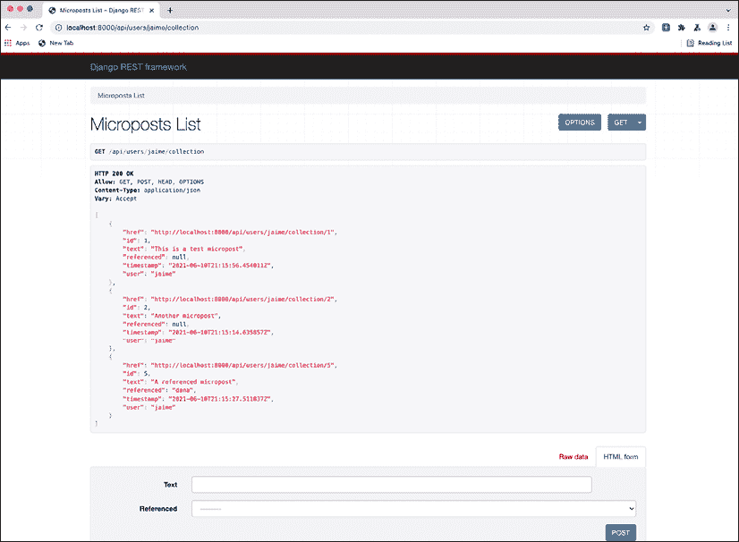
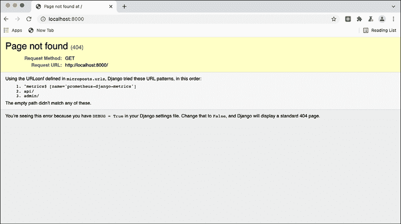
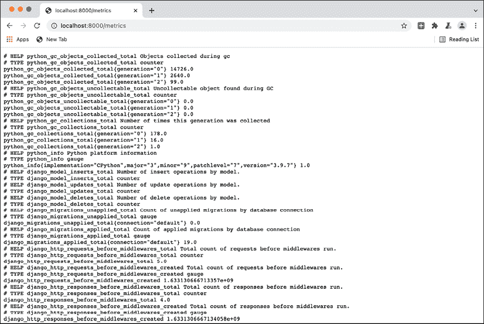
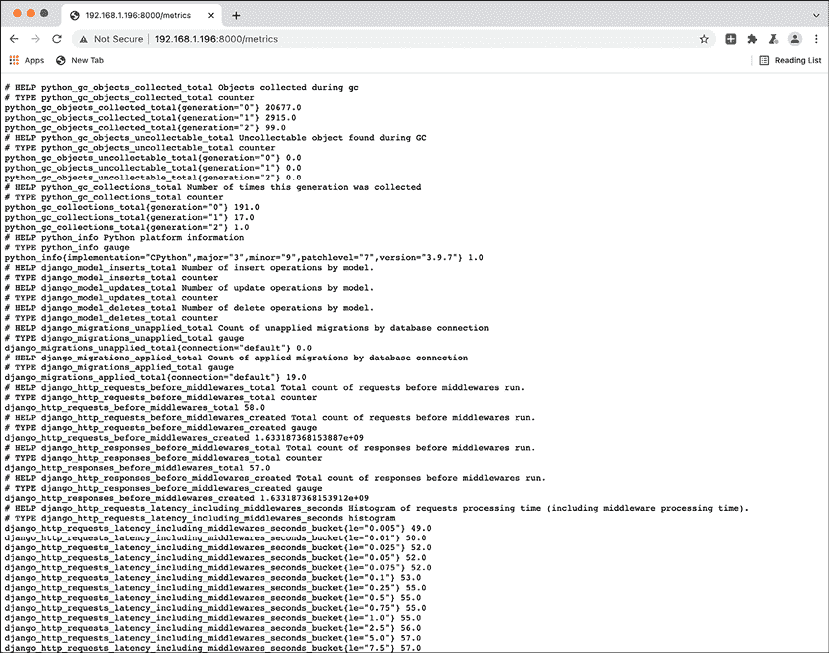
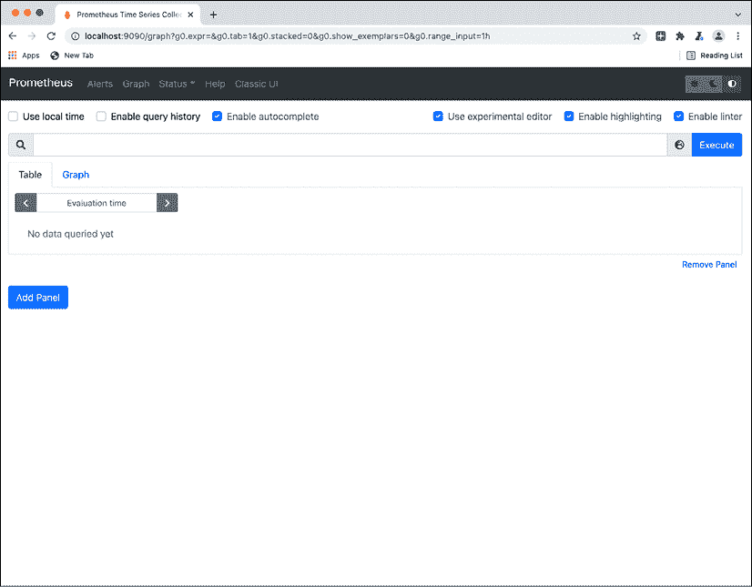
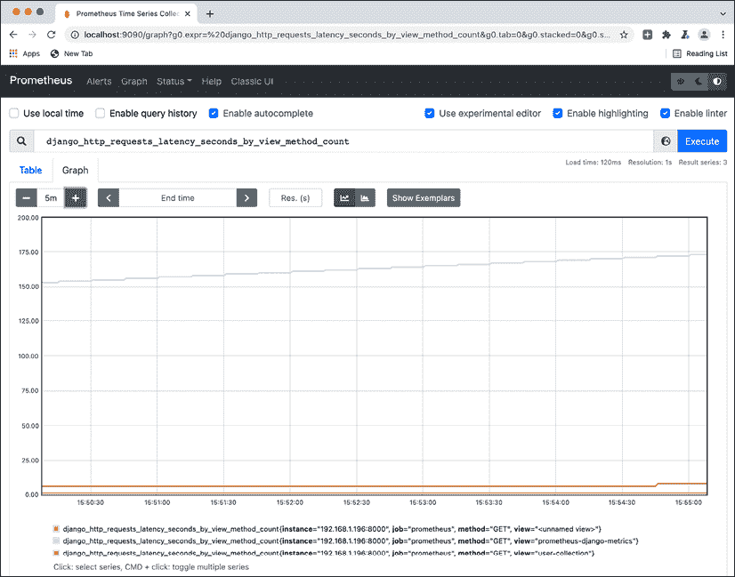
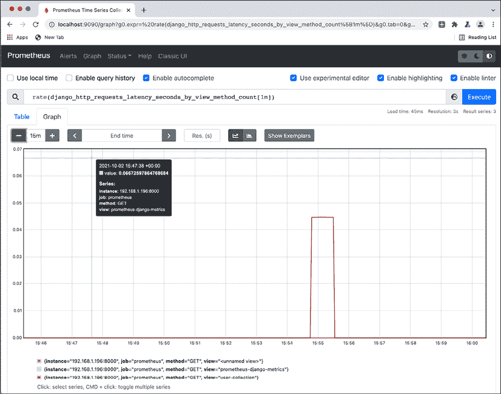
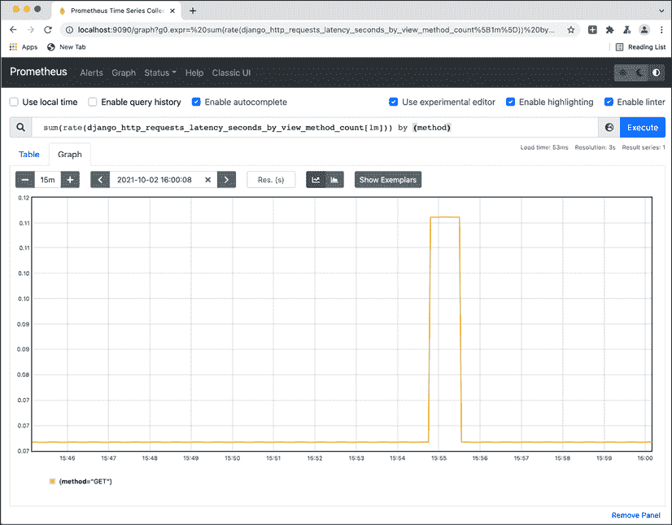
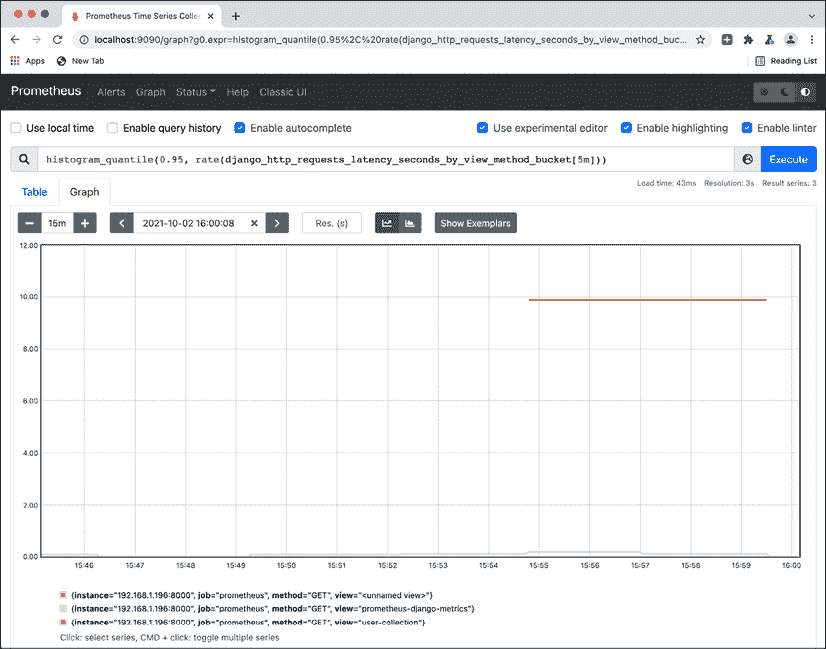

# 第十三章：指标

除了日志记录之外，可观察性的另一个关键元素是指标。指标允许你看到系统的总体状态，并观察由多个任务，甚至可能是许多任务同时执行而引起的大多数趋势和情况。

在本章中，我们将主要使用网络服务的示例，如请求指标。不要受它们的限制；你可以在各种服务中生成指标！

监控实时系统时，通常关注的是指标，因为它们能让你一眼看出是否一切看起来都在正常工作。通常，通过指标，你可以检测到系统是否在努力，例如，突然增加的请求数量，但也可以通过显示趋势来预见问题，比如请求数量的小幅但持续的上升。这让你能够主动行动，而无需等到问题变得严重。

生成一个良好的指标系统来监控系统的生命周期对于在问题出现时能够快速反应至关重要。指标还可以用作自动告警的基础，这有助于警告某些条件的发生，通常是需要调查或纠正的事情。

在本章中，我们将涵盖以下主题：

+   指标与日志的比较

+   使用 Prometheus 生成指标

+   查询 Prometheus

+   积极地与指标合作

+   告警

首先，我们将比较指标与其他主要可观察性工具，即日志。

# 指标与日志的比较

正如我们在上一章中看到的，日志是在代码执行时产生的文本消息。它们擅长提供对系统执行的每个特定任务的可见性，但它们生成的大量数据难以批量处理。相反，在任何给定时间，只有少量日志组能够被分析。

通常，分析的日志都将与单个任务相关。我们在上一章中看到了如何使用请求 ID 来做到这一点。但在某些情况下，可能需要检查特定时间窗口内发生的所有日志，以查看交叉效应，比如一个服务器的问题在特定时间影响了所有任务。

但有时重要的信息不是特定的请求，而是理解整个系统的行为。与昨天相比，系统的负载是否在增长？我们返回了多少错误？处理任务所需的时间是增加还是减少？

所有这些问题都无法通过日志回答，因为它们需要更广泛的视角，在更高的层面上。为了能够实现这一点，数据需要汇总以便理解整个系统。

需要存储在指标中的信息也有所不同。虽然每条记录的日志都是一条文本消息，但每个生成的指标都是一个数字。这些数字将随后进行统计分析以汇总信息。

我们将在本章后面讨论可以作为指标产生的不同类型的数字。

每个记录产生信息量的不同意味着与日志相比，指标要轻量得多。为了进一步减少存储的数据量，数据会自动进行聚合。

指标解析的分辨率可能取决于工具和设置配置。请记住，更高的分辨率将需要更多的资源来存储所有数据。典型的分辨率是一分钟，除非您有一个非常活跃的系统，通常每秒接收 10 个或更多任务，否则这个分辨率足够小，可以呈现详细的信息。

指标应捕获和分析与性能相关的信息，例如处理任务的平均时间。这允许您检测可能的瓶颈并迅速采取行动以改善系统的性能。这以聚合方式更容易做到，因为单个任务的信息，如生成的日志，可能不足以捕捉到整体情况。这一结果的重要之处在于能够在问题变得太大之前看到趋势并检测到问题，及早进行修复。相比之下，日志通常在事后使用，并且难以用作预防措施的方式。

## 指标类型

可以产生不同类型的指标。这取决于用于生成指标的特定工具，但一般来说，大多数系统中都有一些常见的指标，如下所示：

+   **计数器**：每当发生某事时都会生成一个触发器。这将作为总数进行计数和聚合；例如，在 Web 服务中，请求的数量或生成的错误数量。计数器有助于理解在系统中某个特定动作发生的次数。

+   **仪表**：系统中的单个数字。仪表数字可以上升或下降，但最后一个值会覆盖之前的值，因为它存储了系统的总体状态；例如，队列中的元素数量或系统中现有工作者的数量。

+   **测量**：与它们相关联的具有数值的事件。这些数字可以以某种方式平均、求和或聚合。与仪表相比，区别在于之前的测量仍然是独立的；例如，当我们以毫秒为单位发出请求时间和以字节为单位的请求大小的事件时。

    测量值也可以作为计数器使用，因为每个发出的事件本质上就是一个计数器。例如，跟踪请求时间也会计算请求的数量，因为每个请求都会生成一次。工具通常为每个测量值自动创建相关的计数器。

定义哪个指标适合测量特定值非常重要。在大多数情况下，它们将是*测量值*，以便存储由事件产生的一个值。*计数器*通常是明显的（它们是没有值的*测量值*），而*仪表*通常是那些不那么明显且在使用时可能更具挑战性的指标。

指标也可以从其他指标中派生出来以生成新的指标。例如，我们可以通过将返回错误代码的请求数量除以总请求数量来生成错误百分比。这样的派生指标可以帮助你以有意义的方式理解信息。

根据指标的产生方式，也存在两种类型的指标系统：

+   每次生成指标时，都会将一个事件 *推送* 到指标收集器。

+   每个系统内部维护自己的指标，这些指标会定期从指标收集器中 *拉取*。

每个系统都有其自身的优缺点。推送事件会产生更高的流量和活动，因为每个单独的事件都会立即发送，这可能导致瓶颈和延迟。拉取事件将仅采样信息，并产生较低分辨率的 数据，因为它可能会错过样本之间的发生事件，但它更稳定，因为请求数量不会随着事件数量的增加而增加。

这两种方法都被使用，但当前的趋势是向拉取系统转变。它们减少了推送系统所需的维护量，并且更容易扩展。

我们将使用 Prometheus 的示例，这是一个使用拉取方法的指标系统。推送方法最常用的例子是 Graphite。

# 使用 Prometheus 生成指标

Prometheus 是一个流行的指标系统，它得到了良好的支持并且易于使用。我们将在本章中使用它作为示例，展示如何收集指标以及它如何与其他工具交互以显示指标。

正如我们之前看到的，Prometheus 使用 *拉取* 方法来生成指标。这意味着任何产生指标的系统都会运行自己的内部 Prometheus 客户端，以跟踪指标。

对于网络服务，这可以作为一个额外的端点来提供指标。这是 `django-prometheus` 模块采取的方法，该模块将自动收集许多常见的指标，用于 Django 网络服务。

我们将从 *第六章*，*Web 服务器结构* 中展示的 Django 应用程序代码开始构建，以展示一个工作应用程序。请检查 GitHub 上的代码 [`github.com/PacktPublishing/Python-Architecture-Patterns/tree/main/chapter_13_metrics/microposts`](https://github.com/PacktPublishing/Python-Architecture-Patterns/tree/main/chapter_13_metrics/microposts)。

## 准备环境

我们需要设置环境以确保安装代码所需的所有包和依赖项。

让我们从创建一个新的虚拟环境开始，如 *第十一章*，*包管理* 中介绍的那样，以确保创建我们自己的隔离沙盒来安装包：

```py
$ python3 -m venv venv

$ source venv/bin/activate 
```

我们现在可以安装存储在 `requirements.txt` 中的准备好的需求列表。这包括在 *第六章*，*Web 服务器结构* 中看到的 Django 和 Django REST 框架模块，以及 Prometheus 依赖项：

```py
(venv) $ cat requirements.txt

django

django-rest-framework

django-prometheus

(venv) $ pip install -r requirements.txt

Collecting Django

  Downloading Django-3.2.7-py3-none-any.whl (7.9 MB)

     |████████████████████████████████| 7.9 MB 5.7 MB/s

...

Installing collected packages: djangorestframework, django-rest-framework

    Running setup.py install for django-rest-framework ... done

Successfully installed django-rest-framework-0.1.0 djangorestframework-3.12.4 
```

要启动服务器，请转到 `micropost` 子目录并运行 `runserver` 命令：

```py
(venv) $ python3 manage.py runserver 0.0.0.0:8000

Watching for file changes with StatReloader

Performing system checks...

System check identified no issues (0 silenced).

October 01, 2021 - 23:24:26

Django version 3.2.7, using settings 'microposts.settings'

Starting development server at http://0.0.0.0:8000/

Quit the server with CONTROL-C. 
```

应用程序现在可通过根地址访问：`http://localhost:8000`，例如，`http://localhost:8000/api/users/jaime/collection`。

注意，我们是在地址 0.0.0.0 上启动服务器的。这使 Django 能够服务任何 IP 地址，而不仅仅是来自 `localhost` 的请求。这是一个重要的细节，稍后会进行说明。

还要注意，根地址将返回 404 错误，因为没有在那里定义端点。

如果您还记得 *第三章*，*数据建模*，我们添加了一些初始数据，因此您可以访问 URL `http://localhost:8000/api/users/jaime/collection` 和 `http://localhost:8000/api/users/dana/collection` 来查看一些数据。



图 13.1：访问应用程序中的可用 URL

访问这些页面几次以生成我们可以稍后访问的指标。

## 配置 Django Prometheus

`django-prometheus` 模块的配置在 `microposts/settings.py` 文件中完成，我们需要做两件事。

首先，将 `django-prometheus` 应用程序添加到已安装的应用程序列表中，这将启用该模块：

```py
INSTALLED_APPS = [

    'django.contrib.admin',

    'django.contrib.auth',

    'django.contrib.contenttypes',

    'django.contrib.sessions',

    'django.contrib.messages',

    'django.contrib.staticfiles',

    'django_prometheus',

    'rest_framework',

    'api',

] 
```

我们还需要包含适当的中间件来跟踪请求。我们需要在请求处理过程的开始和结束时放置一个中间件，以确保能够捕获和测量整个过程：

```py
MIDDLEWARE = [

    'django_prometheus.middleware.PrometheusBeforeMiddleware',

    'django.middleware.security.SecurityMiddleware',

    'django.contrib.sessions.middleware.SessionMiddleware',

    'django.middleware.common.CommonMiddleware',

    'django.middleware.csrf.CsrfViewMiddleware',

    'django.contrib.auth.middleware.AuthenticationMiddleware',

    'django.contrib.messages.middleware.MessageMiddleware',

    'django.middleware.clickjacking.XFrameOptionsMiddleware',

    'django_prometheus.middleware.PrometheusAfterMiddleware',

] 
```

检查 `django.prometheus.middleware.PrometheusBeforeMiddleware` 和 `django_prometheus.middleware.PrometheusAfterMiddleware` 的位置。

我们还将 `ALLOWED_HOSTS` 的值更改为 `'*'` 并允许来自任何主机名的请求。这个细节稍后会解释。

使用此配置，Prometheus 收集现在已启用。但我们还需要一种访问它们的方法。记住，Prometheus 系统的一个重要元素是每个应用程序都为其自己的指标收集提供服务。

在这种情况下，我们可以在 `microposts/url.py` 文件中添加一个端点，该文件处理系统的顶级 URL：

```py
from django.contrib import admin

from django.urls import include, path

urlpatterns = [

    path('', include('django_prometheus.urls')),

    path('api/', include('api.urls')),

    path('admin/', admin.site.urls),

] 
```

`path('', include('django_prometheus.urls'))` 这一行设置了一个 `/metrics` URL，我们现在可以访问它。

## 检查指标

主要 URL 根显示了一个新的端点 - `/metrics`：



图 13.2：此页面出现是因为 DEBUG 模式处于活动状态。记住在部署到生产环境之前将其停用

当访问 `/metrics` 端点时，它显示了所有收集的指标。请注意，收集了大量的指标。这些都是文本格式，并且预期将由 Prometheus 指标服务器收集。

一定要多次访问端点 `http://localhost:8000/api/users/jaime/collection` 和 `http://localhost:8000/api/users/dana/collection` 以生成一些指标。您可以检查一些指标，如 `django_http_requests_total_by_view_transport_method_total{method="GET",transport="http",view="user-collection"}`，是如何增加的。



图 13.3：由应用程序收集的原始 Prometheus 指标

下一步是启动一个 Prometheus 服务器，它可以拉取信息并显示。

## 启动 Prometheus 服务器

Prometheus 服务器将定期从所有配置的应用程序中拉取指标，这些应用程序正在收集它们的指标。Prometheus 将这些元素称为 *目标*。

启动 Prometheus 服务器最简单的方法是启动官方 Docker 镜像。

我们在 *第九章*，*微服务与单体* 中介绍了 Docker。请参阅该章节以获取更多信息。

我们需要启动服务器，但在那之前，我们需要在 `prometheus.yml` 文件中设置配置。你可以在 GitHub 上查看示例：[`github.com/PacktPublishing/Python-Architecture-Patterns/blob/main/chapter_13_metrics/prometheus.yml`](https://github.com/PacktPublishing/Python-Architecture-Patterns/blob/main/chapter_13_metrics/prometheus.yml)：

```py
# my global config

global:

  scrape_interval: 15s # Set the scrape interval to every 15 seconds. Default is every 1 minute.

  # scrape_timeout is set to the global default (10s).

scrape_configs:

  # The job name is added as a label `job=<job_name>` to any timeseries scraped from this config.

  - job_name: "prometheus"

    # metrics_path defaults to '/metrics'

    # scheme defaults to 'http'.

    static_configs:

      # The target needs to point to your local IP address

      # 192.168.1.196 IS AN EXAMPLE THAT WON'T WORK IN YOUR SYSTEM

      - targets: ["192.168.1.196:8000"] 
```

配置文件有两个主要部分。第一个部分是 `global`，它指示多久抓取一次（从目标读取信息）和其他一般配置值。

第二个，`scrape_config`，描述了要从哪里抓取，主要参数是 `targets`。在这里，我们需要配置所有我们的目标。特别是这个目标需要通过其外部 IP 地址来描述，这将是从你的电脑来的 IP 地址。

这个地址不能是 `localhost`，因为在 Prometheus Docker 容器内部，它将解析为相同的容器，这并不是你想要的。你需要找出你自己的本地 IP 地址。

如果你不知道如何通过 ipconfig 或 ifconfig 来查找它，你可以查看这篇文章了解查找方法：[`lifehacker.com/how-to-find-your-local-and-external-ip-address-5833108`](https://lifehacker.com/how-to-find-your-local-and-external-ip-address-5833108)。请记住，这是你的 **本地地址**，而不是外部地址。

这是为了确保 Prometheus 服务器可以访问运行在本地的 Django 应用程序。正如你所记得的，我们在启动服务器时通过选项 `0.0.0.0` 允许任何主机名进行连接，并在配置参数 `ALLOWED_HOSTS` 中允许所有主机。

请确保你可以通过本地 IP 访问指标。



图 13.4：注意用于访问的 IP 地址；请记住你应该使用你自己的本地 IP 地址

在所有这些信息的基础上，你现在可以准备在 Docker 中启动 Prometheus 服务器，使用你自己的配置文件。

请注意，这个命令要求你找到 `prometheus.yml` 文件的完整路径。如果你在同一目录下，你可以将其表示为 `$(pwd)/prometheus.yml`。

为了做到这一点，运行以下 `docker` 命令，添加配置文件的完整路径以与新的容器共享：

```py
$ docker run -p 9090:9090  -v /full/path/to/file/prometheus.yml:/etc/prometheus/prometheus.yml prom/prometheus

level=info ts=2021-10-02T15:24:17.228Z caller=main.go:400 msg="No time or size retention was set so using the default time retention" duration=15d

level=info ts=2021-10-02T15:24:17.228Z caller=main.go:438 msg="Starting Prometheus" version="(version=2.30.2, branch=HEAD, revision=b30db03f35651888e34ac101a06e25d27d15b476)"

... 

level=info ts=2021-10-02T15:24:17.266Z caller=main.go:794 msg="Server is ready to receive web requests." 
```

`docker` 命令的结构如下：

+   `-p 9090:9090` 将本地 9090 端口映射到容器内的 9090 端口

+   `-v /full/path/to/file/prometheus.yml:/etc/prometheus/prometheus.yml` 将本地文件（请记住添加完整路径或使用 `$(pwd)/prometheus.yml`）挂载到 Prometheus 预期的配置路径

+   `docker run prom/Prometheus` 是运行 `prom/Prometheus` 镜像的命令，这是官方的 Prometheus 镜像

当 Prometheus 服务器启动并运行后，服务器可通过 `http://localhost:9090` 访问。



图 13.5：Prometheus 空图页面

从这里，我们可以开始查询系统。

# 查询 Prometheus

Prometheus 有自己的查询系统，称为 PromQL，以及操作指标的方式，虽然功能强大，但一开始可能会有些令人困惑。其中一部分是其对指标的拉取方法。

例如，请求一个有用的指标，如 `django_http_requests_latency_seconds_by_view_method_count`，将显示每个方法被每个视图调用的次数。



图 13.6：注意 prometheus-django-metrics 视图被调用得更频繁，因为它被 Prometheus 每 15 秒自动调用一次以抓取结果

这以累积值的形式呈现，随着时间的推移而增长。这并不很有用，因为很难理解它确切的意义。

相反，值更有可能以 `rate` 的形式呈现，表示每秒检测到的请求数量。例如，以 1 分钟的分辨率，`rate(django_http_requests_latency_seconds_by_view_method_count[1m])` 会显示以下图表：



图 13.7：注意不同的方法和视图以不同的线条显示

如您所见，从 `prometheus-django-metrics` 来的请求数量是恒定的，这是 Prometheus 请求指标信息。这每 15 秒发生一次，或大约每秒 0.066 次。

在图表中，还有 `user-collection` 方法在 15:55 发生的另一个峰值，这是我们手动生成对服务请求的时间。如您所见，分辨率是每分钟，正如速率所描述的。

如果我们想要将这些内容聚合到单个图中，我们可以使用求和运算符，指定我们要聚合的内容。例如，要计算所有 `GET` 请求，可以使用以下命令：

```py
sum(rate(django_http_requests_latency_seconds_by_view_method_count[1m])) by (method) 
```

这会产生另一个图表：



图 13.8：注意底部值是基于 prometheus-django-metrics 调用创建的基线

要绘制时间而不是分位数，应使用`django_http_requests_latency_seconds_by_view_method_bucket`指标。桶指标以可以与`histogram_quantile`函数结合的方式生成，以显示特定的分位数，这对于给出适当的时间感觉非常有用。

例如，0.95 分位数意味着时间是 95%请求中的最高值。这比创建平均值更有用，因为它们可能会被高数值所扭曲。相反，你可以绘制 0.50 分位数（一半请求的最大时间），0.90 分位数（大多数请求的最大时间），以及 0.99 分位数，用于返回请求所需的最长时间。这让你能获得更好的视图，因为它与增长中的 0.50 分位数（大多数请求返回时间更长）和增长中的 0.99 分位数（一些慢查询变得更糟）的情况不同。

要绘制 5 分钟内的 0.95 分位数，可以使用以下查询：

```py
histogram_quantile(0.95, rate(django_http_requests_latency_seconds_by_view_method_bucket[5m])) 
```

当你运行它时，你应该收到以下内容：



图 13.9：注意指标收集的速度比用户收集请求的速度快得多

要绘制时间而不是分位数，应使用`django_http_requests_latency_seconds_by_view_method_bucket`指标。桶指标以可以与`histogram_quantile`函数结合的方式生成，以显示特定的分位数，这对于给出适当的时间感觉非常有用。

指标也可以被过滤以仅显示特定的标签，并且有许多乘法、除法、加法、创建平均值以及各种操作的功能。

当尝试显示多个指标的结果，例如成功请求占总请求的百分比时，Prometheus 查询可能会变得相当长且复杂。请确保测试结果是否符合预期，并留出时间稍后调整查询以持续改进。

界面具有自动完成功能，可以帮助你找到特定的指标。

Prometheus 通常与 Grafana 搭配使用。Grafana 是一个开源的交互式可视化工具，可以与 Prometheus 连接以创建丰富的仪表板。这利用了指标收集，并有助于以更易于理解的方式可视化系统的状态。本书不涉及如何使用 Grafana 的描述，但强烈建议使用它来显示指标：[`grafana.com/`](https://grafana.com/).

检查 Prometheus 文档中的查询部分以获取更多信息：[`prometheus.io/docs/prometheus/latest/querying/basics/`](https://prometheus.io/docs/prometheus/latest/querying/basics/).

# 积极使用指标

正如我们所见，指标显示了整个集群状态的汇总视图。它们允许你检测趋势问题，但很难确定单个错误。

这不应该阻止我们将它们视为成功监控的关键工具，因为它们可以告诉我们整个系统是否健康。在一些公司中，最重要的指标会永久显示在屏幕上，以便运维团队能够看到它们，并快速对任何突发问题做出反应。

找到服务关键指标的正确平衡并不像看起来那么简单，这需要时间和经验，甚至可能需要试错。

然而，对于在线服务，有四个指标被认为是始终重要的。它们是：

+   **延迟**：系统响应请求所需的毫秒数。根据服务不同，有时也可以使用秒。根据我的经验，毫秒通常是合适的时间尺度，因为大多数 Web 应用在 50 毫秒到 1 秒内响应，具体取决于请求。通常，超过 1 秒的请求较为罕见，尽管系统中总是有一些，这取决于系统本身。

+   **流量**：单位时间内通过系统的请求数量，例如，每分钟的请求数量。

+   **错误**：收到并返回错误的请求数量百分比。

+   **饱和度**：描述集群的容量是否有足够的余量。这包括可用硬盘空间、内存等元素。例如，系统中可用 RAM 为 15%。

检查饱和度的主要工具是可用的多个默认导出器，可以自动收集大多数硬件信息，如内存、CPU 和硬盘空间。当使用云服务提供商时，通常他们会公开自己的相关指标集，例如 AWS 中的 CloudWatch。

这些指标可以在 Google SRE 书中找到，被称为*四个黄金信号*，并被认为是成功监控最重要的高级元素。

# 警报

当通过指标检测到问题时，应触发自动警报。Prometheus 有一个警报系统，当定义的指标满足定义的警报条件时，会触发警报。

查阅 Prometheus 关于警报的文档以获取更多信息：[`prometheus.io/docs/alerting/latest/overview/`](https://prometheus.io/docs/alerting/latest/overview/)。

通常情况下，当指标值超过某个阈值时，会配置警报。例如，错误数量高于 X，或者返回请求的时间太长。

警报也可能是一些元素太低；例如，如果系统中的请求数量降至零，这可能表明系统已关闭。

内置的 Alertmanager 可以通过发送电子邮件等方式发出警报，但它也可以连接到其他工具以执行更复杂的行为。例如，连接到一个集成的故障解决方案，如 Opsgenie ([`www.atlassian.com/software/opsgenie`](https://www.atlassian.com/software/opsgenie))，允许您创建警报流程，例如发送电子邮件和短信、电话。

虽然可以直接从指标生成警报，但也有一些工具允许您直接从日志生成警报。例如，Sentry ([`sentry.io/`](https://sentry.io/)) 将根据日志汇总错误，并可以设置阈值以升级到更活跃的警报，如发送电子邮件。另一种选择是使用外部日志系统从日志中派生指标。这允许您，例如，根据 `ERROR` 日志的数量创建一个计数器，或者更复杂的指标。这些系统再次允许您根据这些派生指标触发警报。

警报，与指标一样，是一个持续的过程。一些关键阈值在系统开始时可能不明显，只有经验才能让您发现它们。同样，很可能创建了一些不需要主动监控的警报，应该断开连接以确保系统中的警报准确且信号与噪声比高。

# 摘要

在本章中，我们描述了指标是什么以及它们与日志的比较。我们描述了指标如何有助于分析系统的总体状态，而日志则描述具体任务，更难描述汇总情况。

我们列举了可以生成和描述的指标类型，并介绍了 Prometheus，这是一个使用拉取方法捕获指标的通用指标系统。

我们通过安装和配置 `django-prometheus` 模块，以及如何启动一个抓取生成的指标的 Prometheus 服务器，设置了一个如何自动生成指标的 Django 示例。

请记住，您还可以生成自己的自定义指标，而不仅仅依赖于外部模块中的那些。例如，查看 Prometheus 客户端了解如何操作，以 Python 为例：[`github.com/prometheus/client_python`](https://github.com/prometheus/client_python)。

接下来，我们描述了如何在 Prometheus 中查询指标，介绍了 PromQL，并展示了如何显示指标、绘制 `rate` 图以清楚地看到指标随时间的变化，以及如何使用 `histogram_quantile` 函数处理时间。

我们还在本章中展示了如何积极工作以尽快检测常见问题，以及 Google 描述的四个黄金信号是什么。最后，我们介绍了警报作为一种在指标超出正常范围时通知的方式。使用警报是一种智能的通知方式，无需手动查看指标。
