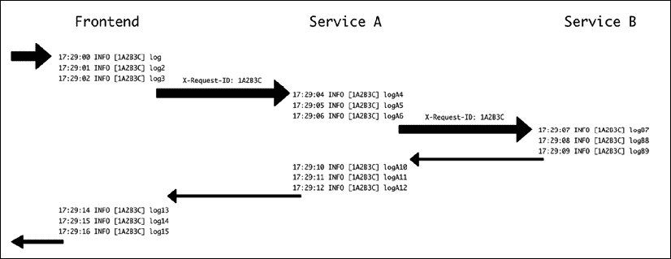

# 第十五章：调试

通常，调试问题的周期包括以下步骤：

1.  检测问题。发现了一个新的问题或缺陷

1.  分析并分配此问题的优先级，以确保我们在有意义的问题上花费时间，并专注于最重要的那些

1.  调查导致问题的确切原因。理想情况下，这应该以在本地环境中复制问题的方法结束

1.  在本地复制问题，并深入了解为什么它会发生

1.  解决问题

如您所见，一般的策略是首先定位和理解问题，然后我们可以适当地调试和修复它。

在本章中，我们将涵盖以下主题，以了解如何有效地处理所有这些阶段的技术：

+   检测和处理缺陷

+   生产环境中的调查

+   理解生产环境中的问题

+   本地调试

+   Python 内省工具

+   使用日志进行调试

+   使用断点进行调试

让我们看看处理缺陷时的第一步。

# 检测和处理缺陷

第一步实际上是检测问题。这听起来可能有点愚蠢，但它是一个相当关键的阶段。

虽然我们主要使用“bug”这个词来描述任何缺陷，但请记住，它可能包括像性能不佳或意外行为这样的细节，这些可能不会被正确分类为“bug”。修复问题的正确工具可能不同，但检测通常是以相似的方式进行。

发现问题可以通过不同的方式，有些可能比其他方式更明显。通常，一旦代码投入生产，缺陷将由用户检测到，无论是内部（最佳情况）还是外部（最坏情况），或者通过监控。

请记住，监控只能捕获明显的、通常也是严重的错误。

根据问题的检测方式，我们可以将它们分类为不同的严重程度，例如：

+   **灾难性问题**，这些问题会完全停止操作。这些错误意味着系统中的任何东西都无法工作，甚至包括同一系统中的非相关任务

+   **关键问题**，这些问题会停止某些任务的执行，但不会停止其他任务

+   **严重问题**，这些问题会停止或在某些情况下导致某些任务的麻烦。例如，一个参数未进行检查并产生异常，或者某些组合产生了一个运行速度如此之慢的任务，以至于产生了超时

+   **轻微问题**，包括包含错误或不准确性的任务。例如，某个任务在特定情况下产生空结果，或者 UI 中的问题不允许调用功能

+   **外观或轻微问题**，如拼写错误等

由于每个开发团队都是有限的，因此总会存在太多错误，并且对关注什么以及首先修复什么有适当的处理方法至关重要。通常，第一组的错误显然非常紧迫，需要立即的全员反应。但分类和优先排序很重要。

对接下来要寻找的事物有一个清晰的信号将帮助开发者有一个清晰的视角，通过专注于重要问题而不是最新事物来提高效率。团队本身可以对问题进行一些分类，但添加一些背景信息是好的。

请记住，通常你需要同时纠正错误和实现新功能，并且每一项任务都可能分散对另一项任务的注意力。

修复错误很重要，不仅因为服务的结果质量，因为任何用户都会发现与有缺陷的服务一起工作非常令人沮丧。但它对开发团队也很重要，因为与低质量的服务一起工作对开发者来说也很沮丧。

在修复错误和引入新功能之间需要找到一个适当的平衡。同时，记得为新功能引入的相应新错误分配时间。一个功能在发布时并不准备就绪，而是在其错误被修复时才准备就绪。

任何检测到的问题，除了那些背景信息无关的灾难性错误，都应该捕捉到产生错误所需的步骤周围的上下文。这个目标是为了能够*重现*错误。

重现错误是解决问题的关键要素。最坏的情况是，一个错误是间歇性的或似乎在随机时间发生。为了理解为什么它在发生时发生，需要更多的挖掘。

当一个问题可以被复制时，你就已经解决了一半。理想情况下，这个问题可以被复制成一个测试，这样就可以反复测试，直到问题被理解和解决。在最佳情况下，这个测试可以是一个单元测试，如果问题影响单个系统，并且所有条件都被理解和可以复制的话。如果问题影响多个系统，可能需要创建集成测试。

在调查过程中，一个常见的问题是找出具体是什么特定情况触发了问题，例如，在生产中以一种特定方式设置的数据，这触发了某些问题。在这个环境中，找出确切导致问题的原因可能很复杂。我们将在本章后面讨论如何在生产中找到问题。

一旦问题被分类并可以复制，调查就可以继续进行，以了解*为什么*。

通过视觉检查代码并试图推理问题和错误通常是不够的。即使是简单的代码，在执行方面也会让你感到惊讶。能够精确分析在特定情况下代码是如何执行的，对于分析和修复发现的问题至关重要。

# 生产中的调查

一旦我们意识到生产中存在问题，我们需要了解发生了什么，以及产生问题的关键要素是什么。

强调能够复制问题的能力非常重要。如果是这样，可以进行测试来产生错误并跟踪其后果。

分析为什么产生特定问题时最重要的工具是可观察性工具。这就是为什么在需要时确保能够找到问题的准备工作很重要。

在前面的章节中，我们讨论了日志和指标。在调试时，指标通常与问题无关，除非用来显示错误的相对重要性。检查返回错误的增加可能对于检测错误很重要，但检测错误本身需要更精确的信息。

然而，不要低估指标。它们可以帮助快速确定哪个特定组件失败，或者是否有与其他元素的关系，例如，如果有一个服务器正在产生错误，或者如果它已经耗尽了内存或硬盘空间。

例如，一个有问题的服务器可能会产生看似随机的错误，如果外部请求被指向不同的服务器，并且故障与针对特定服务器的特定请求的组合有关。

但无论如何，日志通常在确定代码的哪个部分表现不佳时更有用。正如我们在*第十二章*，*日志*中看到的，我们可以将错误日志描述为检测两种类型的问题：

+   **预期错误**。在这种情况下，我们事先进行了调试错误的操作，并且应该很容易了解发生了什么。这类错误的例子可以是返回错误的外部请求，无法连接的数据库等。

    这些错误中的大多数将与外部服务（从引发错误的一方来看）有关，这些服务表现不佳。这可能表明存在网络问题、配置错误或其他服务的问题。错误在系统中传播并不罕见，因为一个错误可能会引发级联故障。通常，尽管如此，起源将是意外错误，其余的将是预期的错误，因为它们将从外部来源接收错误。

+   **意外错误**。这些错误的标志是日志表明出了问题，并且在大多数现代编程语言中，日志中会有某种形式的堆栈跟踪，详细说明了错误产生时的代码行。

默认情况下，任何执行任务的框架，如 Web 框架或任务管理系统，都会产生错误，但保持系统稳定。这意味着只有产生错误的任务会被中断，任何新的任务都将从头开始处理。

系统应该为任务提供适当的处理。例如，一个网络服务器将返回 500 错误，而一个任务管理系统可能会在延迟后重试任务。这可能导致错误像我们之前所见的那样被传播。

在任何一种情况下，检测问题的主要工具将是日志。要么日志显示一个已知的问题，该问题已被捕获并正确标记，要么日志显示一个堆栈跟踪，这应该表明代码的哪个具体部分正在显示错误。

找到错误源和代码中的具体部分对于理解问题和调试特定问题非常重要。这在微服务架构中尤为重要，因为它们将具有多个独立元素。

我们在*第九章*，“微服务与单体架构”中讨论了微服务和单体架构。在处理错误方面，单体架构更容易处理，因为所有代码都在同一地点处理，但无论如何，随着其增长，它们将变得越来越复杂。

请记住，有时完全避免错误是不可能的。例如，如果有一个外部依赖调用外部 API 并且出现问题，这可能会触发内部错误。这些问题可以通过优雅地失败或生成“服务不可用”的状态来缓解。但错误的根源可能无法完全修复。

缓解外部依赖可能需要创建冗余，甚至使用不同的供应商，以便不依赖于单一故障点，尽管这可能并不现实，因为这可能非常昂贵。

我们可以将这些情况通知我们，但它们不会要求采取进一步的短期行动。

在其他情况下，当错误不是立即明显的并且需要进一步调查时，将需要进行一些调试。

# 理解生产中的问题

在复杂系统中，挑战在于检测问题变得指数级复杂。随着多个层和模块被添加并相互交互，错误可能变得更加微妙和复杂。

如我们之前所见，微服务架构可能特别难以调试。不同微服务之间的交互可能会产生复杂的交互，这可能导致其不同部分的集成中出现微妙的问题。这种集成在集成测试中可能很难测试，或者问题的源头可能位于集成测试的盲点中。

但随着其部分变得更加复杂，单体架构也可能出现问题。由于特定生产数据以意想不到的方式交互，可能会产生难以发现的错误。单体系统的一个大优点是测试将覆盖整个系统，这使得通过单元测试或集成测试进行复现变得更加容易。

然而，在这个步骤中，目标应该是分析足够的生产环境中的问题，以便能够在本地环境中复制它，因为环境的较小规模将使其更容易和更少侵入性地进行探测和更改。一旦收集到足够的信息，最好让任何生产环境保持原样，并专注于问题的具体细节。

记住，拥有可复制的错误已经超过了一半的战斗！一旦问题可以归类为本地可复制的步骤集，就可以创建一个测试来反复产生它，并在受控环境中调试。

有时，启用通用日志记录就足以确定确切是什么错误或如何在本地复制它。在这些情况下，可能需要研究触发问题的环境。

## 记录请求 ID

分析大量日志时遇到的一个问题是关联它们。为了正确地将相关的日志分组，我们可以通过生成它们的宿主机进行过滤，并选择一个短时间窗口，但即使这样可能也不够好，因为可能同时运行两个或更多不同的任务。我们需要每个任务或请求的唯一标识符，以便跟踪来自同一来源的所有日志。我们将此标识符称为请求 ID，因为它们在许多框架中是自动添加的。这有时在任务管理器中被称为任务 ID。

在涉及多个服务的情况下，例如在微服务架构中，保持一个通用的请求 ID 非常重要，它可以用于跟踪不同服务之间的不同请求。这允许您跟踪和关联来自具有相同来源的不同服务的不同日志。

以下图表显示了前端和两个内部调用的后端服务之间的流程。请注意，`X-Request-ID`头由前端设置，并将其转发到服务 A，然后服务 A 将其转发到服务 B。



图 15.1：多个服务之间的请求 ID

因为它们都共享相同的请求 ID，所以可以通过该信息过滤日志，以获取单个任务的所有信息。

为了实现这一点，我们可以使用模块`django_log_request_id`在 Django 应用程序中创建请求 ID。

您可以在此处查看完整文档：[`github.com/dabapps/django-log-request-id/`](https://github.com/dabapps/django-log-request-id/)。

我们在 GitHub 上展示了部分代码，地址为[`github.com/PacktPublishing/Python-Architecture-Patterns/tree/main/chapter_15_debug`](https://github.com/PacktPublishing/Python-Architecture-Patterns/tree/main/chapter_15_debug)，按照书中的示例进行。这需要创建一个虚拟环境并安装该包，以及其余的要求。

```py
$ python3 -m venv ./venv

$ source ./venv/bin/activate

(venv) $ pip install -r requirements.txt 
```

代码已被修改，在`microposts/api/views.py`文件中包含了一些额外的日志（如[`github.com/PacktPublishing/Python-Architecture-Patterns/blob/main/chapter_15_debug/microposts/api/views.py`](https://github.com/PacktPublishing/Python-Architecture-Patterns/blob/main/chapter_15_debug/microposts/api/views.py)所示）：

```py
from rest_framework.generics import ListCreateAPIView

from rest_framework.generics import RetrieveUpdateDestroyAPIView

from .models import Micropost, Usr

from .serializers import MicropostSerializer

import logging

logger = logging.getLogger(__name__)

class MicropostsListView(ListCreateAPIView):

    serializer_class = MicropostSerializer

    def get_queryset(self):

        logger.info('Getting queryset')

        result = Micropost.objects.filter(user__username=self.kwargs['username'])

        logger.info(f'Querysert ready {result}')

        return result

    def perform_create(self, serializer):

        user = Usr.objects.get(username=self.kwargs['username'])

        serializer.save(user=user)

class MicropostView(RetrieveUpdateDestroyAPIView):

    serializer_class = MicropostSerializer

    def get_queryset(self):

        logger.info('Getting queryset for single element')

        result = Micropost.objects.filter(user__username=self.kwargs['username'])

        logger.info(f'Queryset ready {result}')

        return result 
```

注意现在在访问列表集合页面和单个 micropost 页面时添加了一些日志。我们将使用示例 URL `/api/users/jaime/collection/5`。

要启用请求 ID 的使用，我们需要在`microposts/settings.py`中正确设置配置（[`github.com/PacktPublishing/Python-Architecture-Patterns/blob/main/chapter_15_debug/microposts/microposts/settings.py`](https://github.com/PacktPublishing/Python-Architecture-Patterns/blob/main/chapter_15_debug/microposts/microposts/settings.py)）：

```py
LOG_REQUEST_ID_HEADER = "HTTP_X_REQUEST_ID"

GENERATE_REQUEST_ID_IF_NOT_IN_HEADER = True

LOGGING = {

    'version': 1,

    'disable_existing_loggers': False,

    'filters': {

        'request_id': {

            '()': 'log_request_id.filters.RequestIDFilter'

        }

    },

    'formatters': {

        'standard': {

            'format': '%(levelname)-8s [%(asctime)s] [%(request_id)s] %(name)s: %(message)s'

        },

    },

    'handlers': {

        'console': {

            'level': 'INFO',

            'class': 'logging.StreamHandler',

            'filters': ['request_id'],

            'formatter': 'standard',

        },

    },

    'root': {

        'handlers': ['console'],

        'level': 'INFO',

    },

} 
```

`LOGGING`字典是 Django 的一个特性，用于描述如何进行日志记录。`filters`添加了额外的信息，在这种情况下，我们的`request_id`，`formatter`描述了要使用的特定格式（注意，我们将`request_id`作为一个参数添加，它将以括号的形式呈现）。

`handlers`描述了每个消息的处理方式，将`filters`和`formatter`与显示级别和发送信息的位置的信息结合起来。在这种情况下，`StreamHandler`将日志发送到`stdout`。我们将所有日志的`root`级别设置为使用此`handler`。

查阅 Django 文档以获取更多信息：[`docs.djangoproject.com/en/3.2/topics/logging/`](https://docs.djangoproject.com/en/3.2/topics/logging/)。在 Django 中进行日志记录可能需要对设置所有参数的正确性有一些经验。配置时请耐心。

以下行，

```py
LOG_REQUEST_ID_HEADER = "HTTP_X_REQUEST_ID"

GENERATE_REQUEST_ID_IF_NOT_IN_HEADER = True 
```

如果在输入中没有找到作为头部的`Request ID`参数，则应创建一个新的参数，该参数的名称为`X-Request-ID`。

一旦所有这些配置完成，我们可以通过以下命令启动服务器来运行测试：

```py
(venv) $ python3 manage.py runserver

Watching for file changes with StatReloader

2021-10-23 16:11:16,694 INFO     [none] django.utils.autoreload: Watching for file changes with StatReloader

Performing system checks...

System check identified no issues (0 silenced).

October 23, 2021 - 16:11:16

Django version 3.2.8, using settings 'microposts.settings'

Starting development server at http://127.0.0.1:8000/

Quit the server with CONTROL-C 
```

在另一个屏幕上，使用`curl`调用测试 URL：

```py
(venv) $ curl http://localhost:8000/api/users/jaime/collection/5

{"href":"http://localhost:8000/api/users/jaime/collection/5","id":5,"text":"A referenced micropost","referenced":"dana","timestamp":"2021-06-10T21:15:27.511837Z","user":"jaime"} 
```

同时，你会在服务器屏幕上看到日志：

```py
2021-10-23 16:12:47,969 INFO     [66e9f8f1b43140338ddc3ef569b8e845] api.views: Getting queryset for single element

2021-10-23 16:12:47,971 INFO     [66e9f8f1b43140338ddc3ef569b8e845] api.views: Queryset ready <QuerySet [<Micropost: Micropost object (1)>, <Micropost: Micropost object (2)>, <Micropost: Micropost object (5)>]>

[23/Oct/2021 16:12:47] "GET /api/users/jaime/collection/5 HTTP/1.1" 200 177 
```

正如你所见，添加了一个新的请求 ID 元素，在这个例子中是`66e9f8f1b43140338ddc3ef569b8e845`。

但请求 ID 也可以通过调用并使用正确的头部来创建。让我们再次尝试，通过另一个`curl`请求和`-H`参数添加一个头部。

```py
$ curl -H "X-Request-ID:1A2B3C" http://localhost:8000/api/users/jaime/collection/5

{"href":"http://localhost:8000/api/users/jaime/collection/5","id":5,"text":"A referenced micropost","referenced":"dana","timestamp":"2021-06-10T21:15:27.511837Z","user":"jaime"} 
```

你可以在服务器上再次检查日志：

```py
2021-10-23 16:14:41,122 INFO     [1A2B3C] api.views: Getting queryset for single element

2021-10-23 16:14:41,124 INFO     [1A2B3C] api.views: Queryset ready <QuerySet [<Micropost: Micropost object (1)>, <Micropost: Micropost object (2)>, <Micropost: Micropost object (5)>]>

[23/Oct/2021 16:14:41] "GET /api/users/jaime/collection/5 HTTP/1.1" 200 177 
```

这表明请求 ID 已经通过头部中的值设置。

可以通过使用同一模块中包含的`Session`将请求 ID 传递到其他服务，它充当`requests`模块中的`Session`。

```py
from log_request_id.session import Session

session = Session()

session.get('http://nextservice/url') 
```

这将在请求中设置正确的头部，并通过它传递到链的下一个步骤，如服务 A 或服务 B。

一定要检查`django-log-request-id`的文档。

## 分析数据

如果默认日志不足以理解问题，那么在这些情况下，下一步是理解与问题相关的数据。通常，数据存储可能需要被检查，以追踪与任务相关的数据，看看是否有任何迹象。

这个步骤可能会因为数据缺失或数据限制而变得复杂，这些限制使得获取数据变得困难或不可能。有时，组织中只有少数人可以访问所需的数据，这可能会延迟调查。另一种可能是数据无法检索。例如，数据政策可能不会存储数据，或者数据可能被加密。这在涉及**个人身份信息**（**PII**）、密码或类似数据的情况下是一个常见现象。

分析存储的数据可能需要执行临时的手动查询到数据库或其他类型的数据存储，以找出相关数据是否一致，或者是否存在任何不期望的参数组合。

记住，目标是捕获生产中的信息，以便能够独立理解和复制问题。在某些情况下，当调查生产中的问题时，手动更改数据可能会解决问题。这可能在某些紧急情况下是必要的，但目标仍然是理解为什么这种数据不一致的情况是可能的，或者服务应该如何改变以允许你处理这种数据情况。然后，代码可以相应地更改，以确保问题在未来不会发生。

如果调查数据不足以理解问题，可能有必要增加日志上的信息。

## 增加日志

如果常规日志和数据调查没有结果，可能有必要通过特殊日志提高日志级别，以追踪问题。

这是一个最后的手段，因为它有两个主要问题：

+   任何日志的变化都需要部署，这使得运行成本高昂。

+   系统中的日志数量将会增加，这将需要更多的空间来存储它们。根据系统中的请求数量，这可能会对日志系统造成压力。

这些额外的日志应该始终是短期的，并且应该尽快撤销。

虽然启用额外的日志级别，如将日志设置为`DEBUG`级别，在技术上是可以实现的，但这可能会产生过多的日志，使得在大量日志中确定关键日志变得困难。在一些`DEBUG`日志中，调查区域的详细信息可以临时提升到`INFO`或更高级别，以确保它们被正确记录。

对临时记录的信息要格外小心。像 PII 这样的机密信息不应被记录。相反，尝试记录周围的信息，这些信息有助于找出问题。

例如，如果有怀疑某些意外的字符可能正在导致密码检查算法出现问题，而不是记录密码，可以添加一些代码来检测是否存在无效字符。

例如，假设有一个密码或秘密包含表情符号的问题，我们可以提取仅非 ASCII 字符来找出这是否是问题，如下所示：

```py
>>> password = 'secret password '

>>> bad_characters = [c for c in password if not c.isascii()]

>>> bad_characters

'!['] 
```

可以记录`bad_characters`中的值，因为它不会包含完整的密码。

注意，这个假设可能更容易通过单元测试快速测试，而不需要任何秘密数据。这只是一个例子。

添加临时日志很麻烦，因为它通常需要几次部署才能找出问题。始终重要的是将日志数量保持在最低，尽快清理无用的日志，并在工作完成后完全删除它们。

记住，工作的目的仅仅是为了能够本地复现问题，这样你就可以更有效地本地调查和修复问题。有时，在查看一些临时日志后，问题可能显得很明显，但，良好的 TDD 实践，正如我们在第十章“测试和 TDD”中看到的，是显示并修复 bug。

一旦我们可以在本地检测到问题，就是进行下一步的时候了。

# 本地调试

本地调试意味着在我们有了本地复现之后，暴露并修复一个问题。

调试的基本步骤是复现问题，了解当前的不正确结果是什么，以及正确的预期结果应该是什么。有了这些信息，我们就可以开始调试。

一个创建问题复现的好方法是通过测试，如果可能的话。正如我们在第十章“测试和 TDD”中看到的，这是 TDD 的基础。创建一个失败的测试，然后修改代码使其通过。这种方法在修复 bug 时非常实用。

回顾一下，任何调试过程都遵循以下过程：

1.  你意识到有问题

1.  你理解了正确的行为应该是什么

1.  你调查并发现为什么当前系统表现不正确

1.  你修复了问题

从本地调试的角度来看，记住这个过程也是有用的，尽管在这个阶段，*步骤 1*和*步骤 2*可能已经解决了。在大多数情况下，困难的是*步骤 3*，正如我们在本章中看到的。

为了理解，一旦提供了代码，*为什么*代码会以这种方式表现，可以使用类似于科学方法的步骤来系统化地处理：

1.  测量和观察代码

1.  对产生某个结果的原因提出一个假设

1.  通过分析产生的状态（如果可能）或创建一个特定的“实验”（一些特定的代码，如测试）来验证或反驳假设，以强制产生该状态

1.  使用得到的信息迭代这个过程，直到完全理解问题的根源

注意，这个过程不一定需要应用到整个问题上。它可以集中在可能影响问题的代码的特定部分。例如，这个设置在这个情况下是否被激活了？代码中的这个循环是否被访问了？计算出的值是否低于阈值，这将会让我们走上一条不同的代码路径？

所有这些答案都会增加我们对代码为何以这种方式运行的了解。

调试是一项技能。有些人可能会说它是一门艺术。无论如何，随着时间的推移，它可以得到改善，因为更多的精力投入其中。练习在培养涉及知道何时深入某些区域而忽略其他区域以识别代码可能失败的潜在区域这种直觉方面起着重要作用。

在处理调试问题时，有一些一般性的想法可能会非常有帮助：

+   **分而治之**。采取小步骤，隔离代码的各个区域，这样就可以简化代码并使其易于理解。理解代码中存在问题的重要性与检测没有问题同样重要，这样我们就可以将注意力集中在相关部分。

爱德华·J·高斯在 1982 年的一篇文章中描述了这种方法，他称之为“**狼栅栏算法**”：

*阿拉斯加有一只狼；你怎么找到它？首先在州的中部建一个栅栏，等待狼嚎叫，确定它在栅栏的哪一侧。只在那一边重复这个过程，直到你能看到狼*。

+   **从可见的错误回溯**。通常情况下，问题的源头并不是错误发生的地方或明显的地方，而是错误在之前就已经产生了。一个好的方法是从问题明显的地方回溯，然后验证流程。这允许你忽略所有在问题之后出现的代码，并有一个清晰的路径进行分析。

+   **你可以做出一个假设，只要你能证明这个假设是正确的**。代码很复杂，你不可能把整个代码库都记在脑子里。相反，需要仔细地将注意力转移到不同的部分，对其他部分返回的内容做出假设。

如福尔摩斯曾说过：

*当你排除了所有不可能的情况后，无论多么不可能，剩下的就是真相*。

正确地消除所有东西可能很困难，但将已证实的假设从脑海中移除将减少需要分析和验证的代码量。

但那些假设需要得到验证，才能真正证明它们是正确的，否则我们可能会冒出错误的假设。很容易陷入错误的假设，认为问题出在代码的某个特定部分，而实际上问题可能出在其他地方。

尽管调试的所有技术和可能性都在那里，而且确实有时错误可能很复杂，难以检测和修复，但大多数错误通常很容易理解和修复。也许它们是一个打字错误，一个加一错误，或者需要检查的类型错误。

保持代码简单对于后续的调试问题有很大帮助。简单的代码易于理解和调试。

在我们继续讨论具体技术之前，我们需要了解 Python 中的工具如何帮助我们进行调查。

# Python 内省工具

由于 Python 是一种动态语言，它非常灵活，允许你对其对象执行操作以发现它们的属性或类型。

这被称为*内省*，允许你在不需要太多关于要检查的对象的上下文的情况下检查元素。这可以在运行时执行，因此可以在调试时使用，以发现任何对象的属性和方法。

主要的起点是`type`函数。`type`函数简单地返回对象的类。例如：

```py
>>> my_object = {'example': True}

>>> type(my_object)

<class 'dict'>

>>> another_object = {'example'}

>>> type(another_object)

<class 'set'> 
```

这可以用来再次确认对象是否为预期的`type`。

一个典型的错误示例是，由于一个变量可以是对象或`None`，因此可能存在一个问题。在这种情况下，处理变量的错误可能需要我们再次检查类型是否为预期的类型。

虽然`type`在调试环境中很有用，但请避免直接在代码中使用它。

例如，避免将`None`、`True`和`False`的默认值与它们的类型进行比较，因为它们作为单例创建。这意味着每个这些对象只有一个实例，所以每次我们需要验证一个对象是否为`None`时，最好进行身份比较，如下所示：

```py
>>> object = None

>>> object is None

True 
```

身份比较可以防止在`if`块中无法区分`None`或`False`的使用所引起的问题。

```py
>>> object = False

>>> if not object:

...     print('Check valid')

...

Check valid

>>> object = None

>>> if not object:

...     print('Check valid')

...

Check valid 
```

相反，仅通过身份比较才能正确检测`None`的值。

```py
>>> object = False

>>> if object is None:

...     print('object is None')

...

>>> object = None

>>> if object is None:

...     print('object is None')

...

object is None 
```

这也可以用于布尔值。

```py
>>> bool('Testing') is True

True 
```

对于其他情况，有`isinstance`函数，它可以用来检查一个特定对象是否是特定类的实例：

```py
>>> class A:

...     pass

...

>>> a = A()

>>> isinstance(a, A)

True 
```

这比使用`type`进行比较更好，因为它了解可能产生的任何继承。例如，在以下代码中，我们看到一个从继承自另一个类的类创建的对象将返回它是任一类的实例，而`type`函数只会返回一个。

```py
>>> class A:

...     pass

...

>>> class B(A):

...     pass

...

>>> b = B()

>>> isinstance(b, B)

True

>>> isinstance(b, A)

True

>>> type(b)

<class '__main__.B'> 
```

然而，最实用的内省函数是`dir`。`dir`允许你查看对象中的所有方法和属性，当分析来源不明确或接口不明确的对象时尤其有用。

```py
>>> d = {}

>>> dir(d)

['__class__', '__class_getitem__', '__contains__', '__delattr__', '__delitem__', '__dir__', '__doc__', '__eq__', '__format__', '__ge__', '__getattribute__', '__getitem__', '__gt__', '__hash__', '__init__', '__init_subclass__', '__ior__', '__iter__', '__le__', '__len__', '__lt__', '__ne__', '__new__', '__or__', '__reduce__', '__reduce_ex__', '__repr__', '__reversed__', '__ror__', '__setattr__', '__setitem__', '__sizeof__', '__str__', '__subclasshook__', 'clear', 'copy', 'fromkeys', 'get', 'items', 'keys', 'pop', 'popitem', 'setdefault', 'update', 'values'] 
```

在某些情况下，获取所有属性可能会有些过多，因此返回的值可以过滤掉双下划线的属性，以减少噪声的数量，并能够更容易地检测到可以给出关于对象使用线索的属性。

```py
>>> [attr for attr in dir(d) if not attr.startswith('__')]

['clear', 'copy', 'fromkeys', 'get', 'items', 'keys', 'pop', 'popitem', 'setdefault', 'update', 'values'] 
```

另一个有趣的功能是`help`，它显示对象的帮助信息。这对于方法特别有帮助：

```py
>>> help(d.pop)

Help on built-in function pop:

pop(...) method of builtins.dict instance

    D.pop(k[,d]) -> v, remove specified key and return the corresponding value.

    If key is not found, default is returned if given, otherwise KeyError is raised 
```

这个功能显示对象的定义`docstring`。

```py
>>> class C:

...     '''

...     This is an example docstring

...     '''

...     pass

...

>>> c = C()

>>> help(c)

Help on C in module __main__ object:

class C(builtins.object)

 |  This is an example docstring

 |

 |  Data descriptors defined here:

 |

 |  __dict__

 |      dictionary for instance variables (if defined)

 |

 |  __weakref__

 |      list of weak references to the object (if defined) 
```

所有这些方法都可以帮助您在不成为专家的情况下导航新代码或正在分析的代码，并避免许多难以搜索的代码检查。

添加合理的`docstrings`不仅有助于保持代码注释良好并为在代码中工作的开发者提供上下文，而且在调试函数或对象使用的地方时也非常有帮助。您可以在 PEP 257 文档中了解更多关于`docstrings`的信息：[`www.python.org/dev/peps/pep-0257/`](https://www.python.org/dev/peps/pep-0257/)。

使用这些工具是好的，但让我们看看我们如何理解代码的行为。

# 使用日志进行调试

添加注释是一种简单而有效的方法，可以检测正在发生的事情以及代码是如何执行的。这些注释可以是显示包含类似`在这里开始循环`的语句或包括变量值，如`A 的值 = X`。通过战略性地定位这些类型的输出，开发者可以理解程序的流程。

我们在本章以及*第十章，测试和 TDD*中已经提到了这一点。

这种方法的最简单形式是**打印调试**。它包括添加`print`语句，以便能够监视它们的输出，通常是在本地执行代码时在测试或类似环境中进行。

打印调试可能对某些人来说有点争议。它已经存在很长时间了，被认为是一种粗略的调试方式。无论如何，它可能非常快速和灵活，并且可以很好地适应一些调试案例，正如我们将看到的。

显然，这些`print`语句在过程完成后需要被删除。关于这种技术的主要抱怨正是这一点，即有可能会遗漏一些用于调试的`print`语句，这是一个常见的错误。

然而，可以通过使用日志而不是直接使用`print`语句来改进这一点，正如我们在*第十二章，日志*中介绍的。

理想情况下，这些日志将是`DEBUG`日志，它们仅在运行测试时显示，但在生产环境中不会生成。

虽然日志可以添加而不在以后生成，但修复错误后删除任何虚假日志是良好的实践。日志会积累，如果不定期处理，将会出现过多的日志。在大量文本中查找信息可能会很困难。

这种方法的优点是它可以快速完成，还可以用来探索日志，一旦适应后，可以将这些日志提升为永久日志。

另一个重要优势是测试可以非常快速地运行，因为添加更多日志是一个简单的操作，日志不会干扰代码的执行。这使得它与 TDD 实践相结合成为一个很好的选择。

日志不会干扰代码，并且代码可以不受影响地运行，这使得基于并发的某些难以调试的 bug 更容易调试，因为在这些情况下中断操作流程将影响 bug 的行为。

并发 bug 可能相当复杂。它们是在两个独立的线程以意想不到的方式交互时产生的。由于一个线程将开始和停止什么或一个线程的动作何时会影响另一个线程的不确定性，它们通常需要大量的日志来尝试捕捉那个问题的具体细节。

虽然通过日志进行调试可能非常方便，但它需要一定的知识，了解在哪里设置什么日志以获取相关信息。任何未记录的内容在下次运行时都不会可见。这种知识可能来自于一个发现过程，并且需要时间来定位将导致修复 bug 的相关信息。

另一个问题是新日志是新代码，如果引入了错误，如错误的假设或打字错误，它们可能会引起问题。这通常很容易修复，但可能会造成不便并需要重新运行。

记住，我们在本章之前讨论的所有内省工具都可用。

# 使用断点进行调试

在其他情况下，最好停止代码的执行并查看当前状态。鉴于 Python 是一种动态语言，这意味着如果我们停止脚本的执行并进入解释器，我们可以运行任何类型的代码并查看其结果。

这正是通过使用 `breakpoint` 函数所做的事情。

`breakpoint` 是 Python 中相对较新的功能，自 Python 3.7 版本起可用。之前，需要导入模块 `pdb`，通常以这种方式在单行中完成：

`import pdb; pdb.set_trace()`

除了使用方便之外，`breakpoint` 还有一些其他优点，我们将在后面看到。

当解释器找到 `breakpoint` 调用时，它会停止并打开一个交互式解释器。从这个交互式解释器中，可以检查代码的当前状态，并进行任何调查，只需简单地执行代码。这使得可以交互式地了解代码正在做什么。

让我们看看一些代码并分析它是如何运行的。代码可以在 GitHub 上找到，地址为 [`github.com/PacktPublishing/Python-Architecture-Patterns/blob/main/chapter_15_debug/debug.py`](https://github.com/PacktPublishing/Python-Architecture-Patterns/blob/main/chapter_15_debug/debug.py)，内容如下：

```py
def valid(candidate):

    if candidate <= 1:

        return False

    lower = candidate - 1

    while lower > 1:

        if candidate / lower == candidate // lower:

            return False

    return True

assert not valid(1)

assert valid(3)

assert not valid(15)

assert not valid(18)

assert not valid(50)

assert valid(53) 
```

也许你能理解代码的功能，但让我们交互式地看看它。首先，你可以检查末尾的所有`assert`语句是否正确。

```py
$ python3 debug.py 
```

但我们现在在第 9 行之前引入了一个`breakpoint`调用，正好在`while`循环的开始处。

```py
 while lower > 1:

        breakpoint()

        if candidate / lower == candidate // lower:

            return False 
```

再次执行程序，它现在会停在那一行并显示一个交互式提示符：

```py
$ python3 debug.py

> ./debug.py(10)valid()

-> if candidate / lower == candidate // lower:

(Pdb) 
```

检查`candidate`的值以及两个操作。

```py
(Pdb) candidate

3

(Pdb) candidate / lower

1.5

(Pdb) candidate // lower

1 
```

这行代码正在检查将`candidate`除以`lower`是否产生一个精确的整数，因为在那种情况下，这两个操作将返回相同的值。通过按`n`（即`n(ext)`）命令来执行下一行，并检查循环结束并返回`True`：

```py
(Pdb) n

> ./debug.py(13)valid()

-> lower -= 1

(Pdb) n

> ./debug.py(8)valid()

-> while lower > 1:

(Pdb) n

> ./debug.py(15)valid()

-> return True

(Pdb) n

--Return--

> ./debug.py(15)valid()->True

-> return True 
```

使用命令`c`（即`c(ontinue)`）继续执行，直到找到新的`breakpoint`。注意这发生在对`valid`的下一个调用上，其输入为 15。

```py
(Pdb) c

> ./debug.py(10)valid()

-> if candidate / lower == candidate // lower:

(Pdb) candidate

15 
```

你也可以使用`l(ist)`命令显示周围的代码。

```py
(Pdb) l

  5

  6  	    lower = candidate - 1

  7

  8  	    while lower > 1:

  9  	        breakpoint()

 10  ->	        if candidate / lower == candidate // lower:

 11  	            return False

 12

 13  	        lower -= 1

 14

 15  	    return True 
```

自由地继续调查代码。当你完成时，运行`q(uit)`以退出。

```py
(Pdb) q

bdb.BdbQuit 
```

经过仔细分析代码后，你可能知道它做什么。它通过检查一个数是否可以被小于它本身的任何数整除来确定这个数是否为素数。

我们在*第十四章*，*性能分析*中调查了类似的代码和改进。不用说，这不是设置代码检查的最有效方式，但它已被添加为例子以及教学目的。

另外两个有用的调试命令是`s(tep)`，用于进入函数调用，和`r(eturn)`，用于执行代码直到当前函数返回其执行。

`breakpoint`也可以自定义以调用其他调试器，而不仅仅是`pdb`。还有其他 Python 调试器，它们包括更多上下文信息或更高级的使用，例如`ipdb`([`pypi.org/project/ipdb/`](https://pypi.org/project/ipdb/))。要使用它们，您需要在安装调试器后设置`PYTHONBREAKPOINT`环境变量，并指定调试器的端点。

```py
$ pip3 install ipdb

…

$ PYTHONBREAKPOINT=IPython.core.debugger.set_trace python3 debug.py

> ./debug.py(10)valid()

      8     while lower > 1:

      9         breakpoint()

---> 10         if candidate / lower == candidate // lower:

     11             return False

     12

ipdb> 
```

此环境变量可以设置为 0 以跳过任何断点，从而有效地禁用调试过程：`PYTHONBREAKPOINT=0`。这可以用作安全措施，以避免被未正确删除的断点语句中断，或者快速运行代码而不受干扰。

有多个调试器可以使用，包括来自 Visual Studio 或 PyCharm 等 IDE 的支持。以下是两个其他调试器的示例：

+   `pudb`([`github.com/inducer/pudb`](https://github.com/inducer/pudb))：具有基于控制台的图形界面，以及关于代码和变量的更多上下文信息

+   `remote-pdb`([`github.com/ionelmc/python-remote-pdb`](https://github.com/ionelmc/python-remote-pdb))：允许你远程调试，连接到 TCP 套接字。这允许你在不同的机器上调试程序，或者在无法访问进程的`stdout`的情况下触发调试器，例如，因为它在后台运行

正确使用调试器是一项需要时间来学习的技能。确保尝试不同的选项，并熟悉它们。调试也会在运行测试时使用，正如我们在第十章*测试和 TDD*中描述的那样。

# 摘要

在本章中，我们描述了检测和修复问题的通用过程。当在复杂系统中工作时，存在一个挑战，那就是正确地检测和分类不同的报告，以确保它们得到优先处理。能够可靠地重现问题，以便展示产生问题的所有条件和上下文，这一点非常重要。

一旦一个问题被认为很重要，就需要调查为什么会出现这个问题。这可以针对正在运行的代码，并使用生产环境中可用的工具来查看是否可以理解问题发生的原因。这次调查的目标是能够在本地复制这个问题。

大多数问题都可以在本地轻松重现并继续前进，但我们还介绍了一些工具，以防问题仍然是个谜。作为理解生产中代码行为的主要工具是日志，我们讨论了创建一个请求 ID，这可以帮助我们追踪不同的调用并关联来自不同系统的日志。我们还描述了环境中的数据可能有助于理解问题发生的原因。如果需要，可能需要增加日志的数量来从生产中提取信息，尽管这应该仅限于非常难以追踪的 bug。

然后，我们在复制问题后，理想情况下，如我们在第十章*测试和 TDD*中看到的那样，以单元测试的形式讨论了如何在本地进行调试。我们提供了一些一般性的想法来帮助调试，尽管必须说，调试是一项需要练习的技能。

调试可以学习和改进，因此这是一个经验丰富的开发者可以帮助初级开发者的领域。确保创建一个团队，在困难情况下需要帮助调试时，鼓励互相帮助。两个眼睛看到的比一个多！

我们介绍了一些帮助调试 Python 的工具，这些工具利用了 Python 提供的内省可能性。由于 Python 是一种动态语言，所以有很多可能性，因为它能够执行任何代码，包括所有的内省能力。

我们接着讨论了如何创建用于调试的日志，这是使用`print`语句的改进版本，并且如果以系统化的方式进行，长期来看可以帮助创建更好的日志。最后，我们转向使用`breakpoint`函数调用来进行调试，这会停止程序的执行，并允许你在那个点检查和理解状态，同时继续执行流程。

在下一章中，我们将讨论在系统运行并需要演进时在该系统架构中工作的挑战。
