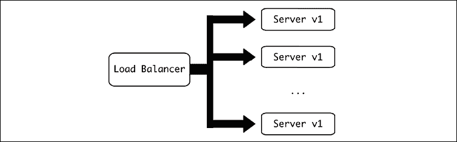
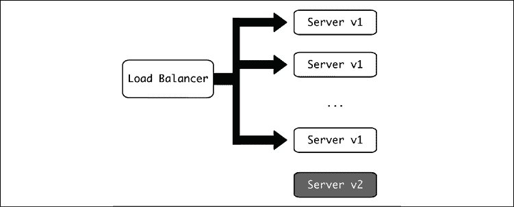
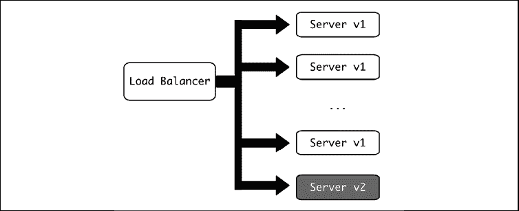
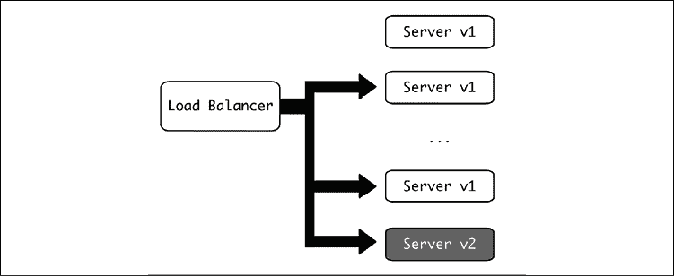
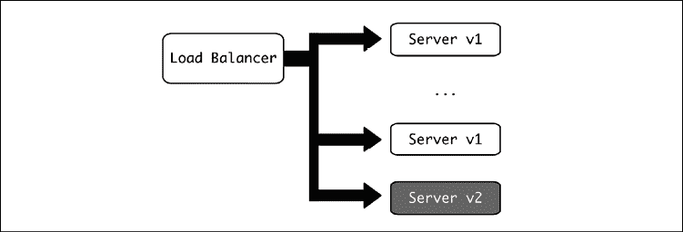
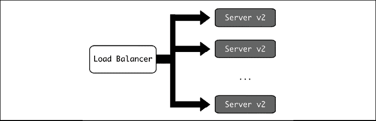

# 第十六章：持续架构

正如软件本身永远不会真正完成一样，软件架构也永远不会是一项完成的工作。总会有变化、调整和微调需要执行，以改进系统：添加新功能；提高性能；修复安全问题。虽然良好的架构要求我们深入了解如何设计系统，但持续过程的现实更多是关于进行更改和改进。

在本章中，我们将讨论这些方面的某些内容，以及处理在实际运行系统中进行变更的一些技术和想法，同时考虑到这个过程可以通过反思执行过程并遵循一些指南来进一步改进，以确保系统可以持续变更，同时同时保持对客户的服务。

在本章中，我们将涵盖以下主题：

+   调整架构

+   计划停机时间

+   事件

+   压力测试

+   版本控制

+   向后兼容性

+   功能标志

+   变更的团队合作方面

让我们先看看为什么要对系统的架构进行更改。

# 调整架构

虽然在这本书的大部分内容中，我们一直在谈论系统设计，这是建筑师的基本职能，但很可能他们的大部分日常工作将更多地集中在重新设计上。

这总是一项永无止境的任务，因为工作软件系统始终处于修订和扩展中。可能需要调整系统架构的一些原因如下：

+   提供之前不可用的某些功能或特性——例如，添加一个事件驱动的系统来运行异步任务，使我们能够避免之前可用的请求-响应模式。

+   因为当前架构存在瓶颈或限制。例如，系统中只有一个数据库，并且对可以运行的查询数量有限制。

+   随着系统的发展，可能有必要将部分内容分割，以便更好地控制它们——例如，将单体分割成微服务，正如我们在第八章“高级事件驱动结构”中看到的。

+   为了提高系统的安全性——例如，删除或编码可能敏感的存储信息，如电子邮件地址和其他**个人身份信息**（**PII**）。

+   大型 API 变更，如引入 API 的新版本，无论是内部还是外部。例如，添加一个新端点，它更适合其他内部系统执行某些操作，调用服务应迁移。

+   存储系统的变化，包括我们在第三章“数据建模”中讨论的关于分布式数据库的所有不同想法。这也可以包括添加或替换现有的存储系统。

+   为了适应过时的技术。这可能在具有关键组件不再受支持的遗留系统中发生，或者存在根本的安全问题。例如，用一个能够使用新安全流程的模块替换旧的模块，因为旧的不再维护，并且依赖于旧的加密方法。

+   使用新语言或技术的重写。这可以在某个系统最初是用不同的语言创建的情况下进行，过了一段时间后，决定将其与最常用的语言保持一致，以便更好地维护。这种情况在经历过增长的组织中很典型，某个时候，一个团队决定使用他们最喜欢的语言来创建一个服务。过了一段时间，这可能会因为缺乏这种语言的专长而使维护复杂化。如果原始开发者已经离开组织，情况可能会更糟。最好是调整或重写服务，将其集成到现有的服务中，或者用首选语言中的等效服务替换它。

+   其他类型的债务——例如，可以清理代码并使其更易读的重构，或者为了更精确地更改组件名称等。

这些只是些例子，但事实是，所有系统都需要不断的更新和调整，因为软件很少是完成的工作。

挑战不仅在于设计这些更改以实现预期的结果，而且还要以最小的系统中断从起点移动到终点。如今，人们期望在线系统很少中断，这对任何更改都设定了很高的标准。

要实现这一点，需要逐步进行更改，并格外小心，确保系统在所有时刻都可用。

# 计划中的停机时间

理想情况下，系统在做出更改后不应出现中断，但有时在不中断系统的情况下进行重大更改是不可能的。

何时以及是否有必要停机可能很大程度上取决于系统。例如，在运营的前几年，流行的网站 Stack Overflow ([`stackoverflow.com/`](https://stackoverflow.com/)) 经常出现停机，最初甚至每天，在欧洲上午时段网页会显示“*维护中*”页面。这种情况最终有所改变，现在很少看到这种信息。

但在项目的早期阶段，这是可以接受的，因为大部分用户都按照北美时间使用网站，而且它（现在仍然是）一个免费网站。

安排停机始终是一个选择，但代价高昂，因此需要以最小化对运营影响的方式进行设计。如果系统是一个对客户至关重要的 24x7 服务，或在运行时为业务产生收入（例如，商店），任何停机都将有一个相当大的价格标签。

在其他情况下，例如一个流量非常小的新服务，客户可能会更加理解，甚至有很大可能不受影响。

应提前通知受影响的客户计划内停机。这种通知可以采取多种形式，并将很大程度上取决于服务类型。例如，一个公共网络商店可能会在星期内通过页面上的一条横幅宣布停机，告知星期日上午将不可用，但为银行操作安排停机可能需要提前数月通知和协商最佳时间。

如果可能的话，定义维护窗口以明确设定服务可能或将有某种中断高风险的时间是一个好习惯。

## 维护窗口

维护窗口是提前通知可能进行维护的时段。其目的是在维护窗口之外保证系统的稳定性，并明确分配可能进行维护的时间。

维护窗口可能是在系统最活跃时区的周末或夜间。在活动最繁忙的小时内，服务保持不间断，只有在无法等待时，例如防止或修复关键事件时，才会进行维护。

维护窗口不同于计划内停机。虽然在某些情况下会发生，但并非每个维护窗口都需要涉及停机——只是有可能发生。

并非每个维护窗口都需要同等定义——有些可能比其他更安全，能够进行更广泛的维护。例如，周末可能被预留为计划内停机时间，但工作周中的夜晚可能进行常规部署。

提前通知维护窗口非常重要，例如设计如下表格：

| 日期 | 时间 | 维护窗口类型 | 风险 | 备注 |
| --- | --- | --- | --- | --- |
| 周一到周四 | 08:00 – 12:00 UTC | 定期维护 | 低风险 | 考虑到常规部署被认为是低风险。对服务无影响。 |
| 星期六 | 08:00 – 18:00 UTC | 严重维护 | 高风险 | 考虑到调整被认为是风险较高的。虽然预期服务将完全可用，但在窗口期间可能会在某些时候中断。 |
| 星期六 | 08:00 – 18:00 UTC | 通知计划内停机 | 服务不可用 | 提前一个月通知。进行需要服务不可用的基本维护。 |

关于维护窗口的一个重要细节是，它们应该足够大，以便有足够的时间进行维护。请确保时间充足，因为设置一个大的维护窗口，可以安全地应对任何突发情况，比设置一个短的窗口并经常需要延长要好。

虽然计划中的停机时间和维护窗口有助于界定服务活跃的时间和用户风险较高的时间，但仍然可能出现一些问题，导致系统出现问题。

# 事件

不幸的是，在系统的某个阶段，系统可能不会按预期运行。它将产生一个重要的错误，需要立即处理。

事件被定义为一种足以干扰服务并需要紧急响应的问题。

这并不一定意味着完整的服务完全中断——它可能是外部服务的明显退化，甚至是一个内部服务的问题，导致整体服务质量下降。例如，如果一个异步任务处理器有 50%的失败率，外部客户可能只会注意到他们的任务执行时间更长，但这可能已经足够重要，需要采取纠正措施。

在事件发生期间，使用所有可用的监控工具至关重要，以便尽快找到问题并能够纠正它。反应时间应尽可能快，同时将纠正措施的风险降到最低。这里需要找到一个平衡点，根据事件性质的不同，可以采取更具风险性的行动，例如当系统完全宕机时，恢复系统将更为重要。

事件期间恢复通常会受到两个因素的制约：

+   监控工具在检测和理解问题方面的好坏

+   系统中引入变更的速度，与更改参数或部署新代码的速度相关

上述第一点是*理解*部分，第二点是*解决*部分（尽管可能需要做出改变以更好地理解问题，正如我们在*第十四章*，*性能分析*中看到的）。

我们在书中涵盖了这两个方面，其中可观测性工具在*第十一章*，*包管理*和*第十二章*，*日志记录*中进行了考察。我们也可能需要使用*第十四章*，*性能分析*中描述的技术。

向系统中引入变更与我们在*第四章*，*数据层*中讨论的**持续集成**（**CI**）技术紧密相关。一个快速的 CI 管道可以显著缩短新代码准备部署的时间。

这就是为什么这两个元素，可观察性和进行更改所需的时间，如此重要的原因。在正常情况下，部署或进行更改需要很长时间通常只是轻微的不便，但在关键情况下，它可能会阻碍有助于系统恢复健康的修复。

对事件的反应是一个复杂的过程，需要灵活性和即兴发挥，这些能力会随着经验而提高。但同时也需要有一个持续的过程来提高系统的正常运行时间和理解系统的最薄弱环节，以避免问题或最小化它们。

## 事后分析

*事后分析*，也称为事后审查，是在问题影响服务后进行的分析。其目标是了解发生了什么，为什么，并采取纠正措施以确保问题不再发生，或者至少减少其影响。

通常，一个事后分析是从参与问题纠正的人员填写模板表单开始的。预先定义模板有助于塑造讨论并专注于要执行的补救措施。

在线上有许多事后分析模板可供搜索，你可以看看是否有你喜欢的特定模板，或者只是为了获取灵感。与其他流程部分一样，它应该随着过程的进行而改进和精炼。记住要创建和调整你自己的模板。

基本模板应该从发生的主要细节开始，包括**发生了什么**，然后是**为什么会发生**，最后是最重要的部分：为了纠正问题，**接下来应该采取哪些行动**？

记住，事后分析是在事件结束后进行的。虽然可以在事件发生时做一些笔记，但事件发生时的重点是首先解决问题。首先关注最重要的事情。

例如，一个简单的模板可以是以下这样：

事件报告

1.  **摘要**。对发生事件的简要描述。

    *示例:* 服务在 11 月 5 日的 08:30 至 09:45 UTC 之间中断。

1.  **影响**。描述问题的外部影响。外部用户受到了怎样的影响？

    *示例:* 所有用户请求都返回了 500 错误。

1.  **检测**。描述最初是如何检测到的。是否可以更早地检测到？

    *示例:* 监控系统在 8:35 UTC 时发出警报，这是在 100%错误请求持续了 5 分钟后。

1.  **响应**。为纠正问题所采取的行动。

    *示例:* 约翰清理了数据库服务器的磁盘空间并重启了数据库。

1.  **时间线**。事件的时间线，以了解事件是如何发展和每个阶段持续了多长时间。

    *示例:*

    8:30 问题开始。

    8:35 监控系统触发了一个警报。约翰开始调查这个问题。

    8:37 发现数据库无响应且无法重启。

    9:05 经过调查，约翰发现数据库磁盘已满。

    9:30 数据库服务器中的日志已填满服务器磁盘空间，导致数据库服务器崩溃。

    9:40 从服务器中移除旧日志，释放磁盘空间。数据库重启。

    9:45 服务恢复正常。

1.  **根本原因**。对已识别的根本原因的描述，如果修复，将完全消除这个问题。

    检测根本原因并不一定容易，因为有时会涉及一系列事件。为了帮助找到根本原因，可以使用“五问法”。开始描述影响并询问为什么会发生。然后问为什么会这样，依此类推。继续迭代，直到问“为什么？”五次，最终的结果将是根本原因。不要理解为“必须”问“为什么？”正好五次，但要继续进行，直到得到一个明确的答案。

    考虑到调查可能超出在事件期间恢复服务所采取的步骤，快速修复可能已经足够摆脱困境。

    *示例*：

    服务器返回错误。*为什么*？

    *因为*数据库崩溃了。*为什么*？

    *因为*数据库服务器空间不足。*为什么*？

    *因为*空间已经被木材完全填满。*为什么*？

    *因为*磁盘上的日志空间没有限制，可以无限增长。

1.  **经验教训**。在过程中可以改进的事情，以及任何其他做得好的元素，比如在分析问题时使用某些有用的工具或指标。

    *示例*：

    在所有情况下，都应该限制日志使用的磁盘空间量。

    在磁盘空间完全耗尽之前，并没有监控或发出警报。

    警报系统太慢，需要达到较高错误率才会发出警报。

1.  **下一步行动**。过程最重要的部分。描述应该执行哪些操作来消除问题，如果不可能消除，则减轻问题。确保这些操作有明确的负责人，并得到跟进。

如果有票务系统，这些操作应转换为票务，并相应地优先处理，以确保适当的团队实施它们。

不仅应该解决根本原因，还应该解决在经验教训部分中发现的任何可能的改进。

*示例*：

操作：启用日志轮转，限制所有服务器中日志所占用的空间，从数据库开始。分配给运维团队。

操作：监控磁盘空间并发出警报，如果磁盘空间小于总可用空间的 20%，以便更快地做出反应。分配给运维团队。

操作：调整错误警报，将其改为当 30%或更多请求返回错误时只有一分钟时发出警报。分配给运维团队。

注意，模板不必一次性填写完成。通常，模板会尽可能填写，然后举行一次事后会议，届时可以对事件进行分析，并完全填写模板，包括*下一步行动*部分，这又是分析中最重要的部分。

请记住，事后流程的重点是改进系统，而不是对问题进行归责。流程的目标是发现弱点，并尽量确保问题不会重复。

在近年来的重要事件之前，已经实施了一个等效的过程来尝试预见问题。

## 预死亡分析

*预死亡分析*是一种尝试在重要事件之前分析可能出错的事情的练习。事件可能是某个里程碑、发布活动或类似的事情，预计将显著改变系统的条件。

“*预死亡分析*”这个词是一个相当有趣的术语，它来自“*事后分析*”的使用，作为一种指代事后进行的分析的方式，与尸检进行类比。尽管希望没有什么已经死亡！。

它也可以被称为*准备分析*。

例如，可能会有一个营销活动启动，预计将使流量增加到之前的两倍或三倍。

预死亡分析是事后分析的相反。你将你的心态设定在将来，并问：*出了什么问题？* *最坏的情况是什么？* 从那里，你验证你对系统的假设，并为它们做好准备。

考虑对上述示例中系统流量增加三倍的分析。我们能否模拟条件以验证我们的系统是否已准备好应对？我们认为系统的哪些部分比较脆弱？

所有这些都可以导致对不同场景的规划，并运行测试以确保系统为事件做好准备。

在进行任何预死亡分析时，请确保有足够的时间执行必要的行动和测试来准备系统。像往常一样，行动将需要优先排序，以确保时间得到充分利用。但请记住，这种准备可能是一个无休止的任务，而且时间有限，因此需要集中在系统最重要的或最敏感的部分。确保尽可能多地使用数据驱动的行动，并将分析集中在真实数据而不是直觉上。

# 压力测试

在这种情况下，准备的关键要素是*压力测试*。

压力测试是指创建一个模拟增加流量的负载。它可以以探索性的方式进行，即让我们找出我们系统的极限；或者以确认性的方式进行，即让我们再次确认我们能否达到这个流量水平。

负载测试通常不在生产环境中进行，而是在预生产环境中进行，复制生产中的配置和硬件，尽管通常需要创建一个最终的负载测试来验证生产环境中的配置是正确的。

在云环境中进行负载测试分析的一个有趣的部分是确保系统中的任何自动扩展都能正确工作，以便在接收更大负载时自动提供更多硬件，并在不需要时删除它。这里需要谨慎，因为每次运行到集群最大容量时的完全负载测试可能都很昂贵。

负载测试的基本元素是模拟典型用户在系统上执行操作。例如，一个典型用户可以登录，查看几个页面，添加一些信息，然后登出。我们可以使用工作在我们外部界面的自动化工具来复制这种行为。

使用这些工具的一个好方法是重用任何可以创建的自动化测试，并将其作为模拟的基础。这使得集成或系统测试框架成为启用负载测试的单位。

然后，我们可以将模拟单个用户行为的单元多次乘以，以模拟`N`个用户的效果，产生足够的负载来测试我们的系统。

为了简单起见，最好使用一个单一的模拟，它作为用户典型行为的组合来工作，而不是尝试生成多个更小的模拟来复制不同的用户。

正如我们之前所说的，在这些情况下，使用一些系统测试来锻炼系统的主体部分效果非常好，一旦你确认行为与系统中的典型情况兼容。

如果有必要，或者要进行微调，可以通过分析日志来生成用户执行的典型接口的适当配置文件。记住，在可能的情况下要依赖数据。然而，当没有可靠数据时，有时需要进行负载测试，因为它们通常在新功能引入时进行，所以必须使用估计值。

记得监控每个模拟的结果，特别是错误。这将有助于检测可能的问题。负载测试也锻炼了系统的监控，因此它是检测弱点并改进它们的好练习。

负载测试越密集，它们能捕获的问题就越多。然后我们可以在实际流量中避免这些问题。

请记住，创建负载也可能有自己的瓶颈。为了乘以模拟，可能需要使用多个服务器，并确保网络能够支持流量。

通过多次启动进程，可以直接对模拟进行乘法。虽然这个程序很简单，但非常有效，可以用简单的脚本来控制。它还具有灵活性，模拟可以是任何类型的进程，包括使用任何现有软件进行的调整后的系统测试。这加快了负载测试的准备，并建立了对模拟准确性的信任，因为它重用了之前已经测试过的现有软件。

也可以使用针对常见用例（如 HTTP 接口）的特定工具，例如 Locust ([`locust.io/`](https://locust.io/))。这个工具允许我们创建一个网络会话，模拟用户访问系统。Locust 的巨大优势在于它已经内置了报告系统，并且可以以最小的准备进行扩展。然而，它需要显式创建一个新的会话来进行负载测试，并且只能与 Web 接口一起工作。

负载测试也应旨在在生产集群中创建一些余量，以便验证负载始终处于控制之下，即使在增长的情况下也是如此，而不是在常规操作中寻找瓶颈，这可能会导致事件发生。

# 版本控制

当对任何服务进行更改时，需要建立一个系统来跟踪不同的更改。这样，我们就可以了解何时部署了什么，以及与上周相比有什么变化。

当你面临事件时，这些信息非常有用。在系统中，最危险的时刻之一就是有新的部署，因为新代码可能会产生新的问题。由于新版本的发布而产生事件并不罕见。

*版本控制*意味着为每个服务或系统分配一个唯一的代码版本。这使得理解已部署的软件以及追踪从一个版本到另一个版本的变化变得容易。

版本号通常在源代码控制系统中在特定点分配，以精确跟踪该特定点的代码。拥有定义明确的版本的目的，是为了对具有唯一版本号的代码有一个精确的定义。适用于代码多个迭代的版本号是无用的。

版本号是在讨论同一项目的不同快照时，关于代码差异的沟通。它们的主要目的是沟通并允许我们了解软件如何演变，不仅是在团队内部，而且在外部也是如此。

传统上，版本与打包软件高度相关，并且销售在盒子中的软件的不同版本是营销版本。当需要内部版本时，使用了一个*构建号*，这是一个基于软件编译次数的连续数字。

版本不仅可以应用于整个软件，还可以应用于其元素，如 API 版本、库版本等。同样，可以为同一软件使用不同的版本，例如为技术团队创建内部版本，为营销目的创建外部版本。

例如，某些软件可能以“Awesome Software `v4`”出售，API 为`v2`，而内部描述为构建号`v4.356`。

在现代软件中，由于发布频繁且版本需要经常更改，这种方法是不够的，因此创建了不同的版本模式。最常见的是*语义版本控制*。

我们在*第二章*，*API 设计*中讨论了语义版本控制，但这个话题很重要，值得重复。请注意，这个概念可以同时用于 API 和代码发布。

语义版本控制使用两个或三个由点分隔的数字。可以添加可选的`v`前缀来明确它指的是版本：

```py
`vX.Y.Z` 
```

第一个数字（`X`）被称为主版本。第二个（`Y`）是次要版本，最后一个数字（`Z`）是补丁版本。这些数字在新版本生成时增加：

+   主版本的增加表示该软件与先前存在的软件不兼容。

+   次要版本的增加意味着这个版本包含新功能，但它们不会破坏与旧版本的兼容性。

+   最后，补丁版本的增加仅涵盖错误修复和其他改进，如安全补丁。它修复了问题，但不会改变系统的兼容性。

请记住，增加主版本号也可能标记出通常出现在次要版本更新中的变化。主版本号的变化可能会带来新功能和重大改进。

这种版本控制的一个很好的例子是 Python 解释器本身：

+   Python 3 是主版本的增加，因此，Python 2 的代码需要在 Python 3 下进行更改才能运行

+   Python 3.9 与 Python 3.8 相比引入了新功能，例如，字典的新联合操作符

+   Python 3.9.7 在之前的补丁版本上增加了错误修复和改进

语义版本控制非常流行，尤其是在处理 API 和将要外部使用的库时特别有用。它仅从版本号就能清楚地预期到新变化的内容，并在添加新功能时提供清晰性。

这种版本控制方法，尽管如此，可能对某些项目来说过于限制性，尤其是对于内部接口。因为它通过小迭代来保持兼容性，只在它们过时后才废弃功能，所以它更像是一个始终在演变的窗口。因此，引入一个有意义的特定版本是困难的。

例如，Linux 内核决定由于这个原因放弃使用语义版本控制，决定新的大版本将很小，不会改变事物，并且不会携带任何特定的意义：[`lkml.iu.edu/hypermail/linux/kernel/1804.1/06654.html`](http://lkml.iu.edu/hypermail/linux/kernel/1804.1/06654.html)。

当与内部 API 一起工作时，尤其是与经常更改且被组织其他部分使用的微服务或内部库一起工作时，放宽规则会更好，同时使用类似于语义版本控制的方法，只是将其用作一种通用工具，以一致的方式增加版本号，以提供对代码更改的理解，但不必强制在主版本或次版本中做出更改。

然而，当通过外部 API 进行通信时，版本号不仅具有技术意义，还具有营销意义。使用语义版本控制可以提供对 API 能力的强烈保证。

由于版本控制非常重要，一个好的想法是允许服务通过特定的端点如`/api/version`或另一种易于访问的方式自行报告其版本号，以确保它清晰且可以被其他依赖服务检查。

请记住，即使系统的不同组件具有自己的独立版本，也可以创建整个系统的一般版本。然而，在在线服务的情况下，这可能很棘手或毫无意义。相反，重点应放在保持向后兼容性上。

# 向后兼容性

在运行系统中更改架构的关键方面是始终在其接口和 API 中保持向后兼容性的必要性。

我们还在*第三章*，*数据建模*中讨论了关于数据库更改的向后兼容性。在这里，我们将讨论接口，但遵循相同的思想。

向后兼容性意味着系统保持其旧接口按预期工作，因此任何调用系统都不会受到更改的影响。这允许它们在任何时候升级，而不会中断服务。

请记住，向后兼容性需要在外部应用，因为客户依赖于稳定的接口，但同时也需要在内部应用，因为多个服务相互交互。如果系统复杂且具有多个部分，连接它们的 API 应该是向后兼容的。这在微服务架构中尤为重要，以允许独立部署微服务。

这个概念相当简单，但它对如何设计和实施更改有影响：

+   变更应始终*是累加的*。这意味着它们*添加*选项，而不是删除它们。这使得任何现有的系统调用都能继续使用现有的功能和选项，而不会破坏它们。

+   移除选项应极其谨慎，并且只有在确认它们不再被使用后才能进行。为了能够检测到这一点，我们需要调整监控，以便我们有真实的数据，可以清楚地提供可靠的数据，使我们能够确定这一点。

对于外部接口，可能几乎不可能移除任何选项或端点，尤其是在 API 上。除非有充分的理由，否则客户不想改变现有的系统以适应任何变化，即使在这种情况下，也需要大量的工作来充分沟通。我们将在本章后面讨论这种情况。

网络界面允许更大的灵活性，因为它们是由人类手动使用的。

+   即使是在外部可访问的 API 中进行增量更改也很困难。外部客户倾向于记住 API 的当前状态，因此更改现有调用的格式可能很困难，即使只是添加一个新字段。

    这取决于使用的格式。在 JSON 对象中添加一个新字段比更改需要事先定义的 SOAP 定义更安全。这也是 JSON 如此受欢迎的原因之一——因为它在定义返回的对象方面具有灵活性。

    尽管如此，对于外部 API，如果必要，添加新的端点可能更安全。API 更改通常分阶段进行，创建 API 的新版本，并试图鼓励客户切换到新的更好的 API。这些迁移可能非常漫长和艰巨，因为外部用户将需要明显的优势才能说服他们在自己的端进行改变。

一个很好的例子是 API 变化可能有多么痛苦，就是从 Python 2 迁移到 Python 3。Python 3 自 2008 年以来就已经可用，但需要很长时间才能获得任何形式的吸引力，因为用 Python 2 编写的程序需要被更改。迁移过程相当漫长，甚至到了最后 Python 2 解释器（Python 2.7）从 2010 年的首次发布一直支持到 2020 年。即使有这样一个漫长的过程，遗留系统中仍然有使用 Python 2 的代码。这表明，如果不尊重向后兼容性，从一个 API 迁移到另一个 API 是非常困难的。

+   现有的测试，无论是单元测试还是集成测试，都是确保 API 向后兼容的最佳方式。本质上，任何新功能都应该没有问题地通过测试，因为旧的行为不会改变。对 API 功能的良好测试覆盖是维护兼容性的最佳方式。

在外部接口中引入变化更为复杂，通常需要定义更严格的 API 和更慢的变化速度。内部接口允许更大的灵活性，因为它们的变化可以通过增量方式在组织内部进行沟通，从而允许在不中断服务的情况下进行适应。

## 增量变化

对系统的增量更改，缓慢地变异和调整 API，可以按顺序与多个服务一起发布。但更改需要按顺序应用，并考虑向后兼容性。

例如，假设我们有两个服务：服务 A 生成一个显示参加考试的学生界面的接口，并调用服务 B 来获取考生的名单。这是通过调用一个内部端点来完成的：

```py
GET /examinees (v1)

[

    {

         "examinee_id": <student id>,

         "name": <name of the examinee>

    }, …

] 
```

服务 A 需要引入一个新功能，该功能需要从考生那里获取额外信息，并需要我们知道每个考生尝试特定考试的次数，以便根据该参数对他们进行适当的排序。使用当前信息，这是不可能的，但服务 B 可以被调整以返回该信息。

为了做到这一点，API 需要被扩展，以便返回该信息：

```py
GET /examinees (v2)

[

    {

         "examinee_id": <student id>,

         "name": <name of the examinee>,

         "exam_tries", <num tries>

    }, …

] 
```

只有在这次更改得到正确实施并部署后，服务 A 才能使用它。这个过程发生在以下阶段：

1.  初始阶段。

1.  使用`/examinees (v2)`部署服务 B。注意服务 A 将忽略额外的字段并正常工作。

1.  部署读取和使用新参数`exam_tries`的服务 A。

所有步骤都是稳定的。在整个过程中，服务没有问题，因此不同服务之间存在分离。

这种分离很重要，因为如果部署出现问题，它可以被撤销，并且只影响单个服务，可以快速恢复到之前稳定的状态，直到问题得到解决。最糟糕的情况是同时需要发生两个服务变更，因为一个服务的失败将影响另一个服务，并且撤销情况可能并不容易。更糟糕的是，问题可能存在于它们之间的交互中，在这种情况下，不清楚哪个是责任人，因为可能是两者都有可能。保持小而独立的步骤非常重要，每个步骤都应该是稳固和可靠的。

这种操作方式使我们能够实施更大的更改，例如，重命名字段。假设我们不喜欢`examinee_id`字段，并希望将其更改为更合适的`student_id`。过程将如下所示：

1.  更新返回的对象，包括一个名为`student_id`的新字段，复制服务 B 中的先前值：

    ```py
    GET /examinees (v3)

    [

        {

             "examinee_id": <student id>,

             "student_id": <student id>,

             "name": <name of the examinee>,

             "exam_tries", <num tries>

        }, …

    ] 
    ```

1.  更新并部署服务 A 以使用`student_id`而不是`examinee_id`。

1.  在可能调用服务 B 的其他服务中也进行相同的操作。

    使用监控工具和日志来验证这一点！

1.  从服务 B 中删除旧字段并部署服务：

    ```py
    GET /examinees (v3)

    [

        {

             "examinee_id": <student id>,

             "student_id": <student id>,

             "name": <name of the examinee>,

             "exam_tries", <num tries>

        }, …

    ] 
    ```

1.  从服务 B 中删除旧字段并部署服务。

这一步在技术上不是必需的，尽管出于维护原因删除 API 中的冗余内容会更好。但现实中的日常工作意味着它可能仍然存在，只是不再被访问。需要在保持现状的便利性和维护一个干净、更新的 API 之间找到良好的平衡。

这说明了我们如何在不停机的情况下部署更改，从部署的*内容*方面来说。但是，我们如何确保在部署新版本时服务始终可用？

## 无中断部署

为了允许在不停机的情况下进行持续发布，我们需要在服务仍然响应时部署向后兼容的更改。

要做到这一点，最佳盟友是负载均衡器。

我们在*第五章*、*十二要素应用方法学*和*第八章*、*高级事件驱动结构*中讨论了负载均衡器。它们非常有用！

成功平稳部署的过程需要更新服务的多个实例，如下所示：

我们将假设我们使用的是可以轻松创建和销毁的云实例或容器。请记住，可以将它们视为在单个服务器内部充当负载均衡器的 nginx 或其他类型的网络服务器下的工作者。这就是`nginx reload`命令的工作方式。

1.  这是初始阶段，所有实例都使用要更新的服务的版本 1：

    图 16.1：起点

1.  创建了一个带有服务 2 的新实例。请注意，它尚未添加到负载均衡器中。

    图 16.2：创建的新服务器

1.  新版本已添加到负载均衡器中。目前，请求可以指向版本 1 或版本 2。如果我们遵循向后兼容的原则，则这不应该引起任何问题。

    图 16.3：包含在负载均衡器中的新服务器

1.  为了保持实例数量不变，需要移除一个旧实例。谨慎的做法是首先在负载均衡器中禁用旧实例，这样就不会有新的请求被处理。在服务完成所有已进行的请求后（记住，不会向此实例发送新的请求），实例实际上被禁用，可以从负载均衡器中完全移除。

    图 16.4：从负载均衡器中移除旧服务器

1.  可以销毁/回收旧实例。

    图 16.5：旧服务器已被完全移除

1.  可以重复此过程，直到所有实例都达到版本 2。

图 16.6：所有新服务器的最终阶段

有工具可以让我们自动执行此过程。例如，Kubernetes 在向容器推出更改时会自动执行此操作。我们还看到，像 nginx 或 Apache 这样的网络服务也会这样做。但是，在需要不寻常用例时，也可以手动执行或通过开发自定义工具来执行此过程。

# 功能标志

特性标志的想法是在配置更改下隐藏尚未准备好发布的功能。遵循小步增量快速迭代的原理，使得创建像新用户界面这样的大型变更变得不可能。

更进一步的是，这些大型变更可能会与其他变更并行发生。没有机会推迟整个发布过程 6 个月或更长时间，直到新用户界面正确工作。

创建一个长期存在的独立分支也不是一个好的解决方案，因为合并这个分支会变成一场噩梦。长期存在的分支难以管理，并且总是难以协作。

一个更好的解决方案是创建一个配置参数来激活或停用此特性。然后，该特性可以在特定环境中进行测试，而所有开发工作都以相同的速度继续。

这意味着其他变更，如错误修复或性能改进，仍在进行中并被部署。对大型新功能的工作也像往常一样频繁地合并到主分支。这意味着大型新功能已开发的部分也被发布到生产环境中，但它们尚未激活。

测试需要确保两种选项——特性激活和停用——都能正确工作，但以小步增量工作使得这相对容易。

特性将会以小步增量开发，直到准备好发布。最后一步就是通过配置更改简单地启用它。

注意，该特性可能对某些用户或环境是活跃的。这就是测试 beta 特性的方式：它们依赖于某些用户在完全发布之前能够访问该特性。最初，测试用户可能是组织内部的，如 QA 团队、经理、产品负责人等，他们可以提供关于特性的反馈，但使用生产数据。

这种技术使我们能够在不牺牲对它的微小增量方法的情况下，增强信心并发布大型特性。

# 变更的团队合作方面

软件架构不仅关乎技术，其中一部分高度依赖于沟通和人文因素。

在系统中实施变更的过程有一些影响团队合作的要素，需要考虑。

一些例子：

+   请记住，软件架构师的工作通常在于与多个团队进行沟通管理，这需要关注和具备在积极倾听团队的同时解释甚至协商设计变更的软技能。根据组织的规模，这可能具有挑战性，因为不同的团队可能有截然不同的文化。

+   组织中技术变革的步伐和接受程度与组织的文化（或亚文化）紧密相关。组织工作方式的变革通常发生得较慢，尽管能够快速改变技术的组织在调整组织范围内的变革方面往往更快。

+   同样，技术变革需要支持和培训，即使它完全在组织内部进行。在需要一些重大的技术变革时，确保有一个团队可以前往解决疑问和问题的联系人。许多问题可以通过解释为什么需要这种变革，并从这里着手来解决。

+   记得我们在*第一章，软件架构导论*中讨论康威定律时提到的软件架构的通信结构和架构结构之间的关系吗？一个方面的变化很可能会影响到另一个方面，这意味着足够大的架构变化将导致组织结构的重组，这本身也带来了一些挑战。

+   同时，变革可能会在受影响的团队中产生*赢家*和*输家*。一位工程师可能会感到威胁，因为他们将无法使用他们喜欢的编程语言。同样，他们的合作伙伴可能会感到兴奋，因为现在有机会使用他们喜欢的技术是令人难以置信的。

    在人员流动或创建新团队时，这个问题在团队重组时尤其尖锐。影响开发速度的一个重要因素是拥有一个高效的团队，而改变团队会影响他们的沟通和效率。这种影响需要被分析和考虑。

+   维护需要作为组织日常运营的一部分定期引入。定期的维护应包括所有安全更新，但也包括升级操作系统版本、依赖项等任务。

    处理这类常规维护的一般计划将提供清晰性和明确的期望。例如：在新版 LTS 发布后的三到六个月内将升级操作系统版本。这产生了可预测性，为遵循的明确目标，并使系统持续改进。同样，自动检测安全漏洞的工具使团队能够知道何时是时候升级代码或底层系统中的依赖项。

+   同样，技术债务的偿还需要作为一种习惯来引入，以确保系统健康。技术债务通常由团队自己发现，因为他们对它的理解最好，并且表现为代码变更速度的逐渐减慢。如果不解决技术债务，它将变得越来越复杂，使开发过程更加困难，并可能导致开发者的过度劳累。确保在失控之前留出时间来处理它。

作为一项一般性考虑，请记住，架构的变更需要由团队成员执行，并且信息需要正确传达和执行。与任何其他以沟通为重要组成部分的任务一样，这也带来了其自身的挑战和问题，因为与人们沟通，尤其是与多个人沟通，可以说是软件开发中最困难的任务之一。任何软件架构设计师都需要意识到这一点，并分配足够的时间以确保一方面能够充分传达计划，另一方面能够接收反馈并相应调整以获得最佳结果。

# 摘要

在本章中，我们描述了在开发和更改系统时保持系统运行的不同方面和挑战，包括其架构。

我们首先描述了架构可能需要调整和改变的不同方式。然后，我们继续讨论如何管理变更，包括在系统不可用的一段时间内进行变更的选项，并引入了维护窗口的概念，以清楚地传达对稳定性和变更的期望。

我们接下来讨论了当问题出现，系统出现问题时可能发生的不同情况。我们回顾了在发生此类事件后必要的持续改进和反思过程，并探讨了在风险增加的重大事件之前可以使用的准备流程，例如，由于预期增加系统负载的市场推动。

为了应对这种情况，我们接下来介绍了负载测试及其如何用于验证系统接受定义负载的能力，确保它准备好支持预期的流量。我们还讨论了创建版本控制系统的重要性，该系统能够清楚地传达当前部署的软件版本。

接下来，我们讨论了向后兼容性的关键方面以及它在确保小而快速的增量中的重要性，这些增量是持续改进和进步的关键。我们还讨论了功能标志如何帮助混合释放更大特征的过程，这些特征需要作为一个整体激活。

最后，我们描述了系统架构变化如何影响人类协作和沟通的不同方面，以及在进行系统变更时需要考虑这些因素，特别是在可能影响团队结构的变化，正如我们所看到的，这些变化往往会复制软件的结构。
