# 第七章：哈希和符号表

我们之前已经讨论过列表，其中项目按顺序存储并按索引号访问。索引号对计算机来说工作得很好。它们是整数，因此它们运行速度快且易于操作。然而，它们对我们来说并不总是那么有效。例如，如果我们有一个索引号为 56 的地址簿条目，这个数字并没有告诉我们太多。没有任何东西可以将特定的联系人与 56 号联系起来。它只是碰巧是列表中的下一个可用位置。

在本章中，我们将探讨一个类似的结构：字典。字典使用关键字而不是索引号。因此，如果那个联系人称之為*James*，我们可能会使用关键字*James*来定位联系人。也就是说，我们不是通过调用*contacts [56]*来访问联系人，而是使用*contacts ["james"]*。

字典通常使用哈希表构建。正如其名所示，哈希表依赖于一个称为**哈希**的概念。这就是我们将开始讨论的地方。

在本章中，我们将讨论以下主题：

+   哈希

+   哈希表

+   不同元素的函数

# 哈希

哈希是将任意大小的数据转换为固定大小数据的概念。更具体地说，我们将使用它将字符串（或可能的其他数据类型）转换为整数。这可能听起来比实际情况要复杂，让我们来看一个例子。我们想要对表达式`hello world`进行哈希，也就是说，我们想要得到一个数值，我们可以说是*代表*这个字符串的。

通过使用`ord()`函数，我们可以获取任何字符的序数值。例如，`ord('f')`函数给出 102。要获取整个字符串的哈希值，我们只需将字符串中每个字符的序数值相加：

```py
>>> sum(map(ord, 'hello world'))
1116

```

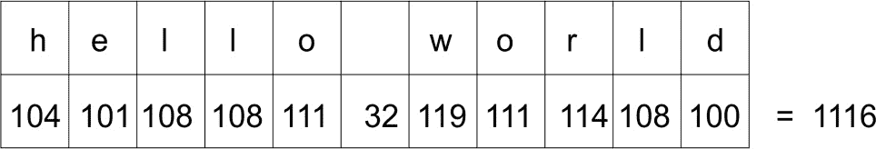

这没问题。然而，请注意，我们可以改变字符串中字符的顺序并得到相同的哈希值：

```py
>>> sum(map(ord, 'world hello'))
1116

```

并且字符串`gello xorld`的字符序数值之和也相同，因为`g`的序数值比`h`少一，而`x`的序数值比`w`多一，因此：

```py
>>> sum(map(ord, 'gello xorld'))
1116

```

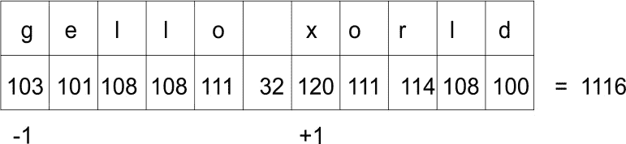

# 完美哈希函数

完美哈希函数是指每个字符串（因为我们现在限制讨论范围在字符串上）都保证是唯一的。在实践中，哈希函数通常需要非常快，因此尝试创建一个为每个字符串提供唯一哈希值的函数通常是不可能的。相反，我们接受有时会出现冲突（两个或更多字符串具有相同的哈希值）的事实，并且当这种情况发生时，我们会想出一个解决冲突的策略。

在此同时，我们至少可以想出一个避免一些冲突的方法。例如，我们可以添加一个乘数，使得每个字符的哈希值成为乘数值乘以字符的序数值。乘数随着我们遍历字符串而增加。这在上面的函数中显示：

```py
    def myhash(s): 
        mult = 1 
        hv = 0 
        for ch in s: 
            hv += mult * ord(ch) 
            mult += 1 
        return hv 

```

我们可以在我们之前使用的字符串上测试这个函数：

```py
    for item in ('hello world', 'world hello', 'gello xorld'): 
        print("{}: {}".format(item, myhash(item))) 

```

运行程序，我们得到以下输出：

```py
% python hashtest.py

hello world: 6736
world hello: 6616
gello xorld: 6742

```

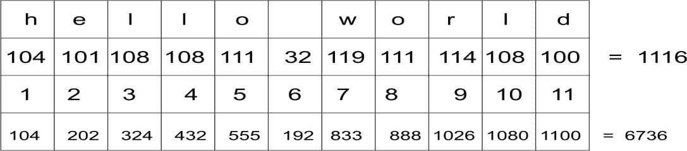

注意，最后一行是第 2 行和第 3 行值的乘积的结果，例如 104 x 1 等于 104。

这次我们得到了不同的哈希值。当然，这并不意味着我们有一个完美的哈希。让我们尝试字符串`ad`和`ga`：

```py
% python hashtest.py 
ad: 297
ga: 297

```

我们仍然得到了两个不同字符串相同的哈希值。正如我们之前所说的，这并不一定是个问题，但我们需要制定一个解决冲突的策略。我们将很快探讨这个问题，但首先我们将研究哈希表的一个实现。

# 哈希表

**哈希表**是一种列表形式，其中元素是通过关键字而不是索引号来访问的。至少，这是客户端代码将看到的样子。内部，它将使用我们修改过的哈希函数的略微不同版本来找到元素应该插入的索引位置。这使我们能够快速查找，因为我们使用的是与键的哈希值相对应的索引号。

我们首先创建一个类来存储哈希表项。这些项需要一个键和一个值，因为我们的哈希表是一个键值存储：

```py
    class HashItem: 
        def __init__(self, key, value): 
            self.key = key 
            self.value = value 

```

这为我们提供了一个非常简单的方式来存储项。接下来，我们开始着手实现哈希表类本身。像往常一样，我们从构造函数开始：

```py
    class HashTable: 
        def __init__(self): 
            self.size = 256 
            self.slots = [None for i in range(self.size)] 
            self.count = 0 

```

哈希表使用标准的 Python 列表来存储其元素。我们同样可以使用我们之前开发的链表，但现在的重点是理解哈希表，所以我们将使用我们手头可用的工具。

我们一开始将哈希表的大小设置为 256 个元素。稍后，我们将探讨如何随着表的填充增长表的大小。我们现在初始化一个包含 256 个元素的列表。这些元素通常被称为槽或桶。最后，我们添加一个计数器来记录我们拥有的实际哈希表元素数量：

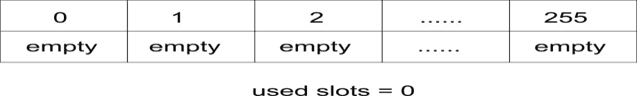

重要的是要注意表的大小和计数的区别。表的大小指的是表中的总槽位数（使用或未使用）。另一方面，表的计数仅指已填满的槽位数，或者换句话说，我们添加到表中的实际键值对的数量。

现在，我们将添加我们的散列函数到表中。它将类似于我们在散列函数部分所发展的，但有一点不同：我们需要确保我们的散列函数返回一个介于 1 和 256（表的大小）之间的值。这样做的一个好方法是返回散列除以表大小的余数，因为余数始终是一个介于 0 和 255 之间的整数值。

由于散列函数仅打算由类内部使用，我们在名称前加上下划线(`_`)来表示这一点。这是 Python 表示某物打算用于内部使用的正常约定：

```py
    def _hash(self, key): 
        mult = 1 
        hv = 0 
        for ch in key: 
            hv += mult * ord(ch) 
            mult += 1 
        return hv % self.size 

```

目前，我们将假设键是字符串。我们将在稍后讨论如何使用非字符串键。现在，请记住，`_hash()`函数将生成字符串的哈希值。

# 添加元素

我们使用`put()`函数向哈希表中添加元素，并使用`get()`函数检索。首先，我们将查看`put()`函数的实现。我们首先将键和值嵌入到`HashItem`类中，并计算键的哈希值：

```py
    def put(self, key, value): 
        item = HashItem(key, value) 
        h = self._hash(key) 

```

现在我们需要找到一个空槽位。我们从与键的哈希值相对应的槽位开始。如果那个槽位是空的，我们就将我们的项目插入那里。

然而，如果槽位不为空，并且项目的键与我们的当前键不同，那么我们就遇到了冲突。这就是我们需要想出处理冲突的方法的地方。我们将通过将前一个哈希值加一来实现这一点，并得到这个值除以哈希表大小的余数。这是一种解决冲突的线性方法，相当简单：


```py
    while self.slots[h] is not None: 
        if self.slots[h].key is key: 
            break 
        h = (h + 1) % self.size 

```

我们找到了插入点。如果这是一个新元素（即，它之前包含`None`），那么我们增加计数器一。最后，我们将项目插入到所需的列表位置：

```py
    if self.slots[h] is None: 
        self.count += 1 
    self.slots[h] = item  

```

# 获取元素

`get()`方法的实现应该返回与键相对应的值。我们还必须决定在键在表中不存在时应该做什么。我们首先计算键的哈希值：

```py
    def get(self, key): 
        h = self._hash(key)

```

现在，我们简单地从列表中查找具有我们正在搜索的键的元素，从具有传递的键的哈希值的元素开始。如果当前元素不是正确的，那么，就像在`put()`方法中一样，我们将前一个哈希值加一，并得到这个值除以列表大小的余数。这个值成为我们的新索引。如果我们找到一个包含`None`的元素，我们就停止查找。如果我们找到我们的键，我们就返回值：

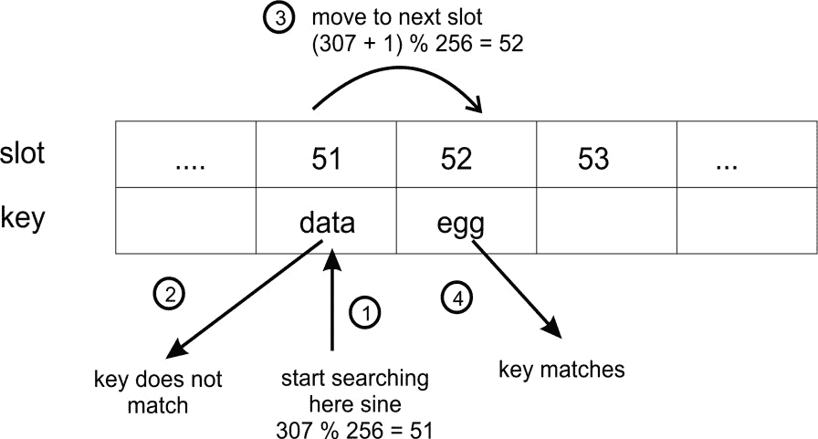

```py
        while self.slots[h] is not None: 
            if self.slots[h].key is key: 
                return self.slots[h].value 
            h = (h+ 1) % self.size 

```

最后，我们决定如果键在表中未找到时应该做什么。在这里，我们将选择返回`None`。另一个好的选择可能是抛出一个异常：

```py
        return None 

```

# 测试哈希表

为了测试我们的哈希表，我们创建了一个`HashTable`，在其中放入一些元素，然后尝试检索这些元素。我们还将尝试`get()`一个不存在的键。还记得我们通过哈希函数返回相同哈希值的两个字符串 ad 和 ga 吗？为了确保，我们将它们也加入其中，只是为了看看碰撞是否得到了适当的解决：

```py
    ht = HashTable() 
    ht.put("good", "eggs") 
    ht.put("better", "ham") 
    ht.put("best", "spam") 
    ht.put("ad", "do not") 
    ht.put("ga", "collide") 

    for key in ("good", "better", "best", "worst", "ad", "ga"): 
        v = ht.get(key) 
        print(v) 

```

运行此代码返回以下结果：

```py
% python hashtable.py 
eggs
ham
spam
None
do not
collide  

```

如你所见，查找键 worst 返回`None`，因为该键不存在。键`ad`和`ga`也返回它们对应的值，这表明它们之间的碰撞得到了处理。

# 使用哈希表中的[]

使用`put()`和`get()`方法看起来不太好。我们希望将我们的哈希表当作列表来处理，也就是说，我们希望能够使用`ht["good"]`而不是`ht.get("good")`。这可以通过特殊方法`__setitem__()`和`__getitem__()`轻松实现：

```py
    def __setitem__(self, key, value): 
        self.put(key, value) 

    def __getitem__(self, key): 
        return self.get(key) 

```

我们的可测试代码现在可以像这样：

```py
    ht = HashTable() 
    ht["good"] = "eggs" 
    ht["better"] = "ham" 
    ht["best"] = "spam" 
    ht["ad"] = "do not" 
    ht["ga"] = "collide" 

    for key in ("good", "better", "best", "worst", "ad", "ga"): 
        v = ht[key] 
        print(v) 

    print("The number of elements is: {}".format(ht.count)) 

```

注意，我们还打印了哈希表中的元素数量。这对于我们接下来的讨论很有用。

# 非字符串键

在大多数情况下，只使用字符串作为键更有意义。然而，如果需要，你可以使用任何其他 Python 类型。如果你创建了自己的类，并希望将其用作键，你可能需要覆盖该类的特殊`__hash__()`函数，以便获得可靠的哈希值。

注意，你仍然需要计算哈希值和哈希表大小的模（%）以获得槽位。这个计算应该在哈希表中发生，而不是在键类中，因为表知道它自己的大小（键类不应该了解它所属的表）。

# 扩展哈希表

在我们的例子中，哈希表的大小被设置为 256。显然，当我们向列表中添加元素时，我们开始填满空槽位。在某个时刻，所有的槽位都将被填满，表将满。为了避免这种情况，我们可以在表满时扩展表。

要做到这一点，我们比较大小和计数。还记得`size`保存了槽位的总数，而`count`保存了包含元素的槽位数量吗？好吧，如果`count`等于`size`，那么我们就填满了表。

哈希表的负载因子给我们提供了一个关于可用槽位中有多少部分被使用的指示。它定义如下：

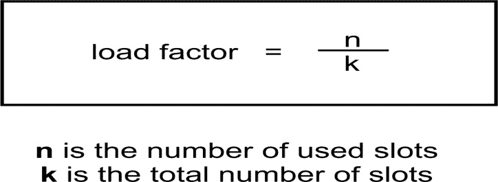

当负载因子接近 1 时，我们需要扩展表。实际上，我们应该在它到达那里之前就做这件事，以避免查找变得太慢。0.75 可能是一个增长表的好值。

下一个问题是如何确定表的增长量。一种策略是简单地加倍表的大小。

# 开放寻址

我们在示例中使用的冲突解决机制，线性探测，是开放寻址策略的一个例子。线性探测非常简单，因为我们使用固定的探测间隔。还有其他开放寻址策略，但它们都共享一个想法，即有一个槽位数组。当我们想要插入一个键时，我们会检查槽位是否已经有一个项目。如果有，我们会寻找下一个可用的槽位。

如果我们有一个包含 256 个槽位的哈希表，那么 256 是该哈希表中的最大元素数。此外，随着负载因子的增加，找到新元素插入点所需的时间会更长。

由于这些限制，我们可能更喜欢使用不同的策略来解决冲突，例如链接。

# 链接

链接是一种解决冲突和避免哈希表元素数量限制的策略。在链接中，哈希表的槽位被初始化为空列表：

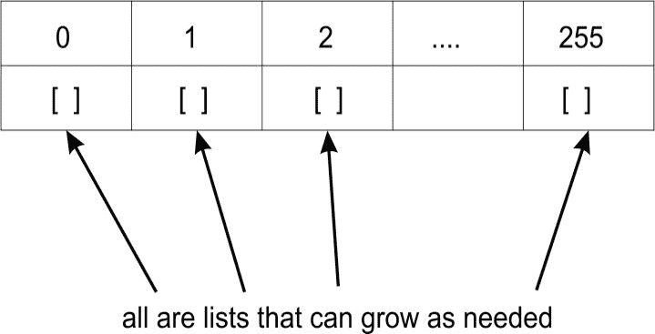

当一个元素被插入时，它将被添加到与该元素哈希值相对应的列表中。也就是说，如果你有两个元素，它们的哈希值都是 1167，这两个元素都将被添加到哈希表槽位 1167 中存在的列表中：

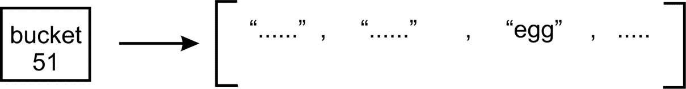

上述图示显示了一个具有哈希值 51 的条目列表。

链接通过允许多个元素具有相同的哈希值来避免冲突。它还避免了随着负载因子增加而插入的问题，因为我们不需要寻找槽位。此外，哈希表可以存储比可用槽位更多的值，因为每个槽位可以包含一个可以增长的列表。

当然，如果一个特定的槽位包含很多项，搜索它们可能会变得非常慢，因为我们不得不在列表中进行线性搜索，直到找到具有我们想要的关键字的元素。这可能会减慢检索速度，这并不好，因为哈希表旨在高效：

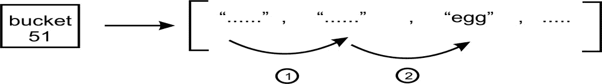

上述图示演示了通过列表项进行线性搜索，直到找到匹配项。

我们可以在表槽位中使用另一种允许快速搜索的结构。我们已经研究了**二叉搜索树**（BST）。我们可以在每个槽位中简单地放置一个（最初为空）BST：

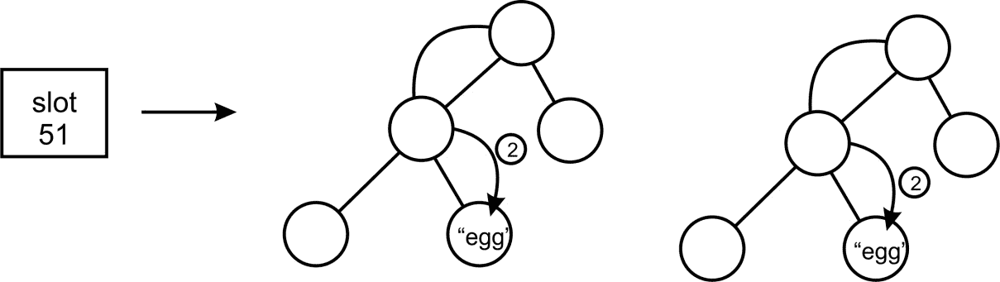

槽位 51 包含一个 BST，我们搜索该键。

但我们仍然可能遇到一个问题：根据项目添加到 BST 的顺序，我们可能会得到一个与列表一样低效的搜索树。也就是说，树中的每个节点恰好有一个子节点。为了避免这种情况，我们需要确保我们的 BST 是自平衡的。

# 符号表

符号表被编译器和解释器用来跟踪已声明的符号及其信息。由于在表中高效检索符号很重要，符号表通常使用哈希表构建。

让我们来看一个例子。假设我们有以下 Python 代码：

```py
    name = "Joe" 
    age = 27 

```

在这里，我们有两个符号，name 和 age。它们属于一个命名空间，这可能是一个`__main__`，也可能是你放置它的模块的名称。每个符号都有一个值；name 的值是`Joe`，age 的值是`27`。符号表允许编译器或解释器查找这些值。符号 name 和 age 成为我们哈希表中的键。与之相关的所有其他信息，如值，都成为符号表条目值的一部分。

不仅变量是符号，函数和类也是。它们都将被添加到我们的符号表中，以便当任何一个需要被访问时，它们都可以从符号表中访问：

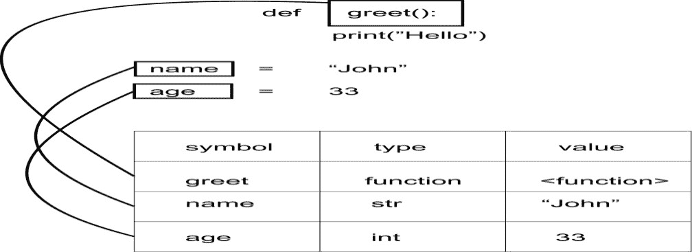

在 Python 中，每个被加载的模块都有自己的符号表。符号表被赋予该模块的名称。这样，模块充当命名空间。只要它们存在于不同的符号表中，我们可以有多个名为 age 的符号。要访问任何一个，我们通过适当的符号表来访问：

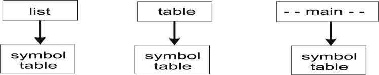

# 摘要

在本章中，我们研究了哈希表。我们研究了如何编写哈希函数将字符串数据转换为整数数据。然后我们研究了如何使用哈希键快速有效地查找与键相对应的值。

我们也注意到了哈希函数并不完美，有时几个字符串可能会得到相同的哈希值。这促使我们去研究冲突解决策略。

我们研究了哈希表的增长以及如何观察表的负载因子，以确定何时扩展哈希。

在本章的最后部分，我们研究了符号表，这些符号表通常使用哈希表构建。符号表允许编译器或解释器查找已定义的符号（变量、函数、类等），并检索有关它的所有信息。

在下一章中，我们将讨论图和其他算法。
