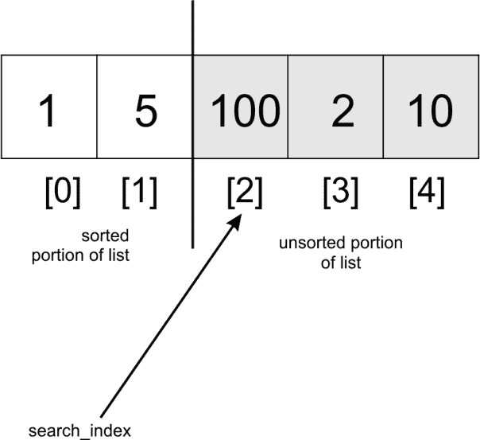

# 第十章：排序

每当收集数据时，总有需要对这些数据进行排序的时候。排序操作对所有数据集都是通用的，无论是姓名集合、电话号码还是简单的待办事项列表。

在本章中，我们将研究几种排序技术，包括以下内容：

+   冒泡排序

+   插入排序

+   选择排序

+   快速排序

+   堆排序

在我们处理这些排序算法时，我们将考虑它们的渐近行为。一些算法相对容易开发，但可能性能不佳。其他一些稍微复杂一些的算法将展现出令人印象深刻的性能。

排序后，对一组项目进行搜索操作变得容易得多。我们将从所有排序算法中最简单的一个——冒泡排序算法开始。

# 排序算法

在本章中，我们将介绍多种不同实现难度的排序算法。排序算法根据它们的内存使用、复杂度、递归、是否基于比较以及其他考虑因素进行分类。

一些算法使用更多的 CPU 周期，因此具有较差的渐近值。其他算法在排序多个值时消耗更多的内存和其他计算资源。另一个考虑因素是排序算法如何适合递归或迭代或两者兼而有之的表达。有一些算法使用比较作为排序元素的基础。冒泡排序算法就是这样一个例子。非比较排序算法的例子包括桶排序和鸽巢排序。

# 冒泡排序

冒泡排序算法背后的思想非常简单。给定一个无序列表，我们比较列表中的相邻元素，每次只比较两个元素，将它们放入正确的数量级。算法的关键在于交换过程。

考虑一个只有两个元素的列表：


要对这个列表进行排序，只需将它们交换到正确的位置，**2** 占据索引 **0**，**5** 占据索引 **1**。为了有效地交换这些元素，我们需要一个临时存储区域：


冒泡排序算法的实现从先前的图像中展示的交换方法开始。首先，元素 **5** 将被复制到一个临时位置，`temp`。然后元素 **2** 将被移动到索引 **0**。最后，**5** 将从 `temp` 移动到索引 **1**。最终，元素将被交换。现在列表将包含元素：`[2, 5]`。以下代码将在元素 `unordered_list[j]` 和 `unordered_list[j+1]` 不在正确顺序时交换它们的元素：

```py
    temp = unordered_list[j] 
    unordered_list[j] = unordered_list[j+1] 
    unordered_list[j+1] = temp 

```

现在我们已经能够交换一个两个元素的数组，那么使用这个相同的思想来排序整个列表应该很简单。

我们将在双层循环中运行这个交换操作。内层循环如下：

```py
    for j in range(iteration_number): 
        if unordered_list[j] > unordered_list[j+1]: 
            temp = unordered_list[j] 
            unordered_list[j] = unordered_list[j+1] 
            unordered_list[j+1] = temp 

```

在实现冒泡排序算法时，知道何时交换很重要。要排序如`[3, 2, 1]`这样的数字列表，我们需要最多交换两次元素。这等于列表的长度减去 1，`iteration_number = len(unordered_list)-1`。我们减去`1`是因为它给出了运行的最大迭代次数：


通过恰好两次迭代交换相邻元素，最大的数字最终出现在列表的最后一个位置。

`if`语句确保如果两个相邻元素已经处于正确的顺序，则不会发生不必要的交换。内层`for`循环只会在我们的列表中恰好交换两次相邻元素。

然而，你会发现第一次运行`for`循环并不能完全排序我们的列表。为了使整个列表排序，这种交换操作需要发生多少次？如果我们重复交换相邻元素的过程多次，列表就会被排序。一个外循环被用来实现这一点。列表中元素的交换导致了以下动态：


我们认识到最多需要四次比较才能使我们的列表排序。因此，内外循环都必须运行`len(unordered_list)-1`次，以便所有元素都被排序：

```py
iteration_number = len(unordered_list)-1 
    for i in range(iteration_number): 
        for j in range(iteration_number): 
            if unordered_list[j] > unordered_list[j+1]: 
                temp = unordered_list[j] 
                unordered_list[j] = unordered_list[j+1] 
                unordered_list[j+1] = temp 

```

即使列表包含很多元素，也使用同样的原理。冒泡排序也有很多变体，这些变体可以最小化迭代和比较的次数。

冒泡排序是一种非常低效的排序算法，时间复杂度为`O(n²)`，最佳情况为`O(n)`。通常，冒泡排序算法不应该用于排序大型列表。然而，在相对较小的列表上，它的性能相当不错。

在冒泡排序算法的一个变体中，如果内循环中没有比较，我们就简单地退出整个排序过程。内循环中不需要交换元素的存在意味着列表已经排序。从某种意义上说，这可以加快通常被认为较慢的算法。

# 插入排序

将相邻元素交换以排序项目列表的想法也可以用来实现插入排序。在插入排序算法中，我们假设列表的一部分已经排序，而另一部分仍然未排序。基于这个假设，我们遍历列表的未排序部分，一次取一个元素。使用这个元素，我们遍历列表的已排序部分，并按正确的顺序插入它，以确保列表的已排序部分保持排序。这有很多语法。让我们用一个例子来解释说明。

考虑以下数组：


算法首先使用一个`for`循环在索引**1**和**4**之间运行。我们从索引**1**开始，因为我们假设索引**0**的子数组已经处于排序状态：


在循环执行开始时，我们有以下内容：

```py
    for index in range(1, len(unsorted_list)): 
        search_index = index 
        insert_value = unsorted_list[index] 

```

在每次`for`循环执行的开始，`unsorted_list[index]`处的元素被存储在`insert_value`变量中。稍后，当我们找到列表排序部分中的适当位置时，`insert_value`将被存储在该索引或位置：

```py
    for index in range(1, len(unsorted_list)): 
        search_index = index 
        insert_value = unsorted_list[index] 

        while search_index > 0 and unsorted_list[search_index-1] >     
              insert_value : 
            unsorted_list[search_index] = unsorted_list[search_index-1] 
            search_index -= 1 

        unsorted_list[search_index] = insert_value 

```

`search_index`用于向`while`循环提供信息——确切地找到需要插入到列表排序部分的下一个元素的位置。

`while`循环从列表的末尾开始遍历，受两个条件的引导：首先，如果`search_index > 0`，则意味着列表的排序部分还有更多元素；其次，为了`while`循环能够运行，`unsorted_list[search_index-1]`必须大于`insert_value`。`unsorted_list[search_index-1]`数组将执行以下任一操作：

+   在第一次执行`while`循环之前，指向`unsorted_list[search_index]`之前的元素

+   在第一次运行`while`循环后，指向`unsorted_list[search_index-1]`之前的一个元素

在我们的列表示例中，由于`5 > 1`，`while`循环将被执行。在`while`循环体中，`unsorted_list[search_index-1]`处的元素被存储在`unsorted_list[search_index]`中。`search_index -= 1`将列表遍历向后移动，直到它具有值`0`。

我们现在的列表看起来是这样的：


在`while`循环退出后，`search_index`的最后一个已知位置（在这种情况下是`0`）现在帮助我们了解在哪里插入`insert_value`：



在`for`循环的第二次迭代中，`search_index`将具有值**2**，这是数组中第三个元素的索引。此时，我们开始向左（指向索引**0**）进行比较。**100**将与**5**进行比较，但由于**100**大于**5**，`while`循环将不会执行。由于`search_index`变量从未递减，**100**将被替换为其自身。因此，`unsorted_list[search_index] = insert_value`将没有任何效果。

当`search_index`指向索引**3**时，我们将**2**与**100**进行比较，并将**100**移动到**2**所在的位置。然后，我们将**2**与**5**进行比较，并将**5**移动到**100**最初存储的位置。此时，`while`循环将中断，**2**将被存储在索引**1**处。数组将部分排序，值为`[1, 2, 5, 100, 10]`。

为了使列表排序，上述步骤将最后一次发生。

插入排序算法被认为是稳定的，因为它不会改变具有相等键的元素的相对顺序。它也只需要比列表消耗的内存更多的内存，因为它是在原地执行交换。

其最坏情况值为**O**(n²)，其最好情况为**O**(n)。

# 选择排序

另一种流行的排序算法是选择排序。这种排序算法易于理解，但效率不高，其最坏和最好的渐进复杂度均为**O**(*n²*)。它首先在一个数组中找到最小的元素，并将其与数组索引[**0**]处的数据交换。同样的操作进行第二次；然而，在找到第一个最小元素后，列表剩余部分的最小元素与索引[**1**]处的数据交换。

为了更清楚地说明算法的工作原理，让我们对一组数字进行排序：


从索引**0**开始，我们在索引**1**和最后一个元素的索引之间寻找列表中的最小项。当找到这个元素时，它被与索引**0**处的数据交换。我们简单地重复这个过程，直到列表排序。

在列表中寻找最小项是一个增量过程：


元素**2**和**5**的比较选择**2**作为较小的元素。这两个元素被交换。

交换操作后，数组看起来像这样：


仍然在索引**0**处，我们比较**2**与**65**：


由于**65**大于**2**，这两个元素没有交换。进一步比较索引**0**处的元素，即**2**，与索引**3**处的元素，即**10**。没有发生交换。当我们到达列表的最后一个元素时，最小的元素将占据索引**0**。

将开始一组新的比较，但这次从索引**1**开始。我们重复整个过程，将存储在该处的元素与索引**2**到最后一个索引之间的所有元素进行比较。

第二次迭代的第一个步骤看起来像这样：


以下是对选择排序算法的实现。函数的参数是我们想要按大小顺序排列的无序项目列表：

```py
    def selection_sort(unsorted_list): 

        size_of_list = len(unsorted_list) 

        for i in range(size_of_list): 
            for j in range(i+1, size_of_list): 

                if unsorted_list[j] < unsorted_list[i]: 
                    temp = unsorted_list[i] 
                    unsorted_list[i] = unsorted_list[j] 
                    unsorted_list[j] = temp 

```

算法首先使用外部`for`循环遍历列表`size_of_list`多次。因为我们把`size_of_list`传递给`range`方法，它将生成从**0**到`size_of_list-1`的序列。这是一个细微的注意点。

内部循环负责遍历列表，并在遇到小于`unsorted_list[i]`所指向元素的任何元素时进行必要的交换。注意，内部循环从`i+1`开始，到`size_of_list-1`结束。内部循环在其`i+1`到`size_of_list-1`之间寻找最小元素，但使用`j`索引：


上述图示显示了算法搜索下一个最小元素的搜索方向。

# 快速排序

快速排序算法属于分而治之算法类别，其中我们将问题分解（分）成更小的块，这些块更容易解决（治）。在这种情况下，未排序的数组被分解成部分排序的子数组，直到列表中的所有元素都处于正确的位置，此时我们的未排序列表将变为已排序。

# 列表分区

在我们将列表分成更小的块之前，我们必须先对其进行分区。这是快速排序算法的核心。为了分区数组，我们必须首先选择一个枢轴。数组中的所有元素都将与这个枢轴进行比较。在分区过程结束时，所有小于枢轴的元素都将位于枢轴的左侧，而所有大于枢轴的元素都将位于数组的右侧。

# 枢轴选择

为了简化，我们将任何数组中的第一个元素作为枢轴。这种枢轴选择会降低性能，尤其是在对已排序的列表进行排序时。随机选择数组中的中间或最后一个元素作为枢轴并不会进一步改善情况。在下一章中，我们将采用更好的方法来选择枢轴，以便帮助我们找到列表中的最小元素。

# 实现

在我们深入代码之前，让我们通过快速排序算法来回顾一下列表的排序过程。理解分区步骤非常重要，因此我们将首先处理这个操作。

考虑以下整数列表。我们将使用下面的分区函数来分区这个列表：


```py

    def partition(unsorted_array, first_index, last_index): 

        pivot = unsorted_array[first_index] 
        pivot_index = first_index 
        index_of_last_element = last_index 

        less_than_pivot_index = index_of_last_element 
        greater_than_pivot_index = first_index + 1 
        ... 

```

分区函数接收我们需要分区的数组作为其参数：其第一个元素的索引和最后一个元素的索引。

枢轴的值存储在 `pivot` 变量中，而其索引存储在 `pivot_index` 中。我们不使用 `unsorted_array[0]`，因为当使用数组的某个片段作为参数调用未排序数组时，索引 `0` 并不一定指向该数组中的第一个元素。下一个元素到枢轴的索引 `first_index + 1` 标记了我们开始寻找数组中大于 `pivot` 的元素的位置，`greater_than_pivot_index = first_index + 1`。

`less_than_pivot_index = index_of_last_element` 标记了列表中最后一个元素的位置，这是我们开始搜索小于枢轴元素的起点：

```py
    while True: 

        while unsorted_array[greater_than_pivot_index] < pivot and 
              greater_than_pivot_index < last_index: 
              greater_than_pivot_index += 1 

        while unsorted_array[less_than_pivot_index] > pivot and 
              less_than_pivot_index >= first_index: 
              less_than_pivot_index -= 1 

```

在主 `while` 循环执行开始时，数组看起来是这样的：


第一个内部`while`循环将一个索引向右移动，直到它落在索引**2**上，因为该索引处的值大于**43**。在这个点上，第一个`while`循环中断，不再继续。在第一个`while`循环中对条件进行每次测试时，只有当`while`循环的测试条件评估为`True`时，才会评估`greater_than_pivot_index += 1`。这使得寻找大于枢轴的元素的搜索进展到右侧的下一个元素。

第二个内部`while`循环每次移动一个索引到左边，直到它落在索引**5**上，其值**20**小于**43**：


在这一点上，内部`while`循环都不能再执行下去：

```py
    if greater_than_pivot_index < less_than_pivot_index: 
        temp = unsorted_array[greater_than_pivot_index] 
            unsorted_array[greater_than_pivot_index] =    
                unsorted_array[less_than_pivot_index] 
            unsorted_array[less_than_pivot_index] = temp 
    else: 
        break 

```

由于`greater_than_pivot_index < less_than_pivot_index`，if 语句的主体交换了那些索引处的元素。else 条件在任何`greater_than_pivot_index`变为大于`less_than_pivot_index`时都会中断无限循环。在这种情况下，这意味着`greater_than_pivot_index`和`less_than_pivot_index`已经交叉。

我们现在的数组看起来是这样的：


当`less_than_pivot_index`等于**3**且`greater_than_pivot_index`等于**4**时，执行`break`语句。

一旦我们退出`while`循环，我们就交换`unsorted_array[less_than_pivot_index]`和`less_than_pivot_index`处的元素，这个索引作为枢轴的索引返回：

```py
    unsorted_array[pivot_index]=unsorted_array[less_than_pivot_index] 
    unsorted_array[less_than_pivot_index]=pivot 
    return less_than_pivot_index 

```

下面的图片显示了代码如何在分区过程的最后一步中将 4 与 43 交换：


为了回顾，当`quick sort`函数第一次被调用时，它是在索引**0**处的元素周围进行分区的。在分区函数返回后，我们得到了数组`[4, 3, 20, 43, 89, 77]`。

如您所见，元素**43**右侧的所有元素都更大，而左侧的元素都更小。分区已完成。

使用分割点 43 和索引 3，我们将使用我们刚刚经历的过程递归地对两个子数组`[4, 30, 20]`和`[89, 77]`进行排序。

主要`quick sort`函数的主体如下：

```py
    def quick_sort(unsorted_array, first, last): 
        if last - first <= 0: 
            return 
    else: 
        partition_point = partition(unsorted_array, first, last) 
        quick_sort(unsorted_array, first, partition_point-1) 
        quick_sort(unsorted_array, partition_point+1, last) 

```

`quick sort`函数是一个非常简单的方法，不超过 6 行代码。繁重的工作由`partition`函数完成。当调用`partition`方法时，它返回分区点。这是`unsorted_array`中所有左侧元素都小于枢轴，而所有右侧元素都大于它的点。

当我们在分区过程之后立即打印`unsorted_array`的状态时，我们可以清楚地看到分区是如何发生的：

```py
Output:
[43, 3, 20, 89, 4, 77]
[4, 3, 20, 43, 89, 77]
[3, 4, 20, 43, 89, 77]
[3, 4, 20, 43, 77, 89]
[3, 4, 20, 43, 77, 89]

```

退一步来说，让我们在第一次分区后对第一个子数组进行排序。`[4, 3, 20]`子数组的分区将在`greater_than_pivot_index`位于索引`2`且`less_than_pivot_index`位于索引`1`时停止。在那个点上，两个标记被认为是交叉的。因为`greater_than_pivot_index`大于`less_than_pivot_index`，所以`while`循环的进一步执行将停止。基准值 4 将与`3`交换，而索引`1`将作为分区点返回。

快速排序算法的最坏情况复杂度为**O**(*n²*)，但在对大量数据进行排序时效率很高。

# 堆排序

在第八章《图和其他算法》中，我们实现了（二叉）堆数据结构。我们的实现始终确保在从堆中删除或添加元素后，通过使用下沉和上浮辅助方法来维护堆顺序属性。

堆数据结构可以用来实现称为堆排序的排序算法。作为回顾，让我们创建一个包含以下项目的简单堆：

```py
    h = Heap() 
    unsorted_list = [4, 8, 7, 2, 9, 10, 5, 1, 3, 6] 
    for i in unsorted_list: 
        h.insert(i) 
    print("Unsorted list: {}".format(unsorted_list)) 

```

创建堆`h`，并将`unsorted_list`中的元素插入。在每次调用`insert`方法后，通过后续调用`float`方法来恢复堆顺序属性。循环结束后，我们堆的顶部将是元素`4`。

我们堆中的元素数量是`10`。如果我们对堆对象`h`调用`pop`方法 10 次并存储实际弹出的元素，我们将得到一个排序后的列表。每次`pop`操作后，堆都会重新调整以维护堆顺序属性。

`heap_sort`方法如下：

```py
    class Heap: 
        ... 
        def heap_sort(self): 
            sorted_list = [] 
            for node in range(self.size): 
                n = self.pop() 
                sorted_list.append(n) 

            return sorted_list 

```

`for`循环简单地调用`pop`方法`self.size`次。循环结束后，`sorted_list`将包含一个排序后的项目列表。

`insert`方法被调用*n*次。与`float`方法一起，`insert`操作的最坏情况运行时间为**O**(*n log n*)，`pop`方法也是如此。因此，这种排序算法的最坏情况运行时间为**O**(*n log n*)。

# 摘要

在本章中，我们探讨了多种排序算法。快速排序的性能远优于其他排序算法。在所有讨论的算法中，快速排序保留了它排序的列表的索引。我们将在下一章中利用这个属性，当我们探索选择算法时。
