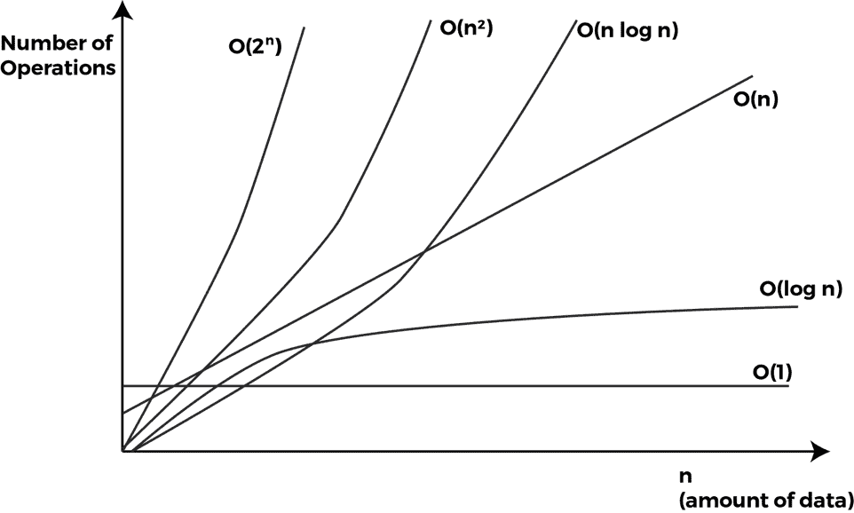
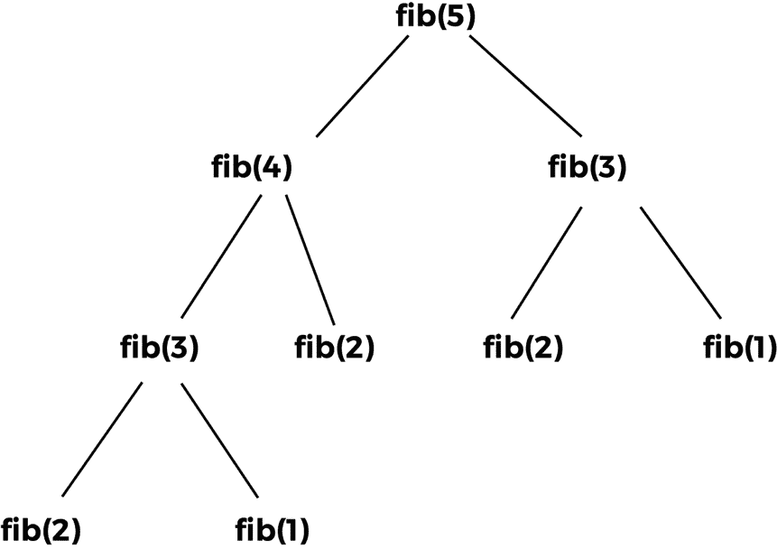
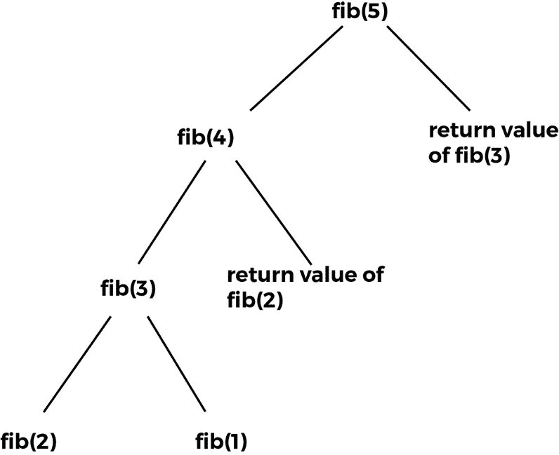
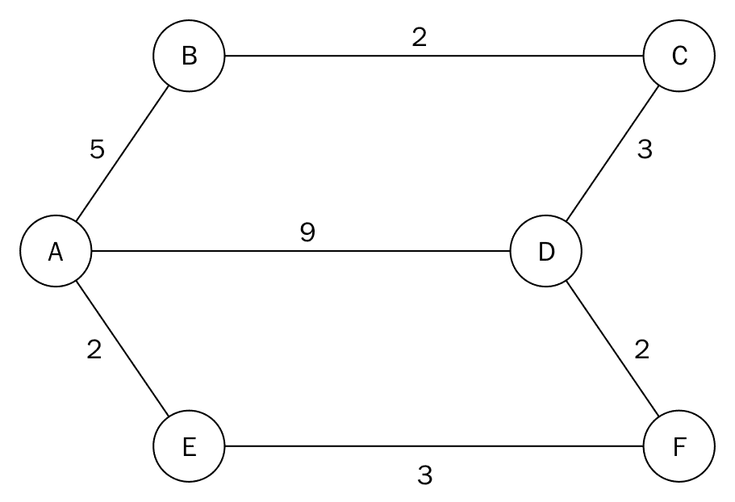
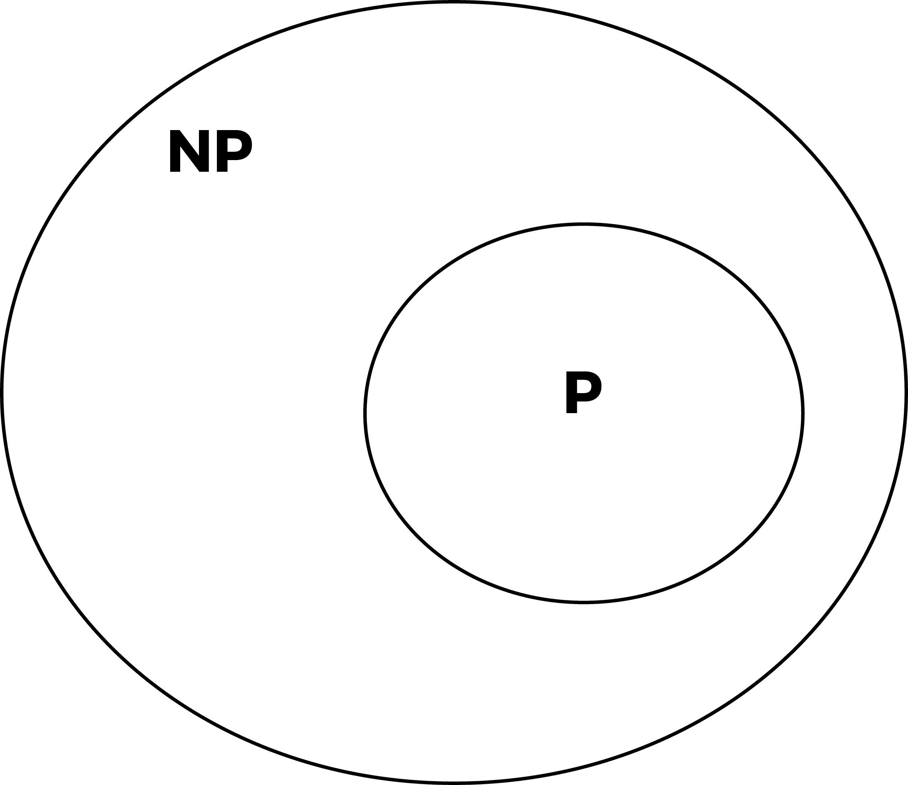

# 第十二章：设计技术和策略

在本章中，我们将退后一步，探讨计算机算法设计中的更广泛主题。随着你对编程经验的增长，某些模式开始变得明显。就像任何其他熟练的手艺一样，你不能没有一些技术和原则来实现目标。在算法的世界里，有大量的这些技术和设计原则。要解决该领域的更难问题，需要对这些技术的实际知识和掌握。

我们将探讨算法通常是如何分类的。其他设计技术将与一些算法的实现一起处理。

本章的目标不是让你成为算法设计和策略的专家，而是要在几页纸内揭示算法的广阔天地。

# 算法分类

存在着许多基于算法必须达到的目标的分类方案。在前几章中，我们实现了许多算法。可能出现的一个问题是，这些算法是否具有相同的形式？如果是，基于哪些相似性和特征作为基础？如果不是，算法能否被分组到类别中？

这些是我们将在解决算法分类的主要模式时考察的问题。

# 按实现分类

当将一系列步骤或过程转换为工作算法时，它可能采取多种形式。算法的核心可能使用一些资产，这些资产在本节中将进一步描述。

# 递归

递归算法是那些在满足一定条件之前对自己进行调用的算法。一些问题通过递归实现其解决方案更为容易表达。一个经典的例子是汉诺塔。也存在不同类型的递归算法，其中包括单递归和多递归、间接递归、匿名递归和生成递归。另一方面，迭代算法使用一系列步骤或重复结构来制定解决方案。这种重复结构可以是简单的`while`循环或任何其他类型的循环。迭代解决方案比它们的递归实现更容易想到。

# 逻辑

算法的一种实现是将它表达为受控的逻辑演绎。这个逻辑组件由将在计算中使用的公理组成。控制组件确定演绎应用于公理的方式。这以*a*lgorithm = logic + control*的形式表达。这构成了逻辑编程范式的基石。

逻辑组件决定了算法的意义。控制组件仅影响其效率。在不修改逻辑的情况下，可以通过改进控制组件来提高效率。

# 串行或并行

大多数计算机的 RAM 模型允许假设计算是一次执行一条指令。

串行算法，也称为**顺序算法**，是按顺序执行的算法。执行从开始到结束，没有其他执行过程。

要能够同时处理多个指令，就需要不同的模型或计算技术。并行算法可以同时执行多个操作。在 PRAM 模型中，有串行处理器共享全局内存。处理器还可以并行执行各种算术和逻辑操作。这使得可以同时执行多个指令。

并行/分布式算法将问题分解为子问题，分配给其处理器以收集结果。一些排序算法可以有效地并行化，而迭代算法通常可以并行化。

# 确定性算法与非确定性算法

确定性算法每次使用相同的输入运行算法时，都会产生相同的输出。有一些问题在设计解决方案时非常复杂，以确定性方式表达它们的解决方案可能是一个挑战。非确定性算法可以在每次运行算法时改变执行顺序或某些内部子过程，从而导致最终结果的变化。因此，每次运行非确定性算法时，算法的输出都不同。例如，使用概率值的算法在连续执行时，根据生成的随机数的值会产生不同的输出。

# 按复杂度分类

确定一个算法的复杂度是尝试估计在整个计算或程序执行过程中总共使用了多少空间（内存）和时间。

第三章，《算法设计原理》，更全面地介绍了关于复杂性的主题。我们将在下面总结我们在那里学到的内容。

# 复杂度曲线

现在考虑一个规模为*n*的问题。为了确定算法的时间复杂度，我们用**T**(n)表示它。这个值可能属于**O**(*1*)、**O**(*log n*)、**O**(*n*)、**O**(*n log(n*)、**O**(*n²*)、**O**(*n³*)或**O**(*2^n*)。根据算法执行的步骤，时间复杂度可能会或可能不会受到影响。**O**(*n*)的表示捕捉了算法的增长率。

现在我们来考察一个实际场景。我们是通过什么方式得出冒泡排序算法比快速排序算法慢的结论？或者一般而言，我们如何衡量一个算法相对于另一个算法的效率？嗯，我们可以比较任意数量算法的大 O 表示来决定它们的效率。正是这种方法给我们提供了一个时间度量或增长速率，它描绘了当*n*变大时算法的行为。

下面是一个图表，展示了算法性能可能落下的不同运行时：



按升序排列，从好到差的运行时列表给出为 **O**(1)，**O**(log n)，**O**(*n*)，**O**(*n log n*)，**O**(*n²*)，**O**(*n³*)，以及 **O**(*2^n*)。

# 设计分类

在本节中，我们将根据用于解决问题设计的各种算法的类别来介绍算法。

一个给定的问题可能有多个解决方案。当分析这些解决方案的算法时，很明显，其中一些实现了一种特定的技术或模式。正是这些技术我们将在这里讨论，并在稍后的章节中更详细地讨论。

# 分而治之

这种解决问题的方法正如其名所示。为了解决（征服）某些问题，该算法将问题分解成与原始问题相同且易于解决的子问题。子问题的解决方案以这种方式组合，使得最终解决方案是原始问题的解决方案。

将问题分解成更小部分的方式主要是通过递归。我们将在接下来的章节中详细考察这种技术。使用这种技术的算法包括归并排序、快速排序和二分查找。

# 动态规划

这种技术类似于分而治之，因为问题被分解成更小的子问题。在分而治之的方法中，每个子问题必须在它的结果被用来解决更大的问题之前得到解决。相比之下，动态规划不会重新计算已经遇到的子问题的解。相反，它使用一种记忆技术来避免重复计算。

动态规划问题有两个特征：**最优子结构**和**重叠子问题**。我们将在下一节中进一步讨论这一点。

# 贪心算法

对于某些类别的问题，确定最佳解决方案非常困难。为了弥补最优解的不足，我们采取从一系列选项或选择中挑选出最有可能获得解决方案的最近似解决方案的方法。

贪心算法更容易构思，因为指导规则是选择带来最大利益的解决方案，并继续这样做，希望达到完美的解决方案。

这种技术旨在通过一系列局部最优选择来找到全局最优最终解决方案。局部最优选择似乎指向解决方案。在现实生活中，大多数这些局部最优选择都是次优的。因此，大多数贪心算法具有较差的渐近时间复杂度。

# 技术实现

让我们深入探讨本章前面讨论的一些理论编程技术的实现。我们将从动态规划开始。

# 动态规划

正如我们已经描述的，在这种方法中，我们将问题划分为更小的子问题。在寻找子程序的解决方案时，注意不要重新计算之前遇到的任何子问题。

这听起来有点像递归，但在这里事情要宽泛一些。一个问题可能适合通过使用动态规划来解决，但并不一定采取递归调用的形式。

一个问题具有的属性，使其成为使用动态规划解决的理想候选者，是它应该有一个重叠的子问题集。

一旦我们意识到在计算过程中子问题的形式重复出现，我们就不需要再次计算它。相反，我们返回之前遇到的该子问题的预计算值的结果。

为了避免出现我们永远不需要重新评估子问题的情况，我们需要一种有效的方法来存储每个子问题的结果。以下两种技术是现成的。

# 缓存

这种技术从初始问题集开始，将其划分为小子问题。在确定子程序的解决方案后，我们将结果存储到特定的子问题中。在将来，当遇到这个子问题时，我们只返回其预计算的值。

# 表格法

在表格法中，我们采用了一种方法，即先填充一个子问题的解表，然后将它们组合起来解决更大的问题。

# 斐波那契数列

我们将使用斐波那契数列来展示生成数列的缓存和表格技术。

# 缓存技术

让我们生成到第五项的斐波那契数列：

```py
    1 1 2 3 5

```

生成序列的递归程序风格如下：

```py
    def fib(n): 
        if n <= 2: 
            return 1 
        else: 
            return fib(n-1) + fib(n-2) 

```

代码非常简单，但由于递归调用而变得有点难以阅读，这些递归调用最终解决了问题。

当遇到基本情况时，`fib()` 函数返回 1。如果 `n` 等于或小于 2，则满足基本情况。

如果没有遇到基本情况，我们将再次调用 `fib()` 函数，这次将第一个调用提供 `n-1`，第二个调用提供 `n-2`：

```py
    return fib(n-1) + fib(n-2) 

```

解决斐波那契数列的第 i 项的策略布局如下：



仔细观察前面的树形图，可以发现一些有趣的模式。对 `f(1)` 的调用发生了两次。对 `f(1)` 的调用发生了三次。此外，对 `f(3)` 的调用也发生了两次。

`fib(2)` 被调用时所有函数调用的返回值从未改变。对 `fib(1)` 和 `fib(3)` 也是如此。由于相同的参数和输出返回相同的结果，因此计算时间被浪费了。

这些具有相同参数和输出的函数重复调用表明存在重叠。某些计算在较小的子问题中是重复发生的。

一个更好的方法是将`fib(1)`第一次遇到时的计算结果存储起来。这也适用于`fib(2)`和`fib(3)`。以后，每次我们遇到对`fib(1)`、`fib(2)`或`fib(3)`的调用时，我们只需返回它们各自的结果。

我们`fib`调用的图现在看起来是这样的：



我们现在完全消除了计算`fib(3)`、`fib(2)`和`fib(1)`的需求。这典型地代表了记忆化技术，其中将问题分解为其子问题，不会重新计算函数的重复调用。在我们的斐波那契示例中，重叠的函数调用是`fib(1)`、`fib(2)`和`fib(3)`：

```py
    def dyna_fib(n, lookup): 
        if n <= 2: 
            lookup[n] = 1 

        if lookup[n] is None: 
            lookup[n] = dyna_fib(n-1, lookup) + dyna_fib(n-2, lookup) 

        return lookup[n] 

```

要创建一个包含 1000 个元素的列表，我们执行以下操作，并将其传递给`dyna_fib`函数的`lookup`参数：

```py
    map_set = [None]*(10000) 

```

此列表将存储对`dyna_fib()`函数的各种调用的计算值：

```py
    if n <= 2: 
        lookup[n] = 1 

```

当`n`小于或等于 2 时，对`dyna_fib()`的任何调用都将返回 1。当`dyna_fib(1)`被评估时，我们将值存储在`map_set`的索引 1 处：

编写`lookup[n]`的条件，如下所示：

```py
if lookup[n] is None:
    lookup[n] = dyna_fib(n-1, lookup) + dyna_fib(n-2, lookup)

```

我们传递`lookup`以便在评估子问题时可以引用它。对`dyna_fib(n-1, lookup)`和`dyna_fib(n-2, lookup)`的调用存储在`lookup[n]`中。当我们运行函数的更新实现以找到斐波那契数列的第 i 项时，我们发现有很大的改进。这种实现比我们的初始实现运行得快得多。将值 20 提供给两个实现，并观察执行速度的差异。由于在存储结果到函数调用中使用了内存，算法牺牲了空间复杂度以换取时间。

# 表格技术

动态规划中还有第二种技术，它涉及在某些情况下使用结果表或矩阵来存储用于后续使用的计算结果。

这种方法通过首先找到最终解决方案的路径来解决更大的问题。在`fib()`函数的情况下，我们将开发一个包含`fib(1)`和`fib(2)`值的表，这些值预先确定。基于这两个值，我们将逐步计算到`fib(n)`：

```py
    def fib(n): 

        results = [1, 1] 

        for i in range(2, n): 
            results.append(results[i-1] + results[i-2]) 

        return results[-1] 

```

`results`变量位于索引 0，值为 1 和 1。这代表了`fib(1)`和`fib(2)`的返回值。为了计算`fib()`函数高于 2 的值，我们只需调用`for`循环，将`results[i-1] + results[i-2]`的和追加到结果列表中。

# 分解与征服

这种编程方法强调了解决问题时需要将问题分解成与原始问题相同类型或形式的更小问题。这些子问题被解决并组合起来以解决原始问题。与这种编程相关联的以下三个步骤：

# 分解

分割意味着将实体或问题分解。在这里，我们制定将原始问题分解为子问题的方法。我们可以通过迭代或递归调用实现这一点。

# 征服

不可能无限期地将问题分解为子问题。在某个时刻，最小的不可分割问题将返回一个解决方案。一旦发生这种情况，我们可以反转我们的思考过程，并说如果我们知道可能的最小问题的解决方案，我们就可以获得原始问题的最终解决方案。

# 合并

为了获得最终解决方案，我们需要将解决较小问题的较小解决方案结合起来，以便解决更大的问题。

分治算法还有其他变体，例如合并和组合，以及征服和解决。

利用分治原则的算法包括归并排序、快速排序和斯特拉斯矩阵乘法。我们将从第三章 *算法设计原理*中开始的归并排序实现进行讲解。

# 归并排序

归并排序算法基于分治规则。给定一个未排序的元素列表，我们将列表分成大约两半。我们继续递归地分割这两半。经过一段时间，由递归调用创建的子列表将只包含一个元素。在那个时刻，我们开始在征服或合并步骤中合并解决方案：

```py
    def merge_sort(unsorted_list): 
        if len(unsorted_list) == 1: 
            return unsorted_list 

        mid_point = int((len(unsorted_list))/2) 

        first_half = unsorted_list[:mid_point] 
        second_half = unsorted_list[mid_point:] 

        half_a = merge_sort(first_half) 
        half_b = merge_sort(second_half) 

        return merge(half_a, half_b) 

```

我们的实现首先通过将未排序的元素列表接受到`merge_sort`函数中开始。`if`语句用于建立基本情况，如果`unsorted_list`中只有一个元素，我们只需再次返回该列表。如果列表中有超过一个元素，我们使用`mid_point = int((len(unsorted_list))/2)`找到大约的中间值。

使用这个`mid_point`，我们将列表分为两个子列表，即`first_half`和`second_half`：

```py
    first_half = unsorted_list[:mid_point] 
    second_half = unsorted_list[mid_point:] 

```

通过再次将两个子列表传递给`merge_sort`函数，进行递归调用：

```py
    half_a = merge_sort(first_half)  
    half_b = merge_sort(second_half) 

```

进入合并步骤。当`half_a`和`half_b`已经传递了它们的值后，我们调用归并函数，该函数将合并或组合存储在`half_a`和`half_b`中的两个解决方案，它们是列表：

```py
    def merge(first_sublist, second_sublist): 
        i = j = 0 
        merged_list = [] 

        while i < len(first_sublist) and j < len(second_sublist): 
            if first_sublist[i] < second_sublist[j]: 
                merged_list.append(first_sublist[i]) 
                i += 1 
            else: 
                merged_list.append(second_sublist[j]) 
                j += 1 

        while i < len(first_sublist): 
            merged_list.append(first_sublist[i]) 
            i += 1 

        while j < len(second_sublist): 
            merged_list.append(second_sublist[j]) 
            j += 1 

        return merged_list 

```

归并函数接受我们想要合并的两个列表，即`first_sublist`和`second_sublist`。变量`i`和`j`被初始化为`0`，并用作指针，告诉我们合并过程中在两个列表中的位置。最终的`merged_list`将包含合并后的列表：

```py
    while i < len(first_sublist) and j < len(second_sublist): 
        if first_sublist[i] < second_sublist[j]: 
            merged_list.append(first_sublist[i]) 
            i += 1 
        else: 
            merged_list.append(second_sublist[j]) 
            j += 1 

```

`while`循环开始比较`first_sublist`和`second_sublist`中的元素。`if`语句选择两个中的较小者，即`first_sublist[i]`或`second_sublist[j]`，并将其追加到`merged_list`中。`i`或`j`索引增加以反映合并步骤中的位置。`while`循环仅在任一子列表为空时停止。

在 `first_sublist` 或 `second_sublist` 中可能会有元素被遗漏。最后的两个 `while` 循环确保在返回之前将这些元素添加到 `merged_list` 中。

最后一次调用 `merge(half_a, half_b)` 将返回排序后的列表。

让我们通过模拟合并两个子列表 `[4, 6, 8]` 和 `[5, 7, 11, 40]` 的最后一步来测试这个算法：

| **步骤** | `first_sublist` | `second_sublist` | `merged_list` |
| --- | --- | --- | --- |
| 第零步 | [**4** 6 8] | [**5** 7 11 40] | [] |
| 第一步 | [ **6** 8] | [**5** 7 11 40] | [4] |
| 第二步 | [ **6** 8] | [ **7** 11 40] | [4 5] |
| 第三步 | [ **8**] | [ **7** 11 40] | [4 5 6] |
| 第四步 | [ **8**] | [ **11** 40] | [4 5 6 7] |
| 第五步 | [ ] | [ **11** 40] | [4 5 6 7 8] |

注意，粗体的文本表示在 `first_sublist`（使用索引 `i`）和 `second_sublist`（使用索引 `j`）循环中引用的当前项。

在执行的这个阶段，合并函数中的第三个 `while` 循环开始工作，将 11 和 40 移入 `merged_list`。返回的 `merged_list` 将包含完全排序的列表。

# 贪婪算法

正如我们之前所说的，贪婪算法做出在短期内带来最大收益的决定。这个技术的希望是，通过做出这些高收益的选择，整个路径将导致一个整体上好的解决方案或结果。

贪婪算法的例子包括用于找到最小生成树的 **Prim 算法**，**背包问题** 和 **旅行商问题**，仅举几例。

# 硬币计数问题

让我们考察贪婪技术的一个非常简单的应用。在某个任意国家，我们有 1 GHC、5 GHC 和 8 GHC 的面额。给定一个像 12 GHC 这样的金额，我们可能希望找到所需的最少面额数量以提供零钱。使用贪婪方法，我们从面额中选择最大值来分割 12 GHC。我们使用 8，因为它提供了将 12 GHC 减少到较低面额的最佳方式。

剩余的 4 GHC 不能被 5 整除，所以我们尝试 1 GHC 的面额，并意识到我们可以将其乘以 4 来获得 4 GHC。最终，创建 12 GHC 所需的最少面额数量是得到一张 8 GHC 和四张 1 GHC 的纸币。

到目前为止，我们的贪婪算法似乎做得相当不错。一个返回相应面额的函数如下：

```py
    def basic_small_change(denom, total_amount): 
        sorted_denominations = sorted(denom, reverse=True) 

        number_of_denoms = [] 

        for i in sorted_denominations: 
            div = total_amount / i 
            total_amount = total_amount % i 
            if div > 0: 
                number_of_denoms.append((i, div)) 

        return number_of_denoms 

```

这种贪婪算法始终从可能的最大面额开始。`denom` 是一个面额列表。`sorted(denom, reverse=True)` 将列表按逆序排序，这样我们就可以在索引 0 处获得最大的面额。现在，从排序后的面额列表 `sorted_denominations` 的索引 0 开始，我们迭代并应用贪婪技术：

```py
    for i in sorted_denominations: 
        div = total_amount / i 
        total_amount = total_amount % i 
        if div > 0: 
            number_of_denoms.append((i, div)) 

```

循环将遍历货币列表。每次循环运行时，它通过将`total_amount`除以当前货币`i`来获取商`div`。`total_amount`更新以存储剩余部分以供进一步处理。如果商大于 0，我们将其存储在`number_of_denoms`中。

不幸的是，我们的算法在某些情况下会失败。例如，当传入 14 GHS 时，我们的算法返回一个 8 GHC 和四个 1 GHS。然而，这个输出并不是最优解。正确的解决方案是使用两个 5 GHC 和两个 1 GHC 的货币。

这里提供了一个更好的贪婪算法。这次，函数返回一个元组列表，使我们能够调查更好的结果：

```py
    def optimal_small_change(denom, total_amount): 

        sorted_denominations = sorted(denom, reverse=True) 

        series = [] 
        for j in range(len(sorted_denominations)): 
            term = sorted_denominations[j:] 

            number_of_denoms = [] 
            local_total = total_amount 
            for i in term: 
                div = local_total / i 
                local_total = local_total % i 
                if div > 0: 
                    number_of_denoms.append((i, div)) 

            series.append(number_of_denoms) 

        return series 

```

外部`for`循环使我们能够限制我们从中找到解决方案的货币：

```py
    for j in range(len(sorted_denominations)): 
        term = sorted_denominations[j:] 
        ...     

```

假设我们有一个列表[5, 4, 3]在`sorted_denominations`中，使用`[j:]`切片可以帮助我们获得子列表[5, 4, 3]，[4, 3]和[3]，然后我们尝试从中得到正确的组合来创建零钱。

# 迪杰斯特拉最短路径算法

我们介绍并研究迪杰斯特拉算法。这个算法是贪婪算法的一个例子。它找到从源点到图中所有其他节点或顶点的最短距离。在本节结束时，你将理解为什么它被归类为贪婪算法。

考虑以下图：



通过检查，我们首先想到的从节点**A**到节点**D**的最短路径问题是具有值或距离 9 的边。从图中看，从节点**A**到**D**的直线路径似乎也会产生两个节点之间的最短路径。但连接两个节点的边是最短路径的假设并不总是成立。

这种在解决问题时选择第一个选项的短视方法赋予了算法其名称和类别。一旦找到所谓的最短路径或距离，算法就会继续优化和改进其结果。

从节点**A**到节点**D**的其他路径证明比我们最初的选择更短。例如，从节点**A**到节点**B**再到节点**C**的总距离为 10。但通过节点**A**到**E**、**F**和**D**的路线甚至更短。

我们将使用单个源实现最短路径算法。我们的结果将帮助我们确定从起点，在本例中是**A**，到图中任何其他节点的最短路径。

从节点**A**到节点**C**的最短路径是通过节点**B**，总距离为 7。同样，到**F**的最短路径是通过节点**E**，总距离为 5。

为了提出一个帮助我们找到图中最短路径的算法，让我们手动解决这个问题。然后，我们将以 Python 的形式展示解决方案。

在关于图章节中，我们看到了如何使用邻接表来表示一个图。我们将对其进行轻微修改，以便我们能够捕捉到每条边的距离。我们将使用一个表格来跟踪图中从源节点到任何其他节点的最短距离。我们将使用 Python 字典来实现这个表格。下面是一个这样的表格：

| **节点** | **从源点到最短距离** | **前一个节点** |
| --- | --- | --- |
| A | 0 | None |
| B | ∞ | None |
| C | ∞ | None |
| D | ∞ | None |
| E | ∞ | None |
| F | ∞ | None |

图和表格的邻接表如下：

```py
    graph = dict() 
    graph['A'] = {'B': 5, 'D': 9, 'E': 2} 
    graph['B'] = {'A': 5, 'C': 2} 
    graph['C'] = {'B': 2, 'D': 3} 
    graph['D'] = {'A': 9, 'F': 2, 'C': 3} 
    graph['E'] = {'A': 2, 'F': 3} 
    graph['F'] = {'E': 3, 'D': 2} 

```

嵌套字典包含距离和相邻节点。

这个表格是我们解决问题的努力的基础。当算法开始时，我们不知道从源节点（**A**）到任何节点的最短距离是多少。为了保险起见，我们将该列的值设置为无穷大，除了节点**A**。从起始节点开始，从节点**A**到节点**A**的距离是 0。因此，我们可以安全地使用这个值作为节点**A**到自身的最短距离。算法开始时还没有访问任何前一个节点。因此，我们将节点的前一个节点列标记为`None`。

在算法的第 1 步中，我们首先检查节点**A**的相邻节点。为了找到节点**A**到节点**B**的最短距离，我们需要找到从起始节点到节点 B 的前一个节点的距离，这个前一个节点恰好是节点**A**，并将其添加到节点**A**到节点**B**的距离中。我们为**A**的其他相邻节点（**B**、**E**和**D**）做同样的事情。

以相邻节点**B**为例，从起始节点到前一个节点的距离是 0。从前一个节点到当前节点（**B**）的距离是 5。这个总和与节点 B 的最短距离列中的数据进行比较。由于 5 小于无穷大（**∞**），我们将**∞**替换为这两个数中的最小值，即 5。

每当节点的最短距离被替换为一个更小的值时，我们还需要更新前一个节点列。在第一步结束时，我们的表格如下所示：

| **节点** | **从源点到最短距离** | **前一个节点** |
| --- | --- | --- |
| **A*** | 0 | None |
| B | 5 | A |
| C | ∞ | None |
| D | 9 | A |
| E | 2 | A |
| F | ∞ | None |

在这一点上，节点**A**被认为是已访问的。因此，我们将节点**A**添加到已访问节点的列表中。在表格中，我们通过使文本加粗并在其后附加一个星号来表示节点**A**已被访问。

在第二步中，我们使用表格作为指南找到具有最短距离的节点。具有值 2 的节点**E**具有最短距离。这就是我们从表格中关于节点**E**可以推断出的内容。要到达节点**E**，我们必须访问节点**A**并覆盖 2 的距离。从节点 A，我们覆盖 0 的距离到达起始节点，即节点**A**本身。

节点**E**的相邻节点是**A**和**F**。但节点**A**已经被访问过，所以我们只考虑节点**F**。为了找到到节点**F**的最短路径或距离，我们必须找到从起始节点到节点**E**的距离，并将其加到节点**E**和**F**之间的距离上。我们可以通过查看节点**E**的最短距离列来找到从起始节点到节点**E**的距离，该列的值为 2。从节点**E**到**F**的距离可以通过我们在本节前面开发的 Python 中的邻接表获得。这个距离是 3。这两个相加等于 5，小于无穷大。记住我们正在检查相邻节点**F**。由于节点**E**还有更多的相邻节点，我们标记节点**E**为已访问。我们的更新表格将具有以下值：

| **节点** | **从源节点到最短距离** | **前一个节点** |
| --- | --- | --- |
| **A*** | 0 | None |
| B | 5 | A |
| C | ∞ | None |
| D | 9 | A |
| **E*** | 2 | A |
| F | 5 | E |

在这个阶段，我们开始下一步。最短距离列中的最小值是 5。我们纯粹基于字母顺序选择**B**而不是**F**。**B**的相邻节点是**A**和**C**，但节点**A**已经被访问过。使用我们之前建立的规则，从**A**到**C**的最短距离是 7。我们得到这个数字是因为从起始节点到节点**B**的距离是 5，而从节点**B**到**C**的距离是 2。由于总和 7 小于无穷大，我们更新最短距离为 7，并在前一个节点列中更新为节点**B**。现在**B**也被标记为已访问。表格的新状态如下：

| **节点** | **从源节点到最短距离** | **前一个节点** |
| --- | --- | --- |
| **A*** | 0 | None |
| **B*** | 5 | A |
| C | 7 | B |
| D | 9 | A |
| **E*** | 2 | A |
| F | 5 | E |

尚未访问的最短距离节点是节点**F**。**F**的相邻节点是节点**D**和**E**。但节点**E**已经被访问过。因此，我们专注于找到从起始节点到节点**D**的最短距离。我们通过将节点**A**到**F**的距离与节点**F**到**D**的距离相加来计算这个距离。总和为 7，小于 9。因此，我们将 9 更新为 7，并在节点**D**的前一个节点列中将**A**替换为**F**。现在**F**也被标记为已访问。以下是到此为止更新的表格：

| **节点** | **从源节点到最短距离** | **前一个节点** |
| --- | --- | --- |
| **A*** | 0 | None |
| **B*** | 5 | A |
| C | 7 | B |
| D | 7 | F |
| **E*** | 2 | A |
| **F*** | 5 | E |

现在，两个未访问的节点是**C**和**D**。按字母顺序，我们选择检查**C**，因为这两个节点从起始节点**A**的最短距离相同。

然而，**C**的所有相邻节点都已访问过。因此，我们除了将节点**C**标记为已访问外，别无他法。此时表格保持不变。

最后，我们取节点**D**并发现它的所有相邻节点都已访问过。我们只将其标记为已访问。表保持不变：

| **节点** | **从源到最短距离** | **前一个节点** |
| --- | --- | --- |
| **A*** | 0 | None |
| **B*** | 5 | A |
| **C*** | 7 | B |
| **D*** | 7 | F |
| **E*** | 2 | A |
| **F*** | 5 | E |

让我们用我们的图来验证这个表。从图中，我们知道从**A**到**F**的最短距离是 5。我们需要通过**E**到达节点**F**。根据表，节点**F**的源列的最短距离是值 5。这是正确的。这也告诉我们，要到达节点**F**，我们需要访问节点**E**，然后从**E**到**A**，这是我们的起始节点。这实际上是 shortest path。

我们通过表示一个表来开始寻找最短距离的程序，这个表使我们能够跟踪我们图中变化。对于我们使用的给定图，以下是表的字典表示：

```py
    table = dict() 
    table = { 
        'A': [0, None], 
        'B': [float("inf"), None], 
        'C': [float("inf"), None], 
        'D': [float("inf"), None], 
        'E': [float("inf"), None], 
        'F': [float("inf"), None], 
    } 

```

表的初始状态使用`float("inf")`来表示无穷大。字典中的每个键都映射到一个列表。列表的第一个索引存储从源`A`的最短距离。第二个索引存储前一个节点：

```py
    DISTANCE = 0 
    PREVIOUS_NODE = 1 
    INFINITY = float('inf') 

```

为了避免使用魔法数字，我们使用前面的常量。最短路径列的索引由`DISTANCE`引用。前一个节点列的索引由`PREVIOUS_NODE`引用。

现在所有准备工作都已经完成，主函数将接受由邻接表表示的图、表和起始节点作为参数：

```py
    def find_shortest_path(graph, table, origin): 
        visited_nodes = [] 
        current_node = origin 
        starting_node = origin 

```

我们将已访问节点的列表保存在`visited_nodes`列表中。`current_node`和`starting_node`变量都将指向我们选择的起始节点。`origin`值是相对于寻找最短路径的所有其他节点的参考点。

整个过程的繁重工作是通过使用一个`while`循环来完成的：

```py
    while True: 
        adjacent_nodes = graph[current_node] 
        if set(adjacent_nodes).issubset(set(visited_nodes)): 
            # Nothing here to do. All adjacent nodes have been visited. 
            pass 
        else: 
            unvisited_nodes = 
                set(adjacent_nodes).difference(set(visited_nodes)) 

            for vertex in unvisited_nodes: 

                distance_from_starting_node = 
                    get_shortest_distance(table, vertex) 
                if distance_from_starting_node == INFINITY and 
                   current_node == starting_node: 
                    total_distance = get_distance(graph, vertex, 
                                                  current_node) 
                else: 
                    total_distance = get_shortest_distance (table, 
                    current_node) + get_distance(graph, current_node, 
                                                 vertex) 

                if total_distance < distance_from_starting_node: 
                    set_shortest_distance(table, vertex, 
                                          total_distance) 
                    set_previous_node(table, vertex, current_node) 

        visited_nodes.append(current_node) 

        if len(visited_nodes) == len(table.keys()): 
            break 

        current_node = get_next_node(table,visited_nodes) 

```

让我们分解一下`while`循环正在做什么。在`while`循环的主体中，我们通过`adjacent_nodes = graph[current_node]`这一行获取我们想要调查的图中的当前节点。`current_node`应该已经被设置。`if`语句用于确定`current_node`的所有相邻节点是否都已访问。当`while`循环第一次执行时，`current_node`将包含 A，`adjacent_nodes`将包含节点 B、D 和 E。`visited_nodes`也将为空。如果所有节点都已访问，我们则只继续程序中的后续语句。否则，我们开始另一个完整的步骤。

语句`set(adjacent_nodes).difference(set(visited_nodes))`返回未访问的节点。循环遍历这个未访问节点的列表：

```py
    distance_from_starting_node = get_shortest_distance(table, vertex) 

```

辅助方法`get_shortest_distance(table, vertex)`将返回我们表中存储的最短距离列的值，使用由`vertex`引用的未访问节点之一：

```py
    if distance_from_starting_node == INFINITY and current_node == 
       starting_node: 
    total_distance = get_distance(graph, vertex, current_node) 

```

当我们检查起始节点的相邻节点时，如果 `distance_from_starting_node == INFINITY and current_node == starting_node` 评估为 True，那么我们只需通过引用图来获取起始节点和顶点之间的距离：

```py
    total_distance = get_distance(graph, vertex, current_node) 

```

`get_distance` 方法是我们用来获取 `vertex` 和 `current_node` 之间边（距离）值的另一个辅助方法。

如果条件失败，那么我们将 `total_distance` 赋值为从起始节点到 `current_node` 的距离加上 `current_node` 和 `vertex` 之间的距离。

一旦我们有了总距离，我们需要检查这个 `total_distance` 是否小于我们表中最短距离列中现有的数据。如果是的话，我们就使用两个辅助方法来更新那一行：

```py
    if total_distance < distance_from_starting_node: 
        set_shortest_distance(table, vertex, total_distance) 
    set_previous_node(table, vertex, current_node) 

```

在这一点上，我们将 `current_node` 添加到已访问节点列表中：

```py
    visited_nodes.append(current_node) 

```

如果所有节点都已访问，那么我们必须退出 `while` 循环。为了检查是否所有节点都已访问，我们比较 `visited_nodes` 列表的长度与我们表中键的数量。如果它们已经相等，我们就简单地退出 `while` 循环。

辅助方法 `get_next_node` 用于获取要访问的下一个节点。正是这个方法帮助我们通过表找到从起始节点到最短距离列中的最小值。

整个方法通过返回更新后的表来结束。为了打印表，我们使用以下语句：

```py
    shortest_distance_table = find_shortest_path(graph, table, 'A') 
    for k in sorted(shortest_distance_table): 
        print("{} - {}".format(k,shortest_distance_table[k])) 

```

前述语句的输出：

```py
>>> A - [0, None] B - [5, 'A'] C - [7, 'B'] D - [7, 'F'] E - [2, 'A'] F - [5, 'E']

```

为了完整性，让我们找出辅助方法在做什么：

```py
    def get_shortest_distance(table, vertex): 
        shortest_distance = table[vertex][DISTANCE] 
        return shortest_distance 

```

`get_shortest_distance` 函数返回我们表中的零（th）索引存储的值。在该索引处，我们始终存储从起始节点到 `vertex` 的最短距离。`set_shortest_distance` 函数只通过以下方式设置此值：

```py
    def set_shortest_distance(table, vertex, new_distance): 
        table[vertex][DISTANCE] = new_distance 

```

当我们更新一个节点的最短距离时，我们使用以下方法来更新其前一个节点：

```py
    def set_previous_node(table, vertex, previous_node): 
        table[vertex][PREVIOUS_NODE] = previous_node 

```

记住，常数 `PREVIOUS_NODE` 等于 1。在表中，我们在 `table[vertex][PREVIOUS_NODE]` 存储前一个节点的值。

为了找到任何两个节点之间的距离，我们使用 `get_distance` 函数：

```py
    def get_distance(graph, first_vertex, second_vertex): 
        return graph[first_vertex][second_vertex] 

```

最后一个辅助方法是 `get_next_node` 函数：

```py
    def get_next_node(table, visited_nodes): 
        unvisited_nodes = 
            list(set(table.keys()).difference(set(visited_nodes))) 
        assumed_min = table[unvisited_nodes[0]][DISTANCE] 
        min_vertex = unvisited_nodes[0] 
        for node in unvisited_nodes: 
            if table[node][DISTANCE] < assumed_min: 
                assumed_min = table[node][DISTANCE] 
                min_vertex = node 

        return min_vertex 

```

`get_next_node` 函数类似于一个在列表中查找最小项的函数。

函数首先通过使用 `visited_nodes` 来获取表中的未访问节点，通过获取两组列表之间的差异。`unvisited_nodes` 列表中的第一个项目被认为是 `table` 中最短距离列中最小的一个。如果在 `for` 循环运行期间找到更小的值，则 `min_vertex` 将被更新。然后函数将 `min_vertex` 返回为未访问的顶点或从源点到具有最小最短距离的节点。

Dijkstra 算法的最坏情况运行时间是 **O**(*|E| + |V| log |V|*)，其中 *|V|* 是顶点的数量，*|E|* 是边的数量。

# 复杂度类别

计算机算法试图解决的问题范围很广，它们的解决方案是通过一系列逻辑步骤得出的。在本节中，我们将讨论 N、NP、NP-完全和 NP-难问题。

# P 与 NP

计算机的出现加快了某些任务执行的速度。一般来说，计算机擅长完善计算艺术以及所有可以归结为一系列数学计算的问题。然而，这个说法并不完全正确。有一些自然或问题类别，计算机需要花费大量时间才能做出合理的猜测，更不用说找到正确的解决方案了。

在计算机科学中，计算机可以在多项式时间内通过一系列逻辑步骤解决的问题类别被称为 P 类问题，其中 P 代表多项式。这些相对容易解决。

然后还有另一类被认为非常难以解决的问题。术语“难题”用来指代在寻找解决方案时问题难度增加的方式。然而，好事是尽管这些问题的难度增长速度很快，但可以确定一个提出的解决方案是否在多项式时间内解决了问题。这些都是 NP 类问题。这里的 NP 代表非确定性多项式时间。

现在的百万美元问题就是，N 是否等于 NP？

*N = NP* 的证明是克莱数学研究所的千禧年大奖难题之一，正确解决这些问题可以获得 100 万美元的奖金。这些问题共有 7 个。

旅行商问题是一个典型的 NP 类问题。问题陈述是这样的：假设某个国家有 *n* 个城市，找到所有城市之间的最短路线，从而使旅行变得经济高效。当城市数量较少时，这个问题可以在合理的时间内解决。然而，当城市数量超过任何两位数时，计算机所需的时间就非常长了。

许多计算机系统和网络安全都基于 RSA 加密算法。该算法的强度及其安全性是由于它基于整数分解问题，这是一个 NP 类问题。

找出由许多数字组成的质数的质因数是非常困难的。当两个大质数相乘时，得到一个只有两个大质因数的大非质数。这个数的分解是许多加密算法借力的地方：



所有 P 类问题都是 NP 问题的子集。这意味着任何可以在多项式时间内解决的问题也可以在多项式时间内验证。

但问题，P = NP？探讨的是否存在可以在多项式时间内验证的问题也可以在多项式时间内解决。特别是，如果它们相等，这意味着可以通过尝试多种可能的解决方案来解决的问题，可以在不实际尝试所有可能的解决方案的情况下解决，从而不可避免地创造出某种形式的捷径证明。

当最终被发现时，这个证明无疑将在密码学、博弈论、数学以及许多其他领域产生严重影响。

# NP-Hard

如果一个问题是 NP-Hard，那么 NP 中的所有其他问题都可以在多项式时间内归约或映射到它。

# NP-Complete

如果一个问题首先是一个 NP hard 问题，并且也被发现在`NP`类中，那么它被认为是一个 NP-complete 问题。

# 摘要

在最后一章中，我们研究了支持计算机科学领域的理论。没有使用过多的数学严谨性，我们看到了算法被分类的主要类别。该领域的其他设计技术，如分而治之、动态规划和贪心算法，也被讨论，并附有示例实现。

最后，数学领域尚未解决的众多突出问题之一得到了解决。我们看到了 P = NP？的证明如何肯定会在多个领域产生变革，如果这样的证明被发现的话。
