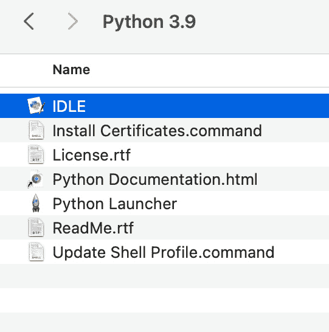
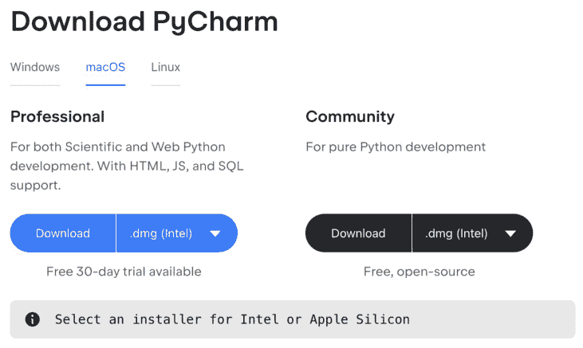
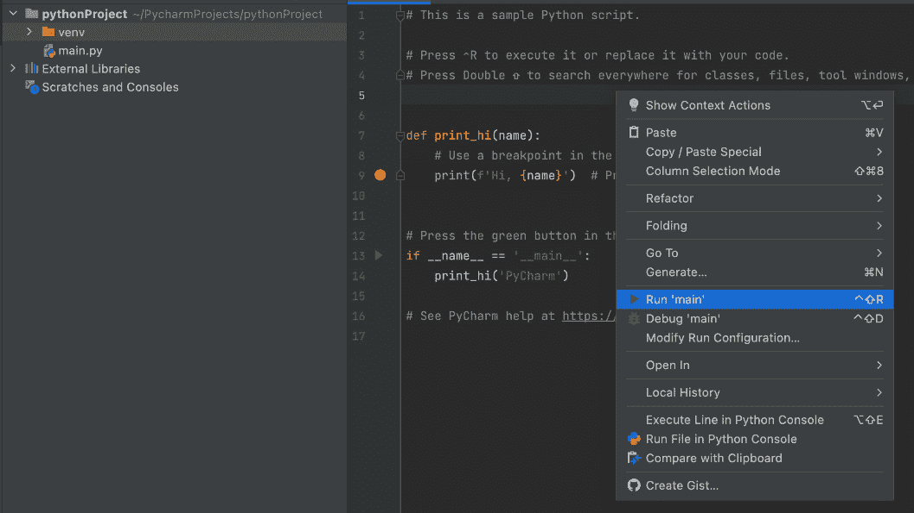

# 第一章：在 AWS 上使用 Python

在本章中，我们将简要介绍云。然后我们将解释如何设置 Python 以及如何在命令行以及通过 **集成开发环境**（**IDE**）运行您的第一个应用程序。我们将涵盖以下主要主题：

+   什么是云？

+   理解云的优势

+   安装 Python

+   安装 PyCharm

+   创建新项目

云计算是实现您应用程序的最流行方法之一，它具有巨大的优势。有多个云服务提供商，例如 **亚马逊网络服务**（**AWS**）、**谷歌云平台**（**GCP**）和 Azure。AWS 是最广泛使用的云服务提供商之一，许多公司正在迁移到那里。云的使用正在显著增长，预计开发者对云有良好的理解。通过购买这本书，您正在走上正确的道路，并开始学习如何使用 AWS 实现酷炫的 Python 应用程序。

大多数公司正在迁移到云，因为它们具有显著的优势。了解为什么以及如何使用这些服务是很重要的。

# 什么是云？

云是使用 IT 基础设施和服务的流行方式，这些服务和 IT 提供商管理机器、网络和应用。基本上，您不需要任何本地基础设施，云服务提供商拥有他们的数据中心，通过互联网提供所需的服务。例如，如果您需要服务器，您不需要购买机器，也不需要设置其网络和电源。云服务提供商为您提供服务，您可以通过互联网使用它们。

# 理解云的优势

以下方面解释了为什么公司迁移到云以获得更好的基础设施：

+   **良好的灾难恢复计划**：云服务提供商在不同地区拥有多个数据中心。如果一个地区出现问题，系统可以在另一个地区恢复。

+   **更好的可扩展性和稳定性**：在 AWS 中，您有不同的服务来升级和降级您的应用程序。您需要做的只是根据使用情况配置扩展选项。

+   **更快的生产时间**：AWS 有超过 100 个服务，这些服务具有巨大的能力。当您有任何用于生产的应用程序时，您不需要从头开始，例如配置服务器或准备基础设施。

+   **按需付费模式以降低成本**：您不需要签订承诺支付的合同；您也可以只使用服务一天然后关闭它。

+   **监控和日志优势**：最大的云服务提供商都有监控和日志服务；您可以将这些服务集成到您的应用程序中。

+   **减少 DevOps 工作量**：AWS 为 DevOps 提供了许多优势。例如，您可以快速配置服务器，并通过简单的配置部署和监控您的服务。

+   **多种安全服务以保护数据安全**：有不同服务来保护你的服务和数据安全。

云服务带来了许多优势。在使用云服务时也有一些重要的考虑因素：

+   **安全性**：保护你的服务很重要，AWS 提供了不同的服务来保护你的数据，例如防火墙配置。在使用 AWS 服务时，你必须评估安全需求。

+   **成本管理**：你可以轻松创建和扩展你的服务，这是一个非常大的优势。需要注意的是，当你创建这些服务时，它们会带来成本，如果你没有考虑特定服务的成本，这可能会让你感到意外。在创建服务时检查其成本，并在服务超出预算时创建一些警报。

AWS 有超过 100 个服务，根据你的需求选择正确的服务来实现你的应用非常重要。在这本书中，你将学习如何创建 AWS 账户和所需的 AWS 服务，这些服务允许你运行 Python 应用。为了在 AWS 中运行和部署 Python 应用，你将学习如何配置 AWS 服务并在之后部署它们。

Python 也是最受欢迎的编程语言之一。它易于学习，并且应用范围广泛。在 AWS 中，由于 Python 的广泛使用，大多数与应用相关的服务都支持 Python，并且在使用 Python 时这些服务都很稳定。AWS 总是根据他们的服务调整 Python 用例，这是一个很大的优势。

这本书是为希望开发 Python 应用并在 AWS 上学习适当 AWS 服务概念的云开发者、软件开发人员和 IT 专家而编写的。你应该具备 Python 知识，这本书将专注于在 AWS 中创建 Python 应用。重点将放在创建和提供 AWS 服务的详细信息上，而不是深入研究 Python 语法细节。因此，你将增加你的技能集。

在阅读这本书时，遵循练习非常重要。这不仅仅是一本理论和定义的书。你将看到代码示例来展示你所学的知识。我建议你自己实现相同的示例，以帮助你更好地学习和将相同的方法应用于你的云项目中。这个想法可能会减缓你的进度，但你在使用 AWS 进行专业工作时，将更好地学习和轻松记住这些概念。

在这本书的结尾，你将使用 Python 在 AWS 上实现一个毕业项目，将不同的 AWS 服务连接到一个应用中。这个项目帮助你使用同一应用中的不同服务，并理解它们之间的联系；你将通过另一个实践练习巩固你的学习。

一旦你创建了 AWS 账户，你将根据一个月内的使用情况付费。你总是必须小心你在 AWS 中使用和创建的内容。另一个需要注意的点是，一些 AWS 服务在有限使用范围内是免费的。在使用任何 AWS 服务之前，请检查费用。请注意，在练习时你需要支付 AWS 费用。你可以在此链接查看价格：[`aws.amazon.com/pricing/`](https://aws.amazon.com/pricing/)。

让我们深入了解 AWS 上的 Python 编程。

# 安装 Python

要安装 Python，执行以下步骤：

1.  访问 Python 下载页面，[`www.python.org/downloads/`](https://www.python.org/downloads/)，并选择正确的操作系统。

1.  下载安装包并在之后运行：

图 1.1 – 安装 Python

安装完成后，你将有一个 Python 3.X 文件夹。Python 文件夹包含以下内容：

图 1.2 – 安装文件夹内容

我们将遵循 macOS 的步骤；它与其他操作系统非常相似。让我们实现 `'Hello` `World'` 应用程序：

1.  双击 `IDLE` 应用程序并运行示例 `'Hello` `World'` 应用程序：

图 1.3 – Python 命令行

如果你看到这个输出，恭喜！你成功安装了 Python 编译器。作为下一步，我们将安装 IDE 以简化应用程序开发。

# 安装 PyCharm

PyCharm 是用于开发 Python 应用程序的最强大的 IDE 之一。对于示例，我们将使用 PyCharm；如果你更喜欢，你也可以使用其他 IDE。你必须执行以下步骤：

1.  访问下载页面，[`www.jetbrains.com/pycharm/download`](https://www.jetbrains.com/pycharm/download)，并选择正确的操作系统：

图 1.4 – PyCharm 下载页面

我推荐下载 **社区版**。否则，它将是 30 天的试用版。

1.  下载安装包并在之后运行它。一旦点击 **下载**，它将直接将安装包下载到计算机上：

图 1.5 – 下载文件夹

当你检查安装文件夹时，你将能够看到安装程序。将 PyCharm 安装到你的机器上。

# 创建新项目

在 PyCharm 安装完成后，我们将创建一个新的项目以实现我们的第一个 Python 代码片段：

1.  打开 PyCharm，你将看到 **项目** 部分：

图 1.6 – PyCharm IDE

1.  添加项目名称：

图 1.7 – 创建新项目

1.  项目已准备好实施。右键单击然后点击 **运行 'main'**：

图 1.8 – 示例项目

1.  命令运行应用程序：

图 1.9 – 运行应用程序

恭喜！您已在 PyCharm 中创建了您的第一个项目。

# 摘要

在本章中，我们探讨了云基础和优势。之后，我们安装了 Python 以及最受欢迎和实用的集成开发环境之一，PyCharm。PyCharm 将成为我们实现 AWS 应用程序的主要工具。

在下一章中，我们将注册 AWS 以在云上拥有一个账户。
