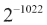
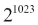
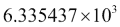
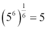
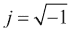
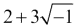
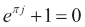
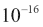
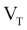

# 第二章：简单数据类型

现在，我们将探讨一些既是内置类型又是 Python 标准库一部分的数据类型。我们将从 Python 的数值类型开始。这些包括三个内置类型：`int`，`float`和`complex`，以及标准库类型`Fraction`和`Decimal`。

我们还将探讨字符串，`str`，以及简单的集合，`tuple`。这些比数字更复杂，因为它们包含多个项目。由于它们的行为比我们在后续章节中将要看到的对象类型要简单，因此它们可以作为 Python 中序列一般概念的良好介绍。

注意`Fraction`和`Decimal`名称的字母大小写。内置类型名称以小写字母开头。我们必须导入的类型有一个以小写字母开头的模块名称，但类型名称以大写字母开头。这种约定很普遍，但并非普遍适用。

本章我们将探讨的所有类型都具有不可变性的共同特征。这个概念适用于我们将要查看的两个集合：一旦构建，字符串或元组就不能更改。我们不会更改它，而是创建一个新的对象。在第六章，*更复杂的数据类型*中，我们将查看可以更新而不需要创建新对象的集合。

在本章中，我们将探讨内置的将字符串表示转换为其他表示以及从其他表示转换为字符串表示的函数。这有助于我们在显示输出或将字符串输入转换为有用的 Python 对象时。

注意，我们仍在轻松地处理正式的 Python 语法。我们将推迟对语法规则的详细审查，直到第三章，*表达式和输出*。现在，我们关注的简单表达式语句必须限制在单行内。

# 介绍内置运算符

在查看各种可用的数字类型之前，我们将介绍 Python 运算符。运算符分为三大类：

| 组 | 运算符 |
| --- | --- |
| 算术 | `+`, `-`, `*`, `**`, `/`, `//`, `%` |
| 位运算 | `<<`, `>>`, `&`, `&#124;`, `^`, `~` |
| 比较 | `<`, `>`, `<=`, `>=`, `==`, `!=` |

这些组之间的差异部分是主观的。比较运算符的工作方式在技术上只有细微差别。大多数运算符是二元的，只有一个（`~`）是一元的，而少数（`+`, `-`, `*`, `**`）可以在两种上下文中使用。

`+`, `-`, `*`, `/` 和 `%` 运算符的含义与其他编程语言中使用的类似。`–` 和 `+` 有算术含义。Python 在将一个数字提升到幂时使用 `**` 运算符。`**` 运算符的优先级高于一元形式 `-`；这意味着 `-2**4` 的结果是 `-16`。

位运算符仅适用于整数。它们也适用于集合。这些绝对不是逻辑运算符。实际的逻辑运算符在 第五章，*逻辑、比较和条件* 中描述。

## 进行比较

比较运算符（`<`, `>`, `==`, `!=`, `<=`, `>=`）的含义与其他编程语言中使用的类似。强制类型转换规则适用于数字之间的比较。如果对象是混合类型，其中一个对象将被强制“向上”转换到数值塔中的浮点数，或者从浮点数到复数。比较的结果是一个布尔值（`True` 或 `False`），无论两个操作数的类型如何。

各种强制类型转换规则不适用于字符串或其他对象。字符串不会隐式转换为数字。`2 != '2'` 是真的，因为整数 `2` 不是一个字符串 `'2'`。

一些流行的语言（例如 Java、C++）有原始类型，如 `int` 或 `long`，它们不是正确的对象——它们不是类的实例——并且适用于对象的规则不适用于它们。Java 允许对 `int` 对象使用 `==` 比较操作，但使用相同的比较运算符与字符串对象比较并不比较两个字符串的字符，它只比较引用。这与 Python 完全不同。所有 Python 对象都是类的正确实例：Python 字符串中的 `==` 比较是逐字符比较两个字符串。

我们将在 第五章，*逻辑、比较和条件* 中更详细地研究比较。

## 使用整数

Python 的整数是 `int` 类的对象。这些对象具有最多的运算符，包括所有算术、位运算和比较运算符。

整数值受可用内存限制。这意味着它们可以非常大。我们可以轻松地计算 1,000!，一个超过 2,500 位的数。我们将细节留到 第八章，*更高级的功能*。具有类似巨大规模的数有：

```py
>>> 2**8530
610749...581824
```

这是一个非常大的数。我们省略了其中大部分。它很容易在 Python 中表示。

通常，我们以十进制（基数 10）提供整数字面量。我们也可以用三种其他基数编写字面量：十六进制、八进制和二进制。

`0x` 前缀是十六进制值的标志：`0x10` 是 `16`。我们可以使用字母 `a-f`，这在许多其他编程语言中很典型；`0xdeadbeef` 是有效的。前缀 `0o`（零和字母 o）用于八进制；尽量避免使用恶意混淆的 `0O`（零和大写 O）作为八进制值，例如，`0o33653337357`。我们可以使用 `0b` 前缀来编写二进制字面量值：`0b10` 是 `2`。非十进制数最常见的用途是提供字节数组的十六进制值，这相对较少。

### 使用位运算符

位运算符是为整数定义的。它们不为复数或浮点对象定义。

`<<`和`>>`运算符执行位移。例如，`1 << 8`是 256。我们已经将值 1 向左移动了 8 位位置。

`&`、`|`和`^`运算符计算两个整数值的按位“与”、“按位或”和按位“异或”。以下是一些示例：

```py
>>> 9 & 5
1
>>> 9 | 5
13
>>> 9 ^ 3
10
```

为了可视化这些运算符，我们可以使用`bin()`函数来查看涉及的二进制值。

```py
>>> bin(9)
'0b1001'
>>> bin(5)
'0b101'
```

使用`bin()`函数可以阐明`9|5`的位如何组合以创建`13`的位。`~`运算符是整数值的按位二进制补码。例如，`~14`是`-15`。这些绝对不是逻辑运算符。逻辑运算符在第五章中描述，*逻辑、比较和条件*。

### 小贴士

不要混淆`a & b`与`a and b`：

+   `a & b`计算整数*a*和*b*中位的按位“与”。

+   `a and b`基于*a*和*b*的真值计算布尔“与”。

## 使用有理数

有理数是由两个整数值组成的分数。Python 没有内置的有理数类型。我们必须使用以下方式导入`Fraction`类：

```py
>>> from fractions import Fraction
```

这将引入`Fraction`类的定义到我们的全局环境中。一旦我们有了这个，我们就可以创建`Fraction`类的对象，如下所示：

```py
>>> Fraction(355,113)
Fraction(355, 113)
```

算术和比较运算符适用于分数。在进行混合类型表达式时，分数适合于整数之上的数值塔和浮点值之下。以下是将整数强制转换为分数的示例：

```py
>>> Fraction(4,2)*3
Fraction(6, 1)
```

执行涉及`Fraction`值和`int`值的操作需要将`int`对象强制转换为`Fraction`类。

我们可以使用它们的属性名称提取分数的分子和分母。以下是一个示例：

```py
>>> a= Fraction(355,113)*5
>>> a.numerator
1775
>>> a.denominator
113
```

我们从一个涉及`Fraction`对象和整数的表达式中创建了一个`Fraction`对象`a`。然后我们提取了变量`a`的`numerator`（分子）和`denominator`（分母）属性。

## 使用十进制数

对于货币计算，我们通常使用`Decimal`数。Python 没有内置的十进制数类型。我们使用以下方式导入`Decimal`类：

```py
>>> from decimal import Decimal
```

这将引入`Decimal`类的定义到我们的全局环境中。我们现在可以创建`Decimal`对象。重要的是要避免意外地将`Decimal`和`float`值混合，因为`float`值只是近似值。为了确保`Decimal`值是精确的，我们必须只使用整数或字符串。

```py
>>> Decimal("2.72")
Decimal('2.72')
```

我们从一个字符串创建了一个`Decimal`值。生成的`Decimal`对象将精确地表示这个值，仔细保留适当的十进制位数，并根据需要向上或向下舍入。对于常见的金融计算，`Decimal`是必需的。以下是一个示例：

```py
>>> (Decimal('512.97')+Decimal('5.97'))*Decimal('0.075')
Decimal('38.92050')
```

我们添加了两个价格，$512.97 和$5.97，并计算了 7.5%的销售税。税额精确为$38.92050。这通常四舍五入到$38.92。

如果我们尝试使用浮点数进行此类财务计算，我们会遇到一些问题：

```py
>>> (512.97+5.97)*0.075
38.920500000000004
```

浮点近似值不会产生精确答案。

Python 的强制转换规则与`Decimal`和`int`值配合良好。我们可以计算`Decimal('3.99')*3`并得到`Decimal('11.97')`作为答案。

强制转换规则不是由`Decimal`和`float`类实现的。对于`Decimal`值强制转换为`float`值可能有些道理。另一方面，这可能在混合精确货币值和浮点近似值时表明一个深刻的编程错误。由于这是模糊的，并且有争议的，Python 遵循的一般方法可以用 Tim Peters 的*Python 之禅*中的一句话来总结：

> *面对歧义，拒绝猜测的诱惑。*

因此，混合`Decimal`和`float`会导致`TypeError`异常，而不是遵循强制转换到数值塔的规则，并从精确值转换为近似值。我们必须显式地将`Decimal`转换为`float`来进行混合类型表达式。

## 使用浮点数

浮点值是`float`类的一个实例。这些对象使用算术和比较运算符。它们不参与位操作符。

Python 浮点实现的细节可能有所不同。CPython 依赖于标准 C 库，这些库应该在广泛的硬件和操作系统平台上提供合理一致的结果。C 库通常使用 IEEE 754 浮点值；Python 的`float`类型是 C 语言的`double`。这意味着浮点数将是一个 64 位值，具有（实际上）53 位的分数和 11 位的指数。指数范围从到。

我们可以用两种方式写浮点数：作为带小数点的数字，以及用“科学”表示法：

```py
>>> 6335.437
6335.437
>>> 6.335437E3
6335.437
```

`E`表示法表示 10 的幂。这意味着 6.335437E3 是。

非常重要的是要注意，浮点值是一个近似值。我们无法强调它们不是精确的，并且不应该用于货币计算。以下是一个使用浮点近似值工作时的例子：

```py
>>> (5**6)**(1/6)
4.999999999999999
```

这在任何方面都不应该令人惊讶。从数学上讲，。由于像 1/6 这样的值没有精确的二进制表示，这种表达式揭示了使用近似值工作的后果。

浮点数使用二进制表示的事实导致了一些有趣的复杂情况。例如，1/6 这样的数没有精确的十进制表示；我们可以用 .1666... 来表示小数位无限重复。然而，例如 1/5 这样的数有一个精确的十进制表示，0.2。这两个数都没有精确的二进制表示。由于我们必须使用有限数量的位，我们会在理想化的值和数字计算机产生的有限值之间注意到细微的差异。

注意，虽然允许进行浮点数的精确相等比较，但这通常不是一个好主意。在 第五章，*逻辑、比较和条件* 中，我们将讨论如何使用一个狭窄的范围而不是精确相等。我们不需要 `a == b`，而需要关注 `abs(a-b) < ε`。

## 使用复数

Python 的数值塔顶是 `complex` 类型。它可以被视为由一对浮点数构成的表达式：一个是实数，另一个是虚数。虚数乘以 。我们用 `(2+3j)` 来表示 。

当处理复数时，我们通常导入 `cmath` 库而不是 `math` 库。`math.sqrt()` 函数仅限于与 `float` 值一起工作，并且会引发异常而不是提供一个虚数值。如果需要，`cmath.sqrt()` 函数将提供一个适当的虚数值。

这个库向我们展示了  是本质上正确的：

```py
>>> cmath.e**(cmath.pi*1j)+1
1.2246467991473532e-16j
```

注意，我们使用了 `1j` 来表示 。如果我们尝试使用标识符 `j`（前面没有数字），它会被视为一个简单的变量。`1j` 的值是一个复数字面量，因为它以数字开头并以 `j` 结尾。

由于浮点值大约有 53 位，大约是 16 个十进制数字，我们可以预期 `float` 对无理数如 `π` 和 `e` 的近似会有大约  的误差。

# 数值塔

我们已经看到了 Python 的三种内置数值类型：`int`、`float`、`complex`，以及从标准库中导入的两种更多类型——`Fraction` 和 `Decimal`。标准库中的 numbers 模块提供了四种数值类型的基类定义。我们很少需要显式地使用这个模块；当我们需要实现自己的数值类型时，这是一个惯例。

数值类型形成了一种类似于传统数学中看到的各种数字的“塔”。塔的底部是整数。有理数在整数之上。浮点值更上一层楼，而复数位于塔顶。

一个常见的期望是，一种语言将自动强制转换数值，以允许表达式如`2*2.718`正常工作并产生有用的结果。当乘以一个浮点值时，我们期望整数被强制转换为浮点值。

为了使这成为可能，有两个一般规则应用于二进制算术运算的结果：

+   如果两个操作数是同一类型，结果也将具有该类型。例如，`2 ** 1024`不会产生浮点结果。它会产生一个巨大的整数。

+   如果操作数是混合的，其中一个将会被强制“向上”转换到数值塔，从整数 → 有理数 → 浮点数 → 复数。

上述规则有一个显著的例外。`/`和`//`运算符定义了两种不同的除法。`/`运算符提供真正的除法：即使是整数操作数也会产生浮点结果。例如：

```py
>>> 355/113
3.1415929203539825
```

`//`运算符提供向下取整除法：结果将被截断，就像它是一个仅包含整数的除法。结果类型不会被强制转换，但答案将被截断。例如：

```py
>>> 355./113.
3.1415929203539825
>>> 355.//113.
3.0
```

`//`运算符的存在意味着一个以整数设计的表达式也将正确地与浮点值一起工作。同样，我们可能编写一个带有非正式浮点值期望的表达式；通过使用`/`，它也将与整数一起工作。

注意，这些数值类型的强制转换规则不适用于字符串或其他对象。字符串不会隐式转换为数字。表达式`'2'+2`会导致一个`TypeError`异常。我们将在*使用内置转换函数*部分稍后查看显式转换。

桥楼隐喻提供了一个方便的记忆强制转换规则的方法。给定来自不同层级的两个值，较低层级的值将被强制转换到塔的较高层级。

# 数学库

Python 库有六个与数学工作相关的模块。这些在*Python 标准库*文档的*第九章*，*数值和数学模块*中进行了描述。除此之外，我们还有外部库，如 NumPy ([`www.numpy.org`](http://www.numpy.org)) 和 SciPy ([`www.scipy.org`](http://www.scipy.org))。这些库包括大量的复杂算法。对于更复杂的工具集，Anaconda 项目 ([`store.continuum.io/cshop/anaconda/`](https://store.continuum.io/cshop/anaconda/)) 结合了 NumPy、SciPy 和另外 18 个包。

这些是相关的内置数值包：

+   `numbers`：此模块定义了基本的数值抽象。除非我们要发明一种全新的数字类型，否则我们很少需要它。

+   `math`：这个模块包含大量函数。它包括基本的`sqrt()`，各种三角函数（正弦、余弦等）以及各种与对数相关的函数。它有处理浮点数内部结构的函数。它还包括伽玛函数和误差函数。

+   `cmath`：这个模块是`math`库的复数版本。我们使用`cmath`库，以便可以在`float`和`complex`值之间无缝切换。

+   `decimal`：从这个模块导入`Decimal`类以准确处理货币值。

+   `fractions`：导入`Fraction`类以处理精确的有理分数值。

+   `random`：这个模块包含基本的随机数生成器。它有许多其他函数可以产生各种范围或具有各种约束的随机值。例如`random.gauss()`产生高斯、正态分布的浮点数值。

从这些库中导入的主要方式如下：

+   `import random`：当我们想明确指出代码中某个名称的来源时，我们会使用这个。我们将编写类似于`random.gauss()`和`random.randint()`的代码，使用模块名称作为明确的限定符。

+   `from random import gauss, randint`：这将从`random`模块中引入两个选定的名称到全局命名空间。我们可以使用`gauss()`和`randint()`而不需要限定模块名称。

+   `from random import *`：这将把`random`模块中所有可用的名称引入我们的应用程序的全局命名空间。这在探索和实验`>>>`提示符时很有帮助。这可能不适合在更大的程序中使用，因为它可能会引入大量无关的名称。

一个不太常用的功能允许我们重命名通过`import`语句引入的对象。我们可能想使用`from cmath import sqrt as csqrt`来将`cmath.sqrt()`函数重命名为`csqrt()`。在使用这个`import-as`重命名功能时，我们必须小心避免歧义和混淆。

# 使用位和布尔值

如前所述，位运算符`&`、`|`、`^`和`~`与 Python 的实际布尔运算符`and`、`or`、`not`和`if-else`没有任何关系。我们将在第五章中探讨布尔值、逻辑运算符和相关编程，*逻辑、比较和条件*。

如果我们用位运算符`&`或`|`代替逻辑运算符`and`或`or`，事情可能会显得非常奇怪：

```py
>>> 5 > 6 & 3 > 1
True
>>> (5 > 6) & (3 > 1)
False
```

第一个例子显然是错误的。为什么？这是因为`&`运算符的优先级相对较高。它不是一个逻辑连接符，更像是一个算术运算符。`&`运算符首先执行：`6&3`的结果是 2。因此，结果表达式`5 > 2 > 1`是`True`。

当我们将比较分组以首先执行时，我们将得到`5>6`的`False`和`3>1`的`True`。当我们应用`&`运算符时，结果将是`False`，这正是我们所期望的。如果我们使用括号确保位运算符最后执行，那么不适当地将位运算符用作逻辑连接词可能会工作。然而，这是一个非常糟糕的想法。

使用第五章中展示的正确布尔运算符更容易、更清晰，总体上更好。

# 与序列一起工作

在本章中，我们将介绍 Python 序列集合。我们将以字符串和元组作为此类的前两个示例。Python 提供了一系列其他序列集合；我们将在第六章中探讨它们，*更复杂的数据类型*。所有这些序列都有共同的特征。

Python 序列通过位置标识单个元素。位置数字从零开始。以下是一个包含五个元素的`tuple`集合：

```py
>>> t=("hello", 3.14, 23, None, True)
>>> t[0]
'hello'
>>> t[4]
True
```

除了预期的升序数字外，Python 还提供了反向编号。位置`-1`是序列的末尾：

```py
>>> t[-1]
True
>>> t[-2]
>>> t[-5]
'hello'
```

注意，位置 3（或-2）的值为`None`。REPL 不会显示`None`对象，所以`t[-2]`的值看起来是缺失的。为了更明显地证明这个值是`None`，请使用以下方法：

```py
>>> t[3] is None
True
```

序列使用一个额外的比较运算符`in`。我们可以询问给定值是否出现在集合中：

```py
>>> "hello" in t
True
>>> 2.718 in t
False
```

## 切片和切块序列

我们可以使用更复杂的下标表达式从序列中提取一个子序列，称为**切片**。以下是一个较长字符串的子字符串：

```py
>>> "multifaceted"[5:10]
'facet'
```

`[5:10]`表达式是一个从位置 5 开始并延伸到位置 10 之前的切片。Python 通常依赖于“半开”区间。切片的起始位置包括在内，而停止位置不包括在内。

我们可以从切片中省略起始位置，写作`[:pos]`。如果省略切片的起始值，则默认为 0。我们也可以省略结束，写作`[pos:]`。如果省略切片的停止值，则默认为序列的长度，由`len()`函数给出。

Python 使用这些半开区间的方式意味着我们可以用非常整洁的语法对字符串进行分区：

```py
>>> "multifaceted"[:5]
'multi'
>>> "multifaceted"[5:]
'faceted'
```

在这个例子中，我们在第一个切片中取了前五个字符。我们在第二个切片中取了第一个五个字符之后的所有内容。由于这两个数字都是五，我们可以完全确信整个字符串都被考虑在内。

是的，我们可以从切片中省略两个值：`"word"[:]`将创建整个字符串的副本。这是一个奇特但有时有用的结构，用于复制对象。

切片有一个第三个参数。我们通常称这些位置为**起始位置**、**结束位置**和**步长**。默认步长为 1。我们可以使用类似`"abcdefg"[::2]`的形式来提供一个显式的步长，并选择位置为 0、2、4 和 6 的字符。形式`"abcdefg"[1::2]`将选择奇数位置：1、3 和 5。

步长也可以是负数。这将按相反的顺序枚举索引值。`"word"[::-1]`的值是`'drow'`。

# 使用字符串和字节值

Python 字符串值在某些方面与简单的数值类型相似。有一些类似算术的运算符可用，所有的比较操作都定义了。字符串是不可变的：我们无法更改字符串。然而，我们可以轻松地从现有字符串构建新的字符串，使得字符串对象的可变性问题和数字对象的可变性问题一样无关紧要。Python 有两种字符串值：

+   **Unicode**：这些字符串使用整个 Unicode 字符集。这是 Python 默认使用的字符串。输入输出库都支持广泛的 Unicode 编码和解码。这种类型的名称是`str`。它是一个内置类型，因此以小写字母开头。

+   **字节**：许多文件格式和网络协议是基于字节定义的，而不是基于 Unicode 字符。Python 使用 ASCII 编码来处理字节。处理字节时必须做出特殊安排。内部类型名称是`bytes`。

我们可以轻松地将 Unicode 编码成一系列字节。我们同样可以轻松地将一系列字节解码以查看 Unicode 字符。我们将在查看字面量和运算符之后，在*在 Unicode 和字节之间转换*部分展示这两种方法。

## 编写字符串字面量

字符串字面量是由字符串分隔符包围的字符。Python 提供了各种字符串分隔符来解决各种问题。最常见的字面量创建 Unicode 字符串：

+   **短字符串**：使用`"`或`'`来包围字符串。例如：`"Don't Touch"`包含一个嵌入的撇号。`'Speak "friend" and enter'`包含嵌入的引号。在罕见的情况下，如果我们两者都有，我们可以使用`\`来避免引号：`'"Don\'t touch," he said.'`使用撇号作为分隔符，并在字符串内部使用转义撇号。虽然字符串字面量必须在单行上完整，但`'\n'`在内部会扩展成一个正确的换行符。

+   **长字符串**：使用`"""`或`'''`来包围多行字符串。字符串可以跨越必要的行数。长字符串可以包含任何字符，除了终止的三重引号或三重撇号。

Python 有适量的`\`转义序列，允许我们输入无法从键盘输入的字符。如果我们使用普通的`str`字面量，Python 会将所有转义序列替换为正确的 Unicode 字符。在一个普通的`bytes`字面量中，每个转义序列都变成一个单字节 ASCII 字符。

许多 Python 程序以纯 ASCII 文本保存，但这不是必需的。当以 ASCII 保存文件时，需要转义非 ASCII Unicode 字符。当以 Unicode 保存文件时，则需要相对较少的转义，因为键盘上可用的任何 Unicode 字符都可以直接输入。以下是相同字符串的两个示例：

```py
>>> "String with π×r²"
>>> "String with \u03c0\u00d7r\N{superscript two}"
```

第一字符串使用 Unicode 字符；为了使此功能正常工作，文件必须以适当的编码保存，例如 UTF-8。第二个字符串使用转义序列来描述 Unicode 字符。`\u`序列后面跟着一个四位十六进制值。`\N{...}`转义允许字符的名称。`\U`转义（在示例中没有显示）需要一个八位十六进制值。第二个示例可以保存为任何编码，包括 ASCII。

最常用的转义序列是`\"`、`\'`、`\n`、`\t`和`\\`，用于在引号字符串内创建引号，在单引号分隔的字符串内创建撇号，换行，制表符和一个`\`字符。还有一些其他的，但它们的含义如此晦涩，通常数字代码更有意义。例如，`\v`可能应该写成`\x0b`或`\u000b`；`\v`背后的原始含义在很大程度上已经失传。

注意，`'\u000b'`被替换为实际的 Unicode 字符。我们还有`'\u240b'`，这是一个 Unicode 符号，''，表示垂直制表符字符。大多数非打印 ASCII 控制字符也有这些符号表示。

## 使用原始字符串字面量

有时，我们需要提供`\`字符不是转义字符的字符串。例如，在准备正则表达式时，我们宁愿不被迫写`\\`来表示单个`\`字符。同样，当与 Windows 文件名一起工作时，我们不希望`"C:\temp"`中的 ASCII 水平制表符字符（`'\u0008'`）替换字符串字面量中间的`'\t'`序列。我们可以写成`"C:\\temp"`，但这似乎容易出错。

为了避免这种转义处理，Python 提供了**原始字符串**。我们可以将前四种分隔符中的任何一种前缀加上字母`r`或`R`。例如，`r'\b[a-zA-Z_]\w+\b'`是一个原始字符串。Python 将保留`\`字符：`\b`序列不会被转换为`\u0008`字符。

如果我们不使用`r"`字符作为原始字符串的分隔符来做这件事，我们将创建一个与以下等效的字符串字面量：`'\x08[a-zA-Z_]\\w+\x08'`。这显示了在非原始字符串中`\b`字符是如何转换为`\x08`的。省略开头的`r'`会导致一个不表示我们意图的正则表达式的字符串。

## 使用字节字符串字面量

我们可能需要在我们的程序中包含字节字符串以及 Unicode 字符串。为了做到这一点，我们在字符串分隔符前使用`b`或`B`前缀。字节字符串限于 ASCII 字符和产生单个字节 ASCII 字符的转义序列。

通常，字节字符串关注十六进制转义，`\xhh`，对于字节字符串使用两个十六进制数字。我们也可以使用八进制转义，`\odd`，使用八进制数字。

我们还可以使用`r`或`R`与`b`或`B`结合作为字符串前缀的任何组合来准备原始字节字符串。以下是一个 ASCII 字节中的正则表达式：

```py
>>> rb"\\x[0-9a-fA-F]+"
b'\\\\x[0-9a-fA-F]+'
```

输出使用 Python 的规范表示法，使用长转义序列表示`'\\'`正则表达式模式。

为了严谨，我们还可以使用`u"`前缀来明确表示给定的字符串是 Unicode。这相对较少见，因为它重申了默认假设。在以字节字符串为主体的程序中，使用`u"some string"`可以使 Unicode 字面量从众多的`b"bytes"`字面量中脱颖而出。

## 使用字符串运算符

两个算术运算符`+`和`*`在字符串对象的两类`str`和`bytes`中都有定义。我们可以使用`+`运算符来连接两个字符串对象，创建一个更长的字符串。有趣的是，我们可以使用`*`运算符将字符串与整数相乘以创建一个更长的字符串：`"="*3`是`'==='`。

此外，相邻的字符串字面量在代码解析期间合并为一个更大的字符串。以下是一个示例：

```py
>>> "adjacent " 'literals'
'adjacent literals'
```

由于这发生在解析时间，它仅适用于字符串字面量。对于变量或其他表达式，必须使用正确的`+`运算符。

所有比较运算符都适用于字符串。比较运算符逐字符比较两个字符串。我们将在第五章中详细探讨这一点，*逻辑、比较和条件*。

我们不能使用混合类型的操作数与字符串运算符。使用`"hello" + b"world"`将引发`TypeError`异常。我们必须将 Unicode `str`编码为`bytes`，或者将`bytes`解码为 Unicode `str`对象。

字符串是序列集合。我们可以从中提取字符和切片。字符串还与`in`运算符一起工作。我们可以询问特定的字符或子字符串是否出现在字符串中，如下所示：

```py
>>> "i" in "bankrupted"
False
>>> "bank" in "bankrupted"
True
```

第一个例子显示了`in`运算符的典型用法：检查给定项是否在集合中。这种`in`的用法适用于许多其他类型的集合。第二个例子显示了字符串特有的功能：我们在较长的字符串中寻找给定的子字符串。

## 在 Unicode 和字节之间转换

大多数 Python I/O 库都了解操作系统文件编码。当处理文本文件时，我们很少需要显式提供编码。我们将在第十章*文件、数据库、网络和上下文*中检查 Python 输入输出能力的细节。

当我们需要将 Unicode 字符编码为字节字符串时，我们使用字符串的`encode()`方法。以下是一个示例：

```py
>>> 'String with π×r²'.encode("utf-8")
b'String with \xcf\x80\xc3\x97r\xc2\xb2'
```

我们提供了一个字面 Unicode 字符串，并将其编码为 UTF-8 字节。Python 有众多的编码方案，所有这些都在`codecs`模块中定义。

为了解码由字节字符串表示的 Unicode 字符串，我们使用字节的`decode()`方法。以下是一个示例：

```py
>>> b'very \xe2\x98\xba\xef\xb8\x8e'.decode('utf-8')
'very ☺︎'
```

我们提供了一个包含十一个单独十六进制编码字节的字节字符串。我们将这些解码以包含六个 Unicode 字符。

注意，对于支持的编码有多个别名。我们使用了`"utf-8"`和`"UTF-8"`。在*Python 标准库*的`codecs`章节中还有更多解释。

`ASCII`编解码器是这些中最常用的。除了`ASCII`之外，许多字符串和文本文件都编码为`UTF-8`。在从互联网下载数据时，通常有一个标题或其他指示符提供编码，在极少数情况下，它不是`UTF-8`。

在某些情况下，我们有一个以字节形式编写的文档，使用传统的 ASCII。为了处理 ASCII 文件，我们将从 ASCII 编码的字节转换为 Unicode 字符。同样，我们可以使用 ASCII 编码而不是 UTF-8 来编码 Unicode 字符的子集。

可能存在这样的情况，即给定的字节序列未能正确编码 Unicode 字符。这可能是因为使用了错误的编码来解码字节。或者可能是字节本身不正确。`decode()`方法有额外的参数来定义当字节无法解码时应该做什么。错误参数的值是字符串：

+   `"strict"`表示将引发异常。这是默认值。

+   `"ignore"`表示将跳过无效的字节。

+   `"replace"`表示将插入默认字符。这在`codecs`模块中定义。`'\ufffd'`字符是默认替换字符。

错误处理的选项非常特定于应用程序。

## 使用字符串方法

字符串对象有大量的方法函数。其中大部分既适用于`str`对象也适用于`bytes`对象。这些可以分成四组：

+   **转换器**：从旧字符串创建新字符串

+   **创建器**：从非字符串对象（或多个对象）创建字符串

+   **访问器**：访问字符串并返回有关该字符串的事实

+   **解析器**：检查字符串并将其分解，或从字符串创建新的数据对象

方法函数的转换器组包括 `capitalize()`、`center()`、`expandtabs()`、`ljust()`、`lower()`、`rjust()`、`swapcase()`、`title()`、`upper()` 和 `zfill()`。这些方法都对字符串中的字符进行一般性更改以创建转换后的结果。例如，`lower()` 和 `upper()` 方法经常用于比较时规范化大小写：

```py
>>> "WoRd".lower()
'word'
```

使用这种技术可以让我们编写对字符字符串中的小错误更加宽容的程序。

其他转换器包括 `strip()`、`rstrip()`、`lstrip()` 和 `replace()` 等函数。strip 家族的函数用于删除空白字符。通常在输入行上使用 `rstrip()` 来删除任何尾随空格和可能存在的尾随换行符。

`replace()` 函数用于将任何子字符串替换为另一个子字符串。如果我们想进行多次独立的替换，我们可以这样做。

```py
>>> "$12,345.00".replace("$","").replace(",","")
'12345.00'
```

这将创建一个中间字符串，其中已移除 "`$`"。它将从这个中间字符串中创建第二个中间字符串，其中已移除 `,` 字符。这种处理对于清理原始数据很有用。

## 访问字符串的详细信息

我们使用访问器方法来确定有关字符串的事实；结果可能是布尔值或整数值。例如，`count()` 方法返回在对象字符串中找到的参数子字符串或字符的次数。

一些常用的方法包括 `find()`、`rfind()`、`index()` 和 `rindex()` 方法，这些方法将在对象字符串中查找子字符串的位置。如果找不到子字符串，`find()` 方法返回特殊值 `-1`。如果找不到子字符串，`index()` 方法会引发 `ValueError` 异常。带有 "r" 的版本查找目标子字符串的最右侧出现。所有这些方法都适用于 `str` 和 `bytes` 对象。

`endswith()` 和 `startswith()` 方法是布尔函数；它们检查字符串的开始或结束。以下是一些示例：

```py
>>> "pleonastic".endswith("tic")
True
>>> "rediscount".find("disc")
2
>>> "postlaunch".find("not")
-1
```

第一个示例显示了如何使用 `endswith()` 方法检查字符串的结尾。第二个示例显示了 `find()` 方法如何在较长的字符串中定位给定子字符串的偏移量。第三个示例显示了如果找不到子字符串，`find()` 方法返回信号值 -1。

此外，还有七个布尔模式匹配函数。这些是 `isalnum()`、`isalpha()`、`isdigit()`、`islower()`、`isspace()`、`istitle()` 和 `isupper()`。如果函数与给定的模式匹配，则返回 `True`。例如，`"13210".isdigit()` 返回 `True`。

## 将字符串解析为子字符串

有一些方法函数我们可以用来将字符串分解为子字符串。我们将在第三章表达式和输出中详细查看 `split()`、`join()` 和 `partition()`。

作为快速概述，我们将指出 `split()` 方法根据定位一个可能重复的分隔符子字符串将字符串分割成一系列字符串。我们可能使用这样的表达式 `'01.03.05.15'.split('.')` 来从较长的字符串中创建序列 `['01', '03', '05', '15']`，通过在 '`.`' 字符上分割。`join()` 方法是 `split()` 的逆操作。这意味着 `"-".join(['01', '03', '05', '15'])` 将从单个字符串和分隔符创建一个新的字符串；结果是 `'01-03-05-15'`。分区可以看作是一个单元素分割，用于将字符串的头部与尾部分开。

Python 的赋值语句处理返回多个值的这种方法非常优雅。在 第四章，*变量、赋值和作用域规则*，我们将更详细地研究多重赋值。

不应使用 `split()` 方法解析文件名，也不应使用 `join()` 方法构建文件名。有一个单独的模块 `os.path`，它通过应用 OS 特定的规则正确地处理这个问题。

# 使用 `tuple` 集合

`tuple` 是 Python 中可用的最简单的集合之一。它是 Python 序列的多种类型之一。`tuple` 有一个固定数量的项。例如，我们可能处理 (*x*, *y*) 坐标或 (*r*, *g*, *b*) 颜色。在这些情况下，每个 `tuple` 中的元素数量由问题域固定。我们不希望有一个长度可变的集合的灵活性。

通常，我们会在 `tuple` 的周围加上 `()` 来将其与周围的语法区分开来。这并不总是必需的；Python 在某些常见上下文中会隐式地创建 `tuple` 对象。然而，这始终是一个好主意。如果我们编写一个这样的赋值语句：

```py
a = 2, 3
```

这个语句将隐式地创建一个二元组 `(2, 3)`，并将对象赋值给变量 `a`。

`tuple` 类是 Python 的 `Sequence` 类族的一部分；我们可以使用它们的索引位置提取 `tuple` 的项。`str` 和 `byte` 类也是序列的例子。除了简单的索引值外，我们还可以使用切片符号从 `tuple` 中选择项。

值 `()` 是一个零长度的 `tuple`。要创建单元素 `tuple`，我们必须使用 `()` 并包含一个逗号字符：这意味着 `(12,)` 是一个单元素 `tuple`。如果我们省略逗号字符，我们写的是一个表达式，而不是单元素 `tuple`。

单元素 `tuple` 必须有一个尾随的逗号。在 `tuple` 的末尾多出的逗号在其它地方会被静默忽略：`(1, 1, 2)` 等于 `(1, 1, 2,)`。

`tuple` 类仅提供两种方法函数：`count()` 和 `index()`。我们可以计算一个给定项在 `tuple` 中出现的次数，并且可以定位一个项在 `tuple` 中的位置。

# `None` 对象

Python 中非常简单的一种对象类型是`None`对象。它有几个方法，并且只有一个此类对象的实例可用。这是一个方便的方式来标识某些内容缺失或不适用。它通常用作函数可选参数的默认值。

`None`对象是一个单例；只能有一个。这个对象是不可变的：我们无法以任何方式更改它。

在 Python 的交互式使用中，REPL 不会打印`None`对象。例如，当我们评估`print()`函数时，此函数的正确结果始终是`None`。此函数的副作用是在我们的控制台上打印内容。展望第三章，我们将给出一个返回`None`的函数的快速示例：

```py
>>> a = print("hello world")
hello world
>>> a
>>> a is None
True
```

我们已经评估了`print()`函数，并将打印函数的结果保存在`a`变量中。打印的可见副作用是在控制台上看到字符串值。结果是`None`对象，它不会被打印。然而，我们可以使用`is`比较运算符来查看`a`的值确实是`None`对象。

# 不可变性的后果

Python 有两种广泛的对象类型：可变和不可变。可变对象有一个内部状态，可以通过使用运算符或方法函数来更新。不可变对象的状态不能被更改。

不可变对象的典范例子是数字。数字`2`必须始终在 1 和 3 之间有一个单一的、不可变的价值。我们不能改变`2`的状态使其变为`3`，否则就是对数学真理概念的嘲讽。

在第六章中，我们将探讨许多可变数据结构。最重要的三个可变集合是`set`、`list`和`dict`。这些对象可以添加和删除项目；我们可以改变对象的状态。

除了数字是不可变的之外，还有三种其他常见的数据结构也是不可变的：`str`、`bytes`和`tuple`。因为字符串和字节是不可变的，所以字符串操作方法总是会从一个或多个现有的字符串对象创建一个新的字符串对象。

这意味着我们无法在较长的字符串中修改字符或子字符串。我们可能会认为需要尝试类似以下操作：

```py
>>> word="vokalizers"
>>> word[2]= "c"
```

但这行不通，因为字符串对象是不可变的。我们总是从旧字符串的部分构建新的字符串。我们这样做：

```py
>>> word= word[:2]+"c"+word[3:]
```

这通过提取原始字符串的片段并包含新旧字符的混合来实现。

# 使用内置的转换函数

在本章中，我们看到了各种数据类型中的许多转换函数。每个内置的数值类型都有一个合适的构造函数。与许多 Python 函数一样，这些函数可以处理多种不同类型的参数：

+   `int()`: 从各种其他对象创建`int`

    +   `int(3.718)`用于另一个数字

    +   `int('48879')`用于十进制基数的字符串

    +   `int('beef', 16)`用于给定基数的字符串——在这个例子中是 16

    +   `int()`函数可以忽略用 Python 字面量语法编写的数字上的额外前缀字符：`int('0b1010',2)`，`int('0xbeef',16)`，和`int('0o123',8)`

+   `float()`：从其他对象创建`float`

    +   `float(7331)`用于另一个数字

    +   `float('4.8879e5')`用于十进制字符串

+   `complex()`：从各种对象创建`complex`值

    +   `complex(23)`创建`(23+0j)`

    +   `complex(23, 3)`创建`(23+3j)`

    +   `complex('23+2j')`创建`(23+2j)`

我们可以将单个数字、数字对，甚至某些字符串转换为`Fraction`对象：

+   `Fraction(2,3)`：这是创建`Fraction`对象最常见的方式。

+   `Fraction(2.718)`：这创建了一个值`Fraction(765048986699563, 281474976710656)`。这表明浮点值实际上是近似值。如果我们想要一个更精确的值，我们应该自己进行有意义的转换，使用`Fraction(2718,1000)`，这将避免许多浮点值中存在的错误位。

+   `Fraction("3/4")`：这也非常好地创建了一个合适的`Fraction`对象。

当我们将浮点值转换为`Fraction`时，结果看起来很奇怪。然而，考虑到浮点值是近似值，`Fraction`值揭示了近似值的本质。

我们还可以将整数、字符串和浮点数转换为`Decimal`对象：

+   `Decimal(2)`：有趣的是，这会产生`Decimal('2')`作为结果。这表明`Decimal`值的首选格式是字符串。

+   `Decimal('2.718')`：这将产生预期的值。这通常是我们创建`Decimal`对象的方式。

+   `Decimal(2.718)`：这将产生一个反映浮点近似值的值：`Decimal('2.717999999999999971578290569595992565155029296875')`。正因为如此，我们通常避免从`float`对象创建`Decimal`对象。

我们从数字到各种类型的字符串有几种额外的转换：`bin()`，`oct()`，`hex()`和`str()`分别产生 2，8，16 和 10 的基字符串。我们还可以使用数字的多种格式化功能，使用`"{0:b}".format(x)`进行二进制，`"{0:o}".format(x)`进行八进制，和`"{0:x}".format(x)`进行十六进制。如果我们包括格式字符串中的"`#`"修饰符，我们在产生的字符串中就有相当大的灵活性。例如：

```py
>>> "{0:x}".format(12)
'c'
>>> "{0:#x}".format(12)
'0xc'
```

这些函数展示了从字符串创建数字以及从数字创建格式化字符串的许多不同方式。

# 摘要

我们已经查看了一些 Python 中可用的核心数据类型。我们查看了几种不同类型的数字，包括整数、浮点数、复数、`Fraction`和`Decimal`。每个都填补了不同的领域。其中三个是内置的，另外两个必须从标准库中导入。

我们还探讨了三种不同类型的集合。`tuple`是一个相对简单且方法较少的项序列。`str`是一个 Unicode 字符串，它有几种方法可以创建新的字符串，作为现有字符串的转换。`bytes`是一个字节字符串，它也有各种方法。我们可以将字节解码为 Unicode 字符串。我们也可以将 Unicode 字符串编码为字节。

我们已经讨论了如何使用`import`语句来引入新的类型和模块。这将添加标准库中的功能。

我们还研究了多个函数，用于转换各种数值类型。许多这些函数也将字符串转换为数字。我们将大量使用`int()`和`float()`函数将字符串转换为数字。然而，使用`str()`函数进行反向转换——将数字转换为字符串——可以做得更好。然而，在下一章中，我们将探讨的格式化工具可以做得更好。

在第三章中，我们将在此基础上构建基本概念。我们将更深入地研究 Python 语言的语法。我们还将研究用于创建格式化输出的函数。这将使我们能够编写简单的程序。在第四章第四章中，我们将添加更多基本语言特性，以便我们可以编写更复杂的程序。
