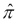

# 第四章：变量、赋值和作用域规则

表达式创建对象；我们可以将对象赋值给变量以保留它们供将来使用。Python 在赋值主题上提供了一系列变体。除了简单地赋值给单个变量外，我们还可以将元组中的项赋值给多个变量。我们还可以将运算符与赋值结合，以更新可变对象。

在本章中，我们还将探讨`input()`函数作为将新对象引入运行脚本的一种方式。这有限制——它无法与合适的**图形用户界面**（**GUI**）相提并论。然而，它将帮助我们学习更多 Python 编程技术，在我们介绍如何在第十章中从文件和文件系统中读取数据之前。

我们还将探讨一些重要的 Python 语言概念。我们将探讨 Python 程序总是以通用方式编写的的方式，而不绑定到特定数据类型或类。我们还将探讨命名空间的一般概念，以及它在各种 Python 语言构造中的应用。它定义了标识符可见的作用域；随着我们的程序变得更加复杂，这将成为越来越重要的事情。

# 简单的赋值和变量

我们在前面章节中已经看到了几个 Python 基本赋值语句的例子。该语句包括一个变量、`=`和一个表达式。由于单个对象是一个表达式，我们可以这样写：

```py
>>> pi = 3.14
```

这将创建浮点字面量`3.14`并将其赋值给名为`pi`的变量。

变量名必须遵循《Python 语言参考》中第 2.3 节“标识符和关键字”的规则。参考手册使用`unicodedata`模块提供的 Unicode 字符类定义。

关于编程语言标识符问题的有趣背景信息可在 Unicode 标准附录 31《Unicode 标识符和模式语法》中找到。这展示了 Python 中“标识符是什么？”的问题如何融入其他编程语言和世界各地使用的各种自然语言的更广泛背景中。

在 Python 中，标识符有一组小的起始字符；这些字符的选择是为了允许词法扫描器确定可以跟随的字符类型。如果标识符以数字开头，那么区分标识符和数字将会相当复杂。因此，标识符必须以字母或`_`开头。在初始字符之后，Python 允许标识符继续使用可能来自更大字符集的字符：字母、数字和`_`。

我们所说的“字母”或“数字”究竟是什么意思？在 Python 的早期版本中，这些术语由基于拉丁字母的 ASCII 字母表定义。使用 Unicode 意味着这些术语现在有更包容的定义。

Python 定义的标识符起始字符属于以下 Unicode 类别：大写字母（`Lu`），小写字母（`Ll`），标题字母（`Lt`），修饰字母（`Lm`），其他字母（`Lo`），和字母数字（`Nl`）。Python 还包括`Other_ID_Start`类别中的小字符集。这些类别定义的字符集很大。例如，`a-z`和`A-Z`范围内的拉丁字母属于这个集合。当编写更多数学导向的程序时，希腊字母`α-ω`和`A-Ω`也可以用作标识符起始字符。我们可以这样写：

```py
>>> π = 355/113
```

这将表达式的结果赋值给变量，`π`。一些程序员发现他们的操作系统键盘界面使得使用非单一国家字母的字母难以使用；因此，他们建议专注于拉丁字母进行编程。

标识符可以继续使用前一段中定义的任何字母，下划线字符，以及以下类别的字符：非间距标记（`Mn`），间距组合标记（`Mc`），十进制数字（`Nd`），和连接标点（`Pc`）。这允许我们包括普通的十进制数字以及其他“组合”标记，这些标记会修改前面的字符。例如：

```py
>>> =p_2+0.5*p_1
```

这显示了字符**希腊小写字母 PI**后面跟着**组合重音符号**来创建一个“pi-hat”变量，。对于一些开发者来说，这可能难以输入，但它也可能很好地与使用这种符号组合的群体基因组公式相匹配。例如，遗传下降估计器使用。之前显示的表达式涉及两个其他变量，`p_2`和`p_1`，它们使用更常见的拉丁字母`_`和数字。

注意，以`__`（两个下划线）开头和结尾的变量名被 Python 保留用于特殊目的。例如，我们有全局变量如`__name__`、`__debug__`和`__file__`，这些变量在脚本开始运行时被设置。

我们的程序没有必要创建以`__`开头和结尾的新名称。我们没有被禁止创建这样的变量，但任何我们可能采用的名称都可能被 Python 的一些内部特性使用。

### 小贴士

最好假设所有以`__`（双下划线）开头和结尾的名称都被 Python 保留并执行特殊操作。即使名称在当前版本中没有使用，这并不意味着在未来的版本中不会使用。

# 多重赋值

我们在第二章*简单数据类型*中探讨了元组。使用元组的一个重要原因是有固定数量的项目。由于元组是一种序列，我们可以使用数字索引来引用元组内的项目。

考虑以下 RGB 三元组：

```py
>>> brick_red = (203, 65, 84)
```

我们可以使用`brick_red[0]`来获取这个三元组的红色元素。

我们也可以这样做：

```py
>>> r, g, b = brick_red
>>> r
203
```

我们使用多重赋值将 RGB 三元组分解为三个单独的变量。

当左侧 `=` 的变量数量与右侧集合中的项目数量匹配时，这会起作用。当处理固定大小的元组时，这是一个容易保证的条件。

当处理如 `list`、`set` 或 `dict` 这样的可变集合时，这种赋值可能不会很好用。如果我们不能保证可变集合中元素的数量，我们可能会遇到 `ValueError` 异常，因为我们的集合与变量的数量不匹配。

注意，Python 的语法灵活性意味着我们也可以这样做：

```py
>>> n, d = 355, 113
```

并非绝对必要将元组用 `()` 括起来。通常，在元组周围使用 `()` 是一种最佳实践。然而，在少数情况下，没有额外的括号，语句也是完全清晰的。

## 使用重复赋值

Python 允许我们编写这样的语句：`a = b = 0`。这必须谨慎使用，因为现在两个变量共享一个对象。当处理像数字、字符串和元组这样的不可变对象时，多个变量共享对公共对象的引用。

当我们在第六章中查看可变对象时，*更复杂的数据类型*，我们会看到这种重复赋值可能成为混淆的来源。虽然这种赋值是合法的，但它必须仅用于像数字、字符串或元组这样的不可变对象。

# 使用头部，*尾部赋值

当处理序列时，有一些算法通过将序列的头部与序列的其余部分分离来工作。我们可以通过赋值语句的变体来做这件事。我们喜欢称这种赋值语句为 `head, *tail =` 赋值语句。

假设我们有一个包含值的输入字符串，类似于这样：

```py
>>> line = "255  73 108 Radical Red"
>>> line.split()
['255', '73', '108', 'Radical', 'Red']
```

我们使用 `line.split()` 将字符串分割成空格分隔的单词。在这种情况下，列表的头部是红色、绿色和蓝色元素的第一个三个字段。尾部是所有剩余的字段，即解析成单独单词的名字。

我们可以使用 `head, *tail =` 赋值来从剩余的文件中分离出前三个字段。

它看起来像这样：

```py
>>> r, g, b, *name = line.split()
>>> g
'73'
>>> name
['Radical', 'Red']
```

我们已经将前三个项目分配给了三个单独的变量，`r`、`g` 和 `b`。`*` 表示所有剩余的项目都将收集到一个单独的变量 `name` 中。

我们可以使用 `join()` 方法，以空格作为分隔字符串来重建原始名称：

```py
>>> " ".join(name)
'Radical Red'
```

我们使用空格将名为 `name` 的序列的元素连接起来。这将重建原始颜色名称作为一个单独的字符串，而不是一个单词列表。

# 增量赋值

增量赋值语句结合了一个运算符和赋值。一个常见的例子是：

```py
a += 1
```

这等价于

```py
a = a + 1
```

当与不可变对象（数字、字符串和元组）一起工作时，扩展赋值的概念是语法糖。它允许我们只更新一次变量。语句`a += 1`始终创建一个新的数字对象，并用新的数字对象替换*a*的值。

任何运算符都可以与赋值操作结合使用。这意味着`+=`、`-=`、`*=`、`/=`、`//=`、`%=`、`**=`、`>>=`、`<<=`、`&=`、`^=`和`|=`都是赋值运算符。我们可以看到使用`+=`进行求和和使用`*=`进行乘积之间的明显平行关系。

在可变对象的情况下，这种扩展赋值可以具有特殊的意义。当我们查看第六章*更复杂的数据类型*中的`列表`对象时，我们将看到我们如何向`列表`对象追加一个项目。以下是一个前瞻性的例子：

```py
>>> some_list = [1, 1, 2, 3]
```

这将一个`列表`对象，一个由项目组成的可变长度序列，赋值给变量`some_list`。

我们可以使用扩展赋值语句来更新这个`列表`对象：

```py
>>> some_list += [5]
>>> some_list
[1, 1, 2, 3, 5]
```

在这种情况下，我们实际上是在修改单个`列表`对象，通过从另一个`列表`实例中扩展它来改变其内部状态。现有的对象被更新；这不会创建一个新的对象。它相当于使用`extend()`方法：

```py
>>> some_list.extend( [8] )
>>> some_list
[1, 1, 2, 3, 5, 8]
```

我们已经第二次修改了`列表`对象，通过从另一个单元素`列表`对象中添加项目来扩展它。

这个对`列表`对象的优化是我们将在第六章*更复杂的数据类型*中探讨的内容。

# `input()`函数

对于简单的应用程序，可以使用`input()`函数从用户那里收集输入。该函数写入提示并接受输入。返回的值是一个字符串。我们可以在脚本文件中使用如下方式：

```py
c= float(input("Temperature, C: "))
print("f =", 32+9*c/5)
```

这将在控制台上写入一个简单的提示，并接受一个字符串作为输入。如果可能，字符串值将被转换为浮点数。如果字符串不是一个有效的数字，`float()`函数将引发异常。这将然后打印一行输出。

这是我们运行它时的样子：

```py
MacBookPro-SLott:Code slott$ python3 Chapter_4/ex_1.py
Temperature, C: 11
f = 51.8

```

我们已经突出显示了命令，这是在操作系统 shell 提示符之后输入的。脚本文件中的语句，作为命令的一部分命名，将按顺序执行。

我们输入 Python 的`11`也被突出显示，以展示`input()`函数如何支持简单的交互。

`input()`函数只返回一个 Unicode 字符串。我们的脚本负责任何进一步的解析、验证或转换。

当处理简单的控制台应用程序时，有一些额外的库可能很有帮助。有一个`getpass`模块，它通过抑制控制台输入的默认字符回显来帮助获取密码。这作为参数文件中的明文密码或命令行上提供的密码的替代方案是非常推荐的。

我们可以包含`readline`模块，以提供全面的输入历史记录，这使得交互式用户更容易恢复以前的输入。此外，`rlcompleter`模块可以用来提供自动完成功能，这样用户只需输入部分命令。

此外，Python 可以包含 Linux `curses`库的实现，用于构建丰富的**字符用户界面**（**CUI**）应用程序。这有时用于在控制台上提供彩色输出，这可以使复杂的日志更容易阅读。

Python 被用于各种应用程序环境中。例如，在构建 Web 服务器时，控制台或命令行输入的想法是完全不合适的。同样，`input()`函数也不会是 GUI 应用程序的一部分。

# Python 语言概念

在查看后续章节中的更复杂示例之前，我们将介绍 Python 语言的一些核心概念。这些核心概念中的第一个是 Python 中的一切都是对象。几种流行的语言有**原始**类型，这些类型逃避了语言面向对象的本性。Python 没有这个特性。即使是简单的整数也是对象，具有定义良好的方法。

由于一切都是对象，我们确保了没有特殊情况的一致行为。在某些语言中，`==`运算符对原始类型和对象的工作方式不同。Python 缺乏这种分歧行为。所有内置类都一致地实现了`==`运算符；除非我们做出特定的（并且病态的）实现选择，我们的类也将保持一致的行为。

当与字符串一起工作时，这种一致性尤其令人愉快。在 Python 中，我们总是使用类似`txt.lower() = "hours"`的方式来比较字符串的相等性。这将使得`txt.lower()`的值与字面量`"hours"`之间的预期逐字符比较。

不太常见的是，我们可以使用`is`比较运算符来检查两个变量是否引用了同一个底层对象。这通常用于将变量与`None`对象进行比较。我们使用`is None`是因为`None`对象是一个正确的单例；只能有一个`None`实例。我们将在第五章中再次探讨这一点，*逻辑、比较和条件*。

## 对象类型与变量声明

在 Python 中，我们根据类型对处理进行通用指定。我们可以编写一系列语句，隐含地理解应该使用浮点值。我们可以通过显式的`float()`转换函数将此形式化到一定程度。

在某些语言中，每个变量都有一个静态定义的类型。只有具有指定类型的对象才能分配给该变量。

与静态定义变量的语言相比，Python 变量可以理解为附加到对象上的名称。我们可以将名称附加到任何类的任何对象上。我们不会为变量静态声明一个狭窄的允许类型范围。

Python 允许我们通过将对象分配给多个变量来为同一个对象分配多个名称。例如，当我们评估一个函数时，函数参数变量名会被分配给参数对象。（我们将在第七章中更深入地探讨这一点，*基本函数定义*。）这意味着每个对象可能有两个变量指向它：一个在函数内部的参数变量，另一个在函数外部的变量。

我们可以使用内部的 `id()` 函数来查看两个变量是否指向相同的底层对象：

```py
>>> a = "string"
>>> b = a
>>> id(a)
4301974472
>>> id(b)
4301974472
```

从这个例子中，我们可以看出 Python 变量 `a` 和 `b` 指向的是底层对象，而不是对象的副本。

在对象复制必要时，我们必须显式地进行。具体细节根据类的通用类型而异。例如，序列可以通过创建包含整个序列的切片来简单地克隆。一些类提供了 `copy()` 方法。对象也可以通过 `copy` 库中的函数进行克隆。

变量缺乏固定的类型声明有几种后果：

+   引入变量以分解复杂表达式是微不足道的。这里有一个复杂的表达式：

    ```py
    a = some_function( some_complex_function( another_function( b ) ) )
    ```

+   我们可以通过提取子表达式并将它们分配给变量来简单地重写这一点：

    ```py
    af = another_function(b)
    scf = some_complex_function(af)
    a = some_function(scf)
    ```

    我们已经提取了每个子表达式并将它们分配给单独的变量。我们永远不需要知道中间结果类型是什么。

+   所有算法都是通用的。当我们运行脚本时，我们将通用的 Python 代码应用于具体对象。我们这个绑定的典范例子基于数字塔。我们可以将相同的表达式 `32+9*c/5` 应用到 `complex`、`float`、`int`、`Decimal` 和 `Fraction` 等类的对象上。所有这些类都提供了必要的运算符实现。然而，字符串对象不会实现所有所需的算术运算，并且无法工作。同样，我们可以对包括 `list`、`str`、`bytes` 和 `tuple` 在内的广泛序列类执行类似 `head, *tail = sequence` 的语句。然而，如果我们将一个数值赋给名为 `sequence` 的变量，该语句将无法工作。

避免声明具有静态类型的变量是一种极大的简化。我们可以按需引入变量。我们可以编写清晰、简单的通用软件，并将其留给 Python 运行时处理来确定运行时对象是否具有运算符和方法所需的实现。

## 避免在命名变量时产生混淆

没有变量声明，如果我们使用模糊、通用的变量，可能会创建出令人困惑的程序。一个像`list_of_items`这样的模糊名称的变量可能在较长的语句序列中被多次使用。当然，更糟糕的是像`t`或`temp`这样的变量名称。

### 小贴士

尽可能具体地命名变量。避免模糊、通用的名称。

变量名过度使用的一个方面是“较长的”语句序列的概念。如果一个函数的主体如此之长，以至于通用命名的变量可能会意外地被重复使用，那么函数的大小就变成了一个问题。没有任何一段 Python 代码应该如此之长，以至于其中的变量会让人困惑。

### 小贴士

保持代码序列简短且专注。避免可能错误地重复使用变量的长代码序列。

变量的命名要简单明了。在 Python 中，使用*匈牙利命名法*来装饰变量名以添加类型信息被认为是可鄙的。匈牙利命名法的原始概念是在变量名前放置几个字符作为前缀，以指示类型。在 Python 中，我们不使用前缀来命名变量`lst_str_names`，以表明该变量指的是字符串值的列表。

由于 Python 代码是通用编写的，一个编写良好的函数可以应用于许多不同的数据类型。如果我们试图在变量名中编码数据类型信息，我们实际上可能是在制造混乱：算法可能适用于变量名中未明确声明的类型。

在某些情况下，我们需要区分一组项目和单个项目。我们可能有一个`name_list`和一个单独的`name`。或者，当我们使用生成器函数时，我们可能有一个`name_iter`和一个单独的`name`。这样的小型、清晰的命名约定比详尽的误导性匈牙利命名法要好。

### 小贴士

避免在变量名中使用复杂的匈牙利命名法。

在更复杂的程序中，我们可能有一个将整数键映射到与这些键关联的集合的字典；每个集合可能包含一系列单独的字符串。用匈牙利前缀或后缀来总结这一点是困难的。我们是否想要尝试将其称为`map_int_set_str_something`？

展望到第七章，*基本函数定义*和第十一章，*类定义*，我们经常在函数、类和模块中使用`docstring`注释来捕获适合函数的结构细节。我们甚至可以在`docstring`注释中包含测试用例；测试用例可能是描述数据的最清晰和最精确的方式。

### 小贴士

在允许的每个上下文中编写`docstring`注释：函数、类、模块和包。

Python 使用变量的一个后果是我们依赖于单元测试用例来确保结果既符合预期的类型，又正确无误。在静态类型变量语言中工作的程序员非常清楚，单元测试用例对于正确性至关重要，即使编译器对所有变量声明进行类型检查。在 Python 中，测试用例与具有静态类型检查的语言中的测试用例一样重要。如果需要明确函数或类的意图，我们可以在测试用例中包含类型检查。

### 小贴士

编写单元测试；使用`unittest`模块、`doctest`模块或两者都使用。

## 通过引用计数进行垃圾回收

我们已经看到表达式如何创建新的对象。即使是像`2**2024`这样简单的东西也会创建一个新的整数对象。这些对象会发生什么？什么时候我们会耗尽内存？

当我们进行类似这样的操作时，Python 使用引用计数来确定对象被使用的次数：

```py
>>> 2**2024
192624...497216
```

结果对象是一个非常大的整数；它被自动赋值给变量`_`。显示为`192624...497216`的对象只有一个引用；这使它在内存中保持活跃。

当我们这样做时，接下来：

```py
>>> 2**2025
385248...994432
```

我们得到一个新的对象，并将其赋值给变量`_`。之前赋值给`_`的大整数值不再有任何引用。由于它不再被使用，它是垃圾，它占用的内存可以被重用。

每次我们将对象赋值给变量时，引用计数增加一个。每次变量的值被重新赋值时，不再使用的先前对象的引用计数减少一个。

当一个变量不再需要时，该变量将被移除，并且该变量所引用的对象的引用计数也会减少一个。

变量属于命名空间。我们的大部分早期示例使用了全局命名空间。在第七章，*基本函数定义*中，我们将看到局部命名空间。总结一下：当删除命名空间时，该命名空间中的所有变量都将被删除，并且所有对象引用的计数都减少一个。

### 小贴士

当对象的引用数达到零时，该对象不再需要。该对象占用的内存可以被回收。

我们可以轻松地创建两个相互引用的复杂对象。在这些类型的循环引用存在的情况下，当然，计数永远不会达到零。对象可能永远不会从内存中移除。我们可以使用`gc`模块来了解更多信息。

在我们必须有相互引用的对象的情况下，我们需要利用`weakref`模块。此模块提供对象之间的引用，这些引用不会干扰引用计数，允许当不再使用时，多个对象的大型数据结构优雅地从内存中消失。

## 很少使用的`del`语句

我们可以使用`del`语句手动删除变量。以下是一个示例：

```py
>>> a = 2**2024
>>> del a
```

我们已经创建了一个整数对象，并将其赋值给变量 `a`。当我们移除这个变量时，这将减少整数对象的引用计数。现在，这个大整数所占用的内存可以被视为可回收。

这种事情很少做。Python 的普通引用计数几乎可以做我们需要的所有事情。通常最好不要浪费脑力试图微观管理内存分配。

# Python 命名空间概念

我们已经看到了 Python 命名空间的两个应用。当我们使用 `>>>` 提示符赋值变量时，我们是在将变量引入全局命名空间。当我们导入一个模块时，该模块在全局命名空间内创建自己的命名空间。

正因如此，我们才能使用像 `math.sqrt()` 这样的合格名称来引用模块命名空间内的对象。

当我们查看函数和类定义时，我们会看到命名空间有额外的用途。特别是，当评估一个函数或类方法时，会创建一个局部命名空间，所有变量都是该局部命名空间的一部分。当函数评估完成（由于显式的 `return` 语句或缩进块的末尾）时，局部命名空间会被丢弃，移除所有局部变量，并减少分配给这些局部变量的所有对象的引用计数。

此外，`types` 模块还包括 `SimpleNamespace` 类。这个类的实例允许我们在不进行正式类定义的情况下构建复杂对象。以下是一个例子：

```py
>>> from types import SimpleNamespace
>>> red_violet= SimpleNamespace(red=192, green=68, blue=143)
>>> red_violet
namespace(blue=143, green=68, red=192)
>>> red_violet.blue
143
```

我们已经导入了 `SimpleNamespace` 类。我们创建了该类的实例，并分配了三个局部变量，`red`、`green` 和 `blue`，它们都是新 `SimpleNamespace` 对象的一部分。当我们整体检查这个对象时，我们会看到它有三个内部变量。

我们可以使用像 `red_violet.blue` 这样的语法来查看 `red_violet` 命名空间内的 `blue` 变量。

`argparse` 模块被命令行程序用于解析命令行参数。此模块还包含一个 `Namespace` 类定义。`Namespace` 的一个实例用于收集从命令行解析的各种参数。应用程序可以在 `Namespace` 对象中设置额外的变量来处理特别复杂的解析和配置问题。

## 全局变量和局部变量

当我们在表达式中使用一个变量名时，Python 会搜索两个命名空间来解析名称并定位它所引用的对象。首先，它会检查局部命名空间。如果找不到该名称，它将检查全局命名空间。这个两步搜索将确保在函数或类方法内部使用的局部变量在使用具有相同名称的全局变量之前被使用。

当使用 REPL 的 `>>>` 提示符工作时，我们只能创建和使用全局变量。更多示例将不得不等到 第七章，*基本函数定义*。

当我们在 `>>>` 提示符下使用 `locals()` 和 `globals()` 函数时，我们可以看到它们具有相同的结果。在 `>>>` 提示符下，以及在脚本文件的最高级别，局部命名空间是全局命名空间。然而，在评估函数时，函数是在一个独立的、局部命名空间中工作的。

# 摘要

我们已经探讨了如何将对象赋值给变量。我们探讨了简单的赋值语句，以及多重赋值和增强赋值。使用增强赋值，我们可以通过应用运算符和操作数来更新变量。这是一个方便的语法快捷方式。

我们还讨论了 `input()` 函数，这是一种基于用户输入创建新对象的方法。对于简单的命令行脚本来说，它非常方便。当然，更复杂的 GUI 将会有更复杂的输入机制。

命名空间的概念以及变量如何通过命名空间进行跟踪，这是 Python 的核心。当一个命名空间不再需要时，它会被丢弃，移除所有变量。这也会减少所有由变量引用的对象的引用计数。一旦一个对象的引用计数减少到零，该对象就可以从内存中移除。这是一种整洁且简单的方式来处理变量。

在第五章中，我们将探讨另一个基本的数据类型：布尔值。我们将探讨 Python 对布尔值的处理方法以及逻辑运算符 `and`、`or`、`not` 和 `if-else`。我们还将探讨各种比较运算符。

我们将探讨几种 Python 语句，包括 `if-elif-else` 语句、`pass` 语句和 `assert` 语句。这将使我们能够编写更复杂的脚本。
