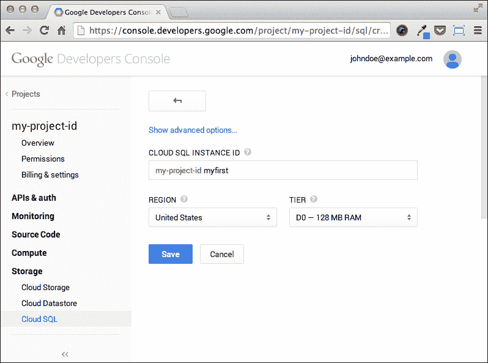
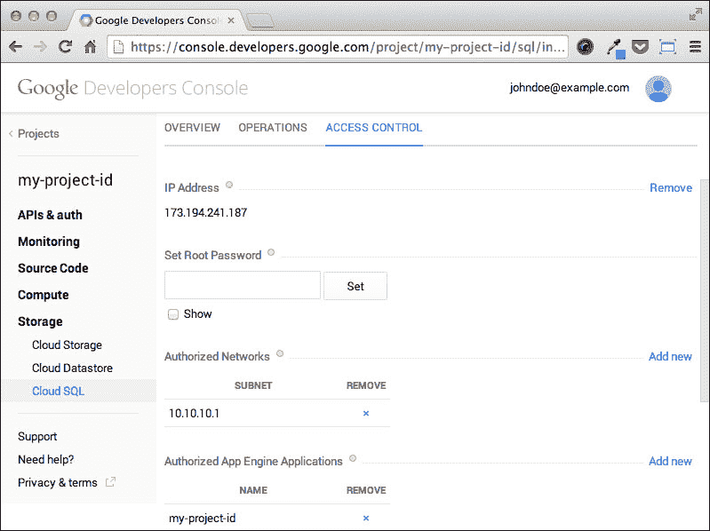

# 第五章。在 Google Cloud SQL 中存储数据

Google Cloud SQL 是一个位于 Google 云基础设施中的 MySQL 数据库服务器实例；它可以在不运行在 App Engine 平台的应用程序中从 Google Cloud Platform 外部使用。我们将学习两种使用方法：通过向我们的笔记应用程序添加代码以及创建一个在我们工作站上运行的独立脚本。

Google 为 Cloud SQL 提供两种计费计划，**套餐**和**按使用量计费**，不提供任何免费层。这意味着我们必须为执行本章中的代码付费，尽管选择按使用量计费计划并且仅为了通过本章而运行实例应该非常便宜。

在本章中，我们将涵盖以下主题：

+   如何创建、配置和运行一个 Cloud SQL 实例

+   如何管理正在运行的实例

+   如何从 App Engine 使用 Cloud SQL

+   如何从 App Engine 外部使用 Cloud SQL

# 创建一个 Cloud SQL 实例

我们将在本章中大量使用开发者控制台，我们首先创建一个 Cloud SQL 数据库的实例。正如我们从第一章，“入门”中已经知道的那样，即使我们从 App Engine 管理员控制台创建了我们的笔记应用程序，我们也应该在开发者控制台中有一个对应的项目。

### 注意

到目前为止，我们必须为我们的项目启用计费功能，以便从开发者控制台中访问所有与 Cloud-SQL 相关的功能。

从开发者控制台，一旦我们选择了项目，我们必须执行以下操作：

1.  点击左侧菜单中的**存储**部分下的**Cloud SQL**项。

1.  点击**创建实例**按钮。

1.  为数据库实例提供一个名称，例如，**myfirst**；实例的名称必须在项目内是唯一的，并且将始终与项目名称结合使用。

1.  选择**区域**，与 App Engine 应用程序的位置相同（最可能是**美国**）。

1.  为实例选择一个层级；为了本章的目的，我们可以安全地使用最便宜的层级，标记为**D0**。

1.  点击**保存**按钮。

以下截图显示了开发者控制台：



我们 Cloud SQL 实例的创建过程将立即开始。几分钟内，实例的状态将变为可运行状态，这意味着我们可以随时启动实例。在实例处于可运行状态时，我们不收取任何费用。

## 配置访问

在使用我们的数据库实例之前，我们应该配置访问权限和凭证，以控制谁可以执行到数据库的连接以及如何进行。存在两个级别的访问控制，一个在云平台级别，另一个在数据库级别。第一级授权客户端应用程序访问云 SQL 实例，无论是通过检查应用程序 ID 从 App Engine 基础设施，还是通过检查源 IP 地址从互联网上的远程节点。第二级是 MySQL 权限系统，负责用户的身份验证并将他们与数据库的权限相关联，例如执行`SELECT`、`INSERT`、`UPDATE`或`DELETE`操作。

如果我们在开发者控制台的项目设置中创建了云 SQL 实例，我们的 App Engine 应用程序已经授权连接到数据库。为了双重检查，在开发者控制台中我们必须：

1.  点击**云 SQL**菜单项。

1.  点击实例 ID。

1.  打开**访问控制**选项卡。

在**授权 App Engine 应用程序**标签下，我们可以查看我们的应用程序 ID 是否已列出。

当我们在该页面上时，我们可以为我们的本地机器设置访问权限；这是执行添加用户和数据库等管理任务所需的，可以使用任何 MySQL 客户端。我们首先需要为我们的实例分配一个 IP 地址，以便我们可以从云平台基础设施外部访问它；点击**添加新链接**，位于**IP 地址**标签旁边，并等待地址分配给我们的实例。

### 注意

当我们请求云 SQL 实例的 IP 地址时，我们应该意识到，在实例未运行时使用此地址的时间将会产生费用。为了降低成本，我们可以在不需要时立即释放 IP 地址。

当我们从我们的本地机器连接到云 SQL 实例时，显然我们处于 App Engine 基础设施之外，因此我们必须将我们的公网 IP 地址添加到允许从互联网访问的主机列表中。为此，我们需要执行以下操作：

1.  获取我们的公网 IP 地址；我们可以通过访问这个[`www.google.com/#q=my-ip`](https://www.google.com/#q=my-ip) URL 来使用 Google 进行此操作。

1.  点击**授权网络**标签旁边的**添加新链接**。

1.  使用我们的公网 IP 地址填写表格。

1.  点击**添加**按钮。

以下截图显示了开发者控制台：



从现在起，我们可以使用 MySQL 命令行客户端连接到我们的云 SQL 实例，例如从我们的笔记本电脑。对于访问控制系统的第一级，目前这已经足够了；我们可以继续配置第二级。

## 设置 root 密码

要完全控制我们的云 SQL 实例，第一步是为 MySQL 的`root`用户设置密码；为此，请执行以下操作：

1.  在开发者控制台中，我们转到**访问控制**选项卡。

1.  在**设置 Root 密码**部分下填写所需的密码。

1.  点击**设置**按钮。

在下一段中，我们将看到如何以`root`用户身份连接到实例，并执行在使用我们的 Notes 应用程序内部使用实例之前需要完成的行政任务。

# 使用 MySQL 控制台连接到实例

要与我们的 Cloud SQL 实例交互，我们将使用 MySQL 命令行客户端，该客户端适用于 App Engine 支持的所有平台，即使我们可以使用任何我们更熟悉的客户端。客户端通常与大多数 MySQL 服务器安装包一起提供；除了安装 MySQL 客户端工具外，建议安装 MySQL 并运行本地服务器，这样我们就可以在开发应用程序时使用它而不是生产实例。我们将在本章中很快回到这一点。

## 创建 notes 数据库

我们需要执行的第一项任务是创建 Cloud SQL 实例上的新数据库；我们将使用它来存储我们的 Notes 应用程序中的数据。要连接到实例，我们从命令行发出以下指令：

```py
mysql –host=<your instance IP> --user=root –password

```

在插入`root`用户的密码后，我们应该进入 MySQL 监控器，并看到以下类似的输出：

```py
Welcome to the MySQL monitor.  Commands end with ; or \g.
Your MySQL connection id is 1
Server version: 5.5.38 (Google)

Copyright (c) 2000, 2014, Oracle and/or its affiliates. All rights reserved.

Oracle is a registered trademark of Oracle Corporation and/or its
affiliates. Other names may be trademarks of their respective
owners.

Type 'help;' or '\h' for help. Type '\c' to clear the current input statement.

mysql>

```

如果我们成功管理到提示符，我们可以通过以下指令创建一个名为`notes`的数据库：

```py
mysql> CREATE DATABASE notes;
Query OK, 1 row affected (1.62 sec)

```

如果成功，命令的输出应该与前一个命令非常相似；我们现在可以继续创建一个专门的数据库用户，我们将使用它从我们的 Notes 应用程序进行连接。

## 创建专用用户

MySQL 安装中的`root`用户具有无限权限，避免使用`superuser`凭据连接到服务器是一种良好的安全实践。因此，我们创建一个专用用户，我们将使用它从我们的 Notes 应用程序进行连接，并且能够专门在`notes`数据库上操作。在继续之前，我们删除 Cloud SQL 实例默认提供的匿名 localhost 访问；这是一种良好的安全实践，避免了当 MySQL 检查用户权限时匿名用户会掩盖普通用户。从客户端，我们发出以下语句：

```py
mysql> DROP USER ''@localhost;
Query OK, 0 rows affected (0.17 sec)

```

然后我们继续创建一个普通用户：

```py
mysql> CREATE USER 'notes'@'%' IDENTIFIED BY 'notes_password';
Query OK, 0 rows affected (1.47 sec)

```

当然，我们应该选择一个更强的密码；无论如何，我们刚刚创建了一个名为`notes`的新用户，该用户将能够从任何主机进行连接（注意`%`字符是一个通配符，匹配任何主机）。为了方便，我们授予`notes`用户对`notes`数据库的任何权限：

```py
mysql> GRANT ALL PRIVILEGES ON notes.* TO 'notes'@'%';
Query OK, 0 rows affected (0.49 sec)

```

我们最终使用以下语句让 MySQL 服务器重新加载所有更新的权限：

```py
mysql> FLUSH PRIVILEGES;
Query OK, 0 rows affected (0.17 sec)

```

我们现在可以断开与服务器的连接，使用`\q`命令结束当前会话，并尝试使用`notes`用户重新连接：

```py
mysql> \q
Bye

mysql –host=<your instance IP> --user=notes –password

```

我们应该无错误地与 MySQL 监控器建立连接，然后我们可以检查我们是否真的可以访问`notes`数据库：

```py
mysql> use notes;
Database changed

```

我们现在可以继续创建用于存储 Notes 应用程序数据的表。

## 创建表

假设我们想要记录用户活动并将这些信息存储在数据库中，以便我们可以在以后用于，比如说，商业智能分析。使用 Datastore 来实现这个目的至少有两个原因是不好的：

+   我们可能会写入大量数据，因此我们无法使用太多索引，我们可能不得不避免使用分组实体。

+   我们将需要一个额外的 App Engine 应用程序来检索和分析数据，因为我们无法从平台外部访问 Datastore。

Cloud SQL 可以分别解决上述两个问题：

+   Cloud SQL 的写入限制比 Datastore 更宽松。

+   我们可以从外部应用程序连接到 Cloud SQL 实例并访问数据。

我们现在可以开始定义我们想要记录的数据；对于简单的使用分析，我们可以保存用户标识符、执行的操作类型以及此类操作的日期和时间。一旦通过 MySQL 客户端连接到服务器，我们就可以发出 `CREATE` 语句：

```py
CREATE TABLE 'notes'.'ops'
(
    'id'        INT NOT NULL auto_increment,
    'user_id'   VARCHAR(128) NOT NULL,
    'operation' VARCHAR(16) NOT NULL,
    'date'      DATETIME NOT NULL,
    PRIMARY KEY ('id')
);
```

如果查询成功，我们应该看到类似以下输出：

```py
Query OK, 0 rows affected (0.55 sec)

```

SQL 语句在 `notes` 数据库内部创建了一个名为 `ops` 的关系或表。该表有 4 个列：

+   **`id`** 列 This 包含自动递增的整数值，每次插入新行时都会增加；这是主键。

+   **`user_id`** 列：这包含 App Engine 提供的用户标识符，通常长度为 56 个字符；我们将其设置为 128 个字符的长度，以便在长度增加时有空间。

+   **`operation`** 列：这是为了存储记录的操作类型；16 个字符应该足够了。

+   **`date`** 列：这包含记录操作时的日期和时间。

# 从我们的应用程序连接到实例

要从我们的 Python 代码连接到 Cloud SQL 实例，我们使用 `MySQLdb` 包，这是一个实现了 Python 数据库 API 的 MySQL 驱动程序，如 **PEP 249** 文档所述。要安装该包，我们可以使用 `pip`；从命令行，我们发出以下命令：

```py
pip install MySQL-python

```

我们没有指定 `-t` 选项，就像在第三章中安装 GCS 客户端库时做的那样，*存储和处理用户数据*，因为 `MySQLdb` 包已包含在生产服务器的 App Engine Python 运行时环境中，我们不需要在部署期间上传它。相反，我们在 `app.yaml` 文件的 `libraries` 部分列出该包：

```py
libraries:
- name: webapp2
  version: "2.5.2"

- name: jinja2
  version: latest

- name: MySQLdb
  version: latest
```

一个简单的测试来检查数据库连接是否正确工作，包括检索和记录 Cloud SQL 版本号。我们在 `utils.py` 模块中添加了一个函数来获取数据库连接。我们首先需要在 `utils.py` 模块的顶部导入 `MySQLdb` 包以及 `os` 模块：

```py
import os
import MySQLdb
```

然后，我们添加以下函数：

```py
def get_cloudsql_db():
    db_ip = os.getenv('CLOUD_SQL_IP')
    db_user = os.getenv('CLOUD_SQL_USER')
    db_pass = os.getenv('CLOUD_SQL_PASS')
    return MySQLdb.connect(host=db_ip, db='notes',
                           user=db_user, passwd=db_pass)
```

该函数返回数据库连接。我们通过访问一些环境变量来检索所有信息以执行连接，这样它们就可以从我们的代码库中的任何位置轻松访问。要定义环境变量，我们只需在`app.yaml`文件的底部添加以下内容：

```py
env_variables:
  CLOUD_SQL_IP: '<your_instance_ip>'
  CLOUD_SQL_USER: 'notes'
  CLOUD_SQL_PASS: 'notes_password'
```

我们可以使用数据库连接来获取`main.py`模块中`MainHandler`类的`get()`方法中的 MySQL 版本。我们首先导入`get_cloudsql_db()`方法和`logging`模块：

```py
from utils import get_cloudsql_db
import logging
```

我们按照以下方式修改`get()`方法：

```py
def get(self):
    user = users.get_current_user()
    if user is not None:
        db = get_cloudsql_db()
        ver = db.get_server_info()
        logging.info("Cloud SQL version: {}".format(ver))
        logout_url = users.create_logout_url(self.request.uri)
        template_context = {
            'user': user.nickname(),
            'logout_url': logout_url,
        }
        self.response.out.write(
            self._render_template('main.html', template_context))
    else:
        login_url = users.create_login_url(self.request.uri)
        self.redirect(login_url)
```

我们可以使用本地开发服务器运行 Notes 应用程序，并用我们的浏览器访问主页；如果一切正常，我们应该在日志控制台（或者如果你从那里启动了`dev_appserver.py`服务器，在你的 shell 中）看到类似以下的消息：

```py
INFO 2014-09-28 12:40:41,796 main.py:109] Cloud SQL version: 5.5.38
```

到目前为止一切顺利，但如果我们尝试在 App Engine 上部署应用程序，结果将是一个包含以下错误信息的错误页面：

**OperationalError: (2004, "Can't create TCP/IP socket (-1)")**

这是因为我们正在尝试使用 TCP/IP 套接字访问 Cloud SQL 实例，如果我们从 App Engine 外部连接，这是完全正常的；但由于运行时环境网络限制，如果我们从 App Engine 应用程序连接，我们必须使用 Unix 套接字。

我们可以按照以下方式更改`utils.py`模块中的连接字符串：

```py
def get_cloudsql_db():
    db_user = os.getenv('CLOUD_SQL_USER')
    db_pass = os.getenv('CLOUD_SQL_PASS')
    instance_id = os.getenv('CLOUD_SQL_INSTANCE_ID')
    unix_socket = '/cloudsql/{}'.format(instance_id)
    return MySQLdb.connect(unix_socket=unix_socket, db='notes',
                           user=db_user, passwd=db_pass)
```

我们需要在`app.yaml`文件中定义一个名为`CLOUD_SQL_INSTANCE_ID`的附加环境变量：

```py
env_variables:
  CLOUD_SQL_IP: '<your_instance_ip>'
  CLOUD_SQL_USER: 'notes'
  CLOUD_SQL_PASS: 'notes_password'
  CLOUD_SQL_INSTANCE_ID: '<your_instance_id>'
```

如果我们尝试部署这个应用程序版本，我们会注意到它实际上在 App Engine 上运行正常，但在本地环境服务器上不再工作。为了避免每次从开发模式切换到生产模式时都修改`get_cloudsql_db()`函数中的代码，我们可以提供一个自动检测应用程序是本地运行还是运行在 App Engine 服务器上的方法。在`utils.py`模块中，我们添加以下代码：

```py
def on_appengine():
    return os.getenv('SERVER_SOFTWARE', '').startswith('Google App Engine')
```

这个函数简单地返回如果应用程序在 App Engine 上运行则返回`True`参数，否则返回`False`参数。我们可以以这种方式在`get_cloudsql_db()`函数中使用该函数：

```py
def get_cloudsql_db():
    db_user = os.getenv('CLOUD_SQL_USER')
    db_pass = os.getenv('CLOUD_SQL_PASS')

    if on_appengine():
        instance_id = os.getenv('CLOUD_SQL_INSTANCE_ID')
        sock = '/cloudsql/{}'.format(instance_id)
        return MySQLdb.connect(unix_socket=sock, db='notes',
                               user=db_user, passwd=db_pass)
    else:
        db_ip = os.getenv('CLOUD_SQL_IP')
        return MySQLdb.connect(host=db_ip, db='notes',
                               user=db_user, passwd=db_pass)
```

该函数将始终返回应用程序运行的环境的正确数据库连接。

# 加载数据和保存数据

现在我们已经知道如何从我们的 App Engine 应用程序连接到 Cloud SQL 实例，是时候学习如何从数据库中写入和读取数据了。我们已创建了一个名为`ops`的表，我们将使用它来存储有关用户操作的信息。我们将记录以下事件：

+   有用户创建了一个笔记

+   有用户添加了一个文件

+   有用户执行了收缩操作

我们必须为想要记录的操作类型分配一个文本代码。为此，我们可以使用一个简单的 Python 类，它作为一个枚举。在`utils.py`模块中，我们添加以下代码：

```py
class OpTypes(object):
    NOTE_CREATED = 'NCREATED'
    FILE_ADDED = 'FADDED'
    SHRINK_PERFORMED = 'SHRINKED'
```

我们稍后将看到如何使用它。现在，我们在`utils.py`模块中提供了一个`log_operation()`方法，我们将使用它来记录 Cloud SQL 数据库中的操作。我们将在 Notes 代码中调用此函数，传递实际执行操作的用户的用户名、适当的操作类型以及操作日期和时间。代码如下：

```py
def log_operation(user, operation_type, opdate):
    db = get_cloudsql_db()
    cursor = db.cursor()
    cursor.execute('INSERT INTO ops (user_id, operation, date)'
                   ' VALUES (%s, %s, %s)',
                   (user.user_id(), operation_type, opdate))
    db.commit()
    db.close()
```

我们首先检索一个有效的数据库连接，然后通过在连接对象上调用`cursor()`方法来获取一个游标对象。通过在游标对象上调用`execute()`方法，我们可以发出我们传递为参数的字符串中包含的 SQL 语句。在这种情况下，我们在`ops`表中插入一个新行，持久化用户标识符、对应操作类型的字符串以及操作执行的日期和时间。最后，我们提交事务并关闭连接。

我们可以在`main.py`模块中的代码的多个位置调用`log_operation()`方法：

+   在`MainHandler`类的`post()`方法中：

    ```py
    if file_name and file_content:
        content_t = mimetypes.guess_type(file_name)[0]
        real_path = os.path.join('/', bucket_name, user.user_id(), file_name)

        with cloudstorage.open(real_path, 'w', content_type=content_t,
                               options={'x-goog-acl': 'public-read'}) as f:
            f.write(file_content.read())
        log_operation(user, OpTypes.FILE_ADDED,
                      datetime.datetime.now())
    self._create_note(user, file_name, real_path)
    log_operation(user, OpTypes.NOTE_CREATED,
                  datetime.datetime.now())
    ```

+   在`ShrinkHandler`类的`get()`方法中：

    ```py
    taskqueue.add(url='/shrink',
                  params={'user_email': user.email()})
    log_operation(user, OpTypes.SHRINK_PERFORMED,
                  datetime.datetime.now())
    self.response.write('Task added to the queue.')
    ```

+   在`CreateNoteHandler`类的`receive()`方法中：

    ```py
    attachments = getattr(mail_message, 'attachments', None)

    self._create_note(user, title, content, attachments)
    log_operation(user, OpTypes.NOTE_CREATED,
                  datetime.datetime.now())
    ```

注意，通过将日期和时间传递给`log_operation()`方法，我们可以记录用户执行操作的实际时间，而不是函数代码执行的时间；如果我们需要准时但函数被添加到任务队列并在稍后执行，这可能很有用。

从现在起，当有人使用我们的 Notes 应用程序时，我们将收集有关该用户的用法信息。我们可以从 Notes 应用程序本身或另一个有权访问同一 Cloud SQL 实例的应用程序中访问这些信息；否则，我们可以使用一个在我们在工作站或另一个远程服务器上运行的纯 Python 应用程序来访问和处理所需的数据。例如，我们在 App Engine 项目`root`之外创建一个名为`analyze.py`的应用程序（这样我们就可以在部署时避免上传文件）。代码如下：

```py
# -*- coding: utf-8 -*-
import sys
import MySQLdb

CLOUD_SQL_IP = '<your_instance_ip>'
CLOUD_SQL_USER = 'notes'
CLOUD_SQL_PASS = 'notes_password'

def main():
    db = MySQLdb.connect(host=CLOUD_SQL_IP, db='notes',
                         user=CLOUD_SQL_USER,
                         passwd=CLOUD_SQL_PASS)
    cursor = db.cursor()

    cursor.execute('SELECT COUNT(DISTINCT user_id) FROM ops '
                   'WHERE date > (DATE_SUB(CURDATE(), '
                   'INTERVAL 1 MONTH));')
    users = cursor.fetchone()[0]
    sys.stdout.write("Active users: {}\n".format(users))

    cursor.execute('SELECT COUNT(*) FROM ops WHERE date > '
                   '(DATE_SUB(CURDATE(), INTERVAL 1 HOUR))')
    ops = cursor.fetchone()[0]
    sys.stdout.write("Ops in the last hour: {}\n".format(ops))

    cursor.execute('SELECT COUNT(*) FROM ops WHERE '
                   'operation = "SHRINKED"')
    ops = cursor.fetchone()[0]
    sys.stdout.write("Total shrinking ops: {}\n".format(ops))

    return 0

if __name__ == '__main__':
    sys.exit(main())
```

我们可以使用以下命令行在任何时候从命令行运行脚本：

```py
python analyze.py

```

回到代码；在`main()`方法中，我们首先通过实例的公网 IP 使用 TCP/IP 套接字连接到数据库。然后，我们获取一个游标对象并执行第一个查询，该查询统计我们认为活跃的用户数量，即在过去一个月内至少执行过一种操作的用户。由于这是一个计数查询，我们期望只有一个结果行。在这种情况下，我们可以调用游标对象的`fetchone()`方法；该方法返回一个包含一个值的元组，我们通过索引获取该值并将其存储在`users`变量中，我们在标准输出上打印这个变量。使用相同的策略，我们从标准输出检索并打印过去一小时全局执行的操作数量以及总压缩操作数量。

这只是一个简单的例子，但它展示了如何容易地从 Cloud SQL 实例中提取数据来为我们的 Web 应用程序获取使用度量，使用运行在 App Engine 外部的任何 Python 程序。

# 使用本地 MySQL 安装进行开发

有几个原因说明为什么我们不想在本地开发服务器上运行应用程序时与 Cloud SQL 实例一起工作。我们可能会注意到严重的减速，因为每次我们连接到 Cloud SQL 实例时，我们都会与一个可能非常遥远的远程主机进行套接字连接。此外，无论我们选择哪个 Cloud SQL 层，我们都会为使用该服务付费，而我们可能不想在本地开发服务器上进行实验时使用它。

幸运的是，当我们的代码与之交互时，Cloud SQL 实例最终不过是一个 MySQL 数据库。因此，我们可以安装一个本地的 MySQL 服务器实例并与之工作。

我们安装并启动本地服务器，并执行我们在 Cloud SQL 实例上所做的相同操作：

1.  使用 MySQL 客户端进行连接。

1.  创建`notes`数据库。

1.  创建`notes`用户并授予他们在`notes`数据库上的权限。

1.  重新加载数据库权限。

1.  创建`ops`表。

到目前为止，我们只需更改我们的`app.yaml`文件中的`CLOUD_SQL_IP`环境变量，使其指向`localhost`变量：

```py
env_variables:
  CLOUD_SQL_IP: 'localhost'
  CLOUD_SQL_USER: 'notes'
  CLOUD_SQL_PASS: 'notes_password'
```

我们现在可以开始使用本地实例，避免网络延迟和成本。

# 摘要

在本章中，我们将使用由 Google Cloud Platform 提供的可扩展数据库服务 Cloud SQL。Cloud SQL 不仅仅是一个 MySQL 实例；它是一个灵活且可扩展的关系型数据库服务器，我们可以用它来存储和检索来自我们的 App Engine 应用程序以及外部服务和应用程序的数据。

即使当我们在高流量 Web 应用程序中处理大量数据时，Cloud Datastore 是首选解决方案，但在本章中，你了解到拥有一个关系型数据库来存储一些数据是多么方便，而无需触及 Datastore 对写操作施加的限制。能够从 App Engine 外部访问这些数据是一个很大的优势，我们已经看到了一个简单而有效的用例，而这使用 Datastore 是无法实现的。

在下一章中，我们将向我们的笔记应用程序添加新功能；我们将使用 Channel API 使应用程序实时，将数据从服务器推送到连接的客户端。
